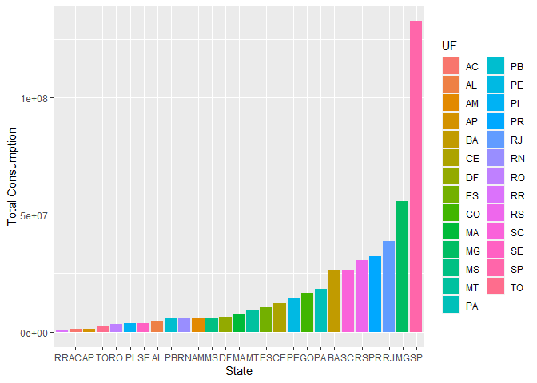

## Reading the libraries necessary to the project


```r
source('libs.R')
```

## Reading Power Consumption Data


```r
data <- read.csv('./anuario-estatistico-de-energia-eletrica/dados-anuario.csv', sep=';')
```

## Tidying data

### Converting char data to float


```r
data[, c('Consumidores')] <- data[, c('Consumidores')] %>% 
  str_replace_all(',(?=\\d)','.') %>% as.double
data[, c('Consumo')] <- data[, c('Consumo')] %>% 
  str_replace_all(',(?=\\d)','.') %>% as.double
```

### Converting char data to Date


```r
data$Data <- data$Data %>%
  as.character %>%
  strptime('%Y%m%d') %>%
  as.Date()
```


#### Grouping date


```r
data <- data %>% mutate(
  year = year(Data),
  year_month = yearmonth(Data),
  year_quarter = yearquarter(Data)
)
```


#### Creating a new Region Column


```r
data$region <- data$UF %>%
  str_replace_all('(AL|BA|PB|PE|PI|RN|SE|CE|MA)', 'NE') %>% 
  str_replace_all('(ES|SP|MG|RJ)', 'SE') %>% 
  str_replace_all('(TO|AC|AM|AP|RO|RR|PA)', 'N') %>% 
  str_replace_all('(MT|MS|DF|GO)', 'CO') %>% 
  str_replace_all('(PR|RS|SC)', 'S')
```


### Converting char data to factor


```r
data %>% map(class)->columns_classes
data[columns_classes[columns_classes=='character'] %>% names] <- data[columns_classes[columns_classes=='character'] %>% names] %>% as_factor()

     
# data[columns_classes[columns_classes=='character'] %>% names] %>% as_factor()
     

data %>% mutate(
  UF = as.factor(UF),
  Sistema=as.factor(Sistema),
  TipoConsumidor = as.factor(TipoConsumidor),
  SetorN1 = as.factor(SetorN1),
  SetorN2 = as.factor(SetorN2),
  TensaoN1 = as.factor(TensaoN1),
  TensaoN2 = as.factor(TensaoN2),
  TensaoN3 = as.factor(TensaoN3),
  FaixaDeConsumoN1 = as.factor(FaixaDeConsumoN1),
  FaixaDeConsumoN2 = as.factor(FaixaDeConsumoN2),) ->data
```

## Data overview


```r
data %>% select(-year_month, -year_quarter)  %>% summary
```

```
##       Data            TipoConsumidor                    Sistema     
##  Min.   :2013-01-01   Cativo:147375   Nordeste              :42850  
##  1st Qu.:2014-10-01   Livre : 16302   Norte Interligado     :19818  
##  Median :2016-08-01                   Sistemas Isolados     :21020  
##  Mean   :2016-07-13                   Sudeste / Centro-Oeste:58499  
##  3rd Qu.:2018-05-01                   Sul                   :21490  
##  Max.   :2019-12-01                                                 
##                                                                     
##        UF                    SetorN1     
##  PA     :  9750   Comercial      :42297  
##  SP     :  8603   Residencial    :35342  
##  PE     :  8427   Rural          :27607  
##  PR     :  8323   Poder Público  :20236  
##  BA     :  7917   Industrial     :17481  
##  RJ     :  7887   Serviço Público:11098  
##  (Other):112770   (Other)        : 9616  
##                                SetorN2                  TensaoN1    
##  Convencional (Excepto Baixa Renda):24341   A - Alta Tensão :79565  
##  TOTAL                             :21273   B - Baixa Tensão:84112  
##  Baixa Renda                       :11001                           
##  Comercial N2                      :10912                           
##  Água, Esgoto e Saneamento         : 8678                           
##  Outros Serviços e Atividades      : 7309                           
##  (Other)                           :80163                           
##               TensaoN2                            TensaoN3     
##  TOTAL            :82159   B4A Rede de Distribuição   :  2464  
##  A-4 - 2,3 a 25 kV:43816   B4B Bulbo da Lâmpada       :  1229  
##  A-3a - 30 a 44 kV:13545   Nível de IP Acima do Padrão:    99  
##  A-3 - 69 kV      : 8952   TOTAL                      :159885  
##  A-2 - 88 a 138 kV: 5706                                       
##  B-4              : 3792                                       
##  (Other)          : 5707                                       
##       FaixaDeConsumoN1       FaixaDeConsumoN2     Consumo       
##  Alta Tensão  :  1839   Não aplicável:128335   Min.   :-209308  
##  Baixa Renda  : 11001   101-200 kWh  :  5608   1st Qu.:    268  
##  Convencional : 22502   31-100 kWh   :  5561   Median :   2488  
##  Não aplicável:128335   0-30 kWh     :  5410   Mean   :  19995  
##                         > 1000 kWh   :  2831   3rd Qu.:  12131  
##                         201-300 kWh  :  2821   Max.   :1805455  
##                         (Other)      : 13111                    
##   Consumidores          year         region         
##  Min.   :   -288   Min.   :2013   Length:163677     
##  1st Qu.:     10   1st Qu.:2014   Class :character  
##  Median :    163   Median :2016   Mode  :character  
##  Mean   :  40815   Mean   :2016                     
##  3rd Qu.:   5317   3rd Qu.:2018                     
##  Max.   :6558604   Max.   :2019                     
## 
```


## Exploring Data

### Grouping power consumption by state


```r
data %>% 
  group_by(UF) %>% 
  summarise(total = sum(Consumo)) -> consumo_uf

consumo_uf
```

```
## # A tibble: 27 × 2
##    UF         total
##    <fct>      <dbl>
##  1 AC      6793803.
##  2 AL     31268557.
##  3 AM     42512102.
##  4 AP      7295073.
##  5 BA    171424584.
##  6 CE     78753004.
##  7 DF     44622504.
##  8 ES     72360784.
##  9 GO    102270151.
## 10 MA     55072237.
## # … with 17 more rows
```


### Grouping consumption by month


```r
montlhy_consumption <- data %>% group_by(year_month) %>% 
  summarise(total=sum(Consumo))

montlhy_consumption
```

```
## # A tibble: 84 × 2
##    year_month     total
##         <mth>     <dbl>
##  1   2013 Jan 38270535.
##  2   2013 Feb 37900840.
##  3   2013 Mar 38336775.
##  4   2013 Apr 38540012.
##  5   2013 May 38228946.
##  6   2013 Jun 37515629.
##  7   2013 Jul 37582253.
##  8   2013 Aug 38496100.
##  9   2013 Sep 38385760.
## 10   2013 Oct 39272603.
## # … with 74 more rows
```


### Grouping consumption by quarter


  

```r
quartely_consumption <- data %>% group_by(year_quarter) %>% 
  summarize(total=sum(Consumo))
quartely_consumption
```

```
## # A tibble: 28 × 2
##    year_quarter      total
##           <qtr>      <dbl>
##  1      2013 Q1 114508149.
##  2      2013 Q2 114284587.
##  3      2013 Q3 114464113.
##  4      2013 Q4 118515331.
##  5      2014 Q1 121212073 
##  6      2014 Q2 115469437.
##  7      2014 Q3 114300225 
##  8      2014 Q4 119907290.
##  9      2015 Q1 120785073.
## 10      2015 Q2 114591229.
## # … with 18 more rows
```

### Grouping consumption by year

  

```r
yearly_consumption <- data %>% group_by(year) %>% 
  summarize(total=sum(Consumo))
yearly_consumption
```

```
## # A tibble: 7 × 2
##    year      total
##   <dbl>      <dbl>
## 1  2013 461772181.
## 2  2014 470889025.
## 3  2015 464012684.
## 4  2016 459841563.
## 5  2017 462170056.
## 6  2018 472797965.
## 7  2019 481233487.
```
### Grouping by year_month and sector


```r
data %>% group_by(year_month,SetorN1, SetorN2 ) %>% 
  summarise(total=sum(Consumo)) %>%
  ungroup()  -> data_by_sector
```

```
## `summarise()` has grouped output by 'year_month', 'SetorN1'. You can override
## using the `.groups` argument.
```


## Reading Geographical data


```r
brazil_uf <- readOGR(dsn='BR', layer='BR_UF_2021')
```

```
## Warning in OGRSpatialRef(dsn, layer, morphFromESRI =
## morphFromESRI, dumpSRS = dumpSRS, : Discarded datum
## Sistema_de_Referencia_Geocentrico_para_las_AmericaS_2000 in Proj4 definition:
## +proj=longlat +ellps=GRS80 +towgs84=0,0,0,0,0,0,0 +no_defs
```

```
## OGR data source with driver: ESRI Shapefile 
## Source: "C:\Users\ViniciusJokubauskas\Desktop\New folder\machine_learning_study\MBA_USP\TCC\BR", layer: "BR_UF_2021"
## with 27 features
## It has 4 fields
```

```r
brazil_uf@data %>% left_join(consumo_uf, by=c('SIGLA'='UF')) -> brazil_uf@data


brazil_uf %>% tm_shape() +
 tm_polygons('total',
             style='quantile',
             palette='viridis')
```

<!-- -->


## TIME SERIES


### Time series by Sector


```r
data %>% 
  select(year_month, SetorN1, Consumo) %>% 
  group_by(year_month, SetorN1) %>% 
  summarise(total=sum(Consumo)) %>% 
  as_tsibble(key=SetorN1, index = year_month) -> sector_ts
```

```
## `summarise()` has grouped output by 'year_month'. You can override using the
## `.groups` argument.
```

```r
sector_ts %>% autoplot() %>% ggplotly()
```

```
## Plot variable not specified, automatically selected `.vars = total`
## `mutate_if()` ignored the following grouping variables:
```

```{=html}
<div id="htmlwidget-fa1cc9fa7e35ed35575f" style="width:672px;height:480px;" class="plotly html-widget"></div>
<script type="application/json" data-for="htmlwidget-fa1cc9fa7e35ed35575f">{"x":{"data":[{"x":[15706,15737,15765,15796,15826,15857,15887,15918,15949,15979,16010,16040,16071,16102,16130,16161,16191,16222,16252,16283,16314,16344,16375,16405,16436,16467,16495,16526,16556,16587,16617,16648,16679,16709,16740,16770,16801,16832,16861,16892,16922,16953,16983,17014,17045,17075,17106,17136,17167,17198,17226,17257,17287,17318,17348,17379,17410,17440,17471,17501,17532,17563,17591,17622,17652,17683,17713,17744,17775,17805,17836,17866,17897,17928,17956,17987,18017,18048,18078,18109,18140,18170,18201,18231],"y":[7165121,6992976,7105119,7004933,6788481,6551026,6411270,6559031,6717595,7028725,7336633,7525839,7677325,8131407,7675997,7516033,7235506,6796144,6708265,6923494,7119967,7548027,7902400,7785756,8000977.855,8019213,7839687,7832837,7294748,7004952,6773299,7011846,7093576,7563812,7718666,7781378,7753958,7706160,7784017,8036092,7361904,6829949,6667353,6728087,6977732,7009837,7311014,7498736,7719192,7629728,7911215,7641807,7195620,6956111,6400764,6366751,6744675,6907913,7093927,7289172,7595699.693,7556452.302,7850985.085,7830742.115,7402520.011,6870355.766,6732787.865,6880355.4,7015114.78,7413707.961,7557112.52,7737264.219,8106333.589,8193432.946,8038069.666,7767016.306,7752881.834,7119586.444,6893602.028,6920913.932,7221420.045,7727905.718,8067913.728,8020875.194],"text":["year_month: 2013 Jan<br />total:  7165121.0<br />interaction(SetorN1, sep = \"/\"): Comercial","year_month: 2013 Feb<br />total:  6992976.0<br />interaction(SetorN1, sep = \"/\"): Comercial","year_month: 2013 Mar<br />total:  7105119.0<br />interaction(SetorN1, sep = \"/\"): Comercial","year_month: 2013 Apr<br />total:  7004933.0<br />interaction(SetorN1, sep = \"/\"): Comercial","year_month: 2013 May<br />total:  6788481.0<br />interaction(SetorN1, sep = \"/\"): Comercial","year_month: 2013 Jun<br />total:  6551026.0<br />interaction(SetorN1, sep = \"/\"): Comercial","year_month: 2013 Jul<br />total:  6411270.0<br />interaction(SetorN1, sep = \"/\"): Comercial","year_month: 2013 Aug<br />total:  6559031.0<br />interaction(SetorN1, sep = \"/\"): Comercial","year_month: 2013 Sep<br />total:  6717595.0<br />interaction(SetorN1, sep = \"/\"): Comercial","year_month: 2013 Oct<br />total:  7028725.0<br />interaction(SetorN1, sep = \"/\"): Comercial","year_month: 2013 Nov<br />total:  7336633.0<br />interaction(SetorN1, sep = \"/\"): Comercial","year_month: 2013 Dec<br />total:  7525839.0<br />interaction(SetorN1, sep = \"/\"): Comercial","year_month: 2014 Jan<br />total:  7677325.0<br />interaction(SetorN1, sep = \"/\"): Comercial","year_month: 2014 Feb<br />total:  8131407.0<br />interaction(SetorN1, sep = \"/\"): Comercial","year_month: 2014 Mar<br />total:  7675997.0<br />interaction(SetorN1, sep = \"/\"): Comercial","year_month: 2014 Apr<br />total:  7516033.0<br />interaction(SetorN1, sep = \"/\"): Comercial","year_month: 2014 May<br />total:  7235506.0<br />interaction(SetorN1, sep = \"/\"): Comercial","year_month: 2014 Jun<br />total:  6796144.0<br />interaction(SetorN1, sep = \"/\"): Comercial","year_month: 2014 Jul<br />total:  6708265.0<br />interaction(SetorN1, sep = \"/\"): Comercial","year_month: 2014 Aug<br />total:  6923494.0<br />interaction(SetorN1, sep = \"/\"): Comercial","year_month: 2014 Sep<br />total:  7119967.0<br />interaction(SetorN1, sep = \"/\"): Comercial","year_month: 2014 Oct<br />total:  7548027.0<br />interaction(SetorN1, sep = \"/\"): Comercial","year_month: 2014 Nov<br />total:  7902400.0<br />interaction(SetorN1, sep = \"/\"): Comercial","year_month: 2014 Dec<br />total:  7785756.0<br />interaction(SetorN1, sep = \"/\"): Comercial","year_month: 2015 Jan<br />total:  8000977.9<br />interaction(SetorN1, sep = \"/\"): Comercial","year_month: 2015 Feb<br />total:  8019213.0<br />interaction(SetorN1, sep = \"/\"): Comercial","year_month: 2015 Mar<br />total:  7839687.0<br />interaction(SetorN1, sep = \"/\"): Comercial","year_month: 2015 Apr<br />total:  7832837.0<br />interaction(SetorN1, sep = \"/\"): Comercial","year_month: 2015 May<br />total:  7294748.0<br />interaction(SetorN1, sep = \"/\"): Comercial","year_month: 2015 Jun<br />total:  7004952.0<br />interaction(SetorN1, sep = \"/\"): Comercial","year_month: 2015 Jul<br />total:  6773299.0<br />interaction(SetorN1, sep = \"/\"): Comercial","year_month: 2015 Aug<br />total:  7011846.0<br />interaction(SetorN1, sep = \"/\"): Comercial","year_month: 2015 Sep<br />total:  7093576.0<br />interaction(SetorN1, sep = \"/\"): Comercial","year_month: 2015 Oct<br />total:  7563812.0<br />interaction(SetorN1, sep = \"/\"): Comercial","year_month: 2015 Nov<br />total:  7718666.0<br />interaction(SetorN1, sep = \"/\"): Comercial","year_month: 2015 Dec<br />total:  7781378.0<br />interaction(SetorN1, sep = \"/\"): Comercial","year_month: 2016 Jan<br />total:  7753958.0<br />interaction(SetorN1, sep = \"/\"): Comercial","year_month: 2016 Feb<br />total:  7706160.0<br />interaction(SetorN1, sep = \"/\"): Comercial","year_month: 2016 Mar<br />total:  7784017.0<br />interaction(SetorN1, sep = \"/\"): Comercial","year_month: 2016 Apr<br />total:  8036092.0<br />interaction(SetorN1, sep = \"/\"): Comercial","year_month: 2016 May<br />total:  7361904.0<br />interaction(SetorN1, sep = \"/\"): Comercial","year_month: 2016 Jun<br />total:  6829949.0<br />interaction(SetorN1, sep = \"/\"): Comercial","year_month: 2016 Jul<br />total:  6667353.0<br />interaction(SetorN1, sep = \"/\"): Comercial","year_month: 2016 Aug<br />total:  6728087.0<br />interaction(SetorN1, sep = \"/\"): Comercial","year_month: 2016 Sep<br />total:  6977732.0<br />interaction(SetorN1, sep = \"/\"): Comercial","year_month: 2016 Oct<br />total:  7009837.0<br />interaction(SetorN1, sep = \"/\"): Comercial","year_month: 2016 Nov<br />total:  7311014.0<br />interaction(SetorN1, sep = \"/\"): Comercial","year_month: 2016 Dec<br />total:  7498736.0<br />interaction(SetorN1, sep = \"/\"): Comercial","year_month: 2017 Jan<br />total:  7719192.0<br />interaction(SetorN1, sep = \"/\"): Comercial","year_month: 2017 Feb<br />total:  7629728.0<br />interaction(SetorN1, sep = \"/\"): Comercial","year_month: 2017 Mar<br />total:  7911215.0<br />interaction(SetorN1, sep = \"/\"): Comercial","year_month: 2017 Apr<br />total:  7641807.0<br />interaction(SetorN1, sep = \"/\"): Comercial","year_month: 2017 May<br />total:  7195620.0<br />interaction(SetorN1, sep = \"/\"): Comercial","year_month: 2017 Jun<br />total:  6956111.0<br />interaction(SetorN1, sep = \"/\"): Comercial","year_month: 2017 Jul<br />total:  6400764.0<br />interaction(SetorN1, sep = \"/\"): Comercial","year_month: 2017 Aug<br />total:  6366751.0<br />interaction(SetorN1, sep = \"/\"): Comercial","year_month: 2017 Sep<br />total:  6744675.0<br />interaction(SetorN1, sep = \"/\"): Comercial","year_month: 2017 Oct<br />total:  6907913.0<br />interaction(SetorN1, sep = \"/\"): Comercial","year_month: 2017 Nov<br />total:  7093927.0<br />interaction(SetorN1, sep = \"/\"): Comercial","year_month: 2017 Dec<br />total:  7289172.0<br />interaction(SetorN1, sep = \"/\"): Comercial","year_month: 2018 Jan<br />total:  7595699.7<br />interaction(SetorN1, sep = \"/\"): Comercial","year_month: 2018 Feb<br />total:  7556452.3<br />interaction(SetorN1, sep = \"/\"): Comercial","year_month: 2018 Mar<br />total:  7850985.1<br />interaction(SetorN1, sep = \"/\"): Comercial","year_month: 2018 Apr<br />total:  7830742.1<br />interaction(SetorN1, sep = \"/\"): Comercial","year_month: 2018 May<br />total:  7402520.0<br />interaction(SetorN1, sep = \"/\"): Comercial","year_month: 2018 Jun<br />total:  6870355.8<br />interaction(SetorN1, sep = \"/\"): Comercial","year_month: 2018 Jul<br />total:  6732787.9<br />interaction(SetorN1, sep = \"/\"): Comercial","year_month: 2018 Aug<br />total:  6880355.4<br />interaction(SetorN1, sep = \"/\"): Comercial","year_month: 2018 Sep<br />total:  7015114.8<br />interaction(SetorN1, sep = \"/\"): Comercial","year_month: 2018 Oct<br />total:  7413708.0<br />interaction(SetorN1, sep = \"/\"): Comercial","year_month: 2018 Nov<br />total:  7557112.5<br />interaction(SetorN1, sep = \"/\"): Comercial","year_month: 2018 Dec<br />total:  7737264.2<br />interaction(SetorN1, sep = \"/\"): Comercial","year_month: 2019 Jan<br />total:  8106333.6<br />interaction(SetorN1, sep = \"/\"): Comercial","year_month: 2019 Feb<br />total:  8193432.9<br />interaction(SetorN1, sep = \"/\"): Comercial","year_month: 2019 Mar<br />total:  8038069.7<br />interaction(SetorN1, sep = \"/\"): Comercial","year_month: 2019 Apr<br />total:  7767016.3<br />interaction(SetorN1, sep = \"/\"): Comercial","year_month: 2019 May<br />total:  7752881.8<br />interaction(SetorN1, sep = \"/\"): Comercial","year_month: 2019 Jun<br />total:  7119586.4<br />interaction(SetorN1, sep = \"/\"): Comercial","year_month: 2019 Jul<br />total:  6893602.0<br />interaction(SetorN1, sep = \"/\"): Comercial","year_month: 2019 Aug<br />total:  6920913.9<br />interaction(SetorN1, sep = \"/\"): Comercial","year_month: 2019 Sep<br />total:  7221420.0<br />interaction(SetorN1, sep = \"/\"): Comercial","year_month: 2019 Oct<br />total:  7727905.7<br />interaction(SetorN1, sep = \"/\"): Comercial","year_month: 2019 Nov<br />total:  8067913.7<br />interaction(SetorN1, sep = \"/\"): Comercial","year_month: 2019 Dec<br />total:  8020875.2<br />interaction(SetorN1, sep = \"/\"): Comercial"],"type":"scatter","mode":"lines","line":{"width":1.88976377952756,"color":"rgba(248,118,109,1)","dash":"solid"},"hoveron":"points","name":"Comercial","legendgroup":"Comercial","showlegend":true,"xaxis":"x","yaxis":"y","hoverinfo":"text","frame":null},{"x":[15706,15737,15765,15796,15826,15857,15887,15918,15949,15979,16010,16040,16071,16102,16130,16161,16191,16222,16252,16283,16314,16344,16375,16405,16436,16467,16495,16526,16556,16587,16617,16648,16679,16709,16740,16770,16801,16832,16861,16892,16922,16953,16983,17014,17045,17075,17106,17136,17167,17198,17226,17257,17287,17318,17348,17379,17410,17440,17471,17501,17532,17563,17591,17622,17652,17683,17713,17744,17775,17805,17836,17866,17897,17928,17956,17987,18017,18048,18078,18109,18140,18170,18201,18231],"y":[297397.738,268105.72,299379.551,287315.428,245282.566,276103.008,295400.027,277059.262,264418.164,283522.377,288798.54,286968.244,305448,282556,293661,270202,277518,266973,239419,227490,277150,285288,272755,266481,303918.527,268894,298951,296199,286186,255670,280089,288945,267526,229490,249851,278168,300984,299298,320313,281450,255311,251868,230115,250449,244428,246796,237033,276360,273494,241927.507,266409.289,253895.787,250251.745,235078.3,229268.37,233365.6,212892,217312,227368,230224,291462.548,258295.855,269089.264,277128.427,277347.95,257422.013,254878.167,273395.992,267681.682,281918.643,255661.689,266887.623,262695.513,263616.777,280659.318,266157.642,252394.644,273059.179,268703.522,268345.845,276660.793,285025.817,275766.595,276417.79],"text":["year_month: 2013 Jan<br />total:   297397.7<br />interaction(SetorN1, sep = \"/\"): Consumo Próprio","year_month: 2013 Feb<br />total:   268105.7<br />interaction(SetorN1, sep = \"/\"): Consumo Próprio","year_month: 2013 Mar<br />total:   299379.6<br />interaction(SetorN1, sep = \"/\"): Consumo Próprio","year_month: 2013 Apr<br />total:   287315.4<br />interaction(SetorN1, sep = \"/\"): Consumo Próprio","year_month: 2013 May<br />total:   245282.6<br />interaction(SetorN1, sep = \"/\"): Consumo Próprio","year_month: 2013 Jun<br />total:   276103.0<br />interaction(SetorN1, sep = \"/\"): Consumo Próprio","year_month: 2013 Jul<br />total:   295400.0<br />interaction(SetorN1, sep = \"/\"): Consumo Próprio","year_month: 2013 Aug<br />total:   277059.3<br />interaction(SetorN1, sep = \"/\"): Consumo Próprio","year_month: 2013 Sep<br />total:   264418.2<br />interaction(SetorN1, sep = \"/\"): Consumo Próprio","year_month: 2013 Oct<br />total:   283522.4<br />interaction(SetorN1, sep = \"/\"): Consumo Próprio","year_month: 2013 Nov<br />total:   288798.5<br />interaction(SetorN1, sep = \"/\"): Consumo Próprio","year_month: 2013 Dec<br />total:   286968.2<br />interaction(SetorN1, sep = \"/\"): Consumo Próprio","year_month: 2014 Jan<br />total:   305448.0<br />interaction(SetorN1, sep = \"/\"): Consumo Próprio","year_month: 2014 Feb<br />total:   282556.0<br />interaction(SetorN1, sep = \"/\"): Consumo Próprio","year_month: 2014 Mar<br />total:   293661.0<br />interaction(SetorN1, sep = \"/\"): Consumo Próprio","year_month: 2014 Apr<br />total:   270202.0<br />interaction(SetorN1, sep = \"/\"): Consumo Próprio","year_month: 2014 May<br />total:   277518.0<br />interaction(SetorN1, sep = \"/\"): Consumo Próprio","year_month: 2014 Jun<br />total:   266973.0<br />interaction(SetorN1, sep = \"/\"): Consumo Próprio","year_month: 2014 Jul<br />total:   239419.0<br />interaction(SetorN1, sep = \"/\"): Consumo Próprio","year_month: 2014 Aug<br />total:   227490.0<br />interaction(SetorN1, sep = \"/\"): Consumo Próprio","year_month: 2014 Sep<br />total:   277150.0<br />interaction(SetorN1, sep = \"/\"): Consumo Próprio","year_month: 2014 Oct<br />total:   285288.0<br />interaction(SetorN1, sep = \"/\"): Consumo Próprio","year_month: 2014 Nov<br />total:   272755.0<br />interaction(SetorN1, sep = \"/\"): Consumo Próprio","year_month: 2014 Dec<br />total:   266481.0<br />interaction(SetorN1, sep = \"/\"): Consumo Próprio","year_month: 2015 Jan<br />total:   303918.5<br />interaction(SetorN1, sep = \"/\"): Consumo Próprio","year_month: 2015 Feb<br />total:   268894.0<br />interaction(SetorN1, sep = \"/\"): Consumo Próprio","year_month: 2015 Mar<br />total:   298951.0<br />interaction(SetorN1, sep = \"/\"): Consumo Próprio","year_month: 2015 Apr<br />total:   296199.0<br />interaction(SetorN1, sep = \"/\"): Consumo Próprio","year_month: 2015 May<br />total:   286186.0<br />interaction(SetorN1, sep = \"/\"): Consumo Próprio","year_month: 2015 Jun<br />total:   255670.0<br />interaction(SetorN1, sep = \"/\"): Consumo Próprio","year_month: 2015 Jul<br />total:   280089.0<br />interaction(SetorN1, sep = \"/\"): Consumo Próprio","year_month: 2015 Aug<br />total:   288945.0<br />interaction(SetorN1, sep = \"/\"): Consumo Próprio","year_month: 2015 Sep<br />total:   267526.0<br />interaction(SetorN1, sep = \"/\"): Consumo Próprio","year_month: 2015 Oct<br />total:   229490.0<br />interaction(SetorN1, sep = \"/\"): Consumo Próprio","year_month: 2015 Nov<br />total:   249851.0<br />interaction(SetorN1, sep = \"/\"): Consumo Próprio","year_month: 2015 Dec<br />total:   278168.0<br />interaction(SetorN1, sep = \"/\"): Consumo Próprio","year_month: 2016 Jan<br />total:   300984.0<br />interaction(SetorN1, sep = \"/\"): Consumo Próprio","year_month: 2016 Feb<br />total:   299298.0<br />interaction(SetorN1, sep = \"/\"): Consumo Próprio","year_month: 2016 Mar<br />total:   320313.0<br />interaction(SetorN1, sep = \"/\"): Consumo Próprio","year_month: 2016 Apr<br />total:   281450.0<br />interaction(SetorN1, sep = \"/\"): Consumo Próprio","year_month: 2016 May<br />total:   255311.0<br />interaction(SetorN1, sep = \"/\"): Consumo Próprio","year_month: 2016 Jun<br />total:   251868.0<br />interaction(SetorN1, sep = \"/\"): Consumo Próprio","year_month: 2016 Jul<br />total:   230115.0<br />interaction(SetorN1, sep = \"/\"): Consumo Próprio","year_month: 2016 Aug<br />total:   250449.0<br />interaction(SetorN1, sep = \"/\"): Consumo Próprio","year_month: 2016 Sep<br />total:   244428.0<br />interaction(SetorN1, sep = \"/\"): Consumo Próprio","year_month: 2016 Oct<br />total:   246796.0<br />interaction(SetorN1, sep = \"/\"): Consumo Próprio","year_month: 2016 Nov<br />total:   237033.0<br />interaction(SetorN1, sep = \"/\"): Consumo Próprio","year_month: 2016 Dec<br />total:   276360.0<br />interaction(SetorN1, sep = \"/\"): Consumo Próprio","year_month: 2017 Jan<br />total:   273494.0<br />interaction(SetorN1, sep = \"/\"): Consumo Próprio","year_month: 2017 Feb<br />total:   241927.5<br />interaction(SetorN1, sep = \"/\"): Consumo Próprio","year_month: 2017 Mar<br />total:   266409.3<br />interaction(SetorN1, sep = \"/\"): Consumo Próprio","year_month: 2017 Apr<br />total:   253895.8<br />interaction(SetorN1, sep = \"/\"): Consumo Próprio","year_month: 2017 May<br />total:   250251.7<br />interaction(SetorN1, sep = \"/\"): Consumo Próprio","year_month: 2017 Jun<br />total:   235078.3<br />interaction(SetorN1, sep = \"/\"): Consumo Próprio","year_month: 2017 Jul<br />total:   229268.4<br />interaction(SetorN1, sep = \"/\"): Consumo Próprio","year_month: 2017 Aug<br />total:   233365.6<br />interaction(SetorN1, sep = \"/\"): Consumo Próprio","year_month: 2017 Sep<br />total:   212892.0<br />interaction(SetorN1, sep = \"/\"): Consumo Próprio","year_month: 2017 Oct<br />total:   217312.0<br />interaction(SetorN1, sep = \"/\"): Consumo Próprio","year_month: 2017 Nov<br />total:   227368.0<br />interaction(SetorN1, sep = \"/\"): Consumo Próprio","year_month: 2017 Dec<br />total:   230224.0<br />interaction(SetorN1, sep = \"/\"): Consumo Próprio","year_month: 2018 Jan<br />total:   291462.5<br />interaction(SetorN1, sep = \"/\"): Consumo Próprio","year_month: 2018 Feb<br />total:   258295.9<br />interaction(SetorN1, sep = \"/\"): Consumo Próprio","year_month: 2018 Mar<br />total:   269089.3<br />interaction(SetorN1, sep = \"/\"): Consumo Próprio","year_month: 2018 Apr<br />total:   277128.4<br />interaction(SetorN1, sep = \"/\"): Consumo Próprio","year_month: 2018 May<br />total:   277348.0<br />interaction(SetorN1, sep = \"/\"): Consumo Próprio","year_month: 2018 Jun<br />total:   257422.0<br />interaction(SetorN1, sep = \"/\"): Consumo Próprio","year_month: 2018 Jul<br />total:   254878.2<br />interaction(SetorN1, sep = \"/\"): Consumo Próprio","year_month: 2018 Aug<br />total:   273396.0<br />interaction(SetorN1, sep = \"/\"): Consumo Próprio","year_month: 2018 Sep<br />total:   267681.7<br />interaction(SetorN1, sep = \"/\"): Consumo Próprio","year_month: 2018 Oct<br />total:   281918.6<br />interaction(SetorN1, sep = \"/\"): Consumo Próprio","year_month: 2018 Nov<br />total:   255661.7<br />interaction(SetorN1, sep = \"/\"): Consumo Próprio","year_month: 2018 Dec<br />total:   266887.6<br />interaction(SetorN1, sep = \"/\"): Consumo Próprio","year_month: 2019 Jan<br />total:   262695.5<br />interaction(SetorN1, sep = \"/\"): Consumo Próprio","year_month: 2019 Feb<br />total:   263616.8<br />interaction(SetorN1, sep = \"/\"): Consumo Próprio","year_month: 2019 Mar<br />total:   280659.3<br />interaction(SetorN1, sep = \"/\"): Consumo Próprio","year_month: 2019 Apr<br />total:   266157.6<br />interaction(SetorN1, sep = \"/\"): Consumo Próprio","year_month: 2019 May<br />total:   252394.6<br />interaction(SetorN1, sep = \"/\"): Consumo Próprio","year_month: 2019 Jun<br />total:   273059.2<br />interaction(SetorN1, sep = \"/\"): Consumo Próprio","year_month: 2019 Jul<br />total:   268703.5<br />interaction(SetorN1, sep = \"/\"): Consumo Próprio","year_month: 2019 Aug<br />total:   268345.8<br />interaction(SetorN1, sep = \"/\"): Consumo Próprio","year_month: 2019 Sep<br />total:   276660.8<br />interaction(SetorN1, sep = \"/\"): Consumo Próprio","year_month: 2019 Oct<br />total:   285025.8<br />interaction(SetorN1, sep = \"/\"): Consumo Próprio","year_month: 2019 Nov<br />total:   275766.6<br />interaction(SetorN1, sep = \"/\"): Consumo Próprio","year_month: 2019 Dec<br />total:   276417.8<br />interaction(SetorN1, sep = \"/\"): Consumo Próprio"],"type":"scatter","mode":"lines","line":{"width":1.88976377952756,"color":"rgba(205,150,0,1)","dash":"solid"},"hoveron":"points","name":"Consumo Próprio","legendgroup":"Consumo Próprio","showlegend":true,"xaxis":"x","yaxis":"y","hoverinfo":"text","frame":null},{"x":[15706,15737,15765,15796,15826,15857,15887,15918,15949,15979,16010,16040,16071,16102,16130,16161,16191,16222,16252,16283,16314,16344,16375,16405,16436,16467,16495,16526,16556,16587,16617,16648,16679,16709,16740,16770,16801,16832,16861,16892,16922,16953,16983,17014,17045,17075,17106,17136,17167,17198,17226,17257,17287,17318,17348,17379,17410,17440,17471,17501,17532,17563,17591,17622,17652,17683,17713,17744,17775,17805,17836,17866,17897,17928,17956,17987,18017,18048,18078,18109,18140,18170,18201,18231],"y":[1112275,1052964,1079678,1102511,1142505,1129050,1147323,1147290,1141804,1160161,1144580,1152241,1165911,1114025,1097731,1184860,1176433,1152864,1195204,1172504,1162731,1200950,1176522,1243358,1213549.022,1144832,1177505,1220578,1202736,1197615,1226612,1309158,1225011,1230611,1258281,1309876,1240896,1185394,1226295,1241546,1252140,1255501,1263851,1279663,1268106,1285486,1266036,1270042,1304910,1204263,1258598,1268438,1331216,1294433,1279672,1323036,1261075,1316461,1285279,1315139,1332058.689,1201863.757,1290534.242,1265287.317,1344333.972,1303471.304,1300397.536,1317420.058,1356648.272,1297165.319,1316070.403,1365319.33,1294217.435,1268637.239,1323789.881,1295030.249,1339319.875,1343834.004,1281165.077,1352263.634,1349639.53,1317717.682,1340233.238,1343927.573],"text":["year_month: 2013 Jan<br />total:  1112275.0<br />interaction(SetorN1, sep = \"/\"): Iluminação Pública","year_month: 2013 Feb<br />total:  1052964.0<br />interaction(SetorN1, sep = \"/\"): Iluminação Pública","year_month: 2013 Mar<br />total:  1079678.0<br />interaction(SetorN1, sep = \"/\"): Iluminação Pública","year_month: 2013 Apr<br />total:  1102511.0<br />interaction(SetorN1, sep = \"/\"): Iluminação Pública","year_month: 2013 May<br />total:  1142505.0<br />interaction(SetorN1, sep = \"/\"): Iluminação Pública","year_month: 2013 Jun<br />total:  1129050.0<br />interaction(SetorN1, sep = \"/\"): Iluminação Pública","year_month: 2013 Jul<br />total:  1147323.0<br />interaction(SetorN1, sep = \"/\"): Iluminação Pública","year_month: 2013 Aug<br />total:  1147290.0<br />interaction(SetorN1, sep = \"/\"): Iluminação Pública","year_month: 2013 Sep<br />total:  1141804.0<br />interaction(SetorN1, sep = \"/\"): Iluminação Pública","year_month: 2013 Oct<br />total:  1160161.0<br />interaction(SetorN1, sep = \"/\"): Iluminação Pública","year_month: 2013 Nov<br />total:  1144580.0<br />interaction(SetorN1, sep = \"/\"): Iluminação Pública","year_month: 2013 Dec<br />total:  1152241.0<br />interaction(SetorN1, sep = \"/\"): Iluminação Pública","year_month: 2014 Jan<br />total:  1165911.0<br />interaction(SetorN1, sep = \"/\"): Iluminação Pública","year_month: 2014 Feb<br />total:  1114025.0<br />interaction(SetorN1, sep = \"/\"): Iluminação Pública","year_month: 2014 Mar<br />total:  1097731.0<br />interaction(SetorN1, sep = \"/\"): Iluminação Pública","year_month: 2014 Apr<br />total:  1184860.0<br />interaction(SetorN1, sep = \"/\"): Iluminação Pública","year_month: 2014 May<br />total:  1176433.0<br />interaction(SetorN1, sep = \"/\"): Iluminação Pública","year_month: 2014 Jun<br />total:  1152864.0<br />interaction(SetorN1, sep = \"/\"): Iluminação Pública","year_month: 2014 Jul<br />total:  1195204.0<br />interaction(SetorN1, sep = \"/\"): Iluminação Pública","year_month: 2014 Aug<br />total:  1172504.0<br />interaction(SetorN1, sep = \"/\"): Iluminação Pública","year_month: 2014 Sep<br />total:  1162731.0<br />interaction(SetorN1, sep = \"/\"): Iluminação Pública","year_month: 2014 Oct<br />total:  1200950.0<br />interaction(SetorN1, sep = \"/\"): Iluminação Pública","year_month: 2014 Nov<br />total:  1176522.0<br />interaction(SetorN1, sep = \"/\"): Iluminação Pública","year_month: 2014 Dec<br />total:  1243358.0<br />interaction(SetorN1, sep = \"/\"): Iluminação Pública","year_month: 2015 Jan<br />total:  1213549.0<br />interaction(SetorN1, sep = \"/\"): Iluminação Pública","year_month: 2015 Feb<br />total:  1144832.0<br />interaction(SetorN1, sep = \"/\"): Iluminação Pública","year_month: 2015 Mar<br />total:  1177505.0<br />interaction(SetorN1, sep = \"/\"): Iluminação Pública","year_month: 2015 Apr<br />total:  1220578.0<br />interaction(SetorN1, sep = \"/\"): Iluminação Pública","year_month: 2015 May<br />total:  1202736.0<br />interaction(SetorN1, sep = \"/\"): Iluminação Pública","year_month: 2015 Jun<br />total:  1197615.0<br />interaction(SetorN1, sep = \"/\"): Iluminação Pública","year_month: 2015 Jul<br />total:  1226612.0<br />interaction(SetorN1, sep = \"/\"): Iluminação Pública","year_month: 2015 Aug<br />total:  1309158.0<br />interaction(SetorN1, sep = \"/\"): Iluminação Pública","year_month: 2015 Sep<br />total:  1225011.0<br />interaction(SetorN1, sep = \"/\"): Iluminação Pública","year_month: 2015 Oct<br />total:  1230611.0<br />interaction(SetorN1, sep = \"/\"): Iluminação Pública","year_month: 2015 Nov<br />total:  1258281.0<br />interaction(SetorN1, sep = \"/\"): Iluminação Pública","year_month: 2015 Dec<br />total:  1309876.0<br />interaction(SetorN1, sep = \"/\"): Iluminação Pública","year_month: 2016 Jan<br />total:  1240896.0<br />interaction(SetorN1, sep = \"/\"): Iluminação Pública","year_month: 2016 Feb<br />total:  1185394.0<br />interaction(SetorN1, sep = \"/\"): Iluminação Pública","year_month: 2016 Mar<br />total:  1226295.0<br />interaction(SetorN1, sep = \"/\"): Iluminação Pública","year_month: 2016 Apr<br />total:  1241546.0<br />interaction(SetorN1, sep = \"/\"): Iluminação Pública","year_month: 2016 May<br />total:  1252140.0<br />interaction(SetorN1, sep = \"/\"): Iluminação Pública","year_month: 2016 Jun<br />total:  1255501.0<br />interaction(SetorN1, sep = \"/\"): Iluminação Pública","year_month: 2016 Jul<br />total:  1263851.0<br />interaction(SetorN1, sep = \"/\"): Iluminação Pública","year_month: 2016 Aug<br />total:  1279663.0<br />interaction(SetorN1, sep = \"/\"): Iluminação Pública","year_month: 2016 Sep<br />total:  1268106.0<br />interaction(SetorN1, sep = \"/\"): Iluminação Pública","year_month: 2016 Oct<br />total:  1285486.0<br />interaction(SetorN1, sep = \"/\"): Iluminação Pública","year_month: 2016 Nov<br />total:  1266036.0<br />interaction(SetorN1, sep = \"/\"): Iluminação Pública","year_month: 2016 Dec<br />total:  1270042.0<br />interaction(SetorN1, sep = \"/\"): Iluminação Pública","year_month: 2017 Jan<br />total:  1304910.0<br />interaction(SetorN1, sep = \"/\"): Iluminação Pública","year_month: 2017 Feb<br />total:  1204263.0<br />interaction(SetorN1, sep = \"/\"): Iluminação Pública","year_month: 2017 Mar<br />total:  1258598.0<br />interaction(SetorN1, sep = \"/\"): Iluminação Pública","year_month: 2017 Apr<br />total:  1268438.0<br />interaction(SetorN1, sep = \"/\"): Iluminação Pública","year_month: 2017 May<br />total:  1331216.0<br />interaction(SetorN1, sep = \"/\"): Iluminação Pública","year_month: 2017 Jun<br />total:  1294433.0<br />interaction(SetorN1, sep = \"/\"): Iluminação Pública","year_month: 2017 Jul<br />total:  1279672.0<br />interaction(SetorN1, sep = \"/\"): Iluminação Pública","year_month: 2017 Aug<br />total:  1323036.0<br />interaction(SetorN1, sep = \"/\"): Iluminação Pública","year_month: 2017 Sep<br />total:  1261075.0<br />interaction(SetorN1, sep = \"/\"): Iluminação Pública","year_month: 2017 Oct<br />total:  1316461.0<br />interaction(SetorN1, sep = \"/\"): Iluminação Pública","year_month: 2017 Nov<br />total:  1285279.0<br />interaction(SetorN1, sep = \"/\"): Iluminação Pública","year_month: 2017 Dec<br />total:  1315139.0<br />interaction(SetorN1, sep = \"/\"): Iluminação Pública","year_month: 2018 Jan<br />total:  1332058.7<br />interaction(SetorN1, sep = \"/\"): Iluminação Pública","year_month: 2018 Feb<br />total:  1201863.8<br />interaction(SetorN1, sep = \"/\"): Iluminação Pública","year_month: 2018 Mar<br />total:  1290534.2<br />interaction(SetorN1, sep = \"/\"): Iluminação Pública","year_month: 2018 Apr<br />total:  1265287.3<br />interaction(SetorN1, sep = \"/\"): Iluminação Pública","year_month: 2018 May<br />total:  1344334.0<br />interaction(SetorN1, sep = \"/\"): Iluminação Pública","year_month: 2018 Jun<br />total:  1303471.3<br />interaction(SetorN1, sep = \"/\"): Iluminação Pública","year_month: 2018 Jul<br />total:  1300397.5<br />interaction(SetorN1, sep = \"/\"): Iluminação Pública","year_month: 2018 Aug<br />total:  1317420.1<br />interaction(SetorN1, sep = \"/\"): Iluminação Pública","year_month: 2018 Sep<br />total:  1356648.3<br />interaction(SetorN1, sep = \"/\"): Iluminação Pública","year_month: 2018 Oct<br />total:  1297165.3<br />interaction(SetorN1, sep = \"/\"): Iluminação Pública","year_month: 2018 Nov<br />total:  1316070.4<br />interaction(SetorN1, sep = \"/\"): Iluminação Pública","year_month: 2018 Dec<br />total:  1365319.3<br />interaction(SetorN1, sep = \"/\"): Iluminação Pública","year_month: 2019 Jan<br />total:  1294217.4<br />interaction(SetorN1, sep = \"/\"): Iluminação Pública","year_month: 2019 Feb<br />total:  1268637.2<br />interaction(SetorN1, sep = \"/\"): Iluminação Pública","year_month: 2019 Mar<br />total:  1323789.9<br />interaction(SetorN1, sep = \"/\"): Iluminação Pública","year_month: 2019 Apr<br />total:  1295030.2<br />interaction(SetorN1, sep = \"/\"): Iluminação Pública","year_month: 2019 May<br />total:  1339319.9<br />interaction(SetorN1, sep = \"/\"): Iluminação Pública","year_month: 2019 Jun<br />total:  1343834.0<br />interaction(SetorN1, sep = \"/\"): Iluminação Pública","year_month: 2019 Jul<br />total:  1281165.1<br />interaction(SetorN1, sep = \"/\"): Iluminação Pública","year_month: 2019 Aug<br />total:  1352263.6<br />interaction(SetorN1, sep = \"/\"): Iluminação Pública","year_month: 2019 Sep<br />total:  1349639.5<br />interaction(SetorN1, sep = \"/\"): Iluminação Pública","year_month: 2019 Oct<br />total:  1317717.7<br />interaction(SetorN1, sep = \"/\"): Iluminação Pública","year_month: 2019 Nov<br />total:  1340233.2<br />interaction(SetorN1, sep = \"/\"): Iluminação Pública","year_month: 2019 Dec<br />total:  1343927.6<br />interaction(SetorN1, sep = \"/\"): Iluminação Pública"],"type":"scatter","mode":"lines","line":{"width":1.88976377952756,"color":"rgba(124,174,0,1)","dash":"solid"},"hoveron":"points","name":"Iluminação Pública","legendgroup":"Iluminação Pública","showlegend":true,"xaxis":"x","yaxis":"y","hoverinfo":"text","frame":null},{"x":[15706,15737,15765,15796,15826,15857,15887,15918,15949,15979,16010,16040,16071,16102,16130,16161,16191,16222,16252,16283,16314,16344,16375,16405,16436,16467,16495,16526,16556,16587,16617,16648,16679,16709,16740,16770,16801,16832,16861,16892,16922,16953,16983,17014,17045,17075,17106,17136,17167,17198,17226,17257,17287,17318,17348,17379,17410,17440,17471,17501,17532,17563,17591,17622,17652,17683,17713,17744,17775,17805,17836,17866,17897,17928,17956,17987,18017,18048,18078,18109,18140,18170,18201,18231],"y":[14314808,14732023,15087880,15528400,15500919,15260445,15420089,15814560,15500755,15716253,15741548,15254881,14247022,14879415,14816752,15031707,14687651,14427493.883,14275694,14869490,14709842,14675696,15002856,14388649,13735343.254,14423956.222,14565828.086,14605426.449,14305491.864,14151568.506,13909681.392,14242459.548,13957125.698,14066964.127,13827319.04,13351986.876,12588277.083,13460506.162,13904312.859,13955494.619,13897556.765,13852743.932,14034783.25,14184850.446,14010444.603,13900736.999,13874777.932,13486029.225,12963765.545,13307494.507,13707035.239,13999343.397,13466054.424,13794425.523,13932316.032,14107257.012,14082301.256,14031052.21,14173316.431,13974645.796,13708270.963,13398303.092,14540683.59,14166806.986,13629832.851,13575874.733,14304691.004,14458596.528,13903843.076,14407363.316,14174191.638,13545953.73,13838998.145,13492205.263,13998522.066,13850794.98,14153838.913,13793214.159,14041139.38,14123978.361,13822511.959,14352589.247,14127686.02,13577050.915],"text":["year_month: 2013 Jan<br />total: 14314808.0<br />interaction(SetorN1, sep = \"/\"): Industrial","year_month: 2013 Feb<br />total: 14732023.0<br />interaction(SetorN1, sep = \"/\"): Industrial","year_month: 2013 Mar<br />total: 15087880.0<br />interaction(SetorN1, sep = \"/\"): Industrial","year_month: 2013 Apr<br />total: 15528400.0<br />interaction(SetorN1, sep = \"/\"): Industrial","year_month: 2013 May<br />total: 15500919.0<br />interaction(SetorN1, sep = \"/\"): Industrial","year_month: 2013 Jun<br />total: 15260445.0<br />interaction(SetorN1, sep = \"/\"): Industrial","year_month: 2013 Jul<br />total: 15420089.0<br />interaction(SetorN1, sep = \"/\"): Industrial","year_month: 2013 Aug<br />total: 15814560.0<br />interaction(SetorN1, sep = \"/\"): Industrial","year_month: 2013 Sep<br />total: 15500755.0<br />interaction(SetorN1, sep = \"/\"): Industrial","year_month: 2013 Oct<br />total: 15716253.0<br />interaction(SetorN1, sep = \"/\"): Industrial","year_month: 2013 Nov<br />total: 15741548.0<br />interaction(SetorN1, sep = \"/\"): Industrial","year_month: 2013 Dec<br />total: 15254881.0<br />interaction(SetorN1, sep = \"/\"): Industrial","year_month: 2014 Jan<br />total: 14247022.0<br />interaction(SetorN1, sep = \"/\"): Industrial","year_month: 2014 Feb<br />total: 14879415.0<br />interaction(SetorN1, sep = \"/\"): Industrial","year_month: 2014 Mar<br />total: 14816752.0<br />interaction(SetorN1, sep = \"/\"): Industrial","year_month: 2014 Apr<br />total: 15031707.0<br />interaction(SetorN1, sep = \"/\"): Industrial","year_month: 2014 May<br />total: 14687651.0<br />interaction(SetorN1, sep = \"/\"): Industrial","year_month: 2014 Jun<br />total: 14427493.9<br />interaction(SetorN1, sep = \"/\"): Industrial","year_month: 2014 Jul<br />total: 14275694.0<br />interaction(SetorN1, sep = \"/\"): Industrial","year_month: 2014 Aug<br />total: 14869490.0<br />interaction(SetorN1, sep = \"/\"): Industrial","year_month: 2014 Sep<br />total: 14709842.0<br />interaction(SetorN1, sep = \"/\"): Industrial","year_month: 2014 Oct<br />total: 14675696.0<br />interaction(SetorN1, sep = \"/\"): Industrial","year_month: 2014 Nov<br />total: 15002856.0<br />interaction(SetorN1, sep = \"/\"): Industrial","year_month: 2014 Dec<br />total: 14388649.0<br />interaction(SetorN1, sep = \"/\"): Industrial","year_month: 2015 Jan<br />total: 13735343.3<br />interaction(SetorN1, sep = \"/\"): Industrial","year_month: 2015 Feb<br />total: 14423956.2<br />interaction(SetorN1, sep = \"/\"): Industrial","year_month: 2015 Mar<br />total: 14565828.1<br />interaction(SetorN1, sep = \"/\"): Industrial","year_month: 2015 Apr<br />total: 14605426.4<br />interaction(SetorN1, sep = \"/\"): Industrial","year_month: 2015 May<br />total: 14305491.9<br />interaction(SetorN1, sep = \"/\"): Industrial","year_month: 2015 Jun<br />total: 14151568.5<br />interaction(SetorN1, sep = \"/\"): Industrial","year_month: 2015 Jul<br />total: 13909681.4<br />interaction(SetorN1, sep = \"/\"): Industrial","year_month: 2015 Aug<br />total: 14242459.5<br />interaction(SetorN1, sep = \"/\"): Industrial","year_month: 2015 Sep<br />total: 13957125.7<br />interaction(SetorN1, sep = \"/\"): Industrial","year_month: 2015 Oct<br />total: 14066964.1<br />interaction(SetorN1, sep = \"/\"): Industrial","year_month: 2015 Nov<br />total: 13827319.0<br />interaction(SetorN1, sep = \"/\"): Industrial","year_month: 2015 Dec<br />total: 13351986.9<br />interaction(SetorN1, sep = \"/\"): Industrial","year_month: 2016 Jan<br />total: 12588277.1<br />interaction(SetorN1, sep = \"/\"): Industrial","year_month: 2016 Feb<br />total: 13460506.2<br />interaction(SetorN1, sep = \"/\"): Industrial","year_month: 2016 Mar<br />total: 13904312.9<br />interaction(SetorN1, sep = \"/\"): Industrial","year_month: 2016 Apr<br />total: 13955494.6<br />interaction(SetorN1, sep = \"/\"): Industrial","year_month: 2016 May<br />total: 13897556.8<br />interaction(SetorN1, sep = \"/\"): Industrial","year_month: 2016 Jun<br />total: 13852743.9<br />interaction(SetorN1, sep = \"/\"): Industrial","year_month: 2016 Jul<br />total: 14034783.2<br />interaction(SetorN1, sep = \"/\"): Industrial","year_month: 2016 Aug<br />total: 14184850.4<br />interaction(SetorN1, sep = \"/\"): Industrial","year_month: 2016 Sep<br />total: 14010444.6<br />interaction(SetorN1, sep = \"/\"): Industrial","year_month: 2016 Oct<br />total: 13900737.0<br />interaction(SetorN1, sep = \"/\"): Industrial","year_month: 2016 Nov<br />total: 13874777.9<br />interaction(SetorN1, sep = \"/\"): Industrial","year_month: 2016 Dec<br />total: 13486029.2<br />interaction(SetorN1, sep = \"/\"): Industrial","year_month: 2017 Jan<br />total: 12963765.5<br />interaction(SetorN1, sep = \"/\"): Industrial","year_month: 2017 Feb<br />total: 13307494.5<br />interaction(SetorN1, sep = \"/\"): Industrial","year_month: 2017 Mar<br />total: 13707035.2<br />interaction(SetorN1, sep = \"/\"): Industrial","year_month: 2017 Apr<br />total: 13999343.4<br />interaction(SetorN1, sep = \"/\"): Industrial","year_month: 2017 May<br />total: 13466054.4<br />interaction(SetorN1, sep = \"/\"): Industrial","year_month: 2017 Jun<br />total: 13794425.5<br />interaction(SetorN1, sep = \"/\"): Industrial","year_month: 2017 Jul<br />total: 13932316.0<br />interaction(SetorN1, sep = \"/\"): Industrial","year_month: 2017 Aug<br />total: 14107257.0<br />interaction(SetorN1, sep = \"/\"): Industrial","year_month: 2017 Sep<br />total: 14082301.3<br />interaction(SetorN1, sep = \"/\"): Industrial","year_month: 2017 Oct<br />total: 14031052.2<br />interaction(SetorN1, sep = \"/\"): Industrial","year_month: 2017 Nov<br />total: 14173316.4<br />interaction(SetorN1, sep = \"/\"): Industrial","year_month: 2017 Dec<br />total: 13974645.8<br />interaction(SetorN1, sep = \"/\"): Industrial","year_month: 2018 Jan<br />total: 13708271.0<br />interaction(SetorN1, sep = \"/\"): Industrial","year_month: 2018 Feb<br />total: 13398303.1<br />interaction(SetorN1, sep = \"/\"): Industrial","year_month: 2018 Mar<br />total: 14540683.6<br />interaction(SetorN1, sep = \"/\"): Industrial","year_month: 2018 Apr<br />total: 14166807.0<br />interaction(SetorN1, sep = \"/\"): Industrial","year_month: 2018 May<br />total: 13629832.9<br />interaction(SetorN1, sep = \"/\"): Industrial","year_month: 2018 Jun<br />total: 13575874.7<br />interaction(SetorN1, sep = \"/\"): Industrial","year_month: 2018 Jul<br />total: 14304691.0<br />interaction(SetorN1, sep = \"/\"): Industrial","year_month: 2018 Aug<br />total: 14458596.5<br />interaction(SetorN1, sep = \"/\"): Industrial","year_month: 2018 Sep<br />total: 13903843.1<br />interaction(SetorN1, sep = \"/\"): Industrial","year_month: 2018 Oct<br />total: 14407363.3<br />interaction(SetorN1, sep = \"/\"): Industrial","year_month: 2018 Nov<br />total: 14174191.6<br />interaction(SetorN1, sep = \"/\"): Industrial","year_month: 2018 Dec<br />total: 13545953.7<br />interaction(SetorN1, sep = \"/\"): Industrial","year_month: 2019 Jan<br />total: 13838998.1<br />interaction(SetorN1, sep = \"/\"): Industrial","year_month: 2019 Feb<br />total: 13492205.3<br />interaction(SetorN1, sep = \"/\"): Industrial","year_month: 2019 Mar<br />total: 13998522.1<br />interaction(SetorN1, sep = \"/\"): Industrial","year_month: 2019 Apr<br />total: 13850795.0<br />interaction(SetorN1, sep = \"/\"): Industrial","year_month: 2019 May<br />total: 14153838.9<br />interaction(SetorN1, sep = \"/\"): Industrial","year_month: 2019 Jun<br />total: 13793214.2<br />interaction(SetorN1, sep = \"/\"): Industrial","year_month: 2019 Jul<br />total: 14041139.4<br />interaction(SetorN1, sep = \"/\"): Industrial","year_month: 2019 Aug<br />total: 14123978.4<br />interaction(SetorN1, sep = \"/\"): Industrial","year_month: 2019 Sep<br />total: 13822512.0<br />interaction(SetorN1, sep = \"/\"): Industrial","year_month: 2019 Oct<br />total: 14352589.2<br />interaction(SetorN1, sep = \"/\"): Industrial","year_month: 2019 Nov<br />total: 14127686.0<br />interaction(SetorN1, sep = \"/\"): Industrial","year_month: 2019 Dec<br />total: 13577050.9<br />interaction(SetorN1, sep = \"/\"): Industrial"],"type":"scatter","mode":"lines","line":{"width":1.88976377952756,"color":"rgba(0,190,103,1)","dash":"solid"},"hoveron":"points","name":"Industrial","legendgroup":"Industrial","showlegend":true,"xaxis":"x","yaxis":"y","hoverinfo":"text","frame":null},{"x":[15706,15737,15765,15796,15826,15857,15887,15918,15949,15979,16010,16040,16071,16102,16130,16161,16191,16222,16252,16283,16314,16344,16375,16405,16436,16467,16495,16526,16556,16587,16617,16648,16679,16709,16740,16770,16801,16832,16861,16892,16922,16953,16983,17014,17045,17075,17106,17136,17167,17198,17226,17257,17287,17318,17348,17379,17410,17440,17471,17501,17532,17563,17591,17622,17652,17683,17713,17744,17775,17805,17836,17866,17897,17928,17956,17987,18017,18048,18078,18109,18140,18170,18201,18231],"y":[1149639,1155557,1254264,1273525,1240435,1190688,1145600,1160972,1218877,1273483,1289950,1296728,1181591,1404744,1300894,1321919,1244130,1200751,1121277,1211631,1276571,1360553.59,1401646.39,1329035.03,1215284.727,1251718.76,1318848.36,1326569.01,1247243.01,1203349.59,1150392.53,1170631.92,1259120.35,1343331.39,1363625.45,1346020.59,1171056.03,1206773.91,1351070.85,1401200.78,1305280.1,1222951.5,1153973.83,1158949.31,1237670.83,1261859.11,1285883.39,1287835.34,1188096.12,1232997.57,1336605.51,1351182.24,1212464.81,1258401.96,1132210,1150997.98,1256840.94,1299973.68,1314787.4,1302471.05,1152115.314,1193285.792,1331716.683,1356011.073,1295213.55,1188381.953,1132808.458,1171846.465,1244334.878,1352815.532,1341995.737,1310202.016,1223502.212,1317551.27,1354822.112,1375798.493,1369058.879,1259108.054,1156224.887,1166187.065,1302821.524,1376962.72,1455755.177,1383951.994],"text":["year_month: 2013 Jan<br />total:  1149639.0<br />interaction(SetorN1, sep = \"/\"): Poder Público","year_month: 2013 Feb<br />total:  1155557.0<br />interaction(SetorN1, sep = \"/\"): Poder Público","year_month: 2013 Mar<br />total:  1254264.0<br />interaction(SetorN1, sep = \"/\"): Poder Público","year_month: 2013 Apr<br />total:  1273525.0<br />interaction(SetorN1, sep = \"/\"): Poder Público","year_month: 2013 May<br />total:  1240435.0<br />interaction(SetorN1, sep = \"/\"): Poder Público","year_month: 2013 Jun<br />total:  1190688.0<br />interaction(SetorN1, sep = \"/\"): Poder Público","year_month: 2013 Jul<br />total:  1145600.0<br />interaction(SetorN1, sep = \"/\"): Poder Público","year_month: 2013 Aug<br />total:  1160972.0<br />interaction(SetorN1, sep = \"/\"): Poder Público","year_month: 2013 Sep<br />total:  1218877.0<br />interaction(SetorN1, sep = \"/\"): Poder Público","year_month: 2013 Oct<br />total:  1273483.0<br />interaction(SetorN1, sep = \"/\"): Poder Público","year_month: 2013 Nov<br />total:  1289950.0<br />interaction(SetorN1, sep = \"/\"): Poder Público","year_month: 2013 Dec<br />total:  1296728.0<br />interaction(SetorN1, sep = \"/\"): Poder Público","year_month: 2014 Jan<br />total:  1181591.0<br />interaction(SetorN1, sep = \"/\"): Poder Público","year_month: 2014 Feb<br />total:  1404744.0<br />interaction(SetorN1, sep = \"/\"): Poder Público","year_month: 2014 Mar<br />total:  1300894.0<br />interaction(SetorN1, sep = \"/\"): Poder Público","year_month: 2014 Apr<br />total:  1321919.0<br />interaction(SetorN1, sep = \"/\"): Poder Público","year_month: 2014 May<br />total:  1244130.0<br />interaction(SetorN1, sep = \"/\"): Poder Público","year_month: 2014 Jun<br />total:  1200751.0<br />interaction(SetorN1, sep = \"/\"): Poder Público","year_month: 2014 Jul<br />total:  1121277.0<br />interaction(SetorN1, sep = \"/\"): Poder Público","year_month: 2014 Aug<br />total:  1211631.0<br />interaction(SetorN1, sep = \"/\"): Poder Público","year_month: 2014 Sep<br />total:  1276571.0<br />interaction(SetorN1, sep = \"/\"): Poder Público","year_month: 2014 Oct<br />total:  1360553.6<br />interaction(SetorN1, sep = \"/\"): Poder Público","year_month: 2014 Nov<br />total:  1401646.4<br />interaction(SetorN1, sep = \"/\"): Poder Público","year_month: 2014 Dec<br />total:  1329035.0<br />interaction(SetorN1, sep = \"/\"): Poder Público","year_month: 2015 Jan<br />total:  1215284.7<br />interaction(SetorN1, sep = \"/\"): Poder Público","year_month: 2015 Feb<br />total:  1251718.8<br />interaction(SetorN1, sep = \"/\"): Poder Público","year_month: 2015 Mar<br />total:  1318848.4<br />interaction(SetorN1, sep = \"/\"): Poder Público","year_month: 2015 Apr<br />total:  1326569.0<br />interaction(SetorN1, sep = \"/\"): Poder Público","year_month: 2015 May<br />total:  1247243.0<br />interaction(SetorN1, sep = \"/\"): Poder Público","year_month: 2015 Jun<br />total:  1203349.6<br />interaction(SetorN1, sep = \"/\"): Poder Público","year_month: 2015 Jul<br />total:  1150392.5<br />interaction(SetorN1, sep = \"/\"): Poder Público","year_month: 2015 Aug<br />total:  1170631.9<br />interaction(SetorN1, sep = \"/\"): Poder Público","year_month: 2015 Sep<br />total:  1259120.4<br />interaction(SetorN1, sep = \"/\"): Poder Público","year_month: 2015 Oct<br />total:  1343331.4<br />interaction(SetorN1, sep = \"/\"): Poder Público","year_month: 2015 Nov<br />total:  1363625.4<br />interaction(SetorN1, sep = \"/\"): Poder Público","year_month: 2015 Dec<br />total:  1346020.6<br />interaction(SetorN1, sep = \"/\"): Poder Público","year_month: 2016 Jan<br />total:  1171056.0<br />interaction(SetorN1, sep = \"/\"): Poder Público","year_month: 2016 Feb<br />total:  1206773.9<br />interaction(SetorN1, sep = \"/\"): Poder Público","year_month: 2016 Mar<br />total:  1351070.9<br />interaction(SetorN1, sep = \"/\"): Poder Público","year_month: 2016 Apr<br />total:  1401200.8<br />interaction(SetorN1, sep = \"/\"): Poder Público","year_month: 2016 May<br />total:  1305280.1<br />interaction(SetorN1, sep = \"/\"): Poder Público","year_month: 2016 Jun<br />total:  1222951.5<br />interaction(SetorN1, sep = \"/\"): Poder Público","year_month: 2016 Jul<br />total:  1153973.8<br />interaction(SetorN1, sep = \"/\"): Poder Público","year_month: 2016 Aug<br />total:  1158949.3<br />interaction(SetorN1, sep = \"/\"): Poder Público","year_month: 2016 Sep<br />total:  1237670.8<br />interaction(SetorN1, sep = \"/\"): Poder Público","year_month: 2016 Oct<br />total:  1261859.1<br />interaction(SetorN1, sep = \"/\"): Poder Público","year_month: 2016 Nov<br />total:  1285883.4<br />interaction(SetorN1, sep = \"/\"): Poder Público","year_month: 2016 Dec<br />total:  1287835.3<br />interaction(SetorN1, sep = \"/\"): Poder Público","year_month: 2017 Jan<br />total:  1188096.1<br />interaction(SetorN1, sep = \"/\"): Poder Público","year_month: 2017 Feb<br />total:  1232997.6<br />interaction(SetorN1, sep = \"/\"): Poder Público","year_month: 2017 Mar<br />total:  1336605.5<br />interaction(SetorN1, sep = \"/\"): Poder Público","year_month: 2017 Apr<br />total:  1351182.2<br />interaction(SetorN1, sep = \"/\"): Poder Público","year_month: 2017 May<br />total:  1212464.8<br />interaction(SetorN1, sep = \"/\"): Poder Público","year_month: 2017 Jun<br />total:  1258402.0<br />interaction(SetorN1, sep = \"/\"): Poder Público","year_month: 2017 Jul<br />total:  1132210.0<br />interaction(SetorN1, sep = \"/\"): Poder Público","year_month: 2017 Aug<br />total:  1150998.0<br />interaction(SetorN1, sep = \"/\"): Poder Público","year_month: 2017 Sep<br />total:  1256840.9<br />interaction(SetorN1, sep = \"/\"): Poder Público","year_month: 2017 Oct<br />total:  1299973.7<br />interaction(SetorN1, sep = \"/\"): Poder Público","year_month: 2017 Nov<br />total:  1314787.4<br />interaction(SetorN1, sep = \"/\"): Poder Público","year_month: 2017 Dec<br />total:  1302471.1<br />interaction(SetorN1, sep = \"/\"): Poder Público","year_month: 2018 Jan<br />total:  1152115.3<br />interaction(SetorN1, sep = \"/\"): Poder Público","year_month: 2018 Feb<br />total:  1193285.8<br />interaction(SetorN1, sep = \"/\"): Poder Público","year_month: 2018 Mar<br />total:  1331716.7<br />interaction(SetorN1, sep = \"/\"): Poder Público","year_month: 2018 Apr<br />total:  1356011.1<br />interaction(SetorN1, sep = \"/\"): Poder Público","year_month: 2018 May<br />total:  1295213.6<br />interaction(SetorN1, sep = \"/\"): Poder Público","year_month: 2018 Jun<br />total:  1188382.0<br />interaction(SetorN1, sep = \"/\"): Poder Público","year_month: 2018 Jul<br />total:  1132808.5<br />interaction(SetorN1, sep = \"/\"): Poder Público","year_month: 2018 Aug<br />total:  1171846.5<br />interaction(SetorN1, sep = \"/\"): Poder Público","year_month: 2018 Sep<br />total:  1244334.9<br />interaction(SetorN1, sep = \"/\"): Poder Público","year_month: 2018 Oct<br />total:  1352815.5<br />interaction(SetorN1, sep = \"/\"): Poder Público","year_month: 2018 Nov<br />total:  1341995.7<br />interaction(SetorN1, sep = \"/\"): Poder Público","year_month: 2018 Dec<br />total:  1310202.0<br />interaction(SetorN1, sep = \"/\"): Poder Público","year_month: 2019 Jan<br />total:  1223502.2<br />interaction(SetorN1, sep = \"/\"): Poder Público","year_month: 2019 Feb<br />total:  1317551.3<br />interaction(SetorN1, sep = \"/\"): Poder Público","year_month: 2019 Mar<br />total:  1354822.1<br />interaction(SetorN1, sep = \"/\"): Poder Público","year_month: 2019 Apr<br />total:  1375798.5<br />interaction(SetorN1, sep = \"/\"): Poder Público","year_month: 2019 May<br />total:  1369058.9<br />interaction(SetorN1, sep = \"/\"): Poder Público","year_month: 2019 Jun<br />total:  1259108.1<br />interaction(SetorN1, sep = \"/\"): Poder Público","year_month: 2019 Jul<br />total:  1156224.9<br />interaction(SetorN1, sep = \"/\"): Poder Público","year_month: 2019 Aug<br />total:  1166187.1<br />interaction(SetorN1, sep = \"/\"): Poder Público","year_month: 2019 Sep<br />total:  1302821.5<br />interaction(SetorN1, sep = \"/\"): Poder Público","year_month: 2019 Oct<br />total:  1376962.7<br />interaction(SetorN1, sep = \"/\"): Poder Público","year_month: 2019 Nov<br />total:  1455755.2<br />interaction(SetorN1, sep = \"/\"): Poder Público","year_month: 2019 Dec<br />total:  1383952.0<br />interaction(SetorN1, sep = \"/\"): Poder Público"],"type":"scatter","mode":"lines","line":{"width":1.88976377952756,"color":"rgba(0,191,196,1)","dash":"solid"},"hoveron":"points","name":"Poder Público","legendgroup":"Poder Público","showlegend":true,"xaxis":"x","yaxis":"y","hoverinfo":"text","frame":null},{"x":[15706,15737,15765,15796,15826,15857,15887,15918,15949,15979,16010,16040,16071,16102,16130,16161,16191,16222,16252,16283,16314,16344,16375,16405,16436,16467,16495,16526,16556,16587,16617,16648,16679,16709,16740,16770,16801,16832,16861,16892,16922,16953,16983,17014,17045,17075,17106,17136,17167,17198,17226,17257,17287,17318,17348,17379,17410,17440,17471,17501,17532,17563,17591,17622,17652,17683,17713,17744,17775,17805,17836,17866,17897,17928,17956,17987,18017,18048,18078,18109,18140,18170,18201,18231],"y":[10924885,10474529,10356996,10301585,10241914,10092191,10022335,10280497,10251165,10545296,10710888,10705681,11798319,11878858,11288501,10780340,10877148,10321869,10656938,10440492,10575615,11140609,11381041,11160770,12558302.07,11780261,11098110,10889663,10541785,10112848,10110752,10312915,10436503,11133353,11131741,11083535,11830096,11351945,11316243,11782473,10932332,10613953,10380620,10427723,10890066,10855557,11133948,11357054,11905635,11369668,12148953,11135480,10939059,10790711,10428729,10475249,11096707,11174696,11461775,11441479,11957246.453,11658888.216,11950323.865,11932953.251,11400715.481,11066195.428,10790602.051,10808782.467,11129561.147,11526904.389,11758805.906,11633959.507,12965787.537,12663615.542,12420287.357,11609746.24,11972399.513,11073972.305,10975054.862,11005833.799,11403506.183,11995484.108,12456015.449,12239635.992],"text":["year_month: 2013 Jan<br />total: 10924885.0<br />interaction(SetorN1, sep = \"/\"): Residencial","year_month: 2013 Feb<br />total: 10474529.0<br />interaction(SetorN1, sep = \"/\"): Residencial","year_month: 2013 Mar<br />total: 10356996.0<br />interaction(SetorN1, sep = \"/\"): Residencial","year_month: 2013 Apr<br />total: 10301585.0<br />interaction(SetorN1, sep = \"/\"): Residencial","year_month: 2013 May<br />total: 10241914.0<br />interaction(SetorN1, sep = \"/\"): Residencial","year_month: 2013 Jun<br />total: 10092191.0<br />interaction(SetorN1, sep = \"/\"): Residencial","year_month: 2013 Jul<br />total: 10022335.0<br />interaction(SetorN1, sep = \"/\"): Residencial","year_month: 2013 Aug<br />total: 10280497.0<br />interaction(SetorN1, sep = \"/\"): Residencial","year_month: 2013 Sep<br />total: 10251165.0<br />interaction(SetorN1, sep = \"/\"): Residencial","year_month: 2013 Oct<br />total: 10545296.0<br />interaction(SetorN1, sep = \"/\"): Residencial","year_month: 2013 Nov<br />total: 10710888.0<br />interaction(SetorN1, sep = \"/\"): Residencial","year_month: 2013 Dec<br />total: 10705681.0<br />interaction(SetorN1, sep = \"/\"): Residencial","year_month: 2014 Jan<br />total: 11798319.0<br />interaction(SetorN1, sep = \"/\"): Residencial","year_month: 2014 Feb<br />total: 11878858.0<br />interaction(SetorN1, sep = \"/\"): Residencial","year_month: 2014 Mar<br />total: 11288501.0<br />interaction(SetorN1, sep = \"/\"): Residencial","year_month: 2014 Apr<br />total: 10780340.0<br />interaction(SetorN1, sep = \"/\"): Residencial","year_month: 2014 May<br />total: 10877148.0<br />interaction(SetorN1, sep = \"/\"): Residencial","year_month: 2014 Jun<br />total: 10321869.0<br />interaction(SetorN1, sep = \"/\"): Residencial","year_month: 2014 Jul<br />total: 10656938.0<br />interaction(SetorN1, sep = \"/\"): Residencial","year_month: 2014 Aug<br />total: 10440492.0<br />interaction(SetorN1, sep = \"/\"): Residencial","year_month: 2014 Sep<br />total: 10575615.0<br />interaction(SetorN1, sep = \"/\"): Residencial","year_month: 2014 Oct<br />total: 11140609.0<br />interaction(SetorN1, sep = \"/\"): Residencial","year_month: 2014 Nov<br />total: 11381041.0<br />interaction(SetorN1, sep = \"/\"): Residencial","year_month: 2014 Dec<br />total: 11160770.0<br />interaction(SetorN1, sep = \"/\"): Residencial","year_month: 2015 Jan<br />total: 12558302.1<br />interaction(SetorN1, sep = \"/\"): Residencial","year_month: 2015 Feb<br />total: 11780261.0<br />interaction(SetorN1, sep = \"/\"): Residencial","year_month: 2015 Mar<br />total: 11098110.0<br />interaction(SetorN1, sep = \"/\"): Residencial","year_month: 2015 Apr<br />total: 10889663.0<br />interaction(SetorN1, sep = \"/\"): Residencial","year_month: 2015 May<br />total: 10541785.0<br />interaction(SetorN1, sep = \"/\"): Residencial","year_month: 2015 Jun<br />total: 10112848.0<br />interaction(SetorN1, sep = \"/\"): Residencial","year_month: 2015 Jul<br />total: 10110752.0<br />interaction(SetorN1, sep = \"/\"): Residencial","year_month: 2015 Aug<br />total: 10312915.0<br />interaction(SetorN1, sep = \"/\"): Residencial","year_month: 2015 Sep<br />total: 10436503.0<br />interaction(SetorN1, sep = \"/\"): Residencial","year_month: 2015 Oct<br />total: 11133353.0<br />interaction(SetorN1, sep = \"/\"): Residencial","year_month: 2015 Nov<br />total: 11131741.0<br />interaction(SetorN1, sep = \"/\"): Residencial","year_month: 2015 Dec<br />total: 11083535.0<br />interaction(SetorN1, sep = \"/\"): Residencial","year_month: 2016 Jan<br />total: 11830096.0<br />interaction(SetorN1, sep = \"/\"): Residencial","year_month: 2016 Feb<br />total: 11351945.0<br />interaction(SetorN1, sep = \"/\"): Residencial","year_month: 2016 Mar<br />total: 11316243.0<br />interaction(SetorN1, sep = \"/\"): Residencial","year_month: 2016 Apr<br />total: 11782473.0<br />interaction(SetorN1, sep = \"/\"): Residencial","year_month: 2016 May<br />total: 10932332.0<br />interaction(SetorN1, sep = \"/\"): Residencial","year_month: 2016 Jun<br />total: 10613953.0<br />interaction(SetorN1, sep = \"/\"): Residencial","year_month: 2016 Jul<br />total: 10380620.0<br />interaction(SetorN1, sep = \"/\"): Residencial","year_month: 2016 Aug<br />total: 10427723.0<br />interaction(SetorN1, sep = \"/\"): Residencial","year_month: 2016 Sep<br />total: 10890066.0<br />interaction(SetorN1, sep = \"/\"): Residencial","year_month: 2016 Oct<br />total: 10855557.0<br />interaction(SetorN1, sep = \"/\"): Residencial","year_month: 2016 Nov<br />total: 11133948.0<br />interaction(SetorN1, sep = \"/\"): Residencial","year_month: 2016 Dec<br />total: 11357054.0<br />interaction(SetorN1, sep = \"/\"): Residencial","year_month: 2017 Jan<br />total: 11905635.0<br />interaction(SetorN1, sep = \"/\"): Residencial","year_month: 2017 Feb<br />total: 11369668.0<br />interaction(SetorN1, sep = \"/\"): Residencial","year_month: 2017 Mar<br />total: 12148953.0<br />interaction(SetorN1, sep = \"/\"): Residencial","year_month: 2017 Apr<br />total: 11135480.0<br />interaction(SetorN1, sep = \"/\"): Residencial","year_month: 2017 May<br />total: 10939059.0<br />interaction(SetorN1, sep = \"/\"): Residencial","year_month: 2017 Jun<br />total: 10790711.0<br />interaction(SetorN1, sep = \"/\"): Residencial","year_month: 2017 Jul<br />total: 10428729.0<br />interaction(SetorN1, sep = \"/\"): Residencial","year_month: 2017 Aug<br />total: 10475249.0<br />interaction(SetorN1, sep = \"/\"): Residencial","year_month: 2017 Sep<br />total: 11096707.0<br />interaction(SetorN1, sep = \"/\"): Residencial","year_month: 2017 Oct<br />total: 11174696.0<br />interaction(SetorN1, sep = \"/\"): Residencial","year_month: 2017 Nov<br />total: 11461775.0<br />interaction(SetorN1, sep = \"/\"): Residencial","year_month: 2017 Dec<br />total: 11441479.0<br />interaction(SetorN1, sep = \"/\"): Residencial","year_month: 2018 Jan<br />total: 11957246.5<br />interaction(SetorN1, sep = \"/\"): Residencial","year_month: 2018 Feb<br />total: 11658888.2<br />interaction(SetorN1, sep = \"/\"): Residencial","year_month: 2018 Mar<br />total: 11950323.9<br />interaction(SetorN1, sep = \"/\"): Residencial","year_month: 2018 Apr<br />total: 11932953.3<br />interaction(SetorN1, sep = \"/\"): Residencial","year_month: 2018 May<br />total: 11400715.5<br />interaction(SetorN1, sep = \"/\"): Residencial","year_month: 2018 Jun<br />total: 11066195.4<br />interaction(SetorN1, sep = \"/\"): Residencial","year_month: 2018 Jul<br />total: 10790602.1<br />interaction(SetorN1, sep = \"/\"): Residencial","year_month: 2018 Aug<br />total: 10808782.5<br />interaction(SetorN1, sep = \"/\"): Residencial","year_month: 2018 Sep<br />total: 11129561.1<br />interaction(SetorN1, sep = \"/\"): Residencial","year_month: 2018 Oct<br />total: 11526904.4<br />interaction(SetorN1, sep = \"/\"): Residencial","year_month: 2018 Nov<br />total: 11758805.9<br />interaction(SetorN1, sep = \"/\"): Residencial","year_month: 2018 Dec<br />total: 11633959.5<br />interaction(SetorN1, sep = \"/\"): Residencial","year_month: 2019 Jan<br />total: 12965787.5<br />interaction(SetorN1, sep = \"/\"): Residencial","year_month: 2019 Feb<br />total: 12663615.5<br />interaction(SetorN1, sep = \"/\"): Residencial","year_month: 2019 Mar<br />total: 12420287.4<br />interaction(SetorN1, sep = \"/\"): Residencial","year_month: 2019 Apr<br />total: 11609746.2<br />interaction(SetorN1, sep = \"/\"): Residencial","year_month: 2019 May<br />total: 11972399.5<br />interaction(SetorN1, sep = \"/\"): Residencial","year_month: 2019 Jun<br />total: 11073972.3<br />interaction(SetorN1, sep = \"/\"): Residencial","year_month: 2019 Jul<br />total: 10975054.9<br />interaction(SetorN1, sep = \"/\"): Residencial","year_month: 2019 Aug<br />total: 11005833.8<br />interaction(SetorN1, sep = \"/\"): Residencial","year_month: 2019 Sep<br />total: 11403506.2<br />interaction(SetorN1, sep = \"/\"): Residencial","year_month: 2019 Oct<br />total: 11995484.1<br />interaction(SetorN1, sep = \"/\"): Residencial","year_month: 2019 Nov<br />total: 12456015.4<br />interaction(SetorN1, sep = \"/\"): Residencial","year_month: 2019 Dec<br />total: 12239636.0<br />interaction(SetorN1, sep = \"/\"): Residencial"],"type":"scatter","mode":"lines","line":{"width":1.88976377952756,"color":"rgba(0,169,255,1)","dash":"solid"},"hoveron":"points","name":"Residencial","legendgroup":"Residencial","showlegend":true,"xaxis":"x","yaxis":"y","hoverinfo":"text","frame":null},{"x":[15706,15737,15765,15796,15826,15857,15887,15918,15949,15979,16010,16040,16071,16102,16130,16161,16191,16222,16252,16283,16314,16344,16375,16405,16436,16467,16495,16526,16556,16587,16617,16648,16679,16709,16740,16770,16801,16832,16861,16892,16922,16953,16983,17014,17045,17075,17106,17136,17167,17198,17226,17257,17287,17318,17348,17379,17410,17440,17471,17501,17532,17563,17591,17622,17652,17683,17713,17744,17775,17805,17836,17866,17897,17928,17956,17987,18017,18048,18078,18109,18140,18170,18201,18231],"y":[2017945,1996980,1965355,1801670,1834831,1820388,1897675,2019982,2052255,2013379,2033465,1972669,2236087,2337272,2134711,1929783,2016553,2034014,2080683,2106982,2180110,2290969,2213397,2093872,2292600.945,2420853,2128581,2026204,1968721,1977093,2010474,2124854,2197009,2291222,2241486,2121606,2132374,2164157,2192772,2162294,2195422,2101357,2104267,2177521,2224897,2175743,2165217,2193922,2451611,2363833,2352576,2252095,2243237,2228578,2233440,2327438,2437085,2465612,2346666,2243671,2493606.356,2444730.157,2382793.935,2312400.148,2379009.019,2413427.271,2464500.199,2535874.171,2502580.295,2483274.267,2366801.1,2376111.543,2460030.759,2563454.054,2300175.407,2177803.535,2259540.403,2251357.243,2317546.214,2358667.974,2434829.015,2506990.407,2559028.047,2480833.941],"text":["year_month: 2013 Jan<br />total:  2017945.0<br />interaction(SetorN1, sep = \"/\"): Rural","year_month: 2013 Feb<br />total:  1996980.0<br />interaction(SetorN1, sep = \"/\"): Rural","year_month: 2013 Mar<br />total:  1965355.0<br />interaction(SetorN1, sep = \"/\"): Rural","year_month: 2013 Apr<br />total:  1801670.0<br />interaction(SetorN1, sep = \"/\"): Rural","year_month: 2013 May<br />total:  1834831.0<br />interaction(SetorN1, sep = \"/\"): Rural","year_month: 2013 Jun<br />total:  1820388.0<br />interaction(SetorN1, sep = \"/\"): Rural","year_month: 2013 Jul<br />total:  1897675.0<br />interaction(SetorN1, sep = \"/\"): Rural","year_month: 2013 Aug<br />total:  2019982.0<br />interaction(SetorN1, sep = \"/\"): Rural","year_month: 2013 Sep<br />total:  2052255.0<br />interaction(SetorN1, sep = \"/\"): Rural","year_month: 2013 Oct<br />total:  2013379.0<br />interaction(SetorN1, sep = \"/\"): Rural","year_month: 2013 Nov<br />total:  2033465.0<br />interaction(SetorN1, sep = \"/\"): Rural","year_month: 2013 Dec<br />total:  1972669.0<br />interaction(SetorN1, sep = \"/\"): Rural","year_month: 2014 Jan<br />total:  2236087.0<br />interaction(SetorN1, sep = \"/\"): Rural","year_month: 2014 Feb<br />total:  2337272.0<br />interaction(SetorN1, sep = \"/\"): Rural","year_month: 2014 Mar<br />total:  2134711.0<br />interaction(SetorN1, sep = \"/\"): Rural","year_month: 2014 Apr<br />total:  1929783.0<br />interaction(SetorN1, sep = \"/\"): Rural","year_month: 2014 May<br />total:  2016553.0<br />interaction(SetorN1, sep = \"/\"): Rural","year_month: 2014 Jun<br />total:  2034014.0<br />interaction(SetorN1, sep = \"/\"): Rural","year_month: 2014 Jul<br />total:  2080683.0<br />interaction(SetorN1, sep = \"/\"): Rural","year_month: 2014 Aug<br />total:  2106982.0<br />interaction(SetorN1, sep = \"/\"): Rural","year_month: 2014 Sep<br />total:  2180110.0<br />interaction(SetorN1, sep = \"/\"): Rural","year_month: 2014 Oct<br />total:  2290969.0<br />interaction(SetorN1, sep = \"/\"): Rural","year_month: 2014 Nov<br />total:  2213397.0<br />interaction(SetorN1, sep = \"/\"): Rural","year_month: 2014 Dec<br />total:  2093872.0<br />interaction(SetorN1, sep = \"/\"): Rural","year_month: 2015 Jan<br />total:  2292600.9<br />interaction(SetorN1, sep = \"/\"): Rural","year_month: 2015 Feb<br />total:  2420853.0<br />interaction(SetorN1, sep = \"/\"): Rural","year_month: 2015 Mar<br />total:  2128581.0<br />interaction(SetorN1, sep = \"/\"): Rural","year_month: 2015 Apr<br />total:  2026204.0<br />interaction(SetorN1, sep = \"/\"): Rural","year_month: 2015 May<br />total:  1968721.0<br />interaction(SetorN1, sep = \"/\"): Rural","year_month: 2015 Jun<br />total:  1977093.0<br />interaction(SetorN1, sep = \"/\"): Rural","year_month: 2015 Jul<br />total:  2010474.0<br />interaction(SetorN1, sep = \"/\"): Rural","year_month: 2015 Aug<br />total:  2124854.0<br />interaction(SetorN1, sep = \"/\"): Rural","year_month: 2015 Sep<br />total:  2197009.0<br />interaction(SetorN1, sep = \"/\"): Rural","year_month: 2015 Oct<br />total:  2291222.0<br />interaction(SetorN1, sep = \"/\"): Rural","year_month: 2015 Nov<br />total:  2241486.0<br />interaction(SetorN1, sep = \"/\"): Rural","year_month: 2015 Dec<br />total:  2121606.0<br />interaction(SetorN1, sep = \"/\"): Rural","year_month: 2016 Jan<br />total:  2132374.0<br />interaction(SetorN1, sep = \"/\"): Rural","year_month: 2016 Feb<br />total:  2164157.0<br />interaction(SetorN1, sep = \"/\"): Rural","year_month: 2016 Mar<br />total:  2192772.0<br />interaction(SetorN1, sep = \"/\"): Rural","year_month: 2016 Apr<br />total:  2162294.0<br />interaction(SetorN1, sep = \"/\"): Rural","year_month: 2016 May<br />total:  2195422.0<br />interaction(SetorN1, sep = \"/\"): Rural","year_month: 2016 Jun<br />total:  2101357.0<br />interaction(SetorN1, sep = \"/\"): Rural","year_month: 2016 Jul<br />total:  2104267.0<br />interaction(SetorN1, sep = \"/\"): Rural","year_month: 2016 Aug<br />total:  2177521.0<br />interaction(SetorN1, sep = \"/\"): Rural","year_month: 2016 Sep<br />total:  2224897.0<br />interaction(SetorN1, sep = \"/\"): Rural","year_month: 2016 Oct<br />total:  2175743.0<br />interaction(SetorN1, sep = \"/\"): Rural","year_month: 2016 Nov<br />total:  2165217.0<br />interaction(SetorN1, sep = \"/\"): Rural","year_month: 2016 Dec<br />total:  2193922.0<br />interaction(SetorN1, sep = \"/\"): Rural","year_month: 2017 Jan<br />total:  2451611.0<br />interaction(SetorN1, sep = \"/\"): Rural","year_month: 2017 Feb<br />total:  2363833.0<br />interaction(SetorN1, sep = \"/\"): Rural","year_month: 2017 Mar<br />total:  2352576.0<br />interaction(SetorN1, sep = \"/\"): Rural","year_month: 2017 Apr<br />total:  2252095.0<br />interaction(SetorN1, sep = \"/\"): Rural","year_month: 2017 May<br />total:  2243237.0<br />interaction(SetorN1, sep = \"/\"): Rural","year_month: 2017 Jun<br />total:  2228578.0<br />interaction(SetorN1, sep = \"/\"): Rural","year_month: 2017 Jul<br />total:  2233440.0<br />interaction(SetorN1, sep = \"/\"): Rural","year_month: 2017 Aug<br />total:  2327438.0<br />interaction(SetorN1, sep = \"/\"): Rural","year_month: 2017 Sep<br />total:  2437085.0<br />interaction(SetorN1, sep = \"/\"): Rural","year_month: 2017 Oct<br />total:  2465612.0<br />interaction(SetorN1, sep = \"/\"): Rural","year_month: 2017 Nov<br />total:  2346666.0<br />interaction(SetorN1, sep = \"/\"): Rural","year_month: 2017 Dec<br />total:  2243671.0<br />interaction(SetorN1, sep = \"/\"): Rural","year_month: 2018 Jan<br />total:  2493606.4<br />interaction(SetorN1, sep = \"/\"): Rural","year_month: 2018 Feb<br />total:  2444730.2<br />interaction(SetorN1, sep = \"/\"): Rural","year_month: 2018 Mar<br />total:  2382793.9<br />interaction(SetorN1, sep = \"/\"): Rural","year_month: 2018 Apr<br />total:  2312400.1<br />interaction(SetorN1, sep = \"/\"): Rural","year_month: 2018 May<br />total:  2379009.0<br />interaction(SetorN1, sep = \"/\"): Rural","year_month: 2018 Jun<br />total:  2413427.3<br />interaction(SetorN1, sep = \"/\"): Rural","year_month: 2018 Jul<br />total:  2464500.2<br />interaction(SetorN1, sep = \"/\"): Rural","year_month: 2018 Aug<br />total:  2535874.2<br />interaction(SetorN1, sep = \"/\"): Rural","year_month: 2018 Sep<br />total:  2502580.3<br />interaction(SetorN1, sep = \"/\"): Rural","year_month: 2018 Oct<br />total:  2483274.3<br />interaction(SetorN1, sep = \"/\"): Rural","year_month: 2018 Nov<br />total:  2366801.1<br />interaction(SetorN1, sep = \"/\"): Rural","year_month: 2018 Dec<br />total:  2376111.5<br />interaction(SetorN1, sep = \"/\"): Rural","year_month: 2019 Jan<br />total:  2460030.8<br />interaction(SetorN1, sep = \"/\"): Rural","year_month: 2019 Feb<br />total:  2563454.1<br />interaction(SetorN1, sep = \"/\"): Rural","year_month: 2019 Mar<br />total:  2300175.4<br />interaction(SetorN1, sep = \"/\"): Rural","year_month: 2019 Apr<br />total:  2177803.5<br />interaction(SetorN1, sep = \"/\"): Rural","year_month: 2019 May<br />total:  2259540.4<br />interaction(SetorN1, sep = \"/\"): Rural","year_month: 2019 Jun<br />total:  2251357.2<br />interaction(SetorN1, sep = \"/\"): Rural","year_month: 2019 Jul<br />total:  2317546.2<br />interaction(SetorN1, sep = \"/\"): Rural","year_month: 2019 Aug<br />total:  2358668.0<br />interaction(SetorN1, sep = \"/\"): Rural","year_month: 2019 Sep<br />total:  2434829.0<br />interaction(SetorN1, sep = \"/\"): Rural","year_month: 2019 Oct<br />total:  2506990.4<br />interaction(SetorN1, sep = \"/\"): Rural","year_month: 2019 Nov<br />total:  2559028.0<br />interaction(SetorN1, sep = \"/\"): Rural","year_month: 2019 Dec<br />total:  2480833.9<br />interaction(SetorN1, sep = \"/\"): Rural"],"type":"scatter","mode":"lines","line":{"width":1.88976377952756,"color":"rgba(199,124,255,1)","dash":"solid"},"hoveron":"points","name":"Rural","legendgroup":"Rural","showlegend":true,"xaxis":"x","yaxis":"y","hoverinfo":"text","frame":null},{"x":[15706,15737,15765,15796,15826,15857,15887,15918,15949,15979,16010,16040,16071,16102,16130,16161,16191,16222,16252,16283,16314,16344,16375,16405,16436,16467,16495,16526,16556,16587,16617,16648,16679,16709,16740,16770,16801,16832,16861,16892,16922,16953,16983,17014,17045,17075,17106,17136,17167,17198,17226,17257,17287,17318,17348,17379,17410,17440,17471,17501,17532,17563,17591,17622,17652,17683,17713,17744,17775,17805,17836,17866,17897,17928,17956,17987,18017,18048,18078,18109,18140,18170,18201,18231],"y":[1288464,1227705,1188103,1240073,1234578,1195738,1242561,1236709,1238891,1251784,1256679,1245179,1309847,1323903,1330096,1256419,1260827,1202299,1244081,1264657,1259938,1275525,1273418,1237716,1286464.303,1257714,1183680,1231275,1202999,1209472,1193188,1225012,1225841,1239526,1252007,1220504,1252069,1219528,1204289,1259571,1237684,1215318,1210119,1263328,1258601,1246623,1264061,1259200,1270762,1237953,1235111,1273737,1245814,1262953,1231488,1271448,1294739,1266648,1272179,1246323,1313687.765,1271146.5,1277819.015,1306874.318,1294950.456,1302108.311,1289558.034,1315939.928,1333508.959,1347671.186,1371197.897,1353479.092,1373241.018,1307508.239,1309939.704,1289330.894,1317133.376,1274473.809,1288270.689,1310094.884,1335665.54,1371667.664,1382023.893,1379037.154],"text":["year_month: 2013 Jan<br />total:  1288464.0<br />interaction(SetorN1, sep = \"/\"): Serviço Público","year_month: 2013 Feb<br />total:  1227705.0<br />interaction(SetorN1, sep = \"/\"): Serviço Público","year_month: 2013 Mar<br />total:  1188103.0<br />interaction(SetorN1, sep = \"/\"): Serviço Público","year_month: 2013 Apr<br />total:  1240073.0<br />interaction(SetorN1, sep = \"/\"): Serviço Público","year_month: 2013 May<br />total:  1234578.0<br />interaction(SetorN1, sep = \"/\"): Serviço Público","year_month: 2013 Jun<br />total:  1195738.0<br />interaction(SetorN1, sep = \"/\"): Serviço Público","year_month: 2013 Jul<br />total:  1242561.0<br />interaction(SetorN1, sep = \"/\"): Serviço Público","year_month: 2013 Aug<br />total:  1236709.0<br />interaction(SetorN1, sep = \"/\"): Serviço Público","year_month: 2013 Sep<br />total:  1238891.0<br />interaction(SetorN1, sep = \"/\"): Serviço Público","year_month: 2013 Oct<br />total:  1251784.0<br />interaction(SetorN1, sep = \"/\"): Serviço Público","year_month: 2013 Nov<br />total:  1256679.0<br />interaction(SetorN1, sep = \"/\"): Serviço Público","year_month: 2013 Dec<br />total:  1245179.0<br />interaction(SetorN1, sep = \"/\"): Serviço Público","year_month: 2014 Jan<br />total:  1309847.0<br />interaction(SetorN1, sep = \"/\"): Serviço Público","year_month: 2014 Feb<br />total:  1323903.0<br />interaction(SetorN1, sep = \"/\"): Serviço Público","year_month: 2014 Mar<br />total:  1330096.0<br />interaction(SetorN1, sep = \"/\"): Serviço Público","year_month: 2014 Apr<br />total:  1256419.0<br />interaction(SetorN1, sep = \"/\"): Serviço Público","year_month: 2014 May<br />total:  1260827.0<br />interaction(SetorN1, sep = \"/\"): Serviço Público","year_month: 2014 Jun<br />total:  1202299.0<br />interaction(SetorN1, sep = \"/\"): Serviço Público","year_month: 2014 Jul<br />total:  1244081.0<br />interaction(SetorN1, sep = \"/\"): Serviço Público","year_month: 2014 Aug<br />total:  1264657.0<br />interaction(SetorN1, sep = \"/\"): Serviço Público","year_month: 2014 Sep<br />total:  1259938.0<br />interaction(SetorN1, sep = \"/\"): Serviço Público","year_month: 2014 Oct<br />total:  1275525.0<br />interaction(SetorN1, sep = \"/\"): Serviço Público","year_month: 2014 Nov<br />total:  1273418.0<br />interaction(SetorN1, sep = \"/\"): Serviço Público","year_month: 2014 Dec<br />total:  1237716.0<br />interaction(SetorN1, sep = \"/\"): Serviço Público","year_month: 2015 Jan<br />total:  1286464.3<br />interaction(SetorN1, sep = \"/\"): Serviço Público","year_month: 2015 Feb<br />total:  1257714.0<br />interaction(SetorN1, sep = \"/\"): Serviço Público","year_month: 2015 Mar<br />total:  1183680.0<br />interaction(SetorN1, sep = \"/\"): Serviço Público","year_month: 2015 Apr<br />total:  1231275.0<br />interaction(SetorN1, sep = \"/\"): Serviço Público","year_month: 2015 May<br />total:  1202999.0<br />interaction(SetorN1, sep = \"/\"): Serviço Público","year_month: 2015 Jun<br />total:  1209472.0<br />interaction(SetorN1, sep = \"/\"): Serviço Público","year_month: 2015 Jul<br />total:  1193188.0<br />interaction(SetorN1, sep = \"/\"): Serviço Público","year_month: 2015 Aug<br />total:  1225012.0<br />interaction(SetorN1, sep = \"/\"): Serviço Público","year_month: 2015 Sep<br />total:  1225841.0<br />interaction(SetorN1, sep = \"/\"): Serviço Público","year_month: 2015 Oct<br />total:  1239526.0<br />interaction(SetorN1, sep = \"/\"): Serviço Público","year_month: 2015 Nov<br />total:  1252007.0<br />interaction(SetorN1, sep = \"/\"): Serviço Público","year_month: 2015 Dec<br />total:  1220504.0<br />interaction(SetorN1, sep = \"/\"): Serviço Público","year_month: 2016 Jan<br />total:  1252069.0<br />interaction(SetorN1, sep = \"/\"): Serviço Público","year_month: 2016 Feb<br />total:  1219528.0<br />interaction(SetorN1, sep = \"/\"): Serviço Público","year_month: 2016 Mar<br />total:  1204289.0<br />interaction(SetorN1, sep = \"/\"): Serviço Público","year_month: 2016 Apr<br />total:  1259571.0<br />interaction(SetorN1, sep = \"/\"): Serviço Público","year_month: 2016 May<br />total:  1237684.0<br />interaction(SetorN1, sep = \"/\"): Serviço Público","year_month: 2016 Jun<br />total:  1215318.0<br />interaction(SetorN1, sep = \"/\"): Serviço Público","year_month: 2016 Jul<br />total:  1210119.0<br />interaction(SetorN1, sep = \"/\"): Serviço Público","year_month: 2016 Aug<br />total:  1263328.0<br />interaction(SetorN1, sep = \"/\"): Serviço Público","year_month: 2016 Sep<br />total:  1258601.0<br />interaction(SetorN1, sep = \"/\"): Serviço Público","year_month: 2016 Oct<br />total:  1246623.0<br />interaction(SetorN1, sep = \"/\"): Serviço Público","year_month: 2016 Nov<br />total:  1264061.0<br />interaction(SetorN1, sep = \"/\"): Serviço Público","year_month: 2016 Dec<br />total:  1259200.0<br />interaction(SetorN1, sep = \"/\"): Serviço Público","year_month: 2017 Jan<br />total:  1270762.0<br />interaction(SetorN1, sep = \"/\"): Serviço Público","year_month: 2017 Feb<br />total:  1237953.0<br />interaction(SetorN1, sep = \"/\"): Serviço Público","year_month: 2017 Mar<br />total:  1235111.0<br />interaction(SetorN1, sep = \"/\"): Serviço Público","year_month: 2017 Apr<br />total:  1273737.0<br />interaction(SetorN1, sep = \"/\"): Serviço Público","year_month: 2017 May<br />total:  1245814.0<br />interaction(SetorN1, sep = \"/\"): Serviço Público","year_month: 2017 Jun<br />total:  1262953.0<br />interaction(SetorN1, sep = \"/\"): Serviço Público","year_month: 2017 Jul<br />total:  1231488.0<br />interaction(SetorN1, sep = \"/\"): Serviço Público","year_month: 2017 Aug<br />total:  1271448.0<br />interaction(SetorN1, sep = \"/\"): Serviço Público","year_month: 2017 Sep<br />total:  1294739.0<br />interaction(SetorN1, sep = \"/\"): Serviço Público","year_month: 2017 Oct<br />total:  1266648.0<br />interaction(SetorN1, sep = \"/\"): Serviço Público","year_month: 2017 Nov<br />total:  1272179.0<br />interaction(SetorN1, sep = \"/\"): Serviço Público","year_month: 2017 Dec<br />total:  1246323.0<br />interaction(SetorN1, sep = \"/\"): Serviço Público","year_month: 2018 Jan<br />total:  1313687.8<br />interaction(SetorN1, sep = \"/\"): Serviço Público","year_month: 2018 Feb<br />total:  1271146.5<br />interaction(SetorN1, sep = \"/\"): Serviço Público","year_month: 2018 Mar<br />total:  1277819.0<br />interaction(SetorN1, sep = \"/\"): Serviço Público","year_month: 2018 Apr<br />total:  1306874.3<br />interaction(SetorN1, sep = \"/\"): Serviço Público","year_month: 2018 May<br />total:  1294950.5<br />interaction(SetorN1, sep = \"/\"): Serviço Público","year_month: 2018 Jun<br />total:  1302108.3<br />interaction(SetorN1, sep = \"/\"): Serviço Público","year_month: 2018 Jul<br />total:  1289558.0<br />interaction(SetorN1, sep = \"/\"): Serviço Público","year_month: 2018 Aug<br />total:  1315939.9<br />interaction(SetorN1, sep = \"/\"): Serviço Público","year_month: 2018 Sep<br />total:  1333509.0<br />interaction(SetorN1, sep = \"/\"): Serviço Público","year_month: 2018 Oct<br />total:  1347671.2<br />interaction(SetorN1, sep = \"/\"): Serviço Público","year_month: 2018 Nov<br />total:  1371197.9<br />interaction(SetorN1, sep = \"/\"): Serviço Público","year_month: 2018 Dec<br />total:  1353479.1<br />interaction(SetorN1, sep = \"/\"): Serviço Público","year_month: 2019 Jan<br />total:  1373241.0<br />interaction(SetorN1, sep = \"/\"): Serviço Público","year_month: 2019 Feb<br />total:  1307508.2<br />interaction(SetorN1, sep = \"/\"): Serviço Público","year_month: 2019 Mar<br />total:  1309939.7<br />interaction(SetorN1, sep = \"/\"): Serviço Público","year_month: 2019 Apr<br />total:  1289330.9<br />interaction(SetorN1, sep = \"/\"): Serviço Público","year_month: 2019 May<br />total:  1317133.4<br />interaction(SetorN1, sep = \"/\"): Serviço Público","year_month: 2019 Jun<br />total:  1274473.8<br />interaction(SetorN1, sep = \"/\"): Serviço Público","year_month: 2019 Jul<br />total:  1288270.7<br />interaction(SetorN1, sep = \"/\"): Serviço Público","year_month: 2019 Aug<br />total:  1310094.9<br />interaction(SetorN1, sep = \"/\"): Serviço Público","year_month: 2019 Sep<br />total:  1335665.5<br />interaction(SetorN1, sep = \"/\"): Serviço Público","year_month: 2019 Oct<br />total:  1371667.7<br />interaction(SetorN1, sep = \"/\"): Serviço Público","year_month: 2019 Nov<br />total:  1382023.9<br />interaction(SetorN1, sep = \"/\"): Serviço Público","year_month: 2019 Dec<br />total:  1379037.2<br />interaction(SetorN1, sep = \"/\"): Serviço Público"],"type":"scatter","mode":"lines","line":{"width":1.88976377952756,"color":"rgba(255,97,204,1)","dash":"solid"},"hoveron":"points","name":"Serviço Público","legendgroup":"Serviço Público","showlegend":true,"xaxis":"x","yaxis":"y","hoverinfo":"text","frame":null}],"layout":{"margin":{"t":26.2283105022831,"r":7.30593607305936,"b":40.1826484018265,"l":66.4840182648402},"plot_bgcolor":"rgba(235,235,235,1)","paper_bgcolor":"rgba(255,255,255,1)","font":{"color":"rgba(0,0,0,1)","family":"","size":14.6118721461187},"xaxis":{"domain":[0,1],"automargin":true,"type":"linear","autorange":false,"range":[15579.75,18357.25],"tickmode":"array","ticktext":["2014 Jan","2016 Jan","2018 Jan","2020 Jan"],"tickvals":[16071,16801,17532,18262],"categoryorder":"array","categoryarray":["2014 Jan","2016 Jan","2018 Jan","2020 Jan"],"nticks":null,"ticks":"outside","tickcolor":"rgba(51,51,51,1)","ticklen":3.65296803652968,"tickwidth":0.66417600664176,"showticklabels":true,"tickfont":{"color":"rgba(77,77,77,1)","family":"","size":11.689497716895},"tickangle":-0,"showline":false,"linecolor":null,"linewidth":0,"showgrid":true,"gridcolor":"rgba(255,255,255,1)","gridwidth":0.66417600664176,"zeroline":false,"anchor":"y","title":{"text":"year_month [1M]","font":{"color":"rgba(0,0,0,1)","family":"","size":14.6118721461187}},"hoverformat":".2f"},"yaxis":{"domain":[0,1],"automargin":true,"type":"linear","autorange":false,"range":[-567191.4,16594643.4],"tickmode":"array","ticktext":["0.0e+00","5.0e+06","1.0e+07","1.5e+07"],"tickvals":[0,5000000,10000000,15000000],"categoryorder":"array","categoryarray":["0.0e+00","5.0e+06","1.0e+07","1.5e+07"],"nticks":null,"ticks":"outside","tickcolor":"rgba(51,51,51,1)","ticklen":3.65296803652968,"tickwidth":0.66417600664176,"showticklabels":true,"tickfont":{"color":"rgba(77,77,77,1)","family":"","size":11.689497716895},"tickangle":-0,"showline":false,"linecolor":null,"linewidth":0,"showgrid":true,"gridcolor":"rgba(255,255,255,1)","gridwidth":0.66417600664176,"zeroline":false,"anchor":"x","title":{"text":"total","font":{"color":"rgba(0,0,0,1)","family":"","size":14.6118721461187}},"hoverformat":".2f"},"shapes":[{"type":"rect","fillcolor":null,"line":{"color":null,"width":0,"linetype":[]},"yref":"paper","xref":"paper","x0":0,"x1":1,"y0":0,"y1":1}],"showlegend":true,"legend":{"bgcolor":"rgba(255,255,255,1)","bordercolor":"transparent","borderwidth":1.88976377952756,"font":{"color":"rgba(0,0,0,1)","family":"","size":11.689497716895},"title":{"text":"SetorN1","font":{"color":"rgba(0,0,0,1)","family":"","size":14.6118721461187}}},"hovermode":"closest","barmode":"relative"},"config":{"doubleClick":"reset","modeBarButtonsToAdd":["hoverclosest","hovercompare"],"showSendToCloud":false},"source":"A","attrs":{"3a0c336455fc":{"x":{},"y":{},"colour":{},"type":"scatter"}},"cur_data":"3a0c336455fc","visdat":{"3a0c336455fc":["function (y) ","x"]},"highlight":{"on":"plotly_click","persistent":false,"dynamic":false,"selectize":false,"opacityDim":0.2,"selected":{"opacity":1},"debounce":0},"shinyEvents":["plotly_hover","plotly_click","plotly_selected","plotly_relayout","plotly_brushed","plotly_brushing","plotly_clickannotation","plotly_doubleclick","plotly_deselect","plotly_afterplot","plotly_sunburstclick"],"base_url":"https://plot.ly"},"evals":[],"jsHooks":[]}</script>
```

```r
sector_ts %>% autoplot() 
```

```
## Plot variable not specified, automatically selected `.vars = total`
## `mutate_if()` ignored the following grouping variables:
```

<!-- -->


```r
sector_ts %>% model(
  ETS = fable::ETS(),
  arima = fable::ARIMA()
) -> model_sector
```

```
## Model not specified, defaulting to automatic modelling of the `total` variable. Override this using the model formula.
## Model not specified, defaulting to automatic modelling of the `total` variable. Override this using the model formula.
```

```r
model_sector %>% forecast(h='6 months') %>% 
  autoplot(sector_ts) +
  facet_grid(SetorN1 ~ .model)
```

```
## `mutate_if()` ignored the following grouping variables:
## • Column `year_month`
```

<!-- -->

```r
model_sector %>% accuracy()
```

```
## # A tibble: 16 × 11
##    SetorN1 .model .type      ME   RMSE    MAE     MPE  MAPE  MASE RMSSE     ACF1
##    <fct>   <chr>  <chr>   <dbl>  <dbl>  <dbl>   <dbl> <dbl> <dbl> <dbl>    <dbl>
##  1 Comerc… ETS    Trai… -1.05e4 1.46e5 1.16e5 -0.170   1.57 0.433 0.440  0.0295 
##  2 Comerc… arima  Trai…  1.02e4 1.80e5 1.33e5  0.0937  1.78 0.496 0.543  0.0576 
##  3 Consum… ETS    Trai…  1.27e2 1.58e4 1.23e4 -0.234   4.63 0.552 0.570  0.151  
##  4 Consum… arima  Trai…  6.54e1 1.75e4 1.42e4 -0.345   5.36 0.639 0.631  0.0165 
##  5 Ilumin… ETS    Trai… -7.89e2 2.08e4 1.61e4 -0.107   1.29 0.424 0.461 -0.284  
##  6 Ilumin… arima  Trai… -4.21e3 2.22e4 1.65e4 -0.351   1.31 0.436 0.492 -0.0354 
##  7 Indust… ETS    Trai… -2.71e4 2.41e5 1.92e5 -0.210   1.37 0.482 0.472 -0.0930 
##  8 Indust… arima  Trai…  5.33e3 2.40e5 1.83e5  0.0349  1.30 0.458 0.469 -0.0388 
##  9 Poder … ETS    Trai…  1.97e3 3.52e4 2.68e4  0.0884  2.10 0.628 0.601  0.240  
## 10 Poder … arima  Trai…  2.32e3 4.07e4 2.83e4  0.0892  2.20 0.664 0.696 -0.0336 
## 11 Reside… ETS    Trai… -2.37e3 2.51e5 2.00e5 -0.0702  1.77 0.531 0.528  0.0814 
## 12 Reside… arima  Trai…  1.05e4 3.05e5 2.18e5  0.0320  1.91 0.581 0.641 -0.0580 
## 13 Rural   ETS    Trai… -7.68e3 6.48e4 5.18e4 -0.398   2.34 0.430 0.451  0.0109 
## 14 Rural   arima  Trai…  3.41e3 6.57e4 5.00e4  0.117   2.20 0.415 0.457 -0.0359 
## 15 Serviç… ETS    Trai…  2.18e3 2.23e4 1.71e4  0.143   1.35 0.509 0.506 -0.00212
## 16 Serviç… arima  Trai…  1.29e3 2.62e4 2.02e4  0.0663  1.60 0.600 0.593  0.0597
```

### Time series by Region


```r
data %>% 
  mutate(year_month = yearmonth(Data)) %>% 
  select(year_month, Sistema, Consumo) %>% 
  group_by(year_month, Sistema) %>% 
  summarise(total=sum(Consumo)) %>% 
  as_tsibble(key=Sistema, index = year_month)  -> region_ts
```

```
## `summarise()` has grouped output by 'year_month'. You can override using the
## `.groups` argument.
```

```r
region_ts %>% autoplot() %>% ggplotly()
```

```
## Plot variable not specified, automatically selected `.vars = total`
## `mutate_if()` ignored the following grouping variables:
```

```{=html}
<div id="htmlwidget-c4675af17e3a67138791" style="width:672px;height:480px;" class="plotly html-widget"></div>
<script type="application/json" data-for="htmlwidget-c4675af17e3a67138791">{"x":{"data":[{"x":[15706,15737,15765,15796,15826,15857,15887,15918,15949,15979,16010,16040,16071,16102,16130,16161,16191,16222,16252,16283,16314,16344,16375,16405,16436,16467,16495,16526,16556,16587,16617,16648,16679,16709,16740,16770,16801,16832,16861,16892,16922,16953,16983,17014,17045,17075,17106,17136,17167,17198,17226,17257,17287,17318,17348,17379,17410,17440,17471,17501,17532,17563,17591,17622,17652,17683,17713,17744,17775,17805,17836,17866,17897,17928,17956,17987,18017,18048,18078,18109,18140,18170,18201,18231],"y":[5689289,5530203,5721079,5892099,5689064,5429686,5546771,5574547,5576195,5902223,5863770,5843685,5894217,5734334,5905436,5811855,5883893,5588597.883,5744430,5794213,5882676,6089735.59,6072478.39,6022694.03,6212583.272,6031594.811,6144349.035,6079323.839,6123728.946,5893610.455,5660768.449,5743994.313,5784378.685,6019838.737,6053523.846,6190335.304,5994616.103,5742030.912,6230545.499,6048071.719,6132671.925,6021797.772,5874473.8,5921802.196,5982202.933,6076867.019,6187735.902,6251232.525,5995703.285,5694314.367,6075979.529,5889124.597,5982636.964,5853547.013,5640386.172,5722355.602,5698630.806,6043894.48,6084933.181,6108306.046,6146507.062,5828286.314,6018751.141,6102136.189,6082390.842,6006578.048,5920824.066,6063599.895,5974756.364,6364675.101,6536019.853,6238893.533,6402111.488,6288215.562,6503844.807,6239356.975,6489260.587,6056006.404,6059773.872,5916671.308,5994013.371,6476780.818,6644893.899,6852249.047],"text":["year_month: 2013 Jan<br />total:  5689289.0<br />interaction(Sistema, sep = \"/\"): Nordeste","year_month: 2013 Feb<br />total:  5530203.0<br />interaction(Sistema, sep = \"/\"): Nordeste","year_month: 2013 Mar<br />total:  5721079.0<br />interaction(Sistema, sep = \"/\"): Nordeste","year_month: 2013 Apr<br />total:  5892099.0<br />interaction(Sistema, sep = \"/\"): Nordeste","year_month: 2013 May<br />total:  5689064.0<br />interaction(Sistema, sep = \"/\"): Nordeste","year_month: 2013 Jun<br />total:  5429686.0<br />interaction(Sistema, sep = \"/\"): Nordeste","year_month: 2013 Jul<br />total:  5546771.0<br />interaction(Sistema, sep = \"/\"): Nordeste","year_month: 2013 Aug<br />total:  5574547.0<br />interaction(Sistema, sep = \"/\"): Nordeste","year_month: 2013 Sep<br />total:  5576195.0<br />interaction(Sistema, sep = \"/\"): Nordeste","year_month: 2013 Oct<br />total:  5902223.0<br />interaction(Sistema, sep = \"/\"): Nordeste","year_month: 2013 Nov<br />total:  5863770.0<br />interaction(Sistema, sep = \"/\"): Nordeste","year_month: 2013 Dec<br />total:  5843685.0<br />interaction(Sistema, sep = \"/\"): Nordeste","year_month: 2014 Jan<br />total:  5894217.0<br />interaction(Sistema, sep = \"/\"): Nordeste","year_month: 2014 Feb<br />total:  5734334.0<br />interaction(Sistema, sep = \"/\"): Nordeste","year_month: 2014 Mar<br />total:  5905436.0<br />interaction(Sistema, sep = \"/\"): Nordeste","year_month: 2014 Apr<br />total:  5811855.0<br />interaction(Sistema, sep = \"/\"): Nordeste","year_month: 2014 May<br />total:  5883893.0<br />interaction(Sistema, sep = \"/\"): Nordeste","year_month: 2014 Jun<br />total:  5588597.9<br />interaction(Sistema, sep = \"/\"): Nordeste","year_month: 2014 Jul<br />total:  5744430.0<br />interaction(Sistema, sep = \"/\"): Nordeste","year_month: 2014 Aug<br />total:  5794213.0<br />interaction(Sistema, sep = \"/\"): Nordeste","year_month: 2014 Sep<br />total:  5882676.0<br />interaction(Sistema, sep = \"/\"): Nordeste","year_month: 2014 Oct<br />total:  6089735.6<br />interaction(Sistema, sep = \"/\"): Nordeste","year_month: 2014 Nov<br />total:  6072478.4<br />interaction(Sistema, sep = \"/\"): Nordeste","year_month: 2014 Dec<br />total:  6022694.0<br />interaction(Sistema, sep = \"/\"): Nordeste","year_month: 2015 Jan<br />total:  6212583.3<br />interaction(Sistema, sep = \"/\"): Nordeste","year_month: 2015 Feb<br />total:  6031594.8<br />interaction(Sistema, sep = \"/\"): Nordeste","year_month: 2015 Mar<br />total:  6144349.0<br />interaction(Sistema, sep = \"/\"): Nordeste","year_month: 2015 Apr<br />total:  6079323.8<br />interaction(Sistema, sep = \"/\"): Nordeste","year_month: 2015 May<br />total:  6123728.9<br />interaction(Sistema, sep = \"/\"): Nordeste","year_month: 2015 Jun<br />total:  5893610.5<br />interaction(Sistema, sep = \"/\"): Nordeste","year_month: 2015 Jul<br />total:  5660768.4<br />interaction(Sistema, sep = \"/\"): Nordeste","year_month: 2015 Aug<br />total:  5743994.3<br />interaction(Sistema, sep = \"/\"): Nordeste","year_month: 2015 Sep<br />total:  5784378.7<br />interaction(Sistema, sep = \"/\"): Nordeste","year_month: 2015 Oct<br />total:  6019838.7<br />interaction(Sistema, sep = \"/\"): Nordeste","year_month: 2015 Nov<br />total:  6053523.8<br />interaction(Sistema, sep = \"/\"): Nordeste","year_month: 2015 Dec<br />total:  6190335.3<br />interaction(Sistema, sep = \"/\"): Nordeste","year_month: 2016 Jan<br />total:  5994616.1<br />interaction(Sistema, sep = \"/\"): Nordeste","year_month: 2016 Feb<br />total:  5742030.9<br />interaction(Sistema, sep = \"/\"): Nordeste","year_month: 2016 Mar<br />total:  6230545.5<br />interaction(Sistema, sep = \"/\"): Nordeste","year_month: 2016 Apr<br />total:  6048071.7<br />interaction(Sistema, sep = \"/\"): Nordeste","year_month: 2016 May<br />total:  6132671.9<br />interaction(Sistema, sep = \"/\"): Nordeste","year_month: 2016 Jun<br />total:  6021797.8<br />interaction(Sistema, sep = \"/\"): Nordeste","year_month: 2016 Jul<br />total:  5874473.8<br />interaction(Sistema, sep = \"/\"): Nordeste","year_month: 2016 Aug<br />total:  5921802.2<br />interaction(Sistema, sep = \"/\"): Nordeste","year_month: 2016 Sep<br />total:  5982202.9<br />interaction(Sistema, sep = \"/\"): Nordeste","year_month: 2016 Oct<br />total:  6076867.0<br />interaction(Sistema, sep = \"/\"): Nordeste","year_month: 2016 Nov<br />total:  6187735.9<br />interaction(Sistema, sep = \"/\"): Nordeste","year_month: 2016 Dec<br />total:  6251232.5<br />interaction(Sistema, sep = \"/\"): Nordeste","year_month: 2017 Jan<br />total:  5995703.3<br />interaction(Sistema, sep = \"/\"): Nordeste","year_month: 2017 Feb<br />total:  5694314.4<br />interaction(Sistema, sep = \"/\"): Nordeste","year_month: 2017 Mar<br />total:  6075979.5<br />interaction(Sistema, sep = \"/\"): Nordeste","year_month: 2017 Apr<br />total:  5889124.6<br />interaction(Sistema, sep = \"/\"): Nordeste","year_month: 2017 May<br />total:  5982637.0<br />interaction(Sistema, sep = \"/\"): Nordeste","year_month: 2017 Jun<br />total:  5853547.0<br />interaction(Sistema, sep = \"/\"): Nordeste","year_month: 2017 Jul<br />total:  5640386.2<br />interaction(Sistema, sep = \"/\"): Nordeste","year_month: 2017 Aug<br />total:  5722355.6<br />interaction(Sistema, sep = \"/\"): Nordeste","year_month: 2017 Sep<br />total:  5698630.8<br />interaction(Sistema, sep = \"/\"): Nordeste","year_month: 2017 Oct<br />total:  6043894.5<br />interaction(Sistema, sep = \"/\"): Nordeste","year_month: 2017 Nov<br />total:  6084933.2<br />interaction(Sistema, sep = \"/\"): Nordeste","year_month: 2017 Dec<br />total:  6108306.0<br />interaction(Sistema, sep = \"/\"): Nordeste","year_month: 2018 Jan<br />total:  6146507.1<br />interaction(Sistema, sep = \"/\"): Nordeste","year_month: 2018 Feb<br />total:  5828286.3<br />interaction(Sistema, sep = \"/\"): Nordeste","year_month: 2018 Mar<br />total:  6018751.1<br />interaction(Sistema, sep = \"/\"): Nordeste","year_month: 2018 Apr<br />total:  6102136.2<br />interaction(Sistema, sep = \"/\"): Nordeste","year_month: 2018 May<br />total:  6082390.8<br />interaction(Sistema, sep = \"/\"): Nordeste","year_month: 2018 Jun<br />total:  6006578.0<br />interaction(Sistema, sep = \"/\"): Nordeste","year_month: 2018 Jul<br />total:  5920824.1<br />interaction(Sistema, sep = \"/\"): Nordeste","year_month: 2018 Aug<br />total:  6063599.9<br />interaction(Sistema, sep = \"/\"): Nordeste","year_month: 2018 Sep<br />total:  5974756.4<br />interaction(Sistema, sep = \"/\"): Nordeste","year_month: 2018 Oct<br />total:  6364675.1<br />interaction(Sistema, sep = \"/\"): Nordeste","year_month: 2018 Nov<br />total:  6536019.9<br />interaction(Sistema, sep = \"/\"): Nordeste","year_month: 2018 Dec<br />total:  6238893.5<br />interaction(Sistema, sep = \"/\"): Nordeste","year_month: 2019 Jan<br />total:  6402111.5<br />interaction(Sistema, sep = \"/\"): Nordeste","year_month: 2019 Feb<br />total:  6288215.6<br />interaction(Sistema, sep = \"/\"): Nordeste","year_month: 2019 Mar<br />total:  6503844.8<br />interaction(Sistema, sep = \"/\"): Nordeste","year_month: 2019 Apr<br />total:  6239357.0<br />interaction(Sistema, sep = \"/\"): Nordeste","year_month: 2019 May<br />total:  6489260.6<br />interaction(Sistema, sep = \"/\"): Nordeste","year_month: 2019 Jun<br />total:  6056006.4<br />interaction(Sistema, sep = \"/\"): Nordeste","year_month: 2019 Jul<br />total:  6059773.9<br />interaction(Sistema, sep = \"/\"): Nordeste","year_month: 2019 Aug<br />total:  5916671.3<br />interaction(Sistema, sep = \"/\"): Nordeste","year_month: 2019 Sep<br />total:  5994013.4<br />interaction(Sistema, sep = \"/\"): Nordeste","year_month: 2019 Oct<br />total:  6476780.8<br />interaction(Sistema, sep = \"/\"): Nordeste","year_month: 2019 Nov<br />total:  6644893.9<br />interaction(Sistema, sep = \"/\"): Nordeste","year_month: 2019 Dec<br />total:  6852249.0<br />interaction(Sistema, sep = \"/\"): Nordeste"],"type":"scatter","mode":"lines","line":{"width":1.88976377952756,"color":"rgba(248,118,109,1)","dash":"solid"},"hoveron":"points","name":"Nordeste","legendgroup":"Nordeste","showlegend":true,"xaxis":"x","yaxis":"y","hoverinfo":"text","frame":null},{"x":[15706,15737,15765,15796,15826,15857,15887,15918,15949,15979,16010,16040,16071,16102,16130,16161,16191,16222,16252,16283,16314,16344,16375,16405,16436,16467,16495,16526,16556,16587,16617,16648,16679,16709,16740,16770,16801,16832,16861,16892,16922,16953,16983,17014,17045,17075,17106,17136,17167,17198,17226,17257,17287,17318,17348,17379,17410,17440,17471,17501,17532,17563,17591,17622,17652,17683,17713,17744,17775,17805,17836,17866,17897,17928,17956,17987,18017,18048,18078,18109,18140,18170,18201,18231],"y":[2432546,2282245,2438608,2442681,2441501,2410278,2940174,2973453,2876875,2992731,2892566,2961111,2853260,2697765,2857495,2753788,2779906,2709597,2901748,2771867,2876693,2883384,2833011,2868330,2791082,2641733,2794295,2621255,2645231,2705048,2837312,2907368,2956987,3026397,2954707,2972897,2735531,2706170,2855280,2745575,2897850,2856164,2933935,2926784,2976621,2964328,2989783,2932341,2784312,2571334,2805619,2747312,2929347,2910825,2912316,3057455,3026430,3096151,3011315,2986780,2852963.892,2651456.398,2892971.308,2696784.688,2692114.635,2654732.709,2717586.392,2740023.009,2752252.956,2853585.629,2770872.085,2661968.61,2601232.664,2473878.317,2634741.685,2576785.099,2739371.472,2796594.25,2876841.4,2963450.862,2979841.522,3026097.044,3015037.498,3096128.642],"text":["year_month: 2013 Jan<br />total:  2432546.0<br />interaction(Sistema, sep = \"/\"): Norte Interligado","year_month: 2013 Feb<br />total:  2282245.0<br />interaction(Sistema, sep = \"/\"): Norte Interligado","year_month: 2013 Mar<br />total:  2438608.0<br />interaction(Sistema, sep = \"/\"): Norte Interligado","year_month: 2013 Apr<br />total:  2442681.0<br />interaction(Sistema, sep = \"/\"): Norte Interligado","year_month: 2013 May<br />total:  2441501.0<br />interaction(Sistema, sep = \"/\"): Norte Interligado","year_month: 2013 Jun<br />total:  2410278.0<br />interaction(Sistema, sep = \"/\"): Norte Interligado","year_month: 2013 Jul<br />total:  2940174.0<br />interaction(Sistema, sep = \"/\"): Norte Interligado","year_month: 2013 Aug<br />total:  2973453.0<br />interaction(Sistema, sep = \"/\"): Norte Interligado","year_month: 2013 Sep<br />total:  2876875.0<br />interaction(Sistema, sep = \"/\"): Norte Interligado","year_month: 2013 Oct<br />total:  2992731.0<br />interaction(Sistema, sep = \"/\"): Norte Interligado","year_month: 2013 Nov<br />total:  2892566.0<br />interaction(Sistema, sep = \"/\"): Norte Interligado","year_month: 2013 Dec<br />total:  2961111.0<br />interaction(Sistema, sep = \"/\"): Norte Interligado","year_month: 2014 Jan<br />total:  2853260.0<br />interaction(Sistema, sep = \"/\"): Norte Interligado","year_month: 2014 Feb<br />total:  2697765.0<br />interaction(Sistema, sep = \"/\"): Norte Interligado","year_month: 2014 Mar<br />total:  2857495.0<br />interaction(Sistema, sep = \"/\"): Norte Interligado","year_month: 2014 Apr<br />total:  2753788.0<br />interaction(Sistema, sep = \"/\"): Norte Interligado","year_month: 2014 May<br />total:  2779906.0<br />interaction(Sistema, sep = \"/\"): Norte Interligado","year_month: 2014 Jun<br />total:  2709597.0<br />interaction(Sistema, sep = \"/\"): Norte Interligado","year_month: 2014 Jul<br />total:  2901748.0<br />interaction(Sistema, sep = \"/\"): Norte Interligado","year_month: 2014 Aug<br />total:  2771867.0<br />interaction(Sistema, sep = \"/\"): Norte Interligado","year_month: 2014 Sep<br />total:  2876693.0<br />interaction(Sistema, sep = \"/\"): Norte Interligado","year_month: 2014 Oct<br />total:  2883384.0<br />interaction(Sistema, sep = \"/\"): Norte Interligado","year_month: 2014 Nov<br />total:  2833011.0<br />interaction(Sistema, sep = \"/\"): Norte Interligado","year_month: 2014 Dec<br />total:  2868330.0<br />interaction(Sistema, sep = \"/\"): Norte Interligado","year_month: 2015 Jan<br />total:  2791082.0<br />interaction(Sistema, sep = \"/\"): Norte Interligado","year_month: 2015 Feb<br />total:  2641733.0<br />interaction(Sistema, sep = \"/\"): Norte Interligado","year_month: 2015 Mar<br />total:  2794295.0<br />interaction(Sistema, sep = \"/\"): Norte Interligado","year_month: 2015 Apr<br />total:  2621255.0<br />interaction(Sistema, sep = \"/\"): Norte Interligado","year_month: 2015 May<br />total:  2645231.0<br />interaction(Sistema, sep = \"/\"): Norte Interligado","year_month: 2015 Jun<br />total:  2705048.0<br />interaction(Sistema, sep = \"/\"): Norte Interligado","year_month: 2015 Jul<br />total:  2837312.0<br />interaction(Sistema, sep = \"/\"): Norte Interligado","year_month: 2015 Aug<br />total:  2907368.0<br />interaction(Sistema, sep = \"/\"): Norte Interligado","year_month: 2015 Sep<br />total:  2956987.0<br />interaction(Sistema, sep = \"/\"): Norte Interligado","year_month: 2015 Oct<br />total:  3026397.0<br />interaction(Sistema, sep = \"/\"): Norte Interligado","year_month: 2015 Nov<br />total:  2954707.0<br />interaction(Sistema, sep = \"/\"): Norte Interligado","year_month: 2015 Dec<br />total:  2972897.0<br />interaction(Sistema, sep = \"/\"): Norte Interligado","year_month: 2016 Jan<br />total:  2735531.0<br />interaction(Sistema, sep = \"/\"): Norte Interligado","year_month: 2016 Feb<br />total:  2706170.0<br />interaction(Sistema, sep = \"/\"): Norte Interligado","year_month: 2016 Mar<br />total:  2855280.0<br />interaction(Sistema, sep = \"/\"): Norte Interligado","year_month: 2016 Apr<br />total:  2745575.0<br />interaction(Sistema, sep = \"/\"): Norte Interligado","year_month: 2016 May<br />total:  2897850.0<br />interaction(Sistema, sep = \"/\"): Norte Interligado","year_month: 2016 Jun<br />total:  2856164.0<br />interaction(Sistema, sep = \"/\"): Norte Interligado","year_month: 2016 Jul<br />total:  2933935.0<br />interaction(Sistema, sep = \"/\"): Norte Interligado","year_month: 2016 Aug<br />total:  2926784.0<br />interaction(Sistema, sep = \"/\"): Norte Interligado","year_month: 2016 Sep<br />total:  2976621.0<br />interaction(Sistema, sep = \"/\"): Norte Interligado","year_month: 2016 Oct<br />total:  2964328.0<br />interaction(Sistema, sep = \"/\"): Norte Interligado","year_month: 2016 Nov<br />total:  2989783.0<br />interaction(Sistema, sep = \"/\"): Norte Interligado","year_month: 2016 Dec<br />total:  2932341.0<br />interaction(Sistema, sep = \"/\"): Norte Interligado","year_month: 2017 Jan<br />total:  2784312.0<br />interaction(Sistema, sep = \"/\"): Norte Interligado","year_month: 2017 Feb<br />total:  2571334.0<br />interaction(Sistema, sep = \"/\"): Norte Interligado","year_month: 2017 Mar<br />total:  2805619.0<br />interaction(Sistema, sep = \"/\"): Norte Interligado","year_month: 2017 Apr<br />total:  2747312.0<br />interaction(Sistema, sep = \"/\"): Norte Interligado","year_month: 2017 May<br />total:  2929347.0<br />interaction(Sistema, sep = \"/\"): Norte Interligado","year_month: 2017 Jun<br />total:  2910825.0<br />interaction(Sistema, sep = \"/\"): Norte Interligado","year_month: 2017 Jul<br />total:  2912316.0<br />interaction(Sistema, sep = \"/\"): Norte Interligado","year_month: 2017 Aug<br />total:  3057455.0<br />interaction(Sistema, sep = \"/\"): Norte Interligado","year_month: 2017 Sep<br />total:  3026430.0<br />interaction(Sistema, sep = \"/\"): Norte Interligado","year_month: 2017 Oct<br />total:  3096151.0<br />interaction(Sistema, sep = \"/\"): Norte Interligado","year_month: 2017 Nov<br />total:  3011315.0<br />interaction(Sistema, sep = \"/\"): Norte Interligado","year_month: 2017 Dec<br />total:  2986780.0<br />interaction(Sistema, sep = \"/\"): Norte Interligado","year_month: 2018 Jan<br />total:  2852963.9<br />interaction(Sistema, sep = \"/\"): Norte Interligado","year_month: 2018 Feb<br />total:  2651456.4<br />interaction(Sistema, sep = \"/\"): Norte Interligado","year_month: 2018 Mar<br />total:  2892971.3<br />interaction(Sistema, sep = \"/\"): Norte Interligado","year_month: 2018 Apr<br />total:  2696784.7<br />interaction(Sistema, sep = \"/\"): Norte Interligado","year_month: 2018 May<br />total:  2692114.6<br />interaction(Sistema, sep = \"/\"): Norte Interligado","year_month: 2018 Jun<br />total:  2654732.7<br />interaction(Sistema, sep = \"/\"): Norte Interligado","year_month: 2018 Jul<br />total:  2717586.4<br />interaction(Sistema, sep = \"/\"): Norte Interligado","year_month: 2018 Aug<br />total:  2740023.0<br />interaction(Sistema, sep = \"/\"): Norte Interligado","year_month: 2018 Sep<br />total:  2752253.0<br />interaction(Sistema, sep = \"/\"): Norte Interligado","year_month: 2018 Oct<br />total:  2853585.6<br />interaction(Sistema, sep = \"/\"): Norte Interligado","year_month: 2018 Nov<br />total:  2770872.1<br />interaction(Sistema, sep = \"/\"): Norte Interligado","year_month: 2018 Dec<br />total:  2661968.6<br />interaction(Sistema, sep = \"/\"): Norte Interligado","year_month: 2019 Jan<br />total:  2601232.7<br />interaction(Sistema, sep = \"/\"): Norte Interligado","year_month: 2019 Feb<br />total:  2473878.3<br />interaction(Sistema, sep = \"/\"): Norte Interligado","year_month: 2019 Mar<br />total:  2634741.7<br />interaction(Sistema, sep = \"/\"): Norte Interligado","year_month: 2019 Apr<br />total:  2576785.1<br />interaction(Sistema, sep = \"/\"): Norte Interligado","year_month: 2019 May<br />total:  2739371.5<br />interaction(Sistema, sep = \"/\"): Norte Interligado","year_month: 2019 Jun<br />total:  2796594.2<br />interaction(Sistema, sep = \"/\"): Norte Interligado","year_month: 2019 Jul<br />total:  2876841.4<br />interaction(Sistema, sep = \"/\"): Norte Interligado","year_month: 2019 Aug<br />total:  2963450.9<br />interaction(Sistema, sep = \"/\"): Norte Interligado","year_month: 2019 Sep<br />total:  2979841.5<br />interaction(Sistema, sep = \"/\"): Norte Interligado","year_month: 2019 Oct<br />total:  3026097.0<br />interaction(Sistema, sep = \"/\"): Norte Interligado","year_month: 2019 Nov<br />total:  3015037.5<br />interaction(Sistema, sep = \"/\"): Norte Interligado","year_month: 2019 Dec<br />total:  3096128.6<br />interaction(Sistema, sep = \"/\"): Norte Interligado"],"type":"scatter","mode":"lines","line":{"width":1.88976377952756,"color":"rgba(163,165,0,1)","dash":"solid"},"hoveron":"points","name":"Norte Interligado","legendgroup":"Norte Interligado","showlegend":true,"xaxis":"x","yaxis":"y","hoverinfo":"text","frame":null},{"x":[15706,15737,15765,15796,15826,15857,15887,15918,15949,15979,16010,16040,16071,16102,16130,16161,16191,16222,16252,16283,16314,16344,16375,16405,16436,16467,16495,16526,16556,16587,16617,16648,16679,16709,16740,16770,16801,16832,16861,16892,16922,16953,16983,17014,17045,17075,17106,17136,17167,17198,17226,17257,17287,17318,17348,17379,17410,17440,17471,17501,17532,17563,17591,17622,17652,17683,17713,17744,17775,17805,17836,17866,17897,17928,17956,17987,18017,18048,18078,18109,18140,18170,18201,18231],"y":[651181.738,626263.72,637628.551,675188.428,672009.566,687407.008,286523.027,288759.262,303157.164,317138.377,317719.54,310540.244,308852,283429,291989,299139,305816,302436,305125,313055,340269,344272,338953,334995,327528.876,303454,317267,316683,311238,227127,232273,243455.49,257828,282214,262626,251983,241517,243139.6,251832,241820,230577,234288,229880,259766,251953,251587,253007,242171,233009,217927,233523,225876,235031,233155,227705,249611,252877,257452,261653,248029,230849.722,229935.985,237239.643,243535.003,234729.311,230393.088,231026.9,248155.054,244943.024,271867.607,264644.575,234757.104,220906.561,209944.489,229297.375,252306.041,242958.763,226808.357,237804.046,233690.419,247682.104,263498.257,250836.785,247709.181],"text":["year_month: 2013 Jan<br />total:   651181.7<br />interaction(Sistema, sep = \"/\"): Sistemas Isolados","year_month: 2013 Feb<br />total:   626263.7<br />interaction(Sistema, sep = \"/\"): Sistemas Isolados","year_month: 2013 Mar<br />total:   637628.6<br />interaction(Sistema, sep = \"/\"): Sistemas Isolados","year_month: 2013 Apr<br />total:   675188.4<br />interaction(Sistema, sep = \"/\"): Sistemas Isolados","year_month: 2013 May<br />total:   672009.6<br />interaction(Sistema, sep = \"/\"): Sistemas Isolados","year_month: 2013 Jun<br />total:   687407.0<br />interaction(Sistema, sep = \"/\"): Sistemas Isolados","year_month: 2013 Jul<br />total:   286523.0<br />interaction(Sistema, sep = \"/\"): Sistemas Isolados","year_month: 2013 Aug<br />total:   288759.3<br />interaction(Sistema, sep = \"/\"): Sistemas Isolados","year_month: 2013 Sep<br />total:   303157.2<br />interaction(Sistema, sep = \"/\"): Sistemas Isolados","year_month: 2013 Oct<br />total:   317138.4<br />interaction(Sistema, sep = \"/\"): Sistemas Isolados","year_month: 2013 Nov<br />total:   317719.5<br />interaction(Sistema, sep = \"/\"): Sistemas Isolados","year_month: 2013 Dec<br />total:   310540.2<br />interaction(Sistema, sep = \"/\"): Sistemas Isolados","year_month: 2014 Jan<br />total:   308852.0<br />interaction(Sistema, sep = \"/\"): Sistemas Isolados","year_month: 2014 Feb<br />total:   283429.0<br />interaction(Sistema, sep = \"/\"): Sistemas Isolados","year_month: 2014 Mar<br />total:   291989.0<br />interaction(Sistema, sep = \"/\"): Sistemas Isolados","year_month: 2014 Apr<br />total:   299139.0<br />interaction(Sistema, sep = \"/\"): Sistemas Isolados","year_month: 2014 May<br />total:   305816.0<br />interaction(Sistema, sep = \"/\"): Sistemas Isolados","year_month: 2014 Jun<br />total:   302436.0<br />interaction(Sistema, sep = \"/\"): Sistemas Isolados","year_month: 2014 Jul<br />total:   305125.0<br />interaction(Sistema, sep = \"/\"): Sistemas Isolados","year_month: 2014 Aug<br />total:   313055.0<br />interaction(Sistema, sep = \"/\"): Sistemas Isolados","year_month: 2014 Sep<br />total:   340269.0<br />interaction(Sistema, sep = \"/\"): Sistemas Isolados","year_month: 2014 Oct<br />total:   344272.0<br />interaction(Sistema, sep = \"/\"): Sistemas Isolados","year_month: 2014 Nov<br />total:   338953.0<br />interaction(Sistema, sep = \"/\"): Sistemas Isolados","year_month: 2014 Dec<br />total:   334995.0<br />interaction(Sistema, sep = \"/\"): Sistemas Isolados","year_month: 2015 Jan<br />total:   327528.9<br />interaction(Sistema, sep = \"/\"): Sistemas Isolados","year_month: 2015 Feb<br />total:   303454.0<br />interaction(Sistema, sep = \"/\"): Sistemas Isolados","year_month: 2015 Mar<br />total:   317267.0<br />interaction(Sistema, sep = \"/\"): Sistemas Isolados","year_month: 2015 Apr<br />total:   316683.0<br />interaction(Sistema, sep = \"/\"): Sistemas Isolados","year_month: 2015 May<br />total:   311238.0<br />interaction(Sistema, sep = \"/\"): Sistemas Isolados","year_month: 2015 Jun<br />total:   227127.0<br />interaction(Sistema, sep = \"/\"): Sistemas Isolados","year_month: 2015 Jul<br />total:   232273.0<br />interaction(Sistema, sep = \"/\"): Sistemas Isolados","year_month: 2015 Aug<br />total:   243455.5<br />interaction(Sistema, sep = \"/\"): Sistemas Isolados","year_month: 2015 Sep<br />total:   257828.0<br />interaction(Sistema, sep = \"/\"): Sistemas Isolados","year_month: 2015 Oct<br />total:   282214.0<br />interaction(Sistema, sep = \"/\"): Sistemas Isolados","year_month: 2015 Nov<br />total:   262626.0<br />interaction(Sistema, sep = \"/\"): Sistemas Isolados","year_month: 2015 Dec<br />total:   251983.0<br />interaction(Sistema, sep = \"/\"): Sistemas Isolados","year_month: 2016 Jan<br />total:   241517.0<br />interaction(Sistema, sep = \"/\"): Sistemas Isolados","year_month: 2016 Feb<br />total:   243139.6<br />interaction(Sistema, sep = \"/\"): Sistemas Isolados","year_month: 2016 Mar<br />total:   251832.0<br />interaction(Sistema, sep = \"/\"): Sistemas Isolados","year_month: 2016 Apr<br />total:   241820.0<br />interaction(Sistema, sep = \"/\"): Sistemas Isolados","year_month: 2016 May<br />total:   230577.0<br />interaction(Sistema, sep = \"/\"): Sistemas Isolados","year_month: 2016 Jun<br />total:   234288.0<br />interaction(Sistema, sep = \"/\"): Sistemas Isolados","year_month: 2016 Jul<br />total:   229880.0<br />interaction(Sistema, sep = \"/\"): Sistemas Isolados","year_month: 2016 Aug<br />total:   259766.0<br />interaction(Sistema, sep = \"/\"): Sistemas Isolados","year_month: 2016 Sep<br />total:   251953.0<br />interaction(Sistema, sep = \"/\"): Sistemas Isolados","year_month: 2016 Oct<br />total:   251587.0<br />interaction(Sistema, sep = \"/\"): Sistemas Isolados","year_month: 2016 Nov<br />total:   253007.0<br />interaction(Sistema, sep = \"/\"): Sistemas Isolados","year_month: 2016 Dec<br />total:   242171.0<br />interaction(Sistema, sep = \"/\"): Sistemas Isolados","year_month: 2017 Jan<br />total:   233009.0<br />interaction(Sistema, sep = \"/\"): Sistemas Isolados","year_month: 2017 Feb<br />total:   217927.0<br />interaction(Sistema, sep = \"/\"): Sistemas Isolados","year_month: 2017 Mar<br />total:   233523.0<br />interaction(Sistema, sep = \"/\"): Sistemas Isolados","year_month: 2017 Apr<br />total:   225876.0<br />interaction(Sistema, sep = \"/\"): Sistemas Isolados","year_month: 2017 May<br />total:   235031.0<br />interaction(Sistema, sep = \"/\"): Sistemas Isolados","year_month: 2017 Jun<br />total:   233155.0<br />interaction(Sistema, sep = \"/\"): Sistemas Isolados","year_month: 2017 Jul<br />total:   227705.0<br />interaction(Sistema, sep = \"/\"): Sistemas Isolados","year_month: 2017 Aug<br />total:   249611.0<br />interaction(Sistema, sep = \"/\"): Sistemas Isolados","year_month: 2017 Sep<br />total:   252877.0<br />interaction(Sistema, sep = \"/\"): Sistemas Isolados","year_month: 2017 Oct<br />total:   257452.0<br />interaction(Sistema, sep = \"/\"): Sistemas Isolados","year_month: 2017 Nov<br />total:   261653.0<br />interaction(Sistema, sep = \"/\"): Sistemas Isolados","year_month: 2017 Dec<br />total:   248029.0<br />interaction(Sistema, sep = \"/\"): Sistemas Isolados","year_month: 2018 Jan<br />total:   230849.7<br />interaction(Sistema, sep = \"/\"): Sistemas Isolados","year_month: 2018 Feb<br />total:   229936.0<br />interaction(Sistema, sep = \"/\"): Sistemas Isolados","year_month: 2018 Mar<br />total:   237239.6<br />interaction(Sistema, sep = \"/\"): Sistemas Isolados","year_month: 2018 Apr<br />total:   243535.0<br />interaction(Sistema, sep = \"/\"): Sistemas Isolados","year_month: 2018 May<br />total:   234729.3<br />interaction(Sistema, sep = \"/\"): Sistemas Isolados","year_month: 2018 Jun<br />total:   230393.1<br />interaction(Sistema, sep = \"/\"): Sistemas Isolados","year_month: 2018 Jul<br />total:   231026.9<br />interaction(Sistema, sep = \"/\"): Sistemas Isolados","year_month: 2018 Aug<br />total:   248155.1<br />interaction(Sistema, sep = \"/\"): Sistemas Isolados","year_month: 2018 Sep<br />total:   244943.0<br />interaction(Sistema, sep = \"/\"): Sistemas Isolados","year_month: 2018 Oct<br />total:   271867.6<br />interaction(Sistema, sep = \"/\"): Sistemas Isolados","year_month: 2018 Nov<br />total:   264644.6<br />interaction(Sistema, sep = \"/\"): Sistemas Isolados","year_month: 2018 Dec<br />total:   234757.1<br />interaction(Sistema, sep = \"/\"): Sistemas Isolados","year_month: 2019 Jan<br />total:   220906.6<br />interaction(Sistema, sep = \"/\"): Sistemas Isolados","year_month: 2019 Feb<br />total:   209944.5<br />interaction(Sistema, sep = \"/\"): Sistemas Isolados","year_month: 2019 Mar<br />total:   229297.4<br />interaction(Sistema, sep = \"/\"): Sistemas Isolados","year_month: 2019 Apr<br />total:   252306.0<br />interaction(Sistema, sep = \"/\"): Sistemas Isolados","year_month: 2019 May<br />total:   242958.8<br />interaction(Sistema, sep = \"/\"): Sistemas Isolados","year_month: 2019 Jun<br />total:   226808.4<br />interaction(Sistema, sep = \"/\"): Sistemas Isolados","year_month: 2019 Jul<br />total:   237804.0<br />interaction(Sistema, sep = \"/\"): Sistemas Isolados","year_month: 2019 Aug<br />total:   233690.4<br />interaction(Sistema, sep = \"/\"): Sistemas Isolados","year_month: 2019 Sep<br />total:   247682.1<br />interaction(Sistema, sep = \"/\"): Sistemas Isolados","year_month: 2019 Oct<br />total:   263498.3<br />interaction(Sistema, sep = \"/\"): Sistemas Isolados","year_month: 2019 Nov<br />total:   250836.8<br />interaction(Sistema, sep = \"/\"): Sistemas Isolados","year_month: 2019 Dec<br />total:   247709.2<br />interaction(Sistema, sep = \"/\"): Sistemas Isolados"],"type":"scatter","mode":"lines","line":{"width":1.88976377952756,"color":"rgba(0,191,125,1)","dash":"solid"},"hoveron":"points","name":"Sistemas Isolados","legendgroup":"Sistemas Isolados","showlegend":true,"xaxis":"x","yaxis":"y","hoverinfo":"text","frame":null},{"x":[15706,15737,15765,15796,15826,15857,15887,15918,15949,15979,16010,16040,16071,16102,16130,16161,16191,16222,16252,16283,16314,16344,16375,16405,16436,16467,16495,16526,16556,16587,16617,16648,16679,16709,16740,16770,16801,16832,16861,16892,16922,16953,16983,17014,17045,17075,17106,17136,17167,17198,17226,17257,17287,17318,17348,17379,17410,17440,17471,17501,17532,17563,17591,17622,17652,17683,17713,17744,17775,17805,17836,17866,17897,17928,17956,17987,18017,18048,18078,18109,18140,18170,18201,18231],"y":[22880649,22509665,22705754,22958159,22812891,22490093,22264841,22862321,23056781,23405771,23879101,23439016,23708605,24765791,23755270,23544123,23162842,22326552,22092909,22625477,22837192,23704670,24269062,23161221,23982360.246,23958713.871,23110344.411,23212611.02,22320182.628,21752449.641,21510989.473,22175958.165,22203681.013,23243146.94,23172915.104,22509814.942,22323312.68,22498855.04,22705208.62,23761793.2,22320414.16,21590632.86,21344195.38,21755420.76,22317585,22240962.9,22420806.46,22262966.88,22773632.08,22601712.647,23286199.249,23058009.107,22070312.765,22042242.57,21363323.06,21374787.69,22449361.89,22428001.31,22906401.05,22587749.1,23116264.913,22750791.07,24019990.828,23931964.577,22875916.497,22229286.729,22399456.51,22632148.615,22883412.619,23588887.036,23452961.27,23234141.497,24345502.548,24018072.371,23937547.478,23142366.71,23618499.313,22299481.479,22030340.72,22290029.301,22962582.151,23888038.604,24303315.651,23104575.727],"text":["year_month: 2013 Jan<br />total: 22880649.0<br />interaction(Sistema, sep = \"/\"): Sudeste / Centro-Oeste","year_month: 2013 Feb<br />total: 22509665.0<br />interaction(Sistema, sep = \"/\"): Sudeste / Centro-Oeste","year_month: 2013 Mar<br />total: 22705754.0<br />interaction(Sistema, sep = \"/\"): Sudeste / Centro-Oeste","year_month: 2013 Apr<br />total: 22958159.0<br />interaction(Sistema, sep = \"/\"): Sudeste / Centro-Oeste","year_month: 2013 May<br />total: 22812891.0<br />interaction(Sistema, sep = \"/\"): Sudeste / Centro-Oeste","year_month: 2013 Jun<br />total: 22490093.0<br />interaction(Sistema, sep = \"/\"): Sudeste / Centro-Oeste","year_month: 2013 Jul<br />total: 22264841.0<br />interaction(Sistema, sep = \"/\"): Sudeste / Centro-Oeste","year_month: 2013 Aug<br />total: 22862321.0<br />interaction(Sistema, sep = \"/\"): Sudeste / Centro-Oeste","year_month: 2013 Sep<br />total: 23056781.0<br />interaction(Sistema, sep = \"/\"): Sudeste / Centro-Oeste","year_month: 2013 Oct<br />total: 23405771.0<br />interaction(Sistema, sep = \"/\"): Sudeste / Centro-Oeste","year_month: 2013 Nov<br />total: 23879101.0<br />interaction(Sistema, sep = \"/\"): Sudeste / Centro-Oeste","year_month: 2013 Dec<br />total: 23439016.0<br />interaction(Sistema, sep = \"/\"): Sudeste / Centro-Oeste","year_month: 2014 Jan<br />total: 23708605.0<br />interaction(Sistema, sep = \"/\"): Sudeste / Centro-Oeste","year_month: 2014 Feb<br />total: 24765791.0<br />interaction(Sistema, sep = \"/\"): Sudeste / Centro-Oeste","year_month: 2014 Mar<br />total: 23755270.0<br />interaction(Sistema, sep = \"/\"): Sudeste / Centro-Oeste","year_month: 2014 Apr<br />total: 23544123.0<br />interaction(Sistema, sep = \"/\"): Sudeste / Centro-Oeste","year_month: 2014 May<br />total: 23162842.0<br />interaction(Sistema, sep = \"/\"): Sudeste / Centro-Oeste","year_month: 2014 Jun<br />total: 22326552.0<br />interaction(Sistema, sep = \"/\"): Sudeste / Centro-Oeste","year_month: 2014 Jul<br />total: 22092909.0<br />interaction(Sistema, sep = \"/\"): Sudeste / Centro-Oeste","year_month: 2014 Aug<br />total: 22625477.0<br />interaction(Sistema, sep = \"/\"): Sudeste / Centro-Oeste","year_month: 2014 Sep<br />total: 22837192.0<br />interaction(Sistema, sep = \"/\"): Sudeste / Centro-Oeste","year_month: 2014 Oct<br />total: 23704670.0<br />interaction(Sistema, sep = \"/\"): Sudeste / Centro-Oeste","year_month: 2014 Nov<br />total: 24269062.0<br />interaction(Sistema, sep = \"/\"): Sudeste / Centro-Oeste","year_month: 2014 Dec<br />total: 23161221.0<br />interaction(Sistema, sep = \"/\"): Sudeste / Centro-Oeste","year_month: 2015 Jan<br />total: 23982360.2<br />interaction(Sistema, sep = \"/\"): Sudeste / Centro-Oeste","year_month: 2015 Feb<br />total: 23958713.9<br />interaction(Sistema, sep = \"/\"): Sudeste / Centro-Oeste","year_month: 2015 Mar<br />total: 23110344.4<br />interaction(Sistema, sep = \"/\"): Sudeste / Centro-Oeste","year_month: 2015 Apr<br />total: 23212611.0<br />interaction(Sistema, sep = \"/\"): Sudeste / Centro-Oeste","year_month: 2015 May<br />total: 22320182.6<br />interaction(Sistema, sep = \"/\"): Sudeste / Centro-Oeste","year_month: 2015 Jun<br />total: 21752449.6<br />interaction(Sistema, sep = \"/\"): Sudeste / Centro-Oeste","year_month: 2015 Jul<br />total: 21510989.5<br />interaction(Sistema, sep = \"/\"): Sudeste / Centro-Oeste","year_month: 2015 Aug<br />total: 22175958.2<br />interaction(Sistema, sep = \"/\"): Sudeste / Centro-Oeste","year_month: 2015 Sep<br />total: 22203681.0<br />interaction(Sistema, sep = \"/\"): Sudeste / Centro-Oeste","year_month: 2015 Oct<br />total: 23243146.9<br />interaction(Sistema, sep = \"/\"): Sudeste / Centro-Oeste","year_month: 2015 Nov<br />total: 23172915.1<br />interaction(Sistema, sep = \"/\"): Sudeste / Centro-Oeste","year_month: 2015 Dec<br />total: 22509814.9<br />interaction(Sistema, sep = \"/\"): Sudeste / Centro-Oeste","year_month: 2016 Jan<br />total: 22323312.7<br />interaction(Sistema, sep = \"/\"): Sudeste / Centro-Oeste","year_month: 2016 Feb<br />total: 22498855.0<br />interaction(Sistema, sep = \"/\"): Sudeste / Centro-Oeste","year_month: 2016 Mar<br />total: 22705208.6<br />interaction(Sistema, sep = \"/\"): Sudeste / Centro-Oeste","year_month: 2016 Apr<br />total: 23761793.2<br />interaction(Sistema, sep = \"/\"): Sudeste / Centro-Oeste","year_month: 2016 May<br />total: 22320414.2<br />interaction(Sistema, sep = \"/\"): Sudeste / Centro-Oeste","year_month: 2016 Jun<br />total: 21590632.9<br />interaction(Sistema, sep = \"/\"): Sudeste / Centro-Oeste","year_month: 2016 Jul<br />total: 21344195.4<br />interaction(Sistema, sep = \"/\"): Sudeste / Centro-Oeste","year_month: 2016 Aug<br />total: 21755420.8<br />interaction(Sistema, sep = \"/\"): Sudeste / Centro-Oeste","year_month: 2016 Sep<br />total: 22317585.0<br />interaction(Sistema, sep = \"/\"): Sudeste / Centro-Oeste","year_month: 2016 Oct<br />total: 22240962.9<br />interaction(Sistema, sep = \"/\"): Sudeste / Centro-Oeste","year_month: 2016 Nov<br />total: 22420806.5<br />interaction(Sistema, sep = \"/\"): Sudeste / Centro-Oeste","year_month: 2016 Dec<br />total: 22262966.9<br />interaction(Sistema, sep = \"/\"): Sudeste / Centro-Oeste","year_month: 2017 Jan<br />total: 22773632.1<br />interaction(Sistema, sep = \"/\"): Sudeste / Centro-Oeste","year_month: 2017 Feb<br />total: 22601712.6<br />interaction(Sistema, sep = \"/\"): Sudeste / Centro-Oeste","year_month: 2017 Mar<br />total: 23286199.2<br />interaction(Sistema, sep = \"/\"): Sudeste / Centro-Oeste","year_month: 2017 Apr<br />total: 23058009.1<br />interaction(Sistema, sep = \"/\"): Sudeste / Centro-Oeste","year_month: 2017 May<br />total: 22070312.8<br />interaction(Sistema, sep = \"/\"): Sudeste / Centro-Oeste","year_month: 2017 Jun<br />total: 22042242.6<br />interaction(Sistema, sep = \"/\"): Sudeste / Centro-Oeste","year_month: 2017 Jul<br />total: 21363323.1<br />interaction(Sistema, sep = \"/\"): Sudeste / Centro-Oeste","year_month: 2017 Aug<br />total: 21374787.7<br />interaction(Sistema, sep = \"/\"): Sudeste / Centro-Oeste","year_month: 2017 Sep<br />total: 22449361.9<br />interaction(Sistema, sep = \"/\"): Sudeste / Centro-Oeste","year_month: 2017 Oct<br />total: 22428001.3<br />interaction(Sistema, sep = \"/\"): Sudeste / Centro-Oeste","year_month: 2017 Nov<br />total: 22906401.1<br />interaction(Sistema, sep = \"/\"): Sudeste / Centro-Oeste","year_month: 2017 Dec<br />total: 22587749.1<br />interaction(Sistema, sep = \"/\"): Sudeste / Centro-Oeste","year_month: 2018 Jan<br />total: 23116264.9<br />interaction(Sistema, sep = \"/\"): Sudeste / Centro-Oeste","year_month: 2018 Feb<br />total: 22750791.1<br />interaction(Sistema, sep = \"/\"): Sudeste / Centro-Oeste","year_month: 2018 Mar<br />total: 24019990.8<br />interaction(Sistema, sep = \"/\"): Sudeste / Centro-Oeste","year_month: 2018 Apr<br />total: 23931964.6<br />interaction(Sistema, sep = \"/\"): Sudeste / Centro-Oeste","year_month: 2018 May<br />total: 22875916.5<br />interaction(Sistema, sep = \"/\"): Sudeste / Centro-Oeste","year_month: 2018 Jun<br />total: 22229286.7<br />interaction(Sistema, sep = \"/\"): Sudeste / Centro-Oeste","year_month: 2018 Jul<br />total: 22399456.5<br />interaction(Sistema, sep = \"/\"): Sudeste / Centro-Oeste","year_month: 2018 Aug<br />total: 22632148.6<br />interaction(Sistema, sep = \"/\"): Sudeste / Centro-Oeste","year_month: 2018 Sep<br />total: 22883412.6<br />interaction(Sistema, sep = \"/\"): Sudeste / Centro-Oeste","year_month: 2018 Oct<br />total: 23588887.0<br />interaction(Sistema, sep = \"/\"): Sudeste / Centro-Oeste","year_month: 2018 Nov<br />total: 23452961.3<br />interaction(Sistema, sep = \"/\"): Sudeste / Centro-Oeste","year_month: 2018 Dec<br />total: 23234141.5<br />interaction(Sistema, sep = \"/\"): Sudeste / Centro-Oeste","year_month: 2019 Jan<br />total: 24345502.5<br />interaction(Sistema, sep = \"/\"): Sudeste / Centro-Oeste","year_month: 2019 Feb<br />total: 24018072.4<br />interaction(Sistema, sep = \"/\"): Sudeste / Centro-Oeste","year_month: 2019 Mar<br />total: 23937547.5<br />interaction(Sistema, sep = \"/\"): Sudeste / Centro-Oeste","year_month: 2019 Apr<br />total: 23142366.7<br />interaction(Sistema, sep = \"/\"): Sudeste / Centro-Oeste","year_month: 2019 May<br />total: 23618499.3<br />interaction(Sistema, sep = \"/\"): Sudeste / Centro-Oeste","year_month: 2019 Jun<br />total: 22299481.5<br />interaction(Sistema, sep = \"/\"): Sudeste / Centro-Oeste","year_month: 2019 Jul<br />total: 22030340.7<br />interaction(Sistema, sep = \"/\"): Sudeste / Centro-Oeste","year_month: 2019 Aug<br />total: 22290029.3<br />interaction(Sistema, sep = \"/\"): Sudeste / Centro-Oeste","year_month: 2019 Sep<br />total: 22962582.2<br />interaction(Sistema, sep = \"/\"): Sudeste / Centro-Oeste","year_month: 2019 Oct<br />total: 23888038.6<br />interaction(Sistema, sep = \"/\"): Sudeste / Centro-Oeste","year_month: 2019 Nov<br />total: 24303315.7<br />interaction(Sistema, sep = \"/\"): Sudeste / Centro-Oeste","year_month: 2019 Dec<br />total: 23104575.7<br />interaction(Sistema, sep = \"/\"): Sudeste / Centro-Oeste"],"type":"scatter","mode":"lines","line":{"width":1.88976377952756,"color":"rgba(0,176,246,1)","dash":"solid"},"hoveron":"points","name":"Sudeste / Centro-Oeste","legendgroup":"Sudeste / Centro-Oeste","showlegend":true,"xaxis":"x","yaxis":"y","hoverinfo":"text","frame":null},{"x":[15706,15737,15765,15796,15826,15857,15887,15918,15949,15979,16010,16040,16071,16102,16130,16161,16191,16222,16252,16283,16314,16344,16375,16405,16436,16467,16495,16526,16556,16587,16617,16648,16679,16709,16740,16770,16801,16832,16861,16892,16922,16953,16983,17014,17045,17075,17106,17136,17167,17198,17226,17257,17287,17318,17348,17379,17410,17440,17471,17501,17532,17563,17591,17622,17652,17683,17713,17744,17775,17805,17836,17866,17897,17928,17956,17987,18017,18048,18078,18109,18140,18170,18201,18231],"y":[6616869,6952463,6833705,6571885,6613480,6498165,6543944,6797020,6572752,6654740,6849385,6885834,7156616,7870861,7128153,6882358,6643309,6475225,6477349,6712128,6625094,6755556,7110531,7118397,7292886.309,7631946.3,7244935,7198878.6,6649529.3,6534333,6413145,6615045.5,6458837.35,6526712.84,6599204.54,6568044.22,6974733.33,7403566.52,7256446.59,7322861.48,6856116.78,6640758.8,6662597.9,6606797.8,6583583.5,6448893.19,6686637.96,6940467.16,7290809.3,7502576.57,7815182.26,7255656.72,6666389.25,6780922.2,6724157.17,6851333.3,6959015.5,6854169.1,6910995.6,7112260.7,7497562.192,7522495.904,7724992.759,7473783.178,7138772.005,6856246.205,7001329.446,7078284.436,6897908.126,7031805.24,7117339.107,7219416.316,7955052.947,8079910.591,7720834.166,7420863.514,7326477.302,7009714.707,7016946.621,7102443.604,6962935.441,7279928.64,7450338.314,7401067.956],"text":["year_month: 2013 Jan<br />total:  6616869.0<br />interaction(Sistema, sep = \"/\"): Sul","year_month: 2013 Feb<br />total:  6952463.0<br />interaction(Sistema, sep = \"/\"): Sul","year_month: 2013 Mar<br />total:  6833705.0<br />interaction(Sistema, sep = \"/\"): Sul","year_month: 2013 Apr<br />total:  6571885.0<br />interaction(Sistema, sep = \"/\"): Sul","year_month: 2013 May<br />total:  6613480.0<br />interaction(Sistema, sep = \"/\"): Sul","year_month: 2013 Jun<br />total:  6498165.0<br />interaction(Sistema, sep = \"/\"): Sul","year_month: 2013 Jul<br />total:  6543944.0<br />interaction(Sistema, sep = \"/\"): Sul","year_month: 2013 Aug<br />total:  6797020.0<br />interaction(Sistema, sep = \"/\"): Sul","year_month: 2013 Sep<br />total:  6572752.0<br />interaction(Sistema, sep = \"/\"): Sul","year_month: 2013 Oct<br />total:  6654740.0<br />interaction(Sistema, sep = \"/\"): Sul","year_month: 2013 Nov<br />total:  6849385.0<br />interaction(Sistema, sep = \"/\"): Sul","year_month: 2013 Dec<br />total:  6885834.0<br />interaction(Sistema, sep = \"/\"): Sul","year_month: 2014 Jan<br />total:  7156616.0<br />interaction(Sistema, sep = \"/\"): Sul","year_month: 2014 Feb<br />total:  7870861.0<br />interaction(Sistema, sep = \"/\"): Sul","year_month: 2014 Mar<br />total:  7128153.0<br />interaction(Sistema, sep = \"/\"): Sul","year_month: 2014 Apr<br />total:  6882358.0<br />interaction(Sistema, sep = \"/\"): Sul","year_month: 2014 May<br />total:  6643309.0<br />interaction(Sistema, sep = \"/\"): Sul","year_month: 2014 Jun<br />total:  6475225.0<br />interaction(Sistema, sep = \"/\"): Sul","year_month: 2014 Jul<br />total:  6477349.0<br />interaction(Sistema, sep = \"/\"): Sul","year_month: 2014 Aug<br />total:  6712128.0<br />interaction(Sistema, sep = \"/\"): Sul","year_month: 2014 Sep<br />total:  6625094.0<br />interaction(Sistema, sep = \"/\"): Sul","year_month: 2014 Oct<br />total:  6755556.0<br />interaction(Sistema, sep = \"/\"): Sul","year_month: 2014 Nov<br />total:  7110531.0<br />interaction(Sistema, sep = \"/\"): Sul","year_month: 2014 Dec<br />total:  7118397.0<br />interaction(Sistema, sep = \"/\"): Sul","year_month: 2015 Jan<br />total:  7292886.3<br />interaction(Sistema, sep = \"/\"): Sul","year_month: 2015 Feb<br />total:  7631946.3<br />interaction(Sistema, sep = \"/\"): Sul","year_month: 2015 Mar<br />total:  7244935.0<br />interaction(Sistema, sep = \"/\"): Sul","year_month: 2015 Apr<br />total:  7198878.6<br />interaction(Sistema, sep = \"/\"): Sul","year_month: 2015 May<br />total:  6649529.3<br />interaction(Sistema, sep = \"/\"): Sul","year_month: 2015 Jun<br />total:  6534333.0<br />interaction(Sistema, sep = \"/\"): Sul","year_month: 2015 Jul<br />total:  6413145.0<br />interaction(Sistema, sep = \"/\"): Sul","year_month: 2015 Aug<br />total:  6615045.5<br />interaction(Sistema, sep = \"/\"): Sul","year_month: 2015 Sep<br />total:  6458837.3<br />interaction(Sistema, sep = \"/\"): Sul","year_month: 2015 Oct<br />total:  6526712.8<br />interaction(Sistema, sep = \"/\"): Sul","year_month: 2015 Nov<br />total:  6599204.5<br />interaction(Sistema, sep = \"/\"): Sul","year_month: 2015 Dec<br />total:  6568044.2<br />interaction(Sistema, sep = \"/\"): Sul","year_month: 2016 Jan<br />total:  6974733.3<br />interaction(Sistema, sep = \"/\"): Sul","year_month: 2016 Feb<br />total:  7403566.5<br />interaction(Sistema, sep = \"/\"): Sul","year_month: 2016 Mar<br />total:  7256446.6<br />interaction(Sistema, sep = \"/\"): Sul","year_month: 2016 Apr<br />total:  7322861.5<br />interaction(Sistema, sep = \"/\"): Sul","year_month: 2016 May<br />total:  6856116.8<br />interaction(Sistema, sep = \"/\"): Sul","year_month: 2016 Jun<br />total:  6640758.8<br />interaction(Sistema, sep = \"/\"): Sul","year_month: 2016 Jul<br />total:  6662597.9<br />interaction(Sistema, sep = \"/\"): Sul","year_month: 2016 Aug<br />total:  6606797.8<br />interaction(Sistema, sep = \"/\"): Sul","year_month: 2016 Sep<br />total:  6583583.5<br />interaction(Sistema, sep = \"/\"): Sul","year_month: 2016 Oct<br />total:  6448893.2<br />interaction(Sistema, sep = \"/\"): Sul","year_month: 2016 Nov<br />total:  6686638.0<br />interaction(Sistema, sep = \"/\"): Sul","year_month: 2016 Dec<br />total:  6940467.2<br />interaction(Sistema, sep = \"/\"): Sul","year_month: 2017 Jan<br />total:  7290809.3<br />interaction(Sistema, sep = \"/\"): Sul","year_month: 2017 Feb<br />total:  7502576.6<br />interaction(Sistema, sep = \"/\"): Sul","year_month: 2017 Mar<br />total:  7815182.3<br />interaction(Sistema, sep = \"/\"): Sul","year_month: 2017 Apr<br />total:  7255656.7<br />interaction(Sistema, sep = \"/\"): Sul","year_month: 2017 May<br />total:  6666389.2<br />interaction(Sistema, sep = \"/\"): Sul","year_month: 2017 Jun<br />total:  6780922.2<br />interaction(Sistema, sep = \"/\"): Sul","year_month: 2017 Jul<br />total:  6724157.2<br />interaction(Sistema, sep = \"/\"): Sul","year_month: 2017 Aug<br />total:  6851333.3<br />interaction(Sistema, sep = \"/\"): Sul","year_month: 2017 Sep<br />total:  6959015.5<br />interaction(Sistema, sep = \"/\"): Sul","year_month: 2017 Oct<br />total:  6854169.1<br />interaction(Sistema, sep = \"/\"): Sul","year_month: 2017 Nov<br />total:  6910995.6<br />interaction(Sistema, sep = \"/\"): Sul","year_month: 2017 Dec<br />total:  7112260.7<br />interaction(Sistema, sep = \"/\"): Sul","year_month: 2018 Jan<br />total:  7497562.2<br />interaction(Sistema, sep = \"/\"): Sul","year_month: 2018 Feb<br />total:  7522495.9<br />interaction(Sistema, sep = \"/\"): Sul","year_month: 2018 Mar<br />total:  7724992.8<br />interaction(Sistema, sep = \"/\"): Sul","year_month: 2018 Apr<br />total:  7473783.2<br />interaction(Sistema, sep = \"/\"): Sul","year_month: 2018 May<br />total:  7138772.0<br />interaction(Sistema, sep = \"/\"): Sul","year_month: 2018 Jun<br />total:  6856246.2<br />interaction(Sistema, sep = \"/\"): Sul","year_month: 2018 Jul<br />total:  7001329.4<br />interaction(Sistema, sep = \"/\"): Sul","year_month: 2018 Aug<br />total:  7078284.4<br />interaction(Sistema, sep = \"/\"): Sul","year_month: 2018 Sep<br />total:  6897908.1<br />interaction(Sistema, sep = \"/\"): Sul","year_month: 2018 Oct<br />total:  7031805.2<br />interaction(Sistema, sep = \"/\"): Sul","year_month: 2018 Nov<br />total:  7117339.1<br />interaction(Sistema, sep = \"/\"): Sul","year_month: 2018 Dec<br />total:  7219416.3<br />interaction(Sistema, sep = \"/\"): Sul","year_month: 2019 Jan<br />total:  7955052.9<br />interaction(Sistema, sep = \"/\"): Sul","year_month: 2019 Feb<br />total:  8079910.6<br />interaction(Sistema, sep = \"/\"): Sul","year_month: 2019 Mar<br />total:  7720834.2<br />interaction(Sistema, sep = \"/\"): Sul","year_month: 2019 Apr<br />total:  7420863.5<br />interaction(Sistema, sep = \"/\"): Sul","year_month: 2019 May<br />total:  7326477.3<br />interaction(Sistema, sep = \"/\"): Sul","year_month: 2019 Jun<br />total:  7009714.7<br />interaction(Sistema, sep = \"/\"): Sul","year_month: 2019 Jul<br />total:  7016946.6<br />interaction(Sistema, sep = \"/\"): Sul","year_month: 2019 Aug<br />total:  7102443.6<br />interaction(Sistema, sep = \"/\"): Sul","year_month: 2019 Sep<br />total:  6962935.4<br />interaction(Sistema, sep = \"/\"): Sul","year_month: 2019 Oct<br />total:  7279928.6<br />interaction(Sistema, sep = \"/\"): Sul","year_month: 2019 Nov<br />total:  7450338.3<br />interaction(Sistema, sep = \"/\"): Sul","year_month: 2019 Dec<br />total:  7401068.0<br />interaction(Sistema, sep = \"/\"): Sul"],"type":"scatter","mode":"lines","line":{"width":1.88976377952756,"color":"rgba(231,107,243,1)","dash":"solid"},"hoveron":"points","name":"Sul","legendgroup":"Sul","showlegend":true,"xaxis":"x","yaxis":"y","hoverinfo":"text","frame":null}],"layout":{"margin":{"t":26.2283105022831,"r":7.30593607305936,"b":40.1826484018265,"l":66.4840182648402},"plot_bgcolor":"rgba(235,235,235,1)","paper_bgcolor":"rgba(255,255,255,1)","font":{"color":"rgba(0,0,0,1)","family":"","size":14.6118721461187},"xaxis":{"domain":[0,1],"automargin":true,"type":"linear","autorange":false,"range":[15579.75,18357.25],"tickmode":"array","ticktext":["2014 Jan","2016 Jan","2018 Jan","2020 Jan"],"tickvals":[16071,16801,17532,18262],"categoryorder":"array","categoryarray":["2014 Jan","2016 Jan","2018 Jan","2020 Jan"],"nticks":null,"ticks":"outside","tickcolor":"rgba(51,51,51,1)","ticklen":3.65296803652968,"tickwidth":0.66417600664176,"showticklabels":true,"tickfont":{"color":"rgba(77,77,77,1)","family":"","size":11.689497716895},"tickangle":-0,"showline":false,"linecolor":null,"linewidth":0,"showgrid":true,"gridcolor":"rgba(255,255,255,1)","gridwidth":0.66417600664176,"zeroline":false,"anchor":"y","title":{"text":"year_month [1M]","font":{"color":"rgba(0,0,0,1)","family":"","size":14.6118721461187}},"hoverformat":".2f"},"yaxis":{"domain":[0,1],"automargin":true,"type":"linear","autorange":false,"range":[-1017847.83655,25993583.32555],"tickmode":"array","ticktext":["0.0e+00","5.0e+06","1.0e+07","1.5e+07","2.0e+07","2.5e+07"],"tickvals":[0,5000000,10000000,15000000,20000000,25000000],"categoryorder":"array","categoryarray":["0.0e+00","5.0e+06","1.0e+07","1.5e+07","2.0e+07","2.5e+07"],"nticks":null,"ticks":"outside","tickcolor":"rgba(51,51,51,1)","ticklen":3.65296803652968,"tickwidth":0.66417600664176,"showticklabels":true,"tickfont":{"color":"rgba(77,77,77,1)","family":"","size":11.689497716895},"tickangle":-0,"showline":false,"linecolor":null,"linewidth":0,"showgrid":true,"gridcolor":"rgba(255,255,255,1)","gridwidth":0.66417600664176,"zeroline":false,"anchor":"x","title":{"text":"total","font":{"color":"rgba(0,0,0,1)","family":"","size":14.6118721461187}},"hoverformat":".2f"},"shapes":[{"type":"rect","fillcolor":null,"line":{"color":null,"width":0,"linetype":[]},"yref":"paper","xref":"paper","x0":0,"x1":1,"y0":0,"y1":1}],"showlegend":true,"legend":{"bgcolor":"rgba(255,255,255,1)","bordercolor":"transparent","borderwidth":1.88976377952756,"font":{"color":"rgba(0,0,0,1)","family":"","size":11.689497716895},"title":{"text":"Sistema","font":{"color":"rgba(0,0,0,1)","family":"","size":14.6118721461187}}},"hovermode":"closest","barmode":"relative"},"config":{"doubleClick":"reset","modeBarButtonsToAdd":["hoverclosest","hovercompare"],"showSendToCloud":false},"source":"A","attrs":{"3a0c10f43efa":{"x":{},"y":{},"colour":{},"type":"scatter"}},"cur_data":"3a0c10f43efa","visdat":{"3a0c10f43efa":["function (y) ","x"]},"highlight":{"on":"plotly_click","persistent":false,"dynamic":false,"selectize":false,"opacityDim":0.2,"selected":{"opacity":1},"debounce":0},"shinyEvents":["plotly_hover","plotly_click","plotly_selected","plotly_relayout","plotly_brushed","plotly_brushing","plotly_clickannotation","plotly_doubleclick","plotly_deselect","plotly_afterplot","plotly_sunburstclick"],"base_url":"https://plot.ly"},"evals":[],"jsHooks":[]}</script>
```

```r
region_ts %>% autoplot()
```

```
## Plot variable not specified, automatically selected `.vars = total`
## `mutate_if()` ignored the following grouping variables:
```

<!-- -->

```r
region_ts %>% 
  model(
    ETS = fable::ETS(),
    ARIMA = fable::ARIMA()
  ) -> model_region
```

```
## Model not specified, defaulting to automatic modelling of the `total` variable. Override this using the model formula.
## Model not specified, defaulting to automatic modelling of the `total` variable. Override this using the model formula.
```

```r
model_region %>% forecast(h='6 months') %>% 
  autoplot(region_ts) +
  facet_grid(Sistema ~ .model)
```

```
## `mutate_if()` ignored the following grouping variables:
## • Column `year_month`
```

<!-- -->

```r
model_region %>% forecast(h='16 months') %>% 
  autoplot(region_ts) +
  facet_grid(.model~Sistema)
```

```
## `mutate_if()` ignored the following grouping variables:
## • Column `year_month`
```

<!-- -->

  
## Visualizations

### Consumption by Consumer Type


  

```r
data %>%
  mutate(year = year(Data)) %>% 
  group_by(year, TipoConsumidor) %>% 
  summarise(total=sum(Consumo)) %>% 
  filter(year==2019) %>% 
  ggplot(aes(TipoConsumidor, total)) +
  geom_col(aes(fill=TipoConsumidor)) +
  coord_flip() -> consumer_type
```

```
## `summarise()` has grouped output by 'year'. You can override using the
## `.groups` argument.
```

```r
ggplotly(consumer_type)
```

```{=html}
<div id="htmlwidget-b3c2767695243bd81284" style="width:672px;height:480px;" class="plotly html-widget"></div>
<script type="application/json" data-for="htmlwidget-b3c2767695243bd81284">{"x":{"data":[{"orientation":"h","width":0.9,"base":0,"x":[319030494.465],"y":[1],"text":"TipoConsumidor: Cativo<br />total: 319030494<br />TipoConsumidor: Cativo","type":"bar","textposition":"none","marker":{"autocolorscale":false,"color":"rgba(248,118,109,1)","line":{"width":1.88976377952756,"color":"transparent"}},"name":"Cativo","legendgroup":"Cativo","showlegend":true,"xaxis":"x","yaxis":"y","hoverinfo":"text","frame":null},{"orientation":"h","width":0.9,"base":0,"x":[162202992.362],"y":[2],"text":"TipoConsumidor: Livre<br />total: 162202992<br />TipoConsumidor: Livre","type":"bar","textposition":"none","marker":{"autocolorscale":false,"color":"rgba(0,191,196,1)","line":{"width":1.88976377952756,"color":"transparent"}},"name":"Livre","legendgroup":"Livre","showlegend":true,"xaxis":"x","yaxis":"y","hoverinfo":"text","frame":null}],"layout":{"margin":{"t":26.2283105022831,"r":7.30593607305936,"b":40.1826484018265,"l":60.6392694063927},"plot_bgcolor":"rgba(235,235,235,1)","paper_bgcolor":"rgba(255,255,255,1)","font":{"color":"rgba(0,0,0,1)","family":"","size":14.6118721461187},"xaxis":{"domain":[0,1],"automargin":true,"type":"linear","autorange":false,"range":[-15951524.72325,334982019.18825],"tickmode":"array","ticktext":["0e+00","1e+08","2e+08","3e+08"],"tickvals":[0,100000000,200000000,300000000],"categoryorder":"array","categoryarray":["0e+00","1e+08","2e+08","3e+08"],"nticks":null,"ticks":"outside","tickcolor":"rgba(51,51,51,1)","ticklen":3.65296803652968,"tickwidth":0.66417600664176,"showticklabels":true,"tickfont":{"color":"rgba(77,77,77,1)","family":"","size":11.689497716895},"tickangle":-0,"showline":false,"linecolor":null,"linewidth":0,"showgrid":true,"gridcolor":"rgba(255,255,255,1)","gridwidth":0.66417600664176,"zeroline":false,"anchor":"y","title":{"text":"total","font":{"color":"rgba(0,0,0,1)","family":"","size":14.6118721461187}},"hoverformat":".2f"},"yaxis":{"domain":[0,1],"automargin":true,"type":"linear","autorange":false,"range":[0.4,2.6],"tickmode":"array","ticktext":["Cativo","Livre"],"tickvals":[1,2],"categoryorder":"array","categoryarray":["Cativo","Livre"],"nticks":null,"ticks":"outside","tickcolor":"rgba(51,51,51,1)","ticklen":3.65296803652968,"tickwidth":0.66417600664176,"showticklabels":true,"tickfont":{"color":"rgba(77,77,77,1)","family":"","size":11.689497716895},"tickangle":-0,"showline":false,"linecolor":null,"linewidth":0,"showgrid":true,"gridcolor":"rgba(255,255,255,1)","gridwidth":0.66417600664176,"zeroline":false,"anchor":"x","title":{"text":"TipoConsumidor","font":{"color":"rgba(0,0,0,1)","family":"","size":14.6118721461187}},"hoverformat":".2f"},"shapes":[{"type":"rect","fillcolor":null,"line":{"color":null,"width":0,"linetype":[]},"yref":"paper","xref":"paper","x0":0,"x1":1,"y0":0,"y1":1}],"showlegend":true,"legend":{"bgcolor":"rgba(255,255,255,1)","bordercolor":"transparent","borderwidth":1.88976377952756,"font":{"color":"rgba(0,0,0,1)","family":"","size":11.689497716895},"title":{"text":"TipoConsumidor","font":{"color":"rgba(0,0,0,1)","family":"","size":14.6118721461187}}},"hovermode":"closest","barmode":"relative"},"config":{"doubleClick":"reset","modeBarButtonsToAdd":["hoverclosest","hovercompare"],"showSendToCloud":false},"source":"A","attrs":{"3a0c77161902":{"x":{},"y":{},"fill":{},"type":"bar"}},"cur_data":"3a0c77161902","visdat":{"3a0c77161902":["function (y) ","x"]},"highlight":{"on":"plotly_click","persistent":false,"dynamic":false,"selectize":false,"opacityDim":0.2,"selected":{"opacity":1},"debounce":0},"shinyEvents":["plotly_hover","plotly_click","plotly_selected","plotly_relayout","plotly_brushed","plotly_brushing","plotly_clickannotation","plotly_doubleclick","plotly_deselect","plotly_afterplot","plotly_sunburstclick"],"base_url":"https://plot.ly"},"evals":[],"jsHooks":[]}</script>
```

```r
consumer_type
```

<!-- -->


### Consumption by Sector N1 (Rural, Comercial, Industrial ...)


```r
sector_plot <- data %>% 
  mutate(year = year(Data)) %>% 
  group_by(year, SetorN1) %>% 
  summarise(total=sum(Consumo)) %>% 
  filter(year==2019) %>% 
  arrange(desc(total)) %>% 
  ggplot(aes(reorder(SetorN1, (total)), total))+
  geom_col(aes(fill=SetorN1)) +
  scale_y_continuous(labels = comma) +
  coord_flip() +
  ylab('Power Consumption (MWh)') +
  xlab('Sector') +
  labs(    title = "2019's Power Consumption by Sector", fill='Sector'  ) 
```

```
## `summarise()` has grouped output by 'year'. You can override using the
## `.groups` argument.
```

```r
sector_plot %>% ggplotly
```

```{=html}
<div id="htmlwidget-4699dfabb4bea767caf8" style="width:672px;height:480px;" class="plotly html-widget"></div>
<script type="application/json" data-for="htmlwidget-4699dfabb4bea767caf8">{"x":{"data":[{"orientation":"h","width":0.9,"base":0,"x":[91829951.43],"y":[6],"text":"reorder(SetorN1, (total)): Comercial<br />total:  91829951<br />SetorN1: Comercial","type":"bar","textposition":"none","marker":{"autocolorscale":false,"color":"rgba(248,118,109,1)","line":{"width":1.88976377952756,"color":"transparent"}},"name":"Comercial","legendgroup":"Comercial","showlegend":true,"xaxis":"x","yaxis":"y","hoverinfo":"text","frame":null},{"orientation":"h","width":0.9,"base":0,"x":[3249503.435],"y":[1],"text":"reorder(SetorN1, (total)): Consumo Próprio<br />total:   3249503<br />SetorN1: Consumo Próprio","type":"bar","textposition":"none","marker":{"autocolorscale":false,"color":"rgba(205,150,0,1)","line":{"width":1.88976377952756,"color":"transparent"}},"name":"Consumo Próprio","legendgroup":"Consumo Próprio","showlegend":true,"xaxis":"x","yaxis":"y","hoverinfo":"text","frame":null},{"orientation":"h","width":0.9,"base":0,"x":[15849775.417],"y":[3],"text":"reorder(SetorN1, (total)): Iluminação Pública<br />total:  15849775<br />SetorN1: Iluminação Pública","type":"bar","textposition":"none","marker":{"autocolorscale":false,"color":"rgba(124,174,0,1)","line":{"width":1.88976377952756,"color":"transparent"}},"name":"Iluminação Pública","legendgroup":"Iluminação Pública","showlegend":true,"xaxis":"x","yaxis":"y","hoverinfo":"text","frame":null},{"orientation":"h","width":0.899999999999999,"base":0,"x":[167172529.408],"y":[8],"text":"reorder(SetorN1, (total)): Industrial<br />total: 167172529<br />SetorN1: Industrial","type":"bar","textposition":"none","marker":{"autocolorscale":false,"color":"rgba(0,190,103,1)","line":{"width":1.88976377952756,"color":"transparent"}},"name":"Industrial","legendgroup":"Industrial","showlegend":true,"xaxis":"x","yaxis":"y","hoverinfo":"text","frame":null},{"orientation":"h","width":0.9,"base":0,"x":[15741744.387],"y":[2],"text":"reorder(SetorN1, (total)): Poder Público<br />total:  15741744<br />SetorN1: Poder Público","type":"bar","textposition":"none","marker":{"autocolorscale":false,"color":"rgba(0,191,196,1)","line":{"width":1.88976377952756,"color":"transparent"}},"name":"Poder Público","legendgroup":"Poder Público","showlegend":true,"xaxis":"x","yaxis":"y","hoverinfo":"text","frame":null},{"orientation":"h","width":0.9,"base":0,"x":[142781338.887],"y":[7],"text":"reorder(SetorN1, (total)): Residencial<br />total: 142781339<br />SetorN1: Residencial","type":"bar","textposition":"none","marker":{"autocolorscale":false,"color":"rgba(0,169,255,1)","line":{"width":1.88976377952756,"color":"transparent"}},"name":"Residencial","legendgroup":"Residencial","showlegend":true,"xaxis":"x","yaxis":"y","hoverinfo":"text","frame":null},{"orientation":"h","width":0.9,"base":0,"x":[28670256.999],"y":[5],"text":"reorder(SetorN1, (total)): Rural<br />total:  28670257<br />SetorN1: Rural","type":"bar","textposition":"none","marker":{"autocolorscale":false,"color":"rgba(199,124,255,1)","line":{"width":1.88976377952756,"color":"transparent"}},"name":"Rural","legendgroup":"Rural","showlegend":true,"xaxis":"x","yaxis":"y","hoverinfo":"text","frame":null},{"orientation":"h","width":0.9,"base":0,"x":[15938386.864],"y":[4],"text":"reorder(SetorN1, (total)): Serviço Público<br />total:  15938387<br />SetorN1: Serviço Público","type":"bar","textposition":"none","marker":{"autocolorscale":false,"color":"rgba(255,97,204,1)","line":{"width":1.88976377952756,"color":"transparent"}},"name":"Serviço Público","legendgroup":"Serviço Público","showlegend":true,"xaxis":"x","yaxis":"y","hoverinfo":"text","frame":null}],"layout":{"margin":{"t":43.7625570776256,"r":7.30593607305936,"b":40.1826484018265,"l":130.776255707763},"plot_bgcolor":"rgba(235,235,235,1)","paper_bgcolor":"rgba(255,255,255,1)","font":{"color":"rgba(0,0,0,1)","family":"","size":14.6118721461187},"title":{"text":"2019's Power Consumption by Sector","font":{"color":"rgba(0,0,0,1)","family":"","size":17.5342465753425},"x":0,"xref":"paper"},"xaxis":{"domain":[0,1],"automargin":true,"type":"linear","autorange":false,"range":[-8358626.4704,175531155.8784],"tickmode":"array","ticktext":["0","50,000,000","100,000,000","150,000,000"],"tickvals":[0,50000000,100000000,150000000],"categoryorder":"array","categoryarray":["0","50,000,000","100,000,000","150,000,000"],"nticks":null,"ticks":"outside","tickcolor":"rgba(51,51,51,1)","ticklen":3.65296803652968,"tickwidth":0.66417600664176,"showticklabels":true,"tickfont":{"color":"rgba(77,77,77,1)","family":"","size":11.689497716895},"tickangle":-0,"showline":false,"linecolor":null,"linewidth":0,"showgrid":true,"gridcolor":"rgba(255,255,255,1)","gridwidth":0.66417600664176,"zeroline":false,"anchor":"y","title":{"text":"Power Consumption (MWh)","font":{"color":"rgba(0,0,0,1)","family":"","size":14.6118721461187}},"hoverformat":".2f"},"yaxis":{"domain":[0,1],"automargin":true,"type":"linear","autorange":false,"range":[0.4,8.6],"tickmode":"array","ticktext":["Consumo Próprio","Poder Público","Iluminação Pública","Serviço Público","Rural","Comercial","Residencial","Industrial"],"tickvals":[1,2,3,4,5,6,7,8],"categoryorder":"array","categoryarray":["Consumo Próprio","Poder Público","Iluminação Pública","Serviço Público","Rural","Comercial","Residencial","Industrial"],"nticks":null,"ticks":"outside","tickcolor":"rgba(51,51,51,1)","ticklen":3.65296803652968,"tickwidth":0.66417600664176,"showticklabels":true,"tickfont":{"color":"rgba(77,77,77,1)","family":"","size":11.689497716895},"tickangle":-0,"showline":false,"linecolor":null,"linewidth":0,"showgrid":true,"gridcolor":"rgba(255,255,255,1)","gridwidth":0.66417600664176,"zeroline":false,"anchor":"x","title":{"text":"Sector","font":{"color":"rgba(0,0,0,1)","family":"","size":14.6118721461187}},"hoverformat":".2f"},"shapes":[{"type":"rect","fillcolor":null,"line":{"color":null,"width":0,"linetype":[]},"yref":"paper","xref":"paper","x0":0,"x1":1,"y0":0,"y1":1}],"showlegend":true,"legend":{"bgcolor":"rgba(255,255,255,1)","bordercolor":"transparent","borderwidth":1.88976377952756,"font":{"color":"rgba(0,0,0,1)","family":"","size":11.689497716895},"title":{"text":"Sector","font":{"color":"rgba(0,0,0,1)","family":"","size":14.6118721461187}}},"hovermode":"closest","barmode":"relative"},"config":{"doubleClick":"reset","modeBarButtonsToAdd":["hoverclosest","hovercompare"],"showSendToCloud":false},"source":"A","attrs":{"3a0c3b6b7fa6":{"x":{},"y":{},"fill":{},"type":"bar"}},"cur_data":"3a0c3b6b7fa6","visdat":{"3a0c3b6b7fa6":["function (y) ","x"]},"highlight":{"on":"plotly_click","persistent":false,"dynamic":false,"selectize":false,"opacityDim":0.2,"selected":{"opacity":1},"debounce":0},"shinyEvents":["plotly_hover","plotly_click","plotly_selected","plotly_relayout","plotly_brushed","plotly_brushing","plotly_clickannotation","plotly_doubleclick","plotly_deselect","plotly_afterplot","plotly_sunburstclick"],"base_url":"https://plot.ly"},"evals":[],"jsHooks":[]}</script>
```

```r
sector_plot 
```

<!-- -->


### Consumption by state


```r
state_consumption_plot <- data %>% 
  mutate(year = year(Data)) %>% 
  group_by(year, UF) %>% 
  summarise(total=sum(Consumo)) %>% 
  filter(year==2019) %>% 
  ggplot(aes(reorder(UF, total), total))+
  geom_col(aes(fill=UF)) +
  xlab('State') +
  ylab('Total Consumption')
```

```
## `summarise()` has grouped output by 'year'. You can override using the
## `.groups` argument.
```

```r
state_consumption_plot %>% ggplotly()
```

```{=html}
<div id="htmlwidget-64133166e8b6a5f9e8fa" style="width:672px;height:480px;" class="plotly html-widget"></div>
<script type="application/json" data-for="htmlwidget-64133166e8b6a5f9e8fa">{"x":{"data":[{"orientation":"v","width":0.9,"base":0,"x":[2],"y":[1037515.661],"text":"reorder(UF, total): AC<br />total:   1037515.7<br />UF: AC","type":"bar","textposition":"none","marker":{"autocolorscale":false,"color":"rgba(248,118,109,1)","line":{"width":1.88976377952756,"color":"transparent"}},"name":"AC","legendgroup":"AC","showlegend":true,"xaxis":"x","yaxis":"y","hoverinfo":"text","frame":null},{"orientation":"v","width":0.899999999999999,"base":0,"x":[8],"y":[4469168.808],"text":"reorder(UF, total): AL<br />total:   4469168.8<br />UF: AL","type":"bar","textposition":"none","marker":{"autocolorscale":false,"color":"rgba(238,128,69,1)","line":{"width":1.88976377952756,"color":"transparent"}},"name":"AL","legendgroup":"AL","showlegend":true,"xaxis":"x","yaxis":"y","hoverinfo":"text","frame":null},{"orientation":"v","width":0.899999999999999,"base":0,"x":[11],"y":[6093409],"text":"reorder(UF, total): AM<br />total:   6093409.0<br />UF: AM","type":"bar","textposition":"none","marker":{"autocolorscale":false,"color":"rgba(226,137,0,1)","line":{"width":1.88976377952756,"color":"transparent"}},"name":"AM","legendgroup":"AM","showlegend":true,"xaxis":"x","yaxis":"y","hoverinfo":"text","frame":null},{"orientation":"v","width":0.9,"base":0,"x":[3],"y":[1064579.734],"text":"reorder(UF, total): AP<br />total:   1064579.7<br />UF: AP","type":"bar","textposition":"none","marker":{"autocolorscale":false,"color":"rgba(211,146,0,1)","line":{"width":1.88976377952756,"color":"transparent"}},"name":"AP","legendgroup":"AP","showlegend":true,"xaxis":"x","yaxis":"y","hoverinfo":"text","frame":null},{"orientation":"v","width":0.899999999999999,"base":0,"x":[21],"y":[25918952.502],"text":"reorder(UF, total): BA<br />total:  25918952.5<br />UF: BA","type":"bar","textposition":"none","marker":{"autocolorscale":false,"color":"rgba(193,155,0,1)","line":{"width":1.88976377952756,"color":"transparent"}},"name":"BA","legendgroup":"BA","showlegend":true,"xaxis":"x","yaxis":"y","hoverinfo":"text","frame":null},{"orientation":"v","width":0.899999999999999,"base":0,"x":[17],"y":[12258341.346],"text":"reorder(UF, total): CE<br />total:  12258341.3<br />UF: CE","type":"bar","textposition":"none","marker":{"autocolorscale":false,"color":"rgba(172,163,0,1)","line":{"width":1.88976377952756,"color":"transparent"}},"name":"CE","legendgroup":"CE","showlegend":true,"xaxis":"x","yaxis":"y","hoverinfo":"text","frame":null},{"orientation":"v","width":0.899999999999999,"base":0,"x":[13],"y":[6311540],"text":"reorder(UF, total): DF<br />total:   6311540.0<br />UF: DF","type":"bar","textposition":"none","marker":{"autocolorscale":false,"color":"rgba(147,170,0,1)","line":{"width":1.88976377952756,"color":"transparent"}},"name":"DF","legendgroup":"DF","showlegend":true,"xaxis":"x","yaxis":"y","hoverinfo":"text","frame":null},{"orientation":"v","width":0.899999999999999,"base":0,"x":[16],"y":[10462078.48],"text":"reorder(UF, total): ES<br />total:  10462078.5<br />UF: ES","type":"bar","textposition":"none","marker":{"autocolorscale":false,"color":"rgba(115,176,0,1)","line":{"width":1.88976377952756,"color":"transparent"}},"name":"ES","legendgroup":"ES","showlegend":true,"xaxis":"x","yaxis":"y","hoverinfo":"text","frame":null},{"orientation":"v","width":0.899999999999999,"base":0,"x":[19],"y":[16459320.794],"text":"reorder(UF, total): GO<br />total:  16459320.8<br />UF: GO","type":"bar","textposition":"none","marker":{"autocolorscale":false,"color":"rgba(65,181,0,1)","line":{"width":1.88976377952756,"color":"transparent"}},"name":"GO","legendgroup":"GO","showlegend":true,"xaxis":"x","yaxis":"y","hoverinfo":"text","frame":null},{"orientation":"v","width":0.899999999999999,"base":0,"x":[14],"y":[7511204.324],"text":"reorder(UF, total): MA<br />total:   7511204.3<br />UF: MA","type":"bar","textposition":"none","marker":{"autocolorscale":false,"color":"rgba(0,186,56,1)","line":{"width":1.88976377952756,"color":"transparent"}},"name":"MA","legendgroup":"MA","showlegend":true,"xaxis":"x","yaxis":"y","hoverinfo":"text","frame":null},{"orientation":"v","width":0.899999999999999,"base":0,"x":[26],"y":[55896351.298],"text":"reorder(UF, total): MG<br />total:  55896351.3<br />UF: MG","type":"bar","textposition":"none","marker":{"autocolorscale":false,"color":"rgba(0,189,99,1)","line":{"width":1.88976377952756,"color":"transparent"}},"name":"MG","legendgroup":"MG","showlegend":true,"xaxis":"x","yaxis":"y","hoverinfo":"text","frame":null},{"orientation":"v","width":0.899999999999999,"base":0,"x":[12],"y":[6125714.561],"text":"reorder(UF, total): MS<br />total:   6125714.6<br />UF: MS","type":"bar","textposition":"none","marker":{"autocolorscale":false,"color":"rgba(0,192,131,1)","line":{"width":1.88976377952756,"color":"transparent"}},"name":"MS","legendgroup":"MS","showlegend":true,"xaxis":"x","yaxis":"y","hoverinfo":"text","frame":null},{"orientation":"v","width":0.899999999999999,"base":0,"x":[15],"y":[9458052.366],"text":"reorder(UF, total): MT<br />total:   9458052.4<br />UF: MT","type":"bar","textposition":"none","marker":{"autocolorscale":false,"color":"rgba(0,193,159,1)","line":{"width":1.88976377952756,"color":"transparent"}},"name":"MT","legendgroup":"MT","showlegend":true,"xaxis":"x","yaxis":"y","hoverinfo":"text","frame":null},{"orientation":"v","width":0.899999999999999,"base":0,"x":[20],"y":[18191677.271],"text":"reorder(UF, total): PA<br />total:  18191677.3<br />UF: PA","type":"bar","textposition":"none","marker":{"autocolorscale":false,"color":"rgba(0,192,185,1)","line":{"width":1.88976377952756,"color":"transparent"}},"name":"PA","legendgroup":"PA","showlegend":true,"xaxis":"x","yaxis":"y","hoverinfo":"text","frame":null},{"orientation":"v","width":0.899999999999999,"base":0,"x":[9],"y":[5586545.548],"text":"reorder(UF, total): PB<br />total:   5586545.5<br />UF: PB","type":"bar","textposition":"none","marker":{"autocolorscale":false,"color":"rgba(0,190,207,1)","line":{"width":1.88976377952756,"color":"transparent"}},"name":"PB","legendgroup":"PB","showlegend":true,"xaxis":"x","yaxis":"y","hoverinfo":"text","frame":null},{"orientation":"v","width":0.899999999999999,"base":0,"x":[18],"y":[14554672.87],"text":"reorder(UF, total): PE<br />total:  14554672.9<br />UF: PE","type":"bar","textposition":"none","marker":{"autocolorscale":false,"color":"rgba(0,185,227,1)","line":{"width":1.88976377952756,"color":"transparent"}},"name":"PE","legendgroup":"PE","showlegend":true,"xaxis":"x","yaxis":"y","hoverinfo":"text","frame":null},{"orientation":"v","width":0.9,"base":0,"x":[6],"y":[3663860.91],"text":"reorder(UF, total): PI<br />total:   3663860.9<br />UF: PI","type":"bar","textposition":"none","marker":{"autocolorscale":false,"color":"rgba(0,178,244,1)","line":{"width":1.88976377952756,"color":"transparent"}},"name":"PI","legendgroup":"PI","showlegend":true,"xaxis":"x","yaxis":"y","hoverinfo":"text","frame":null},{"orientation":"v","width":0.899999999999999,"base":0,"x":[24],"y":[32240699.398],"text":"reorder(UF, total): PR<br />total:  32240699.4<br />UF: PR","type":"bar","textposition":"none","marker":{"autocolorscale":false,"color":"rgba(0,168,255,1)","line":{"width":1.88976377952756,"color":"transparent"}},"name":"PR","legendgroup":"PR","showlegend":true,"xaxis":"x","yaxis":"y","hoverinfo":"text","frame":null},{"orientation":"v","width":0.899999999999999,"base":0,"x":[25],"y":[38719239.203],"text":"reorder(UF, total): RJ<br />total:  38719239.2<br />UF: RJ","type":"bar","textposition":"none","marker":{"autocolorscale":false,"color":"rgba(97,156,255,1)","line":{"width":1.88976377952756,"color":"transparent"}},"name":"RJ","legendgroup":"RJ","showlegend":true,"xaxis":"x","yaxis":"y","hoverinfo":"text","frame":null},{"orientation":"v","width":0.899999999999999,"base":0,"x":[10],"y":[5788884],"text":"reorder(UF, total): RN<br />total:   5788884.0<br />UF: RN","type":"bar","textposition":"none","marker":{"autocolorscale":false,"color":"rgba(153,142,255,1)","line":{"width":1.88976377952756,"color":"transparent"}},"name":"RN","legendgroup":"RN","showlegend":true,"xaxis":"x","yaxis":"y","hoverinfo":"text","frame":null},{"orientation":"v","width":0.9,"base":0,"x":[5],"y":[3247614.451],"text":"reorder(UF, total): RO<br />total:   3247614.5<br />UF: RO","type":"bar","textposition":"none","marker":{"autocolorscale":false,"color":"rgba(191,128,255,1)","line":{"width":1.88976377952756,"color":"transparent"}},"name":"RO","legendgroup":"RO","showlegend":true,"xaxis":"x","yaxis":"y","hoverinfo":"text","frame":null},{"orientation":"v","width":0.9,"base":0,"x":[1],"y":[890748.322],"text":"reorder(UF, total): RR<br />total:    890748.3<br />UF: RR","type":"bar","textposition":"none","marker":{"autocolorscale":false,"color":"rgba(219,114,251,1)","line":{"width":1.88976377952756,"color":"transparent"}},"name":"RR","legendgroup":"RR","showlegend":true,"xaxis":"x","yaxis":"y","hoverinfo":"text","frame":null},{"orientation":"v","width":0.899999999999999,"base":0,"x":[23],"y":[30415055.833],"text":"reorder(UF, total): RS<br />total:  30415055.8<br />UF: RS","type":"bar","textposition":"none","marker":{"autocolorscale":false,"color":"rgba(238,103,236,1)","line":{"width":1.88976377952756,"color":"transparent"}},"name":"RS","legendgroup":"RS","showlegend":true,"xaxis":"x","yaxis":"y","hoverinfo":"text","frame":null},{"orientation":"v","width":0.899999999999999,"base":0,"x":[22],"y":[26070758.572],"text":"reorder(UF, total): SC<br />total:  26070758.6<br />UF: SC","type":"bar","textposition":"none","marker":{"autocolorscale":false,"color":"rgba(250,98,218,1)","line":{"width":1.88976377952756,"color":"transparent"}},"name":"SC","legendgroup":"SC","showlegend":true,"xaxis":"x","yaxis":"y","hoverinfo":"text","frame":null},{"orientation":"v","width":0.9,"base":0,"x":[7],"y":[3704985.154],"text":"reorder(UF, total): SE<br />total:   3704985.2<br />UF: SE","type":"bar","textposition":"none","marker":{"autocolorscale":false,"color":"rgba(255,97,195,1)","line":{"width":1.88976377952756,"color":"transparent"}},"name":"SE","legendgroup":"SE","showlegend":true,"xaxis":"x","yaxis":"y","hoverinfo":"text","frame":null},{"orientation":"v","width":0.899999999999999,"base":0,"x":[27],"y":[132674431.053],"text":"reorder(UF, total): SP<br />total: 132674431.1<br />UF: SP","type":"bar","textposition":"none","marker":{"autocolorscale":false,"color":"rgba(255,102,170,1)","line":{"width":1.88976377952756,"color":"transparent"}},"name":"SP","legendgroup":"SP","showlegend":true,"xaxis":"x","yaxis":"y","hoverinfo":"text","frame":null},{"orientation":"v","width":0.9,"base":0,"x":[4],"y":[2418085.368],"text":"reorder(UF, total): TO<br />total:   2418085.4<br />UF: TO","type":"bar","textposition":"none","marker":{"autocolorscale":false,"color":"rgba(254,109,141,1)","line":{"width":1.88976377952756,"color":"transparent"}},"name":"TO","legendgroup":"TO","showlegend":true,"xaxis":"x","yaxis":"y","hoverinfo":"text","frame":null}],"layout":{"margin":{"t":26.2283105022831,"r":7.30593607305936,"b":40.1826484018265,"l":54.7945205479452},"plot_bgcolor":"rgba(235,235,235,1)","paper_bgcolor":"rgba(255,255,255,1)","font":{"color":"rgba(0,0,0,1)","family":"","size":14.6118721461187},"xaxis":{"domain":[0,1],"automargin":true,"type":"linear","autorange":false,"range":[0.4,27.6],"tickmode":"array","ticktext":["RR","AC","AP","TO","RO","PI","SE","AL","PB","RN","AM","MS","DF","MA","MT","ES","CE","PE","GO","PA","BA","SC","RS","PR","RJ","MG","SP"],"tickvals":[1,2,3,4,5,6,7,8,9,10,11,12,13,14,15,16,17,18,19,20,21,22,23,24,25,26,27],"categoryorder":"array","categoryarray":["RR","AC","AP","TO","RO","PI","SE","AL","PB","RN","AM","MS","DF","MA","MT","ES","CE","PE","GO","PA","BA","SC","RS","PR","RJ","MG","SP"],"nticks":null,"ticks":"outside","tickcolor":"rgba(51,51,51,1)","ticklen":3.65296803652968,"tickwidth":0.66417600664176,"showticklabels":true,"tickfont":{"color":"rgba(77,77,77,1)","family":"","size":11.689497716895},"tickangle":-0,"showline":false,"linecolor":null,"linewidth":0,"showgrid":true,"gridcolor":"rgba(255,255,255,1)","gridwidth":0.66417600664176,"zeroline":false,"anchor":"y","title":{"text":"State","font":{"color":"rgba(0,0,0,1)","family":"","size":14.6118721461187}},"hoverformat":".2f"},"yaxis":{"domain":[0,1],"automargin":true,"type":"linear","autorange":false,"range":[-6633721.55265,139308152.60565],"tickmode":"array","ticktext":["0e+00","5e+07","1e+08"],"tickvals":[0,50000000,100000000],"categoryorder":"array","categoryarray":["0e+00","5e+07","1e+08"],"nticks":null,"ticks":"outside","tickcolor":"rgba(51,51,51,1)","ticklen":3.65296803652968,"tickwidth":0.66417600664176,"showticklabels":true,"tickfont":{"color":"rgba(77,77,77,1)","family":"","size":11.689497716895},"tickangle":-0,"showline":false,"linecolor":null,"linewidth":0,"showgrid":true,"gridcolor":"rgba(255,255,255,1)","gridwidth":0.66417600664176,"zeroline":false,"anchor":"x","title":{"text":"Total Consumption","font":{"color":"rgba(0,0,0,1)","family":"","size":14.6118721461187}},"hoverformat":".2f"},"shapes":[{"type":"rect","fillcolor":null,"line":{"color":null,"width":0,"linetype":[]},"yref":"paper","xref":"paper","x0":0,"x1":1,"y0":0,"y1":1}],"showlegend":true,"legend":{"bgcolor":"rgba(255,255,255,1)","bordercolor":"transparent","borderwidth":1.88976377952756,"font":{"color":"rgba(0,0,0,1)","family":"","size":11.689497716895},"title":{"text":"UF","font":{"color":"rgba(0,0,0,1)","family":"","size":14.6118721461187}}},"hovermode":"closest","barmode":"relative"},"config":{"doubleClick":"reset","modeBarButtonsToAdd":["hoverclosest","hovercompare"],"showSendToCloud":false},"source":"A","attrs":{"3a0c6f096b98":{"x":{},"y":{},"fill":{},"type":"bar"}},"cur_data":"3a0c6f096b98","visdat":{"3a0c6f096b98":["function (y) ","x"]},"highlight":{"on":"plotly_click","persistent":false,"dynamic":false,"selectize":false,"opacityDim":0.2,"selected":{"opacity":1},"debounce":0},"shinyEvents":["plotly_hover","plotly_click","plotly_selected","plotly_relayout","plotly_brushed","plotly_brushing","plotly_clickannotation","plotly_doubleclick","plotly_deselect","plotly_afterplot","plotly_sunburstclick"],"base_url":"https://plot.ly"},"evals":[],"jsHooks":[]}</script>
```

```r
state_consumption_plot
```

<!-- -->


### Consumption by Region (S, SE, CO, N, NE)


```r
region_consumption_plot <- data %>% 
  mutate(year = year(Data)) %>% 
  group_by(year, region) %>% 
  summarise(total=sum(Consumo)) %>% 
  filter(year==2019) %>% 
  ggplot(aes(reorder(region, desc(total)), total))+
  geom_col(aes(fill=region)) +
  xlab('Region') +
  ylab('Total Power Consumption') +
  labs(title = "2019's Power Consumption by Region (MWh)",
       fill = 'Region') +
  scale_y_continuous(labels = comma)
```

```
## `summarise()` has grouped output by 'year'. You can override using the
## `.groups` argument.
```

```r
region_consumption_plot %>% ggplotly()
```

```{=html}
<div id="htmlwidget-99b4f2f497c8a962ca45" style="width:672px;height:480px;" class="plotly html-widget"></div>
<script type="application/json" data-for="htmlwidget-99b4f2f497c8a962ca45">{"x":{"data":[{"orientation":"v","width":0.9,"base":0,"x":[4],"y":[38354627.721],"text":"reorder(region, desc(total)): CO<br />total:  38354628<br />region: CO","type":"bar","textposition":"none","marker":{"autocolorscale":false,"color":"rgba(248,118,109,1)","line":{"width":1.88976377952756,"color":"transparent"}},"name":"CO","legendgroup":"CO","showlegend":true,"xaxis":"x","yaxis":"y","hoverinfo":"text","frame":null},{"orientation":"v","width":0.9,"base":0,"x":[5],"y":[32943629.807],"text":"reorder(region, desc(total)): N<br />total:  32943630<br />region: N","type":"bar","textposition":"none","marker":{"autocolorscale":false,"color":"rgba(163,165,0,1)","line":{"width":1.88976377952756,"color":"transparent"}},"name":"N","legendgroup":"N","showlegend":true,"xaxis":"x","yaxis":"y","hoverinfo":"text","frame":null},{"orientation":"v","width":0.9,"base":0,"x":[3],"y":[83456615.462],"text":"reorder(region, desc(total)): NE<br />total:  83456615<br />region: NE","type":"bar","textposition":"none","marker":{"autocolorscale":false,"color":"rgba(0,191,125,1)","line":{"width":1.88976377952756,"color":"transparent"}},"name":"NE","legendgroup":"NE","showlegend":true,"xaxis":"x","yaxis":"y","hoverinfo":"text","frame":null},{"orientation":"v","width":0.9,"base":0,"x":[2],"y":[88726513.803],"text":"reorder(region, desc(total)): S<br />total:  88726514<br />region: S","type":"bar","textposition":"none","marker":{"autocolorscale":false,"color":"rgba(0,176,246,1)","line":{"width":1.88976377952756,"color":"transparent"}},"name":"S","legendgroup":"S","showlegend":true,"xaxis":"x","yaxis":"y","hoverinfo":"text","frame":null},{"orientation":"v","width":0.9,"base":0,"x":[1],"y":[237752100.034],"text":"reorder(region, desc(total)): SE<br />total: 237752100<br />region: SE","type":"bar","textposition":"none","marker":{"autocolorscale":false,"color":"rgba(231,107,243,1)","line":{"width":1.88976377952756,"color":"transparent"}},"name":"SE","legendgroup":"SE","showlegend":true,"xaxis":"x","yaxis":"y","hoverinfo":"text","frame":null}],"layout":{"margin":{"t":43.7625570776256,"r":7.30593607305936,"b":40.1826484018265,"l":89.8630136986302},"plot_bgcolor":"rgba(235,235,235,1)","paper_bgcolor":"rgba(255,255,255,1)","font":{"color":"rgba(0,0,0,1)","family":"","size":14.6118721461187},"title":{"text":"2019's Power Consumption by Region (MWh)","font":{"color":"rgba(0,0,0,1)","family":"","size":17.5342465753425},"x":0,"xref":"paper"},"xaxis":{"domain":[0,1],"automargin":true,"type":"linear","autorange":false,"range":[0.4,5.6],"tickmode":"array","ticktext":["SE","S","NE","CO","N"],"tickvals":[1,2,3,4,5],"categoryorder":"array","categoryarray":["SE","S","NE","CO","N"],"nticks":null,"ticks":"outside","tickcolor":"rgba(51,51,51,1)","ticklen":3.65296803652968,"tickwidth":0.66417600664176,"showticklabels":true,"tickfont":{"color":"rgba(77,77,77,1)","family":"","size":11.689497716895},"tickangle":-0,"showline":false,"linecolor":null,"linewidth":0,"showgrid":true,"gridcolor":"rgba(255,255,255,1)","gridwidth":0.66417600664176,"zeroline":false,"anchor":"y","title":{"text":"Region","font":{"color":"rgba(0,0,0,1)","family":"","size":14.6118721461187}},"hoverformat":".2f"},"yaxis":{"domain":[0,1],"automargin":true,"type":"linear","autorange":false,"range":[-11887605.0017,249639705.0357],"tickmode":"array","ticktext":["0","50,000,000","100,000,000","150,000,000","200,000,000"],"tickvals":[0,50000000,100000000,150000000,200000000],"categoryorder":"array","categoryarray":["0","50,000,000","100,000,000","150,000,000","200,000,000"],"nticks":null,"ticks":"outside","tickcolor":"rgba(51,51,51,1)","ticklen":3.65296803652968,"tickwidth":0.66417600664176,"showticklabels":true,"tickfont":{"color":"rgba(77,77,77,1)","family":"","size":11.689497716895},"tickangle":-0,"showline":false,"linecolor":null,"linewidth":0,"showgrid":true,"gridcolor":"rgba(255,255,255,1)","gridwidth":0.66417600664176,"zeroline":false,"anchor":"x","title":{"text":"Total Power Consumption","font":{"color":"rgba(0,0,0,1)","family":"","size":14.6118721461187}},"hoverformat":".2f"},"shapes":[{"type":"rect","fillcolor":null,"line":{"color":null,"width":0,"linetype":[]},"yref":"paper","xref":"paper","x0":0,"x1":1,"y0":0,"y1":1}],"showlegend":true,"legend":{"bgcolor":"rgba(255,255,255,1)","bordercolor":"transparent","borderwidth":1.88976377952756,"font":{"color":"rgba(0,0,0,1)","family":"","size":11.689497716895},"title":{"text":"Region","font":{"color":"rgba(0,0,0,1)","family":"","size":14.6118721461187}}},"hovermode":"closest","barmode":"relative"},"config":{"doubleClick":"reset","modeBarButtonsToAdd":["hoverclosest","hovercompare"],"showSendToCloud":false},"source":"A","attrs":{"3a0c257f7d4":{"x":{},"y":{},"fill":{},"type":"bar"}},"cur_data":"3a0c257f7d4","visdat":{"3a0c257f7d4":["function (y) ","x"]},"highlight":{"on":"plotly_click","persistent":false,"dynamic":false,"selectize":false,"opacityDim":0.2,"selected":{"opacity":1},"debounce":0},"shinyEvents":["plotly_hover","plotly_click","plotly_selected","plotly_relayout","plotly_brushed","plotly_brushing","plotly_clickannotation","plotly_doubleclick","plotly_deselect","plotly_afterplot","plotly_sunburstclick"],"base_url":"https://plot.ly"},"evals":[],"jsHooks":[]}</script>
```

```r
region_consumption_plot
```

<!-- -->
### Annual Historic Power Consumption


```r
data %>% 
  group_by(year) %>% 
  summarise(total_power_consumption_by_year=sum(Consumo)) %>% 
  ggplot(aes(x=year, y=total_power_consumption_by_year)) +
  geom_line(color='blue')+
  geom_point(color='red') +
  scale_y_continuous(labels = comma) +
  labs(title = "Annual Power Total Power Consumption") +
  ylab('Total Power Consumption (MWh)') +
  xlab('Year')
```

<!-- -->


## Other data streams

### Helper Functions

#### Apply several linear model tests

```r
test_linearfit <- function(model){
  
  logLik_ <- logLik(model)

  
  results <- list(
    'rsquared' = summary(model)$r.squared,
    'normality_test_p' = sf.test(model$residuals)$p.value,
    'brusch_pagan_p(>.05)' = ols_test_breusch_pagan(model)$p,
    'logLik' = logLik_
    
  )
  
  print(summary(model))
  return(results)
  
}

step_wise_k <-  3.841459
```

#### Lag several columns and creates a new dataframe


```r
lag_columns <- function(origin_df, columns, lag_size = 1){
  
  new_df <-  data.frame(origin_df)
  for (i in columns){
    
    new_df[,i] <- lag(new_df[,i], lag_size)
    
  }
  
  return (new_df)
    
}
```

### IPCA

### Helper functions


#### Reading IPCA


```r
ipca <- read.csv('http://api.bcb.gov.br/dados/serie/bcdata.sgs.433/dados?formato=csv', sep=';')

ipca %>% sample_n(10)
```

```
##          data valor
## 1  01/02/2018  0,32
## 2  01/11/2000  0,32
## 3  01/10/2005  0,75
## 4  01/08/2008  0,28
## 5  01/12/1987 14,15
## 6  01/09/2017  0,16
## 7  01/08/1988 21,59
## 8  01/07/1987  9,21
## 9  01/06/2021  0,53
## 10 01/07/1990 12,92
```


### Transforming the date input from char to Date


```r
ipca <- ipca %>% mutate(
  valor = valor %>% 
    str_replace(',','.') %>% 
    as.numeric(),
  data = data %>% yearmonth(format='%d-%m-%Y')
)
```


#### Grouping by periods


##### Accumulated IPCA 3 Months


```r
ipca['ipca_3'] <- bind_rows(
  list('ipca_3' = c(1:2)*NA),
  list('ipca_3' = rollapply((ipca$valor/100 + 1), 3, prod))) * 100 -100
```

##### Accumulated IPCA 12 Months


```r
ipca['ipca_12'] <- bind_rows(
  list('ipca_12' = c(1:11)*NA),
  list('ipca_12' = rollapply((ipca$valor/100 + 1), 12, prod))) * 100 -100
```


##### Accumulated IPCA 24 Months


```r
ipca['ipca_24'] <- bind_rows(
  list('ipca_24' = c(1:23)*NA),
  list('ipca_24' = rollapply((ipca$valor/100 + 1), 24, prod))) * 100 -100
```

##### Accumulated IPCA 36 Months


```r
ipca['ipca_36'] <- bind_rows(
  list('ipca_36' = c(1:35)*NA),
  list('ipca_36' = rollapply((ipca$valor/100 + 1), 36, prod))) * 100 -100
```


#### Filtering from Jan 2000 to Dec 2021


```r
ipca <- ipca %>% filter(
  data %in% c(yearmonth('2000-01-01'):yearmonth('2022-12-31'))
)
```


#### IPCA OVerview


```r
ipca %>% mutate(data=as.Date(data)) %>% summary
```

```
##       data                valor             ipca_3           ipca_12      
##  Min.   :2000-01-01   Min.   :-0.6800   Min.   :-1.3245   Min.   : 1.877  
##  1st Qu.:2005-09-23   1st Qu.: 0.2600   1st Qu.: 0.8696   1st Qu.: 4.558  
##  Median :2011-06-16   Median : 0.4650   Median : 1.4564   Median : 6.126  
##  Mean   :2011-06-16   Mean   : 0.5112   Mean   : 1.5458   Mean   : 6.438  
##  3rd Qu.:2017-03-08   3rd Qu.: 0.6925   3rd Qu.: 2.0433   3rd Qu.: 7.519  
##  Max.   :2022-12-01   Max.   : 3.0200   Max.   : 7.5500   Max.   :17.235  
##     ipca_24          ipca_36      
##  Min.   : 5.570   Min.   : 9.667  
##  1st Qu.: 9.984   1st Qu.:15.660  
##  Median :12.357   Median :18.388  
##  Mean   :13.101   Mean   :19.928  
##  3rd Qu.:15.100   3rd Qu.:23.123  
##  Max.   :26.343   Max.   :35.233
```


#### Visualizing data

##### Accumulated IPCA by different time windows


```r
ggplotly(
ipca %>% ggplot(aes(x=data)) +
  geom_line(aes(y=ipca_12,color='IPCA 12 months')) +
  geom_line(aes(y=ipca_3,color='IPCA 3 months')) + 
  geom_line(aes(y=ipca_24,color='IPCA 24 months')) +
  geom_line(aes(y=ipca_36,color='IPCA 36 months')) +
  xlab('Mês') +
  labs(color='IPCA', title = 'Accumulated IPCA')
)
```

```{=html}
<div id="htmlwidget-4dda7486ecbe96425a21" style="width:672px;height:480px;" class="plotly html-widget"></div>
<script type="application/json" data-for="htmlwidget-4dda7486ecbe96425a21">{"x":{"data":[{"x":[10957,10988,11017,11048,11078,11109,11139,11170,11201,11231,11262,11292,11323,11354,11382,11413,11443,11474,11504,11535,11566,11596,11627,11657,11688,11719,11747,11778,11808,11839,11869,11900,11931,11961,11992,12022,12053,12084,12112,12143,12173,12204,12234,12265,12296,12326,12357,12387,12418,12449,12478,12509,12539,12570,12600,12631,12662,12692,12723,12753,12784,12815,12843,12874,12904,12935,12965,12996,13027,13057,13088,13118,13149,13180,13208,13239,13269,13300,13330,13361,13392,13422,13453,13483,13514,13545,13573,13604,13634,13665,13695,13726,13757,13787,13818,13848,13879,13910,13939,13970,14000,14031,14061,14092,14123,14153,14184,14214,14245,14276,14304,14335,14365,14396,14426,14457,14488,14518,14549,14579,14610,14641,14669,14700,14730,14761,14791,14822,14853,14883,14914,14944,14975,15006,15034,15065,15095,15126,15156,15187,15218,15248,15279,15309,15340,15371,15400,15431,15461,15492,15522,15553,15584,15614,15645,15675,15706,15737,15765,15796,15826,15857,15887,15918,15949,15979,16010,16040,16071,16102,16130,16161,16191,16222,16252,16283,16314,16344,16375,16405,16436,16467,16495,16526,16556,16587,16617,16648,16679,16709,16740,16770,16801,16832,16861,16892,16922,16953,16983,17014,17045,17075,17106,17136,17167,17198,17226,17257,17287,17318,17348,17379,17410,17440,17471,17501,17532,17563,17591,17622,17652,17683,17713,17744,17775,17805,17836,17866,17897,17928,17956,17987,18017,18048,18078,18109,18140,18170,18201,18231,18262,18293,18322,18353,18383,18414,18444,18475,18506,18536,18567,18597,18628,18659,18687,18718,18748,18779,18809,18840,18871,18901,18932,18962,18993,19024,19052,19083,19113,19144,19174,19205,19236,19266,19297,19327],"y":[8.8533883812788,7.86234318275557,6.92348203536856,6.77462277239171,6.46590252708769,6.50840812745783,7.05628004581058,7.85473082180856,7.76871369025891,6.65044953990046,5.98487466907196,5.97433939325992,5.92167871973915,6.27076644547083,6.44042641983995,6.610018814056,7.03641624956867,7.34610956207366,7.05030294188491,6.40573987017873,6.45882065431032,7.1923595623538,7.60907627117872,7.67326301515199,7.61973151320552,7.51260456565109,7.74823689285213,7.98391607476134,7.76883009512832,7.66161876395527,7.51287084500774,7.45948808887813,7.93098963214807,8.44479380772509,10.9322079045958,12.530337079575,14.4670410504034,15.8471239486794,16.572607925694,16.7692085541401,17.2353065824972,16.5698602097425,15.4293901869374,15.0738699588406,15.1424207153689,13.9831544126378,11.0179548996708,9.29994932923515,7.70721657128345,6.68920999543987,5.88822412567266,5.25899827170213,5.15437746037952,6.06006363580191,6.81158704080612,7.1841608445163,6.7055651670006,6.86516068774097,7.23792136384928,7.60064413806046,7.40842385278006,7.38707241179949,7.53671101175624,8.07241247141425,8.05090766344063,7.2676968343838,6.56611443511024,6.01576803024129,6.03690144358329,6.36417583075486,6.21628642151558,5.68973334585866,5.70024137263792,5.51109689061113,5.32232840397648,4.63319648421221,4.22711680833557,4.0290456721725,3.96678389920162,3.84223549081683,3.69736341340064,3.26507663788075,3.01859609692509,3.14177496830443,2.98796975660103,3.01873998957281,2.95719339593174,2.99828997048354,3.18350168072018,3.6901648315725,3.74191159513751,4.1774098746973,4.14622214596523,4.11508104495475,4.18773637017802,4.45733043323781,4.56133016485197,4.61338180272773,4.72803231581229,5.0414329112711,5.57564841570617,6.05994038091586,6.36677779821899,6.16562633229223,6.250406229543,6.40930514214951,6.38810384604626,5.90231341752549,5.83911331005531,5.9023071283318,5.60719719604745,5.53367652171902,5.19861573704839,4.80179745255288,4.49947455131701,4.36400455040287,4.34318587804093,4.16659711149769,4.21849358275692,4.31202832968999,4.59232538033707,4.83157187300219,5.16636332010158,5.26056089871236,5.218653638476,4.84122522765642,4.60066774758499,4.48577934566552,4.7046741347975,5.1954120371046,5.63542869934525,5.90906834726623,5.99316487796382,6.01419944134503,6.29895704032197,6.51035001445008,6.55277174103155,6.71260089864312,6.87265379470148,7.22519253672719,7.31058840932988,6.9697508084268,6.64087425630331,6.50310904062886,6.21791773406363,5.84910551970925,5.2399926989787,5.10422611119597,4.98915230934236,4.91576997622549,5.19859004305437,5.24051435910221,5.28238863120369,5.45011921151828,5.5340429036882,5.83856899763914,6.15431651851515,6.31283466164882,6.58866878012032,6.49334902465321,6.50396015947032,6.69551404464923,6.27055929389886,6.09063702440416,5.85856045937116,5.83751292771606,5.77438916255042,5.9108180800138,5.58529405061856,5.6797540552364,6.1530882776397,6.27977520546979,6.37507439614917,6.52361329915595,6.50231496599609,6.51293969813555,6.74645087634771,6.58723870938486,6.55543428168166,6.40761659639195,7.13781307030055,7.70175229889585,8.12863201470597,8.17159561141393,8.47308920857894,8.8944488180545,9.55863853687275,9.52585290938043,9.49318138121815,9.92932231482189,10.4761799524441,10.6734979956217,10.7062933822265,10.3563031245471,9.38692778126983,9.27831202535555,9.32170226241146,8.84445700995131,8.73628323037474,8.97497792515306,8.47638542619171,7.87385838950587,6.98745800871892,6.2880550542245,5.35395444201694,4.75879335151201,4.57103488488578,4.08253089526352,3.59712913379524,2.99836147163678,2.7114579577882,2.45580418947431,2.53770331352668,2.70133818815428,2.80385499608815,2.94734990834591,2.8550480405261,2.84479636624717,2.68065504536337,2.76268472784417,2.85488532225655,4.39095607629245,4.48468299216303,4.19268068417016,4.52556464801734,4.55679116603606,4.04589340305883,3.74548212182739,3.77651576888749,3.89030580810774,4.57536527292292,4.9405755886835,4.65836487743904,3.36641389880188,3.22217690143486,3.42880722252671,2.89354667559488,2.53503257567991,3.27483840246106,4.30603998411318,4.19166932623585,4.00492731210937,3.30295857193829,2.39904484475019,1.87748774027779,2.13215599280323,2.30545139672354,2.43830234749342,3.13516154713622,3.91820573071089,4.31109119661149,4.51734150050986,4.55906082652544,5.1952805482629,6.0993271283719,6.75918852690327,8.05590222011298,8.34689657079552,8.99464605208766,9.67966826889545,10.2463756168667,10.6726703470926,10.738488170671,10.0610548932579,10.3794359996823,10.5435934000388,11.299315974556,12.1314811323759,11.7311307088149,11.8867296175907,10.0692351982876,8.72706052500615,7.16859633203207,6.47001585223808,5.9004882785857,5.78484195960777],"text":["data: 2000 Jan<br />ipca_12:  8.853388<br />colour: IPCA 12 months","data: 2000 Feb<br />ipca_12:  7.862343<br />colour: IPCA 12 months","data: 2000 Mar<br />ipca_12:  6.923482<br />colour: IPCA 12 months","data: 2000 Apr<br />ipca_12:  6.774623<br />colour: IPCA 12 months","data: 2000 May<br />ipca_12:  6.465903<br />colour: IPCA 12 months","data: 2000 Jun<br />ipca_12:  6.508408<br />colour: IPCA 12 months","data: 2000 Jul<br />ipca_12:  7.056280<br />colour: IPCA 12 months","data: 2000 Aug<br />ipca_12:  7.854731<br />colour: IPCA 12 months","data: 2000 Sep<br />ipca_12:  7.768714<br />colour: IPCA 12 months","data: 2000 Oct<br />ipca_12:  6.650450<br />colour: IPCA 12 months","data: 2000 Nov<br />ipca_12:  5.984875<br />colour: IPCA 12 months","data: 2000 Dec<br />ipca_12:  5.974339<br />colour: IPCA 12 months","data: 2001 Jan<br />ipca_12:  5.921679<br />colour: IPCA 12 months","data: 2001 Feb<br />ipca_12:  6.270766<br />colour: IPCA 12 months","data: 2001 Mar<br />ipca_12:  6.440426<br />colour: IPCA 12 months","data: 2001 Apr<br />ipca_12:  6.610019<br />colour: IPCA 12 months","data: 2001 May<br />ipca_12:  7.036416<br />colour: IPCA 12 months","data: 2001 Jun<br />ipca_12:  7.346110<br />colour: IPCA 12 months","data: 2001 Jul<br />ipca_12:  7.050303<br />colour: IPCA 12 months","data: 2001 Aug<br />ipca_12:  6.405740<br />colour: IPCA 12 months","data: 2001 Sep<br />ipca_12:  6.458821<br />colour: IPCA 12 months","data: 2001 Oct<br />ipca_12:  7.192360<br />colour: IPCA 12 months","data: 2001 Nov<br />ipca_12:  7.609076<br />colour: IPCA 12 months","data: 2001 Dec<br />ipca_12:  7.673263<br />colour: IPCA 12 months","data: 2002 Jan<br />ipca_12:  7.619732<br />colour: IPCA 12 months","data: 2002 Feb<br />ipca_12:  7.512605<br />colour: IPCA 12 months","data: 2002 Mar<br />ipca_12:  7.748237<br />colour: IPCA 12 months","data: 2002 Apr<br />ipca_12:  7.983916<br />colour: IPCA 12 months","data: 2002 May<br />ipca_12:  7.768830<br />colour: IPCA 12 months","data: 2002 Jun<br />ipca_12:  7.661619<br />colour: IPCA 12 months","data: 2002 Jul<br />ipca_12:  7.512871<br />colour: IPCA 12 months","data: 2002 Aug<br />ipca_12:  7.459488<br />colour: IPCA 12 months","data: 2002 Sep<br />ipca_12:  7.930990<br />colour: IPCA 12 months","data: 2002 Oct<br />ipca_12:  8.444794<br />colour: IPCA 12 months","data: 2002 Nov<br />ipca_12: 10.932208<br />colour: IPCA 12 months","data: 2002 Dec<br />ipca_12: 12.530337<br />colour: IPCA 12 months","data: 2003 Jan<br />ipca_12: 14.467041<br />colour: IPCA 12 months","data: 2003 Feb<br />ipca_12: 15.847124<br />colour: IPCA 12 months","data: 2003 Mar<br />ipca_12: 16.572608<br />colour: IPCA 12 months","data: 2003 Apr<br />ipca_12: 16.769209<br />colour: IPCA 12 months","data: 2003 May<br />ipca_12: 17.235307<br />colour: IPCA 12 months","data: 2003 Jun<br />ipca_12: 16.569860<br />colour: IPCA 12 months","data: 2003 Jul<br />ipca_12: 15.429390<br />colour: IPCA 12 months","data: 2003 Aug<br />ipca_12: 15.073870<br />colour: IPCA 12 months","data: 2003 Sep<br />ipca_12: 15.142421<br />colour: IPCA 12 months","data: 2003 Oct<br />ipca_12: 13.983154<br />colour: IPCA 12 months","data: 2003 Nov<br />ipca_12: 11.017955<br />colour: IPCA 12 months","data: 2003 Dec<br />ipca_12:  9.299949<br />colour: IPCA 12 months","data: 2004 Jan<br />ipca_12:  7.707217<br />colour: IPCA 12 months","data: 2004 Feb<br />ipca_12:  6.689210<br />colour: IPCA 12 months","data: 2004 Mar<br />ipca_12:  5.888224<br />colour: IPCA 12 months","data: 2004 Apr<br />ipca_12:  5.258998<br />colour: IPCA 12 months","data: 2004 May<br />ipca_12:  5.154377<br />colour: IPCA 12 months","data: 2004 Jun<br />ipca_12:  6.060064<br />colour: IPCA 12 months","data: 2004 Jul<br />ipca_12:  6.811587<br />colour: IPCA 12 months","data: 2004 Aug<br />ipca_12:  7.184161<br />colour: IPCA 12 months","data: 2004 Sep<br />ipca_12:  6.705565<br />colour: IPCA 12 months","data: 2004 Oct<br />ipca_12:  6.865161<br />colour: IPCA 12 months","data: 2004 Nov<br />ipca_12:  7.237921<br />colour: IPCA 12 months","data: 2004 Dec<br />ipca_12:  7.600644<br />colour: IPCA 12 months","data: 2005 Jan<br />ipca_12:  7.408424<br />colour: IPCA 12 months","data: 2005 Feb<br />ipca_12:  7.387072<br />colour: IPCA 12 months","data: 2005 Mar<br />ipca_12:  7.536711<br />colour: IPCA 12 months","data: 2005 Apr<br />ipca_12:  8.072412<br />colour: IPCA 12 months","data: 2005 May<br />ipca_12:  8.050908<br />colour: IPCA 12 months","data: 2005 Jun<br />ipca_12:  7.267697<br />colour: IPCA 12 months","data: 2005 Jul<br />ipca_12:  6.566114<br />colour: IPCA 12 months","data: 2005 Aug<br />ipca_12:  6.015768<br />colour: IPCA 12 months","data: 2005 Sep<br />ipca_12:  6.036901<br />colour: IPCA 12 months","data: 2005 Oct<br />ipca_12:  6.364176<br />colour: IPCA 12 months","data: 2005 Nov<br />ipca_12:  6.216286<br />colour: IPCA 12 months","data: 2005 Dec<br />ipca_12:  5.689733<br />colour: IPCA 12 months","data: 2006 Jan<br />ipca_12:  5.700241<br />colour: IPCA 12 months","data: 2006 Feb<br />ipca_12:  5.511097<br />colour: IPCA 12 months","data: 2006 Mar<br />ipca_12:  5.322328<br />colour: IPCA 12 months","data: 2006 Apr<br />ipca_12:  4.633196<br />colour: IPCA 12 months","data: 2006 May<br />ipca_12:  4.227117<br />colour: IPCA 12 months","data: 2006 Jun<br />ipca_12:  4.029046<br />colour: IPCA 12 months","data: 2006 Jul<br />ipca_12:  3.966784<br />colour: IPCA 12 months","data: 2006 Aug<br />ipca_12:  3.842235<br />colour: IPCA 12 months","data: 2006 Sep<br />ipca_12:  3.697363<br />colour: IPCA 12 months","data: 2006 Oct<br />ipca_12:  3.265077<br />colour: IPCA 12 months","data: 2006 Nov<br />ipca_12:  3.018596<br />colour: IPCA 12 months","data: 2006 Dec<br />ipca_12:  3.141775<br />colour: IPCA 12 months","data: 2007 Jan<br />ipca_12:  2.987970<br />colour: IPCA 12 months","data: 2007 Feb<br />ipca_12:  3.018740<br />colour: IPCA 12 months","data: 2007 Mar<br />ipca_12:  2.957193<br />colour: IPCA 12 months","data: 2007 Apr<br />ipca_12:  2.998290<br />colour: IPCA 12 months","data: 2007 May<br />ipca_12:  3.183502<br />colour: IPCA 12 months","data: 2007 Jun<br />ipca_12:  3.690165<br />colour: IPCA 12 months","data: 2007 Jul<br />ipca_12:  3.741912<br />colour: IPCA 12 months","data: 2007 Aug<br />ipca_12:  4.177410<br />colour: IPCA 12 months","data: 2007 Sep<br />ipca_12:  4.146222<br />colour: IPCA 12 months","data: 2007 Oct<br />ipca_12:  4.115081<br />colour: IPCA 12 months","data: 2007 Nov<br />ipca_12:  4.187736<br />colour: IPCA 12 months","data: 2007 Dec<br />ipca_12:  4.457330<br />colour: IPCA 12 months","data: 2008 Jan<br />ipca_12:  4.561330<br />colour: IPCA 12 months","data: 2008 Feb<br />ipca_12:  4.613382<br />colour: IPCA 12 months","data: 2008 Mar<br />ipca_12:  4.728032<br />colour: IPCA 12 months","data: 2008 Apr<br />ipca_12:  5.041433<br />colour: IPCA 12 months","data: 2008 May<br />ipca_12:  5.575648<br />colour: IPCA 12 months","data: 2008 Jun<br />ipca_12:  6.059940<br />colour: IPCA 12 months","data: 2008 Jul<br />ipca_12:  6.366778<br />colour: IPCA 12 months","data: 2008 Aug<br />ipca_12:  6.165626<br />colour: IPCA 12 months","data: 2008 Sep<br />ipca_12:  6.250406<br />colour: IPCA 12 months","data: 2008 Oct<br />ipca_12:  6.409305<br />colour: IPCA 12 months","data: 2008 Nov<br />ipca_12:  6.388104<br />colour: IPCA 12 months","data: 2008 Dec<br />ipca_12:  5.902313<br />colour: IPCA 12 months","data: 2009 Jan<br />ipca_12:  5.839113<br />colour: IPCA 12 months","data: 2009 Feb<br />ipca_12:  5.902307<br />colour: IPCA 12 months","data: 2009 Mar<br />ipca_12:  5.607197<br />colour: IPCA 12 months","data: 2009 Apr<br />ipca_12:  5.533677<br />colour: IPCA 12 months","data: 2009 May<br />ipca_12:  5.198616<br />colour: IPCA 12 months","data: 2009 Jun<br />ipca_12:  4.801797<br />colour: IPCA 12 months","data: 2009 Jul<br />ipca_12:  4.499475<br />colour: IPCA 12 months","data: 2009 Aug<br />ipca_12:  4.364005<br />colour: IPCA 12 months","data: 2009 Sep<br />ipca_12:  4.343186<br />colour: IPCA 12 months","data: 2009 Oct<br />ipca_12:  4.166597<br />colour: IPCA 12 months","data: 2009 Nov<br />ipca_12:  4.218494<br />colour: IPCA 12 months","data: 2009 Dec<br />ipca_12:  4.312028<br />colour: IPCA 12 months","data: 2010 Jan<br />ipca_12:  4.592325<br />colour: IPCA 12 months","data: 2010 Feb<br />ipca_12:  4.831572<br />colour: IPCA 12 months","data: 2010 Mar<br />ipca_12:  5.166363<br />colour: IPCA 12 months","data: 2010 Apr<br />ipca_12:  5.260561<br />colour: IPCA 12 months","data: 2010 May<br />ipca_12:  5.218654<br />colour: IPCA 12 months","data: 2010 Jun<br />ipca_12:  4.841225<br />colour: IPCA 12 months","data: 2010 Jul<br />ipca_12:  4.600668<br />colour: IPCA 12 months","data: 2010 Aug<br />ipca_12:  4.485779<br />colour: IPCA 12 months","data: 2010 Sep<br />ipca_12:  4.704674<br />colour: IPCA 12 months","data: 2010 Oct<br />ipca_12:  5.195412<br />colour: IPCA 12 months","data: 2010 Nov<br />ipca_12:  5.635429<br />colour: IPCA 12 months","data: 2010 Dec<br />ipca_12:  5.909068<br />colour: IPCA 12 months","data: 2011 Jan<br />ipca_12:  5.993165<br />colour: IPCA 12 months","data: 2011 Feb<br />ipca_12:  6.014199<br />colour: IPCA 12 months","data: 2011 Mar<br />ipca_12:  6.298957<br />colour: IPCA 12 months","data: 2011 Apr<br />ipca_12:  6.510350<br />colour: IPCA 12 months","data: 2011 May<br />ipca_12:  6.552772<br />colour: IPCA 12 months","data: 2011 Jun<br />ipca_12:  6.712601<br />colour: IPCA 12 months","data: 2011 Jul<br />ipca_12:  6.872654<br />colour: IPCA 12 months","data: 2011 Aug<br />ipca_12:  7.225193<br />colour: IPCA 12 months","data: 2011 Sep<br />ipca_12:  7.310588<br />colour: IPCA 12 months","data: 2011 Oct<br />ipca_12:  6.969751<br />colour: IPCA 12 months","data: 2011 Nov<br />ipca_12:  6.640874<br />colour: IPCA 12 months","data: 2011 Dec<br />ipca_12:  6.503109<br />colour: IPCA 12 months","data: 2012 Jan<br />ipca_12:  6.217918<br />colour: IPCA 12 months","data: 2012 Feb<br />ipca_12:  5.849106<br />colour: IPCA 12 months","data: 2012 Mar<br />ipca_12:  5.239993<br />colour: IPCA 12 months","data: 2012 Apr<br />ipca_12:  5.104226<br />colour: IPCA 12 months","data: 2012 May<br />ipca_12:  4.989152<br />colour: IPCA 12 months","data: 2012 Jun<br />ipca_12:  4.915770<br />colour: IPCA 12 months","data: 2012 Jul<br />ipca_12:  5.198590<br />colour: IPCA 12 months","data: 2012 Aug<br />ipca_12:  5.240514<br />colour: IPCA 12 months","data: 2012 Sep<br />ipca_12:  5.282389<br />colour: IPCA 12 months","data: 2012 Oct<br />ipca_12:  5.450119<br />colour: IPCA 12 months","data: 2012 Nov<br />ipca_12:  5.534043<br />colour: IPCA 12 months","data: 2012 Dec<br />ipca_12:  5.838569<br />colour: IPCA 12 months","data: 2013 Jan<br />ipca_12:  6.154317<br />colour: IPCA 12 months","data: 2013 Feb<br />ipca_12:  6.312835<br />colour: IPCA 12 months","data: 2013 Mar<br />ipca_12:  6.588669<br />colour: IPCA 12 months","data: 2013 Apr<br />ipca_12:  6.493349<br />colour: IPCA 12 months","data: 2013 May<br />ipca_12:  6.503960<br />colour: IPCA 12 months","data: 2013 Jun<br />ipca_12:  6.695514<br />colour: IPCA 12 months","data: 2013 Jul<br />ipca_12:  6.270559<br />colour: IPCA 12 months","data: 2013 Aug<br />ipca_12:  6.090637<br />colour: IPCA 12 months","data: 2013 Sep<br />ipca_12:  5.858560<br />colour: IPCA 12 months","data: 2013 Oct<br />ipca_12:  5.837513<br />colour: IPCA 12 months","data: 2013 Nov<br />ipca_12:  5.774389<br />colour: IPCA 12 months","data: 2013 Dec<br />ipca_12:  5.910818<br />colour: IPCA 12 months","data: 2014 Jan<br />ipca_12:  5.585294<br />colour: IPCA 12 months","data: 2014 Feb<br />ipca_12:  5.679754<br />colour: IPCA 12 months","data: 2014 Mar<br />ipca_12:  6.153088<br />colour: IPCA 12 months","data: 2014 Apr<br />ipca_12:  6.279775<br />colour: IPCA 12 months","data: 2014 May<br />ipca_12:  6.375074<br />colour: IPCA 12 months","data: 2014 Jun<br />ipca_12:  6.523613<br />colour: IPCA 12 months","data: 2014 Jul<br />ipca_12:  6.502315<br />colour: IPCA 12 months","data: 2014 Aug<br />ipca_12:  6.512940<br />colour: IPCA 12 months","data: 2014 Sep<br />ipca_12:  6.746451<br />colour: IPCA 12 months","data: 2014 Oct<br />ipca_12:  6.587239<br />colour: IPCA 12 months","data: 2014 Nov<br />ipca_12:  6.555434<br />colour: IPCA 12 months","data: 2014 Dec<br />ipca_12:  6.407617<br />colour: IPCA 12 months","data: 2015 Jan<br />ipca_12:  7.137813<br />colour: IPCA 12 months","data: 2015 Feb<br />ipca_12:  7.701752<br />colour: IPCA 12 months","data: 2015 Mar<br />ipca_12:  8.128632<br />colour: IPCA 12 months","data: 2015 Apr<br />ipca_12:  8.171596<br />colour: IPCA 12 months","data: 2015 May<br />ipca_12:  8.473089<br />colour: IPCA 12 months","data: 2015 Jun<br />ipca_12:  8.894449<br />colour: IPCA 12 months","data: 2015 Jul<br />ipca_12:  9.558639<br />colour: IPCA 12 months","data: 2015 Aug<br />ipca_12:  9.525853<br />colour: IPCA 12 months","data: 2015 Sep<br />ipca_12:  9.493181<br />colour: IPCA 12 months","data: 2015 Oct<br />ipca_12:  9.929322<br />colour: IPCA 12 months","data: 2015 Nov<br />ipca_12: 10.476180<br />colour: IPCA 12 months","data: 2015 Dec<br />ipca_12: 10.673498<br />colour: IPCA 12 months","data: 2016 Jan<br />ipca_12: 10.706293<br />colour: IPCA 12 months","data: 2016 Feb<br />ipca_12: 10.356303<br />colour: IPCA 12 months","data: 2016 Mar<br />ipca_12:  9.386928<br />colour: IPCA 12 months","data: 2016 Apr<br />ipca_12:  9.278312<br />colour: IPCA 12 months","data: 2016 May<br />ipca_12:  9.321702<br />colour: IPCA 12 months","data: 2016 Jun<br />ipca_12:  8.844457<br />colour: IPCA 12 months","data: 2016 Jul<br />ipca_12:  8.736283<br />colour: IPCA 12 months","data: 2016 Aug<br />ipca_12:  8.974978<br />colour: IPCA 12 months","data: 2016 Sep<br />ipca_12:  8.476385<br />colour: IPCA 12 months","data: 2016 Oct<br />ipca_12:  7.873858<br />colour: IPCA 12 months","data: 2016 Nov<br />ipca_12:  6.987458<br />colour: IPCA 12 months","data: 2016 Dec<br />ipca_12:  6.288055<br />colour: IPCA 12 months","data: 2017 Jan<br />ipca_12:  5.353954<br />colour: IPCA 12 months","data: 2017 Feb<br />ipca_12:  4.758793<br />colour: IPCA 12 months","data: 2017 Mar<br />ipca_12:  4.571035<br />colour: IPCA 12 months","data: 2017 Apr<br />ipca_12:  4.082531<br />colour: IPCA 12 months","data: 2017 May<br />ipca_12:  3.597129<br />colour: IPCA 12 months","data: 2017 Jun<br />ipca_12:  2.998361<br />colour: IPCA 12 months","data: 2017 Jul<br />ipca_12:  2.711458<br />colour: IPCA 12 months","data: 2017 Aug<br />ipca_12:  2.455804<br />colour: IPCA 12 months","data: 2017 Sep<br />ipca_12:  2.537703<br />colour: IPCA 12 months","data: 2017 Oct<br />ipca_12:  2.701338<br />colour: IPCA 12 months","data: 2017 Nov<br />ipca_12:  2.803855<br />colour: IPCA 12 months","data: 2017 Dec<br />ipca_12:  2.947350<br />colour: IPCA 12 months","data: 2018 Jan<br />ipca_12:  2.855048<br />colour: IPCA 12 months","data: 2018 Feb<br />ipca_12:  2.844796<br />colour: IPCA 12 months","data: 2018 Mar<br />ipca_12:  2.680655<br />colour: IPCA 12 months","data: 2018 Apr<br />ipca_12:  2.762685<br />colour: IPCA 12 months","data: 2018 May<br />ipca_12:  2.854885<br />colour: IPCA 12 months","data: 2018 Jun<br />ipca_12:  4.390956<br />colour: IPCA 12 months","data: 2018 Jul<br />ipca_12:  4.484683<br />colour: IPCA 12 months","data: 2018 Aug<br />ipca_12:  4.192681<br />colour: IPCA 12 months","data: 2018 Sep<br />ipca_12:  4.525565<br />colour: IPCA 12 months","data: 2018 Oct<br />ipca_12:  4.556791<br />colour: IPCA 12 months","data: 2018 Nov<br />ipca_12:  4.045893<br />colour: IPCA 12 months","data: 2018 Dec<br />ipca_12:  3.745482<br />colour: IPCA 12 months","data: 2019 Jan<br />ipca_12:  3.776516<br />colour: IPCA 12 months","data: 2019 Feb<br />ipca_12:  3.890306<br />colour: IPCA 12 months","data: 2019 Mar<br />ipca_12:  4.575365<br />colour: IPCA 12 months","data: 2019 Apr<br />ipca_12:  4.940576<br />colour: IPCA 12 months","data: 2019 May<br />ipca_12:  4.658365<br />colour: IPCA 12 months","data: 2019 Jun<br />ipca_12:  3.366414<br />colour: IPCA 12 months","data: 2019 Jul<br />ipca_12:  3.222177<br />colour: IPCA 12 months","data: 2019 Aug<br />ipca_12:  3.428807<br />colour: IPCA 12 months","data: 2019 Sep<br />ipca_12:  2.893547<br />colour: IPCA 12 months","data: 2019 Oct<br />ipca_12:  2.535033<br />colour: IPCA 12 months","data: 2019 Nov<br />ipca_12:  3.274838<br />colour: IPCA 12 months","data: 2019 Dec<br />ipca_12:  4.306040<br />colour: IPCA 12 months","data: 2020 Jan<br />ipca_12:  4.191669<br />colour: IPCA 12 months","data: 2020 Feb<br />ipca_12:  4.004927<br />colour: IPCA 12 months","data: 2020 Mar<br />ipca_12:  3.302959<br />colour: IPCA 12 months","data: 2020 Apr<br />ipca_12:  2.399045<br />colour: IPCA 12 months","data: 2020 May<br />ipca_12:  1.877488<br />colour: IPCA 12 months","data: 2020 Jun<br />ipca_12:  2.132156<br />colour: IPCA 12 months","data: 2020 Jul<br />ipca_12:  2.305451<br />colour: IPCA 12 months","data: 2020 Aug<br />ipca_12:  2.438302<br />colour: IPCA 12 months","data: 2020 Sep<br />ipca_12:  3.135162<br />colour: IPCA 12 months","data: 2020 Oct<br />ipca_12:  3.918206<br />colour: IPCA 12 months","data: 2020 Nov<br />ipca_12:  4.311091<br />colour: IPCA 12 months","data: 2020 Dec<br />ipca_12:  4.517342<br />colour: IPCA 12 months","data: 2021 Jan<br />ipca_12:  4.559061<br />colour: IPCA 12 months","data: 2021 Feb<br />ipca_12:  5.195281<br />colour: IPCA 12 months","data: 2021 Mar<br />ipca_12:  6.099327<br />colour: IPCA 12 months","data: 2021 Apr<br />ipca_12:  6.759189<br />colour: IPCA 12 months","data: 2021 May<br />ipca_12:  8.055902<br />colour: IPCA 12 months","data: 2021 Jun<br />ipca_12:  8.346897<br />colour: IPCA 12 months","data: 2021 Jul<br />ipca_12:  8.994646<br />colour: IPCA 12 months","data: 2021 Aug<br />ipca_12:  9.679668<br />colour: IPCA 12 months","data: 2021 Sep<br />ipca_12: 10.246376<br />colour: IPCA 12 months","data: 2021 Oct<br />ipca_12: 10.672670<br />colour: IPCA 12 months","data: 2021 Nov<br />ipca_12: 10.738488<br />colour: IPCA 12 months","data: 2021 Dec<br />ipca_12: 10.061055<br />colour: IPCA 12 months","data: 2022 Jan<br />ipca_12: 10.379436<br />colour: IPCA 12 months","data: 2022 Feb<br />ipca_12: 10.543593<br />colour: IPCA 12 months","data: 2022 Mar<br />ipca_12: 11.299316<br />colour: IPCA 12 months","data: 2022 Apr<br />ipca_12: 12.131481<br />colour: IPCA 12 months","data: 2022 May<br />ipca_12: 11.731131<br />colour: IPCA 12 months","data: 2022 Jun<br />ipca_12: 11.886730<br />colour: IPCA 12 months","data: 2022 Jul<br />ipca_12: 10.069235<br />colour: IPCA 12 months","data: 2022 Aug<br />ipca_12:  8.727061<br />colour: IPCA 12 months","data: 2022 Sep<br />ipca_12:  7.168596<br />colour: IPCA 12 months","data: 2022 Oct<br />ipca_12:  6.470016<br />colour: IPCA 12 months","data: 2022 Nov<br />ipca_12:  5.900488<br />colour: IPCA 12 months","data: 2022 Dec<br />ipca_12:  5.784842<br />colour: IPCA 12 months"],"type":"scatter","mode":"lines","line":{"width":1.88976377952756,"color":"rgba(248,118,109,1)","dash":"solid"},"hoveron":"points","name":"IPCA 12 months","legendgroup":"IPCA 12 months","showlegend":true,"xaxis":"x","yaxis":"y","hoverinfo":"text","frame":null},{"x":[10957,10988,11017,11048,11078,11109,11139,11170,11201,11231,11262,11292,11323,11354,11382,11413,11443,11474,11504,11535,11566,11596,11627,11657,11688,11719,11747,11778,11808,11839,11869,11900,11931,11961,11992,12022,12053,12084,12112,12143,12173,12204,12234,12265,12296,12326,12357,12387,12418,12449,12478,12509,12539,12570,12600,12631,12662,12692,12723,12753,12784,12815,12843,12874,12904,12935,12965,12996,13027,13057,13088,13118,13149,13180,13208,13239,13269,13300,13330,13361,13392,13422,13453,13483,13514,13545,13573,13604,13634,13665,13695,13726,13757,13787,13818,13848,13879,13910,13939,13970,14000,14031,14061,14092,14123,14153,14184,14214,14245,14276,14304,14335,14365,14396,14426,14457,14488,14518,14549,14579,14610,14641,14669,14700,14730,14761,14791,14822,14853,14883,14914,14944,14975,15006,15034,15065,15095,15126,15156,15187,15218,15248,15279,15309,15340,15371,15400,15431,15461,15492,15522,15553,15584,15614,15645,15675,15706,15737,15765,15796,15826,15857,15887,15918,15949,15979,16010,16040,16071,16102,16130,16161,16191,16222,16252,16283,16314,16344,16375,16405,16436,16467,16495,16526,16556,16587,16617,16648,16679,16709,16740,16770,16801,16832,16861,16892,16922,16953,16983,17014,17045,17075,17106,17136,17167,17198,17226,17257,17287,17318,17348,17379,17410,17440,17471,17501,17532,17563,17591,17622,17652,17683,17713,17744,17775,17805,17836,17866,17897,17928,17956,17987,18017,18048,18078,18109,18140,18170,18201,18231,18262,18293,18322,18353,18383,18414,18444,18475,18506,18536,18567,18597,18628,18659,18687,18718,18748,18779,18809,18840,18871,18901,18932,18962,18993,19024,19052,19083,19113,19144,19174,19205,19236,19266,19297,19327],"y":[2.18534534000001,1.355310836,0.972457773200006,0.771757201199989,0.650988092399984,0.661031096599984,1.85388737029999,3.1778555093,3.1778555093,1.68517321820001,0.691507030400018,1.05316464320002,1.48708576160001,1.6287144698,1.41654596359999,1.42663013840001,1.37614903639999,1.5175383656,2.27452935560002,2.569914412,2.325020068,1.82011026799998,1.8302215004,2.2059413045,1.89171099800001,1.53760416800002,1.48716323200003,1.76985728000001,1.61775008000001,1.43592905600001,1.8283894958,2.27549548699999,2.58103869200002,2.70268830800002,5.12102284640001,6.56132280200001,7.55004695,6.03628682499999,5.1327454975,3.81665831670001,2.8354237791,1.4335381245,0.66000317000001,0.389868980000017,1.324897304,1.4159076908,1.4159076908,1.15426712720001,1.62831743680003,1.90178410720002,1.85109678919999,1.45687360789999,1.3560318689,1.59814839770003,2.14475595110004,2.32768358090001,1.94157972070002,1.46677501879999,1.46677501879999,2.00278010959998,2.14495841719999,2.04351342919999,1.79057987419999,2.0840703113,1.98258500429998,1.34399014739999,0.721076754999999,0.400340915000015,0.771896487500001,1.27449946250002,1.65868943750003,1.66881985000002,1.50736068200001,1.3660277084,1.43672940169999,1.05353070229998,0.741543902999979,0.0995585589999877,0.0795806009999893,0.029590800500003,0.45059919949999,0.59096334649999,0.852369148300028,1.12409991040001,1.23497054719999,1.36616929279998,1.2551991632,1.06365707,0.902663590000003,0.812185959999965,0.802129881599981,0.993119158399963,0.892408030399977,0.952798537999982,0.862366051999985,1.426180436,1.66887518480002,1.78028758040001,1.5176027008,1.52769993599999,1.830797856,2.09429315300002,2.07398598380001,1.5574889816,1.0735938584,0.993161275999981,1.07373021199999,1.09389253599998,1.12408483839998,1.31553139199998,1.23470528,1.23470528,1.15416051199999,1.31568412159999,1.0736880608,0.751765296000002,0.631296864000007,0.671453008,0.932806755199977,1.0637052476,1.5373783775,1.91153264500001,2.06383642000002,1.88148911920001,1.52766374520002,1.00245100000001,0.440043000000003,0.0500039999999871,0.500229017999999,1.24385634999999,2.04336301249998,2.22621821749999,2.30739040069999,2.276950832,2.43956945599999,2.37861166399999,2.0434435901,1.3954844285,0.781698128000002,0.681387888000003,1.06340413760002,1.33583943230001,1.48728285080001,1.45699717999999,1.58832656000001,1.51758259999998,1.224646292,1.30517504799998,1.2144088384,1.08310584319999,0.872181238399989,0.922436410399996,1.4165610491,1.57813278830001,1.770343178,1.99296896600001,2.26673476399999,2.26673476399999,1.94204625199998,1.62872051000001,1.39636856450001,1.18443229100001,0.66115128860001,0.530774187199981,0.621017251999987,1.16420778800001,1.46697377300002,2.04331831760003,2.02302532400003,2.17523791400001,2.17523791400001,2.2971775316,2.0635063544,1.53761432799999,0.871926183999989,0.661065099999988,0.831507142500001,1.244874985,1.50745520940001,1.71941270760001,2.55002332719999,3.2744339984,3.82779968960001,3.28425233840002,2.79446335280002,2.25675050660001,2.16536824520001,1.63801077559999,1.3859073656,1.5874297416,2.38820872280002,2.8159295072,3.2748381392,3.16237172799998,2.62081014899998,1.95200660699999,1.8307554594,1.74963965300002,1.65862019600003,1.315656008,1.0430578304,0.781704915199981,0.520820374399975,0.741789403999988,0.862366051999985,1.01338776199999,0.963032134999992,0.721638155000022,0.701560085000025,0.219398001800016,0.319477288800016,0.199465951199997,0.591144729600003,0.771775276800014,0.8622978816,1.14426117439999,1.01332357279998,1.0536160832,0.701477835199981,0.631190633599999,0.711438791999996,1.888703088,2.00053463200001,1.50272325780001,0.720853574399996,0.841321055999984,0.720202463999996,0.389413582499998,0.259491992000022,0.902503064000015,1.50701132000002,1.7599693825,1.45599655750001,0.710811074100008,0.33027902469999,0.310239020900013,0.260088916400008,0.170025956000003,0.570265796000015,1.76753086500001,1.87936331650003,1.6158210375,0.530847367499973,0.00918245749998903,-0.619304175400003,-0.43061293720001,0.238576443200003,0.862426246399977,1.2447095296,1.74911720959999,2.40890298559997,3.13138232899999,2.50764503749998,2.47716402500001,2.05249299499999,2.11357179380001,2.0831989289,1.67862863690003,2.33749723040002,2.3780952656,3.01967688319999,3.31559314999998,3.39753275000001,2.95802168750001,2.23604444900003,2.29680881420002,3.2006523548,3.7344134372,3.17984870839997,2.21526637939998,0.455375586799974,-0.374503598400011,-1.3245430992,-0.0627848404000133,0.70951198489999,1.62863399779999],"text":["data: 2000 Jan<br />ipca_3:  2.185345340<br />colour: IPCA 3 months","data: 2000 Feb<br />ipca_3:  1.355310836<br />colour: IPCA 3 months","data: 2000 Mar<br />ipca_3:  0.972457773<br />colour: IPCA 3 months","data: 2000 Apr<br />ipca_3:  0.771757201<br />colour: IPCA 3 months","data: 2000 May<br />ipca_3:  0.650988092<br />colour: IPCA 3 months","data: 2000 Jun<br />ipca_3:  0.661031097<br />colour: IPCA 3 months","data: 2000 Jul<br />ipca_3:  1.853887370<br />colour: IPCA 3 months","data: 2000 Aug<br />ipca_3:  3.177855509<br />colour: IPCA 3 months","data: 2000 Sep<br />ipca_3:  3.177855509<br />colour: IPCA 3 months","data: 2000 Oct<br />ipca_3:  1.685173218<br />colour: IPCA 3 months","data: 2000 Nov<br />ipca_3:  0.691507030<br />colour: IPCA 3 months","data: 2000 Dec<br />ipca_3:  1.053164643<br />colour: IPCA 3 months","data: 2001 Jan<br />ipca_3:  1.487085762<br />colour: IPCA 3 months","data: 2001 Feb<br />ipca_3:  1.628714470<br />colour: IPCA 3 months","data: 2001 Mar<br />ipca_3:  1.416545964<br />colour: IPCA 3 months","data: 2001 Apr<br />ipca_3:  1.426630138<br />colour: IPCA 3 months","data: 2001 May<br />ipca_3:  1.376149036<br />colour: IPCA 3 months","data: 2001 Jun<br />ipca_3:  1.517538366<br />colour: IPCA 3 months","data: 2001 Jul<br />ipca_3:  2.274529356<br />colour: IPCA 3 months","data: 2001 Aug<br />ipca_3:  2.569914412<br />colour: IPCA 3 months","data: 2001 Sep<br />ipca_3:  2.325020068<br />colour: IPCA 3 months","data: 2001 Oct<br />ipca_3:  1.820110268<br />colour: IPCA 3 months","data: 2001 Nov<br />ipca_3:  1.830221500<br />colour: IPCA 3 months","data: 2001 Dec<br />ipca_3:  2.205941305<br />colour: IPCA 3 months","data: 2002 Jan<br />ipca_3:  1.891710998<br />colour: IPCA 3 months","data: 2002 Feb<br />ipca_3:  1.537604168<br />colour: IPCA 3 months","data: 2002 Mar<br />ipca_3:  1.487163232<br />colour: IPCA 3 months","data: 2002 Apr<br />ipca_3:  1.769857280<br />colour: IPCA 3 months","data: 2002 May<br />ipca_3:  1.617750080<br />colour: IPCA 3 months","data: 2002 Jun<br />ipca_3:  1.435929056<br />colour: IPCA 3 months","data: 2002 Jul<br />ipca_3:  1.828389496<br />colour: IPCA 3 months","data: 2002 Aug<br />ipca_3:  2.275495487<br />colour: IPCA 3 months","data: 2002 Sep<br />ipca_3:  2.581038692<br />colour: IPCA 3 months","data: 2002 Oct<br />ipca_3:  2.702688308<br />colour: IPCA 3 months","data: 2002 Nov<br />ipca_3:  5.121022846<br />colour: IPCA 3 months","data: 2002 Dec<br />ipca_3:  6.561322802<br />colour: IPCA 3 months","data: 2003 Jan<br />ipca_3:  7.550046950<br />colour: IPCA 3 months","data: 2003 Feb<br />ipca_3:  6.036286825<br />colour: IPCA 3 months","data: 2003 Mar<br />ipca_3:  5.132745497<br />colour: IPCA 3 months","data: 2003 Apr<br />ipca_3:  3.816658317<br />colour: IPCA 3 months","data: 2003 May<br />ipca_3:  2.835423779<br />colour: IPCA 3 months","data: 2003 Jun<br />ipca_3:  1.433538125<br />colour: IPCA 3 months","data: 2003 Jul<br />ipca_3:  0.660003170<br />colour: IPCA 3 months","data: 2003 Aug<br />ipca_3:  0.389868980<br />colour: IPCA 3 months","data: 2003 Sep<br />ipca_3:  1.324897304<br />colour: IPCA 3 months","data: 2003 Oct<br />ipca_3:  1.415907691<br />colour: IPCA 3 months","data: 2003 Nov<br />ipca_3:  1.415907691<br />colour: IPCA 3 months","data: 2003 Dec<br />ipca_3:  1.154267127<br />colour: IPCA 3 months","data: 2004 Jan<br />ipca_3:  1.628317437<br />colour: IPCA 3 months","data: 2004 Feb<br />ipca_3:  1.901784107<br />colour: IPCA 3 months","data: 2004 Mar<br />ipca_3:  1.851096789<br />colour: IPCA 3 months","data: 2004 Apr<br />ipca_3:  1.456873608<br />colour: IPCA 3 months","data: 2004 May<br />ipca_3:  1.356031869<br />colour: IPCA 3 months","data: 2004 Jun<br />ipca_3:  1.598148398<br />colour: IPCA 3 months","data: 2004 Jul<br />ipca_3:  2.144755951<br />colour: IPCA 3 months","data: 2004 Aug<br />ipca_3:  2.327683581<br />colour: IPCA 3 months","data: 2004 Sep<br />ipca_3:  1.941579721<br />colour: IPCA 3 months","data: 2004 Oct<br />ipca_3:  1.466775019<br />colour: IPCA 3 months","data: 2004 Nov<br />ipca_3:  1.466775019<br />colour: IPCA 3 months","data: 2004 Dec<br />ipca_3:  2.002780110<br />colour: IPCA 3 months","data: 2005 Jan<br />ipca_3:  2.144958417<br />colour: IPCA 3 months","data: 2005 Feb<br />ipca_3:  2.043513429<br />colour: IPCA 3 months","data: 2005 Mar<br />ipca_3:  1.790579874<br />colour: IPCA 3 months","data: 2005 Apr<br />ipca_3:  2.084070311<br />colour: IPCA 3 months","data: 2005 May<br />ipca_3:  1.982585004<br />colour: IPCA 3 months","data: 2005 Jun<br />ipca_3:  1.343990147<br />colour: IPCA 3 months","data: 2005 Jul<br />ipca_3:  0.721076755<br />colour: IPCA 3 months","data: 2005 Aug<br />ipca_3:  0.400340915<br />colour: IPCA 3 months","data: 2005 Sep<br />ipca_3:  0.771896488<br />colour: IPCA 3 months","data: 2005 Oct<br />ipca_3:  1.274499463<br />colour: IPCA 3 months","data: 2005 Nov<br />ipca_3:  1.658689438<br />colour: IPCA 3 months","data: 2005 Dec<br />ipca_3:  1.668819850<br />colour: IPCA 3 months","data: 2006 Jan<br />ipca_3:  1.507360682<br />colour: IPCA 3 months","data: 2006 Feb<br />ipca_3:  1.366027708<br />colour: IPCA 3 months","data: 2006 Mar<br />ipca_3:  1.436729402<br />colour: IPCA 3 months","data: 2006 Apr<br />ipca_3:  1.053530702<br />colour: IPCA 3 months","data: 2006 May<br />ipca_3:  0.741543903<br />colour: IPCA 3 months","data: 2006 Jun<br />ipca_3:  0.099558559<br />colour: IPCA 3 months","data: 2006 Jul<br />ipca_3:  0.079580601<br />colour: IPCA 3 months","data: 2006 Aug<br />ipca_3:  0.029590801<br />colour: IPCA 3 months","data: 2006 Sep<br />ipca_3:  0.450599199<br />colour: IPCA 3 months","data: 2006 Oct<br />ipca_3:  0.590963346<br />colour: IPCA 3 months","data: 2006 Nov<br />ipca_3:  0.852369148<br />colour: IPCA 3 months","data: 2006 Dec<br />ipca_3:  1.124099910<br />colour: IPCA 3 months","data: 2007 Jan<br />ipca_3:  1.234970547<br />colour: IPCA 3 months","data: 2007 Feb<br />ipca_3:  1.366169293<br />colour: IPCA 3 months","data: 2007 Mar<br />ipca_3:  1.255199163<br />colour: IPCA 3 months","data: 2007 Apr<br />ipca_3:  1.063657070<br />colour: IPCA 3 months","data: 2007 May<br />ipca_3:  0.902663590<br />colour: IPCA 3 months","data: 2007 Jun<br />ipca_3:  0.812185960<br />colour: IPCA 3 months","data: 2007 Jul<br />ipca_3:  0.802129882<br />colour: IPCA 3 months","data: 2007 Aug<br />ipca_3:  0.993119158<br />colour: IPCA 3 months","data: 2007 Sep<br />ipca_3:  0.892408030<br />colour: IPCA 3 months","data: 2007 Oct<br />ipca_3:  0.952798538<br />colour: IPCA 3 months","data: 2007 Nov<br />ipca_3:  0.862366052<br />colour: IPCA 3 months","data: 2007 Dec<br />ipca_3:  1.426180436<br />colour: IPCA 3 months","data: 2008 Jan<br />ipca_3:  1.668875185<br />colour: IPCA 3 months","data: 2008 Feb<br />ipca_3:  1.780287580<br />colour: IPCA 3 months","data: 2008 Mar<br />ipca_3:  1.517602701<br />colour: IPCA 3 months","data: 2008 Apr<br />ipca_3:  1.527699936<br />colour: IPCA 3 months","data: 2008 May<br />ipca_3:  1.830797856<br />colour: IPCA 3 months","data: 2008 Jun<br />ipca_3:  2.094293153<br />colour: IPCA 3 months","data: 2008 Jul<br />ipca_3:  2.073985984<br />colour: IPCA 3 months","data: 2008 Aug<br />ipca_3:  1.557488982<br />colour: IPCA 3 months","data: 2008 Sep<br />ipca_3:  1.073593858<br />colour: IPCA 3 months","data: 2008 Oct<br />ipca_3:  0.993161276<br />colour: IPCA 3 months","data: 2008 Nov<br />ipca_3:  1.073730212<br />colour: IPCA 3 months","data: 2008 Dec<br />ipca_3:  1.093892536<br />colour: IPCA 3 months","data: 2009 Jan<br />ipca_3:  1.124084838<br />colour: IPCA 3 months","data: 2009 Feb<br />ipca_3:  1.315531392<br />colour: IPCA 3 months","data: 2009 Mar<br />ipca_3:  1.234705280<br />colour: IPCA 3 months","data: 2009 Apr<br />ipca_3:  1.234705280<br />colour: IPCA 3 months","data: 2009 May<br />ipca_3:  1.154160512<br />colour: IPCA 3 months","data: 2009 Jun<br />ipca_3:  1.315684122<br />colour: IPCA 3 months","data: 2009 Jul<br />ipca_3:  1.073688061<br />colour: IPCA 3 months","data: 2009 Aug<br />ipca_3:  0.751765296<br />colour: IPCA 3 months","data: 2009 Sep<br />ipca_3:  0.631296864<br />colour: IPCA 3 months","data: 2009 Oct<br />ipca_3:  0.671453008<br />colour: IPCA 3 months","data: 2009 Nov<br />ipca_3:  0.932806755<br />colour: IPCA 3 months","data: 2009 Dec<br />ipca_3:  1.063705248<br />colour: IPCA 3 months","data: 2010 Jan<br />ipca_3:  1.537378378<br />colour: IPCA 3 months","data: 2010 Feb<br />ipca_3:  1.911532645<br />colour: IPCA 3 months","data: 2010 Mar<br />ipca_3:  2.063836420<br />colour: IPCA 3 months","data: 2010 Apr<br />ipca_3:  1.881489119<br />colour: IPCA 3 months","data: 2010 May<br />ipca_3:  1.527663745<br />colour: IPCA 3 months","data: 2010 Jun<br />ipca_3:  1.002451000<br />colour: IPCA 3 months","data: 2010 Jul<br />ipca_3:  0.440043000<br />colour: IPCA 3 months","data: 2010 Aug<br />ipca_3:  0.050004000<br />colour: IPCA 3 months","data: 2010 Sep<br />ipca_3:  0.500229018<br />colour: IPCA 3 months","data: 2010 Oct<br />ipca_3:  1.243856350<br />colour: IPCA 3 months","data: 2010 Nov<br />ipca_3:  2.043363012<br />colour: IPCA 3 months","data: 2010 Dec<br />ipca_3:  2.226218217<br />colour: IPCA 3 months","data: 2011 Jan<br />ipca_3:  2.307390401<br />colour: IPCA 3 months","data: 2011 Feb<br />ipca_3:  2.276950832<br />colour: IPCA 3 months","data: 2011 Mar<br />ipca_3:  2.439569456<br />colour: IPCA 3 months","data: 2011 Apr<br />ipca_3:  2.378611664<br />colour: IPCA 3 months","data: 2011 May<br />ipca_3:  2.043443590<br />colour: IPCA 3 months","data: 2011 Jun<br />ipca_3:  1.395484428<br />colour: IPCA 3 months","data: 2011 Jul<br />ipca_3:  0.781698128<br />colour: IPCA 3 months","data: 2011 Aug<br />ipca_3:  0.681387888<br />colour: IPCA 3 months","data: 2011 Sep<br />ipca_3:  1.063404138<br />colour: IPCA 3 months","data: 2011 Oct<br />ipca_3:  1.335839432<br />colour: IPCA 3 months","data: 2011 Nov<br />ipca_3:  1.487282851<br />colour: IPCA 3 months","data: 2011 Dec<br />ipca_3:  1.456997180<br />colour: IPCA 3 months","data: 2012 Jan<br />ipca_3:  1.588326560<br />colour: IPCA 3 months","data: 2012 Feb<br />ipca_3:  1.517582600<br />colour: IPCA 3 months","data: 2012 Mar<br />ipca_3:  1.224646292<br />colour: IPCA 3 months","data: 2012 Apr<br />ipca_3:  1.305175048<br />colour: IPCA 3 months","data: 2012 May<br />ipca_3:  1.214408838<br />colour: IPCA 3 months","data: 2012 Jun<br />ipca_3:  1.083105843<br />colour: IPCA 3 months","data: 2012 Jul<br />ipca_3:  0.872181238<br />colour: IPCA 3 months","data: 2012 Aug<br />ipca_3:  0.922436410<br />colour: IPCA 3 months","data: 2012 Sep<br />ipca_3:  1.416561049<br />colour: IPCA 3 months","data: 2012 Oct<br />ipca_3:  1.578132788<br />colour: IPCA 3 months","data: 2012 Nov<br />ipca_3:  1.770343178<br />colour: IPCA 3 months","data: 2012 Dec<br />ipca_3:  1.992968966<br />colour: IPCA 3 months","data: 2013 Jan<br />ipca_3:  2.266734764<br />colour: IPCA 3 months","data: 2013 Feb<br />ipca_3:  2.266734764<br />colour: IPCA 3 months","data: 2013 Mar<br />ipca_3:  1.942046252<br />colour: IPCA 3 months","data: 2013 Apr<br />ipca_3:  1.628720510<br />colour: IPCA 3 months","data: 2013 May<br />ipca_3:  1.396368565<br />colour: IPCA 3 months","data: 2013 Jun<br />ipca_3:  1.184432291<br />colour: IPCA 3 months","data: 2013 Jul<br />ipca_3:  0.661151289<br />colour: IPCA 3 months","data: 2013 Aug<br />ipca_3:  0.530774187<br />colour: IPCA 3 months","data: 2013 Sep<br />ipca_3:  0.621017252<br />colour: IPCA 3 months","data: 2013 Oct<br />ipca_3:  1.164207788<br />colour: IPCA 3 months","data: 2013 Nov<br />ipca_3:  1.466973773<br />colour: IPCA 3 months","data: 2013 Dec<br />ipca_3:  2.043318318<br />colour: IPCA 3 months","data: 2014 Jan<br />ipca_3:  2.023025324<br />colour: IPCA 3 months","data: 2014 Feb<br />ipca_3:  2.175237914<br />colour: IPCA 3 months","data: 2014 Mar<br />ipca_3:  2.175237914<br />colour: IPCA 3 months","data: 2014 Apr<br />ipca_3:  2.297177532<br />colour: IPCA 3 months","data: 2014 May<br />ipca_3:  2.063506354<br />colour: IPCA 3 months","data: 2014 Jun<br />ipca_3:  1.537614328<br />colour: IPCA 3 months","data: 2014 Jul<br />ipca_3:  0.871926184<br />colour: IPCA 3 months","data: 2014 Aug<br />ipca_3:  0.661065100<br />colour: IPCA 3 months","data: 2014 Sep<br />ipca_3:  0.831507143<br />colour: IPCA 3 months","data: 2014 Oct<br />ipca_3:  1.244874985<br />colour: IPCA 3 months","data: 2014 Nov<br />ipca_3:  1.507455209<br />colour: IPCA 3 months","data: 2014 Dec<br />ipca_3:  1.719412708<br />colour: IPCA 3 months","data: 2015 Jan<br />ipca_3:  2.550023327<br />colour: IPCA 3 months","data: 2015 Feb<br />ipca_3:  3.274433998<br />colour: IPCA 3 months","data: 2015 Mar<br />ipca_3:  3.827799690<br />colour: IPCA 3 months","data: 2015 Apr<br />ipca_3:  3.284252338<br />colour: IPCA 3 months","data: 2015 May<br />ipca_3:  2.794463353<br />colour: IPCA 3 months","data: 2015 Jun<br />ipca_3:  2.256750507<br />colour: IPCA 3 months","data: 2015 Jul<br />ipca_3:  2.165368245<br />colour: IPCA 3 months","data: 2015 Aug<br />ipca_3:  1.638010776<br />colour: IPCA 3 months","data: 2015 Sep<br />ipca_3:  1.385907366<br />colour: IPCA 3 months","data: 2015 Oct<br />ipca_3:  1.587429742<br />colour: IPCA 3 months","data: 2015 Nov<br />ipca_3:  2.388208723<br />colour: IPCA 3 months","data: 2015 Dec<br />ipca_3:  2.815929507<br />colour: IPCA 3 months","data: 2016 Jan<br />ipca_3:  3.274838139<br />colour: IPCA 3 months","data: 2016 Feb<br />ipca_3:  3.162371728<br />colour: IPCA 3 months","data: 2016 Mar<br />ipca_3:  2.620810149<br />colour: IPCA 3 months","data: 2016 Apr<br />ipca_3:  1.952006607<br />colour: IPCA 3 months","data: 2016 May<br />ipca_3:  1.830755459<br />colour: IPCA 3 months","data: 2016 Jun<br />ipca_3:  1.749639653<br />colour: IPCA 3 months","data: 2016 Jul<br />ipca_3:  1.658620196<br />colour: IPCA 3 months","data: 2016 Aug<br />ipca_3:  1.315656008<br />colour: IPCA 3 months","data: 2016 Sep<br />ipca_3:  1.043057830<br />colour: IPCA 3 months","data: 2016 Oct<br />ipca_3:  0.781704915<br />colour: IPCA 3 months","data: 2016 Nov<br />ipca_3:  0.520820374<br />colour: IPCA 3 months","data: 2016 Dec<br />ipca_3:  0.741789404<br />colour: IPCA 3 months","data: 2017 Jan<br />ipca_3:  0.862366052<br />colour: IPCA 3 months","data: 2017 Feb<br />ipca_3:  1.013387762<br />colour: IPCA 3 months","data: 2017 Mar<br />ipca_3:  0.963032135<br />colour: IPCA 3 months","data: 2017 Apr<br />ipca_3:  0.721638155<br />colour: IPCA 3 months","data: 2017 May<br />ipca_3:  0.701560085<br />colour: IPCA 3 months","data: 2017 Jun<br />ipca_3:  0.219398002<br />colour: IPCA 3 months","data: 2017 Jul<br />ipca_3:  0.319477289<br />colour: IPCA 3 months","data: 2017 Aug<br />ipca_3:  0.199465951<br />colour: IPCA 3 months","data: 2017 Sep<br />ipca_3:  0.591144730<br />colour: IPCA 3 months","data: 2017 Oct<br />ipca_3:  0.771775277<br />colour: IPCA 3 months","data: 2017 Nov<br />ipca_3:  0.862297882<br />colour: IPCA 3 months","data: 2017 Dec<br />ipca_3:  1.144261174<br />colour: IPCA 3 months","data: 2018 Jan<br />ipca_3:  1.013323573<br />colour: IPCA 3 months","data: 2018 Feb<br />ipca_3:  1.053616083<br />colour: IPCA 3 months","data: 2018 Mar<br />ipca_3:  0.701477835<br />colour: IPCA 3 months","data: 2018 Apr<br />ipca_3:  0.631190634<br />colour: IPCA 3 months","data: 2018 May<br />ipca_3:  0.711438792<br />colour: IPCA 3 months","data: 2018 Jun<br />ipca_3:  1.888703088<br />colour: IPCA 3 months","data: 2018 Jul<br />ipca_3:  2.000534632<br />colour: IPCA 3 months","data: 2018 Aug<br />ipca_3:  1.502723258<br />colour: IPCA 3 months","data: 2018 Sep<br />ipca_3:  0.720853574<br />colour: IPCA 3 months","data: 2018 Oct<br />ipca_3:  0.841321056<br />colour: IPCA 3 months","data: 2018 Nov<br />ipca_3:  0.720202464<br />colour: IPCA 3 months","data: 2018 Dec<br />ipca_3:  0.389413582<br />colour: IPCA 3 months","data: 2019 Jan<br />ipca_3:  0.259491992<br />colour: IPCA 3 months","data: 2019 Feb<br />ipca_3:  0.902503064<br />colour: IPCA 3 months","data: 2019 Mar<br />ipca_3:  1.507011320<br />colour: IPCA 3 months","data: 2019 Apr<br />ipca_3:  1.759969383<br />colour: IPCA 3 months","data: 2019 May<br />ipca_3:  1.455996558<br />colour: IPCA 3 months","data: 2019 Jun<br />ipca_3:  0.710811074<br />colour: IPCA 3 months","data: 2019 Jul<br />ipca_3:  0.330279025<br />colour: IPCA 3 months","data: 2019 Aug<br />ipca_3:  0.310239021<br />colour: IPCA 3 months","data: 2019 Sep<br />ipca_3:  0.260088916<br />colour: IPCA 3 months","data: 2019 Oct<br />ipca_3:  0.170025956<br />colour: IPCA 3 months","data: 2019 Nov<br />ipca_3:  0.570265796<br />colour: IPCA 3 months","data: 2019 Dec<br />ipca_3:  1.767530865<br />colour: IPCA 3 months","data: 2020 Jan<br />ipca_3:  1.879363317<br />colour: IPCA 3 months","data: 2020 Feb<br />ipca_3:  1.615821037<br />colour: IPCA 3 months","data: 2020 Mar<br />ipca_3:  0.530847367<br />colour: IPCA 3 months","data: 2020 Apr<br />ipca_3:  0.009182457<br />colour: IPCA 3 months","data: 2020 May<br />ipca_3: -0.619304175<br />colour: IPCA 3 months","data: 2020 Jun<br />ipca_3: -0.430612937<br />colour: IPCA 3 months","data: 2020 Jul<br />ipca_3:  0.238576443<br />colour: IPCA 3 months","data: 2020 Aug<br />ipca_3:  0.862426246<br />colour: IPCA 3 months","data: 2020 Sep<br />ipca_3:  1.244709530<br />colour: IPCA 3 months","data: 2020 Oct<br />ipca_3:  1.749117210<br />colour: IPCA 3 months","data: 2020 Nov<br />ipca_3:  2.408902986<br />colour: IPCA 3 months","data: 2020 Dec<br />ipca_3:  3.131382329<br />colour: IPCA 3 months","data: 2021 Jan<br />ipca_3:  2.507645037<br />colour: IPCA 3 months","data: 2021 Feb<br />ipca_3:  2.477164025<br />colour: IPCA 3 months","data: 2021 Mar<br />ipca_3:  2.052492995<br />colour: IPCA 3 months","data: 2021 Apr<br />ipca_3:  2.113571794<br />colour: IPCA 3 months","data: 2021 May<br />ipca_3:  2.083198929<br />colour: IPCA 3 months","data: 2021 Jun<br />ipca_3:  1.678628637<br />colour: IPCA 3 months","data: 2021 Jul<br />ipca_3:  2.337497230<br />colour: IPCA 3 months","data: 2021 Aug<br />ipca_3:  2.378095266<br />colour: IPCA 3 months","data: 2021 Sep<br />ipca_3:  3.019676883<br />colour: IPCA 3 months","data: 2021 Oct<br />ipca_3:  3.315593150<br />colour: IPCA 3 months","data: 2021 Nov<br />ipca_3:  3.397532750<br />colour: IPCA 3 months","data: 2021 Dec<br />ipca_3:  2.958021688<br />colour: IPCA 3 months","data: 2022 Jan<br />ipca_3:  2.236044449<br />colour: IPCA 3 months","data: 2022 Feb<br />ipca_3:  2.296808814<br />colour: IPCA 3 months","data: 2022 Mar<br />ipca_3:  3.200652355<br />colour: IPCA 3 months","data: 2022 Apr<br />ipca_3:  3.734413437<br />colour: IPCA 3 months","data: 2022 May<br />ipca_3:  3.179848708<br />colour: IPCA 3 months","data: 2022 Jun<br />ipca_3:  2.215266379<br />colour: IPCA 3 months","data: 2022 Jul<br />ipca_3:  0.455375587<br />colour: IPCA 3 months","data: 2022 Aug<br />ipca_3: -0.374503598<br />colour: IPCA 3 months","data: 2022 Sep<br />ipca_3: -1.324543099<br />colour: IPCA 3 months","data: 2022 Oct<br />ipca_3: -0.062784840<br />colour: IPCA 3 months","data: 2022 Nov<br />ipca_3:  0.709511985<br />colour: IPCA 3 months","data: 2022 Dec<br />ipca_3:  1.628633998<br />colour: IPCA 3 months"],"type":"scatter","mode":"lines","line":{"width":1.88976377952756,"color":"rgba(0,191,196,1)","dash":"solid"},"hoveron":"points","name":"IPCA 3 months","legendgroup":"IPCA 3 months","showlegend":true,"xaxis":"x","yaxis":"y","hoverinfo":"text","frame":null},{"x":[10957,10988,11017,11048,11078,11109,11139,11170,11201,11231,11262,11292,11323,11354,11382,11413,11443,11474,11504,11535,11566,11596,11627,11657,11688,11719,11747,11778,11808,11839,11869,11900,11931,11961,11992,12022,12053,12084,12112,12143,12173,12204,12234,12265,12296,12326,12357,12387,12418,12449,12478,12509,12539,12570,12600,12631,12662,12692,12723,12753,12784,12815,12843,12874,12904,12935,12965,12996,13027,13057,13088,13118,13149,13180,13208,13239,13269,13300,13330,13361,13392,13422,13453,13483,13514,13545,13573,13604,13634,13665,13695,13726,13757,13787,13818,13848,13879,13910,13939,13970,14000,14031,14061,14092,14123,14153,14184,14214,14245,14276,14304,14335,14365,14396,14426,14457,14488,14518,14549,14579,14610,14641,14669,14700,14730,14761,14791,14822,14853,14883,14914,14944,14975,15006,15034,15065,15095,15126,15156,15187,15218,15248,15279,15309,15340,15371,15400,15431,15461,15492,15522,15553,15584,15614,15645,15675,15706,15737,15765,15796,15826,15857,15887,15918,15949,15979,16010,16040,16071,16102,16130,16161,16191,16222,16252,16283,16314,16344,16375,16405,16436,16467,16495,16526,16556,16587,16617,16648,16679,16709,16740,16770,16801,16832,16861,16892,16922,16953,16983,17014,17045,17075,17106,17136,17167,17198,17226,17257,17287,17318,17348,17379,17410,17440,17471,17501,17532,17563,17591,17622,17652,17683,17713,17744,17775,17805,17836,17866,17897,17928,17956,17987,18017,18048,18078,18109,18140,18170,18201,18231,18262,18293,18322,18353,18383,18414,18444,18475,18506,18536,18567,18597,18628,18659,18687,18718,18748,18779,18809,18840,18871,18901,18932,18962,18993,19024,19052,19083,19113,19144,19174,19205,19236,19266,19297,19327],"y":[10.6446256069052,10.2811702371035,10.1492812553569,10.3470752560149,9.80906464033886,10.0396175654985,11.9455901164428,13.9934439109139,14.5075454318591,14.6449270100617,15.1499707413835,15.4483759281946,15.299336316768,14.6261388063583,13.8098102213873,13.8324454262841,13.9572865927536,14.3326324813215,14.6040721073529,14.7636243159351,14.7293016289699,14.3211333456768,14.0493446185549,14.1060291834746,13.9926262524634,14.2544688974056,14.6876828086111,15.1216732434575,15.351893567912,15.5705592346575,15.0928539410982,14.3430633616774,14.9020586829108,16.2445333050299,19.373124213359,21.1650858155279,23.1891222495548,24.5502602716234,25.6049297399525,26.0919641662657,26.3431183623941,25.5009984926886,24.1014511888621,23.6577915818314,24.2743541645091,23.608796778326,23.1546685407331,22.995601407993,23.2892638068979,23.5963813432841,23.4366643495006,22.9100992138826,23.2780568005922,23.6340679186182,23.2919635701924,23.3409618666932,22.8633707712999,21.8082811200213,19.0533471750626,17.6074495208307,15.6866236949159,14.5704191933798,13.8687135735053,13.7559387754727,13.6202592937805,13.7681875232065,13.8249580758628,13.6321113260831,13.147274970951,13.6662474157275,13.9041377083058,13.7228338679424,13.5309632669345,13.3052780204045,13.2601679266371,13.0796196864431,12.6183457428411,11.5895613313287,10.793361904527,10.0891434953613,9.95747104226203,9.83704768687926,9.42252709773423,9.01026693218654,8.85853261750663,8.69620256588493,8.43691334398042,7.77040312019469,7.54518882369513,7.86788893018749,7.8571290410174,8.18015129031664,7.99688646002909,7.51451823266419,7.33274331372283,7.73914469334834,7.68559108727749,7.77138779365116,7.82504277114475,8.19087965910195,8.93665095745142,9.97372700123915,10.3469285900247,10.6005996902316,10.6557841028103,10.7881342881222,10.8433571643499,10.6227294629877,10.6667847116787,10.7879848940591,10.6003396073002,10.8540860223593,11.064120688736,11.1527238963058,11.1527238963058,10.7986990963972,10.8650588682656,10.8429521765671,10.8760791796085,10.4688511738863,10.6995897729167,11.0190532124047,11.0632486953714,11.0853398437941,10.6885671248363,9.87548850986326,9.30714817339523,9.04554351083426,9.2521927554688,9.57848103647072,10.0916524801449,10.4758973781111,10.860715890077,11.1363516829415,11.7907473665037,12.1133918403919,12.1133918403919,11.8787982544365,11.7895095088225,12.0350780768898,12.3592019061226,12.5272701179886,12.6505446893757,12.7964505458031,12.583732673806,12.2150818325443,11.8690146283253,11.9468791110138,11.8688518130175,11.9583468944679,12.4285249336208,12.8443441481894,12.9791507315421,12.7997297477501,12.5424259905153,12.7213665465968,12.754904590794,12.5311845420027,12.1739072421372,11.9290103522566,11.8176049473076,11.9404200900356,11.7951300080497,11.6503320913311,11.4504210222329,11.6057835527827,11.6279892399201,12.0944942695795,12.0833472434986,12.3511421995806,13.1471636641221,13.1808919521778,13.2936668544816,13.6559167884688,13.1806057753138,13.0002562391715,13.0002562391715,12.8092825483408,12.7083597309516,12.6971772366832,13.1217749696789,13.818946942653,14.781882195975,14.9645286519805,15.3883293454271,15.9983015631917,16.6824862869974,16.659205663237,16.8800850760523,17.1706291873083,17.7183733261389,17.7650314209967,18.6083016609083,18.8556722374183,18.2785886128015,18.2080937750467,18.5846276194427,18.5255715299908,19.1299915027964,19.3557740303329,18.7742454504894,18.5850014824344,18.1956566362579,17.6327084800225,16.6334578943565,15.6079315406125,14.3870424096565,13.7396328756132,13.2541450640536,12.1080072729499,11.6846218350279,11.6511899985177,11.2291942535461,10.787896121217,9.98723119528408,9.42073594744784,8.3618604539305,7.73896769810021,7.37422360751616,6.95800308066066,6.55470836771512,7.52097428315727,7.3177412438238,6.7514489015376,7.17811336557253,7.38122369411292,6.96318938346504,6.80322449405809,6.73938514887335,6.84577345261985,7.37867007831872,7.83975284378384,7.64624117483874,7.90518773073691,7.85136431307396,7.76524684481319,7.55006064903681,7.20733988218068,7.45322827640589,8.21280406370425,8.12648414820825,8.05103704005059,8.02944626434072,7.45814705739501,6.62331284718816,5.57034708729095,5.60191402053745,5.95071425701803,6.1194255854528,6.55256609804647,7.72711086914428,9.01790001585394,8.94183090699119,9.40827506999035,9.60374394852732,9.32038933555511,10.0846385369422,10.6570214190461,11.5074646418494,12.353990195019,13.7027775923181,15.0090532589631,15.5125253854574,15.03288860185,15.4117016268835,16.2866432053018,18.0878253474845,19.7106593401222,20.7320813481437,21.2257992152167,19.9695733166134,19.251479302348,18.1494932555357,17.8332096626446,17.2725996850644,16.42791297791],"text":["data: 2000 Jan<br />ipca_24: 10.644626<br />colour: IPCA 24 months","data: 2000 Feb<br />ipca_24: 10.281170<br />colour: IPCA 24 months","data: 2000 Mar<br />ipca_24: 10.149281<br />colour: IPCA 24 months","data: 2000 Apr<br />ipca_24: 10.347075<br />colour: IPCA 24 months","data: 2000 May<br />ipca_24:  9.809065<br />colour: IPCA 24 months","data: 2000 Jun<br />ipca_24: 10.039618<br />colour: IPCA 24 months","data: 2000 Jul<br />ipca_24: 11.945590<br />colour: IPCA 24 months","data: 2000 Aug<br />ipca_24: 13.993444<br />colour: IPCA 24 months","data: 2000 Sep<br />ipca_24: 14.507545<br />colour: IPCA 24 months","data: 2000 Oct<br />ipca_24: 14.644927<br />colour: IPCA 24 months","data: 2000 Nov<br />ipca_24: 15.149971<br />colour: IPCA 24 months","data: 2000 Dec<br />ipca_24: 15.448376<br />colour: IPCA 24 months","data: 2001 Jan<br />ipca_24: 15.299336<br />colour: IPCA 24 months","data: 2001 Feb<br />ipca_24: 14.626139<br />colour: IPCA 24 months","data: 2001 Mar<br />ipca_24: 13.809810<br />colour: IPCA 24 months","data: 2001 Apr<br />ipca_24: 13.832445<br />colour: IPCA 24 months","data: 2001 May<br />ipca_24: 13.957287<br />colour: IPCA 24 months","data: 2001 Jun<br />ipca_24: 14.332632<br />colour: IPCA 24 months","data: 2001 Jul<br />ipca_24: 14.604072<br />colour: IPCA 24 months","data: 2001 Aug<br />ipca_24: 14.763624<br />colour: IPCA 24 months","data: 2001 Sep<br />ipca_24: 14.729302<br />colour: IPCA 24 months","data: 2001 Oct<br />ipca_24: 14.321133<br />colour: IPCA 24 months","data: 2001 Nov<br />ipca_24: 14.049345<br />colour: IPCA 24 months","data: 2001 Dec<br />ipca_24: 14.106029<br />colour: IPCA 24 months","data: 2002 Jan<br />ipca_24: 13.992626<br />colour: IPCA 24 months","data: 2002 Feb<br />ipca_24: 14.254469<br />colour: IPCA 24 months","data: 2002 Mar<br />ipca_24: 14.687683<br />colour: IPCA 24 months","data: 2002 Apr<br />ipca_24: 15.121673<br />colour: IPCA 24 months","data: 2002 May<br />ipca_24: 15.351894<br />colour: IPCA 24 months","data: 2002 Jun<br />ipca_24: 15.570559<br />colour: IPCA 24 months","data: 2002 Jul<br />ipca_24: 15.092854<br />colour: IPCA 24 months","data: 2002 Aug<br />ipca_24: 14.343063<br />colour: IPCA 24 months","data: 2002 Sep<br />ipca_24: 14.902059<br />colour: IPCA 24 months","data: 2002 Oct<br />ipca_24: 16.244533<br />colour: IPCA 24 months","data: 2002 Nov<br />ipca_24: 19.373124<br />colour: IPCA 24 months","data: 2002 Dec<br />ipca_24: 21.165086<br />colour: IPCA 24 months","data: 2003 Jan<br />ipca_24: 23.189122<br />colour: IPCA 24 months","data: 2003 Feb<br />ipca_24: 24.550260<br />colour: IPCA 24 months","data: 2003 Mar<br />ipca_24: 25.604930<br />colour: IPCA 24 months","data: 2003 Apr<br />ipca_24: 26.091964<br />colour: IPCA 24 months","data: 2003 May<br />ipca_24: 26.343118<br />colour: IPCA 24 months","data: 2003 Jun<br />ipca_24: 25.500998<br />colour: IPCA 24 months","data: 2003 Jul<br />ipca_24: 24.101451<br />colour: IPCA 24 months","data: 2003 Aug<br />ipca_24: 23.657792<br />colour: IPCA 24 months","data: 2003 Sep<br />ipca_24: 24.274354<br />colour: IPCA 24 months","data: 2003 Oct<br />ipca_24: 23.608797<br />colour: IPCA 24 months","data: 2003 Nov<br />ipca_24: 23.154669<br />colour: IPCA 24 months","data: 2003 Dec<br />ipca_24: 22.995601<br />colour: IPCA 24 months","data: 2004 Jan<br />ipca_24: 23.289264<br />colour: IPCA 24 months","data: 2004 Feb<br />ipca_24: 23.596381<br />colour: IPCA 24 months","data: 2004 Mar<br />ipca_24: 23.436664<br />colour: IPCA 24 months","data: 2004 Apr<br />ipca_24: 22.910099<br />colour: IPCA 24 months","data: 2004 May<br />ipca_24: 23.278057<br />colour: IPCA 24 months","data: 2004 Jun<br />ipca_24: 23.634068<br />colour: IPCA 24 months","data: 2004 Jul<br />ipca_24: 23.291964<br />colour: IPCA 24 months","data: 2004 Aug<br />ipca_24: 23.340962<br />colour: IPCA 24 months","data: 2004 Sep<br />ipca_24: 22.863371<br />colour: IPCA 24 months","data: 2004 Oct<br />ipca_24: 21.808281<br />colour: IPCA 24 months","data: 2004 Nov<br />ipca_24: 19.053347<br />colour: IPCA 24 months","data: 2004 Dec<br />ipca_24: 17.607450<br />colour: IPCA 24 months","data: 2005 Jan<br />ipca_24: 15.686624<br />colour: IPCA 24 months","data: 2005 Feb<br />ipca_24: 14.570419<br />colour: IPCA 24 months","data: 2005 Mar<br />ipca_24: 13.868714<br />colour: IPCA 24 months","data: 2005 Apr<br />ipca_24: 13.755939<br />colour: IPCA 24 months","data: 2005 May<br />ipca_24: 13.620259<br />colour: IPCA 24 months","data: 2005 Jun<br />ipca_24: 13.768188<br />colour: IPCA 24 months","data: 2005 Jul<br />ipca_24: 13.824958<br />colour: IPCA 24 months","data: 2005 Aug<br />ipca_24: 13.632111<br />colour: IPCA 24 months","data: 2005 Sep<br />ipca_24: 13.147275<br />colour: IPCA 24 months","data: 2005 Oct<br />ipca_24: 13.666247<br />colour: IPCA 24 months","data: 2005 Nov<br />ipca_24: 13.904138<br />colour: IPCA 24 months","data: 2005 Dec<br />ipca_24: 13.722834<br />colour: IPCA 24 months","data: 2006 Jan<br />ipca_24: 13.530963<br />colour: IPCA 24 months","data: 2006 Feb<br />ipca_24: 13.305278<br />colour: IPCA 24 months","data: 2006 Mar<br />ipca_24: 13.260168<br />colour: IPCA 24 months","data: 2006 Apr<br />ipca_24: 13.079620<br />colour: IPCA 24 months","data: 2006 May<br />ipca_24: 12.618346<br />colour: IPCA 24 months","data: 2006 Jun<br />ipca_24: 11.589561<br />colour: IPCA 24 months","data: 2006 Jul<br />ipca_24: 10.793362<br />colour: IPCA 24 months","data: 2006 Aug<br />ipca_24: 10.089143<br />colour: IPCA 24 months","data: 2006 Sep<br />ipca_24:  9.957471<br />colour: IPCA 24 months","data: 2006 Oct<br />ipca_24:  9.837048<br />colour: IPCA 24 months","data: 2006 Nov<br />ipca_24:  9.422527<br />colour: IPCA 24 months","data: 2006 Dec<br />ipca_24:  9.010267<br />colour: IPCA 24 months","data: 2007 Jan<br />ipca_24:  8.858533<br />colour: IPCA 24 months","data: 2007 Feb<br />ipca_24:  8.696203<br />colour: IPCA 24 months","data: 2007 Mar<br />ipca_24:  8.436913<br />colour: IPCA 24 months","data: 2007 Apr<br />ipca_24:  7.770403<br />colour: IPCA 24 months","data: 2007 May<br />ipca_24:  7.545189<br />colour: IPCA 24 months","data: 2007 Jun<br />ipca_24:  7.867889<br />colour: IPCA 24 months","data: 2007 Jul<br />ipca_24:  7.857129<br />colour: IPCA 24 months","data: 2007 Aug<br />ipca_24:  8.180151<br />colour: IPCA 24 months","data: 2007 Sep<br />ipca_24:  7.996886<br />colour: IPCA 24 months","data: 2007 Oct<br />ipca_24:  7.514518<br />colour: IPCA 24 months","data: 2007 Nov<br />ipca_24:  7.332743<br />colour: IPCA 24 months","data: 2007 Dec<br />ipca_24:  7.739145<br />colour: IPCA 24 months","data: 2008 Jan<br />ipca_24:  7.685591<br />colour: IPCA 24 months","data: 2008 Feb<br />ipca_24:  7.771388<br />colour: IPCA 24 months","data: 2008 Mar<br />ipca_24:  7.825043<br />colour: IPCA 24 months","data: 2008 Apr<br />ipca_24:  8.190880<br />colour: IPCA 24 months","data: 2008 May<br />ipca_24:  8.936651<br />colour: IPCA 24 months","data: 2008 Jun<br />ipca_24:  9.973727<br />colour: IPCA 24 months","data: 2008 Jul<br />ipca_24: 10.346929<br />colour: IPCA 24 months","data: 2008 Aug<br />ipca_24: 10.600600<br />colour: IPCA 24 months","data: 2008 Sep<br />ipca_24: 10.655784<br />colour: IPCA 24 months","data: 2008 Oct<br />ipca_24: 10.788134<br />colour: IPCA 24 months","data: 2008 Nov<br />ipca_24: 10.843357<br />colour: IPCA 24 months","data: 2008 Dec<br />ipca_24: 10.622729<br />colour: IPCA 24 months","data: 2009 Jan<br />ipca_24: 10.666785<br />colour: IPCA 24 months","data: 2009 Feb<br />ipca_24: 10.787985<br />colour: IPCA 24 months","data: 2009 Mar<br />ipca_24: 10.600340<br />colour: IPCA 24 months","data: 2009 Apr<br />ipca_24: 10.854086<br />colour: IPCA 24 months","data: 2009 May<br />ipca_24: 11.064121<br />colour: IPCA 24 months","data: 2009 Jun<br />ipca_24: 11.152724<br />colour: IPCA 24 months","data: 2009 Jul<br />ipca_24: 11.152724<br />colour: IPCA 24 months","data: 2009 Aug<br />ipca_24: 10.798699<br />colour: IPCA 24 months","data: 2009 Sep<br />ipca_24: 10.865059<br />colour: IPCA 24 months","data: 2009 Oct<br />ipca_24: 10.842952<br />colour: IPCA 24 months","data: 2009 Nov<br />ipca_24: 10.876079<br />colour: IPCA 24 months","data: 2009 Dec<br />ipca_24: 10.468851<br />colour: IPCA 24 months","data: 2010 Jan<br />ipca_24: 10.699590<br />colour: IPCA 24 months","data: 2010 Feb<br />ipca_24: 11.019053<br />colour: IPCA 24 months","data: 2010 Mar<br />ipca_24: 11.063249<br />colour: IPCA 24 months","data: 2010 Apr<br />ipca_24: 11.085340<br />colour: IPCA 24 months","data: 2010 May<br />ipca_24: 10.688567<br />colour: IPCA 24 months","data: 2010 Jun<br />ipca_24:  9.875489<br />colour: IPCA 24 months","data: 2010 Jul<br />ipca_24:  9.307148<br />colour: IPCA 24 months","data: 2010 Aug<br />ipca_24:  9.045544<br />colour: IPCA 24 months","data: 2010 Sep<br />ipca_24:  9.252193<br />colour: IPCA 24 months","data: 2010 Oct<br />ipca_24:  9.578481<br />colour: IPCA 24 months","data: 2010 Nov<br />ipca_24: 10.091652<br />colour: IPCA 24 months","data: 2010 Dec<br />ipca_24: 10.475897<br />colour: IPCA 24 months","data: 2011 Jan<br />ipca_24: 10.860716<br />colour: IPCA 24 months","data: 2011 Feb<br />ipca_24: 11.136352<br />colour: IPCA 24 months","data: 2011 Mar<br />ipca_24: 11.790747<br />colour: IPCA 24 months","data: 2011 Apr<br />ipca_24: 12.113392<br />colour: IPCA 24 months","data: 2011 May<br />ipca_24: 12.113392<br />colour: IPCA 24 months","data: 2011 Jun<br />ipca_24: 11.878798<br />colour: IPCA 24 months","data: 2011 Jul<br />ipca_24: 11.789510<br />colour: IPCA 24 months","data: 2011 Aug<br />ipca_24: 12.035078<br />colour: IPCA 24 months","data: 2011 Sep<br />ipca_24: 12.359202<br />colour: IPCA 24 months","data: 2011 Oct<br />ipca_24: 12.527270<br />colour: IPCA 24 months","data: 2011 Nov<br />ipca_24: 12.650545<br />colour: IPCA 24 months","data: 2011 Dec<br />ipca_24: 12.796451<br />colour: IPCA 24 months","data: 2012 Jan<br />ipca_24: 12.583733<br />colour: IPCA 24 months","data: 2012 Feb<br />ipca_24: 12.215082<br />colour: IPCA 24 months","data: 2012 Mar<br />ipca_24: 11.869015<br />colour: IPCA 24 months","data: 2012 Apr<br />ipca_24: 11.946879<br />colour: IPCA 24 months","data: 2012 May<br />ipca_24: 11.868852<br />colour: IPCA 24 months","data: 2012 Jun<br />ipca_24: 11.958347<br />colour: IPCA 24 months","data: 2012 Jul<br />ipca_24: 12.428525<br />colour: IPCA 24 months","data: 2012 Aug<br />ipca_24: 12.844344<br />colour: IPCA 24 months","data: 2012 Sep<br />ipca_24: 12.979151<br />colour: IPCA 24 months","data: 2012 Oct<br />ipca_24: 12.799730<br />colour: IPCA 24 months","data: 2012 Nov<br />ipca_24: 12.542426<br />colour: IPCA 24 months","data: 2012 Dec<br />ipca_24: 12.721367<br />colour: IPCA 24 months","data: 2013 Jan<br />ipca_24: 12.754905<br />colour: IPCA 24 months","data: 2013 Feb<br />ipca_24: 12.531185<br />colour: IPCA 24 months","data: 2013 Mar<br />ipca_24: 12.173907<br />colour: IPCA 24 months","data: 2013 Apr<br />ipca_24: 11.929010<br />colour: IPCA 24 months","data: 2013 May<br />ipca_24: 11.817605<br />colour: IPCA 24 months","data: 2013 Jun<br />ipca_24: 11.940420<br />colour: IPCA 24 months","data: 2013 Jul<br />ipca_24: 11.795130<br />colour: IPCA 24 months","data: 2013 Aug<br />ipca_24: 11.650332<br />colour: IPCA 24 months","data: 2013 Sep<br />ipca_24: 11.450421<br />colour: IPCA 24 months","data: 2013 Oct<br />ipca_24: 11.605784<br />colour: IPCA 24 months","data: 2013 Nov<br />ipca_24: 11.627989<br />colour: IPCA 24 months","data: 2013 Dec<br />ipca_24: 12.094494<br />colour: IPCA 24 months","data: 2014 Jan<br />ipca_24: 12.083347<br />colour: IPCA 24 months","data: 2014 Feb<br />ipca_24: 12.351142<br />colour: IPCA 24 months","data: 2014 Mar<br />ipca_24: 13.147164<br />colour: IPCA 24 months","data: 2014 Apr<br />ipca_24: 13.180892<br />colour: IPCA 24 months","data: 2014 May<br />ipca_24: 13.293667<br />colour: IPCA 24 months","data: 2014 Jun<br />ipca_24: 13.655917<br />colour: IPCA 24 months","data: 2014 Jul<br />ipca_24: 13.180606<br />colour: IPCA 24 months","data: 2014 Aug<br />ipca_24: 13.000256<br />colour: IPCA 24 months","data: 2014 Sep<br />ipca_24: 13.000256<br />colour: IPCA 24 months","data: 2014 Oct<br />ipca_24: 12.809283<br />colour: IPCA 24 months","data: 2014 Nov<br />ipca_24: 12.708360<br />colour: IPCA 24 months","data: 2014 Dec<br />ipca_24: 12.697177<br />colour: IPCA 24 months","data: 2015 Jan<br />ipca_24: 13.121775<br />colour: IPCA 24 months","data: 2015 Feb<br />ipca_24: 13.818947<br />colour: IPCA 24 months","data: 2015 Mar<br />ipca_24: 14.781882<br />colour: IPCA 24 months","data: 2015 Apr<br />ipca_24: 14.964529<br />colour: IPCA 24 months","data: 2015 May<br />ipca_24: 15.388329<br />colour: IPCA 24 months","data: 2015 Jun<br />ipca_24: 15.998302<br />colour: IPCA 24 months","data: 2015 Jul<br />ipca_24: 16.682486<br />colour: IPCA 24 months","data: 2015 Aug<br />ipca_24: 16.659206<br />colour: IPCA 24 months","data: 2015 Sep<br />ipca_24: 16.880085<br />colour: IPCA 24 months","data: 2015 Oct<br />ipca_24: 17.170629<br />colour: IPCA 24 months","data: 2015 Nov<br />ipca_24: 17.718373<br />colour: IPCA 24 months","data: 2015 Dec<br />ipca_24: 17.765031<br />colour: IPCA 24 months","data: 2016 Jan<br />ipca_24: 18.608302<br />colour: IPCA 24 months","data: 2016 Feb<br />ipca_24: 18.855672<br />colour: IPCA 24 months","data: 2016 Mar<br />ipca_24: 18.278589<br />colour: IPCA 24 months","data: 2016 Apr<br />ipca_24: 18.208094<br />colour: IPCA 24 months","data: 2016 May<br />ipca_24: 18.584628<br />colour: IPCA 24 months","data: 2016 Jun<br />ipca_24: 18.525572<br />colour: IPCA 24 months","data: 2016 Jul<br />ipca_24: 19.129992<br />colour: IPCA 24 months","data: 2016 Aug<br />ipca_24: 19.355774<br />colour: IPCA 24 months","data: 2016 Sep<br />ipca_24: 18.774245<br />colour: IPCA 24 months","data: 2016 Oct<br />ipca_24: 18.585001<br />colour: IPCA 24 months","data: 2016 Nov<br />ipca_24: 18.195657<br />colour: IPCA 24 months","data: 2016 Dec<br />ipca_24: 17.632708<br />colour: IPCA 24 months","data: 2017 Jan<br />ipca_24: 16.633458<br />colour: IPCA 24 months","data: 2017 Feb<br />ipca_24: 15.607932<br />colour: IPCA 24 months","data: 2017 Mar<br />ipca_24: 14.387042<br />colour: IPCA 24 months","data: 2017 Apr<br />ipca_24: 13.739633<br />colour: IPCA 24 months","data: 2017 May<br />ipca_24: 13.254145<br />colour: IPCA 24 months","data: 2017 Jun<br />ipca_24: 12.108007<br />colour: IPCA 24 months","data: 2017 Jul<br />ipca_24: 11.684622<br />colour: IPCA 24 months","data: 2017 Aug<br />ipca_24: 11.651190<br />colour: IPCA 24 months","data: 2017 Sep<br />ipca_24: 11.229194<br />colour: IPCA 24 months","data: 2017 Oct<br />ipca_24: 10.787896<br />colour: IPCA 24 months","data: 2017 Nov<br />ipca_24:  9.987231<br />colour: IPCA 24 months","data: 2017 Dec<br />ipca_24:  9.420736<br />colour: IPCA 24 months","data: 2018 Jan<br />ipca_24:  8.361860<br />colour: IPCA 24 months","data: 2018 Feb<br />ipca_24:  7.738968<br />colour: IPCA 24 months","data: 2018 Mar<br />ipca_24:  7.374224<br />colour: IPCA 24 months","data: 2018 Apr<br />ipca_24:  6.958003<br />colour: IPCA 24 months","data: 2018 May<br />ipca_24:  6.554708<br />colour: IPCA 24 months","data: 2018 Jun<br />ipca_24:  7.520974<br />colour: IPCA 24 months","data: 2018 Jul<br />ipca_24:  7.317741<br />colour: IPCA 24 months","data: 2018 Aug<br />ipca_24:  6.751449<br />colour: IPCA 24 months","data: 2018 Sep<br />ipca_24:  7.178113<br />colour: IPCA 24 months","data: 2018 Oct<br />ipca_24:  7.381224<br />colour: IPCA 24 months","data: 2018 Nov<br />ipca_24:  6.963189<br />colour: IPCA 24 months","data: 2018 Dec<br />ipca_24:  6.803224<br />colour: IPCA 24 months","data: 2019 Jan<br />ipca_24:  6.739385<br />colour: IPCA 24 months","data: 2019 Feb<br />ipca_24:  6.845773<br />colour: IPCA 24 months","data: 2019 Mar<br />ipca_24:  7.378670<br />colour: IPCA 24 months","data: 2019 Apr<br />ipca_24:  7.839753<br />colour: IPCA 24 months","data: 2019 May<br />ipca_24:  7.646241<br />colour: IPCA 24 months","data: 2019 Jun<br />ipca_24:  7.905188<br />colour: IPCA 24 months","data: 2019 Jul<br />ipca_24:  7.851364<br />colour: IPCA 24 months","data: 2019 Aug<br />ipca_24:  7.765247<br />colour: IPCA 24 months","data: 2019 Sep<br />ipca_24:  7.550061<br />colour: IPCA 24 months","data: 2019 Oct<br />ipca_24:  7.207340<br />colour: IPCA 24 months","data: 2019 Nov<br />ipca_24:  7.453228<br />colour: IPCA 24 months","data: 2019 Dec<br />ipca_24:  8.212804<br />colour: IPCA 24 months","data: 2020 Jan<br />ipca_24:  8.126484<br />colour: IPCA 24 months","data: 2020 Feb<br />ipca_24:  8.051037<br />colour: IPCA 24 months","data: 2020 Mar<br />ipca_24:  8.029446<br />colour: IPCA 24 months","data: 2020 Apr<br />ipca_24:  7.458147<br />colour: IPCA 24 months","data: 2020 May<br />ipca_24:  6.623313<br />colour: IPCA 24 months","data: 2020 Jun<br />ipca_24:  5.570347<br />colour: IPCA 24 months","data: 2020 Jul<br />ipca_24:  5.601914<br />colour: IPCA 24 months","data: 2020 Aug<br />ipca_24:  5.950714<br />colour: IPCA 24 months","data: 2020 Sep<br />ipca_24:  6.119426<br />colour: IPCA 24 months","data: 2020 Oct<br />ipca_24:  6.552566<br />colour: IPCA 24 months","data: 2020 Nov<br />ipca_24:  7.727111<br />colour: IPCA 24 months","data: 2020 Dec<br />ipca_24:  9.017900<br />colour: IPCA 24 months","data: 2021 Jan<br />ipca_24:  8.941831<br />colour: IPCA 24 months","data: 2021 Feb<br />ipca_24:  9.408275<br />colour: IPCA 24 months","data: 2021 Mar<br />ipca_24:  9.603744<br />colour: IPCA 24 months","data: 2021 Apr<br />ipca_24:  9.320389<br />colour: IPCA 24 months","data: 2021 May<br />ipca_24: 10.084639<br />colour: IPCA 24 months","data: 2021 Jun<br />ipca_24: 10.657021<br />colour: IPCA 24 months","data: 2021 Jul<br />ipca_24: 11.507465<br />colour: IPCA 24 months","data: 2021 Aug<br />ipca_24: 12.353990<br />colour: IPCA 24 months","data: 2021 Sep<br />ipca_24: 13.702778<br />colour: IPCA 24 months","data: 2021 Oct<br />ipca_24: 15.009053<br />colour: IPCA 24 months","data: 2021 Nov<br />ipca_24: 15.512525<br />colour: IPCA 24 months","data: 2021 Dec<br />ipca_24: 15.032889<br />colour: IPCA 24 months","data: 2022 Jan<br />ipca_24: 15.411702<br />colour: IPCA 24 months","data: 2022 Feb<br />ipca_24: 16.286643<br />colour: IPCA 24 months","data: 2022 Mar<br />ipca_24: 18.087825<br />colour: IPCA 24 months","data: 2022 Apr<br />ipca_24: 19.710659<br />colour: IPCA 24 months","data: 2022 May<br />ipca_24: 20.732081<br />colour: IPCA 24 months","data: 2022 Jun<br />ipca_24: 21.225799<br />colour: IPCA 24 months","data: 2022 Jul<br />ipca_24: 19.969573<br />colour: IPCA 24 months","data: 2022 Aug<br />ipca_24: 19.251479<br />colour: IPCA 24 months","data: 2022 Sep<br />ipca_24: 18.149493<br />colour: IPCA 24 months","data: 2022 Oct<br />ipca_24: 17.833210<br />colour: IPCA 24 months","data: 2022 Nov<br />ipca_24: 17.272600<br />colour: IPCA 24 months","data: 2022 Dec<br />ipca_24: 16.427913<br />colour: IPCA 24 months"],"type":"scatter","mode":"lines","line":{"width":1.88976377952756,"color":"rgba(124,174,0,1)","dash":"solid"},"hoveron":"points","name":"IPCA 24 months","legendgroup":"IPCA 24 months","showlegend":true,"xaxis":"x","yaxis":"y","hoverinfo":"text","frame":null},{"x":[10957,10988,11017,11048,11078,11109,11139,11170,11201,11231,11262,11292,11323,11354,11382,11413,11443,11474,11504,11535,11566,11596,11627,11657,11688,11719,11747,11778,11808,11839,11869,11900,11931,11961,11992,12022,12053,12084,12112,12143,12173,12204,12234,12265,12296,12326,12357,12387,12418,12449,12478,12509,12539,12570,12600,12631,12662,12692,12723,12753,12784,12815,12843,12874,12904,12935,12965,12996,13027,13057,13088,13118,13149,13180,13208,13239,13269,13300,13330,13361,13392,13422,13453,13483,13514,13545,13573,13604,13634,13665,13695,13726,13757,13787,13818,13848,13879,13910,13939,13970,14000,14031,14061,14092,14123,14153,14184,14214,14245,14276,14304,14335,14365,14396,14426,14457,14488,14518,14549,14579,14610,14641,14669,14700,14730,14761,14791,14822,14853,14883,14914,14944,14975,15006,15034,15065,15095,15126,15156,15187,15218,15248,15279,15309,15340,15371,15400,15431,15461,15492,15522,15553,15584,15614,15645,15675,15706,15737,15765,15796,15826,15857,15887,15918,15949,15979,16010,16040,16071,16102,16130,16161,16191,16222,16252,16283,16314,16344,16375,16405,16436,16467,16495,16526,16556,16587,16617,16648,16679,16709,16740,16770,16801,16832,16861,16892,16922,16953,16983,17014,17045,17075,17106,17136,17167,17198,17226,17257,17287,17318,17348,17379,17410,17440,17471,17501,17532,17563,17591,17622,17652,17683,17713,17744,17775,17805,17836,17866,17897,17928,17956,17987,18017,18048,18078,18109,18140,18170,18201,18231,18262,18293,18322,18353,18383,18414,18444,18475,18506,18536,18567,18597,18628,18659,18687,18718,18748,18779,18809,18840,18871,18901,18932,18962,18993,19024,19052,19083,19113,19144,19174,19205,19236,19266,19297,19327],"y":[15.8846923198118,15.4580521590325,15.1249227676672,14.5999677272913,14.1434396216154,13.7914954572758,15.3697251388325,16.9044494280368,17.1030678210287,16.9979169070918,17.1731159440896,17.35979023017,17.1966448560043,17.1966448560043,17.2433646665907,17.6410376911981,17.535687508191,18.1232484335469,19.8380933497328,21.2955673969051,21.9033824269558,22.8906023806233,23.9118198413354,24.3070334598864,24.0848361806136,23.2375473437544,22.6280639246458,22.9207323349672,22.8104345691631,23.0923629048344,23.2141280278979,23.3244032021472,23.8284706461994,23.9753173353737,26.5174560860842,28.4038992682822,30.4839862868401,32.3605162004829,33.6944228195458,34.4266667206687,35.2331460730574,34.7204393434579,32.8509794529523,31.5789880397713,32.3010118192971,32.4991858933224,32.5256012015149,32.4333774010963,32.6835746935912,32.8816887310592,33.0008295159346,32.723138382525,32.855319578006,33.1064388649123,32.5547295554949,32.5415662258469,32.6076519688794,32.0947393013413,32.0685066056206,32.3440593764818,32.4230550346851,32.7265355314764,32.7397290240739,32.8319093914517,33.2030593228918,32.6194171589596,31.3874549875057,30.7608680188618,30.2805113750276,29.5603743069197,26.4540442298658,24.2989997934313,22.2810404813814,20.8845060031063,19.9291804592707,19.0264749314005,18.4231203720624,18.3519597589194,18.3401481860892,17.9981246364184,17.3307409189867,17.3775375052542,17.3424435634049,17.2957493956518,16.9232341137284,16.7256697583031,16.6094901327848,16.4700745821627,16.2035526723637,15.7074000792834,14.9391515602751,14.6880182467062,14.5165520577596,14.3569312165799,14.004854062174,13.8692147355087,13.8239297028042,13.7107733953155,13.5638456491532,13.2035756917057,13.5415304405117,14.4046186895094,14.7241527865973,14.850135184586,14.7471305790393,14.4054517783076,14.1892704174137,14.098246686511,13.9734747694664,14.1323860976979,13.8710055460453,14.1778129654389,14.599848837539,15.2544426228621,15.3119605600928,15.4272148934862,15.4617704911991,15.4042294912533,15.5192770732403,15.3928128965081,15.7489635535961,16.1407860108663,16.3143549846795,16.6856327262765,16.8601724641001,16.533877606801,16.2664914151653,15.7688842557294,16.080898617369,16.6017002562306,17.1244215664049,16.996531092191,17.3339987072371,17.6959604904916,18.0590750182788,18.3173842823665,17.9417362719453,17.2509915389649,16.8194500402141,16.9242939822127,17.2391708959888,17.2158281043719,17.4027006880377,17.6602654482229,17.7539440035161,17.6368341636319,17.6485743666423,17.8359128608566,17.7068997184789,17.37850262879,17.6009878193274,17.9062924307405,18.2944516137229,18.6601404848862,18.8846741637242,19.3821491378077,19.512491930911,19.2990344140668,19.2396934697701,19.2159806938986,19.1447573657931,19.4545337349441,19.4784222528394,19.717283552825,19.5981025836336,19.3844285542038,19.041063640183,19.3841214604717,19.0525975686842,18.9226790594327,19.0760667792236,18.9579005920853,18.9460604506907,19.2429802221602,19.0644014778179,18.9220508932075,18.9693689279805,18.9575229288838,18.9456887145057,19.2770796880387,20.0836470526754,21.0041488767725,22.3444802334557,22.4295767519011,22.8931403147321,23.7649841359098,23.999130775219,23.7644944357379,23.7275755251973,24.0104798136037,24.5158903178142,24.7259081901629,25.2329240771148,25.6063821012016,25.5563745836934,25.6312963387906,26.1444858525786,26.2577214772219,26.8761987692726,27.1293436191714,26.7872915735593,26.39647860361,25.9438952308499,25.1701614313738,24.9585360962834,24.5117680657475,23.6851441596431,23.0339757241151,22.8502698077443,22.0793966007833,22.3601511375114,22.2869181293493,21.7883834129027,21.7883834129027,21.5096914600128,21.0997560055932,19.9633991485672,18.8967417761733,17.4533644332529,16.8819003425738,16.4874210283344,17.0306206303119,16.6933230753249,16.3323678752316,16.2629433469591,15.8362691847059,14.4371973264211,13.5190700499314,12.454163201433,11.9303430160547,12.2869865465251,12.2423440710071,11.5184154775744,11.1405753055527,10.7757087133239,10.4117502916255,10.2793621018274,10.1033726949224,10.4660609858919,11.4022140450944,11.2135472151714,11.1248690154583,10.9253430661039,10.426876874974,9.66728615576619,10.2058946574834,10.3378250980151,10.3928893884124,10.9219287944271,11.407944017187,12.0856349411049,13.1011459705394,13.0560363301085,13.6645915495887,14.6185155869716,14.7214458045213,15.2127826740028,14.382194768097,15.1004324109147,16.2063919256227,16.9928205333997,17.9245702240589,19.2953739264329,19.986250779926,20.2493785228645,20.9438387393661,21.9882172972147,22.5825717416379,22.9988113740373,23.8105223580075,22.7354135202845,22.1591909215977,21.8536707362196,22.450157236327,22.3283284061247,21.6873594090387],"text":["data: 2000 Jan<br />ipca_36: 15.884692<br />colour: IPCA 36 months","data: 2000 Feb<br />ipca_36: 15.458052<br />colour: IPCA 36 months","data: 2000 Mar<br />ipca_36: 15.124923<br />colour: IPCA 36 months","data: 2000 Apr<br />ipca_36: 14.599968<br />colour: IPCA 36 months","data: 2000 May<br />ipca_36: 14.143440<br />colour: IPCA 36 months","data: 2000 Jun<br />ipca_36: 13.791495<br />colour: IPCA 36 months","data: 2000 Jul<br />ipca_36: 15.369725<br />colour: IPCA 36 months","data: 2000 Aug<br />ipca_36: 16.904449<br />colour: IPCA 36 months","data: 2000 Sep<br />ipca_36: 17.103068<br />colour: IPCA 36 months","data: 2000 Oct<br />ipca_36: 16.997917<br />colour: IPCA 36 months","data: 2000 Nov<br />ipca_36: 17.173116<br />colour: IPCA 36 months","data: 2000 Dec<br />ipca_36: 17.359790<br />colour: IPCA 36 months","data: 2001 Jan<br />ipca_36: 17.196645<br />colour: IPCA 36 months","data: 2001 Feb<br />ipca_36: 17.196645<br />colour: IPCA 36 months","data: 2001 Mar<br />ipca_36: 17.243365<br />colour: IPCA 36 months","data: 2001 Apr<br />ipca_36: 17.641038<br />colour: IPCA 36 months","data: 2001 May<br />ipca_36: 17.535688<br />colour: IPCA 36 months","data: 2001 Jun<br />ipca_36: 18.123248<br />colour: IPCA 36 months","data: 2001 Jul<br />ipca_36: 19.838093<br />colour: IPCA 36 months","data: 2001 Aug<br />ipca_36: 21.295567<br />colour: IPCA 36 months","data: 2001 Sep<br />ipca_36: 21.903382<br />colour: IPCA 36 months","data: 2001 Oct<br />ipca_36: 22.890602<br />colour: IPCA 36 months","data: 2001 Nov<br />ipca_36: 23.911820<br />colour: IPCA 36 months","data: 2001 Dec<br />ipca_36: 24.307033<br />colour: IPCA 36 months","data: 2002 Jan<br />ipca_36: 24.084836<br />colour: IPCA 36 months","data: 2002 Feb<br />ipca_36: 23.237547<br />colour: IPCA 36 months","data: 2002 Mar<br />ipca_36: 22.628064<br />colour: IPCA 36 months","data: 2002 Apr<br />ipca_36: 22.920732<br />colour: IPCA 36 months","data: 2002 May<br />ipca_36: 22.810435<br />colour: IPCA 36 months","data: 2002 Jun<br />ipca_36: 23.092363<br />colour: IPCA 36 months","data: 2002 Jul<br />ipca_36: 23.214128<br />colour: IPCA 36 months","data: 2002 Aug<br />ipca_36: 23.324403<br />colour: IPCA 36 months","data: 2002 Sep<br />ipca_36: 23.828471<br />colour: IPCA 36 months","data: 2002 Oct<br />ipca_36: 23.975317<br />colour: IPCA 36 months","data: 2002 Nov<br />ipca_36: 26.517456<br />colour: IPCA 36 months","data: 2002 Dec<br />ipca_36: 28.403899<br />colour: IPCA 36 months","data: 2003 Jan<br />ipca_36: 30.483986<br />colour: IPCA 36 months","data: 2003 Feb<br />ipca_36: 32.360516<br />colour: IPCA 36 months","data: 2003 Mar<br />ipca_36: 33.694423<br />colour: IPCA 36 months","data: 2003 Apr<br />ipca_36: 34.426667<br />colour: IPCA 36 months","data: 2003 May<br />ipca_36: 35.233146<br />colour: IPCA 36 months","data: 2003 Jun<br />ipca_36: 34.720439<br />colour: IPCA 36 months","data: 2003 Jul<br />ipca_36: 32.850979<br />colour: IPCA 36 months","data: 2003 Aug<br />ipca_36: 31.578988<br />colour: IPCA 36 months","data: 2003 Sep<br />ipca_36: 32.301012<br />colour: IPCA 36 months","data: 2003 Oct<br />ipca_36: 32.499186<br />colour: IPCA 36 months","data: 2003 Nov<br />ipca_36: 32.525601<br />colour: IPCA 36 months","data: 2003 Dec<br />ipca_36: 32.433377<br />colour: IPCA 36 months","data: 2004 Jan<br />ipca_36: 32.683575<br />colour: IPCA 36 months","data: 2004 Feb<br />ipca_36: 32.881689<br />colour: IPCA 36 months","data: 2004 Mar<br />ipca_36: 33.000830<br />colour: IPCA 36 months","data: 2004 Apr<br />ipca_36: 32.723138<br />colour: IPCA 36 months","data: 2004 May<br />ipca_36: 32.855320<br />colour: IPCA 36 months","data: 2004 Jun<br />ipca_36: 33.106439<br />colour: IPCA 36 months","data: 2004 Jul<br />ipca_36: 32.554730<br />colour: IPCA 36 months","data: 2004 Aug<br />ipca_36: 32.541566<br />colour: IPCA 36 months","data: 2004 Sep<br />ipca_36: 32.607652<br />colour: IPCA 36 months","data: 2004 Oct<br />ipca_36: 32.094739<br />colour: IPCA 36 months","data: 2004 Nov<br />ipca_36: 32.068507<br />colour: IPCA 36 months","data: 2004 Dec<br />ipca_36: 32.344059<br />colour: IPCA 36 months","data: 2005 Jan<br />ipca_36: 32.423055<br />colour: IPCA 36 months","data: 2005 Feb<br />ipca_36: 32.726536<br />colour: IPCA 36 months","data: 2005 Mar<br />ipca_36: 32.739729<br />colour: IPCA 36 months","data: 2005 Apr<br />ipca_36: 32.831909<br />colour: IPCA 36 months","data: 2005 May<br />ipca_36: 33.203059<br />colour: IPCA 36 months","data: 2005 Jun<br />ipca_36: 32.619417<br />colour: IPCA 36 months","data: 2005 Jul<br />ipca_36: 31.387455<br />colour: IPCA 36 months","data: 2005 Aug<br />ipca_36: 30.760868<br />colour: IPCA 36 months","data: 2005 Sep<br />ipca_36: 30.280511<br />colour: IPCA 36 months","data: 2005 Oct<br />ipca_36: 29.560374<br />colour: IPCA 36 months","data: 2005 Nov<br />ipca_36: 26.454044<br />colour: IPCA 36 months","data: 2005 Dec<br />ipca_36: 24.299000<br />colour: IPCA 36 months","data: 2006 Jan<br />ipca_36: 22.281040<br />colour: IPCA 36 months","data: 2006 Feb<br />ipca_36: 20.884506<br />colour: IPCA 36 months","data: 2006 Mar<br />ipca_36: 19.929180<br />colour: IPCA 36 months","data: 2006 Apr<br />ipca_36: 19.026475<br />colour: IPCA 36 months","data: 2006 May<br />ipca_36: 18.423120<br />colour: IPCA 36 months","data: 2006 Jun<br />ipca_36: 18.351960<br />colour: IPCA 36 months","data: 2006 Jul<br />ipca_36: 18.340148<br />colour: IPCA 36 months","data: 2006 Aug<br />ipca_36: 17.998125<br />colour: IPCA 36 months","data: 2006 Sep<br />ipca_36: 17.330741<br />colour: IPCA 36 months","data: 2006 Oct<br />ipca_36: 17.377538<br />colour: IPCA 36 months","data: 2006 Nov<br />ipca_36: 17.342444<br />colour: IPCA 36 months","data: 2006 Dec<br />ipca_36: 17.295749<br />colour: IPCA 36 months","data: 2007 Jan<br />ipca_36: 16.923234<br />colour: IPCA 36 months","data: 2007 Feb<br />ipca_36: 16.725670<br />colour: IPCA 36 months","data: 2007 Mar<br />ipca_36: 16.609490<br />colour: IPCA 36 months","data: 2007 Apr<br />ipca_36: 16.470075<br />colour: IPCA 36 months","data: 2007 May<br />ipca_36: 16.203553<br />colour: IPCA 36 months","data: 2007 Jun<br />ipca_36: 15.707400<br />colour: IPCA 36 months","data: 2007 Jul<br />ipca_36: 14.939152<br />colour: IPCA 36 months","data: 2007 Aug<br />ipca_36: 14.688018<br />colour: IPCA 36 months","data: 2007 Sep<br />ipca_36: 14.516552<br />colour: IPCA 36 months","data: 2007 Oct<br />ipca_36: 14.356931<br />colour: IPCA 36 months","data: 2007 Nov<br />ipca_36: 14.004854<br />colour: IPCA 36 months","data: 2007 Dec<br />ipca_36: 13.869215<br />colour: IPCA 36 months","data: 2008 Jan<br />ipca_36: 13.823930<br />colour: IPCA 36 months","data: 2008 Feb<br />ipca_36: 13.710773<br />colour: IPCA 36 months","data: 2008 Mar<br />ipca_36: 13.563846<br />colour: IPCA 36 months","data: 2008 Apr<br />ipca_36: 13.203576<br />colour: IPCA 36 months","data: 2008 May<br />ipca_36: 13.541530<br />colour: IPCA 36 months","data: 2008 Jun<br />ipca_36: 14.404619<br />colour: IPCA 36 months","data: 2008 Jul<br />ipca_36: 14.724153<br />colour: IPCA 36 months","data: 2008 Aug<br />ipca_36: 14.850135<br />colour: IPCA 36 months","data: 2008 Sep<br />ipca_36: 14.747131<br />colour: IPCA 36 months","data: 2008 Oct<br />ipca_36: 14.405452<br />colour: IPCA 36 months","data: 2008 Nov<br />ipca_36: 14.189270<br />colour: IPCA 36 months","data: 2008 Dec<br />ipca_36: 14.098247<br />colour: IPCA 36 months","data: 2009 Jan<br />ipca_36: 13.973475<br />colour: IPCA 36 months","data: 2009 Feb<br />ipca_36: 14.132386<br />colour: IPCA 36 months","data: 2009 Mar<br />ipca_36: 13.871006<br />colour: IPCA 36 months","data: 2009 Apr<br />ipca_36: 14.177813<br />colour: IPCA 36 months","data: 2009 May<br />ipca_36: 14.599849<br />colour: IPCA 36 months","data: 2009 Jun<br />ipca_36: 15.254443<br />colour: IPCA 36 months","data: 2009 Jul<br />ipca_36: 15.311961<br />colour: IPCA 36 months","data: 2009 Aug<br />ipca_36: 15.427215<br />colour: IPCA 36 months","data: 2009 Sep<br />ipca_36: 15.461770<br />colour: IPCA 36 months","data: 2009 Oct<br />ipca_36: 15.404229<br />colour: IPCA 36 months","data: 2009 Nov<br />ipca_36: 15.519277<br />colour: IPCA 36 months","data: 2009 Dec<br />ipca_36: 15.392813<br />colour: IPCA 36 months","data: 2010 Jan<br />ipca_36: 15.748964<br />colour: IPCA 36 months","data: 2010 Feb<br />ipca_36: 16.140786<br />colour: IPCA 36 months","data: 2010 Mar<br />ipca_36: 16.314355<br />colour: IPCA 36 months","data: 2010 Apr<br />ipca_36: 16.685633<br />colour: IPCA 36 months","data: 2010 May<br />ipca_36: 16.860172<br />colour: IPCA 36 months","data: 2010 Jun<br />ipca_36: 16.533878<br />colour: IPCA 36 months","data: 2010 Jul<br />ipca_36: 16.266491<br />colour: IPCA 36 months","data: 2010 Aug<br />ipca_36: 15.768884<br />colour: IPCA 36 months","data: 2010 Sep<br />ipca_36: 16.080899<br />colour: IPCA 36 months","data: 2010 Oct<br />ipca_36: 16.601700<br />colour: IPCA 36 months","data: 2010 Nov<br />ipca_36: 17.124422<br />colour: IPCA 36 months","data: 2010 Dec<br />ipca_36: 16.996531<br />colour: IPCA 36 months","data: 2011 Jan<br />ipca_36: 17.333999<br />colour: IPCA 36 months","data: 2011 Feb<br />ipca_36: 17.695960<br />colour: IPCA 36 months","data: 2011 Mar<br />ipca_36: 18.059075<br />colour: IPCA 36 months","data: 2011 Apr<br />ipca_36: 18.317384<br />colour: IPCA 36 months","data: 2011 May<br />ipca_36: 17.941736<br />colour: IPCA 36 months","data: 2011 Jun<br />ipca_36: 17.250992<br />colour: IPCA 36 months","data: 2011 Jul<br />ipca_36: 16.819450<br />colour: IPCA 36 months","data: 2011 Aug<br />ipca_36: 16.924294<br />colour: IPCA 36 months","data: 2011 Sep<br />ipca_36: 17.239171<br />colour: IPCA 36 months","data: 2011 Oct<br />ipca_36: 17.215828<br />colour: IPCA 36 months","data: 2011 Nov<br />ipca_36: 17.402701<br />colour: IPCA 36 months","data: 2011 Dec<br />ipca_36: 17.660265<br />colour: IPCA 36 months","data: 2012 Jan<br />ipca_36: 17.753944<br />colour: IPCA 36 months","data: 2012 Feb<br />ipca_36: 17.636834<br />colour: IPCA 36 months","data: 2012 Mar<br />ipca_36: 17.648574<br />colour: IPCA 36 months","data: 2012 Apr<br />ipca_36: 17.835913<br />colour: IPCA 36 months","data: 2012 May<br />ipca_36: 17.706900<br />colour: IPCA 36 months","data: 2012 Jun<br />ipca_36: 17.378503<br />colour: IPCA 36 months","data: 2012 Jul<br />ipca_36: 17.600988<br />colour: IPCA 36 months","data: 2012 Aug<br />ipca_36: 17.906292<br />colour: IPCA 36 months","data: 2012 Sep<br />ipca_36: 18.294452<br />colour: IPCA 36 months","data: 2012 Oct<br />ipca_36: 18.660140<br />colour: IPCA 36 months","data: 2012 Nov<br />ipca_36: 18.884674<br />colour: IPCA 36 months","data: 2012 Dec<br />ipca_36: 19.382149<br />colour: IPCA 36 months","data: 2013 Jan<br />ipca_36: 19.512492<br />colour: IPCA 36 months","data: 2013 Feb<br />ipca_36: 19.299034<br />colour: IPCA 36 months","data: 2013 Mar<br />ipca_36: 19.239693<br />colour: IPCA 36 months","data: 2013 Apr<br />ipca_36: 19.215981<br />colour: IPCA 36 months","data: 2013 May<br />ipca_36: 19.144757<br />colour: IPCA 36 months","data: 2013 Jun<br />ipca_36: 19.454534<br />colour: IPCA 36 months","data: 2013 Jul<br />ipca_36: 19.478422<br />colour: IPCA 36 months","data: 2013 Aug<br />ipca_36: 19.717284<br />colour: IPCA 36 months","data: 2013 Sep<br />ipca_36: 19.598103<br />colour: IPCA 36 months","data: 2013 Oct<br />ipca_36: 19.384429<br />colour: IPCA 36 months","data: 2013 Nov<br />ipca_36: 19.041064<br />colour: IPCA 36 months","data: 2013 Dec<br />ipca_36: 19.384121<br />colour: IPCA 36 months","data: 2014 Jan<br />ipca_36: 19.052598<br />colour: IPCA 36 months","data: 2014 Feb<br />ipca_36: 18.922679<br />colour: IPCA 36 months","data: 2014 Mar<br />ipca_36: 19.076067<br />colour: IPCA 36 months","data: 2014 Apr<br />ipca_36: 18.957901<br />colour: IPCA 36 months","data: 2014 May<br />ipca_36: 18.946060<br />colour: IPCA 36 months","data: 2014 Jun<br />ipca_36: 19.242980<br />colour: IPCA 36 months","data: 2014 Jul<br />ipca_36: 19.064401<br />colour: IPCA 36 months","data: 2014 Aug<br />ipca_36: 18.922051<br />colour: IPCA 36 months","data: 2014 Sep<br />ipca_36: 18.969369<br />colour: IPCA 36 months","data: 2014 Oct<br />ipca_36: 18.957523<br />colour: IPCA 36 months","data: 2014 Nov<br />ipca_36: 18.945689<br />colour: IPCA 36 months","data: 2014 Dec<br />ipca_36: 19.277080<br />colour: IPCA 36 months","data: 2015 Jan<br />ipca_36: 20.083647<br />colour: IPCA 36 months","data: 2015 Feb<br />ipca_36: 21.004149<br />colour: IPCA 36 months","data: 2015 Mar<br />ipca_36: 22.344480<br />colour: IPCA 36 months","data: 2015 Apr<br />ipca_36: 22.429577<br />colour: IPCA 36 months","data: 2015 May<br />ipca_36: 22.893140<br />colour: IPCA 36 months","data: 2015 Jun<br />ipca_36: 23.764984<br />colour: IPCA 36 months","data: 2015 Jul<br />ipca_36: 23.999131<br />colour: IPCA 36 months","data: 2015 Aug<br />ipca_36: 23.764494<br />colour: IPCA 36 months","data: 2015 Sep<br />ipca_36: 23.727576<br />colour: IPCA 36 months","data: 2015 Oct<br />ipca_36: 24.010480<br />colour: IPCA 36 months","data: 2015 Nov<br />ipca_36: 24.515890<br />colour: IPCA 36 months","data: 2015 Dec<br />ipca_36: 24.725908<br />colour: IPCA 36 months","data: 2016 Jan<br />ipca_36: 25.232924<br />colour: IPCA 36 months","data: 2016 Feb<br />ipca_36: 25.606382<br />colour: IPCA 36 months","data: 2016 Mar<br />ipca_36: 25.556375<br />colour: IPCA 36 months","data: 2016 Apr<br />ipca_36: 25.631296<br />colour: IPCA 36 months","data: 2016 May<br />ipca_36: 26.144486<br />colour: IPCA 36 months","data: 2016 Jun<br />ipca_36: 26.257721<br />colour: IPCA 36 months","data: 2016 Jul<br />ipca_36: 26.876199<br />colour: IPCA 36 months","data: 2016 Aug<br />ipca_36: 27.129344<br />colour: IPCA 36 months","data: 2016 Sep<br />ipca_36: 26.787292<br />colour: IPCA 36 months","data: 2016 Oct<br />ipca_36: 26.396479<br />colour: IPCA 36 months","data: 2016 Nov<br />ipca_36: 25.943895<br />colour: IPCA 36 months","data: 2016 Dec<br />ipca_36: 25.170161<br />colour: IPCA 36 months","data: 2017 Jan<br />ipca_36: 24.958536<br />colour: IPCA 36 months","data: 2017 Feb<br />ipca_36: 24.511768<br />colour: IPCA 36 months","data: 2017 Mar<br />ipca_36: 23.685144<br />colour: IPCA 36 months","data: 2017 Apr<br />ipca_36: 23.033976<br />colour: IPCA 36 months","data: 2017 May<br />ipca_36: 22.850270<br />colour: IPCA 36 months","data: 2017 Jun<br />ipca_36: 22.079397<br />colour: IPCA 36 months","data: 2017 Jul<br />ipca_36: 22.360151<br />colour: IPCA 36 months","data: 2017 Aug<br />ipca_36: 22.286918<br />colour: IPCA 36 months","data: 2017 Sep<br />ipca_36: 21.788383<br />colour: IPCA 36 months","data: 2017 Oct<br />ipca_36: 21.788383<br />colour: IPCA 36 months","data: 2017 Nov<br />ipca_36: 21.509691<br />colour: IPCA 36 months","data: 2017 Dec<br />ipca_36: 21.099756<br />colour: IPCA 36 months","data: 2018 Jan<br />ipca_36: 19.963399<br />colour: IPCA 36 months","data: 2018 Feb<br />ipca_36: 18.896742<br />colour: IPCA 36 months","data: 2018 Mar<br />ipca_36: 17.453364<br />colour: IPCA 36 months","data: 2018 Apr<br />ipca_36: 16.881900<br />colour: IPCA 36 months","data: 2018 May<br />ipca_36: 16.487421<br />colour: IPCA 36 months","data: 2018 Jun<br />ipca_36: 17.030621<br />colour: IPCA 36 months","data: 2018 Jul<br />ipca_36: 16.693323<br />colour: IPCA 36 months","data: 2018 Aug<br />ipca_36: 16.332368<br />colour: IPCA 36 months","data: 2018 Sep<br />ipca_36: 16.262943<br />colour: IPCA 36 months","data: 2018 Oct<br />ipca_36: 15.836269<br />colour: IPCA 36 months","data: 2018 Nov<br />ipca_36: 14.437197<br />colour: IPCA 36 months","data: 2018 Dec<br />ipca_36: 13.519070<br />colour: IPCA 36 months","data: 2019 Jan<br />ipca_36: 12.454163<br />colour: IPCA 36 months","data: 2019 Feb<br />ipca_36: 11.930343<br />colour: IPCA 36 months","data: 2019 Mar<br />ipca_36: 12.286987<br />colour: IPCA 36 months","data: 2019 Apr<br />ipca_36: 12.242344<br />colour: IPCA 36 months","data: 2019 May<br />ipca_36: 11.518415<br />colour: IPCA 36 months","data: 2019 Jun<br />ipca_36: 11.140575<br />colour: IPCA 36 months","data: 2019 Jul<br />ipca_36: 10.775709<br />colour: IPCA 36 months","data: 2019 Aug<br />ipca_36: 10.411750<br />colour: IPCA 36 months","data: 2019 Sep<br />ipca_36: 10.279362<br />colour: IPCA 36 months","data: 2019 Oct<br />ipca_36: 10.103373<br />colour: IPCA 36 months","data: 2019 Nov<br />ipca_36: 10.466061<br />colour: IPCA 36 months","data: 2019 Dec<br />ipca_36: 11.402214<br />colour: IPCA 36 months","data: 2020 Jan<br />ipca_36: 11.213547<br />colour: IPCA 36 months","data: 2020 Feb<br />ipca_36: 11.124869<br />colour: IPCA 36 months","data: 2020 Mar<br />ipca_36: 10.925343<br />colour: IPCA 36 months","data: 2020 Apr<br />ipca_36: 10.426877<br />colour: IPCA 36 months","data: 2020 May<br />ipca_36:  9.667286<br />colour: IPCA 36 months","data: 2020 Jun<br />ipca_36: 10.205895<br />colour: IPCA 36 months","data: 2020 Jul<br />ipca_36: 10.337825<br />colour: IPCA 36 months","data: 2020 Aug<br />ipca_36: 10.392889<br />colour: IPCA 36 months","data: 2020 Sep<br />ipca_36: 10.921929<br />colour: IPCA 36 months","data: 2020 Oct<br />ipca_36: 11.407944<br />colour: IPCA 36 months","data: 2020 Nov<br />ipca_36: 12.085635<br />colour: IPCA 36 months","data: 2020 Dec<br />ipca_36: 13.101146<br />colour: IPCA 36 months","data: 2021 Jan<br />ipca_36: 13.056036<br />colour: IPCA 36 months","data: 2021 Feb<br />ipca_36: 13.664592<br />colour: IPCA 36 months","data: 2021 Mar<br />ipca_36: 14.618516<br />colour: IPCA 36 months","data: 2021 Apr<br />ipca_36: 14.721446<br />colour: IPCA 36 months","data: 2021 May<br />ipca_36: 15.212783<br />colour: IPCA 36 months","data: 2021 Jun<br />ipca_36: 14.382195<br />colour: IPCA 36 months","data: 2021 Jul<br />ipca_36: 15.100432<br />colour: IPCA 36 months","data: 2021 Aug<br />ipca_36: 16.206392<br />colour: IPCA 36 months","data: 2021 Sep<br />ipca_36: 16.992821<br />colour: IPCA 36 months","data: 2021 Oct<br />ipca_36: 17.924570<br />colour: IPCA 36 months","data: 2021 Nov<br />ipca_36: 19.295374<br />colour: IPCA 36 months","data: 2021 Dec<br />ipca_36: 19.986251<br />colour: IPCA 36 months","data: 2022 Jan<br />ipca_36: 20.249379<br />colour: IPCA 36 months","data: 2022 Feb<br />ipca_36: 20.943839<br />colour: IPCA 36 months","data: 2022 Mar<br />ipca_36: 21.988217<br />colour: IPCA 36 months","data: 2022 Apr<br />ipca_36: 22.582572<br />colour: IPCA 36 months","data: 2022 May<br />ipca_36: 22.998811<br />colour: IPCA 36 months","data: 2022 Jun<br />ipca_36: 23.810522<br />colour: IPCA 36 months","data: 2022 Jul<br />ipca_36: 22.735414<br />colour: IPCA 36 months","data: 2022 Aug<br />ipca_36: 22.159191<br />colour: IPCA 36 months","data: 2022 Sep<br />ipca_36: 21.853671<br />colour: IPCA 36 months","data: 2022 Oct<br />ipca_36: 22.450157<br />colour: IPCA 36 months","data: 2022 Nov<br />ipca_36: 22.328328<br />colour: IPCA 36 months","data: 2022 Dec<br />ipca_36: 21.687359<br />colour: IPCA 36 months"],"type":"scatter","mode":"lines","line":{"width":1.88976377952756,"color":"rgba(199,124,255,1)","dash":"solid"},"hoveron":"points","name":"IPCA 36 months","legendgroup":"IPCA 36 months","showlegend":true,"xaxis":"x","yaxis":"y","hoverinfo":"text","frame":null}],"layout":{"margin":{"t":43.7625570776256,"r":7.30593607305936,"b":40.1826484018265,"l":37.2602739726027},"plot_bgcolor":"rgba(235,235,235,1)","paper_bgcolor":"rgba(255,255,255,1)","font":{"color":"rgba(0,0,0,1)","family":"","size":14.6118721461187},"title":{"text":"Accumulated IPCA","font":{"color":"rgba(0,0,0,1)","family":"","size":17.5342465753425},"x":0,"xref":"paper"},"xaxis":{"domain":[0,1],"automargin":true,"type":"linear","autorange":false,"range":[10538.5,19745.5],"tickmode":"array","ticktext":["2000 Jan","2005 Jan","2010 Jan","2015 Jan","2020 Jan"],"tickvals":[10957,12784,14610,16436,18262],"categoryorder":"array","categoryarray":["2000 Jan","2005 Jan","2010 Jan","2015 Jan","2020 Jan"],"nticks":null,"ticks":"outside","tickcolor":"rgba(51,51,51,1)","ticklen":3.65296803652968,"tickwidth":0.66417600664176,"showticklabels":true,"tickfont":{"color":"rgba(77,77,77,1)","family":"","size":11.689497716895},"tickangle":-0,"showline":false,"linecolor":null,"linewidth":0,"showgrid":true,"gridcolor":"rgba(255,255,255,1)","gridwidth":0.66417600664176,"zeroline":false,"anchor":"y","title":{"text":"Mês","font":{"color":"rgba(0,0,0,1)","family":"","size":14.6118721461187}},"hoverformat":".2f"},"yaxis":{"domain":[0,1],"automargin":true,"type":"linear","autorange":false,"range":[-3.15242755781287,37.0610305316703],"tickmode":"array","ticktext":["0","10","20","30"],"tickvals":[0,10,20,30],"categoryorder":"array","categoryarray":["0","10","20","30"],"nticks":null,"ticks":"outside","tickcolor":"rgba(51,51,51,1)","ticklen":3.65296803652968,"tickwidth":0.66417600664176,"showticklabels":true,"tickfont":{"color":"rgba(77,77,77,1)","family":"","size":11.689497716895},"tickangle":-0,"showline":false,"linecolor":null,"linewidth":0,"showgrid":true,"gridcolor":"rgba(255,255,255,1)","gridwidth":0.66417600664176,"zeroline":false,"anchor":"x","title":{"text":"ipca_12","font":{"color":"rgba(0,0,0,1)","family":"","size":14.6118721461187}},"hoverformat":".2f"},"shapes":[{"type":"rect","fillcolor":null,"line":{"color":null,"width":0,"linetype":[]},"yref":"paper","xref":"paper","x0":0,"x1":1,"y0":0,"y1":1}],"showlegend":true,"legend":{"bgcolor":"rgba(255,255,255,1)","bordercolor":"transparent","borderwidth":1.88976377952756,"font":{"color":"rgba(0,0,0,1)","family":"","size":11.689497716895},"title":{"text":"IPCA","font":{"color":"rgba(0,0,0,1)","family":"","size":14.6118721461187}}},"hovermode":"closest","barmode":"relative"},"config":{"doubleClick":"reset","modeBarButtonsToAdd":["hoverclosest","hovercompare"],"showSendToCloud":false},"source":"A","attrs":{"3a0c39ed3c34":{"x":{},"y":{},"colour":{},"type":"scatter"},"3a0c607d1e40":{"x":{},"y":{},"colour":{}},"3a0c6a8b7517":{"x":{},"y":{},"colour":{}},"3a0c689760db":{"x":{},"y":{},"colour":{}}},"cur_data":"3a0c39ed3c34","visdat":{"3a0c39ed3c34":["function (y) ","x"],"3a0c607d1e40":["function (y) ","x"],"3a0c6a8b7517":["function (y) ","x"],"3a0c689760db":["function (y) ","x"]},"highlight":{"on":"plotly_click","persistent":false,"dynamic":false,"selectize":false,"opacityDim":0.2,"selected":{"opacity":1},"debounce":0},"shinyEvents":["plotly_hover","plotly_click","plotly_selected","plotly_relayout","plotly_brushed","plotly_brushing","plotly_clickannotation","plotly_doubleclick","plotly_deselect","plotly_afterplot","plotly_sunburstclick"],"base_url":"https://plot.ly"},"evals":[],"jsHooks":[]}</script>
```

```r
ipca %>% ggplot(aes(x=data)) +
  geom_line(aes(y=ipca_12,color='IPCA 12 months')) +
  geom_line(aes(y=ipca_3,color='IPCA 3 months')) + 
  geom_line(aes(y=ipca_24,color='IPCA 24 months')) +
  geom_line(aes(y=ipca_36,color='IPCA 36 months')) +
  xlab('Mês') +
  labs(color='IPCA', title = 'Accumulated IPCA')
```

<!-- -->


##### Average IPCA by different time windows


```r
ggplotly(
ipca %>% ggplot(aes(x=data)) +
  geom_line(aes(y=((ipca_12/100 + 1) ^(1/12))*100-100, color = 'ipca_12') ) +
  geom_line(aes(y=((ipca_3/100 + 1) ^(1/3))*100-100, color='ipca_3')) + 
  geom_line(aes(y=((ipca_24/100 + 1) ^(1/24))*100-100, color='ipca_24')) +
  geom_line(aes(y=((ipca_36/100 + 1) ^(1/36))*100-100, color='ipca_36')) +
  xlab('Month') +
  ylab('Avarage inflation') +
  labs(color='IPCA')
  
)
```

```{=html}
<div id="htmlwidget-961defd358017c3d0055" style="width:672px;height:480px;" class="plotly html-widget"></div>
<script type="application/json" data-for="htmlwidget-961defd358017c3d0055">{"x":{"data":[{"x":[10957,10988,11017,11048,11078,11109,11139,11170,11201,11231,11262,11292,11323,11354,11382,11413,11443,11474,11504,11535,11566,11596,11627,11657,11688,11719,11747,11778,11808,11839,11869,11900,11931,11961,11992,12022,12053,12084,12112,12143,12173,12204,12234,12265,12296,12326,12357,12387,12418,12449,12478,12509,12539,12570,12600,12631,12662,12692,12723,12753,12784,12815,12843,12874,12904,12935,12965,12996,13027,13057,13088,13118,13149,13180,13208,13239,13269,13300,13330,13361,13392,13422,13453,13483,13514,13545,13573,13604,13634,13665,13695,13726,13757,13787,13818,13848,13879,13910,13939,13970,14000,14031,14061,14092,14123,14153,14184,14214,14245,14276,14304,14335,14365,14396,14426,14457,14488,14518,14549,14579,14610,14641,14669,14700,14730,14761,14791,14822,14853,14883,14914,14944,14975,15006,15034,15065,15095,15126,15156,15187,15218,15248,15279,15309,15340,15371,15400,15431,15461,15492,15522,15553,15584,15614,15645,15675,15706,15737,15765,15796,15826,15857,15887,15918,15949,15979,16010,16040,16071,16102,16130,16161,16191,16222,16252,16283,16314,16344,16375,16405,16436,16467,16495,16526,16556,16587,16617,16648,16679,16709,16740,16770,16801,16832,16861,16892,16922,16953,16983,17014,17045,17075,17106,17136,17167,17198,17226,17257,17287,17318,17348,17379,17410,17440,17471,17501,17532,17563,17591,17622,17652,17683,17713,17744,17775,17805,17836,17866,17897,17928,17956,17987,18017,18048,18078,18109,18140,18170,18201,18231,18262,18293,18322,18353,18383,18414,18444,18475,18506,18536,18567,18597,18628,18659,18687,18718,18748,18779,18809,18840,18871,18901,18932,18962,18993,19024,19052,19083,19113,19144,19174,19205,19236,19266,19297,19327],"y":[0.709435740648217,0.632706752766694,0.559419535509491,0.54774548517895,0.523486961779213,0.526830778437429,0.569821440728973,0.632114889374975,0.625424368785232,0.537995978770283,0.48556009204141,0.484727668760243,0.480565655708048,0.508120338477298,0.521482229132104,0.534819300024353,0.568266286477396,0.592482416581788,0.569353515776299,0.518752013122196,0.522929728404037,0.580468119692412,0.612994586807829,0.617994363066828,0.613824757764903,0.605474854197524,0.623830936408524,0.642153897210719,0.625433426209526,0.617087546118,0.605495618530867,0.60133191454031,0.63804230637723,0.677879309914502,0.868323993348639,0.98862713131706,1.13233580441272,1.23338791657386,1.28606742753547,1.30029141569696,1.33392592810617,1.28586847545836,1.20291769096066,1.17690570253033,1.18192701366323,1.09664018872276,0.87481902092847,0.743800434858201,0.620638044019458,0.541040386590467,0.477920601287735,0.428028245213056,0.419706192422268,0.491498793110992,0.550645740689816,0.579827013840585,0.542324685818514,0.554847552941681,0.584030045520052,0.612337569246407,0.597347273869687,0.595680664951544,0.607354471993162,0.649024615094618,0.647355490875981,0.586357079742129,0.531368442241003,0.488000630570554,0.489669769423955,0.51547938769896,0.503825513719789,0.462211350198345,0.463043669692567,0.448050300490706,0.433062151434015,0.378135479179448,0.345613768159609,0.329708676186641,0.324703327504849,0.314682380068803,0.303012355390763,0.26810088184159,0.248135101621912,0.258118485274622,0.24565120385887,0.248146770195106,0.243154456770014,0.24648828305925,0.261497867826321,0.302432091186901,0.306602479824321,0.341624912286463,0.33912128501359,0.336620715015499,0.342453731017358,0.364065119771368,0.37238835549654,0.376551267616392,0.385713931032086,0.410713504712135,0.453170028460192,0.491489061145288,0.51568429305722,0.499830013670291,0.506515517433016,0.519032677168155,0.517363549632634,0.479034650585916,0.474036315174217,0.479034153325671,0.455671190004452,0.449841468714695,0.42322604778478,0.391604248635829,0.367438884156741,0.356589656935242,0.354921232067824,0.340756984323207,0.344921901122802,0.352423671329817,0.374867475644507,0.393980728776071,0.42065999138714,0.428152486754001,0.424819933658682,0.394751089733305,0.375534616209805,0.366342678255307,0.383847933170898,0.422971188304501,0.457908779918341,0.479568719008697,0.486215072624091,0.487876729637506,0.510341895858744,0.526983512947027,0.530319456295402,0.542877115173425,0.555435087745693,0.583035072246659,0.589708132708935,0.563045055311861,0.537243739840406,0.526413978360281,0.503954144336859,0.474826755624051,0.426517012443625,0.415714216463471,0.406547902073711,0.400697751511686,0.423224003814553,0.426558495715113,0.429887792067134,0.443211384499136,0.449870529700561,0.473993255010654,0.498937783684411,0.511435322240985,0.533141362945159,0.525646253809441,0.526480924458838,0.541535437044203,0.508104011916345,0.493912488150102,0.475574631991151,0.473909709499935,0.468914610806507,0.479707053921302,0.453934799225067,0.461420840593334,0.498840882649219,0.5088303317536,0.516337620803412,0.528026636855188,0.526351518721953,0.527187194395225,0.545534470393278,0.533028960137585,0.530528791532348,0.518899753156447,0.576201963879839,0.620212638170287,0.65338673165671,0.656718908110321,0.680068119719124,0.712600899104118,0.763648801708456,0.761135647795854,0.758630553970519,0.792015386265319,0.833703996629055,0.848699718116762,0.851189717263722,0.824581637747883,0.750478804426052,0.742138325189586,0.745471122795706,0.70874711777698,0.700402632748748,0.71880533856357,0.680323066817266,0.633601990848504,0.564432172448988,0.509482829840408,0.435574963634195,0.38817073337043,0.37316464989064,0.334006268201037,0.29492933322723,0.246494082295683,0.223194475410637,0.202382358594491,0.20905473333417,0.222371554041217,0.23070460022943,0.242355754694785,0.234862959356818,0.234030378189345,0.22068940703312,0.227359003725368,0.234849744922542,0.358749120460899,0.366254917093613,0.34285054180063,0.369526850465476,0.372025251839304,0.331062626954221,0.306890166310183,0.309390244595107,0.318551338728582,0.37351102249626,0.402675711987442,0.380147331049557,0.276296882334918,0.264628996274794,0.281339494796811,0.237988914791899,0.208837223659316,0.268890719043569,0.351943572650029,0.342769375678984,0.32777007882116,0.271165576460959,0.197755269040982,0.155126904252839,0.175966603663142,0.190120282243853,0.200955838156958,0.257582759368958,0.320796122583218,0.352348541001717,0.368868811138697,0.372206818359984,0.422960728003787,0.494598434453053,0.546534225602983,0.647743177169829,0.670302362068625,0.720320048972184,0.772920265168693,0.816208412391887,0.848636869914941,0.85363345820835,0.802075111311723,0.826342704959274,0.838830024124221,0.89609886130107,0.958749633320323,0.928662058740741,0.94036752124515,0.802699434203745,0.699690844694274,0.57860980960524,0.523810600972283,0.478890343345384,0.469741948454285],"text":["data: 2000 Jan<br />((ipca_12/100 + 1)^(1/12)) * 100 - 100: 0.7094357<br />colour: ipca_12","data: 2000 Feb<br />((ipca_12/100 + 1)^(1/12)) * 100 - 100: 0.6327068<br />colour: ipca_12","data: 2000 Mar<br />((ipca_12/100 + 1)^(1/12)) * 100 - 100: 0.5594195<br />colour: ipca_12","data: 2000 Apr<br />((ipca_12/100 + 1)^(1/12)) * 100 - 100: 0.5477455<br />colour: ipca_12","data: 2000 May<br />((ipca_12/100 + 1)^(1/12)) * 100 - 100: 0.5234870<br />colour: ipca_12","data: 2000 Jun<br />((ipca_12/100 + 1)^(1/12)) * 100 - 100: 0.5268308<br />colour: ipca_12","data: 2000 Jul<br />((ipca_12/100 + 1)^(1/12)) * 100 - 100: 0.5698214<br />colour: ipca_12","data: 2000 Aug<br />((ipca_12/100 + 1)^(1/12)) * 100 - 100: 0.6321149<br />colour: ipca_12","data: 2000 Sep<br />((ipca_12/100 + 1)^(1/12)) * 100 - 100: 0.6254244<br />colour: ipca_12","data: 2000 Oct<br />((ipca_12/100 + 1)^(1/12)) * 100 - 100: 0.5379960<br />colour: ipca_12","data: 2000 Nov<br />((ipca_12/100 + 1)^(1/12)) * 100 - 100: 0.4855601<br />colour: ipca_12","data: 2000 Dec<br />((ipca_12/100 + 1)^(1/12)) * 100 - 100: 0.4847277<br />colour: ipca_12","data: 2001 Jan<br />((ipca_12/100 + 1)^(1/12)) * 100 - 100: 0.4805657<br />colour: ipca_12","data: 2001 Feb<br />((ipca_12/100 + 1)^(1/12)) * 100 - 100: 0.5081203<br />colour: ipca_12","data: 2001 Mar<br />((ipca_12/100 + 1)^(1/12)) * 100 - 100: 0.5214822<br />colour: ipca_12","data: 2001 Apr<br />((ipca_12/100 + 1)^(1/12)) * 100 - 100: 0.5348193<br />colour: ipca_12","data: 2001 May<br />((ipca_12/100 + 1)^(1/12)) * 100 - 100: 0.5682663<br />colour: ipca_12","data: 2001 Jun<br />((ipca_12/100 + 1)^(1/12)) * 100 - 100: 0.5924824<br />colour: ipca_12","data: 2001 Jul<br />((ipca_12/100 + 1)^(1/12)) * 100 - 100: 0.5693535<br />colour: ipca_12","data: 2001 Aug<br />((ipca_12/100 + 1)^(1/12)) * 100 - 100: 0.5187520<br />colour: ipca_12","data: 2001 Sep<br />((ipca_12/100 + 1)^(1/12)) * 100 - 100: 0.5229297<br />colour: ipca_12","data: 2001 Oct<br />((ipca_12/100 + 1)^(1/12)) * 100 - 100: 0.5804681<br />colour: ipca_12","data: 2001 Nov<br />((ipca_12/100 + 1)^(1/12)) * 100 - 100: 0.6129946<br />colour: ipca_12","data: 2001 Dec<br />((ipca_12/100 + 1)^(1/12)) * 100 - 100: 0.6179944<br />colour: ipca_12","data: 2002 Jan<br />((ipca_12/100 + 1)^(1/12)) * 100 - 100: 0.6138248<br />colour: ipca_12","data: 2002 Feb<br />((ipca_12/100 + 1)^(1/12)) * 100 - 100: 0.6054749<br />colour: ipca_12","data: 2002 Mar<br />((ipca_12/100 + 1)^(1/12)) * 100 - 100: 0.6238309<br />colour: ipca_12","data: 2002 Apr<br />((ipca_12/100 + 1)^(1/12)) * 100 - 100: 0.6421539<br />colour: ipca_12","data: 2002 May<br />((ipca_12/100 + 1)^(1/12)) * 100 - 100: 0.6254334<br />colour: ipca_12","data: 2002 Jun<br />((ipca_12/100 + 1)^(1/12)) * 100 - 100: 0.6170875<br />colour: ipca_12","data: 2002 Jul<br />((ipca_12/100 + 1)^(1/12)) * 100 - 100: 0.6054956<br />colour: ipca_12","data: 2002 Aug<br />((ipca_12/100 + 1)^(1/12)) * 100 - 100: 0.6013319<br />colour: ipca_12","data: 2002 Sep<br />((ipca_12/100 + 1)^(1/12)) * 100 - 100: 0.6380423<br />colour: ipca_12","data: 2002 Oct<br />((ipca_12/100 + 1)^(1/12)) * 100 - 100: 0.6778793<br />colour: ipca_12","data: 2002 Nov<br />((ipca_12/100 + 1)^(1/12)) * 100 - 100: 0.8683240<br />colour: ipca_12","data: 2002 Dec<br />((ipca_12/100 + 1)^(1/12)) * 100 - 100: 0.9886271<br />colour: ipca_12","data: 2003 Jan<br />((ipca_12/100 + 1)^(1/12)) * 100 - 100: 1.1323358<br />colour: ipca_12","data: 2003 Feb<br />((ipca_12/100 + 1)^(1/12)) * 100 - 100: 1.2333879<br />colour: ipca_12","data: 2003 Mar<br />((ipca_12/100 + 1)^(1/12)) * 100 - 100: 1.2860674<br />colour: ipca_12","data: 2003 Apr<br />((ipca_12/100 + 1)^(1/12)) * 100 - 100: 1.3002914<br />colour: ipca_12","data: 2003 May<br />((ipca_12/100 + 1)^(1/12)) * 100 - 100: 1.3339259<br />colour: ipca_12","data: 2003 Jun<br />((ipca_12/100 + 1)^(1/12)) * 100 - 100: 1.2858685<br />colour: ipca_12","data: 2003 Jul<br />((ipca_12/100 + 1)^(1/12)) * 100 - 100: 1.2029177<br />colour: ipca_12","data: 2003 Aug<br />((ipca_12/100 + 1)^(1/12)) * 100 - 100: 1.1769057<br />colour: ipca_12","data: 2003 Sep<br />((ipca_12/100 + 1)^(1/12)) * 100 - 100: 1.1819270<br />colour: ipca_12","data: 2003 Oct<br />((ipca_12/100 + 1)^(1/12)) * 100 - 100: 1.0966402<br />colour: ipca_12","data: 2003 Nov<br />((ipca_12/100 + 1)^(1/12)) * 100 - 100: 0.8748190<br />colour: ipca_12","data: 2003 Dec<br />((ipca_12/100 + 1)^(1/12)) * 100 - 100: 0.7438004<br />colour: ipca_12","data: 2004 Jan<br />((ipca_12/100 + 1)^(1/12)) * 100 - 100: 0.6206380<br />colour: ipca_12","data: 2004 Feb<br />((ipca_12/100 + 1)^(1/12)) * 100 - 100: 0.5410404<br />colour: ipca_12","data: 2004 Mar<br />((ipca_12/100 + 1)^(1/12)) * 100 - 100: 0.4779206<br />colour: ipca_12","data: 2004 Apr<br />((ipca_12/100 + 1)^(1/12)) * 100 - 100: 0.4280282<br />colour: ipca_12","data: 2004 May<br />((ipca_12/100 + 1)^(1/12)) * 100 - 100: 0.4197062<br />colour: ipca_12","data: 2004 Jun<br />((ipca_12/100 + 1)^(1/12)) * 100 - 100: 0.4914988<br />colour: ipca_12","data: 2004 Jul<br />((ipca_12/100 + 1)^(1/12)) * 100 - 100: 0.5506457<br />colour: ipca_12","data: 2004 Aug<br />((ipca_12/100 + 1)^(1/12)) * 100 - 100: 0.5798270<br />colour: ipca_12","data: 2004 Sep<br />((ipca_12/100 + 1)^(1/12)) * 100 - 100: 0.5423247<br />colour: ipca_12","data: 2004 Oct<br />((ipca_12/100 + 1)^(1/12)) * 100 - 100: 0.5548476<br />colour: ipca_12","data: 2004 Nov<br />((ipca_12/100 + 1)^(1/12)) * 100 - 100: 0.5840300<br />colour: ipca_12","data: 2004 Dec<br />((ipca_12/100 + 1)^(1/12)) * 100 - 100: 0.6123376<br />colour: ipca_12","data: 2005 Jan<br />((ipca_12/100 + 1)^(1/12)) * 100 - 100: 0.5973473<br />colour: ipca_12","data: 2005 Feb<br />((ipca_12/100 + 1)^(1/12)) * 100 - 100: 0.5956807<br />colour: ipca_12","data: 2005 Mar<br />((ipca_12/100 + 1)^(1/12)) * 100 - 100: 0.6073545<br />colour: ipca_12","data: 2005 Apr<br />((ipca_12/100 + 1)^(1/12)) * 100 - 100: 0.6490246<br />colour: ipca_12","data: 2005 May<br />((ipca_12/100 + 1)^(1/12)) * 100 - 100: 0.6473555<br />colour: ipca_12","data: 2005 Jun<br />((ipca_12/100 + 1)^(1/12)) * 100 - 100: 0.5863571<br />colour: ipca_12","data: 2005 Jul<br />((ipca_12/100 + 1)^(1/12)) * 100 - 100: 0.5313684<br />colour: ipca_12","data: 2005 Aug<br />((ipca_12/100 + 1)^(1/12)) * 100 - 100: 0.4880006<br />colour: ipca_12","data: 2005 Sep<br />((ipca_12/100 + 1)^(1/12)) * 100 - 100: 0.4896698<br />colour: ipca_12","data: 2005 Oct<br />((ipca_12/100 + 1)^(1/12)) * 100 - 100: 0.5154794<br />colour: ipca_12","data: 2005 Nov<br />((ipca_12/100 + 1)^(1/12)) * 100 - 100: 0.5038255<br />colour: ipca_12","data: 2005 Dec<br />((ipca_12/100 + 1)^(1/12)) * 100 - 100: 0.4622114<br />colour: ipca_12","data: 2006 Jan<br />((ipca_12/100 + 1)^(1/12)) * 100 - 100: 0.4630437<br />colour: ipca_12","data: 2006 Feb<br />((ipca_12/100 + 1)^(1/12)) * 100 - 100: 0.4480503<br />colour: ipca_12","data: 2006 Mar<br />((ipca_12/100 + 1)^(1/12)) * 100 - 100: 0.4330622<br />colour: ipca_12","data: 2006 Apr<br />((ipca_12/100 + 1)^(1/12)) * 100 - 100: 0.3781355<br />colour: ipca_12","data: 2006 May<br />((ipca_12/100 + 1)^(1/12)) * 100 - 100: 0.3456138<br />colour: ipca_12","data: 2006 Jun<br />((ipca_12/100 + 1)^(1/12)) * 100 - 100: 0.3297087<br />colour: ipca_12","data: 2006 Jul<br />((ipca_12/100 + 1)^(1/12)) * 100 - 100: 0.3247033<br />colour: ipca_12","data: 2006 Aug<br />((ipca_12/100 + 1)^(1/12)) * 100 - 100: 0.3146824<br />colour: ipca_12","data: 2006 Sep<br />((ipca_12/100 + 1)^(1/12)) * 100 - 100: 0.3030124<br />colour: ipca_12","data: 2006 Oct<br />((ipca_12/100 + 1)^(1/12)) * 100 - 100: 0.2681009<br />colour: ipca_12","data: 2006 Nov<br />((ipca_12/100 + 1)^(1/12)) * 100 - 100: 0.2481351<br />colour: ipca_12","data: 2006 Dec<br />((ipca_12/100 + 1)^(1/12)) * 100 - 100: 0.2581185<br />colour: ipca_12","data: 2007 Jan<br />((ipca_12/100 + 1)^(1/12)) * 100 - 100: 0.2456512<br />colour: ipca_12","data: 2007 Feb<br />((ipca_12/100 + 1)^(1/12)) * 100 - 100: 0.2481468<br />colour: ipca_12","data: 2007 Mar<br />((ipca_12/100 + 1)^(1/12)) * 100 - 100: 0.2431545<br />colour: ipca_12","data: 2007 Apr<br />((ipca_12/100 + 1)^(1/12)) * 100 - 100: 0.2464883<br />colour: ipca_12","data: 2007 May<br />((ipca_12/100 + 1)^(1/12)) * 100 - 100: 0.2614979<br />colour: ipca_12","data: 2007 Jun<br />((ipca_12/100 + 1)^(1/12)) * 100 - 100: 0.3024321<br />colour: ipca_12","data: 2007 Jul<br />((ipca_12/100 + 1)^(1/12)) * 100 - 100: 0.3066025<br />colour: ipca_12","data: 2007 Aug<br />((ipca_12/100 + 1)^(1/12)) * 100 - 100: 0.3416249<br />colour: ipca_12","data: 2007 Sep<br />((ipca_12/100 + 1)^(1/12)) * 100 - 100: 0.3391213<br />colour: ipca_12","data: 2007 Oct<br />((ipca_12/100 + 1)^(1/12)) * 100 - 100: 0.3366207<br />colour: ipca_12","data: 2007 Nov<br />((ipca_12/100 + 1)^(1/12)) * 100 - 100: 0.3424537<br />colour: ipca_12","data: 2007 Dec<br />((ipca_12/100 + 1)^(1/12)) * 100 - 100: 0.3640651<br />colour: ipca_12","data: 2008 Jan<br />((ipca_12/100 + 1)^(1/12)) * 100 - 100: 0.3723884<br />colour: ipca_12","data: 2008 Feb<br />((ipca_12/100 + 1)^(1/12)) * 100 - 100: 0.3765513<br />colour: ipca_12","data: 2008 Mar<br />((ipca_12/100 + 1)^(1/12)) * 100 - 100: 0.3857139<br />colour: ipca_12","data: 2008 Apr<br />((ipca_12/100 + 1)^(1/12)) * 100 - 100: 0.4107135<br />colour: ipca_12","data: 2008 May<br />((ipca_12/100 + 1)^(1/12)) * 100 - 100: 0.4531700<br />colour: ipca_12","data: 2008 Jun<br />((ipca_12/100 + 1)^(1/12)) * 100 - 100: 0.4914891<br />colour: ipca_12","data: 2008 Jul<br />((ipca_12/100 + 1)^(1/12)) * 100 - 100: 0.5156843<br />colour: ipca_12","data: 2008 Aug<br />((ipca_12/100 + 1)^(1/12)) * 100 - 100: 0.4998300<br />colour: ipca_12","data: 2008 Sep<br />((ipca_12/100 + 1)^(1/12)) * 100 - 100: 0.5065155<br />colour: ipca_12","data: 2008 Oct<br />((ipca_12/100 + 1)^(1/12)) * 100 - 100: 0.5190327<br />colour: ipca_12","data: 2008 Nov<br />((ipca_12/100 + 1)^(1/12)) * 100 - 100: 0.5173635<br />colour: ipca_12","data: 2008 Dec<br />((ipca_12/100 + 1)^(1/12)) * 100 - 100: 0.4790347<br />colour: ipca_12","data: 2009 Jan<br />((ipca_12/100 + 1)^(1/12)) * 100 - 100: 0.4740363<br />colour: ipca_12","data: 2009 Feb<br />((ipca_12/100 + 1)^(1/12)) * 100 - 100: 0.4790342<br />colour: ipca_12","data: 2009 Mar<br />((ipca_12/100 + 1)^(1/12)) * 100 - 100: 0.4556712<br />colour: ipca_12","data: 2009 Apr<br />((ipca_12/100 + 1)^(1/12)) * 100 - 100: 0.4498415<br />colour: ipca_12","data: 2009 May<br />((ipca_12/100 + 1)^(1/12)) * 100 - 100: 0.4232260<br />colour: ipca_12","data: 2009 Jun<br />((ipca_12/100 + 1)^(1/12)) * 100 - 100: 0.3916042<br />colour: ipca_12","data: 2009 Jul<br />((ipca_12/100 + 1)^(1/12)) * 100 - 100: 0.3674389<br />colour: ipca_12","data: 2009 Aug<br />((ipca_12/100 + 1)^(1/12)) * 100 - 100: 0.3565897<br />colour: ipca_12","data: 2009 Sep<br />((ipca_12/100 + 1)^(1/12)) * 100 - 100: 0.3549212<br />colour: ipca_12","data: 2009 Oct<br />((ipca_12/100 + 1)^(1/12)) * 100 - 100: 0.3407570<br />colour: ipca_12","data: 2009 Nov<br />((ipca_12/100 + 1)^(1/12)) * 100 - 100: 0.3449219<br />colour: ipca_12","data: 2009 Dec<br />((ipca_12/100 + 1)^(1/12)) * 100 - 100: 0.3524237<br />colour: ipca_12","data: 2010 Jan<br />((ipca_12/100 + 1)^(1/12)) * 100 - 100: 0.3748675<br />colour: ipca_12","data: 2010 Feb<br />((ipca_12/100 + 1)^(1/12)) * 100 - 100: 0.3939807<br />colour: ipca_12","data: 2010 Mar<br />((ipca_12/100 + 1)^(1/12)) * 100 - 100: 0.4206600<br />colour: ipca_12","data: 2010 Apr<br />((ipca_12/100 + 1)^(1/12)) * 100 - 100: 0.4281525<br />colour: ipca_12","data: 2010 May<br />((ipca_12/100 + 1)^(1/12)) * 100 - 100: 0.4248199<br />colour: ipca_12","data: 2010 Jun<br />((ipca_12/100 + 1)^(1/12)) * 100 - 100: 0.3947511<br />colour: ipca_12","data: 2010 Jul<br />((ipca_12/100 + 1)^(1/12)) * 100 - 100: 0.3755346<br />colour: ipca_12","data: 2010 Aug<br />((ipca_12/100 + 1)^(1/12)) * 100 - 100: 0.3663427<br />colour: ipca_12","data: 2010 Sep<br />((ipca_12/100 + 1)^(1/12)) * 100 - 100: 0.3838479<br />colour: ipca_12","data: 2010 Oct<br />((ipca_12/100 + 1)^(1/12)) * 100 - 100: 0.4229712<br />colour: ipca_12","data: 2010 Nov<br />((ipca_12/100 + 1)^(1/12)) * 100 - 100: 0.4579088<br />colour: ipca_12","data: 2010 Dec<br />((ipca_12/100 + 1)^(1/12)) * 100 - 100: 0.4795687<br />colour: ipca_12","data: 2011 Jan<br />((ipca_12/100 + 1)^(1/12)) * 100 - 100: 0.4862151<br />colour: ipca_12","data: 2011 Feb<br />((ipca_12/100 + 1)^(1/12)) * 100 - 100: 0.4878767<br />colour: ipca_12","data: 2011 Mar<br />((ipca_12/100 + 1)^(1/12)) * 100 - 100: 0.5103419<br />colour: ipca_12","data: 2011 Apr<br />((ipca_12/100 + 1)^(1/12)) * 100 - 100: 0.5269835<br />colour: ipca_12","data: 2011 May<br />((ipca_12/100 + 1)^(1/12)) * 100 - 100: 0.5303195<br />colour: ipca_12","data: 2011 Jun<br />((ipca_12/100 + 1)^(1/12)) * 100 - 100: 0.5428771<br />colour: ipca_12","data: 2011 Jul<br />((ipca_12/100 + 1)^(1/12)) * 100 - 100: 0.5554351<br />colour: ipca_12","data: 2011 Aug<br />((ipca_12/100 + 1)^(1/12)) * 100 - 100: 0.5830351<br />colour: ipca_12","data: 2011 Sep<br />((ipca_12/100 + 1)^(1/12)) * 100 - 100: 0.5897081<br />colour: ipca_12","data: 2011 Oct<br />((ipca_12/100 + 1)^(1/12)) * 100 - 100: 0.5630451<br />colour: ipca_12","data: 2011 Nov<br />((ipca_12/100 + 1)^(1/12)) * 100 - 100: 0.5372437<br />colour: ipca_12","data: 2011 Dec<br />((ipca_12/100 + 1)^(1/12)) * 100 - 100: 0.5264140<br />colour: ipca_12","data: 2012 Jan<br />((ipca_12/100 + 1)^(1/12)) * 100 - 100: 0.5039541<br />colour: ipca_12","data: 2012 Feb<br />((ipca_12/100 + 1)^(1/12)) * 100 - 100: 0.4748268<br />colour: ipca_12","data: 2012 Mar<br />((ipca_12/100 + 1)^(1/12)) * 100 - 100: 0.4265170<br />colour: ipca_12","data: 2012 Apr<br />((ipca_12/100 + 1)^(1/12)) * 100 - 100: 0.4157142<br />colour: ipca_12","data: 2012 May<br />((ipca_12/100 + 1)^(1/12)) * 100 - 100: 0.4065479<br />colour: ipca_12","data: 2012 Jun<br />((ipca_12/100 + 1)^(1/12)) * 100 - 100: 0.4006978<br />colour: ipca_12","data: 2012 Jul<br />((ipca_12/100 + 1)^(1/12)) * 100 - 100: 0.4232240<br />colour: ipca_12","data: 2012 Aug<br />((ipca_12/100 + 1)^(1/12)) * 100 - 100: 0.4265585<br />colour: ipca_12","data: 2012 Sep<br />((ipca_12/100 + 1)^(1/12)) * 100 - 100: 0.4298878<br />colour: ipca_12","data: 2012 Oct<br />((ipca_12/100 + 1)^(1/12)) * 100 - 100: 0.4432114<br />colour: ipca_12","data: 2012 Nov<br />((ipca_12/100 + 1)^(1/12)) * 100 - 100: 0.4498705<br />colour: ipca_12","data: 2012 Dec<br />((ipca_12/100 + 1)^(1/12)) * 100 - 100: 0.4739933<br />colour: ipca_12","data: 2013 Jan<br />((ipca_12/100 + 1)^(1/12)) * 100 - 100: 0.4989378<br />colour: ipca_12","data: 2013 Feb<br />((ipca_12/100 + 1)^(1/12)) * 100 - 100: 0.5114353<br />colour: ipca_12","data: 2013 Mar<br />((ipca_12/100 + 1)^(1/12)) * 100 - 100: 0.5331414<br />colour: ipca_12","data: 2013 Apr<br />((ipca_12/100 + 1)^(1/12)) * 100 - 100: 0.5256463<br />colour: ipca_12","data: 2013 May<br />((ipca_12/100 + 1)^(1/12)) * 100 - 100: 0.5264809<br />colour: ipca_12","data: 2013 Jun<br />((ipca_12/100 + 1)^(1/12)) * 100 - 100: 0.5415354<br />colour: ipca_12","data: 2013 Jul<br />((ipca_12/100 + 1)^(1/12)) * 100 - 100: 0.5081040<br />colour: ipca_12","data: 2013 Aug<br />((ipca_12/100 + 1)^(1/12)) * 100 - 100: 0.4939125<br />colour: ipca_12","data: 2013 Sep<br />((ipca_12/100 + 1)^(1/12)) * 100 - 100: 0.4755746<br />colour: ipca_12","data: 2013 Oct<br />((ipca_12/100 + 1)^(1/12)) * 100 - 100: 0.4739097<br />colour: ipca_12","data: 2013 Nov<br />((ipca_12/100 + 1)^(1/12)) * 100 - 100: 0.4689146<br />colour: ipca_12","data: 2013 Dec<br />((ipca_12/100 + 1)^(1/12)) * 100 - 100: 0.4797071<br />colour: ipca_12","data: 2014 Jan<br />((ipca_12/100 + 1)^(1/12)) * 100 - 100: 0.4539348<br />colour: ipca_12","data: 2014 Feb<br />((ipca_12/100 + 1)^(1/12)) * 100 - 100: 0.4614208<br />colour: ipca_12","data: 2014 Mar<br />((ipca_12/100 + 1)^(1/12)) * 100 - 100: 0.4988409<br />colour: ipca_12","data: 2014 Apr<br />((ipca_12/100 + 1)^(1/12)) * 100 - 100: 0.5088303<br />colour: ipca_12","data: 2014 May<br />((ipca_12/100 + 1)^(1/12)) * 100 - 100: 0.5163376<br />colour: ipca_12","data: 2014 Jun<br />((ipca_12/100 + 1)^(1/12)) * 100 - 100: 0.5280266<br />colour: ipca_12","data: 2014 Jul<br />((ipca_12/100 + 1)^(1/12)) * 100 - 100: 0.5263515<br />colour: ipca_12","data: 2014 Aug<br />((ipca_12/100 + 1)^(1/12)) * 100 - 100: 0.5271872<br />colour: ipca_12","data: 2014 Sep<br />((ipca_12/100 + 1)^(1/12)) * 100 - 100: 0.5455345<br />colour: ipca_12","data: 2014 Oct<br />((ipca_12/100 + 1)^(1/12)) * 100 - 100: 0.5330290<br />colour: ipca_12","data: 2014 Nov<br />((ipca_12/100 + 1)^(1/12)) * 100 - 100: 0.5305288<br />colour: ipca_12","data: 2014 Dec<br />((ipca_12/100 + 1)^(1/12)) * 100 - 100: 0.5188998<br />colour: ipca_12","data: 2015 Jan<br />((ipca_12/100 + 1)^(1/12)) * 100 - 100: 0.5762020<br />colour: ipca_12","data: 2015 Feb<br />((ipca_12/100 + 1)^(1/12)) * 100 - 100: 0.6202126<br />colour: ipca_12","data: 2015 Mar<br />((ipca_12/100 + 1)^(1/12)) * 100 - 100: 0.6533867<br />colour: ipca_12","data: 2015 Apr<br />((ipca_12/100 + 1)^(1/12)) * 100 - 100: 0.6567189<br />colour: ipca_12","data: 2015 May<br />((ipca_12/100 + 1)^(1/12)) * 100 - 100: 0.6800681<br />colour: ipca_12","data: 2015 Jun<br />((ipca_12/100 + 1)^(1/12)) * 100 - 100: 0.7126009<br />colour: ipca_12","data: 2015 Jul<br />((ipca_12/100 + 1)^(1/12)) * 100 - 100: 0.7636488<br />colour: ipca_12","data: 2015 Aug<br />((ipca_12/100 + 1)^(1/12)) * 100 - 100: 0.7611356<br />colour: ipca_12","data: 2015 Sep<br />((ipca_12/100 + 1)^(1/12)) * 100 - 100: 0.7586306<br />colour: ipca_12","data: 2015 Oct<br />((ipca_12/100 + 1)^(1/12)) * 100 - 100: 0.7920154<br />colour: ipca_12","data: 2015 Nov<br />((ipca_12/100 + 1)^(1/12)) * 100 - 100: 0.8337040<br />colour: ipca_12","data: 2015 Dec<br />((ipca_12/100 + 1)^(1/12)) * 100 - 100: 0.8486997<br />colour: ipca_12","data: 2016 Jan<br />((ipca_12/100 + 1)^(1/12)) * 100 - 100: 0.8511897<br />colour: ipca_12","data: 2016 Feb<br />((ipca_12/100 + 1)^(1/12)) * 100 - 100: 0.8245816<br />colour: ipca_12","data: 2016 Mar<br />((ipca_12/100 + 1)^(1/12)) * 100 - 100: 0.7504788<br />colour: ipca_12","data: 2016 Apr<br />((ipca_12/100 + 1)^(1/12)) * 100 - 100: 0.7421383<br />colour: ipca_12","data: 2016 May<br />((ipca_12/100 + 1)^(1/12)) * 100 - 100: 0.7454711<br />colour: ipca_12","data: 2016 Jun<br />((ipca_12/100 + 1)^(1/12)) * 100 - 100: 0.7087471<br />colour: ipca_12","data: 2016 Jul<br />((ipca_12/100 + 1)^(1/12)) * 100 - 100: 0.7004026<br />colour: ipca_12","data: 2016 Aug<br />((ipca_12/100 + 1)^(1/12)) * 100 - 100: 0.7188053<br />colour: ipca_12","data: 2016 Sep<br />((ipca_12/100 + 1)^(1/12)) * 100 - 100: 0.6803231<br />colour: ipca_12","data: 2016 Oct<br />((ipca_12/100 + 1)^(1/12)) * 100 - 100: 0.6336020<br />colour: ipca_12","data: 2016 Nov<br />((ipca_12/100 + 1)^(1/12)) * 100 - 100: 0.5644322<br />colour: ipca_12","data: 2016 Dec<br />((ipca_12/100 + 1)^(1/12)) * 100 - 100: 0.5094828<br />colour: ipca_12","data: 2017 Jan<br />((ipca_12/100 + 1)^(1/12)) * 100 - 100: 0.4355750<br />colour: ipca_12","data: 2017 Feb<br />((ipca_12/100 + 1)^(1/12)) * 100 - 100: 0.3881707<br />colour: ipca_12","data: 2017 Mar<br />((ipca_12/100 + 1)^(1/12)) * 100 - 100: 0.3731646<br />colour: ipca_12","data: 2017 Apr<br />((ipca_12/100 + 1)^(1/12)) * 100 - 100: 0.3340063<br />colour: ipca_12","data: 2017 May<br />((ipca_12/100 + 1)^(1/12)) * 100 - 100: 0.2949293<br />colour: ipca_12","data: 2017 Jun<br />((ipca_12/100 + 1)^(1/12)) * 100 - 100: 0.2464941<br />colour: ipca_12","data: 2017 Jul<br />((ipca_12/100 + 1)^(1/12)) * 100 - 100: 0.2231945<br />colour: ipca_12","data: 2017 Aug<br />((ipca_12/100 + 1)^(1/12)) * 100 - 100: 0.2023824<br />colour: ipca_12","data: 2017 Sep<br />((ipca_12/100 + 1)^(1/12)) * 100 - 100: 0.2090547<br />colour: ipca_12","data: 2017 Oct<br />((ipca_12/100 + 1)^(1/12)) * 100 - 100: 0.2223716<br />colour: ipca_12","data: 2017 Nov<br />((ipca_12/100 + 1)^(1/12)) * 100 - 100: 0.2307046<br />colour: ipca_12","data: 2017 Dec<br />((ipca_12/100 + 1)^(1/12)) * 100 - 100: 0.2423558<br />colour: ipca_12","data: 2018 Jan<br />((ipca_12/100 + 1)^(1/12)) * 100 - 100: 0.2348630<br />colour: ipca_12","data: 2018 Feb<br />((ipca_12/100 + 1)^(1/12)) * 100 - 100: 0.2340304<br />colour: ipca_12","data: 2018 Mar<br />((ipca_12/100 + 1)^(1/12)) * 100 - 100: 0.2206894<br />colour: ipca_12","data: 2018 Apr<br />((ipca_12/100 + 1)^(1/12)) * 100 - 100: 0.2273590<br />colour: ipca_12","data: 2018 May<br />((ipca_12/100 + 1)^(1/12)) * 100 - 100: 0.2348497<br />colour: ipca_12","data: 2018 Jun<br />((ipca_12/100 + 1)^(1/12)) * 100 - 100: 0.3587491<br />colour: ipca_12","data: 2018 Jul<br />((ipca_12/100 + 1)^(1/12)) * 100 - 100: 0.3662549<br />colour: ipca_12","data: 2018 Aug<br />((ipca_12/100 + 1)^(1/12)) * 100 - 100: 0.3428505<br />colour: ipca_12","data: 2018 Sep<br />((ipca_12/100 + 1)^(1/12)) * 100 - 100: 0.3695269<br />colour: ipca_12","data: 2018 Oct<br />((ipca_12/100 + 1)^(1/12)) * 100 - 100: 0.3720253<br />colour: ipca_12","data: 2018 Nov<br />((ipca_12/100 + 1)^(1/12)) * 100 - 100: 0.3310626<br />colour: ipca_12","data: 2018 Dec<br />((ipca_12/100 + 1)^(1/12)) * 100 - 100: 0.3068902<br />colour: ipca_12","data: 2019 Jan<br />((ipca_12/100 + 1)^(1/12)) * 100 - 100: 0.3093902<br />colour: ipca_12","data: 2019 Feb<br />((ipca_12/100 + 1)^(1/12)) * 100 - 100: 0.3185513<br />colour: ipca_12","data: 2019 Mar<br />((ipca_12/100 + 1)^(1/12)) * 100 - 100: 0.3735110<br />colour: ipca_12","data: 2019 Apr<br />((ipca_12/100 + 1)^(1/12)) * 100 - 100: 0.4026757<br />colour: ipca_12","data: 2019 May<br />((ipca_12/100 + 1)^(1/12)) * 100 - 100: 0.3801473<br />colour: ipca_12","data: 2019 Jun<br />((ipca_12/100 + 1)^(1/12)) * 100 - 100: 0.2762969<br />colour: ipca_12","data: 2019 Jul<br />((ipca_12/100 + 1)^(1/12)) * 100 - 100: 0.2646290<br />colour: ipca_12","data: 2019 Aug<br />((ipca_12/100 + 1)^(1/12)) * 100 - 100: 0.2813395<br />colour: ipca_12","data: 2019 Sep<br />((ipca_12/100 + 1)^(1/12)) * 100 - 100: 0.2379889<br />colour: ipca_12","data: 2019 Oct<br />((ipca_12/100 + 1)^(1/12)) * 100 - 100: 0.2088372<br />colour: ipca_12","data: 2019 Nov<br />((ipca_12/100 + 1)^(1/12)) * 100 - 100: 0.2688907<br />colour: ipca_12","data: 2019 Dec<br />((ipca_12/100 + 1)^(1/12)) * 100 - 100: 0.3519436<br />colour: ipca_12","data: 2020 Jan<br />((ipca_12/100 + 1)^(1/12)) * 100 - 100: 0.3427694<br />colour: ipca_12","data: 2020 Feb<br />((ipca_12/100 + 1)^(1/12)) * 100 - 100: 0.3277701<br />colour: ipca_12","data: 2020 Mar<br />((ipca_12/100 + 1)^(1/12)) * 100 - 100: 0.2711656<br />colour: ipca_12","data: 2020 Apr<br />((ipca_12/100 + 1)^(1/12)) * 100 - 100: 0.1977553<br />colour: ipca_12","data: 2020 May<br />((ipca_12/100 + 1)^(1/12)) * 100 - 100: 0.1551269<br />colour: ipca_12","data: 2020 Jun<br />((ipca_12/100 + 1)^(1/12)) * 100 - 100: 0.1759666<br />colour: ipca_12","data: 2020 Jul<br />((ipca_12/100 + 1)^(1/12)) * 100 - 100: 0.1901203<br />colour: ipca_12","data: 2020 Aug<br />((ipca_12/100 + 1)^(1/12)) * 100 - 100: 0.2009558<br />colour: ipca_12","data: 2020 Sep<br />((ipca_12/100 + 1)^(1/12)) * 100 - 100: 0.2575828<br />colour: ipca_12","data: 2020 Oct<br />((ipca_12/100 + 1)^(1/12)) * 100 - 100: 0.3207961<br />colour: ipca_12","data: 2020 Nov<br />((ipca_12/100 + 1)^(1/12)) * 100 - 100: 0.3523485<br />colour: ipca_12","data: 2020 Dec<br />((ipca_12/100 + 1)^(1/12)) * 100 - 100: 0.3688688<br />colour: ipca_12","data: 2021 Jan<br />((ipca_12/100 + 1)^(1/12)) * 100 - 100: 0.3722068<br />colour: ipca_12","data: 2021 Feb<br />((ipca_12/100 + 1)^(1/12)) * 100 - 100: 0.4229607<br />colour: ipca_12","data: 2021 Mar<br />((ipca_12/100 + 1)^(1/12)) * 100 - 100: 0.4945984<br />colour: ipca_12","data: 2021 Apr<br />((ipca_12/100 + 1)^(1/12)) * 100 - 100: 0.5465342<br />colour: ipca_12","data: 2021 May<br />((ipca_12/100 + 1)^(1/12)) * 100 - 100: 0.6477432<br />colour: ipca_12","data: 2021 Jun<br />((ipca_12/100 + 1)^(1/12)) * 100 - 100: 0.6703024<br />colour: ipca_12","data: 2021 Jul<br />((ipca_12/100 + 1)^(1/12)) * 100 - 100: 0.7203200<br />colour: ipca_12","data: 2021 Aug<br />((ipca_12/100 + 1)^(1/12)) * 100 - 100: 0.7729203<br />colour: ipca_12","data: 2021 Sep<br />((ipca_12/100 + 1)^(1/12)) * 100 - 100: 0.8162084<br />colour: ipca_12","data: 2021 Oct<br />((ipca_12/100 + 1)^(1/12)) * 100 - 100: 0.8486369<br />colour: ipca_12","data: 2021 Nov<br />((ipca_12/100 + 1)^(1/12)) * 100 - 100: 0.8536335<br />colour: ipca_12","data: 2021 Dec<br />((ipca_12/100 + 1)^(1/12)) * 100 - 100: 0.8020751<br />colour: ipca_12","data: 2022 Jan<br />((ipca_12/100 + 1)^(1/12)) * 100 - 100: 0.8263427<br />colour: ipca_12","data: 2022 Feb<br />((ipca_12/100 + 1)^(1/12)) * 100 - 100: 0.8388300<br />colour: ipca_12","data: 2022 Mar<br />((ipca_12/100 + 1)^(1/12)) * 100 - 100: 0.8960989<br />colour: ipca_12","data: 2022 Apr<br />((ipca_12/100 + 1)^(1/12)) * 100 - 100: 0.9587496<br />colour: ipca_12","data: 2022 May<br />((ipca_12/100 + 1)^(1/12)) * 100 - 100: 0.9286621<br />colour: ipca_12","data: 2022 Jun<br />((ipca_12/100 + 1)^(1/12)) * 100 - 100: 0.9403675<br />colour: ipca_12","data: 2022 Jul<br />((ipca_12/100 + 1)^(1/12)) * 100 - 100: 0.8026994<br />colour: ipca_12","data: 2022 Aug<br />((ipca_12/100 + 1)^(1/12)) * 100 - 100: 0.6996908<br />colour: ipca_12","data: 2022 Sep<br />((ipca_12/100 + 1)^(1/12)) * 100 - 100: 0.5786098<br />colour: ipca_12","data: 2022 Oct<br />((ipca_12/100 + 1)^(1/12)) * 100 - 100: 0.5238106<br />colour: ipca_12","data: 2022 Nov<br />((ipca_12/100 + 1)^(1/12)) * 100 - 100: 0.4788903<br />colour: ipca_12","data: 2022 Dec<br />((ipca_12/100 + 1)^(1/12)) * 100 - 100: 0.4697419<br />colour: ipca_12"],"type":"scatter","mode":"lines","line":{"width":1.88976377952756,"color":"rgba(248,118,109,1)","dash":"solid"},"hoveron":"points","name":"ipca_12","legendgroup":"ipca_12","showlegend":true,"xaxis":"x","yaxis":"y","hoverinfo":"text","frame":null},{"x":[10957,10988,11017,11048,11078,11109,11139,11170,11201,11231,11262,11292,11323,11354,11382,11413,11443,11474,11504,11535,11566,11596,11627,11657,11688,11719,11747,11778,11808,11839,11869,11900,11931,11961,11992,12022,12053,12084,12112,12143,12173,12204,12234,12265,12296,12326,12357,12387,12418,12449,12478,12509,12539,12570,12600,12631,12662,12692,12723,12753,12784,12815,12843,12874,12904,12935,12965,12996,13027,13057,13088,13118,13149,13180,13208,13239,13269,13300,13330,13361,13392,13422,13453,13483,13514,13545,13573,13604,13634,13665,13695,13726,13757,13787,13818,13848,13879,13910,13939,13970,14000,14031,14061,14092,14123,14153,14184,14214,14245,14276,14304,14335,14365,14396,14426,14457,14488,14518,14549,14579,14610,14641,14669,14700,14730,14761,14791,14822,14853,14883,14914,14944,14975,15006,15034,15065,15095,15126,15156,15187,15218,15248,15279,15309,15340,15371,15400,15431,15461,15492,15522,15553,15584,15614,15645,15675,15706,15737,15765,15796,15826,15857,15887,15918,15949,15979,16010,16040,16071,16102,16130,16161,16191,16222,16252,16283,16314,16344,16375,16405,16436,16467,16495,16526,16556,16587,16617,16648,16679,16709,16740,16770,16801,16832,16861,16892,16922,16953,16983,17014,17045,17075,17106,17136,17167,17198,17226,17257,17287,17318,17348,17379,17410,17440,17471,17501,17532,17563,17591,17622,17652,17683,17713,17744,17775,17805,17836,17866,17897,17928,17956,17987,18017,18048,18078,18109,18140,18170,18201,18231,18262,18293,18322,18353,18383,18414,18444,18475,18506,18536,18567,18597,18628,18659,18687,18718,18748,18779,18809,18840,18871,18901,18932,18962,18993,19024,19052,19083,19113,19144,19174,19205,19236,19266,19297,19327],"y":[0.723205575110015,0.449744544781112,0.323107482218731,0.256593435350652,0.216526853629276,0.219859960587996,0.614182532203131,1.04825831893646,1.04825831893646,0.558598275711859,0.229973061950275,0.34982964617241,0.493258216797827,0.539983750433166,0.469969811529339,0.473299719055703,0.456628079729455,0.503308675704133,0.752499690448687,0.849402857470466,0.769076735983077,0.603059306695172,0.606389320907908,0.729972208167325,0.626635411209463,0.509930016568717,0.493283787377806,0.58650581095101,0.536367976998207,0.47637013025799,0.605785988319525,0.752816940656473,0.85304861931057,0.892899674971972,1.67867058660029,2.14094407468485,2.45587534048288,1.97291566705671,1.68245003763441,1.25636871115972,0.936346448426548,0.475580686096521,0.219518818938496,0.129787805047982,0.439696272951622,0.469759039270329,0.469759039270329,0.383284760083754,0.539852823711144,0.629951316158156,0.613263651874846,0.48328512820666,0.449982741142875,0.529903198718529,0.709867606485346,0.769951065665936,0.643049253186348,0.486553820592192,0.486553820592192,0.663185497198654,0.709934147087338,0.676583171324424,0.593332560167539,0.689919271300596,0.65654176387568,0.446004557835366,0.239783497522424,0.133269285742912,0.256639626743649,0.4230409937106,0.549867395813862,0.553207257219213,0.499949896264724,0.453284793918883,0.476634387771853,0.349950816462979,0.246572819739896,0.0331751791911046,0.0265198333626557,0.00986262742048893,0.149974696627297,0.196601009297638,0.283319591455623,0.373304672270365,0.409973767242676,0.45333156373502,0.416661243973081,0.353302658971117,0.299987041201064,0.269999002626406,0.26666489345979,0.329949853057343,0.296588824511218,0.316596123829996,0.286632981030976,0.473151226985664,0.55322549975287,0.589942033488853,0.503329906515432,0.506661913609548,0.606579130133596,0.693280235600312,0.686603626474508,0.516490773987741,0.356591532810754,0.32996380006729,0.356636661565844,0.363309310299712,0.373299685570785,0.436601481287141,0.409886065349042,0.409886065349042,0.383249492539605,0.436651949476484,0.356622710848058,0.24996309590415,0.209991017067139,0.223318586185187,0.309973754997642,0.353318605291946,0.509855514764297,0.633160169375174,0.683266311974975,0.623270310294743,0.50664997132867,0.333039945966334,0.146466371285655,0.0166652225492783,0.166465743797886,0.41291147779144,0.67653370403886,0.736633131527498,0.763289206103821,0.753294830993028,0.806665233865857,0.786665894935339,0.67656020346385,0.46301434459788,0.25989002926994,0.226615362849088,0.353218940703499,0.443311654472694,0.493323269813843,0.483325923620754,0.526663572050268,0.503323273191384,0.406560278041184,0.433179197707673,0.403175258699235,0.359739603416315,0.289885928940976,0.306538186731984,0.469974793095346,0.523301046156121,0.586665893400834,0.659957962179277,0.749940094088885,0.749940094088885,0.643202782495649,0.539985742263923,0.463306345469476,0.393262184872142,0.219899848982024,0.176612625242555,0.206578709179212,0.386572950574219,0.486619431926812,0.6765190052934,0.669844835165094,0.719884531662316,0.719884531662316,0.759936184966776,0.683157778205981,0.509933368958414,0.289801401512534,0.219871245377362,0.276404349949402,0.413248234893686,0.499981092675654,0.569883725273684,0.842883292343984,1.07977685453311,1.25999078436294,1.08297998406258,0.922943334098775,0.746661262920384,0.716641397834778,0.543049228996978,0.459851248769951,0.526367755821738,0.789815072681606,0.929967955947177,1.07990870519873,1.04320333435759,0.866080769224027,0.646480492457542,0.606565167830198,0.579844522459936,0.549844567054663,0.436642659581736,0.346484045004786,0.259892279956063,0.173306267334866,0.246654251268978,0.286632981030976,0.336661240840769,0.319985710993919,0.239969736297581,0.233308609272868,0.0730792484915526,0.106379224078694,0.0664444919168119,0.196661233260031,0.256599429748363,0.286610387267189,0.379974754623021,0.336639987778781,0.349979078601677,0.233281320149686,0.209955755170441,0.236586092792692,0.62564521341875,0.662446829139455,0.498419406277861,0.23970945942213,0.279657539553966,0.239493458942761,0.129636398920184,0.0864226204574408,0.299933852105497,0.499834597881303,0.583248064178406,0.482995582654851,0.23637783961972,0.109972025436718,0.10330624840698,0.0866212513900706,0.0566432280559184,0.189728402345835,0.585739350411885,0.622570455625976,0.535731801547627,0.176636932733956,0.00306072548529812,-0.206862350384725,-0.14374417059588,0.0794623217360595,0.286652931295023,0.413193536081494,0.579672376507489,0.796605016042349,1.0330847168723,0.828990437607729,0.818995494001655,0.679536177862275,0.699617865076391,0.689632776476955,0.556440871570857,0.77317238151808,0.78649643844544,0.996593971732437,1.09320323422438,1.11992184612207,0.976441810496425,0.739860711107639,0.759815125952798,1.05569987664236,1.22962278527726,1.04890900119644,0.73303558510311,0.151562035708679,-0.124990694447362,-0.443478188095071,-0.0209326615908054,0.235946847970098,0.539957213787005],"text":["data: 2000 Jan<br />((ipca_3/100 + 1)^(1/3)) * 100 - 100:  0.723205575<br />colour: ipca_3","data: 2000 Feb<br />((ipca_3/100 + 1)^(1/3)) * 100 - 100:  0.449744545<br />colour: ipca_3","data: 2000 Mar<br />((ipca_3/100 + 1)^(1/3)) * 100 - 100:  0.323107482<br />colour: ipca_3","data: 2000 Apr<br />((ipca_3/100 + 1)^(1/3)) * 100 - 100:  0.256593435<br />colour: ipca_3","data: 2000 May<br />((ipca_3/100 + 1)^(1/3)) * 100 - 100:  0.216526854<br />colour: ipca_3","data: 2000 Jun<br />((ipca_3/100 + 1)^(1/3)) * 100 - 100:  0.219859961<br />colour: ipca_3","data: 2000 Jul<br />((ipca_3/100 + 1)^(1/3)) * 100 - 100:  0.614182532<br />colour: ipca_3","data: 2000 Aug<br />((ipca_3/100 + 1)^(1/3)) * 100 - 100:  1.048258319<br />colour: ipca_3","data: 2000 Sep<br />((ipca_3/100 + 1)^(1/3)) * 100 - 100:  1.048258319<br />colour: ipca_3","data: 2000 Oct<br />((ipca_3/100 + 1)^(1/3)) * 100 - 100:  0.558598276<br />colour: ipca_3","data: 2000 Nov<br />((ipca_3/100 + 1)^(1/3)) * 100 - 100:  0.229973062<br />colour: ipca_3","data: 2000 Dec<br />((ipca_3/100 + 1)^(1/3)) * 100 - 100:  0.349829646<br />colour: ipca_3","data: 2001 Jan<br />((ipca_3/100 + 1)^(1/3)) * 100 - 100:  0.493258217<br />colour: ipca_3","data: 2001 Feb<br />((ipca_3/100 + 1)^(1/3)) * 100 - 100:  0.539983750<br />colour: ipca_3","data: 2001 Mar<br />((ipca_3/100 + 1)^(1/3)) * 100 - 100:  0.469969812<br />colour: ipca_3","data: 2001 Apr<br />((ipca_3/100 + 1)^(1/3)) * 100 - 100:  0.473299719<br />colour: ipca_3","data: 2001 May<br />((ipca_3/100 + 1)^(1/3)) * 100 - 100:  0.456628080<br />colour: ipca_3","data: 2001 Jun<br />((ipca_3/100 + 1)^(1/3)) * 100 - 100:  0.503308676<br />colour: ipca_3","data: 2001 Jul<br />((ipca_3/100 + 1)^(1/3)) * 100 - 100:  0.752499690<br />colour: ipca_3","data: 2001 Aug<br />((ipca_3/100 + 1)^(1/3)) * 100 - 100:  0.849402857<br />colour: ipca_3","data: 2001 Sep<br />((ipca_3/100 + 1)^(1/3)) * 100 - 100:  0.769076736<br />colour: ipca_3","data: 2001 Oct<br />((ipca_3/100 + 1)^(1/3)) * 100 - 100:  0.603059307<br />colour: ipca_3","data: 2001 Nov<br />((ipca_3/100 + 1)^(1/3)) * 100 - 100:  0.606389321<br />colour: ipca_3","data: 2001 Dec<br />((ipca_3/100 + 1)^(1/3)) * 100 - 100:  0.729972208<br />colour: ipca_3","data: 2002 Jan<br />((ipca_3/100 + 1)^(1/3)) * 100 - 100:  0.626635411<br />colour: ipca_3","data: 2002 Feb<br />((ipca_3/100 + 1)^(1/3)) * 100 - 100:  0.509930017<br />colour: ipca_3","data: 2002 Mar<br />((ipca_3/100 + 1)^(1/3)) * 100 - 100:  0.493283787<br />colour: ipca_3","data: 2002 Apr<br />((ipca_3/100 + 1)^(1/3)) * 100 - 100:  0.586505811<br />colour: ipca_3","data: 2002 May<br />((ipca_3/100 + 1)^(1/3)) * 100 - 100:  0.536367977<br />colour: ipca_3","data: 2002 Jun<br />((ipca_3/100 + 1)^(1/3)) * 100 - 100:  0.476370130<br />colour: ipca_3","data: 2002 Jul<br />((ipca_3/100 + 1)^(1/3)) * 100 - 100:  0.605785988<br />colour: ipca_3","data: 2002 Aug<br />((ipca_3/100 + 1)^(1/3)) * 100 - 100:  0.752816941<br />colour: ipca_3","data: 2002 Sep<br />((ipca_3/100 + 1)^(1/3)) * 100 - 100:  0.853048619<br />colour: ipca_3","data: 2002 Oct<br />((ipca_3/100 + 1)^(1/3)) * 100 - 100:  0.892899675<br />colour: ipca_3","data: 2002 Nov<br />((ipca_3/100 + 1)^(1/3)) * 100 - 100:  1.678670587<br />colour: ipca_3","data: 2002 Dec<br />((ipca_3/100 + 1)^(1/3)) * 100 - 100:  2.140944075<br />colour: ipca_3","data: 2003 Jan<br />((ipca_3/100 + 1)^(1/3)) * 100 - 100:  2.455875340<br />colour: ipca_3","data: 2003 Feb<br />((ipca_3/100 + 1)^(1/3)) * 100 - 100:  1.972915667<br />colour: ipca_3","data: 2003 Mar<br />((ipca_3/100 + 1)^(1/3)) * 100 - 100:  1.682450038<br />colour: ipca_3","data: 2003 Apr<br />((ipca_3/100 + 1)^(1/3)) * 100 - 100:  1.256368711<br />colour: ipca_3","data: 2003 May<br />((ipca_3/100 + 1)^(1/3)) * 100 - 100:  0.936346448<br />colour: ipca_3","data: 2003 Jun<br />((ipca_3/100 + 1)^(1/3)) * 100 - 100:  0.475580686<br />colour: ipca_3","data: 2003 Jul<br />((ipca_3/100 + 1)^(1/3)) * 100 - 100:  0.219518819<br />colour: ipca_3","data: 2003 Aug<br />((ipca_3/100 + 1)^(1/3)) * 100 - 100:  0.129787805<br />colour: ipca_3","data: 2003 Sep<br />((ipca_3/100 + 1)^(1/3)) * 100 - 100:  0.439696273<br />colour: ipca_3","data: 2003 Oct<br />((ipca_3/100 + 1)^(1/3)) * 100 - 100:  0.469759039<br />colour: ipca_3","data: 2003 Nov<br />((ipca_3/100 + 1)^(1/3)) * 100 - 100:  0.469759039<br />colour: ipca_3","data: 2003 Dec<br />((ipca_3/100 + 1)^(1/3)) * 100 - 100:  0.383284760<br />colour: ipca_3","data: 2004 Jan<br />((ipca_3/100 + 1)^(1/3)) * 100 - 100:  0.539852824<br />colour: ipca_3","data: 2004 Feb<br />((ipca_3/100 + 1)^(1/3)) * 100 - 100:  0.629951316<br />colour: ipca_3","data: 2004 Mar<br />((ipca_3/100 + 1)^(1/3)) * 100 - 100:  0.613263652<br />colour: ipca_3","data: 2004 Apr<br />((ipca_3/100 + 1)^(1/3)) * 100 - 100:  0.483285128<br />colour: ipca_3","data: 2004 May<br />((ipca_3/100 + 1)^(1/3)) * 100 - 100:  0.449982741<br />colour: ipca_3","data: 2004 Jun<br />((ipca_3/100 + 1)^(1/3)) * 100 - 100:  0.529903199<br />colour: ipca_3","data: 2004 Jul<br />((ipca_3/100 + 1)^(1/3)) * 100 - 100:  0.709867606<br />colour: ipca_3","data: 2004 Aug<br />((ipca_3/100 + 1)^(1/3)) * 100 - 100:  0.769951066<br />colour: ipca_3","data: 2004 Sep<br />((ipca_3/100 + 1)^(1/3)) * 100 - 100:  0.643049253<br />colour: ipca_3","data: 2004 Oct<br />((ipca_3/100 + 1)^(1/3)) * 100 - 100:  0.486553821<br />colour: ipca_3","data: 2004 Nov<br />((ipca_3/100 + 1)^(1/3)) * 100 - 100:  0.486553821<br />colour: ipca_3","data: 2004 Dec<br />((ipca_3/100 + 1)^(1/3)) * 100 - 100:  0.663185497<br />colour: ipca_3","data: 2005 Jan<br />((ipca_3/100 + 1)^(1/3)) * 100 - 100:  0.709934147<br />colour: ipca_3","data: 2005 Feb<br />((ipca_3/100 + 1)^(1/3)) * 100 - 100:  0.676583171<br />colour: ipca_3","data: 2005 Mar<br />((ipca_3/100 + 1)^(1/3)) * 100 - 100:  0.593332560<br />colour: ipca_3","data: 2005 Apr<br />((ipca_3/100 + 1)^(1/3)) * 100 - 100:  0.689919271<br />colour: ipca_3","data: 2005 May<br />((ipca_3/100 + 1)^(1/3)) * 100 - 100:  0.656541764<br />colour: ipca_3","data: 2005 Jun<br />((ipca_3/100 + 1)^(1/3)) * 100 - 100:  0.446004558<br />colour: ipca_3","data: 2005 Jul<br />((ipca_3/100 + 1)^(1/3)) * 100 - 100:  0.239783498<br />colour: ipca_3","data: 2005 Aug<br />((ipca_3/100 + 1)^(1/3)) * 100 - 100:  0.133269286<br />colour: ipca_3","data: 2005 Sep<br />((ipca_3/100 + 1)^(1/3)) * 100 - 100:  0.256639627<br />colour: ipca_3","data: 2005 Oct<br />((ipca_3/100 + 1)^(1/3)) * 100 - 100:  0.423040994<br />colour: ipca_3","data: 2005 Nov<br />((ipca_3/100 + 1)^(1/3)) * 100 - 100:  0.549867396<br />colour: ipca_3","data: 2005 Dec<br />((ipca_3/100 + 1)^(1/3)) * 100 - 100:  0.553207257<br />colour: ipca_3","data: 2006 Jan<br />((ipca_3/100 + 1)^(1/3)) * 100 - 100:  0.499949896<br />colour: ipca_3","data: 2006 Feb<br />((ipca_3/100 + 1)^(1/3)) * 100 - 100:  0.453284794<br />colour: ipca_3","data: 2006 Mar<br />((ipca_3/100 + 1)^(1/3)) * 100 - 100:  0.476634388<br />colour: ipca_3","data: 2006 Apr<br />((ipca_3/100 + 1)^(1/3)) * 100 - 100:  0.349950816<br />colour: ipca_3","data: 2006 May<br />((ipca_3/100 + 1)^(1/3)) * 100 - 100:  0.246572820<br />colour: ipca_3","data: 2006 Jun<br />((ipca_3/100 + 1)^(1/3)) * 100 - 100:  0.033175179<br />colour: ipca_3","data: 2006 Jul<br />((ipca_3/100 + 1)^(1/3)) * 100 - 100:  0.026519833<br />colour: ipca_3","data: 2006 Aug<br />((ipca_3/100 + 1)^(1/3)) * 100 - 100:  0.009862627<br />colour: ipca_3","data: 2006 Sep<br />((ipca_3/100 + 1)^(1/3)) * 100 - 100:  0.149974697<br />colour: ipca_3","data: 2006 Oct<br />((ipca_3/100 + 1)^(1/3)) * 100 - 100:  0.196601009<br />colour: ipca_3","data: 2006 Nov<br />((ipca_3/100 + 1)^(1/3)) * 100 - 100:  0.283319591<br />colour: ipca_3","data: 2006 Dec<br />((ipca_3/100 + 1)^(1/3)) * 100 - 100:  0.373304672<br />colour: ipca_3","data: 2007 Jan<br />((ipca_3/100 + 1)^(1/3)) * 100 - 100:  0.409973767<br />colour: ipca_3","data: 2007 Feb<br />((ipca_3/100 + 1)^(1/3)) * 100 - 100:  0.453331564<br />colour: ipca_3","data: 2007 Mar<br />((ipca_3/100 + 1)^(1/3)) * 100 - 100:  0.416661244<br />colour: ipca_3","data: 2007 Apr<br />((ipca_3/100 + 1)^(1/3)) * 100 - 100:  0.353302659<br />colour: ipca_3","data: 2007 May<br />((ipca_3/100 + 1)^(1/3)) * 100 - 100:  0.299987041<br />colour: ipca_3","data: 2007 Jun<br />((ipca_3/100 + 1)^(1/3)) * 100 - 100:  0.269999003<br />colour: ipca_3","data: 2007 Jul<br />((ipca_3/100 + 1)^(1/3)) * 100 - 100:  0.266664893<br />colour: ipca_3","data: 2007 Aug<br />((ipca_3/100 + 1)^(1/3)) * 100 - 100:  0.329949853<br />colour: ipca_3","data: 2007 Sep<br />((ipca_3/100 + 1)^(1/3)) * 100 - 100:  0.296588825<br />colour: ipca_3","data: 2007 Oct<br />((ipca_3/100 + 1)^(1/3)) * 100 - 100:  0.316596124<br />colour: ipca_3","data: 2007 Nov<br />((ipca_3/100 + 1)^(1/3)) * 100 - 100:  0.286632981<br />colour: ipca_3","data: 2007 Dec<br />((ipca_3/100 + 1)^(1/3)) * 100 - 100:  0.473151227<br />colour: ipca_3","data: 2008 Jan<br />((ipca_3/100 + 1)^(1/3)) * 100 - 100:  0.553225500<br />colour: ipca_3","data: 2008 Feb<br />((ipca_3/100 + 1)^(1/3)) * 100 - 100:  0.589942033<br />colour: ipca_3","data: 2008 Mar<br />((ipca_3/100 + 1)^(1/3)) * 100 - 100:  0.503329907<br />colour: ipca_3","data: 2008 Apr<br />((ipca_3/100 + 1)^(1/3)) * 100 - 100:  0.506661914<br />colour: ipca_3","data: 2008 May<br />((ipca_3/100 + 1)^(1/3)) * 100 - 100:  0.606579130<br />colour: ipca_3","data: 2008 Jun<br />((ipca_3/100 + 1)^(1/3)) * 100 - 100:  0.693280236<br />colour: ipca_3","data: 2008 Jul<br />((ipca_3/100 + 1)^(1/3)) * 100 - 100:  0.686603626<br />colour: ipca_3","data: 2008 Aug<br />((ipca_3/100 + 1)^(1/3)) * 100 - 100:  0.516490774<br />colour: ipca_3","data: 2008 Sep<br />((ipca_3/100 + 1)^(1/3)) * 100 - 100:  0.356591533<br />colour: ipca_3","data: 2008 Oct<br />((ipca_3/100 + 1)^(1/3)) * 100 - 100:  0.329963800<br />colour: ipca_3","data: 2008 Nov<br />((ipca_3/100 + 1)^(1/3)) * 100 - 100:  0.356636662<br />colour: ipca_3","data: 2008 Dec<br />((ipca_3/100 + 1)^(1/3)) * 100 - 100:  0.363309310<br />colour: ipca_3","data: 2009 Jan<br />((ipca_3/100 + 1)^(1/3)) * 100 - 100:  0.373299686<br />colour: ipca_3","data: 2009 Feb<br />((ipca_3/100 + 1)^(1/3)) * 100 - 100:  0.436601481<br />colour: ipca_3","data: 2009 Mar<br />((ipca_3/100 + 1)^(1/3)) * 100 - 100:  0.409886065<br />colour: ipca_3","data: 2009 Apr<br />((ipca_3/100 + 1)^(1/3)) * 100 - 100:  0.409886065<br />colour: ipca_3","data: 2009 May<br />((ipca_3/100 + 1)^(1/3)) * 100 - 100:  0.383249493<br />colour: ipca_3","data: 2009 Jun<br />((ipca_3/100 + 1)^(1/3)) * 100 - 100:  0.436651949<br />colour: ipca_3","data: 2009 Jul<br />((ipca_3/100 + 1)^(1/3)) * 100 - 100:  0.356622711<br />colour: ipca_3","data: 2009 Aug<br />((ipca_3/100 + 1)^(1/3)) * 100 - 100:  0.249963096<br />colour: ipca_3","data: 2009 Sep<br />((ipca_3/100 + 1)^(1/3)) * 100 - 100:  0.209991017<br />colour: ipca_3","data: 2009 Oct<br />((ipca_3/100 + 1)^(1/3)) * 100 - 100:  0.223318586<br />colour: ipca_3","data: 2009 Nov<br />((ipca_3/100 + 1)^(1/3)) * 100 - 100:  0.309973755<br />colour: ipca_3","data: 2009 Dec<br />((ipca_3/100 + 1)^(1/3)) * 100 - 100:  0.353318605<br />colour: ipca_3","data: 2010 Jan<br />((ipca_3/100 + 1)^(1/3)) * 100 - 100:  0.509855515<br />colour: ipca_3","data: 2010 Feb<br />((ipca_3/100 + 1)^(1/3)) * 100 - 100:  0.633160169<br />colour: ipca_3","data: 2010 Mar<br />((ipca_3/100 + 1)^(1/3)) * 100 - 100:  0.683266312<br />colour: ipca_3","data: 2010 Apr<br />((ipca_3/100 + 1)^(1/3)) * 100 - 100:  0.623270310<br />colour: ipca_3","data: 2010 May<br />((ipca_3/100 + 1)^(1/3)) * 100 - 100:  0.506649971<br />colour: ipca_3","data: 2010 Jun<br />((ipca_3/100 + 1)^(1/3)) * 100 - 100:  0.333039946<br />colour: ipca_3","data: 2010 Jul<br />((ipca_3/100 + 1)^(1/3)) * 100 - 100:  0.146466371<br />colour: ipca_3","data: 2010 Aug<br />((ipca_3/100 + 1)^(1/3)) * 100 - 100:  0.016665223<br />colour: ipca_3","data: 2010 Sep<br />((ipca_3/100 + 1)^(1/3)) * 100 - 100:  0.166465744<br />colour: ipca_3","data: 2010 Oct<br />((ipca_3/100 + 1)^(1/3)) * 100 - 100:  0.412911478<br />colour: ipca_3","data: 2010 Nov<br />((ipca_3/100 + 1)^(1/3)) * 100 - 100:  0.676533704<br />colour: ipca_3","data: 2010 Dec<br />((ipca_3/100 + 1)^(1/3)) * 100 - 100:  0.736633132<br />colour: ipca_3","data: 2011 Jan<br />((ipca_3/100 + 1)^(1/3)) * 100 - 100:  0.763289206<br />colour: ipca_3","data: 2011 Feb<br />((ipca_3/100 + 1)^(1/3)) * 100 - 100:  0.753294831<br />colour: ipca_3","data: 2011 Mar<br />((ipca_3/100 + 1)^(1/3)) * 100 - 100:  0.806665234<br />colour: ipca_3","data: 2011 Apr<br />((ipca_3/100 + 1)^(1/3)) * 100 - 100:  0.786665895<br />colour: ipca_3","data: 2011 May<br />((ipca_3/100 + 1)^(1/3)) * 100 - 100:  0.676560203<br />colour: ipca_3","data: 2011 Jun<br />((ipca_3/100 + 1)^(1/3)) * 100 - 100:  0.463014345<br />colour: ipca_3","data: 2011 Jul<br />((ipca_3/100 + 1)^(1/3)) * 100 - 100:  0.259890029<br />colour: ipca_3","data: 2011 Aug<br />((ipca_3/100 + 1)^(1/3)) * 100 - 100:  0.226615363<br />colour: ipca_3","data: 2011 Sep<br />((ipca_3/100 + 1)^(1/3)) * 100 - 100:  0.353218941<br />colour: ipca_3","data: 2011 Oct<br />((ipca_3/100 + 1)^(1/3)) * 100 - 100:  0.443311654<br />colour: ipca_3","data: 2011 Nov<br />((ipca_3/100 + 1)^(1/3)) * 100 - 100:  0.493323270<br />colour: ipca_3","data: 2011 Dec<br />((ipca_3/100 + 1)^(1/3)) * 100 - 100:  0.483325924<br />colour: ipca_3","data: 2012 Jan<br />((ipca_3/100 + 1)^(1/3)) * 100 - 100:  0.526663572<br />colour: ipca_3","data: 2012 Feb<br />((ipca_3/100 + 1)^(1/3)) * 100 - 100:  0.503323273<br />colour: ipca_3","data: 2012 Mar<br />((ipca_3/100 + 1)^(1/3)) * 100 - 100:  0.406560278<br />colour: ipca_3","data: 2012 Apr<br />((ipca_3/100 + 1)^(1/3)) * 100 - 100:  0.433179198<br />colour: ipca_3","data: 2012 May<br />((ipca_3/100 + 1)^(1/3)) * 100 - 100:  0.403175259<br />colour: ipca_3","data: 2012 Jun<br />((ipca_3/100 + 1)^(1/3)) * 100 - 100:  0.359739603<br />colour: ipca_3","data: 2012 Jul<br />((ipca_3/100 + 1)^(1/3)) * 100 - 100:  0.289885929<br />colour: ipca_3","data: 2012 Aug<br />((ipca_3/100 + 1)^(1/3)) * 100 - 100:  0.306538187<br />colour: ipca_3","data: 2012 Sep<br />((ipca_3/100 + 1)^(1/3)) * 100 - 100:  0.469974793<br />colour: ipca_3","data: 2012 Oct<br />((ipca_3/100 + 1)^(1/3)) * 100 - 100:  0.523301046<br />colour: ipca_3","data: 2012 Nov<br />((ipca_3/100 + 1)^(1/3)) * 100 - 100:  0.586665893<br />colour: ipca_3","data: 2012 Dec<br />((ipca_3/100 + 1)^(1/3)) * 100 - 100:  0.659957962<br />colour: ipca_3","data: 2013 Jan<br />((ipca_3/100 + 1)^(1/3)) * 100 - 100:  0.749940094<br />colour: ipca_3","data: 2013 Feb<br />((ipca_3/100 + 1)^(1/3)) * 100 - 100:  0.749940094<br />colour: ipca_3","data: 2013 Mar<br />((ipca_3/100 + 1)^(1/3)) * 100 - 100:  0.643202782<br />colour: ipca_3","data: 2013 Apr<br />((ipca_3/100 + 1)^(1/3)) * 100 - 100:  0.539985742<br />colour: ipca_3","data: 2013 May<br />((ipca_3/100 + 1)^(1/3)) * 100 - 100:  0.463306345<br />colour: ipca_3","data: 2013 Jun<br />((ipca_3/100 + 1)^(1/3)) * 100 - 100:  0.393262185<br />colour: ipca_3","data: 2013 Jul<br />((ipca_3/100 + 1)^(1/3)) * 100 - 100:  0.219899849<br />colour: ipca_3","data: 2013 Aug<br />((ipca_3/100 + 1)^(1/3)) * 100 - 100:  0.176612625<br />colour: ipca_3","data: 2013 Sep<br />((ipca_3/100 + 1)^(1/3)) * 100 - 100:  0.206578709<br />colour: ipca_3","data: 2013 Oct<br />((ipca_3/100 + 1)^(1/3)) * 100 - 100:  0.386572951<br />colour: ipca_3","data: 2013 Nov<br />((ipca_3/100 + 1)^(1/3)) * 100 - 100:  0.486619432<br />colour: ipca_3","data: 2013 Dec<br />((ipca_3/100 + 1)^(1/3)) * 100 - 100:  0.676519005<br />colour: ipca_3","data: 2014 Jan<br />((ipca_3/100 + 1)^(1/3)) * 100 - 100:  0.669844835<br />colour: ipca_3","data: 2014 Feb<br />((ipca_3/100 + 1)^(1/3)) * 100 - 100:  0.719884532<br />colour: ipca_3","data: 2014 Mar<br />((ipca_3/100 + 1)^(1/3)) * 100 - 100:  0.719884532<br />colour: ipca_3","data: 2014 Apr<br />((ipca_3/100 + 1)^(1/3)) * 100 - 100:  0.759936185<br />colour: ipca_3","data: 2014 May<br />((ipca_3/100 + 1)^(1/3)) * 100 - 100:  0.683157778<br />colour: ipca_3","data: 2014 Jun<br />((ipca_3/100 + 1)^(1/3)) * 100 - 100:  0.509933369<br />colour: ipca_3","data: 2014 Jul<br />((ipca_3/100 + 1)^(1/3)) * 100 - 100:  0.289801402<br />colour: ipca_3","data: 2014 Aug<br />((ipca_3/100 + 1)^(1/3)) * 100 - 100:  0.219871245<br />colour: ipca_3","data: 2014 Sep<br />((ipca_3/100 + 1)^(1/3)) * 100 - 100:  0.276404350<br />colour: ipca_3","data: 2014 Oct<br />((ipca_3/100 + 1)^(1/3)) * 100 - 100:  0.413248235<br />colour: ipca_3","data: 2014 Nov<br />((ipca_3/100 + 1)^(1/3)) * 100 - 100:  0.499981093<br />colour: ipca_3","data: 2014 Dec<br />((ipca_3/100 + 1)^(1/3)) * 100 - 100:  0.569883725<br />colour: ipca_3","data: 2015 Jan<br />((ipca_3/100 + 1)^(1/3)) * 100 - 100:  0.842883292<br />colour: ipca_3","data: 2015 Feb<br />((ipca_3/100 + 1)^(1/3)) * 100 - 100:  1.079776855<br />colour: ipca_3","data: 2015 Mar<br />((ipca_3/100 + 1)^(1/3)) * 100 - 100:  1.259990784<br />colour: ipca_3","data: 2015 Apr<br />((ipca_3/100 + 1)^(1/3)) * 100 - 100:  1.082979984<br />colour: ipca_3","data: 2015 May<br />((ipca_3/100 + 1)^(1/3)) * 100 - 100:  0.922943334<br />colour: ipca_3","data: 2015 Jun<br />((ipca_3/100 + 1)^(1/3)) * 100 - 100:  0.746661263<br />colour: ipca_3","data: 2015 Jul<br />((ipca_3/100 + 1)^(1/3)) * 100 - 100:  0.716641398<br />colour: ipca_3","data: 2015 Aug<br />((ipca_3/100 + 1)^(1/3)) * 100 - 100:  0.543049229<br />colour: ipca_3","data: 2015 Sep<br />((ipca_3/100 + 1)^(1/3)) * 100 - 100:  0.459851249<br />colour: ipca_3","data: 2015 Oct<br />((ipca_3/100 + 1)^(1/3)) * 100 - 100:  0.526367756<br />colour: ipca_3","data: 2015 Nov<br />((ipca_3/100 + 1)^(1/3)) * 100 - 100:  0.789815073<br />colour: ipca_3","data: 2015 Dec<br />((ipca_3/100 + 1)^(1/3)) * 100 - 100:  0.929967956<br />colour: ipca_3","data: 2016 Jan<br />((ipca_3/100 + 1)^(1/3)) * 100 - 100:  1.079908705<br />colour: ipca_3","data: 2016 Feb<br />((ipca_3/100 + 1)^(1/3)) * 100 - 100:  1.043203334<br />colour: ipca_3","data: 2016 Mar<br />((ipca_3/100 + 1)^(1/3)) * 100 - 100:  0.866080769<br />colour: ipca_3","data: 2016 Apr<br />((ipca_3/100 + 1)^(1/3)) * 100 - 100:  0.646480492<br />colour: ipca_3","data: 2016 May<br />((ipca_3/100 + 1)^(1/3)) * 100 - 100:  0.606565168<br />colour: ipca_3","data: 2016 Jun<br />((ipca_3/100 + 1)^(1/3)) * 100 - 100:  0.579844522<br />colour: ipca_3","data: 2016 Jul<br />((ipca_3/100 + 1)^(1/3)) * 100 - 100:  0.549844567<br />colour: ipca_3","data: 2016 Aug<br />((ipca_3/100 + 1)^(1/3)) * 100 - 100:  0.436642660<br />colour: ipca_3","data: 2016 Sep<br />((ipca_3/100 + 1)^(1/3)) * 100 - 100:  0.346484045<br />colour: ipca_3","data: 2016 Oct<br />((ipca_3/100 + 1)^(1/3)) * 100 - 100:  0.259892280<br />colour: ipca_3","data: 2016 Nov<br />((ipca_3/100 + 1)^(1/3)) * 100 - 100:  0.173306267<br />colour: ipca_3","data: 2016 Dec<br />((ipca_3/100 + 1)^(1/3)) * 100 - 100:  0.246654251<br />colour: ipca_3","data: 2017 Jan<br />((ipca_3/100 + 1)^(1/3)) * 100 - 100:  0.286632981<br />colour: ipca_3","data: 2017 Feb<br />((ipca_3/100 + 1)^(1/3)) * 100 - 100:  0.336661241<br />colour: ipca_3","data: 2017 Mar<br />((ipca_3/100 + 1)^(1/3)) * 100 - 100:  0.319985711<br />colour: ipca_3","data: 2017 Apr<br />((ipca_3/100 + 1)^(1/3)) * 100 - 100:  0.239969736<br />colour: ipca_3","data: 2017 May<br />((ipca_3/100 + 1)^(1/3)) * 100 - 100:  0.233308609<br />colour: ipca_3","data: 2017 Jun<br />((ipca_3/100 + 1)^(1/3)) * 100 - 100:  0.073079248<br />colour: ipca_3","data: 2017 Jul<br />((ipca_3/100 + 1)^(1/3)) * 100 - 100:  0.106379224<br />colour: ipca_3","data: 2017 Aug<br />((ipca_3/100 + 1)^(1/3)) * 100 - 100:  0.066444492<br />colour: ipca_3","data: 2017 Sep<br />((ipca_3/100 + 1)^(1/3)) * 100 - 100:  0.196661233<br />colour: ipca_3","data: 2017 Oct<br />((ipca_3/100 + 1)^(1/3)) * 100 - 100:  0.256599430<br />colour: ipca_3","data: 2017 Nov<br />((ipca_3/100 + 1)^(1/3)) * 100 - 100:  0.286610387<br />colour: ipca_3","data: 2017 Dec<br />((ipca_3/100 + 1)^(1/3)) * 100 - 100:  0.379974755<br />colour: ipca_3","data: 2018 Jan<br />((ipca_3/100 + 1)^(1/3)) * 100 - 100:  0.336639988<br />colour: ipca_3","data: 2018 Feb<br />((ipca_3/100 + 1)^(1/3)) * 100 - 100:  0.349979079<br />colour: ipca_3","data: 2018 Mar<br />((ipca_3/100 + 1)^(1/3)) * 100 - 100:  0.233281320<br />colour: ipca_3","data: 2018 Apr<br />((ipca_3/100 + 1)^(1/3)) * 100 - 100:  0.209955755<br />colour: ipca_3","data: 2018 May<br />((ipca_3/100 + 1)^(1/3)) * 100 - 100:  0.236586093<br />colour: ipca_3","data: 2018 Jun<br />((ipca_3/100 + 1)^(1/3)) * 100 - 100:  0.625645213<br />colour: ipca_3","data: 2018 Jul<br />((ipca_3/100 + 1)^(1/3)) * 100 - 100:  0.662446829<br />colour: ipca_3","data: 2018 Aug<br />((ipca_3/100 + 1)^(1/3)) * 100 - 100:  0.498419406<br />colour: ipca_3","data: 2018 Sep<br />((ipca_3/100 + 1)^(1/3)) * 100 - 100:  0.239709459<br />colour: ipca_3","data: 2018 Oct<br />((ipca_3/100 + 1)^(1/3)) * 100 - 100:  0.279657540<br />colour: ipca_3","data: 2018 Nov<br />((ipca_3/100 + 1)^(1/3)) * 100 - 100:  0.239493459<br />colour: ipca_3","data: 2018 Dec<br />((ipca_3/100 + 1)^(1/3)) * 100 - 100:  0.129636399<br />colour: ipca_3","data: 2019 Jan<br />((ipca_3/100 + 1)^(1/3)) * 100 - 100:  0.086422620<br />colour: ipca_3","data: 2019 Feb<br />((ipca_3/100 + 1)^(1/3)) * 100 - 100:  0.299933852<br />colour: ipca_3","data: 2019 Mar<br />((ipca_3/100 + 1)^(1/3)) * 100 - 100:  0.499834598<br />colour: ipca_3","data: 2019 Apr<br />((ipca_3/100 + 1)^(1/3)) * 100 - 100:  0.583248064<br />colour: ipca_3","data: 2019 May<br />((ipca_3/100 + 1)^(1/3)) * 100 - 100:  0.482995583<br />colour: ipca_3","data: 2019 Jun<br />((ipca_3/100 + 1)^(1/3)) * 100 - 100:  0.236377840<br />colour: ipca_3","data: 2019 Jul<br />((ipca_3/100 + 1)^(1/3)) * 100 - 100:  0.109972025<br />colour: ipca_3","data: 2019 Aug<br />((ipca_3/100 + 1)^(1/3)) * 100 - 100:  0.103306248<br />colour: ipca_3","data: 2019 Sep<br />((ipca_3/100 + 1)^(1/3)) * 100 - 100:  0.086621251<br />colour: ipca_3","data: 2019 Oct<br />((ipca_3/100 + 1)^(1/3)) * 100 - 100:  0.056643228<br />colour: ipca_3","data: 2019 Nov<br />((ipca_3/100 + 1)^(1/3)) * 100 - 100:  0.189728402<br />colour: ipca_3","data: 2019 Dec<br />((ipca_3/100 + 1)^(1/3)) * 100 - 100:  0.585739350<br />colour: ipca_3","data: 2020 Jan<br />((ipca_3/100 + 1)^(1/3)) * 100 - 100:  0.622570456<br />colour: ipca_3","data: 2020 Feb<br />((ipca_3/100 + 1)^(1/3)) * 100 - 100:  0.535731802<br />colour: ipca_3","data: 2020 Mar<br />((ipca_3/100 + 1)^(1/3)) * 100 - 100:  0.176636933<br />colour: ipca_3","data: 2020 Apr<br />((ipca_3/100 + 1)^(1/3)) * 100 - 100:  0.003060725<br />colour: ipca_3","data: 2020 May<br />((ipca_3/100 + 1)^(1/3)) * 100 - 100: -0.206862350<br />colour: ipca_3","data: 2020 Jun<br />((ipca_3/100 + 1)^(1/3)) * 100 - 100: -0.143744171<br />colour: ipca_3","data: 2020 Jul<br />((ipca_3/100 + 1)^(1/3)) * 100 - 100:  0.079462322<br />colour: ipca_3","data: 2020 Aug<br />((ipca_3/100 + 1)^(1/3)) * 100 - 100:  0.286652931<br />colour: ipca_3","data: 2020 Sep<br />((ipca_3/100 + 1)^(1/3)) * 100 - 100:  0.413193536<br />colour: ipca_3","data: 2020 Oct<br />((ipca_3/100 + 1)^(1/3)) * 100 - 100:  0.579672377<br />colour: ipca_3","data: 2020 Nov<br />((ipca_3/100 + 1)^(1/3)) * 100 - 100:  0.796605016<br />colour: ipca_3","data: 2020 Dec<br />((ipca_3/100 + 1)^(1/3)) * 100 - 100:  1.033084717<br />colour: ipca_3","data: 2021 Jan<br />((ipca_3/100 + 1)^(1/3)) * 100 - 100:  0.828990438<br />colour: ipca_3","data: 2021 Feb<br />((ipca_3/100 + 1)^(1/3)) * 100 - 100:  0.818995494<br />colour: ipca_3","data: 2021 Mar<br />((ipca_3/100 + 1)^(1/3)) * 100 - 100:  0.679536178<br />colour: ipca_3","data: 2021 Apr<br />((ipca_3/100 + 1)^(1/3)) * 100 - 100:  0.699617865<br />colour: ipca_3","data: 2021 May<br />((ipca_3/100 + 1)^(1/3)) * 100 - 100:  0.689632776<br />colour: ipca_3","data: 2021 Jun<br />((ipca_3/100 + 1)^(1/3)) * 100 - 100:  0.556440872<br />colour: ipca_3","data: 2021 Jul<br />((ipca_3/100 + 1)^(1/3)) * 100 - 100:  0.773172382<br />colour: ipca_3","data: 2021 Aug<br />((ipca_3/100 + 1)^(1/3)) * 100 - 100:  0.786496438<br />colour: ipca_3","data: 2021 Sep<br />((ipca_3/100 + 1)^(1/3)) * 100 - 100:  0.996593972<br />colour: ipca_3","data: 2021 Oct<br />((ipca_3/100 + 1)^(1/3)) * 100 - 100:  1.093203234<br />colour: ipca_3","data: 2021 Nov<br />((ipca_3/100 + 1)^(1/3)) * 100 - 100:  1.119921846<br />colour: ipca_3","data: 2021 Dec<br />((ipca_3/100 + 1)^(1/3)) * 100 - 100:  0.976441810<br />colour: ipca_3","data: 2022 Jan<br />((ipca_3/100 + 1)^(1/3)) * 100 - 100:  0.739860711<br />colour: ipca_3","data: 2022 Feb<br />((ipca_3/100 + 1)^(1/3)) * 100 - 100:  0.759815126<br />colour: ipca_3","data: 2022 Mar<br />((ipca_3/100 + 1)^(1/3)) * 100 - 100:  1.055699877<br />colour: ipca_3","data: 2022 Apr<br />((ipca_3/100 + 1)^(1/3)) * 100 - 100:  1.229622785<br />colour: ipca_3","data: 2022 May<br />((ipca_3/100 + 1)^(1/3)) * 100 - 100:  1.048909001<br />colour: ipca_3","data: 2022 Jun<br />((ipca_3/100 + 1)^(1/3)) * 100 - 100:  0.733035585<br />colour: ipca_3","data: 2022 Jul<br />((ipca_3/100 + 1)^(1/3)) * 100 - 100:  0.151562036<br />colour: ipca_3","data: 2022 Aug<br />((ipca_3/100 + 1)^(1/3)) * 100 - 100: -0.124990694<br />colour: ipca_3","data: 2022 Sep<br />((ipca_3/100 + 1)^(1/3)) * 100 - 100: -0.443478188<br />colour: ipca_3","data: 2022 Oct<br />((ipca_3/100 + 1)^(1/3)) * 100 - 100: -0.020932662<br />colour: ipca_3","data: 2022 Nov<br />((ipca_3/100 + 1)^(1/3)) * 100 - 100:  0.235946848<br />colour: ipca_3","data: 2022 Dec<br />((ipca_3/100 + 1)^(1/3)) * 100 - 100:  0.539957214<br />colour: ipca_3"],"type":"scatter","mode":"lines","line":{"width":1.88976377952756,"color":"rgba(0,191,196,1)","dash":"solid"},"hoveron":"points","name":"ipca_3","legendgroup":"ipca_3","showlegend":true,"xaxis":"x","yaxis":"y","hoverinfo":"text","frame":null},{"x":[10957,10988,11017,11048,11078,11109,11139,11170,11201,11231,11262,11292,11323,11354,11382,11413,11443,11474,11504,11535,11566,11596,11627,11657,11688,11719,11747,11778,11808,11839,11869,11900,11931,11961,11992,12022,12053,12084,12112,12143,12173,12204,12234,12265,12296,12326,12357,12387,12418,12449,12478,12509,12539,12570,12600,12631,12662,12692,12723,12753,12784,12815,12843,12874,12904,12935,12965,12996,13027,13057,13088,13118,13149,13180,13208,13239,13269,13300,13330,13361,13392,13422,13453,13483,13514,13545,13573,13604,13634,13665,13695,13726,13757,13787,13818,13848,13879,13910,13939,13970,14000,14031,14061,14092,14123,14153,14184,14214,14245,14276,14304,14335,14365,14396,14426,14457,14488,14518,14549,14579,14610,14641,14669,14700,14730,14761,14791,14822,14853,14883,14914,14944,14975,15006,15034,15065,15095,15126,15156,15187,15218,15248,15279,15309,15340,15371,15400,15431,15461,15492,15522,15553,15584,15614,15645,15675,15706,15737,15765,15796,15826,15857,15887,15918,15949,15979,16010,16040,16071,16102,16130,16161,16191,16222,16252,16283,16314,16344,16375,16405,16436,16467,16495,16526,16556,16587,16617,16648,16679,16709,16740,16770,16801,16832,16861,16892,16922,16953,16983,17014,17045,17075,17106,17136,17167,17198,17226,17257,17287,17318,17348,17379,17410,17440,17471,17501,17532,17563,17591,17622,17652,17683,17713,17744,17775,17805,17836,17866,17897,17928,17956,17987,18017,18048,18078,18109,18140,18170,18201,18231,18262,18293,18322,18353,18383,18414,18444,18475,18506,18536,18567,18597,18628,18659,18687,18718,18748,18779,18809,18840,18871,18901,18932,18962,18993,19024,19052,19083,19113,19144,19174,19205,19236,19266,19297,19327],"y":[0.422361560464267,0.408595031025683,0.403588743438533,0.411094526991818,0.390648113383634,0.399421715151107,0.471285258420835,0.547203180592646,0.56605663778619,0.571081047302101,0.589502375759295,0.600350265224918,0.594935608545981,0.57039425344702,0.540449092942467,0.541282184868237,0.545874131251395,0.559651239822117,0.569587477980477,0.57541747922852,0.57416399212191,0.559229806917628,0.549257150875633,0.551338937627406,0.547173130051263,0.5567858145602,0.572643563254232,0.588472281973338,0.596845795478316,0.604784229133685,0.587422943874614,0.560033487004532,0.580469549351932,0.629161927788587,0.740578397799396,0.803140404615959,0.872747122147004,0.91894303076154,0.954406169527871,0.970686431710817,0.979058310597722,0.950924193787287,0.903764510252444,0.888708350669248,0.909618230582026,0.88704247601909,0.871571454862448,0.866139501359498,0.876162474204193,0.886620237728408,0.881184771991002,0.863216920460786,0.87578038867953,0.887901800269006,0.876254513477932,0.877924608688119,0.861618855462169,0.825379951139354,0.72931960078688,0.678047544441114,0.60899198497404,0.568356814911965,0.542616708252325,0.538465707896421,0.533466405163026,0.538916749099386,0.541006629447168,0.533903338075419,0.515993779736903,0.535161543317386,0.543919782161353,0.537246437920388,0.530173043867777,0.521838380747667,0.520170535952829,0.513488789620837,0.496371381628009,0.45795091783134,0.427982724317985,0.401304106390171,0.396297683090225,0.391713938115771,0.375898891761949,0.360113037206602,0.354288570992537,0.348048756832014,0.338063374835883,0.312290284834461,0.303547000403029,0.316069456601895,0.315652495402418,0.328152741770424,0.321065195599715,0.302354947410137,0.295283329054286,0.311077815173803,0.308999763647179,0.312328473433524,0.314408869521714,0.328567291892213,0.357288188874733,0.396916074637346,0.411088966165551,0.420696307983519,0.42278352265393,0.427785280614799,0.429870562213026,0.421533432044185,0.423199474379075,0.427779637966069,0.420686468623629,0.430275581165603,0.438196922209897,0.44153423849427,0.44153423849427,0.428184297405537,0.430689771909826,0.429855273016159,0.431105714786668,0.415709205989415,0.42443965429284,0.436498437744291,0.438164065150175,0.438996392289525,0.424022987559553,0.393177656854789,0.371486668560394,0.361466049121731,0.36938354052613,0.381855669485191,0.40139944677577,0.415976071551768,0.430525842712541,0.440917757012031,0.465490936650028,0.477555848416472,0.477555848416472,0.468786803780404,0.465444584185533,0.474630458041901,0.486725316510814,0.492983716266224,0.497568431287448,0.502988619315033,0.495084217074933,0.481351530773281,0.468420711838519,0.471333461237705,0.468414619219004,0.471762283279901,0.489307802460857,0.504766331550385,0.509766196150025,0.503110359628181,0.493547639039576,0.500200198866168,0.501445932712727,0.493129371919125,0.479815044615876,0.470665199588652,0.466496516841744,0.471091916469064,0.465655043837572,0.460229847211082,0.452728614678961,0.458559374392692,0.459392118980361,0.476850113850276,0.476433771873147,0.4864249697427,0.515989659692977,0.517237941131341,0.521409144689969,0.534780810053491,0.517227351246461,0.510548464295212,0.510548464295212,0.503464987847096,0.499716979381049,0.499301492993681,0.515049790731737,0.540785390373856,0.576084122640836,0.582747439539915,0.598169559923775,0.620271445927358,0.644930223780221,0.644093444105408,0.652026117479949,0.662438882524825,0.682002278411048,0.683664698905133,0.713601987522424,0.722345304032459,0.701921066588767,0.699419559402514,0.712764312157901,0.71067399000701,0.732020753467125,0.73996826981309,0.719469200069938,0.712777542062184,0.698978079550557,0.678948408938936,0.643167800998469,0.606139552071468,0.561644763756576,0.537865196111809,0.51994780591302,0.477354771996488,0.461515202659228,0.460262010586021,0.44441251146057,0.427776284991594,0.397429719921334,0.37583043018499,0.335168773088142,0.311070948821552,0.296898053617213,0.280668458706529,0.264885039048707,0.302605897408668,0.294699188563868,0.272591853112118,0.289258695620774,0.297170490604799,0.28087105918739,0.274617768896832,0.272119677922618,0.2762819533217,0.2970711081785,0.314979058563253,0.307472229644688,0.317514530330669,0.31542908749347,0.312090303502117,0.303736320337862,0.290398046226684,0.299971855766685,0.329414340549022,0.326078421955629,0.323160602885594,0.322325248308772,0.300163157128537,0.267573993833452,0.226119188681523,0.227367715566245,0.241139608991688,0.247785358368176,0.264801046009438,0.310610950472608,0.360405835100636,0.357487017674217,0.37535411919427,0.382819840652999,0.371993252536456,0.401132914604545,0.42283030966243,0.454870367606475,0.486531103289067,0.536507589985263,0.584370250388133,0.602678773602022,0.585238741764655,0.599018497801524,0.630680547089995,0.695148535911727,0.752431113997076,0.788104745071479,0.805244500978631,0.761501322744039,0.736298900741403,0.697339033331986,0.686092744120131,0.666087521941904,0.635771345492245],"text":["data: 2000 Jan<br />((ipca_24/100 + 1)^(1/24)) * 100 - 100: 0.4223616<br />colour: ipca_24","data: 2000 Feb<br />((ipca_24/100 + 1)^(1/24)) * 100 - 100: 0.4085950<br />colour: ipca_24","data: 2000 Mar<br />((ipca_24/100 + 1)^(1/24)) * 100 - 100: 0.4035887<br />colour: ipca_24","data: 2000 Apr<br />((ipca_24/100 + 1)^(1/24)) * 100 - 100: 0.4110945<br />colour: ipca_24","data: 2000 May<br />((ipca_24/100 + 1)^(1/24)) * 100 - 100: 0.3906481<br />colour: ipca_24","data: 2000 Jun<br />((ipca_24/100 + 1)^(1/24)) * 100 - 100: 0.3994217<br />colour: ipca_24","data: 2000 Jul<br />((ipca_24/100 + 1)^(1/24)) * 100 - 100: 0.4712853<br />colour: ipca_24","data: 2000 Aug<br />((ipca_24/100 + 1)^(1/24)) * 100 - 100: 0.5472032<br />colour: ipca_24","data: 2000 Sep<br />((ipca_24/100 + 1)^(1/24)) * 100 - 100: 0.5660566<br />colour: ipca_24","data: 2000 Oct<br />((ipca_24/100 + 1)^(1/24)) * 100 - 100: 0.5710810<br />colour: ipca_24","data: 2000 Nov<br />((ipca_24/100 + 1)^(1/24)) * 100 - 100: 0.5895024<br />colour: ipca_24","data: 2000 Dec<br />((ipca_24/100 + 1)^(1/24)) * 100 - 100: 0.6003503<br />colour: ipca_24","data: 2001 Jan<br />((ipca_24/100 + 1)^(1/24)) * 100 - 100: 0.5949356<br />colour: ipca_24","data: 2001 Feb<br />((ipca_24/100 + 1)^(1/24)) * 100 - 100: 0.5703943<br />colour: ipca_24","data: 2001 Mar<br />((ipca_24/100 + 1)^(1/24)) * 100 - 100: 0.5404491<br />colour: ipca_24","data: 2001 Apr<br />((ipca_24/100 + 1)^(1/24)) * 100 - 100: 0.5412822<br />colour: ipca_24","data: 2001 May<br />((ipca_24/100 + 1)^(1/24)) * 100 - 100: 0.5458741<br />colour: ipca_24","data: 2001 Jun<br />((ipca_24/100 + 1)^(1/24)) * 100 - 100: 0.5596512<br />colour: ipca_24","data: 2001 Jul<br />((ipca_24/100 + 1)^(1/24)) * 100 - 100: 0.5695875<br />colour: ipca_24","data: 2001 Aug<br />((ipca_24/100 + 1)^(1/24)) * 100 - 100: 0.5754175<br />colour: ipca_24","data: 2001 Sep<br />((ipca_24/100 + 1)^(1/24)) * 100 - 100: 0.5741640<br />colour: ipca_24","data: 2001 Oct<br />((ipca_24/100 + 1)^(1/24)) * 100 - 100: 0.5592298<br />colour: ipca_24","data: 2001 Nov<br />((ipca_24/100 + 1)^(1/24)) * 100 - 100: 0.5492572<br />colour: ipca_24","data: 2001 Dec<br />((ipca_24/100 + 1)^(1/24)) * 100 - 100: 0.5513389<br />colour: ipca_24","data: 2002 Jan<br />((ipca_24/100 + 1)^(1/24)) * 100 - 100: 0.5471731<br />colour: ipca_24","data: 2002 Feb<br />((ipca_24/100 + 1)^(1/24)) * 100 - 100: 0.5567858<br />colour: ipca_24","data: 2002 Mar<br />((ipca_24/100 + 1)^(1/24)) * 100 - 100: 0.5726436<br />colour: ipca_24","data: 2002 Apr<br />((ipca_24/100 + 1)^(1/24)) * 100 - 100: 0.5884723<br />colour: ipca_24","data: 2002 May<br />((ipca_24/100 + 1)^(1/24)) * 100 - 100: 0.5968458<br />colour: ipca_24","data: 2002 Jun<br />((ipca_24/100 + 1)^(1/24)) * 100 - 100: 0.6047842<br />colour: ipca_24","data: 2002 Jul<br />((ipca_24/100 + 1)^(1/24)) * 100 - 100: 0.5874229<br />colour: ipca_24","data: 2002 Aug<br />((ipca_24/100 + 1)^(1/24)) * 100 - 100: 0.5600335<br />colour: ipca_24","data: 2002 Sep<br />((ipca_24/100 + 1)^(1/24)) * 100 - 100: 0.5804695<br />colour: ipca_24","data: 2002 Oct<br />((ipca_24/100 + 1)^(1/24)) * 100 - 100: 0.6291619<br />colour: ipca_24","data: 2002 Nov<br />((ipca_24/100 + 1)^(1/24)) * 100 - 100: 0.7405784<br />colour: ipca_24","data: 2002 Dec<br />((ipca_24/100 + 1)^(1/24)) * 100 - 100: 0.8031404<br />colour: ipca_24","data: 2003 Jan<br />((ipca_24/100 + 1)^(1/24)) * 100 - 100: 0.8727471<br />colour: ipca_24","data: 2003 Feb<br />((ipca_24/100 + 1)^(1/24)) * 100 - 100: 0.9189430<br />colour: ipca_24","data: 2003 Mar<br />((ipca_24/100 + 1)^(1/24)) * 100 - 100: 0.9544062<br />colour: ipca_24","data: 2003 Apr<br />((ipca_24/100 + 1)^(1/24)) * 100 - 100: 0.9706864<br />colour: ipca_24","data: 2003 May<br />((ipca_24/100 + 1)^(1/24)) * 100 - 100: 0.9790583<br />colour: ipca_24","data: 2003 Jun<br />((ipca_24/100 + 1)^(1/24)) * 100 - 100: 0.9509242<br />colour: ipca_24","data: 2003 Jul<br />((ipca_24/100 + 1)^(1/24)) * 100 - 100: 0.9037645<br />colour: ipca_24","data: 2003 Aug<br />((ipca_24/100 + 1)^(1/24)) * 100 - 100: 0.8887084<br />colour: ipca_24","data: 2003 Sep<br />((ipca_24/100 + 1)^(1/24)) * 100 - 100: 0.9096182<br />colour: ipca_24","data: 2003 Oct<br />((ipca_24/100 + 1)^(1/24)) * 100 - 100: 0.8870425<br />colour: ipca_24","data: 2003 Nov<br />((ipca_24/100 + 1)^(1/24)) * 100 - 100: 0.8715715<br />colour: ipca_24","data: 2003 Dec<br />((ipca_24/100 + 1)^(1/24)) * 100 - 100: 0.8661395<br />colour: ipca_24","data: 2004 Jan<br />((ipca_24/100 + 1)^(1/24)) * 100 - 100: 0.8761625<br />colour: ipca_24","data: 2004 Feb<br />((ipca_24/100 + 1)^(1/24)) * 100 - 100: 0.8866202<br />colour: ipca_24","data: 2004 Mar<br />((ipca_24/100 + 1)^(1/24)) * 100 - 100: 0.8811848<br />colour: ipca_24","data: 2004 Apr<br />((ipca_24/100 + 1)^(1/24)) * 100 - 100: 0.8632169<br />colour: ipca_24","data: 2004 May<br />((ipca_24/100 + 1)^(1/24)) * 100 - 100: 0.8757804<br />colour: ipca_24","data: 2004 Jun<br />((ipca_24/100 + 1)^(1/24)) * 100 - 100: 0.8879018<br />colour: ipca_24","data: 2004 Jul<br />((ipca_24/100 + 1)^(1/24)) * 100 - 100: 0.8762545<br />colour: ipca_24","data: 2004 Aug<br />((ipca_24/100 + 1)^(1/24)) * 100 - 100: 0.8779246<br />colour: ipca_24","data: 2004 Sep<br />((ipca_24/100 + 1)^(1/24)) * 100 - 100: 0.8616189<br />colour: ipca_24","data: 2004 Oct<br />((ipca_24/100 + 1)^(1/24)) * 100 - 100: 0.8253800<br />colour: ipca_24","data: 2004 Nov<br />((ipca_24/100 + 1)^(1/24)) * 100 - 100: 0.7293196<br />colour: ipca_24","data: 2004 Dec<br />((ipca_24/100 + 1)^(1/24)) * 100 - 100: 0.6780475<br />colour: ipca_24","data: 2005 Jan<br />((ipca_24/100 + 1)^(1/24)) * 100 - 100: 0.6089920<br />colour: ipca_24","data: 2005 Feb<br />((ipca_24/100 + 1)^(1/24)) * 100 - 100: 0.5683568<br />colour: ipca_24","data: 2005 Mar<br />((ipca_24/100 + 1)^(1/24)) * 100 - 100: 0.5426167<br />colour: ipca_24","data: 2005 Apr<br />((ipca_24/100 + 1)^(1/24)) * 100 - 100: 0.5384657<br />colour: ipca_24","data: 2005 May<br />((ipca_24/100 + 1)^(1/24)) * 100 - 100: 0.5334664<br />colour: ipca_24","data: 2005 Jun<br />((ipca_24/100 + 1)^(1/24)) * 100 - 100: 0.5389167<br />colour: ipca_24","data: 2005 Jul<br />((ipca_24/100 + 1)^(1/24)) * 100 - 100: 0.5410066<br />colour: ipca_24","data: 2005 Aug<br />((ipca_24/100 + 1)^(1/24)) * 100 - 100: 0.5339033<br />colour: ipca_24","data: 2005 Sep<br />((ipca_24/100 + 1)^(1/24)) * 100 - 100: 0.5159938<br />colour: ipca_24","data: 2005 Oct<br />((ipca_24/100 + 1)^(1/24)) * 100 - 100: 0.5351615<br />colour: ipca_24","data: 2005 Nov<br />((ipca_24/100 + 1)^(1/24)) * 100 - 100: 0.5439198<br />colour: ipca_24","data: 2005 Dec<br />((ipca_24/100 + 1)^(1/24)) * 100 - 100: 0.5372464<br />colour: ipca_24","data: 2006 Jan<br />((ipca_24/100 + 1)^(1/24)) * 100 - 100: 0.5301730<br />colour: ipca_24","data: 2006 Feb<br />((ipca_24/100 + 1)^(1/24)) * 100 - 100: 0.5218384<br />colour: ipca_24","data: 2006 Mar<br />((ipca_24/100 + 1)^(1/24)) * 100 - 100: 0.5201705<br />colour: ipca_24","data: 2006 Apr<br />((ipca_24/100 + 1)^(1/24)) * 100 - 100: 0.5134888<br />colour: ipca_24","data: 2006 May<br />((ipca_24/100 + 1)^(1/24)) * 100 - 100: 0.4963714<br />colour: ipca_24","data: 2006 Jun<br />((ipca_24/100 + 1)^(1/24)) * 100 - 100: 0.4579509<br />colour: ipca_24","data: 2006 Jul<br />((ipca_24/100 + 1)^(1/24)) * 100 - 100: 0.4279827<br />colour: ipca_24","data: 2006 Aug<br />((ipca_24/100 + 1)^(1/24)) * 100 - 100: 0.4013041<br />colour: ipca_24","data: 2006 Sep<br />((ipca_24/100 + 1)^(1/24)) * 100 - 100: 0.3962977<br />colour: ipca_24","data: 2006 Oct<br />((ipca_24/100 + 1)^(1/24)) * 100 - 100: 0.3917139<br />colour: ipca_24","data: 2006 Nov<br />((ipca_24/100 + 1)^(1/24)) * 100 - 100: 0.3758989<br />colour: ipca_24","data: 2006 Dec<br />((ipca_24/100 + 1)^(1/24)) * 100 - 100: 0.3601130<br />colour: ipca_24","data: 2007 Jan<br />((ipca_24/100 + 1)^(1/24)) * 100 - 100: 0.3542886<br />colour: ipca_24","data: 2007 Feb<br />((ipca_24/100 + 1)^(1/24)) * 100 - 100: 0.3480488<br />colour: ipca_24","data: 2007 Mar<br />((ipca_24/100 + 1)^(1/24)) * 100 - 100: 0.3380634<br />colour: ipca_24","data: 2007 Apr<br />((ipca_24/100 + 1)^(1/24)) * 100 - 100: 0.3122903<br />colour: ipca_24","data: 2007 May<br />((ipca_24/100 + 1)^(1/24)) * 100 - 100: 0.3035470<br />colour: ipca_24","data: 2007 Jun<br />((ipca_24/100 + 1)^(1/24)) * 100 - 100: 0.3160695<br />colour: ipca_24","data: 2007 Jul<br />((ipca_24/100 + 1)^(1/24)) * 100 - 100: 0.3156525<br />colour: ipca_24","data: 2007 Aug<br />((ipca_24/100 + 1)^(1/24)) * 100 - 100: 0.3281527<br />colour: ipca_24","data: 2007 Sep<br />((ipca_24/100 + 1)^(1/24)) * 100 - 100: 0.3210652<br />colour: ipca_24","data: 2007 Oct<br />((ipca_24/100 + 1)^(1/24)) * 100 - 100: 0.3023549<br />colour: ipca_24","data: 2007 Nov<br />((ipca_24/100 + 1)^(1/24)) * 100 - 100: 0.2952833<br />colour: ipca_24","data: 2007 Dec<br />((ipca_24/100 + 1)^(1/24)) * 100 - 100: 0.3110778<br />colour: ipca_24","data: 2008 Jan<br />((ipca_24/100 + 1)^(1/24)) * 100 - 100: 0.3089998<br />colour: ipca_24","data: 2008 Feb<br />((ipca_24/100 + 1)^(1/24)) * 100 - 100: 0.3123285<br />colour: ipca_24","data: 2008 Mar<br />((ipca_24/100 + 1)^(1/24)) * 100 - 100: 0.3144089<br />colour: ipca_24","data: 2008 Apr<br />((ipca_24/100 + 1)^(1/24)) * 100 - 100: 0.3285673<br />colour: ipca_24","data: 2008 May<br />((ipca_24/100 + 1)^(1/24)) * 100 - 100: 0.3572882<br />colour: ipca_24","data: 2008 Jun<br />((ipca_24/100 + 1)^(1/24)) * 100 - 100: 0.3969161<br />colour: ipca_24","data: 2008 Jul<br />((ipca_24/100 + 1)^(1/24)) * 100 - 100: 0.4110890<br />colour: ipca_24","data: 2008 Aug<br />((ipca_24/100 + 1)^(1/24)) * 100 - 100: 0.4206963<br />colour: ipca_24","data: 2008 Sep<br />((ipca_24/100 + 1)^(1/24)) * 100 - 100: 0.4227835<br />colour: ipca_24","data: 2008 Oct<br />((ipca_24/100 + 1)^(1/24)) * 100 - 100: 0.4277853<br />colour: ipca_24","data: 2008 Nov<br />((ipca_24/100 + 1)^(1/24)) * 100 - 100: 0.4298706<br />colour: ipca_24","data: 2008 Dec<br />((ipca_24/100 + 1)^(1/24)) * 100 - 100: 0.4215334<br />colour: ipca_24","data: 2009 Jan<br />((ipca_24/100 + 1)^(1/24)) * 100 - 100: 0.4231995<br />colour: ipca_24","data: 2009 Feb<br />((ipca_24/100 + 1)^(1/24)) * 100 - 100: 0.4277796<br />colour: ipca_24","data: 2009 Mar<br />((ipca_24/100 + 1)^(1/24)) * 100 - 100: 0.4206865<br />colour: ipca_24","data: 2009 Apr<br />((ipca_24/100 + 1)^(1/24)) * 100 - 100: 0.4302756<br />colour: ipca_24","data: 2009 May<br />((ipca_24/100 + 1)^(1/24)) * 100 - 100: 0.4381969<br />colour: ipca_24","data: 2009 Jun<br />((ipca_24/100 + 1)^(1/24)) * 100 - 100: 0.4415342<br />colour: ipca_24","data: 2009 Jul<br />((ipca_24/100 + 1)^(1/24)) * 100 - 100: 0.4415342<br />colour: ipca_24","data: 2009 Aug<br />((ipca_24/100 + 1)^(1/24)) * 100 - 100: 0.4281843<br />colour: ipca_24","data: 2009 Sep<br />((ipca_24/100 + 1)^(1/24)) * 100 - 100: 0.4306898<br />colour: ipca_24","data: 2009 Oct<br />((ipca_24/100 + 1)^(1/24)) * 100 - 100: 0.4298553<br />colour: ipca_24","data: 2009 Nov<br />((ipca_24/100 + 1)^(1/24)) * 100 - 100: 0.4311057<br />colour: ipca_24","data: 2009 Dec<br />((ipca_24/100 + 1)^(1/24)) * 100 - 100: 0.4157092<br />colour: ipca_24","data: 2010 Jan<br />((ipca_24/100 + 1)^(1/24)) * 100 - 100: 0.4244397<br />colour: ipca_24","data: 2010 Feb<br />((ipca_24/100 + 1)^(1/24)) * 100 - 100: 0.4364984<br />colour: ipca_24","data: 2010 Mar<br />((ipca_24/100 + 1)^(1/24)) * 100 - 100: 0.4381641<br />colour: ipca_24","data: 2010 Apr<br />((ipca_24/100 + 1)^(1/24)) * 100 - 100: 0.4389964<br />colour: ipca_24","data: 2010 May<br />((ipca_24/100 + 1)^(1/24)) * 100 - 100: 0.4240230<br />colour: ipca_24","data: 2010 Jun<br />((ipca_24/100 + 1)^(1/24)) * 100 - 100: 0.3931777<br />colour: ipca_24","data: 2010 Jul<br />((ipca_24/100 + 1)^(1/24)) * 100 - 100: 0.3714867<br />colour: ipca_24","data: 2010 Aug<br />((ipca_24/100 + 1)^(1/24)) * 100 - 100: 0.3614660<br />colour: ipca_24","data: 2010 Sep<br />((ipca_24/100 + 1)^(1/24)) * 100 - 100: 0.3693835<br />colour: ipca_24","data: 2010 Oct<br />((ipca_24/100 + 1)^(1/24)) * 100 - 100: 0.3818557<br />colour: ipca_24","data: 2010 Nov<br />((ipca_24/100 + 1)^(1/24)) * 100 - 100: 0.4013994<br />colour: ipca_24","data: 2010 Dec<br />((ipca_24/100 + 1)^(1/24)) * 100 - 100: 0.4159761<br />colour: ipca_24","data: 2011 Jan<br />((ipca_24/100 + 1)^(1/24)) * 100 - 100: 0.4305258<br />colour: ipca_24","data: 2011 Feb<br />((ipca_24/100 + 1)^(1/24)) * 100 - 100: 0.4409178<br />colour: ipca_24","data: 2011 Mar<br />((ipca_24/100 + 1)^(1/24)) * 100 - 100: 0.4654909<br />colour: ipca_24","data: 2011 Apr<br />((ipca_24/100 + 1)^(1/24)) * 100 - 100: 0.4775558<br />colour: ipca_24","data: 2011 May<br />((ipca_24/100 + 1)^(1/24)) * 100 - 100: 0.4775558<br />colour: ipca_24","data: 2011 Jun<br />((ipca_24/100 + 1)^(1/24)) * 100 - 100: 0.4687868<br />colour: ipca_24","data: 2011 Jul<br />((ipca_24/100 + 1)^(1/24)) * 100 - 100: 0.4654446<br />colour: ipca_24","data: 2011 Aug<br />((ipca_24/100 + 1)^(1/24)) * 100 - 100: 0.4746305<br />colour: ipca_24","data: 2011 Sep<br />((ipca_24/100 + 1)^(1/24)) * 100 - 100: 0.4867253<br />colour: ipca_24","data: 2011 Oct<br />((ipca_24/100 + 1)^(1/24)) * 100 - 100: 0.4929837<br />colour: ipca_24","data: 2011 Nov<br />((ipca_24/100 + 1)^(1/24)) * 100 - 100: 0.4975684<br />colour: ipca_24","data: 2011 Dec<br />((ipca_24/100 + 1)^(1/24)) * 100 - 100: 0.5029886<br />colour: ipca_24","data: 2012 Jan<br />((ipca_24/100 + 1)^(1/24)) * 100 - 100: 0.4950842<br />colour: ipca_24","data: 2012 Feb<br />((ipca_24/100 + 1)^(1/24)) * 100 - 100: 0.4813515<br />colour: ipca_24","data: 2012 Mar<br />((ipca_24/100 + 1)^(1/24)) * 100 - 100: 0.4684207<br />colour: ipca_24","data: 2012 Apr<br />((ipca_24/100 + 1)^(1/24)) * 100 - 100: 0.4713335<br />colour: ipca_24","data: 2012 May<br />((ipca_24/100 + 1)^(1/24)) * 100 - 100: 0.4684146<br />colour: ipca_24","data: 2012 Jun<br />((ipca_24/100 + 1)^(1/24)) * 100 - 100: 0.4717623<br />colour: ipca_24","data: 2012 Jul<br />((ipca_24/100 + 1)^(1/24)) * 100 - 100: 0.4893078<br />colour: ipca_24","data: 2012 Aug<br />((ipca_24/100 + 1)^(1/24)) * 100 - 100: 0.5047663<br />colour: ipca_24","data: 2012 Sep<br />((ipca_24/100 + 1)^(1/24)) * 100 - 100: 0.5097662<br />colour: ipca_24","data: 2012 Oct<br />((ipca_24/100 + 1)^(1/24)) * 100 - 100: 0.5031104<br />colour: ipca_24","data: 2012 Nov<br />((ipca_24/100 + 1)^(1/24)) * 100 - 100: 0.4935476<br />colour: ipca_24","data: 2012 Dec<br />((ipca_24/100 + 1)^(1/24)) * 100 - 100: 0.5002002<br />colour: ipca_24","data: 2013 Jan<br />((ipca_24/100 + 1)^(1/24)) * 100 - 100: 0.5014459<br />colour: ipca_24","data: 2013 Feb<br />((ipca_24/100 + 1)^(1/24)) * 100 - 100: 0.4931294<br />colour: ipca_24","data: 2013 Mar<br />((ipca_24/100 + 1)^(1/24)) * 100 - 100: 0.4798150<br />colour: ipca_24","data: 2013 Apr<br />((ipca_24/100 + 1)^(1/24)) * 100 - 100: 0.4706652<br />colour: ipca_24","data: 2013 May<br />((ipca_24/100 + 1)^(1/24)) * 100 - 100: 0.4664965<br />colour: ipca_24","data: 2013 Jun<br />((ipca_24/100 + 1)^(1/24)) * 100 - 100: 0.4710919<br />colour: ipca_24","data: 2013 Jul<br />((ipca_24/100 + 1)^(1/24)) * 100 - 100: 0.4656550<br />colour: ipca_24","data: 2013 Aug<br />((ipca_24/100 + 1)^(1/24)) * 100 - 100: 0.4602298<br />colour: ipca_24","data: 2013 Sep<br />((ipca_24/100 + 1)^(1/24)) * 100 - 100: 0.4527286<br />colour: ipca_24","data: 2013 Oct<br />((ipca_24/100 + 1)^(1/24)) * 100 - 100: 0.4585594<br />colour: ipca_24","data: 2013 Nov<br />((ipca_24/100 + 1)^(1/24)) * 100 - 100: 0.4593921<br />colour: ipca_24","data: 2013 Dec<br />((ipca_24/100 + 1)^(1/24)) * 100 - 100: 0.4768501<br />colour: ipca_24","data: 2014 Jan<br />((ipca_24/100 + 1)^(1/24)) * 100 - 100: 0.4764338<br />colour: ipca_24","data: 2014 Feb<br />((ipca_24/100 + 1)^(1/24)) * 100 - 100: 0.4864250<br />colour: ipca_24","data: 2014 Mar<br />((ipca_24/100 + 1)^(1/24)) * 100 - 100: 0.5159897<br />colour: ipca_24","data: 2014 Apr<br />((ipca_24/100 + 1)^(1/24)) * 100 - 100: 0.5172379<br />colour: ipca_24","data: 2014 May<br />((ipca_24/100 + 1)^(1/24)) * 100 - 100: 0.5214091<br />colour: ipca_24","data: 2014 Jun<br />((ipca_24/100 + 1)^(1/24)) * 100 - 100: 0.5347808<br />colour: ipca_24","data: 2014 Jul<br />((ipca_24/100 + 1)^(1/24)) * 100 - 100: 0.5172274<br />colour: ipca_24","data: 2014 Aug<br />((ipca_24/100 + 1)^(1/24)) * 100 - 100: 0.5105485<br />colour: ipca_24","data: 2014 Sep<br />((ipca_24/100 + 1)^(1/24)) * 100 - 100: 0.5105485<br />colour: ipca_24","data: 2014 Oct<br />((ipca_24/100 + 1)^(1/24)) * 100 - 100: 0.5034650<br />colour: ipca_24","data: 2014 Nov<br />((ipca_24/100 + 1)^(1/24)) * 100 - 100: 0.4997170<br />colour: ipca_24","data: 2014 Dec<br />((ipca_24/100 + 1)^(1/24)) * 100 - 100: 0.4993015<br />colour: ipca_24","data: 2015 Jan<br />((ipca_24/100 + 1)^(1/24)) * 100 - 100: 0.5150498<br />colour: ipca_24","data: 2015 Feb<br />((ipca_24/100 + 1)^(1/24)) * 100 - 100: 0.5407854<br />colour: ipca_24","data: 2015 Mar<br />((ipca_24/100 + 1)^(1/24)) * 100 - 100: 0.5760841<br />colour: ipca_24","data: 2015 Apr<br />((ipca_24/100 + 1)^(1/24)) * 100 - 100: 0.5827474<br />colour: ipca_24","data: 2015 May<br />((ipca_24/100 + 1)^(1/24)) * 100 - 100: 0.5981696<br />colour: ipca_24","data: 2015 Jun<br />((ipca_24/100 + 1)^(1/24)) * 100 - 100: 0.6202714<br />colour: ipca_24","data: 2015 Jul<br />((ipca_24/100 + 1)^(1/24)) * 100 - 100: 0.6449302<br />colour: ipca_24","data: 2015 Aug<br />((ipca_24/100 + 1)^(1/24)) * 100 - 100: 0.6440934<br />colour: ipca_24","data: 2015 Sep<br />((ipca_24/100 + 1)^(1/24)) * 100 - 100: 0.6520261<br />colour: ipca_24","data: 2015 Oct<br />((ipca_24/100 + 1)^(1/24)) * 100 - 100: 0.6624389<br />colour: ipca_24","data: 2015 Nov<br />((ipca_24/100 + 1)^(1/24)) * 100 - 100: 0.6820023<br />colour: ipca_24","data: 2015 Dec<br />((ipca_24/100 + 1)^(1/24)) * 100 - 100: 0.6836647<br />colour: ipca_24","data: 2016 Jan<br />((ipca_24/100 + 1)^(1/24)) * 100 - 100: 0.7136020<br />colour: ipca_24","data: 2016 Feb<br />((ipca_24/100 + 1)^(1/24)) * 100 - 100: 0.7223453<br />colour: ipca_24","data: 2016 Mar<br />((ipca_24/100 + 1)^(1/24)) * 100 - 100: 0.7019211<br />colour: ipca_24","data: 2016 Apr<br />((ipca_24/100 + 1)^(1/24)) * 100 - 100: 0.6994196<br />colour: ipca_24","data: 2016 May<br />((ipca_24/100 + 1)^(1/24)) * 100 - 100: 0.7127643<br />colour: ipca_24","data: 2016 Jun<br />((ipca_24/100 + 1)^(1/24)) * 100 - 100: 0.7106740<br />colour: ipca_24","data: 2016 Jul<br />((ipca_24/100 + 1)^(1/24)) * 100 - 100: 0.7320208<br />colour: ipca_24","data: 2016 Aug<br />((ipca_24/100 + 1)^(1/24)) * 100 - 100: 0.7399683<br />colour: ipca_24","data: 2016 Sep<br />((ipca_24/100 + 1)^(1/24)) * 100 - 100: 0.7194692<br />colour: ipca_24","data: 2016 Oct<br />((ipca_24/100 + 1)^(1/24)) * 100 - 100: 0.7127775<br />colour: ipca_24","data: 2016 Nov<br />((ipca_24/100 + 1)^(1/24)) * 100 - 100: 0.6989781<br />colour: ipca_24","data: 2016 Dec<br />((ipca_24/100 + 1)^(1/24)) * 100 - 100: 0.6789484<br />colour: ipca_24","data: 2017 Jan<br />((ipca_24/100 + 1)^(1/24)) * 100 - 100: 0.6431678<br />colour: ipca_24","data: 2017 Feb<br />((ipca_24/100 + 1)^(1/24)) * 100 - 100: 0.6061396<br />colour: ipca_24","data: 2017 Mar<br />((ipca_24/100 + 1)^(1/24)) * 100 - 100: 0.5616448<br />colour: ipca_24","data: 2017 Apr<br />((ipca_24/100 + 1)^(1/24)) * 100 - 100: 0.5378652<br />colour: ipca_24","data: 2017 May<br />((ipca_24/100 + 1)^(1/24)) * 100 - 100: 0.5199478<br />colour: ipca_24","data: 2017 Jun<br />((ipca_24/100 + 1)^(1/24)) * 100 - 100: 0.4773548<br />colour: ipca_24","data: 2017 Jul<br />((ipca_24/100 + 1)^(1/24)) * 100 - 100: 0.4615152<br />colour: ipca_24","data: 2017 Aug<br />((ipca_24/100 + 1)^(1/24)) * 100 - 100: 0.4602620<br />colour: ipca_24","data: 2017 Sep<br />((ipca_24/100 + 1)^(1/24)) * 100 - 100: 0.4444125<br />colour: ipca_24","data: 2017 Oct<br />((ipca_24/100 + 1)^(1/24)) * 100 - 100: 0.4277763<br />colour: ipca_24","data: 2017 Nov<br />((ipca_24/100 + 1)^(1/24)) * 100 - 100: 0.3974297<br />colour: ipca_24","data: 2017 Dec<br />((ipca_24/100 + 1)^(1/24)) * 100 - 100: 0.3758304<br />colour: ipca_24","data: 2018 Jan<br />((ipca_24/100 + 1)^(1/24)) * 100 - 100: 0.3351688<br />colour: ipca_24","data: 2018 Feb<br />((ipca_24/100 + 1)^(1/24)) * 100 - 100: 0.3110709<br />colour: ipca_24","data: 2018 Mar<br />((ipca_24/100 + 1)^(1/24)) * 100 - 100: 0.2968981<br />colour: ipca_24","data: 2018 Apr<br />((ipca_24/100 + 1)^(1/24)) * 100 - 100: 0.2806685<br />colour: ipca_24","data: 2018 May<br />((ipca_24/100 + 1)^(1/24)) * 100 - 100: 0.2648850<br />colour: ipca_24","data: 2018 Jun<br />((ipca_24/100 + 1)^(1/24)) * 100 - 100: 0.3026059<br />colour: ipca_24","data: 2018 Jul<br />((ipca_24/100 + 1)^(1/24)) * 100 - 100: 0.2946992<br />colour: ipca_24","data: 2018 Aug<br />((ipca_24/100 + 1)^(1/24)) * 100 - 100: 0.2725919<br />colour: ipca_24","data: 2018 Sep<br />((ipca_24/100 + 1)^(1/24)) * 100 - 100: 0.2892587<br />colour: ipca_24","data: 2018 Oct<br />((ipca_24/100 + 1)^(1/24)) * 100 - 100: 0.2971705<br />colour: ipca_24","data: 2018 Nov<br />((ipca_24/100 + 1)^(1/24)) * 100 - 100: 0.2808711<br />colour: ipca_24","data: 2018 Dec<br />((ipca_24/100 + 1)^(1/24)) * 100 - 100: 0.2746178<br />colour: ipca_24","data: 2019 Jan<br />((ipca_24/100 + 1)^(1/24)) * 100 - 100: 0.2721197<br />colour: ipca_24","data: 2019 Feb<br />((ipca_24/100 + 1)^(1/24)) * 100 - 100: 0.2762820<br />colour: ipca_24","data: 2019 Mar<br />((ipca_24/100 + 1)^(1/24)) * 100 - 100: 0.2970711<br />colour: ipca_24","data: 2019 Apr<br />((ipca_24/100 + 1)^(1/24)) * 100 - 100: 0.3149791<br />colour: ipca_24","data: 2019 May<br />((ipca_24/100 + 1)^(1/24)) * 100 - 100: 0.3074722<br />colour: ipca_24","data: 2019 Jun<br />((ipca_24/100 + 1)^(1/24)) * 100 - 100: 0.3175145<br />colour: ipca_24","data: 2019 Jul<br />((ipca_24/100 + 1)^(1/24)) * 100 - 100: 0.3154291<br />colour: ipca_24","data: 2019 Aug<br />((ipca_24/100 + 1)^(1/24)) * 100 - 100: 0.3120903<br />colour: ipca_24","data: 2019 Sep<br />((ipca_24/100 + 1)^(1/24)) * 100 - 100: 0.3037363<br />colour: ipca_24","data: 2019 Oct<br />((ipca_24/100 + 1)^(1/24)) * 100 - 100: 0.2903980<br />colour: ipca_24","data: 2019 Nov<br />((ipca_24/100 + 1)^(1/24)) * 100 - 100: 0.2999719<br />colour: ipca_24","data: 2019 Dec<br />((ipca_24/100 + 1)^(1/24)) * 100 - 100: 0.3294143<br />colour: ipca_24","data: 2020 Jan<br />((ipca_24/100 + 1)^(1/24)) * 100 - 100: 0.3260784<br />colour: ipca_24","data: 2020 Feb<br />((ipca_24/100 + 1)^(1/24)) * 100 - 100: 0.3231606<br />colour: ipca_24","data: 2020 Mar<br />((ipca_24/100 + 1)^(1/24)) * 100 - 100: 0.3223252<br />colour: ipca_24","data: 2020 Apr<br />((ipca_24/100 + 1)^(1/24)) * 100 - 100: 0.3001632<br />colour: ipca_24","data: 2020 May<br />((ipca_24/100 + 1)^(1/24)) * 100 - 100: 0.2675740<br />colour: ipca_24","data: 2020 Jun<br />((ipca_24/100 + 1)^(1/24)) * 100 - 100: 0.2261192<br />colour: ipca_24","data: 2020 Jul<br />((ipca_24/100 + 1)^(1/24)) * 100 - 100: 0.2273677<br />colour: ipca_24","data: 2020 Aug<br />((ipca_24/100 + 1)^(1/24)) * 100 - 100: 0.2411396<br />colour: ipca_24","data: 2020 Sep<br />((ipca_24/100 + 1)^(1/24)) * 100 - 100: 0.2477854<br />colour: ipca_24","data: 2020 Oct<br />((ipca_24/100 + 1)^(1/24)) * 100 - 100: 0.2648010<br />colour: ipca_24","data: 2020 Nov<br />((ipca_24/100 + 1)^(1/24)) * 100 - 100: 0.3106110<br />colour: ipca_24","data: 2020 Dec<br />((ipca_24/100 + 1)^(1/24)) * 100 - 100: 0.3604058<br />colour: ipca_24","data: 2021 Jan<br />((ipca_24/100 + 1)^(1/24)) * 100 - 100: 0.3574870<br />colour: ipca_24","data: 2021 Feb<br />((ipca_24/100 + 1)^(1/24)) * 100 - 100: 0.3753541<br />colour: ipca_24","data: 2021 Mar<br />((ipca_24/100 + 1)^(1/24)) * 100 - 100: 0.3828198<br />colour: ipca_24","data: 2021 Apr<br />((ipca_24/100 + 1)^(1/24)) * 100 - 100: 0.3719933<br />colour: ipca_24","data: 2021 May<br />((ipca_24/100 + 1)^(1/24)) * 100 - 100: 0.4011329<br />colour: ipca_24","data: 2021 Jun<br />((ipca_24/100 + 1)^(1/24)) * 100 - 100: 0.4228303<br />colour: ipca_24","data: 2021 Jul<br />((ipca_24/100 + 1)^(1/24)) * 100 - 100: 0.4548704<br />colour: ipca_24","data: 2021 Aug<br />((ipca_24/100 + 1)^(1/24)) * 100 - 100: 0.4865311<br />colour: ipca_24","data: 2021 Sep<br />((ipca_24/100 + 1)^(1/24)) * 100 - 100: 0.5365076<br />colour: ipca_24","data: 2021 Oct<br />((ipca_24/100 + 1)^(1/24)) * 100 - 100: 0.5843703<br />colour: ipca_24","data: 2021 Nov<br />((ipca_24/100 + 1)^(1/24)) * 100 - 100: 0.6026788<br />colour: ipca_24","data: 2021 Dec<br />((ipca_24/100 + 1)^(1/24)) * 100 - 100: 0.5852387<br />colour: ipca_24","data: 2022 Jan<br />((ipca_24/100 + 1)^(1/24)) * 100 - 100: 0.5990185<br />colour: ipca_24","data: 2022 Feb<br />((ipca_24/100 + 1)^(1/24)) * 100 - 100: 0.6306805<br />colour: ipca_24","data: 2022 Mar<br />((ipca_24/100 + 1)^(1/24)) * 100 - 100: 0.6951485<br />colour: ipca_24","data: 2022 Apr<br />((ipca_24/100 + 1)^(1/24)) * 100 - 100: 0.7524311<br />colour: ipca_24","data: 2022 May<br />((ipca_24/100 + 1)^(1/24)) * 100 - 100: 0.7881047<br />colour: ipca_24","data: 2022 Jun<br />((ipca_24/100 + 1)^(1/24)) * 100 - 100: 0.8052445<br />colour: ipca_24","data: 2022 Jul<br />((ipca_24/100 + 1)^(1/24)) * 100 - 100: 0.7615013<br />colour: ipca_24","data: 2022 Aug<br />((ipca_24/100 + 1)^(1/24)) * 100 - 100: 0.7362989<br />colour: ipca_24","data: 2022 Sep<br />((ipca_24/100 + 1)^(1/24)) * 100 - 100: 0.6973390<br />colour: ipca_24","data: 2022 Oct<br />((ipca_24/100 + 1)^(1/24)) * 100 - 100: 0.6860927<br />colour: ipca_24","data: 2022 Nov<br />((ipca_24/100 + 1)^(1/24)) * 100 - 100: 0.6660875<br />colour: ipca_24","data: 2022 Dec<br />((ipca_24/100 + 1)^(1/24)) * 100 - 100: 0.6357713<br />colour: ipca_24"],"type":"scatter","mode":"lines","line":{"width":1.88976377952756,"color":"rgba(124,174,0,1)","dash":"solid"},"hoveron":"points","name":"ipca_24","legendgroup":"ipca_24","showlegend":true,"xaxis":"x","yaxis":"y","hoverinfo":"text","frame":null},{"x":[10957,10988,11017,11048,11078,11109,11139,11170,11201,11231,11262,11292,11323,11354,11382,11413,11443,11474,11504,11535,11566,11596,11627,11657,11688,11719,11747,11778,11808,11839,11869,11900,11931,11961,11992,12022,12053,12084,12112,12143,12173,12204,12234,12265,12296,12326,12357,12387,12418,12449,12478,12509,12539,12570,12600,12631,12662,12692,12723,12753,12784,12815,12843,12874,12904,12935,12965,12996,13027,13057,13088,13118,13149,13180,13208,13239,13269,13300,13330,13361,13392,13422,13453,13483,13514,13545,13573,13604,13634,13665,13695,13726,13757,13787,13818,13848,13879,13910,13939,13970,14000,14031,14061,14092,14123,14153,14184,14214,14245,14276,14304,14335,14365,14396,14426,14457,14488,14518,14549,14579,14610,14641,14669,14700,14730,14761,14791,14822,14853,14883,14914,14944,14975,15006,15034,15065,15095,15126,15156,15187,15218,15248,15279,15309,15340,15371,15400,15431,15461,15492,15522,15553,15584,15614,15645,15675,15706,15737,15765,15796,15826,15857,15887,15918,15949,15979,16010,16040,16071,16102,16130,16161,16191,16222,16252,16283,16314,16344,16375,16405,16436,16467,16495,16526,16556,16587,16617,16648,16679,16709,16740,16770,16801,16832,16861,16892,16922,16953,16983,17014,17045,17075,17106,17136,17167,17198,17226,17257,17287,17318,17348,17379,17410,17440,17471,17501,17532,17563,17591,17622,17652,17683,17713,17744,17775,17805,17836,17866,17897,17928,17956,17987,18017,18048,18078,18109,18140,18170,18201,18231,18262,18293,18322,18353,18383,18414,18444,18475,18506,18536,18567,18597,18628,18659,18687,18718,18748,18779,18809,18840,18871,18901,18932,18962,18993,19024,19052,19083,19113,19144,19174,19205,19236,19266,19297,19327],"y":[0.410354878848381,0.400067846808199,0.392009794394241,0.379265555931312,0.368136279180661,0.35952697707404,0.397933512645636,0.434794566146351,0.439530566094533,0.437024245683418,0.441198981345181,0.445640482618771,0.441759178453708,0.441759178453708,0.442871200911938,0.452319190535945,0.449819288192771,0.463734077245959,0.503964047447056,0.537718563446731,0.551678945878734,0.574209974085306,0.597332503243805,0.606231287365318,0.601231597560314,0.582086427661935,0.568235360792755,0.574894850442689,0.572386904514161,0.578793031333021,0.581555433899879,0.584054882532172,0.595452257192136,0.598764096531838,0.655500465670016,0.69689087515772,0.741850182478657,0.781815891434974,0.809891417357989,0.825187825251589,0.841941532938193,0.831301910373014,0.792170808105226,0.765238528041337,0.780557067196241,0.784747336076606,0.785305411243598,0.7833565321192,0.788640655314765,0.79281792143982,0.795327109372508,0.78947534636977,0.792262273093655,0.797549489436534,0.785920679456467,0.785642651247656,0.787038205121021,0.776189075297083,0.775633100943026,0.781467799868935,0.783138317124795,0.789547006109586,0.78982529381959,0.791768885958405,0.79958121151617,0.787286583515325,0.761161225668445,0.747782124861772,0.737483109010782,0.721973746491173,0.654098746985881,0.606050672239334,0.560319003153054,0.528238641846386,0.506085250803949,0.484993864120753,0.470809817447432,0.469132298345045,0.468853760956506,0.460776506959476,0.444949770036644,0.446062382132538,0.44522804667308,0.444117547235592,0.435242816525999,0.430524920390837,0.427746889669905,0.424409698620124,0.418019138717725,0.406084534974511,0.387506331447199,0.381407098864088,0.377235264546073,0.373346170035489,0.364749266406932,0.361430380769789,0.360321469812845,0.357548694373833,0.353944379869574,0.345087300669334,0.353396564396746,0.37450860776363,0.382285491633198,0.385345889303295,0.382843917775631,0.374528911086955,0.369255498116033,0.36703220932533,0.363981804858298,0.367866279280321,0.361474224180981,0.368975740361833,0.379262663242883,0.395145434742659,0.396536829954243,0.399322875525243,0.400157661764666,0.398767464856348,0.401546354332297,0.398491558550873,0.407086222845265,0.416512070777202,0.420677642877365,0.429567878041425,0.433737728052492,0.425937433789699,0.419529543971066,0.407566191707105,0.415073397536119,0.427560525679411,0.440039275147825,0.436991199528535,0.445027239541957,0.45362161558657,0.462217581117216,0.468316872345426,0.459442649782702,0.443052694418114,0.43276538883967,0.435268105597146,0.442771398607974,0.442215829257876,0.446660471028508,0.45277521983131,0.454995980562131,0.452219484818244,0.452497948298088,0.45693774052917,0.453880955041058,0.446085323885143,0.451369085469324,0.458603914367828,0.467775901843751,0.476390199220717,0.481666614733101,0.493322568260652,0.496368722859756,0.4913784606523,0.48998963138331,0.489434464140004,0.487766326633633,0.495014619461884,0.495572815011954,0.501148253504397,0.498367715481891,0.493375866755969,0.485335958641613,0.493368686188873,0.485606391955542,0.482558749618704,0.486156590386912,0.483385299812554,0.483107471584759,0.490066572877865,0.485883129069848,0.482544006166123,0.483654378015586,0.483376438382649,0.483098748381508,0.490864705428322,0.509678834727538,0.531001082182826,0.561767831683341,0.563710107988058,0.574267669518491,0.594019260940655,0.599300802594655,0.594008204815097,0.593174551655778,0.599556551370696,0.610922887118946,0.615632858558683,0.626971763246928,0.635295270923834,0.634182116341407,0.635849694701719,0.647246135098527,0.649754696664843,0.663417630621126,0.668991249081841,0.661457550141193,0.652825667271088,0.642796978634095,0.625570562208623,0.620840902611036,0.610830362056376,0.592216124898883,0.577467498543882,0.573292929015196,0.555709029593658,0.56212560918749,0.560453266800096,0.549042830451299,0.549042830451299,0.542644339454284,0.533206651800384,0.50688171843764,0.481949922436016,0.447864289816891,0.434256395122574,0.424825132111522,0.43780398853211,0.429751732364522,0.421109597422785,0.419444418502152,0.409189167392896,0.375302479191134,0.352845079146633,0.326575194249131,0.313564350145668,0.322429210254896,0.321321060820367,0.303291089891204,0.293835458854488,0.284674789234415,0.275507648885338,0.272165855618283,0.267717420005269,0.276877453432718,0.300386414201824,0.295664048411908,0.29344172518924,0.288435187378354,0.275889231866969,0.256664723960469,0.27030967914024,0.27364208152747,0.275031792801215,0.28834943974401,0.300529714776303,0.317427712712387,0.342564107184074,0.34145219812207,0.35641628626,0.379716805347343,0.382219697058943,0.394137232657172,0.373962057234252,0.391416503993256,0.418087292304747,0.436902715635767,0.459036466733593,0.4912928091872,0.50741348562147,0.513529495823036,0.529608910461874,0.553622061274865,0.567198826759991,0.576668886090289,0.595047206877624,0.570679827491503,0.557534168348923,0.550539704605882,0.564179647933827,0.561399027741288,0.54672506581457],"text":["data: 2000 Jan<br />((ipca_36/100 + 1)^(1/36)) * 100 - 100: 0.4103549<br />colour: ipca_36","data: 2000 Feb<br />((ipca_36/100 + 1)^(1/36)) * 100 - 100: 0.4000678<br />colour: ipca_36","data: 2000 Mar<br />((ipca_36/100 + 1)^(1/36)) * 100 - 100: 0.3920098<br />colour: ipca_36","data: 2000 Apr<br />((ipca_36/100 + 1)^(1/36)) * 100 - 100: 0.3792656<br />colour: ipca_36","data: 2000 May<br />((ipca_36/100 + 1)^(1/36)) * 100 - 100: 0.3681363<br />colour: ipca_36","data: 2000 Jun<br />((ipca_36/100 + 1)^(1/36)) * 100 - 100: 0.3595270<br />colour: ipca_36","data: 2000 Jul<br />((ipca_36/100 + 1)^(1/36)) * 100 - 100: 0.3979335<br />colour: ipca_36","data: 2000 Aug<br />((ipca_36/100 + 1)^(1/36)) * 100 - 100: 0.4347946<br />colour: ipca_36","data: 2000 Sep<br />((ipca_36/100 + 1)^(1/36)) * 100 - 100: 0.4395306<br />colour: ipca_36","data: 2000 Oct<br />((ipca_36/100 + 1)^(1/36)) * 100 - 100: 0.4370242<br />colour: ipca_36","data: 2000 Nov<br />((ipca_36/100 + 1)^(1/36)) * 100 - 100: 0.4411990<br />colour: ipca_36","data: 2000 Dec<br />((ipca_36/100 + 1)^(1/36)) * 100 - 100: 0.4456405<br />colour: ipca_36","data: 2001 Jan<br />((ipca_36/100 + 1)^(1/36)) * 100 - 100: 0.4417592<br />colour: ipca_36","data: 2001 Feb<br />((ipca_36/100 + 1)^(1/36)) * 100 - 100: 0.4417592<br />colour: ipca_36","data: 2001 Mar<br />((ipca_36/100 + 1)^(1/36)) * 100 - 100: 0.4428712<br />colour: ipca_36","data: 2001 Apr<br />((ipca_36/100 + 1)^(1/36)) * 100 - 100: 0.4523192<br />colour: ipca_36","data: 2001 May<br />((ipca_36/100 + 1)^(1/36)) * 100 - 100: 0.4498193<br />colour: ipca_36","data: 2001 Jun<br />((ipca_36/100 + 1)^(1/36)) * 100 - 100: 0.4637341<br />colour: ipca_36","data: 2001 Jul<br />((ipca_36/100 + 1)^(1/36)) * 100 - 100: 0.5039640<br />colour: ipca_36","data: 2001 Aug<br />((ipca_36/100 + 1)^(1/36)) * 100 - 100: 0.5377186<br />colour: ipca_36","data: 2001 Sep<br />((ipca_36/100 + 1)^(1/36)) * 100 - 100: 0.5516789<br />colour: ipca_36","data: 2001 Oct<br />((ipca_36/100 + 1)^(1/36)) * 100 - 100: 0.5742100<br />colour: ipca_36","data: 2001 Nov<br />((ipca_36/100 + 1)^(1/36)) * 100 - 100: 0.5973325<br />colour: ipca_36","data: 2001 Dec<br />((ipca_36/100 + 1)^(1/36)) * 100 - 100: 0.6062313<br />colour: ipca_36","data: 2002 Jan<br />((ipca_36/100 + 1)^(1/36)) * 100 - 100: 0.6012316<br />colour: ipca_36","data: 2002 Feb<br />((ipca_36/100 + 1)^(1/36)) * 100 - 100: 0.5820864<br />colour: ipca_36","data: 2002 Mar<br />((ipca_36/100 + 1)^(1/36)) * 100 - 100: 0.5682354<br />colour: ipca_36","data: 2002 Apr<br />((ipca_36/100 + 1)^(1/36)) * 100 - 100: 0.5748949<br />colour: ipca_36","data: 2002 May<br />((ipca_36/100 + 1)^(1/36)) * 100 - 100: 0.5723869<br />colour: ipca_36","data: 2002 Jun<br />((ipca_36/100 + 1)^(1/36)) * 100 - 100: 0.5787930<br />colour: ipca_36","data: 2002 Jul<br />((ipca_36/100 + 1)^(1/36)) * 100 - 100: 0.5815554<br />colour: ipca_36","data: 2002 Aug<br />((ipca_36/100 + 1)^(1/36)) * 100 - 100: 0.5840549<br />colour: ipca_36","data: 2002 Sep<br />((ipca_36/100 + 1)^(1/36)) * 100 - 100: 0.5954523<br />colour: ipca_36","data: 2002 Oct<br />((ipca_36/100 + 1)^(1/36)) * 100 - 100: 0.5987641<br />colour: ipca_36","data: 2002 Nov<br />((ipca_36/100 + 1)^(1/36)) * 100 - 100: 0.6555005<br />colour: ipca_36","data: 2002 Dec<br />((ipca_36/100 + 1)^(1/36)) * 100 - 100: 0.6968909<br />colour: ipca_36","data: 2003 Jan<br />((ipca_36/100 + 1)^(1/36)) * 100 - 100: 0.7418502<br />colour: ipca_36","data: 2003 Feb<br />((ipca_36/100 + 1)^(1/36)) * 100 - 100: 0.7818159<br />colour: ipca_36","data: 2003 Mar<br />((ipca_36/100 + 1)^(1/36)) * 100 - 100: 0.8098914<br />colour: ipca_36","data: 2003 Apr<br />((ipca_36/100 + 1)^(1/36)) * 100 - 100: 0.8251878<br />colour: ipca_36","data: 2003 May<br />((ipca_36/100 + 1)^(1/36)) * 100 - 100: 0.8419415<br />colour: ipca_36","data: 2003 Jun<br />((ipca_36/100 + 1)^(1/36)) * 100 - 100: 0.8313019<br />colour: ipca_36","data: 2003 Jul<br />((ipca_36/100 + 1)^(1/36)) * 100 - 100: 0.7921708<br />colour: ipca_36","data: 2003 Aug<br />((ipca_36/100 + 1)^(1/36)) * 100 - 100: 0.7652385<br />colour: ipca_36","data: 2003 Sep<br />((ipca_36/100 + 1)^(1/36)) * 100 - 100: 0.7805571<br />colour: ipca_36","data: 2003 Oct<br />((ipca_36/100 + 1)^(1/36)) * 100 - 100: 0.7847473<br />colour: ipca_36","data: 2003 Nov<br />((ipca_36/100 + 1)^(1/36)) * 100 - 100: 0.7853054<br />colour: ipca_36","data: 2003 Dec<br />((ipca_36/100 + 1)^(1/36)) * 100 - 100: 0.7833565<br />colour: ipca_36","data: 2004 Jan<br />((ipca_36/100 + 1)^(1/36)) * 100 - 100: 0.7886407<br />colour: ipca_36","data: 2004 Feb<br />((ipca_36/100 + 1)^(1/36)) * 100 - 100: 0.7928179<br />colour: ipca_36","data: 2004 Mar<br />((ipca_36/100 + 1)^(1/36)) * 100 - 100: 0.7953271<br />colour: ipca_36","data: 2004 Apr<br />((ipca_36/100 + 1)^(1/36)) * 100 - 100: 0.7894753<br />colour: ipca_36","data: 2004 May<br />((ipca_36/100 + 1)^(1/36)) * 100 - 100: 0.7922623<br />colour: ipca_36","data: 2004 Jun<br />((ipca_36/100 + 1)^(1/36)) * 100 - 100: 0.7975495<br />colour: ipca_36","data: 2004 Jul<br />((ipca_36/100 + 1)^(1/36)) * 100 - 100: 0.7859207<br />colour: ipca_36","data: 2004 Aug<br />((ipca_36/100 + 1)^(1/36)) * 100 - 100: 0.7856427<br />colour: ipca_36","data: 2004 Sep<br />((ipca_36/100 + 1)^(1/36)) * 100 - 100: 0.7870382<br />colour: ipca_36","data: 2004 Oct<br />((ipca_36/100 + 1)^(1/36)) * 100 - 100: 0.7761891<br />colour: ipca_36","data: 2004 Nov<br />((ipca_36/100 + 1)^(1/36)) * 100 - 100: 0.7756331<br />colour: ipca_36","data: 2004 Dec<br />((ipca_36/100 + 1)^(1/36)) * 100 - 100: 0.7814678<br />colour: ipca_36","data: 2005 Jan<br />((ipca_36/100 + 1)^(1/36)) * 100 - 100: 0.7831383<br />colour: ipca_36","data: 2005 Feb<br />((ipca_36/100 + 1)^(1/36)) * 100 - 100: 0.7895470<br />colour: ipca_36","data: 2005 Mar<br />((ipca_36/100 + 1)^(1/36)) * 100 - 100: 0.7898253<br />colour: ipca_36","data: 2005 Apr<br />((ipca_36/100 + 1)^(1/36)) * 100 - 100: 0.7917689<br />colour: ipca_36","data: 2005 May<br />((ipca_36/100 + 1)^(1/36)) * 100 - 100: 0.7995812<br />colour: ipca_36","data: 2005 Jun<br />((ipca_36/100 + 1)^(1/36)) * 100 - 100: 0.7872866<br />colour: ipca_36","data: 2005 Jul<br />((ipca_36/100 + 1)^(1/36)) * 100 - 100: 0.7611612<br />colour: ipca_36","data: 2005 Aug<br />((ipca_36/100 + 1)^(1/36)) * 100 - 100: 0.7477821<br />colour: ipca_36","data: 2005 Sep<br />((ipca_36/100 + 1)^(1/36)) * 100 - 100: 0.7374831<br />colour: ipca_36","data: 2005 Oct<br />((ipca_36/100 + 1)^(1/36)) * 100 - 100: 0.7219737<br />colour: ipca_36","data: 2005 Nov<br />((ipca_36/100 + 1)^(1/36)) * 100 - 100: 0.6540987<br />colour: ipca_36","data: 2005 Dec<br />((ipca_36/100 + 1)^(1/36)) * 100 - 100: 0.6060507<br />colour: ipca_36","data: 2006 Jan<br />((ipca_36/100 + 1)^(1/36)) * 100 - 100: 0.5603190<br />colour: ipca_36","data: 2006 Feb<br />((ipca_36/100 + 1)^(1/36)) * 100 - 100: 0.5282386<br />colour: ipca_36","data: 2006 Mar<br />((ipca_36/100 + 1)^(1/36)) * 100 - 100: 0.5060853<br />colour: ipca_36","data: 2006 Apr<br />((ipca_36/100 + 1)^(1/36)) * 100 - 100: 0.4849939<br />colour: ipca_36","data: 2006 May<br />((ipca_36/100 + 1)^(1/36)) * 100 - 100: 0.4708098<br />colour: ipca_36","data: 2006 Jun<br />((ipca_36/100 + 1)^(1/36)) * 100 - 100: 0.4691323<br />colour: ipca_36","data: 2006 Jul<br />((ipca_36/100 + 1)^(1/36)) * 100 - 100: 0.4688538<br />colour: ipca_36","data: 2006 Aug<br />((ipca_36/100 + 1)^(1/36)) * 100 - 100: 0.4607765<br />colour: ipca_36","data: 2006 Sep<br />((ipca_36/100 + 1)^(1/36)) * 100 - 100: 0.4449498<br />colour: ipca_36","data: 2006 Oct<br />((ipca_36/100 + 1)^(1/36)) * 100 - 100: 0.4460624<br />colour: ipca_36","data: 2006 Nov<br />((ipca_36/100 + 1)^(1/36)) * 100 - 100: 0.4452280<br />colour: ipca_36","data: 2006 Dec<br />((ipca_36/100 + 1)^(1/36)) * 100 - 100: 0.4441175<br />colour: ipca_36","data: 2007 Jan<br />((ipca_36/100 + 1)^(1/36)) * 100 - 100: 0.4352428<br />colour: ipca_36","data: 2007 Feb<br />((ipca_36/100 + 1)^(1/36)) * 100 - 100: 0.4305249<br />colour: ipca_36","data: 2007 Mar<br />((ipca_36/100 + 1)^(1/36)) * 100 - 100: 0.4277469<br />colour: ipca_36","data: 2007 Apr<br />((ipca_36/100 + 1)^(1/36)) * 100 - 100: 0.4244097<br />colour: ipca_36","data: 2007 May<br />((ipca_36/100 + 1)^(1/36)) * 100 - 100: 0.4180191<br />colour: ipca_36","data: 2007 Jun<br />((ipca_36/100 + 1)^(1/36)) * 100 - 100: 0.4060845<br />colour: ipca_36","data: 2007 Jul<br />((ipca_36/100 + 1)^(1/36)) * 100 - 100: 0.3875063<br />colour: ipca_36","data: 2007 Aug<br />((ipca_36/100 + 1)^(1/36)) * 100 - 100: 0.3814071<br />colour: ipca_36","data: 2007 Sep<br />((ipca_36/100 + 1)^(1/36)) * 100 - 100: 0.3772353<br />colour: ipca_36","data: 2007 Oct<br />((ipca_36/100 + 1)^(1/36)) * 100 - 100: 0.3733462<br />colour: ipca_36","data: 2007 Nov<br />((ipca_36/100 + 1)^(1/36)) * 100 - 100: 0.3647493<br />colour: ipca_36","data: 2007 Dec<br />((ipca_36/100 + 1)^(1/36)) * 100 - 100: 0.3614304<br />colour: ipca_36","data: 2008 Jan<br />((ipca_36/100 + 1)^(1/36)) * 100 - 100: 0.3603215<br />colour: ipca_36","data: 2008 Feb<br />((ipca_36/100 + 1)^(1/36)) * 100 - 100: 0.3575487<br />colour: ipca_36","data: 2008 Mar<br />((ipca_36/100 + 1)^(1/36)) * 100 - 100: 0.3539444<br />colour: ipca_36","data: 2008 Apr<br />((ipca_36/100 + 1)^(1/36)) * 100 - 100: 0.3450873<br />colour: ipca_36","data: 2008 May<br />((ipca_36/100 + 1)^(1/36)) * 100 - 100: 0.3533966<br />colour: ipca_36","data: 2008 Jun<br />((ipca_36/100 + 1)^(1/36)) * 100 - 100: 0.3745086<br />colour: ipca_36","data: 2008 Jul<br />((ipca_36/100 + 1)^(1/36)) * 100 - 100: 0.3822855<br />colour: ipca_36","data: 2008 Aug<br />((ipca_36/100 + 1)^(1/36)) * 100 - 100: 0.3853459<br />colour: ipca_36","data: 2008 Sep<br />((ipca_36/100 + 1)^(1/36)) * 100 - 100: 0.3828439<br />colour: ipca_36","data: 2008 Oct<br />((ipca_36/100 + 1)^(1/36)) * 100 - 100: 0.3745289<br />colour: ipca_36","data: 2008 Nov<br />((ipca_36/100 + 1)^(1/36)) * 100 - 100: 0.3692555<br />colour: ipca_36","data: 2008 Dec<br />((ipca_36/100 + 1)^(1/36)) * 100 - 100: 0.3670322<br />colour: ipca_36","data: 2009 Jan<br />((ipca_36/100 + 1)^(1/36)) * 100 - 100: 0.3639818<br />colour: ipca_36","data: 2009 Feb<br />((ipca_36/100 + 1)^(1/36)) * 100 - 100: 0.3678663<br />colour: ipca_36","data: 2009 Mar<br />((ipca_36/100 + 1)^(1/36)) * 100 - 100: 0.3614742<br />colour: ipca_36","data: 2009 Apr<br />((ipca_36/100 + 1)^(1/36)) * 100 - 100: 0.3689757<br />colour: ipca_36","data: 2009 May<br />((ipca_36/100 + 1)^(1/36)) * 100 - 100: 0.3792627<br />colour: ipca_36","data: 2009 Jun<br />((ipca_36/100 + 1)^(1/36)) * 100 - 100: 0.3951454<br />colour: ipca_36","data: 2009 Jul<br />((ipca_36/100 + 1)^(1/36)) * 100 - 100: 0.3965368<br />colour: ipca_36","data: 2009 Aug<br />((ipca_36/100 + 1)^(1/36)) * 100 - 100: 0.3993229<br />colour: ipca_36","data: 2009 Sep<br />((ipca_36/100 + 1)^(1/36)) * 100 - 100: 0.4001577<br />colour: ipca_36","data: 2009 Oct<br />((ipca_36/100 + 1)^(1/36)) * 100 - 100: 0.3987675<br />colour: ipca_36","data: 2009 Nov<br />((ipca_36/100 + 1)^(1/36)) * 100 - 100: 0.4015464<br />colour: ipca_36","data: 2009 Dec<br />((ipca_36/100 + 1)^(1/36)) * 100 - 100: 0.3984916<br />colour: ipca_36","data: 2010 Jan<br />((ipca_36/100 + 1)^(1/36)) * 100 - 100: 0.4070862<br />colour: ipca_36","data: 2010 Feb<br />((ipca_36/100 + 1)^(1/36)) * 100 - 100: 0.4165121<br />colour: ipca_36","data: 2010 Mar<br />((ipca_36/100 + 1)^(1/36)) * 100 - 100: 0.4206776<br />colour: ipca_36","data: 2010 Apr<br />((ipca_36/100 + 1)^(1/36)) * 100 - 100: 0.4295679<br />colour: ipca_36","data: 2010 May<br />((ipca_36/100 + 1)^(1/36)) * 100 - 100: 0.4337377<br />colour: ipca_36","data: 2010 Jun<br />((ipca_36/100 + 1)^(1/36)) * 100 - 100: 0.4259374<br />colour: ipca_36","data: 2010 Jul<br />((ipca_36/100 + 1)^(1/36)) * 100 - 100: 0.4195295<br />colour: ipca_36","data: 2010 Aug<br />((ipca_36/100 + 1)^(1/36)) * 100 - 100: 0.4075662<br />colour: ipca_36","data: 2010 Sep<br />((ipca_36/100 + 1)^(1/36)) * 100 - 100: 0.4150734<br />colour: ipca_36","data: 2010 Oct<br />((ipca_36/100 + 1)^(1/36)) * 100 - 100: 0.4275605<br />colour: ipca_36","data: 2010 Nov<br />((ipca_36/100 + 1)^(1/36)) * 100 - 100: 0.4400393<br />colour: ipca_36","data: 2010 Dec<br />((ipca_36/100 + 1)^(1/36)) * 100 - 100: 0.4369912<br />colour: ipca_36","data: 2011 Jan<br />((ipca_36/100 + 1)^(1/36)) * 100 - 100: 0.4450272<br />colour: ipca_36","data: 2011 Feb<br />((ipca_36/100 + 1)^(1/36)) * 100 - 100: 0.4536216<br />colour: ipca_36","data: 2011 Mar<br />((ipca_36/100 + 1)^(1/36)) * 100 - 100: 0.4622176<br />colour: ipca_36","data: 2011 Apr<br />((ipca_36/100 + 1)^(1/36)) * 100 - 100: 0.4683169<br />colour: ipca_36","data: 2011 May<br />((ipca_36/100 + 1)^(1/36)) * 100 - 100: 0.4594426<br />colour: ipca_36","data: 2011 Jun<br />((ipca_36/100 + 1)^(1/36)) * 100 - 100: 0.4430527<br />colour: ipca_36","data: 2011 Jul<br />((ipca_36/100 + 1)^(1/36)) * 100 - 100: 0.4327654<br />colour: ipca_36","data: 2011 Aug<br />((ipca_36/100 + 1)^(1/36)) * 100 - 100: 0.4352681<br />colour: ipca_36","data: 2011 Sep<br />((ipca_36/100 + 1)^(1/36)) * 100 - 100: 0.4427714<br />colour: ipca_36","data: 2011 Oct<br />((ipca_36/100 + 1)^(1/36)) * 100 - 100: 0.4422158<br />colour: ipca_36","data: 2011 Nov<br />((ipca_36/100 + 1)^(1/36)) * 100 - 100: 0.4466605<br />colour: ipca_36","data: 2011 Dec<br />((ipca_36/100 + 1)^(1/36)) * 100 - 100: 0.4527752<br />colour: ipca_36","data: 2012 Jan<br />((ipca_36/100 + 1)^(1/36)) * 100 - 100: 0.4549960<br />colour: ipca_36","data: 2012 Feb<br />((ipca_36/100 + 1)^(1/36)) * 100 - 100: 0.4522195<br />colour: ipca_36","data: 2012 Mar<br />((ipca_36/100 + 1)^(1/36)) * 100 - 100: 0.4524979<br />colour: ipca_36","data: 2012 Apr<br />((ipca_36/100 + 1)^(1/36)) * 100 - 100: 0.4569377<br />colour: ipca_36","data: 2012 May<br />((ipca_36/100 + 1)^(1/36)) * 100 - 100: 0.4538810<br />colour: ipca_36","data: 2012 Jun<br />((ipca_36/100 + 1)^(1/36)) * 100 - 100: 0.4460853<br />colour: ipca_36","data: 2012 Jul<br />((ipca_36/100 + 1)^(1/36)) * 100 - 100: 0.4513691<br />colour: ipca_36","data: 2012 Aug<br />((ipca_36/100 + 1)^(1/36)) * 100 - 100: 0.4586039<br />colour: ipca_36","data: 2012 Sep<br />((ipca_36/100 + 1)^(1/36)) * 100 - 100: 0.4677759<br />colour: ipca_36","data: 2012 Oct<br />((ipca_36/100 + 1)^(1/36)) * 100 - 100: 0.4763902<br />colour: ipca_36","data: 2012 Nov<br />((ipca_36/100 + 1)^(1/36)) * 100 - 100: 0.4816666<br />colour: ipca_36","data: 2012 Dec<br />((ipca_36/100 + 1)^(1/36)) * 100 - 100: 0.4933226<br />colour: ipca_36","data: 2013 Jan<br />((ipca_36/100 + 1)^(1/36)) * 100 - 100: 0.4963687<br />colour: ipca_36","data: 2013 Feb<br />((ipca_36/100 + 1)^(1/36)) * 100 - 100: 0.4913785<br />colour: ipca_36","data: 2013 Mar<br />((ipca_36/100 + 1)^(1/36)) * 100 - 100: 0.4899896<br />colour: ipca_36","data: 2013 Apr<br />((ipca_36/100 + 1)^(1/36)) * 100 - 100: 0.4894345<br />colour: ipca_36","data: 2013 May<br />((ipca_36/100 + 1)^(1/36)) * 100 - 100: 0.4877663<br />colour: ipca_36","data: 2013 Jun<br />((ipca_36/100 + 1)^(1/36)) * 100 - 100: 0.4950146<br />colour: ipca_36","data: 2013 Jul<br />((ipca_36/100 + 1)^(1/36)) * 100 - 100: 0.4955728<br />colour: ipca_36","data: 2013 Aug<br />((ipca_36/100 + 1)^(1/36)) * 100 - 100: 0.5011483<br />colour: ipca_36","data: 2013 Sep<br />((ipca_36/100 + 1)^(1/36)) * 100 - 100: 0.4983677<br />colour: ipca_36","data: 2013 Oct<br />((ipca_36/100 + 1)^(1/36)) * 100 - 100: 0.4933759<br />colour: ipca_36","data: 2013 Nov<br />((ipca_36/100 + 1)^(1/36)) * 100 - 100: 0.4853360<br />colour: ipca_36","data: 2013 Dec<br />((ipca_36/100 + 1)^(1/36)) * 100 - 100: 0.4933687<br />colour: ipca_36","data: 2014 Jan<br />((ipca_36/100 + 1)^(1/36)) * 100 - 100: 0.4856064<br />colour: ipca_36","data: 2014 Feb<br />((ipca_36/100 + 1)^(1/36)) * 100 - 100: 0.4825587<br />colour: ipca_36","data: 2014 Mar<br />((ipca_36/100 + 1)^(1/36)) * 100 - 100: 0.4861566<br />colour: ipca_36","data: 2014 Apr<br />((ipca_36/100 + 1)^(1/36)) * 100 - 100: 0.4833853<br />colour: ipca_36","data: 2014 May<br />((ipca_36/100 + 1)^(1/36)) * 100 - 100: 0.4831075<br />colour: ipca_36","data: 2014 Jun<br />((ipca_36/100 + 1)^(1/36)) * 100 - 100: 0.4900666<br />colour: ipca_36","data: 2014 Jul<br />((ipca_36/100 + 1)^(1/36)) * 100 - 100: 0.4858831<br />colour: ipca_36","data: 2014 Aug<br />((ipca_36/100 + 1)^(1/36)) * 100 - 100: 0.4825440<br />colour: ipca_36","data: 2014 Sep<br />((ipca_36/100 + 1)^(1/36)) * 100 - 100: 0.4836544<br />colour: ipca_36","data: 2014 Oct<br />((ipca_36/100 + 1)^(1/36)) * 100 - 100: 0.4833764<br />colour: ipca_36","data: 2014 Nov<br />((ipca_36/100 + 1)^(1/36)) * 100 - 100: 0.4830987<br />colour: ipca_36","data: 2014 Dec<br />((ipca_36/100 + 1)^(1/36)) * 100 - 100: 0.4908647<br />colour: ipca_36","data: 2015 Jan<br />((ipca_36/100 + 1)^(1/36)) * 100 - 100: 0.5096788<br />colour: ipca_36","data: 2015 Feb<br />((ipca_36/100 + 1)^(1/36)) * 100 - 100: 0.5310011<br />colour: ipca_36","data: 2015 Mar<br />((ipca_36/100 + 1)^(1/36)) * 100 - 100: 0.5617678<br />colour: ipca_36","data: 2015 Apr<br />((ipca_36/100 + 1)^(1/36)) * 100 - 100: 0.5637101<br />colour: ipca_36","data: 2015 May<br />((ipca_36/100 + 1)^(1/36)) * 100 - 100: 0.5742677<br />colour: ipca_36","data: 2015 Jun<br />((ipca_36/100 + 1)^(1/36)) * 100 - 100: 0.5940193<br />colour: ipca_36","data: 2015 Jul<br />((ipca_36/100 + 1)^(1/36)) * 100 - 100: 0.5993008<br />colour: ipca_36","data: 2015 Aug<br />((ipca_36/100 + 1)^(1/36)) * 100 - 100: 0.5940082<br />colour: ipca_36","data: 2015 Sep<br />((ipca_36/100 + 1)^(1/36)) * 100 - 100: 0.5931746<br />colour: ipca_36","data: 2015 Oct<br />((ipca_36/100 + 1)^(1/36)) * 100 - 100: 0.5995566<br />colour: ipca_36","data: 2015 Nov<br />((ipca_36/100 + 1)^(1/36)) * 100 - 100: 0.6109229<br />colour: ipca_36","data: 2015 Dec<br />((ipca_36/100 + 1)^(1/36)) * 100 - 100: 0.6156329<br />colour: ipca_36","data: 2016 Jan<br />((ipca_36/100 + 1)^(1/36)) * 100 - 100: 0.6269718<br />colour: ipca_36","data: 2016 Feb<br />((ipca_36/100 + 1)^(1/36)) * 100 - 100: 0.6352953<br />colour: ipca_36","data: 2016 Mar<br />((ipca_36/100 + 1)^(1/36)) * 100 - 100: 0.6341821<br />colour: ipca_36","data: 2016 Apr<br />((ipca_36/100 + 1)^(1/36)) * 100 - 100: 0.6358497<br />colour: ipca_36","data: 2016 May<br />((ipca_36/100 + 1)^(1/36)) * 100 - 100: 0.6472461<br />colour: ipca_36","data: 2016 Jun<br />((ipca_36/100 + 1)^(1/36)) * 100 - 100: 0.6497547<br />colour: ipca_36","data: 2016 Jul<br />((ipca_36/100 + 1)^(1/36)) * 100 - 100: 0.6634176<br />colour: ipca_36","data: 2016 Aug<br />((ipca_36/100 + 1)^(1/36)) * 100 - 100: 0.6689912<br />colour: ipca_36","data: 2016 Sep<br />((ipca_36/100 + 1)^(1/36)) * 100 - 100: 0.6614576<br />colour: ipca_36","data: 2016 Oct<br />((ipca_36/100 + 1)^(1/36)) * 100 - 100: 0.6528257<br />colour: ipca_36","data: 2016 Nov<br />((ipca_36/100 + 1)^(1/36)) * 100 - 100: 0.6427970<br />colour: ipca_36","data: 2016 Dec<br />((ipca_36/100 + 1)^(1/36)) * 100 - 100: 0.6255706<br />colour: ipca_36","data: 2017 Jan<br />((ipca_36/100 + 1)^(1/36)) * 100 - 100: 0.6208409<br />colour: ipca_36","data: 2017 Feb<br />((ipca_36/100 + 1)^(1/36)) * 100 - 100: 0.6108304<br />colour: ipca_36","data: 2017 Mar<br />((ipca_36/100 + 1)^(1/36)) * 100 - 100: 0.5922161<br />colour: ipca_36","data: 2017 Apr<br />((ipca_36/100 + 1)^(1/36)) * 100 - 100: 0.5774675<br />colour: ipca_36","data: 2017 May<br />((ipca_36/100 + 1)^(1/36)) * 100 - 100: 0.5732929<br />colour: ipca_36","data: 2017 Jun<br />((ipca_36/100 + 1)^(1/36)) * 100 - 100: 0.5557090<br />colour: ipca_36","data: 2017 Jul<br />((ipca_36/100 + 1)^(1/36)) * 100 - 100: 0.5621256<br />colour: ipca_36","data: 2017 Aug<br />((ipca_36/100 + 1)^(1/36)) * 100 - 100: 0.5604533<br />colour: ipca_36","data: 2017 Sep<br />((ipca_36/100 + 1)^(1/36)) * 100 - 100: 0.5490428<br />colour: ipca_36","data: 2017 Oct<br />((ipca_36/100 + 1)^(1/36)) * 100 - 100: 0.5490428<br />colour: ipca_36","data: 2017 Nov<br />((ipca_36/100 + 1)^(1/36)) * 100 - 100: 0.5426443<br />colour: ipca_36","data: 2017 Dec<br />((ipca_36/100 + 1)^(1/36)) * 100 - 100: 0.5332067<br />colour: ipca_36","data: 2018 Jan<br />((ipca_36/100 + 1)^(1/36)) * 100 - 100: 0.5068817<br />colour: ipca_36","data: 2018 Feb<br />((ipca_36/100 + 1)^(1/36)) * 100 - 100: 0.4819499<br />colour: ipca_36","data: 2018 Mar<br />((ipca_36/100 + 1)^(1/36)) * 100 - 100: 0.4478643<br />colour: ipca_36","data: 2018 Apr<br />((ipca_36/100 + 1)^(1/36)) * 100 - 100: 0.4342564<br />colour: ipca_36","data: 2018 May<br />((ipca_36/100 + 1)^(1/36)) * 100 - 100: 0.4248251<br />colour: ipca_36","data: 2018 Jun<br />((ipca_36/100 + 1)^(1/36)) * 100 - 100: 0.4378040<br />colour: ipca_36","data: 2018 Jul<br />((ipca_36/100 + 1)^(1/36)) * 100 - 100: 0.4297517<br />colour: ipca_36","data: 2018 Aug<br />((ipca_36/100 + 1)^(1/36)) * 100 - 100: 0.4211096<br />colour: ipca_36","data: 2018 Sep<br />((ipca_36/100 + 1)^(1/36)) * 100 - 100: 0.4194444<br />colour: ipca_36","data: 2018 Oct<br />((ipca_36/100 + 1)^(1/36)) * 100 - 100: 0.4091892<br />colour: ipca_36","data: 2018 Nov<br />((ipca_36/100 + 1)^(1/36)) * 100 - 100: 0.3753025<br />colour: ipca_36","data: 2018 Dec<br />((ipca_36/100 + 1)^(1/36)) * 100 - 100: 0.3528451<br />colour: ipca_36","data: 2019 Jan<br />((ipca_36/100 + 1)^(1/36)) * 100 - 100: 0.3265752<br />colour: ipca_36","data: 2019 Feb<br />((ipca_36/100 + 1)^(1/36)) * 100 - 100: 0.3135644<br />colour: ipca_36","data: 2019 Mar<br />((ipca_36/100 + 1)^(1/36)) * 100 - 100: 0.3224292<br />colour: ipca_36","data: 2019 Apr<br />((ipca_36/100 + 1)^(1/36)) * 100 - 100: 0.3213211<br />colour: ipca_36","data: 2019 May<br />((ipca_36/100 + 1)^(1/36)) * 100 - 100: 0.3032911<br />colour: ipca_36","data: 2019 Jun<br />((ipca_36/100 + 1)^(1/36)) * 100 - 100: 0.2938355<br />colour: ipca_36","data: 2019 Jul<br />((ipca_36/100 + 1)^(1/36)) * 100 - 100: 0.2846748<br />colour: ipca_36","data: 2019 Aug<br />((ipca_36/100 + 1)^(1/36)) * 100 - 100: 0.2755076<br />colour: ipca_36","data: 2019 Sep<br />((ipca_36/100 + 1)^(1/36)) * 100 - 100: 0.2721659<br />colour: ipca_36","data: 2019 Oct<br />((ipca_36/100 + 1)^(1/36)) * 100 - 100: 0.2677174<br />colour: ipca_36","data: 2019 Nov<br />((ipca_36/100 + 1)^(1/36)) * 100 - 100: 0.2768775<br />colour: ipca_36","data: 2019 Dec<br />((ipca_36/100 + 1)^(1/36)) * 100 - 100: 0.3003864<br />colour: ipca_36","data: 2020 Jan<br />((ipca_36/100 + 1)^(1/36)) * 100 - 100: 0.2956640<br />colour: ipca_36","data: 2020 Feb<br />((ipca_36/100 + 1)^(1/36)) * 100 - 100: 0.2934417<br />colour: ipca_36","data: 2020 Mar<br />((ipca_36/100 + 1)^(1/36)) * 100 - 100: 0.2884352<br />colour: ipca_36","data: 2020 Apr<br />((ipca_36/100 + 1)^(1/36)) * 100 - 100: 0.2758892<br />colour: ipca_36","data: 2020 May<br />((ipca_36/100 + 1)^(1/36)) * 100 - 100: 0.2566647<br />colour: ipca_36","data: 2020 Jun<br />((ipca_36/100 + 1)^(1/36)) * 100 - 100: 0.2703097<br />colour: ipca_36","data: 2020 Jul<br />((ipca_36/100 + 1)^(1/36)) * 100 - 100: 0.2736421<br />colour: ipca_36","data: 2020 Aug<br />((ipca_36/100 + 1)^(1/36)) * 100 - 100: 0.2750318<br />colour: ipca_36","data: 2020 Sep<br />((ipca_36/100 + 1)^(1/36)) * 100 - 100: 0.2883494<br />colour: ipca_36","data: 2020 Oct<br />((ipca_36/100 + 1)^(1/36)) * 100 - 100: 0.3005297<br />colour: ipca_36","data: 2020 Nov<br />((ipca_36/100 + 1)^(1/36)) * 100 - 100: 0.3174277<br />colour: ipca_36","data: 2020 Dec<br />((ipca_36/100 + 1)^(1/36)) * 100 - 100: 0.3425641<br />colour: ipca_36","data: 2021 Jan<br />((ipca_36/100 + 1)^(1/36)) * 100 - 100: 0.3414522<br />colour: ipca_36","data: 2021 Feb<br />((ipca_36/100 + 1)^(1/36)) * 100 - 100: 0.3564163<br />colour: ipca_36","data: 2021 Mar<br />((ipca_36/100 + 1)^(1/36)) * 100 - 100: 0.3797168<br />colour: ipca_36","data: 2021 Apr<br />((ipca_36/100 + 1)^(1/36)) * 100 - 100: 0.3822197<br />colour: ipca_36","data: 2021 May<br />((ipca_36/100 + 1)^(1/36)) * 100 - 100: 0.3941372<br />colour: ipca_36","data: 2021 Jun<br />((ipca_36/100 + 1)^(1/36)) * 100 - 100: 0.3739621<br />colour: ipca_36","data: 2021 Jul<br />((ipca_36/100 + 1)^(1/36)) * 100 - 100: 0.3914165<br />colour: ipca_36","data: 2021 Aug<br />((ipca_36/100 + 1)^(1/36)) * 100 - 100: 0.4180873<br />colour: ipca_36","data: 2021 Sep<br />((ipca_36/100 + 1)^(1/36)) * 100 - 100: 0.4369027<br />colour: ipca_36","data: 2021 Oct<br />((ipca_36/100 + 1)^(1/36)) * 100 - 100: 0.4590365<br />colour: ipca_36","data: 2021 Nov<br />((ipca_36/100 + 1)^(1/36)) * 100 - 100: 0.4912928<br />colour: ipca_36","data: 2021 Dec<br />((ipca_36/100 + 1)^(1/36)) * 100 - 100: 0.5074135<br />colour: ipca_36","data: 2022 Jan<br />((ipca_36/100 + 1)^(1/36)) * 100 - 100: 0.5135295<br />colour: ipca_36","data: 2022 Feb<br />((ipca_36/100 + 1)^(1/36)) * 100 - 100: 0.5296089<br />colour: ipca_36","data: 2022 Mar<br />((ipca_36/100 + 1)^(1/36)) * 100 - 100: 0.5536221<br />colour: ipca_36","data: 2022 Apr<br />((ipca_36/100 + 1)^(1/36)) * 100 - 100: 0.5671988<br />colour: ipca_36","data: 2022 May<br />((ipca_36/100 + 1)^(1/36)) * 100 - 100: 0.5766689<br />colour: ipca_36","data: 2022 Jun<br />((ipca_36/100 + 1)^(1/36)) * 100 - 100: 0.5950472<br />colour: ipca_36","data: 2022 Jul<br />((ipca_36/100 + 1)^(1/36)) * 100 - 100: 0.5706798<br />colour: ipca_36","data: 2022 Aug<br />((ipca_36/100 + 1)^(1/36)) * 100 - 100: 0.5575342<br />colour: ipca_36","data: 2022 Sep<br />((ipca_36/100 + 1)^(1/36)) * 100 - 100: 0.5505397<br />colour: ipca_36","data: 2022 Oct<br />((ipca_36/100 + 1)^(1/36)) * 100 - 100: 0.5641796<br />colour: ipca_36","data: 2022 Nov<br />((ipca_36/100 + 1)^(1/36)) * 100 - 100: 0.5613990<br />colour: ipca_36","data: 2022 Dec<br />((ipca_36/100 + 1)^(1/36)) * 100 - 100: 0.5467251<br />colour: ipca_36"],"type":"scatter","mode":"lines","line":{"width":1.88976377952756,"color":"rgba(199,124,255,1)","dash":"solid"},"hoveron":"points","name":"ipca_36","legendgroup":"ipca_36","showlegend":true,"xaxis":"x","yaxis":"y","hoverinfo":"text","frame":null}],"layout":{"margin":{"t":26.2283105022831,"r":7.30593607305936,"b":40.1826484018265,"l":31.4155251141553},"plot_bgcolor":"rgba(235,235,235,1)","paper_bgcolor":"rgba(255,255,255,1)","font":{"color":"rgba(0,0,0,1)","family":"","size":14.6118721461187},"xaxis":{"domain":[0,1],"automargin":true,"type":"linear","autorange":false,"range":[10538.5,19745.5],"tickmode":"array","ticktext":["2000 Jan","2005 Jan","2010 Jan","2015 Jan","2020 Jan"],"tickvals":[10957,12784,14610,16436,18262],"categoryorder":"array","categoryarray":["2000 Jan","2005 Jan","2010 Jan","2015 Jan","2020 Jan"],"nticks":null,"ticks":"outside","tickcolor":"rgba(51,51,51,1)","ticklen":3.65296803652968,"tickwidth":0.66417600664176,"showticklabels":true,"tickfont":{"color":"rgba(77,77,77,1)","family":"","size":11.689497716895},"tickangle":-0,"showline":false,"linecolor":null,"linewidth":0,"showgrid":true,"gridcolor":"rgba(255,255,255,1)","gridwidth":0.66417600664176,"zeroline":false,"anchor":"y","title":{"text":"Month","font":{"color":"rgba(0,0,0,1)","family":"","size":14.6118721461187}},"hoverformat":".2f"},"yaxis":{"domain":[0,1],"automargin":true,"type":"linear","autorange":false,"range":[-0.588445864523968,2.60084301691177],"tickmode":"array","ticktext":["0","1","2"],"tickvals":[0,1,2],"categoryorder":"array","categoryarray":["0","1","2"],"nticks":null,"ticks":"outside","tickcolor":"rgba(51,51,51,1)","ticklen":3.65296803652968,"tickwidth":0.66417600664176,"showticklabels":true,"tickfont":{"color":"rgba(77,77,77,1)","family":"","size":11.689497716895},"tickangle":-0,"showline":false,"linecolor":null,"linewidth":0,"showgrid":true,"gridcolor":"rgba(255,255,255,1)","gridwidth":0.66417600664176,"zeroline":false,"anchor":"x","title":{"text":"Avarage inflation","font":{"color":"rgba(0,0,0,1)","family":"","size":14.6118721461187}},"hoverformat":".2f"},"shapes":[{"type":"rect","fillcolor":null,"line":{"color":null,"width":0,"linetype":[]},"yref":"paper","xref":"paper","x0":0,"x1":1,"y0":0,"y1":1}],"showlegend":true,"legend":{"bgcolor":"rgba(255,255,255,1)","bordercolor":"transparent","borderwidth":1.88976377952756,"font":{"color":"rgba(0,0,0,1)","family":"","size":11.689497716895},"title":{"text":"IPCA","font":{"color":"rgba(0,0,0,1)","family":"","size":14.6118721461187}}},"hovermode":"closest","barmode":"relative"},"config":{"doubleClick":"reset","modeBarButtonsToAdd":["hoverclosest","hovercompare"],"showSendToCloud":false},"source":"A","attrs":{"3a0c57ea3c48":{"x":{},"y":{},"colour":{},"type":"scatter"},"3a0c4d1c70e0":{"x":{},"y":{},"colour":{}},"3a0c1d942fb":{"x":{},"y":{},"colour":{}},"3a0c26a96342":{"x":{},"y":{},"colour":{}}},"cur_data":"3a0c57ea3c48","visdat":{"3a0c57ea3c48":["function (y) ","x"],"3a0c4d1c70e0":["function (y) ","x"],"3a0c1d942fb":["function (y) ","x"],"3a0c26a96342":["function (y) ","x"]},"highlight":{"on":"plotly_click","persistent":false,"dynamic":false,"selectize":false,"opacityDim":0.2,"selected":{"opacity":1},"debounce":0},"shinyEvents":["plotly_hover","plotly_click","plotly_selected","plotly_relayout","plotly_brushed","plotly_brushing","plotly_clickannotation","plotly_doubleclick","plotly_deselect","plotly_afterplot","plotly_sunburstclick"],"base_url":"https://plot.ly"},"evals":[],"jsHooks":[]}</script>
```

```r
ipca %>% ggplot(aes(x=data)) +
  geom_line(aes(y=((ipca_12/100 + 1) ^(1/12))*100-100, color = 'ipca_12') ) +
  geom_line(aes(y=((ipca_3/100 + 1) ^(1/3))*100-100, color='ipca_3')) + 
  geom_line(aes(y=((ipca_24/100 + 1) ^(1/24))*100-100, color='ipca_24')) +
  geom_line(aes(y=((ipca_36/100 + 1) ^(1/36))*100-100, color='ipca_36')) +
  xlab('Month') +
  ylab('Avarage inflation') +
  labs(color='IPCA')
```

<!-- -->

```r
ggplotly(
montlhy_consumption %>% ggplot(aes(x=year_month))+
  geom_line(aes(y=total), color='blue', show.legend = TRUE)
)
```

```{=html}
<div id="htmlwidget-3f15c0c2352a7b81984e" style="width:672px;height:480px;" class="plotly html-widget"></div>
<script type="application/json" data-for="htmlwidget-3f15c0c2352a7b81984e">{"x":{"data":[{"x":[15706,15737,15765,15796,15826,15857,15887,15918,15949,15979,16010,16040,16071,16102,16130,16161,16191,16222,16252,16283,16314,16344,16375,16405,16436,16467,16495,16526,16556,16587,16617,16648,16679,16709,16740,16770,16801,16832,16861,16892,16922,16953,16983,17014,17045,17075,17106,17136,17167,17198,17226,17257,17287,17318,17348,17379,17410,17440,17471,17501,17532,17563,17591,17622,17652,17683,17713,17744,17775,17805,17836,17866,17897,17928,17956,17987,18017,18048,18078,18109,18140,18170,18201,18231],"y":[38270534.738,37900839.72,38336774.551,38540012.428,38228945.566,37515629.008,37582253.027,38496100.262,38385760.164,39272603.377,39802541.54,39440186.244,39921550,41352180,39938343,39291263,38775766,37402407.883,37521561,38216740,38561924,39777617.59,40624035.39,39505637.03,40606440.703,40567441.982,39611190.446,39428751.459,38049909.874,37112568.096,36654487.922,37685821.468,37661712.048,39098309.517,39042976.49,38493074.466,38269710.113,38593762.072,39299312.709,40120121.399,38437629.865,37343641.432,37045082.08,37470570.756,38111945.433,37982638.109,38537970.322,38629178.565,39077465.665,38587864.584,40216503.038,39175978.424,37883716.979,37820691.783,36867887.402,37255542.592,38386315.196,38679667.89,39175297.831,39043124.846,39844147.781,38982965.671,40893945.679,40448203.635,39023923.29,37977236.779,38270223.314,38762211.009,38753273.089,40110820.613,40141836.89,39589177.06,41524806.208,41070021.33,41026265.511,39631678.339,40416567.437,38388605.197,38221706.659,38506285.494,39147054.589,40934343.363,41664422.147,40701730.553],"text":["year_month: 2013 Jan<br />total: 38270535","year_month: 2013 Feb<br />total: 37900840","year_month: 2013 Mar<br />total: 38336775","year_month: 2013 Apr<br />total: 38540012","year_month: 2013 May<br />total: 38228946","year_month: 2013 Jun<br />total: 37515629","year_month: 2013 Jul<br />total: 37582253","year_month: 2013 Aug<br />total: 38496100","year_month: 2013 Sep<br />total: 38385760","year_month: 2013 Oct<br />total: 39272603","year_month: 2013 Nov<br />total: 39802542","year_month: 2013 Dec<br />total: 39440186","year_month: 2014 Jan<br />total: 39921550","year_month: 2014 Feb<br />total: 41352180","year_month: 2014 Mar<br />total: 39938343","year_month: 2014 Apr<br />total: 39291263","year_month: 2014 May<br />total: 38775766","year_month: 2014 Jun<br />total: 37402408","year_month: 2014 Jul<br />total: 37521561","year_month: 2014 Aug<br />total: 38216740","year_month: 2014 Sep<br />total: 38561924","year_month: 2014 Oct<br />total: 39777618","year_month: 2014 Nov<br />total: 40624035","year_month: 2014 Dec<br />total: 39505637","year_month: 2015 Jan<br />total: 40606441","year_month: 2015 Feb<br />total: 40567442","year_month: 2015 Mar<br />total: 39611190","year_month: 2015 Apr<br />total: 39428751","year_month: 2015 May<br />total: 38049910","year_month: 2015 Jun<br />total: 37112568","year_month: 2015 Jul<br />total: 36654488","year_month: 2015 Aug<br />total: 37685821","year_month: 2015 Sep<br />total: 37661712","year_month: 2015 Oct<br />total: 39098310","year_month: 2015 Nov<br />total: 39042976","year_month: 2015 Dec<br />total: 38493074","year_month: 2016 Jan<br />total: 38269710","year_month: 2016 Feb<br />total: 38593762","year_month: 2016 Mar<br />total: 39299313","year_month: 2016 Apr<br />total: 40120121","year_month: 2016 May<br />total: 38437630","year_month: 2016 Jun<br />total: 37343641","year_month: 2016 Jul<br />total: 37045082","year_month: 2016 Aug<br />total: 37470571","year_month: 2016 Sep<br />total: 38111945","year_month: 2016 Oct<br />total: 37982638","year_month: 2016 Nov<br />total: 38537970","year_month: 2016 Dec<br />total: 38629179","year_month: 2017 Jan<br />total: 39077466","year_month: 2017 Feb<br />total: 38587865","year_month: 2017 Mar<br />total: 40216503","year_month: 2017 Apr<br />total: 39175978","year_month: 2017 May<br />total: 37883717","year_month: 2017 Jun<br />total: 37820692","year_month: 2017 Jul<br />total: 36867887","year_month: 2017 Aug<br />total: 37255543","year_month: 2017 Sep<br />total: 38386315","year_month: 2017 Oct<br />total: 38679668","year_month: 2017 Nov<br />total: 39175298","year_month: 2017 Dec<br />total: 39043125","year_month: 2018 Jan<br />total: 39844148","year_month: 2018 Feb<br />total: 38982966","year_month: 2018 Mar<br />total: 40893946","year_month: 2018 Apr<br />total: 40448204","year_month: 2018 May<br />total: 39023923","year_month: 2018 Jun<br />total: 37977237","year_month: 2018 Jul<br />total: 38270223","year_month: 2018 Aug<br />total: 38762211","year_month: 2018 Sep<br />total: 38753273","year_month: 2018 Oct<br />total: 40110821","year_month: 2018 Nov<br />total: 40141837","year_month: 2018 Dec<br />total: 39589177","year_month: 2019 Jan<br />total: 41524806","year_month: 2019 Feb<br />total: 41070021","year_month: 2019 Mar<br />total: 41026266","year_month: 2019 Apr<br />total: 39631678","year_month: 2019 May<br />total: 40416567","year_month: 2019 Jun<br />total: 38388605","year_month: 2019 Jul<br />total: 38221707","year_month: 2019 Aug<br />total: 38506285","year_month: 2019 Sep<br />total: 39147055","year_month: 2019 Oct<br />total: 40934343","year_month: 2019 Nov<br />total: 41664422","year_month: 2019 Dec<br />total: 40701731"],"type":"scatter","mode":"lines","line":{"width":1.88976377952756,"color":"rgba(0,0,255,1)","dash":"solid"},"hoveron":"points","showlegend":false,"xaxis":"x","yaxis":"y","hoverinfo":"text","frame":null}],"layout":{"margin":{"t":26.2283105022831,"r":7.30593607305936,"b":40.1826484018265,"l":66.4840182648402},"plot_bgcolor":"rgba(235,235,235,1)","paper_bgcolor":"rgba(255,255,255,1)","font":{"color":"rgba(0,0,0,1)","family":"","size":14.6118721461187},"xaxis":{"domain":[0,1],"automargin":true,"type":"linear","autorange":false,"range":[15579.75,18357.25],"tickmode":"array","ticktext":["2014 Jan","2016 Jan","2018 Jan","2020 Jan"],"tickvals":[16071,16801,17532,18262],"categoryorder":"array","categoryarray":["2014 Jan","2016 Jan","2018 Jan","2020 Jan"],"nticks":null,"ticks":"outside","tickcolor":"rgba(51,51,51,1)","ticklen":3.65296803652968,"tickwidth":0.66417600664176,"showticklabels":true,"tickfont":{"color":"rgba(77,77,77,1)","family":"","size":11.689497716895},"tickangle":-0,"showline":false,"linecolor":null,"linewidth":0,"showgrid":true,"gridcolor":"rgba(255,255,255,1)","gridwidth":0.66417600664176,"zeroline":false,"anchor":"y","title":{"text":"year_month","font":{"color":"rgba(0,0,0,1)","family":"","size":14.6118721461187}},"hoverformat":".2f"},"yaxis":{"domain":[0,1],"automargin":true,"type":"linear","autorange":false,"range":[36403991.21075,41914918.85825],"tickmode":"array","ticktext":["3.7e+07","3.8e+07","3.9e+07","4.0e+07","4.1e+07"],"tickvals":[37000000,38000000,39000000,40000000,41000000],"categoryorder":"array","categoryarray":["3.7e+07","3.8e+07","3.9e+07","4.0e+07","4.1e+07"],"nticks":null,"ticks":"outside","tickcolor":"rgba(51,51,51,1)","ticklen":3.65296803652968,"tickwidth":0.66417600664176,"showticklabels":true,"tickfont":{"color":"rgba(77,77,77,1)","family":"","size":11.689497716895},"tickangle":-0,"showline":false,"linecolor":null,"linewidth":0,"showgrid":true,"gridcolor":"rgba(255,255,255,1)","gridwidth":0.66417600664176,"zeroline":false,"anchor":"x","title":{"text":"total","font":{"color":"rgba(0,0,0,1)","family":"","size":14.6118721461187}},"hoverformat":".2f"},"shapes":[{"type":"rect","fillcolor":null,"line":{"color":null,"width":0,"linetype":[]},"yref":"paper","xref":"paper","x0":0,"x1":1,"y0":0,"y1":1}],"showlegend":false,"legend":{"bgcolor":"rgba(255,255,255,1)","bordercolor":"transparent","borderwidth":1.88976377952756,"font":{"color":"rgba(0,0,0,1)","family":"","size":11.689497716895}},"hovermode":"closest","barmode":"relative"},"config":{"doubleClick":"reset","modeBarButtonsToAdd":["hoverclosest","hovercompare"],"showSendToCloud":false},"source":"A","attrs":{"3a0c796936e6":{"x":{},"y":{},"type":"scatter"}},"cur_data":"3a0c796936e6","visdat":{"3a0c796936e6":["function (y) ","x"]},"highlight":{"on":"plotly_click","persistent":false,"dynamic":false,"selectize":false,"opacityDim":0.2,"selected":{"opacity":1},"debounce":0},"shinyEvents":["plotly_hover","plotly_click","plotly_selected","plotly_relayout","plotly_brushed","plotly_brushing","plotly_clickannotation","plotly_doubleclick","plotly_deselect","plotly_afterplot","plotly_sunburstclick"],"base_url":"https://plot.ly"},"evals":[],"jsHooks":[]}</script>
```

```r
montlhy_consumption %>% ggplot(aes(x=year_month))+
  geom_line(aes(y=total), color='blue', show.legend = TRUE)
```

<!-- -->

#### Joining IPCA + Power Consumption datasets


```r
ipca_consumption <- montlhy_consumption %>% left_join(ipca, by=c(year_month="data"))
ipca_consumption
```

```
## # A tibble: 84 × 7
##    year_month     total valor ipca_3 ipca_12 ipca_24 ipca_36
##         <mth>     <dbl> <dbl>  <dbl>   <dbl>   <dbl>   <dbl>
##  1   2013 Jan 38270535.  0.86  2.27     6.15    12.8    19.5
##  2   2013 Feb 37900840.  0.6   2.27     6.31    12.5    19.3
##  3   2013 Mar 38336775.  0.47  1.94     6.59    12.2    19.2
##  4   2013 Apr 38540012.  0.55  1.63     6.49    11.9    19.2
##  5   2013 May 38228946.  0.37  1.40     6.50    11.8    19.1
##  6   2013 Jun 37515629.  0.26  1.18     6.70    11.9    19.5
##  7   2013 Jul 37582253.  0.03  0.661    6.27    11.8    19.5
##  8   2013 Aug 38496100.  0.24  0.531    6.09    11.7    19.7
##  9   2013 Sep 38385760.  0.35  0.621    5.86    11.5    19.6
## 10   2013 Oct 39272603.  0.57  1.16     5.84    11.6    19.4
## # … with 74 more rows
```
##### Power Consumption with lag on IPCA

- O IPCA do mês anterior, afeta o consumo de energia do mês seguinte


```r
lag_size = 1


ipca_consumption_lagged <- montlhy_consumption %>%
  left_join( 
    ipca %>% lag_columns(columns = c('ipca_3', 'ipca_12', 'ipca_24', 'ipca_36'), lag_size=lag_size),
    by=c(year_month = 'data')
  )

ipca_consumption_lagged
```

```
## # A tibble: 84 × 7
##    year_month     total valor ipca_3 ipca_12 ipca_24 ipca_36
##         <mth>     <dbl> <dbl>  <dbl>   <dbl>   <dbl>   <dbl>
##  1   2013 Jan 38270535.  0.86  1.99     5.84    12.7    19.4
##  2   2013 Feb 37900840.  0.6   2.27     6.15    12.8    19.5
##  3   2013 Mar 38336775.  0.47  2.27     6.31    12.5    19.3
##  4   2013 Apr 38540012.  0.55  1.94     6.59    12.2    19.2
##  5   2013 May 38228946.  0.37  1.63     6.49    11.9    19.2
##  6   2013 Jun 37515629.  0.26  1.40     6.50    11.8    19.1
##  7   2013 Jul 37582253.  0.03  1.18     6.70    11.9    19.5
##  8   2013 Aug 38496100.  0.24  0.661    6.27    11.8    19.5
##  9   2013 Sep 38385760.  0.35  0.531    6.09    11.7    19.7
## 10   2013 Oct 39272603.  0.57  0.621    5.86    11.5    19.6
## # … with 74 more rows
```

#### Creating linear models

##### Normal models


```r
lm_3 <- lm(total ~ ipca_3, ipca_consumption)
lm_12 <- lm(total ~ ipca_12, ipca_consumption)
lm_24 <- lm(total ~ ipca_24, ipca_consumption)
lm_36 <- lm(total ~ ipca_36, ipca_consumption)
```


##### Lagged models


```r
lm_3_lagged <- lm(total ~ ipca_3, ipca_consumption_lagged)
lm_12_lagged <- lm(total ~ ipca_12, ipca_consumption_lagged)
lm_24_lagged <- lm(total ~ ipca_24, ipca_consumption_lagged)
lm_36_lagged <- lm(total ~ ipca_36, ipca_consumption_lagged)
```

##### Grouping and evaluating models

```r
lm_3 %>% test_linearfit()
```

```
## 
## Call:
## lm(formula = total ~ ipca_3, data = ipca_consumption)
## 
## Residuals:
##      Min       1Q   Median       3Q      Max 
## -2324192  -732611  -200840   825197  2722677 
## 
## Coefficients:
##             Estimate Std. Error t value Pr(>|t|)    
## (Intercept) 38928540     248982 156.351   <2e-16 ***
## ipca_3         23156     152614   0.152     0.88    
## ---
## Signif. codes:  0 '***' 0.001 '**' 0.01 '*' 0.05 '.' 0.1 ' ' 1
## 
## Residual standard error: 1176000 on 82 degrees of freedom
## Multiple R-squared:  0.0002807,	Adjusted R-squared:  -0.01191 
## F-statistic: 0.02302 on 1 and 82 DF,  p-value: 0.8798
```

```
## $rsquared
## [1] 0.0002806632
## 
## $normality_test_p
## [1] 0.2871267
## 
## $`brusch_pagan_p(>.05)`
## [1] 0.4087113
## 
## $logLik
## 'log Lik.' -1292.285 (df=3)
```

```r
lm_3_lagged %>% test_linearfit()
```

```
## 
## Call:
## lm(formula = total ~ ipca_3, data = ipca_consumption_lagged)
## 
## Residuals:
##      Min       1Q   Median       3Q      Max 
## -2350891  -842516   -86408   869792  2527043 
## 
## Coefficients:
##             Estimate Std. Error t value Pr(>|t|)    
## (Intercept) 39266661     245898 159.687   <2e-16 ***
## ipca_3       -218250     150439  -1.451    0.151    
## ---
## Signif. codes:  0 '***' 0.001 '**' 0.01 '*' 0.05 '.' 0.1 ' ' 1
## 
## Residual standard error: 1161000 on 82 degrees of freedom
## Multiple R-squared:  0.02502,	Adjusted R-squared:  0.01313 
## F-statistic: 2.105 on 1 and 82 DF,  p-value: 0.1507
```

```
## $rsquared
## [1] 0.02502461
## 
## $normality_test_p
## [1] 0.2085465
## 
## $`brusch_pagan_p(>.05)`
## [1] 0.3451623
## 
## $logLik
## 'log Lik.' -1291.232 (df=3)
```

```r
lm_12 %>% test_linearfit()
```

```
## 
## Call:
## lm(formula = total ~ ipca_12, data = ipca_consumption)
## 
## Residuals:
##      Min       1Q   Median       3Q      Max 
## -2572547  -755455  -260841   877069  2360618 
## 
## Coefficients:
##             Estimate Std. Error t value Pr(>|t|)    
## (Intercept) 39850468     329391 120.982  < 2e-16 ***
## ipca_12      -151223      52003  -2.908  0.00468 ** 
## ---
## Signif. codes:  0 '***' 0.001 '**' 0.01 '*' 0.05 '.' 0.1 ' ' 1
## 
## Residual standard error: 1120000 on 82 degrees of freedom
## Multiple R-squared:  0.09349,	Adjusted R-squared:  0.08243 
## F-statistic: 8.456 on 1 and 82 DF,  p-value: 0.004679
```

```
## $rsquared
## [1] 0.09348542
## 
## $normality_test_p
## [1] 0.231449
## 
## $`brusch_pagan_p(>.05)`
## [1] 0.1371109
## 
## $logLik
## 'log Lik.' -1288.174 (df=3)
```

```r
lm_12_lagged %>% test_linearfit()
```

```
## 
## Call:
## lm(formula = total ~ ipca_12, data = ipca_consumption_lagged)
## 
## Residuals:
##      Min       1Q   Median       3Q      Max 
## -2573837  -720028  -187526   926783  2339020 
## 
## Coefficients:
##             Estimate Std. Error t value Pr(>|t|)    
## (Intercept) 39938449     327726 121.865   <2e-16 ***
## ipca_12      -165665      51621  -3.209   0.0019 ** 
## ---
## Signif. codes:  0 '***' 0.001 '**' 0.01 '*' 0.05 '.' 0.1 ' ' 1
## 
## Residual standard error: 1108000 on 82 degrees of freedom
## Multiple R-squared:  0.1116,	Adjusted R-squared:  0.1008 
## F-statistic:  10.3 on 1 and 82 DF,  p-value: 0.0019
```

```
## $rsquared
## [1] 0.1115873
## 
## $normality_test_p
## [1] 0.3094474
## 
## $`brusch_pagan_p(>.05)`
## [1] 0.08078098
## 
## $logLik
## 'log Lik.' -1287.327 (df=3)
```

```r
lm_24 %>% test_linearfit()
```

```
## 
## Call:
## lm(formula = total ~ ipca_24, data = ipca_consumption)
## 
## Residuals:
##      Min       1Q   Median       3Q      Max 
## -2183305  -744225   -43009   776932  2387469 
## 
## Coefficients:
##             Estimate Std. Error t value Pr(>|t|)    
## (Intercept) 40567277     380088 106.731  < 2e-16 ***
## ipca_24      -129750      29256  -4.435 2.84e-05 ***
## ---
## Signif. codes:  0 '***' 0.001 '**' 0.01 '*' 0.05 '.' 0.1 ' ' 1
## 
## Residual standard error: 1056000 on 82 degrees of freedom
## Multiple R-squared:  0.1935,	Adjusted R-squared:  0.1836 
## F-statistic: 19.67 on 1 and 82 DF,  p-value: 2.835e-05
```

```
## $rsquared
## [1] 0.193463
## 
## $normality_test_p
## [1] 0.3773055
## 
## $`brusch_pagan_p(>.05)`
## [1] 0.3007727
## 
## $logLik
## 'log Lik.' -1283.266 (df=3)
```

```r
lm_24_lagged %>% test_linearfit()
```

```
## 
## Call:
## lm(formula = total ~ ipca_24, data = ipca_consumption_lagged)
## 
## Residuals:
##      Min       1Q   Median       3Q      Max 
## -2136070  -755761      254   784016  2344968 
## 
## Coefficients:
##             Estimate Std. Error t value Pr(>|t|)    
## (Intercept) 40602266     382962 106.022  < 2e-16 ***
## ipca_24      -132004      29380  -4.493 2.28e-05 ***
## ---
## Signif. codes:  0 '***' 0.001 '**' 0.01 '*' 0.05 '.' 0.1 ' ' 1
## 
## Residual standard error: 1053000 on 82 degrees of freedom
## Multiple R-squared:  0.1976,	Adjusted R-squared:  0.1878 
## F-statistic: 20.19 on 1 and 82 DF,  p-value: 2.28e-05
```

```
## $rsquared
## [1] 0.1975544
## 
## $normality_test_p
## [1] 0.4288035
## 
## $`brusch_pagan_p(>.05)`
## [1] 0.2681373
## 
## $logLik
## 'log Lik.' -1283.053 (df=3)
```

```r
lm_36 %>% test_linearfit()
```

```
## 
## Call:
## lm(formula = total ~ ipca_36, data = ipca_consumption)
## 
## Residuals:
##      Min       1Q   Median       3Q      Max 
## -1851862  -781458     9672   729217  2290626 
## 
## Coefficients:
##             Estimate Std. Error t value Pr(>|t|)    
## (Intercept) 41412125     490166  84.486  < 2e-16 ***
## ipca_36      -124220      24188  -5.136 1.86e-06 ***
## ---
## Signif. codes:  0 '***' 0.001 '**' 0.01 '*' 0.05 '.' 0.1 ' ' 1
## 
## Residual standard error: 1023000 on 82 degrees of freedom
## Multiple R-squared:  0.2434,	Adjusted R-squared:  0.2341 
## F-statistic: 26.38 on 1 and 82 DF,  p-value: 1.862e-06
```

```
## $rsquared
## [1] 0.2433687
## 
## $normality_test_p
## [1] 0.2874023
## 
## $`brusch_pagan_p(>.05)`
## [1] 0.1796585
## 
## $logLik
## 'log Lik.' -1280.583 (df=3)
```

```r
lm_36_lagged %>% test_linearfit()
```

```
## 
## Call:
## lm(formula = total ~ ipca_36, data = ipca_consumption_lagged)
## 
## Residuals:
##      Min       1Q   Median       3Q      Max 
## -1820219  -761721    45752   727087  2295527 
## 
## Coefficients:
##             Estimate Std. Error t value Pr(>|t|)    
## (Intercept) 41409515     505881  81.856  < 2e-16 ***
## ipca_36      -123493      24875  -4.965 3.68e-06 ***
## ---
## Signif. codes:  0 '***' 0.001 '**' 0.01 '*' 0.05 '.' 0.1 ' ' 1
## 
## Residual standard error: 1031000 on 82 degrees of freedom
## Multiple R-squared:  0.2311,	Adjusted R-squared:  0.2217 
## F-statistic: 24.65 on 1 and 82 DF,  p-value: 3.685e-06
```

```
## $rsquared
## [1] 0.2311103
## 
## $normality_test_p
## [1] 0.2525965
## 
## $`brusch_pagan_p(>.05)`
## [1] 0.1854467
## 
## $logLik
## 'log Lik.' -1281.258 (df=3)
```
#### IPCA Impact on Residential Consumption


##### General Impact

```r
data_by_sector %>% filter(SetorN1=='Residencial') %>% 
  group_by(year_month) %>% 
  summarise(total= sum(total)) %>% 
  left_join(ipca, by=c(year_month='data')) -> ipca_resindential_power_consumption


lm_residential_ipca_general <- lm(total ~ valor + ipca_12 + ipca_3 + ipca_24 + ipca_36, ipca_resindential_power_consumption)


lm_residential_ipca_general %>% test_linearfit()
```

```
## 
## Call:
## lm(formula = total ~ valor + ipca_12 + ipca_3 + ipca_24 + ipca_36, 
##     data = ipca_resindential_power_consumption)
## 
## Residuals:
##     Min      1Q  Median      3Q     Max 
## -851857 -510244  -46042  399510 1533548 
## 
## Coefficients:
##             Estimate Std. Error t value Pr(>|t|)    
## (Intercept) 12239931     307861  39.758  < 2e-16 ***
## valor         705440     304209   2.319  0.02302 *  
## ipca_12      -188951      69850  -2.705  0.00838 ** 
## ipca_3         53304     148647   0.359  0.72087    
## ipca_24        82470      57672   1.430  0.15671    
## ipca_36       -71421      34047  -2.098  0.03917 *  
## ---
## Signif. codes:  0 '***' 0.001 '**' 0.01 '*' 0.05 '.' 0.1 ' ' 1
## 
## Residual standard error: 584200 on 78 degrees of freedom
## Multiple R-squared:  0.2834,	Adjusted R-squared:  0.2375 
## F-statistic: 6.171 on 5 and 78 DF,  p-value: 7.202e-05
```

```
## $rsquared
## [1] 0.2834407
## 
## $normality_test_p
## [1] 0.02917666
## 
## $`brusch_pagan_p(>.05)`
## [1] 0.3794272
## 
## $logLik
## 'log Lik.' -1231.43 (df=7)
```

```r
lm_residential_ipca_general %>% step(k=3.841459) -> lm_residential_ipca_general.s
```

```
## Start:  AIC=2247.53
## total ~ valor + ipca_12 + ipca_3 + ipca_24 + ipca_36
## 
##           Df  Sum of Sq        RSS    AIC
## - ipca_3   1 4.3886e+10 2.6664e+13 2243.8
## - ipca_24  1 6.9790e+11 2.7318e+13 2245.9
## <none>                  2.6620e+13 2247.5
## - ipca_36  1 1.5018e+12 2.8122e+13 2248.3
## - valor    1 1.8353e+12 2.8456e+13 2249.3
## - ipca_12  1 2.4974e+12 2.9118e+13 2251.2
## 
## Step:  AIC=2243.82
## total ~ valor + ipca_12 + ipca_24 + ipca_36
## 
##           Df  Sum of Sq        RSS    AIC
## - ipca_24  1 6.5430e+11 2.7319e+13 2242.0
## <none>                  2.6664e+13 2243.8
## - ipca_36  1 1.4579e+12 2.8122e+13 2244.4
## - ipca_12  1 2.8087e+12 2.9473e+13 2248.4
## - valor    1 4.1057e+12 3.0770e+13 2252.0
## 
## Step:  AIC=2242.02
## total ~ valor + ipca_12 + ipca_36
## 
##           Df  Sum of Sq        RSS    AIC
## - ipca_36  1 9.4562e+11 2.8264e+13 2241.0
## <none>                  2.7319e+13 2242.0
## - ipca_12  1 2.6283e+12 2.9947e+13 2245.9
## - valor    1 3.6321e+12 3.0951e+13 2248.7
## 
## Step:  AIC=2241.04
## total ~ valor + ipca_12
## 
##           Df  Sum of Sq        RSS    AIC
## <none>                  2.8264e+13 2241.0
## - valor    1 4.4395e+12 3.2704e+13 2249.4
## - ipca_12  1 8.3332e+12 3.6597e+13 2258.9
```

```r
lm_residential_ipca_general.s %>% test_linearfit()
```

```
## 
## Call:
## lm(formula = total ~ valor + ipca_12, data = ipca_resindential_power_consumption)
## 
## Residuals:
##      Min       1Q   Median       3Q      Max 
## -1031374  -443694   -79597   405617  1608856 
## 
## Coefficients:
##             Estimate Std. Error t value Pr(>|t|)    
## (Intercept) 11694326     173927  67.237  < 2e-16 ***
## valor         782660     219424   3.567  0.00061 ***
## ipca_12      -155658      31853  -4.887 5.09e-06 ***
## ---
## Signif. codes:  0 '***' 0.001 '**' 0.01 '*' 0.05 '.' 0.1 ' ' 1
## 
## Residual standard error: 590700 on 81 degrees of freedom
## Multiple R-squared:  0.2392,	Adjusted R-squared:  0.2204 
## F-statistic: 12.73 on 2 and 81 DF,  p-value: 1.555e-05
```

```
## $rsquared
## [1] 0.2391933
## 
## $normality_test_p
## [1] 0.1904587
## 
## $`brusch_pagan_p(>.05)`
## [1] 0.1834197
## 
## $logLik
## 'log Lik.' -1233.947 (df=4)
```

##### Low income Impact

```r
data_by_sector %>% filter(SetorN1=='Residencial' & SetorN2=='Baixa Renda' ) %>% 
  group_by(year_month) %>% 
  summarise(total= sum(total)) %>% 
  left_join(ipca, by=c(year_month='data')) -> ipca_resindential_low_power_consumption


lm_residential_low_ipca_general <- lm(total ~ valor + ipca_12 + ipca_3 + ipca_24 + ipca_36, ipca_resindential_low_power_consumption)


lm_residential_low_ipca_general %>% test_linearfit()
```

```
## 
## Call:
## lm(formula = total ~ valor + ipca_12 + ipca_3 + ipca_24 + ipca_36, 
##     data = ipca_resindential_low_power_consumption)
## 
## Residuals:
##     Min      1Q  Median      3Q     Max 
## -236181 -146411  -57484  163005  420640 
## 
## Coefficients:
##             Estimate Std. Error t value Pr(>|t|)    
## (Intercept)  1348174     100056  13.474   <2e-16 ***
## valor          51579      98869   0.522    0.603    
## ipca_12       -14012      22701  -0.617    0.539    
## ipca_3         49598      48311   1.027    0.308    
## ipca_24        30028      18744   1.602    0.113    
## ipca_36       -26286      11066  -2.376    0.020 *  
## ---
## Signif. codes:  0 '***' 0.001 '**' 0.01 '*' 0.05 '.' 0.1 ' ' 1
## 
## Residual standard error: 189900 on 78 degrees of freedom
## Multiple R-squared:  0.1282,	Adjusted R-squared:  0.07235 
## F-statistic: 2.295 on 5 and 78 DF,  p-value: 0.05327
```

```
## $rsquared
## [1] 0.1282353
## 
## $normality_test_p
## [1] 3.827818e-05
## 
## $`brusch_pagan_p(>.05)`
## [1] 0.03794843
## 
## $logLik
## 'log Lik.' -1137.021 (df=7)
```

```r
lm_residential_low_ipca_general %>% step(k=3.841459) -> lm_residential_low_ipca_general.s
```

```
## Start:  AIC=2058.71
## total ~ valor + ipca_12 + ipca_3 + ipca_24 + ipca_36
## 
##           Df  Sum of Sq        RSS    AIC
## - valor    1 9.8113e+09 2.8217e+12 2055.2
## - ipca_12  1 1.3734e+10 2.8256e+12 2055.3
## - ipca_3   1 3.7995e+10 2.8498e+12 2056.0
## - ipca_24  1 9.2522e+10 2.9044e+12 2057.6
## <none>                  2.8119e+12 2058.7
## - ipca_36  1 2.0343e+11 3.0153e+12 2060.7
## 
## Step:  AIC=2055.16
## total ~ ipca_12 + ipca_3 + ipca_24 + ipca_36
## 
##           Df  Sum of Sq        RSS    AIC
## - ipca_12  1 1.3957e+10 2.8356e+12 2051.7
## - ipca_24  1 9.3564e+10 2.9152e+12 2054.1
## - ipca_3   1 1.2567e+11 2.9473e+12 2055.0
## <none>                  2.8217e+12 2055.2
## - ipca_36  1 2.0987e+11 3.0315e+12 2057.3
## 
## Step:  AIC=2051.73
## total ~ ipca_3 + ipca_24 + ipca_36
## 
##           Df  Sum of Sq        RSS    AIC
## - ipca_24  1 1.0940e+11 2.9450e+12 2051.1
## - ipca_3   1 1.2892e+11 2.9645e+12 2051.6
## <none>                  2.8356e+12 2051.7
## - ipca_36  1 2.0379e+11 3.0394e+12 2053.7
## 
## Step:  AIC=2051.07
## total ~ ipca_3 + ipca_36
## 
##           Df  Sum of Sq        RSS    AIC
## - ipca_36  1 1.1276e+11 3.0578e+12 2050.4
## <none>                  2.9450e+12 2051.1
## - ipca_3   1 2.5035e+11 3.1954e+12 2054.1
## 
## Step:  AIC=2050.39
## total ~ ipca_3
## 
##          Df  Sum of Sq        RSS    AIC
## <none>                 3.0578e+12 2050.4
## - ipca_3  1 1.6769e+11 3.2255e+12 2051.0
```

```r
lm_residential_low_ipca_general.s %>% test_linearfit()
```

```
## 
## Call:
## lm(formula = total ~ ipca_3, data = ipca_resindential_low_power_consumption)
## 
## Residuals:
##     Min      1Q  Median      3Q     Max 
## -265429 -125215  -76347  149436  443639 
## 
## Coefficients:
##             Estimate Std. Error t value Pr(>|t|)    
## (Intercept)  1137865      40892  27.826   <2e-16 ***
## ipca_3         53152      25065   2.121    0.037 *  
## ---
## Signif. codes:  0 '***' 0.001 '**' 0.01 '*' 0.05 '.' 0.1 ' ' 1
## 
## Residual standard error: 193100 on 82 degrees of freedom
## Multiple R-squared:  0.05199,	Adjusted R-squared:  0.04043 
## F-statistic: 4.497 on 1 and 82 DF,  p-value: 0.03698
```

```
## $rsquared
## [1] 0.05198888
## 
## $normality_test_p
## [1] 1.430128e-05
## 
## $`brusch_pagan_p(>.05)`
## [1] 0.2147812
## 
## $logLik
## 'log Lik.' -1140.542 (df=3)
```
#### IPCA impact in all Sectors


```r
data_by_sector$SetorN1 %>% unique  -> SetorN1

SetorN1
```

```
## [1] Comercial          Consumo Próprio    Iluminação Pública Industrial        
## [5] Poder Público      Residencial        Rural              Serviço Público   
## 8 Levels: Comercial Consumo Próprio Iluminação Pública ... Serviço Público
```

```r
results <- list()


for (i in SetorN1){
  print(i)
  data_by_sector %>% filter(SetorN1 == i) %>% 
    group_by(year_month) %>% 
    summarise(total=sum(total)) %>% 
    left_join(ipca, by=c('year_month'='data')) -> intemediary
  
  lm <- lm(total ~ valor + ipca_3 + ipca_12 + ipca_24 + ipca_36, intemediary)
  lm.s <- lm %>% step(k=3.841459)
  
  
  print(i)
  lm.s %>% test_linearfit() %>% print()
  
}
```

```
## [1] "Comercial"
## Start:  AIC=2192.26
## total ~ valor + ipca_3 + ipca_12 + ipca_24 + ipca_36
## 
##           Df  Sum of Sq        RSS    AIC
## - ipca_3   1 5.6754e+11 1.4355e+13 2191.8
## <none>                  1.3788e+13 2192.3
## - ipca_24  1 6.6345e+11 1.4451e+13 2192.4
## - valor    1 6.6434e+11 1.4452e+13 2192.4
## - ipca_12  1 7.3973e+11 1.4527e+13 2192.8
## - ipca_36  1 1.2749e+12 1.5062e+13 2195.8
## 
## Step:  AIC=2191.81
## total ~ valor + ipca_12 + ipca_24 + ipca_36
## 
##           Df  Sum of Sq        RSS    AIC
## - ipca_12  1 3.3086e+11 1.4686e+13 2189.9
## - ipca_24  1 4.3346e+11 1.4789e+13 2190.5
## <none>                  1.4355e+13 2191.8
## - ipca_36  1 1.0346e+12 1.5390e+13 2193.8
## - valor    1 3.2118e+12 1.7567e+13 2204.9
## 
## Step:  AIC=2189.88
## total ~ valor + ipca_24 + ipca_36
## 
##           Df  Sum of Sq        RSS    AIC
## - ipca_24  1 1.1718e+11 1.4803e+13 2186.7
## <none>                  1.4686e+13 2189.9
## - ipca_36  1 7.3527e+11 1.5421e+13 2190.1
## - valor    1 2.9684e+12 1.7654e+13 2201.5
## 
## Step:  AIC=2186.71
## total ~ valor + ipca_36
## 
##           Df  Sum of Sq        RSS    AIC
## <none>                  1.4803e+13 2186.7
## - ipca_36  1 1.4450e+12 1.6248e+13 2190.7
## - valor    1 3.5603e+12 1.8363e+13 2201.0
## [1] "Comercial"
## 
## Call:
## lm(formula = total ~ valor + ipca_36, data = intemediary)
## 
## Residuals:
##      Min       1Q   Median       3Q      Max 
## -1031096  -365120    18989   319065   826779 
## 
## Coefficients:
##             Estimate Std. Error t value Pr(>|t|)    
## (Intercept)  7618586     206079  36.969  < 2e-16 ***
## valor         617402     139882   4.414 3.11e-05 ***
## ipca_36       -29069      10338  -2.812  0.00618 ** 
## ---
## Signif. codes:  0 '***' 0.001 '**' 0.01 '*' 0.05 '.' 0.1 ' ' 1
## 
## Residual standard error: 427500 on 81 degrees of freedom
## Multiple R-squared:  0.2227,	Adjusted R-squared:  0.2035 
## F-statistic:  11.6 on 2 and 81 DF,  p-value: 3.705e-05
## 
## $rsquared
## [1] 0.2227015
## 
## $normality_test_p
## [1] 0.337421
## 
## $`brusch_pagan_p(>.05)`
## [1] 0.5553605
## 
## $logLik
## 'log Lik.' -1206.783 (df=4)
## 
## [1] "Consumo Próprio"
## Start:  AIC=1666.72
## total ~ valor + ipca_3 + ipca_12 + ipca_24 + ipca_36
## 
##           Df  Sum of Sq        RSS    AIC
## - ipca_24  1    6810342 2.6451e+10 1662.9
## - valor    1  131675050 2.6576e+10 1663.3
## - ipca_12  1  295516457 2.6739e+10 1663.8
## <none>                  2.6444e+10 1666.7
## - ipca_36  1 1766812596 2.8211e+10 1668.3
## - ipca_3   1 3203859356 2.9648e+10 1672.5
## 
## Step:  AIC=1662.9
## total ~ valor + ipca_3 + ipca_12 + ipca_36
## 
##           Df  Sum of Sq        RSS    AIC
## - valor    1  130707217 2.6581e+10 1659.5
## - ipca_12  1  856333387 2.7307e+10 1661.7
## <none>                  2.6451e+10 1662.9
## - ipca_3   1 3312599635 2.9763e+10 1669.0
## - ipca_36  1 5514533855 3.1965e+10 1675.0
## 
## Step:  AIC=1659.47
## total ~ ipca_3 + ipca_12 + ipca_36
## 
##           Df  Sum of Sq        RSS    AIC
## - ipca_12  1  853097133 2.7435e+10 1658.3
## <none>                  2.6581e+10 1659.5
## - ipca_3   1 4701309536 3.1283e+10 1669.3
## - ipca_36  1 5406546253 3.1988e+10 1671.2
## 
## Step:  AIC=1658.28
## total ~ ipca_3 + ipca_36
## 
##           Df  Sum of Sq        RSS    AIC
## <none>                  2.7435e+10 1658.3
## - ipca_36  1 4.8513e+09 3.2286e+10 1668.1
## - ipca_3   1 1.2772e+10 4.0206e+10 1686.5
## [1] "Consumo Próprio"
## 
## Call:
## lm(formula = total ~ ipca_3 + ipca_36, data = intemediary)
## 
## Residuals:
##    Min     1Q Median     3Q    Max 
## -38564 -11156   1175  14438  43742 
## 
## Coefficients:
##             Estimate Std. Error t value Pr(>|t|)    
## (Intercept) 280458.1     8827.8  31.770  < 2e-16 ***
## ipca_3       15632.7     2545.8   6.141  2.9e-08 ***
## ipca_36      -1755.2      463.8  -3.785 0.000294 ***
## ---
## Signif. codes:  0 '***' 0.001 '**' 0.01 '*' 0.05 '.' 0.1 ' ' 1
## 
## Residual standard error: 18400 on 81 degrees of freedom
## Multiple R-squared:  0.3352,	Adjusted R-squared:  0.3188 
## F-statistic: 20.42 on 2 and 81 DF,  p-value: 6.587e-08
## 
## $rsquared
## [1] 0.3352124
## 
## $normality_test_p
## [1] 0.5497898
## 
## $`brusch_pagan_p(>.05)`
## [1] 0.4335813
## 
## $logLik
## 'log Lik.' -942.5695 (df=4)
## 
## [1] "Iluminação Pública"
## Start:  AIC=1891.19
## total ~ valor + ipca_3 + ipca_12 + ipca_24 + ipca_36
## 
##           Df  Sum of Sq        RSS    AIC
## - ipca_36  1 4.3213e+06 3.8274e+11 1887.3
## - valor    1 1.6972e+08 3.8290e+11 1887.4
## - ipca_24  1 2.2560e+08 3.8296e+11 1887.4
## - ipca_12  1 1.0298e+09 3.8376e+11 1887.6
## - ipca_3   1 1.4172e+10 3.9690e+11 1890.4
## <none>                  3.8273e+11 1891.2
## 
## Step:  AIC=1887.35
## total ~ valor + ipca_3 + ipca_12 + ipca_24
## 
##           Df  Sum of Sq        RSS    AIC
## - valor    1 1.7379e+08 3.8291e+11 1883.5
## - ipca_24  1 9.7805e+08 3.8371e+11 1883.7
## - ipca_12  1 1.1965e+09 3.8393e+11 1883.8
## - ipca_3   1 1.4668e+10 3.9740e+11 1886.7
## <none>                  3.8274e+11 1887.3
## 
## Step:  AIC=1883.55
## total ~ ipca_3 + ipca_12 + ipca_24
## 
##           Df  Sum of Sq        RSS    AIC
## - ipca_24  1 1.0388e+09 3.8395e+11 1879.9
## - ipca_12  1 1.1793e+09 3.8409e+11 1880.0
## <none>                  3.8291e+11 1883.5
## - ipca_3   1 2.3123e+10 4.0603e+11 1884.6
## 
## Step:  AIC=1879.93
## total ~ ipca_3 + ipca_12
## 
##           Df  Sum of Sq        RSS    AIC
## - ipca_12  1 1.0559e+10 3.9451e+11 1878.4
## <none>                  3.8395e+11 1879.9
## - ipca_3   1 2.2241e+10 4.0619e+11 1880.8
## 
## Step:  AIC=1878.37
## total ~ ipca_3
## 
##          Df  Sum of Sq        RSS    AIC
## <none>                 3.9451e+11 1878.4
## - ipca_3  1 8.9336e+10 4.8384e+11 1891.7
## [1] "Iluminação Pública"
## 
## Call:
## lm(formula = total ~ ipca_3, data = intemediary)
## 
## Residuals:
##     Min      1Q  Median      3Q     Max 
## -154885  -51597   13530   52939  123333 
## 
## Coefficients:
##             Estimate Std. Error t value Pr(>|t|)    
## (Intercept)  1295787      14688  88.222  < 2e-16 ***
## ipca_3        -38795       9003  -4.309 4.52e-05 ***
## ---
## Signif. codes:  0 '***' 0.001 '**' 0.01 '*' 0.05 '.' 0.1 ' ' 1
## 
## Residual standard error: 69360 on 82 degrees of freedom
## Multiple R-squared:  0.1846,	Adjusted R-squared:  0.1747 
## F-statistic: 18.57 on 1 and 82 DF,  p-value: 4.523e-05
## 
## $rsquared
## [1] 0.1846377
## 
## $normality_test_p
## [1] 0.006061755
## 
## $`brusch_pagan_p(>.05)`
## [1] 0.6541924
## 
## $logLik
## 'log Lik.' -1054.535 (df=3)
## 
## [1] "Industrial"
## Start:  AIC=2259.43
## total ~ valor + ipca_3 + ipca_12 + ipca_24 + ipca_36
## 
##           Df  Sum of Sq        RSS    AIC
## - ipca_3   1 2.3158e+10 3.0695e+13 2255.7
## - ipca_36  1 6.0110e+10 3.0732e+13 2255.8
## - valor    1 6.5549e+11 3.1327e+13 2257.4
## - ipca_24  1 1.1555e+12 3.1827e+13 2258.7
## <none>                  3.0672e+13 2259.4
## - ipca_12  1 1.8200e+12 3.2492e+13 2260.4
## 
## Step:  AIC=2255.65
## total ~ valor + ipca_12 + ipca_24 + ipca_36
## 
##           Df  Sum of Sq        RSS    AIC
## - ipca_36  1 7.5404e+10 3.0770e+13 2252.0
## - valor    1 9.1694e+11 3.1612e+13 2254.3
## - ipca_24  1 1.3016e+12 3.1997e+13 2255.3
## <none>                  3.0695e+13 2255.7
## - ipca_12  1 2.5764e+12 3.3271e+13 2258.6
## 
## Step:  AIC=2252.01
## total ~ valor + ipca_12 + ipca_24
## 
##           Df  Sum of Sq        RSS    AIC
## - valor    1 8.8498e+11 3.1655e+13 2250.6
## <none>                  3.0770e+13 2252.0
## - ipca_12  1 2.6712e+12 3.3442e+13 2255.2
## - ipca_24  1 2.8072e+12 3.3578e+13 2255.5
## 
## Step:  AIC=2250.55
## total ~ ipca_12 + ipca_24
## 
##           Df  Sum of Sq        RSS    AIC
## <none>                  3.1655e+13 2250.6
## - ipca_12  1 1.8173e+12 3.3473e+13 2251.4
## - ipca_24  1 2.2146e+12 3.3870e+13 2252.4
## [1] "Industrial"
## 
## Call:
## lm(formula = total ~ ipca_12 + ipca_24, data = intemediary)
## 
## Residuals:
##      Min       1Q   Median       3Q      Max 
## -1717041  -412545   -57258   277188  1513181 
## 
## Coefficients:
##             Estimate Std. Error t value Pr(>|t|)    
## (Intercept) 14481894     225529  64.213   <2e-16 ***
## ipca_12       114249      52981   2.156   0.0340 *  
## ipca_24       -75222      31600  -2.380   0.0196 *  
## ---
## Signif. codes:  0 '***' 0.001 '**' 0.01 '*' 0.05 '.' 0.1 ' ' 1
## 
## Residual standard error: 625100 on 81 degrees of freedom
## Multiple R-squared:  0.06636,	Adjusted R-squared:  0.04331 
## F-statistic: 2.879 on 2 and 81 DF,  p-value: 0.06197
## 
## $rsquared
## [1] 0.06636444
## 
## $normality_test_p
## [1] 0.03137523
## 
## $`brusch_pagan_p(>.05)`
## [1] 0.01739778
## 
## $logLik
## 'log Lik.' -1238.705 (df=4)
## 
## [1] "Poder Público"
## Start:  AIC=1910.47
## total ~ valor + ipca_3 + ipca_12 + ipca_24 + ipca_36
## 
##           Df  Sum of Sq        RSS    AIC
## - ipca_3   1 1.9520e+06 4.8150e+11 1906.6
## - ipca_12  1 4.0348e+09 4.8554e+11 1907.3
## - valor    1 9.4314e+09 4.9093e+11 1908.3
## - ipca_24  1 9.6997e+09 4.9120e+11 1908.3
## <none>                  4.8150e+11 1910.5
## - ipca_36  1 2.6376e+10 5.0788e+11 1911.1
## 
## Step:  AIC=1906.63
## total ~ valor + ipca_12 + ipca_24 + ipca_36
## 
##           Df  Sum of Sq        RSS    AIC
## - ipca_12  1 5.0500e+09 4.8655e+11 1903.7
## - ipca_24  1 1.0179e+10 4.9168e+11 1904.5
## - valor    1 1.7639e+10 4.9914e+11 1905.8
## <none>                  4.8150e+11 1906.6
## - ipca_36  1 2.7062e+10 5.0857e+11 1907.4
## 
## Step:  AIC=1903.67
## total ~ valor + ipca_24 + ipca_36
## 
##           Df  Sum of Sq        RSS    AIC
## - ipca_24  1 5.1843e+09 4.9174e+11 1900.7
## - valor    1 1.2694e+10 4.9925e+11 1902.0
## - ipca_36  1 2.2034e+10 5.0859e+11 1903.5
## <none>                  4.8655e+11 1903.7
## 
## Step:  AIC=1900.72
## total ~ valor + ipca_36
## 
##           Df  Sum of Sq        RSS    AIC
## - valor    1 1.8878e+10 5.1062e+11 1900.0
## <none>                  4.9174e+11 1900.7
## - ipca_36  1 3.3683e+10 5.2542e+11 1902.4
## 
## Step:  AIC=1900.04
## total ~ ipca_36
## 
##           Df  Sum of Sq        RSS    AIC
## <none>                  5.1062e+11 1900.0
## - ipca_36  1 2.5047e+10 5.3566e+11 1900.2
## [1] "Poder Público"
## 
## Call:
## lm(formula = total ~ ipca_36, data = intemediary)
## 
## Residuals:
##     Min      1Q  Median      3Q     Max 
## -144256  -67924    4283   64019  160244 
## 
## Coefficients:
##             Estimate Std. Error t value Pr(>|t|)    
## (Intercept)  1336878      37814  35.354   <2e-16 ***
## ipca_36        -3742       1866  -2.006   0.0482 *  
## ---
## Signif. codes:  0 '***' 0.001 '**' 0.01 '*' 0.05 '.' 0.1 ' ' 1
## 
## Residual standard error: 78910 on 82 degrees of freedom
## Multiple R-squared:  0.04676,	Adjusted R-squared:  0.03513 
## F-statistic: 4.022 on 1 and 82 DF,  p-value: 0.0482
## 
## $rsquared
## [1] 0.04675966
## 
## $normality_test_p
## [1] 0.2145185
## 
## $`brusch_pagan_p(>.05)`
## [1] 0.3744506
## 
## $logLik
## 'log Lik.' -1065.37 (df=3)
## 
## [1] "Residencial"
## Start:  AIC=2247.53
## total ~ valor + ipca_3 + ipca_12 + ipca_24 + ipca_36
## 
##           Df  Sum of Sq        RSS    AIC
## - ipca_3   1 4.3886e+10 2.6664e+13 2243.8
## - ipca_24  1 6.9790e+11 2.7318e+13 2245.9
## <none>                  2.6620e+13 2247.5
## - ipca_36  1 1.5018e+12 2.8122e+13 2248.3
## - valor    1 1.8353e+12 2.8456e+13 2249.3
## - ipca_12  1 2.4974e+12 2.9118e+13 2251.2
## 
## Step:  AIC=2243.82
## total ~ valor + ipca_12 + ipca_24 + ipca_36
## 
##           Df  Sum of Sq        RSS    AIC
## - ipca_24  1 6.5430e+11 2.7319e+13 2242.0
## <none>                  2.6664e+13 2243.8
## - ipca_36  1 1.4579e+12 2.8122e+13 2244.4
## - ipca_12  1 2.8087e+12 2.9473e+13 2248.4
## - valor    1 4.1057e+12 3.0770e+13 2252.0
## 
## Step:  AIC=2242.02
## total ~ valor + ipca_12 + ipca_36
## 
##           Df  Sum of Sq        RSS    AIC
## - ipca_36  1 9.4562e+11 2.8264e+13 2241.0
## <none>                  2.7319e+13 2242.0
## - ipca_12  1 2.6283e+12 2.9947e+13 2245.9
## - valor    1 3.6321e+12 3.0951e+13 2248.7
## 
## Step:  AIC=2241.04
## total ~ valor + ipca_12
## 
##           Df  Sum of Sq        RSS    AIC
## <none>                  2.8264e+13 2241.0
## - valor    1 4.4395e+12 3.2704e+13 2249.4
## - ipca_12  1 8.3332e+12 3.6597e+13 2258.9
## [1] "Residencial"
## 
## Call:
## lm(formula = total ~ valor + ipca_12, data = intemediary)
## 
## Residuals:
##      Min       1Q   Median       3Q      Max 
## -1031374  -443694   -79597   405617  1608856 
## 
## Coefficients:
##             Estimate Std. Error t value Pr(>|t|)    
## (Intercept) 11694326     173927  67.237  < 2e-16 ***
## valor         782660     219424   3.567  0.00061 ***
## ipca_12      -155658      31853  -4.887 5.09e-06 ***
## ---
## Signif. codes:  0 '***' 0.001 '**' 0.01 '*' 0.05 '.' 0.1 ' ' 1
## 
## Residual standard error: 590700 on 81 degrees of freedom
## Multiple R-squared:  0.2392,	Adjusted R-squared:  0.2204 
## F-statistic: 12.73 on 2 and 81 DF,  p-value: 1.555e-05
## 
## $rsquared
## [1] 0.2391933
## 
## $normality_test_p
## [1] 0.1904587
## 
## $`brusch_pagan_p(>.05)`
## [1] 0.1834197
## 
## $logLik
## 'log Lik.' -1233.947 (df=4)
## 
## [1] "Rural"
## Start:  AIC=2026.31
## total ~ valor + ipca_3 + ipca_12 + ipca_24 + ipca_36
## 
##           Df  Sum of Sq        RSS    AIC
## - ipca_36  1 1.1753e+09 1.9131e+12 2022.5
## - ipca_24  1 3.4425e+09 1.9154e+12 2022.6
## - ipca_3   1 3.9645e+10 1.9516e+12 2024.2
## - valor    1 7.8489e+10 1.9904e+12 2025.8
## - ipca_12  1 8.9447e+10 2.0014e+12 2026.3
## <none>                  1.9120e+12 2026.3
## 
## Step:  AIC=2022.52
## total ~ valor + ipca_3 + ipca_12 + ipca_24
## 
##           Df  Sum of Sq        RSS    AIC
## - ipca_24  1 3.0741e+09 1.9162e+12 2018.8
## - ipca_3   1 3.8471e+10 1.9516e+12 2020.3
## - valor    1 7.7597e+10 1.9907e+12 2022.0
## <none>                  1.9131e+12 2022.5
## - ipca_12  1 1.2118e+11 2.0343e+12 2023.8
## 
## Step:  AIC=2018.81
## total ~ valor + ipca_3 + ipca_12
## 
##           Df  Sum of Sq        RSS    AIC
## - ipca_3   1 3.5910e+10 1.9521e+12 2016.5
## - valor    1 8.0043e+10 1.9963e+12 2018.4
## <none>                  1.9162e+12 2018.8
## - ipca_12  1 4.4524e+11 2.3614e+12 2032.5
## 
## Step:  AIC=2016.53
## total ~ valor + ipca_12
## 
##           Df  Sum of Sq        RSS    AIC
## - valor    1 4.4255e+10 1.9964e+12 2014.6
## <none>                  1.9521e+12 2016.5
## - ipca_12  1 8.1612e+11 2.7682e+12 2042.0
## 
## Step:  AIC=2014.57
## total ~ ipca_12
## 
##           Df  Sum of Sq        RSS    AIC
## <none>                  1.9964e+12 2014.6
## - ipca_12  1 8.5514e+11 2.8515e+12 2040.7
## [1] "Rural"
## 
## Call:
## lm(formula = total ~ ipca_12, data = intemediary)
## 
## Residuals:
##     Min      1Q  Median      3Q     Max 
## -394029 -104624   13502  115183  277055 
## 
## Coefficients:
##             Estimate Std. Error t value Pr(>|t|)    
## (Intercept)  2474590      45904  53.908  < 2e-16 ***
## ipca_12       -42950       7247  -5.927 7.01e-08 ***
## ---
## Signif. codes:  0 '***' 0.001 '**' 0.01 '*' 0.05 '.' 0.1 ' ' 1
## 
## Residual standard error: 156000 on 82 degrees of freedom
## Multiple R-squared:  0.2999,	Adjusted R-squared:  0.2914 
## F-statistic: 35.12 on 1 and 82 DF,  p-value: 7.01e-08
## 
## $rsquared
## [1] 0.2998896
## 
## $normality_test_p
## [1] 0.130488
## 
## $`brusch_pagan_p(>.05)`
## [1] 0.4413708
## 
## $logLik
## 'log Lik.' -1122.635 (df=3)
## 
## [1] "Serviço Público"
## Start:  AIC=1758.54
## total ~ valor + ipca_3 + ipca_12 + ipca_24 + ipca_36
## 
##           Df  Sum of Sq        RSS    AIC
## - ipca_24  1   22211890 7.8917e+10 1754.7
## - ipca_12  1 1098005317 7.9993e+10 1755.9
## <none>                  7.8895e+10 1758.5
## - ipca_3   1 4337703393 8.3233e+10 1759.2
## - valor    1 4374813019 8.3270e+10 1759.2
## - ipca_36  1 9100124864 8.7995e+10 1763.9
## 
## Step:  AIC=1754.72
## total ~ valor + ipca_3 + ipca_12 + ipca_36
## 
##           Df  Sum of Sq        RSS    AIC
## - ipca_12  1 2.0396e+09 8.0957e+10 1753.0
## <none>                  7.8917e+10 1754.7
## - valor    1 4.3865e+09 8.3304e+10 1755.4
## - ipca_3   1 4.7346e+09 8.3652e+10 1755.8
## - ipca_36  1 2.9048e+10 1.0797e+11 1777.2
## 
## Step:  AIC=1753.02
## total ~ valor + ipca_3 + ipca_36
## 
##           Df  Sum of Sq        RSS    AIC
## <none>                  8.0957e+10 1753.0
## - valor    1 4.3575e+09 8.5314e+10 1753.6
## - ipca_3   1 1.0131e+10 9.1087e+10 1759.1
## - ipca_36  1 5.8946e+10 1.3990e+11 1795.1
## [1] "Serviço Público"
## 
## Call:
## lm(formula = total ~ valor + ipca_3 + ipca_36, data = intemediary)
## 
## Residuals:
##    Min     1Q Median     3Q    Max 
## -71836 -24229   -358  22665  78616 
## 
## Coefficients:
##              Estimate Std. Error t value Pr(>|t|)    
## (Intercept) 1404601.5    15366.2  91.409  < 2e-16 ***
## valor         34368.9    16562.5   2.075   0.0412 *  
## ipca_3       -22153.7     7001.8  -3.164   0.0022 ** 
## ipca_36       -6154.0      806.3  -7.632 4.23e-11 ***
## ---
## Signif. codes:  0 '***' 0.001 '**' 0.01 '*' 0.05 '.' 0.1 ' ' 1
## 
## Residual standard error: 31810 on 80 degrees of freedom
## Multiple R-squared:  0.5491,	Adjusted R-squared:  0.5322 
## F-statistic: 32.47 on 3 and 80 DF,  p-value: 7.854e-14
## 
## $rsquared
## [1] 0.5490937
## 
## $normality_test_p
## [1] 0.9462694
## 
## $`brusch_pagan_p(>.05)`
## [1] 0.1854361
## 
## $logLik
## 'log Lik.' -988.0181 (df=5)
```


### Selic

API Base link: http://api.bcb.gov.br/dados/serie/bcdata.sgs.1178/dados?formato=csv


```r
selic_url_yearly <- 'http://api.bcb.gov.br/dados/serie/bcdata.sgs.1178/dados?formato=csv'

selic_yearly <- read.csv(selic_url_yearly, sep=';')


selic_yearly <- selic_yearly %>% 
  mutate(valor = as.numeric(str_replace(valor, ',','.')),
         data = as.Date(data, format='%d/%m/%Y'))

selic_montlhy_url <- 'http://api.bcb.gov.br/dados/serie/bcdata.sgs.4390/dados?formato=csv'


selic_montlhy <- read.csv(selic_montlhy_url, sep=';')


selic_montlhy <- selic_montlhy %>% mutate(
  valor = as.numeric(str_replace(valor, ',','.')),
         data = as.Date(data, format='%d/%m/%Y'))
```

### Selic Overview


```r
selic_montlhy %>% summary
```

```
##       data                valor       
##  Min.   :1986-06-01   Min.   : 0.130  
##  1st Qu.:1995-07-24   1st Qu.: 0.840  
##  Median :2004-09-16   Median : 1.270  
##  Mean   :2004-09-15   Mean   : 6.283  
##  3rd Qu.:2013-11-08   3rd Qu.: 2.947  
##  Max.   :2023-01-01   Max.   :82.040
```


#### Accumulating Selic


```r
selic_montlhy['selic_36'] <- bind_rows(
  list('selic_36' = c(1:35)*NA),
  list('selic_36' = rollapply((selic_montlhy$valor/100 + 1), 36, prod))) * 100 -100
selic_montlhy['selic_03'] <- bind_rows(
  list('selic_03' = c(1:2)*NA),
  list('selic_03' = rollapply((selic_montlhy$valor/100 + 1), 03, prod))) * 100 -100
selic_montlhy['selic_12'] <- bind_rows(
  list('selic_12' = c(1:11)*NA),
  list('selic_12' = rollapply((selic_montlhy$valor/100 + 1), 12, prod))) * 100 -100
selic_montlhy['selic_24'] <- bind_rows(
  list('selic_24' = c(1:23)*NA),
  list('selic_24' = rollapply((selic_montlhy$valor/100 + 1), 24, prod))) * 100 -100

selic_montlhy %>% relocate(selic_36, .after=selic_24) -> selic_montlhy

  selic_montlhy <- selic_montlhy %>% mutate(
    year_month= yearmonth(data)
  )


selic_montlhy %>% sample_n(15)
```

```
##          data valor  selic_03   selic_12    selic_24     selic_36 year_month
## 1  1991-04-01  9.67 27.717092 345.389679 24624.15565 290040.54012   1991 Apr
## 2  1995-01-01  3.37 11.665091 807.707854 31761.76855 523219.82460   1995 Jan
## 3  1988-01-01 16.78 50.830591 376.585819          NA           NA   1988 Jan
## 4  2019-01-01  0.54  1.527706   6.379198    16.37982     32.74542   2019 Jan
## 5  1998-07-01  1.70  5.011433  27.426378    56.63910    112.78924   1998 Jul
## 6  2002-08-01  1.44  4.372105  18.365289    37.90794     63.46076   2002 Aug
## 7  1996-04-01  2.07  6.787849  44.538311   383.49104  23832.35253   1996 Apr
## 8  2017-08-01  0.80  2.429412  12.080422    27.95529     43.84012   2017 Aug
## 9  1998-11-01  2.63  8.277940  29.502809    59.74327    105.48188   1998 Nov
## 10 2010-10-01  0.81  2.571720   9.401890    21.15619     35.65817   2010 Oct
## 11 2012-09-01  0.54  1.922115   9.499393    22.09749     33.41796   2012 Sep
## 12 2009-04-01  0.84  2.693784  12.759924    25.53400     42.84646   2009 Apr
## 13 2018-10-01  0.54  1.588309   6.559237    18.39454     35.08353   2018 Oct
## 14 2013-08-01  0.71  2.053866   7.378090    18.04614     31.51020   2013 Aug
## 15 2020-07-01  0.19  0.641360   4.198081    10.80095     18.65680   2020 Jul
```

#### Sellic and Power Consumption relationship


```r
selic_consumption <- montlhy_consumption %>% 
  left_join(selic_montlhy) %>% 
  select(-data)
```

```
## Joining, by = "year_month"
```

```r
lm_selic_consumption <- lm(total ~ valor + selic_03 + selic_12 + selic_24 + selic_36, selic_consumption)

lm_selic_consumption %>% test_linearfit()
```

```
## 
## Call:
## lm(formula = total ~ valor + selic_03 + selic_12 + selic_24 + 
##     selic_36, data = selic_consumption)
## 
## Residuals:
##      Min       1Q   Median       3Q      Max 
## -2260165  -594910   -70145   763240  1982137 
## 
## Coefficients:
##             Estimate Std. Error t value Pr(>|t|)    
## (Intercept) 40476909    1251505  32.343  < 2e-16 ***
## valor       -1690827    2540392  -0.666  0.50764    
## selic_03     -858073    1236250  -0.694  0.48969    
## selic_12      667477     271849   2.455  0.01630 *  
## selic_24     -416204     150348  -2.768  0.00704 ** 
## selic_36      119281      82020   1.454  0.14988    
## ---
## Signif. codes:  0 '***' 0.001 '**' 0.01 '*' 0.05 '.' 0.1 ' ' 1
## 
## Residual standard error: 1028000 on 78 degrees of freedom
## Multiple R-squared:  0.2735,	Adjusted R-squared:  0.2269 
## F-statistic: 5.872 on 5 and 78 DF,  p-value: 0.0001174
```

```
## $rsquared
## [1] 0.2734881
## 
## $normality_test_p
## [1] 0.8011495
## 
## $`brusch_pagan_p(>.05)`
## [1] 0.05798398
## 
## $logLik
## 'log Lik.' -1278.877 (df=7)
```

```r
lm_selic_consumption.s <-lm_selic_consumption %>% step(k=3.841459)
```

```
## Start:  AIC=2342.42
## total ~ valor + selic_03 + selic_12 + selic_24 + selic_36
## 
##            Df  Sum of Sq        RSS    AIC
## - valor     1 4.6789e+11 8.2851e+13 2339.1
## - selic_03  1 5.0884e+11 8.2892e+13 2339.1
## - selic_36  1 2.2338e+12 8.4617e+13 2340.8
## <none>                   8.2383e+13 2342.4
## - selic_12  1 6.3674e+12 8.8750e+13 2344.8
## - selic_24  1 8.0939e+12 9.0477e+13 2346.4
## 
## Step:  AIC=2339.06
## total ~ selic_03 + selic_12 + selic_24 + selic_36
## 
##            Df  Sum of Sq        RSS    AIC
## - selic_36  1 2.4597e+12 8.5311e+13 2337.7
## <none>                   8.2851e+13 2339.1
## - selic_03  1 5.9017e+12 8.8753e+13 2341.0
## - selic_12  1 8.0484e+12 9.0899e+13 2343.0
## - selic_24  1 8.8523e+12 9.1703e+13 2343.7
## 
## Step:  AIC=2337.67
## total ~ selic_03 + selic_12 + selic_24
## 
##            Df  Sum of Sq        RSS    AIC
## <none>                   8.5311e+13 2337.7
## - selic_12  1 6.3574e+12 9.1668e+13 2339.9
## - selic_03  1 8.1434e+12 9.3454e+13 2341.5
## - selic_24  1 1.0537e+13 9.5848e+13 2343.6
```

```r
lm_selic_consumption.s %>% test_linearfit()
```

```
## 
## Call:
## lm(formula = total ~ selic_03 + selic_12 + selic_24, data = selic_consumption)
## 
## Residuals:
##      Min       1Q   Median       3Q      Max 
## -2047582  -690885    -2071   690731  2267071 
## 
## Coefficients:
##             Estimate Std. Error t value Pr(>|t|)    
## (Intercept) 42066388     631201  66.645  < 2e-16 ***
## selic_03    -1779828     644069  -2.763  0.00710 ** 
## selic_12      618221     253198   2.442  0.01683 *  
## selic_24     -233742      74358  -3.143  0.00234 ** 
## ---
## Signif. codes:  0 '***' 0.001 '**' 0.01 '*' 0.05 '.' 0.1 ' ' 1
## 
## Residual standard error: 1033000 on 80 degrees of freedom
## Multiple R-squared:  0.2477,	Adjusted R-squared:  0.2195 
## F-statistic: 8.779 on 3 and 80 DF,  p-value: 4.227e-05
```

```
## $rsquared
## [1] 0.2476709
## 
## $normality_test_p
## [1] 0.7808741
## 
## $`brusch_pagan_p(>.05)`
## [1] 0.1456943
## 
## $logLik
## 'log Lik.' -1280.344 (df=5)
```
#### Testing SELIC impact in all sectors


```r
data_by_sector$SetorN1 %>% unique  -> SetorN1

SetorN1
```

```
## [1] Comercial          Consumo Próprio    Iluminação Pública Industrial        
## [5] Poder Público      Residencial        Rural              Serviço Público   
## 8 Levels: Comercial Consumo Próprio Iluminação Pública ... Serviço Público
```

```r
results <- list()


for (i in SetorN1){
  print(i)
  data_by_sector %>% filter(SetorN1 == i) %>% 
    group_by(year_month) %>% 
    summarise(total=sum(total)) %>% 
    left_join(selic_montlhy) %>% 
    select(-data) -> intemediary
  
  lm <- lm(total ~ valor + selic_03 + selic_12 + selic_24 + selic_36, intemediary)
  lm.s <- lm %>% step(k=3.841459)
  
  
  print(i)
  lm.s %>% test_linearfit() %>% print()
  
}
```

```
## [1] "Comercial"
```

```
## Joining, by = "year_month"
```

```
## Start:  AIC=2205.46
## total ~ valor + selic_03 + selic_12 + selic_24 + selic_36
## 
##            Df  Sum of Sq        RSS    AIC
## - selic_36  1 1.9566e+10 1.6152e+13 2201.7
## - valor     1 7.1220e+10 1.6204e+13 2202.0
## - selic_03  1 1.5980e+11 1.6293e+13 2202.4
## <none>                   1.6133e+13 2205.5
## - selic_24  1 8.5925e+11 1.6992e+13 2206.0
## - selic_12  1 1.7880e+12 1.7921e+13 2210.4
## 
## Step:  AIC=2201.72
## total ~ valor + selic_03 + selic_12 + selic_24
## 
##            Df  Sum of Sq        RSS    AIC
## - valor     1 7.9392e+10 1.6232e+13 2198.3
## - selic_03  1 1.6414e+11 1.6317e+13 2198.7
## <none>                   1.6152e+13 2201.7
## - selic_12  1 1.8211e+12 1.7973e+13 2206.8
## - selic_24  1 2.6379e+12 1.8790e+13 2210.6
## 
## Step:  AIC=2198.29
## total ~ selic_03 + selic_12 + selic_24
## 
##            Df  Sum of Sq        RSS    AIC
## <none>                   1.6232e+13 2198.3
## - selic_03  1 1.5503e+12 1.7782e+13 2202.1
## - selic_12  1 2.1936e+12 1.8425e+13 2205.1
## - selic_24  1 2.7932e+12 1.9025e+13 2207.8
## [1] "Comercial"
## 
## Call:
## lm(formula = total ~ selic_03 + selic_12 + selic_24, data = intemediary)
## 
## Residuals:
##     Min      1Q  Median      3Q     Max 
## -922874 -359273  -21338  338104  820460 
## 
## Coefficients:
##             Estimate Std. Error t value Pr(>|t|)    
## (Intercept)  8153528     275327  29.614  < 2e-16 ***
## selic_03     -776587     280940  -2.764 0.007079 ** 
## selic_12      363150     110444   3.288 0.001500 ** 
## selic_24     -120344      32435  -3.710 0.000381 ***
## ---
## Signif. codes:  0 '***' 0.001 '**' 0.01 '*' 0.05 '.' 0.1 ' ' 1
## 
## Residual standard error: 450400 on 80 degrees of freedom
## Multiple R-squared:  0.1477,	Adjusted R-squared:  0.1157 
## F-statistic: 4.621 on 3 and 80 DF,  p-value: 0.004944
## 
## $rsquared
## [1] 0.1476842
## 
## $normality_test_p
## [1] 0.1100036
## 
## $`brusch_pagan_p(>.05)`
## [1] 0.5355538
## 
## $logLik
## 'log Lik.' -1210.652 (df=5)
## 
## [1] "Consumo Próprio"
```

```
## Joining, by = "year_month"
```

```
## Start:  AIC=1668.93
## total ~ valor + selic_03 + selic_12 + selic_24 + selic_36
## 
##            Df  Sum of Sq        RSS    AIC
## - selic_03  1  521540079 2.7672e+10 1666.7
## - selic_12  1  723455609 2.7874e+10 1667.3
## <none>                   2.7150e+10 1668.9
## - selic_24  1 1360590128 2.8511e+10 1669.2
## - valor     1 2022627626 2.9173e+10 1671.1
## - selic_36  1 2766021913 2.9916e+10 1673.2
## 
## Step:  AIC=1666.69
## total ~ valor + selic_12 + selic_24 + selic_36
## 
##            Df  Sum of Sq        RSS    AIC
## <none>                   2.7672e+10 1666.7
## - selic_24  1 1829947102 2.9502e+10 1668.2
## - valor     1 2321908571 2.9994e+10 1669.6
## - selic_36  1 2682365959 3.0354e+10 1670.6
## - selic_12  1 3184135344 3.0856e+10 1672.0
## [1] "Consumo Próprio"
## 
## Call:
## lm(formula = total ~ valor + selic_12 + selic_24 + selic_36, 
##     data = intemediary)
## 
## Residuals:
##    Min     1Q Median     3Q    Max 
## -48822 -11225    404  11331  52830 
## 
## Coefficients:
##             Estimate Std. Error t value Pr(>|t|)    
## (Intercept)   341673      22340  15.294  < 2e-16 ***
## valor          63372      24614   2.575  0.01190 *  
## selic_12      -11137       3694  -3.015  0.00345 ** 
## selic_24        6113       2674   2.286  0.02495 *  
## selic_36       -4131       1493  -2.767  0.00704 ** 
## ---
## Signif. codes:  0 '***' 0.001 '**' 0.01 '*' 0.05 '.' 0.1 ' ' 1
## 
## Residual standard error: 18720 on 79 degrees of freedom
## Multiple R-squared:  0.3295,	Adjusted R-squared:  0.2955 
## F-statistic: 9.704 on 4 and 79 DF,  p-value: 1.951e-06
## 
## $rsquared
## [1] 0.3294625
## 
## $normality_test_p
## [1] 0.4894954
## 
## $`brusch_pagan_p(>.05)`
## [1] 0.802713
## 
## $logLik
## 'log Lik.' -942.9312 (df=6)
## 
## [1] "Iluminação Pública"
```

```
## Joining, by = "year_month"
```

```
## Start:  AIC=1884.42
## total ~ valor + selic_03 + selic_12 + selic_24 + selic_36
## 
##            Df  Sum of Sq        RSS    AIC
## - valor     1 2.3020e+08 3.5332e+11 1880.6
## - selic_03  1 8.0888e+09 3.6118e+11 1882.5
## <none>                   3.5309e+11 1884.4
## - selic_12  1 3.4070e+10 3.8716e+11 1888.3
## - selic_24  1 4.8443e+10 4.0153e+11 1891.4
## - selic_36  1 5.5004e+10 4.0809e+11 1892.7
## 
## Step:  AIC=1880.63
## total ~ selic_03 + selic_12 + selic_24 + selic_36
## 
##            Df  Sum of Sq        RSS    AIC
## <none>                   3.5332e+11 1880.6
## - selic_03  1 2.0995e+10 3.7431e+11 1881.6
## - selic_12  1 3.5375e+10 3.8869e+11 1884.8
## - selic_24  1 4.8497e+10 4.0182e+11 1887.6
## - selic_36  1 5.4832e+10 4.0815e+11 1888.9
## [1] "Iluminação Pública"
## 
## Call:
## lm(formula = total ~ selic_03 + selic_12 + selic_24 + selic_36, 
##     data = intemediary)
## 
## Residuals:
##     Min      1Q  Median      3Q     Max 
## -153870  -48639    7432   41542  155938 
## 
## Coefficients:
##             Estimate Std. Error t value Pr(>|t|)    
## (Intercept)  1023752      81247  12.601  < 2e-16 ***
## selic_03      -92734      42800  -2.167 0.033274 *  
## selic_12       47678      16953   2.812 0.006201 ** 
## selic_24      -31878       9681  -3.293 0.001484 ** 
## selic_36       18600       5312   3.501 0.000764 ***
## ---
## Signif. codes:  0 '***' 0.001 '**' 0.01 '*' 0.05 '.' 0.1 ' ' 1
## 
## Residual standard error: 66880 on 79 degrees of freedom
## Multiple R-squared:  0.2698,	Adjusted R-squared:  0.2328 
## F-statistic: 7.296 on 4 and 79 DF,  p-value: 4.712e-05
## 
## $rsquared
## [1] 0.2697681
## 
## $normality_test_p
## [1] 0.7629767
## 
## $`brusch_pagan_p(>.05)`
## [1] 0.02497671
## 
## $logLik
## 'log Lik.' -1049.903 (df=6)
## 
## [1] "Industrial"
```

```
## Joining, by = "year_month"
```

```
## Start:  AIC=2233.97
## total ~ valor + selic_03 + selic_12 + selic_24 + selic_36
## 
##            Df  Sum of Sq        RSS    AIC
## - valor     1 1.0854e+11 2.2762e+13 2230.5
## - selic_03  1 4.2151e+11 2.3075e+13 2231.7
## <none>                   2.2653e+13 2234.0
## - selic_36  1 1.0670e+12 2.3720e+13 2234.0
## - selic_24  1 1.6743e+12 2.4327e+13 2236.1
## - selic_12  1 3.8923e+12 2.6546e+13 2243.4
## 
## Step:  AIC=2230.53
## total ~ selic_03 + selic_12 + selic_24 + selic_36
## 
##            Df  Sum of Sq        RSS    AIC
## <none>                   2.2762e+13 2230.5
## - selic_36  1 1.1447e+12 2.3906e+13 2230.8
## - selic_24  1 1.8384e+12 2.4600e+13 2233.2
## - selic_03  1 3.0436e+12 2.5805e+13 2237.2
## - selic_12  1 4.6521e+12 2.7414e+13 2242.3
## [1] "Industrial"
## 
## Call:
## lm(formula = total ~ selic_03 + selic_12 + selic_24 + selic_36, 
##     data = intemediary)
## 
## Residuals:
##      Min       1Q   Median       3Q      Max 
## -1510821  -376686    42193   433371  1023993 
## 
## Coefficients:
##             Estimate Std. Error t value Pr(>|t|)    
## (Intercept) 15759146     652118  24.166  < 2e-16 ***
## selic_03     1116530     343531   3.250 0.001696 ** 
## selic_12     -546763     136070  -4.018 0.000133 ***
## selic_24      196270      77700   2.526 0.013537 *  
## selic_36      -84986      42637  -1.993 0.049684 *  
## ---
## Signif. codes:  0 '***' 0.001 '**' 0.01 '*' 0.05 '.' 0.1 ' ' 1
## 
## Residual standard error: 536800 on 79 degrees of freedom
## Multiple R-squared:  0.3287,	Adjusted R-squared:  0.2947 
## F-statistic: 9.669 on 4 and 79 DF,  p-value: 2.04e-06
## 
## $rsquared
## [1] 0.3286696
## 
## $normality_test_p
## [1] 0.4476467
## 
## $`brusch_pagan_p(>.05)`
## [1] 0.04067037
## 
## $logLik
## 'log Lik.' -1224.853 (df=6)
## 
## [1] "Poder Público"
```

```
## Joining, by = "year_month"
```

```
## Start:  AIC=1905.55
## total ~ valor + selic_03 + selic_12 + selic_24 + selic_36
## 
##            Df  Sum of Sq        RSS    AIC
## - selic_36  1 1.1364e+09 4.5521e+11 1901.9
## - selic_03  1 1.7199e+09 4.5579e+11 1902.0
## - valor     1 6.0136e+09 4.6009e+11 1902.8
## <none>                   4.5407e+11 1905.5
## - selic_24  1 2.3685e+10 4.7776e+11 1906.0
## - selic_12  1 4.3705e+10 4.9778e+11 1909.4
## 
## Step:  AIC=1901.92
## total ~ valor + selic_03 + selic_12 + selic_24
## 
##            Df  Sum of Sq        RSS    AIC
## - selic_03  1 1.8262e+09 4.5704e+11 1898.4
## - valor     1 6.5934e+09 4.6180e+11 1899.3
## <none>                   4.5521e+11 1901.9
## - selic_12  1 4.3125e+10 4.9834e+11 1905.7
## - selic_24  1 6.3149e+10 5.1836e+11 1909.0
## 
## Step:  AIC=1898.41
## total ~ valor + selic_12 + selic_24
## 
##            Df  Sum of Sq        RSS    AIC
## <none>                   4.5704e+11 1898.4
## - valor     1 5.1490e+10 5.0853e+11 1903.5
## - selic_12  1 6.2262e+10 5.1930e+11 1905.3
## - selic_24  1 7.0273e+10 5.2731e+11 1906.6
## [1] "Poder Público"
## 
## Call:
## lm(formula = total ~ valor + selic_12 + selic_24, data = intemediary)
## 
## Residuals:
##     Min      1Q  Median      3Q     Max 
## -154149  -62543      35   57211  131201 
## 
## Coefficients:
##             Estimate Std. Error t value Pr(>|t|)    
## (Intercept)  1398876      43610  32.077  < 2e-16 ***
## valor        -289648      96481  -3.002 0.003576 ** 
## selic_12       45250      13707   3.301 0.001440 ** 
## selic_24      -16692       4759  -3.507 0.000746 ***
## ---
## Signif. codes:  0 '***' 0.001 '**' 0.01 '*' 0.05 '.' 0.1 ' ' 1
## 
## Residual standard error: 75580 on 80 degrees of freedom
## Multiple R-squared:  0.1468,	Adjusted R-squared:  0.1148 
## F-statistic: 4.588 on 3 and 80 DF,  p-value: 0.005144
## 
## $rsquared
## [1] 0.1467828
## 
## $normality_test_p
## [1] 0.114691
## 
## $`brusch_pagan_p(>.05)`
## [1] 0.5527095
## 
## $logLik
## 'log Lik.' -1060.714 (df=5)
## 
## [1] "Residencial"
```

```
## Joining, by = "year_month"
```

```
## Start:  AIC=2247.6
## total ~ valor + selic_03 + selic_12 + selic_24 + selic_36
## 
##            Df  Sum of Sq        RSS    AIC
## - valor     1 1.0268e+11 2.6747e+13 2244.1
## - selic_03  1 7.7744e+11 2.7421e+13 2246.2
## <none>                   2.6644e+13 2247.6
## - selic_36  1 2.2487e+12 2.8892e+13 2250.6
## - selic_24  1 4.8914e+12 3.1535e+13 2257.9
## - selic_12  1 5.4666e+12 3.2110e+13 2259.4
## 
## Step:  AIC=2244.08
## total ~ selic_03 + selic_12 + selic_24 + selic_36
## 
##            Df  Sum of Sq        RSS    AIC
## <none>                   2.6747e+13 2244.1
## - selic_36  1 2.3651e+12 2.9112e+13 2247.4
## - selic_03  1 4.6969e+12 3.1443e+13 2253.8
## - selic_24  1 5.2077e+12 3.1954e+13 2255.2
## - selic_12  1 6.4275e+12 3.3174e+13 2258.3
## [1] "Residencial"
## 
## Call:
## lm(formula = total ~ selic_03 + selic_12 + selic_24 + selic_36, 
##     data = intemediary)
## 
## Residuals:
##      Min       1Q   Median       3Q      Max 
## -1171935  -443016   -58682   359055  1510354 
## 
## Coefficients:
##             Estimate Std. Error t value Pr(>|t|)    
## (Intercept) 10885369     706898  15.399  < 2e-16 ***
## selic_03    -1387021     372389  -3.725 0.000365 ***
## selic_12      642680     147500   4.357 3.92e-05 ***
## selic_24     -330334      84227  -3.922 0.000186 ***
## selic_36      122156      46218   2.643 0.009905 ** 
## ---
## Signif. codes:  0 '***' 0.001 '**' 0.01 '*' 0.05 '.' 0.1 ' ' 1
## 
## Residual standard error: 581900 on 79 degrees of freedom
## Multiple R-squared:   0.28,	Adjusted R-squared:  0.2436 
## F-statistic: 7.682 on 4 and 79 DF,  p-value: 2.786e-05
## 
## $rsquared
## [1] 0.2800481
## 
## $normality_test_p
## [1] 0.2838273
## 
## $`brusch_pagan_p(>.05)`
## [1] 0.0806309
## 
## $logLik
## 'log Lik.' -1231.628 (df=6)
## 
## [1] "Rural"
```

```
## Joining, by = "year_month"
```

```
## Start:  AIC=2020.47
## total ~ valor + selic_03 + selic_12 + selic_24 + selic_36
## 
##            Df  Sum of Sq        RSS    AIC
## - selic_03  1 3.7069e+09 1.7872e+12 2016.8
## <none>                   1.7835e+12 2020.5
## - valor     1 1.2055e+11 1.9040e+12 2022.1
## - selic_12  1 1.4689e+11 1.9304e+12 2023.3
## - selic_24  1 2.6541e+11 2.0489e+12 2028.3
## - selic_36  1 2.8657e+11 2.0700e+12 2029.1
## 
## Step:  AIC=2016.8
## total ~ valor + selic_12 + selic_24 + selic_36
## 
##            Df  Sum of Sq        RSS    AIC
## <none>                   1.7872e+12 2016.8
## - selic_36  1 2.8457e+11 2.0718e+12 2025.4
## - selic_24  1 2.9247e+11 2.0797e+12 2025.7
## - valor     1 3.0880e+11 2.0960e+12 2026.3
## - selic_12  1 3.2263e+11 2.1098e+12 2026.9
## [1] "Rural"
## 
## Call:
## lm(formula = total ~ valor + selic_12 + selic_24 + selic_36, 
##     data = intemediary)
## 
## Residuals:
##     Min      1Q  Median      3Q     Max 
## -324047  -93188   -3035  113533  293717 
## 
## Coefficients:
##             Estimate Std. Error t value Pr(>|t|)    
## (Intercept)  1855732     179536  10.336 2.47e-16 ***
## valor        -730818     197807  -3.695 0.000404 ***
## selic_12      112104      29685   3.776 0.000307 ***
## selic_24      -77277      21492  -3.596 0.000562 ***
## selic_36       42545      11996   3.547 0.000660 ***
## ---
## Signif. codes:  0 '***' 0.001 '**' 0.01 '*' 0.05 '.' 0.1 ' ' 1
## 
## Residual standard error: 150400 on 79 degrees of freedom
## Multiple R-squared:  0.3733,	Adjusted R-squared:  0.3415 
## F-statistic: 11.76 on 4 and 79 DF,  p-value: 1.522e-07
## 
## $rsquared
## [1] 0.3732505
## 
## $normality_test_p
## [1] 0.633509
## 
## $`brusch_pagan_p(>.05)`
## [1] 0.5006853
## 
## $logLik
## 'log Lik.' -1117.986 (df=6)
## 
## [1] "Serviço Público"
```

```
## Joining, by = "year_month"
```

```
## Start:  AIC=1762.37
## total ~ valor + selic_03 + selic_12 + selic_24 + selic_36
## 
##            Df  Sum of Sq        RSS    AIC
## - selic_03  1 1.5068e+08 8.2730e+10 1758.7
## - valor     1 3.7884e+09 8.6368e+10 1762.3
## <none>                   8.2580e+10 1762.4
## - selic_12  1 5.0433e+09 8.7623e+10 1763.5
## - selic_36  1 1.8806e+10 1.0139e+11 1775.8
## - selic_24  1 2.1912e+10 1.0449e+11 1778.3
## 
## Step:  AIC=1758.68
## total ~ valor + selic_12 + selic_24 + selic_36
## 
##            Df  Sum of Sq        RSS    AIC
## <none>                   8.2730e+10 1758.7
## - valor     1 9.2453e+09 9.1976e+10 1763.7
## - selic_12  1 1.1264e+10 9.3995e+10 1765.6
## - selic_36  1 1.8708e+10 1.0144e+11 1772.0
## - selic_24  1 2.3792e+10 1.0652e+11 1776.1
## [1] "Serviço Público"
## 
## Call:
## lm(formula = total ~ valor + selic_12 + selic_24 + selic_36, 
##     data = intemediary)
## 
## Residuals:
##    Min     1Q Median     3Q    Max 
## -90248 -22260  -1619  22720  68359 
## 
## Coefficients:
##             Estimate Std. Error t value Pr(>|t|)    
## (Intercept)  1252388      38628  32.422  < 2e-16 ***
## valor        -126454      42559  -2.971  0.00393 ** 
## selic_12       20947       6387   3.280  0.00155 ** 
## selic_24      -22040       4624  -4.766 8.40e-06 ***
## selic_36       10909       2581   4.227 6.32e-05 ***
## ---
## Signif. codes:  0 '***' 0.001 '**' 0.01 '*' 0.05 '.' 0.1 ' ' 1
## 
## Residual standard error: 32360 on 79 degrees of freedom
## Multiple R-squared:  0.5392,	Adjusted R-squared:  0.5159 
## F-statistic: 23.11 on 4 and 79 DF,  p-value: 1.139e-12
## 
## $rsquared
## [1] 0.5392142
## 
## $normality_test_p
## [1] 0.5399572
## 
## $`brusch_pagan_p(>.05)`
## [1] 0.006690716
## 
## $logLik
## 'log Lik.' -988.9284 (df=6)
```


### PIB DATA


API Base Link: https://servicodados.ibge.gov.br/api/docs/agregados?versao=3#api-bq


#### Helper Function


##### PIB Data

```r
get_pib_data <- function(url){
  
  raw_data <- jsonlite::fromJSON(url)
  data <- (raw_data[[4]][[1]])[[2]][[1]]$serie
  data <- data %>% 
    pivot_longer(
      colnames(data),
      names_to = 'year',
      values_to = 'pib'
    ) %>% 
    mutate(
      pib = as.numeric(pib))
  
  return(data)
  
  
}
```


#### Reading data

##### Annual current adjusted values


```r
pib_url_current <- 'https://servicodados.ibge.gov.br/api/v3/agregados/6784/periodos/1996|1997|1998|1999|2000|2001|2002|2003|2004|2005|2006|2007|2008|2009|2010|2011|2012|2013|2014|2015|2016|2017|2018|2019/variaveis/9808?localidades=N1[all]'

pib_data <- get_pib_data(pib_url_current)

pib_data 
```

```
## # A tibble: 24 × 2
##    year      pib
##    <chr>   <dbl>
##  1 1996   854764
##  2 1997   952089
##  3 1998  1002351
##  4 1999  1087710
##  5 2000  1199092
##  6 2001  1315755
##  7 2002  1488787
##  8 2003  1717950
##  9 2004  1957751
## 10 2005  2170585
## # … with 14 more rows
```


##### Quarterly current adjusted values


```r
pib_url_quarter <- 'https://servicodados.ibge.gov.br/api/v3/agregados/2072/periodos/200001|200002|200003|200004|200101|200102|200103|200104|200201|200202|200203|200204|200301|200302|200303|200304|200401|200402|200403|200404|200501|200502|200503|200504|200601|200602|200603|200604|200701|200702|200703|200704|200801|200802|200803|200804|200901|200902|200903|200904|201001|201002|201003|201004|201101|201102|201103|201104|201201|201202|201203|201204|201301|201302|201303|201304|201401|201402|201403|201404|201501|201502|201503|201504|201601|201602|201603|201604|201701|201702|201703|201704|201801|201802|201803|201804|201901|201902|201903|201904|202001|202002|202003|202004|202101|202102|202103|202104/variaveis/933?localidades=N1[all]'

quarter_pib <- get_pib_data(pib_url_quarter)

quarter_pib 
```

```
## # A tibble: 88 × 2
##    year      pib
##    <chr>   <dbl>
##  1 200001 276927
##  2 200002 292789
##  3 200003 308896
##  4 200004 320481
##  5 200101 312470
##  6 200102 323724
##  7 200103 332524
##  8 200104 347038
##  9 200201 342297
## 10 200202 367363
## # … with 78 more rows
```

###### Adjusting the date 


```r
quarter_pib$year <- paste0(
  quarter_pib$year %>% str_match('\\d{4}'),
  '-',
  quarter_pib$year %>%
    str_match('(?<=\\d{4})\\d{2}') %>% 
    str_replace('04', '12') %>% 
    str_replace('03', '09') %>% 
    str_replace('02', '06') %>% 
    str_replace('01', '03')
  )

quarter_pib <- quarter_pib %>% 
  mutate(
    year= year %>% yearquarter()
  )
```

##### Grouping power consumption and PIB data


```r
lag_size_pib <- 1

pib_consumption_quarterly <- quartely_consumption %>%
  left_join(quarter_pib, by=c("year_quarter"="year"))

pib_consumption_quarterly_lagged <- quartely_consumption %>%
  left_join(quarter_pib %>% lag_columns(c('pib'),lag_size_pib )
            , by=c("year_quarter"="year"))

pib_consumption_yearly <- yearly_consumption %>%
  mutate(year = as.character(year)) %>% 
  left_join(pib_data, c(year='year'))

pib_consumption_yearly_lagged <- yearly_consumption %>%
  mutate(year = as.character(year)) %>% 
  left_join(pib_data %>% lag_columns(c('pib'), lag_size_pib),
            c('year'='year'))

pib_consumption_quarterly
```

```
## # A tibble: 28 × 3
##    year_quarter      total     pib
##           <qtr>      <dbl>   <dbl>
##  1      2013 Q1 114508149. 1241613
##  2      2013 Q2 114284587. 1322580
##  3      2013 Q3 114464113. 1354134
##  4      2013 Q4 118515331. 1413292
##  5      2014 Q1 121212073  1385982
##  6      2014 Q2 115469437. 1422323
##  7      2014 Q3 114300225  1462126
##  8      2014 Q4 119907290. 1508522
##  9      2015 Q1 120785073. 1456654
## 10      2015 Q2 114591229. 1479965
## # … with 18 more rows
```

```r
pib_consumption_quarterly_lagged
```

```
## # A tibble: 28 × 3
##    year_quarter      total     pib
##           <qtr>      <dbl>   <dbl>
##  1      2013 Q1 114508149. 1271711
##  2      2013 Q2 114284587. 1241613
##  3      2013 Q3 114464113. 1322580
##  4      2013 Q4 118515331. 1354134
##  5      2014 Q1 121212073  1413292
##  6      2014 Q2 115469437. 1385982
##  7      2014 Q3 114300225  1422323
##  8      2014 Q4 119907290. 1462126
##  9      2015 Q1 120785073. 1508522
## 10      2015 Q2 114591229. 1456654
## # … with 18 more rows
```

##### Creating simple linear models for our PIB data


```r
pib_model_qtr <- lm(total ~ pib, pib_consumption_quarterly)
pib_model_qtr_lagged <- lm(total ~ pib, pib_consumption_quarterly_lagged)
pib_model_yrl <- lm(total ~ pib, pib_consumption_yearly)
pib_model_yrl_lagged <- lm(total ~ pib, pib_consumption_yearly_lagged)
```


##### Evaluating models


```r
pib_model_qtr %>% test_linearfit()
```

```
## 
## Call:
## lm(formula = total ~ pib, data = pib_consumption_quarterly)
## 
## Residuals:
##      Min       1Q   Median       3Q      Max 
## -4781605 -1868110  -387273  1656144  5649691 
## 
## Coefficients:
##              Estimate Std. Error t value Pr(>|t|)    
## (Intercept) 1.069e+08  5.103e+06  20.938   <2e-16 ***
## pib         6.331e+00  3.203e+00   1.977   0.0588 .  
## ---
## Signif. codes:  0 '***' 0.001 '**' 0.01 '*' 0.05 '.' 0.1 ' ' 1
## 
## Residual standard error: 2931000 on 26 degrees of freedom
## Multiple R-squared:  0.1307,	Adjusted R-squared:  0.09722 
## F-statistic: 3.907 on 1 and 26 DF,  p-value: 0.05877
```

```
## $rsquared
## [1] 0.1306521
## 
## $normality_test_p
## [1] 0.27027
## 
## $`brusch_pagan_p(>.05)`
## [1] 0.6872138
## 
## $logLik
## 'log Lik.' -455.6355 (df=3)
```

```r
pib_model_qtr_lagged %>% test_linearfit()
```

```
## 
## Call:
## lm(formula = total ~ pib, data = pib_consumption_quarterly_lagged)
## 
## Residuals:
##      Min       1Q   Median       3Q      Max 
## -4931788 -1574418  -236460  1368469  5506332 
## 
## Coefficients:
##              Estimate Std. Error t value Pr(>|t|)    
## (Intercept) 1.044e+08  4.932e+06  21.174   <2e-16 ***
## pib         7.986e+00  3.141e+00   2.542   0.0173 *  
## ---
## Signif. codes:  0 '***' 0.001 '**' 0.01 '*' 0.05 '.' 0.1 ' ' 1
## 
## Residual standard error: 2813000 on 26 degrees of freedom
## Multiple R-squared:  0.1991,	Adjusted R-squared:  0.1683 
## F-statistic: 6.463 on 1 and 26 DF,  p-value: 0.01731
```

```
## $rsquared
## [1] 0.1990854
## 
## $normality_test_p
## [1] 0.3105031
## 
## $`brusch_pagan_p(>.05)`
## [1] 0.5487694
## 
## $logLik
## 'log Lik.' -454.4877 (df=3)
```

```r
pib_model_yrl %>% test_linearfit()
```

```
## 
## Call:
## lm(formula = total ~ pib, data = pib_consumption_yearly)
## 
## Residuals:
##        1        2        3        4        5        6        7 
##  1549121  7412265 -1041225 -7201957 -7172999   409756  6045039 
## 
## Coefficients:
##              Estimate Std. Error t value Pr(>|t|)    
## (Intercept) 4.214e+08  2.296e+07  18.359 8.82e-06 ***
## pib         7.274e+00  3.603e+00   2.019   0.0996 .  
## ---
## Signif. codes:  0 '***' 0.001 '**' 0.01 '*' 0.05 '.' 0.1 ' ' 1
## 
## Residual standard error: 6300000 on 5 degrees of freedom
## Multiple R-squared:  0.449,	Adjusted R-squared:  0.3388 
## F-statistic: 4.075 on 1 and 5 DF,  p-value: 0.09955
```

```
## $rsquared
## [1] 0.4490163
## 
## $normality_test_p
## [1] 0.6083635
## 
## $`brusch_pagan_p(>.05)`
## [1] 0.8359007
## 
## $logLik
## 'log Lik.' -118.3474 (df=3)
```

```r
pib_model_yrl_lagged %>% test_linearfit()
```

```
## 
## Call:
## lm(formula = total ~ pib, data = pib_consumption_yearly_lagged)
## 
## Residuals:
##        1        2        3        4        5        6        7 
##  1472857  7350244 -2329800 -7859947 -7245896  1400510  7212032 
## 
## Coefficients:
##              Estimate Std. Error t value Pr(>|t|)    
## (Intercept) 4.301e+08  2.237e+07  19.229 7.01e-06 ***
## pib         6.268e+00  3.723e+00   1.684    0.153    
## ---
## Signif. codes:  0 '***' 0.001 '**' 0.01 '*' 0.05 '.' 0.1 ' ' 1
## 
## Residual standard error: 6781000 on 5 degrees of freedom
## Multiple R-squared:  0.3618,	Adjusted R-squared:  0.2341 
## F-statistic: 2.834 on 1 and 5 DF,  p-value: 0.1531
```

```
## $rsquared
## [1] 0.3617727
## 
## $normality_test_p
## [1] 0.5088613
## 
## $`brusch_pagan_p(>.05)`
## [1] 0.6825107
## 
## $logLik
## 'log Lik.' -118.8619 (df=3)
```


##### Other links not used

- Last years annual PIB
  https://servicodados.ibge.gov.br/api/v3/agregados/6784/periodos/1996|1997|1998|1999|2000|2001|2002|2003|2004|2005|2006|2007|2008|2009|2010|2011|2012|2013|2014|2015|2016|2017|2018|2019/variaveis/9809?localidades=N1[all]
  
- Current value Per capta PIB

  https://servicodados.ibge.gov.br/api/v3/agregados/6784/periodos/1996|1997|1998|1999|2000|2001|2002|2003|2004|2005|2006|2007|2008|2009|2010|2011|2012|2013|2014|2015|2016|2017|2018|2019/variaveis/9812?localidades=N1[all]


### Reading commodities Data

- [Historical Commodities Price](https://www.indexmundi.com/commodities/)


#### Reading commodities prices

- Wheat
- Aliminum
- Coffee
- Iron Ore
- Sugar
- Crude Oil


```r
wheat <- read_excel('./data/commodities/wheat-240.xlsx') %>% 
  mutate(
    Price=Price %>% str_replace(',', '') %>% as.numeric()) %>% 
  mutate(
    ma_12 = rollmean(Price, 12, fill = NA, na.pad = FALSE, align = 'right'),
    ma_24 = rollmean(Price, 24, fill = NA, na.pad = FALSE, align = 'right'),
    ma_36 = rollmean(Price, 36, fill = NA, na.pad = FALSE, align = 'right'),
    Month = yearmonth(Month)
    )

aluminum <- read_excel('./data/commodities/aluminum-240.xlsx') %>% 
  mutate(
    Price=Price %>% str_replace(',', '') %>% as.numeric()  ) %>% 
  mutate(
    ma_12 = rollmean(Price, 12, fill = NA, na.pad = FALSE, align = 'right'),
    ma_24 = rollmean(Price, 24, fill = NA, na.pad = FALSE, align = 'right'),
    ma_36 = rollmean(Price, 36, fill = NA, na.pad = FALSE, align = 'right'),
    Month = yearmonth(Month)
    )

coffee <- read_excel('./data/commodities/robusta-coffee-240.xlsx') %>% 
  mutate(
    Price=Price %>% str_replace(',', '') %>% as.numeric()  ) %>% 
  mutate(
    ma_12 = rollmean(Price, 12, fill = NA, na.pad = FALSE, align = 'right'),
    ma_24 = rollmean(Price, 24, fill = NA, na.pad = FALSE, align = 'right'),
    ma_36 = rollmean(Price, 36, fill = NA, na.pad = FALSE, align = 'right'),
    Month = yearmonth(Month)
    )

iron_ore <- read_excel('./data/commodities/iron-ore.xlsx') %>% 
  mutate(
    Price=Price %>% str_replace(',', '') %>% as.numeric()) %>%
  mutate(
    ma_12 = rollmean(Price, 12, fill = NA, na.pad = FALSE, align = 'right'),
    ma_24 = rollmean(Price, 24, fill = NA, na.pad = FALSE, align = 'right'),
    ma_36 = rollmean(Price, 36, fill = NA, na.pad = FALSE, align = 'right'),
    Month = yearmonth(Month)
    )

sugar <- read_excel('./data/commodities/sugar-240.xlsx') %>% 
  mutate(
    Price=Price %>% str_replace(',', '') %>% as.numeric()) %>%
  mutate(
    ma_12 = rollmean(Price, 12, fill = NA, na.pad = FALSE, align = 'right'),
    ma_24 = rollmean(Price, 24, fill = NA, na.pad = FALSE, align = 'right'),
    ma_36 = rollmean(Price, 36, fill = NA, na.pad = FALSE, align = 'right'),
    Month = yearmonth(Month)
    )
crude_oil <- read_excel('./data/commodities/crude-oil.xlsx') %>% 
  mutate(
    Price=Price %>% str_replace(',', '') %>% as.numeric()) %>%
  mutate(
    ma_12 = rollmean(Price, 12, fill = NA, na.pad = FALSE, align = 'right'),
    ma_24 = rollmean(Price, 24, fill = NA, na.pad = FALSE, align = 'right'),
    ma_36 = rollmean(Price, 36, fill = NA, na.pad = FALSE, align = 'right'),
    Month = yearmonth(Month)
    )
```

#### Combining commodities


```r
wheat %>%
  select(Month, Price) %>% 
  left_join(coffee %>% select(Month, Price), by=c('Month'='Month')) %>% 
  rename(price_coffee=Price.y, price_wheat = Price.x) %>% 
  left_join(aluminum %>% select(Month, Price), by=c('Month'='Month')) %>% 
  rename(price_aluminum=Price) %>% 
  left_join(iron_ore %>% select(Month, Price), by=c('Month'='Month')) %>% 
  rename(iron_price = Price) %>% 
  left_join(sugar %>% select(Month, Price), by=c('Month'='Month')) %>% 
  rename(sugar_price = Price) %>% 
  left_join(crude_oil %>% select(Month, Price), by=c('Month'='Month')) %>% 
  rename(crude_oil = Price) %>% 
  filter(Month>=yearmonth('2007-06-01')) %>% 
  select(-Month) %>% 
  PerformanceAnalytics::chart.Correlation()
```

```
## Warning in par(usr): argument 1 does not name a graphical parameter

## Warning in par(usr): argument 1 does not name a graphical parameter

## Warning in par(usr): argument 1 does not name a graphical parameter

## Warning in par(usr): argument 1 does not name a graphical parameter

## Warning in par(usr): argument 1 does not name a graphical parameter

## Warning in par(usr): argument 1 does not name a graphical parameter

## Warning in par(usr): argument 1 does not name a graphical parameter

## Warning in par(usr): argument 1 does not name a graphical parameter

## Warning in par(usr): argument 1 does not name a graphical parameter

## Warning in par(usr): argument 1 does not name a graphical parameter

## Warning in par(usr): argument 1 does not name a graphical parameter

## Warning in par(usr): argument 1 does not name a graphical parameter

## Warning in par(usr): argument 1 does not name a graphical parameter

## Warning in par(usr): argument 1 does not name a graphical parameter

## Warning in par(usr): argument 1 does not name a graphical parameter
```

<!-- -->


#### Visualizing moving averages in prices


```r
iron_ore %>% pivot_longer( cols = c("Price" ,"ma_12",  "ma_24",  "ma_36"))
```

```
## # A tibble: 720 × 4
##       Month Change name  value
##       <mth> <chr>  <chr> <dbl>
##  1 2007 May -      Price  2.07
##  2 2007 May -      ma_12 NA   
##  3 2007 May -      ma_24 NA   
##  4 2007 May -      ma_36 NA   
##  5 2007 Jun -4.20% Price  1.98
##  6 2007 Jun -4.20% ma_12 NA   
##  7 2007 Jun -4.20% ma_24 NA   
##  8 2007 Jun -4.20% ma_36 NA   
##  9 2007 Jul 0.74%  Price  2   
## 10 2007 Jul 0.74%  ma_12 NA   
## # … with 710 more rows
```

```r
iron_ore_plot <- iron_ore %>% select(., -Change) %>%
  pivot_longer(cols=c(-Month)) %>% 
  ggplot(aes(x=Month, y=value))+
  geom_line(aes(color=name)) +
  labs(color='Series', title= 'Iron Ore Price', y='Price BRL')

ggplotly(iron_ore_plot)
```

```{=html}
<div id="htmlwidget-f832af1f3b1de2d4869c" style="width:672px;height:480px;" class="plotly html-widget"></div>
<script type="application/json" data-for="htmlwidget-f832af1f3b1de2d4869c">{"x":{"data":[{"x":[13634,13665,13695,13726,13757,13787,13818,13848,13879,13910,13939,13970,14000,14031,14061,14092,14123,14153,14184,14214,14245,14276,14304,14335,14365,14396,14426,14457,14488,14518,14549,14579,14610,14641,14669,14700,14730,14761,14791,14822,14853,14883,14914,14944,14975,15006,15034,15065,15095,15126,15156,15187,15218,15248,15279,15309,15340,15371,15400,15431,15461,15492,15522,15553,15584,15614,15645,15675,15706,15737,15765,15796,15826,15857,15887,15918,15949,15979,16010,16040,16071,16102,16130,16161,16191,16222,16252,16283,16314,16344,16375,16405,16436,16467,16495,16526,16556,16587,16617,16648,16679,16709,16740,16770,16801,16832,16861,16892,16922,16953,16983,17014,17045,17075,17106,17136,17167,17198,17226,17257,17287,17318,17348,17379,17410,17440,17471,17501,17532,17563,17591,17622,17652,17683,17713,17744,17775,17805,17836,17866,17897,17928,17956,17987,18017,18048,18078,18109,18140,18170,18201,18231,18262,18293,18322,18353,18383,18414,18444,18475,18506,18536,18567,18597,18628,18659,18687,18718,18748,18779,18809,18840,18871,18901,18932,18962,18993,19024,19052,19083],"y":[null,null,null,null,null,null,null,null,null,null,null,2.87,2.965,3.04833333333333,3.12083333333333,3.16166666666667,3.13583333333333,3.04166666666667,2.8775,2.73333333333333,2.58666666666667,2.46416666666667,2.30916666666667,2.14166666666667,1.9825,1.85083333333333,1.7475,1.65833333333333,1.57166666666667,1.53916666666667,1.55833333333333,1.5725,1.61916666666667,1.67,1.75416666666667,1.8975,2.03166666666667,2.13166666666667,2.1825,2.24583333333333,2.325,2.40666666666667,2.48666666666667,2.56416666666667,2.62833333333333,2.6925,2.71833333333333,2.70416666666667,2.69916666666667,2.70833333333333,2.74666666666667,2.76916666666667,2.82416666666667,2.84,2.8175,2.795,2.75416666666667,2.695,2.67666666666667,2.66583333333333,2.65333333333333,2.6575,2.64916666666667,2.595,2.50666666666667,2.47583333333333,2.4825,2.4975,2.54333333333333,2.59666666666667,2.61166666666667,2.61333333333333,2.59833333333333,2.57583333333333,2.5975,2.68333333333333,2.76916666666667,2.81916666666667,2.8725,2.915,2.91416666666667,2.90166666666667,2.88833333333333,2.8725,2.84833333333333,2.81416666666667,2.75333333333333,2.66083333333333,2.56666666666667,2.49,2.38666666666667,2.27083333333333,2.16666666666667,2.07166666666667,2.005,1.925,1.8925,1.88166666666667,1.84416666666667,1.83333333333333,1.85833333333333,1.86416666666667,1.855,1.83583333333333,1.82666666666667,1.835,1.85833333333333,1.90583333333333,1.915,1.90166666666667,1.91833333333333,1.91666666666667,1.88833333333333,1.87333333333333,1.92833333333333,2.02166666666667,2.09583333333333,2.1725,2.22666666666667,2.22916666666667,2.23333333333333,2.24166666666667,2.26583333333333,2.30333333333333,2.33333333333333,2.34,2.3125,2.28666666666667,2.27666666666667,2.25416666666667,2.21833333333333,2.22166666666667,2.255,2.30166666666667,2.32666666666667,2.34666666666667,2.395,2.46166666666667,2.5175,2.54333333333333,2.57583333333333,2.64,2.725,2.8425,2.97666666666667,3.1225,3.295,3.38666666666667,3.47083333333333,3.5425,3.605,3.69916666666667,3.7925,3.83666666666667,3.92166666666667,3.99333333333333,4.1,4.19833333333333,4.29666666666667,4.53583333333333,4.77416666666667,5.03416666666667,5.30416666666667,5.65,6.07666666666667,6.49833333333333,6.92666666666667,7.38416666666667,7.86,8.31,8.755,8.91333333333333,8.90583333333333,8.91166666666667,8.79333333333333,8.68,8.53416666666667,8.41416666666667,8.25666666666667,8.02333333333333],"text":["Month: 2007 May<br />value:        NA<br />name: ma_12","Month: 2007 Jun<br />value:        NA<br />name: ma_12","Month: 2007 Jul<br />value:        NA<br />name: ma_12","Month: 2007 Aug<br />value:        NA<br />name: ma_12","Month: 2007 Sep<br />value:        NA<br />name: ma_12","Month: 2007 Oct<br />value:        NA<br />name: ma_12","Month: 2007 Nov<br />value:        NA<br />name: ma_12","Month: 2007 Dec<br />value:        NA<br />name: ma_12","Month: 2008 Jan<br />value:        NA<br />name: ma_12","Month: 2008 Feb<br />value:        NA<br />name: ma_12","Month: 2008 Mar<br />value:        NA<br />name: ma_12","Month: 2008 Apr<br />value:  2.870000<br />name: ma_12","Month: 2008 May<br />value:  2.965000<br />name: ma_12","Month: 2008 Jun<br />value:  3.048333<br />name: ma_12","Month: 2008 Jul<br />value:  3.120833<br />name: ma_12","Month: 2008 Aug<br />value:  3.161667<br />name: ma_12","Month: 2008 Sep<br />value:  3.135833<br />name: ma_12","Month: 2008 Oct<br />value:  3.041667<br />name: ma_12","Month: 2008 Nov<br />value:  2.877500<br />name: ma_12","Month: 2008 Dec<br />value:  2.733333<br />name: ma_12","Month: 2009 Jan<br />value:  2.586667<br />name: ma_12","Month: 2009 Feb<br />value:  2.464167<br />name: ma_12","Month: 2009 Mar<br />value:  2.309167<br />name: ma_12","Month: 2009 Apr<br />value:  2.141667<br />name: ma_12","Month: 2009 May<br />value:  1.982500<br />name: ma_12","Month: 2009 Jun<br />value:  1.850833<br />name: ma_12","Month: 2009 Jul<br />value:  1.747500<br />name: ma_12","Month: 2009 Aug<br />value:  1.658333<br />name: ma_12","Month: 2009 Sep<br />value:  1.571667<br />name: ma_12","Month: 2009 Oct<br />value:  1.539167<br />name: ma_12","Month: 2009 Nov<br />value:  1.558333<br />name: ma_12","Month: 2009 Dec<br />value:  1.572500<br />name: ma_12","Month: 2010 Jan<br />value:  1.619167<br />name: ma_12","Month: 2010 Feb<br />value:  1.670000<br />name: ma_12","Month: 2010 Mar<br />value:  1.754167<br />name: ma_12","Month: 2010 Apr<br />value:  1.897500<br />name: ma_12","Month: 2010 May<br />value:  2.031667<br />name: ma_12","Month: 2010 Jun<br />value:  2.131667<br />name: ma_12","Month: 2010 Jul<br />value:  2.182500<br />name: ma_12","Month: 2010 Aug<br />value:  2.245833<br />name: ma_12","Month: 2010 Sep<br />value:  2.325000<br />name: ma_12","Month: 2010 Oct<br />value:  2.406667<br />name: ma_12","Month: 2010 Nov<br />value:  2.486667<br />name: ma_12","Month: 2010 Dec<br />value:  2.564167<br />name: ma_12","Month: 2011 Jan<br />value:  2.628333<br />name: ma_12","Month: 2011 Feb<br />value:  2.692500<br />name: ma_12","Month: 2011 Mar<br />value:  2.718333<br />name: ma_12","Month: 2011 Apr<br />value:  2.704167<br />name: ma_12","Month: 2011 May<br />value:  2.699167<br />name: ma_12","Month: 2011 Jun<br />value:  2.708333<br />name: ma_12","Month: 2011 Jul<br />value:  2.746667<br />name: ma_12","Month: 2011 Aug<br />value:  2.769167<br />name: ma_12","Month: 2011 Sep<br />value:  2.824167<br />name: ma_12","Month: 2011 Oct<br />value:  2.840000<br />name: ma_12","Month: 2011 Nov<br />value:  2.817500<br />name: ma_12","Month: 2011 Dec<br />value:  2.795000<br />name: ma_12","Month: 2012 Jan<br />value:  2.754167<br />name: ma_12","Month: 2012 Feb<br />value:  2.695000<br />name: ma_12","Month: 2012 Mar<br />value:  2.676667<br />name: ma_12","Month: 2012 Apr<br />value:  2.665833<br />name: ma_12","Month: 2012 May<br />value:  2.653333<br />name: ma_12","Month: 2012 Jun<br />value:  2.657500<br />name: ma_12","Month: 2012 Jul<br />value:  2.649167<br />name: ma_12","Month: 2012 Aug<br />value:  2.595000<br />name: ma_12","Month: 2012 Sep<br />value:  2.506667<br />name: ma_12","Month: 2012 Oct<br />value:  2.475833<br />name: ma_12","Month: 2012 Nov<br />value:  2.482500<br />name: ma_12","Month: 2012 Dec<br />value:  2.497500<br />name: ma_12","Month: 2013 Jan<br />value:  2.543333<br />name: ma_12","Month: 2013 Feb<br />value:  2.596667<br />name: ma_12","Month: 2013 Mar<br />value:  2.611667<br />name: ma_12","Month: 2013 Apr<br />value:  2.613333<br />name: ma_12","Month: 2013 May<br />value:  2.598333<br />name: ma_12","Month: 2013 Jun<br />value:  2.575833<br />name: ma_12","Month: 2013 Jul<br />value:  2.597500<br />name: ma_12","Month: 2013 Aug<br />value:  2.683333<br />name: ma_12","Month: 2013 Sep<br />value:  2.769167<br />name: ma_12","Month: 2013 Oct<br />value:  2.819167<br />name: ma_12","Month: 2013 Nov<br />value:  2.872500<br />name: ma_12","Month: 2013 Dec<br />value:  2.915000<br />name: ma_12","Month: 2014 Jan<br />value:  2.914167<br />name: ma_12","Month: 2014 Feb<br />value:  2.901667<br />name: ma_12","Month: 2014 Mar<br />value:  2.888333<br />name: ma_12","Month: 2014 Apr<br />value:  2.872500<br />name: ma_12","Month: 2014 May<br />value:  2.848333<br />name: ma_12","Month: 2014 Jun<br />value:  2.814167<br />name: ma_12","Month: 2014 Jul<br />value:  2.753333<br />name: ma_12","Month: 2014 Aug<br />value:  2.660833<br />name: ma_12","Month: 2014 Sep<br />value:  2.566667<br />name: ma_12","Month: 2014 Oct<br />value:  2.490000<br />name: ma_12","Month: 2014 Nov<br />value:  2.386667<br />name: ma_12","Month: 2014 Dec<br />value:  2.270833<br />name: ma_12","Month: 2015 Jan<br />value:  2.166667<br />name: ma_12","Month: 2015 Feb<br />value:  2.071667<br />name: ma_12","Month: 2015 Mar<br />value:  2.005000<br />name: ma_12","Month: 2015 Apr<br />value:  1.925000<br />name: ma_12","Month: 2015 May<br />value:  1.892500<br />name: ma_12","Month: 2015 Jun<br />value:  1.881667<br />name: ma_12","Month: 2015 Jul<br />value:  1.844167<br />name: ma_12","Month: 2015 Aug<br />value:  1.833333<br />name: ma_12","Month: 2015 Sep<br />value:  1.858333<br />name: ma_12","Month: 2015 Oct<br />value:  1.864167<br />name: ma_12","Month: 2015 Nov<br />value:  1.855000<br />name: ma_12","Month: 2015 Dec<br />value:  1.835833<br />name: ma_12","Month: 2016 Jan<br />value:  1.826667<br />name: ma_12","Month: 2016 Feb<br />value:  1.835000<br />name: ma_12","Month: 2016 Mar<br />value:  1.858333<br />name: ma_12","Month: 2016 Apr<br />value:  1.905833<br />name: ma_12","Month: 2016 May<br />value:  1.915000<br />name: ma_12","Month: 2016 Jun<br />value:  1.901667<br />name: ma_12","Month: 2016 Jul<br />value:  1.918333<br />name: ma_12","Month: 2016 Aug<br />value:  1.916667<br />name: ma_12","Month: 2016 Sep<br />value:  1.888333<br />name: ma_12","Month: 2016 Oct<br />value:  1.873333<br />name: ma_12","Month: 2016 Nov<br />value:  1.928333<br />name: ma_12","Month: 2016 Dec<br />value:  2.021667<br />name: ma_12","Month: 2017 Jan<br />value:  2.095833<br />name: ma_12","Month: 2017 Feb<br />value:  2.172500<br />name: ma_12","Month: 2017 Mar<br />value:  2.226667<br />name: ma_12","Month: 2017 Apr<br />value:  2.229167<br />name: ma_12","Month: 2017 May<br />value:  2.233333<br />name: ma_12","Month: 2017 Jun<br />value:  2.241667<br />name: ma_12","Month: 2017 Jul<br />value:  2.265833<br />name: ma_12","Month: 2017 Aug<br />value:  2.303333<br />name: ma_12","Month: 2017 Sep<br />value:  2.333333<br />name: ma_12","Month: 2017 Oct<br />value:  2.340000<br />name: ma_12","Month: 2017 Nov<br />value:  2.312500<br />name: ma_12","Month: 2017 Dec<br />value:  2.286667<br />name: ma_12","Month: 2018 Jan<br />value:  2.276667<br />name: ma_12","Month: 2018 Feb<br />value:  2.254167<br />name: ma_12","Month: 2018 Mar<br />value:  2.218333<br />name: ma_12","Month: 2018 Apr<br />value:  2.221667<br />name: ma_12","Month: 2018 May<br />value:  2.255000<br />name: ma_12","Month: 2018 Jun<br />value:  2.301667<br />name: ma_12","Month: 2018 Jul<br />value:  2.326667<br />name: ma_12","Month: 2018 Aug<br />value:  2.346667<br />name: ma_12","Month: 2018 Sep<br />value:  2.395000<br />name: ma_12","Month: 2018 Oct<br />value:  2.461667<br />name: ma_12","Month: 2018 Nov<br />value:  2.517500<br />name: ma_12","Month: 2018 Dec<br />value:  2.543333<br />name: ma_12","Month: 2019 Jan<br />value:  2.575833<br />name: ma_12","Month: 2019 Feb<br />value:  2.640000<br />name: ma_12","Month: 2019 Mar<br />value:  2.725000<br />name: ma_12","Month: 2019 Apr<br />value:  2.842500<br />name: ma_12","Month: 2019 May<br />value:  2.976667<br />name: ma_12","Month: 2019 Jun<br />value:  3.122500<br />name: ma_12","Month: 2019 Jul<br />value:  3.295000<br />name: ma_12","Month: 2019 Aug<br />value:  3.386667<br />name: ma_12","Month: 2019 Sep<br />value:  3.470833<br />name: ma_12","Month: 2019 Oct<br />value:  3.542500<br />name: ma_12","Month: 2019 Nov<br />value:  3.605000<br />name: ma_12","Month: 2019 Dec<br />value:  3.699167<br />name: ma_12","Month: 2020 Jan<br />value:  3.792500<br />name: ma_12","Month: 2020 Feb<br />value:  3.836667<br />name: ma_12","Month: 2020 Mar<br />value:  3.921667<br />name: ma_12","Month: 2020 Apr<br />value:  3.993333<br />name: ma_12","Month: 2020 May<br />value:  4.100000<br />name: ma_12","Month: 2020 Jun<br />value:  4.198333<br />name: ma_12","Month: 2020 Jul<br />value:  4.296667<br />name: ma_12","Month: 2020 Aug<br />value:  4.535833<br />name: ma_12","Month: 2020 Sep<br />value:  4.774167<br />name: ma_12","Month: 2020 Oct<br />value:  5.034167<br />name: ma_12","Month: 2020 Nov<br />value:  5.304167<br />name: ma_12","Month: 2020 Dec<br />value:  5.650000<br />name: ma_12","Month: 2021 Jan<br />value:  6.076667<br />name: ma_12","Month: 2021 Feb<br />value:  6.498333<br />name: ma_12","Month: 2021 Mar<br />value:  6.926667<br />name: ma_12","Month: 2021 Apr<br />value:  7.384167<br />name: ma_12","Month: 2021 May<br />value:  7.860000<br />name: ma_12","Month: 2021 Jun<br />value:  8.310000<br />name: ma_12","Month: 2021 Jul<br />value:  8.755000<br />name: ma_12","Month: 2021 Aug<br />value:  8.913333<br />name: ma_12","Month: 2021 Sep<br />value:  8.905833<br />name: ma_12","Month: 2021 Oct<br />value:  8.911667<br />name: ma_12","Month: 2021 Nov<br />value:  8.793333<br />name: ma_12","Month: 2021 Dec<br />value:  8.680000<br />name: ma_12","Month: 2022 Jan<br />value:  8.534167<br />name: ma_12","Month: 2022 Feb<br />value:  8.414167<br />name: ma_12","Month: 2022 Mar<br />value:  8.256667<br />name: ma_12","Month: 2022 Apr<br />value:  8.023333<br />name: ma_12"],"type":"scatter","mode":"lines","line":{"width":1.88976377952756,"color":"rgba(248,118,109,1)","dash":"solid"},"hoveron":"points","name":"ma_12","legendgroup":"ma_12","showlegend":true,"xaxis":"x","yaxis":"y","hoverinfo":"text","frame":null},{"x":[13634,13665,13695,13726,13757,13787,13818,13848,13879,13910,13939,13970,14000,14031,14061,14092,14123,14153,14184,14214,14245,14276,14304,14335,14365,14396,14426,14457,14488,14518,14549,14579,14610,14641,14669,14700,14730,14761,14791,14822,14853,14883,14914,14944,14975,15006,15034,15065,15095,15126,15156,15187,15218,15248,15279,15309,15340,15371,15400,15431,15461,15492,15522,15553,15584,15614,15645,15675,15706,15737,15765,15796,15826,15857,15887,15918,15949,15979,16010,16040,16071,16102,16130,16161,16191,16222,16252,16283,16314,16344,16375,16405,16436,16467,16495,16526,16556,16587,16617,16648,16679,16709,16740,16770,16801,16832,16861,16892,16922,16953,16983,17014,17045,17075,17106,17136,17167,17198,17226,17257,17287,17318,17348,17379,17410,17440,17471,17501,17532,17563,17591,17622,17652,17683,17713,17744,17775,17805,17836,17866,17897,17928,17956,17987,18017,18048,18078,18109,18140,18170,18201,18231,18262,18293,18322,18353,18383,18414,18444,18475,18506,18536,18567,18597,18628,18659,18687,18718,18748,18779,18809,18840,18871,18901,18932,18962,18993,19024,19052,19083],"y":[null,null,null,null,null,null,null,null,null,null,null,null,null,null,null,null,null,null,null,null,null,null,null,2.50583333333333,2.47375,2.44958333333333,2.43416666666667,2.41,2.35375,2.29041666666667,2.21791666666667,2.15291666666667,2.10291666666667,2.06708333333333,2.03166666666667,2.01958333333333,2.00708333333333,1.99125,1.965,1.95208333333333,1.94833333333333,1.97291666666667,2.0225,2.06833333333333,2.12375,2.18125,2.23625,2.30083333333333,2.36541666666667,2.42,2.46458333333333,2.5075,2.57458333333333,2.62333333333333,2.65208333333333,2.67958333333333,2.69125,2.69375,2.6975,2.685,2.67625,2.68291666666667,2.69791666666667,2.68208333333333,2.66541666666667,2.65791666666667,2.65,2.64625,2.64875,2.64583333333333,2.64416666666667,2.63958333333333,2.62583333333333,2.61666666666667,2.62333333333333,2.63916666666667,2.63791666666667,2.6475,2.6775,2.70625,2.72875,2.74916666666667,2.75,2.74291666666667,2.72333333333333,2.695,2.67541666666667,2.67208333333333,2.66791666666667,2.65458333333333,2.62958333333333,2.59291666666667,2.54041666666667,2.48666666666667,2.44666666666667,2.39875,2.37041666666667,2.34791666666667,2.29875,2.24708333333333,2.2125,2.17708333333333,2.12083333333333,2.05333333333333,1.99666666666667,1.95333333333333,1.93166666666667,1.91541666666667,1.90375,1.89166666666667,1.88125,1.875,1.87333333333333,1.86875,1.89166666666667,1.92875,1.96125,2.00375,2.0425,2.0675,2.07416666666667,2.07166666666667,2.09208333333333,2.11,2.11083333333333,2.10666666666667,2.12041666666667,2.15416666666667,2.18625,2.21333333333333,2.2225,2.22541666666667,2.24416666666667,2.27166666666667,2.29625,2.325,2.36416666666667,2.40083333333333,2.415,2.415,2.42625,2.44708333333333,2.47166666666667,2.53208333333333,2.61583333333333,2.71208333333333,2.81083333333333,2.86666666666667,2.93291666666667,3.00208333333333,3.06125,3.12125,3.18416666666667,3.23833333333333,3.32333333333333,3.41791666666667,3.53833333333333,3.66041666666667,3.79583333333333,3.96125,4.1225,4.28833333333333,4.45458333333333,4.67458333333333,4.93458333333333,5.1675,5.42416666666667,5.68875,5.98,6.25416666666667,6.52583333333333,6.72458333333333,6.84,6.97291666666667,7.04875,7.165,7.30541666666667,7.45625,7.59166666666667,7.70375],"text":["Month: 2007 May<br />value:        NA<br />name: ma_24","Month: 2007 Jun<br />value:        NA<br />name: ma_24","Month: 2007 Jul<br />value:        NA<br />name: ma_24","Month: 2007 Aug<br />value:        NA<br />name: ma_24","Month: 2007 Sep<br />value:        NA<br />name: ma_24","Month: 2007 Oct<br />value:        NA<br />name: ma_24","Month: 2007 Nov<br />value:        NA<br />name: ma_24","Month: 2007 Dec<br />value:        NA<br />name: ma_24","Month: 2008 Jan<br />value:        NA<br />name: ma_24","Month: 2008 Feb<br />value:        NA<br />name: ma_24","Month: 2008 Mar<br />value:        NA<br />name: ma_24","Month: 2008 Apr<br />value:        NA<br />name: ma_24","Month: 2008 May<br />value:        NA<br />name: ma_24","Month: 2008 Jun<br />value:        NA<br />name: ma_24","Month: 2008 Jul<br />value:        NA<br />name: ma_24","Month: 2008 Aug<br />value:        NA<br />name: ma_24","Month: 2008 Sep<br />value:        NA<br />name: ma_24","Month: 2008 Oct<br />value:        NA<br />name: ma_24","Month: 2008 Nov<br />value:        NA<br />name: ma_24","Month: 2008 Dec<br />value:        NA<br />name: ma_24","Month: 2009 Jan<br />value:        NA<br />name: ma_24","Month: 2009 Feb<br />value:        NA<br />name: ma_24","Month: 2009 Mar<br />value:        NA<br />name: ma_24","Month: 2009 Apr<br />value:  2.505833<br />name: ma_24","Month: 2009 May<br />value:  2.473750<br />name: ma_24","Month: 2009 Jun<br />value:  2.449583<br />name: ma_24","Month: 2009 Jul<br />value:  2.434167<br />name: ma_24","Month: 2009 Aug<br />value:  2.410000<br />name: ma_24","Month: 2009 Sep<br />value:  2.353750<br />name: ma_24","Month: 2009 Oct<br />value:  2.290417<br />name: ma_24","Month: 2009 Nov<br />value:  2.217917<br />name: ma_24","Month: 2009 Dec<br />value:  2.152917<br />name: ma_24","Month: 2010 Jan<br />value:  2.102917<br />name: ma_24","Month: 2010 Feb<br />value:  2.067083<br />name: ma_24","Month: 2010 Mar<br />value:  2.031667<br />name: ma_24","Month: 2010 Apr<br />value:  2.019583<br />name: ma_24","Month: 2010 May<br />value:  2.007083<br />name: ma_24","Month: 2010 Jun<br />value:  1.991250<br />name: ma_24","Month: 2010 Jul<br />value:  1.965000<br />name: ma_24","Month: 2010 Aug<br />value:  1.952083<br />name: ma_24","Month: 2010 Sep<br />value:  1.948333<br />name: ma_24","Month: 2010 Oct<br />value:  1.972917<br />name: ma_24","Month: 2010 Nov<br />value:  2.022500<br />name: ma_24","Month: 2010 Dec<br />value:  2.068333<br />name: ma_24","Month: 2011 Jan<br />value:  2.123750<br />name: ma_24","Month: 2011 Feb<br />value:  2.181250<br />name: ma_24","Month: 2011 Mar<br />value:  2.236250<br />name: ma_24","Month: 2011 Apr<br />value:  2.300833<br />name: ma_24","Month: 2011 May<br />value:  2.365417<br />name: ma_24","Month: 2011 Jun<br />value:  2.420000<br />name: ma_24","Month: 2011 Jul<br />value:  2.464583<br />name: ma_24","Month: 2011 Aug<br />value:  2.507500<br />name: ma_24","Month: 2011 Sep<br />value:  2.574583<br />name: ma_24","Month: 2011 Oct<br />value:  2.623333<br />name: ma_24","Month: 2011 Nov<br />value:  2.652083<br />name: ma_24","Month: 2011 Dec<br />value:  2.679583<br />name: ma_24","Month: 2012 Jan<br />value:  2.691250<br />name: ma_24","Month: 2012 Feb<br />value:  2.693750<br />name: ma_24","Month: 2012 Mar<br />value:  2.697500<br />name: ma_24","Month: 2012 Apr<br />value:  2.685000<br />name: ma_24","Month: 2012 May<br />value:  2.676250<br />name: ma_24","Month: 2012 Jun<br />value:  2.682917<br />name: ma_24","Month: 2012 Jul<br />value:  2.697917<br />name: ma_24","Month: 2012 Aug<br />value:  2.682083<br />name: ma_24","Month: 2012 Sep<br />value:  2.665417<br />name: ma_24","Month: 2012 Oct<br />value:  2.657917<br />name: ma_24","Month: 2012 Nov<br />value:  2.650000<br />name: ma_24","Month: 2012 Dec<br />value:  2.646250<br />name: ma_24","Month: 2013 Jan<br />value:  2.648750<br />name: ma_24","Month: 2013 Feb<br />value:  2.645833<br />name: ma_24","Month: 2013 Mar<br />value:  2.644167<br />name: ma_24","Month: 2013 Apr<br />value:  2.639583<br />name: ma_24","Month: 2013 May<br />value:  2.625833<br />name: ma_24","Month: 2013 Jun<br />value:  2.616667<br />name: ma_24","Month: 2013 Jul<br />value:  2.623333<br />name: ma_24","Month: 2013 Aug<br />value:  2.639167<br />name: ma_24","Month: 2013 Sep<br />value:  2.637917<br />name: ma_24","Month: 2013 Oct<br />value:  2.647500<br />name: ma_24","Month: 2013 Nov<br />value:  2.677500<br />name: ma_24","Month: 2013 Dec<br />value:  2.706250<br />name: ma_24","Month: 2014 Jan<br />value:  2.728750<br />name: ma_24","Month: 2014 Feb<br />value:  2.749167<br />name: ma_24","Month: 2014 Mar<br />value:  2.750000<br />name: ma_24","Month: 2014 Apr<br />value:  2.742917<br />name: ma_24","Month: 2014 May<br />value:  2.723333<br />name: ma_24","Month: 2014 Jun<br />value:  2.695000<br />name: ma_24","Month: 2014 Jul<br />value:  2.675417<br />name: ma_24","Month: 2014 Aug<br />value:  2.672083<br />name: ma_24","Month: 2014 Sep<br />value:  2.667917<br />name: ma_24","Month: 2014 Oct<br />value:  2.654583<br />name: ma_24","Month: 2014 Nov<br />value:  2.629583<br />name: ma_24","Month: 2014 Dec<br />value:  2.592917<br />name: ma_24","Month: 2015 Jan<br />value:  2.540417<br />name: ma_24","Month: 2015 Feb<br />value:  2.486667<br />name: ma_24","Month: 2015 Mar<br />value:  2.446667<br />name: ma_24","Month: 2015 Apr<br />value:  2.398750<br />name: ma_24","Month: 2015 May<br />value:  2.370417<br />name: ma_24","Month: 2015 Jun<br />value:  2.347917<br />name: ma_24","Month: 2015 Jul<br />value:  2.298750<br />name: ma_24","Month: 2015 Aug<br />value:  2.247083<br />name: ma_24","Month: 2015 Sep<br />value:  2.212500<br />name: ma_24","Month: 2015 Oct<br />value:  2.177083<br />name: ma_24","Month: 2015 Nov<br />value:  2.120833<br />name: ma_24","Month: 2015 Dec<br />value:  2.053333<br />name: ma_24","Month: 2016 Jan<br />value:  1.996667<br />name: ma_24","Month: 2016 Feb<br />value:  1.953333<br />name: ma_24","Month: 2016 Mar<br />value:  1.931667<br />name: ma_24","Month: 2016 Apr<br />value:  1.915417<br />name: ma_24","Month: 2016 May<br />value:  1.903750<br />name: ma_24","Month: 2016 Jun<br />value:  1.891667<br />name: ma_24","Month: 2016 Jul<br />value:  1.881250<br />name: ma_24","Month: 2016 Aug<br />value:  1.875000<br />name: ma_24","Month: 2016 Sep<br />value:  1.873333<br />name: ma_24","Month: 2016 Oct<br />value:  1.868750<br />name: ma_24","Month: 2016 Nov<br />value:  1.891667<br />name: ma_24","Month: 2016 Dec<br />value:  1.928750<br />name: ma_24","Month: 2017 Jan<br />value:  1.961250<br />name: ma_24","Month: 2017 Feb<br />value:  2.003750<br />name: ma_24","Month: 2017 Mar<br />value:  2.042500<br />name: ma_24","Month: 2017 Apr<br />value:  2.067500<br />name: ma_24","Month: 2017 May<br />value:  2.074167<br />name: ma_24","Month: 2017 Jun<br />value:  2.071667<br />name: ma_24","Month: 2017 Jul<br />value:  2.092083<br />name: ma_24","Month: 2017 Aug<br />value:  2.110000<br />name: ma_24","Month: 2017 Sep<br />value:  2.110833<br />name: ma_24","Month: 2017 Oct<br />value:  2.106667<br />name: ma_24","Month: 2017 Nov<br />value:  2.120417<br />name: ma_24","Month: 2017 Dec<br />value:  2.154167<br />name: ma_24","Month: 2018 Jan<br />value:  2.186250<br />name: ma_24","Month: 2018 Feb<br />value:  2.213333<br />name: ma_24","Month: 2018 Mar<br />value:  2.222500<br />name: ma_24","Month: 2018 Apr<br />value:  2.225417<br />name: ma_24","Month: 2018 May<br />value:  2.244167<br />name: ma_24","Month: 2018 Jun<br />value:  2.271667<br />name: ma_24","Month: 2018 Jul<br />value:  2.296250<br />name: ma_24","Month: 2018 Aug<br />value:  2.325000<br />name: ma_24","Month: 2018 Sep<br />value:  2.364167<br />name: ma_24","Month: 2018 Oct<br />value:  2.400833<br />name: ma_24","Month: 2018 Nov<br />value:  2.415000<br />name: ma_24","Month: 2018 Dec<br />value:  2.415000<br />name: ma_24","Month: 2019 Jan<br />value:  2.426250<br />name: ma_24","Month: 2019 Feb<br />value:  2.447083<br />name: ma_24","Month: 2019 Mar<br />value:  2.471667<br />name: ma_24","Month: 2019 Apr<br />value:  2.532083<br />name: ma_24","Month: 2019 May<br />value:  2.615833<br />name: ma_24","Month: 2019 Jun<br />value:  2.712083<br />name: ma_24","Month: 2019 Jul<br />value:  2.810833<br />name: ma_24","Month: 2019 Aug<br />value:  2.866667<br />name: ma_24","Month: 2019 Sep<br />value:  2.932917<br />name: ma_24","Month: 2019 Oct<br />value:  3.002083<br />name: ma_24","Month: 2019 Nov<br />value:  3.061250<br />name: ma_24","Month: 2019 Dec<br />value:  3.121250<br />name: ma_24","Month: 2020 Jan<br />value:  3.184167<br />name: ma_24","Month: 2020 Feb<br />value:  3.238333<br />name: ma_24","Month: 2020 Mar<br />value:  3.323333<br />name: ma_24","Month: 2020 Apr<br />value:  3.417917<br />name: ma_24","Month: 2020 May<br />value:  3.538333<br />name: ma_24","Month: 2020 Jun<br />value:  3.660417<br />name: ma_24","Month: 2020 Jul<br />value:  3.795833<br />name: ma_24","Month: 2020 Aug<br />value:  3.961250<br />name: ma_24","Month: 2020 Sep<br />value:  4.122500<br />name: ma_24","Month: 2020 Oct<br />value:  4.288333<br />name: ma_24","Month: 2020 Nov<br />value:  4.454583<br />name: ma_24","Month: 2020 Dec<br />value:  4.674583<br />name: ma_24","Month: 2021 Jan<br />value:  4.934583<br />name: ma_24","Month: 2021 Feb<br />value:  5.167500<br />name: ma_24","Month: 2021 Mar<br />value:  5.424167<br />name: ma_24","Month: 2021 Apr<br />value:  5.688750<br />name: ma_24","Month: 2021 May<br />value:  5.980000<br />name: ma_24","Month: 2021 Jun<br />value:  6.254167<br />name: ma_24","Month: 2021 Jul<br />value:  6.525833<br />name: ma_24","Month: 2021 Aug<br />value:  6.724583<br />name: ma_24","Month: 2021 Sep<br />value:  6.840000<br />name: ma_24","Month: 2021 Oct<br />value:  6.972917<br />name: ma_24","Month: 2021 Nov<br />value:  7.048750<br />name: ma_24","Month: 2021 Dec<br />value:  7.165000<br />name: ma_24","Month: 2022 Jan<br />value:  7.305417<br />name: ma_24","Month: 2022 Feb<br />value:  7.456250<br />name: ma_24","Month: 2022 Mar<br />value:  7.591667<br />name: ma_24","Month: 2022 Apr<br />value:  7.703750<br />name: ma_24"],"type":"scatter","mode":"lines","line":{"width":1.88976377952756,"color":"rgba(124,174,0,1)","dash":"solid"},"hoveron":"points","name":"ma_24","legendgroup":"ma_24","showlegend":true,"xaxis":"x","yaxis":"y","hoverinfo":"text","frame":null},{"x":[13634,13665,13695,13726,13757,13787,13818,13848,13879,13910,13939,13970,14000,14031,14061,14092,14123,14153,14184,14214,14245,14276,14304,14335,14365,14396,14426,14457,14488,14518,14549,14579,14610,14641,14669,14700,14730,14761,14791,14822,14853,14883,14914,14944,14975,15006,15034,15065,15095,15126,15156,15187,15218,15248,15279,15309,15340,15371,15400,15431,15461,15492,15522,15553,15584,15614,15645,15675,15706,15737,15765,15796,15826,15857,15887,15918,15949,15979,16010,16040,16071,16102,16130,16161,16191,16222,16252,16283,16314,16344,16375,16405,16436,16467,16495,16526,16556,16587,16617,16648,16679,16709,16740,16770,16801,16832,16861,16892,16922,16953,16983,17014,17045,17075,17106,17136,17167,17198,17226,17257,17287,17318,17348,17379,17410,17440,17471,17501,17532,17563,17591,17622,17652,17683,17713,17744,17775,17805,17836,17866,17897,17928,17956,17987,18017,18048,18078,18109,18140,18170,18201,18231,18262,18293,18322,18353,18383,18414,18444,18475,18506,18536,18567,18597,18628,18659,18687,18718,18748,18779,18809,18840,18871,18901,18932,18962,18993,19024,19052,19083],"y":[null,null,null,null,null,null,null,null,null,null,null,null,null,null,null,null,null,null,null,null,null,null,null,null,null,null,null,null,null,null,null,null,null,null,null,2.30305555555556,2.32638888888889,2.34361111111111,2.35027777777778,2.35527777777778,2.34416666666667,2.32916666666667,2.3075,2.29,2.27805555555556,2.27555555555556,2.26055555555556,2.24777777777778,2.23777777777778,2.23027777777778,2.22555555555556,2.22444444444444,2.24027777777778,2.26194444444444,2.2875,2.31055555555556,2.33388888888889,2.3525,2.38305555555556,2.4225,2.46138888888889,2.49916666666667,2.52611111111111,2.53666666666667,2.55194444444444,2.57416666666667,2.59555555555556,2.61888888888889,2.64194444444444,2.66138888888889,2.66888888888889,2.66111111111111,2.65027777777778,2.64722222222222,2.66444444444444,2.6825,2.7,2.71166666666667,2.72416666666667,2.73583333333333,2.73722222222222,2.73111111111111,2.72555555555556,2.71722222222222,2.7,2.6825,2.66666666666667,2.64638888888889,2.61416666666667,2.595,2.58055555555556,2.56111111111111,2.54138888888889,2.52333333333333,2.50166666666667,2.47027777777778,2.44638888888889,2.42388888888889,2.39833333333333,2.3925,2.39805555555556,2.39111111111111,2.37138888888889,2.34055555555556,2.3025,2.26944444444444,2.25055555555556,2.23444444444444,2.21861111111111,2.19916666666667,2.17194444444444,2.13694444444444,2.10444444444444,2.07583333333333,2.05666666666667,2.04277777777778,2.02972222222222,2.02638888888889,2.03,2.02,2.01361111111111,2.00833333333333,2.00944444444444,2.01777777777778,2.02666666666667,2.02583333333333,2.03194444444444,2.04805555555556,2.06638888888889,2.08722222222222,2.10111111111111,2.11888888888889,2.13444444444444,2.14833333333333,2.17027777777778,2.18888888888889,2.20555555555556,2.225,2.25277777777778,2.28388888888889,2.31611111111111,2.35555555555556,2.39,2.43111111111111,2.48833333333333,2.55527777777778,2.62916666666667,2.67888888888889,2.73305555555556,2.78138888888889,2.81166666666667,2.84305555555556,2.88166666666667,2.91027777777778,2.955,3.01916666666667,3.11055555555556,3.2075,3.30611111111111,3.42305555555556,3.54666666666667,3.67944444444444,3.80888888888889,3.96416666666667,4.14833333333333,4.325,4.52444444444444,4.74,4.97888888888889,5.21027777777778,5.44888888888889,5.61194444444444,5.71694444444444,5.82944444444444,5.90083333333333,6.00972222222222,6.13444444444444,6.24972222222222,6.36833333333333,6.46694444444444],"text":["Month: 2007 May<br />value:        NA<br />name: ma_36","Month: 2007 Jun<br />value:        NA<br />name: ma_36","Month: 2007 Jul<br />value:        NA<br />name: ma_36","Month: 2007 Aug<br />value:        NA<br />name: ma_36","Month: 2007 Sep<br />value:        NA<br />name: ma_36","Month: 2007 Oct<br />value:        NA<br />name: ma_36","Month: 2007 Nov<br />value:        NA<br />name: ma_36","Month: 2007 Dec<br />value:        NA<br />name: ma_36","Month: 2008 Jan<br />value:        NA<br />name: ma_36","Month: 2008 Feb<br />value:        NA<br />name: ma_36","Month: 2008 Mar<br />value:        NA<br />name: ma_36","Month: 2008 Apr<br />value:        NA<br />name: ma_36","Month: 2008 May<br />value:        NA<br />name: ma_36","Month: 2008 Jun<br />value:        NA<br />name: ma_36","Month: 2008 Jul<br />value:        NA<br />name: ma_36","Month: 2008 Aug<br />value:        NA<br />name: ma_36","Month: 2008 Sep<br />value:        NA<br />name: ma_36","Month: 2008 Oct<br />value:        NA<br />name: ma_36","Month: 2008 Nov<br />value:        NA<br />name: ma_36","Month: 2008 Dec<br />value:        NA<br />name: ma_36","Month: 2009 Jan<br />value:        NA<br />name: ma_36","Month: 2009 Feb<br />value:        NA<br />name: ma_36","Month: 2009 Mar<br />value:        NA<br />name: ma_36","Month: 2009 Apr<br />value:        NA<br />name: ma_36","Month: 2009 May<br />value:        NA<br />name: ma_36","Month: 2009 Jun<br />value:        NA<br />name: ma_36","Month: 2009 Jul<br />value:        NA<br />name: ma_36","Month: 2009 Aug<br />value:        NA<br />name: ma_36","Month: 2009 Sep<br />value:        NA<br />name: ma_36","Month: 2009 Oct<br />value:        NA<br />name: ma_36","Month: 2009 Nov<br />value:        NA<br />name: ma_36","Month: 2009 Dec<br />value:        NA<br />name: ma_36","Month: 2010 Jan<br />value:        NA<br />name: ma_36","Month: 2010 Feb<br />value:        NA<br />name: ma_36","Month: 2010 Mar<br />value:        NA<br />name: ma_36","Month: 2010 Apr<br />value:  2.303056<br />name: ma_36","Month: 2010 May<br />value:  2.326389<br />name: ma_36","Month: 2010 Jun<br />value:  2.343611<br />name: ma_36","Month: 2010 Jul<br />value:  2.350278<br />name: ma_36","Month: 2010 Aug<br />value:  2.355278<br />name: ma_36","Month: 2010 Sep<br />value:  2.344167<br />name: ma_36","Month: 2010 Oct<br />value:  2.329167<br />name: ma_36","Month: 2010 Nov<br />value:  2.307500<br />name: ma_36","Month: 2010 Dec<br />value:  2.290000<br />name: ma_36","Month: 2011 Jan<br />value:  2.278056<br />name: ma_36","Month: 2011 Feb<br />value:  2.275556<br />name: ma_36","Month: 2011 Mar<br />value:  2.260556<br />name: ma_36","Month: 2011 Apr<br />value:  2.247778<br />name: ma_36","Month: 2011 May<br />value:  2.237778<br />name: ma_36","Month: 2011 Jun<br />value:  2.230278<br />name: ma_36","Month: 2011 Jul<br />value:  2.225556<br />name: ma_36","Month: 2011 Aug<br />value:  2.224444<br />name: ma_36","Month: 2011 Sep<br />value:  2.240278<br />name: ma_36","Month: 2011 Oct<br />value:  2.261944<br />name: ma_36","Month: 2011 Nov<br />value:  2.287500<br />name: ma_36","Month: 2011 Dec<br />value:  2.310556<br />name: ma_36","Month: 2012 Jan<br />value:  2.333889<br />name: ma_36","Month: 2012 Feb<br />value:  2.352500<br />name: ma_36","Month: 2012 Mar<br />value:  2.383056<br />name: ma_36","Month: 2012 Apr<br />value:  2.422500<br />name: ma_36","Month: 2012 May<br />value:  2.461389<br />name: ma_36","Month: 2012 Jun<br />value:  2.499167<br />name: ma_36","Month: 2012 Jul<br />value:  2.526111<br />name: ma_36","Month: 2012 Aug<br />value:  2.536667<br />name: ma_36","Month: 2012 Sep<br />value:  2.551944<br />name: ma_36","Month: 2012 Oct<br />value:  2.574167<br />name: ma_36","Month: 2012 Nov<br />value:  2.595556<br />name: ma_36","Month: 2012 Dec<br />value:  2.618889<br />name: ma_36","Month: 2013 Jan<br />value:  2.641944<br />name: ma_36","Month: 2013 Feb<br />value:  2.661389<br />name: ma_36","Month: 2013 Mar<br />value:  2.668889<br />name: ma_36","Month: 2013 Apr<br />value:  2.661111<br />name: ma_36","Month: 2013 May<br />value:  2.650278<br />name: ma_36","Month: 2013 Jun<br />value:  2.647222<br />name: ma_36","Month: 2013 Jul<br />value:  2.664444<br />name: ma_36","Month: 2013 Aug<br />value:  2.682500<br />name: ma_36","Month: 2013 Sep<br />value:  2.700000<br />name: ma_36","Month: 2013 Oct<br />value:  2.711667<br />name: ma_36","Month: 2013 Nov<br />value:  2.724167<br />name: ma_36","Month: 2013 Dec<br />value:  2.735833<br />name: ma_36","Month: 2014 Jan<br />value:  2.737222<br />name: ma_36","Month: 2014 Feb<br />value:  2.731111<br />name: ma_36","Month: 2014 Mar<br />value:  2.725556<br />name: ma_36","Month: 2014 Apr<br />value:  2.717222<br />name: ma_36","Month: 2014 May<br />value:  2.700000<br />name: ma_36","Month: 2014 Jun<br />value:  2.682500<br />name: ma_36","Month: 2014 Jul<br />value:  2.666667<br />name: ma_36","Month: 2014 Aug<br />value:  2.646389<br />name: ma_36","Month: 2014 Sep<br />value:  2.614167<br />name: ma_36","Month: 2014 Oct<br />value:  2.595000<br />name: ma_36","Month: 2014 Nov<br />value:  2.580556<br />name: ma_36","Month: 2014 Dec<br />value:  2.561111<br />name: ma_36","Month: 2015 Jan<br />value:  2.541389<br />name: ma_36","Month: 2015 Feb<br />value:  2.523333<br />name: ma_36","Month: 2015 Mar<br />value:  2.501667<br />name: ma_36","Month: 2015 Apr<br />value:  2.470278<br />name: ma_36","Month: 2015 May<br />value:  2.446389<br />name: ma_36","Month: 2015 Jun<br />value:  2.423889<br />name: ma_36","Month: 2015 Jul<br />value:  2.398333<br />name: ma_36","Month: 2015 Aug<br />value:  2.392500<br />name: ma_36","Month: 2015 Sep<br />value:  2.398056<br />name: ma_36","Month: 2015 Oct<br />value:  2.391111<br />name: ma_36","Month: 2015 Nov<br />value:  2.371389<br />name: ma_36","Month: 2015 Dec<br />value:  2.340556<br />name: ma_36","Month: 2016 Jan<br />value:  2.302500<br />name: ma_36","Month: 2016 Feb<br />value:  2.269444<br />name: ma_36","Month: 2016 Mar<br />value:  2.250556<br />name: ma_36","Month: 2016 Apr<br />value:  2.234444<br />name: ma_36","Month: 2016 May<br />value:  2.218611<br />name: ma_36","Month: 2016 Jun<br />value:  2.199167<br />name: ma_36","Month: 2016 Jul<br />value:  2.171944<br />name: ma_36","Month: 2016 Aug<br />value:  2.136944<br />name: ma_36","Month: 2016 Sep<br />value:  2.104444<br />name: ma_36","Month: 2016 Oct<br />value:  2.075833<br />name: ma_36","Month: 2016 Nov<br />value:  2.056667<br />name: ma_36","Month: 2016 Dec<br />value:  2.042778<br />name: ma_36","Month: 2017 Jan<br />value:  2.029722<br />name: ma_36","Month: 2017 Feb<br />value:  2.026389<br />name: ma_36","Month: 2017 Mar<br />value:  2.030000<br />name: ma_36","Month: 2017 Apr<br />value:  2.020000<br />name: ma_36","Month: 2017 May<br />value:  2.013611<br />name: ma_36","Month: 2017 Jun<br />value:  2.008333<br />name: ma_36","Month: 2017 Jul<br />value:  2.009444<br />name: ma_36","Month: 2017 Aug<br />value:  2.017778<br />name: ma_36","Month: 2017 Sep<br />value:  2.026667<br />name: ma_36","Month: 2017 Oct<br />value:  2.025833<br />name: ma_36","Month: 2017 Nov<br />value:  2.031944<br />name: ma_36","Month: 2017 Dec<br />value:  2.048056<br />name: ma_36","Month: 2018 Jan<br />value:  2.066389<br />name: ma_36","Month: 2018 Feb<br />value:  2.087222<br />name: ma_36","Month: 2018 Mar<br />value:  2.101111<br />name: ma_36","Month: 2018 Apr<br />value:  2.118889<br />name: ma_36","Month: 2018 May<br />value:  2.134444<br />name: ma_36","Month: 2018 Jun<br />value:  2.148333<br />name: ma_36","Month: 2018 Jul<br />value:  2.170278<br />name: ma_36","Month: 2018 Aug<br />value:  2.188889<br />name: ma_36","Month: 2018 Sep<br />value:  2.205556<br />name: ma_36","Month: 2018 Oct<br />value:  2.225000<br />name: ma_36","Month: 2018 Nov<br />value:  2.252778<br />name: ma_36","Month: 2018 Dec<br />value:  2.283889<br />name: ma_36","Month: 2019 Jan<br />value:  2.316111<br />name: ma_36","Month: 2019 Feb<br />value:  2.355556<br />name: ma_36","Month: 2019 Mar<br />value:  2.390000<br />name: ma_36","Month: 2019 Apr<br />value:  2.431111<br />name: ma_36","Month: 2019 May<br />value:  2.488333<br />name: ma_36","Month: 2019 Jun<br />value:  2.555278<br />name: ma_36","Month: 2019 Jul<br />value:  2.629167<br />name: ma_36","Month: 2019 Aug<br />value:  2.678889<br />name: ma_36","Month: 2019 Sep<br />value:  2.733056<br />name: ma_36","Month: 2019 Oct<br />value:  2.781389<br />name: ma_36","Month: 2019 Nov<br />value:  2.811667<br />name: ma_36","Month: 2019 Dec<br />value:  2.843056<br />name: ma_36","Month: 2020 Jan<br />value:  2.881667<br />name: ma_36","Month: 2020 Feb<br />value:  2.910278<br />name: ma_36","Month: 2020 Mar<br />value:  2.955000<br />name: ma_36","Month: 2020 Apr<br />value:  3.019167<br />name: ma_36","Month: 2020 May<br />value:  3.110556<br />name: ma_36","Month: 2020 Jun<br />value:  3.207500<br />name: ma_36","Month: 2020 Jul<br />value:  3.306111<br />name: ma_36","Month: 2020 Aug<br />value:  3.423056<br />name: ma_36","Month: 2020 Sep<br />value:  3.546667<br />name: ma_36","Month: 2020 Oct<br />value:  3.679444<br />name: ma_36","Month: 2020 Nov<br />value:  3.808889<br />name: ma_36","Month: 2020 Dec<br />value:  3.964167<br />name: ma_36","Month: 2021 Jan<br />value:  4.148333<br />name: ma_36","Month: 2021 Feb<br />value:  4.325000<br />name: ma_36","Month: 2021 Mar<br />value:  4.524444<br />name: ma_36","Month: 2021 Apr<br />value:  4.740000<br />name: ma_36","Month: 2021 May<br />value:  4.978889<br />name: ma_36","Month: 2021 Jun<br />value:  5.210278<br />name: ma_36","Month: 2021 Jul<br />value:  5.448889<br />name: ma_36","Month: 2021 Aug<br />value:  5.611944<br />name: ma_36","Month: 2021 Sep<br />value:  5.716944<br />name: ma_36","Month: 2021 Oct<br />value:  5.829444<br />name: ma_36","Month: 2021 Nov<br />value:  5.900833<br />name: ma_36","Month: 2021 Dec<br />value:  6.009722<br />name: ma_36","Month: 2022 Jan<br />value:  6.134444<br />name: ma_36","Month: 2022 Feb<br />value:  6.249722<br />name: ma_36","Month: 2022 Mar<br />value:  6.368333<br />name: ma_36","Month: 2022 Apr<br />value:  6.466944<br />name: ma_36"],"type":"scatter","mode":"lines","line":{"width":1.88976377952756,"color":"rgba(0,191,196,1)","dash":"solid"},"hoveron":"points","name":"ma_36","legendgroup":"ma_36","showlegend":true,"xaxis":"x","yaxis":"y","hoverinfo":"text","frame":null},{"x":[13634,13665,13695,13726,13757,13787,13818,13848,13879,13910,13939,13970,14000,14031,14061,14092,14123,14153,14184,14214,14245,14276,14304,14335,14365,14396,14426,14457,14488,14518,14549,14579,14610,14641,14669,14700,14730,14761,14791,14822,14853,14883,14914,14944,14975,15006,15034,15065,15095,15126,15156,15187,15218,15248,15279,15309,15340,15371,15400,15431,15461,15492,15522,15553,15584,15614,15645,15675,15706,15737,15765,15796,15826,15857,15887,15918,15949,15979,16010,16040,16071,16102,16130,16161,16191,16222,16252,16283,16314,16344,16375,16405,16436,16467,16495,16526,16556,16587,16617,16648,16679,16709,16740,16770,16801,16832,16861,16892,16922,16953,16983,17014,17045,17075,17106,17136,17167,17198,17226,17257,17287,17318,17348,17379,17410,17440,17471,17501,17532,17563,17591,17622,17652,17683,17713,17744,17775,17805,17836,17866,17897,17928,17956,17987,18017,18048,18078,18109,18140,18170,18201,18231,18262,18293,18322,18353,18383,18414,18444,18475,18506,18536,18567,18597,18628,18659,18687,18718,18748,18779,18809,18840,18871,18901,18932,18962,18993,19024,19052,19083],"y":[2.07,1.98,2,2.38,2.82,3.03,3.45,3.4,3.43,3.21,3.35,3.32,3.21,2.98,2.87,2.87,2.51,1.9,1.48,1.67,1.67,1.74,1.49,1.31,1.3,1.4,1.63,1.8,1.47,1.51,1.71,1.84,2.23,2.35,2.5,3.03,2.91,2.6,2.24,2.56,2.42,2.49,2.67,2.77,3,3.12,2.81,2.86,2.85,2.71,2.7,2.83,3.08,2.68,2.4,2.5,2.51,2.41,2.59,2.73,2.7,2.76,2.6,2.18,2.02,2.31,2.48,2.68,3.06,3.05,2.77,2.75,2.52,2.49,2.86,3.21,3.05,2.91,3.12,3.19,3.05,2.9,2.61,2.56,2.23,2.08,2.13,2.1,1.92,1.99,1.88,1.8,1.8,1.76,1.81,1.6,1.84,1.95,1.68,1.97,2.22,2.06,1.77,1.57,1.69,1.86,2.09,2.17,1.95,1.79,1.88,1.95,1.88,1.88,2.43,2.69,2.58,2.78,2.74,2.2,2,1.89,2.17,2.4,2.24,1.96,2.1,2.38,2.46,2.51,2.31,2.24,2.4,2.45,2.47,2.64,2.82,2.76,2.77,2.69,2.85,3.28,3.33,3.65,4.01,4.2,4.54,3.74,3.83,3.62,3.52,3.82,3.97,3.81,4.35,4.51,5.29,5.38,5.72,6.61,6.69,6.74,6.76,7.97,9.09,8.87,9.49,10,11,10.78,11.06,8.51,6.6,6.81,5.34,6.61,7.34,7.43,7.6,7.2],"text":["Month: 2007 May<br />value:  2.070000<br />name: Price","Month: 2007 Jun<br />value:  1.980000<br />name: Price","Month: 2007 Jul<br />value:  2.000000<br />name: Price","Month: 2007 Aug<br />value:  2.380000<br />name: Price","Month: 2007 Sep<br />value:  2.820000<br />name: Price","Month: 2007 Oct<br />value:  3.030000<br />name: Price","Month: 2007 Nov<br />value:  3.450000<br />name: Price","Month: 2007 Dec<br />value:  3.400000<br />name: Price","Month: 2008 Jan<br />value:  3.430000<br />name: Price","Month: 2008 Feb<br />value:  3.210000<br />name: Price","Month: 2008 Mar<br />value:  3.350000<br />name: Price","Month: 2008 Apr<br />value:  3.320000<br />name: Price","Month: 2008 May<br />value:  3.210000<br />name: Price","Month: 2008 Jun<br />value:  2.980000<br />name: Price","Month: 2008 Jul<br />value:  2.870000<br />name: Price","Month: 2008 Aug<br />value:  2.870000<br />name: Price","Month: 2008 Sep<br />value:  2.510000<br />name: Price","Month: 2008 Oct<br />value:  1.900000<br />name: Price","Month: 2008 Nov<br />value:  1.480000<br />name: Price","Month: 2008 Dec<br />value:  1.670000<br />name: Price","Month: 2009 Jan<br />value:  1.670000<br />name: Price","Month: 2009 Feb<br />value:  1.740000<br />name: Price","Month: 2009 Mar<br />value:  1.490000<br />name: Price","Month: 2009 Apr<br />value:  1.310000<br />name: Price","Month: 2009 May<br />value:  1.300000<br />name: Price","Month: 2009 Jun<br />value:  1.400000<br />name: Price","Month: 2009 Jul<br />value:  1.630000<br />name: Price","Month: 2009 Aug<br />value:  1.800000<br />name: Price","Month: 2009 Sep<br />value:  1.470000<br />name: Price","Month: 2009 Oct<br />value:  1.510000<br />name: Price","Month: 2009 Nov<br />value:  1.710000<br />name: Price","Month: 2009 Dec<br />value:  1.840000<br />name: Price","Month: 2010 Jan<br />value:  2.230000<br />name: Price","Month: 2010 Feb<br />value:  2.350000<br />name: Price","Month: 2010 Mar<br />value:  2.500000<br />name: Price","Month: 2010 Apr<br />value:  3.030000<br />name: Price","Month: 2010 May<br />value:  2.910000<br />name: Price","Month: 2010 Jun<br />value:  2.600000<br />name: Price","Month: 2010 Jul<br />value:  2.240000<br />name: Price","Month: 2010 Aug<br />value:  2.560000<br />name: Price","Month: 2010 Sep<br />value:  2.420000<br />name: Price","Month: 2010 Oct<br />value:  2.490000<br />name: Price","Month: 2010 Nov<br />value:  2.670000<br />name: Price","Month: 2010 Dec<br />value:  2.770000<br />name: Price","Month: 2011 Jan<br />value:  3.000000<br />name: Price","Month: 2011 Feb<br />value:  3.120000<br />name: Price","Month: 2011 Mar<br />value:  2.810000<br />name: Price","Month: 2011 Apr<br />value:  2.860000<br />name: Price","Month: 2011 May<br />value:  2.850000<br />name: Price","Month: 2011 Jun<br />value:  2.710000<br />name: Price","Month: 2011 Jul<br />value:  2.700000<br />name: Price","Month: 2011 Aug<br />value:  2.830000<br />name: Price","Month: 2011 Sep<br />value:  3.080000<br />name: Price","Month: 2011 Oct<br />value:  2.680000<br />name: Price","Month: 2011 Nov<br />value:  2.400000<br />name: Price","Month: 2011 Dec<br />value:  2.500000<br />name: Price","Month: 2012 Jan<br />value:  2.510000<br />name: Price","Month: 2012 Feb<br />value:  2.410000<br />name: Price","Month: 2012 Mar<br />value:  2.590000<br />name: Price","Month: 2012 Apr<br />value:  2.730000<br />name: Price","Month: 2012 May<br />value:  2.700000<br />name: Price","Month: 2012 Jun<br />value:  2.760000<br />name: Price","Month: 2012 Jul<br />value:  2.600000<br />name: Price","Month: 2012 Aug<br />value:  2.180000<br />name: Price","Month: 2012 Sep<br />value:  2.020000<br />name: Price","Month: 2012 Oct<br />value:  2.310000<br />name: Price","Month: 2012 Nov<br />value:  2.480000<br />name: Price","Month: 2012 Dec<br />value:  2.680000<br />name: Price","Month: 2013 Jan<br />value:  3.060000<br />name: Price","Month: 2013 Feb<br />value:  3.050000<br />name: Price","Month: 2013 Mar<br />value:  2.770000<br />name: Price","Month: 2013 Apr<br />value:  2.750000<br />name: Price","Month: 2013 May<br />value:  2.520000<br />name: Price","Month: 2013 Jun<br />value:  2.490000<br />name: Price","Month: 2013 Jul<br />value:  2.860000<br />name: Price","Month: 2013 Aug<br />value:  3.210000<br />name: Price","Month: 2013 Sep<br />value:  3.050000<br />name: Price","Month: 2013 Oct<br />value:  2.910000<br />name: Price","Month: 2013 Nov<br />value:  3.120000<br />name: Price","Month: 2013 Dec<br />value:  3.190000<br />name: Price","Month: 2014 Jan<br />value:  3.050000<br />name: Price","Month: 2014 Feb<br />value:  2.900000<br />name: Price","Month: 2014 Mar<br />value:  2.610000<br />name: Price","Month: 2014 Apr<br />value:  2.560000<br />name: Price","Month: 2014 May<br />value:  2.230000<br />name: Price","Month: 2014 Jun<br />value:  2.080000<br />name: Price","Month: 2014 Jul<br />value:  2.130000<br />name: Price","Month: 2014 Aug<br />value:  2.100000<br />name: Price","Month: 2014 Sep<br />value:  1.920000<br />name: Price","Month: 2014 Oct<br />value:  1.990000<br />name: Price","Month: 2014 Nov<br />value:  1.880000<br />name: Price","Month: 2014 Dec<br />value:  1.800000<br />name: Price","Month: 2015 Jan<br />value:  1.800000<br />name: Price","Month: 2015 Feb<br />value:  1.760000<br />name: Price","Month: 2015 Mar<br />value:  1.810000<br />name: Price","Month: 2015 Apr<br />value:  1.600000<br />name: Price","Month: 2015 May<br />value:  1.840000<br />name: Price","Month: 2015 Jun<br />value:  1.950000<br />name: Price","Month: 2015 Jul<br />value:  1.680000<br />name: Price","Month: 2015 Aug<br />value:  1.970000<br />name: Price","Month: 2015 Sep<br />value:  2.220000<br />name: Price","Month: 2015 Oct<br />value:  2.060000<br />name: Price","Month: 2015 Nov<br />value:  1.770000<br />name: Price","Month: 2015 Dec<br />value:  1.570000<br />name: Price","Month: 2016 Jan<br />value:  1.690000<br />name: Price","Month: 2016 Feb<br />value:  1.860000<br />name: Price","Month: 2016 Mar<br />value:  2.090000<br />name: Price","Month: 2016 Apr<br />value:  2.170000<br />name: Price","Month: 2016 May<br />value:  1.950000<br />name: Price","Month: 2016 Jun<br />value:  1.790000<br />name: Price","Month: 2016 Jul<br />value:  1.880000<br />name: Price","Month: 2016 Aug<br />value:  1.950000<br />name: Price","Month: 2016 Sep<br />value:  1.880000<br />name: Price","Month: 2016 Oct<br />value:  1.880000<br />name: Price","Month: 2016 Nov<br />value:  2.430000<br />name: Price","Month: 2016 Dec<br />value:  2.690000<br />name: Price","Month: 2017 Jan<br />value:  2.580000<br />name: Price","Month: 2017 Feb<br />value:  2.780000<br />name: Price","Month: 2017 Mar<br />value:  2.740000<br />name: Price","Month: 2017 Apr<br />value:  2.200000<br />name: Price","Month: 2017 May<br />value:  2.000000<br />name: Price","Month: 2017 Jun<br />value:  1.890000<br />name: Price","Month: 2017 Jul<br />value:  2.170000<br />name: Price","Month: 2017 Aug<br />value:  2.400000<br />name: Price","Month: 2017 Sep<br />value:  2.240000<br />name: Price","Month: 2017 Oct<br />value:  1.960000<br />name: Price","Month: 2017 Nov<br />value:  2.100000<br />name: Price","Month: 2017 Dec<br />value:  2.380000<br />name: Price","Month: 2018 Jan<br />value:  2.460000<br />name: Price","Month: 2018 Feb<br />value:  2.510000<br />name: Price","Month: 2018 Mar<br />value:  2.310000<br />name: Price","Month: 2018 Apr<br />value:  2.240000<br />name: Price","Month: 2018 May<br />value:  2.400000<br />name: Price","Month: 2018 Jun<br />value:  2.450000<br />name: Price","Month: 2018 Jul<br />value:  2.470000<br />name: Price","Month: 2018 Aug<br />value:  2.640000<br />name: Price","Month: 2018 Sep<br />value:  2.820000<br />name: Price","Month: 2018 Oct<br />value:  2.760000<br />name: Price","Month: 2018 Nov<br />value:  2.770000<br />name: Price","Month: 2018 Dec<br />value:  2.690000<br />name: Price","Month: 2019 Jan<br />value:  2.850000<br />name: Price","Month: 2019 Feb<br />value:  3.280000<br />name: Price","Month: 2019 Mar<br />value:  3.330000<br />name: Price","Month: 2019 Apr<br />value:  3.650000<br />name: Price","Month: 2019 May<br />value:  4.010000<br />name: Price","Month: 2019 Jun<br />value:  4.200000<br />name: Price","Month: 2019 Jul<br />value:  4.540000<br />name: Price","Month: 2019 Aug<br />value:  3.740000<br />name: Price","Month: 2019 Sep<br />value:  3.830000<br />name: Price","Month: 2019 Oct<br />value:  3.620000<br />name: Price","Month: 2019 Nov<br />value:  3.520000<br />name: Price","Month: 2019 Dec<br />value:  3.820000<br />name: Price","Month: 2020 Jan<br />value:  3.970000<br />name: Price","Month: 2020 Feb<br />value:  3.810000<br />name: Price","Month: 2020 Mar<br />value:  4.350000<br />name: Price","Month: 2020 Apr<br />value:  4.510000<br />name: Price","Month: 2020 May<br />value:  5.290000<br />name: Price","Month: 2020 Jun<br />value:  5.380000<br />name: Price","Month: 2020 Jul<br />value:  5.720000<br />name: Price","Month: 2020 Aug<br />value:  6.610000<br />name: Price","Month: 2020 Sep<br />value:  6.690000<br />name: Price","Month: 2020 Oct<br />value:  6.740000<br />name: Price","Month: 2020 Nov<br />value:  6.760000<br />name: Price","Month: 2020 Dec<br />value:  7.970000<br />name: Price","Month: 2021 Jan<br />value:  9.090000<br />name: Price","Month: 2021 Feb<br />value:  8.870000<br />name: Price","Month: 2021 Mar<br />value:  9.490000<br />name: Price","Month: 2021 Apr<br />value: 10.000000<br />name: Price","Month: 2021 May<br />value: 11.000000<br />name: Price","Month: 2021 Jun<br />value: 10.780000<br />name: Price","Month: 2021 Jul<br />value: 11.060000<br />name: Price","Month: 2021 Aug<br />value:  8.510000<br />name: Price","Month: 2021 Sep<br />value:  6.600000<br />name: Price","Month: 2021 Oct<br />value:  6.810000<br />name: Price","Month: 2021 Nov<br />value:  5.340000<br />name: Price","Month: 2021 Dec<br />value:  6.610000<br />name: Price","Month: 2022 Jan<br />value:  7.340000<br />name: Price","Month: 2022 Feb<br />value:  7.430000<br />name: Price","Month: 2022 Mar<br />value:  7.600000<br />name: Price","Month: 2022 Apr<br />value:  7.200000<br />name: Price"],"type":"scatter","mode":"lines","line":{"width":1.88976377952756,"color":"rgba(199,124,255,1)","dash":"solid"},"hoveron":"points","name":"Price","legendgroup":"Price","showlegend":true,"xaxis":"x","yaxis":"y","hoverinfo":"text","frame":null}],"layout":{"margin":{"t":43.7625570776256,"r":7.30593607305936,"b":40.1826484018265,"l":31.4155251141553},"plot_bgcolor":"rgba(235,235,235,1)","paper_bgcolor":"rgba(255,255,255,1)","font":{"color":"rgba(0,0,0,1)","family":"","size":14.6118721461187},"title":{"text":"Iron Ore Price","font":{"color":"rgba(0,0,0,1)","family":"","size":17.5342465753425},"x":0,"xref":"paper"},"xaxis":{"domain":[0,1],"automargin":true,"type":"linear","autorange":false,"range":[13361.55,19355.45],"tickmode":"array","ticktext":["2010 Jan","2015 Jan","2020 Jan"],"tickvals":[14610,16436,18262],"categoryorder":"array","categoryarray":["2010 Jan","2015 Jan","2020 Jan"],"nticks":null,"ticks":"outside","tickcolor":"rgba(51,51,51,1)","ticklen":3.65296803652968,"tickwidth":0.66417600664176,"showticklabels":true,"tickfont":{"color":"rgba(77,77,77,1)","family":"","size":11.689497716895},"tickangle":-0,"showline":false,"linecolor":null,"linewidth":0,"showgrid":true,"gridcolor":"rgba(255,255,255,1)","gridwidth":0.66417600664176,"zeroline":false,"anchor":"y","title":{"text":"Month","font":{"color":"rgba(0,0,0,1)","family":"","size":14.6118721461187}},"hoverformat":".2f"},"yaxis":{"domain":[0,1],"automargin":true,"type":"linear","autorange":false,"range":[0.812,11.548],"tickmode":"array","ticktext":["3","6","9"],"tickvals":[3,6,9],"categoryorder":"array","categoryarray":["3","6","9"],"nticks":null,"ticks":"outside","tickcolor":"rgba(51,51,51,1)","ticklen":3.65296803652968,"tickwidth":0.66417600664176,"showticklabels":true,"tickfont":{"color":"rgba(77,77,77,1)","family":"","size":11.689497716895},"tickangle":-0,"showline":false,"linecolor":null,"linewidth":0,"showgrid":true,"gridcolor":"rgba(255,255,255,1)","gridwidth":0.66417600664176,"zeroline":false,"anchor":"x","title":{"text":"Price BRL","font":{"color":"rgba(0,0,0,1)","family":"","size":14.6118721461187}},"hoverformat":".2f"},"shapes":[{"type":"rect","fillcolor":null,"line":{"color":null,"width":0,"linetype":[]},"yref":"paper","xref":"paper","x0":0,"x1":1,"y0":0,"y1":1}],"showlegend":true,"legend":{"bgcolor":"rgba(255,255,255,1)","bordercolor":"transparent","borderwidth":1.88976377952756,"font":{"color":"rgba(0,0,0,1)","family":"","size":11.689497716895},"title":{"text":"Series","font":{"color":"rgba(0,0,0,1)","family":"","size":14.6118721461187}}},"hovermode":"closest","barmode":"relative"},"config":{"doubleClick":"reset","modeBarButtonsToAdd":["hoverclosest","hovercompare"],"showSendToCloud":false},"source":"A","attrs":{"3a0c594553d0":{"x":{},"y":{},"colour":{},"type":"scatter"}},"cur_data":"3a0c594553d0","visdat":{"3a0c594553d0":["function (y) ","x"]},"highlight":{"on":"plotly_click","persistent":false,"dynamic":false,"selectize":false,"opacityDim":0.2,"selected":{"opacity":1},"debounce":0},"shinyEvents":["plotly_hover","plotly_click","plotly_selected","plotly_relayout","plotly_brushed","plotly_brushing","plotly_clickannotation","plotly_doubleclick","plotly_deselect","plotly_afterplot","plotly_sunburstclick"],"base_url":"https://plot.ly"},"evals":[],"jsHooks":[]}</script>
```

```r
iron_ore_plot       
```

```
## Warning: Removed 69 row(s) containing missing values (geom_path).
```

<!-- -->

```r
wheat_plot <- wheat %>% select(., -Change) %>%
  pivot_longer(cols=c(-Month)) %>% 
  ggplot(aes(x=Month, y=value))+
  geom_line(aes(color=name)) +
  labs(color='Series', title= 'Wheat Price', y='Price BRL')        

wheat_plot
```

```
## Warning: Removed 69 row(s) containing missing values (geom_path).
```

<!-- -->

```r
wheat_plot %>% ggplotly()
```

```{=html}
<div id="htmlwidget-8543a7575a75e141bbb2" style="width:672px;height:480px;" class="plotly html-widget"></div>
<script type="application/json" data-for="htmlwidget-8543a7575a75e141bbb2">{"x":{"data":[{"x":[11808,11839,11869,11900,11931,11961,11992,12022,12053,12084,12112,12143,12173,12204,12234,12265,12296,12326,12357,12387,12418,12449,12478,12509,12539,12570,12600,12631,12662,12692,12723,12753,12784,12815,12843,12874,12904,12935,12965,12996,13027,13057,13088,13118,13149,13180,13208,13239,13269,13300,13330,13361,13392,13422,13453,13483,13514,13545,13573,13604,13634,13665,13695,13726,13757,13787,13818,13848,13879,13910,13939,13970,14000,14031,14061,14092,14123,14153,14184,14214,14245,14276,14304,14335,14365,14396,14426,14457,14488,14518,14549,14579,14610,14641,14669,14700,14730,14761,14791,14822,14853,14883,14914,14944,14975,15006,15034,15065,15095,15126,15156,15187,15218,15248,15279,15309,15340,15371,15400,15431,15461,15492,15522,15553,15584,15614,15645,15675,15706,15737,15765,15796,15826,15857,15887,15918,15949,15979,16010,16040,16071,16102,16130,16161,16191,16222,16252,16283,16314,16344,16375,16405,16436,16467,16495,16526,16556,16587,16617,16648,16679,16709,16740,16770,16801,16832,16861,16892,16922,16953,16983,17014,17045,17075,17106,17136,17167,17198,17226,17257,17287,17318,17348,17379,17410,17440,17471,17501,17532,17563,17591,17622,17652,17683,17713,17744,17775,17805,17836,17866,17897,17928,17956,17987,18017,18048,18078,18109,18140,18170,18201,18231,18262,18293,18322,18353,18383,18414,18444,18475,18506,18536,18567,18597,18628,18659,18687,18718,18748,18779,18809,18840,18871,18901,18932,18962,18993,19024,19052,19083],"y":[null,null,null,null,null,null,null,null,null,null,null,511.9475,521.840833333333,523.760833333333,519.079166666667,514.440833333333,498.275,472.784166666667,458.835,450.07,446.880833333333,441.154166666667,440.515,444.6625,451.9075,460.634166666667,467.240833333333,465.3075,466.216666666667,466.713333333333,464.2,458.684166666667,453.669166666667,447.070833333333,440.810833333333,430.751666666667,417.973333333333,406.17,396.385,390.49,385.093333333333,381.188333333333,374.478333333333,370.7275,368.001666666667,367.681666666667,364.9575,366.714166666667,371.363333333333,379.49,388.043333333333,392.7825,397.1625,403.354166666667,411.313333333333,416.808333333333,420.003333333333,422.445,425.871666666667,427.425,426.496666666667,425.5725,426.085833333333,434.303333333333,450.558333333333,463.001666666667,472.824166666667,491.108333333333,510.984166666667,537.23,564.886666666667,582.486666666667,594.940833333333,606.2175,612.326666666667,614.136666666667,606.803333333333,598.801666666667,594.3825,583.153333333333,574.293333333333,556.370833333333,538.86,530.466666666667,530.074166666667,524.9475,517.695,505.8775,490.5825,476.955833333333,464.228333333333,450.5825,434.340833333333,420.970833333333,404.575833333333,390.043333333333,372.163333333333,354.045833333333,346.665,350.4425,360.395833333333,369.371666666667,378.135,391.4575,407.284166666667,425.815833333333,441.150833333333,457.490833333333,477.941666666667,497.363333333333,508.061666666667,515.453333333333,522.256666666667,527.355833333333,529.813333333333,527.52,523.024166666667,514.445833333333,513.015833333333,509.48,505.220833333333,509.1775,528.04,543.655833333333,557.636666666667,575.385833333333,595.735833333333,615.095,630.874166666667,643.513333333333,652.311666666667,662.703333333333,673.285,682.799166666667,681.3975,681.7925,680.3075,679.2475,675.861666666667,672.448333333333,670.319166666667,676.066666666667,687.825,696.858333333333,704.77,705.311666666667,700.155833333333,690.475833333333,679.464166666667,670.031666666667,666.415,668.586666666667,668.405833333333,665.601666666667,662.548333333333,658.9875,651.778333333333,649.063333333333,650.02,652.639166666667,661.390833333333,667.1925,668.16,669.995833333333,680.644166666667,687.108333333333,686.589166666667,685.403333333333,681.23,676.525,665.0925,652.520833333333,637.395,621.798333333333,607.743333333333,586.475,562.235,540.509166666667,521.335833333333,508.968333333333,506.548333333333,508.781666666667,521.4775,526.541666666667,532.28,538.524166666667,545.574166666667,556.2925,566.9225,578.689166666667,591.0225,608.360833333333,624.9125,641.825833333333,657.265833333333,689.8125,716.0375,736.3175,751.6525,769.629166666667,783.464166666667,799.505,812.955,817.010833333333,818.8,816.161666666667,808.365,791.560833333333,783.808333333333,784.936666666667,790.946666666667,794.885833333333,807.089166666667,817.063333333333,836.196666666667,868.603333333333,899.0025,918.884166666667,954.774166666667,995.575,1042.045,1101.73916666667,1155.12083333333,1197.5225,1249.14666666667,1301.85166666667,1345.27166666667,1378.30416666667,1412.575,1446.02416666667,1475.065,1515.59,1553.215,1589.3,1641.33166666667,1704.14833333333,1747.72083333333,1786.36833333333,1860.3325,1926.72916666667],"text":["Month: 2002 May<br />value:        NA<br />name: ma_12","Month: 2002 Jun<br />value:        NA<br />name: ma_12","Month: 2002 Jul<br />value:        NA<br />name: ma_12","Month: 2002 Aug<br />value:        NA<br />name: ma_12","Month: 2002 Sep<br />value:        NA<br />name: ma_12","Month: 2002 Oct<br />value:        NA<br />name: ma_12","Month: 2002 Nov<br />value:        NA<br />name: ma_12","Month: 2002 Dec<br />value:        NA<br />name: ma_12","Month: 2003 Jan<br />value:        NA<br />name: ma_12","Month: 2003 Feb<br />value:        NA<br />name: ma_12","Month: 2003 Mar<br />value:        NA<br />name: ma_12","Month: 2003 Apr<br />value:  511.9475<br />name: ma_12","Month: 2003 May<br />value:  521.8408<br />name: ma_12","Month: 2003 Jun<br />value:  523.7608<br />name: ma_12","Month: 2003 Jul<br />value:  519.0792<br />name: ma_12","Month: 2003 Aug<br />value:  514.4408<br />name: ma_12","Month: 2003 Sep<br />value:  498.2750<br />name: ma_12","Month: 2003 Oct<br />value:  472.7842<br />name: ma_12","Month: 2003 Nov<br />value:  458.8350<br />name: ma_12","Month: 2003 Dec<br />value:  450.0700<br />name: ma_12","Month: 2004 Jan<br />value:  446.8808<br />name: ma_12","Month: 2004 Feb<br />value:  441.1542<br />name: ma_12","Month: 2004 Mar<br />value:  440.5150<br />name: ma_12","Month: 2004 Apr<br />value:  444.6625<br />name: ma_12","Month: 2004 May<br />value:  451.9075<br />name: ma_12","Month: 2004 Jun<br />value:  460.6342<br />name: ma_12","Month: 2004 Jul<br />value:  467.2408<br />name: ma_12","Month: 2004 Aug<br />value:  465.3075<br />name: ma_12","Month: 2004 Sep<br />value:  466.2167<br />name: ma_12","Month: 2004 Oct<br />value:  466.7133<br />name: ma_12","Month: 2004 Nov<br />value:  464.2000<br />name: ma_12","Month: 2004 Dec<br />value:  458.6842<br />name: ma_12","Month: 2005 Jan<br />value:  453.6692<br />name: ma_12","Month: 2005 Feb<br />value:  447.0708<br />name: ma_12","Month: 2005 Mar<br />value:  440.8108<br />name: ma_12","Month: 2005 Apr<br />value:  430.7517<br />name: ma_12","Month: 2005 May<br />value:  417.9733<br />name: ma_12","Month: 2005 Jun<br />value:  406.1700<br />name: ma_12","Month: 2005 Jul<br />value:  396.3850<br />name: ma_12","Month: 2005 Aug<br />value:  390.4900<br />name: ma_12","Month: 2005 Sep<br />value:  385.0933<br />name: ma_12","Month: 2005 Oct<br />value:  381.1883<br />name: ma_12","Month: 2005 Nov<br />value:  374.4783<br />name: ma_12","Month: 2005 Dec<br />value:  370.7275<br />name: ma_12","Month: 2006 Jan<br />value:  368.0017<br />name: ma_12","Month: 2006 Feb<br />value:  367.6817<br />name: ma_12","Month: 2006 Mar<br />value:  364.9575<br />name: ma_12","Month: 2006 Apr<br />value:  366.7142<br />name: ma_12","Month: 2006 May<br />value:  371.3633<br />name: ma_12","Month: 2006 Jun<br />value:  379.4900<br />name: ma_12","Month: 2006 Jul<br />value:  388.0433<br />name: ma_12","Month: 2006 Aug<br />value:  392.7825<br />name: ma_12","Month: 2006 Sep<br />value:  397.1625<br />name: ma_12","Month: 2006 Oct<br />value:  403.3542<br />name: ma_12","Month: 2006 Nov<br />value:  411.3133<br />name: ma_12","Month: 2006 Dec<br />value:  416.8083<br />name: ma_12","Month: 2007 Jan<br />value:  420.0033<br />name: ma_12","Month: 2007 Feb<br />value:  422.4450<br />name: ma_12","Month: 2007 Mar<br />value:  425.8717<br />name: ma_12","Month: 2007 Apr<br />value:  427.4250<br />name: ma_12","Month: 2007 May<br />value:  426.4967<br />name: ma_12","Month: 2007 Jun<br />value:  425.5725<br />name: ma_12","Month: 2007 Jul<br />value:  426.0858<br />name: ma_12","Month: 2007 Aug<br />value:  434.3033<br />name: ma_12","Month: 2007 Sep<br />value:  450.5583<br />name: ma_12","Month: 2007 Oct<br />value:  463.0017<br />name: ma_12","Month: 2007 Nov<br />value:  472.8242<br />name: ma_12","Month: 2007 Dec<br />value:  491.1083<br />name: ma_12","Month: 2008 Jan<br />value:  510.9842<br />name: ma_12","Month: 2008 Feb<br />value:  537.2300<br />name: ma_12","Month: 2008 Mar<br />value:  564.8867<br />name: ma_12","Month: 2008 Apr<br />value:  582.4867<br />name: ma_12","Month: 2008 May<br />value:  594.9408<br />name: ma_12","Month: 2008 Jun<br />value:  606.2175<br />name: ma_12","Month: 2008 Jul<br />value:  612.3267<br />name: ma_12","Month: 2008 Aug<br />value:  614.1367<br />name: ma_12","Month: 2008 Sep<br />value:  606.8033<br />name: ma_12","Month: 2008 Oct<br />value:  598.8017<br />name: ma_12","Month: 2008 Nov<br />value:  594.3825<br />name: ma_12","Month: 2008 Dec<br />value:  583.1533<br />name: ma_12","Month: 2009 Jan<br />value:  574.2933<br />name: ma_12","Month: 2009 Feb<br />value:  556.3708<br />name: ma_12","Month: 2009 Mar<br />value:  538.8600<br />name: ma_12","Month: 2009 Apr<br />value:  530.4667<br />name: ma_12","Month: 2009 May<br />value:  530.0742<br />name: ma_12","Month: 2009 Jun<br />value:  524.9475<br />name: ma_12","Month: 2009 Jul<br />value:  517.6950<br />name: ma_12","Month: 2009 Aug<br />value:  505.8775<br />name: ma_12","Month: 2009 Sep<br />value:  490.5825<br />name: ma_12","Month: 2009 Oct<br />value:  476.9558<br />name: ma_12","Month: 2009 Nov<br />value:  464.2283<br />name: ma_12","Month: 2009 Dec<br />value:  450.5825<br />name: ma_12","Month: 2010 Jan<br />value:  434.3408<br />name: ma_12","Month: 2010 Feb<br />value:  420.9708<br />name: ma_12","Month: 2010 Mar<br />value:  404.5758<br />name: ma_12","Month: 2010 Apr<br />value:  390.0433<br />name: ma_12","Month: 2010 May<br />value:  372.1633<br />name: ma_12","Month: 2010 Jun<br />value:  354.0458<br />name: ma_12","Month: 2010 Jul<br />value:  346.6650<br />name: ma_12","Month: 2010 Aug<br />value:  350.4425<br />name: ma_12","Month: 2010 Sep<br />value:  360.3958<br />name: ma_12","Month: 2010 Oct<br />value:  369.3717<br />name: ma_12","Month: 2010 Nov<br />value:  378.1350<br />name: ma_12","Month: 2010 Dec<br />value:  391.4575<br />name: ma_12","Month: 2011 Jan<br />value:  407.2842<br />name: ma_12","Month: 2011 Feb<br />value:  425.8158<br />name: ma_12","Month: 2011 Mar<br />value:  441.1508<br />name: ma_12","Month: 2011 Apr<br />value:  457.4908<br />name: ma_12","Month: 2011 May<br />value:  477.9417<br />name: ma_12","Month: 2011 Jun<br />value:  497.3633<br />name: ma_12","Month: 2011 Jul<br />value:  508.0617<br />name: ma_12","Month: 2011 Aug<br />value:  515.4533<br />name: ma_12","Month: 2011 Sep<br />value:  522.2567<br />name: ma_12","Month: 2011 Oct<br />value:  527.3558<br />name: ma_12","Month: 2011 Nov<br />value:  529.8133<br />name: ma_12","Month: 2011 Dec<br />value:  527.5200<br />name: ma_12","Month: 2012 Jan<br />value:  523.0242<br />name: ma_12","Month: 2012 Feb<br />value:  514.4458<br />name: ma_12","Month: 2012 Mar<br />value:  513.0158<br />name: ma_12","Month: 2012 Apr<br />value:  509.4800<br />name: ma_12","Month: 2012 May<br />value:  505.2208<br />name: ma_12","Month: 2012 Jun<br />value:  509.1775<br />name: ma_12","Month: 2012 Jul<br />value:  528.0400<br />name: ma_12","Month: 2012 Aug<br />value:  543.6558<br />name: ma_12","Month: 2012 Sep<br />value:  557.6367<br />name: ma_12","Month: 2012 Oct<br />value:  575.3858<br />name: ma_12","Month: 2012 Nov<br />value:  595.7358<br />name: ma_12","Month: 2012 Dec<br />value:  615.0950<br />name: ma_12","Month: 2013 Jan<br />value:  630.8742<br />name: ma_12","Month: 2013 Feb<br />value:  643.5133<br />name: ma_12","Month: 2013 Mar<br />value:  652.3117<br />name: ma_12","Month: 2013 Apr<br />value:  662.7033<br />name: ma_12","Month: 2013 May<br />value:  673.2850<br />name: ma_12","Month: 2013 Jun<br />value:  682.7992<br />name: ma_12","Month: 2013 Jul<br />value:  681.3975<br />name: ma_12","Month: 2013 Aug<br />value:  681.7925<br />name: ma_12","Month: 2013 Sep<br />value:  680.3075<br />name: ma_12","Month: 2013 Oct<br />value:  679.2475<br />name: ma_12","Month: 2013 Nov<br />value:  675.8617<br />name: ma_12","Month: 2013 Dec<br />value:  672.4483<br />name: ma_12","Month: 2014 Jan<br />value:  670.3192<br />name: ma_12","Month: 2014 Feb<br />value:  676.0667<br />name: ma_12","Month: 2014 Mar<br />value:  687.8250<br />name: ma_12","Month: 2014 Apr<br />value:  696.8583<br />name: ma_12","Month: 2014 May<br />value:  704.7700<br />name: ma_12","Month: 2014 Jun<br />value:  705.3117<br />name: ma_12","Month: 2014 Jul<br />value:  700.1558<br />name: ma_12","Month: 2014 Aug<br />value:  690.4758<br />name: ma_12","Month: 2014 Sep<br />value:  679.4642<br />name: ma_12","Month: 2014 Oct<br />value:  670.0317<br />name: ma_12","Month: 2014 Nov<br />value:  666.4150<br />name: ma_12","Month: 2014 Dec<br />value:  668.5867<br />name: ma_12","Month: 2015 Jan<br />value:  668.4058<br />name: ma_12","Month: 2015 Feb<br />value:  665.6017<br />name: ma_12","Month: 2015 Mar<br />value:  662.5483<br />name: ma_12","Month: 2015 Apr<br />value:  658.9875<br />name: ma_12","Month: 2015 May<br />value:  651.7783<br />name: ma_12","Month: 2015 Jun<br />value:  649.0633<br />name: ma_12","Month: 2015 Jul<br />value:  650.0200<br />name: ma_12","Month: 2015 Aug<br />value:  652.6392<br />name: ma_12","Month: 2015 Sep<br />value:  661.3908<br />name: ma_12","Month: 2015 Oct<br />value:  667.1925<br />name: ma_12","Month: 2015 Nov<br />value:  668.1600<br />name: ma_12","Month: 2015 Dec<br />value:  669.9958<br />name: ma_12","Month: 2016 Jan<br />value:  680.6442<br />name: ma_12","Month: 2016 Feb<br />value:  687.1083<br />name: ma_12","Month: 2016 Mar<br />value:  686.5892<br />name: ma_12","Month: 2016 Apr<br />value:  685.4033<br />name: ma_12","Month: 2016 May<br />value:  681.2300<br />name: ma_12","Month: 2016 Jun<br />value:  676.5250<br />name: ma_12","Month: 2016 Jul<br />value:  665.0925<br />name: ma_12","Month: 2016 Aug<br />value:  652.5208<br />name: ma_12","Month: 2016 Sep<br />value:  637.3950<br />name: ma_12","Month: 2016 Oct<br />value:  621.7983<br />name: ma_12","Month: 2016 Nov<br />value:  607.7433<br />name: ma_12","Month: 2016 Dec<br />value:  586.4750<br />name: ma_12","Month: 2017 Jan<br />value:  562.2350<br />name: ma_12","Month: 2017 Feb<br />value:  540.5092<br />name: ma_12","Month: 2017 Mar<br />value:  521.3358<br />name: ma_12","Month: 2017 Apr<br />value:  508.9683<br />name: ma_12","Month: 2017 May<br />value:  506.5483<br />name: ma_12","Month: 2017 Jun<br />value:  508.7817<br />name: ma_12","Month: 2017 Jul<br />value:  521.4775<br />name: ma_12","Month: 2017 Aug<br />value:  526.5417<br />name: ma_12","Month: 2017 Sep<br />value:  532.2800<br />name: ma_12","Month: 2017 Oct<br />value:  538.5242<br />name: ma_12","Month: 2017 Nov<br />value:  545.5742<br />name: ma_12","Month: 2017 Dec<br />value:  556.2925<br />name: ma_12","Month: 2018 Jan<br />value:  566.9225<br />name: ma_12","Month: 2018 Feb<br />value:  578.6892<br />name: ma_12","Month: 2018 Mar<br />value:  591.0225<br />name: ma_12","Month: 2018 Apr<br />value:  608.3608<br />name: ma_12","Month: 2018 May<br />value:  624.9125<br />name: ma_12","Month: 2018 Jun<br />value:  641.8258<br />name: ma_12","Month: 2018 Jul<br />value:  657.2658<br />name: ma_12","Month: 2018 Aug<br />value:  689.8125<br />name: ma_12","Month: 2018 Sep<br />value:  716.0375<br />name: ma_12","Month: 2018 Oct<br />value:  736.3175<br />name: ma_12","Month: 2018 Nov<br />value:  751.6525<br />name: ma_12","Month: 2018 Dec<br />value:  769.6292<br />name: ma_12","Month: 2019 Jan<br />value:  783.4642<br />name: ma_12","Month: 2019 Feb<br />value:  799.5050<br />name: ma_12","Month: 2019 Mar<br />value:  812.9550<br />name: ma_12","Month: 2019 Apr<br />value:  817.0108<br />name: ma_12","Month: 2019 May<br />value:  818.8000<br />name: ma_12","Month: 2019 Jun<br />value:  816.1617<br />name: ma_12","Month: 2019 Jul<br />value:  808.3650<br />name: ma_12","Month: 2019 Aug<br />value:  791.5608<br />name: ma_12","Month: 2019 Sep<br />value:  783.8083<br />name: ma_12","Month: 2019 Oct<br />value:  784.9367<br />name: ma_12","Month: 2019 Nov<br />value:  790.9467<br />name: ma_12","Month: 2019 Dec<br />value:  794.8858<br />name: ma_12","Month: 2020 Jan<br />value:  807.0892<br />name: ma_12","Month: 2020 Feb<br />value:  817.0633<br />name: ma_12","Month: 2020 Mar<br />value:  836.1967<br />name: ma_12","Month: 2020 Apr<br />value:  868.6033<br />name: ma_12","Month: 2020 May<br />value:  899.0025<br />name: ma_12","Month: 2020 Jun<br />value:  918.8842<br />name: ma_12","Month: 2020 Jul<br />value:  954.7742<br />name: ma_12","Month: 2020 Aug<br />value:  995.5750<br />name: ma_12","Month: 2020 Sep<br />value: 1042.0450<br />name: ma_12","Month: 2020 Oct<br />value: 1101.7392<br />name: ma_12","Month: 2020 Nov<br />value: 1155.1208<br />name: ma_12","Month: 2020 Dec<br />value: 1197.5225<br />name: ma_12","Month: 2021 Jan<br />value: 1249.1467<br />name: ma_12","Month: 2021 Feb<br />value: 1301.8517<br />name: ma_12","Month: 2021 Mar<br />value: 1345.2717<br />name: ma_12","Month: 2021 Apr<br />value: 1378.3042<br />name: ma_12","Month: 2021 May<br />value: 1412.5750<br />name: ma_12","Month: 2021 Jun<br />value: 1446.0242<br />name: ma_12","Month: 2021 Jul<br />value: 1475.0650<br />name: ma_12","Month: 2021 Aug<br />value: 1515.5900<br />name: ma_12","Month: 2021 Sep<br />value: 1553.2150<br />name: ma_12","Month: 2021 Oct<br />value: 1589.3000<br />name: ma_12","Month: 2021 Nov<br />value: 1641.3317<br />name: ma_12","Month: 2021 Dec<br />value: 1704.1483<br />name: ma_12","Month: 2022 Jan<br />value: 1747.7208<br />name: ma_12","Month: 2022 Feb<br />value: 1786.3683<br />name: ma_12","Month: 2022 Mar<br />value: 1860.3325<br />name: ma_12","Month: 2022 Apr<br />value: 1926.7292<br />name: ma_12"],"type":"scatter","mode":"lines","line":{"width":1.88976377952756,"color":"rgba(248,118,109,1)","dash":"solid"},"hoveron":"points","name":"ma_12","legendgroup":"ma_12","showlegend":true,"xaxis":"x","yaxis":"y","hoverinfo":"text","frame":null},{"x":[11808,11839,11869,11900,11931,11961,11992,12022,12053,12084,12112,12143,12173,12204,12234,12265,12296,12326,12357,12387,12418,12449,12478,12509,12539,12570,12600,12631,12662,12692,12723,12753,12784,12815,12843,12874,12904,12935,12965,12996,13027,13057,13088,13118,13149,13180,13208,13239,13269,13300,13330,13361,13392,13422,13453,13483,13514,13545,13573,13604,13634,13665,13695,13726,13757,13787,13818,13848,13879,13910,13939,13970,14000,14031,14061,14092,14123,14153,14184,14214,14245,14276,14304,14335,14365,14396,14426,14457,14488,14518,14549,14579,14610,14641,14669,14700,14730,14761,14791,14822,14853,14883,14914,14944,14975,15006,15034,15065,15095,15126,15156,15187,15218,15248,15279,15309,15340,15371,15400,15431,15461,15492,15522,15553,15584,15614,15645,15675,15706,15737,15765,15796,15826,15857,15887,15918,15949,15979,16010,16040,16071,16102,16130,16161,16191,16222,16252,16283,16314,16344,16375,16405,16436,16467,16495,16526,16556,16587,16617,16648,16679,16709,16740,16770,16801,16832,16861,16892,16922,16953,16983,17014,17045,17075,17106,17136,17167,17198,17226,17257,17287,17318,17348,17379,17410,17440,17471,17501,17532,17563,17591,17622,17652,17683,17713,17744,17775,17805,17836,17866,17897,17928,17956,17987,18017,18048,18078,18109,18140,18170,18201,18231,18262,18293,18322,18353,18383,18414,18444,18475,18506,18536,18567,18597,18628,18659,18687,18718,18748,18779,18809,18840,18871,18901,18932,18962,18993,19024,19052,19083],"y":[null,null,null,null,null,null,null,null,null,null,null,null,null,null,null,null,null,null,null,null,null,null,null,478.305,486.874166666667,492.1975,493.16,489.874166666667,482.245833333333,469.74875,461.5175,454.377083333333,450.275,444.1125,440.662916666667,437.707083333333,434.940416666667,433.402083333333,431.812916666667,427.89875,425.655,423.950833333333,419.339166666667,414.705833333333,410.835416666667,407.37625,402.884166666667,398.732916666667,394.668333333333,392.83,392.214166666667,391.63625,391.127916666667,392.27125,392.895833333333,393.767916666667,394.0025,395.063333333333,395.414583333333,397.069583333333,398.93,402.53125,407.064583333333,413.542916666667,423.860416666667,433.177916666667,442.06875,453.958333333333,465.49375,479.8375,495.379166666667,504.955833333333,510.71875,515.895,519.20625,524.22,528.680833333333,530.901666666667,533.603333333333,537.130833333333,542.63875,546.800416666667,551.873333333333,556.476666666667,562.5075,565.5825,565.010833333333,560.007083333333,548.692916666667,537.87875,529.305416666667,516.867916666667,504.317083333333,488.670833333333,471.717916666667,460.255,451.11875,439.496666666667,432.18,428.16,425.489166666667,423.16375,421.181666666667,421.02,420.8125,423.393333333333,422.863333333333,423.767083333333,425.0525,425.704583333333,427.363333333333,432.947916666667,441.32625,448.36375,453.974166666667,459.48875,465.154166666667,470.130833333333,477.083333333333,483.485416666667,491.58125,503.270416666667,518.050833333333,529.554583333333,539.946666666667,551.370833333333,562.774583333333,571.3075,576.949166666667,578.979583333333,582.66375,586.091666666667,589.252916666667,595.988333333333,604.71875,612.724166666667,618.972083333333,627.316666666667,635.79875,643.771666666667,650.596666666667,659.79,670.068333333333,679.780833333333,689.0275,694.055416666667,690.776666666667,686.134166666667,679.885833333333,674.639583333333,671.138333333333,670.5175,669.3625,670.834166666667,675.186666666667,677.922916666667,678.274166666667,677.1875,675.087916666667,671.5575,670.4275,668.612083333333,667.2875,669.29125,674.525,676.355,674.56875,672.195416666667,666.504166666667,662.794166666667,657.55625,652.58,649.392916666667,644.495416666667,637.951666666667,628.235416666667,621.439583333333,613.80875,603.9625,597.185833333333,593.889166666667,592.653333333333,593.285,589.53125,584.8375,580.16125,576.65875,571.38375,564.57875,559.599166666667,556.179166666667,558.664583333333,565.730416666667,575.30375,589.371666666667,608.177083333333,624.15875,637.420833333333,648.613333333333,662.960833333333,675.193333333333,689.097083333333,701.98875,712.685833333333,721.85625,728.99375,732.815416666667,740.686666666667,749.922916666667,760.627083333333,771.299583333333,782.2575,795.276666666667,808.284166666667,824.575833333333,842.807083333333,858.90125,867.522916666667,881.569583333333,893.567916666667,912.926666666667,943.337916666667,973.03375,996.204166666667,1028.11791666667,1059.4575,1090.73416666667,1123.45375,1155.78875,1182.45416666667,1214.91958333333,1255.5825,1297.63,1345.51958333333,1398.22625,1450.83541666667,1498.43375,1544.11,1602.80208333333,1652.51666666667],"text":["Month: 2002 May<br />value:        NA<br />name: ma_24","Month: 2002 Jun<br />value:        NA<br />name: ma_24","Month: 2002 Jul<br />value:        NA<br />name: ma_24","Month: 2002 Aug<br />value:        NA<br />name: ma_24","Month: 2002 Sep<br />value:        NA<br />name: ma_24","Month: 2002 Oct<br />value:        NA<br />name: ma_24","Month: 2002 Nov<br />value:        NA<br />name: ma_24","Month: 2002 Dec<br />value:        NA<br />name: ma_24","Month: 2003 Jan<br />value:        NA<br />name: ma_24","Month: 2003 Feb<br />value:        NA<br />name: ma_24","Month: 2003 Mar<br />value:        NA<br />name: ma_24","Month: 2003 Apr<br />value:        NA<br />name: ma_24","Month: 2003 May<br />value:        NA<br />name: ma_24","Month: 2003 Jun<br />value:        NA<br />name: ma_24","Month: 2003 Jul<br />value:        NA<br />name: ma_24","Month: 2003 Aug<br />value:        NA<br />name: ma_24","Month: 2003 Sep<br />value:        NA<br />name: ma_24","Month: 2003 Oct<br />value:        NA<br />name: ma_24","Month: 2003 Nov<br />value:        NA<br />name: ma_24","Month: 2003 Dec<br />value:        NA<br />name: ma_24","Month: 2004 Jan<br />value:        NA<br />name: ma_24","Month: 2004 Feb<br />value:        NA<br />name: ma_24","Month: 2004 Mar<br />value:        NA<br />name: ma_24","Month: 2004 Apr<br />value:  478.3050<br />name: ma_24","Month: 2004 May<br />value:  486.8742<br />name: ma_24","Month: 2004 Jun<br />value:  492.1975<br />name: ma_24","Month: 2004 Jul<br />value:  493.1600<br />name: ma_24","Month: 2004 Aug<br />value:  489.8742<br />name: ma_24","Month: 2004 Sep<br />value:  482.2458<br />name: ma_24","Month: 2004 Oct<br />value:  469.7487<br />name: ma_24","Month: 2004 Nov<br />value:  461.5175<br />name: ma_24","Month: 2004 Dec<br />value:  454.3771<br />name: ma_24","Month: 2005 Jan<br />value:  450.2750<br />name: ma_24","Month: 2005 Feb<br />value:  444.1125<br />name: ma_24","Month: 2005 Mar<br />value:  440.6629<br />name: ma_24","Month: 2005 Apr<br />value:  437.7071<br />name: ma_24","Month: 2005 May<br />value:  434.9404<br />name: ma_24","Month: 2005 Jun<br />value:  433.4021<br />name: ma_24","Month: 2005 Jul<br />value:  431.8129<br />name: ma_24","Month: 2005 Aug<br />value:  427.8988<br />name: ma_24","Month: 2005 Sep<br />value:  425.6550<br />name: ma_24","Month: 2005 Oct<br />value:  423.9508<br />name: ma_24","Month: 2005 Nov<br />value:  419.3392<br />name: ma_24","Month: 2005 Dec<br />value:  414.7058<br />name: ma_24","Month: 2006 Jan<br />value:  410.8354<br />name: ma_24","Month: 2006 Feb<br />value:  407.3762<br />name: ma_24","Month: 2006 Mar<br />value:  402.8842<br />name: ma_24","Month: 2006 Apr<br />value:  398.7329<br />name: ma_24","Month: 2006 May<br />value:  394.6683<br />name: ma_24","Month: 2006 Jun<br />value:  392.8300<br />name: ma_24","Month: 2006 Jul<br />value:  392.2142<br />name: ma_24","Month: 2006 Aug<br />value:  391.6363<br />name: ma_24","Month: 2006 Sep<br />value:  391.1279<br />name: ma_24","Month: 2006 Oct<br />value:  392.2713<br />name: ma_24","Month: 2006 Nov<br />value:  392.8958<br />name: ma_24","Month: 2006 Dec<br />value:  393.7679<br />name: ma_24","Month: 2007 Jan<br />value:  394.0025<br />name: ma_24","Month: 2007 Feb<br />value:  395.0633<br />name: ma_24","Month: 2007 Mar<br />value:  395.4146<br />name: ma_24","Month: 2007 Apr<br />value:  397.0696<br />name: ma_24","Month: 2007 May<br />value:  398.9300<br />name: ma_24","Month: 2007 Jun<br />value:  402.5312<br />name: ma_24","Month: 2007 Jul<br />value:  407.0646<br />name: ma_24","Month: 2007 Aug<br />value:  413.5429<br />name: ma_24","Month: 2007 Sep<br />value:  423.8604<br />name: ma_24","Month: 2007 Oct<br />value:  433.1779<br />name: ma_24","Month: 2007 Nov<br />value:  442.0687<br />name: ma_24","Month: 2007 Dec<br />value:  453.9583<br />name: ma_24","Month: 2008 Jan<br />value:  465.4938<br />name: ma_24","Month: 2008 Feb<br />value:  479.8375<br />name: ma_24","Month: 2008 Mar<br />value:  495.3792<br />name: ma_24","Month: 2008 Apr<br />value:  504.9558<br />name: ma_24","Month: 2008 May<br />value:  510.7188<br />name: ma_24","Month: 2008 Jun<br />value:  515.8950<br />name: ma_24","Month: 2008 Jul<br />value:  519.2062<br />name: ma_24","Month: 2008 Aug<br />value:  524.2200<br />name: ma_24","Month: 2008 Sep<br />value:  528.6808<br />name: ma_24","Month: 2008 Oct<br />value:  530.9017<br />name: ma_24","Month: 2008 Nov<br />value:  533.6033<br />name: ma_24","Month: 2008 Dec<br />value:  537.1308<br />name: ma_24","Month: 2009 Jan<br />value:  542.6387<br />name: ma_24","Month: 2009 Feb<br />value:  546.8004<br />name: ma_24","Month: 2009 Mar<br />value:  551.8733<br />name: ma_24","Month: 2009 Apr<br />value:  556.4767<br />name: ma_24","Month: 2009 May<br />value:  562.5075<br />name: ma_24","Month: 2009 Jun<br />value:  565.5825<br />name: ma_24","Month: 2009 Jul<br />value:  565.0108<br />name: ma_24","Month: 2009 Aug<br />value:  560.0071<br />name: ma_24","Month: 2009 Sep<br />value:  548.6929<br />name: ma_24","Month: 2009 Oct<br />value:  537.8787<br />name: ma_24","Month: 2009 Nov<br />value:  529.3054<br />name: ma_24","Month: 2009 Dec<br />value:  516.8679<br />name: ma_24","Month: 2010 Jan<br />value:  504.3171<br />name: ma_24","Month: 2010 Feb<br />value:  488.6708<br />name: ma_24","Month: 2010 Mar<br />value:  471.7179<br />name: ma_24","Month: 2010 Apr<br />value:  460.2550<br />name: ma_24","Month: 2010 May<br />value:  451.1188<br />name: ma_24","Month: 2010 Jun<br />value:  439.4967<br />name: ma_24","Month: 2010 Jul<br />value:  432.1800<br />name: ma_24","Month: 2010 Aug<br />value:  428.1600<br />name: ma_24","Month: 2010 Sep<br />value:  425.4892<br />name: ma_24","Month: 2010 Oct<br />value:  423.1637<br />name: ma_24","Month: 2010 Nov<br />value:  421.1817<br />name: ma_24","Month: 2010 Dec<br />value:  421.0200<br />name: ma_24","Month: 2011 Jan<br />value:  420.8125<br />name: ma_24","Month: 2011 Feb<br />value:  423.3933<br />name: ma_24","Month: 2011 Mar<br />value:  422.8633<br />name: ma_24","Month: 2011 Apr<br />value:  423.7671<br />name: ma_24","Month: 2011 May<br />value:  425.0525<br />name: ma_24","Month: 2011 Jun<br />value:  425.7046<br />name: ma_24","Month: 2011 Jul<br />value:  427.3633<br />name: ma_24","Month: 2011 Aug<br />value:  432.9479<br />name: ma_24","Month: 2011 Sep<br />value:  441.3263<br />name: ma_24","Month: 2011 Oct<br />value:  448.3637<br />name: ma_24","Month: 2011 Nov<br />value:  453.9742<br />name: ma_24","Month: 2011 Dec<br />value:  459.4887<br />name: ma_24","Month: 2012 Jan<br />value:  465.1542<br />name: ma_24","Month: 2012 Feb<br />value:  470.1308<br />name: ma_24","Month: 2012 Mar<br />value:  477.0833<br />name: ma_24","Month: 2012 Apr<br />value:  483.4854<br />name: ma_24","Month: 2012 May<br />value:  491.5812<br />name: ma_24","Month: 2012 Jun<br />value:  503.2704<br />name: ma_24","Month: 2012 Jul<br />value:  518.0508<br />name: ma_24","Month: 2012 Aug<br />value:  529.5546<br />name: ma_24","Month: 2012 Sep<br />value:  539.9467<br />name: ma_24","Month: 2012 Oct<br />value:  551.3708<br />name: ma_24","Month: 2012 Nov<br />value:  562.7746<br />name: ma_24","Month: 2012 Dec<br />value:  571.3075<br />name: ma_24","Month: 2013 Jan<br />value:  576.9492<br />name: ma_24","Month: 2013 Feb<br />value:  578.9796<br />name: ma_24","Month: 2013 Mar<br />value:  582.6638<br />name: ma_24","Month: 2013 Apr<br />value:  586.0917<br />name: ma_24","Month: 2013 May<br />value:  589.2529<br />name: ma_24","Month: 2013 Jun<br />value:  595.9883<br />name: ma_24","Month: 2013 Jul<br />value:  604.7188<br />name: ma_24","Month: 2013 Aug<br />value:  612.7242<br />name: ma_24","Month: 2013 Sep<br />value:  618.9721<br />name: ma_24","Month: 2013 Oct<br />value:  627.3167<br />name: ma_24","Month: 2013 Nov<br />value:  635.7988<br />name: ma_24","Month: 2013 Dec<br />value:  643.7717<br />name: ma_24","Month: 2014 Jan<br />value:  650.5967<br />name: ma_24","Month: 2014 Feb<br />value:  659.7900<br />name: ma_24","Month: 2014 Mar<br />value:  670.0683<br />name: ma_24","Month: 2014 Apr<br />value:  679.7808<br />name: ma_24","Month: 2014 May<br />value:  689.0275<br />name: ma_24","Month: 2014 Jun<br />value:  694.0554<br />name: ma_24","Month: 2014 Jul<br />value:  690.7767<br />name: ma_24","Month: 2014 Aug<br />value:  686.1342<br />name: ma_24","Month: 2014 Sep<br />value:  679.8858<br />name: ma_24","Month: 2014 Oct<br />value:  674.6396<br />name: ma_24","Month: 2014 Nov<br />value:  671.1383<br />name: ma_24","Month: 2014 Dec<br />value:  670.5175<br />name: ma_24","Month: 2015 Jan<br />value:  669.3625<br />name: ma_24","Month: 2015 Feb<br />value:  670.8342<br />name: ma_24","Month: 2015 Mar<br />value:  675.1867<br />name: ma_24","Month: 2015 Apr<br />value:  677.9229<br />name: ma_24","Month: 2015 May<br />value:  678.2742<br />name: ma_24","Month: 2015 Jun<br />value:  677.1875<br />name: ma_24","Month: 2015 Jul<br />value:  675.0879<br />name: ma_24","Month: 2015 Aug<br />value:  671.5575<br />name: ma_24","Month: 2015 Sep<br />value:  670.4275<br />name: ma_24","Month: 2015 Oct<br />value:  668.6121<br />name: ma_24","Month: 2015 Nov<br />value:  667.2875<br />name: ma_24","Month: 2015 Dec<br />value:  669.2912<br />name: ma_24","Month: 2016 Jan<br />value:  674.5250<br />name: ma_24","Month: 2016 Feb<br />value:  676.3550<br />name: ma_24","Month: 2016 Mar<br />value:  674.5688<br />name: ma_24","Month: 2016 Apr<br />value:  672.1954<br />name: ma_24","Month: 2016 May<br />value:  666.5042<br />name: ma_24","Month: 2016 Jun<br />value:  662.7942<br />name: ma_24","Month: 2016 Jul<br />value:  657.5562<br />name: ma_24","Month: 2016 Aug<br />value:  652.5800<br />name: ma_24","Month: 2016 Sep<br />value:  649.3929<br />name: ma_24","Month: 2016 Oct<br />value:  644.4954<br />name: ma_24","Month: 2016 Nov<br />value:  637.9517<br />name: ma_24","Month: 2016 Dec<br />value:  628.2354<br />name: ma_24","Month: 2017 Jan<br />value:  621.4396<br />name: ma_24","Month: 2017 Feb<br />value:  613.8088<br />name: ma_24","Month: 2017 Mar<br />value:  603.9625<br />name: ma_24","Month: 2017 Apr<br />value:  597.1858<br />name: ma_24","Month: 2017 May<br />value:  593.8892<br />name: ma_24","Month: 2017 Jun<br />value:  592.6533<br />name: ma_24","Month: 2017 Jul<br />value:  593.2850<br />name: ma_24","Month: 2017 Aug<br />value:  589.5312<br />name: ma_24","Month: 2017 Sep<br />value:  584.8375<br />name: ma_24","Month: 2017 Oct<br />value:  580.1612<br />name: ma_24","Month: 2017 Nov<br />value:  576.6587<br />name: ma_24","Month: 2017 Dec<br />value:  571.3837<br />name: ma_24","Month: 2018 Jan<br />value:  564.5788<br />name: ma_24","Month: 2018 Feb<br />value:  559.5992<br />name: ma_24","Month: 2018 Mar<br />value:  556.1792<br />name: ma_24","Month: 2018 Apr<br />value:  558.6646<br />name: ma_24","Month: 2018 May<br />value:  565.7304<br />name: ma_24","Month: 2018 Jun<br />value:  575.3038<br />name: ma_24","Month: 2018 Jul<br />value:  589.3717<br />name: ma_24","Month: 2018 Aug<br />value:  608.1771<br />name: ma_24","Month: 2018 Sep<br />value:  624.1587<br />name: ma_24","Month: 2018 Oct<br />value:  637.4208<br />name: ma_24","Month: 2018 Nov<br />value:  648.6133<br />name: ma_24","Month: 2018 Dec<br />value:  662.9608<br />name: ma_24","Month: 2019 Jan<br />value:  675.1933<br />name: ma_24","Month: 2019 Feb<br />value:  689.0971<br />name: ma_24","Month: 2019 Mar<br />value:  701.9887<br />name: ma_24","Month: 2019 Apr<br />value:  712.6858<br />name: ma_24","Month: 2019 May<br />value:  721.8562<br />name: ma_24","Month: 2019 Jun<br />value:  728.9937<br />name: ma_24","Month: 2019 Jul<br />value:  732.8154<br />name: ma_24","Month: 2019 Aug<br />value:  740.6867<br />name: ma_24","Month: 2019 Sep<br />value:  749.9229<br />name: ma_24","Month: 2019 Oct<br />value:  760.6271<br />name: ma_24","Month: 2019 Nov<br />value:  771.2996<br />name: ma_24","Month: 2019 Dec<br />value:  782.2575<br />name: ma_24","Month: 2020 Jan<br />value:  795.2767<br />name: ma_24","Month: 2020 Feb<br />value:  808.2842<br />name: ma_24","Month: 2020 Mar<br />value:  824.5758<br />name: ma_24","Month: 2020 Apr<br />value:  842.8071<br />name: ma_24","Month: 2020 May<br />value:  858.9013<br />name: ma_24","Month: 2020 Jun<br />value:  867.5229<br />name: ma_24","Month: 2020 Jul<br />value:  881.5696<br />name: ma_24","Month: 2020 Aug<br />value:  893.5679<br />name: ma_24","Month: 2020 Sep<br />value:  912.9267<br />name: ma_24","Month: 2020 Oct<br />value:  943.3379<br />name: ma_24","Month: 2020 Nov<br />value:  973.0337<br />name: ma_24","Month: 2020 Dec<br />value:  996.2042<br />name: ma_24","Month: 2021 Jan<br />value: 1028.1179<br />name: ma_24","Month: 2021 Feb<br />value: 1059.4575<br />name: ma_24","Month: 2021 Mar<br />value: 1090.7342<br />name: ma_24","Month: 2021 Apr<br />value: 1123.4537<br />name: ma_24","Month: 2021 May<br />value: 1155.7887<br />name: ma_24","Month: 2021 Jun<br />value: 1182.4542<br />name: ma_24","Month: 2021 Jul<br />value: 1214.9196<br />name: ma_24","Month: 2021 Aug<br />value: 1255.5825<br />name: ma_24","Month: 2021 Sep<br />value: 1297.6300<br />name: ma_24","Month: 2021 Oct<br />value: 1345.5196<br />name: ma_24","Month: 2021 Nov<br />value: 1398.2262<br />name: ma_24","Month: 2021 Dec<br />value: 1450.8354<br />name: ma_24","Month: 2022 Jan<br />value: 1498.4337<br />name: ma_24","Month: 2022 Feb<br />value: 1544.1100<br />name: ma_24","Month: 2022 Mar<br />value: 1602.8021<br />name: ma_24","Month: 2022 Apr<br />value: 1652.5167<br />name: ma_24"],"type":"scatter","mode":"lines","line":{"width":1.88976377952756,"color":"rgba(124,174,0,1)","dash":"solid"},"hoveron":"points","name":"ma_24","legendgroup":"ma_24","showlegend":true,"xaxis":"x","yaxis":"y","hoverinfo":"text","frame":null},{"x":[11808,11839,11869,11900,11931,11961,11992,12022,12053,12084,12112,12143,12173,12204,12234,12265,12296,12326,12357,12387,12418,12449,12478,12509,12539,12570,12600,12631,12662,12692,12723,12753,12784,12815,12843,12874,12904,12935,12965,12996,13027,13057,13088,13118,13149,13180,13208,13239,13269,13300,13330,13361,13392,13422,13453,13483,13514,13545,13573,13604,13634,13665,13695,13726,13757,13787,13818,13848,13879,13910,13939,13970,14000,14031,14061,14092,14123,14153,14184,14214,14245,14276,14304,14335,14365,14396,14426,14457,14488,14518,14549,14579,14610,14641,14669,14700,14730,14761,14791,14822,14853,14883,14914,14944,14975,15006,15034,15065,15095,15126,15156,15187,15218,15248,15279,15309,15340,15371,15400,15431,15461,15492,15522,15553,15584,15614,15645,15675,15706,15737,15765,15796,15826,15857,15887,15918,15949,15979,16010,16040,16071,16102,16130,16161,16191,16222,16252,16283,16314,16344,16375,16405,16436,16467,16495,16526,16556,16587,16617,16648,16679,16709,16740,16770,16801,16832,16861,16892,16922,16953,16983,17014,17045,17075,17106,17136,17167,17198,17226,17257,17287,17318,17348,17379,17410,17440,17471,17501,17532,17563,17591,17622,17652,17683,17713,17744,17775,17805,17836,17866,17897,17928,17956,17987,18017,18048,18078,18109,18140,18170,18201,18231,18262,18293,18322,18353,18383,18414,18444,18475,18506,18536,18567,18597,18628,18659,18687,18718,18748,18779,18809,18840,18871,18901,18932,18962,18993,19024,19052,19083],"y":[null,null,null,null,null,null,null,null,null,null,null,null,null,null,null,null,null,null,null,null,null,null,null,null,null,null,null,null,null,null,null,null,null,null,null,462.453888888889,463.907222222222,463.521666666667,460.901666666667,456.746111111111,449.861666666667,440.228611111111,432.504444444444,426.493888888889,422.850555555556,418.635555555556,415.427777777778,414.042777777778,413.748055555556,415.431388888889,417.223055555556,416.193333333333,416.1575,417.085277777778,416.663888888889,415.406666666667,413.891388888889,412.399166666667,410.546666666667,408.296944444444,405.277777777778,403.744166666667,403.504722222222,405.858611111111,410.938055555556,415.848055555556,419.538611111111,426.214722222222,432.996388888889,442.452222222222,451.905277777778,458.875277777778,464.266944444444,470.426666666667,475.485277777778,480.4075,484.841388888889,488.385833333333,492.84,497.023333333333,501.760277777778,505.348611111111,509.872777777778,513.459444444444,517.170555555556,518.9125,518.7025,518.105833333333,515.981388888889,512.919722222222,510.478333333333,508.281388888889,506.539444444444,504.857222222222,502.774166666667,500.998888888889,499.059444444444,495.070277777778,492.228888888889,490.152222222222,485.927222222222,481.709722222222,478.915277777778,475.064444444444,471.972777777778,467.719166666667,461.528888888889,459.333611111111,460.059722222222,458.785555555556,457.473888888889,457.257777777778,457.745,457.894444444444,457.392222222222,456.52,454.883055555556,453.744166666667,452.914166666667,452.338055555556,451.775277777778,453.528888888889,460.922222222222,469.850555555556,480.096388888889,490.704444444444,501.228055555556,511.3575,520.394166666667,527.925,535.492777777778,543.224722222222,552.149166666667,563.113333333333,572.499722222222,580.300555555556,586.733611111111,593.996388888889,600.470277777778,605.021111111111,608.0725,611.341944444444,617.7175,623.013888888889,627.758611111111,632.429444444444,636.531111111111,638.641388888889,639.136111111111,641.555,646.004166666667,652.043333333333,656.533055555556,661.727222222222,667.561666666667,672.849722222222,676.611111111111,679.058055555556,677.191111111111,674.969166666667,673.720833333333,672.157222222222,670.145555555556,670.343611111111,673.123055555556,676.258888888889,678.9875,680.416388888889,679.259444444444,676.966666666667,671.756111111111,665.211944444444,659.416666666667,653.0075,647.439444444444,641.685833333333,637.095,631.073055555556,623.491111111111,617.786388888889,613.185555555556,611.456666666667,612.196666666667,610.567222222222,610.355277777778,609.171666666667,607.159166666667,604.254444444444,603.267222222222,602.102222222222,599.649166666667,600.910833333333,604.230277777778,609.044166666667,614.611944444444,622.958333333333,628.570833333333,632.213333333333,634.99,637.465555555556,637.540555555556,639.567777777778,641.771111111111,644.78,650.086944444444,655.589722222222,662.369444444444,669.305,677.375277777778,686.592777777778,696.057777777778,706.935833333333,719.158611111111,731.7525,746.724722222222,764.658333333333,780.905,792.290555555556,806.801666666667,825.649444444444,847.296944444444,874.331111111111,899.24,920.679166666667,946.566666666667,972.806666666667,998.141111111111,1021.30611111111,1043.45916666667,1060.35666666667,1079.40138888889,1100.90861111111,1126.35611111111,1158.65861111111,1195.79972222222,1232.18555555556,1267.98555555556,1301.76111111111,1347.26694444444,1391.21222222222],"text":["Month: 2002 May<br />value:        NA<br />name: ma_36","Month: 2002 Jun<br />value:        NA<br />name: ma_36","Month: 2002 Jul<br />value:        NA<br />name: ma_36","Month: 2002 Aug<br />value:        NA<br />name: ma_36","Month: 2002 Sep<br />value:        NA<br />name: ma_36","Month: 2002 Oct<br />value:        NA<br />name: ma_36","Month: 2002 Nov<br />value:        NA<br />name: ma_36","Month: 2002 Dec<br />value:        NA<br />name: ma_36","Month: 2003 Jan<br />value:        NA<br />name: ma_36","Month: 2003 Feb<br />value:        NA<br />name: ma_36","Month: 2003 Mar<br />value:        NA<br />name: ma_36","Month: 2003 Apr<br />value:        NA<br />name: ma_36","Month: 2003 May<br />value:        NA<br />name: ma_36","Month: 2003 Jun<br />value:        NA<br />name: ma_36","Month: 2003 Jul<br />value:        NA<br />name: ma_36","Month: 2003 Aug<br />value:        NA<br />name: ma_36","Month: 2003 Sep<br />value:        NA<br />name: ma_36","Month: 2003 Oct<br />value:        NA<br />name: ma_36","Month: 2003 Nov<br />value:        NA<br />name: ma_36","Month: 2003 Dec<br />value:        NA<br />name: ma_36","Month: 2004 Jan<br />value:        NA<br />name: ma_36","Month: 2004 Feb<br />value:        NA<br />name: ma_36","Month: 2004 Mar<br />value:        NA<br />name: ma_36","Month: 2004 Apr<br />value:        NA<br />name: ma_36","Month: 2004 May<br />value:        NA<br />name: ma_36","Month: 2004 Jun<br />value:        NA<br />name: ma_36","Month: 2004 Jul<br />value:        NA<br />name: ma_36","Month: 2004 Aug<br />value:        NA<br />name: ma_36","Month: 2004 Sep<br />value:        NA<br />name: ma_36","Month: 2004 Oct<br />value:        NA<br />name: ma_36","Month: 2004 Nov<br />value:        NA<br />name: ma_36","Month: 2004 Dec<br />value:        NA<br />name: ma_36","Month: 2005 Jan<br />value:        NA<br />name: ma_36","Month: 2005 Feb<br />value:        NA<br />name: ma_36","Month: 2005 Mar<br />value:        NA<br />name: ma_36","Month: 2005 Apr<br />value:  462.4539<br />name: ma_36","Month: 2005 May<br />value:  463.9072<br />name: ma_36","Month: 2005 Jun<br />value:  463.5217<br />name: ma_36","Month: 2005 Jul<br />value:  460.9017<br />name: ma_36","Month: 2005 Aug<br />value:  456.7461<br />name: ma_36","Month: 2005 Sep<br />value:  449.8617<br />name: ma_36","Month: 2005 Oct<br />value:  440.2286<br />name: ma_36","Month: 2005 Nov<br />value:  432.5044<br />name: ma_36","Month: 2005 Dec<br />value:  426.4939<br />name: ma_36","Month: 2006 Jan<br />value:  422.8506<br />name: ma_36","Month: 2006 Feb<br />value:  418.6356<br />name: ma_36","Month: 2006 Mar<br />value:  415.4278<br />name: ma_36","Month: 2006 Apr<br />value:  414.0428<br />name: ma_36","Month: 2006 May<br />value:  413.7481<br />name: ma_36","Month: 2006 Jun<br />value:  415.4314<br />name: ma_36","Month: 2006 Jul<br />value:  417.2231<br />name: ma_36","Month: 2006 Aug<br />value:  416.1933<br />name: ma_36","Month: 2006 Sep<br />value:  416.1575<br />name: ma_36","Month: 2006 Oct<br />value:  417.0853<br />name: ma_36","Month: 2006 Nov<br />value:  416.6639<br />name: ma_36","Month: 2006 Dec<br />value:  415.4067<br />name: ma_36","Month: 2007 Jan<br />value:  413.8914<br />name: ma_36","Month: 2007 Feb<br />value:  412.3992<br />name: ma_36","Month: 2007 Mar<br />value:  410.5467<br />name: ma_36","Month: 2007 Apr<br />value:  408.2969<br />name: ma_36","Month: 2007 May<br />value:  405.2778<br />name: ma_36","Month: 2007 Jun<br />value:  403.7442<br />name: ma_36","Month: 2007 Jul<br />value:  403.5047<br />name: ma_36","Month: 2007 Aug<br />value:  405.8586<br />name: ma_36","Month: 2007 Sep<br />value:  410.9381<br />name: ma_36","Month: 2007 Oct<br />value:  415.8481<br />name: ma_36","Month: 2007 Nov<br />value:  419.5386<br />name: ma_36","Month: 2007 Dec<br />value:  426.2147<br />name: ma_36","Month: 2008 Jan<br />value:  432.9964<br />name: ma_36","Month: 2008 Feb<br />value:  442.4522<br />name: ma_36","Month: 2008 Mar<br />value:  451.9053<br />name: ma_36","Month: 2008 Apr<br />value:  458.8753<br />name: ma_36","Month: 2008 May<br />value:  464.2669<br />name: ma_36","Month: 2008 Jun<br />value:  470.4267<br />name: ma_36","Month: 2008 Jul<br />value:  475.4853<br />name: ma_36","Month: 2008 Aug<br />value:  480.4075<br />name: ma_36","Month: 2008 Sep<br />value:  484.8414<br />name: ma_36","Month: 2008 Oct<br />value:  488.3858<br />name: ma_36","Month: 2008 Nov<br />value:  492.8400<br />name: ma_36","Month: 2008 Dec<br />value:  497.0233<br />name: ma_36","Month: 2009 Jan<br />value:  501.7603<br />name: ma_36","Month: 2009 Feb<br />value:  505.3486<br />name: ma_36","Month: 2009 Mar<br />value:  509.8728<br />name: ma_36","Month: 2009 Apr<br />value:  513.4594<br />name: ma_36","Month: 2009 May<br />value:  517.1706<br />name: ma_36","Month: 2009 Jun<br />value:  518.9125<br />name: ma_36","Month: 2009 Jul<br />value:  518.7025<br />name: ma_36","Month: 2009 Aug<br />value:  518.1058<br />name: ma_36","Month: 2009 Sep<br />value:  515.9814<br />name: ma_36","Month: 2009 Oct<br />value:  512.9197<br />name: ma_36","Month: 2009 Nov<br />value:  510.4783<br />name: ma_36","Month: 2009 Dec<br />value:  508.2814<br />name: ma_36","Month: 2010 Jan<br />value:  506.5394<br />name: ma_36","Month: 2010 Feb<br />value:  504.8572<br />name: ma_36","Month: 2010 Mar<br />value:  502.7742<br />name: ma_36","Month: 2010 Apr<br />value:  500.9989<br />name: ma_36","Month: 2010 May<br />value:  499.0594<br />name: ma_36","Month: 2010 Jun<br />value:  495.0703<br />name: ma_36","Month: 2010 Jul<br />value:  492.2289<br />name: ma_36","Month: 2010 Aug<br />value:  490.1522<br />name: ma_36","Month: 2010 Sep<br />value:  485.9272<br />name: ma_36","Month: 2010 Oct<br />value:  481.7097<br />name: ma_36","Month: 2010 Nov<br />value:  478.9153<br />name: ma_36","Month: 2010 Dec<br />value:  475.0644<br />name: ma_36","Month: 2011 Jan<br />value:  471.9728<br />name: ma_36","Month: 2011 Feb<br />value:  467.7192<br />name: ma_36","Month: 2011 Mar<br />value:  461.5289<br />name: ma_36","Month: 2011 Apr<br />value:  459.3336<br />name: ma_36","Month: 2011 May<br />value:  460.0597<br />name: ma_36","Month: 2011 Jun<br />value:  458.7856<br />name: ma_36","Month: 2011 Jul<br />value:  457.4739<br />name: ma_36","Month: 2011 Aug<br />value:  457.2578<br />name: ma_36","Month: 2011 Sep<br />value:  457.7450<br />name: ma_36","Month: 2011 Oct<br />value:  457.8944<br />name: ma_36","Month: 2011 Nov<br />value:  457.3922<br />name: ma_36","Month: 2011 Dec<br />value:  456.5200<br />name: ma_36","Month: 2012 Jan<br />value:  454.8831<br />name: ma_36","Month: 2012 Feb<br />value:  453.7442<br />name: ma_36","Month: 2012 Mar<br />value:  452.9142<br />name: ma_36","Month: 2012 Apr<br />value:  452.3381<br />name: ma_36","Month: 2012 May<br />value:  451.7753<br />name: ma_36","Month: 2012 Jun<br />value:  453.5289<br />name: ma_36","Month: 2012 Jul<br />value:  460.9222<br />name: ma_36","Month: 2012 Aug<br />value:  469.8506<br />name: ma_36","Month: 2012 Sep<br />value:  480.0964<br />name: ma_36","Month: 2012 Oct<br />value:  490.7044<br />name: ma_36","Month: 2012 Nov<br />value:  501.2281<br />name: ma_36","Month: 2012 Dec<br />value:  511.3575<br />name: ma_36","Month: 2013 Jan<br />value:  520.3942<br />name: ma_36","Month: 2013 Feb<br />value:  527.9250<br />name: ma_36","Month: 2013 Mar<br />value:  535.4928<br />name: ma_36","Month: 2013 Apr<br />value:  543.2247<br />name: ma_36","Month: 2013 May<br />value:  552.1492<br />name: ma_36","Month: 2013 Jun<br />value:  563.1133<br />name: ma_36","Month: 2013 Jul<br />value:  572.4997<br />name: ma_36","Month: 2013 Aug<br />value:  580.3006<br />name: ma_36","Month: 2013 Sep<br />value:  586.7336<br />name: ma_36","Month: 2013 Oct<br />value:  593.9964<br />name: ma_36","Month: 2013 Nov<br />value:  600.4703<br />name: ma_36","Month: 2013 Dec<br />value:  605.0211<br />name: ma_36","Month: 2014 Jan<br />value:  608.0725<br />name: ma_36","Month: 2014 Feb<br />value:  611.3419<br />name: ma_36","Month: 2014 Mar<br />value:  617.7175<br />name: ma_36","Month: 2014 Apr<br />value:  623.0139<br />name: ma_36","Month: 2014 May<br />value:  627.7586<br />name: ma_36","Month: 2014 Jun<br />value:  632.4294<br />name: ma_36","Month: 2014 Jul<br />value:  636.5311<br />name: ma_36","Month: 2014 Aug<br />value:  638.6414<br />name: ma_36","Month: 2014 Sep<br />value:  639.1361<br />name: ma_36","Month: 2014 Oct<br />value:  641.5550<br />name: ma_36","Month: 2014 Nov<br />value:  646.0042<br />name: ma_36","Month: 2014 Dec<br />value:  652.0433<br />name: ma_36","Month: 2015 Jan<br />value:  656.5331<br />name: ma_36","Month: 2015 Feb<br />value:  661.7272<br />name: ma_36","Month: 2015 Mar<br />value:  667.5617<br />name: ma_36","Month: 2015 Apr<br />value:  672.8497<br />name: ma_36","Month: 2015 May<br />value:  676.6111<br />name: ma_36","Month: 2015 Jun<br />value:  679.0581<br />name: ma_36","Month: 2015 Jul<br />value:  677.1911<br />name: ma_36","Month: 2015 Aug<br />value:  674.9692<br />name: ma_36","Month: 2015 Sep<br />value:  673.7208<br />name: ma_36","Month: 2015 Oct<br />value:  672.1572<br />name: ma_36","Month: 2015 Nov<br />value:  670.1456<br />name: ma_36","Month: 2015 Dec<br />value:  670.3436<br />name: ma_36","Month: 2016 Jan<br />value:  673.1231<br />name: ma_36","Month: 2016 Feb<br />value:  676.2589<br />name: ma_36","Month: 2016 Mar<br />value:  678.9875<br />name: ma_36","Month: 2016 Apr<br />value:  680.4164<br />name: ma_36","Month: 2016 May<br />value:  679.2594<br />name: ma_36","Month: 2016 Jun<br />value:  676.9667<br />name: ma_36","Month: 2016 Jul<br />value:  671.7561<br />name: ma_36","Month: 2016 Aug<br />value:  665.2119<br />name: ma_36","Month: 2016 Sep<br />value:  659.4167<br />name: ma_36","Month: 2016 Oct<br />value:  653.0075<br />name: ma_36","Month: 2016 Nov<br />value:  647.4394<br />name: ma_36","Month: 2016 Dec<br />value:  641.6858<br />name: ma_36","Month: 2017 Jan<br />value:  637.0950<br />name: ma_36","Month: 2017 Feb<br />value:  631.0731<br />name: ma_36","Month: 2017 Mar<br />value:  623.4911<br />name: ma_36","Month: 2017 Apr<br />value:  617.7864<br />name: ma_36","Month: 2017 May<br />value:  613.1856<br />name: ma_36","Month: 2017 Jun<br />value:  611.4567<br />name: ma_36","Month: 2017 Jul<br />value:  612.1967<br />name: ma_36","Month: 2017 Aug<br />value:  610.5672<br />name: ma_36","Month: 2017 Sep<br />value:  610.3553<br />name: ma_36","Month: 2017 Oct<br />value:  609.1717<br />name: ma_36","Month: 2017 Nov<br />value:  607.1592<br />name: ma_36","Month: 2017 Dec<br />value:  604.2544<br />name: ma_36","Month: 2018 Jan<br />value:  603.2672<br />name: ma_36","Month: 2018 Feb<br />value:  602.1022<br />name: ma_36","Month: 2018 Mar<br />value:  599.6492<br />name: ma_36","Month: 2018 Apr<br />value:  600.9108<br />name: ma_36","Month: 2018 May<br />value:  604.2303<br />name: ma_36","Month: 2018 Jun<br />value:  609.0442<br />name: ma_36","Month: 2018 Jul<br />value:  614.6119<br />name: ma_36","Month: 2018 Aug<br />value:  622.9583<br />name: ma_36","Month: 2018 Sep<br />value:  628.5708<br />name: ma_36","Month: 2018 Oct<br />value:  632.2133<br />name: ma_36","Month: 2018 Nov<br />value:  634.9900<br />name: ma_36","Month: 2018 Dec<br />value:  637.4656<br />name: ma_36","Month: 2019 Jan<br />value:  637.5406<br />name: ma_36","Month: 2019 Feb<br />value:  639.5678<br />name: ma_36","Month: 2019 Mar<br />value:  641.7711<br />name: ma_36","Month: 2019 Apr<br />value:  644.7800<br />name: ma_36","Month: 2019 May<br />value:  650.0869<br />name: ma_36","Month: 2019 Jun<br />value:  655.5897<br />name: ma_36","Month: 2019 Jul<br />value:  662.3694<br />name: ma_36","Month: 2019 Aug<br />value:  669.3050<br />name: ma_36","Month: 2019 Sep<br />value:  677.3753<br />name: ma_36","Month: 2019 Oct<br />value:  686.5928<br />name: ma_36","Month: 2019 Nov<br />value:  696.0578<br />name: ma_36","Month: 2019 Dec<br />value:  706.9358<br />name: ma_36","Month: 2020 Jan<br />value:  719.1586<br />name: ma_36","Month: 2020 Feb<br />value:  731.7525<br />name: ma_36","Month: 2020 Mar<br />value:  746.7247<br />name: ma_36","Month: 2020 Apr<br />value:  764.6583<br />name: ma_36","Month: 2020 May<br />value:  780.9050<br />name: ma_36","Month: 2020 Jun<br />value:  792.2906<br />name: ma_36","Month: 2020 Jul<br />value:  806.8017<br />name: ma_36","Month: 2020 Aug<br />value:  825.6494<br />name: ma_36","Month: 2020 Sep<br />value:  847.2969<br />name: ma_36","Month: 2020 Oct<br />value:  874.3311<br />name: ma_36","Month: 2020 Nov<br />value:  899.2400<br />name: ma_36","Month: 2020 Dec<br />value:  920.6792<br />name: ma_36","Month: 2021 Jan<br />value:  946.5667<br />name: ma_36","Month: 2021 Feb<br />value:  972.8067<br />name: ma_36","Month: 2021 Mar<br />value:  998.1411<br />name: ma_36","Month: 2021 Apr<br />value: 1021.3061<br />name: ma_36","Month: 2021 May<br />value: 1043.4592<br />name: ma_36","Month: 2021 Jun<br />value: 1060.3567<br />name: ma_36","Month: 2021 Jul<br />value: 1079.4014<br />name: ma_36","Month: 2021 Aug<br />value: 1100.9086<br />name: ma_36","Month: 2021 Sep<br />value: 1126.3561<br />name: ma_36","Month: 2021 Oct<br />value: 1158.6586<br />name: ma_36","Month: 2021 Nov<br />value: 1195.7997<br />name: ma_36","Month: 2021 Dec<br />value: 1232.1856<br />name: ma_36","Month: 2022 Jan<br />value: 1267.9856<br />name: ma_36","Month: 2022 Feb<br />value: 1301.7611<br />name: ma_36","Month: 2022 Mar<br />value: 1347.2669<br />name: ma_36","Month: 2022 Apr<br />value: 1391.2122<br />name: ma_36"],"type":"scatter","mode":"lines","line":{"width":1.88976377952756,"color":"rgba(0,191,196,1)","dash":"solid"},"hoveron":"points","name":"ma_36","legendgroup":"ma_36","showlegend":true,"xaxis":"x","yaxis":"y","hoverinfo":"text","frame":null},{"x":[11808,11839,11869,11900,11931,11961,11992,12022,12053,12084,12112,12143,12173,12204,12234,12265,12296,12326,12357,12387,12418,12449,12478,12509,12539,12570,12600,12631,12662,12692,12723,12753,12784,12815,12843,12874,12904,12935,12965,12996,13027,13057,13088,13118,13149,13180,13208,13239,13269,13300,13330,13361,13392,13422,13453,13483,13514,13545,13573,13604,13634,13665,13695,13726,13757,13787,13818,13848,13879,13910,13939,13970,14000,14031,14061,14092,14123,14153,14184,14214,14245,14276,14304,14335,14365,14396,14426,14457,14488,14518,14549,14579,14610,14641,14669,14700,14730,14761,14791,14822,14853,14883,14914,14944,14975,15006,15034,15065,15095,15126,15156,15187,15218,15248,15279,15309,15340,15371,15400,15431,15461,15492,15522,15553,15584,15614,15645,15675,15706,15737,15765,15796,15826,15857,15887,15918,15949,15979,16010,16040,16071,16102,16130,16161,16191,16222,16252,16283,16314,16344,16375,16405,16436,16467,16495,16526,16556,16587,16617,16648,16679,16709,16740,16770,16801,16832,16861,16892,16922,16953,16983,17014,17045,17075,17106,17136,17167,17198,17226,17257,17287,17318,17348,17379,17410,17440,17471,17501,17532,17563,17591,17622,17652,17683,17713,17744,17775,17805,17836,17866,17897,17928,17956,17987,18017,18048,18078,18109,18140,18170,18201,18231,18262,18293,18322,18353,18383,18414,18444,18475,18506,18536,18567,18597,18628,18659,18687,18718,18748,18779,18809,18840,18871,18901,18932,18962,18993,19024,19052,19083],"y":[300.25,356.09,434.58,502.07,619.81,728.19,634.32,589.81,512.07,541.23,490.69,434.26,418.97,379.13,378.4,446.41,425.82,422.3,466.93,484.63,473.8,472.51,483.02,484.03,505.91,483.85,457.68,423.21,436.73,428.26,436.77,418.44,413.62,393.33,407.9,363.32,352.57,342.21,340.26,352.47,371.97,381.4,356.25,373.43,380.91,389.49,375.21,384.4,408.36,439.73,442.9,409.34,424.53,455.7,451.76,439.37,419.25,418.79,416.33,403.04,397.22,428.64,449.06,507.95,619.59,605.02,569.63,658.78,657.76,733.74,748.21,614.24,546.67,563.96,522.37,529.67,531.59,509,516.6,524.03,551.44,518.67,538.08,513.52,541.96,502.44,435.34,387.86,348.05,345.48,363.87,360.28,356.54,358.23,341.34,339.13,327.4,285.03,346.77,433.19,467.49,453.19,469.03,520.15,546.46,580.61,525.36,535.21,572.81,518.09,475.15,521.89,549.13,514.38,498.52,492.63,492.51,477.67,508.2,492.78,521.7,565.57,701.5,709.28,716.9,727.37,742.72,724.94,681.86,629.34,613.78,617.48,648.68,679.74,684.68,714.02,699.08,714.65,702.09,683.98,656.31,698.31,754.88,725.88,743.62,686.24,622.81,597.86,566.94,601.46,658.69,710.04,654.14,664.66,718.24,683.15,657.11,653.66,634.29,629.29,671.96,671.08,670.3,732.07,781.92,742.23,712.01,668.92,607.03,597.2,497.1,478.43,490.45,483.92,501.64,476.85,491.04,481.52,481.93,520.51,577.99,624,649.45,539.2,559.31,558.85,586.24,605.47,618.6,622.72,629.93,728.57,776.61,826.96,834.73,929.76,874.01,802.21,770.26,821.19,784.62,815.21,791.33,777.24,798.08,795.3,741.17,728.11,780.98,815.75,842.38,868.46,931.06,934.9,1020.93,1166.12,1162.87,1033.88,1171.85,1217.72,1338.62,1532.08,1482.96,1377.28,1550.55,1567.36,1541.97,1562.51,1574.12,1435.27,1520.34,1704.02,1790.12,1965.1,2107.34,2131.08,2073.42,2031.13,2429.54,2359.27],"text":["Month: 2002 May<br />value:  300.2500<br />name: Price","Month: 2002 Jun<br />value:  356.0900<br />name: Price","Month: 2002 Jul<br />value:  434.5800<br />name: Price","Month: 2002 Aug<br />value:  502.0700<br />name: Price","Month: 2002 Sep<br />value:  619.8100<br />name: Price","Month: 2002 Oct<br />value:  728.1900<br />name: Price","Month: 2002 Nov<br />value:  634.3200<br />name: Price","Month: 2002 Dec<br />value:  589.8100<br />name: Price","Month: 2003 Jan<br />value:  512.0700<br />name: Price","Month: 2003 Feb<br />value:  541.2300<br />name: Price","Month: 2003 Mar<br />value:  490.6900<br />name: Price","Month: 2003 Apr<br />value:  434.2600<br />name: Price","Month: 2003 May<br />value:  418.9700<br />name: Price","Month: 2003 Jun<br />value:  379.1300<br />name: Price","Month: 2003 Jul<br />value:  378.4000<br />name: Price","Month: 2003 Aug<br />value:  446.4100<br />name: Price","Month: 2003 Sep<br />value:  425.8200<br />name: Price","Month: 2003 Oct<br />value:  422.3000<br />name: Price","Month: 2003 Nov<br />value:  466.9300<br />name: Price","Month: 2003 Dec<br />value:  484.6300<br />name: Price","Month: 2004 Jan<br />value:  473.8000<br />name: Price","Month: 2004 Feb<br />value:  472.5100<br />name: Price","Month: 2004 Mar<br />value:  483.0200<br />name: Price","Month: 2004 Apr<br />value:  484.0300<br />name: Price","Month: 2004 May<br />value:  505.9100<br />name: Price","Month: 2004 Jun<br />value:  483.8500<br />name: Price","Month: 2004 Jul<br />value:  457.6800<br />name: Price","Month: 2004 Aug<br />value:  423.2100<br />name: Price","Month: 2004 Sep<br />value:  436.7300<br />name: Price","Month: 2004 Oct<br />value:  428.2600<br />name: Price","Month: 2004 Nov<br />value:  436.7700<br />name: Price","Month: 2004 Dec<br />value:  418.4400<br />name: Price","Month: 2005 Jan<br />value:  413.6200<br />name: Price","Month: 2005 Feb<br />value:  393.3300<br />name: Price","Month: 2005 Mar<br />value:  407.9000<br />name: Price","Month: 2005 Apr<br />value:  363.3200<br />name: Price","Month: 2005 May<br />value:  352.5700<br />name: Price","Month: 2005 Jun<br />value:  342.2100<br />name: Price","Month: 2005 Jul<br />value:  340.2600<br />name: Price","Month: 2005 Aug<br />value:  352.4700<br />name: Price","Month: 2005 Sep<br />value:  371.9700<br />name: Price","Month: 2005 Oct<br />value:  381.4000<br />name: Price","Month: 2005 Nov<br />value:  356.2500<br />name: Price","Month: 2005 Dec<br />value:  373.4300<br />name: Price","Month: 2006 Jan<br />value:  380.9100<br />name: Price","Month: 2006 Feb<br />value:  389.4900<br />name: Price","Month: 2006 Mar<br />value:  375.2100<br />name: Price","Month: 2006 Apr<br />value:  384.4000<br />name: Price","Month: 2006 May<br />value:  408.3600<br />name: Price","Month: 2006 Jun<br />value:  439.7300<br />name: Price","Month: 2006 Jul<br />value:  442.9000<br />name: Price","Month: 2006 Aug<br />value:  409.3400<br />name: Price","Month: 2006 Sep<br />value:  424.5300<br />name: Price","Month: 2006 Oct<br />value:  455.7000<br />name: Price","Month: 2006 Nov<br />value:  451.7600<br />name: Price","Month: 2006 Dec<br />value:  439.3700<br />name: Price","Month: 2007 Jan<br />value:  419.2500<br />name: Price","Month: 2007 Feb<br />value:  418.7900<br />name: Price","Month: 2007 Mar<br />value:  416.3300<br />name: Price","Month: 2007 Apr<br />value:  403.0400<br />name: Price","Month: 2007 May<br />value:  397.2200<br />name: Price","Month: 2007 Jun<br />value:  428.6400<br />name: Price","Month: 2007 Jul<br />value:  449.0600<br />name: Price","Month: 2007 Aug<br />value:  507.9500<br />name: Price","Month: 2007 Sep<br />value:  619.5900<br />name: Price","Month: 2007 Oct<br />value:  605.0200<br />name: Price","Month: 2007 Nov<br />value:  569.6300<br />name: Price","Month: 2007 Dec<br />value:  658.7800<br />name: Price","Month: 2008 Jan<br />value:  657.7600<br />name: Price","Month: 2008 Feb<br />value:  733.7400<br />name: Price","Month: 2008 Mar<br />value:  748.2100<br />name: Price","Month: 2008 Apr<br />value:  614.2400<br />name: Price","Month: 2008 May<br />value:  546.6700<br />name: Price","Month: 2008 Jun<br />value:  563.9600<br />name: Price","Month: 2008 Jul<br />value:  522.3700<br />name: Price","Month: 2008 Aug<br />value:  529.6700<br />name: Price","Month: 2008 Sep<br />value:  531.5900<br />name: Price","Month: 2008 Oct<br />value:  509.0000<br />name: Price","Month: 2008 Nov<br />value:  516.6000<br />name: Price","Month: 2008 Dec<br />value:  524.0300<br />name: Price","Month: 2009 Jan<br />value:  551.4400<br />name: Price","Month: 2009 Feb<br />value:  518.6700<br />name: Price","Month: 2009 Mar<br />value:  538.0800<br />name: Price","Month: 2009 Apr<br />value:  513.5200<br />name: Price","Month: 2009 May<br />value:  541.9600<br />name: Price","Month: 2009 Jun<br />value:  502.4400<br />name: Price","Month: 2009 Jul<br />value:  435.3400<br />name: Price","Month: 2009 Aug<br />value:  387.8600<br />name: Price","Month: 2009 Sep<br />value:  348.0500<br />name: Price","Month: 2009 Oct<br />value:  345.4800<br />name: Price","Month: 2009 Nov<br />value:  363.8700<br />name: Price","Month: 2009 Dec<br />value:  360.2800<br />name: Price","Month: 2010 Jan<br />value:  356.5400<br />name: Price","Month: 2010 Feb<br />value:  358.2300<br />name: Price","Month: 2010 Mar<br />value:  341.3400<br />name: Price","Month: 2010 Apr<br />value:  339.1300<br />name: Price","Month: 2010 May<br />value:  327.4000<br />name: Price","Month: 2010 Jun<br />value:  285.0300<br />name: Price","Month: 2010 Jul<br />value:  346.7700<br />name: Price","Month: 2010 Aug<br />value:  433.1900<br />name: Price","Month: 2010 Sep<br />value:  467.4900<br />name: Price","Month: 2010 Oct<br />value:  453.1900<br />name: Price","Month: 2010 Nov<br />value:  469.0300<br />name: Price","Month: 2010 Dec<br />value:  520.1500<br />name: Price","Month: 2011 Jan<br />value:  546.4600<br />name: Price","Month: 2011 Feb<br />value:  580.6100<br />name: Price","Month: 2011 Mar<br />value:  525.3600<br />name: Price","Month: 2011 Apr<br />value:  535.2100<br />name: Price","Month: 2011 May<br />value:  572.8100<br />name: Price","Month: 2011 Jun<br />value:  518.0900<br />name: Price","Month: 2011 Jul<br />value:  475.1500<br />name: Price","Month: 2011 Aug<br />value:  521.8900<br />name: Price","Month: 2011 Sep<br />value:  549.1300<br />name: Price","Month: 2011 Oct<br />value:  514.3800<br />name: Price","Month: 2011 Nov<br />value:  498.5200<br />name: Price","Month: 2011 Dec<br />value:  492.6300<br />name: Price","Month: 2012 Jan<br />value:  492.5100<br />name: Price","Month: 2012 Feb<br />value:  477.6700<br />name: Price","Month: 2012 Mar<br />value:  508.2000<br />name: Price","Month: 2012 Apr<br />value:  492.7800<br />name: Price","Month: 2012 May<br />value:  521.7000<br />name: Price","Month: 2012 Jun<br />value:  565.5700<br />name: Price","Month: 2012 Jul<br />value:  701.5000<br />name: Price","Month: 2012 Aug<br />value:  709.2800<br />name: Price","Month: 2012 Sep<br />value:  716.9000<br />name: Price","Month: 2012 Oct<br />value:  727.3700<br />name: Price","Month: 2012 Nov<br />value:  742.7200<br />name: Price","Month: 2012 Dec<br />value:  724.9400<br />name: Price","Month: 2013 Jan<br />value:  681.8600<br />name: Price","Month: 2013 Feb<br />value:  629.3400<br />name: Price","Month: 2013 Mar<br />value:  613.7800<br />name: Price","Month: 2013 Apr<br />value:  617.4800<br />name: Price","Month: 2013 May<br />value:  648.6800<br />name: Price","Month: 2013 Jun<br />value:  679.7400<br />name: Price","Month: 2013 Jul<br />value:  684.6800<br />name: Price","Month: 2013 Aug<br />value:  714.0200<br />name: Price","Month: 2013 Sep<br />value:  699.0800<br />name: Price","Month: 2013 Oct<br />value:  714.6500<br />name: Price","Month: 2013 Nov<br />value:  702.0900<br />name: Price","Month: 2013 Dec<br />value:  683.9800<br />name: Price","Month: 2014 Jan<br />value:  656.3100<br />name: Price","Month: 2014 Feb<br />value:  698.3100<br />name: Price","Month: 2014 Mar<br />value:  754.8800<br />name: Price","Month: 2014 Apr<br />value:  725.8800<br />name: Price","Month: 2014 May<br />value:  743.6200<br />name: Price","Month: 2014 Jun<br />value:  686.2400<br />name: Price","Month: 2014 Jul<br />value:  622.8100<br />name: Price","Month: 2014 Aug<br />value:  597.8600<br />name: Price","Month: 2014 Sep<br />value:  566.9400<br />name: Price","Month: 2014 Oct<br />value:  601.4600<br />name: Price","Month: 2014 Nov<br />value:  658.6900<br />name: Price","Month: 2014 Dec<br />value:  710.0400<br />name: Price","Month: 2015 Jan<br />value:  654.1400<br />name: Price","Month: 2015 Feb<br />value:  664.6600<br />name: Price","Month: 2015 Mar<br />value:  718.2400<br />name: Price","Month: 2015 Apr<br />value:  683.1500<br />name: Price","Month: 2015 May<br />value:  657.1100<br />name: Price","Month: 2015 Jun<br />value:  653.6600<br />name: Price","Month: 2015 Jul<br />value:  634.2900<br />name: Price","Month: 2015 Aug<br />value:  629.2900<br />name: Price","Month: 2015 Sep<br />value:  671.9600<br />name: Price","Month: 2015 Oct<br />value:  671.0800<br />name: Price","Month: 2015 Nov<br />value:  670.3000<br />name: Price","Month: 2015 Dec<br />value:  732.0700<br />name: Price","Month: 2016 Jan<br />value:  781.9200<br />name: Price","Month: 2016 Feb<br />value:  742.2300<br />name: Price","Month: 2016 Mar<br />value:  712.0100<br />name: Price","Month: 2016 Apr<br />value:  668.9200<br />name: Price","Month: 2016 May<br />value:  607.0300<br />name: Price","Month: 2016 Jun<br />value:  597.2000<br />name: Price","Month: 2016 Jul<br />value:  497.1000<br />name: Price","Month: 2016 Aug<br />value:  478.4300<br />name: Price","Month: 2016 Sep<br />value:  490.4500<br />name: Price","Month: 2016 Oct<br />value:  483.9200<br />name: Price","Month: 2016 Nov<br />value:  501.6400<br />name: Price","Month: 2016 Dec<br />value:  476.8500<br />name: Price","Month: 2017 Jan<br />value:  491.0400<br />name: Price","Month: 2017 Feb<br />value:  481.5200<br />name: Price","Month: 2017 Mar<br />value:  481.9300<br />name: Price","Month: 2017 Apr<br />value:  520.5100<br />name: Price","Month: 2017 May<br />value:  577.9900<br />name: Price","Month: 2017 Jun<br />value:  624.0000<br />name: Price","Month: 2017 Jul<br />value:  649.4500<br />name: Price","Month: 2017 Aug<br />value:  539.2000<br />name: Price","Month: 2017 Sep<br />value:  559.3100<br />name: Price","Month: 2017 Oct<br />value:  558.8500<br />name: Price","Month: 2017 Nov<br />value:  586.2400<br />name: Price","Month: 2017 Dec<br />value:  605.4700<br />name: Price","Month: 2018 Jan<br />value:  618.6000<br />name: Price","Month: 2018 Feb<br />value:  622.7200<br />name: Price","Month: 2018 Mar<br />value:  629.9300<br />name: Price","Month: 2018 Apr<br />value:  728.5700<br />name: Price","Month: 2018 May<br />value:  776.6100<br />name: Price","Month: 2018 Jun<br />value:  826.9600<br />name: Price","Month: 2018 Jul<br />value:  834.7300<br />name: Price","Month: 2018 Aug<br />value:  929.7600<br />name: Price","Month: 2018 Sep<br />value:  874.0100<br />name: Price","Month: 2018 Oct<br />value:  802.2100<br />name: Price","Month: 2018 Nov<br />value:  770.2600<br />name: Price","Month: 2018 Dec<br />value:  821.1900<br />name: Price","Month: 2019 Jan<br />value:  784.6200<br />name: Price","Month: 2019 Feb<br />value:  815.2100<br />name: Price","Month: 2019 Mar<br />value:  791.3300<br />name: Price","Month: 2019 Apr<br />value:  777.2400<br />name: Price","Month: 2019 May<br />value:  798.0800<br />name: Price","Month: 2019 Jun<br />value:  795.3000<br />name: Price","Month: 2019 Jul<br />value:  741.1700<br />name: Price","Month: 2019 Aug<br />value:  728.1100<br />name: Price","Month: 2019 Sep<br />value:  780.9800<br />name: Price","Month: 2019 Oct<br />value:  815.7500<br />name: Price","Month: 2019 Nov<br />value:  842.3800<br />name: Price","Month: 2019 Dec<br />value:  868.4600<br />name: Price","Month: 2020 Jan<br />value:  931.0600<br />name: Price","Month: 2020 Feb<br />value:  934.9000<br />name: Price","Month: 2020 Mar<br />value: 1020.9300<br />name: Price","Month: 2020 Apr<br />value: 1166.1200<br />name: Price","Month: 2020 May<br />value: 1162.8700<br />name: Price","Month: 2020 Jun<br />value: 1033.8800<br />name: Price","Month: 2020 Jul<br />value: 1171.8500<br />name: Price","Month: 2020 Aug<br />value: 1217.7200<br />name: Price","Month: 2020 Sep<br />value: 1338.6200<br />name: Price","Month: 2020 Oct<br />value: 1532.0800<br />name: Price","Month: 2020 Nov<br />value: 1482.9600<br />name: Price","Month: 2020 Dec<br />value: 1377.2800<br />name: Price","Month: 2021 Jan<br />value: 1550.5500<br />name: Price","Month: 2021 Feb<br />value: 1567.3600<br />name: Price","Month: 2021 Mar<br />value: 1541.9700<br />name: Price","Month: 2021 Apr<br />value: 1562.5100<br />name: Price","Month: 2021 May<br />value: 1574.1200<br />name: Price","Month: 2021 Jun<br />value: 1435.2700<br />name: Price","Month: 2021 Jul<br />value: 1520.3400<br />name: Price","Month: 2021 Aug<br />value: 1704.0200<br />name: Price","Month: 2021 Sep<br />value: 1790.1200<br />name: Price","Month: 2021 Oct<br />value: 1965.1000<br />name: Price","Month: 2021 Nov<br />value: 2107.3400<br />name: Price","Month: 2021 Dec<br />value: 2131.0800<br />name: Price","Month: 2022 Jan<br />value: 2073.4200<br />name: Price","Month: 2022 Feb<br />value: 2031.1300<br />name: Price","Month: 2022 Mar<br />value: 2429.5400<br />name: Price","Month: 2022 Apr<br />value: 2359.2700<br />name: Price"],"type":"scatter","mode":"lines","line":{"width":1.88976377952756,"color":"rgba(199,124,255,1)","dash":"solid"},"hoveron":"points","name":"Price","legendgroup":"Price","showlegend":true,"xaxis":"x","yaxis":"y","hoverinfo":"text","frame":null}],"layout":{"margin":{"t":43.7625570776256,"r":7.30593607305936,"b":40.1826484018265,"l":48.9497716894977},"plot_bgcolor":"rgba(235,235,235,1)","paper_bgcolor":"rgba(255,255,255,1)","font":{"color":"rgba(0,0,0,1)","family":"","size":14.6118721461187},"title":{"text":"Wheat Price","font":{"color":"rgba(0,0,0,1)","family":"","size":17.5342465753425},"x":0,"xref":"paper"},"xaxis":{"domain":[0,1],"automargin":true,"type":"linear","autorange":false,"range":[11444.25,19446.75],"tickmode":"array","ticktext":["2005 Jan","2010 Jan","2015 Jan","2020 Jan"],"tickvals":[12784,14610,16436,18262],"categoryorder":"array","categoryarray":["2005 Jan","2010 Jan","2015 Jan","2020 Jan"],"nticks":null,"ticks":"outside","tickcolor":"rgba(51,51,51,1)","ticklen":3.65296803652968,"tickwidth":0.66417600664176,"showticklabels":true,"tickfont":{"color":"rgba(77,77,77,1)","family":"","size":11.689497716895},"tickangle":-0,"showline":false,"linecolor":null,"linewidth":0,"showgrid":true,"gridcolor":"rgba(255,255,255,1)","gridwidth":0.66417600664176,"zeroline":false,"anchor":"y","title":{"text":"Month","font":{"color":"rgba(0,0,0,1)","family":"","size":14.6118721461187}},"hoverformat":".2f"},"yaxis":{"domain":[0,1],"automargin":true,"type":"linear","autorange":false,"range":[177.8045,2536.7655],"tickmode":"array","ticktext":["500","1000","1500","2000","2500"],"tickvals":[500,1000,1500,2000,2500],"categoryorder":"array","categoryarray":["500","1000","1500","2000","2500"],"nticks":null,"ticks":"outside","tickcolor":"rgba(51,51,51,1)","ticklen":3.65296803652968,"tickwidth":0.66417600664176,"showticklabels":true,"tickfont":{"color":"rgba(77,77,77,1)","family":"","size":11.689497716895},"tickangle":-0,"showline":false,"linecolor":null,"linewidth":0,"showgrid":true,"gridcolor":"rgba(255,255,255,1)","gridwidth":0.66417600664176,"zeroline":false,"anchor":"x","title":{"text":"Price BRL","font":{"color":"rgba(0,0,0,1)","family":"","size":14.6118721461187}},"hoverformat":".2f"},"shapes":[{"type":"rect","fillcolor":null,"line":{"color":null,"width":0,"linetype":[]},"yref":"paper","xref":"paper","x0":0,"x1":1,"y0":0,"y1":1}],"showlegend":true,"legend":{"bgcolor":"rgba(255,255,255,1)","bordercolor":"transparent","borderwidth":1.88976377952756,"font":{"color":"rgba(0,0,0,1)","family":"","size":11.689497716895},"title":{"text":"Series","font":{"color":"rgba(0,0,0,1)","family":"","size":14.6118721461187}}},"hovermode":"closest","barmode":"relative"},"config":{"doubleClick":"reset","modeBarButtonsToAdd":["hoverclosest","hovercompare"],"showSendToCloud":false},"source":"A","attrs":{"3a0c76f124ed":{"x":{},"y":{},"colour":{},"type":"scatter"}},"cur_data":"3a0c76f124ed","visdat":{"3a0c76f124ed":["function (y) ","x"]},"highlight":{"on":"plotly_click","persistent":false,"dynamic":false,"selectize":false,"opacityDim":0.2,"selected":{"opacity":1},"debounce":0},"shinyEvents":["plotly_hover","plotly_click","plotly_selected","plotly_relayout","plotly_brushed","plotly_brushing","plotly_clickannotation","plotly_doubleclick","plotly_deselect","plotly_afterplot","plotly_sunburstclick"],"base_url":"https://plot.ly"},"evals":[],"jsHooks":[]}</script>
```

```r
coffee_plot <- coffee %>% select(., -Change) %>%
  pivot_longer(cols=c(-Month)) %>% 
  ggplot(aes(x=Month, y=value))+
  geom_line(aes(color=name)) +
  labs(color='Series', title= 'Coffee Price', y='Price BRL')


coffee_plot
```

```
## Warning: Removed 69 row(s) containing missing values (geom_path).
```

<!-- -->

```r
ggplotly(coffee_plot)
```

```{=html}
<div id="htmlwidget-476f4c2cbdf1e3959c77" style="width:672px;height:480px;" class="plotly html-widget"></div>
<script type="application/json" data-for="htmlwidget-476f4c2cbdf1e3959c77">{"x":{"data":[{"x":[11808,11839,11869,11900,11931,11961,11992,12022,12053,12084,12112,12143,12173,12204,12234,12265,12296,12326,12357,12387,12418,12449,12478,12509,12539,12570,12600,12631,12662,12692,12723,12753,12784,12815,12843,12874,12904,12935,12965,12996,13027,13057,13088,13118,13149,13180,13208,13239,13269,13300,13330,13361,13392,13422,13453,13483,13514,13545,13573,13604,13634,13665,13695,13726,13757,13787,13818,13848,13879,13910,13939,13970,14000,14031,14061,14092,14123,14153,14184,14214,14245,14276,14304,14335,14365,14396,14426,14457,14488,14518,14549,14579,14610,14641,14669,14700,14730,14761,14791,14822,14853,14883,14914,14944,14975,15006,15034,15065,15095,15126,15156,15187,15218,15248,15279,15309,15340,15371,15400,15431,15461,15492,15522,15553,15584,15614,15645,15675,15706,15737,15765,15796,15826,15857,15887,15918,15949,15979,16010,16040,16071,16102,16130,16161,16191,16222,16252,16283,16314,16344,16375,16405,16436,16467,16495,16526,16556,16587,16617,16648,16679,16709,16740,16770,16801,16832,16861,16892,16922,16953,16983,17014,17045,17075,17106,17136,17167,17198,17226,17257,17287,17318,17348,17379,17410,17440,17471,17501,17532,17563,17591,17622,17652,17683,17713,17744,17775,17805,17836,17866,17897,17928,17956,17987,18017,18048,18078,18109,18140,18170,18201,18231,18262,18293,18322,18353,18383,18414,18444,18475,18506,18536,18567,18597,18628,18659,18687,18718,18748,18779,18809,18840,18871,18901,18932,18962,18993,19024,19052,19083],"y":[null,null,null,null,null,null,null,null,null,null,null,2.49083333333333,2.5675,2.60583333333333,2.64,2.68166666666667,2.68666666666667,2.6425,2.57416666666667,2.5125,2.4625,2.39333333333333,2.3525,2.33166666666667,2.33583333333333,2.385,2.39833333333333,2.38583333333333,2.36666666666667,2.345,2.33083333333333,2.32166666666667,2.29416666666667,2.29166666666667,2.34083333333333,2.38833333333333,2.43416666666667,2.47,2.5225,2.56083333333333,2.58,2.6125,2.65333333333333,2.705,2.78916666666667,2.8425,2.8325,2.8275,2.80583333333333,2.79083333333333,2.7975,2.8625,2.96916666666667,3.0675,3.1625,3.23,3.27416666666667,3.32666666666667,3.3875,3.44833333333333,3.52833333333333,3.605,3.66583333333333,3.68916666666667,3.70666666666667,3.71166666666667,3.70916666666667,3.70583333333333,3.72,3.78333333333333,3.86916666666667,3.91833333333333,3.93833333333333,3.94166666666667,3.95833333333333,3.97666666666667,4,4.0475,4.12583333333333,4.1875,4.21333333333333,4.1875,4.13166666666667,4.09166666666667,4.0475,3.98333333333333,3.90166666666667,3.815,3.715,3.59916666666667,3.44,3.30333333333333,3.18083333333333,3.07083333333333,2.965,2.89083333333333,2.83666666666667,2.82666666666667,2.84916666666667,2.87,2.87916666666667,2.9075,2.97666666666667,3.045,3.12833333333333,3.2325,3.37166666666667,3.48333333333333,3.61083333333333,3.69916666666667,3.74583333333333,3.8075,3.89,3.9475,3.975,4.01333333333333,4.02083333333333,4.00833333333333,3.98916666666667,3.99083333333333,4.0175,4.07083333333333,4.14583333333333,4.215,4.26666666666667,4.33583333333333,4.38833333333333,4.4275,4.48166666666667,4.53583333333333,4.5825,4.61166666666667,4.59333333333333,4.5575,4.55166666666667,4.5575,4.53416666666667,4.48333333333333,4.45,4.45916666666667,4.47,4.51333333333333,4.5775,4.6375,4.6875,4.7325,4.75416666666667,4.76916666666667,4.8325,4.96583333333333,5.11166666666667,5.215,5.30583333333333,5.39333333333333,5.46916666666667,5.5525,5.62333333333333,5.73333333333333,5.8325,5.96583333333333,6.11833333333333,6.23583333333333,6.32166666666667,6.40333333333333,6.48583333333333,6.5175,6.50916666666667,6.51833333333333,6.57166666666667,6.59833333333333,6.63,6.61833333333333,6.61583333333333,6.635,6.70333333333333,6.76916666666667,6.85083333333333,6.92,7.01333333333333,7.0825,7.1175,7.19166666666667,7.26333333333333,7.32666666666667,7.3175,7.28416666666667,7.195,7.09416666666667,6.97916666666667,6.9025,6.82083333333333,6.77833333333333,6.7925,6.77166666666667,6.74666666666667,6.72583333333333,6.73333333333333,6.74666666666667,6.78,6.805,6.8175,6.8225,6.8375,6.81,6.74,6.6675,6.58833333333333,6.52833333333333,6.485,6.41083333333333,6.39083333333333,6.38916666666667,6.3925,6.39833333333333,6.46,6.56,6.70583333333333,6.79833333333333,6.94,7.14583333333333,7.33083333333333,7.52416666666667,7.68833333333333,7.815,7.9725,8.16083333333333,8.32083333333333,8.455,8.5625,8.72916666666667,8.97,9.16083333333333,9.46083333333333,9.82416666666667,10.215,10.705,11.13,11.4441666666667,11.6308333333333,11.78],"text":["Month: 2002 May<br />value:        NA<br />name: ma_12","Month: 2002 Jun<br />value:        NA<br />name: ma_12","Month: 2002 Jul<br />value:        NA<br />name: ma_12","Month: 2002 Aug<br />value:        NA<br />name: ma_12","Month: 2002 Sep<br />value:        NA<br />name: ma_12","Month: 2002 Oct<br />value:        NA<br />name: ma_12","Month: 2002 Nov<br />value:        NA<br />name: ma_12","Month: 2002 Dec<br />value:        NA<br />name: ma_12","Month: 2003 Jan<br />value:        NA<br />name: ma_12","Month: 2003 Feb<br />value:        NA<br />name: ma_12","Month: 2003 Mar<br />value:        NA<br />name: ma_12","Month: 2003 Apr<br />value:  2.490833<br />name: ma_12","Month: 2003 May<br />value:  2.567500<br />name: ma_12","Month: 2003 Jun<br />value:  2.605833<br />name: ma_12","Month: 2003 Jul<br />value:  2.640000<br />name: ma_12","Month: 2003 Aug<br />value:  2.681667<br />name: ma_12","Month: 2003 Sep<br />value:  2.686667<br />name: ma_12","Month: 2003 Oct<br />value:  2.642500<br />name: ma_12","Month: 2003 Nov<br />value:  2.574167<br />name: ma_12","Month: 2003 Dec<br />value:  2.512500<br />name: ma_12","Month: 2004 Jan<br />value:  2.462500<br />name: ma_12","Month: 2004 Feb<br />value:  2.393333<br />name: ma_12","Month: 2004 Mar<br />value:  2.352500<br />name: ma_12","Month: 2004 Apr<br />value:  2.331667<br />name: ma_12","Month: 2004 May<br />value:  2.335833<br />name: ma_12","Month: 2004 Jun<br />value:  2.385000<br />name: ma_12","Month: 2004 Jul<br />value:  2.398333<br />name: ma_12","Month: 2004 Aug<br />value:  2.385833<br />name: ma_12","Month: 2004 Sep<br />value:  2.366667<br />name: ma_12","Month: 2004 Oct<br />value:  2.345000<br />name: ma_12","Month: 2004 Nov<br />value:  2.330833<br />name: ma_12","Month: 2004 Dec<br />value:  2.321667<br />name: ma_12","Month: 2005 Jan<br />value:  2.294167<br />name: ma_12","Month: 2005 Feb<br />value:  2.291667<br />name: ma_12","Month: 2005 Mar<br />value:  2.340833<br />name: ma_12","Month: 2005 Apr<br />value:  2.388333<br />name: ma_12","Month: 2005 May<br />value:  2.434167<br />name: ma_12","Month: 2005 Jun<br />value:  2.470000<br />name: ma_12","Month: 2005 Jul<br />value:  2.522500<br />name: ma_12","Month: 2005 Aug<br />value:  2.560833<br />name: ma_12","Month: 2005 Sep<br />value:  2.580000<br />name: ma_12","Month: 2005 Oct<br />value:  2.612500<br />name: ma_12","Month: 2005 Nov<br />value:  2.653333<br />name: ma_12","Month: 2005 Dec<br />value:  2.705000<br />name: ma_12","Month: 2006 Jan<br />value:  2.789167<br />name: ma_12","Month: 2006 Feb<br />value:  2.842500<br />name: ma_12","Month: 2006 Mar<br />value:  2.832500<br />name: ma_12","Month: 2006 Apr<br />value:  2.827500<br />name: ma_12","Month: 2006 May<br />value:  2.805833<br />name: ma_12","Month: 2006 Jun<br />value:  2.790833<br />name: ma_12","Month: 2006 Jul<br />value:  2.797500<br />name: ma_12","Month: 2006 Aug<br />value:  2.862500<br />name: ma_12","Month: 2006 Sep<br />value:  2.969167<br />name: ma_12","Month: 2006 Oct<br />value:  3.067500<br />name: ma_12","Month: 2006 Nov<br />value:  3.162500<br />name: ma_12","Month: 2006 Dec<br />value:  3.230000<br />name: ma_12","Month: 2007 Jan<br />value:  3.274167<br />name: ma_12","Month: 2007 Feb<br />value:  3.326667<br />name: ma_12","Month: 2007 Mar<br />value:  3.387500<br />name: ma_12","Month: 2007 Apr<br />value:  3.448333<br />name: ma_12","Month: 2007 May<br />value:  3.528333<br />name: ma_12","Month: 2007 Jun<br />value:  3.605000<br />name: ma_12","Month: 2007 Jul<br />value:  3.665833<br />name: ma_12","Month: 2007 Aug<br />value:  3.689167<br />name: ma_12","Month: 2007 Sep<br />value:  3.706667<br />name: ma_12","Month: 2007 Oct<br />value:  3.711667<br />name: ma_12","Month: 2007 Nov<br />value:  3.709167<br />name: ma_12","Month: 2007 Dec<br />value:  3.705833<br />name: ma_12","Month: 2008 Jan<br />value:  3.720000<br />name: ma_12","Month: 2008 Feb<br />value:  3.783333<br />name: ma_12","Month: 2008 Mar<br />value:  3.869167<br />name: ma_12","Month: 2008 Apr<br />value:  3.918333<br />name: ma_12","Month: 2008 May<br />value:  3.938333<br />name: ma_12","Month: 2008 Jun<br />value:  3.941667<br />name: ma_12","Month: 2008 Jul<br />value:  3.958333<br />name: ma_12","Month: 2008 Aug<br />value:  3.976667<br />name: ma_12","Month: 2008 Sep<br />value:  4.000000<br />name: ma_12","Month: 2008 Oct<br />value:  4.047500<br />name: ma_12","Month: 2008 Nov<br />value:  4.125833<br />name: ma_12","Month: 2008 Dec<br />value:  4.187500<br />name: ma_12","Month: 2009 Jan<br />value:  4.213333<br />name: ma_12","Month: 2009 Feb<br />value:  4.187500<br />name: ma_12","Month: 2009 Mar<br />value:  4.131667<br />name: ma_12","Month: 2009 Apr<br />value:  4.091667<br />name: ma_12","Month: 2009 May<br />value:  4.047500<br />name: ma_12","Month: 2009 Jun<br />value:  3.983333<br />name: ma_12","Month: 2009 Jul<br />value:  3.901667<br />name: ma_12","Month: 2009 Aug<br />value:  3.815000<br />name: ma_12","Month: 2009 Sep<br />value:  3.715000<br />name: ma_12","Month: 2009 Oct<br />value:  3.599167<br />name: ma_12","Month: 2009 Nov<br />value:  3.440000<br />name: ma_12","Month: 2009 Dec<br />value:  3.303333<br />name: ma_12","Month: 2010 Jan<br />value:  3.180833<br />name: ma_12","Month: 2010 Feb<br />value:  3.070833<br />name: ma_12","Month: 2010 Mar<br />value:  2.965000<br />name: ma_12","Month: 2010 Apr<br />value:  2.890833<br />name: ma_12","Month: 2010 May<br />value:  2.836667<br />name: ma_12","Month: 2010 Jun<br />value:  2.826667<br />name: ma_12","Month: 2010 Jul<br />value:  2.849167<br />name: ma_12","Month: 2010 Aug<br />value:  2.870000<br />name: ma_12","Month: 2010 Sep<br />value:  2.879167<br />name: ma_12","Month: 2010 Oct<br />value:  2.907500<br />name: ma_12","Month: 2010 Nov<br />value:  2.976667<br />name: ma_12","Month: 2010 Dec<br />value:  3.045000<br />name: ma_12","Month: 2011 Jan<br />value:  3.128333<br />name: ma_12","Month: 2011 Feb<br />value:  3.232500<br />name: ma_12","Month: 2011 Mar<br />value:  3.371667<br />name: ma_12","Month: 2011 Apr<br />value:  3.483333<br />name: ma_12","Month: 2011 May<br />value:  3.610833<br />name: ma_12","Month: 2011 Jun<br />value:  3.699167<br />name: ma_12","Month: 2011 Jul<br />value:  3.745833<br />name: ma_12","Month: 2011 Aug<br />value:  3.807500<br />name: ma_12","Month: 2011 Sep<br />value:  3.890000<br />name: ma_12","Month: 2011 Oct<br />value:  3.947500<br />name: ma_12","Month: 2011 Nov<br />value:  3.975000<br />name: ma_12","Month: 2011 Dec<br />value:  4.013333<br />name: ma_12","Month: 2012 Jan<br />value:  4.020833<br />name: ma_12","Month: 2012 Feb<br />value:  4.008333<br />name: ma_12","Month: 2012 Mar<br />value:  3.989167<br />name: ma_12","Month: 2012 Apr<br />value:  3.990833<br />name: ma_12","Month: 2012 May<br />value:  4.017500<br />name: ma_12","Month: 2012 Jun<br />value:  4.070833<br />name: ma_12","Month: 2012 Jul<br />value:  4.145833<br />name: ma_12","Month: 2012 Aug<br />value:  4.215000<br />name: ma_12","Month: 2012 Sep<br />value:  4.266667<br />name: ma_12","Month: 2012 Oct<br />value:  4.335833<br />name: ma_12","Month: 2012 Nov<br />value:  4.388333<br />name: ma_12","Month: 2012 Dec<br />value:  4.427500<br />name: ma_12","Month: 2013 Jan<br />value:  4.481667<br />name: ma_12","Month: 2013 Feb<br />value:  4.535833<br />name: ma_12","Month: 2013 Mar<br />value:  4.582500<br />name: ma_12","Month: 2013 Apr<br />value:  4.611667<br />name: ma_12","Month: 2013 May<br />value:  4.593333<br />name: ma_12","Month: 2013 Jun<br />value:  4.557500<br />name: ma_12","Month: 2013 Jul<br />value:  4.551667<br />name: ma_12","Month: 2013 Aug<br />value:  4.557500<br />name: ma_12","Month: 2013 Sep<br />value:  4.534167<br />name: ma_12","Month: 2013 Oct<br />value:  4.483333<br />name: ma_12","Month: 2013 Nov<br />value:  4.450000<br />name: ma_12","Month: 2013 Dec<br />value:  4.459167<br />name: ma_12","Month: 2014 Jan<br />value:  4.470000<br />name: ma_12","Month: 2014 Feb<br />value:  4.513333<br />name: ma_12","Month: 2014 Mar<br />value:  4.577500<br />name: ma_12","Month: 2014 Apr<br />value:  4.637500<br />name: ma_12","Month: 2014 May<br />value:  4.687500<br />name: ma_12","Month: 2014 Jun<br />value:  4.732500<br />name: ma_12","Month: 2014 Jul<br />value:  4.754167<br />name: ma_12","Month: 2014 Aug<br />value:  4.769167<br />name: ma_12","Month: 2014 Sep<br />value:  4.832500<br />name: ma_12","Month: 2014 Oct<br />value:  4.965833<br />name: ma_12","Month: 2014 Nov<br />value:  5.111667<br />name: ma_12","Month: 2014 Dec<br />value:  5.215000<br />name: ma_12","Month: 2015 Jan<br />value:  5.305833<br />name: ma_12","Month: 2015 Feb<br />value:  5.393333<br />name: ma_12","Month: 2015 Mar<br />value:  5.469167<br />name: ma_12","Month: 2015 Apr<br />value:  5.552500<br />name: ma_12","Month: 2015 May<br />value:  5.623333<br />name: ma_12","Month: 2015 Jun<br />value:  5.733333<br />name: ma_12","Month: 2015 Jul<br />value:  5.832500<br />name: ma_12","Month: 2015 Aug<br />value:  5.965833<br />name: ma_12","Month: 2015 Sep<br />value:  6.118333<br />name: ma_12","Month: 2015 Oct<br />value:  6.235833<br />name: ma_12","Month: 2015 Nov<br />value:  6.321667<br />name: ma_12","Month: 2015 Dec<br />value:  6.403333<br />name: ma_12","Month: 2016 Jan<br />value:  6.485833<br />name: ma_12","Month: 2016 Feb<br />value:  6.517500<br />name: ma_12","Month: 2016 Mar<br />value:  6.509167<br />name: ma_12","Month: 2016 Apr<br />value:  6.518333<br />name: ma_12","Month: 2016 May<br />value:  6.571667<br />name: ma_12","Month: 2016 Jun<br />value:  6.598333<br />name: ma_12","Month: 2016 Jul<br />value:  6.630000<br />name: ma_12","Month: 2016 Aug<br />value:  6.618333<br />name: ma_12","Month: 2016 Sep<br />value:  6.615833<br />name: ma_12","Month: 2016 Oct<br />value:  6.635000<br />name: ma_12","Month: 2016 Nov<br />value:  6.703333<br />name: ma_12","Month: 2016 Dec<br />value:  6.769167<br />name: ma_12","Month: 2017 Jan<br />value:  6.850833<br />name: ma_12","Month: 2017 Feb<br />value:  6.920000<br />name: ma_12","Month: 2017 Mar<br />value:  7.013333<br />name: ma_12","Month: 2017 Apr<br />value:  7.082500<br />name: ma_12","Month: 2017 May<br />value:  7.117500<br />name: ma_12","Month: 2017 Jun<br />value:  7.191667<br />name: ma_12","Month: 2017 Jul<br />value:  7.263333<br />name: ma_12","Month: 2017 Aug<br />value:  7.326667<br />name: ma_12","Month: 2017 Sep<br />value:  7.317500<br />name: ma_12","Month: 2017 Oct<br />value:  7.284167<br />name: ma_12","Month: 2017 Nov<br />value:  7.195000<br />name: ma_12","Month: 2017 Dec<br />value:  7.094167<br />name: ma_12","Month: 2018 Jan<br />value:  6.979167<br />name: ma_12","Month: 2018 Feb<br />value:  6.902500<br />name: ma_12","Month: 2018 Mar<br />value:  6.820833<br />name: ma_12","Month: 2018 Apr<br />value:  6.778333<br />name: ma_12","Month: 2018 May<br />value:  6.792500<br />name: ma_12","Month: 2018 Jun<br />value:  6.771667<br />name: ma_12","Month: 2018 Jul<br />value:  6.746667<br />name: ma_12","Month: 2018 Aug<br />value:  6.725833<br />name: ma_12","Month: 2018 Sep<br />value:  6.733333<br />name: ma_12","Month: 2018 Oct<br />value:  6.746667<br />name: ma_12","Month: 2018 Nov<br />value:  6.780000<br />name: ma_12","Month: 2018 Dec<br />value:  6.805000<br />name: ma_12","Month: 2019 Jan<br />value:  6.817500<br />name: ma_12","Month: 2019 Feb<br />value:  6.822500<br />name: ma_12","Month: 2019 Mar<br />value:  6.837500<br />name: ma_12","Month: 2019 Apr<br />value:  6.810000<br />name: ma_12","Month: 2019 May<br />value:  6.740000<br />name: ma_12","Month: 2019 Jun<br />value:  6.667500<br />name: ma_12","Month: 2019 Jul<br />value:  6.588333<br />name: ma_12","Month: 2019 Aug<br />value:  6.528333<br />name: ma_12","Month: 2019 Sep<br />value:  6.485000<br />name: ma_12","Month: 2019 Oct<br />value:  6.410833<br />name: ma_12","Month: 2019 Nov<br />value:  6.390833<br />name: ma_12","Month: 2019 Dec<br />value:  6.389167<br />name: ma_12","Month: 2020 Jan<br />value:  6.392500<br />name: ma_12","Month: 2020 Feb<br />value:  6.398333<br />name: ma_12","Month: 2020 Mar<br />value:  6.460000<br />name: ma_12","Month: 2020 Apr<br />value:  6.560000<br />name: ma_12","Month: 2020 May<br />value:  6.705833<br />name: ma_12","Month: 2020 Jun<br />value:  6.798333<br />name: ma_12","Month: 2020 Jul<br />value:  6.940000<br />name: ma_12","Month: 2020 Aug<br />value:  7.145833<br />name: ma_12","Month: 2020 Sep<br />value:  7.330833<br />name: ma_12","Month: 2020 Oct<br />value:  7.524167<br />name: ma_12","Month: 2020 Nov<br />value:  7.688333<br />name: ma_12","Month: 2020 Dec<br />value:  7.815000<br />name: ma_12","Month: 2021 Jan<br />value:  7.972500<br />name: ma_12","Month: 2021 Feb<br />value:  8.160833<br />name: ma_12","Month: 2021 Mar<br />value:  8.320833<br />name: ma_12","Month: 2021 Apr<br />value:  8.455000<br />name: ma_12","Month: 2021 May<br />value:  8.562500<br />name: ma_12","Month: 2021 Jun<br />value:  8.729167<br />name: ma_12","Month: 2021 Jul<br />value:  8.970000<br />name: ma_12","Month: 2021 Aug<br />value:  9.160833<br />name: ma_12","Month: 2021 Sep<br />value:  9.460833<br />name: ma_12","Month: 2021 Oct<br />value:  9.824167<br />name: ma_12","Month: 2021 Nov<br />value: 10.215000<br />name: ma_12","Month: 2021 Dec<br />value: 10.705000<br />name: ma_12","Month: 2022 Jan<br />value: 11.130000<br />name: ma_12","Month: 2022 Feb<br />value: 11.444167<br />name: ma_12","Month: 2022 Mar<br />value: 11.630833<br />name: ma_12","Month: 2022 Apr<br />value: 11.780000<br />name: ma_12"],"type":"scatter","mode":"lines","line":{"width":1.88976377952756,"color":"rgba(248,118,109,1)","dash":"solid"},"hoveron":"points","name":"ma_12","legendgroup":"ma_12","showlegend":true,"xaxis":"x","yaxis":"y","hoverinfo":"text","frame":null},{"x":[11808,11839,11869,11900,11931,11961,11992,12022,12053,12084,12112,12143,12173,12204,12234,12265,12296,12326,12357,12387,12418,12449,12478,12509,12539,12570,12600,12631,12662,12692,12723,12753,12784,12815,12843,12874,12904,12935,12965,12996,13027,13057,13088,13118,13149,13180,13208,13239,13269,13300,13330,13361,13392,13422,13453,13483,13514,13545,13573,13604,13634,13665,13695,13726,13757,13787,13818,13848,13879,13910,13939,13970,14000,14031,14061,14092,14123,14153,14184,14214,14245,14276,14304,14335,14365,14396,14426,14457,14488,14518,14549,14579,14610,14641,14669,14700,14730,14761,14791,14822,14853,14883,14914,14944,14975,15006,15034,15065,15095,15126,15156,15187,15218,15248,15279,15309,15340,15371,15400,15431,15461,15492,15522,15553,15584,15614,15645,15675,15706,15737,15765,15796,15826,15857,15887,15918,15949,15979,16010,16040,16071,16102,16130,16161,16191,16222,16252,16283,16314,16344,16375,16405,16436,16467,16495,16526,16556,16587,16617,16648,16679,16709,16740,16770,16801,16832,16861,16892,16922,16953,16983,17014,17045,17075,17106,17136,17167,17198,17226,17257,17287,17318,17348,17379,17410,17440,17471,17501,17532,17563,17591,17622,17652,17683,17713,17744,17775,17805,17836,17866,17897,17928,17956,17987,18017,18048,18078,18109,18140,18170,18201,18231,18262,18293,18322,18353,18383,18414,18444,18475,18506,18536,18567,18597,18628,18659,18687,18718,18748,18779,18809,18840,18871,18901,18932,18962,18993,19024,19052,19083],"y":[null,null,null,null,null,null,null,null,null,null,null,null,null,null,null,null,null,null,null,null,null,null,null,2.41125,2.45166666666667,2.49541666666667,2.51916666666667,2.53375,2.52666666666667,2.49375,2.4525,2.41708333333333,2.37833333333333,2.3425,2.34666666666667,2.36,2.385,2.4275,2.46041666666667,2.47333333333333,2.47333333333333,2.47875,2.49208333333333,2.51333333333333,2.54166666666667,2.56708333333333,2.58666666666667,2.60791666666667,2.62,2.63041666666667,2.66,2.71166666666667,2.77458333333333,2.84,2.90791666666667,2.9675,3.03166666666667,3.08458333333333,3.11,3.13791666666667,3.16708333333333,3.19791666666667,3.23166666666667,3.27583333333333,3.33791666666667,3.38958333333333,3.43583333333333,3.46791666666667,3.49708333333333,3.555,3.62833333333333,3.68333333333333,3.73333333333333,3.77333333333333,3.81208333333333,3.83291666666667,3.85333333333333,3.87958333333333,3.9175,3.94666666666667,3.96666666666667,3.98541666666667,4.00041666666667,4.005,3.99291666666667,3.9625,3.93,3.89583333333333,3.8575,3.82333333333333,3.78291666666667,3.74541666666667,3.69708333333333,3.62916666666667,3.54833333333333,3.49125,3.44208333333333,3.405,3.37541666666667,3.3425,3.29708333333333,3.25333333333333,3.20833333333333,3.17416666666667,3.15458333333333,3.15166666666667,3.16833333333333,3.18708333333333,3.22375,3.26291666666667,3.2975,3.33875,3.38458333333333,3.4275,3.47583333333333,3.52916666666667,3.57458333333333,3.62041666666667,3.68041666666667,3.73708333333333,3.81416666666667,3.885,3.94583333333333,4.01125,4.07833333333333,4.14166666666667,4.18166666666667,4.22041666666667,4.25125,4.27208333333333,4.28583333333333,4.30125,4.30541666666667,4.31416666666667,4.34875,4.38625,4.40041666666667,4.40958333333333,4.41916666666667,4.44333333333333,4.47583333333333,4.52458333333333,4.58,4.62458333333333,4.64041666666667,4.645,4.65291666666667,4.66333333333333,4.68333333333333,4.72458333333333,4.78083333333333,4.83708333333333,4.88791666666667,4.95333333333333,5.02333333333333,5.095,5.15541666666667,5.23291666666667,5.29333333333333,5.3675,5.47541666666667,5.60083333333333,5.71666666666667,5.80916666666667,5.89583333333333,5.95541666666667,5.98916666666667,6.03541666666667,6.0975,6.16583333333333,6.23125,6.29208333333333,6.36708333333333,6.43541666666667,6.5125,6.58625,6.66833333333333,6.71875,6.76125,6.80041666666667,6.84458333333333,6.895,6.94666666666667,6.9725,6.96666666666667,6.95958333333333,6.94916666666667,6.93166666666667,6.915,6.91125,6.91708333333333,6.93041666666667,6.955,6.98166666666667,7.005,7.02625,7.02541666666667,7.01541666666667,6.9875,6.94958333333333,6.89833333333333,6.8625,6.82916666666667,6.79416666666667,6.76625,6.71958333333333,6.6675,6.62708333333333,6.60916666666667,6.57875,6.58541666666667,6.59708333333333,6.605,6.61041666666667,6.64875,6.685,6.72291666666667,6.73291666666667,6.76416666666667,6.83708333333333,6.90791666666667,6.9675,7.03958333333333,7.10208333333333,7.1825,7.27958333333333,7.39041666666667,7.5075,7.63416666666667,7.76375,7.955,8.15333333333333,8.39583333333333,8.67416666666667,8.95166666666667,9.26,9.55125,9.8025,9.97583333333333,10.1175],"text":["Month: 2002 May<br />value:        NA<br />name: ma_24","Month: 2002 Jun<br />value:        NA<br />name: ma_24","Month: 2002 Jul<br />value:        NA<br />name: ma_24","Month: 2002 Aug<br />value:        NA<br />name: ma_24","Month: 2002 Sep<br />value:        NA<br />name: ma_24","Month: 2002 Oct<br />value:        NA<br />name: ma_24","Month: 2002 Nov<br />value:        NA<br />name: ma_24","Month: 2002 Dec<br />value:        NA<br />name: ma_24","Month: 2003 Jan<br />value:        NA<br />name: ma_24","Month: 2003 Feb<br />value:        NA<br />name: ma_24","Month: 2003 Mar<br />value:        NA<br />name: ma_24","Month: 2003 Apr<br />value:        NA<br />name: ma_24","Month: 2003 May<br />value:        NA<br />name: ma_24","Month: 2003 Jun<br />value:        NA<br />name: ma_24","Month: 2003 Jul<br />value:        NA<br />name: ma_24","Month: 2003 Aug<br />value:        NA<br />name: ma_24","Month: 2003 Sep<br />value:        NA<br />name: ma_24","Month: 2003 Oct<br />value:        NA<br />name: ma_24","Month: 2003 Nov<br />value:        NA<br />name: ma_24","Month: 2003 Dec<br />value:        NA<br />name: ma_24","Month: 2004 Jan<br />value:        NA<br />name: ma_24","Month: 2004 Feb<br />value:        NA<br />name: ma_24","Month: 2004 Mar<br />value:        NA<br />name: ma_24","Month: 2004 Apr<br />value:  2.411250<br />name: ma_24","Month: 2004 May<br />value:  2.451667<br />name: ma_24","Month: 2004 Jun<br />value:  2.495417<br />name: ma_24","Month: 2004 Jul<br />value:  2.519167<br />name: ma_24","Month: 2004 Aug<br />value:  2.533750<br />name: ma_24","Month: 2004 Sep<br />value:  2.526667<br />name: ma_24","Month: 2004 Oct<br />value:  2.493750<br />name: ma_24","Month: 2004 Nov<br />value:  2.452500<br />name: ma_24","Month: 2004 Dec<br />value:  2.417083<br />name: ma_24","Month: 2005 Jan<br />value:  2.378333<br />name: ma_24","Month: 2005 Feb<br />value:  2.342500<br />name: ma_24","Month: 2005 Mar<br />value:  2.346667<br />name: ma_24","Month: 2005 Apr<br />value:  2.360000<br />name: ma_24","Month: 2005 May<br />value:  2.385000<br />name: ma_24","Month: 2005 Jun<br />value:  2.427500<br />name: ma_24","Month: 2005 Jul<br />value:  2.460417<br />name: ma_24","Month: 2005 Aug<br />value:  2.473333<br />name: ma_24","Month: 2005 Sep<br />value:  2.473333<br />name: ma_24","Month: 2005 Oct<br />value:  2.478750<br />name: ma_24","Month: 2005 Nov<br />value:  2.492083<br />name: ma_24","Month: 2005 Dec<br />value:  2.513333<br />name: ma_24","Month: 2006 Jan<br />value:  2.541667<br />name: ma_24","Month: 2006 Feb<br />value:  2.567083<br />name: ma_24","Month: 2006 Mar<br />value:  2.586667<br />name: ma_24","Month: 2006 Apr<br />value:  2.607917<br />name: ma_24","Month: 2006 May<br />value:  2.620000<br />name: ma_24","Month: 2006 Jun<br />value:  2.630417<br />name: ma_24","Month: 2006 Jul<br />value:  2.660000<br />name: ma_24","Month: 2006 Aug<br />value:  2.711667<br />name: ma_24","Month: 2006 Sep<br />value:  2.774583<br />name: ma_24","Month: 2006 Oct<br />value:  2.840000<br />name: ma_24","Month: 2006 Nov<br />value:  2.907917<br />name: ma_24","Month: 2006 Dec<br />value:  2.967500<br />name: ma_24","Month: 2007 Jan<br />value:  3.031667<br />name: ma_24","Month: 2007 Feb<br />value:  3.084583<br />name: ma_24","Month: 2007 Mar<br />value:  3.110000<br />name: ma_24","Month: 2007 Apr<br />value:  3.137917<br />name: ma_24","Month: 2007 May<br />value:  3.167083<br />name: ma_24","Month: 2007 Jun<br />value:  3.197917<br />name: ma_24","Month: 2007 Jul<br />value:  3.231667<br />name: ma_24","Month: 2007 Aug<br />value:  3.275833<br />name: ma_24","Month: 2007 Sep<br />value:  3.337917<br />name: ma_24","Month: 2007 Oct<br />value:  3.389583<br />name: ma_24","Month: 2007 Nov<br />value:  3.435833<br />name: ma_24","Month: 2007 Dec<br />value:  3.467917<br />name: ma_24","Month: 2008 Jan<br />value:  3.497083<br />name: ma_24","Month: 2008 Feb<br />value:  3.555000<br />name: ma_24","Month: 2008 Mar<br />value:  3.628333<br />name: ma_24","Month: 2008 Apr<br />value:  3.683333<br />name: ma_24","Month: 2008 May<br />value:  3.733333<br />name: ma_24","Month: 2008 Jun<br />value:  3.773333<br />name: ma_24","Month: 2008 Jul<br />value:  3.812083<br />name: ma_24","Month: 2008 Aug<br />value:  3.832917<br />name: ma_24","Month: 2008 Sep<br />value:  3.853333<br />name: ma_24","Month: 2008 Oct<br />value:  3.879583<br />name: ma_24","Month: 2008 Nov<br />value:  3.917500<br />name: ma_24","Month: 2008 Dec<br />value:  3.946667<br />name: ma_24","Month: 2009 Jan<br />value:  3.966667<br />name: ma_24","Month: 2009 Feb<br />value:  3.985417<br />name: ma_24","Month: 2009 Mar<br />value:  4.000417<br />name: ma_24","Month: 2009 Apr<br />value:  4.005000<br />name: ma_24","Month: 2009 May<br />value:  3.992917<br />name: ma_24","Month: 2009 Jun<br />value:  3.962500<br />name: ma_24","Month: 2009 Jul<br />value:  3.930000<br />name: ma_24","Month: 2009 Aug<br />value:  3.895833<br />name: ma_24","Month: 2009 Sep<br />value:  3.857500<br />name: ma_24","Month: 2009 Oct<br />value:  3.823333<br />name: ma_24","Month: 2009 Nov<br />value:  3.782917<br />name: ma_24","Month: 2009 Dec<br />value:  3.745417<br />name: ma_24","Month: 2010 Jan<br />value:  3.697083<br />name: ma_24","Month: 2010 Feb<br />value:  3.629167<br />name: ma_24","Month: 2010 Mar<br />value:  3.548333<br />name: ma_24","Month: 2010 Apr<br />value:  3.491250<br />name: ma_24","Month: 2010 May<br />value:  3.442083<br />name: ma_24","Month: 2010 Jun<br />value:  3.405000<br />name: ma_24","Month: 2010 Jul<br />value:  3.375417<br />name: ma_24","Month: 2010 Aug<br />value:  3.342500<br />name: ma_24","Month: 2010 Sep<br />value:  3.297083<br />name: ma_24","Month: 2010 Oct<br />value:  3.253333<br />name: ma_24","Month: 2010 Nov<br />value:  3.208333<br />name: ma_24","Month: 2010 Dec<br />value:  3.174167<br />name: ma_24","Month: 2011 Jan<br />value:  3.154583<br />name: ma_24","Month: 2011 Feb<br />value:  3.151667<br />name: ma_24","Month: 2011 Mar<br />value:  3.168333<br />name: ma_24","Month: 2011 Apr<br />value:  3.187083<br />name: ma_24","Month: 2011 May<br />value:  3.223750<br />name: ma_24","Month: 2011 Jun<br />value:  3.262917<br />name: ma_24","Month: 2011 Jul<br />value:  3.297500<br />name: ma_24","Month: 2011 Aug<br />value:  3.338750<br />name: ma_24","Month: 2011 Sep<br />value:  3.384583<br />name: ma_24","Month: 2011 Oct<br />value:  3.427500<br />name: ma_24","Month: 2011 Nov<br />value:  3.475833<br />name: ma_24","Month: 2011 Dec<br />value:  3.529167<br />name: ma_24","Month: 2012 Jan<br />value:  3.574583<br />name: ma_24","Month: 2012 Feb<br />value:  3.620417<br />name: ma_24","Month: 2012 Mar<br />value:  3.680417<br />name: ma_24","Month: 2012 Apr<br />value:  3.737083<br />name: ma_24","Month: 2012 May<br />value:  3.814167<br />name: ma_24","Month: 2012 Jun<br />value:  3.885000<br />name: ma_24","Month: 2012 Jul<br />value:  3.945833<br />name: ma_24","Month: 2012 Aug<br />value:  4.011250<br />name: ma_24","Month: 2012 Sep<br />value:  4.078333<br />name: ma_24","Month: 2012 Oct<br />value:  4.141667<br />name: ma_24","Month: 2012 Nov<br />value:  4.181667<br />name: ma_24","Month: 2012 Dec<br />value:  4.220417<br />name: ma_24","Month: 2013 Jan<br />value:  4.251250<br />name: ma_24","Month: 2013 Feb<br />value:  4.272083<br />name: ma_24","Month: 2013 Mar<br />value:  4.285833<br />name: ma_24","Month: 2013 Apr<br />value:  4.301250<br />name: ma_24","Month: 2013 May<br />value:  4.305417<br />name: ma_24","Month: 2013 Jun<br />value:  4.314167<br />name: ma_24","Month: 2013 Jul<br />value:  4.348750<br />name: ma_24","Month: 2013 Aug<br />value:  4.386250<br />name: ma_24","Month: 2013 Sep<br />value:  4.400417<br />name: ma_24","Month: 2013 Oct<br />value:  4.409583<br />name: ma_24","Month: 2013 Nov<br />value:  4.419167<br />name: ma_24","Month: 2013 Dec<br />value:  4.443333<br />name: ma_24","Month: 2014 Jan<br />value:  4.475833<br />name: ma_24","Month: 2014 Feb<br />value:  4.524583<br />name: ma_24","Month: 2014 Mar<br />value:  4.580000<br />name: ma_24","Month: 2014 Apr<br />value:  4.624583<br />name: ma_24","Month: 2014 May<br />value:  4.640417<br />name: ma_24","Month: 2014 Jun<br />value:  4.645000<br />name: ma_24","Month: 2014 Jul<br />value:  4.652917<br />name: ma_24","Month: 2014 Aug<br />value:  4.663333<br />name: ma_24","Month: 2014 Sep<br />value:  4.683333<br />name: ma_24","Month: 2014 Oct<br />value:  4.724583<br />name: ma_24","Month: 2014 Nov<br />value:  4.780833<br />name: ma_24","Month: 2014 Dec<br />value:  4.837083<br />name: ma_24","Month: 2015 Jan<br />value:  4.887917<br />name: ma_24","Month: 2015 Feb<br />value:  4.953333<br />name: ma_24","Month: 2015 Mar<br />value:  5.023333<br />name: ma_24","Month: 2015 Apr<br />value:  5.095000<br />name: ma_24","Month: 2015 May<br />value:  5.155417<br />name: ma_24","Month: 2015 Jun<br />value:  5.232917<br />name: ma_24","Month: 2015 Jul<br />value:  5.293333<br />name: ma_24","Month: 2015 Aug<br />value:  5.367500<br />name: ma_24","Month: 2015 Sep<br />value:  5.475417<br />name: ma_24","Month: 2015 Oct<br />value:  5.600833<br />name: ma_24","Month: 2015 Nov<br />value:  5.716667<br />name: ma_24","Month: 2015 Dec<br />value:  5.809167<br />name: ma_24","Month: 2016 Jan<br />value:  5.895833<br />name: ma_24","Month: 2016 Feb<br />value:  5.955417<br />name: ma_24","Month: 2016 Mar<br />value:  5.989167<br />name: ma_24","Month: 2016 Apr<br />value:  6.035417<br />name: ma_24","Month: 2016 May<br />value:  6.097500<br />name: ma_24","Month: 2016 Jun<br />value:  6.165833<br />name: ma_24","Month: 2016 Jul<br />value:  6.231250<br />name: ma_24","Month: 2016 Aug<br />value:  6.292083<br />name: ma_24","Month: 2016 Sep<br />value:  6.367083<br />name: ma_24","Month: 2016 Oct<br />value:  6.435417<br />name: ma_24","Month: 2016 Nov<br />value:  6.512500<br />name: ma_24","Month: 2016 Dec<br />value:  6.586250<br />name: ma_24","Month: 2017 Jan<br />value:  6.668333<br />name: ma_24","Month: 2017 Feb<br />value:  6.718750<br />name: ma_24","Month: 2017 Mar<br />value:  6.761250<br />name: ma_24","Month: 2017 Apr<br />value:  6.800417<br />name: ma_24","Month: 2017 May<br />value:  6.844583<br />name: ma_24","Month: 2017 Jun<br />value:  6.895000<br />name: ma_24","Month: 2017 Jul<br />value:  6.946667<br />name: ma_24","Month: 2017 Aug<br />value:  6.972500<br />name: ma_24","Month: 2017 Sep<br />value:  6.966667<br />name: ma_24","Month: 2017 Oct<br />value:  6.959583<br />name: ma_24","Month: 2017 Nov<br />value:  6.949167<br />name: ma_24","Month: 2017 Dec<br />value:  6.931667<br />name: ma_24","Month: 2018 Jan<br />value:  6.915000<br />name: ma_24","Month: 2018 Feb<br />value:  6.911250<br />name: ma_24","Month: 2018 Mar<br />value:  6.917083<br />name: ma_24","Month: 2018 Apr<br />value:  6.930417<br />name: ma_24","Month: 2018 May<br />value:  6.955000<br />name: ma_24","Month: 2018 Jun<br />value:  6.981667<br />name: ma_24","Month: 2018 Jul<br />value:  7.005000<br />name: ma_24","Month: 2018 Aug<br />value:  7.026250<br />name: ma_24","Month: 2018 Sep<br />value:  7.025417<br />name: ma_24","Month: 2018 Oct<br />value:  7.015417<br />name: ma_24","Month: 2018 Nov<br />value:  6.987500<br />name: ma_24","Month: 2018 Dec<br />value:  6.949583<br />name: ma_24","Month: 2019 Jan<br />value:  6.898333<br />name: ma_24","Month: 2019 Feb<br />value:  6.862500<br />name: ma_24","Month: 2019 Mar<br />value:  6.829167<br />name: ma_24","Month: 2019 Apr<br />value:  6.794167<br />name: ma_24","Month: 2019 May<br />value:  6.766250<br />name: ma_24","Month: 2019 Jun<br />value:  6.719583<br />name: ma_24","Month: 2019 Jul<br />value:  6.667500<br />name: ma_24","Month: 2019 Aug<br />value:  6.627083<br />name: ma_24","Month: 2019 Sep<br />value:  6.609167<br />name: ma_24","Month: 2019 Oct<br />value:  6.578750<br />name: ma_24","Month: 2019 Nov<br />value:  6.585417<br />name: ma_24","Month: 2019 Dec<br />value:  6.597083<br />name: ma_24","Month: 2020 Jan<br />value:  6.605000<br />name: ma_24","Month: 2020 Feb<br />value:  6.610417<br />name: ma_24","Month: 2020 Mar<br />value:  6.648750<br />name: ma_24","Month: 2020 Apr<br />value:  6.685000<br />name: ma_24","Month: 2020 May<br />value:  6.722917<br />name: ma_24","Month: 2020 Jun<br />value:  6.732917<br />name: ma_24","Month: 2020 Jul<br />value:  6.764167<br />name: ma_24","Month: 2020 Aug<br />value:  6.837083<br />name: ma_24","Month: 2020 Sep<br />value:  6.907917<br />name: ma_24","Month: 2020 Oct<br />value:  6.967500<br />name: ma_24","Month: 2020 Nov<br />value:  7.039583<br />name: ma_24","Month: 2020 Dec<br />value:  7.102083<br />name: ma_24","Month: 2021 Jan<br />value:  7.182500<br />name: ma_24","Month: 2021 Feb<br />value:  7.279583<br />name: ma_24","Month: 2021 Mar<br />value:  7.390417<br />name: ma_24","Month: 2021 Apr<br />value:  7.507500<br />name: ma_24","Month: 2021 May<br />value:  7.634167<br />name: ma_24","Month: 2021 Jun<br />value:  7.763750<br />name: ma_24","Month: 2021 Jul<br />value:  7.955000<br />name: ma_24","Month: 2021 Aug<br />value:  8.153333<br />name: ma_24","Month: 2021 Sep<br />value:  8.395833<br />name: ma_24","Month: 2021 Oct<br />value:  8.674167<br />name: ma_24","Month: 2021 Nov<br />value:  8.951667<br />name: ma_24","Month: 2021 Dec<br />value:  9.260000<br />name: ma_24","Month: 2022 Jan<br />value:  9.551250<br />name: ma_24","Month: 2022 Feb<br />value:  9.802500<br />name: ma_24","Month: 2022 Mar<br />value:  9.975833<br />name: ma_24","Month: 2022 Apr<br />value: 10.117500<br />name: ma_24"],"type":"scatter","mode":"lines","line":{"width":1.88976377952756,"color":"rgba(124,174,0,1)","dash":"solid"},"hoveron":"points","name":"ma_24","legendgroup":"ma_24","showlegend":true,"xaxis":"x","yaxis":"y","hoverinfo":"text","frame":null},{"x":[11808,11839,11869,11900,11931,11961,11992,12022,12053,12084,12112,12143,12173,12204,12234,12265,12296,12326,12357,12387,12418,12449,12478,12509,12539,12570,12600,12631,12662,12692,12723,12753,12784,12815,12843,12874,12904,12935,12965,12996,13027,13057,13088,13118,13149,13180,13208,13239,13269,13300,13330,13361,13392,13422,13453,13483,13514,13545,13573,13604,13634,13665,13695,13726,13757,13787,13818,13848,13879,13910,13939,13970,14000,14031,14061,14092,14123,14153,14184,14214,14245,14276,14304,14335,14365,14396,14426,14457,14488,14518,14549,14579,14610,14641,14669,14700,14730,14761,14791,14822,14853,14883,14914,14944,14975,15006,15034,15065,15095,15126,15156,15187,15218,15248,15279,15309,15340,15371,15400,15431,15461,15492,15522,15553,15584,15614,15645,15675,15706,15737,15765,15796,15826,15857,15887,15918,15949,15979,16010,16040,16071,16102,16130,16161,16191,16222,16252,16283,16314,16344,16375,16405,16436,16467,16495,16526,16556,16587,16617,16648,16679,16709,16740,16770,16801,16832,16861,16892,16922,16953,16983,17014,17045,17075,17106,17136,17167,17198,17226,17257,17287,17318,17348,17379,17410,17440,17471,17501,17532,17563,17591,17622,17652,17683,17713,17744,17775,17805,17836,17866,17897,17928,17956,17987,18017,18048,18078,18109,18140,18170,18201,18231,18262,18293,18322,18353,18383,18414,18444,18475,18506,18536,18567,18597,18628,18659,18687,18718,18748,18779,18809,18840,18871,18901,18932,18962,18993,19024,19052,19083],"y":[null,null,null,null,null,null,null,null,null,null,null,null,null,null,null,null,null,null,null,null,null,null,null,null,null,null,null,null,null,null,null,null,null,null,null,2.40361111111111,2.44583333333333,2.48694444444444,2.52027777777778,2.54277777777778,2.54444444444444,2.53333333333333,2.51944444444444,2.51305555555556,2.51527777777778,2.50916666666667,2.50861111111111,2.51583333333333,2.52527777777778,2.54861111111111,2.57277777777778,2.60305555555556,2.63861111111111,2.675,2.71555555555556,2.75222222222222,2.78583333333333,2.82027777777778,2.85361111111111,2.88805555555556,2.92277777777778,2.95527777777778,2.99527777777778,3.0375,3.08527777777778,3.13055555555556,3.175,3.21361111111111,3.26111111111111,3.3175,3.36305555555556,3.39805555555556,3.42416666666667,3.44583333333333,3.47388888888889,3.50944444444444,3.55861111111111,3.60888888888889,3.66583333333333,3.70777777777778,3.73583333333333,3.76583333333333,3.79611111111111,3.81944444444444,3.83805555555556,3.84333333333333,3.84194444444444,3.82694444444444,3.80722222222222,3.78611111111111,3.75833333333333,3.73222222222222,3.70472222222222,3.68055555555556,3.65527777777778,3.63361111111111,3.6075,3.58388888888889,3.56972222222222,3.55388888888889,3.53138888888889,3.51805555555556,3.51416666666667,3.51194444444444,3.5075,3.49694444444444,3.48944444444444,3.48861111111111,3.49833333333333,3.50305555555556,3.49888888888889,3.4975,3.49472222222222,3.48472222222222,3.46388888888889,3.45388888888889,3.44333333333333,3.43722222222222,3.44194444444444,3.455,3.48833333333333,3.53222222222222,3.58027777777778,3.63083333333333,3.67861111111111,3.73027777777778,3.78,3.82861111111111,3.87694444444444,3.92555555555556,3.98111111111111,4.02861111111111,4.07388888888889,4.10916666666667,4.14777777777778,4.19333333333333,4.23027777777778,4.25555555555556,4.27111111111111,4.3,4.32416666666667,4.3525,4.38305555555556,4.41333333333333,4.43277777777778,4.45361111111111,4.48388888888889,4.51388888888889,4.54444444444444,4.595,4.65,4.70055555555556,4.7525,4.81416666666667,4.87638888888889,4.93388888888889,4.96805555555556,5.00777777777778,5.04611111111111,5.0975,5.16166666666667,5.22833333333333,5.29444444444444,5.35916666666667,5.42055555555556,5.47472222222222,5.51861111111111,5.56944444444444,5.6275,5.68805555555556,5.73888888888889,5.78444444444444,5.85555555555556,5.94555555555556,6.04555555555556,6.12916666666667,6.21416666666667,6.27694444444444,6.33055555555556,6.38444444444444,6.4375,6.50777777777778,6.57527777777778,6.63694444444444,6.68388888888889,6.71833333333333,6.74,6.75555555555556,6.77194444444444,6.78,6.78111111111111,6.79305555555556,6.82722222222222,6.85388888888889,6.88,6.89027777777778,6.88888888888889,6.88861111111111,6.89277777777778,6.88944444444444,6.8825,6.88166666666667,6.89055555555556,6.89027777777778,6.88333333333333,6.87694444444444,6.86611111111111,6.86027777777778,6.84527777777778,6.81388888888889,6.78861111111111,6.76277777777778,6.72972222222222,6.70777777777778,6.70611111111111,6.71611111111111,6.74611111111111,6.74583333333333,6.75833333333333,6.8,6.84972222222222,6.89388888888889,6.95305555555556,7.00305555555556,7.06083333333333,7.12722222222222,7.20611111111111,7.275,7.33611111111111,7.39833333333333,7.49944444444445,7.61166666666667,7.75888888888889,7.91972222222222,8.09805555555555,8.30305555555556,8.49833333333333,8.66777777777778,8.80388888888889,8.93166666666667],"text":["Month: 2002 May<br />value:        NA<br />name: ma_36","Month: 2002 Jun<br />value:        NA<br />name: ma_36","Month: 2002 Jul<br />value:        NA<br />name: ma_36","Month: 2002 Aug<br />value:        NA<br />name: ma_36","Month: 2002 Sep<br />value:        NA<br />name: ma_36","Month: 2002 Oct<br />value:        NA<br />name: ma_36","Month: 2002 Nov<br />value:        NA<br />name: ma_36","Month: 2002 Dec<br />value:        NA<br />name: ma_36","Month: 2003 Jan<br />value:        NA<br />name: ma_36","Month: 2003 Feb<br />value:        NA<br />name: ma_36","Month: 2003 Mar<br />value:        NA<br />name: ma_36","Month: 2003 Apr<br />value:        NA<br />name: ma_36","Month: 2003 May<br />value:        NA<br />name: ma_36","Month: 2003 Jun<br />value:        NA<br />name: ma_36","Month: 2003 Jul<br />value:        NA<br />name: ma_36","Month: 2003 Aug<br />value:        NA<br />name: ma_36","Month: 2003 Sep<br />value:        NA<br />name: ma_36","Month: 2003 Oct<br />value:        NA<br />name: ma_36","Month: 2003 Nov<br />value:        NA<br />name: ma_36","Month: 2003 Dec<br />value:        NA<br />name: ma_36","Month: 2004 Jan<br />value:        NA<br />name: ma_36","Month: 2004 Feb<br />value:        NA<br />name: ma_36","Month: 2004 Mar<br />value:        NA<br />name: ma_36","Month: 2004 Apr<br />value:        NA<br />name: ma_36","Month: 2004 May<br />value:        NA<br />name: ma_36","Month: 2004 Jun<br />value:        NA<br />name: ma_36","Month: 2004 Jul<br />value:        NA<br />name: ma_36","Month: 2004 Aug<br />value:        NA<br />name: ma_36","Month: 2004 Sep<br />value:        NA<br />name: ma_36","Month: 2004 Oct<br />value:        NA<br />name: ma_36","Month: 2004 Nov<br />value:        NA<br />name: ma_36","Month: 2004 Dec<br />value:        NA<br />name: ma_36","Month: 2005 Jan<br />value:        NA<br />name: ma_36","Month: 2005 Feb<br />value:        NA<br />name: ma_36","Month: 2005 Mar<br />value:        NA<br />name: ma_36","Month: 2005 Apr<br />value:  2.403611<br />name: ma_36","Month: 2005 May<br />value:  2.445833<br />name: ma_36","Month: 2005 Jun<br />value:  2.486944<br />name: ma_36","Month: 2005 Jul<br />value:  2.520278<br />name: ma_36","Month: 2005 Aug<br />value:  2.542778<br />name: ma_36","Month: 2005 Sep<br />value:  2.544444<br />name: ma_36","Month: 2005 Oct<br />value:  2.533333<br />name: ma_36","Month: 2005 Nov<br />value:  2.519444<br />name: ma_36","Month: 2005 Dec<br />value:  2.513056<br />name: ma_36","Month: 2006 Jan<br />value:  2.515278<br />name: ma_36","Month: 2006 Feb<br />value:  2.509167<br />name: ma_36","Month: 2006 Mar<br />value:  2.508611<br />name: ma_36","Month: 2006 Apr<br />value:  2.515833<br />name: ma_36","Month: 2006 May<br />value:  2.525278<br />name: ma_36","Month: 2006 Jun<br />value:  2.548611<br />name: ma_36","Month: 2006 Jul<br />value:  2.572778<br />name: ma_36","Month: 2006 Aug<br />value:  2.603056<br />name: ma_36","Month: 2006 Sep<br />value:  2.638611<br />name: ma_36","Month: 2006 Oct<br />value:  2.675000<br />name: ma_36","Month: 2006 Nov<br />value:  2.715556<br />name: ma_36","Month: 2006 Dec<br />value:  2.752222<br />name: ma_36","Month: 2007 Jan<br />value:  2.785833<br />name: ma_36","Month: 2007 Feb<br />value:  2.820278<br />name: ma_36","Month: 2007 Mar<br />value:  2.853611<br />name: ma_36","Month: 2007 Apr<br />value:  2.888056<br />name: ma_36","Month: 2007 May<br />value:  2.922778<br />name: ma_36","Month: 2007 Jun<br />value:  2.955278<br />name: ma_36","Month: 2007 Jul<br />value:  2.995278<br />name: ma_36","Month: 2007 Aug<br />value:  3.037500<br />name: ma_36","Month: 2007 Sep<br />value:  3.085278<br />name: ma_36","Month: 2007 Oct<br />value:  3.130556<br />name: ma_36","Month: 2007 Nov<br />value:  3.175000<br />name: ma_36","Month: 2007 Dec<br />value:  3.213611<br />name: ma_36","Month: 2008 Jan<br />value:  3.261111<br />name: ma_36","Month: 2008 Feb<br />value:  3.317500<br />name: ma_36","Month: 2008 Mar<br />value:  3.363056<br />name: ma_36","Month: 2008 Apr<br />value:  3.398056<br />name: ma_36","Month: 2008 May<br />value:  3.424167<br />name: ma_36","Month: 2008 Jun<br />value:  3.445833<br />name: ma_36","Month: 2008 Jul<br />value:  3.473889<br />name: ma_36","Month: 2008 Aug<br />value:  3.509444<br />name: ma_36","Month: 2008 Sep<br />value:  3.558611<br />name: ma_36","Month: 2008 Oct<br />value:  3.608889<br />name: ma_36","Month: 2008 Nov<br />value:  3.665833<br />name: ma_36","Month: 2008 Dec<br />value:  3.707778<br />name: ma_36","Month: 2009 Jan<br />value:  3.735833<br />name: ma_36","Month: 2009 Feb<br />value:  3.765833<br />name: ma_36","Month: 2009 Mar<br />value:  3.796111<br />name: ma_36","Month: 2009 Apr<br />value:  3.819444<br />name: ma_36","Month: 2009 May<br />value:  3.838056<br />name: ma_36","Month: 2009 Jun<br />value:  3.843333<br />name: ma_36","Month: 2009 Jul<br />value:  3.841944<br />name: ma_36","Month: 2009 Aug<br />value:  3.826944<br />name: ma_36","Month: 2009 Sep<br />value:  3.807222<br />name: ma_36","Month: 2009 Oct<br />value:  3.786111<br />name: ma_36","Month: 2009 Nov<br />value:  3.758333<br />name: ma_36","Month: 2009 Dec<br />value:  3.732222<br />name: ma_36","Month: 2010 Jan<br />value:  3.704722<br />name: ma_36","Month: 2010 Feb<br />value:  3.680556<br />name: ma_36","Month: 2010 Mar<br />value:  3.655278<br />name: ma_36","Month: 2010 Apr<br />value:  3.633611<br />name: ma_36","Month: 2010 May<br />value:  3.607500<br />name: ma_36","Month: 2010 Jun<br />value:  3.583889<br />name: ma_36","Month: 2010 Jul<br />value:  3.569722<br />name: ma_36","Month: 2010 Aug<br />value:  3.553889<br />name: ma_36","Month: 2010 Sep<br />value:  3.531389<br />name: ma_36","Month: 2010 Oct<br />value:  3.518056<br />name: ma_36","Month: 2010 Nov<br />value:  3.514167<br />name: ma_36","Month: 2010 Dec<br />value:  3.511944<br />name: ma_36","Month: 2011 Jan<br />value:  3.507500<br />name: ma_36","Month: 2011 Feb<br />value:  3.496944<br />name: ma_36","Month: 2011 Mar<br />value:  3.489444<br />name: ma_36","Month: 2011 Apr<br />value:  3.488611<br />name: ma_36","Month: 2011 May<br />value:  3.498333<br />name: ma_36","Month: 2011 Jun<br />value:  3.503056<br />name: ma_36","Month: 2011 Jul<br />value:  3.498889<br />name: ma_36","Month: 2011 Aug<br />value:  3.497500<br />name: ma_36","Month: 2011 Sep<br />value:  3.494722<br />name: ma_36","Month: 2011 Oct<br />value:  3.484722<br />name: ma_36","Month: 2011 Nov<br />value:  3.463889<br />name: ma_36","Month: 2011 Dec<br />value:  3.453889<br />name: ma_36","Month: 2012 Jan<br />value:  3.443333<br />name: ma_36","Month: 2012 Feb<br />value:  3.437222<br />name: ma_36","Month: 2012 Mar<br />value:  3.441944<br />name: ma_36","Month: 2012 Apr<br />value:  3.455000<br />name: ma_36","Month: 2012 May<br />value:  3.488333<br />name: ma_36","Month: 2012 Jun<br />value:  3.532222<br />name: ma_36","Month: 2012 Jul<br />value:  3.580278<br />name: ma_36","Month: 2012 Aug<br />value:  3.630833<br />name: ma_36","Month: 2012 Sep<br />value:  3.678611<br />name: ma_36","Month: 2012 Oct<br />value:  3.730278<br />name: ma_36","Month: 2012 Nov<br />value:  3.780000<br />name: ma_36","Month: 2012 Dec<br />value:  3.828611<br />name: ma_36","Month: 2013 Jan<br />value:  3.876944<br />name: ma_36","Month: 2013 Feb<br />value:  3.925556<br />name: ma_36","Month: 2013 Mar<br />value:  3.981111<br />name: ma_36","Month: 2013 Apr<br />value:  4.028611<br />name: ma_36","Month: 2013 May<br />value:  4.073889<br />name: ma_36","Month: 2013 Jun<br />value:  4.109167<br />name: ma_36","Month: 2013 Jul<br />value:  4.147778<br />name: ma_36","Month: 2013 Aug<br />value:  4.193333<br />name: ma_36","Month: 2013 Sep<br />value:  4.230278<br />name: ma_36","Month: 2013 Oct<br />value:  4.255556<br />name: ma_36","Month: 2013 Nov<br />value:  4.271111<br />name: ma_36","Month: 2013 Dec<br />value:  4.300000<br />name: ma_36","Month: 2014 Jan<br />value:  4.324167<br />name: ma_36","Month: 2014 Feb<br />value:  4.352500<br />name: ma_36","Month: 2014 Mar<br />value:  4.383056<br />name: ma_36","Month: 2014 Apr<br />value:  4.413333<br />name: ma_36","Month: 2014 May<br />value:  4.432778<br />name: ma_36","Month: 2014 Jun<br />value:  4.453611<br />name: ma_36","Month: 2014 Jul<br />value:  4.483889<br />name: ma_36","Month: 2014 Aug<br />value:  4.513889<br />name: ma_36","Month: 2014 Sep<br />value:  4.544444<br />name: ma_36","Month: 2014 Oct<br />value:  4.595000<br />name: ma_36","Month: 2014 Nov<br />value:  4.650000<br />name: ma_36","Month: 2014 Dec<br />value:  4.700556<br />name: ma_36","Month: 2015 Jan<br />value:  4.752500<br />name: ma_36","Month: 2015 Feb<br />value:  4.814167<br />name: ma_36","Month: 2015 Mar<br />value:  4.876389<br />name: ma_36","Month: 2015 Apr<br />value:  4.933889<br />name: ma_36","Month: 2015 May<br />value:  4.968056<br />name: ma_36","Month: 2015 Jun<br />value:  5.007778<br />name: ma_36","Month: 2015 Jul<br />value:  5.046111<br />name: ma_36","Month: 2015 Aug<br />value:  5.097500<br />name: ma_36","Month: 2015 Sep<br />value:  5.161667<br />name: ma_36","Month: 2015 Oct<br />value:  5.228333<br />name: ma_36","Month: 2015 Nov<br />value:  5.294444<br />name: ma_36","Month: 2015 Dec<br />value:  5.359167<br />name: ma_36","Month: 2016 Jan<br />value:  5.420556<br />name: ma_36","Month: 2016 Feb<br />value:  5.474722<br />name: ma_36","Month: 2016 Mar<br />value:  5.518611<br />name: ma_36","Month: 2016 Apr<br />value:  5.569444<br />name: ma_36","Month: 2016 May<br />value:  5.627500<br />name: ma_36","Month: 2016 Jun<br />value:  5.688056<br />name: ma_36","Month: 2016 Jul<br />value:  5.738889<br />name: ma_36","Month: 2016 Aug<br />value:  5.784444<br />name: ma_36","Month: 2016 Sep<br />value:  5.855556<br />name: ma_36","Month: 2016 Oct<br />value:  5.945556<br />name: ma_36","Month: 2016 Nov<br />value:  6.045556<br />name: ma_36","Month: 2016 Dec<br />value:  6.129167<br />name: ma_36","Month: 2017 Jan<br />value:  6.214167<br />name: ma_36","Month: 2017 Feb<br />value:  6.276944<br />name: ma_36","Month: 2017 Mar<br />value:  6.330556<br />name: ma_36","Month: 2017 Apr<br />value:  6.384444<br />name: ma_36","Month: 2017 May<br />value:  6.437500<br />name: ma_36","Month: 2017 Jun<br />value:  6.507778<br />name: ma_36","Month: 2017 Jul<br />value:  6.575278<br />name: ma_36","Month: 2017 Aug<br />value:  6.636944<br />name: ma_36","Month: 2017 Sep<br />value:  6.683889<br />name: ma_36","Month: 2017 Oct<br />value:  6.718333<br />name: ma_36","Month: 2017 Nov<br />value:  6.740000<br />name: ma_36","Month: 2017 Dec<br />value:  6.755556<br />name: ma_36","Month: 2018 Jan<br />value:  6.771944<br />name: ma_36","Month: 2018 Feb<br />value:  6.780000<br />name: ma_36","Month: 2018 Mar<br />value:  6.781111<br />name: ma_36","Month: 2018 Apr<br />value:  6.793056<br />name: ma_36","Month: 2018 May<br />value:  6.827222<br />name: ma_36","Month: 2018 Jun<br />value:  6.853889<br />name: ma_36","Month: 2018 Jul<br />value:  6.880000<br />name: ma_36","Month: 2018 Aug<br />value:  6.890278<br />name: ma_36","Month: 2018 Sep<br />value:  6.888889<br />name: ma_36","Month: 2018 Oct<br />value:  6.888611<br />name: ma_36","Month: 2018 Nov<br />value:  6.892778<br />name: ma_36","Month: 2018 Dec<br />value:  6.889444<br />name: ma_36","Month: 2019 Jan<br />value:  6.882500<br />name: ma_36","Month: 2019 Feb<br />value:  6.881667<br />name: ma_36","Month: 2019 Mar<br />value:  6.890556<br />name: ma_36","Month: 2019 Apr<br />value:  6.890278<br />name: ma_36","Month: 2019 May<br />value:  6.883333<br />name: ma_36","Month: 2019 Jun<br />value:  6.876944<br />name: ma_36","Month: 2019 Jul<br />value:  6.866111<br />name: ma_36","Month: 2019 Aug<br />value:  6.860278<br />name: ma_36","Month: 2019 Sep<br />value:  6.845278<br />name: ma_36","Month: 2019 Oct<br />value:  6.813889<br />name: ma_36","Month: 2019 Nov<br />value:  6.788611<br />name: ma_36","Month: 2019 Dec<br />value:  6.762778<br />name: ma_36","Month: 2020 Jan<br />value:  6.729722<br />name: ma_36","Month: 2020 Feb<br />value:  6.707778<br />name: ma_36","Month: 2020 Mar<br />value:  6.706111<br />name: ma_36","Month: 2020 Apr<br />value:  6.716111<br />name: ma_36","Month: 2020 May<br />value:  6.746111<br />name: ma_36","Month: 2020 Jun<br />value:  6.745833<br />name: ma_36","Month: 2020 Jul<br />value:  6.758333<br />name: ma_36","Month: 2020 Aug<br />value:  6.800000<br />name: ma_36","Month: 2020 Sep<br />value:  6.849722<br />name: ma_36","Month: 2020 Oct<br />value:  6.893889<br />name: ma_36","Month: 2020 Nov<br />value:  6.953056<br />name: ma_36","Month: 2020 Dec<br />value:  7.003056<br />name: ma_36","Month: 2021 Jan<br />value:  7.060833<br />name: ma_36","Month: 2021 Feb<br />value:  7.127222<br />name: ma_36","Month: 2021 Mar<br />value:  7.206111<br />name: ma_36","Month: 2021 Apr<br />value:  7.275000<br />name: ma_36","Month: 2021 May<br />value:  7.336111<br />name: ma_36","Month: 2021 Jun<br />value:  7.398333<br />name: ma_36","Month: 2021 Jul<br />value:  7.499444<br />name: ma_36","Month: 2021 Aug<br />value:  7.611667<br />name: ma_36","Month: 2021 Sep<br />value:  7.758889<br />name: ma_36","Month: 2021 Oct<br />value:  7.919722<br />name: ma_36","Month: 2021 Nov<br />value:  8.098056<br />name: ma_36","Month: 2021 Dec<br />value:  8.303056<br />name: ma_36","Month: 2022 Jan<br />value:  8.498333<br />name: ma_36","Month: 2022 Feb<br />value:  8.667778<br />name: ma_36","Month: 2022 Mar<br />value:  8.803889<br />name: ma_36","Month: 2022 Apr<br />value:  8.931667<br />name: ma_36"],"type":"scatter","mode":"lines","line":{"width":1.88976377952756,"color":"rgba(0,191,196,1)","dash":"solid"},"hoveron":"points","name":"ma_36","legendgroup":"ma_36","showlegend":true,"xaxis":"x","yaxis":"y","hoverinfo":"text","frame":null},{"x":[11808,11839,11869,11900,11931,11961,11992,12022,12053,12084,12112,12143,12173,12204,12234,12265,12296,12326,12357,12387,12418,12449,12478,12509,12539,12570,12600,12631,12662,12692,12723,12753,12784,12815,12843,12874,12904,12935,12965,12996,13027,13057,13088,13118,13149,13180,13208,13239,13269,13300,13330,13361,13392,13422,13453,13483,13514,13545,13573,13604,13634,13665,13695,13726,13757,13787,13818,13848,13879,13910,13939,13970,14000,14031,14061,14092,14123,14153,14184,14214,14245,14276,14304,14335,14365,14396,14426,14457,14488,14518,14549,14579,14610,14641,14669,14700,14730,14761,14791,14822,14853,14883,14914,14944,14975,15006,15034,15065,15095,15126,15156,15187,15218,15248,15279,15309,15340,15371,15400,15431,15461,15492,15522,15553,15584,15614,15645,15675,15706,15737,15765,15796,15826,15857,15887,15918,15949,15979,16010,16040,16071,16102,16130,16161,16191,16222,16252,16283,16314,16344,16375,16405,16436,16467,16495,16526,16556,16587,16617,16648,16679,16709,16740,16770,16801,16832,16861,16892,16922,16953,16983,17014,17045,17075,17106,17136,17167,17198,17226,17257,17287,17318,17348,17379,17410,17440,17471,17501,17532,17563,17591,17622,17652,17683,17713,17744,17775,17805,17836,17866,17897,17928,17956,17987,18017,18048,18078,18109,18140,18170,18201,18231,18262,18293,18322,18353,18383,18414,18444,18475,18506,18536,18567,18597,18628,18659,18687,18718,18748,18779,18809,18840,18871,18901,18932,18962,18993,19024,19052,19083],"y":[1.53,1.7,1.83,1.9,2.34,2.79,3,3.05,3.11,3.23,2.84,2.57,2.45,2.16,2.24,2.4,2.4,2.26,2.18,2.31,2.51,2.4,2.35,2.32,2.5,2.75,2.4,2.25,2.17,2,2.01,2.2,2.18,2.37,2.94,2.89,3.05,3.18,3.03,2.71,2.4,2.39,2.5,2.82,3.19,3.01,2.82,2.83,2.79,3,3.11,3.49,3.68,3.57,3.64,3.63,3.72,3.64,3.55,3.56,3.75,3.92,3.84,3.77,3.89,3.63,3.61,3.59,3.89,4.4,4.58,4.15,3.99,3.96,4.04,3.99,4.17,4.2,4.55,4.33,4.2,4.09,3.91,3.67,3.46,3.19,3.06,2.95,2.97,2.81,2.64,2.69,2.73,2.77,2.64,2.78,2.81,3.07,3.33,3.2,3.08,3.15,3.47,3.51,3.73,4.02,4.31,4.12,4.34,4.13,3.89,3.94,4.07,3.84,3.8,3.97,3.82,3.87,4.08,4.14,4.66,4.77,4.79,4.77,4.69,4.67,4.43,4.44,4.47,4.52,4.64,4.49,4.44,4.34,4.72,4.84,4.41,4.06,4.03,4.55,4.6,5.04,5.41,5.21,5.04,4.88,4.98,5.02,5.17,5.66,5.78,5.79,5.69,6.09,6.32,6.21,5.89,6.2,6.17,6.62,7,7.07,6.81,6.77,6.68,6.47,6.22,6.32,6.53,6.52,6.55,6.48,6.97,7.3,7.63,7.56,7.66,7.3,7.34,7.15,6.95,7.41,7.41,7.24,6.86,6.9,6.56,6.35,6.28,6.38,6.36,6.64,7.12,7.16,7.11,6.99,6.95,7.06,6.96,6.65,6.43,6.44,6.54,6.31,6.28,6.29,6.16,6.27,6.43,6.17,6.72,6.63,6.47,6.51,7.28,7.51,8.03,7.4,7.86,8.74,8.65,8.49,8.69,8.15,8.36,8.77,9.2,9.12,9.32,9.4,10.75,11.03,12.25,12.85,13.38,14.03,13.46,12.54,11.44,10.91],"text":["Month: 2002 May<br />value:  1.530000<br />name: Price","Month: 2002 Jun<br />value:  1.700000<br />name: Price","Month: 2002 Jul<br />value:  1.830000<br />name: Price","Month: 2002 Aug<br />value:  1.900000<br />name: Price","Month: 2002 Sep<br />value:  2.340000<br />name: Price","Month: 2002 Oct<br />value:  2.790000<br />name: Price","Month: 2002 Nov<br />value:  3.000000<br />name: Price","Month: 2002 Dec<br />value:  3.050000<br />name: Price","Month: 2003 Jan<br />value:  3.110000<br />name: Price","Month: 2003 Feb<br />value:  3.230000<br />name: Price","Month: 2003 Mar<br />value:  2.840000<br />name: Price","Month: 2003 Apr<br />value:  2.570000<br />name: Price","Month: 2003 May<br />value:  2.450000<br />name: Price","Month: 2003 Jun<br />value:  2.160000<br />name: Price","Month: 2003 Jul<br />value:  2.240000<br />name: Price","Month: 2003 Aug<br />value:  2.400000<br />name: Price","Month: 2003 Sep<br />value:  2.400000<br />name: Price","Month: 2003 Oct<br />value:  2.260000<br />name: Price","Month: 2003 Nov<br />value:  2.180000<br />name: Price","Month: 2003 Dec<br />value:  2.310000<br />name: Price","Month: 2004 Jan<br />value:  2.510000<br />name: Price","Month: 2004 Feb<br />value:  2.400000<br />name: Price","Month: 2004 Mar<br />value:  2.350000<br />name: Price","Month: 2004 Apr<br />value:  2.320000<br />name: Price","Month: 2004 May<br />value:  2.500000<br />name: Price","Month: 2004 Jun<br />value:  2.750000<br />name: Price","Month: 2004 Jul<br />value:  2.400000<br />name: Price","Month: 2004 Aug<br />value:  2.250000<br />name: Price","Month: 2004 Sep<br />value:  2.170000<br />name: Price","Month: 2004 Oct<br />value:  2.000000<br />name: Price","Month: 2004 Nov<br />value:  2.010000<br />name: Price","Month: 2004 Dec<br />value:  2.200000<br />name: Price","Month: 2005 Jan<br />value:  2.180000<br />name: Price","Month: 2005 Feb<br />value:  2.370000<br />name: Price","Month: 2005 Mar<br />value:  2.940000<br />name: Price","Month: 2005 Apr<br />value:  2.890000<br />name: Price","Month: 2005 May<br />value:  3.050000<br />name: Price","Month: 2005 Jun<br />value:  3.180000<br />name: Price","Month: 2005 Jul<br />value:  3.030000<br />name: Price","Month: 2005 Aug<br />value:  2.710000<br />name: Price","Month: 2005 Sep<br />value:  2.400000<br />name: Price","Month: 2005 Oct<br />value:  2.390000<br />name: Price","Month: 2005 Nov<br />value:  2.500000<br />name: Price","Month: 2005 Dec<br />value:  2.820000<br />name: Price","Month: 2006 Jan<br />value:  3.190000<br />name: Price","Month: 2006 Feb<br />value:  3.010000<br />name: Price","Month: 2006 Mar<br />value:  2.820000<br />name: Price","Month: 2006 Apr<br />value:  2.830000<br />name: Price","Month: 2006 May<br />value:  2.790000<br />name: Price","Month: 2006 Jun<br />value:  3.000000<br />name: Price","Month: 2006 Jul<br />value:  3.110000<br />name: Price","Month: 2006 Aug<br />value:  3.490000<br />name: Price","Month: 2006 Sep<br />value:  3.680000<br />name: Price","Month: 2006 Oct<br />value:  3.570000<br />name: Price","Month: 2006 Nov<br />value:  3.640000<br />name: Price","Month: 2006 Dec<br />value:  3.630000<br />name: Price","Month: 2007 Jan<br />value:  3.720000<br />name: Price","Month: 2007 Feb<br />value:  3.640000<br />name: Price","Month: 2007 Mar<br />value:  3.550000<br />name: Price","Month: 2007 Apr<br />value:  3.560000<br />name: Price","Month: 2007 May<br />value:  3.750000<br />name: Price","Month: 2007 Jun<br />value:  3.920000<br />name: Price","Month: 2007 Jul<br />value:  3.840000<br />name: Price","Month: 2007 Aug<br />value:  3.770000<br />name: Price","Month: 2007 Sep<br />value:  3.890000<br />name: Price","Month: 2007 Oct<br />value:  3.630000<br />name: Price","Month: 2007 Nov<br />value:  3.610000<br />name: Price","Month: 2007 Dec<br />value:  3.590000<br />name: Price","Month: 2008 Jan<br />value:  3.890000<br />name: Price","Month: 2008 Feb<br />value:  4.400000<br />name: Price","Month: 2008 Mar<br />value:  4.580000<br />name: Price","Month: 2008 Apr<br />value:  4.150000<br />name: Price","Month: 2008 May<br />value:  3.990000<br />name: Price","Month: 2008 Jun<br />value:  3.960000<br />name: Price","Month: 2008 Jul<br />value:  4.040000<br />name: Price","Month: 2008 Aug<br />value:  3.990000<br />name: Price","Month: 2008 Sep<br />value:  4.170000<br />name: Price","Month: 2008 Oct<br />value:  4.200000<br />name: Price","Month: 2008 Nov<br />value:  4.550000<br />name: Price","Month: 2008 Dec<br />value:  4.330000<br />name: Price","Month: 2009 Jan<br />value:  4.200000<br />name: Price","Month: 2009 Feb<br />value:  4.090000<br />name: Price","Month: 2009 Mar<br />value:  3.910000<br />name: Price","Month: 2009 Apr<br />value:  3.670000<br />name: Price","Month: 2009 May<br />value:  3.460000<br />name: Price","Month: 2009 Jun<br />value:  3.190000<br />name: Price","Month: 2009 Jul<br />value:  3.060000<br />name: Price","Month: 2009 Aug<br />value:  2.950000<br />name: Price","Month: 2009 Sep<br />value:  2.970000<br />name: Price","Month: 2009 Oct<br />value:  2.810000<br />name: Price","Month: 2009 Nov<br />value:  2.640000<br />name: Price","Month: 2009 Dec<br />value:  2.690000<br />name: Price","Month: 2010 Jan<br />value:  2.730000<br />name: Price","Month: 2010 Feb<br />value:  2.770000<br />name: Price","Month: 2010 Mar<br />value:  2.640000<br />name: Price","Month: 2010 Apr<br />value:  2.780000<br />name: Price","Month: 2010 May<br />value:  2.810000<br />name: Price","Month: 2010 Jun<br />value:  3.070000<br />name: Price","Month: 2010 Jul<br />value:  3.330000<br />name: Price","Month: 2010 Aug<br />value:  3.200000<br />name: Price","Month: 2010 Sep<br />value:  3.080000<br />name: Price","Month: 2010 Oct<br />value:  3.150000<br />name: Price","Month: 2010 Nov<br />value:  3.470000<br />name: Price","Month: 2010 Dec<br />value:  3.510000<br />name: Price","Month: 2011 Jan<br />value:  3.730000<br />name: Price","Month: 2011 Feb<br />value:  4.020000<br />name: Price","Month: 2011 Mar<br />value:  4.310000<br />name: Price","Month: 2011 Apr<br />value:  4.120000<br />name: Price","Month: 2011 May<br />value:  4.340000<br />name: Price","Month: 2011 Jun<br />value:  4.130000<br />name: Price","Month: 2011 Jul<br />value:  3.890000<br />name: Price","Month: 2011 Aug<br />value:  3.940000<br />name: Price","Month: 2011 Sep<br />value:  4.070000<br />name: Price","Month: 2011 Oct<br />value:  3.840000<br />name: Price","Month: 2011 Nov<br />value:  3.800000<br />name: Price","Month: 2011 Dec<br />value:  3.970000<br />name: Price","Month: 2012 Jan<br />value:  3.820000<br />name: Price","Month: 2012 Feb<br />value:  3.870000<br />name: Price","Month: 2012 Mar<br />value:  4.080000<br />name: Price","Month: 2012 Apr<br />value:  4.140000<br />name: Price","Month: 2012 May<br />value:  4.660000<br />name: Price","Month: 2012 Jun<br />value:  4.770000<br />name: Price","Month: 2012 Jul<br />value:  4.790000<br />name: Price","Month: 2012 Aug<br />value:  4.770000<br />name: Price","Month: 2012 Sep<br />value:  4.690000<br />name: Price","Month: 2012 Oct<br />value:  4.670000<br />name: Price","Month: 2012 Nov<br />value:  4.430000<br />name: Price","Month: 2012 Dec<br />value:  4.440000<br />name: Price","Month: 2013 Jan<br />value:  4.470000<br />name: Price","Month: 2013 Feb<br />value:  4.520000<br />name: Price","Month: 2013 Mar<br />value:  4.640000<br />name: Price","Month: 2013 Apr<br />value:  4.490000<br />name: Price","Month: 2013 May<br />value:  4.440000<br />name: Price","Month: 2013 Jun<br />value:  4.340000<br />name: Price","Month: 2013 Jul<br />value:  4.720000<br />name: Price","Month: 2013 Aug<br />value:  4.840000<br />name: Price","Month: 2013 Sep<br />value:  4.410000<br />name: Price","Month: 2013 Oct<br />value:  4.060000<br />name: Price","Month: 2013 Nov<br />value:  4.030000<br />name: Price","Month: 2013 Dec<br />value:  4.550000<br />name: Price","Month: 2014 Jan<br />value:  4.600000<br />name: Price","Month: 2014 Feb<br />value:  5.040000<br />name: Price","Month: 2014 Mar<br />value:  5.410000<br />name: Price","Month: 2014 Apr<br />value:  5.210000<br />name: Price","Month: 2014 May<br />value:  5.040000<br />name: Price","Month: 2014 Jun<br />value:  4.880000<br />name: Price","Month: 2014 Jul<br />value:  4.980000<br />name: Price","Month: 2014 Aug<br />value:  5.020000<br />name: Price","Month: 2014 Sep<br />value:  5.170000<br />name: Price","Month: 2014 Oct<br />value:  5.660000<br />name: Price","Month: 2014 Nov<br />value:  5.780000<br />name: Price","Month: 2014 Dec<br />value:  5.790000<br />name: Price","Month: 2015 Jan<br />value:  5.690000<br />name: Price","Month: 2015 Feb<br />value:  6.090000<br />name: Price","Month: 2015 Mar<br />value:  6.320000<br />name: Price","Month: 2015 Apr<br />value:  6.210000<br />name: Price","Month: 2015 May<br />value:  5.890000<br />name: Price","Month: 2015 Jun<br />value:  6.200000<br />name: Price","Month: 2015 Jul<br />value:  6.170000<br />name: Price","Month: 2015 Aug<br />value:  6.620000<br />name: Price","Month: 2015 Sep<br />value:  7.000000<br />name: Price","Month: 2015 Oct<br />value:  7.070000<br />name: Price","Month: 2015 Nov<br />value:  6.810000<br />name: Price","Month: 2015 Dec<br />value:  6.770000<br />name: Price","Month: 2016 Jan<br />value:  6.680000<br />name: Price","Month: 2016 Feb<br />value:  6.470000<br />name: Price","Month: 2016 Mar<br />value:  6.220000<br />name: Price","Month: 2016 Apr<br />value:  6.320000<br />name: Price","Month: 2016 May<br />value:  6.530000<br />name: Price","Month: 2016 Jun<br />value:  6.520000<br />name: Price","Month: 2016 Jul<br />value:  6.550000<br />name: Price","Month: 2016 Aug<br />value:  6.480000<br />name: Price","Month: 2016 Sep<br />value:  6.970000<br />name: Price","Month: 2016 Oct<br />value:  7.300000<br />name: Price","Month: 2016 Nov<br />value:  7.630000<br />name: Price","Month: 2016 Dec<br />value:  7.560000<br />name: Price","Month: 2017 Jan<br />value:  7.660000<br />name: Price","Month: 2017 Feb<br />value:  7.300000<br />name: Price","Month: 2017 Mar<br />value:  7.340000<br />name: Price","Month: 2017 Apr<br />value:  7.150000<br />name: Price","Month: 2017 May<br />value:  6.950000<br />name: Price","Month: 2017 Jun<br />value:  7.410000<br />name: Price","Month: 2017 Jul<br />value:  7.410000<br />name: Price","Month: 2017 Aug<br />value:  7.240000<br />name: Price","Month: 2017 Sep<br />value:  6.860000<br />name: Price","Month: 2017 Oct<br />value:  6.900000<br />name: Price","Month: 2017 Nov<br />value:  6.560000<br />name: Price","Month: 2017 Dec<br />value:  6.350000<br />name: Price","Month: 2018 Jan<br />value:  6.280000<br />name: Price","Month: 2018 Feb<br />value:  6.380000<br />name: Price","Month: 2018 Mar<br />value:  6.360000<br />name: Price","Month: 2018 Apr<br />value:  6.640000<br />name: Price","Month: 2018 May<br />value:  7.120000<br />name: Price","Month: 2018 Jun<br />value:  7.160000<br />name: Price","Month: 2018 Jul<br />value:  7.110000<br />name: Price","Month: 2018 Aug<br />value:  6.990000<br />name: Price","Month: 2018 Sep<br />value:  6.950000<br />name: Price","Month: 2018 Oct<br />value:  7.060000<br />name: Price","Month: 2018 Nov<br />value:  6.960000<br />name: Price","Month: 2018 Dec<br />value:  6.650000<br />name: Price","Month: 2019 Jan<br />value:  6.430000<br />name: Price","Month: 2019 Feb<br />value:  6.440000<br />name: Price","Month: 2019 Mar<br />value:  6.540000<br />name: Price","Month: 2019 Apr<br />value:  6.310000<br />name: Price","Month: 2019 May<br />value:  6.280000<br />name: Price","Month: 2019 Jun<br />value:  6.290000<br />name: Price","Month: 2019 Jul<br />value:  6.160000<br />name: Price","Month: 2019 Aug<br />value:  6.270000<br />name: Price","Month: 2019 Sep<br />value:  6.430000<br />name: Price","Month: 2019 Oct<br />value:  6.170000<br />name: Price","Month: 2019 Nov<br />value:  6.720000<br />name: Price","Month: 2019 Dec<br />value:  6.630000<br />name: Price","Month: 2020 Jan<br />value:  6.470000<br />name: Price","Month: 2020 Feb<br />value:  6.510000<br />name: Price","Month: 2020 Mar<br />value:  7.280000<br />name: Price","Month: 2020 Apr<br />value:  7.510000<br />name: Price","Month: 2020 May<br />value:  8.030000<br />name: Price","Month: 2020 Jun<br />value:  7.400000<br />name: Price","Month: 2020 Jul<br />value:  7.860000<br />name: Price","Month: 2020 Aug<br />value:  8.740000<br />name: Price","Month: 2020 Sep<br />value:  8.650000<br />name: Price","Month: 2020 Oct<br />value:  8.490000<br />name: Price","Month: 2020 Nov<br />value:  8.690000<br />name: Price","Month: 2020 Dec<br />value:  8.150000<br />name: Price","Month: 2021 Jan<br />value:  8.360000<br />name: Price","Month: 2021 Feb<br />value:  8.770000<br />name: Price","Month: 2021 Mar<br />value:  9.200000<br />name: Price","Month: 2021 Apr<br />value:  9.120000<br />name: Price","Month: 2021 May<br />value:  9.320000<br />name: Price","Month: 2021 Jun<br />value:  9.400000<br />name: Price","Month: 2021 Jul<br />value: 10.750000<br />name: Price","Month: 2021 Aug<br />value: 11.030000<br />name: Price","Month: 2021 Sep<br />value: 12.250000<br />name: Price","Month: 2021 Oct<br />value: 12.850000<br />name: Price","Month: 2021 Nov<br />value: 13.380000<br />name: Price","Month: 2021 Dec<br />value: 14.030000<br />name: Price","Month: 2022 Jan<br />value: 13.460000<br />name: Price","Month: 2022 Feb<br />value: 12.540000<br />name: Price","Month: 2022 Mar<br />value: 11.440000<br />name: Price","Month: 2022 Apr<br />value: 10.910000<br />name: Price"],"type":"scatter","mode":"lines","line":{"width":1.88976377952756,"color":"rgba(199,124,255,1)","dash":"solid"},"hoveron":"points","name":"Price","legendgroup":"Price","showlegend":true,"xaxis":"x","yaxis":"y","hoverinfo":"text","frame":null}],"layout":{"margin":{"t":43.7625570776256,"r":7.30593607305936,"b":40.1826484018265,"l":37.2602739726027},"plot_bgcolor":"rgba(235,235,235,1)","paper_bgcolor":"rgba(255,255,255,1)","font":{"color":"rgba(0,0,0,1)","family":"","size":14.6118721461187},"title":{"text":"Coffee Price","font":{"color":"rgba(0,0,0,1)","family":"","size":17.5342465753425},"x":0,"xref":"paper"},"xaxis":{"domain":[0,1],"automargin":true,"type":"linear","autorange":false,"range":[11444.25,19446.75],"tickmode":"array","ticktext":["2005 Jan","2010 Jan","2015 Jan","2020 Jan"],"tickvals":[12784,14610,16436,18262],"categoryorder":"array","categoryarray":["2005 Jan","2010 Jan","2015 Jan","2020 Jan"],"nticks":null,"ticks":"outside","tickcolor":"rgba(51,51,51,1)","ticklen":3.65296803652968,"tickwidth":0.66417600664176,"showticklabels":true,"tickfont":{"color":"rgba(77,77,77,1)","family":"","size":11.689497716895},"tickangle":-0,"showline":false,"linecolor":null,"linewidth":0,"showgrid":true,"gridcolor":"rgba(255,255,255,1)","gridwidth":0.66417600664176,"zeroline":false,"anchor":"y","title":{"text":"Month","font":{"color":"rgba(0,0,0,1)","family":"","size":14.6118721461187}},"hoverformat":".2f"},"yaxis":{"domain":[0,1],"automargin":true,"type":"linear","autorange":false,"range":[0.905,14.655],"tickmode":"array","ticktext":["5","10"],"tickvals":[5,10],"categoryorder":"array","categoryarray":["5","10"],"nticks":null,"ticks":"outside","tickcolor":"rgba(51,51,51,1)","ticklen":3.65296803652968,"tickwidth":0.66417600664176,"showticklabels":true,"tickfont":{"color":"rgba(77,77,77,1)","family":"","size":11.689497716895},"tickangle":-0,"showline":false,"linecolor":null,"linewidth":0,"showgrid":true,"gridcolor":"rgba(255,255,255,1)","gridwidth":0.66417600664176,"zeroline":false,"anchor":"x","title":{"text":"Price BRL","font":{"color":"rgba(0,0,0,1)","family":"","size":14.6118721461187}},"hoverformat":".2f"},"shapes":[{"type":"rect","fillcolor":null,"line":{"color":null,"width":0,"linetype":[]},"yref":"paper","xref":"paper","x0":0,"x1":1,"y0":0,"y1":1}],"showlegend":true,"legend":{"bgcolor":"rgba(255,255,255,1)","bordercolor":"transparent","borderwidth":1.88976377952756,"font":{"color":"rgba(0,0,0,1)","family":"","size":11.689497716895},"title":{"text":"Series","font":{"color":"rgba(0,0,0,1)","family":"","size":14.6118721461187}}},"hovermode":"closest","barmode":"relative"},"config":{"doubleClick":"reset","modeBarButtonsToAdd":["hoverclosest","hovercompare"],"showSendToCloud":false},"source":"A","attrs":{"3a0c69e9185c":{"x":{},"y":{},"colour":{},"type":"scatter"}},"cur_data":"3a0c69e9185c","visdat":{"3a0c69e9185c":["function (y) ","x"]},"highlight":{"on":"plotly_click","persistent":false,"dynamic":false,"selectize":false,"opacityDim":0.2,"selected":{"opacity":1},"debounce":0},"shinyEvents":["plotly_hover","plotly_click","plotly_selected","plotly_relayout","plotly_brushed","plotly_brushing","plotly_clickannotation","plotly_doubleclick","plotly_deselect","plotly_afterplot","plotly_sunburstclick"],"base_url":"https://plot.ly"},"evals":[],"jsHooks":[]}</script>
```

```r
aluminum_plot <- aluminum %>% select(., -Change) %>%
  pivot_longer(cols=c(-Month)) %>% 
  ggplot(aes(x=Month, y=value))+
  geom_line(aes(color=name)) +
  labs(color='Series', title= 'Aluminum Price', y='Price BRL')

aluminum_plot
```

```
## Warning: Removed 69 row(s) containing missing values (geom_path).
```

<!-- -->

```r
ggplotly(aluminum_plot)
```

```{=html}
<div id="htmlwidget-9627ab9423fb0008a703" style="width:672px;height:480px;" class="plotly html-widget"></div>
<script type="application/json" data-for="htmlwidget-9627ab9423fb0008a703">{"x":{"data":[{"x":[11808,11839,11869,11900,11931,11961,11992,12022,12053,12084,12112,12143,12173,12204,12234,12265,12296,12326,12357,12387,12418,12449,12478,12509,12539,12570,12600,12631,12662,12692,12723,12753,12784,12815,12843,12874,12904,12935,12965,12996,13027,13057,13088,13118,13149,13180,13208,13239,13269,13300,13330,13361,13392,13422,13453,13483,13514,13545,13573,13604,13634,13665,13695,13726,13757,13787,13818,13848,13879,13910,13939,13970,14000,14031,14061,14092,14123,14153,14184,14214,14245,14276,14304,14335,14365,14396,14426,14457,14488,14518,14549,14579,14610,14641,14669,14700,14730,14761,14791,14822,14853,14883,14914,14944,14975,15006,15034,15065,15095,15126,15156,15187,15218,15248,15279,15309,15340,15371,15400,15431,15461,15492,15522,15553,15584,15614,15645,15675,15706,15737,15765,15796,15826,15857,15887,15918,15949,15979,16010,16040,16071,16102,16130,16161,16191,16222,16252,16283,16314,16344,16375,16405,16436,16467,16495,16526,16556,16587,16617,16648,16679,16709,16740,16770,16801,16832,16861,16892,16922,16953,16983,17014,17045,17075,17106,17136,17167,17198,17226,17257,17287,17318,17348,17379,17410,17440,17471,17501,17532,17563,17591,17622,17652,17683,17713,17744,17775,17805,17836,17866,17897,17928,17956,17987,18017,18048,18078,18109,18140,18170,18201,18231,18262,18293,18322,18353,18383,18414,18444,18475,18506,18536,18567,18597,18628,18659,18687,18718,18748,18779,18809,18840,18871,18901,18932,18962,18993,19024,19052,19083],"y":[null,null,null,null,null,null,null,null,null,null,null,4407.93916666667,4475.17416666667,4509.98416666667,4529.49083333333,4558.66583333333,4545.8075,4479.77166666667,4436.4175,4399.72583333333,4387.955,4373.97416666667,4374.25,4445.34833333333,4519.3625,4617.41083333333,4706.23083333333,4764.33833333333,4834.72833333333,4915.37666666667,4971.485,5011.27083333333,5041.5975,5038.59166666667,5083.43416666667,5071.70333333333,5011.17916666667,4921.8725,4839.57416666667,4784.50833333333,4726.26833333333,4659.04166666667,4615.20666666667,4621.46833333333,4661.335,4696.225,4685.925,4744.3775,4891.0375,5008.3325,5115.88333333333,5190.41,5279.6975,5389.74833333333,5497.18416666667,5576.08833333333,5625.14166666667,5676.25916666667,5722.08583333333,5733.24833333333,5701.48333333333,5665.03916666667,5635.80333333333,5603.95916666667,5535.67583333333,5427.78583333333,5312.29833333333,5162.78166666667,5023.82916666667,4929.09,4873.98916666667,4815.445,4745.3625,4715.47166666667,4693.955,4654.44,4654.9225,4666.57166666667,4648.32666666667,4589.27833333333,4499.2125,4355.57916666667,4188.76416666667,4031.01916666667,3881.01583333333,3738.94416666667,3600.68583333333,3527.30166666667,3427.09666666667,3320.01083333333,3248.54666666667,3270.23916666667,3328.75166666667,3388.15666666667,3457.16666666667,3536.1975,3590.4925,3624.70083333333,3648.99666666667,3662.3975,3694.09083333333,3750.05583333333,3802.69333333333,3817.7575,3827.855,3861.17083333333,3886.04666666667,3901.9525,3944.25666666667,3991.58833333333,4027.24083333333,4033.11916666667,4055.24916666667,4050.72666666667,4025.50583333333,4001.67333333333,3981.62583333333,3949.425,3922.05,3882.73,3864.04083333333,3848.305,3836.52333333333,3832.31166666667,3849.0225,3859.685,3886.485,3940.20083333333,3965.215,3986.49416666667,3975.98083333333,3970.67166666667,3950.31083333333,3955.69916666667,3969.88,4011.90583333333,3996.65916666667,3994.3775,3993.47666666667,3971.3,3968.97333333333,3968.99416666667,3985.0775,4011.54416666667,4025.9175,4041.15166666667,4070.37083333333,4100.16083333333,4152.5075,4218.1175,4320.90666666667,4399.70583333333,4455.13833333333,4542.2675,4670.97666666667,4797.35666666667,4931.97833333333,5026.97833333333,5105.50083333333,5173.34,5302.74,5396.36,5423.15583333333,5486.9175,5588.00083333333,5669.56916666667,5684.89166666667,5688.70083333333,5686.06083333333,5706.12916666667,5711.62333333333,5697.89666666667,5614.485,5566.15083333333,5585.19666666667,5586.5925,5565.63083333333,5540.755,5560.16666666667,5594.54083333333,5649.12833333333,5707.94583333333,5771.93416666667,5866.535,5981.73833333333,6104.23333333333,6192.485,6278.62833333333,6393.01166666667,6500.6525,6571.04583333333,6709.40166666667,6894.60833333333,7080.5075,7235.43833333333,7374.45833333333,7522.20916666667,7592.66166666667,7633.65416666667,7685.43416666667,7670.36166666667,7659.12666666667,7693.58916666667,7652.5425,7550.34583333333,7411.95416666667,7313.99833333333,7225.31166666667,7132.25416666667,7084.66583333333,7086.55333333333,7072.38583333333,7107.48333333333,7140.34833333333,7196.17083333333,7244.935,7341.795,7458.31583333333,7615.31333333333,7822.82,8006.285,8264.86333333333,8527.7575,8780.95916666667,9063.225,9390.54666666667,9765.5575,10192.6625,10575.9725,10919.6891666667,11272.36,11620.8175,12088.15,12596.3758333333,12940.4891666667,13349.8558333333,13842.6466666667,14311.4058333333,14737.3441666667,14950.295],"text":["Month: 2002 May<br />value:        NA<br />name: ma_12","Month: 2002 Jun<br />value:        NA<br />name: ma_12","Month: 2002 Jul<br />value:        NA<br />name: ma_12","Month: 2002 Aug<br />value:        NA<br />name: ma_12","Month: 2002 Sep<br />value:        NA<br />name: ma_12","Month: 2002 Oct<br />value:        NA<br />name: ma_12","Month: 2002 Nov<br />value:        NA<br />name: ma_12","Month: 2002 Dec<br />value:        NA<br />name: ma_12","Month: 2003 Jan<br />value:        NA<br />name: ma_12","Month: 2003 Feb<br />value:        NA<br />name: ma_12","Month: 2003 Mar<br />value:        NA<br />name: ma_12","Month: 2003 Apr<br />value:  4407.939<br />name: ma_12","Month: 2003 May<br />value:  4475.174<br />name: ma_12","Month: 2003 Jun<br />value:  4509.984<br />name: ma_12","Month: 2003 Jul<br />value:  4529.491<br />name: ma_12","Month: 2003 Aug<br />value:  4558.666<br />name: ma_12","Month: 2003 Sep<br />value:  4545.807<br />name: ma_12","Month: 2003 Oct<br />value:  4479.772<br />name: ma_12","Month: 2003 Nov<br />value:  4436.418<br />name: ma_12","Month: 2003 Dec<br />value:  4399.726<br />name: ma_12","Month: 2004 Jan<br />value:  4387.955<br />name: ma_12","Month: 2004 Feb<br />value:  4373.974<br />name: ma_12","Month: 2004 Mar<br />value:  4374.250<br />name: ma_12","Month: 2004 Apr<br />value:  4445.348<br />name: ma_12","Month: 2004 May<br />value:  4519.363<br />name: ma_12","Month: 2004 Jun<br />value:  4617.411<br />name: ma_12","Month: 2004 Jul<br />value:  4706.231<br />name: ma_12","Month: 2004 Aug<br />value:  4764.338<br />name: ma_12","Month: 2004 Sep<br />value:  4834.728<br />name: ma_12","Month: 2004 Oct<br />value:  4915.377<br />name: ma_12","Month: 2004 Nov<br />value:  4971.485<br />name: ma_12","Month: 2004 Dec<br />value:  5011.271<br />name: ma_12","Month: 2005 Jan<br />value:  5041.598<br />name: ma_12","Month: 2005 Feb<br />value:  5038.592<br />name: ma_12","Month: 2005 Mar<br />value:  5083.434<br />name: ma_12","Month: 2005 Apr<br />value:  5071.703<br />name: ma_12","Month: 2005 May<br />value:  5011.179<br />name: ma_12","Month: 2005 Jun<br />value:  4921.873<br />name: ma_12","Month: 2005 Jul<br />value:  4839.574<br />name: ma_12","Month: 2005 Aug<br />value:  4784.508<br />name: ma_12","Month: 2005 Sep<br />value:  4726.268<br />name: ma_12","Month: 2005 Oct<br />value:  4659.042<br />name: ma_12","Month: 2005 Nov<br />value:  4615.207<br />name: ma_12","Month: 2005 Dec<br />value:  4621.468<br />name: ma_12","Month: 2006 Jan<br />value:  4661.335<br />name: ma_12","Month: 2006 Feb<br />value:  4696.225<br />name: ma_12","Month: 2006 Mar<br />value:  4685.925<br />name: ma_12","Month: 2006 Apr<br />value:  4744.378<br />name: ma_12","Month: 2006 May<br />value:  4891.038<br />name: ma_12","Month: 2006 Jun<br />value:  5008.333<br />name: ma_12","Month: 2006 Jul<br />value:  5115.883<br />name: ma_12","Month: 2006 Aug<br />value:  5190.410<br />name: ma_12","Month: 2006 Sep<br />value:  5279.698<br />name: ma_12","Month: 2006 Oct<br />value:  5389.748<br />name: ma_12","Month: 2006 Nov<br />value:  5497.184<br />name: ma_12","Month: 2006 Dec<br />value:  5576.088<br />name: ma_12","Month: 2007 Jan<br />value:  5625.142<br />name: ma_12","Month: 2007 Feb<br />value:  5676.259<br />name: ma_12","Month: 2007 Mar<br />value:  5722.086<br />name: ma_12","Month: 2007 Apr<br />value:  5733.248<br />name: ma_12","Month: 2007 May<br />value:  5701.483<br />name: ma_12","Month: 2007 Jun<br />value:  5665.039<br />name: ma_12","Month: 2007 Jul<br />value:  5635.803<br />name: ma_12","Month: 2007 Aug<br />value:  5603.959<br />name: ma_12","Month: 2007 Sep<br />value:  5535.676<br />name: ma_12","Month: 2007 Oct<br />value:  5427.786<br />name: ma_12","Month: 2007 Nov<br />value:  5312.298<br />name: ma_12","Month: 2007 Dec<br />value:  5162.782<br />name: ma_12","Month: 2008 Jan<br />value:  5023.829<br />name: ma_12","Month: 2008 Feb<br />value:  4929.090<br />name: ma_12","Month: 2008 Mar<br />value:  4873.989<br />name: ma_12","Month: 2008 Apr<br />value:  4815.445<br />name: ma_12","Month: 2008 May<br />value:  4745.363<br />name: ma_12","Month: 2008 Jun<br />value:  4715.472<br />name: ma_12","Month: 2008 Jul<br />value:  4693.955<br />name: ma_12","Month: 2008 Aug<br />value:  4654.440<br />name: ma_12","Month: 2008 Sep<br />value:  4654.923<br />name: ma_12","Month: 2008 Oct<br />value:  4666.572<br />name: ma_12","Month: 2008 Nov<br />value:  4648.327<br />name: ma_12","Month: 2008 Dec<br />value:  4589.278<br />name: ma_12","Month: 2009 Jan<br />value:  4499.213<br />name: ma_12","Month: 2009 Feb<br />value:  4355.579<br />name: ma_12","Month: 2009 Mar<br />value:  4188.764<br />name: ma_12","Month: 2009 Apr<br />value:  4031.019<br />name: ma_12","Month: 2009 May<br />value:  3881.016<br />name: ma_12","Month: 2009 Jun<br />value:  3738.944<br />name: ma_12","Month: 2009 Jul<br />value:  3600.686<br />name: ma_12","Month: 2009 Aug<br />value:  3527.302<br />name: ma_12","Month: 2009 Sep<br />value:  3427.097<br />name: ma_12","Month: 2009 Oct<br />value:  3320.011<br />name: ma_12","Month: 2009 Nov<br />value:  3248.547<br />name: ma_12","Month: 2009 Dec<br />value:  3270.239<br />name: ma_12","Month: 2010 Jan<br />value:  3328.752<br />name: ma_12","Month: 2010 Feb<br />value:  3388.157<br />name: ma_12","Month: 2010 Mar<br />value:  3457.167<br />name: ma_12","Month: 2010 Apr<br />value:  3536.198<br />name: ma_12","Month: 2010 May<br />value:  3590.493<br />name: ma_12","Month: 2010 Jun<br />value:  3624.701<br />name: ma_12","Month: 2010 Jul<br />value:  3648.997<br />name: ma_12","Month: 2010 Aug<br />value:  3662.398<br />name: ma_12","Month: 2010 Sep<br />value:  3694.091<br />name: ma_12","Month: 2010 Oct<br />value:  3750.056<br />name: ma_12","Month: 2010 Nov<br />value:  3802.693<br />name: ma_12","Month: 2010 Dec<br />value:  3817.758<br />name: ma_12","Month: 2011 Jan<br />value:  3827.855<br />name: ma_12","Month: 2011 Feb<br />value:  3861.171<br />name: ma_12","Month: 2011 Mar<br />value:  3886.047<br />name: ma_12","Month: 2011 Apr<br />value:  3901.953<br />name: ma_12","Month: 2011 May<br />value:  3944.257<br />name: ma_12","Month: 2011 Jun<br />value:  3991.588<br />name: ma_12","Month: 2011 Jul<br />value:  4027.241<br />name: ma_12","Month: 2011 Aug<br />value:  4033.119<br />name: ma_12","Month: 2011 Sep<br />value:  4055.249<br />name: ma_12","Month: 2011 Oct<br />value:  4050.727<br />name: ma_12","Month: 2011 Nov<br />value:  4025.506<br />name: ma_12","Month: 2011 Dec<br />value:  4001.673<br />name: ma_12","Month: 2012 Jan<br />value:  3981.626<br />name: ma_12","Month: 2012 Feb<br />value:  3949.425<br />name: ma_12","Month: 2012 Mar<br />value:  3922.050<br />name: ma_12","Month: 2012 Apr<br />value:  3882.730<br />name: ma_12","Month: 2012 May<br />value:  3864.041<br />name: ma_12","Month: 2012 Jun<br />value:  3848.305<br />name: ma_12","Month: 2012 Jul<br />value:  3836.523<br />name: ma_12","Month: 2012 Aug<br />value:  3832.312<br />name: ma_12","Month: 2012 Sep<br />value:  3849.023<br />name: ma_12","Month: 2012 Oct<br />value:  3859.685<br />name: ma_12","Month: 2012 Nov<br />value:  3886.485<br />name: ma_12","Month: 2012 Dec<br />value:  3940.201<br />name: ma_12","Month: 2013 Jan<br />value:  3965.215<br />name: ma_12","Month: 2013 Feb<br />value:  3986.494<br />name: ma_12","Month: 2013 Mar<br />value:  3975.981<br />name: ma_12","Month: 2013 Apr<br />value:  3970.672<br />name: ma_12","Month: 2013 May<br />value:  3950.311<br />name: ma_12","Month: 2013 Jun<br />value:  3955.699<br />name: ma_12","Month: 2013 Jul<br />value:  3969.880<br />name: ma_12","Month: 2013 Aug<br />value:  4011.906<br />name: ma_12","Month: 2013 Sep<br />value:  3996.659<br />name: ma_12","Month: 2013 Oct<br />value:  3994.378<br />name: ma_12","Month: 2013 Nov<br />value:  3993.477<br />name: ma_12","Month: 2013 Dec<br />value:  3971.300<br />name: ma_12","Month: 2014 Jan<br />value:  3968.973<br />name: ma_12","Month: 2014 Feb<br />value:  3968.994<br />name: ma_12","Month: 2014 Mar<br />value:  3985.077<br />name: ma_12","Month: 2014 Apr<br />value:  4011.544<br />name: ma_12","Month: 2014 May<br />value:  4025.918<br />name: ma_12","Month: 2014 Jun<br />value:  4041.152<br />name: ma_12","Month: 2014 Jul<br />value:  4070.371<br />name: ma_12","Month: 2014 Aug<br />value:  4100.161<br />name: ma_12","Month: 2014 Sep<br />value:  4152.508<br />name: ma_12","Month: 2014 Oct<br />value:  4218.118<br />name: ma_12","Month: 2014 Nov<br />value:  4320.907<br />name: ma_12","Month: 2014 Dec<br />value:  4399.706<br />name: ma_12","Month: 2015 Jan<br />value:  4455.138<br />name: ma_12","Month: 2015 Feb<br />value:  4542.268<br />name: ma_12","Month: 2015 Mar<br />value:  4670.977<br />name: ma_12","Month: 2015 Apr<br />value:  4797.357<br />name: ma_12","Month: 2015 May<br />value:  4931.978<br />name: ma_12","Month: 2015 Jun<br />value:  5026.978<br />name: ma_12","Month: 2015 Jul<br />value:  5105.501<br />name: ma_12","Month: 2015 Aug<br />value:  5173.340<br />name: ma_12","Month: 2015 Sep<br />value:  5302.740<br />name: ma_12","Month: 2015 Oct<br />value:  5396.360<br />name: ma_12","Month: 2015 Nov<br />value:  5423.156<br />name: ma_12","Month: 2015 Dec<br />value:  5486.918<br />name: ma_12","Month: 2016 Jan<br />value:  5588.001<br />name: ma_12","Month: 2016 Feb<br />value:  5669.569<br />name: ma_12","Month: 2016 Mar<br />value:  5684.892<br />name: ma_12","Month: 2016 Apr<br />value:  5688.701<br />name: ma_12","Month: 2016 May<br />value:  5686.061<br />name: ma_12","Month: 2016 Jun<br />value:  5706.129<br />name: ma_12","Month: 2016 Jul<br />value:  5711.623<br />name: ma_12","Month: 2016 Aug<br />value:  5697.897<br />name: ma_12","Month: 2016 Sep<br />value:  5614.485<br />name: ma_12","Month: 2016 Oct<br />value:  5566.151<br />name: ma_12","Month: 2016 Nov<br />value:  5585.197<br />name: ma_12","Month: 2016 Dec<br />value:  5586.592<br />name: ma_12","Month: 2017 Jan<br />value:  5565.631<br />name: ma_12","Month: 2017 Feb<br />value:  5540.755<br />name: ma_12","Month: 2017 Mar<br />value:  5560.167<br />name: ma_12","Month: 2017 Apr<br />value:  5594.541<br />name: ma_12","Month: 2017 May<br />value:  5649.128<br />name: ma_12","Month: 2017 Jun<br />value:  5707.946<br />name: ma_12","Month: 2017 Jul<br />value:  5771.934<br />name: ma_12","Month: 2017 Aug<br />value:  5866.535<br />name: ma_12","Month: 2017 Sep<br />value:  5981.738<br />name: ma_12","Month: 2017 Oct<br />value:  6104.233<br />name: ma_12","Month: 2017 Nov<br />value:  6192.485<br />name: ma_12","Month: 2017 Dec<br />value:  6278.628<br />name: ma_12","Month: 2018 Jan<br />value:  6393.012<br />name: ma_12","Month: 2018 Feb<br />value:  6500.653<br />name: ma_12","Month: 2018 Mar<br />value:  6571.046<br />name: ma_12","Month: 2018 Apr<br />value:  6709.402<br />name: ma_12","Month: 2018 May<br />value:  6894.608<br />name: ma_12","Month: 2018 Jun<br />value:  7080.507<br />name: ma_12","Month: 2018 Jul<br />value:  7235.438<br />name: ma_12","Month: 2018 Aug<br />value:  7374.458<br />name: ma_12","Month: 2018 Sep<br />value:  7522.209<br />name: ma_12","Month: 2018 Oct<br />value:  7592.662<br />name: ma_12","Month: 2018 Nov<br />value:  7633.654<br />name: ma_12","Month: 2018 Dec<br />value:  7685.434<br />name: ma_12","Month: 2019 Jan<br />value:  7670.362<br />name: ma_12","Month: 2019 Feb<br />value:  7659.127<br />name: ma_12","Month: 2019 Mar<br />value:  7693.589<br />name: ma_12","Month: 2019 Apr<br />value:  7652.543<br />name: ma_12","Month: 2019 May<br />value:  7550.346<br />name: ma_12","Month: 2019 Jun<br />value:  7411.954<br />name: ma_12","Month: 2019 Jul<br />value:  7313.998<br />name: ma_12","Month: 2019 Aug<br />value:  7225.312<br />name: ma_12","Month: 2019 Sep<br />value:  7132.254<br />name: ma_12","Month: 2019 Oct<br />value:  7084.666<br />name: ma_12","Month: 2019 Nov<br />value:  7086.553<br />name: ma_12","Month: 2019 Dec<br />value:  7072.386<br />name: ma_12","Month: 2020 Jan<br />value:  7107.483<br />name: ma_12","Month: 2020 Feb<br />value:  7140.348<br />name: ma_12","Month: 2020 Mar<br />value:  7196.171<br />name: ma_12","Month: 2020 Apr<br />value:  7244.935<br />name: ma_12","Month: 2020 May<br />value:  7341.795<br />name: ma_12","Month: 2020 Jun<br />value:  7458.316<br />name: ma_12","Month: 2020 Jul<br />value:  7615.313<br />name: ma_12","Month: 2020 Aug<br />value:  7822.820<br />name: ma_12","Month: 2020 Sep<br />value:  8006.285<br />name: ma_12","Month: 2020 Oct<br />value:  8264.863<br />name: ma_12","Month: 2020 Nov<br />value:  8527.757<br />name: ma_12","Month: 2020 Dec<br />value:  8780.959<br />name: ma_12","Month: 2021 Jan<br />value:  9063.225<br />name: ma_12","Month: 2021 Feb<br />value:  9390.547<br />name: ma_12","Month: 2021 Mar<br />value:  9765.558<br />name: ma_12","Month: 2021 Apr<br />value: 10192.663<br />name: ma_12","Month: 2021 May<br />value: 10575.972<br />name: ma_12","Month: 2021 Jun<br />value: 10919.689<br />name: ma_12","Month: 2021 Jul<br />value: 11272.360<br />name: ma_12","Month: 2021 Aug<br />value: 11620.817<br />name: ma_12","Month: 2021 Sep<br />value: 12088.150<br />name: ma_12","Month: 2021 Oct<br />value: 12596.376<br />name: ma_12","Month: 2021 Nov<br />value: 12940.489<br />name: ma_12","Month: 2021 Dec<br />value: 13349.856<br />name: ma_12","Month: 2022 Jan<br />value: 13842.647<br />name: ma_12","Month: 2022 Feb<br />value: 14311.406<br />name: ma_12","Month: 2022 Mar<br />value: 14737.344<br />name: ma_12","Month: 2022 Apr<br />value: 14950.295<br />name: ma_12"],"type":"scatter","mode":"lines","line":{"width":1.88976377952756,"color":"rgba(248,118,109,1)","dash":"solid"},"hoveron":"points","name":"ma_12","legendgroup":"ma_12","showlegend":true,"xaxis":"x","yaxis":"y","hoverinfo":"text","frame":null},{"x":[11808,11839,11869,11900,11931,11961,11992,12022,12053,12084,12112,12143,12173,12204,12234,12265,12296,12326,12357,12387,12418,12449,12478,12509,12539,12570,12600,12631,12662,12692,12723,12753,12784,12815,12843,12874,12904,12935,12965,12996,13027,13057,13088,13118,13149,13180,13208,13239,13269,13300,13330,13361,13392,13422,13453,13483,13514,13545,13573,13604,13634,13665,13695,13726,13757,13787,13818,13848,13879,13910,13939,13970,14000,14031,14061,14092,14123,14153,14184,14214,14245,14276,14304,14335,14365,14396,14426,14457,14488,14518,14549,14579,14610,14641,14669,14700,14730,14761,14791,14822,14853,14883,14914,14944,14975,15006,15034,15065,15095,15126,15156,15187,15218,15248,15279,15309,15340,15371,15400,15431,15461,15492,15522,15553,15584,15614,15645,15675,15706,15737,15765,15796,15826,15857,15887,15918,15949,15979,16010,16040,16071,16102,16130,16161,16191,16222,16252,16283,16314,16344,16375,16405,16436,16467,16495,16526,16556,16587,16617,16648,16679,16709,16740,16770,16801,16832,16861,16892,16922,16953,16983,17014,17045,17075,17106,17136,17167,17198,17226,17257,17287,17318,17348,17379,17410,17440,17471,17501,17532,17563,17591,17622,17652,17683,17713,17744,17775,17805,17836,17866,17897,17928,17956,17987,18017,18048,18078,18109,18140,18170,18201,18231,18262,18293,18322,18353,18383,18414,18444,18475,18506,18536,18567,18597,18628,18659,18687,18718,18748,18779,18809,18840,18871,18901,18932,18962,18993,19024,19052,19083],"y":[null,null,null,null,null,null,null,null,null,null,null,null,null,null,null,null,null,null,null,null,null,null,null,4426.64375,4497.26833333333,4563.6975,4617.86083333333,4661.50208333333,4690.26791666667,4697.57416666667,4703.95125,4705.49833333333,4714.77625,4706.28291666667,4728.84208333333,4758.52583333333,4765.27083333333,4769.64166666667,4772.9025,4774.42333333333,4780.49833333333,4787.20916666667,4793.34583333333,4816.36958333333,4851.46625,4867.40833333333,4884.67958333333,4908.04041666667,4951.10833333333,4965.1025,4977.72875,4987.45916666667,5002.98291666667,5024.395,5056.19541666667,5098.77833333333,5143.23833333333,5186.24208333333,5204.00541666667,5238.81291666667,5296.26041666667,5336.68583333333,5375.84333333333,5397.18458333333,5407.68666666667,5408.76708333333,5404.74125,5369.435,5324.48541666667,5302.67458333333,5298.0375,5274.34666666667,5223.42291666667,5190.25541666667,5164.87916666667,5129.19958333333,5095.29916666667,5047.17875,4980.3125,4876.03,4761.52083333333,4642.33458333333,4531.37666666667,4423.23208333333,4313.18916666667,4227.20791666667,4147.32041666667,4090.87083333333,4041.00958333333,3993.29125,3948.43666666667,3929.75875,3913.98208333333,3871.86791666667,3822.96541666667,3783.60833333333,3735.75416666667,3681.8225,3624.84125,3594.84958333333,3560.59375,3535.03333333333,3525.62,3543.99833333333,3578.30333333333,3624.66375,3671.60666666667,3719.075,3767.37458333333,3808.14458333333,3838.11875,3847.75833333333,3874.67,3900.39125,3914.09958333333,3909.71541666667,3904.74041666667,3905.29791666667,3904.04833333333,3892.34125,3904.14875,3919.94666666667,3931.88208333333,3932.71541666667,3952.13583333333,3955.20583333333,3955.99541666667,3970.93708333333,3973.42041666667,3967.95958333333,3949.01541666667,3926.70083333333,3907.17583333333,3902.00208333333,3903.20166666667,3922.10875,3922.84083333333,3927.03125,3939.98083333333,3955.75041666667,3967.09416666667,3977.74416666667,3980.52916666667,3991.10791666667,3988.11416666667,3998.42541666667,4020.12541666667,4056.03333333333,4074.58333333333,4106.2475,4157.19166666667,4185.50291666667,4212.05583333333,4255.63083333333,4328.02708333333,4404.45041666667,4478.94791666667,4534.065,4587.93583333333,4636.75041666667,4727.62375,4807.23875,4872.03125,4943.31166666667,5021.56958333333,5105.91833333333,5177.93416666667,5243.02875,5309.01958333333,5366.55375,5408.56208333333,5435.61833333333,5458.6125,5481.25541666667,5504.17625,5536.755,5576.81583333333,5605.16208333333,5622.52916666667,5641.62083333333,5667.59458333333,5707.0375,5741.77875,5782.21583333333,5798.11166666667,5835.19208333333,5888.84083333333,5932.61041666667,5979.32125,6020.70375,6065.60625,6151.97125,6271.86833333333,6394.22666666667,6503.68625,6620.49666666667,6751.97375,6848.4475,6913.06958333333,6982.03125,7031.68666666667,7079.88958333333,7132.3175,7180.97208333333,7222.47708333333,7246.23083333333,7274.71833333333,7299.885,7327.23166666667,7338.66375,7360.10375,7378.91,7388.9225,7399.7375,7444.88,7448.73875,7446.07041666667,7435.135,7464.65583333333,7524.06583333333,7569.26958333333,7674.76458333333,7807.15541666667,7926.6725,8085.35416666667,8265.4475,8480.86416666667,8718.79875,8958.88375,9189.0025,9443.83666666667,9721.81875,10047.2175,10430.6195833333,10734.1233333333,11065.4075,11452.9358333333,11850.97625,12251.4508333333,12571.47875],"text":["Month: 2002 May<br />value:        NA<br />name: ma_24","Month: 2002 Jun<br />value:        NA<br />name: ma_24","Month: 2002 Jul<br />value:        NA<br />name: ma_24","Month: 2002 Aug<br />value:        NA<br />name: ma_24","Month: 2002 Sep<br />value:        NA<br />name: ma_24","Month: 2002 Oct<br />value:        NA<br />name: ma_24","Month: 2002 Nov<br />value:        NA<br />name: ma_24","Month: 2002 Dec<br />value:        NA<br />name: ma_24","Month: 2003 Jan<br />value:        NA<br />name: ma_24","Month: 2003 Feb<br />value:        NA<br />name: ma_24","Month: 2003 Mar<br />value:        NA<br />name: ma_24","Month: 2003 Apr<br />value:        NA<br />name: ma_24","Month: 2003 May<br />value:        NA<br />name: ma_24","Month: 2003 Jun<br />value:        NA<br />name: ma_24","Month: 2003 Jul<br />value:        NA<br />name: ma_24","Month: 2003 Aug<br />value:        NA<br />name: ma_24","Month: 2003 Sep<br />value:        NA<br />name: ma_24","Month: 2003 Oct<br />value:        NA<br />name: ma_24","Month: 2003 Nov<br />value:        NA<br />name: ma_24","Month: 2003 Dec<br />value:        NA<br />name: ma_24","Month: 2004 Jan<br />value:        NA<br />name: ma_24","Month: 2004 Feb<br />value:        NA<br />name: ma_24","Month: 2004 Mar<br />value:        NA<br />name: ma_24","Month: 2004 Apr<br />value:  4426.644<br />name: ma_24","Month: 2004 May<br />value:  4497.268<br />name: ma_24","Month: 2004 Jun<br />value:  4563.697<br />name: ma_24","Month: 2004 Jul<br />value:  4617.861<br />name: ma_24","Month: 2004 Aug<br />value:  4661.502<br />name: ma_24","Month: 2004 Sep<br />value:  4690.268<br />name: ma_24","Month: 2004 Oct<br />value:  4697.574<br />name: ma_24","Month: 2004 Nov<br />value:  4703.951<br />name: ma_24","Month: 2004 Dec<br />value:  4705.498<br />name: ma_24","Month: 2005 Jan<br />value:  4714.776<br />name: ma_24","Month: 2005 Feb<br />value:  4706.283<br />name: ma_24","Month: 2005 Mar<br />value:  4728.842<br />name: ma_24","Month: 2005 Apr<br />value:  4758.526<br />name: ma_24","Month: 2005 May<br />value:  4765.271<br />name: ma_24","Month: 2005 Jun<br />value:  4769.642<br />name: ma_24","Month: 2005 Jul<br />value:  4772.903<br />name: ma_24","Month: 2005 Aug<br />value:  4774.423<br />name: ma_24","Month: 2005 Sep<br />value:  4780.498<br />name: ma_24","Month: 2005 Oct<br />value:  4787.209<br />name: ma_24","Month: 2005 Nov<br />value:  4793.346<br />name: ma_24","Month: 2005 Dec<br />value:  4816.370<br />name: ma_24","Month: 2006 Jan<br />value:  4851.466<br />name: ma_24","Month: 2006 Feb<br />value:  4867.408<br />name: ma_24","Month: 2006 Mar<br />value:  4884.680<br />name: ma_24","Month: 2006 Apr<br />value:  4908.040<br />name: ma_24","Month: 2006 May<br />value:  4951.108<br />name: ma_24","Month: 2006 Jun<br />value:  4965.102<br />name: ma_24","Month: 2006 Jul<br />value:  4977.729<br />name: ma_24","Month: 2006 Aug<br />value:  4987.459<br />name: ma_24","Month: 2006 Sep<br />value:  5002.983<br />name: ma_24","Month: 2006 Oct<br />value:  5024.395<br />name: ma_24","Month: 2006 Nov<br />value:  5056.195<br />name: ma_24","Month: 2006 Dec<br />value:  5098.778<br />name: ma_24","Month: 2007 Jan<br />value:  5143.238<br />name: ma_24","Month: 2007 Feb<br />value:  5186.242<br />name: ma_24","Month: 2007 Mar<br />value:  5204.005<br />name: ma_24","Month: 2007 Apr<br />value:  5238.813<br />name: ma_24","Month: 2007 May<br />value:  5296.260<br />name: ma_24","Month: 2007 Jun<br />value:  5336.686<br />name: ma_24","Month: 2007 Jul<br />value:  5375.843<br />name: ma_24","Month: 2007 Aug<br />value:  5397.185<br />name: ma_24","Month: 2007 Sep<br />value:  5407.687<br />name: ma_24","Month: 2007 Oct<br />value:  5408.767<br />name: ma_24","Month: 2007 Nov<br />value:  5404.741<br />name: ma_24","Month: 2007 Dec<br />value:  5369.435<br />name: ma_24","Month: 2008 Jan<br />value:  5324.485<br />name: ma_24","Month: 2008 Feb<br />value:  5302.675<br />name: ma_24","Month: 2008 Mar<br />value:  5298.037<br />name: ma_24","Month: 2008 Apr<br />value:  5274.347<br />name: ma_24","Month: 2008 May<br />value:  5223.423<br />name: ma_24","Month: 2008 Jun<br />value:  5190.255<br />name: ma_24","Month: 2008 Jul<br />value:  5164.879<br />name: ma_24","Month: 2008 Aug<br />value:  5129.200<br />name: ma_24","Month: 2008 Sep<br />value:  5095.299<br />name: ma_24","Month: 2008 Oct<br />value:  5047.179<br />name: ma_24","Month: 2008 Nov<br />value:  4980.312<br />name: ma_24","Month: 2008 Dec<br />value:  4876.030<br />name: ma_24","Month: 2009 Jan<br />value:  4761.521<br />name: ma_24","Month: 2009 Feb<br />value:  4642.335<br />name: ma_24","Month: 2009 Mar<br />value:  4531.377<br />name: ma_24","Month: 2009 Apr<br />value:  4423.232<br />name: ma_24","Month: 2009 May<br />value:  4313.189<br />name: ma_24","Month: 2009 Jun<br />value:  4227.208<br />name: ma_24","Month: 2009 Jul<br />value:  4147.320<br />name: ma_24","Month: 2009 Aug<br />value:  4090.871<br />name: ma_24","Month: 2009 Sep<br />value:  4041.010<br />name: ma_24","Month: 2009 Oct<br />value:  3993.291<br />name: ma_24","Month: 2009 Nov<br />value:  3948.437<br />name: ma_24","Month: 2009 Dec<br />value:  3929.759<br />name: ma_24","Month: 2010 Jan<br />value:  3913.982<br />name: ma_24","Month: 2010 Feb<br />value:  3871.868<br />name: ma_24","Month: 2010 Mar<br />value:  3822.965<br />name: ma_24","Month: 2010 Apr<br />value:  3783.608<br />name: ma_24","Month: 2010 May<br />value:  3735.754<br />name: ma_24","Month: 2010 Jun<br />value:  3681.822<br />name: ma_24","Month: 2010 Jul<br />value:  3624.841<br />name: ma_24","Month: 2010 Aug<br />value:  3594.850<br />name: ma_24","Month: 2010 Sep<br />value:  3560.594<br />name: ma_24","Month: 2010 Oct<br />value:  3535.033<br />name: ma_24","Month: 2010 Nov<br />value:  3525.620<br />name: ma_24","Month: 2010 Dec<br />value:  3543.998<br />name: ma_24","Month: 2011 Jan<br />value:  3578.303<br />name: ma_24","Month: 2011 Feb<br />value:  3624.664<br />name: ma_24","Month: 2011 Mar<br />value:  3671.607<br />name: ma_24","Month: 2011 Apr<br />value:  3719.075<br />name: ma_24","Month: 2011 May<br />value:  3767.375<br />name: ma_24","Month: 2011 Jun<br />value:  3808.145<br />name: ma_24","Month: 2011 Jul<br />value:  3838.119<br />name: ma_24","Month: 2011 Aug<br />value:  3847.758<br />name: ma_24","Month: 2011 Sep<br />value:  3874.670<br />name: ma_24","Month: 2011 Oct<br />value:  3900.391<br />name: ma_24","Month: 2011 Nov<br />value:  3914.100<br />name: ma_24","Month: 2011 Dec<br />value:  3909.715<br />name: ma_24","Month: 2012 Jan<br />value:  3904.740<br />name: ma_24","Month: 2012 Feb<br />value:  3905.298<br />name: ma_24","Month: 2012 Mar<br />value:  3904.048<br />name: ma_24","Month: 2012 Apr<br />value:  3892.341<br />name: ma_24","Month: 2012 May<br />value:  3904.149<br />name: ma_24","Month: 2012 Jun<br />value:  3919.947<br />name: ma_24","Month: 2012 Jul<br />value:  3931.882<br />name: ma_24","Month: 2012 Aug<br />value:  3932.715<br />name: ma_24","Month: 2012 Sep<br />value:  3952.136<br />name: ma_24","Month: 2012 Oct<br />value:  3955.206<br />name: ma_24","Month: 2012 Nov<br />value:  3955.995<br />name: ma_24","Month: 2012 Dec<br />value:  3970.937<br />name: ma_24","Month: 2013 Jan<br />value:  3973.420<br />name: ma_24","Month: 2013 Feb<br />value:  3967.960<br />name: ma_24","Month: 2013 Mar<br />value:  3949.015<br />name: ma_24","Month: 2013 Apr<br />value:  3926.701<br />name: ma_24","Month: 2013 May<br />value:  3907.176<br />name: ma_24","Month: 2013 Jun<br />value:  3902.002<br />name: ma_24","Month: 2013 Jul<br />value:  3903.202<br />name: ma_24","Month: 2013 Aug<br />value:  3922.109<br />name: ma_24","Month: 2013 Sep<br />value:  3922.841<br />name: ma_24","Month: 2013 Oct<br />value:  3927.031<br />name: ma_24","Month: 2013 Nov<br />value:  3939.981<br />name: ma_24","Month: 2013 Dec<br />value:  3955.750<br />name: ma_24","Month: 2014 Jan<br />value:  3967.094<br />name: ma_24","Month: 2014 Feb<br />value:  3977.744<br />name: ma_24","Month: 2014 Mar<br />value:  3980.529<br />name: ma_24","Month: 2014 Apr<br />value:  3991.108<br />name: ma_24","Month: 2014 May<br />value:  3988.114<br />name: ma_24","Month: 2014 Jun<br />value:  3998.425<br />name: ma_24","Month: 2014 Jul<br />value:  4020.125<br />name: ma_24","Month: 2014 Aug<br />value:  4056.033<br />name: ma_24","Month: 2014 Sep<br />value:  4074.583<br />name: ma_24","Month: 2014 Oct<br />value:  4106.247<br />name: ma_24","Month: 2014 Nov<br />value:  4157.192<br />name: ma_24","Month: 2014 Dec<br />value:  4185.503<br />name: ma_24","Month: 2015 Jan<br />value:  4212.056<br />name: ma_24","Month: 2015 Feb<br />value:  4255.631<br />name: ma_24","Month: 2015 Mar<br />value:  4328.027<br />name: ma_24","Month: 2015 Apr<br />value:  4404.450<br />name: ma_24","Month: 2015 May<br />value:  4478.948<br />name: ma_24","Month: 2015 Jun<br />value:  4534.065<br />name: ma_24","Month: 2015 Jul<br />value:  4587.936<br />name: ma_24","Month: 2015 Aug<br />value:  4636.750<br />name: ma_24","Month: 2015 Sep<br />value:  4727.624<br />name: ma_24","Month: 2015 Oct<br />value:  4807.239<br />name: ma_24","Month: 2015 Nov<br />value:  4872.031<br />name: ma_24","Month: 2015 Dec<br />value:  4943.312<br />name: ma_24","Month: 2016 Jan<br />value:  5021.570<br />name: ma_24","Month: 2016 Feb<br />value:  5105.918<br />name: ma_24","Month: 2016 Mar<br />value:  5177.934<br />name: ma_24","Month: 2016 Apr<br />value:  5243.029<br />name: ma_24","Month: 2016 May<br />value:  5309.020<br />name: ma_24","Month: 2016 Jun<br />value:  5366.554<br />name: ma_24","Month: 2016 Jul<br />value:  5408.562<br />name: ma_24","Month: 2016 Aug<br />value:  5435.618<br />name: ma_24","Month: 2016 Sep<br />value:  5458.613<br />name: ma_24","Month: 2016 Oct<br />value:  5481.255<br />name: ma_24","Month: 2016 Nov<br />value:  5504.176<br />name: ma_24","Month: 2016 Dec<br />value:  5536.755<br />name: ma_24","Month: 2017 Jan<br />value:  5576.816<br />name: ma_24","Month: 2017 Feb<br />value:  5605.162<br />name: ma_24","Month: 2017 Mar<br />value:  5622.529<br />name: ma_24","Month: 2017 Apr<br />value:  5641.621<br />name: ma_24","Month: 2017 May<br />value:  5667.595<br />name: ma_24","Month: 2017 Jun<br />value:  5707.037<br />name: ma_24","Month: 2017 Jul<br />value:  5741.779<br />name: ma_24","Month: 2017 Aug<br />value:  5782.216<br />name: ma_24","Month: 2017 Sep<br />value:  5798.112<br />name: ma_24","Month: 2017 Oct<br />value:  5835.192<br />name: ma_24","Month: 2017 Nov<br />value:  5888.841<br />name: ma_24","Month: 2017 Dec<br />value:  5932.610<br />name: ma_24","Month: 2018 Jan<br />value:  5979.321<br />name: ma_24","Month: 2018 Feb<br />value:  6020.704<br />name: ma_24","Month: 2018 Mar<br />value:  6065.606<br />name: ma_24","Month: 2018 Apr<br />value:  6151.971<br />name: ma_24","Month: 2018 May<br />value:  6271.868<br />name: ma_24","Month: 2018 Jun<br />value:  6394.227<br />name: ma_24","Month: 2018 Jul<br />value:  6503.686<br />name: ma_24","Month: 2018 Aug<br />value:  6620.497<br />name: ma_24","Month: 2018 Sep<br />value:  6751.974<br />name: ma_24","Month: 2018 Oct<br />value:  6848.447<br />name: ma_24","Month: 2018 Nov<br />value:  6913.070<br />name: ma_24","Month: 2018 Dec<br />value:  6982.031<br />name: ma_24","Month: 2019 Jan<br />value:  7031.687<br />name: ma_24","Month: 2019 Feb<br />value:  7079.890<br />name: ma_24","Month: 2019 Mar<br />value:  7132.318<br />name: ma_24","Month: 2019 Apr<br />value:  7180.972<br />name: ma_24","Month: 2019 May<br />value:  7222.477<br />name: ma_24","Month: 2019 Jun<br />value:  7246.231<br />name: ma_24","Month: 2019 Jul<br />value:  7274.718<br />name: ma_24","Month: 2019 Aug<br />value:  7299.885<br />name: ma_24","Month: 2019 Sep<br />value:  7327.232<br />name: ma_24","Month: 2019 Oct<br />value:  7338.664<br />name: ma_24","Month: 2019 Nov<br />value:  7360.104<br />name: ma_24","Month: 2019 Dec<br />value:  7378.910<br />name: ma_24","Month: 2020 Jan<br />value:  7388.922<br />name: ma_24","Month: 2020 Feb<br />value:  7399.737<br />name: ma_24","Month: 2020 Mar<br />value:  7444.880<br />name: ma_24","Month: 2020 Apr<br />value:  7448.739<br />name: ma_24","Month: 2020 May<br />value:  7446.070<br />name: ma_24","Month: 2020 Jun<br />value:  7435.135<br />name: ma_24","Month: 2020 Jul<br />value:  7464.656<br />name: ma_24","Month: 2020 Aug<br />value:  7524.066<br />name: ma_24","Month: 2020 Sep<br />value:  7569.270<br />name: ma_24","Month: 2020 Oct<br />value:  7674.765<br />name: ma_24","Month: 2020 Nov<br />value:  7807.155<br />name: ma_24","Month: 2020 Dec<br />value:  7926.672<br />name: ma_24","Month: 2021 Jan<br />value:  8085.354<br />name: ma_24","Month: 2021 Feb<br />value:  8265.448<br />name: ma_24","Month: 2021 Mar<br />value:  8480.864<br />name: ma_24","Month: 2021 Apr<br />value:  8718.799<br />name: ma_24","Month: 2021 May<br />value:  8958.884<br />name: ma_24","Month: 2021 Jun<br />value:  9189.003<br />name: ma_24","Month: 2021 Jul<br />value:  9443.837<br />name: ma_24","Month: 2021 Aug<br />value:  9721.819<br />name: ma_24","Month: 2021 Sep<br />value: 10047.218<br />name: ma_24","Month: 2021 Oct<br />value: 10430.620<br />name: ma_24","Month: 2021 Nov<br />value: 10734.123<br />name: ma_24","Month: 2021 Dec<br />value: 11065.408<br />name: ma_24","Month: 2022 Jan<br />value: 11452.936<br />name: ma_24","Month: 2022 Feb<br />value: 11850.976<br />name: ma_24","Month: 2022 Mar<br />value: 12251.451<br />name: ma_24","Month: 2022 Apr<br />value: 12571.479<br />name: ma_24"],"type":"scatter","mode":"lines","line":{"width":1.88976377952756,"color":"rgba(124,174,0,1)","dash":"solid"},"hoveron":"points","name":"ma_24","legendgroup":"ma_24","showlegend":true,"xaxis":"x","yaxis":"y","hoverinfo":"text","frame":null},{"x":[11808,11839,11869,11900,11931,11961,11992,12022,12053,12084,12112,12143,12173,12204,12234,12265,12296,12326,12357,12387,12418,12449,12478,12509,12539,12570,12600,12631,12662,12692,12723,12753,12784,12815,12843,12874,12904,12935,12965,12996,13027,13057,13088,13118,13149,13180,13208,13239,13269,13300,13330,13361,13392,13422,13453,13483,13514,13545,13573,13604,13634,13665,13695,13726,13757,13787,13818,13848,13879,13910,13939,13970,14000,14031,14061,14092,14123,14153,14184,14214,14245,14276,14304,14335,14365,14396,14426,14457,14488,14518,14549,14579,14610,14641,14669,14700,14730,14761,14791,14822,14853,14883,14914,14944,14975,15006,15034,15065,15095,15126,15156,15187,15218,15248,15279,15309,15340,15371,15400,15431,15461,15492,15522,15553,15584,15614,15645,15675,15706,15737,15765,15796,15826,15857,15887,15918,15949,15979,16010,16040,16071,16102,16130,16161,16191,16222,16252,16283,16314,16344,16375,16405,16436,16467,16495,16526,16556,16587,16617,16648,16679,16709,16740,16770,16801,16832,16861,16892,16922,16953,16983,17014,17045,17075,17106,17136,17167,17198,17226,17257,17287,17318,17348,17379,17410,17440,17471,17501,17532,17563,17591,17622,17652,17683,17713,17744,17775,17805,17836,17866,17897,17928,17956,17987,18017,18048,18078,18109,18140,18170,18201,18231,18262,18293,18322,18353,18383,18414,18444,18475,18506,18536,18567,18597,18628,18659,18687,18718,18748,18779,18809,18840,18871,18901,18932,18962,18993,19024,19052,19083],"y":[null,null,null,null,null,null,null,null,null,null,null,null,null,null,null,null,null,null,null,null,null,null,null,null,null,null,null,null,null,null,null,null,null,null,null,4641.66361111111,4668.57194444444,4683.08916666667,4691.76527777778,4702.50416666667,4702.26805555556,4684.73,4674.36972222222,4677.48833333333,4696.9625,4702.93027777778,4714.53638888889,4753.80972222222,4807.19305555556,4849.20527777778,4887.22944444445,4913.08555555556,4946.89805555556,4988.05555555556,5027.95861111111,5069.60916666667,5109.35805555556,5137.02527777778,5163.815,5183.10972222222,5201.23333333333,5198.41472222222,5197.08694444444,5192.95916666667,5180.54722222222,5158.85861111111,5141.56305555556,5120.11277777778,5103.43527777778,5100.52472222222,5094,5097.69027777778,5112.62777777778,5129.61444444445,5148.54722222222,5149.60305555556,5156.76527777778,5161.36861111111,5152.60305555556,5109.38277777778,5049.39444444445,4986.97611111111,4928.27972222222,4859.90416666667,4775.95388888889,4706.485,4643.48138888889,4595.23361111111,4539.23166666667,4471.45611111111,4403.05722222222,4340.76638888889,4283.93111111111,4224.27527777778,4173.30666666667,4127.55388888889,4072.29027777778,4026.37222222222,3981.2125,3948.04638888889,3925.37,3912.21277777778,3899.85555555556,3892.425,3885.27305555556,3868.30222222222,3843.9925,3823.05638888889,3805.255,3785.07777777778,3758.97444444444,3740.93944444444,3725.47888888889,3706.93111111111,3692.24861111111,3696.55666666667,3712.74416666667,3732.9175,3755.08777777778,3773.62666666667,3799.59666666667,3821.53138888889,3837.58694444444,3842.60944444444,3866.12083333333,3886.8225,3904.89472222222,3919.87722222222,3924.89861111111,3932.36333333333,3928.02583333333,3918.45138888889,3919.53611111111,3931.86416666667,3944.54805555556,3959.11222222222,3966.97694444444,3968.26305555556,3968.48916666667,3971.05805555556,3971.93805555556,3968.30444444444,3961.03611111111,3954.98194444444,3946.75638888889,3948.38527777778,3958.92472222222,3981.45944444444,3999.39638888889,4024.06,4066.95611111111,4103.73555555556,4129.77555555556,4165.91861111111,4210.67833333333,4259.8575,4302.73555555556,4341.27638888889,4381.91722222222,4428.46888888889,4483.96888888889,4536.285,4579.17972222222,4619.30777777778,4670.70416666667,4726.94361111111,4780.31527777778,4832.53388888889,4881.31888888889,4924.75305555556,4962.49833333333,4990.46583333333,5023.24416666667,5060.20944444444,5109.75305555556,5157.73861111111,5202.92333333333,5250.86388888889,5305.345,5360.19944444445,5422.38916666667,5480.35111111111,5529.68611111111,5579.25722222222,5632.98777777778,5688.91472222222,5733.6125,5784.04611111111,5848.88111111111,5903.65888888889,5938.70138888889,5997.54777777778,6076.59916666667,6164.86083333333,6239.66527777778,6312.96333333333,6372.81083333333,6421.01527777778,6470.44527777778,6516.885,6543.00138888889,6566.84472222222,6608.26722222222,6652.16166666667,6698.0275,6733.46916666667,6773.79027777778,6822.10166666667,6878.73388888889,6927.18694444444,6970.8975,7012.14944444444,7056.95222222222,7100.0425,7153.60194444444,7202.29305555556,7262.24972222222,7316.92583333333,7388.25,7474.19666666667,7553.58277777778,7647.39694444445,7749.32166666667,7846.25972222222,7947.02333333333,8063.34055555556,8218.43916666667,8363.38,8489.37111111111,8596.65305555556,8733.89055555556,8889.64972222222,9075.56305555556,9315.30166666667,9518.26666666667,9734.40027777778,10004.4516666667,10280.7669444444,10566.3575,10795.9641666667],"text":["Month: 2002 May<br />value:        NA<br />name: ma_36","Month: 2002 Jun<br />value:        NA<br />name: ma_36","Month: 2002 Jul<br />value:        NA<br />name: ma_36","Month: 2002 Aug<br />value:        NA<br />name: ma_36","Month: 2002 Sep<br />value:        NA<br />name: ma_36","Month: 2002 Oct<br />value:        NA<br />name: ma_36","Month: 2002 Nov<br />value:        NA<br />name: ma_36","Month: 2002 Dec<br />value:        NA<br />name: ma_36","Month: 2003 Jan<br />value:        NA<br />name: ma_36","Month: 2003 Feb<br />value:        NA<br />name: ma_36","Month: 2003 Mar<br />value:        NA<br />name: ma_36","Month: 2003 Apr<br />value:        NA<br />name: ma_36","Month: 2003 May<br />value:        NA<br />name: ma_36","Month: 2003 Jun<br />value:        NA<br />name: ma_36","Month: 2003 Jul<br />value:        NA<br />name: ma_36","Month: 2003 Aug<br />value:        NA<br />name: ma_36","Month: 2003 Sep<br />value:        NA<br />name: ma_36","Month: 2003 Oct<br />value:        NA<br />name: ma_36","Month: 2003 Nov<br />value:        NA<br />name: ma_36","Month: 2003 Dec<br />value:        NA<br />name: ma_36","Month: 2004 Jan<br />value:        NA<br />name: ma_36","Month: 2004 Feb<br />value:        NA<br />name: ma_36","Month: 2004 Mar<br />value:        NA<br />name: ma_36","Month: 2004 Apr<br />value:        NA<br />name: ma_36","Month: 2004 May<br />value:        NA<br />name: ma_36","Month: 2004 Jun<br />value:        NA<br />name: ma_36","Month: 2004 Jul<br />value:        NA<br />name: ma_36","Month: 2004 Aug<br />value:        NA<br />name: ma_36","Month: 2004 Sep<br />value:        NA<br />name: ma_36","Month: 2004 Oct<br />value:        NA<br />name: ma_36","Month: 2004 Nov<br />value:        NA<br />name: ma_36","Month: 2004 Dec<br />value:        NA<br />name: ma_36","Month: 2005 Jan<br />value:        NA<br />name: ma_36","Month: 2005 Feb<br />value:        NA<br />name: ma_36","Month: 2005 Mar<br />value:        NA<br />name: ma_36","Month: 2005 Apr<br />value:  4641.664<br />name: ma_36","Month: 2005 May<br />value:  4668.572<br />name: ma_36","Month: 2005 Jun<br />value:  4683.089<br />name: ma_36","Month: 2005 Jul<br />value:  4691.765<br />name: ma_36","Month: 2005 Aug<br />value:  4702.504<br />name: ma_36","Month: 2005 Sep<br />value:  4702.268<br />name: ma_36","Month: 2005 Oct<br />value:  4684.730<br />name: ma_36","Month: 2005 Nov<br />value:  4674.370<br />name: ma_36","Month: 2005 Dec<br />value:  4677.488<br />name: ma_36","Month: 2006 Jan<br />value:  4696.963<br />name: ma_36","Month: 2006 Feb<br />value:  4702.930<br />name: ma_36","Month: 2006 Mar<br />value:  4714.536<br />name: ma_36","Month: 2006 Apr<br />value:  4753.810<br />name: ma_36","Month: 2006 May<br />value:  4807.193<br />name: ma_36","Month: 2006 Jun<br />value:  4849.205<br />name: ma_36","Month: 2006 Jul<br />value:  4887.229<br />name: ma_36","Month: 2006 Aug<br />value:  4913.086<br />name: ma_36","Month: 2006 Sep<br />value:  4946.898<br />name: ma_36","Month: 2006 Oct<br />value:  4988.056<br />name: ma_36","Month: 2006 Nov<br />value:  5027.959<br />name: ma_36","Month: 2006 Dec<br />value:  5069.609<br />name: ma_36","Month: 2007 Jan<br />value:  5109.358<br />name: ma_36","Month: 2007 Feb<br />value:  5137.025<br />name: ma_36","Month: 2007 Mar<br />value:  5163.815<br />name: ma_36","Month: 2007 Apr<br />value:  5183.110<br />name: ma_36","Month: 2007 May<br />value:  5201.233<br />name: ma_36","Month: 2007 Jun<br />value:  5198.415<br />name: ma_36","Month: 2007 Jul<br />value:  5197.087<br />name: ma_36","Month: 2007 Aug<br />value:  5192.959<br />name: ma_36","Month: 2007 Sep<br />value:  5180.547<br />name: ma_36","Month: 2007 Oct<br />value:  5158.859<br />name: ma_36","Month: 2007 Nov<br />value:  5141.563<br />name: ma_36","Month: 2007 Dec<br />value:  5120.113<br />name: ma_36","Month: 2008 Jan<br />value:  5103.435<br />name: ma_36","Month: 2008 Feb<br />value:  5100.525<br />name: ma_36","Month: 2008 Mar<br />value:  5094.000<br />name: ma_36","Month: 2008 Apr<br />value:  5097.690<br />name: ma_36","Month: 2008 May<br />value:  5112.628<br />name: ma_36","Month: 2008 Jun<br />value:  5129.614<br />name: ma_36","Month: 2008 Jul<br />value:  5148.547<br />name: ma_36","Month: 2008 Aug<br />value:  5149.603<br />name: ma_36","Month: 2008 Sep<br />value:  5156.765<br />name: ma_36","Month: 2008 Oct<br />value:  5161.369<br />name: ma_36","Month: 2008 Nov<br />value:  5152.603<br />name: ma_36","Month: 2008 Dec<br />value:  5109.383<br />name: ma_36","Month: 2009 Jan<br />value:  5049.394<br />name: ma_36","Month: 2009 Feb<br />value:  4986.976<br />name: ma_36","Month: 2009 Mar<br />value:  4928.280<br />name: ma_36","Month: 2009 Apr<br />value:  4859.904<br />name: ma_36","Month: 2009 May<br />value:  4775.954<br />name: ma_36","Month: 2009 Jun<br />value:  4706.485<br />name: ma_36","Month: 2009 Jul<br />value:  4643.481<br />name: ma_36","Month: 2009 Aug<br />value:  4595.234<br />name: ma_36","Month: 2009 Sep<br />value:  4539.232<br />name: ma_36","Month: 2009 Oct<br />value:  4471.456<br />name: ma_36","Month: 2009 Nov<br />value:  4403.057<br />name: ma_36","Month: 2009 Dec<br />value:  4340.766<br />name: ma_36","Month: 2010 Jan<br />value:  4283.931<br />name: ma_36","Month: 2010 Feb<br />value:  4224.275<br />name: ma_36","Month: 2010 Mar<br />value:  4173.307<br />name: ma_36","Month: 2010 Apr<br />value:  4127.554<br />name: ma_36","Month: 2010 May<br />value:  4072.290<br />name: ma_36","Month: 2010 Jun<br />value:  4026.372<br />name: ma_36","Month: 2010 Jul<br />value:  3981.213<br />name: ma_36","Month: 2010 Aug<br />value:  3948.046<br />name: ma_36","Month: 2010 Sep<br />value:  3925.370<br />name: ma_36","Month: 2010 Oct<br />value:  3912.213<br />name: ma_36","Month: 2010 Nov<br />value:  3899.856<br />name: ma_36","Month: 2010 Dec<br />value:  3892.425<br />name: ma_36","Month: 2011 Jan<br />value:  3885.273<br />name: ma_36","Month: 2011 Feb<br />value:  3868.302<br />name: ma_36","Month: 2011 Mar<br />value:  3843.993<br />name: ma_36","Month: 2011 Apr<br />value:  3823.056<br />name: ma_36","Month: 2011 May<br />value:  3805.255<br />name: ma_36","Month: 2011 Jun<br />value:  3785.078<br />name: ma_36","Month: 2011 Jul<br />value:  3758.974<br />name: ma_36","Month: 2011 Aug<br />value:  3740.939<br />name: ma_36","Month: 2011 Sep<br />value:  3725.479<br />name: ma_36","Month: 2011 Oct<br />value:  3706.931<br />name: ma_36","Month: 2011 Nov<br />value:  3692.249<br />name: ma_36","Month: 2011 Dec<br />value:  3696.557<br />name: ma_36","Month: 2012 Jan<br />value:  3712.744<br />name: ma_36","Month: 2012 Feb<br />value:  3732.918<br />name: ma_36","Month: 2012 Mar<br />value:  3755.088<br />name: ma_36","Month: 2012 Apr<br />value:  3773.627<br />name: ma_36","Month: 2012 May<br />value:  3799.597<br />name: ma_36","Month: 2012 Jun<br />value:  3821.531<br />name: ma_36","Month: 2012 Jul<br />value:  3837.587<br />name: ma_36","Month: 2012 Aug<br />value:  3842.609<br />name: ma_36","Month: 2012 Sep<br />value:  3866.121<br />name: ma_36","Month: 2012 Oct<br />value:  3886.823<br />name: ma_36","Month: 2012 Nov<br />value:  3904.895<br />name: ma_36","Month: 2012 Dec<br />value:  3919.877<br />name: ma_36","Month: 2013 Jan<br />value:  3924.899<br />name: ma_36","Month: 2013 Feb<br />value:  3932.363<br />name: ma_36","Month: 2013 Mar<br />value:  3928.026<br />name: ma_36","Month: 2013 Apr<br />value:  3918.451<br />name: ma_36","Month: 2013 May<br />value:  3919.536<br />name: ma_36","Month: 2013 Jun<br />value:  3931.864<br />name: ma_36","Month: 2013 Jul<br />value:  3944.548<br />name: ma_36","Month: 2013 Aug<br />value:  3959.112<br />name: ma_36","Month: 2013 Sep<br />value:  3966.977<br />name: ma_36","Month: 2013 Oct<br />value:  3968.263<br />name: ma_36","Month: 2013 Nov<br />value:  3968.489<br />name: ma_36","Month: 2013 Dec<br />value:  3971.058<br />name: ma_36","Month: 2014 Jan<br />value:  3971.938<br />name: ma_36","Month: 2014 Feb<br />value:  3968.304<br />name: ma_36","Month: 2014 Mar<br />value:  3961.036<br />name: ma_36","Month: 2014 Apr<br />value:  3954.982<br />name: ma_36","Month: 2014 May<br />value:  3946.756<br />name: ma_36","Month: 2014 Jun<br />value:  3948.385<br />name: ma_36","Month: 2014 Jul<br />value:  3958.925<br />name: ma_36","Month: 2014 Aug<br />value:  3981.459<br />name: ma_36","Month: 2014 Sep<br />value:  3999.396<br />name: ma_36","Month: 2014 Oct<br />value:  4024.060<br />name: ma_36","Month: 2014 Nov<br />value:  4066.956<br />name: ma_36","Month: 2014 Dec<br />value:  4103.736<br />name: ma_36","Month: 2015 Jan<br />value:  4129.776<br />name: ma_36","Month: 2015 Feb<br />value:  4165.919<br />name: ma_36","Month: 2015 Mar<br />value:  4210.678<br />name: ma_36","Month: 2015 Apr<br />value:  4259.858<br />name: ma_36","Month: 2015 May<br />value:  4302.736<br />name: ma_36","Month: 2015 Jun<br />value:  4341.276<br />name: ma_36","Month: 2015 Jul<br />value:  4381.917<br />name: ma_36","Month: 2015 Aug<br />value:  4428.469<br />name: ma_36","Month: 2015 Sep<br />value:  4483.969<br />name: ma_36","Month: 2015 Oct<br />value:  4536.285<br />name: ma_36","Month: 2015 Nov<br />value:  4579.180<br />name: ma_36","Month: 2015 Dec<br />value:  4619.308<br />name: ma_36","Month: 2016 Jan<br />value:  4670.704<br />name: ma_36","Month: 2016 Feb<br />value:  4726.944<br />name: ma_36","Month: 2016 Mar<br />value:  4780.315<br />name: ma_36","Month: 2016 Apr<br />value:  4832.534<br />name: ma_36","Month: 2016 May<br />value:  4881.319<br />name: ma_36","Month: 2016 Jun<br />value:  4924.753<br />name: ma_36","Month: 2016 Jul<br />value:  4962.498<br />name: ma_36","Month: 2016 Aug<br />value:  4990.466<br />name: ma_36","Month: 2016 Sep<br />value:  5023.244<br />name: ma_36","Month: 2016 Oct<br />value:  5060.209<br />name: ma_36","Month: 2016 Nov<br />value:  5109.753<br />name: ma_36","Month: 2016 Dec<br />value:  5157.739<br />name: ma_36","Month: 2017 Jan<br />value:  5202.923<br />name: ma_36","Month: 2017 Feb<br />value:  5250.864<br />name: ma_36","Month: 2017 Mar<br />value:  5305.345<br />name: ma_36","Month: 2017 Apr<br />value:  5360.199<br />name: ma_36","Month: 2017 May<br />value:  5422.389<br />name: ma_36","Month: 2017 Jun<br />value:  5480.351<br />name: ma_36","Month: 2017 Jul<br />value:  5529.686<br />name: ma_36","Month: 2017 Aug<br />value:  5579.257<br />name: ma_36","Month: 2017 Sep<br />value:  5632.988<br />name: ma_36","Month: 2017 Oct<br />value:  5688.915<br />name: ma_36","Month: 2017 Nov<br />value:  5733.613<br />name: ma_36","Month: 2017 Dec<br />value:  5784.046<br />name: ma_36","Month: 2018 Jan<br />value:  5848.881<br />name: ma_36","Month: 2018 Feb<br />value:  5903.659<br />name: ma_36","Month: 2018 Mar<br />value:  5938.701<br />name: ma_36","Month: 2018 Apr<br />value:  5997.548<br />name: ma_36","Month: 2018 May<br />value:  6076.599<br />name: ma_36","Month: 2018 Jun<br />value:  6164.861<br />name: ma_36","Month: 2018 Jul<br />value:  6239.665<br />name: ma_36","Month: 2018 Aug<br />value:  6312.963<br />name: ma_36","Month: 2018 Sep<br />value:  6372.811<br />name: ma_36","Month: 2018 Oct<br />value:  6421.015<br />name: ma_36","Month: 2018 Nov<br />value:  6470.445<br />name: ma_36","Month: 2018 Dec<br />value:  6516.885<br />name: ma_36","Month: 2019 Jan<br />value:  6543.001<br />name: ma_36","Month: 2019 Feb<br />value:  6566.845<br />name: ma_36","Month: 2019 Mar<br />value:  6608.267<br />name: ma_36","Month: 2019 Apr<br />value:  6652.162<br />name: ma_36","Month: 2019 May<br />value:  6698.028<br />name: ma_36","Month: 2019 Jun<br />value:  6733.469<br />name: ma_36","Month: 2019 Jul<br />value:  6773.790<br />name: ma_36","Month: 2019 Aug<br />value:  6822.102<br />name: ma_36","Month: 2019 Sep<br />value:  6878.734<br />name: ma_36","Month: 2019 Oct<br />value:  6927.187<br />name: ma_36","Month: 2019 Nov<br />value:  6970.898<br />name: ma_36","Month: 2019 Dec<br />value:  7012.149<br />name: ma_36","Month: 2020 Jan<br />value:  7056.952<br />name: ma_36","Month: 2020 Feb<br />value:  7100.042<br />name: ma_36","Month: 2020 Mar<br />value:  7153.602<br />name: ma_36","Month: 2020 Apr<br />value:  7202.293<br />name: ma_36","Month: 2020 May<br />value:  7262.250<br />name: ma_36","Month: 2020 Jun<br />value:  7316.926<br />name: ma_36","Month: 2020 Jul<br />value:  7388.250<br />name: ma_36","Month: 2020 Aug<br />value:  7474.197<br />name: ma_36","Month: 2020 Sep<br />value:  7553.583<br />name: ma_36","Month: 2020 Oct<br />value:  7647.397<br />name: ma_36","Month: 2020 Nov<br />value:  7749.322<br />name: ma_36","Month: 2020 Dec<br />value:  7846.260<br />name: ma_36","Month: 2021 Jan<br />value:  7947.023<br />name: ma_36","Month: 2021 Feb<br />value:  8063.341<br />name: ma_36","Month: 2021 Mar<br />value:  8218.439<br />name: ma_36","Month: 2021 Apr<br />value:  8363.380<br />name: ma_36","Month: 2021 May<br />value:  8489.371<br />name: ma_36","Month: 2021 Jun<br />value:  8596.653<br />name: ma_36","Month: 2021 Jul<br />value:  8733.891<br />name: ma_36","Month: 2021 Aug<br />value:  8889.650<br />name: ma_36","Month: 2021 Sep<br />value:  9075.563<br />name: ma_36","Month: 2021 Oct<br />value:  9315.302<br />name: ma_36","Month: 2021 Nov<br />value:  9518.267<br />name: ma_36","Month: 2021 Dec<br />value:  9734.400<br />name: ma_36","Month: 2022 Jan<br />value: 10004.452<br />name: ma_36","Month: 2022 Feb<br />value: 10280.767<br />name: ma_36","Month: 2022 Mar<br />value: 10566.358<br />name: ma_36","Month: 2022 Apr<br />value: 10795.964<br />name: ma_36"],"type":"scatter","mode":"lines","line":{"width":1.88976377952756,"color":"rgba(0,191,196,1)","dash":"solid"},"hoveron":"points","name":"ma_36","legendgroup":"ma_36","showlegend":true,"xaxis":"x","yaxis":"y","hoverinfo":"text","frame":null},{"x":[11808,11839,11869,11900,11931,11961,11992,12022,12053,12084,12112,12143,12173,12204,12234,12265,12296,12326,12357,12387,12418,12449,12478,12509,12539,12570,12600,12631,12662,12692,12723,12753,12784,12815,12843,12874,12904,12935,12965,12996,13027,13057,13088,13118,13149,13180,13208,13239,13269,13300,13330,13361,13392,13422,13453,13483,13514,13545,13573,13604,13634,13665,13695,13726,13757,13787,13818,13848,13879,13910,13939,13970,14000,14031,14061,14092,14123,14153,14184,14214,14245,14276,14304,14335,14365,14396,14426,14457,14488,14518,14549,14579,14610,14641,14669,14700,14730,14761,14791,14822,14853,14883,14914,14944,14975,15006,15034,15065,15095,15126,15156,15187,15218,15248,15279,15309,15340,15371,15400,15431,15461,15492,15522,15553,15584,15614,15645,15675,15706,15737,15765,15796,15826,15857,15887,15918,15949,15979,16010,16040,16071,16102,16130,16161,16191,16222,16252,16283,16314,16344,16375,16405,16436,16467,16495,16526,16556,16587,16617,16648,16679,16709,16740,16770,16801,16832,16861,16892,16922,16953,16983,17014,17045,17075,17106,17136,17167,17198,17226,17257,17287,17318,17348,17379,17410,17440,17471,17501,17532,17563,17591,17622,17652,17683,17713,17744,17775,17805,17836,17866,17897,17928,17956,17987,18017,18048,18078,18109,18140,18170,18201,18231,18262,18293,18322,18353,18383,18414,18444,18475,18506,18536,18567,18597,18628,18659,18687,18718,18748,18779,18809,18840,18871,18901,18932,18962,18993,19024,19052,19083],"y":[3320.59,3651.73,3894.61,4021.3,4293.72,5014.46,4907.02,4991.55,4717.45,5102.83,4807.15,4172.86,4127.41,4069.45,4128.69,4371.4,4139.42,4222.03,4386.77,4551.25,4576.2,4935.06,4810.46,5026.04,5015.58,5246.03,5194.53,5068.69,4984.1,5189.81,5060.07,5028.68,4940.12,4898.99,5348.57,4885.27,4289.29,4174.35,4206.95,4407.9,4285.22,4383.09,4534.05,5103.82,5418.52,5317.67,5224.97,5586.7,6049.21,5581.89,5497.56,5302.22,5356.67,5703.7,5823.28,6050.67,6007.16,5931.08,5774.89,5720.65,5668.03,5144.56,5146.73,4920.09,4537.27,4409.02,4437.43,4256.47,4339.73,4794.21,5113.68,5018.12,4827.04,4785.87,4888.53,4445.91,4543.06,4548.81,4218.49,3547.89,3258.94,3070.61,3111.9,3125.18,3027,3081.01,3229.43,3565.3,3340.6,3263.78,3360.92,3808.2,3961.09,3783.47,3940.02,4073.55,3678.54,3491.51,3520.98,3726.11,3720.92,3935.36,3992.57,3988.97,4082.26,4183.26,4238.53,4264.42,4186.19,4059.49,3948.81,3796.65,3986.48,3881.09,3689.92,3702.98,3841.69,3796.85,3910.03,3792.58,3961.92,3870.66,3807.43,3746.11,4187.01,4009.04,4011.52,4347.57,4141.86,4052.2,3783.87,3728.87,3717.59,3935.32,3977.6,4250.42,4004.05,3981.66,4000.71,4081.45,4113.94,4052.45,3976.87,4046.47,3890.07,4118.13,4328.23,4607.9,4632.21,4768.98,5234.18,5027.04,4779.13,5098,5521.38,5563.03,5505.53,5258.13,5270.5,5421.97,6185.01,5892.42,5555.73,5792.18,5992.13,6076.82,5705.25,5608.74,5473.85,5498.95,5336.43,5257.25,5184.07,5312.41,5784.28,5808.93,5740.59,5778.31,5938.19,6021.23,6128.9,6204.76,6104.29,6392.46,6566.51,6782.35,6843.3,6842.65,7113.19,7070,6782.91,7681.5,8351.38,8435.55,7963.46,8060.7,8339.52,7627.78,7335.21,7464.01,6932.32,6935.18,7196.46,7188.94,7125.02,6774.85,6787.99,6996.46,7222.83,7056.72,7357.86,7294,7353.49,7329.56,7866.33,7774.11,8287.34,8173.1,8671.96,9486.54,9424.41,10159.66,10512.59,10332.42,10740.68,11257.42,12366.46,12899.37,12887.06,12297.7,12904.01,13668.03,15032.4,16258.37,14641.95,15244.82,16654.17,16882.53,17477.72,15454.78],"text":["Month: 2002 May<br />value:  3320.590<br />name: Price","Month: 2002 Jun<br />value:  3651.730<br />name: Price","Month: 2002 Jul<br />value:  3894.610<br />name: Price","Month: 2002 Aug<br />value:  4021.300<br />name: Price","Month: 2002 Sep<br />value:  4293.720<br />name: Price","Month: 2002 Oct<br />value:  5014.460<br />name: Price","Month: 2002 Nov<br />value:  4907.020<br />name: Price","Month: 2002 Dec<br />value:  4991.550<br />name: Price","Month: 2003 Jan<br />value:  4717.450<br />name: Price","Month: 2003 Feb<br />value:  5102.830<br />name: Price","Month: 2003 Mar<br />value:  4807.150<br />name: Price","Month: 2003 Apr<br />value:  4172.860<br />name: Price","Month: 2003 May<br />value:  4127.410<br />name: Price","Month: 2003 Jun<br />value:  4069.450<br />name: Price","Month: 2003 Jul<br />value:  4128.690<br />name: Price","Month: 2003 Aug<br />value:  4371.400<br />name: Price","Month: 2003 Sep<br />value:  4139.420<br />name: Price","Month: 2003 Oct<br />value:  4222.030<br />name: Price","Month: 2003 Nov<br />value:  4386.770<br />name: Price","Month: 2003 Dec<br />value:  4551.250<br />name: Price","Month: 2004 Jan<br />value:  4576.200<br />name: Price","Month: 2004 Feb<br />value:  4935.060<br />name: Price","Month: 2004 Mar<br />value:  4810.460<br />name: Price","Month: 2004 Apr<br />value:  5026.040<br />name: Price","Month: 2004 May<br />value:  5015.580<br />name: Price","Month: 2004 Jun<br />value:  5246.030<br />name: Price","Month: 2004 Jul<br />value:  5194.530<br />name: Price","Month: 2004 Aug<br />value:  5068.690<br />name: Price","Month: 2004 Sep<br />value:  4984.100<br />name: Price","Month: 2004 Oct<br />value:  5189.810<br />name: Price","Month: 2004 Nov<br />value:  5060.070<br />name: Price","Month: 2004 Dec<br />value:  5028.680<br />name: Price","Month: 2005 Jan<br />value:  4940.120<br />name: Price","Month: 2005 Feb<br />value:  4898.990<br />name: Price","Month: 2005 Mar<br />value:  5348.570<br />name: Price","Month: 2005 Apr<br />value:  4885.270<br />name: Price","Month: 2005 May<br />value:  4289.290<br />name: Price","Month: 2005 Jun<br />value:  4174.350<br />name: Price","Month: 2005 Jul<br />value:  4206.950<br />name: Price","Month: 2005 Aug<br />value:  4407.900<br />name: Price","Month: 2005 Sep<br />value:  4285.220<br />name: Price","Month: 2005 Oct<br />value:  4383.090<br />name: Price","Month: 2005 Nov<br />value:  4534.050<br />name: Price","Month: 2005 Dec<br />value:  5103.820<br />name: Price","Month: 2006 Jan<br />value:  5418.520<br />name: Price","Month: 2006 Feb<br />value:  5317.670<br />name: Price","Month: 2006 Mar<br />value:  5224.970<br />name: Price","Month: 2006 Apr<br />value:  5586.700<br />name: Price","Month: 2006 May<br />value:  6049.210<br />name: Price","Month: 2006 Jun<br />value:  5581.890<br />name: Price","Month: 2006 Jul<br />value:  5497.560<br />name: Price","Month: 2006 Aug<br />value:  5302.220<br />name: Price","Month: 2006 Sep<br />value:  5356.670<br />name: Price","Month: 2006 Oct<br />value:  5703.700<br />name: Price","Month: 2006 Nov<br />value:  5823.280<br />name: Price","Month: 2006 Dec<br />value:  6050.670<br />name: Price","Month: 2007 Jan<br />value:  6007.160<br />name: Price","Month: 2007 Feb<br />value:  5931.080<br />name: Price","Month: 2007 Mar<br />value:  5774.890<br />name: Price","Month: 2007 Apr<br />value:  5720.650<br />name: Price","Month: 2007 May<br />value:  5668.030<br />name: Price","Month: 2007 Jun<br />value:  5144.560<br />name: Price","Month: 2007 Jul<br />value:  5146.730<br />name: Price","Month: 2007 Aug<br />value:  4920.090<br />name: Price","Month: 2007 Sep<br />value:  4537.270<br />name: Price","Month: 2007 Oct<br />value:  4409.020<br />name: Price","Month: 2007 Nov<br />value:  4437.430<br />name: Price","Month: 2007 Dec<br />value:  4256.470<br />name: Price","Month: 2008 Jan<br />value:  4339.730<br />name: Price","Month: 2008 Feb<br />value:  4794.210<br />name: Price","Month: 2008 Mar<br />value:  5113.680<br />name: Price","Month: 2008 Apr<br />value:  5018.120<br />name: Price","Month: 2008 May<br />value:  4827.040<br />name: Price","Month: 2008 Jun<br />value:  4785.870<br />name: Price","Month: 2008 Jul<br />value:  4888.530<br />name: Price","Month: 2008 Aug<br />value:  4445.910<br />name: Price","Month: 2008 Sep<br />value:  4543.060<br />name: Price","Month: 2008 Oct<br />value:  4548.810<br />name: Price","Month: 2008 Nov<br />value:  4218.490<br />name: Price","Month: 2008 Dec<br />value:  3547.890<br />name: Price","Month: 2009 Jan<br />value:  3258.940<br />name: Price","Month: 2009 Feb<br />value:  3070.610<br />name: Price","Month: 2009 Mar<br />value:  3111.900<br />name: Price","Month: 2009 Apr<br />value:  3125.180<br />name: Price","Month: 2009 May<br />value:  3027.000<br />name: Price","Month: 2009 Jun<br />value:  3081.010<br />name: Price","Month: 2009 Jul<br />value:  3229.430<br />name: Price","Month: 2009 Aug<br />value:  3565.300<br />name: Price","Month: 2009 Sep<br />value:  3340.600<br />name: Price","Month: 2009 Oct<br />value:  3263.780<br />name: Price","Month: 2009 Nov<br />value:  3360.920<br />name: Price","Month: 2009 Dec<br />value:  3808.200<br />name: Price","Month: 2010 Jan<br />value:  3961.090<br />name: Price","Month: 2010 Feb<br />value:  3783.470<br />name: Price","Month: 2010 Mar<br />value:  3940.020<br />name: Price","Month: 2010 Apr<br />value:  4073.550<br />name: Price","Month: 2010 May<br />value:  3678.540<br />name: Price","Month: 2010 Jun<br />value:  3491.510<br />name: Price","Month: 2010 Jul<br />value:  3520.980<br />name: Price","Month: 2010 Aug<br />value:  3726.110<br />name: Price","Month: 2010 Sep<br />value:  3720.920<br />name: Price","Month: 2010 Oct<br />value:  3935.360<br />name: Price","Month: 2010 Nov<br />value:  3992.570<br />name: Price","Month: 2010 Dec<br />value:  3988.970<br />name: Price","Month: 2011 Jan<br />value:  4082.260<br />name: Price","Month: 2011 Feb<br />value:  4183.260<br />name: Price","Month: 2011 Mar<br />value:  4238.530<br />name: Price","Month: 2011 Apr<br />value:  4264.420<br />name: Price","Month: 2011 May<br />value:  4186.190<br />name: Price","Month: 2011 Jun<br />value:  4059.490<br />name: Price","Month: 2011 Jul<br />value:  3948.810<br />name: Price","Month: 2011 Aug<br />value:  3796.650<br />name: Price","Month: 2011 Sep<br />value:  3986.480<br />name: Price","Month: 2011 Oct<br />value:  3881.090<br />name: Price","Month: 2011 Nov<br />value:  3689.920<br />name: Price","Month: 2011 Dec<br />value:  3702.980<br />name: Price","Month: 2012 Jan<br />value:  3841.690<br />name: Price","Month: 2012 Feb<br />value:  3796.850<br />name: Price","Month: 2012 Mar<br />value:  3910.030<br />name: Price","Month: 2012 Apr<br />value:  3792.580<br />name: Price","Month: 2012 May<br />value:  3961.920<br />name: Price","Month: 2012 Jun<br />value:  3870.660<br />name: Price","Month: 2012 Jul<br />value:  3807.430<br />name: Price","Month: 2012 Aug<br />value:  3746.110<br />name: Price","Month: 2012 Sep<br />value:  4187.010<br />name: Price","Month: 2012 Oct<br />value:  4009.040<br />name: Price","Month: 2012 Nov<br />value:  4011.520<br />name: Price","Month: 2012 Dec<br />value:  4347.570<br />name: Price","Month: 2013 Jan<br />value:  4141.860<br />name: Price","Month: 2013 Feb<br />value:  4052.200<br />name: Price","Month: 2013 Mar<br />value:  3783.870<br />name: Price","Month: 2013 Apr<br />value:  3728.870<br />name: Price","Month: 2013 May<br />value:  3717.590<br />name: Price","Month: 2013 Jun<br />value:  3935.320<br />name: Price","Month: 2013 Jul<br />value:  3977.600<br />name: Price","Month: 2013 Aug<br />value:  4250.420<br />name: Price","Month: 2013 Sep<br />value:  4004.050<br />name: Price","Month: 2013 Oct<br />value:  3981.660<br />name: Price","Month: 2013 Nov<br />value:  4000.710<br />name: Price","Month: 2013 Dec<br />value:  4081.450<br />name: Price","Month: 2014 Jan<br />value:  4113.940<br />name: Price","Month: 2014 Feb<br />value:  4052.450<br />name: Price","Month: 2014 Mar<br />value:  3976.870<br />name: Price","Month: 2014 Apr<br />value:  4046.470<br />name: Price","Month: 2014 May<br />value:  3890.070<br />name: Price","Month: 2014 Jun<br />value:  4118.130<br />name: Price","Month: 2014 Jul<br />value:  4328.230<br />name: Price","Month: 2014 Aug<br />value:  4607.900<br />name: Price","Month: 2014 Sep<br />value:  4632.210<br />name: Price","Month: 2014 Oct<br />value:  4768.980<br />name: Price","Month: 2014 Nov<br />value:  5234.180<br />name: Price","Month: 2014 Dec<br />value:  5027.040<br />name: Price","Month: 2015 Jan<br />value:  4779.130<br />name: Price","Month: 2015 Feb<br />value:  5098.000<br />name: Price","Month: 2015 Mar<br />value:  5521.380<br />name: Price","Month: 2015 Apr<br />value:  5563.030<br />name: Price","Month: 2015 May<br />value:  5505.530<br />name: Price","Month: 2015 Jun<br />value:  5258.130<br />name: Price","Month: 2015 Jul<br />value:  5270.500<br />name: Price","Month: 2015 Aug<br />value:  5421.970<br />name: Price","Month: 2015 Sep<br />value:  6185.010<br />name: Price","Month: 2015 Oct<br />value:  5892.420<br />name: Price","Month: 2015 Nov<br />value:  5555.730<br />name: Price","Month: 2015 Dec<br />value:  5792.180<br />name: Price","Month: 2016 Jan<br />value:  5992.130<br />name: Price","Month: 2016 Feb<br />value:  6076.820<br />name: Price","Month: 2016 Mar<br />value:  5705.250<br />name: Price","Month: 2016 Apr<br />value:  5608.740<br />name: Price","Month: 2016 May<br />value:  5473.850<br />name: Price","Month: 2016 Jun<br />value:  5498.950<br />name: Price","Month: 2016 Jul<br />value:  5336.430<br />name: Price","Month: 2016 Aug<br />value:  5257.250<br />name: Price","Month: 2016 Sep<br />value:  5184.070<br />name: Price","Month: 2016 Oct<br />value:  5312.410<br />name: Price","Month: 2016 Nov<br />value:  5784.280<br />name: Price","Month: 2016 Dec<br />value:  5808.930<br />name: Price","Month: 2017 Jan<br />value:  5740.590<br />name: Price","Month: 2017 Feb<br />value:  5778.310<br />name: Price","Month: 2017 Mar<br />value:  5938.190<br />name: Price","Month: 2017 Apr<br />value:  6021.230<br />name: Price","Month: 2017 May<br />value:  6128.900<br />name: Price","Month: 2017 Jun<br />value:  6204.760<br />name: Price","Month: 2017 Jul<br />value:  6104.290<br />name: Price","Month: 2017 Aug<br />value:  6392.460<br />name: Price","Month: 2017 Sep<br />value:  6566.510<br />name: Price","Month: 2017 Oct<br />value:  6782.350<br />name: Price","Month: 2017 Nov<br />value:  6843.300<br />name: Price","Month: 2017 Dec<br />value:  6842.650<br />name: Price","Month: 2018 Jan<br />value:  7113.190<br />name: Price","Month: 2018 Feb<br />value:  7070.000<br />name: Price","Month: 2018 Mar<br />value:  6782.910<br />name: Price","Month: 2018 Apr<br />value:  7681.500<br />name: Price","Month: 2018 May<br />value:  8351.380<br />name: Price","Month: 2018 Jun<br />value:  8435.550<br />name: Price","Month: 2018 Jul<br />value:  7963.460<br />name: Price","Month: 2018 Aug<br />value:  8060.700<br />name: Price","Month: 2018 Sep<br />value:  8339.520<br />name: Price","Month: 2018 Oct<br />value:  7627.780<br />name: Price","Month: 2018 Nov<br />value:  7335.210<br />name: Price","Month: 2018 Dec<br />value:  7464.010<br />name: Price","Month: 2019 Jan<br />value:  6932.320<br />name: Price","Month: 2019 Feb<br />value:  6935.180<br />name: Price","Month: 2019 Mar<br />value:  7196.460<br />name: Price","Month: 2019 Apr<br />value:  7188.940<br />name: Price","Month: 2019 May<br />value:  7125.020<br />name: Price","Month: 2019 Jun<br />value:  6774.850<br />name: Price","Month: 2019 Jul<br />value:  6787.990<br />name: Price","Month: 2019 Aug<br />value:  6996.460<br />name: Price","Month: 2019 Sep<br />value:  7222.830<br />name: Price","Month: 2019 Oct<br />value:  7056.720<br />name: Price","Month: 2019 Nov<br />value:  7357.860<br />name: Price","Month: 2019 Dec<br />value:  7294.000<br />name: Price","Month: 2020 Jan<br />value:  7353.490<br />name: Price","Month: 2020 Feb<br />value:  7329.560<br />name: Price","Month: 2020 Mar<br />value:  7866.330<br />name: Price","Month: 2020 Apr<br />value:  7774.110<br />name: Price","Month: 2020 May<br />value:  8287.340<br />name: Price","Month: 2020 Jun<br />value:  8173.100<br />name: Price","Month: 2020 Jul<br />value:  8671.960<br />name: Price","Month: 2020 Aug<br />value:  9486.540<br />name: Price","Month: 2020 Sep<br />value:  9424.410<br />name: Price","Month: 2020 Oct<br />value: 10159.660<br />name: Price","Month: 2020 Nov<br />value: 10512.590<br />name: Price","Month: 2020 Dec<br />value: 10332.420<br />name: Price","Month: 2021 Jan<br />value: 10740.680<br />name: Price","Month: 2021 Feb<br />value: 11257.420<br />name: Price","Month: 2021 Mar<br />value: 12366.460<br />name: Price","Month: 2021 Apr<br />value: 12899.370<br />name: Price","Month: 2021 May<br />value: 12887.060<br />name: Price","Month: 2021 Jun<br />value: 12297.700<br />name: Price","Month: 2021 Jul<br />value: 12904.010<br />name: Price","Month: 2021 Aug<br />value: 13668.030<br />name: Price","Month: 2021 Sep<br />value: 15032.400<br />name: Price","Month: 2021 Oct<br />value: 16258.370<br />name: Price","Month: 2021 Nov<br />value: 14641.950<br />name: Price","Month: 2021 Dec<br />value: 15244.820<br />name: Price","Month: 2022 Jan<br />value: 16654.170<br />name: Price","Month: 2022 Feb<br />value: 16882.530<br />name: Price","Month: 2022 Mar<br />value: 17477.720<br />name: Price","Month: 2022 Apr<br />value: 15454.780<br />name: Price"],"type":"scatter","mode":"lines","line":{"width":1.88976377952756,"color":"rgba(199,124,255,1)","dash":"solid"},"hoveron":"points","name":"Price","legendgroup":"Price","showlegend":true,"xaxis":"x","yaxis":"y","hoverinfo":"text","frame":null}],"layout":{"margin":{"t":43.7625570776256,"r":7.30593607305936,"b":40.1826484018265,"l":54.7945205479452},"plot_bgcolor":"rgba(235,235,235,1)","paper_bgcolor":"rgba(255,255,255,1)","font":{"color":"rgba(0,0,0,1)","family":"","size":14.6118721461187},"title":{"text":"Aluminum Price","font":{"color":"rgba(0,0,0,1)","family":"","size":17.5342465753425},"x":0,"xref":"paper"},"xaxis":{"domain":[0,1],"automargin":true,"type":"linear","autorange":false,"range":[11444.25,19446.75],"tickmode":"array","ticktext":["2005 Jan","2010 Jan","2015 Jan","2020 Jan"],"tickvals":[12784,14610,16436,18262],"categoryorder":"array","categoryarray":["2005 Jan","2010 Jan","2015 Jan","2020 Jan"],"nticks":null,"ticks":"outside","tickcolor":"rgba(51,51,51,1)","ticklen":3.65296803652968,"tickwidth":0.66417600664176,"showticklabels":true,"tickfont":{"color":"rgba(77,77,77,1)","family":"","size":11.689497716895},"tickangle":-0,"showline":false,"linecolor":null,"linewidth":0,"showgrid":true,"gridcolor":"rgba(255,255,255,1)","gridwidth":0.66417600664176,"zeroline":false,"anchor":"y","title":{"text":"Month","font":{"color":"rgba(0,0,0,1)","family":"","size":14.6118721461187}},"hoverformat":".2f"},"yaxis":{"domain":[0,1],"automargin":true,"type":"linear","autorange":false,"range":[2304.464,18200.256],"tickmode":"array","ticktext":["5000","10000","15000"],"tickvals":[5000,10000,15000],"categoryorder":"array","categoryarray":["5000","10000","15000"],"nticks":null,"ticks":"outside","tickcolor":"rgba(51,51,51,1)","ticklen":3.65296803652968,"tickwidth":0.66417600664176,"showticklabels":true,"tickfont":{"color":"rgba(77,77,77,1)","family":"","size":11.689497716895},"tickangle":-0,"showline":false,"linecolor":null,"linewidth":0,"showgrid":true,"gridcolor":"rgba(255,255,255,1)","gridwidth":0.66417600664176,"zeroline":false,"anchor":"x","title":{"text":"Price BRL","font":{"color":"rgba(0,0,0,1)","family":"","size":14.6118721461187}},"hoverformat":".2f"},"shapes":[{"type":"rect","fillcolor":null,"line":{"color":null,"width":0,"linetype":[]},"yref":"paper","xref":"paper","x0":0,"x1":1,"y0":0,"y1":1}],"showlegend":true,"legend":{"bgcolor":"rgba(255,255,255,1)","bordercolor":"transparent","borderwidth":1.88976377952756,"font":{"color":"rgba(0,0,0,1)","family":"","size":11.689497716895},"title":{"text":"Series","font":{"color":"rgba(0,0,0,1)","family":"","size":14.6118721461187}}},"hovermode":"closest","barmode":"relative"},"config":{"doubleClick":"reset","modeBarButtonsToAdd":["hoverclosest","hovercompare"],"showSendToCloud":false},"source":"A","attrs":{"3a0c7c3258b9":{"x":{},"y":{},"colour":{},"type":"scatter"}},"cur_data":"3a0c7c3258b9","visdat":{"3a0c7c3258b9":["function (y) ","x"]},"highlight":{"on":"plotly_click","persistent":false,"dynamic":false,"selectize":false,"opacityDim":0.2,"selected":{"opacity":1},"debounce":0},"shinyEvents":["plotly_hover","plotly_click","plotly_selected","plotly_relayout","plotly_brushed","plotly_brushing","plotly_clickannotation","plotly_doubleclick","plotly_deselect","plotly_afterplot","plotly_sunburstclick"],"base_url":"https://plot.ly"},"evals":[],"jsHooks":[]}</script>
```

```r
crude_oil_plot <- crude_oil %>% select(., -Change) %>%
  pivot_longer(cols=c(-Month)) %>% 
  ggplot(aes(x=Month, y=value))+
  geom_line(aes(color=name)) +
  labs(color='Series', title= 'Crude Oil Price', y='Price BRL')

crude_oil_plot
```

```
## Warning: Removed 69 row(s) containing missing values (geom_path).
```

<!-- -->

```r
ggplotly(crude_oil_plot)
```

```{=html}
<div id="htmlwidget-3b15081840b180818f2f" style="width:672px;height:480px;" class="plotly html-widget"></div>
<script type="application/json" data-for="htmlwidget-3b15081840b180818f2f">{"x":{"data":[{"x":[11839,11869,11900,11931,11961,11992,12022,12053,12084,12112,12143,12173,12204,12234,12265,12296,12326,12357,12387,12418,12449,12478,12509,12539,12570,12600,12631,12662,12692,12723,12753,12784,12815,12843,12874,12904,12935,12965,12996,13027,13057,13088,13118,13149,13180,13208,13239,13269,13300,13330,13361,13392,13422,13453,13483,13514,13545,13573,13604,13634,13665,13695,13726,13757,13787,13818,13848,13879,13910,13939,13970,14000,14031,14061,14092,14123,14153,14184,14214,14245,14276,14304,14335,14365,14396,14426,14457,14488,14518,14549,14579,14610,14641,14669,14700,14730,14761,14791,14822,14853,14883,14914,14944,14975,15006,15034,15065,15095,15126,15156,15187,15218,15248,15279,15309,15340,15371,15400,15431,15461,15492,15522,15553,15584,15614,15645,15675,15706,15737,15765,15796,15826,15857,15887,15918,15949,15979,16010,16040,16071,16102,16130,16161,16191,16222,16252,16283,16314,16344,16375,16405,16436,16467,16495,16526,16556,16587,16617,16648,16679,16709,16740,16770,16801,16832,16861,16892,16922,16953,16983,17014,17045,17075,17106,17136,17167,17198,17226,17257,17287,17318,17348,17379,17410,17440,17471,17501,17532,17563,17591,17622,17652,17683,17713,17744,17775,17805,17836,17866,17897,17928,17956,17987,18017,18048,18078,18109,18140,18170,18201,18231,18262,18293,18322,18353,18383,18414,18444,18475,18506,18536,18567,18597,18628,18659,18687,18718,18748,18779,18809,18840,18871,18901,18932,18962,18993,19024,19052,19083,19113],"y":[null,null,null,null,null,null,null,null,null,null,null,91.4408333333333,92.6525,93.2558333333333,93.7316666666667,92.505,90.6508333333333,90.395,89.2683333333333,87.9441666666667,85.7566666666667,85.1533333333333,86.6433333333333,89.9058333333333,92.4508333333333,95.1975,98.2766666666667,101.750833333333,105.97,108.706666666667,110.244166666667,112.440833333333,114.515,117.831666666667,120.5525,120.685833333333,122.2525,123.766666666667,125.434166666667,127.383333333333,127.260833333333,127.608333333333,129.44,131.6575,132.714166666667,132.168333333333,133.3575,135.651666666667,137.646666666667,139.745833333333,140.473333333333,139.713333333333,139.0625,139.359166666667,139.61,137.285833333333,136.555833333333,136.194166666667,135.14,134.061666666667,132.16,130.503333333333,129.034166666667,129.958333333333,131.92,134.955,137.3575,141.2325,144.623333333333,148.504166666667,152.855,158.826666666667,165.639166666667,171.705833333333,175.631666666667,178.431666666667,179.089166666667,175.8575,170.725833333333,165.743333333333,160.355833333333,154.970833333333,148.8175,141.868333333333,135.416666666667,128.231666666667,123.8825,119.319166666667,117.055833333333,117.956666666667,120.655833333333,123.615833333333,127.071666666667,129.820833333333,132.94,134.256666666667,134.2325,134.804166666667,134.915,135.456666666667,136.1525,137.065,138.893333333333,140.43,142.534166666667,145.746666666667,148.835833333333,151.995833333333,154.738333333333,157.795,160.040833333333,163.728333333333,167.116666666667,170.645,173.821666666667,176.881666666667,179.4225,181.9775,184.080833333333,186.678333333333,188.160833333333,190.459166666667,194.905,198.2675,200.9575,202.728333333333,204.391666666667,206.2075,207.758333333333,207.115,206.086666666667,205.7725,208.315833333333,211.671666666667,214.940833333333,217.579166666667,219.358333333333,221.579166666667,224.631666666667,227.093333333333,230.276666666667,233.565833333333,236.596666666667,239.363333333333,241.560833333333,241.325,239.168333333333,237.153333333333,235.4525,232.214166666667,224.91,214.985833333333,206.9075,200.3925,195.526666666667,191.854166666667,187.548333333333,182.625,177.039166666667,173.455833333333,171.084166666667,168.344166666667,166.8175,166.518333333333,163.975,161.8675,159.325,156.941666666667,154.738333333333,152.2275,150.886666666667,148.1,145.9925,144.955,147.908333333333,152.180833333333,155.984166666667,157.635,159.135833333333,158.941666666667,157.89,158.583333333333,159.694166666667,161.295833333333,162.76,166.495,168.5225,171.976666666667,175.048333333333,179.330833333333,185.238333333333,194.140833333333,204.091666666667,214.511666666667,224.68,236.703333333333,246.168333333333,249.525833333333,250.2325,250.098333333333,251.925,254.84,257.573333333333,257.6275,254.228333333333,250.421666666667,246.465,241.23,236.715,237.93,242.190833333333,245.858333333333,246.198333333333,238.8575,225.930833333333,217.9625,215.8825,215.024166666667,215.475,213.151666666667,212.343333333333,210.625,209.713333333333,212.353333333333,220.3375,237.264166666667,257.1025,272.096666666667,285.036666666667,298.091666666667,308.46,322.3475,341.531666666667,359.370833333333,372.8875,387.693333333333,400.950833333333,417.716666666667,429.590833333333,446.061666666667],"text":["Month: 2002 Jun<br />value:        NA<br />name: ma_12","Month: 2002 Jul<br />value:        NA<br />name: ma_12","Month: 2002 Aug<br />value:        NA<br />name: ma_12","Month: 2002 Sep<br />value:        NA<br />name: ma_12","Month: 2002 Oct<br />value:        NA<br />name: ma_12","Month: 2002 Nov<br />value:        NA<br />name: ma_12","Month: 2002 Dec<br />value:        NA<br />name: ma_12","Month: 2003 Jan<br />value:        NA<br />name: ma_12","Month: 2003 Feb<br />value:        NA<br />name: ma_12","Month: 2003 Mar<br />value:        NA<br />name: ma_12","Month: 2003 Apr<br />value:        NA<br />name: ma_12","Month: 2003 May<br />value:  91.44083<br />name: ma_12","Month: 2003 Jun<br />value:  92.65250<br />name: ma_12","Month: 2003 Jul<br />value:  93.25583<br />name: ma_12","Month: 2003 Aug<br />value:  93.73167<br />name: ma_12","Month: 2003 Sep<br />value:  92.50500<br />name: ma_12","Month: 2003 Oct<br />value:  90.65083<br />name: ma_12","Month: 2003 Nov<br />value:  90.39500<br />name: ma_12","Month: 2003 Dec<br />value:  89.26833<br />name: ma_12","Month: 2004 Jan<br />value:  87.94417<br />name: ma_12","Month: 2004 Feb<br />value:  85.75667<br />name: ma_12","Month: 2004 Mar<br />value:  85.15333<br />name: ma_12","Month: 2004 Apr<br />value:  86.64333<br />name: ma_12","Month: 2004 May<br />value:  89.90583<br />name: ma_12","Month: 2004 Jun<br />value:  92.45083<br />name: ma_12","Month: 2004 Jul<br />value:  95.19750<br />name: ma_12","Month: 2004 Aug<br />value:  98.27667<br />name: ma_12","Month: 2004 Sep<br />value: 101.75083<br />name: ma_12","Month: 2004 Oct<br />value: 105.97000<br />name: ma_12","Month: 2004 Nov<br />value: 108.70667<br />name: ma_12","Month: 2004 Dec<br />value: 110.24417<br />name: ma_12","Month: 2005 Jan<br />value: 112.44083<br />name: ma_12","Month: 2005 Feb<br />value: 114.51500<br />name: ma_12","Month: 2005 Mar<br />value: 117.83167<br />name: ma_12","Month: 2005 Apr<br />value: 120.55250<br />name: ma_12","Month: 2005 May<br />value: 120.68583<br />name: ma_12","Month: 2005 Jun<br />value: 122.25250<br />name: ma_12","Month: 2005 Jul<br />value: 123.76667<br />name: ma_12","Month: 2005 Aug<br />value: 125.43417<br />name: ma_12","Month: 2005 Sep<br />value: 127.38333<br />name: ma_12","Month: 2005 Oct<br />value: 127.26083<br />name: ma_12","Month: 2005 Nov<br />value: 127.60833<br />name: ma_12","Month: 2005 Dec<br />value: 129.44000<br />name: ma_12","Month: 2006 Jan<br />value: 131.65750<br />name: ma_12","Month: 2006 Feb<br />value: 132.71417<br />name: ma_12","Month: 2006 Mar<br />value: 132.16833<br />name: ma_12","Month: 2006 Apr<br />value: 133.35750<br />name: ma_12","Month: 2006 May<br />value: 135.65167<br />name: ma_12","Month: 2006 Jun<br />value: 137.64667<br />name: ma_12","Month: 2006 Jul<br />value: 139.74583<br />name: ma_12","Month: 2006 Aug<br />value: 140.47333<br />name: ma_12","Month: 2006 Sep<br />value: 139.71333<br />name: ma_12","Month: 2006 Oct<br />value: 139.06250<br />name: ma_12","Month: 2006 Nov<br />value: 139.35917<br />name: ma_12","Month: 2006 Dec<br />value: 139.61000<br />name: ma_12","Month: 2007 Jan<br />value: 137.28583<br />name: ma_12","Month: 2007 Feb<br />value: 136.55583<br />name: ma_12","Month: 2007 Mar<br />value: 136.19417<br />name: ma_12","Month: 2007 Apr<br />value: 135.14000<br />name: ma_12","Month: 2007 May<br />value: 134.06167<br />name: ma_12","Month: 2007 Jun<br />value: 132.16000<br />name: ma_12","Month: 2007 Jul<br />value: 130.50333<br />name: ma_12","Month: 2007 Aug<br />value: 129.03417<br />name: ma_12","Month: 2007 Sep<br />value: 129.95833<br />name: ma_12","Month: 2007 Oct<br />value: 131.92000<br />name: ma_12","Month: 2007 Nov<br />value: 134.95500<br />name: ma_12","Month: 2007 Dec<br />value: 137.35750<br />name: ma_12","Month: 2008 Jan<br />value: 141.23250<br />name: ma_12","Month: 2008 Feb<br />value: 144.62333<br />name: ma_12","Month: 2008 Mar<br />value: 148.50417<br />name: ma_12","Month: 2008 Apr<br />value: 152.85500<br />name: ma_12","Month: 2008 May<br />value: 158.82667<br />name: ma_12","Month: 2008 Jun<br />value: 165.63917<br />name: ma_12","Month: 2008 Jul<br />value: 171.70583<br />name: ma_12","Month: 2008 Aug<br />value: 175.63167<br />name: ma_12","Month: 2008 Sep<br />value: 178.43167<br />name: ma_12","Month: 2008 Oct<br />value: 179.08917<br />name: ma_12","Month: 2008 Nov<br />value: 175.85750<br />name: ma_12","Month: 2008 Dec<br />value: 170.72583<br />name: ma_12","Month: 2009 Jan<br />value: 165.74333<br />name: ma_12","Month: 2009 Feb<br />value: 160.35583<br />name: ma_12","Month: 2009 Mar<br />value: 154.97083<br />name: ma_12","Month: 2009 Apr<br />value: 148.81750<br />name: ma_12","Month: 2009 May<br />value: 141.86833<br />name: ma_12","Month: 2009 Jun<br />value: 135.41667<br />name: ma_12","Month: 2009 Jul<br />value: 128.23167<br />name: ma_12","Month: 2009 Aug<br />value: 123.88250<br />name: ma_12","Month: 2009 Sep<br />value: 119.31917<br />name: ma_12","Month: 2009 Oct<br />value: 117.05583<br />name: ma_12","Month: 2009 Nov<br />value: 117.95667<br />name: ma_12","Month: 2009 Dec<br />value: 120.65583<br />name: ma_12","Month: 2010 Jan<br />value: 123.61583<br />name: ma_12","Month: 2010 Feb<br />value: 127.07167<br />name: ma_12","Month: 2010 Mar<br />value: 129.82083<br />name: ma_12","Month: 2010 Apr<br />value: 132.94000<br />name: ma_12","Month: 2010 May<br />value: 134.25667<br />name: ma_12","Month: 2010 Jun<br />value: 134.23250<br />name: ma_12","Month: 2010 Jul<br />value: 134.80417<br />name: ma_12","Month: 2010 Aug<br />value: 134.91500<br />name: ma_12","Month: 2010 Sep<br />value: 135.45667<br />name: ma_12","Month: 2010 Oct<br />value: 136.15250<br />name: ma_12","Month: 2010 Nov<br />value: 137.06500<br />name: ma_12","Month: 2010 Dec<br />value: 138.89333<br />name: ma_12","Month: 2011 Jan<br />value: 140.43000<br />name: ma_12","Month: 2011 Feb<br />value: 142.53417<br />name: ma_12","Month: 2011 Mar<br />value: 145.74667<br />name: ma_12","Month: 2011 Apr<br />value: 148.83583<br />name: ma_12","Month: 2011 May<br />value: 151.99583<br />name: ma_12","Month: 2011 Jun<br />value: 154.73833<br />name: ma_12","Month: 2011 Jul<br />value: 157.79500<br />name: ma_12","Month: 2011 Aug<br />value: 160.04083<br />name: ma_12","Month: 2011 Sep<br />value: 163.72833<br />name: ma_12","Month: 2011 Oct<br />value: 167.11667<br />name: ma_12","Month: 2011 Nov<br />value: 170.64500<br />name: ma_12","Month: 2011 Dec<br />value: 173.82167<br />name: ma_12","Month: 2012 Jan<br />value: 176.88167<br />name: ma_12","Month: 2012 Feb<br />value: 179.42250<br />name: ma_12","Month: 2012 Mar<br />value: 181.97750<br />name: ma_12","Month: 2012 Apr<br />value: 184.08083<br />name: ma_12","Month: 2012 May<br />value: 186.67833<br />name: ma_12","Month: 2012 Jun<br />value: 188.16083<br />name: ma_12","Month: 2012 Jul<br />value: 190.45917<br />name: ma_12","Month: 2012 Aug<br />value: 194.90500<br />name: ma_12","Month: 2012 Sep<br />value: 198.26750<br />name: ma_12","Month: 2012 Oct<br />value: 200.95750<br />name: ma_12","Month: 2012 Nov<br />value: 202.72833<br />name: ma_12","Month: 2012 Dec<br />value: 204.39167<br />name: ma_12","Month: 2013 Jan<br />value: 206.20750<br />name: ma_12","Month: 2013 Feb<br />value: 207.75833<br />name: ma_12","Month: 2013 Mar<br />value: 207.11500<br />name: ma_12","Month: 2013 Apr<br />value: 206.08667<br />name: ma_12","Month: 2013 May<br />value: 205.77250<br />name: ma_12","Month: 2013 Jun<br />value: 208.31583<br />name: ma_12","Month: 2013 Jul<br />value: 211.67167<br />name: ma_12","Month: 2013 Aug<br />value: 214.94083<br />name: ma_12","Month: 2013 Sep<br />value: 217.57917<br />name: ma_12","Month: 2013 Oct<br />value: 219.35833<br />name: ma_12","Month: 2013 Nov<br />value: 221.57917<br />name: ma_12","Month: 2013 Dec<br />value: 224.63167<br />name: ma_12","Month: 2014 Jan<br />value: 227.09333<br />name: ma_12","Month: 2014 Feb<br />value: 230.27667<br />name: ma_12","Month: 2014 Mar<br />value: 233.56583<br />name: ma_12","Month: 2014 Apr<br />value: 236.59667<br />name: ma_12","Month: 2014 May<br />value: 239.36333<br />name: ma_12","Month: 2014 Jun<br />value: 241.56083<br />name: ma_12","Month: 2014 Jul<br />value: 241.32500<br />name: ma_12","Month: 2014 Aug<br />value: 239.16833<br />name: ma_12","Month: 2014 Sep<br />value: 237.15333<br />name: ma_12","Month: 2014 Oct<br />value: 235.45250<br />name: ma_12","Month: 2014 Nov<br />value: 232.21417<br />name: ma_12","Month: 2014 Dec<br />value: 224.91000<br />name: ma_12","Month: 2015 Jan<br />value: 214.98583<br />name: ma_12","Month: 2015 Feb<br />value: 206.90750<br />name: ma_12","Month: 2015 Mar<br />value: 200.39250<br />name: ma_12","Month: 2015 Apr<br />value: 195.52667<br />name: ma_12","Month: 2015 May<br />value: 191.85417<br />name: ma_12","Month: 2015 Jun<br />value: 187.54833<br />name: ma_12","Month: 2015 Jul<br />value: 182.62500<br />name: ma_12","Month: 2015 Aug<br />value: 177.03917<br />name: ma_12","Month: 2015 Sep<br />value: 173.45583<br />name: ma_12","Month: 2015 Oct<br />value: 171.08417<br />name: ma_12","Month: 2015 Nov<br />value: 168.34417<br />name: ma_12","Month: 2015 Dec<br />value: 166.81750<br />name: ma_12","Month: 2016 Jan<br />value: 166.51833<br />name: ma_12","Month: 2016 Feb<br />value: 163.97500<br />name: ma_12","Month: 2016 Mar<br />value: 161.86750<br />name: ma_12","Month: 2016 Apr<br />value: 159.32500<br />name: ma_12","Month: 2016 May<br />value: 156.94167<br />name: ma_12","Month: 2016 Jun<br />value: 154.73833<br />name: ma_12","Month: 2016 Jul<br />value: 152.22750<br />name: ma_12","Month: 2016 Aug<br />value: 150.88667<br />name: ma_12","Month: 2016 Sep<br />value: 148.10000<br />name: ma_12","Month: 2016 Oct<br />value: 145.99250<br />name: ma_12","Month: 2016 Nov<br />value: 144.95500<br />name: ma_12","Month: 2016 Dec<br />value: 147.90833<br />name: ma_12","Month: 2017 Jan<br />value: 152.18083<br />name: ma_12","Month: 2017 Feb<br />value: 155.98417<br />name: ma_12","Month: 2017 Mar<br />value: 157.63500<br />name: ma_12","Month: 2017 Apr<br />value: 159.13583<br />name: ma_12","Month: 2017 May<br />value: 158.94167<br />name: ma_12","Month: 2017 Jun<br />value: 157.89000<br />name: ma_12","Month: 2017 Jul<br />value: 158.58333<br />name: ma_12","Month: 2017 Aug<br />value: 159.69417<br />name: ma_12","Month: 2017 Sep<br />value: 161.29583<br />name: ma_12","Month: 2017 Oct<br />value: 162.76000<br />name: ma_12","Month: 2017 Nov<br />value: 166.49500<br />name: ma_12","Month: 2017 Dec<br />value: 168.52250<br />name: ma_12","Month: 2018 Jan<br />value: 171.97667<br />name: ma_12","Month: 2018 Feb<br />value: 175.04833<br />name: ma_12","Month: 2018 Mar<br />value: 179.33083<br />name: ma_12","Month: 2018 Apr<br />value: 185.23833<br />name: ma_12","Month: 2018 May<br />value: 194.14083<br />name: ma_12","Month: 2018 Jun<br />value: 204.09167<br />name: ma_12","Month: 2018 Jul<br />value: 214.51167<br />name: ma_12","Month: 2018 Aug<br />value: 224.68000<br />name: ma_12","Month: 2018 Sep<br />value: 236.70333<br />name: ma_12","Month: 2018 Oct<br />value: 246.16833<br />name: ma_12","Month: 2018 Nov<br />value: 249.52583<br />name: ma_12","Month: 2018 Dec<br />value: 250.23250<br />name: ma_12","Month: 2019 Jan<br />value: 250.09833<br />name: ma_12","Month: 2019 Feb<br />value: 251.92500<br />name: ma_12","Month: 2019 Mar<br />value: 254.84000<br />name: ma_12","Month: 2019 Apr<br />value: 257.57333<br />name: ma_12","Month: 2019 May<br />value: 257.62750<br />name: ma_12","Month: 2019 Jun<br />value: 254.22833<br />name: ma_12","Month: 2019 Jul<br />value: 250.42167<br />name: ma_12","Month: 2019 Aug<br />value: 246.46500<br />name: ma_12","Month: 2019 Sep<br />value: 241.23000<br />name: ma_12","Month: 2019 Oct<br />value: 236.71500<br />name: ma_12","Month: 2019 Nov<br />value: 237.93000<br />name: ma_12","Month: 2019 Dec<br />value: 242.19083<br />name: ma_12","Month: 2020 Jan<br />value: 245.85833<br />name: ma_12","Month: 2020 Feb<br />value: 246.19833<br />name: ma_12","Month: 2020 Mar<br />value: 238.85750<br />name: ma_12","Month: 2020 Apr<br />value: 225.93083<br />name: ma_12","Month: 2020 May<br />value: 217.96250<br />name: ma_12","Month: 2020 Jun<br />value: 215.88250<br />name: ma_12","Month: 2020 Jul<br />value: 215.02417<br />name: ma_12","Month: 2020 Aug<br />value: 215.47500<br />name: ma_12","Month: 2020 Sep<br />value: 213.15167<br />name: ma_12","Month: 2020 Oct<br />value: 212.34333<br />name: ma_12","Month: 2020 Nov<br />value: 210.62500<br />name: ma_12","Month: 2020 Dec<br />value: 209.71333<br />name: ma_12","Month: 2021 Jan<br />value: 212.35333<br />name: ma_12","Month: 2021 Feb<br />value: 220.33750<br />name: ma_12","Month: 2021 Mar<br />value: 237.26417<br />name: ma_12","Month: 2021 Apr<br />value: 257.10250<br />name: ma_12","Month: 2021 May<br />value: 272.09667<br />name: ma_12","Month: 2021 Jun<br />value: 285.03667<br />name: ma_12","Month: 2021 Jul<br />value: 298.09167<br />name: ma_12","Month: 2021 Aug<br />value: 308.46000<br />name: ma_12","Month: 2021 Sep<br />value: 322.34750<br />name: ma_12","Month: 2021 Oct<br />value: 341.53167<br />name: ma_12","Month: 2021 Nov<br />value: 359.37083<br />name: ma_12","Month: 2021 Dec<br />value: 372.88750<br />name: ma_12","Month: 2022 Jan<br />value: 387.69333<br />name: ma_12","Month: 2022 Feb<br />value: 400.95083<br />name: ma_12","Month: 2022 Mar<br />value: 417.71667<br />name: ma_12","Month: 2022 Apr<br />value: 429.59083<br />name: ma_12","Month: 2022 May<br />value: 446.06167<br />name: ma_12"],"type":"scatter","mode":"lines","line":{"width":1.88976377952756,"color":"rgba(248,118,109,1)","dash":"solid"},"hoveron":"points","name":"ma_12","legendgroup":"ma_12","showlegend":true,"xaxis":"x","yaxis":"y","hoverinfo":"text","frame":null},{"x":[11839,11869,11900,11931,11961,11992,12022,12053,12084,12112,12143,12173,12204,12234,12265,12296,12326,12357,12387,12418,12449,12478,12509,12539,12570,12600,12631,12662,12692,12723,12753,12784,12815,12843,12874,12904,12935,12965,12996,13027,13057,13088,13118,13149,13180,13208,13239,13269,13300,13330,13361,13392,13422,13453,13483,13514,13545,13573,13604,13634,13665,13695,13726,13757,13787,13818,13848,13879,13910,13939,13970,14000,14031,14061,14092,14123,14153,14184,14214,14245,14276,14304,14335,14365,14396,14426,14457,14488,14518,14549,14579,14610,14641,14669,14700,14730,14761,14791,14822,14853,14883,14914,14944,14975,15006,15034,15065,15095,15126,15156,15187,15218,15248,15279,15309,15340,15371,15400,15431,15461,15492,15522,15553,15584,15614,15645,15675,15706,15737,15765,15796,15826,15857,15887,15918,15949,15979,16010,16040,16071,16102,16130,16161,16191,16222,16252,16283,16314,16344,16375,16405,16436,16467,16495,16526,16556,16587,16617,16648,16679,16709,16740,16770,16801,16832,16861,16892,16922,16953,16983,17014,17045,17075,17106,17136,17167,17198,17226,17257,17287,17318,17348,17379,17410,17440,17471,17501,17532,17563,17591,17622,17652,17683,17713,17744,17775,17805,17836,17866,17897,17928,17956,17987,18017,18048,18078,18109,18140,18170,18201,18231,18262,18293,18322,18353,18383,18414,18444,18475,18506,18536,18567,18597,18628,18659,18687,18718,18748,18779,18809,18840,18871,18901,18932,18962,18993,19024,19052,19083,19113],"y":[null,null,null,null,null,null,null,null,null,null,null,null,null,null,null,null,null,null,null,null,null,null,null,90.6733333333333,92.5516666666667,94.2266666666667,96.0041666666667,97.1279166666666,98.3104166666667,99.5508333333333,99.75625,100.1925,100.135833333333,101.4925,103.597916666667,105.295833333333,107.351666666667,109.482083333333,111.855416666667,114.567083333333,116.615416666667,118.1575,119.842083333333,122.049166666667,123.614583333333,125,126.955,128.16875,129.949583333333,131.75625,132.95375,133.548333333333,133.161666666667,133.48375,134.525,134.471666666667,134.635,134.18125,134.24875,134.856666666667,134.903333333333,135.124583333333,134.75375,134.835833333333,135.49125,137.157083333333,138.48375,139.259166666667,140.589583333333,142.349166666667,143.9975,146.444166666667,148.899583333333,151.104583333333,152.332916666667,154.195,155.504583333333,155.40625,154.041666666667,153.487916666667,152.489583333333,151.7375,150.83625,150.3475,150.527916666667,149.96875,149.757083333333,148.875416666667,148.0725,146.907083333333,145.690833333333,144.679583333333,143.71375,142.395833333333,140.87875,138.0625,134.824583333333,131.517916666667,129.39875,127.387916666667,126.604166666667,127.510833333333,129.774583333333,132.022916666667,134.802916666667,137.78375,140.887916666667,143.12625,144.485416666667,146.299583333333,147.477916666667,149.5925,151.634583333333,153.855,156.3575,158.655833333333,160.978333333333,163.862083333333,166.458333333333,169.337083333333,171.449583333333,174.127083333333,177.472916666667,180.997916666667,184.037083333333,186.686666666667,189.106666666667,191.544583333333,193.590416666667,194.54625,195.08375,196.225416666667,198.238333333333,201.065416666667,204.922916666667,207.923333333333,210.157916666667,212.15375,214.511666666667,216.650416666667,219.0175,220.340416666667,221.341666666667,222.567916666667,224.938333333333,226.498333333333,227.054583333333,227.36625,227.405416666667,226.896666666667,224.770833333333,221.039583333333,218.592083333333,216.979166666667,216.061666666667,215.60875,214.554583333333,211.975,208.10375,205.304583333333,203.268333333333,200.279166666667,195.86375,190.752083333333,185.44125,181.13,177.425833333333,174.397916666667,171.143333333333,167.42625,163.962916666667,160.777916666667,158.538333333333,156.649583333333,157.362916666667,159.349583333333,159.979583333333,159.75125,159.230416666667,157.941666666667,156.314166666667,155.405416666667,155.290416666667,154.697916666667,154.37625,155.725,158.215416666667,162.07875,165.51625,168.482916666667,172.187083333333,176.54125,180.990833333333,186.5475,192.187083333333,198.999583333333,204.464166666667,208.010416666667,209.3775,211.0375,213.486666666667,217.085416666667,221.405833333333,225.884166666667,229.16,232.466666666667,235.5725,238.966666666667,241.441666666667,243.727916666667,246.211666666667,247.978333333333,249.061666666667,246.84875,241.752083333333,237.795,235.055416666667,232.722916666667,230.97,227.190833333333,224.529166666667,224.2775,225.952083333333,229.105833333333,233.267916666667,238.060833333333,241.516666666667,245.029583333333,250.459583333333,256.557916666667,261.9675,267.749583333333,276.9375,284.997916666667,291.300416666667,300.023333333333,310.644166666667,327.490416666667,343.346666666667,359.079166666667],"text":["Month: 2002 Jun<br />value:        NA<br />name: ma_24","Month: 2002 Jul<br />value:        NA<br />name: ma_24","Month: 2002 Aug<br />value:        NA<br />name: ma_24","Month: 2002 Sep<br />value:        NA<br />name: ma_24","Month: 2002 Oct<br />value:        NA<br />name: ma_24","Month: 2002 Nov<br />value:        NA<br />name: ma_24","Month: 2002 Dec<br />value:        NA<br />name: ma_24","Month: 2003 Jan<br />value:        NA<br />name: ma_24","Month: 2003 Feb<br />value:        NA<br />name: ma_24","Month: 2003 Mar<br />value:        NA<br />name: ma_24","Month: 2003 Apr<br />value:        NA<br />name: ma_24","Month: 2003 May<br />value:        NA<br />name: ma_24","Month: 2003 Jun<br />value:        NA<br />name: ma_24","Month: 2003 Jul<br />value:        NA<br />name: ma_24","Month: 2003 Aug<br />value:        NA<br />name: ma_24","Month: 2003 Sep<br />value:        NA<br />name: ma_24","Month: 2003 Oct<br />value:        NA<br />name: ma_24","Month: 2003 Nov<br />value:        NA<br />name: ma_24","Month: 2003 Dec<br />value:        NA<br />name: ma_24","Month: 2004 Jan<br />value:        NA<br />name: ma_24","Month: 2004 Feb<br />value:        NA<br />name: ma_24","Month: 2004 Mar<br />value:        NA<br />name: ma_24","Month: 2004 Apr<br />value:        NA<br />name: ma_24","Month: 2004 May<br />value:  90.67333<br />name: ma_24","Month: 2004 Jun<br />value:  92.55167<br />name: ma_24","Month: 2004 Jul<br />value:  94.22667<br />name: ma_24","Month: 2004 Aug<br />value:  96.00417<br />name: ma_24","Month: 2004 Sep<br />value:  97.12792<br />name: ma_24","Month: 2004 Oct<br />value:  98.31042<br />name: ma_24","Month: 2004 Nov<br />value:  99.55083<br />name: ma_24","Month: 2004 Dec<br />value:  99.75625<br />name: ma_24","Month: 2005 Jan<br />value: 100.19250<br />name: ma_24","Month: 2005 Feb<br />value: 100.13583<br />name: ma_24","Month: 2005 Mar<br />value: 101.49250<br />name: ma_24","Month: 2005 Apr<br />value: 103.59792<br />name: ma_24","Month: 2005 May<br />value: 105.29583<br />name: ma_24","Month: 2005 Jun<br />value: 107.35167<br />name: ma_24","Month: 2005 Jul<br />value: 109.48208<br />name: ma_24","Month: 2005 Aug<br />value: 111.85542<br />name: ma_24","Month: 2005 Sep<br />value: 114.56708<br />name: ma_24","Month: 2005 Oct<br />value: 116.61542<br />name: ma_24","Month: 2005 Nov<br />value: 118.15750<br />name: ma_24","Month: 2005 Dec<br />value: 119.84208<br />name: ma_24","Month: 2006 Jan<br />value: 122.04917<br />name: ma_24","Month: 2006 Feb<br />value: 123.61458<br />name: ma_24","Month: 2006 Mar<br />value: 125.00000<br />name: ma_24","Month: 2006 Apr<br />value: 126.95500<br />name: ma_24","Month: 2006 May<br />value: 128.16875<br />name: ma_24","Month: 2006 Jun<br />value: 129.94958<br />name: ma_24","Month: 2006 Jul<br />value: 131.75625<br />name: ma_24","Month: 2006 Aug<br />value: 132.95375<br />name: ma_24","Month: 2006 Sep<br />value: 133.54833<br />name: ma_24","Month: 2006 Oct<br />value: 133.16167<br />name: ma_24","Month: 2006 Nov<br />value: 133.48375<br />name: ma_24","Month: 2006 Dec<br />value: 134.52500<br />name: ma_24","Month: 2007 Jan<br />value: 134.47167<br />name: ma_24","Month: 2007 Feb<br />value: 134.63500<br />name: ma_24","Month: 2007 Mar<br />value: 134.18125<br />name: ma_24","Month: 2007 Apr<br />value: 134.24875<br />name: ma_24","Month: 2007 May<br />value: 134.85667<br />name: ma_24","Month: 2007 Jun<br />value: 134.90333<br />name: ma_24","Month: 2007 Jul<br />value: 135.12458<br />name: ma_24","Month: 2007 Aug<br />value: 134.75375<br />name: ma_24","Month: 2007 Sep<br />value: 134.83583<br />name: ma_24","Month: 2007 Oct<br />value: 135.49125<br />name: ma_24","Month: 2007 Nov<br />value: 137.15708<br />name: ma_24","Month: 2007 Dec<br />value: 138.48375<br />name: ma_24","Month: 2008 Jan<br />value: 139.25917<br />name: ma_24","Month: 2008 Feb<br />value: 140.58958<br />name: ma_24","Month: 2008 Mar<br />value: 142.34917<br />name: ma_24","Month: 2008 Apr<br />value: 143.99750<br />name: ma_24","Month: 2008 May<br />value: 146.44417<br />name: ma_24","Month: 2008 Jun<br />value: 148.89958<br />name: ma_24","Month: 2008 Jul<br />value: 151.10458<br />name: ma_24","Month: 2008 Aug<br />value: 152.33292<br />name: ma_24","Month: 2008 Sep<br />value: 154.19500<br />name: ma_24","Month: 2008 Oct<br />value: 155.50458<br />name: ma_24","Month: 2008 Nov<br />value: 155.40625<br />name: ma_24","Month: 2008 Dec<br />value: 154.04167<br />name: ma_24","Month: 2009 Jan<br />value: 153.48792<br />name: ma_24","Month: 2009 Feb<br />value: 152.48958<br />name: ma_24","Month: 2009 Mar<br />value: 151.73750<br />name: ma_24","Month: 2009 Apr<br />value: 150.83625<br />name: ma_24","Month: 2009 May<br />value: 150.34750<br />name: ma_24","Month: 2009 Jun<br />value: 150.52792<br />name: ma_24","Month: 2009 Jul<br />value: 149.96875<br />name: ma_24","Month: 2009 Aug<br />value: 149.75708<br />name: ma_24","Month: 2009 Sep<br />value: 148.87542<br />name: ma_24","Month: 2009 Oct<br />value: 148.07250<br />name: ma_24","Month: 2009 Nov<br />value: 146.90708<br />name: ma_24","Month: 2009 Dec<br />value: 145.69083<br />name: ma_24","Month: 2010 Jan<br />value: 144.67958<br />name: ma_24","Month: 2010 Feb<br />value: 143.71375<br />name: ma_24","Month: 2010 Mar<br />value: 142.39583<br />name: ma_24","Month: 2010 Apr<br />value: 140.87875<br />name: ma_24","Month: 2010 May<br />value: 138.06250<br />name: ma_24","Month: 2010 Jun<br />value: 134.82458<br />name: ma_24","Month: 2010 Jul<br />value: 131.51792<br />name: ma_24","Month: 2010 Aug<br />value: 129.39875<br />name: ma_24","Month: 2010 Sep<br />value: 127.38792<br />name: ma_24","Month: 2010 Oct<br />value: 126.60417<br />name: ma_24","Month: 2010 Nov<br />value: 127.51083<br />name: ma_24","Month: 2010 Dec<br />value: 129.77458<br />name: ma_24","Month: 2011 Jan<br />value: 132.02292<br />name: ma_24","Month: 2011 Feb<br />value: 134.80292<br />name: ma_24","Month: 2011 Mar<br />value: 137.78375<br />name: ma_24","Month: 2011 Apr<br />value: 140.88792<br />name: ma_24","Month: 2011 May<br />value: 143.12625<br />name: ma_24","Month: 2011 Jun<br />value: 144.48542<br />name: ma_24","Month: 2011 Jul<br />value: 146.29958<br />name: ma_24","Month: 2011 Aug<br />value: 147.47792<br />name: ma_24","Month: 2011 Sep<br />value: 149.59250<br />name: ma_24","Month: 2011 Oct<br />value: 151.63458<br />name: ma_24","Month: 2011 Nov<br />value: 153.85500<br />name: ma_24","Month: 2011 Dec<br />value: 156.35750<br />name: ma_24","Month: 2012 Jan<br />value: 158.65583<br />name: ma_24","Month: 2012 Feb<br />value: 160.97833<br />name: ma_24","Month: 2012 Mar<br />value: 163.86208<br />name: ma_24","Month: 2012 Apr<br />value: 166.45833<br />name: ma_24","Month: 2012 May<br />value: 169.33708<br />name: ma_24","Month: 2012 Jun<br />value: 171.44958<br />name: ma_24","Month: 2012 Jul<br />value: 174.12708<br />name: ma_24","Month: 2012 Aug<br />value: 177.47292<br />name: ma_24","Month: 2012 Sep<br />value: 180.99792<br />name: ma_24","Month: 2012 Oct<br />value: 184.03708<br />name: ma_24","Month: 2012 Nov<br />value: 186.68667<br />name: ma_24","Month: 2012 Dec<br />value: 189.10667<br />name: ma_24","Month: 2013 Jan<br />value: 191.54458<br />name: ma_24","Month: 2013 Feb<br />value: 193.59042<br />name: ma_24","Month: 2013 Mar<br />value: 194.54625<br />name: ma_24","Month: 2013 Apr<br />value: 195.08375<br />name: ma_24","Month: 2013 May<br />value: 196.22542<br />name: ma_24","Month: 2013 Jun<br />value: 198.23833<br />name: ma_24","Month: 2013 Jul<br />value: 201.06542<br />name: ma_24","Month: 2013 Aug<br />value: 204.92292<br />name: ma_24","Month: 2013 Sep<br />value: 207.92333<br />name: ma_24","Month: 2013 Oct<br />value: 210.15792<br />name: ma_24","Month: 2013 Nov<br />value: 212.15375<br />name: ma_24","Month: 2013 Dec<br />value: 214.51167<br />name: ma_24","Month: 2014 Jan<br />value: 216.65042<br />name: ma_24","Month: 2014 Feb<br />value: 219.01750<br />name: ma_24","Month: 2014 Mar<br />value: 220.34042<br />name: ma_24","Month: 2014 Apr<br />value: 221.34167<br />name: ma_24","Month: 2014 May<br />value: 222.56792<br />name: ma_24","Month: 2014 Jun<br />value: 224.93833<br />name: ma_24","Month: 2014 Jul<br />value: 226.49833<br />name: ma_24","Month: 2014 Aug<br />value: 227.05458<br />name: ma_24","Month: 2014 Sep<br />value: 227.36625<br />name: ma_24","Month: 2014 Oct<br />value: 227.40542<br />name: ma_24","Month: 2014 Nov<br />value: 226.89667<br />name: ma_24","Month: 2014 Dec<br />value: 224.77083<br />name: ma_24","Month: 2015 Jan<br />value: 221.03958<br />name: ma_24","Month: 2015 Feb<br />value: 218.59208<br />name: ma_24","Month: 2015 Mar<br />value: 216.97917<br />name: ma_24","Month: 2015 Apr<br />value: 216.06167<br />name: ma_24","Month: 2015 May<br />value: 215.60875<br />name: ma_24","Month: 2015 Jun<br />value: 214.55458<br />name: ma_24","Month: 2015 Jul<br />value: 211.97500<br />name: ma_24","Month: 2015 Aug<br />value: 208.10375<br />name: ma_24","Month: 2015 Sep<br />value: 205.30458<br />name: ma_24","Month: 2015 Oct<br />value: 203.26833<br />name: ma_24","Month: 2015 Nov<br />value: 200.27917<br />name: ma_24","Month: 2015 Dec<br />value: 195.86375<br />name: ma_24","Month: 2016 Jan<br />value: 190.75208<br />name: ma_24","Month: 2016 Feb<br />value: 185.44125<br />name: ma_24","Month: 2016 Mar<br />value: 181.13000<br />name: ma_24","Month: 2016 Apr<br />value: 177.42583<br />name: ma_24","Month: 2016 May<br />value: 174.39792<br />name: ma_24","Month: 2016 Jun<br />value: 171.14333<br />name: ma_24","Month: 2016 Jul<br />value: 167.42625<br />name: ma_24","Month: 2016 Aug<br />value: 163.96292<br />name: ma_24","Month: 2016 Sep<br />value: 160.77792<br />name: ma_24","Month: 2016 Oct<br />value: 158.53833<br />name: ma_24","Month: 2016 Nov<br />value: 156.64958<br />name: ma_24","Month: 2016 Dec<br />value: 157.36292<br />name: ma_24","Month: 2017 Jan<br />value: 159.34958<br />name: ma_24","Month: 2017 Feb<br />value: 159.97958<br />name: ma_24","Month: 2017 Mar<br />value: 159.75125<br />name: ma_24","Month: 2017 Apr<br />value: 159.23042<br />name: ma_24","Month: 2017 May<br />value: 157.94167<br />name: ma_24","Month: 2017 Jun<br />value: 156.31417<br />name: ma_24","Month: 2017 Jul<br />value: 155.40542<br />name: ma_24","Month: 2017 Aug<br />value: 155.29042<br />name: ma_24","Month: 2017 Sep<br />value: 154.69792<br />name: ma_24","Month: 2017 Oct<br />value: 154.37625<br />name: ma_24","Month: 2017 Nov<br />value: 155.72500<br />name: ma_24","Month: 2017 Dec<br />value: 158.21542<br />name: ma_24","Month: 2018 Jan<br />value: 162.07875<br />name: ma_24","Month: 2018 Feb<br />value: 165.51625<br />name: ma_24","Month: 2018 Mar<br />value: 168.48292<br />name: ma_24","Month: 2018 Apr<br />value: 172.18708<br />name: ma_24","Month: 2018 May<br />value: 176.54125<br />name: ma_24","Month: 2018 Jun<br />value: 180.99083<br />name: ma_24","Month: 2018 Jul<br />value: 186.54750<br />name: ma_24","Month: 2018 Aug<br />value: 192.18708<br />name: ma_24","Month: 2018 Sep<br />value: 198.99958<br />name: ma_24","Month: 2018 Oct<br />value: 204.46417<br />name: ma_24","Month: 2018 Nov<br />value: 208.01042<br />name: ma_24","Month: 2018 Dec<br />value: 209.37750<br />name: ma_24","Month: 2019 Jan<br />value: 211.03750<br />name: ma_24","Month: 2019 Feb<br />value: 213.48667<br />name: ma_24","Month: 2019 Mar<br />value: 217.08542<br />name: ma_24","Month: 2019 Apr<br />value: 221.40583<br />name: ma_24","Month: 2019 May<br />value: 225.88417<br />name: ma_24","Month: 2019 Jun<br />value: 229.16000<br />name: ma_24","Month: 2019 Jul<br />value: 232.46667<br />name: ma_24","Month: 2019 Aug<br />value: 235.57250<br />name: ma_24","Month: 2019 Sep<br />value: 238.96667<br />name: ma_24","Month: 2019 Oct<br />value: 241.44167<br />name: ma_24","Month: 2019 Nov<br />value: 243.72792<br />name: ma_24","Month: 2019 Dec<br />value: 246.21167<br />name: ma_24","Month: 2020 Jan<br />value: 247.97833<br />name: ma_24","Month: 2020 Feb<br />value: 249.06167<br />name: ma_24","Month: 2020 Mar<br />value: 246.84875<br />name: ma_24","Month: 2020 Apr<br />value: 241.75208<br />name: ma_24","Month: 2020 May<br />value: 237.79500<br />name: ma_24","Month: 2020 Jun<br />value: 235.05542<br />name: ma_24","Month: 2020 Jul<br />value: 232.72292<br />name: ma_24","Month: 2020 Aug<br />value: 230.97000<br />name: ma_24","Month: 2020 Sep<br />value: 227.19083<br />name: ma_24","Month: 2020 Oct<br />value: 224.52917<br />name: ma_24","Month: 2020 Nov<br />value: 224.27750<br />name: ma_24","Month: 2020 Dec<br />value: 225.95208<br />name: ma_24","Month: 2021 Jan<br />value: 229.10583<br />name: ma_24","Month: 2021 Feb<br />value: 233.26792<br />name: ma_24","Month: 2021 Mar<br />value: 238.06083<br />name: ma_24","Month: 2021 Apr<br />value: 241.51667<br />name: ma_24","Month: 2021 May<br />value: 245.02958<br />name: ma_24","Month: 2021 Jun<br />value: 250.45958<br />name: ma_24","Month: 2021 Jul<br />value: 256.55792<br />name: ma_24","Month: 2021 Aug<br />value: 261.96750<br />name: ma_24","Month: 2021 Sep<br />value: 267.74958<br />name: ma_24","Month: 2021 Oct<br />value: 276.93750<br />name: ma_24","Month: 2021 Nov<br />value: 284.99792<br />name: ma_24","Month: 2021 Dec<br />value: 291.30042<br />name: ma_24","Month: 2022 Jan<br />value: 300.02333<br />name: ma_24","Month: 2022 Feb<br />value: 310.64417<br />name: ma_24","Month: 2022 Mar<br />value: 327.49042<br />name: ma_24","Month: 2022 Apr<br />value: 343.34667<br />name: ma_24","Month: 2022 May<br />value: 359.07917<br />name: ma_24"],"type":"scatter","mode":"lines","line":{"width":1.88976377952756,"color":"rgba(124,174,0,1)","dash":"solid"},"hoveron":"points","name":"ma_24","legendgroup":"ma_24","showlegend":true,"xaxis":"x","yaxis":"y","hoverinfo":"text","frame":null},{"x":[11839,11869,11900,11931,11961,11992,12022,12053,12084,12112,12143,12173,12204,12234,12265,12296,12326,12357,12387,12418,12449,12478,12509,12539,12570,12600,12631,12662,12692,12723,12753,12784,12815,12843,12874,12904,12935,12965,12996,13027,13057,13088,13118,13149,13180,13208,13239,13269,13300,13330,13361,13392,13422,13453,13483,13514,13545,13573,13604,13634,13665,13695,13726,13757,13787,13818,13848,13879,13910,13939,13970,14000,14031,14061,14092,14123,14153,14184,14214,14245,14276,14304,14335,14365,14396,14426,14457,14488,14518,14549,14579,14610,14641,14669,14700,14730,14761,14791,14822,14853,14883,14914,14944,14975,15006,15034,15065,15095,15126,15156,15187,15218,15248,15279,15309,15340,15371,15400,15431,15461,15492,15522,15553,15584,15614,15645,15675,15706,15737,15765,15796,15826,15857,15887,15918,15949,15979,16010,16040,16071,16102,16130,16161,16191,16222,16252,16283,16314,16344,16375,16405,16436,16467,16495,16526,16556,16587,16617,16648,16679,16709,16740,16770,16801,16832,16861,16892,16922,16953,16983,17014,17045,17075,17106,17136,17167,17198,17226,17257,17287,17318,17348,17379,17410,17440,17471,17501,17532,17563,17591,17622,17652,17683,17713,17744,17775,17805,17836,17866,17897,17928,17956,17987,18017,18048,18078,18109,18140,18170,18201,18231,18262,18293,18322,18353,18383,18414,18444,18475,18506,18536,18567,18597,18628,18659,18687,18718,18748,18779,18809,18840,18871,18901,18932,18962,18993,19024,19052,19083,19113],"y":[null,null,null,null,null,null,null,null,null,null,null,null,null,null,null,null,null,null,null,null,null,null,null,null,null,null,null,null,null,null,null,null,null,null,null,100.6775,102.451944444444,104.073333333333,105.814166666667,107.213055555556,107.960555555556,108.903333333333,109.650833333333,110.680833333333,110.995277777778,111.717777777778,113.517777777778,115.414444444444,117.45,119.57,121.394722222222,122.949166666667,124.097777777778,125.224722222222,126.431388888889,127.128055555556,127.928333333333,128.731388888889,129.683333333333,130.133055555556,130.686388888889,131.338611111111,131.647222222222,132.351666666667,132.747777777778,133.974166666667,135.469166666667,136.725277777778,137.964444444444,138.955555555556,140.450833333333,142.846666666667,145.148611111111,147.318333333333,148.379722222222,149.367777777778,150.023888888889,150.057222222222,149.231111111111,148.087222222222,147.178333333333,146.556388888889,145.604166666667,144.918888888889,144.405277777778,143.480277777778,142.849444444444,142.569722222222,142.688333333333,142.923055555556,142.913055555556,143.530555555556,144.016944444444,144.431944444444,144.870833333333,144.983888888889,145.096111111111,144.913888888889,144.809722222222,144.4025,144.099166666667,143.626388888889,143.425,143.263055555556,143.320555555556,143.512777777778,143.531111111111,142.706944444444,141.4625,140.276944444444,139.612777777778,139.501388888889,140.108333333333,141.888888888889,144.456944444444,146.975833333333,149.676111111111,152.515,155.285555555556,157.643611111111,159.043888888889,161.019444444444,163.286944444444,165.8175,168.075555555556,170.146111111111,172.368888888889,174.506388888889,176.571666666667,178.279722222222,179.667777777778,181.482222222222,183.738333333333,186.641944444444,189.962222222222,193.191666666667,195.810833333333,198.3175,200.948333333333,203.394166666667,205.819166666667,207.552777777778,208.921388888889,210.604722222222,212.679166666667,214.485277777778,216.338055555556,217.666666666667,218.589444444444,218.840555555556,217.977777777778,216.095555555556,214.980833333333,213.691111111111,212.736666666667,212.33,212.475,211.873888888889,210.382777777778,209.396111111111,208.631666666667,207.379166666667,205.453055555556,202.865833333333,200.386388888889,198.608611111111,197.149444444444,196.053055555556,194.615833333333,192.059166666667,189.031388888889,186.236388888889,184.176388888889,181.837777777778,179.878611111111,177.895,175.622222222222,173.298333333333,171.329166666667,169.245833333333,166.725555555556,164.478611111111,162.54,160.950555555556,159.945555555556,159.931388888889,161.082777777778,163.558611111111,165.0025,166.277777777778,167.899722222222,170.008055555556,172.24,175.1075,178.420277777778,182.033055555556,184.973611111111,186.991944444444,188.887777777778,191.418611111111,194.319166666667,197.268611111111,200.649166666667,203.57,205.403333333333,207.838888888889,210.279722222222,213.076388888889,215.214444444444,217.983611111111,220.315277777778,222.644444444444,224.390555555556,224.342777777778,222.914166666667,223.243611111111,224.734166666667,226.6525,228.873333333333,230.361666666667,231.742222222222,232.693611111111,234.045555555556,236.103333333333,239.486944444444,243.653888888889,246.868888888889,249.228888888889,251.715833333333,254.5125,256.8,258.909722222222,263.53,269.308611111111,274.930555555556,281.968333333333,289.162222222222,297.946111111111,304.208055555556,312.040277777778],"text":["Month: 2002 Jun<br />value:        NA<br />name: ma_36","Month: 2002 Jul<br />value:        NA<br />name: ma_36","Month: 2002 Aug<br />value:        NA<br />name: ma_36","Month: 2002 Sep<br />value:        NA<br />name: ma_36","Month: 2002 Oct<br />value:        NA<br />name: ma_36","Month: 2002 Nov<br />value:        NA<br />name: ma_36","Month: 2002 Dec<br />value:        NA<br />name: ma_36","Month: 2003 Jan<br />value:        NA<br />name: ma_36","Month: 2003 Feb<br />value:        NA<br />name: ma_36","Month: 2003 Mar<br />value:        NA<br />name: ma_36","Month: 2003 Apr<br />value:        NA<br />name: ma_36","Month: 2003 May<br />value:        NA<br />name: ma_36","Month: 2003 Jun<br />value:        NA<br />name: ma_36","Month: 2003 Jul<br />value:        NA<br />name: ma_36","Month: 2003 Aug<br />value:        NA<br />name: ma_36","Month: 2003 Sep<br />value:        NA<br />name: ma_36","Month: 2003 Oct<br />value:        NA<br />name: ma_36","Month: 2003 Nov<br />value:        NA<br />name: ma_36","Month: 2003 Dec<br />value:        NA<br />name: ma_36","Month: 2004 Jan<br />value:        NA<br />name: ma_36","Month: 2004 Feb<br />value:        NA<br />name: ma_36","Month: 2004 Mar<br />value:        NA<br />name: ma_36","Month: 2004 Apr<br />value:        NA<br />name: ma_36","Month: 2004 May<br />value:        NA<br />name: ma_36","Month: 2004 Jun<br />value:        NA<br />name: ma_36","Month: 2004 Jul<br />value:        NA<br />name: ma_36","Month: 2004 Aug<br />value:        NA<br />name: ma_36","Month: 2004 Sep<br />value:        NA<br />name: ma_36","Month: 2004 Oct<br />value:        NA<br />name: ma_36","Month: 2004 Nov<br />value:        NA<br />name: ma_36","Month: 2004 Dec<br />value:        NA<br />name: ma_36","Month: 2005 Jan<br />value:        NA<br />name: ma_36","Month: 2005 Feb<br />value:        NA<br />name: ma_36","Month: 2005 Mar<br />value:        NA<br />name: ma_36","Month: 2005 Apr<br />value:        NA<br />name: ma_36","Month: 2005 May<br />value: 100.67750<br />name: ma_36","Month: 2005 Jun<br />value: 102.45194<br />name: ma_36","Month: 2005 Jul<br />value: 104.07333<br />name: ma_36","Month: 2005 Aug<br />value: 105.81417<br />name: ma_36","Month: 2005 Sep<br />value: 107.21306<br />name: ma_36","Month: 2005 Oct<br />value: 107.96056<br />name: ma_36","Month: 2005 Nov<br />value: 108.90333<br />name: ma_36","Month: 2005 Dec<br />value: 109.65083<br />name: ma_36","Month: 2006 Jan<br />value: 110.68083<br />name: ma_36","Month: 2006 Feb<br />value: 110.99528<br />name: ma_36","Month: 2006 Mar<br />value: 111.71778<br />name: ma_36","Month: 2006 Apr<br />value: 113.51778<br />name: ma_36","Month: 2006 May<br />value: 115.41444<br />name: ma_36","Month: 2006 Jun<br />value: 117.45000<br />name: ma_36","Month: 2006 Jul<br />value: 119.57000<br />name: ma_36","Month: 2006 Aug<br />value: 121.39472<br />name: ma_36","Month: 2006 Sep<br />value: 122.94917<br />name: ma_36","Month: 2006 Oct<br />value: 124.09778<br />name: ma_36","Month: 2006 Nov<br />value: 125.22472<br />name: ma_36","Month: 2006 Dec<br />value: 126.43139<br />name: ma_36","Month: 2007 Jan<br />value: 127.12806<br />name: ma_36","Month: 2007 Feb<br />value: 127.92833<br />name: ma_36","Month: 2007 Mar<br />value: 128.73139<br />name: ma_36","Month: 2007 Apr<br />value: 129.68333<br />name: ma_36","Month: 2007 May<br />value: 130.13306<br />name: ma_36","Month: 2007 Jun<br />value: 130.68639<br />name: ma_36","Month: 2007 Jul<br />value: 131.33861<br />name: ma_36","Month: 2007 Aug<br />value: 131.64722<br />name: ma_36","Month: 2007 Sep<br />value: 132.35167<br />name: ma_36","Month: 2007 Oct<br />value: 132.74778<br />name: ma_36","Month: 2007 Nov<br />value: 133.97417<br />name: ma_36","Month: 2007 Dec<br />value: 135.46917<br />name: ma_36","Month: 2008 Jan<br />value: 136.72528<br />name: ma_36","Month: 2008 Feb<br />value: 137.96444<br />name: ma_36","Month: 2008 Mar<br />value: 138.95556<br />name: ma_36","Month: 2008 Apr<br />value: 140.45083<br />name: ma_36","Month: 2008 May<br />value: 142.84667<br />name: ma_36","Month: 2008 Jun<br />value: 145.14861<br />name: ma_36","Month: 2008 Jul<br />value: 147.31833<br />name: ma_36","Month: 2008 Aug<br />value: 148.37972<br />name: ma_36","Month: 2008 Sep<br />value: 149.36778<br />name: ma_36","Month: 2008 Oct<br />value: 150.02389<br />name: ma_36","Month: 2008 Nov<br />value: 150.05722<br />name: ma_36","Month: 2008 Dec<br />value: 149.23111<br />name: ma_36","Month: 2009 Jan<br />value: 148.08722<br />name: ma_36","Month: 2009 Feb<br />value: 147.17833<br />name: ma_36","Month: 2009 Mar<br />value: 146.55639<br />name: ma_36","Month: 2009 Apr<br />value: 145.60417<br />name: ma_36","Month: 2009 May<br />value: 144.91889<br />name: ma_36","Month: 2009 Jun<br />value: 144.40528<br />name: ma_36","Month: 2009 Jul<br />value: 143.48028<br />name: ma_36","Month: 2009 Aug<br />value: 142.84944<br />name: ma_36","Month: 2009 Sep<br />value: 142.56972<br />name: ma_36","Month: 2009 Oct<br />value: 142.68833<br />name: ma_36","Month: 2009 Nov<br />value: 142.92306<br />name: ma_36","Month: 2009 Dec<br />value: 142.91306<br />name: ma_36","Month: 2010 Jan<br />value: 143.53056<br />name: ma_36","Month: 2010 Feb<br />value: 144.01694<br />name: ma_36","Month: 2010 Mar<br />value: 144.43194<br />name: ma_36","Month: 2010 Apr<br />value: 144.87083<br />name: ma_36","Month: 2010 May<br />value: 144.98389<br />name: ma_36","Month: 2010 Jun<br />value: 145.09611<br />name: ma_36","Month: 2010 Jul<br />value: 144.91389<br />name: ma_36","Month: 2010 Aug<br />value: 144.80972<br />name: ma_36","Month: 2010 Sep<br />value: 144.40250<br />name: ma_36","Month: 2010 Oct<br />value: 144.09917<br />name: ma_36","Month: 2010 Nov<br />value: 143.62639<br />name: ma_36","Month: 2010 Dec<br />value: 143.42500<br />name: ma_36","Month: 2011 Jan<br />value: 143.26306<br />name: ma_36","Month: 2011 Feb<br />value: 143.32056<br />name: ma_36","Month: 2011 Mar<br />value: 143.51278<br />name: ma_36","Month: 2011 Apr<br />value: 143.53111<br />name: ma_36","Month: 2011 May<br />value: 142.70694<br />name: ma_36","Month: 2011 Jun<br />value: 141.46250<br />name: ma_36","Month: 2011 Jul<br />value: 140.27694<br />name: ma_36","Month: 2011 Aug<br />value: 139.61278<br />name: ma_36","Month: 2011 Sep<br />value: 139.50139<br />name: ma_36","Month: 2011 Oct<br />value: 140.10833<br />name: ma_36","Month: 2011 Nov<br />value: 141.88889<br />name: ma_36","Month: 2011 Dec<br />value: 144.45694<br />name: ma_36","Month: 2012 Jan<br />value: 146.97583<br />name: ma_36","Month: 2012 Feb<br />value: 149.67611<br />name: ma_36","Month: 2012 Mar<br />value: 152.51500<br />name: ma_36","Month: 2012 Apr<br />value: 155.28556<br />name: ma_36","Month: 2012 May<br />value: 157.64361<br />name: ma_36","Month: 2012 Jun<br />value: 159.04389<br />name: ma_36","Month: 2012 Jul<br />value: 161.01944<br />name: ma_36","Month: 2012 Aug<br />value: 163.28694<br />name: ma_36","Month: 2012 Sep<br />value: 165.81750<br />name: ma_36","Month: 2012 Oct<br />value: 168.07556<br />name: ma_36","Month: 2012 Nov<br />value: 170.14611<br />name: ma_36","Month: 2012 Dec<br />value: 172.36889<br />name: ma_36","Month: 2013 Jan<br />value: 174.50639<br />name: ma_36","Month: 2013 Feb<br />value: 176.57167<br />name: ma_36","Month: 2013 Mar<br />value: 178.27972<br />name: ma_36","Month: 2013 Apr<br />value: 179.66778<br />name: ma_36","Month: 2013 May<br />value: 181.48222<br />name: ma_36","Month: 2013 Jun<br />value: 183.73833<br />name: ma_36","Month: 2013 Jul<br />value: 186.64194<br />name: ma_36","Month: 2013 Aug<br />value: 189.96222<br />name: ma_36","Month: 2013 Sep<br />value: 193.19167<br />name: ma_36","Month: 2013 Oct<br />value: 195.81083<br />name: ma_36","Month: 2013 Nov<br />value: 198.31750<br />name: ma_36","Month: 2013 Dec<br />value: 200.94833<br />name: ma_36","Month: 2014 Jan<br />value: 203.39417<br />name: ma_36","Month: 2014 Feb<br />value: 205.81917<br />name: ma_36","Month: 2014 Mar<br />value: 207.55278<br />name: ma_36","Month: 2014 Apr<br />value: 208.92139<br />name: ma_36","Month: 2014 May<br />value: 210.60472<br />name: ma_36","Month: 2014 Jun<br />value: 212.67917<br />name: ma_36","Month: 2014 Jul<br />value: 214.48528<br />name: ma_36","Month: 2014 Aug<br />value: 216.33806<br />name: ma_36","Month: 2014 Sep<br />value: 217.66667<br />name: ma_36","Month: 2014 Oct<br />value: 218.58944<br />name: ma_36","Month: 2014 Nov<br />value: 218.84056<br />name: ma_36","Month: 2014 Dec<br />value: 217.97778<br />name: ma_36","Month: 2015 Jan<br />value: 216.09556<br />name: ma_36","Month: 2015 Feb<br />value: 214.98083<br />name: ma_36","Month: 2015 Mar<br />value: 213.69111<br />name: ma_36","Month: 2015 Apr<br />value: 212.73667<br />name: ma_36","Month: 2015 May<br />value: 212.33000<br />name: ma_36","Month: 2015 Jun<br />value: 212.47500<br />name: ma_36","Month: 2015 Jul<br />value: 211.87389<br />name: ma_36","Month: 2015 Aug<br />value: 210.38278<br />name: ma_36","Month: 2015 Sep<br />value: 209.39611<br />name: ma_36","Month: 2015 Oct<br />value: 208.63167<br />name: ma_36","Month: 2015 Nov<br />value: 207.37917<br />name: ma_36","Month: 2015 Dec<br />value: 205.45306<br />name: ma_36","Month: 2016 Jan<br />value: 202.86583<br />name: ma_36","Month: 2016 Feb<br />value: 200.38639<br />name: ma_36","Month: 2016 Mar<br />value: 198.60861<br />name: ma_36","Month: 2016 Apr<br />value: 197.14944<br />name: ma_36","Month: 2016 May<br />value: 196.05306<br />name: ma_36","Month: 2016 Jun<br />value: 194.61583<br />name: ma_36","Month: 2016 Jul<br />value: 192.05917<br />name: ma_36","Month: 2016 Aug<br />value: 189.03139<br />name: ma_36","Month: 2016 Sep<br />value: 186.23639<br />name: ma_36","Month: 2016 Oct<br />value: 184.17639<br />name: ma_36","Month: 2016 Nov<br />value: 181.83778<br />name: ma_36","Month: 2016 Dec<br />value: 179.87861<br />name: ma_36","Month: 2017 Jan<br />value: 177.89500<br />name: ma_36","Month: 2017 Feb<br />value: 175.62222<br />name: ma_36","Month: 2017 Mar<br />value: 173.29833<br />name: ma_36","Month: 2017 Apr<br />value: 171.32917<br />name: ma_36","Month: 2017 May<br />value: 169.24583<br />name: ma_36","Month: 2017 Jun<br />value: 166.72556<br />name: ma_36","Month: 2017 Jul<br />value: 164.47861<br />name: ma_36","Month: 2017 Aug<br />value: 162.54000<br />name: ma_36","Month: 2017 Sep<br />value: 160.95056<br />name: ma_36","Month: 2017 Oct<br />value: 159.94556<br />name: ma_36","Month: 2017 Nov<br />value: 159.93139<br />name: ma_36","Month: 2017 Dec<br />value: 161.08278<br />name: ma_36","Month: 2018 Jan<br />value: 163.55861<br />name: ma_36","Month: 2018 Feb<br />value: 165.00250<br />name: ma_36","Month: 2018 Mar<br />value: 166.27778<br />name: ma_36","Month: 2018 Apr<br />value: 167.89972<br />name: ma_36","Month: 2018 May<br />value: 170.00806<br />name: ma_36","Month: 2018 Jun<br />value: 172.24000<br />name: ma_36","Month: 2018 Jul<br />value: 175.10750<br />name: ma_36","Month: 2018 Aug<br />value: 178.42028<br />name: ma_36","Month: 2018 Sep<br />value: 182.03306<br />name: ma_36","Month: 2018 Oct<br />value: 184.97361<br />name: ma_36","Month: 2018 Nov<br />value: 186.99194<br />name: ma_36","Month: 2018 Dec<br />value: 188.88778<br />name: ma_36","Month: 2019 Jan<br />value: 191.41861<br />name: ma_36","Month: 2019 Feb<br />value: 194.31917<br />name: ma_36","Month: 2019 Mar<br />value: 197.26861<br />name: ma_36","Month: 2019 Apr<br />value: 200.64917<br />name: ma_36","Month: 2019 May<br />value: 203.57000<br />name: ma_36","Month: 2019 Jun<br />value: 205.40333<br />name: ma_36","Month: 2019 Jul<br />value: 207.83889<br />name: ma_36","Month: 2019 Aug<br />value: 210.27972<br />name: ma_36","Month: 2019 Sep<br />value: 213.07639<br />name: ma_36","Month: 2019 Oct<br />value: 215.21444<br />name: ma_36","Month: 2019 Nov<br />value: 217.98361<br />name: ma_36","Month: 2019 Dec<br />value: 220.31528<br />name: ma_36","Month: 2020 Jan<br />value: 222.64444<br />name: ma_36","Month: 2020 Feb<br />value: 224.39056<br />name: ma_36","Month: 2020 Mar<br />value: 224.34278<br />name: ma_36","Month: 2020 Apr<br />value: 222.91417<br />name: ma_36","Month: 2020 May<br />value: 223.24361<br />name: ma_36","Month: 2020 Jun<br />value: 224.73417<br />name: ma_36","Month: 2020 Jul<br />value: 226.65250<br />name: ma_36","Month: 2020 Aug<br />value: 228.87333<br />name: ma_36","Month: 2020 Sep<br />value: 230.36167<br />name: ma_36","Month: 2020 Oct<br />value: 231.74222<br />name: ma_36","Month: 2020 Nov<br />value: 232.69361<br />name: ma_36","Month: 2020 Dec<br />value: 234.04556<br />name: ma_36","Month: 2021 Jan<br />value: 236.10333<br />name: ma_36","Month: 2021 Feb<br />value: 239.48694<br />name: ma_36","Month: 2021 Mar<br />value: 243.65389<br />name: ma_36","Month: 2021 Apr<br />value: 246.86889<br />name: ma_36","Month: 2021 May<br />value: 249.22889<br />name: ma_36","Month: 2021 Jun<br />value: 251.71583<br />name: ma_36","Month: 2021 Jul<br />value: 254.51250<br />name: ma_36","Month: 2021 Aug<br />value: 256.80000<br />name: ma_36","Month: 2021 Sep<br />value: 258.90972<br />name: ma_36","Month: 2021 Oct<br />value: 263.53000<br />name: ma_36","Month: 2021 Nov<br />value: 269.30861<br />name: ma_36","Month: 2021 Dec<br />value: 274.93056<br />name: ma_36","Month: 2022 Jan<br />value: 281.96833<br />name: ma_36","Month: 2022 Feb<br />value: 289.16222<br />name: ma_36","Month: 2022 Mar<br />value: 297.94611<br />name: ma_36","Month: 2022 Apr<br />value: 304.20806<br />name: ma_36","Month: 2022 May<br />value: 312.04028<br />name: ma_36"],"type":"scatter","mode":"lines","line":{"width":1.88976377952756,"color":"rgba(0,191,196,1)","dash":"solid"},"hoveron":"points","name":"ma_36","legendgroup":"ma_36","showlegend":true,"xaxis":"x","yaxis":"y","hoverinfo":"text","frame":null},{"x":[11839,11869,11900,11931,11961,11992,12022,12053,12084,12112,12143,12173,12204,12234,12265,12296,12326,12357,12387,12418,12449,12478,12509,12539,12570,12600,12631,12662,12692,12723,12753,12784,12815,12843,12874,12904,12935,12965,12996,13027,13057,13088,13118,13149,13180,13208,13239,13269,13300,13330,13361,13392,13422,13453,13483,13514,13545,13573,13604,13634,13665,13695,13726,13757,13787,13818,13848,13879,13910,13939,13970,14000,14031,14061,14092,14123,14153,14184,14214,14245,14276,14304,14335,14365,14396,14426,14457,14488,14518,14549,14579,14610,14641,14669,14700,14730,14761,14791,14822,14853,14883,14914,14944,14975,15006,15034,15065,15095,15126,15156,15187,15218,15248,15279,15309,15340,15371,15400,15431,15461,15492,15522,15553,15584,15614,15645,15675,15706,15737,15765,15796,15826,15857,15887,15918,15949,15979,16010,16040,16071,16102,16130,16161,16191,16222,16252,16283,16314,16344,16375,16405,16436,16467,16495,16526,16556,16587,16617,16648,16679,16709,16740,16770,16801,16832,16861,16892,16922,16953,16983,17014,17045,17075,17106,17136,17167,17198,17226,17257,17287,17318,17348,17379,17410,17440,17471,17501,17532,17563,17591,17622,17652,17683,17713,17744,17775,17805,17836,17866,17897,17928,17956,17987,18017,18048,18078,18109,18140,18170,18201,18231,18262,18293,18322,18353,18383,18414,18444,18475,18506,18536,18567,18597,18628,18659,18687,18718,18748,18779,18809,18840,18871,18901,18932,18962,18993,19024,19052,19083,19113],"y":[66.05,74.95,83.38,93.32,105.33,87.76,101.24,105.25,117.98,105.05,80.07,76.91,80.59,82.19,89.09,78.6,83.08,84.69,87.72,89.36,91.73,97.81,97.95,116.06,111.13,115.15,126.04,120.29,133.71,117.53,106.17,115.72,116.62,137.61,130.6,117.66,129.93,133.32,146.05,143.68,132.24,121.7,128.15,142.33,129.3,131.06,144.87,145.19,153.87,158.51,154.78,134.56,124.43,125.26,131.16,114.44,120.54,126.72,132.22,132.25,131.05,138.63,137.15,145.65,147.97,161.68,159.99,160.94,161.23,173.29,184.43,203.91,212.8,211.43,184.26,179.25,155.86,122.9,98.41,101.15,96.58,108.67,110.59,120.52,135.38,125.21,132.07,124.49,128.7,133.71,130.8,136.67,138.05,141.66,148.02,136.32,135.09,132.07,133.4,130.99,137.05,144.66,152.74,155.11,163.3,180.21,185.09,174.24,168,168.75,160.35,175.24,177.71,187,190.86,191.83,193.79,210.87,210.33,205.41,185.79,196.33,213.7,215.59,209.99,208.25,210.82,213.62,212.4,203.15,197.99,201.64,216.31,236.6,252.93,247.25,231.34,234.9,247.45,243.16,250.6,242.62,234.36,234.84,242.68,233.77,227.05,223.07,210.93,196.04,159.8,124.07,153.66,164.44,175.97,190.77,191.01,174.69,160.02,180.07,182.47,163.16,141.48,120.48,123.14,139.15,145.46,162.17,164.57,144.56,143.93,146.63,157.18,150.71,176.92,171.75,168.78,158.96,163.47,159.84,151.95,152.88,157.26,165.85,174.75,195.53,201.25,213.2,205.64,210.35,234.36,266.67,271.36,277.92,279.28,310.13,288.33,235.82,209.73,211.59,227.56,245.33,267.16,267.32,230.57,232.24,231.8,247.31,234.15,250.4,260.86,255.6,231.64,157.24,112.04,171.7,205.61,221.94,237.21,219.43,224.45,229.78,249.92,287.28,327.45,360.36,350.1,351.63,360.89,378.6,361.63,386.08,454.66,443.85,412.12,464.95,486.54,561.55,492.59,549.28],"text":["Month: 2002 Jun<br />value:  66.05000<br />name: Price","Month: 2002 Jul<br />value:  74.95000<br />name: Price","Month: 2002 Aug<br />value:  83.38000<br />name: Price","Month: 2002 Sep<br />value:  93.32000<br />name: Price","Month: 2002 Oct<br />value: 105.33000<br />name: Price","Month: 2002 Nov<br />value:  87.76000<br />name: Price","Month: 2002 Dec<br />value: 101.24000<br />name: Price","Month: 2003 Jan<br />value: 105.25000<br />name: Price","Month: 2003 Feb<br />value: 117.98000<br />name: Price","Month: 2003 Mar<br />value: 105.05000<br />name: Price","Month: 2003 Apr<br />value:  80.07000<br />name: Price","Month: 2003 May<br />value:  76.91000<br />name: Price","Month: 2003 Jun<br />value:  80.59000<br />name: Price","Month: 2003 Jul<br />value:  82.19000<br />name: Price","Month: 2003 Aug<br />value:  89.09000<br />name: Price","Month: 2003 Sep<br />value:  78.60000<br />name: Price","Month: 2003 Oct<br />value:  83.08000<br />name: Price","Month: 2003 Nov<br />value:  84.69000<br />name: Price","Month: 2003 Dec<br />value:  87.72000<br />name: Price","Month: 2004 Jan<br />value:  89.36000<br />name: Price","Month: 2004 Feb<br />value:  91.73000<br />name: Price","Month: 2004 Mar<br />value:  97.81000<br />name: Price","Month: 2004 Apr<br />value:  97.95000<br />name: Price","Month: 2004 May<br />value: 116.06000<br />name: Price","Month: 2004 Jun<br />value: 111.13000<br />name: Price","Month: 2004 Jul<br />value: 115.15000<br />name: Price","Month: 2004 Aug<br />value: 126.04000<br />name: Price","Month: 2004 Sep<br />value: 120.29000<br />name: Price","Month: 2004 Oct<br />value: 133.71000<br />name: Price","Month: 2004 Nov<br />value: 117.53000<br />name: Price","Month: 2004 Dec<br />value: 106.17000<br />name: Price","Month: 2005 Jan<br />value: 115.72000<br />name: Price","Month: 2005 Feb<br />value: 116.62000<br />name: Price","Month: 2005 Mar<br />value: 137.61000<br />name: Price","Month: 2005 Apr<br />value: 130.60000<br />name: Price","Month: 2005 May<br />value: 117.66000<br />name: Price","Month: 2005 Jun<br />value: 129.93000<br />name: Price","Month: 2005 Jul<br />value: 133.32000<br />name: Price","Month: 2005 Aug<br />value: 146.05000<br />name: Price","Month: 2005 Sep<br />value: 143.68000<br />name: Price","Month: 2005 Oct<br />value: 132.24000<br />name: Price","Month: 2005 Nov<br />value: 121.70000<br />name: Price","Month: 2005 Dec<br />value: 128.15000<br />name: Price","Month: 2006 Jan<br />value: 142.33000<br />name: Price","Month: 2006 Feb<br />value: 129.30000<br />name: Price","Month: 2006 Mar<br />value: 131.06000<br />name: Price","Month: 2006 Apr<br />value: 144.87000<br />name: Price","Month: 2006 May<br />value: 145.19000<br />name: Price","Month: 2006 Jun<br />value: 153.87000<br />name: Price","Month: 2006 Jul<br />value: 158.51000<br />name: Price","Month: 2006 Aug<br />value: 154.78000<br />name: Price","Month: 2006 Sep<br />value: 134.56000<br />name: Price","Month: 2006 Oct<br />value: 124.43000<br />name: Price","Month: 2006 Nov<br />value: 125.26000<br />name: Price","Month: 2006 Dec<br />value: 131.16000<br />name: Price","Month: 2007 Jan<br />value: 114.44000<br />name: Price","Month: 2007 Feb<br />value: 120.54000<br />name: Price","Month: 2007 Mar<br />value: 126.72000<br />name: Price","Month: 2007 Apr<br />value: 132.22000<br />name: Price","Month: 2007 May<br />value: 132.25000<br />name: Price","Month: 2007 Jun<br />value: 131.05000<br />name: Price","Month: 2007 Jul<br />value: 138.63000<br />name: Price","Month: 2007 Aug<br />value: 137.15000<br />name: Price","Month: 2007 Sep<br />value: 145.65000<br />name: Price","Month: 2007 Oct<br />value: 147.97000<br />name: Price","Month: 2007 Nov<br />value: 161.68000<br />name: Price","Month: 2007 Dec<br />value: 159.99000<br />name: Price","Month: 2008 Jan<br />value: 160.94000<br />name: Price","Month: 2008 Feb<br />value: 161.23000<br />name: Price","Month: 2008 Mar<br />value: 173.29000<br />name: Price","Month: 2008 Apr<br />value: 184.43000<br />name: Price","Month: 2008 May<br />value: 203.91000<br />name: Price","Month: 2008 Jun<br />value: 212.80000<br />name: Price","Month: 2008 Jul<br />value: 211.43000<br />name: Price","Month: 2008 Aug<br />value: 184.26000<br />name: Price","Month: 2008 Sep<br />value: 179.25000<br />name: Price","Month: 2008 Oct<br />value: 155.86000<br />name: Price","Month: 2008 Nov<br />value: 122.90000<br />name: Price","Month: 2008 Dec<br />value:  98.41000<br />name: Price","Month: 2009 Jan<br />value: 101.15000<br />name: Price","Month: 2009 Feb<br />value:  96.58000<br />name: Price","Month: 2009 Mar<br />value: 108.67000<br />name: Price","Month: 2009 Apr<br />value: 110.59000<br />name: Price","Month: 2009 May<br />value: 120.52000<br />name: Price","Month: 2009 Jun<br />value: 135.38000<br />name: Price","Month: 2009 Jul<br />value: 125.21000<br />name: Price","Month: 2009 Aug<br />value: 132.07000<br />name: Price","Month: 2009 Sep<br />value: 124.49000<br />name: Price","Month: 2009 Oct<br />value: 128.70000<br />name: Price","Month: 2009 Nov<br />value: 133.71000<br />name: Price","Month: 2009 Dec<br />value: 130.80000<br />name: Price","Month: 2010 Jan<br />value: 136.67000<br />name: Price","Month: 2010 Feb<br />value: 138.05000<br />name: Price","Month: 2010 Mar<br />value: 141.66000<br />name: Price","Month: 2010 Apr<br />value: 148.02000<br />name: Price","Month: 2010 May<br />value: 136.32000<br />name: Price","Month: 2010 Jun<br />value: 135.09000<br />name: Price","Month: 2010 Jul<br />value: 132.07000<br />name: Price","Month: 2010 Aug<br />value: 133.40000<br />name: Price","Month: 2010 Sep<br />value: 130.99000<br />name: Price","Month: 2010 Oct<br />value: 137.05000<br />name: Price","Month: 2010 Nov<br />value: 144.66000<br />name: Price","Month: 2010 Dec<br />value: 152.74000<br />name: Price","Month: 2011 Jan<br />value: 155.11000<br />name: Price","Month: 2011 Feb<br />value: 163.30000<br />name: Price","Month: 2011 Mar<br />value: 180.21000<br />name: Price","Month: 2011 Apr<br />value: 185.09000<br />name: Price","Month: 2011 May<br />value: 174.24000<br />name: Price","Month: 2011 Jun<br />value: 168.00000<br />name: Price","Month: 2011 Jul<br />value: 168.75000<br />name: Price","Month: 2011 Aug<br />value: 160.35000<br />name: Price","Month: 2011 Sep<br />value: 175.24000<br />name: Price","Month: 2011 Oct<br />value: 177.71000<br />name: Price","Month: 2011 Nov<br />value: 187.00000<br />name: Price","Month: 2011 Dec<br />value: 190.86000<br />name: Price","Month: 2012 Jan<br />value: 191.83000<br />name: Price","Month: 2012 Feb<br />value: 193.79000<br />name: Price","Month: 2012 Mar<br />value: 210.87000<br />name: Price","Month: 2012 Apr<br />value: 210.33000<br />name: Price","Month: 2012 May<br />value: 205.41000<br />name: Price","Month: 2012 Jun<br />value: 185.79000<br />name: Price","Month: 2012 Jul<br />value: 196.33000<br />name: Price","Month: 2012 Aug<br />value: 213.70000<br />name: Price","Month: 2012 Sep<br />value: 215.59000<br />name: Price","Month: 2012 Oct<br />value: 209.99000<br />name: Price","Month: 2012 Nov<br />value: 208.25000<br />name: Price","Month: 2012 Dec<br />value: 210.82000<br />name: Price","Month: 2013 Jan<br />value: 213.62000<br />name: Price","Month: 2013 Feb<br />value: 212.40000<br />name: Price","Month: 2013 Mar<br />value: 203.15000<br />name: Price","Month: 2013 Apr<br />value: 197.99000<br />name: Price","Month: 2013 May<br />value: 201.64000<br />name: Price","Month: 2013 Jun<br />value: 216.31000<br />name: Price","Month: 2013 Jul<br />value: 236.60000<br />name: Price","Month: 2013 Aug<br />value: 252.93000<br />name: Price","Month: 2013 Sep<br />value: 247.25000<br />name: Price","Month: 2013 Oct<br />value: 231.34000<br />name: Price","Month: 2013 Nov<br />value: 234.90000<br />name: Price","Month: 2013 Dec<br />value: 247.45000<br />name: Price","Month: 2014 Jan<br />value: 243.16000<br />name: Price","Month: 2014 Feb<br />value: 250.60000<br />name: Price","Month: 2014 Mar<br />value: 242.62000<br />name: Price","Month: 2014 Apr<br />value: 234.36000<br />name: Price","Month: 2014 May<br />value: 234.84000<br />name: Price","Month: 2014 Jun<br />value: 242.68000<br />name: Price","Month: 2014 Jul<br />value: 233.77000<br />name: Price","Month: 2014 Aug<br />value: 227.05000<br />name: Price","Month: 2014 Sep<br />value: 223.07000<br />name: Price","Month: 2014 Oct<br />value: 210.93000<br />name: Price","Month: 2014 Nov<br />value: 196.04000<br />name: Price","Month: 2014 Dec<br />value: 159.80000<br />name: Price","Month: 2015 Jan<br />value: 124.07000<br />name: Price","Month: 2015 Feb<br />value: 153.66000<br />name: Price","Month: 2015 Mar<br />value: 164.44000<br />name: Price","Month: 2015 Apr<br />value: 175.97000<br />name: Price","Month: 2015 May<br />value: 190.77000<br />name: Price","Month: 2015 Jun<br />value: 191.01000<br />name: Price","Month: 2015 Jul<br />value: 174.69000<br />name: Price","Month: 2015 Aug<br />value: 160.02000<br />name: Price","Month: 2015 Sep<br />value: 180.07000<br />name: Price","Month: 2015 Oct<br />value: 182.47000<br />name: Price","Month: 2015 Nov<br />value: 163.16000<br />name: Price","Month: 2015 Dec<br />value: 141.48000<br />name: Price","Month: 2016 Jan<br />value: 120.48000<br />name: Price","Month: 2016 Feb<br />value: 123.14000<br />name: Price","Month: 2016 Mar<br />value: 139.15000<br />name: Price","Month: 2016 Apr<br />value: 145.46000<br />name: Price","Month: 2016 May<br />value: 162.17000<br />name: Price","Month: 2016 Jun<br />value: 164.57000<br />name: Price","Month: 2016 Jul<br />value: 144.56000<br />name: Price","Month: 2016 Aug<br />value: 143.93000<br />name: Price","Month: 2016 Sep<br />value: 146.63000<br />name: Price","Month: 2016 Oct<br />value: 157.18000<br />name: Price","Month: 2016 Nov<br />value: 150.71000<br />name: Price","Month: 2016 Dec<br />value: 176.92000<br />name: Price","Month: 2017 Jan<br />value: 171.75000<br />name: Price","Month: 2017 Feb<br />value: 168.78000<br />name: Price","Month: 2017 Mar<br />value: 158.96000<br />name: Price","Month: 2017 Apr<br />value: 163.47000<br />name: Price","Month: 2017 May<br />value: 159.84000<br />name: Price","Month: 2017 Jun<br />value: 151.95000<br />name: Price","Month: 2017 Jul<br />value: 152.88000<br />name: Price","Month: 2017 Aug<br />value: 157.26000<br />name: Price","Month: 2017 Sep<br />value: 165.85000<br />name: Price","Month: 2017 Oct<br />value: 174.75000<br />name: Price","Month: 2017 Nov<br />value: 195.53000<br />name: Price","Month: 2017 Dec<br />value: 201.25000<br />name: Price","Month: 2018 Jan<br />value: 213.20000<br />name: Price","Month: 2018 Feb<br />value: 205.64000<br />name: Price","Month: 2018 Mar<br />value: 210.35000<br />name: Price","Month: 2018 Apr<br />value: 234.36000<br />name: Price","Month: 2018 May<br />value: 266.67000<br />name: Price","Month: 2018 Jun<br />value: 271.36000<br />name: Price","Month: 2018 Jul<br />value: 277.92000<br />name: Price","Month: 2018 Aug<br />value: 279.28000<br />name: Price","Month: 2018 Sep<br />value: 310.13000<br />name: Price","Month: 2018 Oct<br />value: 288.33000<br />name: Price","Month: 2018 Nov<br />value: 235.82000<br />name: Price","Month: 2018 Dec<br />value: 209.73000<br />name: Price","Month: 2019 Jan<br />value: 211.59000<br />name: Price","Month: 2019 Feb<br />value: 227.56000<br />name: Price","Month: 2019 Mar<br />value: 245.33000<br />name: Price","Month: 2019 Apr<br />value: 267.16000<br />name: Price","Month: 2019 May<br />value: 267.32000<br />name: Price","Month: 2019 Jun<br />value: 230.57000<br />name: Price","Month: 2019 Jul<br />value: 232.24000<br />name: Price","Month: 2019 Aug<br />value: 231.80000<br />name: Price","Month: 2019 Sep<br />value: 247.31000<br />name: Price","Month: 2019 Oct<br />value: 234.15000<br />name: Price","Month: 2019 Nov<br />value: 250.40000<br />name: Price","Month: 2019 Dec<br />value: 260.86000<br />name: Price","Month: 2020 Jan<br />value: 255.60000<br />name: Price","Month: 2020 Feb<br />value: 231.64000<br />name: Price","Month: 2020 Mar<br />value: 157.24000<br />name: Price","Month: 2020 Apr<br />value: 112.04000<br />name: Price","Month: 2020 May<br />value: 171.70000<br />name: Price","Month: 2020 Jun<br />value: 205.61000<br />name: Price","Month: 2020 Jul<br />value: 221.94000<br />name: Price","Month: 2020 Aug<br />value: 237.21000<br />name: Price","Month: 2020 Sep<br />value: 219.43000<br />name: Price","Month: 2020 Oct<br />value: 224.45000<br />name: Price","Month: 2020 Nov<br />value: 229.78000<br />name: Price","Month: 2020 Dec<br />value: 249.92000<br />name: Price","Month: 2021 Jan<br />value: 287.28000<br />name: Price","Month: 2021 Feb<br />value: 327.45000<br />name: Price","Month: 2021 Mar<br />value: 360.36000<br />name: Price","Month: 2021 Apr<br />value: 350.10000<br />name: Price","Month: 2021 May<br />value: 351.63000<br />name: Price","Month: 2021 Jun<br />value: 360.89000<br />name: Price","Month: 2021 Jul<br />value: 378.60000<br />name: Price","Month: 2021 Aug<br />value: 361.63000<br />name: Price","Month: 2021 Sep<br />value: 386.08000<br />name: Price","Month: 2021 Oct<br />value: 454.66000<br />name: Price","Month: 2021 Nov<br />value: 443.85000<br />name: Price","Month: 2021 Dec<br />value: 412.12000<br />name: Price","Month: 2022 Jan<br />value: 464.95000<br />name: Price","Month: 2022 Feb<br />value: 486.54000<br />name: Price","Month: 2022 Mar<br />value: 561.55000<br />name: Price","Month: 2022 Apr<br />value: 492.59000<br />name: Price","Month: 2022 May<br />value: 549.28000<br />name: Price"],"type":"scatter","mode":"lines","line":{"width":1.88976377952756,"color":"rgba(199,124,255,1)","dash":"solid"},"hoveron":"points","name":"Price","legendgroup":"Price","showlegend":true,"xaxis":"x","yaxis":"y","hoverinfo":"text","frame":null}],"layout":{"margin":{"t":43.7625570776256,"r":7.30593607305936,"b":40.1826484018265,"l":43.1050228310502},"plot_bgcolor":"rgba(235,235,235,1)","paper_bgcolor":"rgba(255,255,255,1)","font":{"color":"rgba(0,0,0,1)","family":"","size":14.6118721461187},"title":{"text":"Crude Oil Price","font":{"color":"rgba(0,0,0,1)","family":"","size":17.5342465753425},"x":0,"xref":"paper"},"xaxis":{"domain":[0,1],"automargin":true,"type":"linear","autorange":false,"range":[11475.3,19476.7],"tickmode":"array","ticktext":["2005 Jan","2010 Jan","2015 Jan","2020 Jan"],"tickvals":[12784,14610,16436,18262],"categoryorder":"array","categoryarray":["2005 Jan","2010 Jan","2015 Jan","2020 Jan"],"nticks":null,"ticks":"outside","tickcolor":"rgba(51,51,51,1)","ticklen":3.65296803652968,"tickwidth":0.66417600664176,"showticklabels":true,"tickfont":{"color":"rgba(77,77,77,1)","family":"","size":11.689497716895},"tickangle":-0,"showline":false,"linecolor":null,"linewidth":0,"showgrid":true,"gridcolor":"rgba(255,255,255,1)","gridwidth":0.66417600664176,"zeroline":false,"anchor":"y","title":{"text":"Month","font":{"color":"rgba(0,0,0,1)","family":"","size":14.6118721461187}},"hoverformat":".2f"},"yaxis":{"domain":[0,1],"automargin":true,"type":"linear","autorange":false,"range":[41.275,586.325],"tickmode":"array","ticktext":["100","200","300","400","500"],"tickvals":[100,200,300,400,500],"categoryorder":"array","categoryarray":["100","200","300","400","500"],"nticks":null,"ticks":"outside","tickcolor":"rgba(51,51,51,1)","ticklen":3.65296803652968,"tickwidth":0.66417600664176,"showticklabels":true,"tickfont":{"color":"rgba(77,77,77,1)","family":"","size":11.689497716895},"tickangle":-0,"showline":false,"linecolor":null,"linewidth":0,"showgrid":true,"gridcolor":"rgba(255,255,255,1)","gridwidth":0.66417600664176,"zeroline":false,"anchor":"x","title":{"text":"Price BRL","font":{"color":"rgba(0,0,0,1)","family":"","size":14.6118721461187}},"hoverformat":".2f"},"shapes":[{"type":"rect","fillcolor":null,"line":{"color":null,"width":0,"linetype":[]},"yref":"paper","xref":"paper","x0":0,"x1":1,"y0":0,"y1":1}],"showlegend":true,"legend":{"bgcolor":"rgba(255,255,255,1)","bordercolor":"transparent","borderwidth":1.88976377952756,"font":{"color":"rgba(0,0,0,1)","family":"","size":11.689497716895},"title":{"text":"Series","font":{"color":"rgba(0,0,0,1)","family":"","size":14.6118721461187}}},"hovermode":"closest","barmode":"relative"},"config":{"doubleClick":"reset","modeBarButtonsToAdd":["hoverclosest","hovercompare"],"showSendToCloud":false},"source":"A","attrs":{"3a0cbe61461":{"x":{},"y":{},"colour":{},"type":"scatter"}},"cur_data":"3a0cbe61461","visdat":{"3a0cbe61461":["function (y) ","x"]},"highlight":{"on":"plotly_click","persistent":false,"dynamic":false,"selectize":false,"opacityDim":0.2,"selected":{"opacity":1},"debounce":0},"shinyEvents":["plotly_hover","plotly_click","plotly_selected","plotly_relayout","plotly_brushed","plotly_brushing","plotly_clickannotation","plotly_doubleclick","plotly_deselect","plotly_afterplot","plotly_sunburstclick"],"base_url":"https://plot.ly"},"evals":[],"jsHooks":[]}</script>
```

#### Studying the impact of coffee prices on Rural Power Consumption

```r
rural_consumption <- data %>% 
  filter(SetorN1=='Rural') %>% 
  group_by(year_month) %>% 
  summarise(total = sum(Consumo)) %>% 
  left_join(coffee, by=c('year_month' = 'Month'))

rural_consumption_lagged <- data %>% 
  filter(SetorN1=='Rural') %>% 
  group_by(year_month) %>% 
  summarise(total = sum(Consumo)) %>% 
  left_join(coffee %>% lag_columns(columns = c('Price', 'ma_12', 'ma_24', 'ma_36'))
            , by=c('year_month' = 'Month'))
```


##### Relationship between last month price and power consumption


```r
lm_rural_price_lagged <- lm(total ~ Price, rural_consumption_lagged)

lm_rural_price_lagged %>% test_linearfit()
```

```
## 
## Call:
## lm(formula = total ~ Price, data = rural_consumption_lagged)
## 
## Residuals:
##     Min      1Q  Median      3Q     Max 
## -262023  -96186  -11655   92581  333048 
## 
## Coefficients:
##             Estimate Std. Error t value Pr(>|t|)    
## (Intercept)  1491162     101201  14.735  < 2e-16 ***
## Price         119095      16290   7.311 1.59e-10 ***
## ---
## Signif. codes:  0 '***' 0.001 '**' 0.01 '*' 0.05 '.' 0.1 ' ' 1
## 
## Residual standard error: 145100 on 82 degrees of freedom
## Multiple R-squared:  0.3946,	Adjusted R-squared:  0.3872 
## F-statistic: 53.45 on 1 and 82 DF,  p-value: 1.59e-10
```

```
## $rsquared
## [1] 0.3946163
## 
## $normality_test_p
## [1] 0.2256747
## 
## $`brusch_pagan_p(>.05)`
## [1] 0.9093029
## 
## $logLik
## 'log Lik.' -1116.53 (df=3)
```
##### Relationship between last 12 months coffee moving average and Power Consumption


```r
lm_rural_ma_12 <- lm(total ~ ma_12, rural_consumption)
lm_rural_ma_12 %>% test_linearfit()
```

```
## 
## Call:
## lm(formula = total ~ ma_12, data = rural_consumption)
## 
## Residuals:
##     Min      1Q  Median      3Q     Max 
## -234772 -118449  -17419   98304  313584 
## 
## Coefficients:
##             Estimate Std. Error t value Pr(>|t|)    
## (Intercept)  1438319      93610  15.365  < 2e-16 ***
## ma_12         129698      15297   8.479 7.84e-13 ***
## ---
## Signif. codes:  0 '***' 0.001 '**' 0.01 '*' 0.05 '.' 0.1 ' ' 1
## 
## Residual standard error: 136100 on 82 degrees of freedom
## Multiple R-squared:  0.4671,	Adjusted R-squared:  0.4606 
## F-statistic: 71.89 on 1 and 82 DF,  p-value: 7.843e-13
```

```
## $rsquared
## [1] 0.4671374
## 
## $normality_test_p
## [1] 0.07717409
## 
## $`brusch_pagan_p(>.05)`
## [1] 0.5288377
## 
## $logLik
## 'log Lik.' -1111.17 (df=3)
```
##### Relationship between last 24 months coffee moving average and Power Consumption


```r
lm_rural_ma_24 <- lm(total ~ ma_24, rural_consumption)
lm_rural_ma_24 %>% test_linearfit()
```

```
## 
## Call:
## lm(formula = total ~ ma_24, data = rural_consumption)
## 
## Residuals:
##     Min      1Q  Median      3Q     Max 
## -204861  -92848   -6802   86708  324533 
## 
## Coefficients:
##             Estimate Std. Error t value Pr(>|t|)    
## (Intercept)  1414273      76310   18.53   <2e-16 ***
## ma_24         137694      12816   10.74   <2e-16 ***
## ---
## Signif. codes:  0 '***' 0.001 '**' 0.01 '*' 0.05 '.' 0.1 ' ' 1
## 
## Residual standard error: 120200 on 82 degrees of freedom
## Multiple R-squared:  0.5847,	Adjusted R-squared:  0.5796 
## F-statistic: 115.4 on 1 and 82 DF,  p-value: < 2.2e-16
```

```
## $rsquared
## [1] 0.5846621
## 
## $normality_test_p
## [1] 0.07070721
## 
## $`brusch_pagan_p(>.05)`
## [1] 0.1863245
## 
## $logLik
## 'log Lik.' -1100.705 (df=3)
```
##### Relationship between last 36 months coffee moving average and Power Consumption


```r
lm_rural_ma_36 <- lm(total ~ ma_36, rural_consumption)
lm_rural_ma_36 %>% test_linearfit()
```

```
## 
## Call:
## lm(formula = total ~ ma_36, data = rural_consumption)
## 
## Residuals:
##     Min      1Q  Median      3Q     Max 
## -215584  -86500  -15391   70612  316171 
## 
## Coefficients:
##             Estimate Std. Error t value Pr(>|t|)    
## (Intercept)  1435219      66320   21.64   <2e-16 ***
## ma_36         139061      11522   12.07   <2e-16 ***
## ---
## Signif. codes:  0 '***' 0.001 '**' 0.01 '*' 0.05 '.' 0.1 ' ' 1
## 
## Residual standard error: 111900 on 82 degrees of freedom
## Multiple R-squared:  0.6398,	Adjusted R-squared:  0.6354 
## F-statistic: 145.7 on 1 and 82 DF,  p-value: < 2.2e-16
```

```
## $rsquared
## [1] 0.639812
## 
## $normality_test_p
## [1] 0.2380155
## 
## $`brusch_pagan_p(>.05)`
## [1] 0.1533429
## 
## $logLik
## 'log Lik.' -1094.722 (df=3)
```
##### Relationship between Price, last 12,24 and 36 months coffee moving average and Power Consumption combined


```r
lm_rural_total <- lm(total ~ ma_12 + ma_24 + ma_36 + Price, rural_consumption)

lm_rural_total %>% test_linearfit()
```

```
## 
## Call:
## lm(formula = total ~ ma_12 + ma_24 + ma_36 + Price, data = rural_consumption)
## 
## Residuals:
##     Min      1Q  Median      3Q     Max 
## -199580  -74685     402   61442  276899 
## 
## Coefficients:
##             Estimate Std. Error t value Pr(>|t|)    
## (Intercept)  1464906      75838  19.316  < 2e-16 ***
## ma_12        -176001      70619  -2.492  0.01479 *  
## ma_24         -14221     129205  -0.110  0.91264    
## ma_36         235294      81053   2.903  0.00479 ** 
## Price          92935      29833   3.115  0.00256 ** 
## ---
## Signif. codes:  0 '***' 0.001 '**' 0.01 '*' 0.05 '.' 0.1 ' ' 1
## 
## Residual standard error: 104400 on 79 degrees of freedom
## Multiple R-squared:  0.6981,	Adjusted R-squared:  0.6829 
## F-statistic: 45.68 on 4 and 79 DF,  p-value: < 2.2e-16
```

```
## $rsquared
## [1] 0.6981377
## 
## $normality_test_p
## [1] 0.4785059
## 
## $`brusch_pagan_p(>.05)`
## [1] 0.4740662
## 
## $logLik
## 'log Lik.' -1087.302 (df=6)
```

```r
lm_rural_total.s <- lm_rural_total %>% step(k=3.841459)
```

```
## Start:  AIC=1955.43
## total ~ ma_12 + ma_24 + ma_36 + Price
## 
##         Df  Sum of Sq        RSS    AIC
## - ma_24  1 1.3199e+08 8.6090e+11 1951.6
## <none>                8.6076e+11 1955.4
## - ma_12  1 6.7677e+10 9.2844e+11 1958.0
## - ma_36  1 9.1822e+10 9.5259e+11 1960.1
## - Price  1 1.0574e+11 9.6650e+11 1961.3
## 
## Step:  AIC=1951.6
## total ~ ma_12 + ma_36 + Price
## 
##         Df  Sum of Sq        RSS    AIC
## <none>                8.6090e+11 1951.6
## - Price  1 1.0615e+11 9.6705e+11 1957.5
## - ma_12  1 1.6533e+11 1.0262e+12 1962.5
## - ma_36  1 6.5003e+11 1.5109e+12 1995.0
```

```r
lm_rural_total.s %>% test_linearfit()
```

```
## 
## Call:
## lm(formula = total ~ ma_12 + ma_36 + Price, data = rural_consumption)
## 
## Residuals:
##     Min      1Q  Median      3Q     Max 
## -198002  -75817     -74   59962  279055 
## 
## Coefficients:
##             Estimate Std. Error t value Pr(>|t|)    
## (Intercept)  1465929      74801  19.598  < 2e-16 ***
## ma_12        -181833      46390  -3.920 0.000186 ***
## ma_36         226980      29205   7.772 2.26e-11 ***
## Price          92584      29478   3.141 0.002362 ** 
## ---
## Signif. codes:  0 '***' 0.001 '**' 0.01 '*' 0.05 '.' 0.1 ' ' 1
## 
## Residual standard error: 103700 on 80 degrees of freedom
## Multiple R-squared:  0.6981,	Adjusted R-squared:  0.6868 
## F-statistic: 61.66 on 3 and 80 DF,  p-value: < 2.2e-16
```

```
## $rsquared
## [1] 0.6980915
## 
## $normality_test_p
## [1] 0.4747358
## 
## $`brusch_pagan_p(>.05)`
## [1] 0.4611091
## 
## $logLik
## 'log Lik.' -1087.309 (df=5)
```

```r
lm_rural_total.s %>% olsrr::ols_vif_tol()
```

```
##   Variables  Tolerance       VIF
## 1     ma_12 0.06314802 15.835810
## 2     ma_36 0.13373267  7.477604
## 3     Price 0.16157586  6.189043
```

#### Rural Consumption + IPCA impact +  Coffee Price


```r
rural_consumption <- rural_consumption %>% left_join(ipca, by=c('year_month'='data'))


lm_rural_ipca_cofee_total = lm(total ~ . -Change, rural_consumption)

lm_rural_ipca_cofee_total %>% test_linearfit()
```

```
## 
## Call:
## lm(formula = total ~ . - Change, data = rural_consumption)
## 
## Residuals:
##     Min      1Q  Median      3Q     Max 
## -175409  -71941    2844   48414  232452 
## 
## Coefficients:
##               Estimate Std. Error t value Pr(>|t|)   
## (Intercept) -8230420.1  4164679.7  -1.976  0.05191 . 
## year_month       736.9      315.4   2.336  0.02223 * 
## Price          88774.0    31945.4   2.779  0.00693 **
## ma_12        -114728.2    83951.7  -1.367  0.17595   
## ma_24         344830.9   232780.2   1.481  0.14281   
## ma_36        -702349.6   428016.0  -1.641  0.10511   
## valor          93900.0    53710.6   1.748  0.08462 . 
## ipca_3         -9880.8    25789.5  -0.383  0.70273   
## ipca_12       -26433.7    13961.0  -1.893  0.06227 . 
## ipca_24       -39164.6    17915.3  -2.186  0.03202 * 
## ipca_36        33209.7    15840.3   2.097  0.03950 * 
## ---
## Signif. codes:  0 '***' 0.001 '**' 0.01 '*' 0.05 '.' 0.1 ' ' 1
## 
## Residual standard error: 99440 on 73 degrees of freedom
## Multiple R-squared:  0.7468,	Adjusted R-squared:  0.7122 
## F-statistic: 21.54 on 10 and 73 DF,  p-value: < 2.2e-16
```

```
## $rsquared
## [1] 0.7468476
## 
## $normality_test_p
## [1] 0.3690412
## 
## $`brusch_pagan_p(>.05)`
## [1] 0.8043647
## 
## $logLik
## 'log Lik.' -1079.911 (df=12)
```

```r
lm_rural_ipca_cofee_total.s <- step(lm_rural_ipca_cofee_total, k=3.841459)
```

```
## Start:  AIC=1963.7
## total ~ (year_month + Price + Change + ma_12 + ma_24 + ma_36 + 
##     valor + ipca_3 + ipca_12 + ipca_24 + ipca_36) - Change
## 
##              Df  Sum of Sq        RSS    AIC
## - ipca_3      1 1.4516e+09 7.2332e+11 1960.0
## - ma_12       1 1.8468e+10 7.4034e+11 1962.0
## - ma_24       1 2.1700e+10 7.4357e+11 1962.3
## - ma_36       1 2.6627e+10 7.4849e+11 1962.9
## - valor       1 3.0224e+10 7.5209e+11 1963.3
## <none>                     7.2187e+11 1963.7
## - ipca_12     1 3.5450e+10 7.5732e+11 1963.9
## - ipca_36     1 4.3465e+10 7.6533e+11 1964.8
## - ipca_24     1 4.7258e+10 7.6913e+11 1965.2
## - year_month  1 5.3974e+10 7.7584e+11 1965.9
## - Price       1 7.6364e+10 7.9823e+11 1968.3
## 
## Step:  AIC=1960.02
## total ~ year_month + Price + ma_12 + ma_24 + ma_36 + valor + 
##     ipca_12 + ipca_24 + ipca_36
## 
##              Df  Sum of Sq        RSS    AIC
## - ma_12       1 1.8650e+10 7.4197e+11 1958.3
## - ma_24       1 2.3751e+10 7.4707e+11 1958.9
## - ma_36       1 2.8901e+10 7.5222e+11 1959.5
## <none>                     7.2332e+11 1960.0
## - valor       1 3.9643e+10 7.6296e+11 1960.7
## - ipca_36     1 4.3540e+10 7.6686e+11 1961.1
## - ipca_24     1 4.6885e+10 7.7020e+11 1961.5
## - ipca_12     1 5.1605e+10 7.7492e+11 1962.0
## - year_month  1 5.7038e+10 7.8036e+11 1962.6
## - Price       1 7.7874e+10 8.0119e+11 1964.8
## 
## Step:  AIC=1958.32
## total ~ year_month + Price + ma_24 + ma_36 + valor + ipca_12 + 
##     ipca_24 + ipca_36
## 
##              Df  Sum of Sq        RSS    AIC
## - ma_24       1 2.2395e+10 7.6436e+11 1957.0
## <none>                     7.4197e+11 1958.3
## - valor       1 3.5085e+10 7.7705e+11 1958.4
## - ipca_36     1 4.0934e+10 7.8290e+11 1959.0
## - ma_36       1 4.6506e+10 7.8848e+11 1959.6
## - ipca_24     1 6.6048e+10 8.0802e+11 1961.6
## - ipca_12     1 6.7647e+10 8.0962e+11 1961.8
## - Price       1 7.1294e+10 8.1326e+11 1962.2
## - year_month  1 7.3617e+10 8.1559e+11 1962.4
## 
## Step:  AIC=1956.98
## total ~ year_month + Price + ma_36 + valor + ipca_12 + ipca_24 + 
##     ipca_36
## 
##              Df  Sum of Sq        RSS    AIC
## - ipca_36     1 2.9452e+10 7.9382e+11 1956.3
## - valor       1 3.2803e+10 7.9717e+11 1956.7
## <none>                     7.6436e+11 1957.0
## - ma_36       1 3.9895e+10 8.0426e+11 1957.4
## - ipca_24     1 4.3833e+10 8.0820e+11 1957.8
## - ipca_12     1 5.0803e+10 8.1517e+11 1958.5
## - year_month  1 5.3865e+10 8.1823e+11 1958.9
## - Price       1 8.0667e+10 8.4503e+11 1961.6
## 
## Step:  AIC=1956.31
## total ~ year_month + Price + ma_36 + valor + ipca_12 + ipca_24
## 
##              Df  Sum of Sq        RSS    AIC
## - ma_36       1 1.0593e+10 8.0441e+11 1953.6
## - ipca_24     1 1.5002e+10 8.0882e+11 1954.0
## - year_month  1 3.6821e+10 8.3064e+11 1956.3
## <none>                     7.9382e+11 1956.3
## - ipca_12     1 3.8789e+10 8.3260e+11 1956.5
## - valor       1 4.9702e+10 8.4352e+11 1957.6
## - Price       1 9.2476e+10 8.8629e+11 1961.7
## 
## Step:  AIC=1953.58
## total ~ year_month + Price + valor + ipca_12 + ipca_24
## 
##              Df  Sum of Sq        RSS    AIC
## - ipca_24     1 1.7723e+10 8.2213e+11 1951.6
## - ipca_12     1 2.8337e+10 8.3275e+11 1952.7
## <none>                     8.0441e+11 1953.6
## - year_month  1 5.1699e+10 8.5611e+11 1955.0
## - valor       1 5.7110e+10 8.6152e+11 1955.5
## - Price       1 9.0679e+10 8.9509e+11 1958.7
## 
## Step:  AIC=1951.57
## total ~ year_month + Price + valor + ipca_12
## 
##              Df  Sum of Sq        RSS    AIC
## <none>                     8.2213e+11 1951.6
## - Price       1 8.1199e+10 9.0333e+11 1955.6
## - valor       1 8.1898e+10 9.0403e+11 1955.7
## - ipca_12     1 1.5633e+11 9.7846e+11 1962.3
## - year_month  1 1.5821e+11 9.8034e+11 1962.5
```

```r
lm_rural_ipca_cofee_total.s %>% test_linearfit()
```

```
## 
## Call:
## lm(formula = total ~ year_month + Price + valor + ipca_12, data = rural_consumption)
## 
## Residuals:
##     Min      1Q  Median      3Q     Max 
## -207557  -72739    6426   72195  247448 
## 
## Coefficients:
##              Estimate Std. Error t value Pr(>|t|)    
## (Intercept)  24976.78  444470.68   0.056 0.955329    
## year_month     116.33      29.84   3.899 0.000201 ***
## Price        54220.09   19410.74   2.793 0.006543 ** 
## valor       106778.60   38063.15   2.805 0.006326 ** 
## ipca_12     -27336.17    7053.06  -3.876 0.000218 ***
## ---
## Signif. codes:  0 '***' 0.001 '**' 0.01 '*' 0.05 '.' 0.1 ' ' 1
## 
## Residual standard error: 102000 on 79 degrees of freedom
## Multiple R-squared:  0.7117,	Adjusted R-squared:  0.6971 
## F-statistic: 48.75 on 4 and 79 DF,  p-value: < 2.2e-16
```

```
## $rsquared
## [1] 0.7116857
## 
## $normality_test_p
## [1] 0.6341035
## 
## $`brusch_pagan_p(>.05)`
## [1] 0.7901225
## 
## $logLik
## 'log Lik.' -1085.374 (df=6)
```

```r
lm_rural_ipca_cofee_total.s %>% olsrr::ols_vif_tol()
```

```
##    Variables Tolerance      VIF
## 1 year_month 0.2555677 3.912858
## 2      Price 0.3603699 2.774927
## 3      valor 0.7353256 1.359942
## 4    ipca_12 0.4512874 2.215883
```

```r
rural_consumption_lagged <-   rural_consumption_lagged %>% 
  left_join(ipca %>% 
              lag_columns(
                columns=c('valor', 'ipca_12', 'ipca_24', 'ipca_36', 'ipca_3')),
            by=c('year_month'='data'))


lm_rural_ipca_cofee_total_lagged = lm(total ~ . -Change, rural_consumption_lagged)

lm_rural_ipca_cofee_total_lagged %>% test_linearfit()
```

```
## 
## Call:
## lm(formula = total ~ . - Change, data = rural_consumption_lagged)
## 
## Residuals:
##     Min      1Q  Median      3Q     Max 
## -185170  -59523  -11450   56009  272545 
## 
## Coefficients:
##               Estimate Std. Error t value Pr(>|t|)  
## (Intercept) -9879552.1  4939304.0  -2.000   0.0492 *
## year_month       850.6      372.1   2.286   0.0251 *
## Price          54209.2    32499.3   1.668   0.0996 .
## ma_12        -147937.3    84976.0  -1.741   0.0859 .
## ma_24         232803.7   242929.7   0.958   0.3411  
## ma_36        -607369.7   473852.7  -1.282   0.2040  
## valor         120583.2    55815.8   2.160   0.0340 *
## ipca_3        -53848.4    26199.0  -2.055   0.0434 *
## ipca_12       -22808.1    14901.1  -1.531   0.1302  
## ipca_24       -38544.0    19407.4  -1.986   0.0508 .
## ipca_36        46146.5    17516.8   2.634   0.0103 *
## ---
## Signif. codes:  0 '***' 0.001 '**' 0.01 '*' 0.05 '.' 0.1 ' ' 1
## 
## Residual standard error: 101200 on 73 degrees of freedom
## Multiple R-squared:  0.738,	Adjusted R-squared:  0.7021 
## F-statistic: 20.56 on 10 and 73 DF,  p-value: < 2.2e-16
```

```
## $rsquared
## [1] 0.737956
## 
## $normality_test_p
## [1] 0.2235446
## 
## $`brusch_pagan_p(>.05)`
## [1] 0.5762556
## 
## $logLik
## 'log Lik.' -1081.361 (df=12)
```

```r
lm_rural_ipca_cofee_total_lagged.s <- step(lm_rural_ipca_cofee_total_lagged, k=3.841459)
```

```
## Start:  AIC=1966.6
## total ~ (year_month + Price + Change + ma_12 + ma_24 + ma_36 + 
##     valor + ipca_3 + ipca_12 + ipca_24 + ipca_36) - Change
## 
##              Df  Sum of Sq        RSS    AIC
## - ma_24       1 9.4004e+09 7.5662e+11 1963.8
## - ma_36       1 1.6817e+10 7.6404e+11 1964.6
## - ipca_12     1 2.3981e+10 7.7120e+11 1965.4
## - Price       1 2.8479e+10 7.7570e+11 1965.9
## - ma_12       1 3.1023e+10 7.7825e+11 1966.2
## <none>                     7.4722e+11 1966.6
## - ipca_24     1 4.0374e+10 7.8760e+11 1967.2
## - ipca_3      1 4.3242e+10 7.9046e+11 1967.5
## - valor       1 4.7773e+10 7.9499e+11 1968.0
## - year_month  1 5.3504e+10 8.0073e+11 1968.6
## - ipca_36     1 7.1038e+10 8.1826e+11 1970.4
## 
## Step:  AIC=1963.8
## total ~ year_month + Price + ma_12 + ma_36 + valor + ipca_3 + 
##     ipca_12 + ipca_24 + ipca_36
## 
##              Df  Sum of Sq        RSS    AIC
## - ma_36       1 8.9744e+09 7.6560e+11 1961.0
## - ipca_12     1 1.6355e+10 7.7298e+11 1961.8
## - ma_12       1 2.8402e+10 7.8502e+11 1963.1
## - ipca_24     1 3.1493e+10 7.8811e+11 1963.4
## - Price       1 3.1806e+10 7.8843e+11 1963.4
## <none>                     7.5662e+11 1963.8
## - valor       1 4.7476e+10 8.0410e+11 1965.1
## - ipca_3      1 4.8841e+10 8.0546e+11 1965.2
## - year_month  1 5.4810e+10 8.1143e+11 1965.8
## - ipca_36     1 6.1667e+10 8.1829e+11 1966.5
## 
## Step:  AIC=1960.95
## total ~ year_month + Price + ma_12 + valor + ipca_3 + ipca_12 + 
##     ipca_24 + ipca_36
## 
##              Df  Sum of Sq        RSS    AIC
## - ipca_12     1 9.1296e+09 7.7473e+11 1958.1
## - ipca_24     1 2.5944e+10 7.9154e+11 1959.9
## - Price       1 2.9778e+10 7.9537e+11 1960.3
## <none>                     7.6560e+11 1961.0
## - ipca_3      1 4.9576e+10 8.1517e+11 1962.4
## - valor       1 5.3649e+10 8.1925e+11 1962.8
## - ipca_36     1 6.4551e+10 8.3015e+11 1963.9
## - ma_12       1 7.9971e+10 8.4557e+11 1965.5
## - year_month  1 1.4400e+11 9.0959e+11 1971.6
## 
## Step:  AIC=1958.11
## total ~ year_month + Price + ma_12 + valor + ipca_3 + ipca_24 + 
##     ipca_36
## 
##              Df  Sum of Sq        RSS    AIC
## - Price       1 2.8533e+10 8.0326e+11 1957.3
## <none>                     7.7473e+11 1958.1
## - valor       1 5.3136e+10 8.2786e+11 1959.8
## - ipca_36     1 7.2732e+10 8.4746e+11 1961.8
## - ma_12       1 7.4339e+10 8.4906e+11 1962.0
## - ipca_3      1 8.4932e+10 8.5966e+11 1963.0
## - ipca_24     1 9.5729e+10 8.7045e+11 1964.0
## - year_month  1 1.3900e+11 9.1373e+11 1968.1
## 
## Step:  AIC=1957.3
## total ~ year_month + ma_12 + valor + ipca_3 + ipca_24 + ipca_36
## 
##              Df  Sum of Sq        RSS    AIC
## <none>                     8.0326e+11 1957.3
## - ma_12       1 6.1232e+10 8.6449e+11 1959.6
## - valor       1 6.6541e+10 8.6980e+11 1960.2
## - ipca_24     1 8.5713e+10 8.8897e+11 1962.0
## - ipca_3      1 9.1440e+10 8.9470e+11 1962.5
## - ipca_36     1 9.7575e+10 9.0083e+11 1963.1
## - year_month  1 1.9163e+11 9.9489e+11 1971.4
```

```r
lm_rural_ipca_cofee_total_lagged.s %>% test_linearfit()
```

```
## 
## Call:
## lm(formula = total ~ year_month + ma_12 + valor + ipca_3 + ipca_24 + 
##     ipca_36, data = rural_consumption_lagged)
## 
## Residuals:
##     Min      1Q  Median      3Q     Max 
## -211226  -74402  -13526   70057  270265 
## 
## Coefficients:
##               Estimate Std. Error t value Pr(>|t|)    
## (Intercept) -4.131e+06  1.381e+06  -2.991  0.00373 ** 
## year_month   4.092e+02  9.548e+01   4.286 5.21e-05 ***
## ma_12       -1.614e+05  6.663e+04  -2.423  0.01775 *  
## valor        1.397e+05  5.530e+04   2.526  0.01360 *  
## ipca_3      -7.015e+04  2.370e+04  -2.961  0.00408 ** 
## ipca_24     -2.203e+04  7.686e+03  -2.866  0.00535 ** 
## ipca_36      3.473e+04  1.136e+04   3.058  0.00306 ** 
## ---
## Signif. codes:  0 '***' 0.001 '**' 0.01 '*' 0.05 '.' 0.1 ' ' 1
## 
## Residual standard error: 102100 on 77 degrees of freedom
## Multiple R-squared:  0.7183,	Adjusted R-squared:  0.6964 
## F-statistic: 32.72 on 6 and 77 DF,  p-value: < 2.2e-16
```

```
## $rsquared
## [1] 0.7183044
## 
## $normality_test_p
## [1] 0.2844085
## 
## $`brusch_pagan_p(>.05)`
## [1] 0.3461086
## 
## $logLik
## 'log Lik.' -1084.398 (df=8)
```

```r
lm_rural_ipca_cofee_total_lagged.s %>% olsrr::ols_vif_tol()
```

```
##    Variables  Tolerance       VIF
## 1 year_month 0.02501620 39.974099
## 2      ma_12 0.02879050 34.733678
## 3      valor 0.36279404  2.756385
## 4     ipca_3 0.31187757  3.206386
## 5    ipca_24 0.13734306  7.281038
## 6    ipca_36 0.04706879 21.245500
```
#### Sugar impact in Rural Power Consumption


##### Only agroindustria

```r
data_by_sector %>% 
  filter(SetorN1=='Rural' & SetorN2=='Agroindústria') %>% 
  select(year_month, total) %>% 
  left_join(sugar, by=c('year_month'='Month')) -> sugar_power_consumption_ai

lm_sugar_ai <- lm(total ~ Price + ma_12+ ma_24+ ma_36, sugar_power_consumption_ai)

lm_sugar_ai %>% test_linearfit()
```

```
## 
## Call:
## lm(formula = total ~ Price + ma_12 + ma_24 + ma_36, data = sugar_power_consumption_ai)
## 
## Residuals:
##    Min     1Q Median     3Q    Max 
## -15311  -7216  -2412   4285  24576 
## 
## Coefficients:
##             Estimate Std. Error t value Pr(>|t|)    
## (Intercept)    79869       9060   8.816 2.23e-13 ***
## Price          -3899       9557  -0.408    0.684    
## ma_12          -5112      18262  -0.280    0.780    
## ma_24          -1853      25778  -0.072    0.943    
## ma_36          32742      19872   1.648    0.103    
## ---
## Signif. codes:  0 '***' 0.001 '**' 0.01 '*' 0.05 '.' 0.1 ' ' 1
## 
## Residual standard error: 9306 on 79 degrees of freedom
## Multiple R-squared:  0.1148,	Adjusted R-squared:  0.07002 
## F-statistic: 2.562 on 4 and 79 DF,  p-value: 0.04472
```

```
## $rsquared
## [1] 0.1148423
## 
## $normality_test_p
## [1] 3.937931e-05
## 
## $`brusch_pagan_p(>.05)`
## [1] 0.8143419
## 
## $logLik
## 'log Lik.' -884.2446 (df=6)
```

```r
lm_sugar_ai %>% step(k=3.841459) -> lm_sugar_ai.s
```

```
## Start:  AIC=1549.31
## total ~ Price + ma_12 + ma_24 + ma_36
## 
##         Df Sum of Sq        RSS    AIC
## - ma_24  1    447554 6842695413 1545.5
## - ma_12  1   6788453 6849036312 1545.6
## - Price  1  14417222 6856665080 1545.7
## - ma_36  1 235126981 7077374840 1548.3
## <none>               6842247858 1549.3
## 
## Step:  AIC=1545.48
## total ~ Price + ma_12 + ma_36
## 
##         Df Sum of Sq        RSS    AIC
## - Price  1  15653760 6858349173 1541.8
## - ma_12  1  25171736 6867867148 1542.0
## <none>               6842695413 1545.5
## - ma_36  1 713353186 7556048598 1550.0
## 
## Step:  AIC=1541.83
## total ~ ma_12 + ma_36
## 
##         Df Sum of Sq        RSS    AIC
## - ma_12  1 143137217 7001486389 1539.7
## <none>               6858349173 1541.8
## - ma_36  1 818078806 7676427978 1547.5
## 
## Step:  AIC=1539.72
## total ~ ma_36
## 
##         Df Sum of Sq        RSS    AIC
## <none>               7001486389 1539.7
## - ma_36  1 728489816 7729976205 1544.2
```

```r
lm_sugar_ai.s %>% test_linearfit()
```

```
## 
## Call:
## lm(formula = total ~ ma_36, data = sugar_power_consumption_ai)
## 
## Residuals:
##    Min     1Q Median     3Q    Max 
## -14961  -6978  -2427   4676  25424 
## 
## Coefficients:
##             Estimate Std. Error t value Pr(>|t|)    
## (Intercept)    77253       8472   9.119 4.17e-14 ***
## ma_36          24245       8300   2.921  0.00451 ** 
## ---
## Signif. codes:  0 '***' 0.001 '**' 0.01 '*' 0.05 '.' 0.1 ' ' 1
## 
## Residual standard error: 9240 on 82 degrees of freedom
## Multiple R-squared:  0.09424,	Adjusted R-squared:  0.0832 
## F-statistic: 8.532 on 1 and 82 DF,  p-value: 0.004506
```

```
## $rsquared
## [1] 0.09424218
## 
## $normality_test_p
## [1] 0.000189584
## 
## $`brusch_pagan_p(>.05)`
## [1] 0.8078619
## 
## $logLik
## 'log Lik.' -885.2108 (df=3)
```

##### All Rural sector

```r
data_by_sector %>% 
  filter(SetorN1=='Rural') %>% 
  group_by(year_month) %>% 
  summarise(total=sum(total)) %>% 
  select(year_month, total) %>% 
  left_join(sugar, by=c('year_month'='Month')) -> sugar_power_consumption

lm_sugar <- lm(total ~ Price + ma_12+ ma_24+ ma_36, sugar_power_consumption)

lm_sugar %>% test_linearfit()
```

```
## 
## Call:
## lm(formula = total ~ Price + ma_12 + ma_24 + ma_36, data = sugar_power_consumption)
## 
## Residuals:
##     Min      1Q  Median      3Q     Max 
## -262230  -78893  -22136   79742  360642 
## 
## Coefficients:
##             Estimate Std. Error t value Pr(>|t|)    
## (Intercept)  1012412     120295   8.416 1.35e-12 ***
## Price         300288     126901   2.366   0.0204 *  
## ma_12        -415216     242473  -1.712   0.0907 .  
## ma_24          82540     342278   0.241   0.8101    
## ma_36        1223128     263855   4.636 1.38e-05 ***
## ---
## Signif. codes:  0 '***' 0.001 '**' 0.01 '*' 0.05 '.' 0.1 ' ' 1
## 
## Residual standard error: 123600 on 79 degrees of freedom
## Multiple R-squared:  0.577,	Adjusted R-squared:  0.5555 
## F-statistic: 26.94 on 4 and 79 DF,  p-value: 4.152e-14
```

```
## $rsquared
## [1] 0.5769644
## 
## $normality_test_p
## [1] 0.3916992
## 
## $`brusch_pagan_p(>.05)`
## [1] 0.04280092
## 
## $logLik
## 'log Lik.' -1101.477 (df=6)
```

```r
lm_sugar %>% step(k=3.841459) -> lm_sugar.s
```

```
## Start:  AIC=1983.78
## total ~ Price + ma_12 + ma_24 + ma_36
## 
##         Df  Sum of Sq        RSS    AIC
## - ma_24  1 8.8797e+08 1.2072e+12 1980.0
## - ma_12  1 4.4776e+10 1.2511e+12 1983.0
## <none>                1.2063e+12 1983.8
## - Price  1 8.5500e+10 1.2918e+12 1985.7
## - ma_36  1 3.2812e+11 1.5344e+12 2000.2
## 
## Step:  AIC=1980
## total ~ Price + ma_12 + ma_36
## 
##         Df  Sum of Sq        RSS    AIC
## <none>                1.2072e+12 1980.0
## - ma_12  1 9.1198e+10 1.2984e+12 1982.3
## - Price  1 1.0015e+11 1.3073e+12 1982.8
## - ma_36  1 1.1669e+12 2.3741e+12 2033.0
```

```r
lm_sugar.s %>% test_linearfit()
```

```
## 
## Call:
## lm(formula = total ~ Price + ma_12 + ma_36, data = sugar_power_consumption)
## 
## Residuals:
##     Min      1Q  Median      3Q     Max 
## -261680  -77667  -21678   78061  359243 
## 
## Coefficients:
##             Estimate Std. Error t value Pr(>|t|)    
## (Intercept)  1011143     119471   8.464 9.96e-13 ***
## Price         285701     110900   2.576   0.0118 *  
## ma_12        -369504     150303  -2.458   0.0161 *  
## ma_36        1276132     145116   8.794 2.23e-13 ***
## ---
## Signif. codes:  0 '***' 0.001 '**' 0.01 '*' 0.05 '.' 0.1 ' ' 1
## 
## Residual standard error: 122800 on 80 degrees of freedom
## Multiple R-squared:  0.5767,	Adjusted R-squared:  0.5608 
## F-statistic: 36.32 on 3 and 80 DF,  p-value: 6.452e-15
```

```
## $rsquared
## [1] 0.576653
## 
## $normality_test_p
## [1] 0.4026833
## 
## $`brusch_pagan_p(>.05)`
## [1] 0.05143068
## 
## $logLik
## 'log Lik.' -1101.507 (df=5)
```


#### Crude Oil Impact in Power Consumption


```r
data_by_sector %>% group_by(year_month) %>% 
  summarise(total=sum(total)) %>% 
  left_join(crude_oil, by=c('year_month'='Month')) -> power_consumption_crude_oil


power_consumption_crude_oil %>% select(-year_month, -Change) %>% chart.Correlation()
```

```
## Warning in par(usr): argument 1 does not name a graphical parameter

## Warning in par(usr): argument 1 does not name a graphical parameter

## Warning in par(usr): argument 1 does not name a graphical parameter

## Warning in par(usr): argument 1 does not name a graphical parameter

## Warning in par(usr): argument 1 does not name a graphical parameter

## Warning in par(usr): argument 1 does not name a graphical parameter

## Warning in par(usr): argument 1 does not name a graphical parameter

## Warning in par(usr): argument 1 does not name a graphical parameter

## Warning in par(usr): argument 1 does not name a graphical parameter

## Warning in par(usr): argument 1 does not name a graphical parameter
```

<!-- -->

```r
lm_oil <- lm(total ~ Price + ma_12+ ma_24+ ma_36, power_consumption_crude_oil)


lm_oil %>% step(lm_oil, k = 3.841459) -> lm_oil.s
```

```
## Start:  AIC=2347.84
## total ~ Price + ma_12 + ma_24 + ma_36
## 
##         Df  Sum of Sq        RSS    AIC
## - ma_36  1 3.4353e+10 9.2018e+13 2344.0
## - ma_24  1 2.6102e+11 9.2245e+13 2344.2
## - Price  1 7.5447e+11 9.2739e+13 2344.7
## <none>                9.1984e+13 2347.8
## - ma_12  1 4.9646e+12 9.6949e+13 2348.4
## 
## Step:  AIC=2344.03
## total ~ Price + ma_12 + ma_24
## 
##         Df  Sum of Sq        RSS    AIC
## - ma_24  1 7.3582e+11 9.2754e+13 2340.9
## - Price  1 1.0106e+12 9.3029e+13 2341.1
## <none>                9.2018e+13 2344.0
## - ma_12  1 6.6192e+12 9.8638e+13 2346.0
## 
## Step:  AIC=2340.86
## total ~ Price + ma_12
## 
##         Df  Sum of Sq        RSS    AIC
## - Price  1 4.7207e+11 9.3226e+13 2337.4
## <none>                9.2754e+13 2340.9
## - ma_12  1 1.1860e+13 1.0461e+14 2347.1
## 
## Step:  AIC=2337.44
## total ~ ma_12
## 
##         Df  Sum of Sq        RSS    AIC
## <none>                9.3226e+13 2337.4
## - ma_12  1 2.0169e+13 1.1340e+14 2350.1
```

```r
lm_oil.s %>% test_linearfit()
```

```
## 
## Call:
## lm(formula = total ~ ma_12, data = power_consumption_crude_oil)
## 
## Residuals:
##      Min       1Q   Median       3Q      Max 
## -2113282  -801405    31648   618108  2231346 
## 
## Coefficients:
##             Estimate Std. Error t value Pr(>|t|)    
## (Intercept) 36204214     664762  54.462  < 2e-16 ***
## ma_12          13709       3255   4.212 6.46e-05 ***
## ---
## Signif. codes:  0 '***' 0.001 '**' 0.01 '*' 0.05 '.' 0.1 ' ' 1
## 
## Residual standard error: 1066000 on 82 degrees of freedom
## Multiple R-squared:  0.1779,	Adjusted R-squared:  0.1678 
## F-statistic: 17.74 on 1 and 82 DF,  p-value: 6.457e-05
```

```
## $rsquared
## [1] 0.1778634
## 
## $normality_test_p
## [1] 0.4433854
## 
## $`brusch_pagan_p(>.05)`
## [1] 0.2030954
## 
## $logLik
## 'log Lik.' -1284.071 (df=3)
```


#### Studying the impact of inflation in commercial power consumption


```r
comercial_consumption <- data_by_sector %>%
  filter(SetorN2 == 'Comercial N2') %>% 
  select(year_month, total) %>%
  left_join(ipca, c(year_month='data'))
```

##### Testing linear fit for all time windows


```r
lm_comercial_total <- lm(total ~ ., comercial_consumption)
lm_comercial_total %>% test_linearfit()
```

```
## 
## Call:
## lm(formula = total ~ ., data = comercial_consumption)
## 
## Residuals:
##     Min      1Q  Median      3Q     Max 
## -554610 -166765    3037  186692  592896 
## 
## Coefficients:
##             Estimate Std. Error t value Pr(>|t|)    
## (Intercept) 732171.3   938539.1   0.780  0.43771    
## year_month     226.1       50.3   4.495 2.42e-05 ***
## valor       206590.6   143521.9   1.439  0.15408    
## ipca_3      158959.8    70529.6   2.254  0.02705 *  
## ipca_12     -83063.8    33502.9  -2.479  0.01535 *  
## ipca_24      91216.3    27230.0   3.350  0.00125 ** 
## ipca_36     -45955.2    16213.1  -2.834  0.00586 ** 
## ---
## Signif. codes:  0 '***' 0.001 '**' 0.01 '*' 0.05 '.' 0.1 ' ' 1
## 
## Residual standard error: 275600 on 77 degrees of freedom
## Multiple R-squared:  0.3741,	Adjusted R-squared:  0.3253 
## F-statistic:  7.67 on 6 and 77 DF,  p-value: 1.784e-06
```

```
## $rsquared
## [1] 0.3740901
## 
## $normality_test_p
## [1] 0.8644513
## 
## $`brusch_pagan_p(>.05)`
## [1] 0.2742106
## 
## $logLik
## 'log Lik.' -1167.765 (df=8)
```

###### Stepwise method


```r
lm_comercial_total.s <- lm_comercial_total %>% step(k = 3.841459)
```

```
## Start:  AIC=2124.04
## total ~ year_month + valor + ipca_3 + ipca_12 + ipca_24 + ipca_36
## 
##              Df  Sum of Sq        RSS    AIC
## - valor       1 1.5732e+11 6.0038e+12 2122.4
## <none>                     5.8465e+12 2124.0
## - ipca_3      1 3.8569e+11 6.2322e+12 2125.6
## - ipca_12     1 4.6673e+11 6.3132e+12 2126.7
## - ipca_36     1 6.1002e+11 6.4565e+12 2128.5
## - ipca_24     1 8.5203e+11 6.6985e+12 2131.6
## - year_month  1 1.5343e+12 7.3808e+12 2139.8
## 
## Step:  AIC=2122.43
## total ~ year_month + ipca_3 + ipca_12 + ipca_24 + ipca_36
## 
##              Df  Sum of Sq        RSS    AIC
## <none>                     6.0038e+12 2122.4
## - ipca_12     1 4.6965e+11 6.4735e+12 2124.9
## - ipca_36     1 6.4926e+11 6.6531e+12 2127.2
## - ipca_24     1 8.6385e+11 6.8677e+12 2129.9
## - ipca_3      1 1.4399e+12 7.4437e+12 2136.6
## - year_month  1 1.5567e+12 7.5605e+12 2137.9
```

```r
lm_comercial_total.s %>% test_linearfit()
```

```
## 
## Call:
## lm(formula = total ~ year_month + ipca_3 + ipca_12 + ipca_24 + 
##     ipca_36, data = comercial_consumption)
## 
## Residuals:
##     Min      1Q  Median      3Q     Max 
## -527309 -196804  -10264  214038  590349 
## 
## Coefficients:
##              Estimate Std. Error t value Pr(>|t|)    
## (Intercept) 726852.52  944959.03   0.769  0.44410    
## year_month     227.70      50.63   4.497 2.37e-05 ***
## ipca_3      227254.18   52543.28   4.325 4.47e-05 ***
## ipca_12     -83322.33   33731.81  -2.470  0.01569 *  
## ipca_24      91835.31   27413.11   3.350  0.00125 ** 
## ipca_36     -47328.34   16295.85  -2.904  0.00479 ** 
## ---
## Signif. codes:  0 '***' 0.001 '**' 0.01 '*' 0.05 '.' 0.1 ' ' 1
## 
## Residual standard error: 277400 on 78 degrees of freedom
## Multiple R-squared:  0.3572,	Adjusted R-squared:  0.316 
## F-statistic: 8.671 on 5 and 78 DF,  p-value: 1.431e-06
```

```
## $rsquared
## [1] 0.3572477
## 
## $normality_test_p
## [1] 0.5533249
## 
## $`brusch_pagan_p(>.05)`
## [1] 0.3065897
## 
## $logLik
## 'log Lik.' -1168.88 (df=7)
```


#### Industrial and iron-ore relationship


```r
data_by_sector %>% filter(SetorN1 == 'Industrial') %>% select(-SetorN2) %>% 
  left_join(iron_ore, by=c(year_month='Month')) -> industrial_iron_price

industrial_iron_price
```

```
## # A tibble: 84 × 8
##    year_month SetorN1       total Price Change ma_12 ma_24 ma_36
##         <mth> <fct>         <dbl> <dbl> <chr>  <dbl> <dbl> <dbl>
##  1   2013 Jan Industrial 14314808  3.06 14.25%  2.54  2.65  2.64
##  2   2013 Feb Industrial 14732023  3.05 -0.24%  2.60  2.65  2.66
##  3   2013 Mar Industrial 15087880  2.77 -9.17%  2.61  2.64  2.67
##  4   2013 Apr Industrial 15528400  2.75 -0.71%  2.61  2.64  2.66
##  5   2013 May Industrial 15500919  2.52 -8.56%  2.60  2.63  2.65
##  6   2013 Jun Industrial 15260445  2.49 -1.04%  2.58  2.62  2.65
##  7   2013 Jul Industrial 15420089  2.86 14.81%  2.60  2.62  2.66
##  8   2013 Aug Industrial 15814560  3.21 12.11%  2.68  2.64  2.68
##  9   2013 Sep Industrial 15500755  3.05 -4.82%  2.77  2.64  2.7 
## 10   2013 Oct Industrial 15716253  2.91 -4.64%  2.82  2.65  2.71
## # … with 74 more rows
```

```r
industrial_model <- lm(total ~ Price +ma_12 +ma_24 +ma_36 , industrial_iron_price)

industrial_model %>% test_linearfit()
```

```
## 
## Call:
## lm(formula = total ~ Price + ma_12 + ma_24 + ma_36, data = industrial_iron_price)
## 
## Residuals:
##      Min       1Q   Median       3Q      Max 
## -1538546  -294175   -27391   300897  1232755 
## 
## Coefficients:
##             Estimate Std. Error t value Pr(>|t|)    
## (Intercept) 10779144     525092  20.528   <2e-16 ***
## Price        -133483     159707  -0.836   0.4058    
## ma_12        -148749     383386  -0.388   0.6991    
## ma_24         481625     658459   0.731   0.4667    
## ma_36        1252263     529026   2.367   0.0204 *  
## ---
## Signif. codes:  0 '***' 0.001 '**' 0.01 '*' 0.05 '.' 0.1 ' ' 1
## 
## Residual standard error: 512400 on 79 degrees of freedom
## Multiple R-squared:  0.3883,	Adjusted R-squared:  0.3574 
## F-statistic: 12.54 on 4 and 79 DF,  p-value: 6.036e-08
```

```
## $rsquared
## [1] 0.3883261
## 
## $normality_test_p
## [1] 0.3379784
## 
## $`brusch_pagan_p(>.05)`
## [1] 0.006259503
## 
## $logLik
## 'log Lik.' -1220.944 (df=6)
```

```r
industrial_model %>%  step(k = 3.841459) -> industrial_model.s
```

```
## Start:  AIC=2222.71
## total ~ Price + ma_12 + ma_24 + ma_36
## 
##         Df  Sum of Sq        RSS    AIC
## - ma_12  1 3.9518e+10 2.0779e+13 2219.0
## - ma_24  1 1.4045e+11 2.0880e+13 2219.4
## - Price  1 1.8339e+11 2.0922e+13 2219.6
## <none>                2.0739e+13 2222.7
## - ma_36  1 1.4710e+12 2.2210e+13 2224.6
## 
## Step:  AIC=2219.03
## total ~ Price + ma_24 + ma_36
## 
##         Df  Sum of Sq        RSS    AIC
## - ma_24  1 1.0975e+11 2.0888e+13 2215.6
## - Price  1 6.3272e+11 2.1411e+13 2217.7
## <none>                2.0779e+13 2219.0
## - ma_36  1 1.8390e+12 2.2618e+13 2222.3
## 
## Step:  AIC=2215.63
## total ~ Price + ma_36
## 
##         Df  Sum of Sq        RSS    AIC
## - Price  1 5.4499e+11 2.1433e+13 2214.0
## <none>                2.0888e+13 2215.6
## - ma_36  1 1.2436e+13 3.3324e+13 2251.0
## 
## Step:  AIC=2213.96
## total ~ ma_36
## 
##         Df  Sum of Sq        RSS    AIC
## <none>                2.1433e+13 2214.0
## - ma_36  1 1.2472e+13 3.3905e+13 2248.6
```

```r
industrial_model.s %>% test_linearfit()
```

```
## 
## Call:
## lm(formula = total ~ ma_36, data = industrial_iron_price)
## 
## Residuals:
##      Min       1Q   Median       3Q      Max 
## -1507731  -302031     5658   327890  1160367 
## 
## Coefficients:
##             Estimate Std. Error t value Pr(>|t|)    
## (Intercept) 10713847     511014  20.966  < 2e-16 ***
## ma_36        1468908     212649   6.908 9.68e-10 ***
## ---
## Signif. codes:  0 '***' 0.001 '**' 0.01 '*' 0.05 '.' 0.1 ' ' 1
## 
## Residual standard error: 511300 on 82 degrees of freedom
## Multiple R-squared:  0.3678,	Adjusted R-squared:  0.3601 
## F-statistic: 47.72 on 1 and 82 DF,  p-value: 9.683e-10
```

```
## $rsquared
## [1] 0.36785
## 
## $normality_test_p
## [1] 0.575042
## 
## $`brusch_pagan_p(>.05)`
## [1] 0.001579414
## 
## $logLik
## 'log Lik.' -1222.327 (df=3)
```

## Reverse impact


```r
data_by_sector %>% group_by(year_month,SetorN1) %>% 
  summarise(total=sum(total))->data_by_sector_N1
```

```
## `summarise()` has grouped output by 'year_month'. You can override using the
## `.groups` argument.
```

```r
data_by_sector_N1  %>% group_by(SetorN1) %>%
  mutate(setor_avg_03 = rollmean(total, 03, fill= NA, align = 'right'),
        setor_avg_06 = rollmean(total, 06, fill= NA, align = 'right'),
        setor_avg_12 = rollmean(total, 12, fill= NA, align = 'right'),
        setor_avg_24 = rollmean(total, 24, fill= NA, align = 'right'),
        setor_avg_36 = rollmean(total, 36, fill= NA, align = 'right'), ) %>%
  arrange(SetorN1, year_month) -> data_by_sector_N1
```

### Visualizations


```r
comercial_plot <-  data_by_sector_N1 %>% 
            ungroup() %>% 
            filter(SetorN1 == 'Comercial') %>% 
            pivot_longer(cols = data_by_sector_N1[,-c(1:2)] %>% names) %>% 
            ggplot(aes(x=year_month, y=value))+
            geom_line(aes(color=name)) +
            labs(title='Comercial')

comercial_plot
```

```
## Warning: Removed 76 row(s) containing missing values (geom_path).
```

<!-- -->

```r
ggplotly(comercial_plot)
```

```{=html}
<div id="htmlwidget-5a69250a154aa636e4bb" style="width:672px;height:480px;" class="plotly html-widget"></div>
<script type="application/json" data-for="htmlwidget-5a69250a154aa636e4bb">{"x":{"data":[{"x":[15706,15737,15765,15796,15826,15857,15887,15918,15949,15979,16010,16040,16071,16102,16130,16161,16191,16222,16252,16283,16314,16344,16375,16405,16436,16467,16495,16526,16556,16587,16617,16648,16679,16709,16740,16770,16801,16832,16861,16892,16922,16953,16983,17014,17045,17075,17106,17136,17167,17198,17226,17257,17287,17318,17348,17379,17410,17440,17471,17501,17532,17563,17591,17622,17652,17683,17713,17744,17775,17805,17836,17866,17897,17928,17956,17987,18017,18048,18078,18109,18140,18170,18201,18231],"y":[null,null,7087738.66666667,7034342.66666667,6966177.66666667,6781480,6583592.33333333,6507109,6562632,6768450.33333333,7027651,7297065.66666667,7513265.66666667,7778190.33333333,7828243,7774479,7475845.33333333,7182561,6913305,6809301,6917242,7197162.66666667,7523464.66666667,7745394.33333333,7896377.95166667,7935315.61833333,7953292.61833333,7897245.66666667,7655757.33333333,7377512.33333333,7024333,6930032.33333333,6959573.66666667,7223078,7458684.66666667,7687952,7751334,7747165.33333333,7748045,7842089.66666667,7727337.66666667,7409315,6953068.66666667,6741796.33333333,6791057.33333333,6905218.66666667,7099527.66666667,7273195.66666667,7509647.33333333,7615885.33333333,7753378.33333333,7727583.33333333,7582880.66666667,7264512.66666667,6850831.66666667,6574542,6504063.33333333,6673113,6915505,7097004,7326266.231,7480441.33166667,7667712.36,7746059.834,7694749.07033333,7367872.63066667,7001887.88066667,6827833.01033333,6876086.015,7103059.38033333,7328645.087,7569361.56666667,7800236.776,8012343.58466667,8112612.067,7999506.306,7852655.93533333,7546494.86133333,7255356.76866667,6978034.13466667,7011978.66833333,7290079.89833333,7672413.16366667,7938898.21333333],"text":["year_month: 2013 Jan<br />value:      NA<br />name: setor_avg_03","year_month: 2013 Feb<br />value:      NA<br />name: setor_avg_03","year_month: 2013 Mar<br />value: 7087739<br />name: setor_avg_03","year_month: 2013 Apr<br />value: 7034343<br />name: setor_avg_03","year_month: 2013 May<br />value: 6966178<br />name: setor_avg_03","year_month: 2013 Jun<br />value: 6781480<br />name: setor_avg_03","year_month: 2013 Jul<br />value: 6583592<br />name: setor_avg_03","year_month: 2013 Aug<br />value: 6507109<br />name: setor_avg_03","year_month: 2013 Sep<br />value: 6562632<br />name: setor_avg_03","year_month: 2013 Oct<br />value: 6768450<br />name: setor_avg_03","year_month: 2013 Nov<br />value: 7027651<br />name: setor_avg_03","year_month: 2013 Dec<br />value: 7297066<br />name: setor_avg_03","year_month: 2014 Jan<br />value: 7513266<br />name: setor_avg_03","year_month: 2014 Feb<br />value: 7778190<br />name: setor_avg_03","year_month: 2014 Mar<br />value: 7828243<br />name: setor_avg_03","year_month: 2014 Apr<br />value: 7774479<br />name: setor_avg_03","year_month: 2014 May<br />value: 7475845<br />name: setor_avg_03","year_month: 2014 Jun<br />value: 7182561<br />name: setor_avg_03","year_month: 2014 Jul<br />value: 6913305<br />name: setor_avg_03","year_month: 2014 Aug<br />value: 6809301<br />name: setor_avg_03","year_month: 2014 Sep<br />value: 6917242<br />name: setor_avg_03","year_month: 2014 Oct<br />value: 7197163<br />name: setor_avg_03","year_month: 2014 Nov<br />value: 7523465<br />name: setor_avg_03","year_month: 2014 Dec<br />value: 7745394<br />name: setor_avg_03","year_month: 2015 Jan<br />value: 7896378<br />name: setor_avg_03","year_month: 2015 Feb<br />value: 7935316<br />name: setor_avg_03","year_month: 2015 Mar<br />value: 7953293<br />name: setor_avg_03","year_month: 2015 Apr<br />value: 7897246<br />name: setor_avg_03","year_month: 2015 May<br />value: 7655757<br />name: setor_avg_03","year_month: 2015 Jun<br />value: 7377512<br />name: setor_avg_03","year_month: 2015 Jul<br />value: 7024333<br />name: setor_avg_03","year_month: 2015 Aug<br />value: 6930032<br />name: setor_avg_03","year_month: 2015 Sep<br />value: 6959574<br />name: setor_avg_03","year_month: 2015 Oct<br />value: 7223078<br />name: setor_avg_03","year_month: 2015 Nov<br />value: 7458685<br />name: setor_avg_03","year_month: 2015 Dec<br />value: 7687952<br />name: setor_avg_03","year_month: 2016 Jan<br />value: 7751334<br />name: setor_avg_03","year_month: 2016 Feb<br />value: 7747165<br />name: setor_avg_03","year_month: 2016 Mar<br />value: 7748045<br />name: setor_avg_03","year_month: 2016 Apr<br />value: 7842090<br />name: setor_avg_03","year_month: 2016 May<br />value: 7727338<br />name: setor_avg_03","year_month: 2016 Jun<br />value: 7409315<br />name: setor_avg_03","year_month: 2016 Jul<br />value: 6953069<br />name: setor_avg_03","year_month: 2016 Aug<br />value: 6741796<br />name: setor_avg_03","year_month: 2016 Sep<br />value: 6791057<br />name: setor_avg_03","year_month: 2016 Oct<br />value: 6905219<br />name: setor_avg_03","year_month: 2016 Nov<br />value: 7099528<br />name: setor_avg_03","year_month: 2016 Dec<br />value: 7273196<br />name: setor_avg_03","year_month: 2017 Jan<br />value: 7509647<br />name: setor_avg_03","year_month: 2017 Feb<br />value: 7615885<br />name: setor_avg_03","year_month: 2017 Mar<br />value: 7753378<br />name: setor_avg_03","year_month: 2017 Apr<br />value: 7727583<br />name: setor_avg_03","year_month: 2017 May<br />value: 7582881<br />name: setor_avg_03","year_month: 2017 Jun<br />value: 7264513<br />name: setor_avg_03","year_month: 2017 Jul<br />value: 6850832<br />name: setor_avg_03","year_month: 2017 Aug<br />value: 6574542<br />name: setor_avg_03","year_month: 2017 Sep<br />value: 6504063<br />name: setor_avg_03","year_month: 2017 Oct<br />value: 6673113<br />name: setor_avg_03","year_month: 2017 Nov<br />value: 6915505<br />name: setor_avg_03","year_month: 2017 Dec<br />value: 7097004<br />name: setor_avg_03","year_month: 2018 Jan<br />value: 7326266<br />name: setor_avg_03","year_month: 2018 Feb<br />value: 7480441<br />name: setor_avg_03","year_month: 2018 Mar<br />value: 7667712<br />name: setor_avg_03","year_month: 2018 Apr<br />value: 7746060<br />name: setor_avg_03","year_month: 2018 May<br />value: 7694749<br />name: setor_avg_03","year_month: 2018 Jun<br />value: 7367873<br />name: setor_avg_03","year_month: 2018 Jul<br />value: 7001888<br />name: setor_avg_03","year_month: 2018 Aug<br />value: 6827833<br />name: setor_avg_03","year_month: 2018 Sep<br />value: 6876086<br />name: setor_avg_03","year_month: 2018 Oct<br />value: 7103059<br />name: setor_avg_03","year_month: 2018 Nov<br />value: 7328645<br />name: setor_avg_03","year_month: 2018 Dec<br />value: 7569362<br />name: setor_avg_03","year_month: 2019 Jan<br />value: 7800237<br />name: setor_avg_03","year_month: 2019 Feb<br />value: 8012344<br />name: setor_avg_03","year_month: 2019 Mar<br />value: 8112612<br />name: setor_avg_03","year_month: 2019 Apr<br />value: 7999506<br />name: setor_avg_03","year_month: 2019 May<br />value: 7852656<br />name: setor_avg_03","year_month: 2019 Jun<br />value: 7546495<br />name: setor_avg_03","year_month: 2019 Jul<br />value: 7255357<br />name: setor_avg_03","year_month: 2019 Aug<br />value: 6978034<br />name: setor_avg_03","year_month: 2019 Sep<br />value: 7011979<br />name: setor_avg_03","year_month: 2019 Oct<br />value: 7290080<br />name: setor_avg_03","year_month: 2019 Nov<br />value: 7672413<br />name: setor_avg_03","year_month: 2019 Dec<br />value: 7938898<br />name: setor_avg_03"],"type":"scatter","mode":"lines","line":{"width":1.88976377952756,"color":"rgba(248,118,109,1)","dash":"solid"},"hoveron":"points","name":"setor_avg_03","legendgroup":"setor_avg_03","showlegend":true,"xaxis":"x","yaxis":"y","hoverinfo":"text","frame":null},{"x":[15706,15737,15765,15796,15826,15857,15887,15918,15949,15979,16010,16040,16071,16102,16130,16161,16191,16222,16252,16283,16314,16344,16375,16405,16436,16467,16495,16526,16556,16587,16617,16648,16679,16709,16740,16770,16801,16832,16861,16892,16922,16953,16983,17014,17045,17075,17106,17136,17167,17198,17226,17257,17287,17318,17348,17379,17410,17440,17471,17501,17532,17563,17591,17622,17652,17683,17713,17744,17775,17805,17836,17866,17897,17928,17956,17987,18017,18048,18078,18109,18140,18170,18201,18231],"y":[null,null,null,null,null,6934609.33333333,6808967.5,6736643.33333333,6672056,6676021.33333333,6767380,6929848.83333333,7140858,7402920.66666667,7562654.33333333,7643872.33333333,7627017.83333333,7505402,7343892,7142573.16666667,7049901.5,7055233.83333333,7166382.83333333,7331318.16666667,7546770.30916667,7729390.1425,7849343.47583333,7896811.80916667,7795536.47583333,7665402.47583333,7460789.33333333,7292894.83333333,7168543,7123705.5,7194358.5,7323762.83333333,7487206,7602925,7717998.5,7796711.83333333,7737251.5,7578680,7397579.16666667,7234567,7100186.16666667,6929143.66666667,6920662,7032126.5,7207433,7357706.5,7513287,7618615.33333333,7599383,7508945.5,7289207.5,7078711.33333333,6884288,6761972.33333333,6745023.5,6800533.66666667,6999689.6155,7197973.16583333,7382358.18,7536163.0325,7587595.201,7517792.49533333,7373973.85733333,7261291.04033333,7121979.32283333,7052473.6305,7078239.04866667,7222723.79083333,7451648.07816667,7670494.33583333,7840986.81683333,7899871.541,7932499.76,7829553.46416667,7627431.53733333,7415345.035,7279236.76483333,7272718.3335,7325223.64916667,7475438.44083333],"text":["year_month: 2013 Jan<br />value:      NA<br />name: setor_avg_06","year_month: 2013 Feb<br />value:      NA<br />name: setor_avg_06","year_month: 2013 Mar<br />value:      NA<br />name: setor_avg_06","year_month: 2013 Apr<br />value:      NA<br />name: setor_avg_06","year_month: 2013 May<br />value:      NA<br />name: setor_avg_06","year_month: 2013 Jun<br />value: 6934609<br />name: setor_avg_06","year_month: 2013 Jul<br />value: 6808968<br />name: setor_avg_06","year_month: 2013 Aug<br />value: 6736643<br />name: setor_avg_06","year_month: 2013 Sep<br />value: 6672056<br />name: setor_avg_06","year_month: 2013 Oct<br />value: 6676021<br />name: setor_avg_06","year_month: 2013 Nov<br />value: 6767380<br />name: setor_avg_06","year_month: 2013 Dec<br />value: 6929849<br />name: setor_avg_06","year_month: 2014 Jan<br />value: 7140858<br />name: setor_avg_06","year_month: 2014 Feb<br />value: 7402921<br />name: setor_avg_06","year_month: 2014 Mar<br />value: 7562654<br />name: setor_avg_06","year_month: 2014 Apr<br />value: 7643872<br />name: setor_avg_06","year_month: 2014 May<br />value: 7627018<br />name: setor_avg_06","year_month: 2014 Jun<br />value: 7505402<br />name: setor_avg_06","year_month: 2014 Jul<br />value: 7343892<br />name: setor_avg_06","year_month: 2014 Aug<br />value: 7142573<br />name: setor_avg_06","year_month: 2014 Sep<br />value: 7049902<br />name: setor_avg_06","year_month: 2014 Oct<br />value: 7055234<br />name: setor_avg_06","year_month: 2014 Nov<br />value: 7166383<br />name: setor_avg_06","year_month: 2014 Dec<br />value: 7331318<br />name: setor_avg_06","year_month: 2015 Jan<br />value: 7546770<br />name: setor_avg_06","year_month: 2015 Feb<br />value: 7729390<br />name: setor_avg_06","year_month: 2015 Mar<br />value: 7849343<br />name: setor_avg_06","year_month: 2015 Apr<br />value: 7896812<br />name: setor_avg_06","year_month: 2015 May<br />value: 7795536<br />name: setor_avg_06","year_month: 2015 Jun<br />value: 7665402<br />name: setor_avg_06","year_month: 2015 Jul<br />value: 7460789<br />name: setor_avg_06","year_month: 2015 Aug<br />value: 7292895<br />name: setor_avg_06","year_month: 2015 Sep<br />value: 7168543<br />name: setor_avg_06","year_month: 2015 Oct<br />value: 7123706<br />name: setor_avg_06","year_month: 2015 Nov<br />value: 7194359<br />name: setor_avg_06","year_month: 2015 Dec<br />value: 7323763<br />name: setor_avg_06","year_month: 2016 Jan<br />value: 7487206<br />name: setor_avg_06","year_month: 2016 Feb<br />value: 7602925<br />name: setor_avg_06","year_month: 2016 Mar<br />value: 7717999<br />name: setor_avg_06","year_month: 2016 Apr<br />value: 7796712<br />name: setor_avg_06","year_month: 2016 May<br />value: 7737252<br />name: setor_avg_06","year_month: 2016 Jun<br />value: 7578680<br />name: setor_avg_06","year_month: 2016 Jul<br />value: 7397579<br />name: setor_avg_06","year_month: 2016 Aug<br />value: 7234567<br />name: setor_avg_06","year_month: 2016 Sep<br />value: 7100186<br />name: setor_avg_06","year_month: 2016 Oct<br />value: 6929144<br />name: setor_avg_06","year_month: 2016 Nov<br />value: 6920662<br />name: setor_avg_06","year_month: 2016 Dec<br />value: 7032127<br />name: setor_avg_06","year_month: 2017 Jan<br />value: 7207433<br />name: setor_avg_06","year_month: 2017 Feb<br />value: 7357707<br />name: setor_avg_06","year_month: 2017 Mar<br />value: 7513287<br />name: setor_avg_06","year_month: 2017 Apr<br />value: 7618615<br />name: setor_avg_06","year_month: 2017 May<br />value: 7599383<br />name: setor_avg_06","year_month: 2017 Jun<br />value: 7508946<br />name: setor_avg_06","year_month: 2017 Jul<br />value: 7289208<br />name: setor_avg_06","year_month: 2017 Aug<br />value: 7078711<br />name: setor_avg_06","year_month: 2017 Sep<br />value: 6884288<br />name: setor_avg_06","year_month: 2017 Oct<br />value: 6761972<br />name: setor_avg_06","year_month: 2017 Nov<br />value: 6745024<br />name: setor_avg_06","year_month: 2017 Dec<br />value: 6800534<br />name: setor_avg_06","year_month: 2018 Jan<br />value: 6999690<br />name: setor_avg_06","year_month: 2018 Feb<br />value: 7197973<br />name: setor_avg_06","year_month: 2018 Mar<br />value: 7382358<br />name: setor_avg_06","year_month: 2018 Apr<br />value: 7536163<br />name: setor_avg_06","year_month: 2018 May<br />value: 7587595<br />name: setor_avg_06","year_month: 2018 Jun<br />value: 7517792<br />name: setor_avg_06","year_month: 2018 Jul<br />value: 7373974<br />name: setor_avg_06","year_month: 2018 Aug<br />value: 7261291<br />name: setor_avg_06","year_month: 2018 Sep<br />value: 7121979<br />name: setor_avg_06","year_month: 2018 Oct<br />value: 7052474<br />name: setor_avg_06","year_month: 2018 Nov<br />value: 7078239<br />name: setor_avg_06","year_month: 2018 Dec<br />value: 7222724<br />name: setor_avg_06","year_month: 2019 Jan<br />value: 7451648<br />name: setor_avg_06","year_month: 2019 Feb<br />value: 7670494<br />name: setor_avg_06","year_month: 2019 Mar<br />value: 7840987<br />name: setor_avg_06","year_month: 2019 Apr<br />value: 7899872<br />name: setor_avg_06","year_month: 2019 May<br />value: 7932500<br />name: setor_avg_06","year_month: 2019 Jun<br />value: 7829553<br />name: setor_avg_06","year_month: 2019 Jul<br />value: 7627432<br />name: setor_avg_06","year_month: 2019 Aug<br />value: 7415345<br />name: setor_avg_06","year_month: 2019 Sep<br />value: 7279237<br />name: setor_avg_06","year_month: 2019 Oct<br />value: 7272718<br />name: setor_avg_06","year_month: 2019 Nov<br />value: 7325224<br />name: setor_avg_06","year_month: 2019 Dec<br />value: 7475438<br />name: setor_avg_06"],"type":"scatter","mode":"lines","line":{"width":1.88976377952756,"color":"rgba(183,159,0,1)","dash":"solid"},"hoveron":"points","name":"setor_avg_06","legendgroup":"setor_avg_06","showlegend":true,"xaxis":"x","yaxis":"y","hoverinfo":"text","frame":null},{"x":[15706,15737,15765,15796,15826,15857,15887,15918,15949,15979,16010,16040,16071,16102,16130,16161,16191,16222,16252,16283,16314,16344,16375,16405,16436,16467,16495,16526,16556,16587,16617,16648,16679,16709,16740,16770,16801,16832,16861,16892,16922,16953,16983,17014,17045,17075,17106,17136,17167,17198,17226,17257,17287,17318,17348,17379,17410,17440,17471,17501,17532,17563,17591,17622,17652,17683,17713,17744,17775,17805,17836,17866,17897,17928,17956,17987,18017,18048,18078,18109,18140,18170,18201,18231],"y":[null,null,null,null,null,null,null,null,null,null,null,6932229.08333333,6974912.75,7069782,7117355.16666667,7159946.83333333,7197198.91666667,7217625.41666667,7242375,7272746.91666667,7306277.91666667,7349553.08333333,7396700.33333333,7418360.08333333,7445331.15458333,7435981.65458333,7449622.48791667,7476022.82125,7480959.65458333,7498360.32125,7503779.82125,7511142.48791667,7508943.23791667,7510258.65458333,7494947.48791667,7494582.65458333,7473997.66666667,7447909.91666667,7443270.75,7460208.66666667,7465805,7451221.41666667,7442392.58333333,7418746,7409092.33333333,7362927.75,7328956.75,7305403.25,7302506.08333333,7296136.75,7306736.58333333,7273879.5,7260022.5,7270536,7248320.25,7218208.91666667,7198787.5,7190293.83333333,7172203.25,7154739.58333333,7144448.55775,7138342.24958333,7133323.09,7149067.68291667,7166309.3505,7159163.081,7186831.73641667,7229632.10308333,7252168.75141667,7294318.3315,7332917.12483333,7370258.14308333,7412810.96775,7465892.68808333,7481483.06983333,7476172.58575,7505369.40433333,7526138.6275,7539539.80775,7542919.68541667,7560111.79083333,7586294.93725,7628861.70458333,7652495.9525],"text":["year_month: 2013 Jan<br />value:      NA<br />name: setor_avg_12","year_month: 2013 Feb<br />value:      NA<br />name: setor_avg_12","year_month: 2013 Mar<br />value:      NA<br />name: setor_avg_12","year_month: 2013 Apr<br />value:      NA<br />name: setor_avg_12","year_month: 2013 May<br />value:      NA<br />name: setor_avg_12","year_month: 2013 Jun<br />value:      NA<br />name: setor_avg_12","year_month: 2013 Jul<br />value:      NA<br />name: setor_avg_12","year_month: 2013 Aug<br />value:      NA<br />name: setor_avg_12","year_month: 2013 Sep<br />value:      NA<br />name: setor_avg_12","year_month: 2013 Oct<br />value:      NA<br />name: setor_avg_12","year_month: 2013 Nov<br />value:      NA<br />name: setor_avg_12","year_month: 2013 Dec<br />value: 6932229<br />name: setor_avg_12","year_month: 2014 Jan<br />value: 6974913<br />name: setor_avg_12","year_month: 2014 Feb<br />value: 7069782<br />name: setor_avg_12","year_month: 2014 Mar<br />value: 7117355<br />name: setor_avg_12","year_month: 2014 Apr<br />value: 7159947<br />name: setor_avg_12","year_month: 2014 May<br />value: 7197199<br />name: setor_avg_12","year_month: 2014 Jun<br />value: 7217625<br />name: setor_avg_12","year_month: 2014 Jul<br />value: 7242375<br />name: setor_avg_12","year_month: 2014 Aug<br />value: 7272747<br />name: setor_avg_12","year_month: 2014 Sep<br />value: 7306278<br />name: setor_avg_12","year_month: 2014 Oct<br />value: 7349553<br />name: setor_avg_12","year_month: 2014 Nov<br />value: 7396700<br />name: setor_avg_12","year_month: 2014 Dec<br />value: 7418360<br />name: setor_avg_12","year_month: 2015 Jan<br />value: 7445331<br />name: setor_avg_12","year_month: 2015 Feb<br />value: 7435982<br />name: setor_avg_12","year_month: 2015 Mar<br />value: 7449622<br />name: setor_avg_12","year_month: 2015 Apr<br />value: 7476023<br />name: setor_avg_12","year_month: 2015 May<br />value: 7480960<br />name: setor_avg_12","year_month: 2015 Jun<br />value: 7498360<br />name: setor_avg_12","year_month: 2015 Jul<br />value: 7503780<br />name: setor_avg_12","year_month: 2015 Aug<br />value: 7511142<br />name: setor_avg_12","year_month: 2015 Sep<br />value: 7508943<br />name: setor_avg_12","year_month: 2015 Oct<br />value: 7510259<br />name: setor_avg_12","year_month: 2015 Nov<br />value: 7494947<br />name: setor_avg_12","year_month: 2015 Dec<br />value: 7494583<br />name: setor_avg_12","year_month: 2016 Jan<br />value: 7473998<br />name: setor_avg_12","year_month: 2016 Feb<br />value: 7447910<br />name: setor_avg_12","year_month: 2016 Mar<br />value: 7443271<br />name: setor_avg_12","year_month: 2016 Apr<br />value: 7460209<br />name: setor_avg_12","year_month: 2016 May<br />value: 7465805<br />name: setor_avg_12","year_month: 2016 Jun<br />value: 7451221<br />name: setor_avg_12","year_month: 2016 Jul<br />value: 7442393<br />name: setor_avg_12","year_month: 2016 Aug<br />value: 7418746<br />name: setor_avg_12","year_month: 2016 Sep<br />value: 7409092<br />name: setor_avg_12","year_month: 2016 Oct<br />value: 7362928<br />name: setor_avg_12","year_month: 2016 Nov<br />value: 7328957<br />name: setor_avg_12","year_month: 2016 Dec<br />value: 7305403<br />name: setor_avg_12","year_month: 2017 Jan<br />value: 7302506<br />name: setor_avg_12","year_month: 2017 Feb<br />value: 7296137<br />name: setor_avg_12","year_month: 2017 Mar<br />value: 7306737<br />name: setor_avg_12","year_month: 2017 Apr<br />value: 7273880<br />name: setor_avg_12","year_month: 2017 May<br />value: 7260023<br />name: setor_avg_12","year_month: 2017 Jun<br />value: 7270536<br />name: setor_avg_12","year_month: 2017 Jul<br />value: 7248320<br />name: setor_avg_12","year_month: 2017 Aug<br />value: 7218209<br />name: setor_avg_12","year_month: 2017 Sep<br />value: 7198788<br />name: setor_avg_12","year_month: 2017 Oct<br />value: 7190294<br />name: setor_avg_12","year_month: 2017 Nov<br />value: 7172203<br />name: setor_avg_12","year_month: 2017 Dec<br />value: 7154740<br />name: setor_avg_12","year_month: 2018 Jan<br />value: 7144449<br />name: setor_avg_12","year_month: 2018 Feb<br />value: 7138342<br />name: setor_avg_12","year_month: 2018 Mar<br />value: 7133323<br />name: setor_avg_12","year_month: 2018 Apr<br />value: 7149068<br />name: setor_avg_12","year_month: 2018 May<br />value: 7166309<br />name: setor_avg_12","year_month: 2018 Jun<br />value: 7159163<br />name: setor_avg_12","year_month: 2018 Jul<br />value: 7186832<br />name: setor_avg_12","year_month: 2018 Aug<br />value: 7229632<br />name: setor_avg_12","year_month: 2018 Sep<br />value: 7252169<br />name: setor_avg_12","year_month: 2018 Oct<br />value: 7294318<br />name: setor_avg_12","year_month: 2018 Nov<br />value: 7332917<br />name: setor_avg_12","year_month: 2018 Dec<br />value: 7370258<br />name: setor_avg_12","year_month: 2019 Jan<br />value: 7412811<br />name: setor_avg_12","year_month: 2019 Feb<br />value: 7465893<br />name: setor_avg_12","year_month: 2019 Mar<br />value: 7481483<br />name: setor_avg_12","year_month: 2019 Apr<br />value: 7476173<br />name: setor_avg_12","year_month: 2019 May<br />value: 7505369<br />name: setor_avg_12","year_month: 2019 Jun<br />value: 7526139<br />name: setor_avg_12","year_month: 2019 Jul<br />value: 7539540<br />name: setor_avg_12","year_month: 2019 Aug<br />value: 7542920<br />name: setor_avg_12","year_month: 2019 Sep<br />value: 7560112<br />name: setor_avg_12","year_month: 2019 Oct<br />value: 7586295<br />name: setor_avg_12","year_month: 2019 Nov<br />value: 7628862<br />name: setor_avg_12","year_month: 2019 Dec<br />value: 7652496<br />name: setor_avg_12"],"type":"scatter","mode":"lines","line":{"width":1.88976377952756,"color":"rgba(0,186,56,1)","dash":"solid"},"hoveron":"points","name":"setor_avg_12","legendgroup":"setor_avg_12","showlegend":true,"xaxis":"x","yaxis":"y","hoverinfo":"text","frame":null},{"x":[15706,15737,15765,15796,15826,15857,15887,15918,15949,15979,16010,16040,16071,16102,16130,16161,16191,16222,16252,16283,16314,16344,16375,16405,16436,16467,16495,16526,16556,16587,16617,16648,16679,16709,16740,16770,16801,16832,16861,16892,16922,16953,16983,17014,17045,17075,17106,17136,17167,17198,17226,17257,17287,17318,17348,17379,17410,17440,17471,17501,17532,17563,17591,17622,17652,17683,17713,17744,17775,17805,17836,17866,17897,17928,17956,17987,18017,18048,18078,18109,18140,18170,18201,18231],"y":[null,null,null,null,null,null,null,null,null,null,null,null,null,null,null,null,null,null,null,null,null,null,null,7175294.58333333,7210121.95229167,7252881.82729167,7283488.82729167,7317984.82729167,7339079.285625,7357992.86895833,7373077.410625,7391944.70229167,7407610.57729167,7429905.86895833,7445823.910625,7456471.36895833,7459664.410625,7441945.785625,7446446.61895833,7468115.74395833,7473382.32729167,7474790.86895833,7473086.20229167,7464944.24395833,7459017.785625,7436593.20229167,7411952.11895833,7399992.95229167,7388251.875,7372023.33333333,7375003.66666667,7367044.08333333,7362913.75,7360878.70833333,7345356.41666667,7318477.45833333,7303939.91666667,7276610.79166667,7250580,7230071.41666667,7223477.32054167,7217239.49979167,7220029.83666667,7211473.59145833,7213165.92525,7214849.5405,7217575.99320833,7223920.509875,7225478.12570833,7242306.08241667,7252560.18741667,7262498.86320833,7278629.76275,7302117.46883333,7307403.07991667,7312620.13433333,7335839.37741667,7342650.85425,7363185.77208333,7386275.89425,7406140.271125,7440306.634375,7480889.41470833,7511377.04779167],"text":["year_month: 2013 Jan<br />value:      NA<br />name: setor_avg_24","year_month: 2013 Feb<br />value:      NA<br />name: setor_avg_24","year_month: 2013 Mar<br />value:      NA<br />name: setor_avg_24","year_month: 2013 Apr<br />value:      NA<br />name: setor_avg_24","year_month: 2013 May<br />value:      NA<br />name: setor_avg_24","year_month: 2013 Jun<br />value:      NA<br />name: setor_avg_24","year_month: 2013 Jul<br />value:      NA<br />name: setor_avg_24","year_month: 2013 Aug<br />value:      NA<br />name: setor_avg_24","year_month: 2013 Sep<br />value:      NA<br />name: setor_avg_24","year_month: 2013 Oct<br />value:      NA<br />name: setor_avg_24","year_month: 2013 Nov<br />value:      NA<br />name: setor_avg_24","year_month: 2013 Dec<br />value:      NA<br />name: setor_avg_24","year_month: 2014 Jan<br />value:      NA<br />name: setor_avg_24","year_month: 2014 Feb<br />value:      NA<br />name: setor_avg_24","year_month: 2014 Mar<br />value:      NA<br />name: setor_avg_24","year_month: 2014 Apr<br />value:      NA<br />name: setor_avg_24","year_month: 2014 May<br />value:      NA<br />name: setor_avg_24","year_month: 2014 Jun<br />value:      NA<br />name: setor_avg_24","year_month: 2014 Jul<br />value:      NA<br />name: setor_avg_24","year_month: 2014 Aug<br />value:      NA<br />name: setor_avg_24","year_month: 2014 Sep<br />value:      NA<br />name: setor_avg_24","year_month: 2014 Oct<br />value:      NA<br />name: setor_avg_24","year_month: 2014 Nov<br />value:      NA<br />name: setor_avg_24","year_month: 2014 Dec<br />value: 7175295<br />name: setor_avg_24","year_month: 2015 Jan<br />value: 7210122<br />name: setor_avg_24","year_month: 2015 Feb<br />value: 7252882<br />name: setor_avg_24","year_month: 2015 Mar<br />value: 7283489<br />name: setor_avg_24","year_month: 2015 Apr<br />value: 7317985<br />name: setor_avg_24","year_month: 2015 May<br />value: 7339079<br />name: setor_avg_24","year_month: 2015 Jun<br />value: 7357993<br />name: setor_avg_24","year_month: 2015 Jul<br />value: 7373077<br />name: setor_avg_24","year_month: 2015 Aug<br />value: 7391945<br />name: setor_avg_24","year_month: 2015 Sep<br />value: 7407611<br />name: setor_avg_24","year_month: 2015 Oct<br />value: 7429906<br />name: setor_avg_24","year_month: 2015 Nov<br />value: 7445824<br />name: setor_avg_24","year_month: 2015 Dec<br />value: 7456471<br />name: setor_avg_24","year_month: 2016 Jan<br />value: 7459664<br />name: setor_avg_24","year_month: 2016 Feb<br />value: 7441946<br />name: setor_avg_24","year_month: 2016 Mar<br />value: 7446447<br />name: setor_avg_24","year_month: 2016 Apr<br />value: 7468116<br />name: setor_avg_24","year_month: 2016 May<br />value: 7473382<br />name: setor_avg_24","year_month: 2016 Jun<br />value: 7474791<br />name: setor_avg_24","year_month: 2016 Jul<br />value: 7473086<br />name: setor_avg_24","year_month: 2016 Aug<br />value: 7464944<br />name: setor_avg_24","year_month: 2016 Sep<br />value: 7459018<br />name: setor_avg_24","year_month: 2016 Oct<br />value: 7436593<br />name: setor_avg_24","year_month: 2016 Nov<br />value: 7411952<br />name: setor_avg_24","year_month: 2016 Dec<br />value: 7399993<br />name: setor_avg_24","year_month: 2017 Jan<br />value: 7388252<br />name: setor_avg_24","year_month: 2017 Feb<br />value: 7372023<br />name: setor_avg_24","year_month: 2017 Mar<br />value: 7375004<br />name: setor_avg_24","year_month: 2017 Apr<br />value: 7367044<br />name: setor_avg_24","year_month: 2017 May<br />value: 7362914<br />name: setor_avg_24","year_month: 2017 Jun<br />value: 7360879<br />name: setor_avg_24","year_month: 2017 Jul<br />value: 7345356<br />name: setor_avg_24","year_month: 2017 Aug<br />value: 7318477<br />name: setor_avg_24","year_month: 2017 Sep<br />value: 7303940<br />name: setor_avg_24","year_month: 2017 Oct<br />value: 7276611<br />name: setor_avg_24","year_month: 2017 Nov<br />value: 7250580<br />name: setor_avg_24","year_month: 2017 Dec<br />value: 7230071<br />name: setor_avg_24","year_month: 2018 Jan<br />value: 7223477<br />name: setor_avg_24","year_month: 2018 Feb<br />value: 7217239<br />name: setor_avg_24","year_month: 2018 Mar<br />value: 7220030<br />name: setor_avg_24","year_month: 2018 Apr<br />value: 7211474<br />name: setor_avg_24","year_month: 2018 May<br />value: 7213166<br />name: setor_avg_24","year_month: 2018 Jun<br />value: 7214850<br />name: setor_avg_24","year_month: 2018 Jul<br />value: 7217576<br />name: setor_avg_24","year_month: 2018 Aug<br />value: 7223921<br />name: setor_avg_24","year_month: 2018 Sep<br />value: 7225478<br />name: setor_avg_24","year_month: 2018 Oct<br />value: 7242306<br />name: setor_avg_24","year_month: 2018 Nov<br />value: 7252560<br />name: setor_avg_24","year_month: 2018 Dec<br />value: 7262499<br />name: setor_avg_24","year_month: 2019 Jan<br />value: 7278630<br />name: setor_avg_24","year_month: 2019 Feb<br />value: 7302117<br />name: setor_avg_24","year_month: 2019 Mar<br />value: 7307403<br />name: setor_avg_24","year_month: 2019 Apr<br />value: 7312620<br />name: setor_avg_24","year_month: 2019 May<br />value: 7335839<br />name: setor_avg_24","year_month: 2019 Jun<br />value: 7342651<br />name: setor_avg_24","year_month: 2019 Jul<br />value: 7363186<br />name: setor_avg_24","year_month: 2019 Aug<br />value: 7386276<br />name: setor_avg_24","year_month: 2019 Sep<br />value: 7406140<br />name: setor_avg_24","year_month: 2019 Oct<br />value: 7440307<br />name: setor_avg_24","year_month: 2019 Nov<br />value: 7480889<br />name: setor_avg_24","year_month: 2019 Dec<br />value: 7511377<br />name: setor_avg_24"],"type":"scatter","mode":"lines","line":{"width":1.88976377952756,"color":"rgba(0,191,196,1)","dash":"solid"},"hoveron":"points","name":"setor_avg_24","legendgroup":"setor_avg_24","showlegend":true,"xaxis":"x","yaxis":"y","hoverinfo":"text","frame":null},{"x":[15706,15737,15765,15796,15826,15857,15887,15918,15949,15979,16010,16040,16071,16102,16130,16161,16191,16222,16252,16283,16314,16344,16375,16405,16436,16467,16495,16526,16556,16587,16617,16648,16679,16709,16740,16770,16801,16832,16861,16892,16922,16953,16983,17014,17045,17075,17106,17136,17167,17198,17226,17257,17287,17318,17348,17379,17410,17440,17471,17501,17532,17563,17591,17622,17652,17683,17713,17744,17775,17805,17836,17866,17897,17928,17956,17987,18017,18048,18078,18109,18140,18170,18201,18231],"y":[null,null,null,null,null,null,null,null,null,null,null,null,null,null,null,null,null,null,null,null,null,null,null,null,null,null,null,null,null,null,null,null,null,null,null,7281723.94041667,7298080.52375,7317891.19041667,7336749.46819444,7365392.77375,7381321.19041667,7389069.05152778,7396182.46819444,7400878.46819444,7408104.49597222,7407579.82930556,7406868.19041667,7406115.32930556,7407278.30152778,7393342.77375,7399876.60708333,7403370.32930556,7402262.38486111,7406705.91263889,7398164.21819444,7382699.13486111,7372274.35708333,7354493.41263889,7332035.82930556,7318241.82930556,7306984.10258333,7294129.63875,7294443.47444444,7294385.28319444,7297378.95016667,7293640.16588889,7292514.85658333,7288862.33991667,7286682.86158333,7282513.30494444,7278025.70827778,7276800.32547222,7286588.53627778,7300123.89588889,7307180.91438889,7299706.58955556,7310567.08494444,7318612.5695,7324897.26472222,7330253.56838889,7337022.68075,7356969.03402778,7377994.02647222,7392497.89297222],"text":["year_month: 2013 Jan<br />value:      NA<br />name: setor_avg_36","year_month: 2013 Feb<br />value:      NA<br />name: setor_avg_36","year_month: 2013 Mar<br />value:      NA<br />name: setor_avg_36","year_month: 2013 Apr<br />value:      NA<br />name: setor_avg_36","year_month: 2013 May<br />value:      NA<br />name: setor_avg_36","year_month: 2013 Jun<br />value:      NA<br />name: setor_avg_36","year_month: 2013 Jul<br />value:      NA<br />name: setor_avg_36","year_month: 2013 Aug<br />value:      NA<br />name: setor_avg_36","year_month: 2013 Sep<br />value:      NA<br />name: setor_avg_36","year_month: 2013 Oct<br />value:      NA<br />name: setor_avg_36","year_month: 2013 Nov<br />value:      NA<br />name: setor_avg_36","year_month: 2013 Dec<br />value:      NA<br />name: setor_avg_36","year_month: 2014 Jan<br />value:      NA<br />name: setor_avg_36","year_month: 2014 Feb<br />value:      NA<br />name: setor_avg_36","year_month: 2014 Mar<br />value:      NA<br />name: setor_avg_36","year_month: 2014 Apr<br />value:      NA<br />name: setor_avg_36","year_month: 2014 May<br />value:      NA<br />name: setor_avg_36","year_month: 2014 Jun<br />value:      NA<br />name: setor_avg_36","year_month: 2014 Jul<br />value:      NA<br />name: setor_avg_36","year_month: 2014 Aug<br />value:      NA<br />name: setor_avg_36","year_month: 2014 Sep<br />value:      NA<br />name: setor_avg_36","year_month: 2014 Oct<br />value:      NA<br />name: setor_avg_36","year_month: 2014 Nov<br />value:      NA<br />name: setor_avg_36","year_month: 2014 Dec<br />value:      NA<br />name: setor_avg_36","year_month: 2015 Jan<br />value:      NA<br />name: setor_avg_36","year_month: 2015 Feb<br />value:      NA<br />name: setor_avg_36","year_month: 2015 Mar<br />value:      NA<br />name: setor_avg_36","year_month: 2015 Apr<br />value:      NA<br />name: setor_avg_36","year_month: 2015 May<br />value:      NA<br />name: setor_avg_36","year_month: 2015 Jun<br />value:      NA<br />name: setor_avg_36","year_month: 2015 Jul<br />value:      NA<br />name: setor_avg_36","year_month: 2015 Aug<br />value:      NA<br />name: setor_avg_36","year_month: 2015 Sep<br />value:      NA<br />name: setor_avg_36","year_month: 2015 Oct<br />value:      NA<br />name: setor_avg_36","year_month: 2015 Nov<br />value:      NA<br />name: setor_avg_36","year_month: 2015 Dec<br />value: 7281724<br />name: setor_avg_36","year_month: 2016 Jan<br />value: 7298081<br />name: setor_avg_36","year_month: 2016 Feb<br />value: 7317891<br />name: setor_avg_36","year_month: 2016 Mar<br />value: 7336749<br />name: setor_avg_36","year_month: 2016 Apr<br />value: 7365393<br />name: setor_avg_36","year_month: 2016 May<br />value: 7381321<br />name: setor_avg_36","year_month: 2016 Jun<br />value: 7389069<br />name: setor_avg_36","year_month: 2016 Jul<br />value: 7396182<br />name: setor_avg_36","year_month: 2016 Aug<br />value: 7400878<br />name: setor_avg_36","year_month: 2016 Sep<br />value: 7408104<br />name: setor_avg_36","year_month: 2016 Oct<br />value: 7407580<br />name: setor_avg_36","year_month: 2016 Nov<br />value: 7406868<br />name: setor_avg_36","year_month: 2016 Dec<br />value: 7406115<br />name: setor_avg_36","year_month: 2017 Jan<br />value: 7407278<br />name: setor_avg_36","year_month: 2017 Feb<br />value: 7393343<br />name: setor_avg_36","year_month: 2017 Mar<br />value: 7399877<br />name: setor_avg_36","year_month: 2017 Apr<br />value: 7403370<br />name: setor_avg_36","year_month: 2017 May<br />value: 7402262<br />name: setor_avg_36","year_month: 2017 Jun<br />value: 7406706<br />name: setor_avg_36","year_month: 2017 Jul<br />value: 7398164<br />name: setor_avg_36","year_month: 2017 Aug<br />value: 7382699<br />name: setor_avg_36","year_month: 2017 Sep<br />value: 7372274<br />name: setor_avg_36","year_month: 2017 Oct<br />value: 7354493<br />name: setor_avg_36","year_month: 2017 Nov<br />value: 7332036<br />name: setor_avg_36","year_month: 2017 Dec<br />value: 7318242<br />name: setor_avg_36","year_month: 2018 Jan<br />value: 7306984<br />name: setor_avg_36","year_month: 2018 Feb<br />value: 7294130<br />name: setor_avg_36","year_month: 2018 Mar<br />value: 7294443<br />name: setor_avg_36","year_month: 2018 Apr<br />value: 7294385<br />name: setor_avg_36","year_month: 2018 May<br />value: 7297379<br />name: setor_avg_36","year_month: 2018 Jun<br />value: 7293640<br />name: setor_avg_36","year_month: 2018 Jul<br />value: 7292515<br />name: setor_avg_36","year_month: 2018 Aug<br />value: 7288862<br />name: setor_avg_36","year_month: 2018 Sep<br />value: 7286683<br />name: setor_avg_36","year_month: 2018 Oct<br />value: 7282513<br />name: setor_avg_36","year_month: 2018 Nov<br />value: 7278026<br />name: setor_avg_36","year_month: 2018 Dec<br />value: 7276800<br />name: setor_avg_36","year_month: 2019 Jan<br />value: 7286589<br />name: setor_avg_36","year_month: 2019 Feb<br />value: 7300124<br />name: setor_avg_36","year_month: 2019 Mar<br />value: 7307181<br />name: setor_avg_36","year_month: 2019 Apr<br />value: 7299707<br />name: setor_avg_36","year_month: 2019 May<br />value: 7310567<br />name: setor_avg_36","year_month: 2019 Jun<br />value: 7318613<br />name: setor_avg_36","year_month: 2019 Jul<br />value: 7324897<br />name: setor_avg_36","year_month: 2019 Aug<br />value: 7330254<br />name: setor_avg_36","year_month: 2019 Sep<br />value: 7337023<br />name: setor_avg_36","year_month: 2019 Oct<br />value: 7356969<br />name: setor_avg_36","year_month: 2019 Nov<br />value: 7377994<br />name: setor_avg_36","year_month: 2019 Dec<br />value: 7392498<br />name: setor_avg_36"],"type":"scatter","mode":"lines","line":{"width":1.88976377952756,"color":"rgba(97,156,255,1)","dash":"solid"},"hoveron":"points","name":"setor_avg_36","legendgroup":"setor_avg_36","showlegend":true,"xaxis":"x","yaxis":"y","hoverinfo":"text","frame":null},{"x":[15706,15737,15765,15796,15826,15857,15887,15918,15949,15979,16010,16040,16071,16102,16130,16161,16191,16222,16252,16283,16314,16344,16375,16405,16436,16467,16495,16526,16556,16587,16617,16648,16679,16709,16740,16770,16801,16832,16861,16892,16922,16953,16983,17014,17045,17075,17106,17136,17167,17198,17226,17257,17287,17318,17348,17379,17410,17440,17471,17501,17532,17563,17591,17622,17652,17683,17713,17744,17775,17805,17836,17866,17897,17928,17956,17987,18017,18048,18078,18109,18140,18170,18201,18231],"y":[7165121,6992976,7105119,7004933,6788481,6551026,6411270,6559031,6717595,7028725,7336633,7525839,7677325,8131407,7675997,7516033,7235506,6796144,6708265,6923494,7119967,7548027,7902400,7785756,8000977.855,8019213,7839687,7832837,7294748,7004952,6773299,7011846,7093576,7563812,7718666,7781378,7753958,7706160,7784017,8036092,7361904,6829949,6667353,6728087,6977732,7009837,7311014,7498736,7719192,7629728,7911215,7641807,7195620,6956111,6400764,6366751,6744675,6907913,7093927,7289172,7595699.693,7556452.302,7850985.085,7830742.115,7402520.011,6870355.766,6732787.865,6880355.4,7015114.78,7413707.961,7557112.52,7737264.219,8106333.589,8193432.946,8038069.666,7767016.306,7752881.834,7119586.444,6893602.028,6920913.932,7221420.045,7727905.718,8067913.728,8020875.194],"text":["year_month: 2013 Jan<br />value: 7165121<br />name: total","year_month: 2013 Feb<br />value: 6992976<br />name: total","year_month: 2013 Mar<br />value: 7105119<br />name: total","year_month: 2013 Apr<br />value: 7004933<br />name: total","year_month: 2013 May<br />value: 6788481<br />name: total","year_month: 2013 Jun<br />value: 6551026<br />name: total","year_month: 2013 Jul<br />value: 6411270<br />name: total","year_month: 2013 Aug<br />value: 6559031<br />name: total","year_month: 2013 Sep<br />value: 6717595<br />name: total","year_month: 2013 Oct<br />value: 7028725<br />name: total","year_month: 2013 Nov<br />value: 7336633<br />name: total","year_month: 2013 Dec<br />value: 7525839<br />name: total","year_month: 2014 Jan<br />value: 7677325<br />name: total","year_month: 2014 Feb<br />value: 8131407<br />name: total","year_month: 2014 Mar<br />value: 7675997<br />name: total","year_month: 2014 Apr<br />value: 7516033<br />name: total","year_month: 2014 May<br />value: 7235506<br />name: total","year_month: 2014 Jun<br />value: 6796144<br />name: total","year_month: 2014 Jul<br />value: 6708265<br />name: total","year_month: 2014 Aug<br />value: 6923494<br />name: total","year_month: 2014 Sep<br />value: 7119967<br />name: total","year_month: 2014 Oct<br />value: 7548027<br />name: total","year_month: 2014 Nov<br />value: 7902400<br />name: total","year_month: 2014 Dec<br />value: 7785756<br />name: total","year_month: 2015 Jan<br />value: 8000978<br />name: total","year_month: 2015 Feb<br />value: 8019213<br />name: total","year_month: 2015 Mar<br />value: 7839687<br />name: total","year_month: 2015 Apr<br />value: 7832837<br />name: total","year_month: 2015 May<br />value: 7294748<br />name: total","year_month: 2015 Jun<br />value: 7004952<br />name: total","year_month: 2015 Jul<br />value: 6773299<br />name: total","year_month: 2015 Aug<br />value: 7011846<br />name: total","year_month: 2015 Sep<br />value: 7093576<br />name: total","year_month: 2015 Oct<br />value: 7563812<br />name: total","year_month: 2015 Nov<br />value: 7718666<br />name: total","year_month: 2015 Dec<br />value: 7781378<br />name: total","year_month: 2016 Jan<br />value: 7753958<br />name: total","year_month: 2016 Feb<br />value: 7706160<br />name: total","year_month: 2016 Mar<br />value: 7784017<br />name: total","year_month: 2016 Apr<br />value: 8036092<br />name: total","year_month: 2016 May<br />value: 7361904<br />name: total","year_month: 2016 Jun<br />value: 6829949<br />name: total","year_month: 2016 Jul<br />value: 6667353<br />name: total","year_month: 2016 Aug<br />value: 6728087<br />name: total","year_month: 2016 Sep<br />value: 6977732<br />name: total","year_month: 2016 Oct<br />value: 7009837<br />name: total","year_month: 2016 Nov<br />value: 7311014<br />name: total","year_month: 2016 Dec<br />value: 7498736<br />name: total","year_month: 2017 Jan<br />value: 7719192<br />name: total","year_month: 2017 Feb<br />value: 7629728<br />name: total","year_month: 2017 Mar<br />value: 7911215<br />name: total","year_month: 2017 Apr<br />value: 7641807<br />name: total","year_month: 2017 May<br />value: 7195620<br />name: total","year_month: 2017 Jun<br />value: 6956111<br />name: total","year_month: 2017 Jul<br />value: 6400764<br />name: total","year_month: 2017 Aug<br />value: 6366751<br />name: total","year_month: 2017 Sep<br />value: 6744675<br />name: total","year_month: 2017 Oct<br />value: 6907913<br />name: total","year_month: 2017 Nov<br />value: 7093927<br />name: total","year_month: 2017 Dec<br />value: 7289172<br />name: total","year_month: 2018 Jan<br />value: 7595700<br />name: total","year_month: 2018 Feb<br />value: 7556452<br />name: total","year_month: 2018 Mar<br />value: 7850985<br />name: total","year_month: 2018 Apr<br />value: 7830742<br />name: total","year_month: 2018 May<br />value: 7402520<br />name: total","year_month: 2018 Jun<br />value: 6870356<br />name: total","year_month: 2018 Jul<br />value: 6732788<br />name: total","year_month: 2018 Aug<br />value: 6880355<br />name: total","year_month: 2018 Sep<br />value: 7015115<br />name: total","year_month: 2018 Oct<br />value: 7413708<br />name: total","year_month: 2018 Nov<br />value: 7557113<br />name: total","year_month: 2018 Dec<br />value: 7737264<br />name: total","year_month: 2019 Jan<br />value: 8106334<br />name: total","year_month: 2019 Feb<br />value: 8193433<br />name: total","year_month: 2019 Mar<br />value: 8038070<br />name: total","year_month: 2019 Apr<br />value: 7767016<br />name: total","year_month: 2019 May<br />value: 7752882<br />name: total","year_month: 2019 Jun<br />value: 7119586<br />name: total","year_month: 2019 Jul<br />value: 6893602<br />name: total","year_month: 2019 Aug<br />value: 6920914<br />name: total","year_month: 2019 Sep<br />value: 7221420<br />name: total","year_month: 2019 Oct<br />value: 7727906<br />name: total","year_month: 2019 Nov<br />value: 8067914<br />name: total","year_month: 2019 Dec<br />value: 8020875<br />name: total"],"type":"scatter","mode":"lines","line":{"width":1.88976377952756,"color":"rgba(245,100,227,1)","dash":"solid"},"hoveron":"points","name":"total","legendgroup":"total","showlegend":true,"xaxis":"x","yaxis":"y","hoverinfo":"text","frame":null}],"layout":{"margin":{"t":43.7625570776256,"r":7.30593607305936,"b":40.1826484018265,"l":66.4840182648402},"plot_bgcolor":"rgba(235,235,235,1)","paper_bgcolor":"rgba(255,255,255,1)","font":{"color":"rgba(0,0,0,1)","family":"","size":14.6118721461187},"title":{"text":"Comercial","font":{"color":"rgba(0,0,0,1)","family":"","size":17.5342465753425},"x":0,"xref":"paper"},"xaxis":{"domain":[0,1],"automargin":true,"type":"linear","autorange":false,"range":[15579.75,18357.25],"tickmode":"array","ticktext":["2014 Jan","2016 Jan","2018 Jan","2020 Jan"],"tickvals":[16071,16801,17532,18262],"categoryorder":"array","categoryarray":["2014 Jan","2016 Jan","2018 Jan","2020 Jan"],"nticks":null,"ticks":"outside","tickcolor":"rgba(51,51,51,1)","ticklen":3.65296803652968,"tickwidth":0.66417600664176,"showticklabels":true,"tickfont":{"color":"rgba(77,77,77,1)","family":"","size":11.689497716895},"tickangle":-0,"showline":false,"linecolor":null,"linewidth":0,"showgrid":true,"gridcolor":"rgba(255,255,255,1)","gridwidth":0.66417600664176,"zeroline":false,"anchor":"y","title":{"text":"year_month","font":{"color":"rgba(0,0,0,1)","family":"","size":14.6118721461187}},"hoverformat":".2f"},"yaxis":{"domain":[0,1],"automargin":true,"type":"linear","autorange":false,"range":[6275416.9027,8284767.0433],"tickmode":"array","ticktext":["6500000","7000000","7500000","8000000"],"tickvals":[6500000,7000000,7500000,8000000],"categoryorder":"array","categoryarray":["6500000","7000000","7500000","8000000"],"nticks":null,"ticks":"outside","tickcolor":"rgba(51,51,51,1)","ticklen":3.65296803652968,"tickwidth":0.66417600664176,"showticklabels":true,"tickfont":{"color":"rgba(77,77,77,1)","family":"","size":11.689497716895},"tickangle":-0,"showline":false,"linecolor":null,"linewidth":0,"showgrid":true,"gridcolor":"rgba(255,255,255,1)","gridwidth":0.66417600664176,"zeroline":false,"anchor":"x","title":{"text":"value","font":{"color":"rgba(0,0,0,1)","family":"","size":14.6118721461187}},"hoverformat":".2f"},"shapes":[{"type":"rect","fillcolor":null,"line":{"color":null,"width":0,"linetype":[]},"yref":"paper","xref":"paper","x0":0,"x1":1,"y0":0,"y1":1}],"showlegend":true,"legend":{"bgcolor":"rgba(255,255,255,1)","bordercolor":"transparent","borderwidth":1.88976377952756,"font":{"color":"rgba(0,0,0,1)","family":"","size":11.689497716895},"title":{"text":"name","font":{"color":"rgba(0,0,0,1)","family":"","size":14.6118721461187}}},"hovermode":"closest","barmode":"relative"},"config":{"doubleClick":"reset","modeBarButtonsToAdd":["hoverclosest","hovercompare"],"showSendToCloud":false},"source":"A","attrs":{"3a0c745a5c6e":{"x":{},"y":{},"colour":{},"type":"scatter"}},"cur_data":"3a0c745a5c6e","visdat":{"3a0c745a5c6e":["function (y) ","x"]},"highlight":{"on":"plotly_click","persistent":false,"dynamic":false,"selectize":false,"opacityDim":0.2,"selected":{"opacity":1},"debounce":0},"shinyEvents":["plotly_hover","plotly_click","plotly_selected","plotly_relayout","plotly_brushed","plotly_brushing","plotly_clickannotation","plotly_doubleclick","plotly_deselect","plotly_afterplot","plotly_sunburstclick"],"base_url":"https://plot.ly"},"evals":[],"jsHooks":[]}</script>
```

```r
consumo_proprio_plot <-    data_by_sector_N1 %>% 
            ungroup() %>% 
            filter(SetorN1 == 'Consumo Próprio') %>% 
            pivot_longer(cols = data_by_sector_N1[,-c(1:2)] %>% names) %>% 
            ggplot(aes(x=year_month, y=value))+
            geom_line(aes(color=name)) +
            labs(title='Consumo Próprio')
consumo_proprio_plot
```

```
## Warning: Removed 76 row(s) containing missing values (geom_path).
```

<!-- -->

```r
ggplotly(consumo_proprio_plot)
```

```{=html}
<div id="htmlwidget-66fc368e62fc5555cf9c" style="width:672px;height:480px;" class="plotly html-widget"></div>
<script type="application/json" data-for="htmlwidget-66fc368e62fc5555cf9c">{"x":{"data":[{"x":[15706,15737,15765,15796,15826,15857,15887,15918,15949,15979,16010,16040,16071,16102,16130,16161,16191,16222,16252,16283,16314,16344,16375,16405,16436,16467,16495,16526,16556,16587,16617,16648,16679,16709,16740,16770,16801,16832,16861,16892,16922,16953,16983,17014,17045,17075,17106,17136,17167,17198,17226,17257,17287,17318,17348,17379,17410,17440,17471,17501,17532,17563,17591,17622,17652,17683,17713,17744,17775,17805,17836,17866,17897,17928,17956,17987,18017,18048,18078,18109,18140,18170,18201,18231],"y":[null,null,288294.336333333,284933.566333333,277325.848333333,269567.000666667,272261.867,282854.099,278959.151,274999.934333333,278913.027,286429.720333333,293738.261333333,291657.414666667,293888.333333333,282139.666666667,280460.333333333,271564.333333333,261303.333333333,244627.333333333,248019.666666667,263309.333333333,278397.666666667,274841.333333333,281051.509,279764.509,290587.842333333,288014.666666667,293778.666666667,279351.666666667,273981.666666667,274901.333333333,278853.333333333,261987,248955.666666667,252503,276334.333333333,292816.666666667,306865,300353.666666667,285691.333333333,262876.333333333,245764.666666667,244144,241664,247224.333333333,242752.333333333,253396.333333333,262295.666666667,263927.169,260610.265333333,254077.527666667,256852.273666667,246408.610666667,238199.471666667,232570.756666667,225175.323333333,221189.866666667,219190.666666667,224968,249684.849333333,259994.134333333,272949.222333333,268171.182,274521.880333333,270632.796666667,263216.043333333,261898.724,265318.613666667,274332.105666667,268420.671333333,268155.985,261748.275,264399.971,268990.536,270144.579,266403.868,263870.488333333,264719.115,270036.182,271236.72,276677.485,279151.068333333,279070.067333333],"text":["year_month: 2013 Jan<br />value:       NA<br />name: setor_avg_03","year_month: 2013 Feb<br />value:       NA<br />name: setor_avg_03","year_month: 2013 Mar<br />value: 288294.3<br />name: setor_avg_03","year_month: 2013 Apr<br />value: 284933.6<br />name: setor_avg_03","year_month: 2013 May<br />value: 277325.8<br />name: setor_avg_03","year_month: 2013 Jun<br />value: 269567.0<br />name: setor_avg_03","year_month: 2013 Jul<br />value: 272261.9<br />name: setor_avg_03","year_month: 2013 Aug<br />value: 282854.1<br />name: setor_avg_03","year_month: 2013 Sep<br />value: 278959.2<br />name: setor_avg_03","year_month: 2013 Oct<br />value: 274999.9<br />name: setor_avg_03","year_month: 2013 Nov<br />value: 278913.0<br />name: setor_avg_03","year_month: 2013 Dec<br />value: 286429.7<br />name: setor_avg_03","year_month: 2014 Jan<br />value: 293738.3<br />name: setor_avg_03","year_month: 2014 Feb<br />value: 291657.4<br />name: setor_avg_03","year_month: 2014 Mar<br />value: 293888.3<br />name: setor_avg_03","year_month: 2014 Apr<br />value: 282139.7<br />name: setor_avg_03","year_month: 2014 May<br />value: 280460.3<br />name: setor_avg_03","year_month: 2014 Jun<br />value: 271564.3<br />name: setor_avg_03","year_month: 2014 Jul<br />value: 261303.3<br />name: setor_avg_03","year_month: 2014 Aug<br />value: 244627.3<br />name: setor_avg_03","year_month: 2014 Sep<br />value: 248019.7<br />name: setor_avg_03","year_month: 2014 Oct<br />value: 263309.3<br />name: setor_avg_03","year_month: 2014 Nov<br />value: 278397.7<br />name: setor_avg_03","year_month: 2014 Dec<br />value: 274841.3<br />name: setor_avg_03","year_month: 2015 Jan<br />value: 281051.5<br />name: setor_avg_03","year_month: 2015 Feb<br />value: 279764.5<br />name: setor_avg_03","year_month: 2015 Mar<br />value: 290587.8<br />name: setor_avg_03","year_month: 2015 Apr<br />value: 288014.7<br />name: setor_avg_03","year_month: 2015 May<br />value: 293778.7<br />name: setor_avg_03","year_month: 2015 Jun<br />value: 279351.7<br />name: setor_avg_03","year_month: 2015 Jul<br />value: 273981.7<br />name: setor_avg_03","year_month: 2015 Aug<br />value: 274901.3<br />name: setor_avg_03","year_month: 2015 Sep<br />value: 278853.3<br />name: setor_avg_03","year_month: 2015 Oct<br />value: 261987.0<br />name: setor_avg_03","year_month: 2015 Nov<br />value: 248955.7<br />name: setor_avg_03","year_month: 2015 Dec<br />value: 252503.0<br />name: setor_avg_03","year_month: 2016 Jan<br />value: 276334.3<br />name: setor_avg_03","year_month: 2016 Feb<br />value: 292816.7<br />name: setor_avg_03","year_month: 2016 Mar<br />value: 306865.0<br />name: setor_avg_03","year_month: 2016 Apr<br />value: 300353.7<br />name: setor_avg_03","year_month: 2016 May<br />value: 285691.3<br />name: setor_avg_03","year_month: 2016 Jun<br />value: 262876.3<br />name: setor_avg_03","year_month: 2016 Jul<br />value: 245764.7<br />name: setor_avg_03","year_month: 2016 Aug<br />value: 244144.0<br />name: setor_avg_03","year_month: 2016 Sep<br />value: 241664.0<br />name: setor_avg_03","year_month: 2016 Oct<br />value: 247224.3<br />name: setor_avg_03","year_month: 2016 Nov<br />value: 242752.3<br />name: setor_avg_03","year_month: 2016 Dec<br />value: 253396.3<br />name: setor_avg_03","year_month: 2017 Jan<br />value: 262295.7<br />name: setor_avg_03","year_month: 2017 Feb<br />value: 263927.2<br />name: setor_avg_03","year_month: 2017 Mar<br />value: 260610.3<br />name: setor_avg_03","year_month: 2017 Apr<br />value: 254077.5<br />name: setor_avg_03","year_month: 2017 May<br />value: 256852.3<br />name: setor_avg_03","year_month: 2017 Jun<br />value: 246408.6<br />name: setor_avg_03","year_month: 2017 Jul<br />value: 238199.5<br />name: setor_avg_03","year_month: 2017 Aug<br />value: 232570.8<br />name: setor_avg_03","year_month: 2017 Sep<br />value: 225175.3<br />name: setor_avg_03","year_month: 2017 Oct<br />value: 221189.9<br />name: setor_avg_03","year_month: 2017 Nov<br />value: 219190.7<br />name: setor_avg_03","year_month: 2017 Dec<br />value: 224968.0<br />name: setor_avg_03","year_month: 2018 Jan<br />value: 249684.8<br />name: setor_avg_03","year_month: 2018 Feb<br />value: 259994.1<br />name: setor_avg_03","year_month: 2018 Mar<br />value: 272949.2<br />name: setor_avg_03","year_month: 2018 Apr<br />value: 268171.2<br />name: setor_avg_03","year_month: 2018 May<br />value: 274521.9<br />name: setor_avg_03","year_month: 2018 Jun<br />value: 270632.8<br />name: setor_avg_03","year_month: 2018 Jul<br />value: 263216.0<br />name: setor_avg_03","year_month: 2018 Aug<br />value: 261898.7<br />name: setor_avg_03","year_month: 2018 Sep<br />value: 265318.6<br />name: setor_avg_03","year_month: 2018 Oct<br />value: 274332.1<br />name: setor_avg_03","year_month: 2018 Nov<br />value: 268420.7<br />name: setor_avg_03","year_month: 2018 Dec<br />value: 268156.0<br />name: setor_avg_03","year_month: 2019 Jan<br />value: 261748.3<br />name: setor_avg_03","year_month: 2019 Feb<br />value: 264400.0<br />name: setor_avg_03","year_month: 2019 Mar<br />value: 268990.5<br />name: setor_avg_03","year_month: 2019 Apr<br />value: 270144.6<br />name: setor_avg_03","year_month: 2019 May<br />value: 266403.9<br />name: setor_avg_03","year_month: 2019 Jun<br />value: 263870.5<br />name: setor_avg_03","year_month: 2019 Jul<br />value: 264719.1<br />name: setor_avg_03","year_month: 2019 Aug<br />value: 270036.2<br />name: setor_avg_03","year_month: 2019 Sep<br />value: 271236.7<br />name: setor_avg_03","year_month: 2019 Oct<br />value: 276677.5<br />name: setor_avg_03","year_month: 2019 Nov<br />value: 279151.1<br />name: setor_avg_03","year_month: 2019 Dec<br />value: 279070.1<br />name: setor_avg_03"],"type":"scatter","mode":"lines","line":{"width":1.88976377952756,"color":"rgba(248,118,109,1)","dash":"solid"},"hoveron":"points","name":"setor_avg_03","legendgroup":"setor_avg_03","showlegend":true,"xaxis":"x","yaxis":"y","hoverinfo":"text","frame":null},{"x":[15706,15737,15765,15796,15826,15857,15887,15918,15949,15979,16010,16040,16071,16102,16130,16161,16191,16222,16252,16283,16314,16344,16375,16405,16436,16467,16495,16526,16556,16587,16617,16648,16679,16709,16740,16770,16801,16832,16861,16892,16922,16953,16983,17014,17045,17075,17106,17136,17167,17198,17226,17257,17287,17318,17348,17379,17410,17440,17471,17501,17532,17563,17591,17622,17652,17683,17713,17744,17775,17805,17836,17866,17897,17928,17956,17987,18017,18048,18078,18109,18140,18170,18201,18231],"y":[null,null,null,null,null,278930.6685,278597.716666667,280089.973666667,274263.075833333,273630.900666667,280883.563,282694.435666667,284369.097833333,285285.220833333,290159.026833333,287938.964,286058.874,282726.333333333,271721.5,262543.833333333,259792,262306.333333333,261512.5,261430.5,272180.421166667,279081.087833333,282714.587833333,284533.087833333,286771.587833333,284969.7545,280998.166666667,284340,279102.5,267984.333333333,261928.5,265678.166666667,269160.666666667,270886.166666667,279684,288344,289254,284870.666666667,273059.166666667,264917.666666667,252270.166666667,246494.5,243448.166666667,247530.166666667,254760,253339.751166667,257003.299333333,258186.597166667,260389.721333333,253509.438,246138.499666667,244711.515166667,235791.967,229694.669166667,225880.711666667,225071.661666667,235437.358,239592.4005,248958.611166667,258928.015666667,267258.007333333,271791.0095,265693.612666667,268210.302166667,267975.705166667,268774.0745,265159.697666667,266737.299333333,268040.190333333,266410.321166667,268573.2605,265946.427,265401.9195,266430.512166667,267431.847,268220.025,267553.604166667,270698.3,274593.625166667,275153.393666667],"text":["year_month: 2013 Jan<br />value:       NA<br />name: setor_avg_06","year_month: 2013 Feb<br />value:       NA<br />name: setor_avg_06","year_month: 2013 Mar<br />value:       NA<br />name: setor_avg_06","year_month: 2013 Apr<br />value:       NA<br />name: setor_avg_06","year_month: 2013 May<br />value:       NA<br />name: setor_avg_06","year_month: 2013 Jun<br />value: 278930.7<br />name: setor_avg_06","year_month: 2013 Jul<br />value: 278597.7<br />name: setor_avg_06","year_month: 2013 Aug<br />value: 280090.0<br />name: setor_avg_06","year_month: 2013 Sep<br />value: 274263.1<br />name: setor_avg_06","year_month: 2013 Oct<br />value: 273630.9<br />name: setor_avg_06","year_month: 2013 Nov<br />value: 280883.6<br />name: setor_avg_06","year_month: 2013 Dec<br />value: 282694.4<br />name: setor_avg_06","year_month: 2014 Jan<br />value: 284369.1<br />name: setor_avg_06","year_month: 2014 Feb<br />value: 285285.2<br />name: setor_avg_06","year_month: 2014 Mar<br />value: 290159.0<br />name: setor_avg_06","year_month: 2014 Apr<br />value: 287939.0<br />name: setor_avg_06","year_month: 2014 May<br />value: 286058.9<br />name: setor_avg_06","year_month: 2014 Jun<br />value: 282726.3<br />name: setor_avg_06","year_month: 2014 Jul<br />value: 271721.5<br />name: setor_avg_06","year_month: 2014 Aug<br />value: 262543.8<br />name: setor_avg_06","year_month: 2014 Sep<br />value: 259792.0<br />name: setor_avg_06","year_month: 2014 Oct<br />value: 262306.3<br />name: setor_avg_06","year_month: 2014 Nov<br />value: 261512.5<br />name: setor_avg_06","year_month: 2014 Dec<br />value: 261430.5<br />name: setor_avg_06","year_month: 2015 Jan<br />value: 272180.4<br />name: setor_avg_06","year_month: 2015 Feb<br />value: 279081.1<br />name: setor_avg_06","year_month: 2015 Mar<br />value: 282714.6<br />name: setor_avg_06","year_month: 2015 Apr<br />value: 284533.1<br />name: setor_avg_06","year_month: 2015 May<br />value: 286771.6<br />name: setor_avg_06","year_month: 2015 Jun<br />value: 284969.8<br />name: setor_avg_06","year_month: 2015 Jul<br />value: 280998.2<br />name: setor_avg_06","year_month: 2015 Aug<br />value: 284340.0<br />name: setor_avg_06","year_month: 2015 Sep<br />value: 279102.5<br />name: setor_avg_06","year_month: 2015 Oct<br />value: 267984.3<br />name: setor_avg_06","year_month: 2015 Nov<br />value: 261928.5<br />name: setor_avg_06","year_month: 2015 Dec<br />value: 265678.2<br />name: setor_avg_06","year_month: 2016 Jan<br />value: 269160.7<br />name: setor_avg_06","year_month: 2016 Feb<br />value: 270886.2<br />name: setor_avg_06","year_month: 2016 Mar<br />value: 279684.0<br />name: setor_avg_06","year_month: 2016 Apr<br />value: 288344.0<br />name: setor_avg_06","year_month: 2016 May<br />value: 289254.0<br />name: setor_avg_06","year_month: 2016 Jun<br />value: 284870.7<br />name: setor_avg_06","year_month: 2016 Jul<br />value: 273059.2<br />name: setor_avg_06","year_month: 2016 Aug<br />value: 264917.7<br />name: setor_avg_06","year_month: 2016 Sep<br />value: 252270.2<br />name: setor_avg_06","year_month: 2016 Oct<br />value: 246494.5<br />name: setor_avg_06","year_month: 2016 Nov<br />value: 243448.2<br />name: setor_avg_06","year_month: 2016 Dec<br />value: 247530.2<br />name: setor_avg_06","year_month: 2017 Jan<br />value: 254760.0<br />name: setor_avg_06","year_month: 2017 Feb<br />value: 253339.8<br />name: setor_avg_06","year_month: 2017 Mar<br />value: 257003.3<br />name: setor_avg_06","year_month: 2017 Apr<br />value: 258186.6<br />name: setor_avg_06","year_month: 2017 May<br />value: 260389.7<br />name: setor_avg_06","year_month: 2017 Jun<br />value: 253509.4<br />name: setor_avg_06","year_month: 2017 Jul<br />value: 246138.5<br />name: setor_avg_06","year_month: 2017 Aug<br />value: 244711.5<br />name: setor_avg_06","year_month: 2017 Sep<br />value: 235792.0<br />name: setor_avg_06","year_month: 2017 Oct<br />value: 229694.7<br />name: setor_avg_06","year_month: 2017 Nov<br />value: 225880.7<br />name: setor_avg_06","year_month: 2017 Dec<br />value: 225071.7<br />name: setor_avg_06","year_month: 2018 Jan<br />value: 235437.4<br />name: setor_avg_06","year_month: 2018 Feb<br />value: 239592.4<br />name: setor_avg_06","year_month: 2018 Mar<br />value: 248958.6<br />name: setor_avg_06","year_month: 2018 Apr<br />value: 258928.0<br />name: setor_avg_06","year_month: 2018 May<br />value: 267258.0<br />name: setor_avg_06","year_month: 2018 Jun<br />value: 271791.0<br />name: setor_avg_06","year_month: 2018 Jul<br />value: 265693.6<br />name: setor_avg_06","year_month: 2018 Aug<br />value: 268210.3<br />name: setor_avg_06","year_month: 2018 Sep<br />value: 267975.7<br />name: setor_avg_06","year_month: 2018 Oct<br />value: 268774.1<br />name: setor_avg_06","year_month: 2018 Nov<br />value: 265159.7<br />name: setor_avg_06","year_month: 2018 Dec<br />value: 266737.3<br />name: setor_avg_06","year_month: 2019 Jan<br />value: 268040.2<br />name: setor_avg_06","year_month: 2019 Feb<br />value: 266410.3<br />name: setor_avg_06","year_month: 2019 Mar<br />value: 268573.3<br />name: setor_avg_06","year_month: 2019 Apr<br />value: 265946.4<br />name: setor_avg_06","year_month: 2019 May<br />value: 265401.9<br />name: setor_avg_06","year_month: 2019 Jun<br />value: 266430.5<br />name: setor_avg_06","year_month: 2019 Jul<br />value: 267431.8<br />name: setor_avg_06","year_month: 2019 Aug<br />value: 268220.0<br />name: setor_avg_06","year_month: 2019 Sep<br />value: 267553.6<br />name: setor_avg_06","year_month: 2019 Oct<br />value: 270698.3<br />name: setor_avg_06","year_month: 2019 Nov<br />value: 274593.6<br />name: setor_avg_06","year_month: 2019 Dec<br />value: 275153.4<br />name: setor_avg_06"],"type":"scatter","mode":"lines","line":{"width":1.88976377952756,"color":"rgba(183,159,0,1)","dash":"solid"},"hoveron":"points","name":"setor_avg_06","legendgroup":"setor_avg_06","showlegend":true,"xaxis":"x","yaxis":"y","hoverinfo":"text","frame":null},{"x":[15706,15737,15765,15796,15826,15857,15887,15918,15949,15979,16010,16040,16071,16102,16130,16161,16191,16222,16252,16283,16314,16344,16375,16405,16436,16467,16495,16526,16556,16587,16617,16648,16679,16709,16740,16770,16801,16832,16861,16892,16922,16953,16983,17014,17045,17075,17106,17136,17167,17198,17226,17257,17287,17318,17348,17379,17410,17440,17471,17501,17532,17563,17591,17622,17652,17683,17713,17744,17775,17805,17836,17866,17897,17928,17956,17987,18017,18048,18078,18109,18140,18170,18201,18231],"y":[null,null,null,null,null,null,null,null,null,null,null,280812.552083333,281483.40725,282687.59725,282211.051333333,280784.932333333,283471.2185,282710.3845,278045.298916667,273914.527083333,274975.513416667,275122.648666667,273785.687,272078.416666667,271950.960583333,270812.460583333,271253.293916667,273419.710583333,274142.043916667,273200.12725,276589.293916667,281710.543916667,280908.543916667,276258.710583333,274350.043916667,275323.960583333,275079.416666667,277613.083333333,279393.25,278164.166666667,275591.25,275274.416666667,271109.916666667,267901.916666667,265977.083333333,267419.25,266351.083333333,266200.416666667,263909.583333333,259128.708916667,254636.733,252340.548583333,251918.944,250519.802333333,250449.249833333,249025.633166667,246397.633166667,243940.633166667,243135.2165,239290.549833333,240787.928833333,242151.957833333,242375.289083333,244311.342416667,246569.3595,248431.335583333,250565.485333333,253901.351333333,258467.158166667,263851.045083333,266208.8525,269264.154416667,266866.9015,267310.311666667,268274.482833333,267360.25075,265280.808583333,266583.90575,267736.018666667,267315.173083333,268063.432333333,268322.3635,269997.772333333,270791.952916667],"text":["year_month: 2013 Jan<br />value:       NA<br />name: setor_avg_12","year_month: 2013 Feb<br />value:       NA<br />name: setor_avg_12","year_month: 2013 Mar<br />value:       NA<br />name: setor_avg_12","year_month: 2013 Apr<br />value:       NA<br />name: setor_avg_12","year_month: 2013 May<br />value:       NA<br />name: setor_avg_12","year_month: 2013 Jun<br />value:       NA<br />name: setor_avg_12","year_month: 2013 Jul<br />value:       NA<br />name: setor_avg_12","year_month: 2013 Aug<br />value:       NA<br />name: setor_avg_12","year_month: 2013 Sep<br />value:       NA<br />name: setor_avg_12","year_month: 2013 Oct<br />value:       NA<br />name: setor_avg_12","year_month: 2013 Nov<br />value:       NA<br />name: setor_avg_12","year_month: 2013 Dec<br />value: 280812.6<br />name: setor_avg_12","year_month: 2014 Jan<br />value: 281483.4<br />name: setor_avg_12","year_month: 2014 Feb<br />value: 282687.6<br />name: setor_avg_12","year_month: 2014 Mar<br />value: 282211.1<br />name: setor_avg_12","year_month: 2014 Apr<br />value: 280784.9<br />name: setor_avg_12","year_month: 2014 May<br />value: 283471.2<br />name: setor_avg_12","year_month: 2014 Jun<br />value: 282710.4<br />name: setor_avg_12","year_month: 2014 Jul<br />value: 278045.3<br />name: setor_avg_12","year_month: 2014 Aug<br />value: 273914.5<br />name: setor_avg_12","year_month: 2014 Sep<br />value: 274975.5<br />name: setor_avg_12","year_month: 2014 Oct<br />value: 275122.6<br />name: setor_avg_12","year_month: 2014 Nov<br />value: 273785.7<br />name: setor_avg_12","year_month: 2014 Dec<br />value: 272078.4<br />name: setor_avg_12","year_month: 2015 Jan<br />value: 271951.0<br />name: setor_avg_12","year_month: 2015 Feb<br />value: 270812.5<br />name: setor_avg_12","year_month: 2015 Mar<br />value: 271253.3<br />name: setor_avg_12","year_month: 2015 Apr<br />value: 273419.7<br />name: setor_avg_12","year_month: 2015 May<br />value: 274142.0<br />name: setor_avg_12","year_month: 2015 Jun<br />value: 273200.1<br />name: setor_avg_12","year_month: 2015 Jul<br />value: 276589.3<br />name: setor_avg_12","year_month: 2015 Aug<br />value: 281710.5<br />name: setor_avg_12","year_month: 2015 Sep<br />value: 280908.5<br />name: setor_avg_12","year_month: 2015 Oct<br />value: 276258.7<br />name: setor_avg_12","year_month: 2015 Nov<br />value: 274350.0<br />name: setor_avg_12","year_month: 2015 Dec<br />value: 275324.0<br />name: setor_avg_12","year_month: 2016 Jan<br />value: 275079.4<br />name: setor_avg_12","year_month: 2016 Feb<br />value: 277613.1<br />name: setor_avg_12","year_month: 2016 Mar<br />value: 279393.2<br />name: setor_avg_12","year_month: 2016 Apr<br />value: 278164.2<br />name: setor_avg_12","year_month: 2016 May<br />value: 275591.2<br />name: setor_avg_12","year_month: 2016 Jun<br />value: 275274.4<br />name: setor_avg_12","year_month: 2016 Jul<br />value: 271109.9<br />name: setor_avg_12","year_month: 2016 Aug<br />value: 267901.9<br />name: setor_avg_12","year_month: 2016 Sep<br />value: 265977.1<br />name: setor_avg_12","year_month: 2016 Oct<br />value: 267419.2<br />name: setor_avg_12","year_month: 2016 Nov<br />value: 266351.1<br />name: setor_avg_12","year_month: 2016 Dec<br />value: 266200.4<br />name: setor_avg_12","year_month: 2017 Jan<br />value: 263909.6<br />name: setor_avg_12","year_month: 2017 Feb<br />value: 259128.7<br />name: setor_avg_12","year_month: 2017 Mar<br />value: 254636.7<br />name: setor_avg_12","year_month: 2017 Apr<br />value: 252340.5<br />name: setor_avg_12","year_month: 2017 May<br />value: 251918.9<br />name: setor_avg_12","year_month: 2017 Jun<br />value: 250519.8<br />name: setor_avg_12","year_month: 2017 Jul<br />value: 250449.2<br />name: setor_avg_12","year_month: 2017 Aug<br />value: 249025.6<br />name: setor_avg_12","year_month: 2017 Sep<br />value: 246397.6<br />name: setor_avg_12","year_month: 2017 Oct<br />value: 243940.6<br />name: setor_avg_12","year_month: 2017 Nov<br />value: 243135.2<br />name: setor_avg_12","year_month: 2017 Dec<br />value: 239290.5<br />name: setor_avg_12","year_month: 2018 Jan<br />value: 240787.9<br />name: setor_avg_12","year_month: 2018 Feb<br />value: 242152.0<br />name: setor_avg_12","year_month: 2018 Mar<br />value: 242375.3<br />name: setor_avg_12","year_month: 2018 Apr<br />value: 244311.3<br />name: setor_avg_12","year_month: 2018 May<br />value: 246569.4<br />name: setor_avg_12","year_month: 2018 Jun<br />value: 248431.3<br />name: setor_avg_12","year_month: 2018 Jul<br />value: 250565.5<br />name: setor_avg_12","year_month: 2018 Aug<br />value: 253901.4<br />name: setor_avg_12","year_month: 2018 Sep<br />value: 258467.2<br />name: setor_avg_12","year_month: 2018 Oct<br />value: 263851.0<br />name: setor_avg_12","year_month: 2018 Nov<br />value: 266208.9<br />name: setor_avg_12","year_month: 2018 Dec<br />value: 269264.2<br />name: setor_avg_12","year_month: 2019 Jan<br />value: 266866.9<br />name: setor_avg_12","year_month: 2019 Feb<br />value: 267310.3<br />name: setor_avg_12","year_month: 2019 Mar<br />value: 268274.5<br />name: setor_avg_12","year_month: 2019 Apr<br />value: 267360.3<br />name: setor_avg_12","year_month: 2019 May<br />value: 265280.8<br />name: setor_avg_12","year_month: 2019 Jun<br />value: 266583.9<br />name: setor_avg_12","year_month: 2019 Jul<br />value: 267736.0<br />name: setor_avg_12","year_month: 2019 Aug<br />value: 267315.2<br />name: setor_avg_12","year_month: 2019 Sep<br />value: 268063.4<br />name: setor_avg_12","year_month: 2019 Oct<br />value: 268322.4<br />name: setor_avg_12","year_month: 2019 Nov<br />value: 269997.8<br />name: setor_avg_12","year_month: 2019 Dec<br />value: 270792.0<br />name: setor_avg_12"],"type":"scatter","mode":"lines","line":{"width":1.88976377952756,"color":"rgba(0,186,56,1)","dash":"solid"},"hoveron":"points","name":"setor_avg_12","legendgroup":"setor_avg_12","showlegend":true,"xaxis":"x","yaxis":"y","hoverinfo":"text","frame":null},{"x":[15706,15737,15765,15796,15826,15857,15887,15918,15949,15979,16010,16040,16071,16102,16130,16161,16191,16222,16252,16283,16314,16344,16375,16405,16436,16467,16495,16526,16556,16587,16617,16648,16679,16709,16740,16770,16801,16832,16861,16892,16922,16953,16983,17014,17045,17075,17106,17136,17167,17198,17226,17257,17287,17318,17348,17379,17410,17440,17471,17501,17532,17563,17591,17622,17652,17683,17713,17744,17775,17805,17836,17866,17897,17928,17956,17987,18017,18048,18078,18109,18140,18170,18201,18231],"y":[null,null,null,null,null,null,null,null,null,null,null,null,null,null,null,null,null,null,null,null,null,null,null,276445.484375,276717.183916667,276750.028916667,276732.172625,277102.321458333,278806.631208333,277955.255875,277317.296416667,277812.5355,277942.028666667,275690.679625,274067.865458333,273701.188625,273515.188625,274212.771958333,275323.271958333,275791.938625,274866.646958333,274237.271958333,273849.605291667,274806.230291667,273442.813625,271838.980291667,270350.563625,270762.188625,269494.5,268370.896125,267014.9915,265252.357625,263755.097,262897.1095,260779.58325,258463.774916667,256187.35825,255679.941583333,254743.149916667,252745.48325,252348.756083333,250640.333375,248506.011041667,248325.9455,249244.15175,249475.568958333,250507.367583333,251463.49225,252432.395666667,253895.839125,254672.0345,254277.352125,253827.415166667,254731.13475,255324.885958333,255835.796583333,255925.084041667,257507.620666667,259150.752,260608.262208333,263265.29525,266086.704291667,268103.312416667,270028.053666667],"text":["year_month: 2013 Jan<br />value:       NA<br />name: setor_avg_24","year_month: 2013 Feb<br />value:       NA<br />name: setor_avg_24","year_month: 2013 Mar<br />value:       NA<br />name: setor_avg_24","year_month: 2013 Apr<br />value:       NA<br />name: setor_avg_24","year_month: 2013 May<br />value:       NA<br />name: setor_avg_24","year_month: 2013 Jun<br />value:       NA<br />name: setor_avg_24","year_month: 2013 Jul<br />value:       NA<br />name: setor_avg_24","year_month: 2013 Aug<br />value:       NA<br />name: setor_avg_24","year_month: 2013 Sep<br />value:       NA<br />name: setor_avg_24","year_month: 2013 Oct<br />value:       NA<br />name: setor_avg_24","year_month: 2013 Nov<br />value:       NA<br />name: setor_avg_24","year_month: 2013 Dec<br />value:       NA<br />name: setor_avg_24","year_month: 2014 Jan<br />value:       NA<br />name: setor_avg_24","year_month: 2014 Feb<br />value:       NA<br />name: setor_avg_24","year_month: 2014 Mar<br />value:       NA<br />name: setor_avg_24","year_month: 2014 Apr<br />value:       NA<br />name: setor_avg_24","year_month: 2014 May<br />value:       NA<br />name: setor_avg_24","year_month: 2014 Jun<br />value:       NA<br />name: setor_avg_24","year_month: 2014 Jul<br />value:       NA<br />name: setor_avg_24","year_month: 2014 Aug<br />value:       NA<br />name: setor_avg_24","year_month: 2014 Sep<br />value:       NA<br />name: setor_avg_24","year_month: 2014 Oct<br />value:       NA<br />name: setor_avg_24","year_month: 2014 Nov<br />value:       NA<br />name: setor_avg_24","year_month: 2014 Dec<br />value: 276445.5<br />name: setor_avg_24","year_month: 2015 Jan<br />value: 276717.2<br />name: setor_avg_24","year_month: 2015 Feb<br />value: 276750.0<br />name: setor_avg_24","year_month: 2015 Mar<br />value: 276732.2<br />name: setor_avg_24","year_month: 2015 Apr<br />value: 277102.3<br />name: setor_avg_24","year_month: 2015 May<br />value: 278806.6<br />name: setor_avg_24","year_month: 2015 Jun<br />value: 277955.3<br />name: setor_avg_24","year_month: 2015 Jul<br />value: 277317.3<br />name: setor_avg_24","year_month: 2015 Aug<br />value: 277812.5<br />name: setor_avg_24","year_month: 2015 Sep<br />value: 277942.0<br />name: setor_avg_24","year_month: 2015 Oct<br />value: 275690.7<br />name: setor_avg_24","year_month: 2015 Nov<br />value: 274067.9<br />name: setor_avg_24","year_month: 2015 Dec<br />value: 273701.2<br />name: setor_avg_24","year_month: 2016 Jan<br />value: 273515.2<br />name: setor_avg_24","year_month: 2016 Feb<br />value: 274212.8<br />name: setor_avg_24","year_month: 2016 Mar<br />value: 275323.3<br />name: setor_avg_24","year_month: 2016 Apr<br />value: 275791.9<br />name: setor_avg_24","year_month: 2016 May<br />value: 274866.6<br />name: setor_avg_24","year_month: 2016 Jun<br />value: 274237.3<br />name: setor_avg_24","year_month: 2016 Jul<br />value: 273849.6<br />name: setor_avg_24","year_month: 2016 Aug<br />value: 274806.2<br />name: setor_avg_24","year_month: 2016 Sep<br />value: 273442.8<br />name: setor_avg_24","year_month: 2016 Oct<br />value: 271839.0<br />name: setor_avg_24","year_month: 2016 Nov<br />value: 270350.6<br />name: setor_avg_24","year_month: 2016 Dec<br />value: 270762.2<br />name: setor_avg_24","year_month: 2017 Jan<br />value: 269494.5<br />name: setor_avg_24","year_month: 2017 Feb<br />value: 268370.9<br />name: setor_avg_24","year_month: 2017 Mar<br />value: 267015.0<br />name: setor_avg_24","year_month: 2017 Apr<br />value: 265252.4<br />name: setor_avg_24","year_month: 2017 May<br />value: 263755.1<br />name: setor_avg_24","year_month: 2017 Jun<br />value: 262897.1<br />name: setor_avg_24","year_month: 2017 Jul<br />value: 260779.6<br />name: setor_avg_24","year_month: 2017 Aug<br />value: 258463.8<br />name: setor_avg_24","year_month: 2017 Sep<br />value: 256187.4<br />name: setor_avg_24","year_month: 2017 Oct<br />value: 255679.9<br />name: setor_avg_24","year_month: 2017 Nov<br />value: 254743.1<br />name: setor_avg_24","year_month: 2017 Dec<br />value: 252745.5<br />name: setor_avg_24","year_month: 2018 Jan<br />value: 252348.8<br />name: setor_avg_24","year_month: 2018 Feb<br />value: 250640.3<br />name: setor_avg_24","year_month: 2018 Mar<br />value: 248506.0<br />name: setor_avg_24","year_month: 2018 Apr<br />value: 248325.9<br />name: setor_avg_24","year_month: 2018 May<br />value: 249244.2<br />name: setor_avg_24","year_month: 2018 Jun<br />value: 249475.6<br />name: setor_avg_24","year_month: 2018 Jul<br />value: 250507.4<br />name: setor_avg_24","year_month: 2018 Aug<br />value: 251463.5<br />name: setor_avg_24","year_month: 2018 Sep<br />value: 252432.4<br />name: setor_avg_24","year_month: 2018 Oct<br />value: 253895.8<br />name: setor_avg_24","year_month: 2018 Nov<br />value: 254672.0<br />name: setor_avg_24","year_month: 2018 Dec<br />value: 254277.4<br />name: setor_avg_24","year_month: 2019 Jan<br />value: 253827.4<br />name: setor_avg_24","year_month: 2019 Feb<br />value: 254731.1<br />name: setor_avg_24","year_month: 2019 Mar<br />value: 255324.9<br />name: setor_avg_24","year_month: 2019 Apr<br />value: 255835.8<br />name: setor_avg_24","year_month: 2019 May<br />value: 255925.1<br />name: setor_avg_24","year_month: 2019 Jun<br />value: 257507.6<br />name: setor_avg_24","year_month: 2019 Jul<br />value: 259150.8<br />name: setor_avg_24","year_month: 2019 Aug<br />value: 260608.3<br />name: setor_avg_24","year_month: 2019 Sep<br />value: 263265.3<br />name: setor_avg_24","year_month: 2019 Oct<br />value: 266086.7<br />name: setor_avg_24","year_month: 2019 Nov<br />value: 268103.3<br />name: setor_avg_24","year_month: 2019 Dec<br />value: 270028.1<br />name: setor_avg_24"],"type":"scatter","mode":"lines","line":{"width":1.88976377952756,"color":"rgba(0,191,196,1)","dash":"solid"},"hoveron":"points","name":"setor_avg_24","legendgroup":"setor_avg_24","showlegend":true,"xaxis":"x","yaxis":"y","hoverinfo":"text","frame":null},{"x":[15706,15737,15765,15796,15826,15857,15887,15918,15949,15979,16010,16040,16071,16102,16130,16161,16191,16222,16252,16283,16314,16344,16375,16405,16436,16467,16495,16526,16556,16587,16617,16648,16679,16709,16740,16770,16801,16832,16861,16892,16922,16953,16983,17014,17045,17075,17106,17136,17167,17198,17226,17257,17287,17318,17348,17379,17410,17440,17471,17501,17532,17563,17591,17622,17652,17683,17713,17744,17775,17805,17836,17866,17897,17928,17956,17987,18017,18048,18078,18109,18140,18170,18201,18231],"y":[null,null,null,null,null,null,null,null,null,null,null,null,null,null,null,null,null,null,null,null,null,null,null,null,null,null,null,null,null,null,null,null,null,null,null,276071.643111111,276171.2615,277037.713722222,277619.198416667,277456.269861111,277734.837472222,277061.642805556,275248.169833333,274508.995888889,273953.713555556,272933.536416667,271495.60475,271200.931305556,270313.320194444,269184.750944444,268427.758972222,267974.808611111,267217.412638889,266331.44875,266049.486805556,266212.697916667,264427.753472222,262539.53125,261278.78125,260271.642361111,259925.642944444,259631.250027778,258801.757361111,258272.019222222,258026.517833333,258075.184861111,257374.883944444,256942.967055556,256947.291555556,258403.64275,258565.050777778,258251.706972222,257188.137888889,256196.992805556,255095.501638889,254670.713916667,254589.704027778,255178.347888889,256250.251277778,256747.385861111,257642.741222222,258704.680583333,259780.613777778,259782.219055556],"text":["year_month: 2013 Jan<br />value:       NA<br />name: setor_avg_36","year_month: 2013 Feb<br />value:       NA<br />name: setor_avg_36","year_month: 2013 Mar<br />value:       NA<br />name: setor_avg_36","year_month: 2013 Apr<br />value:       NA<br />name: setor_avg_36","year_month: 2013 May<br />value:       NA<br />name: setor_avg_36","year_month: 2013 Jun<br />value:       NA<br />name: setor_avg_36","year_month: 2013 Jul<br />value:       NA<br />name: setor_avg_36","year_month: 2013 Aug<br />value:       NA<br />name: setor_avg_36","year_month: 2013 Sep<br />value:       NA<br />name: setor_avg_36","year_month: 2013 Oct<br />value:       NA<br />name: setor_avg_36","year_month: 2013 Nov<br />value:       NA<br />name: setor_avg_36","year_month: 2013 Dec<br />value:       NA<br />name: setor_avg_36","year_month: 2014 Jan<br />value:       NA<br />name: setor_avg_36","year_month: 2014 Feb<br />value:       NA<br />name: setor_avg_36","year_month: 2014 Mar<br />value:       NA<br />name: setor_avg_36","year_month: 2014 Apr<br />value:       NA<br />name: setor_avg_36","year_month: 2014 May<br />value:       NA<br />name: setor_avg_36","year_month: 2014 Jun<br />value:       NA<br />name: setor_avg_36","year_month: 2014 Jul<br />value:       NA<br />name: setor_avg_36","year_month: 2014 Aug<br />value:       NA<br />name: setor_avg_36","year_month: 2014 Sep<br />value:       NA<br />name: setor_avg_36","year_month: 2014 Oct<br />value:       NA<br />name: setor_avg_36","year_month: 2014 Nov<br />value:       NA<br />name: setor_avg_36","year_month: 2014 Dec<br />value:       NA<br />name: setor_avg_36","year_month: 2015 Jan<br />value:       NA<br />name: setor_avg_36","year_month: 2015 Feb<br />value:       NA<br />name: setor_avg_36","year_month: 2015 Mar<br />value:       NA<br />name: setor_avg_36","year_month: 2015 Apr<br />value:       NA<br />name: setor_avg_36","year_month: 2015 May<br />value:       NA<br />name: setor_avg_36","year_month: 2015 Jun<br />value:       NA<br />name: setor_avg_36","year_month: 2015 Jul<br />value:       NA<br />name: setor_avg_36","year_month: 2015 Aug<br />value:       NA<br />name: setor_avg_36","year_month: 2015 Sep<br />value:       NA<br />name: setor_avg_36","year_month: 2015 Oct<br />value:       NA<br />name: setor_avg_36","year_month: 2015 Nov<br />value:       NA<br />name: setor_avg_36","year_month: 2015 Dec<br />value: 276071.6<br />name: setor_avg_36","year_month: 2016 Jan<br />value: 276171.3<br />name: setor_avg_36","year_month: 2016 Feb<br />value: 277037.7<br />name: setor_avg_36","year_month: 2016 Mar<br />value: 277619.2<br />name: setor_avg_36","year_month: 2016 Apr<br />value: 277456.3<br />name: setor_avg_36","year_month: 2016 May<br />value: 277734.8<br />name: setor_avg_36","year_month: 2016 Jun<br />value: 277061.6<br />name: setor_avg_36","year_month: 2016 Jul<br />value: 275248.2<br />name: setor_avg_36","year_month: 2016 Aug<br />value: 274509.0<br />name: setor_avg_36","year_month: 2016 Sep<br />value: 273953.7<br />name: setor_avg_36","year_month: 2016 Oct<br />value: 272933.5<br />name: setor_avg_36","year_month: 2016 Nov<br />value: 271495.6<br />name: setor_avg_36","year_month: 2016 Dec<br />value: 271200.9<br />name: setor_avg_36","year_month: 2017 Jan<br />value: 270313.3<br />name: setor_avg_36","year_month: 2017 Feb<br />value: 269184.8<br />name: setor_avg_36","year_month: 2017 Mar<br />value: 268427.8<br />name: setor_avg_36","year_month: 2017 Apr<br />value: 267974.8<br />name: setor_avg_36","year_month: 2017 May<br />value: 267217.4<br />name: setor_avg_36","year_month: 2017 Jun<br />value: 266331.4<br />name: setor_avg_36","year_month: 2017 Jul<br />value: 266049.5<br />name: setor_avg_36","year_month: 2017 Aug<br />value: 266212.7<br />name: setor_avg_36","year_month: 2017 Sep<br />value: 264427.8<br />name: setor_avg_36","year_month: 2017 Oct<br />value: 262539.5<br />name: setor_avg_36","year_month: 2017 Nov<br />value: 261278.8<br />name: setor_avg_36","year_month: 2017 Dec<br />value: 260271.6<br />name: setor_avg_36","year_month: 2018 Jan<br />value: 259925.6<br />name: setor_avg_36","year_month: 2018 Feb<br />value: 259631.3<br />name: setor_avg_36","year_month: 2018 Mar<br />value: 258801.8<br />name: setor_avg_36","year_month: 2018 Apr<br />value: 258272.0<br />name: setor_avg_36","year_month: 2018 May<br />value: 258026.5<br />name: setor_avg_36","year_month: 2018 Jun<br />value: 258075.2<br />name: setor_avg_36","year_month: 2018 Jul<br />value: 257374.9<br />name: setor_avg_36","year_month: 2018 Aug<br />value: 256943.0<br />name: setor_avg_36","year_month: 2018 Sep<br />value: 256947.3<br />name: setor_avg_36","year_month: 2018 Oct<br />value: 258403.6<br />name: setor_avg_36","year_month: 2018 Nov<br />value: 258565.1<br />name: setor_avg_36","year_month: 2018 Dec<br />value: 258251.7<br />name: setor_avg_36","year_month: 2019 Jan<br />value: 257188.1<br />name: setor_avg_36","year_month: 2019 Feb<br />value: 256197.0<br />name: setor_avg_36","year_month: 2019 Mar<br />value: 255095.5<br />name: setor_avg_36","year_month: 2019 Apr<br />value: 254670.7<br />name: setor_avg_36","year_month: 2019 May<br />value: 254589.7<br />name: setor_avg_36","year_month: 2019 Jun<br />value: 255178.3<br />name: setor_avg_36","year_month: 2019 Jul<br />value: 256250.3<br />name: setor_avg_36","year_month: 2019 Aug<br />value: 256747.4<br />name: setor_avg_36","year_month: 2019 Sep<br />value: 257642.7<br />name: setor_avg_36","year_month: 2019 Oct<br />value: 258704.7<br />name: setor_avg_36","year_month: 2019 Nov<br />value: 259780.6<br />name: setor_avg_36","year_month: 2019 Dec<br />value: 259782.2<br />name: setor_avg_36"],"type":"scatter","mode":"lines","line":{"width":1.88976377952756,"color":"rgba(97,156,255,1)","dash":"solid"},"hoveron":"points","name":"setor_avg_36","legendgroup":"setor_avg_36","showlegend":true,"xaxis":"x","yaxis":"y","hoverinfo":"text","frame":null},{"x":[15706,15737,15765,15796,15826,15857,15887,15918,15949,15979,16010,16040,16071,16102,16130,16161,16191,16222,16252,16283,16314,16344,16375,16405,16436,16467,16495,16526,16556,16587,16617,16648,16679,16709,16740,16770,16801,16832,16861,16892,16922,16953,16983,17014,17045,17075,17106,17136,17167,17198,17226,17257,17287,17318,17348,17379,17410,17440,17471,17501,17532,17563,17591,17622,17652,17683,17713,17744,17775,17805,17836,17866,17897,17928,17956,17987,18017,18048,18078,18109,18140,18170,18201,18231],"y":[297397.738,268105.72,299379.551,287315.428,245282.566,276103.008,295400.027,277059.262,264418.164,283522.377,288798.54,286968.244,305448,282556,293661,270202,277518,266973,239419,227490,277150,285288,272755,266481,303918.527,268894,298951,296199,286186,255670,280089,288945,267526,229490,249851,278168,300984,299298,320313,281450,255311,251868,230115,250449,244428,246796,237033,276360,273494,241927.507,266409.289,253895.787,250251.745,235078.3,229268.37,233365.6,212892,217312,227368,230224,291462.548,258295.855,269089.264,277128.427,277347.95,257422.013,254878.167,273395.992,267681.682,281918.643,255661.689,266887.623,262695.513,263616.777,280659.318,266157.642,252394.644,273059.179,268703.522,268345.845,276660.793,285025.817,275766.595,276417.79],"text":["year_month: 2013 Jan<br />value: 297397.7<br />name: total","year_month: 2013 Feb<br />value: 268105.7<br />name: total","year_month: 2013 Mar<br />value: 299379.6<br />name: total","year_month: 2013 Apr<br />value: 287315.4<br />name: total","year_month: 2013 May<br />value: 245282.6<br />name: total","year_month: 2013 Jun<br />value: 276103.0<br />name: total","year_month: 2013 Jul<br />value: 295400.0<br />name: total","year_month: 2013 Aug<br />value: 277059.3<br />name: total","year_month: 2013 Sep<br />value: 264418.2<br />name: total","year_month: 2013 Oct<br />value: 283522.4<br />name: total","year_month: 2013 Nov<br />value: 288798.5<br />name: total","year_month: 2013 Dec<br />value: 286968.2<br />name: total","year_month: 2014 Jan<br />value: 305448.0<br />name: total","year_month: 2014 Feb<br />value: 282556.0<br />name: total","year_month: 2014 Mar<br />value: 293661.0<br />name: total","year_month: 2014 Apr<br />value: 270202.0<br />name: total","year_month: 2014 May<br />value: 277518.0<br />name: total","year_month: 2014 Jun<br />value: 266973.0<br />name: total","year_month: 2014 Jul<br />value: 239419.0<br />name: total","year_month: 2014 Aug<br />value: 227490.0<br />name: total","year_month: 2014 Sep<br />value: 277150.0<br />name: total","year_month: 2014 Oct<br />value: 285288.0<br />name: total","year_month: 2014 Nov<br />value: 272755.0<br />name: total","year_month: 2014 Dec<br />value: 266481.0<br />name: total","year_month: 2015 Jan<br />value: 303918.5<br />name: total","year_month: 2015 Feb<br />value: 268894.0<br />name: total","year_month: 2015 Mar<br />value: 298951.0<br />name: total","year_month: 2015 Apr<br />value: 296199.0<br />name: total","year_month: 2015 May<br />value: 286186.0<br />name: total","year_month: 2015 Jun<br />value: 255670.0<br />name: total","year_month: 2015 Jul<br />value: 280089.0<br />name: total","year_month: 2015 Aug<br />value: 288945.0<br />name: total","year_month: 2015 Sep<br />value: 267526.0<br />name: total","year_month: 2015 Oct<br />value: 229490.0<br />name: total","year_month: 2015 Nov<br />value: 249851.0<br />name: total","year_month: 2015 Dec<br />value: 278168.0<br />name: total","year_month: 2016 Jan<br />value: 300984.0<br />name: total","year_month: 2016 Feb<br />value: 299298.0<br />name: total","year_month: 2016 Mar<br />value: 320313.0<br />name: total","year_month: 2016 Apr<br />value: 281450.0<br />name: total","year_month: 2016 May<br />value: 255311.0<br />name: total","year_month: 2016 Jun<br />value: 251868.0<br />name: total","year_month: 2016 Jul<br />value: 230115.0<br />name: total","year_month: 2016 Aug<br />value: 250449.0<br />name: total","year_month: 2016 Sep<br />value: 244428.0<br />name: total","year_month: 2016 Oct<br />value: 246796.0<br />name: total","year_month: 2016 Nov<br />value: 237033.0<br />name: total","year_month: 2016 Dec<br />value: 276360.0<br />name: total","year_month: 2017 Jan<br />value: 273494.0<br />name: total","year_month: 2017 Feb<br />value: 241927.5<br />name: total","year_month: 2017 Mar<br />value: 266409.3<br />name: total","year_month: 2017 Apr<br />value: 253895.8<br />name: total","year_month: 2017 May<br />value: 250251.7<br />name: total","year_month: 2017 Jun<br />value: 235078.3<br />name: total","year_month: 2017 Jul<br />value: 229268.4<br />name: total","year_month: 2017 Aug<br />value: 233365.6<br />name: total","year_month: 2017 Sep<br />value: 212892.0<br />name: total","year_month: 2017 Oct<br />value: 217312.0<br />name: total","year_month: 2017 Nov<br />value: 227368.0<br />name: total","year_month: 2017 Dec<br />value: 230224.0<br />name: total","year_month: 2018 Jan<br />value: 291462.5<br />name: total","year_month: 2018 Feb<br />value: 258295.9<br />name: total","year_month: 2018 Mar<br />value: 269089.3<br />name: total","year_month: 2018 Apr<br />value: 277128.4<br />name: total","year_month: 2018 May<br />value: 277348.0<br />name: total","year_month: 2018 Jun<br />value: 257422.0<br />name: total","year_month: 2018 Jul<br />value: 254878.2<br />name: total","year_month: 2018 Aug<br />value: 273396.0<br />name: total","year_month: 2018 Sep<br />value: 267681.7<br />name: total","year_month: 2018 Oct<br />value: 281918.6<br />name: total","year_month: 2018 Nov<br />value: 255661.7<br />name: total","year_month: 2018 Dec<br />value: 266887.6<br />name: total","year_month: 2019 Jan<br />value: 262695.5<br />name: total","year_month: 2019 Feb<br />value: 263616.8<br />name: total","year_month: 2019 Mar<br />value: 280659.3<br />name: total","year_month: 2019 Apr<br />value: 266157.6<br />name: total","year_month: 2019 May<br />value: 252394.6<br />name: total","year_month: 2019 Jun<br />value: 273059.2<br />name: total","year_month: 2019 Jul<br />value: 268703.5<br />name: total","year_month: 2019 Aug<br />value: 268345.8<br />name: total","year_month: 2019 Sep<br />value: 276660.8<br />name: total","year_month: 2019 Oct<br />value: 285025.8<br />name: total","year_month: 2019 Nov<br />value: 275766.6<br />name: total","year_month: 2019 Dec<br />value: 276417.8<br />name: total"],"type":"scatter","mode":"lines","line":{"width":1.88976377952756,"color":"rgba(245,100,227,1)","dash":"solid"},"hoveron":"points","name":"total","legendgroup":"total","showlegend":true,"xaxis":"x","yaxis":"y","hoverinfo":"text","frame":null}],"layout":{"margin":{"t":43.7625570776256,"r":7.30593607305936,"b":40.1826484018265,"l":60.6392694063927},"plot_bgcolor":"rgba(235,235,235,1)","paper_bgcolor":"rgba(255,255,255,1)","font":{"color":"rgba(0,0,0,1)","family":"","size":14.6118721461187},"title":{"text":"Consumo Próprio","font":{"color":"rgba(0,0,0,1)","family":"","size":17.5342465753425},"x":0,"xref":"paper"},"xaxis":{"domain":[0,1],"automargin":true,"type":"linear","autorange":false,"range":[15579.75,18357.25],"tickmode":"array","ticktext":["2014 Jan","2016 Jan","2018 Jan","2020 Jan"],"tickvals":[16071,16801,17532,18262],"categoryorder":"array","categoryarray":["2014 Jan","2016 Jan","2018 Jan","2020 Jan"],"nticks":null,"ticks":"outside","tickcolor":"rgba(51,51,51,1)","ticklen":3.65296803652968,"tickwidth":0.66417600664176,"showticklabels":true,"tickfont":{"color":"rgba(77,77,77,1)","family":"","size":11.689497716895},"tickangle":-0,"showline":false,"linecolor":null,"linewidth":0,"showgrid":true,"gridcolor":"rgba(255,255,255,1)","gridwidth":0.66417600664176,"zeroline":false,"anchor":"y","title":{"text":"year_month","font":{"color":"rgba(0,0,0,1)","family":"","size":14.6118721461187}},"hoverformat":".2f"},"yaxis":{"domain":[0,1],"automargin":true,"type":"linear","autorange":false,"range":[207520.95,325684.05],"tickmode":"array","ticktext":["210000","240000","270000","300000"],"tickvals":[210000,240000,270000,300000],"categoryorder":"array","categoryarray":["210000","240000","270000","300000"],"nticks":null,"ticks":"outside","tickcolor":"rgba(51,51,51,1)","ticklen":3.65296803652968,"tickwidth":0.66417600664176,"showticklabels":true,"tickfont":{"color":"rgba(77,77,77,1)","family":"","size":11.689497716895},"tickangle":-0,"showline":false,"linecolor":null,"linewidth":0,"showgrid":true,"gridcolor":"rgba(255,255,255,1)","gridwidth":0.66417600664176,"zeroline":false,"anchor":"x","title":{"text":"value","font":{"color":"rgba(0,0,0,1)","family":"","size":14.6118721461187}},"hoverformat":".2f"},"shapes":[{"type":"rect","fillcolor":null,"line":{"color":null,"width":0,"linetype":[]},"yref":"paper","xref":"paper","x0":0,"x1":1,"y0":0,"y1":1}],"showlegend":true,"legend":{"bgcolor":"rgba(255,255,255,1)","bordercolor":"transparent","borderwidth":1.88976377952756,"font":{"color":"rgba(0,0,0,1)","family":"","size":11.689497716895},"title":{"text":"name","font":{"color":"rgba(0,0,0,1)","family":"","size":14.6118721461187}}},"hovermode":"closest","barmode":"relative"},"config":{"doubleClick":"reset","modeBarButtonsToAdd":["hoverclosest","hovercompare"],"showSendToCloud":false},"source":"A","attrs":{"3a0c689b27cd":{"x":{},"y":{},"colour":{},"type":"scatter"}},"cur_data":"3a0c689b27cd","visdat":{"3a0c689b27cd":["function (y) ","x"]},"highlight":{"on":"plotly_click","persistent":false,"dynamic":false,"selectize":false,"opacityDim":0.2,"selected":{"opacity":1},"debounce":0},"shinyEvents":["plotly_hover","plotly_click","plotly_selected","plotly_relayout","plotly_brushed","plotly_brushing","plotly_clickannotation","plotly_doubleclick","plotly_deselect","plotly_afterplot","plotly_sunburstclick"],"base_url":"https://plot.ly"},"evals":[],"jsHooks":[]}</script>
```

```r
iluminacao_publica_plot <-    data_by_sector_N1 %>% 
            ungroup() %>% 
            filter(SetorN1 == 'Iluminação Pública') %>% 
            pivot_longer(cols = data_by_sector_N1[,-c(1:2)] %>% names) %>% 
            ggplot(aes(x=year_month, y=value))+
            geom_line(aes(color=name)) +
            labs(title='Iluminação Pública')
iluminacao_publica_plot
```

```
## Warning: Removed 76 row(s) containing missing values (geom_path).
```

<!-- -->

```r
ggplotly(iluminacao_publica_plot)
```

```{=html}
<div id="htmlwidget-28a553af773cd912e2f8" style="width:672px;height:480px;" class="plotly html-widget"></div>
<script type="application/json" data-for="htmlwidget-28a553af773cd912e2f8">{"x":{"data":[{"x":[15706,15737,15765,15796,15826,15857,15887,15918,15949,15979,16010,16040,16071,16102,16130,16161,16191,16222,16252,16283,16314,16344,16375,16405,16436,16467,16495,16526,16556,16587,16617,16648,16679,16709,16740,16770,16801,16832,16861,16892,16922,16953,16983,17014,17045,17075,17106,17136,17167,17198,17226,17257,17287,17318,17348,17379,17410,17440,17471,17501,17532,17563,17591,17622,17652,17683,17713,17744,17775,17805,17836,17866,17897,17928,17956,17987,18017,18048,18078,18109,18140,18170,18201,18231],"y":[null,null,1081639,1078384.33333333,1108231.33333333,1124688.66666667,1139626,1141221,1145472.33333333,1149751.66666667,1148848.33333333,1152327.33333333,1154244,1144059,1125889,1132205.33333333,1153008,1171385.66666667,1174833.66666667,1173524,1176813,1178728.33333333,1180067.66666667,1206943.33333333,1211143.00733333,1200579.674,1178628.674,1180971.66666667,1200273,1206976.33333333,1208987.66666667,1244461.66666667,1253593.66666667,1254926.66666667,1237967.66666667,1266256,1269684.33333333,1245388.66666667,1217528.33333333,1217745,1239993.66666667,1249729,1257164,1266338.33333333,1270540,1277751.66666667,1273209.33333333,1273854.66666667,1280329.33333333,1259738.33333333,1255923.66666667,1243766.33333333,1286084,1298029,1301773.66666667,1299047,1287927.66666667,1300190.66666667,1287605,1305626.33333333,1310825.563,1283020.482,1274818.896,1252561.772,1300051.84366667,1304364.19766667,1316067.604,1307096.29933333,1324821.95533333,1323744.54966667,1323294.66466667,1326185.01733333,1325202.38933333,1309391.33466667,1295548.185,1295819.123,1319380.00166667,1326061.376,1321439.652,1325754.23833333,1327689.41366667,1339873.61533333,1335863.48333333,1333959.49766667],"text":["year_month: 2013 Jan<br />value:      NA<br />name: setor_avg_03","year_month: 2013 Feb<br />value:      NA<br />name: setor_avg_03","year_month: 2013 Mar<br />value: 1081639<br />name: setor_avg_03","year_month: 2013 Apr<br />value: 1078384<br />name: setor_avg_03","year_month: 2013 May<br />value: 1108231<br />name: setor_avg_03","year_month: 2013 Jun<br />value: 1124689<br />name: setor_avg_03","year_month: 2013 Jul<br />value: 1139626<br />name: setor_avg_03","year_month: 2013 Aug<br />value: 1141221<br />name: setor_avg_03","year_month: 2013 Sep<br />value: 1145472<br />name: setor_avg_03","year_month: 2013 Oct<br />value: 1149752<br />name: setor_avg_03","year_month: 2013 Nov<br />value: 1148848<br />name: setor_avg_03","year_month: 2013 Dec<br />value: 1152327<br />name: setor_avg_03","year_month: 2014 Jan<br />value: 1154244<br />name: setor_avg_03","year_month: 2014 Feb<br />value: 1144059<br />name: setor_avg_03","year_month: 2014 Mar<br />value: 1125889<br />name: setor_avg_03","year_month: 2014 Apr<br />value: 1132205<br />name: setor_avg_03","year_month: 2014 May<br />value: 1153008<br />name: setor_avg_03","year_month: 2014 Jun<br />value: 1171386<br />name: setor_avg_03","year_month: 2014 Jul<br />value: 1174834<br />name: setor_avg_03","year_month: 2014 Aug<br />value: 1173524<br />name: setor_avg_03","year_month: 2014 Sep<br />value: 1176813<br />name: setor_avg_03","year_month: 2014 Oct<br />value: 1178728<br />name: setor_avg_03","year_month: 2014 Nov<br />value: 1180068<br />name: setor_avg_03","year_month: 2014 Dec<br />value: 1206943<br />name: setor_avg_03","year_month: 2015 Jan<br />value: 1211143<br />name: setor_avg_03","year_month: 2015 Feb<br />value: 1200580<br />name: setor_avg_03","year_month: 2015 Mar<br />value: 1178629<br />name: setor_avg_03","year_month: 2015 Apr<br />value: 1180972<br />name: setor_avg_03","year_month: 2015 May<br />value: 1200273<br />name: setor_avg_03","year_month: 2015 Jun<br />value: 1206976<br />name: setor_avg_03","year_month: 2015 Jul<br />value: 1208988<br />name: setor_avg_03","year_month: 2015 Aug<br />value: 1244462<br />name: setor_avg_03","year_month: 2015 Sep<br />value: 1253594<br />name: setor_avg_03","year_month: 2015 Oct<br />value: 1254927<br />name: setor_avg_03","year_month: 2015 Nov<br />value: 1237968<br />name: setor_avg_03","year_month: 2015 Dec<br />value: 1266256<br />name: setor_avg_03","year_month: 2016 Jan<br />value: 1269684<br />name: setor_avg_03","year_month: 2016 Feb<br />value: 1245389<br />name: setor_avg_03","year_month: 2016 Mar<br />value: 1217528<br />name: setor_avg_03","year_month: 2016 Apr<br />value: 1217745<br />name: setor_avg_03","year_month: 2016 May<br />value: 1239994<br />name: setor_avg_03","year_month: 2016 Jun<br />value: 1249729<br />name: setor_avg_03","year_month: 2016 Jul<br />value: 1257164<br />name: setor_avg_03","year_month: 2016 Aug<br />value: 1266338<br />name: setor_avg_03","year_month: 2016 Sep<br />value: 1270540<br />name: setor_avg_03","year_month: 2016 Oct<br />value: 1277752<br />name: setor_avg_03","year_month: 2016 Nov<br />value: 1273209<br />name: setor_avg_03","year_month: 2016 Dec<br />value: 1273855<br />name: setor_avg_03","year_month: 2017 Jan<br />value: 1280329<br />name: setor_avg_03","year_month: 2017 Feb<br />value: 1259738<br />name: setor_avg_03","year_month: 2017 Mar<br />value: 1255924<br />name: setor_avg_03","year_month: 2017 Apr<br />value: 1243766<br />name: setor_avg_03","year_month: 2017 May<br />value: 1286084<br />name: setor_avg_03","year_month: 2017 Jun<br />value: 1298029<br />name: setor_avg_03","year_month: 2017 Jul<br />value: 1301774<br />name: setor_avg_03","year_month: 2017 Aug<br />value: 1299047<br />name: setor_avg_03","year_month: 2017 Sep<br />value: 1287928<br />name: setor_avg_03","year_month: 2017 Oct<br />value: 1300191<br />name: setor_avg_03","year_month: 2017 Nov<br />value: 1287605<br />name: setor_avg_03","year_month: 2017 Dec<br />value: 1305626<br />name: setor_avg_03","year_month: 2018 Jan<br />value: 1310826<br />name: setor_avg_03","year_month: 2018 Feb<br />value: 1283020<br />name: setor_avg_03","year_month: 2018 Mar<br />value: 1274819<br />name: setor_avg_03","year_month: 2018 Apr<br />value: 1252562<br />name: setor_avg_03","year_month: 2018 May<br />value: 1300052<br />name: setor_avg_03","year_month: 2018 Jun<br />value: 1304364<br />name: setor_avg_03","year_month: 2018 Jul<br />value: 1316068<br />name: setor_avg_03","year_month: 2018 Aug<br />value: 1307096<br />name: setor_avg_03","year_month: 2018 Sep<br />value: 1324822<br />name: setor_avg_03","year_month: 2018 Oct<br />value: 1323745<br />name: setor_avg_03","year_month: 2018 Nov<br />value: 1323295<br />name: setor_avg_03","year_month: 2018 Dec<br />value: 1326185<br />name: setor_avg_03","year_month: 2019 Jan<br />value: 1325202<br />name: setor_avg_03","year_month: 2019 Feb<br />value: 1309391<br />name: setor_avg_03","year_month: 2019 Mar<br />value: 1295548<br />name: setor_avg_03","year_month: 2019 Apr<br />value: 1295819<br />name: setor_avg_03","year_month: 2019 May<br />value: 1319380<br />name: setor_avg_03","year_month: 2019 Jun<br />value: 1326061<br />name: setor_avg_03","year_month: 2019 Jul<br />value: 1321440<br />name: setor_avg_03","year_month: 2019 Aug<br />value: 1325754<br />name: setor_avg_03","year_month: 2019 Sep<br />value: 1327689<br />name: setor_avg_03","year_month: 2019 Oct<br />value: 1339874<br />name: setor_avg_03","year_month: 2019 Nov<br />value: 1335863<br />name: setor_avg_03","year_month: 2019 Dec<br />value: 1333959<br />name: setor_avg_03"],"type":"scatter","mode":"lines","line":{"width":1.88976377952756,"color":"rgba(248,118,109,1)","dash":"solid"},"hoveron":"points","name":"setor_avg_03","legendgroup":"setor_avg_03","showlegend":true,"xaxis":"x","yaxis":"y","hoverinfo":"text","frame":null},{"x":[15706,15737,15765,15796,15826,15857,15887,15918,15949,15979,16010,16040,16071,16102,16130,16161,16191,16222,16252,16283,16314,16344,16375,16405,16436,16467,16495,16526,16556,16587,16617,16648,16679,16709,16740,16770,16801,16832,16861,16892,16922,16953,16983,17014,17045,17075,17106,17136,17167,17198,17226,17257,17287,17318,17348,17379,17410,17440,17471,17501,17532,17563,17591,17622,17652,17683,17713,17744,17775,17805,17836,17866,17897,17928,17956,17987,18017,18048,18078,18109,18140,18170,18201,18231],"y":[null,null,null,null,null,1103163.83333333,1109005.16666667,1124726.16666667,1135080.5,1144688.83333333,1145034.66666667,1148899.83333333,1151997.83333333,1146453.66666667,1139108.16666667,1143224.66666667,1148533.5,1148637.33333333,1153519.5,1163266,1174099.33333333,1176781,1176795.83333333,1191878.16666667,1194935.67033333,1190323.67033333,1192786.00366667,1196057.337,1200426.337,1192802.50366667,1194979.66666667,1222367.33333333,1230285,1231957.16666667,1241214.66666667,1259924.83333333,1262305.5,1241678.16666667,1241892.16666667,1243714.66666667,1242691.16666667,1233628.66666667,1237454.5,1253166,1260134.5,1267457.83333333,1269773.83333333,1272197.33333333,1279040.5,1266473.83333333,1264889.16666667,1262047.83333333,1272911.16666667,1276976.33333333,1272770,1292565.5,1292978.33333333,1300982.16666667,1293326,1296777,1305508.11483333,1285312.741,1290222.61466667,1281693.6675,1291536.16283333,1289591.54683333,1284314.688,1303574.0715,1314593.0765,1319906.07683333,1315195.482,1325503.48633333,1324473.4695,1316342.99966667,1310866.60116667,1310510.75616667,1314385.66816667,1310804.7805,1308629.3875,1322567.12,1326875.39483333,1330656.63366667,1330808.86083333,1330824.45566667],"text":["year_month: 2013 Jan<br />value:      NA<br />name: setor_avg_06","year_month: 2013 Feb<br />value:      NA<br />name: setor_avg_06","year_month: 2013 Mar<br />value:      NA<br />name: setor_avg_06","year_month: 2013 Apr<br />value:      NA<br />name: setor_avg_06","year_month: 2013 May<br />value:      NA<br />name: setor_avg_06","year_month: 2013 Jun<br />value: 1103164<br />name: setor_avg_06","year_month: 2013 Jul<br />value: 1109005<br />name: setor_avg_06","year_month: 2013 Aug<br />value: 1124726<br />name: setor_avg_06","year_month: 2013 Sep<br />value: 1135081<br />name: setor_avg_06","year_month: 2013 Oct<br />value: 1144689<br />name: setor_avg_06","year_month: 2013 Nov<br />value: 1145035<br />name: setor_avg_06","year_month: 2013 Dec<br />value: 1148900<br />name: setor_avg_06","year_month: 2014 Jan<br />value: 1151998<br />name: setor_avg_06","year_month: 2014 Feb<br />value: 1146454<br />name: setor_avg_06","year_month: 2014 Mar<br />value: 1139108<br />name: setor_avg_06","year_month: 2014 Apr<br />value: 1143225<br />name: setor_avg_06","year_month: 2014 May<br />value: 1148534<br />name: setor_avg_06","year_month: 2014 Jun<br />value: 1148637<br />name: setor_avg_06","year_month: 2014 Jul<br />value: 1153520<br />name: setor_avg_06","year_month: 2014 Aug<br />value: 1163266<br />name: setor_avg_06","year_month: 2014 Sep<br />value: 1174099<br />name: setor_avg_06","year_month: 2014 Oct<br />value: 1176781<br />name: setor_avg_06","year_month: 2014 Nov<br />value: 1176796<br />name: setor_avg_06","year_month: 2014 Dec<br />value: 1191878<br />name: setor_avg_06","year_month: 2015 Jan<br />value: 1194936<br />name: setor_avg_06","year_month: 2015 Feb<br />value: 1190324<br />name: setor_avg_06","year_month: 2015 Mar<br />value: 1192786<br />name: setor_avg_06","year_month: 2015 Apr<br />value: 1196057<br />name: setor_avg_06","year_month: 2015 May<br />value: 1200426<br />name: setor_avg_06","year_month: 2015 Jun<br />value: 1192803<br />name: setor_avg_06","year_month: 2015 Jul<br />value: 1194980<br />name: setor_avg_06","year_month: 2015 Aug<br />value: 1222367<br />name: setor_avg_06","year_month: 2015 Sep<br />value: 1230285<br />name: setor_avg_06","year_month: 2015 Oct<br />value: 1231957<br />name: setor_avg_06","year_month: 2015 Nov<br />value: 1241215<br />name: setor_avg_06","year_month: 2015 Dec<br />value: 1259925<br />name: setor_avg_06","year_month: 2016 Jan<br />value: 1262306<br />name: setor_avg_06","year_month: 2016 Feb<br />value: 1241678<br />name: setor_avg_06","year_month: 2016 Mar<br />value: 1241892<br />name: setor_avg_06","year_month: 2016 Apr<br />value: 1243715<br />name: setor_avg_06","year_month: 2016 May<br />value: 1242691<br />name: setor_avg_06","year_month: 2016 Jun<br />value: 1233629<br />name: setor_avg_06","year_month: 2016 Jul<br />value: 1237455<br />name: setor_avg_06","year_month: 2016 Aug<br />value: 1253166<br />name: setor_avg_06","year_month: 2016 Sep<br />value: 1260135<br />name: setor_avg_06","year_month: 2016 Oct<br />value: 1267458<br />name: setor_avg_06","year_month: 2016 Nov<br />value: 1269774<br />name: setor_avg_06","year_month: 2016 Dec<br />value: 1272197<br />name: setor_avg_06","year_month: 2017 Jan<br />value: 1279041<br />name: setor_avg_06","year_month: 2017 Feb<br />value: 1266474<br />name: setor_avg_06","year_month: 2017 Mar<br />value: 1264889<br />name: setor_avg_06","year_month: 2017 Apr<br />value: 1262048<br />name: setor_avg_06","year_month: 2017 May<br />value: 1272911<br />name: setor_avg_06","year_month: 2017 Jun<br />value: 1276976<br />name: setor_avg_06","year_month: 2017 Jul<br />value: 1272770<br />name: setor_avg_06","year_month: 2017 Aug<br />value: 1292566<br />name: setor_avg_06","year_month: 2017 Sep<br />value: 1292978<br />name: setor_avg_06","year_month: 2017 Oct<br />value: 1300982<br />name: setor_avg_06","year_month: 2017 Nov<br />value: 1293326<br />name: setor_avg_06","year_month: 2017 Dec<br />value: 1296777<br />name: setor_avg_06","year_month: 2018 Jan<br />value: 1305508<br />name: setor_avg_06","year_month: 2018 Feb<br />value: 1285313<br />name: setor_avg_06","year_month: 2018 Mar<br />value: 1290223<br />name: setor_avg_06","year_month: 2018 Apr<br />value: 1281694<br />name: setor_avg_06","year_month: 2018 May<br />value: 1291536<br />name: setor_avg_06","year_month: 2018 Jun<br />value: 1289592<br />name: setor_avg_06","year_month: 2018 Jul<br />value: 1284315<br />name: setor_avg_06","year_month: 2018 Aug<br />value: 1303574<br />name: setor_avg_06","year_month: 2018 Sep<br />value: 1314593<br />name: setor_avg_06","year_month: 2018 Oct<br />value: 1319906<br />name: setor_avg_06","year_month: 2018 Nov<br />value: 1315195<br />name: setor_avg_06","year_month: 2018 Dec<br />value: 1325503<br />name: setor_avg_06","year_month: 2019 Jan<br />value: 1324473<br />name: setor_avg_06","year_month: 2019 Feb<br />value: 1316343<br />name: setor_avg_06","year_month: 2019 Mar<br />value: 1310867<br />name: setor_avg_06","year_month: 2019 Apr<br />value: 1310511<br />name: setor_avg_06","year_month: 2019 May<br />value: 1314386<br />name: setor_avg_06","year_month: 2019 Jun<br />value: 1310805<br />name: setor_avg_06","year_month: 2019 Jul<br />value: 1308629<br />name: setor_avg_06","year_month: 2019 Aug<br />value: 1322567<br />name: setor_avg_06","year_month: 2019 Sep<br />value: 1326875<br />name: setor_avg_06","year_month: 2019 Oct<br />value: 1330657<br />name: setor_avg_06","year_month: 2019 Nov<br />value: 1330809<br />name: setor_avg_06","year_month: 2019 Dec<br />value: 1330824<br />name: setor_avg_06"],"type":"scatter","mode":"lines","line":{"width":1.88976377952756,"color":"rgba(183,159,0,1)","dash":"solid"},"hoveron":"points","name":"setor_avg_06","legendgroup":"setor_avg_06","showlegend":true,"xaxis":"x","yaxis":"y","hoverinfo":"text","frame":null},{"x":[15706,15737,15765,15796,15826,15857,15887,15918,15949,15979,16010,16040,16071,16102,16130,16161,16191,16222,16252,16283,16314,16344,16375,16405,16436,16467,16495,16526,16556,16587,16617,16648,16679,16709,16740,16770,16801,16832,16861,16892,16922,16953,16983,17014,17045,17075,17106,17136,17167,17198,17226,17257,17287,17318,17348,17379,17410,17440,17471,17501,17532,17563,17591,17622,17652,17683,17713,17744,17775,17805,17836,17866,17897,17928,17956,17987,18017,18048,18078,18109,18140,18170,18201,18231],"y":[null,null,null,null,null,null,null,null,null,null,null,1126031.83333333,1130501.5,1135589.91666667,1137094.33333333,1143956.75,1146784.08333333,1148768.58333333,1152758.66666667,1154859.83333333,1156603.75,1160002.83333333,1162664.66666667,1170257.75,1174227.58516667,1176794.83516667,1183442.6685,1186419.1685,1188611.08516667,1192340.33516667,1194957.6685,1206345.50183333,1211535.50183333,1214007.25183333,1220820.50183333,1226363.6685,1228642.58333333,1232022.75,1236088.58333333,1237835.91666667,1241952.91666667,1246776.75,1249880,1247422.08333333,1251013.33333333,1255586.25,1256232.5,1252913,1258247.5,1259819.91666667,1262511.83333333,1264752.83333333,1271342.5,1274586.83333333,1275905.25,1279519.66666667,1278933.75,1281515,1283118.58333333,1286876.66666667,1289139.05741667,1288939.1205,1291600.474,1291337.91708333,1292431.08141667,1293184.27341667,1294911.40141667,1294443.40625,1302407.84558333,1300799.87216667,1303365.82241667,1307547.51658333,1304394.07875,1309958.53558333,1312729.83883333,1315208.4165,1314790.57508333,1318154.13341667,1316551.4285,1319455.05983333,1318870.998,1320583.69491667,1322597.2645,1320814.61808333],"text":["year_month: 2013 Jan<br />value:      NA<br />name: setor_avg_12","year_month: 2013 Feb<br />value:      NA<br />name: setor_avg_12","year_month: 2013 Mar<br />value:      NA<br />name: setor_avg_12","year_month: 2013 Apr<br />value:      NA<br />name: setor_avg_12","year_month: 2013 May<br />value:      NA<br />name: setor_avg_12","year_month: 2013 Jun<br />value:      NA<br />name: setor_avg_12","year_month: 2013 Jul<br />value:      NA<br />name: setor_avg_12","year_month: 2013 Aug<br />value:      NA<br />name: setor_avg_12","year_month: 2013 Sep<br />value:      NA<br />name: setor_avg_12","year_month: 2013 Oct<br />value:      NA<br />name: setor_avg_12","year_month: 2013 Nov<br />value:      NA<br />name: setor_avg_12","year_month: 2013 Dec<br />value: 1126032<br />name: setor_avg_12","year_month: 2014 Jan<br />value: 1130502<br />name: setor_avg_12","year_month: 2014 Feb<br />value: 1135590<br />name: setor_avg_12","year_month: 2014 Mar<br />value: 1137094<br />name: setor_avg_12","year_month: 2014 Apr<br />value: 1143957<br />name: setor_avg_12","year_month: 2014 May<br />value: 1146784<br />name: setor_avg_12","year_month: 2014 Jun<br />value: 1148769<br />name: setor_avg_12","year_month: 2014 Jul<br />value: 1152759<br />name: setor_avg_12","year_month: 2014 Aug<br />value: 1154860<br />name: setor_avg_12","year_month: 2014 Sep<br />value: 1156604<br />name: setor_avg_12","year_month: 2014 Oct<br />value: 1160003<br />name: setor_avg_12","year_month: 2014 Nov<br />value: 1162665<br />name: setor_avg_12","year_month: 2014 Dec<br />value: 1170258<br />name: setor_avg_12","year_month: 2015 Jan<br />value: 1174228<br />name: setor_avg_12","year_month: 2015 Feb<br />value: 1176795<br />name: setor_avg_12","year_month: 2015 Mar<br />value: 1183443<br />name: setor_avg_12","year_month: 2015 Apr<br />value: 1186419<br />name: setor_avg_12","year_month: 2015 May<br />value: 1188611<br />name: setor_avg_12","year_month: 2015 Jun<br />value: 1192340<br />name: setor_avg_12","year_month: 2015 Jul<br />value: 1194958<br />name: setor_avg_12","year_month: 2015 Aug<br />value: 1206346<br />name: setor_avg_12","year_month: 2015 Sep<br />value: 1211536<br />name: setor_avg_12","year_month: 2015 Oct<br />value: 1214007<br />name: setor_avg_12","year_month: 2015 Nov<br />value: 1220821<br />name: setor_avg_12","year_month: 2015 Dec<br />value: 1226364<br />name: setor_avg_12","year_month: 2016 Jan<br />value: 1228643<br />name: setor_avg_12","year_month: 2016 Feb<br />value: 1232023<br />name: setor_avg_12","year_month: 2016 Mar<br />value: 1236089<br />name: setor_avg_12","year_month: 2016 Apr<br />value: 1237836<br />name: setor_avg_12","year_month: 2016 May<br />value: 1241953<br />name: setor_avg_12","year_month: 2016 Jun<br />value: 1246777<br />name: setor_avg_12","year_month: 2016 Jul<br />value: 1249880<br />name: setor_avg_12","year_month: 2016 Aug<br />value: 1247422<br />name: setor_avg_12","year_month: 2016 Sep<br />value: 1251013<br />name: setor_avg_12","year_month: 2016 Oct<br />value: 1255586<br />name: setor_avg_12","year_month: 2016 Nov<br />value: 1256233<br />name: setor_avg_12","year_month: 2016 Dec<br />value: 1252913<br />name: setor_avg_12","year_month: 2017 Jan<br />value: 1258248<br />name: setor_avg_12","year_month: 2017 Feb<br />value: 1259820<br />name: setor_avg_12","year_month: 2017 Mar<br />value: 1262512<br />name: setor_avg_12","year_month: 2017 Apr<br />value: 1264753<br />name: setor_avg_12","year_month: 2017 May<br />value: 1271343<br />name: setor_avg_12","year_month: 2017 Jun<br />value: 1274587<br />name: setor_avg_12","year_month: 2017 Jul<br />value: 1275905<br />name: setor_avg_12","year_month: 2017 Aug<br />value: 1279520<br />name: setor_avg_12","year_month: 2017 Sep<br />value: 1278934<br />name: setor_avg_12","year_month: 2017 Oct<br />value: 1281515<br />name: setor_avg_12","year_month: 2017 Nov<br />value: 1283119<br />name: setor_avg_12","year_month: 2017 Dec<br />value: 1286877<br />name: setor_avg_12","year_month: 2018 Jan<br />value: 1289139<br />name: setor_avg_12","year_month: 2018 Feb<br />value: 1288939<br />name: setor_avg_12","year_month: 2018 Mar<br />value: 1291600<br />name: setor_avg_12","year_month: 2018 Apr<br />value: 1291338<br />name: setor_avg_12","year_month: 2018 May<br />value: 1292431<br />name: setor_avg_12","year_month: 2018 Jun<br />value: 1293184<br />name: setor_avg_12","year_month: 2018 Jul<br />value: 1294911<br />name: setor_avg_12","year_month: 2018 Aug<br />value: 1294443<br />name: setor_avg_12","year_month: 2018 Sep<br />value: 1302408<br />name: setor_avg_12","year_month: 2018 Oct<br />value: 1300800<br />name: setor_avg_12","year_month: 2018 Nov<br />value: 1303366<br />name: setor_avg_12","year_month: 2018 Dec<br />value: 1307548<br />name: setor_avg_12","year_month: 2019 Jan<br />value: 1304394<br />name: setor_avg_12","year_month: 2019 Feb<br />value: 1309959<br />name: setor_avg_12","year_month: 2019 Mar<br />value: 1312730<br />name: setor_avg_12","year_month: 2019 Apr<br />value: 1315208<br />name: setor_avg_12","year_month: 2019 May<br />value: 1314791<br />name: setor_avg_12","year_month: 2019 Jun<br />value: 1318154<br />name: setor_avg_12","year_month: 2019 Jul<br />value: 1316551<br />name: setor_avg_12","year_month: 2019 Aug<br />value: 1319455<br />name: setor_avg_12","year_month: 2019 Sep<br />value: 1318871<br />name: setor_avg_12","year_month: 2019 Oct<br />value: 1320584<br />name: setor_avg_12","year_month: 2019 Nov<br />value: 1322597<br />name: setor_avg_12","year_month: 2019 Dec<br />value: 1320815<br />name: setor_avg_12"],"type":"scatter","mode":"lines","line":{"width":1.88976377952756,"color":"rgba(0,186,56,1)","dash":"solid"},"hoveron":"points","name":"setor_avg_12","legendgroup":"setor_avg_12","showlegend":true,"xaxis":"x","yaxis":"y","hoverinfo":"text","frame":null},{"x":[15706,15737,15765,15796,15826,15857,15887,15918,15949,15979,16010,16040,16071,16102,16130,16161,16191,16222,16252,16283,16314,16344,16375,16405,16436,16467,16495,16526,16556,16587,16617,16648,16679,16709,16740,16770,16801,16832,16861,16892,16922,16953,16983,17014,17045,17075,17106,17136,17167,17198,17226,17257,17287,17318,17348,17379,17410,17440,17471,17501,17532,17563,17591,17622,17652,17683,17713,17744,17775,17805,17836,17866,17897,17928,17956,17987,18017,18048,18078,18109,18140,18170,18201,18231],"y":[null,null,null,null,null,null,null,null,null,null,null,null,null,null,null,null,null,null,null,null,null,null,null,1148144.79166667,1152364.54258333,1156192.37591667,1160268.50091667,1165187.95925,1167697.58425,1170554.45925,1173858.16758333,1180602.66758333,1184069.62591667,1187005.04258333,1191742.58425,1198310.70925,1201435.08425,1204408.79258333,1209765.62591667,1212127.54258333,1215282.00091667,1219558.54258333,1222418.83425,1226883.79258333,1231274.41758333,1234796.75091667,1238526.50091667,1239638.33425,1243445.04166667,1245921.33333333,1249300.20833333,1251294.375,1256647.70833333,1260681.79166667,1262892.625,1263470.875,1264973.54166667,1268550.625,1269675.54166667,1269894.83333333,1273693.27870833,1274379.51858333,1277056.15366667,1278045.37520833,1281886.79070833,1283885.553375,1285408.32570833,1286981.53645833,1290670.79779167,1291157.43608333,1293242.202875,1297212.091625,1296766.56808333,1299448.82804167,1302165.15641667,1303273.16679167,1303610.82825,1305669.20341667,1305731.41495833,1306949.23304167,1310639.42179167,1310691.78354167,1312981.54345833,1314181.06733333],"text":["year_month: 2013 Jan<br />value:      NA<br />name: setor_avg_24","year_month: 2013 Feb<br />value:      NA<br />name: setor_avg_24","year_month: 2013 Mar<br />value:      NA<br />name: setor_avg_24","year_month: 2013 Apr<br />value:      NA<br />name: setor_avg_24","year_month: 2013 May<br />value:      NA<br />name: setor_avg_24","year_month: 2013 Jun<br />value:      NA<br />name: setor_avg_24","year_month: 2013 Jul<br />value:      NA<br />name: setor_avg_24","year_month: 2013 Aug<br />value:      NA<br />name: setor_avg_24","year_month: 2013 Sep<br />value:      NA<br />name: setor_avg_24","year_month: 2013 Oct<br />value:      NA<br />name: setor_avg_24","year_month: 2013 Nov<br />value:      NA<br />name: setor_avg_24","year_month: 2013 Dec<br />value:      NA<br />name: setor_avg_24","year_month: 2014 Jan<br />value:      NA<br />name: setor_avg_24","year_month: 2014 Feb<br />value:      NA<br />name: setor_avg_24","year_month: 2014 Mar<br />value:      NA<br />name: setor_avg_24","year_month: 2014 Apr<br />value:      NA<br />name: setor_avg_24","year_month: 2014 May<br />value:      NA<br />name: setor_avg_24","year_month: 2014 Jun<br />value:      NA<br />name: setor_avg_24","year_month: 2014 Jul<br />value:      NA<br />name: setor_avg_24","year_month: 2014 Aug<br />value:      NA<br />name: setor_avg_24","year_month: 2014 Sep<br />value:      NA<br />name: setor_avg_24","year_month: 2014 Oct<br />value:      NA<br />name: setor_avg_24","year_month: 2014 Nov<br />value:      NA<br />name: setor_avg_24","year_month: 2014 Dec<br />value: 1148145<br />name: setor_avg_24","year_month: 2015 Jan<br />value: 1152365<br />name: setor_avg_24","year_month: 2015 Feb<br />value: 1156192<br />name: setor_avg_24","year_month: 2015 Mar<br />value: 1160269<br />name: setor_avg_24","year_month: 2015 Apr<br />value: 1165188<br />name: setor_avg_24","year_month: 2015 May<br />value: 1167698<br />name: setor_avg_24","year_month: 2015 Jun<br />value: 1170554<br />name: setor_avg_24","year_month: 2015 Jul<br />value: 1173858<br />name: setor_avg_24","year_month: 2015 Aug<br />value: 1180603<br />name: setor_avg_24","year_month: 2015 Sep<br />value: 1184070<br />name: setor_avg_24","year_month: 2015 Oct<br />value: 1187005<br />name: setor_avg_24","year_month: 2015 Nov<br />value: 1191743<br />name: setor_avg_24","year_month: 2015 Dec<br />value: 1198311<br />name: setor_avg_24","year_month: 2016 Jan<br />value: 1201435<br />name: setor_avg_24","year_month: 2016 Feb<br />value: 1204409<br />name: setor_avg_24","year_month: 2016 Mar<br />value: 1209766<br />name: setor_avg_24","year_month: 2016 Apr<br />value: 1212128<br />name: setor_avg_24","year_month: 2016 May<br />value: 1215282<br />name: setor_avg_24","year_month: 2016 Jun<br />value: 1219559<br />name: setor_avg_24","year_month: 2016 Jul<br />value: 1222419<br />name: setor_avg_24","year_month: 2016 Aug<br />value: 1226884<br />name: setor_avg_24","year_month: 2016 Sep<br />value: 1231274<br />name: setor_avg_24","year_month: 2016 Oct<br />value: 1234797<br />name: setor_avg_24","year_month: 2016 Nov<br />value: 1238527<br />name: setor_avg_24","year_month: 2016 Dec<br />value: 1239638<br />name: setor_avg_24","year_month: 2017 Jan<br />value: 1243445<br />name: setor_avg_24","year_month: 2017 Feb<br />value: 1245921<br />name: setor_avg_24","year_month: 2017 Mar<br />value: 1249300<br />name: setor_avg_24","year_month: 2017 Apr<br />value: 1251294<br />name: setor_avg_24","year_month: 2017 May<br />value: 1256648<br />name: setor_avg_24","year_month: 2017 Jun<br />value: 1260682<br />name: setor_avg_24","year_month: 2017 Jul<br />value: 1262893<br />name: setor_avg_24","year_month: 2017 Aug<br />value: 1263471<br />name: setor_avg_24","year_month: 2017 Sep<br />value: 1264974<br />name: setor_avg_24","year_month: 2017 Oct<br />value: 1268551<br />name: setor_avg_24","year_month: 2017 Nov<br />value: 1269676<br />name: setor_avg_24","year_month: 2017 Dec<br />value: 1269895<br />name: setor_avg_24","year_month: 2018 Jan<br />value: 1273693<br />name: setor_avg_24","year_month: 2018 Feb<br />value: 1274380<br />name: setor_avg_24","year_month: 2018 Mar<br />value: 1277056<br />name: setor_avg_24","year_month: 2018 Apr<br />value: 1278045<br />name: setor_avg_24","year_month: 2018 May<br />value: 1281887<br />name: setor_avg_24","year_month: 2018 Jun<br />value: 1283886<br />name: setor_avg_24","year_month: 2018 Jul<br />value: 1285408<br />name: setor_avg_24","year_month: 2018 Aug<br />value: 1286982<br />name: setor_avg_24","year_month: 2018 Sep<br />value: 1290671<br />name: setor_avg_24","year_month: 2018 Oct<br />value: 1291157<br />name: setor_avg_24","year_month: 2018 Nov<br />value: 1293242<br />name: setor_avg_24","year_month: 2018 Dec<br />value: 1297212<br />name: setor_avg_24","year_month: 2019 Jan<br />value: 1296767<br />name: setor_avg_24","year_month: 2019 Feb<br />value: 1299449<br />name: setor_avg_24","year_month: 2019 Mar<br />value: 1302165<br />name: setor_avg_24","year_month: 2019 Apr<br />value: 1303273<br />name: setor_avg_24","year_month: 2019 May<br />value: 1303611<br />name: setor_avg_24","year_month: 2019 Jun<br />value: 1305669<br />name: setor_avg_24","year_month: 2019 Jul<br />value: 1305731<br />name: setor_avg_24","year_month: 2019 Aug<br />value: 1306949<br />name: setor_avg_24","year_month: 2019 Sep<br />value: 1310639<br />name: setor_avg_24","year_month: 2019 Oct<br />value: 1310692<br />name: setor_avg_24","year_month: 2019 Nov<br />value: 1312982<br />name: setor_avg_24","year_month: 2019 Dec<br />value: 1314181<br />name: setor_avg_24"],"type":"scatter","mode":"lines","line":{"width":1.88976377952756,"color":"rgba(0,191,196,1)","dash":"solid"},"hoveron":"points","name":"setor_avg_24","legendgroup":"setor_avg_24","showlegend":true,"xaxis":"x","yaxis":"y","hoverinfo":"text","frame":null},{"x":[15706,15737,15765,15796,15826,15857,15887,15918,15949,15979,16010,16040,16071,16102,16130,16161,16191,16222,16252,16283,16314,16344,16375,16405,16436,16467,16495,16526,16556,16587,16617,16648,16679,16709,16740,16770,16801,16832,16861,16892,16922,16953,16983,17014,17045,17075,17106,17136,17167,17198,17226,17257,17287,17318,17348,17379,17410,17440,17471,17501,17532,17563,17591,17622,17652,17683,17713,17744,17775,17805,17836,17866,17897,17928,17956,17987,18017,18048,18078,18109,18140,18170,18201,18231],"y":[null,null,null,null,null,null,null,null,null,null,null,null,null,null,null,null,null,null,null,null,null,null,null,null,null,null,null,null,null,null,null,null,null,null,null,1174217.75061111,1177790.55616667,1181469.16727778,1185541.86172222,1189403.94505556,1192449.36172222,1195961.8895,1199198.77838889,1202875.80616667,1206384.19505556,1209865.44505556,1213239.22283333,1216511.47283333,1220372.55616667,1222879.16727778,1227347.69505556,1229669.30616667,1233968.83394444,1237901.30616667,1240247.6395,1244429.08394444,1247160.86172222,1250369.50061111,1253390.52838889,1255384.44505556,1258676.38025,1260260.59572222,1263400.29688889,1264642.22236111,1268575.49936111,1271515.95225,1273565.55047222,1273795.05208333,1277451.64297222,1279300.37405556,1280905.63525,1282445.72775,1283926.87872222,1286239.19091667,1288947.38205556,1290433.05563889,1292854.71883333,1295308.41338889,1295789.35997222,1297806.04425,1300070.86452778,1300966.18902778,1303027.22341667,1305079.60044444],"text":["year_month: 2013 Jan<br />value:      NA<br />name: setor_avg_36","year_month: 2013 Feb<br />value:      NA<br />name: setor_avg_36","year_month: 2013 Mar<br />value:      NA<br />name: setor_avg_36","year_month: 2013 Apr<br />value:      NA<br />name: setor_avg_36","year_month: 2013 May<br />value:      NA<br />name: setor_avg_36","year_month: 2013 Jun<br />value:      NA<br />name: setor_avg_36","year_month: 2013 Jul<br />value:      NA<br />name: setor_avg_36","year_month: 2013 Aug<br />value:      NA<br />name: setor_avg_36","year_month: 2013 Sep<br />value:      NA<br />name: setor_avg_36","year_month: 2013 Oct<br />value:      NA<br />name: setor_avg_36","year_month: 2013 Nov<br />value:      NA<br />name: setor_avg_36","year_month: 2013 Dec<br />value:      NA<br />name: setor_avg_36","year_month: 2014 Jan<br />value:      NA<br />name: setor_avg_36","year_month: 2014 Feb<br />value:      NA<br />name: setor_avg_36","year_month: 2014 Mar<br />value:      NA<br />name: setor_avg_36","year_month: 2014 Apr<br />value:      NA<br />name: setor_avg_36","year_month: 2014 May<br />value:      NA<br />name: setor_avg_36","year_month: 2014 Jun<br />value:      NA<br />name: setor_avg_36","year_month: 2014 Jul<br />value:      NA<br />name: setor_avg_36","year_month: 2014 Aug<br />value:      NA<br />name: setor_avg_36","year_month: 2014 Sep<br />value:      NA<br />name: setor_avg_36","year_month: 2014 Oct<br />value:      NA<br />name: setor_avg_36","year_month: 2014 Nov<br />value:      NA<br />name: setor_avg_36","year_month: 2014 Dec<br />value:      NA<br />name: setor_avg_36","year_month: 2015 Jan<br />value:      NA<br />name: setor_avg_36","year_month: 2015 Feb<br />value:      NA<br />name: setor_avg_36","year_month: 2015 Mar<br />value:      NA<br />name: setor_avg_36","year_month: 2015 Apr<br />value:      NA<br />name: setor_avg_36","year_month: 2015 May<br />value:      NA<br />name: setor_avg_36","year_month: 2015 Jun<br />value:      NA<br />name: setor_avg_36","year_month: 2015 Jul<br />value:      NA<br />name: setor_avg_36","year_month: 2015 Aug<br />value:      NA<br />name: setor_avg_36","year_month: 2015 Sep<br />value:      NA<br />name: setor_avg_36","year_month: 2015 Oct<br />value:      NA<br />name: setor_avg_36","year_month: 2015 Nov<br />value:      NA<br />name: setor_avg_36","year_month: 2015 Dec<br />value: 1174218<br />name: setor_avg_36","year_month: 2016 Jan<br />value: 1177791<br />name: setor_avg_36","year_month: 2016 Feb<br />value: 1181469<br />name: setor_avg_36","year_month: 2016 Mar<br />value: 1185542<br />name: setor_avg_36","year_month: 2016 Apr<br />value: 1189404<br />name: setor_avg_36","year_month: 2016 May<br />value: 1192449<br />name: setor_avg_36","year_month: 2016 Jun<br />value: 1195962<br />name: setor_avg_36","year_month: 2016 Jul<br />value: 1199199<br />name: setor_avg_36","year_month: 2016 Aug<br />value: 1202876<br />name: setor_avg_36","year_month: 2016 Sep<br />value: 1206384<br />name: setor_avg_36","year_month: 2016 Oct<br />value: 1209865<br />name: setor_avg_36","year_month: 2016 Nov<br />value: 1213239<br />name: setor_avg_36","year_month: 2016 Dec<br />value: 1216511<br />name: setor_avg_36","year_month: 2017 Jan<br />value: 1220373<br />name: setor_avg_36","year_month: 2017 Feb<br />value: 1222879<br />name: setor_avg_36","year_month: 2017 Mar<br />value: 1227348<br />name: setor_avg_36","year_month: 2017 Apr<br />value: 1229669<br />name: setor_avg_36","year_month: 2017 May<br />value: 1233969<br />name: setor_avg_36","year_month: 2017 Jun<br />value: 1237901<br />name: setor_avg_36","year_month: 2017 Jul<br />value: 1240248<br />name: setor_avg_36","year_month: 2017 Aug<br />value: 1244429<br />name: setor_avg_36","year_month: 2017 Sep<br />value: 1247161<br />name: setor_avg_36","year_month: 2017 Oct<br />value: 1250370<br />name: setor_avg_36","year_month: 2017 Nov<br />value: 1253391<br />name: setor_avg_36","year_month: 2017 Dec<br />value: 1255384<br />name: setor_avg_36","year_month: 2018 Jan<br />value: 1258676<br />name: setor_avg_36","year_month: 2018 Feb<br />value: 1260261<br />name: setor_avg_36","year_month: 2018 Mar<br />value: 1263400<br />name: setor_avg_36","year_month: 2018 Apr<br />value: 1264642<br />name: setor_avg_36","year_month: 2018 May<br />value: 1268575<br />name: setor_avg_36","year_month: 2018 Jun<br />value: 1271516<br />name: setor_avg_36","year_month: 2018 Jul<br />value: 1273566<br />name: setor_avg_36","year_month: 2018 Aug<br />value: 1273795<br />name: setor_avg_36","year_month: 2018 Sep<br />value: 1277452<br />name: setor_avg_36","year_month: 2018 Oct<br />value: 1279300<br />name: setor_avg_36","year_month: 2018 Nov<br />value: 1280906<br />name: setor_avg_36","year_month: 2018 Dec<br />value: 1282446<br />name: setor_avg_36","year_month: 2019 Jan<br />value: 1283927<br />name: setor_avg_36","year_month: 2019 Feb<br />value: 1286239<br />name: setor_avg_36","year_month: 2019 Mar<br />value: 1288947<br />name: setor_avg_36","year_month: 2019 Apr<br />value: 1290433<br />name: setor_avg_36","year_month: 2019 May<br />value: 1292855<br />name: setor_avg_36","year_month: 2019 Jun<br />value: 1295308<br />name: setor_avg_36","year_month: 2019 Jul<br />value: 1295789<br />name: setor_avg_36","year_month: 2019 Aug<br />value: 1297806<br />name: setor_avg_36","year_month: 2019 Sep<br />value: 1300071<br />name: setor_avg_36","year_month: 2019 Oct<br />value: 1300966<br />name: setor_avg_36","year_month: 2019 Nov<br />value: 1303027<br />name: setor_avg_36","year_month: 2019 Dec<br />value: 1305080<br />name: setor_avg_36"],"type":"scatter","mode":"lines","line":{"width":1.88976377952756,"color":"rgba(97,156,255,1)","dash":"solid"},"hoveron":"points","name":"setor_avg_36","legendgroup":"setor_avg_36","showlegend":true,"xaxis":"x","yaxis":"y","hoverinfo":"text","frame":null},{"x":[15706,15737,15765,15796,15826,15857,15887,15918,15949,15979,16010,16040,16071,16102,16130,16161,16191,16222,16252,16283,16314,16344,16375,16405,16436,16467,16495,16526,16556,16587,16617,16648,16679,16709,16740,16770,16801,16832,16861,16892,16922,16953,16983,17014,17045,17075,17106,17136,17167,17198,17226,17257,17287,17318,17348,17379,17410,17440,17471,17501,17532,17563,17591,17622,17652,17683,17713,17744,17775,17805,17836,17866,17897,17928,17956,17987,18017,18048,18078,18109,18140,18170,18201,18231],"y":[1112275,1052964,1079678,1102511,1142505,1129050,1147323,1147290,1141804,1160161,1144580,1152241,1165911,1114025,1097731,1184860,1176433,1152864,1195204,1172504,1162731,1200950,1176522,1243358,1213549.022,1144832,1177505,1220578,1202736,1197615,1226612,1309158,1225011,1230611,1258281,1309876,1240896,1185394,1226295,1241546,1252140,1255501,1263851,1279663,1268106,1285486,1266036,1270042,1304910,1204263,1258598,1268438,1331216,1294433,1279672,1323036,1261075,1316461,1285279,1315139,1332058.689,1201863.757,1290534.242,1265287.317,1344333.972,1303471.304,1300397.536,1317420.058,1356648.272,1297165.319,1316070.403,1365319.33,1294217.435,1268637.239,1323789.881,1295030.249,1339319.875,1343834.004,1281165.077,1352263.634,1349639.53,1317717.682,1340233.238,1343927.573],"text":["year_month: 2013 Jan<br />value: 1112275<br />name: total","year_month: 2013 Feb<br />value: 1052964<br />name: total","year_month: 2013 Mar<br />value: 1079678<br />name: total","year_month: 2013 Apr<br />value: 1102511<br />name: total","year_month: 2013 May<br />value: 1142505<br />name: total","year_month: 2013 Jun<br />value: 1129050<br />name: total","year_month: 2013 Jul<br />value: 1147323<br />name: total","year_month: 2013 Aug<br />value: 1147290<br />name: total","year_month: 2013 Sep<br />value: 1141804<br />name: total","year_month: 2013 Oct<br />value: 1160161<br />name: total","year_month: 2013 Nov<br />value: 1144580<br />name: total","year_month: 2013 Dec<br />value: 1152241<br />name: total","year_month: 2014 Jan<br />value: 1165911<br />name: total","year_month: 2014 Feb<br />value: 1114025<br />name: total","year_month: 2014 Mar<br />value: 1097731<br />name: total","year_month: 2014 Apr<br />value: 1184860<br />name: total","year_month: 2014 May<br />value: 1176433<br />name: total","year_month: 2014 Jun<br />value: 1152864<br />name: total","year_month: 2014 Jul<br />value: 1195204<br />name: total","year_month: 2014 Aug<br />value: 1172504<br />name: total","year_month: 2014 Sep<br />value: 1162731<br />name: total","year_month: 2014 Oct<br />value: 1200950<br />name: total","year_month: 2014 Nov<br />value: 1176522<br />name: total","year_month: 2014 Dec<br />value: 1243358<br />name: total","year_month: 2015 Jan<br />value: 1213549<br />name: total","year_month: 2015 Feb<br />value: 1144832<br />name: total","year_month: 2015 Mar<br />value: 1177505<br />name: total","year_month: 2015 Apr<br />value: 1220578<br />name: total","year_month: 2015 May<br />value: 1202736<br />name: total","year_month: 2015 Jun<br />value: 1197615<br />name: total","year_month: 2015 Jul<br />value: 1226612<br />name: total","year_month: 2015 Aug<br />value: 1309158<br />name: total","year_month: 2015 Sep<br />value: 1225011<br />name: total","year_month: 2015 Oct<br />value: 1230611<br />name: total","year_month: 2015 Nov<br />value: 1258281<br />name: total","year_month: 2015 Dec<br />value: 1309876<br />name: total","year_month: 2016 Jan<br />value: 1240896<br />name: total","year_month: 2016 Feb<br />value: 1185394<br />name: total","year_month: 2016 Mar<br />value: 1226295<br />name: total","year_month: 2016 Apr<br />value: 1241546<br />name: total","year_month: 2016 May<br />value: 1252140<br />name: total","year_month: 2016 Jun<br />value: 1255501<br />name: total","year_month: 2016 Jul<br />value: 1263851<br />name: total","year_month: 2016 Aug<br />value: 1279663<br />name: total","year_month: 2016 Sep<br />value: 1268106<br />name: total","year_month: 2016 Oct<br />value: 1285486<br />name: total","year_month: 2016 Nov<br />value: 1266036<br />name: total","year_month: 2016 Dec<br />value: 1270042<br />name: total","year_month: 2017 Jan<br />value: 1304910<br />name: total","year_month: 2017 Feb<br />value: 1204263<br />name: total","year_month: 2017 Mar<br />value: 1258598<br />name: total","year_month: 2017 Apr<br />value: 1268438<br />name: total","year_month: 2017 May<br />value: 1331216<br />name: total","year_month: 2017 Jun<br />value: 1294433<br />name: total","year_month: 2017 Jul<br />value: 1279672<br />name: total","year_month: 2017 Aug<br />value: 1323036<br />name: total","year_month: 2017 Sep<br />value: 1261075<br />name: total","year_month: 2017 Oct<br />value: 1316461<br />name: total","year_month: 2017 Nov<br />value: 1285279<br />name: total","year_month: 2017 Dec<br />value: 1315139<br />name: total","year_month: 2018 Jan<br />value: 1332059<br />name: total","year_month: 2018 Feb<br />value: 1201864<br />name: total","year_month: 2018 Mar<br />value: 1290534<br />name: total","year_month: 2018 Apr<br />value: 1265287<br />name: total","year_month: 2018 May<br />value: 1344334<br />name: total","year_month: 2018 Jun<br />value: 1303471<br />name: total","year_month: 2018 Jul<br />value: 1300398<br />name: total","year_month: 2018 Aug<br />value: 1317420<br />name: total","year_month: 2018 Sep<br />value: 1356648<br />name: total","year_month: 2018 Oct<br />value: 1297165<br />name: total","year_month: 2018 Nov<br />value: 1316070<br />name: total","year_month: 2018 Dec<br />value: 1365319<br />name: total","year_month: 2019 Jan<br />value: 1294217<br />name: total","year_month: 2019 Feb<br />value: 1268637<br />name: total","year_month: 2019 Mar<br />value: 1323790<br />name: total","year_month: 2019 Apr<br />value: 1295030<br />name: total","year_month: 2019 May<br />value: 1339320<br />name: total","year_month: 2019 Jun<br />value: 1343834<br />name: total","year_month: 2019 Jul<br />value: 1281165<br />name: total","year_month: 2019 Aug<br />value: 1352264<br />name: total","year_month: 2019 Sep<br />value: 1349640<br />name: total","year_month: 2019 Oct<br />value: 1317718<br />name: total","year_month: 2019 Nov<br />value: 1340233<br />name: total","year_month: 2019 Dec<br />value: 1343928<br />name: total"],"type":"scatter","mode":"lines","line":{"width":1.88976377952756,"color":"rgba(245,100,227,1)","dash":"solid"},"hoveron":"points","name":"total","legendgroup":"total","showlegend":true,"xaxis":"x","yaxis":"y","hoverinfo":"text","frame":null}],"layout":{"margin":{"t":43.7625570776256,"r":7.30593607305936,"b":40.1826484018265,"l":66.4840182648402},"plot_bgcolor":"rgba(235,235,235,1)","paper_bgcolor":"rgba(255,255,255,1)","font":{"color":"rgba(0,0,0,1)","family":"","size":14.6118721461187},"title":{"text":"Iluminação Pública","font":{"color":"rgba(0,0,0,1)","family":"","size":17.5342465753425},"x":0,"xref":"paper"},"xaxis":{"domain":[0,1],"automargin":true,"type":"linear","autorange":false,"range":[15579.75,18357.25],"tickmode":"array","ticktext":["2014 Jan","2016 Jan","2018 Jan","2020 Jan"],"tickvals":[16071,16801,17532,18262],"categoryorder":"array","categoryarray":["2014 Jan","2016 Jan","2018 Jan","2020 Jan"],"nticks":null,"ticks":"outside","tickcolor":"rgba(51,51,51,1)","ticklen":3.65296803652968,"tickwidth":0.66417600664176,"showticklabels":true,"tickfont":{"color":"rgba(77,77,77,1)","family":"","size":11.689497716895},"tickangle":-0,"showline":false,"linecolor":null,"linewidth":0,"showgrid":true,"gridcolor":"rgba(255,255,255,1)","gridwidth":0.66417600664176,"zeroline":false,"anchor":"y","title":{"text":"year_month","font":{"color":"rgba(0,0,0,1)","family":"","size":14.6118721461187}},"hoverformat":".2f"},"yaxis":{"domain":[0,1],"automargin":true,"type":"linear","autorange":false,"range":[1037346.2335,1380937.0965],"tickmode":"array","ticktext":["1100000","1200000","1300000"],"tickvals":[1100000,1200000,1300000],"categoryorder":"array","categoryarray":["1100000","1200000","1300000"],"nticks":null,"ticks":"outside","tickcolor":"rgba(51,51,51,1)","ticklen":3.65296803652968,"tickwidth":0.66417600664176,"showticklabels":true,"tickfont":{"color":"rgba(77,77,77,1)","family":"","size":11.689497716895},"tickangle":-0,"showline":false,"linecolor":null,"linewidth":0,"showgrid":true,"gridcolor":"rgba(255,255,255,1)","gridwidth":0.66417600664176,"zeroline":false,"anchor":"x","title":{"text":"value","font":{"color":"rgba(0,0,0,1)","family":"","size":14.6118721461187}},"hoverformat":".2f"},"shapes":[{"type":"rect","fillcolor":null,"line":{"color":null,"width":0,"linetype":[]},"yref":"paper","xref":"paper","x0":0,"x1":1,"y0":0,"y1":1}],"showlegend":true,"legend":{"bgcolor":"rgba(255,255,255,1)","bordercolor":"transparent","borderwidth":1.88976377952756,"font":{"color":"rgba(0,0,0,1)","family":"","size":11.689497716895},"title":{"text":"name","font":{"color":"rgba(0,0,0,1)","family":"","size":14.6118721461187}}},"hovermode":"closest","barmode":"relative"},"config":{"doubleClick":"reset","modeBarButtonsToAdd":["hoverclosest","hovercompare"],"showSendToCloud":false},"source":"A","attrs":{"3a0c137f7075":{"x":{},"y":{},"colour":{},"type":"scatter"}},"cur_data":"3a0c137f7075","visdat":{"3a0c137f7075":["function (y) ","x"]},"highlight":{"on":"plotly_click","persistent":false,"dynamic":false,"selectize":false,"opacityDim":0.2,"selected":{"opacity":1},"debounce":0},"shinyEvents":["plotly_hover","plotly_click","plotly_selected","plotly_relayout","plotly_brushed","plotly_brushing","plotly_clickannotation","plotly_doubleclick","plotly_deselect","plotly_afterplot","plotly_sunburstclick"],"base_url":"https://plot.ly"},"evals":[],"jsHooks":[]}</script>
```

```r
industrial_plot <- data_by_sector_N1 %>% 
            ungroup() %>% 
            filter(SetorN1 == 'Industrial') %>% 
            pivot_longer(cols = data_by_sector_N1[,-c(1:2)] %>% names) %>% 
            ggplot(aes(x=year_month, y=value))+
            geom_line(aes(color=name)) +
            labs(title='Industrial')
industrial_plot
```

```
## Warning: Removed 76 row(s) containing missing values (geom_path).
```

<!-- -->

```r
ggplotly(industrial_plot)
```

```{=html}
<div id="htmlwidget-b4d5e3c0ed9551ea935b" style="width:672px;height:480px;" class="plotly html-widget"></div>
<script type="application/json" data-for="htmlwidget-b4d5e3c0ed9551ea935b">{"x":{"data":[{"x":[15706,15737,15765,15796,15826,15857,15887,15918,15949,15979,16010,16040,16071,16102,16130,16161,16191,16222,16252,16283,16314,16344,16375,16405,16436,16467,16495,16526,16556,16587,16617,16648,16679,16709,16740,16770,16801,16832,16861,16892,16922,16953,16983,17014,17045,17075,17106,17136,17167,17198,17226,17257,17287,17318,17348,17379,17410,17440,17471,17501,17532,17563,17591,17622,17652,17683,17713,17744,17775,17805,17836,17866,17897,17928,17956,17987,18017,18048,18078,18109,18140,18170,18201,18231],"y":[null,null,14711570.3333333,15116101,15372399.6666667,15429921.3333333,15393817.6666667,15498364.6666667,15578468,15677189.3333333,15652852,15570894,15081150.3333333,14793772.6666667,14647729.6666667,14909291.3333333,14845370,14715617.2943333,14463612.961,14524225.961,14618342,14751676,14796131.3333333,14689067,14375616.0846667,14182649.492,14241709.1873333,14531736.919,14492248.7996667,14354162.273,14122247.254,14101236.482,14036422.2126667,14088849.791,13950469.6216667,13748756.681,13255860.9996667,13133590.0403333,13317698.7013333,13773437.88,13919121.4143333,13901931.772,13928361.3156667,14024125.876,14076692.7663333,14032010.6826667,13928653.178,13753848.052,13441524.234,13252429.759,13326098.4303333,13671291.0476667,13724144.3533333,13753274.448,13730931.993,13944666.189,14040624.7666667,14073536.826,14095556.6323333,14059671.479,13952077.73,13693739.9503333,13882419.215,14035264.556,14112441.1423333,13790838.19,13836799.5293333,14113054.0883333,14222376.8693333,14256600.9733333,14161799.3433333,14042502.8946667,13853047.8376667,13625719.046,13776575.158,13780507.4363333,14001051.9863333,13932616.0173333,13996064.1506667,13986110.6333333,13995876.5666667,14099693.189,14100929.0753333,14019108.7273333],"text":["year_month: 2013 Jan<br />value:       NA<br />name: setor_avg_03","year_month: 2013 Feb<br />value:       NA<br />name: setor_avg_03","year_month: 2013 Mar<br />value: 14711570<br />name: setor_avg_03","year_month: 2013 Apr<br />value: 15116101<br />name: setor_avg_03","year_month: 2013 May<br />value: 15372400<br />name: setor_avg_03","year_month: 2013 Jun<br />value: 15429921<br />name: setor_avg_03","year_month: 2013 Jul<br />value: 15393818<br />name: setor_avg_03","year_month: 2013 Aug<br />value: 15498365<br />name: setor_avg_03","year_month: 2013 Sep<br />value: 15578468<br />name: setor_avg_03","year_month: 2013 Oct<br />value: 15677189<br />name: setor_avg_03","year_month: 2013 Nov<br />value: 15652852<br />name: setor_avg_03","year_month: 2013 Dec<br />value: 15570894<br />name: setor_avg_03","year_month: 2014 Jan<br />value: 15081150<br />name: setor_avg_03","year_month: 2014 Feb<br />value: 14793773<br />name: setor_avg_03","year_month: 2014 Mar<br />value: 14647730<br />name: setor_avg_03","year_month: 2014 Apr<br />value: 14909291<br />name: setor_avg_03","year_month: 2014 May<br />value: 14845370<br />name: setor_avg_03","year_month: 2014 Jun<br />value: 14715617<br />name: setor_avg_03","year_month: 2014 Jul<br />value: 14463613<br />name: setor_avg_03","year_month: 2014 Aug<br />value: 14524226<br />name: setor_avg_03","year_month: 2014 Sep<br />value: 14618342<br />name: setor_avg_03","year_month: 2014 Oct<br />value: 14751676<br />name: setor_avg_03","year_month: 2014 Nov<br />value: 14796131<br />name: setor_avg_03","year_month: 2014 Dec<br />value: 14689067<br />name: setor_avg_03","year_month: 2015 Jan<br />value: 14375616<br />name: setor_avg_03","year_month: 2015 Feb<br />value: 14182649<br />name: setor_avg_03","year_month: 2015 Mar<br />value: 14241709<br />name: setor_avg_03","year_month: 2015 Apr<br />value: 14531737<br />name: setor_avg_03","year_month: 2015 May<br />value: 14492249<br />name: setor_avg_03","year_month: 2015 Jun<br />value: 14354162<br />name: setor_avg_03","year_month: 2015 Jul<br />value: 14122247<br />name: setor_avg_03","year_month: 2015 Aug<br />value: 14101236<br />name: setor_avg_03","year_month: 2015 Sep<br />value: 14036422<br />name: setor_avg_03","year_month: 2015 Oct<br />value: 14088850<br />name: setor_avg_03","year_month: 2015 Nov<br />value: 13950470<br />name: setor_avg_03","year_month: 2015 Dec<br />value: 13748757<br />name: setor_avg_03","year_month: 2016 Jan<br />value: 13255861<br />name: setor_avg_03","year_month: 2016 Feb<br />value: 13133590<br />name: setor_avg_03","year_month: 2016 Mar<br />value: 13317699<br />name: setor_avg_03","year_month: 2016 Apr<br />value: 13773438<br />name: setor_avg_03","year_month: 2016 May<br />value: 13919121<br />name: setor_avg_03","year_month: 2016 Jun<br />value: 13901932<br />name: setor_avg_03","year_month: 2016 Jul<br />value: 13928361<br />name: setor_avg_03","year_month: 2016 Aug<br />value: 14024126<br />name: setor_avg_03","year_month: 2016 Sep<br />value: 14076693<br />name: setor_avg_03","year_month: 2016 Oct<br />value: 14032011<br />name: setor_avg_03","year_month: 2016 Nov<br />value: 13928653<br />name: setor_avg_03","year_month: 2016 Dec<br />value: 13753848<br />name: setor_avg_03","year_month: 2017 Jan<br />value: 13441524<br />name: setor_avg_03","year_month: 2017 Feb<br />value: 13252430<br />name: setor_avg_03","year_month: 2017 Mar<br />value: 13326098<br />name: setor_avg_03","year_month: 2017 Apr<br />value: 13671291<br />name: setor_avg_03","year_month: 2017 May<br />value: 13724144<br />name: setor_avg_03","year_month: 2017 Jun<br />value: 13753274<br />name: setor_avg_03","year_month: 2017 Jul<br />value: 13730932<br />name: setor_avg_03","year_month: 2017 Aug<br />value: 13944666<br />name: setor_avg_03","year_month: 2017 Sep<br />value: 14040625<br />name: setor_avg_03","year_month: 2017 Oct<br />value: 14073537<br />name: setor_avg_03","year_month: 2017 Nov<br />value: 14095557<br />name: setor_avg_03","year_month: 2017 Dec<br />value: 14059671<br />name: setor_avg_03","year_month: 2018 Jan<br />value: 13952078<br />name: setor_avg_03","year_month: 2018 Feb<br />value: 13693740<br />name: setor_avg_03","year_month: 2018 Mar<br />value: 13882419<br />name: setor_avg_03","year_month: 2018 Apr<br />value: 14035265<br />name: setor_avg_03","year_month: 2018 May<br />value: 14112441<br />name: setor_avg_03","year_month: 2018 Jun<br />value: 13790838<br />name: setor_avg_03","year_month: 2018 Jul<br />value: 13836800<br />name: setor_avg_03","year_month: 2018 Aug<br />value: 14113054<br />name: setor_avg_03","year_month: 2018 Sep<br />value: 14222377<br />name: setor_avg_03","year_month: 2018 Oct<br />value: 14256601<br />name: setor_avg_03","year_month: 2018 Nov<br />value: 14161799<br />name: setor_avg_03","year_month: 2018 Dec<br />value: 14042503<br />name: setor_avg_03","year_month: 2019 Jan<br />value: 13853048<br />name: setor_avg_03","year_month: 2019 Feb<br />value: 13625719<br />name: setor_avg_03","year_month: 2019 Mar<br />value: 13776575<br />name: setor_avg_03","year_month: 2019 Apr<br />value: 13780507<br />name: setor_avg_03","year_month: 2019 May<br />value: 14001052<br />name: setor_avg_03","year_month: 2019 Jun<br />value: 13932616<br />name: setor_avg_03","year_month: 2019 Jul<br />value: 13996064<br />name: setor_avg_03","year_month: 2019 Aug<br />value: 13986111<br />name: setor_avg_03","year_month: 2019 Sep<br />value: 13995877<br />name: setor_avg_03","year_month: 2019 Oct<br />value: 14099693<br />name: setor_avg_03","year_month: 2019 Nov<br />value: 14100929<br />name: setor_avg_03","year_month: 2019 Dec<br />value: 14019109<br />name: setor_avg_03"],"type":"scatter","mode":"lines","line":{"width":1.88976377952756,"color":"rgba(248,118,109,1)","dash":"solid"},"hoveron":"points","name":"setor_avg_03","legendgroup":"setor_avg_03","showlegend":true,"xaxis":"x","yaxis":"y","hoverinfo":"text","frame":null},{"x":[15706,15737,15765,15796,15826,15857,15887,15918,15949,15979,16010,16040,16071,16102,16130,16161,16191,16222,16252,16283,16314,16344,16375,16405,16436,16467,16495,16526,16556,16587,16617,16648,16679,16709,16740,16770,16801,16832,16861,16892,16922,16953,16983,17014,17045,17075,17106,17136,17167,17198,17226,17257,17287,17318,17348,17379,17410,17440,17471,17501,17532,17563,17591,17622,17652,17683,17713,17744,17775,17805,17836,17866,17897,17928,17956,17987,18017,18048,18078,18109,18140,18170,18201,18231],"y":[null,null,null,null,null,15070745.8333333,15254959.3333333,15435382.1666667,15504194.6666667,15535503.5,15575608.3333333,15574681,15379169.8333333,15223312.3333333,15109311.8333333,14995220.8333333,14819571.3333333,14681673.4805,14686452.1471667,14684797.9805,14666979.6471667,14607644.4805,14660178.6471667,14653704.5,14563646.0423333,14489390.4126667,14465388.0936667,14453676.5018333,14337449.1458333,14297935.7301667,14326992.0865,14296742.6408333,14195292.2428333,14105548.5225,14025853.0518333,13892589.4468333,13672355.3953333,13542029.831,13533227.6911667,13514649.4398333,13526355.7273333,13609815.2366667,13850899.5978333,13971623.6451667,13989312.2691667,13980185.9991667,13976389.527,13915270.4091667,13736767.4583333,13590541.4685,13539973.2411667,13556407.6408333,13488287.0561667,13539686.4391667,13701111.5203333,13834405.2711667,13896949.6073333,13902234.4095,14020111.4106667,14050148.1228333,14012807.278,13894648.2913333,13971045.347,13993671.143,13903090.5463333,13836628.7025,13936032.0426667,14112747.6153333,14006607.5296667,14046700.2513333,14137426.7158333,14132439.882,14054824.4055,13893759.1946667,13909539.0263333,13816777.637,13813385.5161667,13854595.5876667,13888285.7935,13993581.3098333,13964246.292,14047878.6698333,14043519.8543333,14007492.647],"text":["year_month: 2013 Jan<br />value:       NA<br />name: setor_avg_06","year_month: 2013 Feb<br />value:       NA<br />name: setor_avg_06","year_month: 2013 Mar<br />value:       NA<br />name: setor_avg_06","year_month: 2013 Apr<br />value:       NA<br />name: setor_avg_06","year_month: 2013 May<br />value:       NA<br />name: setor_avg_06","year_month: 2013 Jun<br />value: 15070746<br />name: setor_avg_06","year_month: 2013 Jul<br />value: 15254959<br />name: setor_avg_06","year_month: 2013 Aug<br />value: 15435382<br />name: setor_avg_06","year_month: 2013 Sep<br />value: 15504195<br />name: setor_avg_06","year_month: 2013 Oct<br />value: 15535504<br />name: setor_avg_06","year_month: 2013 Nov<br />value: 15575608<br />name: setor_avg_06","year_month: 2013 Dec<br />value: 15574681<br />name: setor_avg_06","year_month: 2014 Jan<br />value: 15379170<br />name: setor_avg_06","year_month: 2014 Feb<br />value: 15223312<br />name: setor_avg_06","year_month: 2014 Mar<br />value: 15109312<br />name: setor_avg_06","year_month: 2014 Apr<br />value: 14995221<br />name: setor_avg_06","year_month: 2014 May<br />value: 14819571<br />name: setor_avg_06","year_month: 2014 Jun<br />value: 14681673<br />name: setor_avg_06","year_month: 2014 Jul<br />value: 14686452<br />name: setor_avg_06","year_month: 2014 Aug<br />value: 14684798<br />name: setor_avg_06","year_month: 2014 Sep<br />value: 14666980<br />name: setor_avg_06","year_month: 2014 Oct<br />value: 14607644<br />name: setor_avg_06","year_month: 2014 Nov<br />value: 14660179<br />name: setor_avg_06","year_month: 2014 Dec<br />value: 14653705<br />name: setor_avg_06","year_month: 2015 Jan<br />value: 14563646<br />name: setor_avg_06","year_month: 2015 Feb<br />value: 14489390<br />name: setor_avg_06","year_month: 2015 Mar<br />value: 14465388<br />name: setor_avg_06","year_month: 2015 Apr<br />value: 14453677<br />name: setor_avg_06","year_month: 2015 May<br />value: 14337449<br />name: setor_avg_06","year_month: 2015 Jun<br />value: 14297936<br />name: setor_avg_06","year_month: 2015 Jul<br />value: 14326992<br />name: setor_avg_06","year_month: 2015 Aug<br />value: 14296743<br />name: setor_avg_06","year_month: 2015 Sep<br />value: 14195292<br />name: setor_avg_06","year_month: 2015 Oct<br />value: 14105549<br />name: setor_avg_06","year_month: 2015 Nov<br />value: 14025853<br />name: setor_avg_06","year_month: 2015 Dec<br />value: 13892589<br />name: setor_avg_06","year_month: 2016 Jan<br />value: 13672355<br />name: setor_avg_06","year_month: 2016 Feb<br />value: 13542030<br />name: setor_avg_06","year_month: 2016 Mar<br />value: 13533228<br />name: setor_avg_06","year_month: 2016 Apr<br />value: 13514649<br />name: setor_avg_06","year_month: 2016 May<br />value: 13526356<br />name: setor_avg_06","year_month: 2016 Jun<br />value: 13609815<br />name: setor_avg_06","year_month: 2016 Jul<br />value: 13850900<br />name: setor_avg_06","year_month: 2016 Aug<br />value: 13971624<br />name: setor_avg_06","year_month: 2016 Sep<br />value: 13989312<br />name: setor_avg_06","year_month: 2016 Oct<br />value: 13980186<br />name: setor_avg_06","year_month: 2016 Nov<br />value: 13976390<br />name: setor_avg_06","year_month: 2016 Dec<br />value: 13915270<br />name: setor_avg_06","year_month: 2017 Jan<br />value: 13736767<br />name: setor_avg_06","year_month: 2017 Feb<br />value: 13590541<br />name: setor_avg_06","year_month: 2017 Mar<br />value: 13539973<br />name: setor_avg_06","year_month: 2017 Apr<br />value: 13556408<br />name: setor_avg_06","year_month: 2017 May<br />value: 13488287<br />name: setor_avg_06","year_month: 2017 Jun<br />value: 13539686<br />name: setor_avg_06","year_month: 2017 Jul<br />value: 13701112<br />name: setor_avg_06","year_month: 2017 Aug<br />value: 13834405<br />name: setor_avg_06","year_month: 2017 Sep<br />value: 13896950<br />name: setor_avg_06","year_month: 2017 Oct<br />value: 13902234<br />name: setor_avg_06","year_month: 2017 Nov<br />value: 14020111<br />name: setor_avg_06","year_month: 2017 Dec<br />value: 14050148<br />name: setor_avg_06","year_month: 2018 Jan<br />value: 14012807<br />name: setor_avg_06","year_month: 2018 Feb<br />value: 13894648<br />name: setor_avg_06","year_month: 2018 Mar<br />value: 13971045<br />name: setor_avg_06","year_month: 2018 Apr<br />value: 13993671<br />name: setor_avg_06","year_month: 2018 May<br />value: 13903091<br />name: setor_avg_06","year_month: 2018 Jun<br />value: 13836629<br />name: setor_avg_06","year_month: 2018 Jul<br />value: 13936032<br />name: setor_avg_06","year_month: 2018 Aug<br />value: 14112748<br />name: setor_avg_06","year_month: 2018 Sep<br />value: 14006608<br />name: setor_avg_06","year_month: 2018 Oct<br />value: 14046700<br />name: setor_avg_06","year_month: 2018 Nov<br />value: 14137427<br />name: setor_avg_06","year_month: 2018 Dec<br />value: 14132440<br />name: setor_avg_06","year_month: 2019 Jan<br />value: 14054824<br />name: setor_avg_06","year_month: 2019 Feb<br />value: 13893759<br />name: setor_avg_06","year_month: 2019 Mar<br />value: 13909539<br />name: setor_avg_06","year_month: 2019 Apr<br />value: 13816778<br />name: setor_avg_06","year_month: 2019 May<br />value: 13813386<br />name: setor_avg_06","year_month: 2019 Jun<br />value: 13854596<br />name: setor_avg_06","year_month: 2019 Jul<br />value: 13888286<br />name: setor_avg_06","year_month: 2019 Aug<br />value: 13993581<br />name: setor_avg_06","year_month: 2019 Sep<br />value: 13964246<br />name: setor_avg_06","year_month: 2019 Oct<br />value: 14047879<br />name: setor_avg_06","year_month: 2019 Nov<br />value: 14043520<br />name: setor_avg_06","year_month: 2019 Dec<br />value: 14007493<br />name: setor_avg_06"],"type":"scatter","mode":"lines","line":{"width":1.88976377952756,"color":"rgba(183,159,0,1)","dash":"solid"},"hoveron":"points","name":"setor_avg_06","legendgroup":"setor_avg_06","showlegend":true,"xaxis":"x","yaxis":"y","hoverinfo":"text","frame":null},{"x":[15706,15737,15765,15796,15826,15857,15887,15918,15949,15979,16010,16040,16071,16102,16130,16161,16191,16222,16252,16283,16314,16344,16375,16405,16436,16467,16495,16526,16556,16587,16617,16648,16679,16709,16740,16770,16801,16832,16861,16892,16922,16953,16983,17014,17045,17075,17106,17136,17167,17198,17226,17257,17287,17318,17348,17379,17410,17440,17471,17501,17532,17563,17591,17622,17652,17683,17713,17744,17775,17805,17836,17866,17897,17928,17956,17987,18017,18048,18078,18109,18140,18170,18201,18231],"y":[null,null,null,null,null,null,null,null,null,null,null,15322713.4166667,15317064.5833333,15329347.25,15306753.25,15265362.1666667,15197589.8333333,15128177.24025,15032810.99025,14954055.1569167,14888145.74025,14801432.6569167,14739874.99025,14667688.99025,14625049.09475,14587094.1965833,14566183.8704167,14530660.4911667,14498813.8965,14475820.1150833,14445319.0644167,14393066.52675,14330340.16825,14279612.5121667,14181651.0988333,14095262.5885,13999673.7409167,13919386.2359167,13864259.967,13810098.9811667,13776104.3895833,13751202.34175,13761627.4965833,13756826.7380833,13761269.9801667,13747417.7195,13751372.6271667,13762542.8229167,13793833.5280833,13781082.5568333,13764642.7551667,13768296.82,13732338.2915833,13727478.4241667,13718939.4893333,13712473.3698333,13718461.42425,13729321.0251667,13754199.2334167,13794917.281,13856959.3991667,13864526.78125,13933997.4771667,13947952.77625,13961600.9785,13943388.4126667,13974419.6603333,14003697.9533333,13988826.4383333,14020185.6971667,14020258.6310833,13984534.29225,13995428.2240833,14003253.405,13958073.278,13931738.9441667,13975406.116,13993517.7348333,13971555.0995,13943670.25225,13936892.6591667,13932328.1534167,13928452.68525,13931044.1173333],"text":["year_month: 2013 Jan<br />value:       NA<br />name: setor_avg_12","year_month: 2013 Feb<br />value:       NA<br />name: setor_avg_12","year_month: 2013 Mar<br />value:       NA<br />name: setor_avg_12","year_month: 2013 Apr<br />value:       NA<br />name: setor_avg_12","year_month: 2013 May<br />value:       NA<br />name: setor_avg_12","year_month: 2013 Jun<br />value:       NA<br />name: setor_avg_12","year_month: 2013 Jul<br />value:       NA<br />name: setor_avg_12","year_month: 2013 Aug<br />value:       NA<br />name: setor_avg_12","year_month: 2013 Sep<br />value:       NA<br />name: setor_avg_12","year_month: 2013 Oct<br />value:       NA<br />name: setor_avg_12","year_month: 2013 Nov<br />value:       NA<br />name: setor_avg_12","year_month: 2013 Dec<br />value: 15322713<br />name: setor_avg_12","year_month: 2014 Jan<br />value: 15317065<br />name: setor_avg_12","year_month: 2014 Feb<br />value: 15329347<br />name: setor_avg_12","year_month: 2014 Mar<br />value: 15306753<br />name: setor_avg_12","year_month: 2014 Apr<br />value: 15265362<br />name: setor_avg_12","year_month: 2014 May<br />value: 15197590<br />name: setor_avg_12","year_month: 2014 Jun<br />value: 15128177<br />name: setor_avg_12","year_month: 2014 Jul<br />value: 15032811<br />name: setor_avg_12","year_month: 2014 Aug<br />value: 14954055<br />name: setor_avg_12","year_month: 2014 Sep<br />value: 14888146<br />name: setor_avg_12","year_month: 2014 Oct<br />value: 14801433<br />name: setor_avg_12","year_month: 2014 Nov<br />value: 14739875<br />name: setor_avg_12","year_month: 2014 Dec<br />value: 14667689<br />name: setor_avg_12","year_month: 2015 Jan<br />value: 14625049<br />name: setor_avg_12","year_month: 2015 Feb<br />value: 14587094<br />name: setor_avg_12","year_month: 2015 Mar<br />value: 14566184<br />name: setor_avg_12","year_month: 2015 Apr<br />value: 14530660<br />name: setor_avg_12","year_month: 2015 May<br />value: 14498814<br />name: setor_avg_12","year_month: 2015 Jun<br />value: 14475820<br />name: setor_avg_12","year_month: 2015 Jul<br />value: 14445319<br />name: setor_avg_12","year_month: 2015 Aug<br />value: 14393067<br />name: setor_avg_12","year_month: 2015 Sep<br />value: 14330340<br />name: setor_avg_12","year_month: 2015 Oct<br />value: 14279613<br />name: setor_avg_12","year_month: 2015 Nov<br />value: 14181651<br />name: setor_avg_12","year_month: 2015 Dec<br />value: 14095263<br />name: setor_avg_12","year_month: 2016 Jan<br />value: 13999674<br />name: setor_avg_12","year_month: 2016 Feb<br />value: 13919386<br />name: setor_avg_12","year_month: 2016 Mar<br />value: 13864260<br />name: setor_avg_12","year_month: 2016 Apr<br />value: 13810099<br />name: setor_avg_12","year_month: 2016 May<br />value: 13776104<br />name: setor_avg_12","year_month: 2016 Jun<br />value: 13751202<br />name: setor_avg_12","year_month: 2016 Jul<br />value: 13761627<br />name: setor_avg_12","year_month: 2016 Aug<br />value: 13756827<br />name: setor_avg_12","year_month: 2016 Sep<br />value: 13761270<br />name: setor_avg_12","year_month: 2016 Oct<br />value: 13747418<br />name: setor_avg_12","year_month: 2016 Nov<br />value: 13751373<br />name: setor_avg_12","year_month: 2016 Dec<br />value: 13762543<br />name: setor_avg_12","year_month: 2017 Jan<br />value: 13793834<br />name: setor_avg_12","year_month: 2017 Feb<br />value: 13781083<br />name: setor_avg_12","year_month: 2017 Mar<br />value: 13764643<br />name: setor_avg_12","year_month: 2017 Apr<br />value: 13768297<br />name: setor_avg_12","year_month: 2017 May<br />value: 13732338<br />name: setor_avg_12","year_month: 2017 Jun<br />value: 13727478<br />name: setor_avg_12","year_month: 2017 Jul<br />value: 13718939<br />name: setor_avg_12","year_month: 2017 Aug<br />value: 13712473<br />name: setor_avg_12","year_month: 2017 Sep<br />value: 13718461<br />name: setor_avg_12","year_month: 2017 Oct<br />value: 13729321<br />name: setor_avg_12","year_month: 2017 Nov<br />value: 13754199<br />name: setor_avg_12","year_month: 2017 Dec<br />value: 13794917<br />name: setor_avg_12","year_month: 2018 Jan<br />value: 13856959<br />name: setor_avg_12","year_month: 2018 Feb<br />value: 13864527<br />name: setor_avg_12","year_month: 2018 Mar<br />value: 13933997<br />name: setor_avg_12","year_month: 2018 Apr<br />value: 13947953<br />name: setor_avg_12","year_month: 2018 May<br />value: 13961601<br />name: setor_avg_12","year_month: 2018 Jun<br />value: 13943388<br />name: setor_avg_12","year_month: 2018 Jul<br />value: 13974420<br />name: setor_avg_12","year_month: 2018 Aug<br />value: 14003698<br />name: setor_avg_12","year_month: 2018 Sep<br />value: 13988826<br />name: setor_avg_12","year_month: 2018 Oct<br />value: 14020186<br />name: setor_avg_12","year_month: 2018 Nov<br />value: 14020259<br />name: setor_avg_12","year_month: 2018 Dec<br />value: 13984534<br />name: setor_avg_12","year_month: 2019 Jan<br />value: 13995428<br />name: setor_avg_12","year_month: 2019 Feb<br />value: 14003253<br />name: setor_avg_12","year_month: 2019 Mar<br />value: 13958073<br />name: setor_avg_12","year_month: 2019 Apr<br />value: 13931739<br />name: setor_avg_12","year_month: 2019 May<br />value: 13975406<br />name: setor_avg_12","year_month: 2019 Jun<br />value: 13993518<br />name: setor_avg_12","year_month: 2019 Jul<br />value: 13971555<br />name: setor_avg_12","year_month: 2019 Aug<br />value: 13943670<br />name: setor_avg_12","year_month: 2019 Sep<br />value: 13936893<br />name: setor_avg_12","year_month: 2019 Oct<br />value: 13932328<br />name: setor_avg_12","year_month: 2019 Nov<br />value: 13928453<br />name: setor_avg_12","year_month: 2019 Dec<br />value: 13931044<br />name: setor_avg_12"],"type":"scatter","mode":"lines","line":{"width":1.88976377952756,"color":"rgba(0,186,56,1)","dash":"solid"},"hoveron":"points","name":"setor_avg_12","legendgroup":"setor_avg_12","showlegend":true,"xaxis":"x","yaxis":"y","hoverinfo":"text","frame":null},{"x":[15706,15737,15765,15796,15826,15857,15887,15918,15949,15979,16010,16040,16071,16102,16130,16161,16191,16222,16252,16283,16314,16344,16375,16405,16436,16467,16495,16526,16556,16587,16617,16648,16679,16709,16740,16770,16801,16832,16861,16892,16922,16953,16983,17014,17045,17075,17106,17136,17167,17198,17226,17257,17287,17318,17348,17379,17410,17440,17471,17501,17532,17563,17591,17622,17652,17683,17713,17744,17775,17805,17836,17866,17897,17928,17956,17987,18017,18048,18078,18109,18140,18170,18201,18231],"y":[null,null,null,null,null,null,null,null,null,null,null,null,null,null,null,null,null,null,null,null,null,null,null,14995201.2034583,14971056.8390417,14958220.7232917,14936468.5602083,14898011.3289167,14848201.8649167,14801998.6776667,14739065.0273333,14673560.8418333,14609242.95425,14540522.5845417,14460763.0445417,14381475.789375,14312361.4178333,14253240.21625,14215221.9187083,14170379.7361667,14137459.1430417,14113511.2284167,14103473.2805,14074946.6324167,14045805.0742083,14013515.1158333,13966511.863,13928902.7057083,13896753.6345,13850234.396375,13814451.3610833,13789197.9005833,13754221.3405833,13739340.3829583,13740283.4929583,13734650.0539583,13739865.7022083,13738369.3723333,13752785.9302917,13778730.0519583,13825396.463625,13822804.6690417,13849320.1161667,13858124.798125,13846969.6350417,13835433.4184167,13846679.5748333,13858085.6615833,13853643.9312917,13874753.3611667,13887228.93225,13889725.786625,13926193.811625,13933890.093125,13946035.3775833,13939845.8602083,13968503.54725,13968453.07375,13972987.3799167,13973684.1027917,13962859.54875,13976256.9252917,13974355.6581667,13957789.2047917],"text":["year_month: 2013 Jan<br />value:       NA<br />name: setor_avg_24","year_month: 2013 Feb<br />value:       NA<br />name: setor_avg_24","year_month: 2013 Mar<br />value:       NA<br />name: setor_avg_24","year_month: 2013 Apr<br />value:       NA<br />name: setor_avg_24","year_month: 2013 May<br />value:       NA<br />name: setor_avg_24","year_month: 2013 Jun<br />value:       NA<br />name: setor_avg_24","year_month: 2013 Jul<br />value:       NA<br />name: setor_avg_24","year_month: 2013 Aug<br />value:       NA<br />name: setor_avg_24","year_month: 2013 Sep<br />value:       NA<br />name: setor_avg_24","year_month: 2013 Oct<br />value:       NA<br />name: setor_avg_24","year_month: 2013 Nov<br />value:       NA<br />name: setor_avg_24","year_month: 2013 Dec<br />value:       NA<br />name: setor_avg_24","year_month: 2014 Jan<br />value:       NA<br />name: setor_avg_24","year_month: 2014 Feb<br />value:       NA<br />name: setor_avg_24","year_month: 2014 Mar<br />value:       NA<br />name: setor_avg_24","year_month: 2014 Apr<br />value:       NA<br />name: setor_avg_24","year_month: 2014 May<br />value:       NA<br />name: setor_avg_24","year_month: 2014 Jun<br />value:       NA<br />name: setor_avg_24","year_month: 2014 Jul<br />value:       NA<br />name: setor_avg_24","year_month: 2014 Aug<br />value:       NA<br />name: setor_avg_24","year_month: 2014 Sep<br />value:       NA<br />name: setor_avg_24","year_month: 2014 Oct<br />value:       NA<br />name: setor_avg_24","year_month: 2014 Nov<br />value:       NA<br />name: setor_avg_24","year_month: 2014 Dec<br />value: 14995201<br />name: setor_avg_24","year_month: 2015 Jan<br />value: 14971057<br />name: setor_avg_24","year_month: 2015 Feb<br />value: 14958221<br />name: setor_avg_24","year_month: 2015 Mar<br />value: 14936469<br />name: setor_avg_24","year_month: 2015 Apr<br />value: 14898011<br />name: setor_avg_24","year_month: 2015 May<br />value: 14848202<br />name: setor_avg_24","year_month: 2015 Jun<br />value: 14801999<br />name: setor_avg_24","year_month: 2015 Jul<br />value: 14739065<br />name: setor_avg_24","year_month: 2015 Aug<br />value: 14673561<br />name: setor_avg_24","year_month: 2015 Sep<br />value: 14609243<br />name: setor_avg_24","year_month: 2015 Oct<br />value: 14540523<br />name: setor_avg_24","year_month: 2015 Nov<br />value: 14460763<br />name: setor_avg_24","year_month: 2015 Dec<br />value: 14381476<br />name: setor_avg_24","year_month: 2016 Jan<br />value: 14312361<br />name: setor_avg_24","year_month: 2016 Feb<br />value: 14253240<br />name: setor_avg_24","year_month: 2016 Mar<br />value: 14215222<br />name: setor_avg_24","year_month: 2016 Apr<br />value: 14170380<br />name: setor_avg_24","year_month: 2016 May<br />value: 14137459<br />name: setor_avg_24","year_month: 2016 Jun<br />value: 14113511<br />name: setor_avg_24","year_month: 2016 Jul<br />value: 14103473<br />name: setor_avg_24","year_month: 2016 Aug<br />value: 14074947<br />name: setor_avg_24","year_month: 2016 Sep<br />value: 14045805<br />name: setor_avg_24","year_month: 2016 Oct<br />value: 14013515<br />name: setor_avg_24","year_month: 2016 Nov<br />value: 13966512<br />name: setor_avg_24","year_month: 2016 Dec<br />value: 13928903<br />name: setor_avg_24","year_month: 2017 Jan<br />value: 13896754<br />name: setor_avg_24","year_month: 2017 Feb<br />value: 13850234<br />name: setor_avg_24","year_month: 2017 Mar<br />value: 13814451<br />name: setor_avg_24","year_month: 2017 Apr<br />value: 13789198<br />name: setor_avg_24","year_month: 2017 May<br />value: 13754221<br />name: setor_avg_24","year_month: 2017 Jun<br />value: 13739340<br />name: setor_avg_24","year_month: 2017 Jul<br />value: 13740283<br />name: setor_avg_24","year_month: 2017 Aug<br />value: 13734650<br />name: setor_avg_24","year_month: 2017 Sep<br />value: 13739866<br />name: setor_avg_24","year_month: 2017 Oct<br />value: 13738369<br />name: setor_avg_24","year_month: 2017 Nov<br />value: 13752786<br />name: setor_avg_24","year_month: 2017 Dec<br />value: 13778730<br />name: setor_avg_24","year_month: 2018 Jan<br />value: 13825396<br />name: setor_avg_24","year_month: 2018 Feb<br />value: 13822805<br />name: setor_avg_24","year_month: 2018 Mar<br />value: 13849320<br />name: setor_avg_24","year_month: 2018 Apr<br />value: 13858125<br />name: setor_avg_24","year_month: 2018 May<br />value: 13846970<br />name: setor_avg_24","year_month: 2018 Jun<br />value: 13835433<br />name: setor_avg_24","year_month: 2018 Jul<br />value: 13846680<br />name: setor_avg_24","year_month: 2018 Aug<br />value: 13858086<br />name: setor_avg_24","year_month: 2018 Sep<br />value: 13853644<br />name: setor_avg_24","year_month: 2018 Oct<br />value: 13874753<br />name: setor_avg_24","year_month: 2018 Nov<br />value: 13887229<br />name: setor_avg_24","year_month: 2018 Dec<br />value: 13889726<br />name: setor_avg_24","year_month: 2019 Jan<br />value: 13926194<br />name: setor_avg_24","year_month: 2019 Feb<br />value: 13933890<br />name: setor_avg_24","year_month: 2019 Mar<br />value: 13946035<br />name: setor_avg_24","year_month: 2019 Apr<br />value: 13939846<br />name: setor_avg_24","year_month: 2019 May<br />value: 13968504<br />name: setor_avg_24","year_month: 2019 Jun<br />value: 13968453<br />name: setor_avg_24","year_month: 2019 Jul<br />value: 13972987<br />name: setor_avg_24","year_month: 2019 Aug<br />value: 13973684<br />name: setor_avg_24","year_month: 2019 Sep<br />value: 13962860<br />name: setor_avg_24","year_month: 2019 Oct<br />value: 13976257<br />name: setor_avg_24","year_month: 2019 Nov<br />value: 13974356<br />name: setor_avg_24","year_month: 2019 Dec<br />value: 13957789<br />name: setor_avg_24"],"type":"scatter","mode":"lines","line":{"width":1.88976377952756,"color":"rgba(0,191,196,1)","dash":"solid"},"hoveron":"points","name":"setor_avg_24","legendgroup":"setor_avg_24","showlegend":true,"xaxis":"x","yaxis":"y","hoverinfo":"text","frame":null},{"x":[15706,15737,15765,15796,15826,15857,15887,15918,15949,15979,16010,16040,16071,16102,16130,16161,16191,16222,16252,16283,16314,16344,16375,16405,16436,16467,16495,16526,16556,16587,16617,16648,16679,16709,16740,16770,16801,16832,16861,16892,16922,16953,16983,17014,17045,17075,17106,17136,17167,17198,17226,17257,17287,17318,17348,17379,17410,17440,17471,17501,17532,17563,17591,17622,17652,17683,17713,17744,17775,17805,17836,17866,17897,17928,17956,17987,18017,18048,18078,18109,18140,18170,18201,18231],"y":[null,null,null,null,null,null,null,null,null,null,null,null,null,null,null,null,null,null,null,null,null,null,null,null,null,null,null,null,null,null,null,null,null,null,null,14695221.6651389,14647262.473,14611942.5608333,14579065.6958056,14535373.8796667,14490836.0398056,14451733.2323611,14413252.5170833,14367982.80725,14326585.2962222,14276154.2961944,14224299.5720833,14175164.8005556,14139518.7879167,14095854.3297778,14065028.8641944,14036352.0974444,14002418.8592222,13984833.627,13975295.3501111,13954122.2115556,13936690.5242222,13918783.7522778,13895740.9864722,13884240.8974722,13883488.8893889,13854998.5246667,13854300.0664444,13842116.1924722,13823347.8865556,13807356.3928611,13818328.8820833,13824332.6870833,13822852.61425,13832308.1472778,13841943.4972222,13847331.4653889,13882073.7171111,13882954.2476944,13885571.1701111,13882662.8468056,13889781.7953611,13888128.1905556,13888304.7497222,13886613.8584722,13881393.50725,13893944.9585833,13900970.18325,13903498.5635278],"text":["year_month: 2013 Jan<br />value:       NA<br />name: setor_avg_36","year_month: 2013 Feb<br />value:       NA<br />name: setor_avg_36","year_month: 2013 Mar<br />value:       NA<br />name: setor_avg_36","year_month: 2013 Apr<br />value:       NA<br />name: setor_avg_36","year_month: 2013 May<br />value:       NA<br />name: setor_avg_36","year_month: 2013 Jun<br />value:       NA<br />name: setor_avg_36","year_month: 2013 Jul<br />value:       NA<br />name: setor_avg_36","year_month: 2013 Aug<br />value:       NA<br />name: setor_avg_36","year_month: 2013 Sep<br />value:       NA<br />name: setor_avg_36","year_month: 2013 Oct<br />value:       NA<br />name: setor_avg_36","year_month: 2013 Nov<br />value:       NA<br />name: setor_avg_36","year_month: 2013 Dec<br />value:       NA<br />name: setor_avg_36","year_month: 2014 Jan<br />value:       NA<br />name: setor_avg_36","year_month: 2014 Feb<br />value:       NA<br />name: setor_avg_36","year_month: 2014 Mar<br />value:       NA<br />name: setor_avg_36","year_month: 2014 Apr<br />value:       NA<br />name: setor_avg_36","year_month: 2014 May<br />value:       NA<br />name: setor_avg_36","year_month: 2014 Jun<br />value:       NA<br />name: setor_avg_36","year_month: 2014 Jul<br />value:       NA<br />name: setor_avg_36","year_month: 2014 Aug<br />value:       NA<br />name: setor_avg_36","year_month: 2014 Sep<br />value:       NA<br />name: setor_avg_36","year_month: 2014 Oct<br />value:       NA<br />name: setor_avg_36","year_month: 2014 Nov<br />value:       NA<br />name: setor_avg_36","year_month: 2014 Dec<br />value:       NA<br />name: setor_avg_36","year_month: 2015 Jan<br />value:       NA<br />name: setor_avg_36","year_month: 2015 Feb<br />value:       NA<br />name: setor_avg_36","year_month: 2015 Mar<br />value:       NA<br />name: setor_avg_36","year_month: 2015 Apr<br />value:       NA<br />name: setor_avg_36","year_month: 2015 May<br />value:       NA<br />name: setor_avg_36","year_month: 2015 Jun<br />value:       NA<br />name: setor_avg_36","year_month: 2015 Jul<br />value:       NA<br />name: setor_avg_36","year_month: 2015 Aug<br />value:       NA<br />name: setor_avg_36","year_month: 2015 Sep<br />value:       NA<br />name: setor_avg_36","year_month: 2015 Oct<br />value:       NA<br />name: setor_avg_36","year_month: 2015 Nov<br />value:       NA<br />name: setor_avg_36","year_month: 2015 Dec<br />value: 14695222<br />name: setor_avg_36","year_month: 2016 Jan<br />value: 14647262<br />name: setor_avg_36","year_month: 2016 Feb<br />value: 14611943<br />name: setor_avg_36","year_month: 2016 Mar<br />value: 14579066<br />name: setor_avg_36","year_month: 2016 Apr<br />value: 14535374<br />name: setor_avg_36","year_month: 2016 May<br />value: 14490836<br />name: setor_avg_36","year_month: 2016 Jun<br />value: 14451733<br />name: setor_avg_36","year_month: 2016 Jul<br />value: 14413253<br />name: setor_avg_36","year_month: 2016 Aug<br />value: 14367983<br />name: setor_avg_36","year_month: 2016 Sep<br />value: 14326585<br />name: setor_avg_36","year_month: 2016 Oct<br />value: 14276154<br />name: setor_avg_36","year_month: 2016 Nov<br />value: 14224300<br />name: setor_avg_36","year_month: 2016 Dec<br />value: 14175165<br />name: setor_avg_36","year_month: 2017 Jan<br />value: 14139519<br />name: setor_avg_36","year_month: 2017 Feb<br />value: 14095854<br />name: setor_avg_36","year_month: 2017 Mar<br />value: 14065029<br />name: setor_avg_36","year_month: 2017 Apr<br />value: 14036352<br />name: setor_avg_36","year_month: 2017 May<br />value: 14002419<br />name: setor_avg_36","year_month: 2017 Jun<br />value: 13984834<br />name: setor_avg_36","year_month: 2017 Jul<br />value: 13975295<br />name: setor_avg_36","year_month: 2017 Aug<br />value: 13954122<br />name: setor_avg_36","year_month: 2017 Sep<br />value: 13936691<br />name: setor_avg_36","year_month: 2017 Oct<br />value: 13918784<br />name: setor_avg_36","year_month: 2017 Nov<br />value: 13895741<br />name: setor_avg_36","year_month: 2017 Dec<br />value: 13884241<br />name: setor_avg_36","year_month: 2018 Jan<br />value: 13883489<br />name: setor_avg_36","year_month: 2018 Feb<br />value: 13854999<br />name: setor_avg_36","year_month: 2018 Mar<br />value: 13854300<br />name: setor_avg_36","year_month: 2018 Apr<br />value: 13842116<br />name: setor_avg_36","year_month: 2018 May<br />value: 13823348<br />name: setor_avg_36","year_month: 2018 Jun<br />value: 13807356<br />name: setor_avg_36","year_month: 2018 Jul<br />value: 13818329<br />name: setor_avg_36","year_month: 2018 Aug<br />value: 13824333<br />name: setor_avg_36","year_month: 2018 Sep<br />value: 13822853<br />name: setor_avg_36","year_month: 2018 Oct<br />value: 13832308<br />name: setor_avg_36","year_month: 2018 Nov<br />value: 13841943<br />name: setor_avg_36","year_month: 2018 Dec<br />value: 13847331<br />name: setor_avg_36","year_month: 2019 Jan<br />value: 13882074<br />name: setor_avg_36","year_month: 2019 Feb<br />value: 13882954<br />name: setor_avg_36","year_month: 2019 Mar<br />value: 13885571<br />name: setor_avg_36","year_month: 2019 Apr<br />value: 13882663<br />name: setor_avg_36","year_month: 2019 May<br />value: 13889782<br />name: setor_avg_36","year_month: 2019 Jun<br />value: 13888128<br />name: setor_avg_36","year_month: 2019 Jul<br />value: 13888305<br />name: setor_avg_36","year_month: 2019 Aug<br />value: 13886614<br />name: setor_avg_36","year_month: 2019 Sep<br />value: 13881394<br />name: setor_avg_36","year_month: 2019 Oct<br />value: 13893945<br />name: setor_avg_36","year_month: 2019 Nov<br />value: 13900970<br />name: setor_avg_36","year_month: 2019 Dec<br />value: 13903499<br />name: setor_avg_36"],"type":"scatter","mode":"lines","line":{"width":1.88976377952756,"color":"rgba(97,156,255,1)","dash":"solid"},"hoveron":"points","name":"setor_avg_36","legendgroup":"setor_avg_36","showlegend":true,"xaxis":"x","yaxis":"y","hoverinfo":"text","frame":null},{"x":[15706,15737,15765,15796,15826,15857,15887,15918,15949,15979,16010,16040,16071,16102,16130,16161,16191,16222,16252,16283,16314,16344,16375,16405,16436,16467,16495,16526,16556,16587,16617,16648,16679,16709,16740,16770,16801,16832,16861,16892,16922,16953,16983,17014,17045,17075,17106,17136,17167,17198,17226,17257,17287,17318,17348,17379,17410,17440,17471,17501,17532,17563,17591,17622,17652,17683,17713,17744,17775,17805,17836,17866,17897,17928,17956,17987,18017,18048,18078,18109,18140,18170,18201,18231],"y":[14314808,14732023,15087880,15528400,15500919,15260445,15420089,15814560,15500755,15716253,15741548,15254881,14247022,14879415,14816752,15031707,14687651,14427493.883,14275694,14869490,14709842,14675696,15002856,14388649,13735343.254,14423956.222,14565828.086,14605426.449,14305491.864,14151568.506,13909681.392,14242459.548,13957125.698,14066964.127,13827319.04,13351986.876,12588277.083,13460506.162,13904312.859,13955494.619,13897556.765,13852743.932,14034783.25,14184850.446,14010444.603,13900736.999,13874777.932,13486029.225,12963765.545,13307494.507,13707035.239,13999343.397,13466054.424,13794425.523,13932316.032,14107257.012,14082301.256,14031052.21,14173316.431,13974645.796,13708270.963,13398303.092,14540683.59,14166806.986,13629832.851,13575874.733,14304691.004,14458596.528,13903843.076,14407363.316,14174191.638,13545953.73,13838998.145,13492205.263,13998522.066,13850794.98,14153838.913,13793214.159,14041139.38,14123978.361,13822511.959,14352589.247,14127686.02,13577050.915],"text":["year_month: 2013 Jan<br />value: 14314808<br />name: total","year_month: 2013 Feb<br />value: 14732023<br />name: total","year_month: 2013 Mar<br />value: 15087880<br />name: total","year_month: 2013 Apr<br />value: 15528400<br />name: total","year_month: 2013 May<br />value: 15500919<br />name: total","year_month: 2013 Jun<br />value: 15260445<br />name: total","year_month: 2013 Jul<br />value: 15420089<br />name: total","year_month: 2013 Aug<br />value: 15814560<br />name: total","year_month: 2013 Sep<br />value: 15500755<br />name: total","year_month: 2013 Oct<br />value: 15716253<br />name: total","year_month: 2013 Nov<br />value: 15741548<br />name: total","year_month: 2013 Dec<br />value: 15254881<br />name: total","year_month: 2014 Jan<br />value: 14247022<br />name: total","year_month: 2014 Feb<br />value: 14879415<br />name: total","year_month: 2014 Mar<br />value: 14816752<br />name: total","year_month: 2014 Apr<br />value: 15031707<br />name: total","year_month: 2014 May<br />value: 14687651<br />name: total","year_month: 2014 Jun<br />value: 14427494<br />name: total","year_month: 2014 Jul<br />value: 14275694<br />name: total","year_month: 2014 Aug<br />value: 14869490<br />name: total","year_month: 2014 Sep<br />value: 14709842<br />name: total","year_month: 2014 Oct<br />value: 14675696<br />name: total","year_month: 2014 Nov<br />value: 15002856<br />name: total","year_month: 2014 Dec<br />value: 14388649<br />name: total","year_month: 2015 Jan<br />value: 13735343<br />name: total","year_month: 2015 Feb<br />value: 14423956<br />name: total","year_month: 2015 Mar<br />value: 14565828<br />name: total","year_month: 2015 Apr<br />value: 14605426<br />name: total","year_month: 2015 May<br />value: 14305492<br />name: total","year_month: 2015 Jun<br />value: 14151569<br />name: total","year_month: 2015 Jul<br />value: 13909681<br />name: total","year_month: 2015 Aug<br />value: 14242460<br />name: total","year_month: 2015 Sep<br />value: 13957126<br />name: total","year_month: 2015 Oct<br />value: 14066964<br />name: total","year_month: 2015 Nov<br />value: 13827319<br />name: total","year_month: 2015 Dec<br />value: 13351987<br />name: total","year_month: 2016 Jan<br />value: 12588277<br />name: total","year_month: 2016 Feb<br />value: 13460506<br />name: total","year_month: 2016 Mar<br />value: 13904313<br />name: total","year_month: 2016 Apr<br />value: 13955495<br />name: total","year_month: 2016 May<br />value: 13897557<br />name: total","year_month: 2016 Jun<br />value: 13852744<br />name: total","year_month: 2016 Jul<br />value: 14034783<br />name: total","year_month: 2016 Aug<br />value: 14184850<br />name: total","year_month: 2016 Sep<br />value: 14010445<br />name: total","year_month: 2016 Oct<br />value: 13900737<br />name: total","year_month: 2016 Nov<br />value: 13874778<br />name: total","year_month: 2016 Dec<br />value: 13486029<br />name: total","year_month: 2017 Jan<br />value: 12963766<br />name: total","year_month: 2017 Feb<br />value: 13307495<br />name: total","year_month: 2017 Mar<br />value: 13707035<br />name: total","year_month: 2017 Apr<br />value: 13999343<br />name: total","year_month: 2017 May<br />value: 13466054<br />name: total","year_month: 2017 Jun<br />value: 13794426<br />name: total","year_month: 2017 Jul<br />value: 13932316<br />name: total","year_month: 2017 Aug<br />value: 14107257<br />name: total","year_month: 2017 Sep<br />value: 14082301<br />name: total","year_month: 2017 Oct<br />value: 14031052<br />name: total","year_month: 2017 Nov<br />value: 14173316<br />name: total","year_month: 2017 Dec<br />value: 13974646<br />name: total","year_month: 2018 Jan<br />value: 13708271<br />name: total","year_month: 2018 Feb<br />value: 13398303<br />name: total","year_month: 2018 Mar<br />value: 14540684<br />name: total","year_month: 2018 Apr<br />value: 14166807<br />name: total","year_month: 2018 May<br />value: 13629833<br />name: total","year_month: 2018 Jun<br />value: 13575875<br />name: total","year_month: 2018 Jul<br />value: 14304691<br />name: total","year_month: 2018 Aug<br />value: 14458597<br />name: total","year_month: 2018 Sep<br />value: 13903843<br />name: total","year_month: 2018 Oct<br />value: 14407363<br />name: total","year_month: 2018 Nov<br />value: 14174192<br />name: total","year_month: 2018 Dec<br />value: 13545954<br />name: total","year_month: 2019 Jan<br />value: 13838998<br />name: total","year_month: 2019 Feb<br />value: 13492205<br />name: total","year_month: 2019 Mar<br />value: 13998522<br />name: total","year_month: 2019 Apr<br />value: 13850795<br />name: total","year_month: 2019 May<br />value: 14153839<br />name: total","year_month: 2019 Jun<br />value: 13793214<br />name: total","year_month: 2019 Jul<br />value: 14041139<br />name: total","year_month: 2019 Aug<br />value: 14123978<br />name: total","year_month: 2019 Sep<br />value: 13822512<br />name: total","year_month: 2019 Oct<br />value: 14352589<br />name: total","year_month: 2019 Nov<br />value: 14127686<br />name: total","year_month: 2019 Dec<br />value: 13577051<br />name: total"],"type":"scatter","mode":"lines","line":{"width":1.88976377952756,"color":"rgba(245,100,227,1)","dash":"solid"},"hoveron":"points","name":"total","legendgroup":"total","showlegend":true,"xaxis":"x","yaxis":"y","hoverinfo":"text","frame":null}],"layout":{"margin":{"t":43.7625570776256,"r":7.30593607305936,"b":40.1826484018265,"l":66.4840182648402},"plot_bgcolor":"rgba(235,235,235,1)","paper_bgcolor":"rgba(255,255,255,1)","font":{"color":"rgba(0,0,0,1)","family":"","size":14.6118721461187},"title":{"text":"Industrial","font":{"color":"rgba(0,0,0,1)","family":"","size":17.5342465753425},"x":0,"xref":"paper"},"xaxis":{"domain":[0,1],"automargin":true,"type":"linear","autorange":false,"range":[15579.75,18357.25],"tickmode":"array","ticktext":["2014 Jan","2016 Jan","2018 Jan","2020 Jan"],"tickvals":[16071,16801,17532,18262],"categoryorder":"array","categoryarray":["2014 Jan","2016 Jan","2018 Jan","2020 Jan"],"nticks":null,"ticks":"outside","tickcolor":"rgba(51,51,51,1)","ticklen":3.65296803652968,"tickwidth":0.66417600664176,"showticklabels":true,"tickfont":{"color":"rgba(77,77,77,1)","family":"","size":11.689497716895},"tickangle":-0,"showline":false,"linecolor":null,"linewidth":0,"showgrid":true,"gridcolor":"rgba(255,255,255,1)","gridwidth":0.66417600664176,"zeroline":false,"anchor":"y","title":{"text":"year_month","font":{"color":"rgba(0,0,0,1)","family":"","size":14.6118721461187}},"hoverformat":".2f"},"yaxis":{"domain":[0,1],"automargin":true,"type":"linear","autorange":false,"range":[12426962.93715,15975874.14585],"tickmode":"array","ticktext":["1.3e+07","1.4e+07","1.5e+07"],"tickvals":[13000000,14000000,15000000],"categoryorder":"array","categoryarray":["1.3e+07","1.4e+07","1.5e+07"],"nticks":null,"ticks":"outside","tickcolor":"rgba(51,51,51,1)","ticklen":3.65296803652968,"tickwidth":0.66417600664176,"showticklabels":true,"tickfont":{"color":"rgba(77,77,77,1)","family":"","size":11.689497716895},"tickangle":-0,"showline":false,"linecolor":null,"linewidth":0,"showgrid":true,"gridcolor":"rgba(255,255,255,1)","gridwidth":0.66417600664176,"zeroline":false,"anchor":"x","title":{"text":"value","font":{"color":"rgba(0,0,0,1)","family":"","size":14.6118721461187}},"hoverformat":".2f"},"shapes":[{"type":"rect","fillcolor":null,"line":{"color":null,"width":0,"linetype":[]},"yref":"paper","xref":"paper","x0":0,"x1":1,"y0":0,"y1":1}],"showlegend":true,"legend":{"bgcolor":"rgba(255,255,255,1)","bordercolor":"transparent","borderwidth":1.88976377952756,"font":{"color":"rgba(0,0,0,1)","family":"","size":11.689497716895},"title":{"text":"name","font":{"color":"rgba(0,0,0,1)","family":"","size":14.6118721461187}}},"hovermode":"closest","barmode":"relative"},"config":{"doubleClick":"reset","modeBarButtonsToAdd":["hoverclosest","hovercompare"],"showSendToCloud":false},"source":"A","attrs":{"3a0c26896084":{"x":{},"y":{},"colour":{},"type":"scatter"}},"cur_data":"3a0c26896084","visdat":{"3a0c26896084":["function (y) ","x"]},"highlight":{"on":"plotly_click","persistent":false,"dynamic":false,"selectize":false,"opacityDim":0.2,"selected":{"opacity":1},"debounce":0},"shinyEvents":["plotly_hover","plotly_click","plotly_selected","plotly_relayout","plotly_brushed","plotly_brushing","plotly_clickannotation","plotly_doubleclick","plotly_deselect","plotly_afterplot","plotly_sunburstclick"],"base_url":"https://plot.ly"},"evals":[],"jsHooks":[]}</script>
```

```r
poder_publico_plot <-    data_by_sector_N1 %>% 
            ungroup() %>% 
            filter(SetorN1 == 'Poder Público') %>% 
            pivot_longer(cols = data_by_sector_N1[,-c(1:2)] %>% names) %>% 
            ggplot(aes(x=year_month, y=value))+
            geom_line(aes(color=name)) +
            labs(title='Poder Público')
poder_publico_plot
```

```
## Warning: Removed 76 row(s) containing missing values (geom_path).
```

<!-- -->

```r
ggplotly(poder_publico_plot)
```

```{=html}
<div id="htmlwidget-63170c3c9ed7fdeb3de8" style="width:672px;height:480px;" class="plotly html-widget"></div>
<script type="application/json" data-for="htmlwidget-63170c3c9ed7fdeb3de8">{"x":{"data":[{"x":[15706,15737,15765,15796,15826,15857,15887,15918,15949,15979,16010,16040,16071,16102,16130,16161,16191,16222,16252,16283,16314,16344,16375,16405,16436,16467,16495,16526,16556,16587,16617,16648,16679,16709,16740,16770,16801,16832,16861,16892,16922,16953,16983,17014,17045,17075,17106,17136,17167,17198,17226,17257,17287,17318,17348,17379,17410,17440,17471,17501,17532,17563,17591,17622,17652,17683,17713,17744,17775,17805,17836,17866,17897,17928,17956,17987,18017,18048,18078,18109,18140,18170,18201,18231],"y":[null,null,1186486.66666667,1227782,1256074.66666667,1234882.66666667,1192241,1165753.33333333,1175149.66666667,1217777.33333333,1260770,1286720.33333333,1256089.66666667,1294354.33333333,1295743,1342519,1288981,1255600,1188719.33333333,1177886.33333333,1203159.66666667,1282918.53,1346256.99333333,1363745.00333333,1315322.049,1265346.17233333,1261950.61566667,1299045.37666667,1297553.46,1259053.87,1200328.37666667,1174791.34666667,1193381.6,1257694.55333333,1322025.73,1350992.47666667,1293567.35666667,1241283.51,1242966.93,1319681.84666667,1352517.24333333,1309810.79333333,1227401.81,1178624.88,1183531.32333333,1219493.08333333,1261804.44333333,1278525.94666667,1253938.28333333,1236309.67666667,1252566.4,1306928.44,1300084.18666667,1274016.33666667,1201025.59,1180536.64666667,1180016.30666667,1235937.53333333,1290534.00666667,1305744.04333333,1256457.92133333,1215957.38533333,1225705.92966667,1293671.18266667,1327647.102,1279868.85866667,1205467.987,1164345.62533333,1182996.60033333,1256332.29166667,1313048.71566667,1335004.42833333,1291899.98833333,1283751.83266667,1298625.198,1349390.625,1366559.828,1334655.142,1261463.94,1193840.002,1208411.15866667,1281990.43633333,1378513.14033333,1405556.63033333],"text":["year_month: 2013 Jan<br />value:      NA<br />name: setor_avg_03","year_month: 2013 Feb<br />value:      NA<br />name: setor_avg_03","year_month: 2013 Mar<br />value: 1186487<br />name: setor_avg_03","year_month: 2013 Apr<br />value: 1227782<br />name: setor_avg_03","year_month: 2013 May<br />value: 1256075<br />name: setor_avg_03","year_month: 2013 Jun<br />value: 1234883<br />name: setor_avg_03","year_month: 2013 Jul<br />value: 1192241<br />name: setor_avg_03","year_month: 2013 Aug<br />value: 1165753<br />name: setor_avg_03","year_month: 2013 Sep<br />value: 1175150<br />name: setor_avg_03","year_month: 2013 Oct<br />value: 1217777<br />name: setor_avg_03","year_month: 2013 Nov<br />value: 1260770<br />name: setor_avg_03","year_month: 2013 Dec<br />value: 1286720<br />name: setor_avg_03","year_month: 2014 Jan<br />value: 1256090<br />name: setor_avg_03","year_month: 2014 Feb<br />value: 1294354<br />name: setor_avg_03","year_month: 2014 Mar<br />value: 1295743<br />name: setor_avg_03","year_month: 2014 Apr<br />value: 1342519<br />name: setor_avg_03","year_month: 2014 May<br />value: 1288981<br />name: setor_avg_03","year_month: 2014 Jun<br />value: 1255600<br />name: setor_avg_03","year_month: 2014 Jul<br />value: 1188719<br />name: setor_avg_03","year_month: 2014 Aug<br />value: 1177886<br />name: setor_avg_03","year_month: 2014 Sep<br />value: 1203160<br />name: setor_avg_03","year_month: 2014 Oct<br />value: 1282919<br />name: setor_avg_03","year_month: 2014 Nov<br />value: 1346257<br />name: setor_avg_03","year_month: 2014 Dec<br />value: 1363745<br />name: setor_avg_03","year_month: 2015 Jan<br />value: 1315322<br />name: setor_avg_03","year_month: 2015 Feb<br />value: 1265346<br />name: setor_avg_03","year_month: 2015 Mar<br />value: 1261951<br />name: setor_avg_03","year_month: 2015 Apr<br />value: 1299045<br />name: setor_avg_03","year_month: 2015 May<br />value: 1297553<br />name: setor_avg_03","year_month: 2015 Jun<br />value: 1259054<br />name: setor_avg_03","year_month: 2015 Jul<br />value: 1200328<br />name: setor_avg_03","year_month: 2015 Aug<br />value: 1174791<br />name: setor_avg_03","year_month: 2015 Sep<br />value: 1193382<br />name: setor_avg_03","year_month: 2015 Oct<br />value: 1257695<br />name: setor_avg_03","year_month: 2015 Nov<br />value: 1322026<br />name: setor_avg_03","year_month: 2015 Dec<br />value: 1350992<br />name: setor_avg_03","year_month: 2016 Jan<br />value: 1293567<br />name: setor_avg_03","year_month: 2016 Feb<br />value: 1241284<br />name: setor_avg_03","year_month: 2016 Mar<br />value: 1242967<br />name: setor_avg_03","year_month: 2016 Apr<br />value: 1319682<br />name: setor_avg_03","year_month: 2016 May<br />value: 1352517<br />name: setor_avg_03","year_month: 2016 Jun<br />value: 1309811<br />name: setor_avg_03","year_month: 2016 Jul<br />value: 1227402<br />name: setor_avg_03","year_month: 2016 Aug<br />value: 1178625<br />name: setor_avg_03","year_month: 2016 Sep<br />value: 1183531<br />name: setor_avg_03","year_month: 2016 Oct<br />value: 1219493<br />name: setor_avg_03","year_month: 2016 Nov<br />value: 1261804<br />name: setor_avg_03","year_month: 2016 Dec<br />value: 1278526<br />name: setor_avg_03","year_month: 2017 Jan<br />value: 1253938<br />name: setor_avg_03","year_month: 2017 Feb<br />value: 1236310<br />name: setor_avg_03","year_month: 2017 Mar<br />value: 1252566<br />name: setor_avg_03","year_month: 2017 Apr<br />value: 1306928<br />name: setor_avg_03","year_month: 2017 May<br />value: 1300084<br />name: setor_avg_03","year_month: 2017 Jun<br />value: 1274016<br />name: setor_avg_03","year_month: 2017 Jul<br />value: 1201026<br />name: setor_avg_03","year_month: 2017 Aug<br />value: 1180537<br />name: setor_avg_03","year_month: 2017 Sep<br />value: 1180016<br />name: setor_avg_03","year_month: 2017 Oct<br />value: 1235938<br />name: setor_avg_03","year_month: 2017 Nov<br />value: 1290534<br />name: setor_avg_03","year_month: 2017 Dec<br />value: 1305744<br />name: setor_avg_03","year_month: 2018 Jan<br />value: 1256458<br />name: setor_avg_03","year_month: 2018 Feb<br />value: 1215957<br />name: setor_avg_03","year_month: 2018 Mar<br />value: 1225706<br />name: setor_avg_03","year_month: 2018 Apr<br />value: 1293671<br />name: setor_avg_03","year_month: 2018 May<br />value: 1327647<br />name: setor_avg_03","year_month: 2018 Jun<br />value: 1279869<br />name: setor_avg_03","year_month: 2018 Jul<br />value: 1205468<br />name: setor_avg_03","year_month: 2018 Aug<br />value: 1164346<br />name: setor_avg_03","year_month: 2018 Sep<br />value: 1182997<br />name: setor_avg_03","year_month: 2018 Oct<br />value: 1256332<br />name: setor_avg_03","year_month: 2018 Nov<br />value: 1313049<br />name: setor_avg_03","year_month: 2018 Dec<br />value: 1335004<br />name: setor_avg_03","year_month: 2019 Jan<br />value: 1291900<br />name: setor_avg_03","year_month: 2019 Feb<br />value: 1283752<br />name: setor_avg_03","year_month: 2019 Mar<br />value: 1298625<br />name: setor_avg_03","year_month: 2019 Apr<br />value: 1349391<br />name: setor_avg_03","year_month: 2019 May<br />value: 1366560<br />name: setor_avg_03","year_month: 2019 Jun<br />value: 1334655<br />name: setor_avg_03","year_month: 2019 Jul<br />value: 1261464<br />name: setor_avg_03","year_month: 2019 Aug<br />value: 1193840<br />name: setor_avg_03","year_month: 2019 Sep<br />value: 1208411<br />name: setor_avg_03","year_month: 2019 Oct<br />value: 1281990<br />name: setor_avg_03","year_month: 2019 Nov<br />value: 1378513<br />name: setor_avg_03","year_month: 2019 Dec<br />value: 1405557<br />name: setor_avg_03"],"type":"scatter","mode":"lines","line":{"width":1.88976377952756,"color":"rgba(248,118,109,1)","dash":"solid"},"hoveron":"points","name":"setor_avg_03","legendgroup":"setor_avg_03","showlegend":true,"xaxis":"x","yaxis":"y","hoverinfo":"text","frame":null},{"x":[15706,15737,15765,15796,15826,15857,15887,15918,15949,15979,16010,16040,16071,16102,16130,16161,16191,16222,16252,16283,16314,16344,16375,16405,16436,16467,16495,16526,16556,16587,16617,16648,16679,16709,16740,16770,16801,16832,16861,16892,16922,16953,16983,17014,17045,17075,17106,17136,17167,17198,17226,17257,17287,17318,17348,17379,17410,17440,17471,17501,17532,17563,17591,17622,17652,17683,17713,17744,17775,17805,17836,17866,17897,17928,17956,17987,18017,18048,18078,18109,18140,18170,18201,18231],"y":[null,null,null,null,null,1210684.66666667,1210011.5,1210914,1205016.16666667,1205009.16666667,1213261.66666667,1230935,1236933.5,1277562.16666667,1291231.66666667,1299304.33333333,1291667.66666667,1275671.5,1265619.16666667,1233433.66666667,1229379.83333333,1235818.93166667,1262071.66333333,1283452.335,1299120.2895,1305801.58283333,1312847.8095,1307183.71283333,1281449.81616667,1260502.24283333,1249686.87666667,1236172.40333333,1226217.735,1229011.465,1248408.53833333,1272187.03833333,1275630.955,1281654.62,1296979.70333333,1306624.60166667,1296900.37666667,1276388.86166667,1273541.82833333,1265571.06166667,1246671.05833333,1223447.44666667,1220214.66166667,1231028.635,1236715.68333333,1249057.06,1265546.17333333,1280433.36166667,1268196.93166667,1263291.36833333,1253977.015,1240310.41666667,1227016.32166667,1218481.56166667,1235535.32666667,1242880.175,1246197.72733333,1253245.696,1265724.9865,1275064.552,1271802.24366667,1252787.39416667,1249569.58483333,1245996.36366667,1231432.7295,1230900.13933333,1238697.1705,1259000.51433333,1274116.14,1298400.27416667,1316814.81316667,1320645.30666667,1325155.83033333,1316640.17,1305427.2825,1280199.915,1271533.15033333,1271727.18816667,1286176.57116667,1306983.8945],"text":["year_month: 2013 Jan<br />value:      NA<br />name: setor_avg_06","year_month: 2013 Feb<br />value:      NA<br />name: setor_avg_06","year_month: 2013 Mar<br />value:      NA<br />name: setor_avg_06","year_month: 2013 Apr<br />value:      NA<br />name: setor_avg_06","year_month: 2013 May<br />value:      NA<br />name: setor_avg_06","year_month: 2013 Jun<br />value: 1210685<br />name: setor_avg_06","year_month: 2013 Jul<br />value: 1210012<br />name: setor_avg_06","year_month: 2013 Aug<br />value: 1210914<br />name: setor_avg_06","year_month: 2013 Sep<br />value: 1205016<br />name: setor_avg_06","year_month: 2013 Oct<br />value: 1205009<br />name: setor_avg_06","year_month: 2013 Nov<br />value: 1213262<br />name: setor_avg_06","year_month: 2013 Dec<br />value: 1230935<br />name: setor_avg_06","year_month: 2014 Jan<br />value: 1236934<br />name: setor_avg_06","year_month: 2014 Feb<br />value: 1277562<br />name: setor_avg_06","year_month: 2014 Mar<br />value: 1291232<br />name: setor_avg_06","year_month: 2014 Apr<br />value: 1299304<br />name: setor_avg_06","year_month: 2014 May<br />value: 1291668<br />name: setor_avg_06","year_month: 2014 Jun<br />value: 1275672<br />name: setor_avg_06","year_month: 2014 Jul<br />value: 1265619<br />name: setor_avg_06","year_month: 2014 Aug<br />value: 1233434<br />name: setor_avg_06","year_month: 2014 Sep<br />value: 1229380<br />name: setor_avg_06","year_month: 2014 Oct<br />value: 1235819<br />name: setor_avg_06","year_month: 2014 Nov<br />value: 1262072<br />name: setor_avg_06","year_month: 2014 Dec<br />value: 1283452<br />name: setor_avg_06","year_month: 2015 Jan<br />value: 1299120<br />name: setor_avg_06","year_month: 2015 Feb<br />value: 1305802<br />name: setor_avg_06","year_month: 2015 Mar<br />value: 1312848<br />name: setor_avg_06","year_month: 2015 Apr<br />value: 1307184<br />name: setor_avg_06","year_month: 2015 May<br />value: 1281450<br />name: setor_avg_06","year_month: 2015 Jun<br />value: 1260502<br />name: setor_avg_06","year_month: 2015 Jul<br />value: 1249687<br />name: setor_avg_06","year_month: 2015 Aug<br />value: 1236172<br />name: setor_avg_06","year_month: 2015 Sep<br />value: 1226218<br />name: setor_avg_06","year_month: 2015 Oct<br />value: 1229011<br />name: setor_avg_06","year_month: 2015 Nov<br />value: 1248409<br />name: setor_avg_06","year_month: 2015 Dec<br />value: 1272187<br />name: setor_avg_06","year_month: 2016 Jan<br />value: 1275631<br />name: setor_avg_06","year_month: 2016 Feb<br />value: 1281655<br />name: setor_avg_06","year_month: 2016 Mar<br />value: 1296980<br />name: setor_avg_06","year_month: 2016 Apr<br />value: 1306625<br />name: setor_avg_06","year_month: 2016 May<br />value: 1296900<br />name: setor_avg_06","year_month: 2016 Jun<br />value: 1276389<br />name: setor_avg_06","year_month: 2016 Jul<br />value: 1273542<br />name: setor_avg_06","year_month: 2016 Aug<br />value: 1265571<br />name: setor_avg_06","year_month: 2016 Sep<br />value: 1246671<br />name: setor_avg_06","year_month: 2016 Oct<br />value: 1223447<br />name: setor_avg_06","year_month: 2016 Nov<br />value: 1220215<br />name: setor_avg_06","year_month: 2016 Dec<br />value: 1231029<br />name: setor_avg_06","year_month: 2017 Jan<br />value: 1236716<br />name: setor_avg_06","year_month: 2017 Feb<br />value: 1249057<br />name: setor_avg_06","year_month: 2017 Mar<br />value: 1265546<br />name: setor_avg_06","year_month: 2017 Apr<br />value: 1280433<br />name: setor_avg_06","year_month: 2017 May<br />value: 1268197<br />name: setor_avg_06","year_month: 2017 Jun<br />value: 1263291<br />name: setor_avg_06","year_month: 2017 Jul<br />value: 1253977<br />name: setor_avg_06","year_month: 2017 Aug<br />value: 1240310<br />name: setor_avg_06","year_month: 2017 Sep<br />value: 1227016<br />name: setor_avg_06","year_month: 2017 Oct<br />value: 1218482<br />name: setor_avg_06","year_month: 2017 Nov<br />value: 1235535<br />name: setor_avg_06","year_month: 2017 Dec<br />value: 1242880<br />name: setor_avg_06","year_month: 2018 Jan<br />value: 1246198<br />name: setor_avg_06","year_month: 2018 Feb<br />value: 1253246<br />name: setor_avg_06","year_month: 2018 Mar<br />value: 1265725<br />name: setor_avg_06","year_month: 2018 Apr<br />value: 1275065<br />name: setor_avg_06","year_month: 2018 May<br />value: 1271802<br />name: setor_avg_06","year_month: 2018 Jun<br />value: 1252787<br />name: setor_avg_06","year_month: 2018 Jul<br />value: 1249570<br />name: setor_avg_06","year_month: 2018 Aug<br />value: 1245996<br />name: setor_avg_06","year_month: 2018 Sep<br />value: 1231433<br />name: setor_avg_06","year_month: 2018 Oct<br />value: 1230900<br />name: setor_avg_06","year_month: 2018 Nov<br />value: 1238697<br />name: setor_avg_06","year_month: 2018 Dec<br />value: 1259001<br />name: setor_avg_06","year_month: 2019 Jan<br />value: 1274116<br />name: setor_avg_06","year_month: 2019 Feb<br />value: 1298400<br />name: setor_avg_06","year_month: 2019 Mar<br />value: 1316815<br />name: setor_avg_06","year_month: 2019 Apr<br />value: 1320645<br />name: setor_avg_06","year_month: 2019 May<br />value: 1325156<br />name: setor_avg_06","year_month: 2019 Jun<br />value: 1316640<br />name: setor_avg_06","year_month: 2019 Jul<br />value: 1305427<br />name: setor_avg_06","year_month: 2019 Aug<br />value: 1280200<br />name: setor_avg_06","year_month: 2019 Sep<br />value: 1271533<br />name: setor_avg_06","year_month: 2019 Oct<br />value: 1271727<br />name: setor_avg_06","year_month: 2019 Nov<br />value: 1286177<br />name: setor_avg_06","year_month: 2019 Dec<br />value: 1306984<br />name: setor_avg_06"],"type":"scatter","mode":"lines","line":{"width":1.88976377952756,"color":"rgba(183,159,0,1)","dash":"solid"},"hoveron":"points","name":"setor_avg_06","legendgroup":"setor_avg_06","showlegend":true,"xaxis":"x","yaxis":"y","hoverinfo":"text","frame":null},{"x":[15706,15737,15765,15796,15826,15857,15887,15918,15949,15979,16010,16040,16071,16102,16130,16161,16191,16222,16252,16283,16314,16344,16375,16405,16436,16467,16495,16526,16556,16587,16617,16648,16679,16709,16740,16770,16801,16832,16861,16892,16922,16953,16983,17014,17045,17075,17106,17136,17167,17198,17226,17257,17287,17318,17348,17379,17410,17440,17471,17501,17532,17563,17591,17622,17652,17683,17713,17744,17775,17805,17836,17866,17897,17928,17956,17987,18017,18048,18078,18109,18140,18170,18201,18231],"y":[null,null,null,null,null,null,null,null,null,null,null,1220809.83333333,1223472.5,1244238.08333333,1248123.91666667,1252156.75,1252464.66666667,1253303.25,1251276.33333333,1255497.91666667,1260305.75,1267561.6325,1276869.665,1279561.9175,1282369.72808333,1269617.62475,1271113.82141667,1271501.32225,1271760.73975,1271977.28891667,1274403.58308333,1270986.99308333,1269532.77225,1268097.58891667,1264929.17725,1266344.64058333,1262658.91583333,1258913.51166667,1261598.71916667,1267818.03333333,1272654.4575,1274287.95,1274586.39166667,1273612.84083333,1271825.38083333,1265036.02416667,1258557.51916667,1253708.74833333,1255128.75583333,1257314.06083333,1256108.61583333,1251940.40416667,1244205.79666667,1247160.00166667,1245346.34916667,1244683.73833333,1246281.2475,1249457.46166667,1251866.12916667,1253085.77166667,1250087.37116667,1246778.05633333,1246370.65408333,1246773.05683333,1253668.78516667,1247833.78458333,1247883.65608333,1249621.02983333,1248578.858,1252982.34566667,1255249.70708333,1255893.95425,1261842.86241667,1272198.31891667,1274123.77133333,1275772.723,1281926.50041667,1287820.34216667,1289771.71125,1289300.09458333,1294173.98175,1296186.24741667,1305666.20075,1311812.03225],"text":["year_month: 2013 Jan<br />value:      NA<br />name: setor_avg_12","year_month: 2013 Feb<br />value:      NA<br />name: setor_avg_12","year_month: 2013 Mar<br />value:      NA<br />name: setor_avg_12","year_month: 2013 Apr<br />value:      NA<br />name: setor_avg_12","year_month: 2013 May<br />value:      NA<br />name: setor_avg_12","year_month: 2013 Jun<br />value:      NA<br />name: setor_avg_12","year_month: 2013 Jul<br />value:      NA<br />name: setor_avg_12","year_month: 2013 Aug<br />value:      NA<br />name: setor_avg_12","year_month: 2013 Sep<br />value:      NA<br />name: setor_avg_12","year_month: 2013 Oct<br />value:      NA<br />name: setor_avg_12","year_month: 2013 Nov<br />value:      NA<br />name: setor_avg_12","year_month: 2013 Dec<br />value: 1220810<br />name: setor_avg_12","year_month: 2014 Jan<br />value: 1223473<br />name: setor_avg_12","year_month: 2014 Feb<br />value: 1244238<br />name: setor_avg_12","year_month: 2014 Mar<br />value: 1248124<br />name: setor_avg_12","year_month: 2014 Apr<br />value: 1252157<br />name: setor_avg_12","year_month: 2014 May<br />value: 1252465<br />name: setor_avg_12","year_month: 2014 Jun<br />value: 1253303<br />name: setor_avg_12","year_month: 2014 Jul<br />value: 1251276<br />name: setor_avg_12","year_month: 2014 Aug<br />value: 1255498<br />name: setor_avg_12","year_month: 2014 Sep<br />value: 1260306<br />name: setor_avg_12","year_month: 2014 Oct<br />value: 1267562<br />name: setor_avg_12","year_month: 2014 Nov<br />value: 1276870<br />name: setor_avg_12","year_month: 2014 Dec<br />value: 1279562<br />name: setor_avg_12","year_month: 2015 Jan<br />value: 1282370<br />name: setor_avg_12","year_month: 2015 Feb<br />value: 1269618<br />name: setor_avg_12","year_month: 2015 Mar<br />value: 1271114<br />name: setor_avg_12","year_month: 2015 Apr<br />value: 1271501<br />name: setor_avg_12","year_month: 2015 May<br />value: 1271761<br />name: setor_avg_12","year_month: 2015 Jun<br />value: 1271977<br />name: setor_avg_12","year_month: 2015 Jul<br />value: 1274404<br />name: setor_avg_12","year_month: 2015 Aug<br />value: 1270987<br />name: setor_avg_12","year_month: 2015 Sep<br />value: 1269533<br />name: setor_avg_12","year_month: 2015 Oct<br />value: 1268098<br />name: setor_avg_12","year_month: 2015 Nov<br />value: 1264929<br />name: setor_avg_12","year_month: 2015 Dec<br />value: 1266345<br />name: setor_avg_12","year_month: 2016 Jan<br />value: 1262659<br />name: setor_avg_12","year_month: 2016 Feb<br />value: 1258914<br />name: setor_avg_12","year_month: 2016 Mar<br />value: 1261599<br />name: setor_avg_12","year_month: 2016 Apr<br />value: 1267818<br />name: setor_avg_12","year_month: 2016 May<br />value: 1272654<br />name: setor_avg_12","year_month: 2016 Jun<br />value: 1274288<br />name: setor_avg_12","year_month: 2016 Jul<br />value: 1274586<br />name: setor_avg_12","year_month: 2016 Aug<br />value: 1273613<br />name: setor_avg_12","year_month: 2016 Sep<br />value: 1271825<br />name: setor_avg_12","year_month: 2016 Oct<br />value: 1265036<br />name: setor_avg_12","year_month: 2016 Nov<br />value: 1258558<br />name: setor_avg_12","year_month: 2016 Dec<br />value: 1253709<br />name: setor_avg_12","year_month: 2017 Jan<br />value: 1255129<br />name: setor_avg_12","year_month: 2017 Feb<br />value: 1257314<br />name: setor_avg_12","year_month: 2017 Mar<br />value: 1256109<br />name: setor_avg_12","year_month: 2017 Apr<br />value: 1251940<br />name: setor_avg_12","year_month: 2017 May<br />value: 1244206<br />name: setor_avg_12","year_month: 2017 Jun<br />value: 1247160<br />name: setor_avg_12","year_month: 2017 Jul<br />value: 1245346<br />name: setor_avg_12","year_month: 2017 Aug<br />value: 1244684<br />name: setor_avg_12","year_month: 2017 Sep<br />value: 1246281<br />name: setor_avg_12","year_month: 2017 Oct<br />value: 1249457<br />name: setor_avg_12","year_month: 2017 Nov<br />value: 1251866<br />name: setor_avg_12","year_month: 2017 Dec<br />value: 1253086<br />name: setor_avg_12","year_month: 2018 Jan<br />value: 1250087<br />name: setor_avg_12","year_month: 2018 Feb<br />value: 1246778<br />name: setor_avg_12","year_month: 2018 Mar<br />value: 1246371<br />name: setor_avg_12","year_month: 2018 Apr<br />value: 1246773<br />name: setor_avg_12","year_month: 2018 May<br />value: 1253669<br />name: setor_avg_12","year_month: 2018 Jun<br />value: 1247834<br />name: setor_avg_12","year_month: 2018 Jul<br />value: 1247884<br />name: setor_avg_12","year_month: 2018 Aug<br />value: 1249621<br />name: setor_avg_12","year_month: 2018 Sep<br />value: 1248579<br />name: setor_avg_12","year_month: 2018 Oct<br />value: 1252982<br />name: setor_avg_12","year_month: 2018 Nov<br />value: 1255250<br />name: setor_avg_12","year_month: 2018 Dec<br />value: 1255894<br />name: setor_avg_12","year_month: 2019 Jan<br />value: 1261843<br />name: setor_avg_12","year_month: 2019 Feb<br />value: 1272198<br />name: setor_avg_12","year_month: 2019 Mar<br />value: 1274124<br />name: setor_avg_12","year_month: 2019 Apr<br />value: 1275773<br />name: setor_avg_12","year_month: 2019 May<br />value: 1281927<br />name: setor_avg_12","year_month: 2019 Jun<br />value: 1287820<br />name: setor_avg_12","year_month: 2019 Jul<br />value: 1289772<br />name: setor_avg_12","year_month: 2019 Aug<br />value: 1289300<br />name: setor_avg_12","year_month: 2019 Sep<br />value: 1294174<br />name: setor_avg_12","year_month: 2019 Oct<br />value: 1296186<br />name: setor_avg_12","year_month: 2019 Nov<br />value: 1305666<br />name: setor_avg_12","year_month: 2019 Dec<br />value: 1311812<br />name: setor_avg_12"],"type":"scatter","mode":"lines","line":{"width":1.88976377952756,"color":"rgba(0,186,56,1)","dash":"solid"},"hoveron":"points","name":"setor_avg_12","legendgroup":"setor_avg_12","showlegend":true,"xaxis":"x","yaxis":"y","hoverinfo":"text","frame":null},{"x":[15706,15737,15765,15796,15826,15857,15887,15918,15949,15979,16010,16040,16071,16102,16130,16161,16191,16222,16252,16283,16314,16344,16375,16405,16436,16467,16495,16526,16556,16587,16617,16648,16679,16709,16740,16770,16801,16832,16861,16892,16922,16953,16983,17014,17045,17075,17106,17136,17167,17198,17226,17257,17287,17318,17348,17379,17410,17440,17471,17501,17532,17563,17591,17622,17652,17683,17713,17744,17775,17805,17836,17866,17897,17928,17956,17987,18017,18048,18078,18109,18140,18170,18201,18231],"y":[null,null,null,null,null,null,null,null,null,null,null,null,null,null,null,null,null,null,null,null,null,null,null,1250185.87541667,1252921.11404167,1256927.85404167,1259618.86904167,1261829.036125,1262112.70320833,1262640.26945833,1262839.95820833,1263242.454875,1264919.261125,1267829.61070833,1270899.421125,1272953.27904167,1272514.32195833,1264265.56820833,1266356.27029167,1269659.67779167,1272207.598625,1273132.61945833,1274494.987375,1272299.91695833,1270679.07654167,1266566.80654167,1261743.34820833,1260026.69445833,1258893.83583333,1258113.78625,1258853.6675,1259879.21875,1258430.12708333,1260723.97583333,1259966.37041667,1259148.28958333,1259053.31416667,1257246.74291667,1255211.82416667,1253397.26,1252608.0635,1252046.05858333,1251239.63495833,1249356.7305,1248937.29091667,1247496.893125,1246615.002625,1247152.38408333,1247430.05275,1251219.90366667,1253557.918125,1254489.86295833,1255965.11679167,1259488.187625,1260247.21270833,1261272.88991667,1267797.64279167,1267827.063375,1268827.68366667,1269460.56220833,1271376.419875,1274584.29654167,1280457.95391667,1283852.99325],"text":["year_month: 2013 Jan<br />value:      NA<br />name: setor_avg_24","year_month: 2013 Feb<br />value:      NA<br />name: setor_avg_24","year_month: 2013 Mar<br />value:      NA<br />name: setor_avg_24","year_month: 2013 Apr<br />value:      NA<br />name: setor_avg_24","year_month: 2013 May<br />value:      NA<br />name: setor_avg_24","year_month: 2013 Jun<br />value:      NA<br />name: setor_avg_24","year_month: 2013 Jul<br />value:      NA<br />name: setor_avg_24","year_month: 2013 Aug<br />value:      NA<br />name: setor_avg_24","year_month: 2013 Sep<br />value:      NA<br />name: setor_avg_24","year_month: 2013 Oct<br />value:      NA<br />name: setor_avg_24","year_month: 2013 Nov<br />value:      NA<br />name: setor_avg_24","year_month: 2013 Dec<br />value:      NA<br />name: setor_avg_24","year_month: 2014 Jan<br />value:      NA<br />name: setor_avg_24","year_month: 2014 Feb<br />value:      NA<br />name: setor_avg_24","year_month: 2014 Mar<br />value:      NA<br />name: setor_avg_24","year_month: 2014 Apr<br />value:      NA<br />name: setor_avg_24","year_month: 2014 May<br />value:      NA<br />name: setor_avg_24","year_month: 2014 Jun<br />value:      NA<br />name: setor_avg_24","year_month: 2014 Jul<br />value:      NA<br />name: setor_avg_24","year_month: 2014 Aug<br />value:      NA<br />name: setor_avg_24","year_month: 2014 Sep<br />value:      NA<br />name: setor_avg_24","year_month: 2014 Oct<br />value:      NA<br />name: setor_avg_24","year_month: 2014 Nov<br />value:      NA<br />name: setor_avg_24","year_month: 2014 Dec<br />value: 1250186<br />name: setor_avg_24","year_month: 2015 Jan<br />value: 1252921<br />name: setor_avg_24","year_month: 2015 Feb<br />value: 1256928<br />name: setor_avg_24","year_month: 2015 Mar<br />value: 1259619<br />name: setor_avg_24","year_month: 2015 Apr<br />value: 1261829<br />name: setor_avg_24","year_month: 2015 May<br />value: 1262113<br />name: setor_avg_24","year_month: 2015 Jun<br />value: 1262640<br />name: setor_avg_24","year_month: 2015 Jul<br />value: 1262840<br />name: setor_avg_24","year_month: 2015 Aug<br />value: 1263242<br />name: setor_avg_24","year_month: 2015 Sep<br />value: 1264919<br />name: setor_avg_24","year_month: 2015 Oct<br />value: 1267830<br />name: setor_avg_24","year_month: 2015 Nov<br />value: 1270899<br />name: setor_avg_24","year_month: 2015 Dec<br />value: 1272953<br />name: setor_avg_24","year_month: 2016 Jan<br />value: 1272514<br />name: setor_avg_24","year_month: 2016 Feb<br />value: 1264266<br />name: setor_avg_24","year_month: 2016 Mar<br />value: 1266356<br />name: setor_avg_24","year_month: 2016 Apr<br />value: 1269660<br />name: setor_avg_24","year_month: 2016 May<br />value: 1272208<br />name: setor_avg_24","year_month: 2016 Jun<br />value: 1273133<br />name: setor_avg_24","year_month: 2016 Jul<br />value: 1274495<br />name: setor_avg_24","year_month: 2016 Aug<br />value: 1272300<br />name: setor_avg_24","year_month: 2016 Sep<br />value: 1270679<br />name: setor_avg_24","year_month: 2016 Oct<br />value: 1266567<br />name: setor_avg_24","year_month: 2016 Nov<br />value: 1261743<br />name: setor_avg_24","year_month: 2016 Dec<br />value: 1260027<br />name: setor_avg_24","year_month: 2017 Jan<br />value: 1258894<br />name: setor_avg_24","year_month: 2017 Feb<br />value: 1258114<br />name: setor_avg_24","year_month: 2017 Mar<br />value: 1258854<br />name: setor_avg_24","year_month: 2017 Apr<br />value: 1259879<br />name: setor_avg_24","year_month: 2017 May<br />value: 1258430<br />name: setor_avg_24","year_month: 2017 Jun<br />value: 1260724<br />name: setor_avg_24","year_month: 2017 Jul<br />value: 1259966<br />name: setor_avg_24","year_month: 2017 Aug<br />value: 1259148<br />name: setor_avg_24","year_month: 2017 Sep<br />value: 1259053<br />name: setor_avg_24","year_month: 2017 Oct<br />value: 1257247<br />name: setor_avg_24","year_month: 2017 Nov<br />value: 1255212<br />name: setor_avg_24","year_month: 2017 Dec<br />value: 1253397<br />name: setor_avg_24","year_month: 2018 Jan<br />value: 1252608<br />name: setor_avg_24","year_month: 2018 Feb<br />value: 1252046<br />name: setor_avg_24","year_month: 2018 Mar<br />value: 1251240<br />name: setor_avg_24","year_month: 2018 Apr<br />value: 1249357<br />name: setor_avg_24","year_month: 2018 May<br />value: 1248937<br />name: setor_avg_24","year_month: 2018 Jun<br />value: 1247497<br />name: setor_avg_24","year_month: 2018 Jul<br />value: 1246615<br />name: setor_avg_24","year_month: 2018 Aug<br />value: 1247152<br />name: setor_avg_24","year_month: 2018 Sep<br />value: 1247430<br />name: setor_avg_24","year_month: 2018 Oct<br />value: 1251220<br />name: setor_avg_24","year_month: 2018 Nov<br />value: 1253558<br />name: setor_avg_24","year_month: 2018 Dec<br />value: 1254490<br />name: setor_avg_24","year_month: 2019 Jan<br />value: 1255965<br />name: setor_avg_24","year_month: 2019 Feb<br />value: 1259488<br />name: setor_avg_24","year_month: 2019 Mar<br />value: 1260247<br />name: setor_avg_24","year_month: 2019 Apr<br />value: 1261273<br />name: setor_avg_24","year_month: 2019 May<br />value: 1267798<br />name: setor_avg_24","year_month: 2019 Jun<br />value: 1267827<br />name: setor_avg_24","year_month: 2019 Jul<br />value: 1268828<br />name: setor_avg_24","year_month: 2019 Aug<br />value: 1269461<br />name: setor_avg_24","year_month: 2019 Sep<br />value: 1271376<br />name: setor_avg_24","year_month: 2019 Oct<br />value: 1274584<br />name: setor_avg_24","year_month: 2019 Nov<br />value: 1280458<br />name: setor_avg_24","year_month: 2019 Dec<br />value: 1283853<br />name: setor_avg_24"],"type":"scatter","mode":"lines","line":{"width":1.88976377952756,"color":"rgba(0,191,196,1)","dash":"solid"},"hoveron":"points","name":"setor_avg_24","legendgroup":"setor_avg_24","showlegend":true,"xaxis":"x","yaxis":"y","hoverinfo":"text","frame":null},{"x":[15706,15737,15765,15796,15826,15857,15887,15918,15949,15979,16010,16040,16071,16102,16130,16161,16191,16222,16252,16283,16314,16344,16375,16405,16436,16467,16495,16526,16556,16587,16617,16648,16679,16709,16740,16770,16801,16832,16861,16892,16922,16953,16983,17014,17045,17075,17106,17136,17167,17198,17226,17257,17287,17318,17348,17379,17410,17440,17471,17501,17532,17563,17591,17622,17652,17683,17713,17744,17775,17805,17836,17866,17897,17928,17956,17987,18017,18048,18078,18109,18140,18170,18201,18231],"y":[null,null,null,null,null,null,null,null,null,null,null,null,null,null,null,null,null,null,null,null,null,null,null,null,null,null,null,null,null,null,null,null,null,null,null,1255572.13047222,1256167.04797222,1257589.73991667,1260278.81908333,1263825.36852778,1265626.62130556,1266522.82963889,1266755.43602778,1266699.25019444,1267221.30102778,1266898.41519444,1266785.45380556,1266538.43547222,1266719.13325,1261948.39908333,1262940.38547222,1263753.25325,1262873.66463889,1264475.08019444,1264778.77463889,1263094.52408333,1262546.46686111,1260863.69158333,1258450.94186111,1257713.05352778,1255958.34761111,1254335.20961111,1254692.66302778,1255510.49811111,1256843.01311111,1256427.24541667,1255938.79897222,1255972.53633333,1255561.82877778,1255825.27716667,1255224.45180556,1254229.49141667,1255686.32980556,1258763.47869444,1258867.68041667,1258162.06133333,1259933.69408333,1260938.04280556,1261000.57216667,1261201.62091667,1263011.36241667,1266208.68491667,1270927.34566667,1273597.25272222],"text":["year_month: 2013 Jan<br />value:      NA<br />name: setor_avg_36","year_month: 2013 Feb<br />value:      NA<br />name: setor_avg_36","year_month: 2013 Mar<br />value:      NA<br />name: setor_avg_36","year_month: 2013 Apr<br />value:      NA<br />name: setor_avg_36","year_month: 2013 May<br />value:      NA<br />name: setor_avg_36","year_month: 2013 Jun<br />value:      NA<br />name: setor_avg_36","year_month: 2013 Jul<br />value:      NA<br />name: setor_avg_36","year_month: 2013 Aug<br />value:      NA<br />name: setor_avg_36","year_month: 2013 Sep<br />value:      NA<br />name: setor_avg_36","year_month: 2013 Oct<br />value:      NA<br />name: setor_avg_36","year_month: 2013 Nov<br />value:      NA<br />name: setor_avg_36","year_month: 2013 Dec<br />value:      NA<br />name: setor_avg_36","year_month: 2014 Jan<br />value:      NA<br />name: setor_avg_36","year_month: 2014 Feb<br />value:      NA<br />name: setor_avg_36","year_month: 2014 Mar<br />value:      NA<br />name: setor_avg_36","year_month: 2014 Apr<br />value:      NA<br />name: setor_avg_36","year_month: 2014 May<br />value:      NA<br />name: setor_avg_36","year_month: 2014 Jun<br />value:      NA<br />name: setor_avg_36","year_month: 2014 Jul<br />value:      NA<br />name: setor_avg_36","year_month: 2014 Aug<br />value:      NA<br />name: setor_avg_36","year_month: 2014 Sep<br />value:      NA<br />name: setor_avg_36","year_month: 2014 Oct<br />value:      NA<br />name: setor_avg_36","year_month: 2014 Nov<br />value:      NA<br />name: setor_avg_36","year_month: 2014 Dec<br />value:      NA<br />name: setor_avg_36","year_month: 2015 Jan<br />value:      NA<br />name: setor_avg_36","year_month: 2015 Feb<br />value:      NA<br />name: setor_avg_36","year_month: 2015 Mar<br />value:      NA<br />name: setor_avg_36","year_month: 2015 Apr<br />value:      NA<br />name: setor_avg_36","year_month: 2015 May<br />value:      NA<br />name: setor_avg_36","year_month: 2015 Jun<br />value:      NA<br />name: setor_avg_36","year_month: 2015 Jul<br />value:      NA<br />name: setor_avg_36","year_month: 2015 Aug<br />value:      NA<br />name: setor_avg_36","year_month: 2015 Sep<br />value:      NA<br />name: setor_avg_36","year_month: 2015 Oct<br />value:      NA<br />name: setor_avg_36","year_month: 2015 Nov<br />value:      NA<br />name: setor_avg_36","year_month: 2015 Dec<br />value: 1255572<br />name: setor_avg_36","year_month: 2016 Jan<br />value: 1256167<br />name: setor_avg_36","year_month: 2016 Feb<br />value: 1257590<br />name: setor_avg_36","year_month: 2016 Mar<br />value: 1260279<br />name: setor_avg_36","year_month: 2016 Apr<br />value: 1263825<br />name: setor_avg_36","year_month: 2016 May<br />value: 1265627<br />name: setor_avg_36","year_month: 2016 Jun<br />value: 1266523<br />name: setor_avg_36","year_month: 2016 Jul<br />value: 1266755<br />name: setor_avg_36","year_month: 2016 Aug<br />value: 1266699<br />name: setor_avg_36","year_month: 2016 Sep<br />value: 1267221<br />name: setor_avg_36","year_month: 2016 Oct<br />value: 1266898<br />name: setor_avg_36","year_month: 2016 Nov<br />value: 1266785<br />name: setor_avg_36","year_month: 2016 Dec<br />value: 1266538<br />name: setor_avg_36","year_month: 2017 Jan<br />value: 1266719<br />name: setor_avg_36","year_month: 2017 Feb<br />value: 1261948<br />name: setor_avg_36","year_month: 2017 Mar<br />value: 1262940<br />name: setor_avg_36","year_month: 2017 Apr<br />value: 1263753<br />name: setor_avg_36","year_month: 2017 May<br />value: 1262874<br />name: setor_avg_36","year_month: 2017 Jun<br />value: 1264475<br />name: setor_avg_36","year_month: 2017 Jul<br />value: 1264779<br />name: setor_avg_36","year_month: 2017 Aug<br />value: 1263095<br />name: setor_avg_36","year_month: 2017 Sep<br />value: 1262546<br />name: setor_avg_36","year_month: 2017 Oct<br />value: 1260864<br />name: setor_avg_36","year_month: 2017 Nov<br />value: 1258451<br />name: setor_avg_36","year_month: 2017 Dec<br />value: 1257713<br />name: setor_avg_36","year_month: 2018 Jan<br />value: 1255958<br />name: setor_avg_36","year_month: 2018 Feb<br />value: 1254335<br />name: setor_avg_36","year_month: 2018 Mar<br />value: 1254693<br />name: setor_avg_36","year_month: 2018 Apr<br />value: 1255510<br />name: setor_avg_36","year_month: 2018 May<br />value: 1256843<br />name: setor_avg_36","year_month: 2018 Jun<br />value: 1256427<br />name: setor_avg_36","year_month: 2018 Jul<br />value: 1255939<br />name: setor_avg_36","year_month: 2018 Aug<br />value: 1255973<br />name: setor_avg_36","year_month: 2018 Sep<br />value: 1255562<br />name: setor_avg_36","year_month: 2018 Oct<br />value: 1255825<br />name: setor_avg_36","year_month: 2018 Nov<br />value: 1255224<br />name: setor_avg_36","year_month: 2018 Dec<br />value: 1254229<br />name: setor_avg_36","year_month: 2019 Jan<br />value: 1255686<br />name: setor_avg_36","year_month: 2019 Feb<br />value: 1258763<br />name: setor_avg_36","year_month: 2019 Mar<br />value: 1258868<br />name: setor_avg_36","year_month: 2019 Apr<br />value: 1258162<br />name: setor_avg_36","year_month: 2019 May<br />value: 1259934<br />name: setor_avg_36","year_month: 2019 Jun<br />value: 1260938<br />name: setor_avg_36","year_month: 2019 Jul<br />value: 1261001<br />name: setor_avg_36","year_month: 2019 Aug<br />value: 1261202<br />name: setor_avg_36","year_month: 2019 Sep<br />value: 1263011<br />name: setor_avg_36","year_month: 2019 Oct<br />value: 1266209<br />name: setor_avg_36","year_month: 2019 Nov<br />value: 1270927<br />name: setor_avg_36","year_month: 2019 Dec<br />value: 1273597<br />name: setor_avg_36"],"type":"scatter","mode":"lines","line":{"width":1.88976377952756,"color":"rgba(97,156,255,1)","dash":"solid"},"hoveron":"points","name":"setor_avg_36","legendgroup":"setor_avg_36","showlegend":true,"xaxis":"x","yaxis":"y","hoverinfo":"text","frame":null},{"x":[15706,15737,15765,15796,15826,15857,15887,15918,15949,15979,16010,16040,16071,16102,16130,16161,16191,16222,16252,16283,16314,16344,16375,16405,16436,16467,16495,16526,16556,16587,16617,16648,16679,16709,16740,16770,16801,16832,16861,16892,16922,16953,16983,17014,17045,17075,17106,17136,17167,17198,17226,17257,17287,17318,17348,17379,17410,17440,17471,17501,17532,17563,17591,17622,17652,17683,17713,17744,17775,17805,17836,17866,17897,17928,17956,17987,18017,18048,18078,18109,18140,18170,18201,18231],"y":[1149639,1155557,1254264,1273525,1240435,1190688,1145600,1160972,1218877,1273483,1289950,1296728,1181591,1404744,1300894,1321919,1244130,1200751,1121277,1211631,1276571,1360553.59,1401646.39,1329035.03,1215284.727,1251718.76,1318848.36,1326569.01,1247243.01,1203349.59,1150392.53,1170631.92,1259120.35,1343331.39,1363625.45,1346020.59,1171056.03,1206773.91,1351070.85,1401200.78,1305280.1,1222951.5,1153973.83,1158949.31,1237670.83,1261859.11,1285883.39,1287835.34,1188096.12,1232997.57,1336605.51,1351182.24,1212464.81,1258401.96,1132210,1150997.98,1256840.94,1299973.68,1314787.4,1302471.05,1152115.314,1193285.792,1331716.683,1356011.073,1295213.55,1188381.953,1132808.458,1171846.465,1244334.878,1352815.532,1341995.737,1310202.016,1223502.212,1317551.27,1354822.112,1375798.493,1369058.879,1259108.054,1156224.887,1166187.065,1302821.524,1376962.72,1455755.177,1383951.994],"text":["year_month: 2013 Jan<br />value: 1149639<br />name: total","year_month: 2013 Feb<br />value: 1155557<br />name: total","year_month: 2013 Mar<br />value: 1254264<br />name: total","year_month: 2013 Apr<br />value: 1273525<br />name: total","year_month: 2013 May<br />value: 1240435<br />name: total","year_month: 2013 Jun<br />value: 1190688<br />name: total","year_month: 2013 Jul<br />value: 1145600<br />name: total","year_month: 2013 Aug<br />value: 1160972<br />name: total","year_month: 2013 Sep<br />value: 1218877<br />name: total","year_month: 2013 Oct<br />value: 1273483<br />name: total","year_month: 2013 Nov<br />value: 1289950<br />name: total","year_month: 2013 Dec<br />value: 1296728<br />name: total","year_month: 2014 Jan<br />value: 1181591<br />name: total","year_month: 2014 Feb<br />value: 1404744<br />name: total","year_month: 2014 Mar<br />value: 1300894<br />name: total","year_month: 2014 Apr<br />value: 1321919<br />name: total","year_month: 2014 May<br />value: 1244130<br />name: total","year_month: 2014 Jun<br />value: 1200751<br />name: total","year_month: 2014 Jul<br />value: 1121277<br />name: total","year_month: 2014 Aug<br />value: 1211631<br />name: total","year_month: 2014 Sep<br />value: 1276571<br />name: total","year_month: 2014 Oct<br />value: 1360554<br />name: total","year_month: 2014 Nov<br />value: 1401646<br />name: total","year_month: 2014 Dec<br />value: 1329035<br />name: total","year_month: 2015 Jan<br />value: 1215285<br />name: total","year_month: 2015 Feb<br />value: 1251719<br />name: total","year_month: 2015 Mar<br />value: 1318848<br />name: total","year_month: 2015 Apr<br />value: 1326569<br />name: total","year_month: 2015 May<br />value: 1247243<br />name: total","year_month: 2015 Jun<br />value: 1203350<br />name: total","year_month: 2015 Jul<br />value: 1150393<br />name: total","year_month: 2015 Aug<br />value: 1170632<br />name: total","year_month: 2015 Sep<br />value: 1259120<br />name: total","year_month: 2015 Oct<br />value: 1343331<br />name: total","year_month: 2015 Nov<br />value: 1363625<br />name: total","year_month: 2015 Dec<br />value: 1346021<br />name: total","year_month: 2016 Jan<br />value: 1171056<br />name: total","year_month: 2016 Feb<br />value: 1206774<br />name: total","year_month: 2016 Mar<br />value: 1351071<br />name: total","year_month: 2016 Apr<br />value: 1401201<br />name: total","year_month: 2016 May<br />value: 1305280<br />name: total","year_month: 2016 Jun<br />value: 1222952<br />name: total","year_month: 2016 Jul<br />value: 1153974<br />name: total","year_month: 2016 Aug<br />value: 1158949<br />name: total","year_month: 2016 Sep<br />value: 1237671<br />name: total","year_month: 2016 Oct<br />value: 1261859<br />name: total","year_month: 2016 Nov<br />value: 1285883<br />name: total","year_month: 2016 Dec<br />value: 1287835<br />name: total","year_month: 2017 Jan<br />value: 1188096<br />name: total","year_month: 2017 Feb<br />value: 1232998<br />name: total","year_month: 2017 Mar<br />value: 1336606<br />name: total","year_month: 2017 Apr<br />value: 1351182<br />name: total","year_month: 2017 May<br />value: 1212465<br />name: total","year_month: 2017 Jun<br />value: 1258402<br />name: total","year_month: 2017 Jul<br />value: 1132210<br />name: total","year_month: 2017 Aug<br />value: 1150998<br />name: total","year_month: 2017 Sep<br />value: 1256841<br />name: total","year_month: 2017 Oct<br />value: 1299974<br />name: total","year_month: 2017 Nov<br />value: 1314787<br />name: total","year_month: 2017 Dec<br />value: 1302471<br />name: total","year_month: 2018 Jan<br />value: 1152115<br />name: total","year_month: 2018 Feb<br />value: 1193286<br />name: total","year_month: 2018 Mar<br />value: 1331717<br />name: total","year_month: 2018 Apr<br />value: 1356011<br />name: total","year_month: 2018 May<br />value: 1295214<br />name: total","year_month: 2018 Jun<br />value: 1188382<br />name: total","year_month: 2018 Jul<br />value: 1132808<br />name: total","year_month: 2018 Aug<br />value: 1171846<br />name: total","year_month: 2018 Sep<br />value: 1244335<br />name: total","year_month: 2018 Oct<br />value: 1352816<br />name: total","year_month: 2018 Nov<br />value: 1341996<br />name: total","year_month: 2018 Dec<br />value: 1310202<br />name: total","year_month: 2019 Jan<br />value: 1223502<br />name: total","year_month: 2019 Feb<br />value: 1317551<br />name: total","year_month: 2019 Mar<br />value: 1354822<br />name: total","year_month: 2019 Apr<br />value: 1375798<br />name: total","year_month: 2019 May<br />value: 1369059<br />name: total","year_month: 2019 Jun<br />value: 1259108<br />name: total","year_month: 2019 Jul<br />value: 1156225<br />name: total","year_month: 2019 Aug<br />value: 1166187<br />name: total","year_month: 2019 Sep<br />value: 1302822<br />name: total","year_month: 2019 Oct<br />value: 1376963<br />name: total","year_month: 2019 Nov<br />value: 1455755<br />name: total","year_month: 2019 Dec<br />value: 1383952<br />name: total"],"type":"scatter","mode":"lines","line":{"width":1.88976377952756,"color":"rgba(245,100,227,1)","dash":"solid"},"hoveron":"points","name":"total","legendgroup":"total","showlegend":true,"xaxis":"x","yaxis":"y","hoverinfo":"text","frame":null}],"layout":{"margin":{"t":43.7625570776256,"r":7.30593607305936,"b":40.1826484018265,"l":66.4840182648402},"plot_bgcolor":"rgba(235,235,235,1)","paper_bgcolor":"rgba(255,255,255,1)","font":{"color":"rgba(0,0,0,1)","family":"","size":14.6118721461187},"title":{"text":"Poder Público","font":{"color":"rgba(0,0,0,1)","family":"","size":17.5342465753425},"x":0,"xref":"paper"},"xaxis":{"domain":[0,1],"automargin":true,"type":"linear","autorange":false,"range":[15579.75,18357.25],"tickmode":"array","ticktext":["2014 Jan","2016 Jan","2018 Jan","2020 Jan"],"tickvals":[16071,16801,17532,18262],"categoryorder":"array","categoryarray":["2014 Jan","2016 Jan","2018 Jan","2020 Jan"],"nticks":null,"ticks":"outside","tickcolor":"rgba(51,51,51,1)","ticklen":3.65296803652968,"tickwidth":0.66417600664176,"showticklabels":true,"tickfont":{"color":"rgba(77,77,77,1)","family":"","size":11.689497716895},"tickangle":-0,"showline":false,"linecolor":null,"linewidth":0,"showgrid":true,"gridcolor":"rgba(255,255,255,1)","gridwidth":0.66417600664176,"zeroline":false,"anchor":"y","title":{"text":"year_month","font":{"color":"rgba(0,0,0,1)","family":"","size":14.6118721461187}},"hoverformat":".2f"},"yaxis":{"domain":[0,1],"automargin":true,"type":"linear","autorange":false,"range":[1104553.09115,1472479.08585],"tickmode":"array","ticktext":["1200000","1300000","1400000"],"tickvals":[1200000,1300000,1400000],"categoryorder":"array","categoryarray":["1200000","1300000","1400000"],"nticks":null,"ticks":"outside","tickcolor":"rgba(51,51,51,1)","ticklen":3.65296803652968,"tickwidth":0.66417600664176,"showticklabels":true,"tickfont":{"color":"rgba(77,77,77,1)","family":"","size":11.689497716895},"tickangle":-0,"showline":false,"linecolor":null,"linewidth":0,"showgrid":true,"gridcolor":"rgba(255,255,255,1)","gridwidth":0.66417600664176,"zeroline":false,"anchor":"x","title":{"text":"value","font":{"color":"rgba(0,0,0,1)","family":"","size":14.6118721461187}},"hoverformat":".2f"},"shapes":[{"type":"rect","fillcolor":null,"line":{"color":null,"width":0,"linetype":[]},"yref":"paper","xref":"paper","x0":0,"x1":1,"y0":0,"y1":1}],"showlegend":true,"legend":{"bgcolor":"rgba(255,255,255,1)","bordercolor":"transparent","borderwidth":1.88976377952756,"font":{"color":"rgba(0,0,0,1)","family":"","size":11.689497716895},"title":{"text":"name","font":{"color":"rgba(0,0,0,1)","family":"","size":14.6118721461187}}},"hovermode":"closest","barmode":"relative"},"config":{"doubleClick":"reset","modeBarButtonsToAdd":["hoverclosest","hovercompare"],"showSendToCloud":false},"source":"A","attrs":{"3a0c7283521d":{"x":{},"y":{},"colour":{},"type":"scatter"}},"cur_data":"3a0c7283521d","visdat":{"3a0c7283521d":["function (y) ","x"]},"highlight":{"on":"plotly_click","persistent":false,"dynamic":false,"selectize":false,"opacityDim":0.2,"selected":{"opacity":1},"debounce":0},"shinyEvents":["plotly_hover","plotly_click","plotly_selected","plotly_relayout","plotly_brushed","plotly_brushing","plotly_clickannotation","plotly_doubleclick","plotly_deselect","plotly_afterplot","plotly_sunburstclick"],"base_url":"https://plot.ly"},"evals":[],"jsHooks":[]}</script>
```

```r
residencial_plot <-    data_by_sector_N1 %>% 
            ungroup() %>% 
            filter(SetorN1 == 'Residencial') %>% 
            pivot_longer(cols = data_by_sector_N1[,-c(1:2)] %>% names) %>% 
            ggplot(aes(x=year_month, y=value))+
            geom_line(aes(color=name)) +
            labs(title='Residencial')

residencial_plot
```

```
## Warning: Removed 76 row(s) containing missing values (geom_path).
```

<!-- -->

```r
ggplotly(residencial_plot)
```

```{=html}
<div id="htmlwidget-250d8e331b59d9868678" style="width:672px;height:480px;" class="plotly html-widget"></div>
<script type="application/json" data-for="htmlwidget-250d8e331b59d9868678">{"x":{"data":[{"x":[15706,15737,15765,15796,15826,15857,15887,15918,15949,15979,16010,16040,16071,16102,16130,16161,16191,16222,16252,16283,16314,16344,16375,16405,16436,16467,16495,16526,16556,16587,16617,16648,16679,16709,16740,16770,16801,16832,16861,16892,16922,16953,16983,17014,17045,17075,17106,17136,17167,17198,17226,17257,17287,17318,17348,17379,17410,17440,17471,17501,17532,17563,17591,17622,17652,17683,17713,17744,17775,17805,17836,17866,17897,17928,17956,17987,18017,18048,18078,18109,18140,18170,18201,18231],"y":[null,null,10585470,10377703.3333333,10300165,10211896.6666667,10118813.3333333,10131674.3333333,10184665.6666667,10358986,10502449.6666667,10653955,11071629.3333333,11460952.6666667,11655226,11315899.6666667,10981996.3333333,10659785.6666667,10618651.6666667,10473099.6666667,10557681.6666667,10718905.3333333,11032421.6666667,11227473.3333333,11700037.69,11833111.0233333,11812224.3566667,11256011.3333333,10843186,10514765.3333333,10255128.3333333,10178838.3333333,10286723.3333333,10627590.3333333,10900532.3333333,11116209.6666667,11348457.3333333,11421858.6666667,11499428,11483553.6666667,11343682.6666667,11109586,10642301.6666667,10474098.6666667,10566136.3333333,10724448.6666667,10959857,11115519.6666667,11465545.6666667,11544119,11808085.3333333,11551367,11407830.6666667,10955083.3333333,10719499.6666667,10564896.3333333,10666895,10915550.6666667,11244392.6666667,11359316.6666667,11620166.8176667,11685871.223,11855486.178,11847388.444,11761330.8656667,11466621.3866667,11085837.6533333,10888526.6486667,10909648.555,11155082.6676667,11471757.1473333,11639889.934,12119517.65,12421120.862,12683230.1453333,12231216.3796667,12000811.0366667,11552039.3526667,11340475.56,11018286.9886667,11128131.6146667,11468274.6966667,11951668.58,12230378.5163333],"text":["year_month: 2013 Jan<br />value:       NA<br />name: setor_avg_03","year_month: 2013 Feb<br />value:       NA<br />name: setor_avg_03","year_month: 2013 Mar<br />value: 10585470<br />name: setor_avg_03","year_month: 2013 Apr<br />value: 10377703<br />name: setor_avg_03","year_month: 2013 May<br />value: 10300165<br />name: setor_avg_03","year_month: 2013 Jun<br />value: 10211897<br />name: setor_avg_03","year_month: 2013 Jul<br />value: 10118813<br />name: setor_avg_03","year_month: 2013 Aug<br />value: 10131674<br />name: setor_avg_03","year_month: 2013 Sep<br />value: 10184666<br />name: setor_avg_03","year_month: 2013 Oct<br />value: 10358986<br />name: setor_avg_03","year_month: 2013 Nov<br />value: 10502450<br />name: setor_avg_03","year_month: 2013 Dec<br />value: 10653955<br />name: setor_avg_03","year_month: 2014 Jan<br />value: 11071629<br />name: setor_avg_03","year_month: 2014 Feb<br />value: 11460953<br />name: setor_avg_03","year_month: 2014 Mar<br />value: 11655226<br />name: setor_avg_03","year_month: 2014 Apr<br />value: 11315900<br />name: setor_avg_03","year_month: 2014 May<br />value: 10981996<br />name: setor_avg_03","year_month: 2014 Jun<br />value: 10659786<br />name: setor_avg_03","year_month: 2014 Jul<br />value: 10618652<br />name: setor_avg_03","year_month: 2014 Aug<br />value: 10473100<br />name: setor_avg_03","year_month: 2014 Sep<br />value: 10557682<br />name: setor_avg_03","year_month: 2014 Oct<br />value: 10718905<br />name: setor_avg_03","year_month: 2014 Nov<br />value: 11032422<br />name: setor_avg_03","year_month: 2014 Dec<br />value: 11227473<br />name: setor_avg_03","year_month: 2015 Jan<br />value: 11700038<br />name: setor_avg_03","year_month: 2015 Feb<br />value: 11833111<br />name: setor_avg_03","year_month: 2015 Mar<br />value: 11812224<br />name: setor_avg_03","year_month: 2015 Apr<br />value: 11256011<br />name: setor_avg_03","year_month: 2015 May<br />value: 10843186<br />name: setor_avg_03","year_month: 2015 Jun<br />value: 10514765<br />name: setor_avg_03","year_month: 2015 Jul<br />value: 10255128<br />name: setor_avg_03","year_month: 2015 Aug<br />value: 10178838<br />name: setor_avg_03","year_month: 2015 Sep<br />value: 10286723<br />name: setor_avg_03","year_month: 2015 Oct<br />value: 10627590<br />name: setor_avg_03","year_month: 2015 Nov<br />value: 10900532<br />name: setor_avg_03","year_month: 2015 Dec<br />value: 11116210<br />name: setor_avg_03","year_month: 2016 Jan<br />value: 11348457<br />name: setor_avg_03","year_month: 2016 Feb<br />value: 11421859<br />name: setor_avg_03","year_month: 2016 Mar<br />value: 11499428<br />name: setor_avg_03","year_month: 2016 Apr<br />value: 11483554<br />name: setor_avg_03","year_month: 2016 May<br />value: 11343683<br />name: setor_avg_03","year_month: 2016 Jun<br />value: 11109586<br />name: setor_avg_03","year_month: 2016 Jul<br />value: 10642302<br />name: setor_avg_03","year_month: 2016 Aug<br />value: 10474099<br />name: setor_avg_03","year_month: 2016 Sep<br />value: 10566136<br />name: setor_avg_03","year_month: 2016 Oct<br />value: 10724449<br />name: setor_avg_03","year_month: 2016 Nov<br />value: 10959857<br />name: setor_avg_03","year_month: 2016 Dec<br />value: 11115520<br />name: setor_avg_03","year_month: 2017 Jan<br />value: 11465546<br />name: setor_avg_03","year_month: 2017 Feb<br />value: 11544119<br />name: setor_avg_03","year_month: 2017 Mar<br />value: 11808085<br />name: setor_avg_03","year_month: 2017 Apr<br />value: 11551367<br />name: setor_avg_03","year_month: 2017 May<br />value: 11407831<br />name: setor_avg_03","year_month: 2017 Jun<br />value: 10955083<br />name: setor_avg_03","year_month: 2017 Jul<br />value: 10719500<br />name: setor_avg_03","year_month: 2017 Aug<br />value: 10564896<br />name: setor_avg_03","year_month: 2017 Sep<br />value: 10666895<br />name: setor_avg_03","year_month: 2017 Oct<br />value: 10915551<br />name: setor_avg_03","year_month: 2017 Nov<br />value: 11244393<br />name: setor_avg_03","year_month: 2017 Dec<br />value: 11359317<br />name: setor_avg_03","year_month: 2018 Jan<br />value: 11620167<br />name: setor_avg_03","year_month: 2018 Feb<br />value: 11685871<br />name: setor_avg_03","year_month: 2018 Mar<br />value: 11855486<br />name: setor_avg_03","year_month: 2018 Apr<br />value: 11847388<br />name: setor_avg_03","year_month: 2018 May<br />value: 11761331<br />name: setor_avg_03","year_month: 2018 Jun<br />value: 11466621<br />name: setor_avg_03","year_month: 2018 Jul<br />value: 11085838<br />name: setor_avg_03","year_month: 2018 Aug<br />value: 10888527<br />name: setor_avg_03","year_month: 2018 Sep<br />value: 10909649<br />name: setor_avg_03","year_month: 2018 Oct<br />value: 11155083<br />name: setor_avg_03","year_month: 2018 Nov<br />value: 11471757<br />name: setor_avg_03","year_month: 2018 Dec<br />value: 11639890<br />name: setor_avg_03","year_month: 2019 Jan<br />value: 12119518<br />name: setor_avg_03","year_month: 2019 Feb<br />value: 12421121<br />name: setor_avg_03","year_month: 2019 Mar<br />value: 12683230<br />name: setor_avg_03","year_month: 2019 Apr<br />value: 12231216<br />name: setor_avg_03","year_month: 2019 May<br />value: 12000811<br />name: setor_avg_03","year_month: 2019 Jun<br />value: 11552039<br />name: setor_avg_03","year_month: 2019 Jul<br />value: 11340476<br />name: setor_avg_03","year_month: 2019 Aug<br />value: 11018287<br />name: setor_avg_03","year_month: 2019 Sep<br />value: 11128132<br />name: setor_avg_03","year_month: 2019 Oct<br />value: 11468275<br />name: setor_avg_03","year_month: 2019 Nov<br />value: 11951669<br />name: setor_avg_03","year_month: 2019 Dec<br />value: 12230379<br />name: setor_avg_03"],"type":"scatter","mode":"lines","line":{"width":1.88976377952756,"color":"rgba(248,118,109,1)","dash":"solid"},"hoveron":"points","name":"setor_avg_03","legendgroup":"setor_avg_03","showlegend":true,"xaxis":"x","yaxis":"y","hoverinfo":"text","frame":null},{"x":[15706,15737,15765,15796,15826,15857,15887,15918,15949,15979,16010,16040,16071,16102,16130,16161,16191,16222,16252,16283,16314,16344,16375,16405,16436,16467,16495,16526,16556,16587,16617,16648,16679,16709,16740,16770,16801,16832,16861,16892,16922,16953,16983,17014,17045,17075,17106,17136,17167,17198,17226,17257,17287,17318,17348,17379,17410,17440,17471,17501,17532,17563,17591,17622,17652,17683,17713,17744,17775,17805,17836,17866,17897,17928,17956,17987,18017,18048,18078,18109,18140,18170,18201,18231],"y":[null,null,null,null,null,10398683.3333333,10248258.3333333,10215919.6666667,10198281.1666667,10238899.6666667,10317062,10419310.3333333,10715307.6666667,10981701.1666667,11154590.5,11193764.5,11221474.5,11157505.8333333,10967275.6666667,10727548,10608733.6666667,10668778.5,10752760.6666667,10892577.5,11209471.5116667,11432766.345,11519848.845,11478024.5116667,11338148.5116667,11163494.845,10755569.8333333,10511012.1666667,10400744.3333333,10441359.3333333,10539685.3333333,10701466.5,10988023.8333333,11161195.5,11307818.8333333,11416005.5,11382770.6666667,11304507,11062927.6666667,10908890.6666667,10837861.1666667,10683375.1666667,10716977.8333333,10840828,11094997.1666667,11251988,11461802.5,11508456.3333333,11475974.8333333,11381584.3333333,11135433.3333333,10986363.5,10810989.1666667,10817525.1666667,10904644.5,11013105.8333333,11267858.7421667,11465131.9448333,11607401.4223333,11733777.6308333,11723601.0443333,11661053.7823333,11466613.0486667,11324928.7571667,11188134.9708333,11120460.1605,11180141.898,11274769.2445,11637300.1588333,11946439.0046667,12161560.0396667,12175367.0148333,12210965.9493333,12117634.749,11785845.9698333,11509549.0126667,11340085.4836667,11404375.1283333,11484977.7843333,11679255.0655],"text":["year_month: 2013 Jan<br />value:       NA<br />name: setor_avg_06","year_month: 2013 Feb<br />value:       NA<br />name: setor_avg_06","year_month: 2013 Mar<br />value:       NA<br />name: setor_avg_06","year_month: 2013 Apr<br />value:       NA<br />name: setor_avg_06","year_month: 2013 May<br />value:       NA<br />name: setor_avg_06","year_month: 2013 Jun<br />value: 10398683<br />name: setor_avg_06","year_month: 2013 Jul<br />value: 10248258<br />name: setor_avg_06","year_month: 2013 Aug<br />value: 10215920<br />name: setor_avg_06","year_month: 2013 Sep<br />value: 10198281<br />name: setor_avg_06","year_month: 2013 Oct<br />value: 10238900<br />name: setor_avg_06","year_month: 2013 Nov<br />value: 10317062<br />name: setor_avg_06","year_month: 2013 Dec<br />value: 10419310<br />name: setor_avg_06","year_month: 2014 Jan<br />value: 10715308<br />name: setor_avg_06","year_month: 2014 Feb<br />value: 10981701<br />name: setor_avg_06","year_month: 2014 Mar<br />value: 11154591<br />name: setor_avg_06","year_month: 2014 Apr<br />value: 11193765<br />name: setor_avg_06","year_month: 2014 May<br />value: 11221475<br />name: setor_avg_06","year_month: 2014 Jun<br />value: 11157506<br />name: setor_avg_06","year_month: 2014 Jul<br />value: 10967276<br />name: setor_avg_06","year_month: 2014 Aug<br />value: 10727548<br />name: setor_avg_06","year_month: 2014 Sep<br />value: 10608734<br />name: setor_avg_06","year_month: 2014 Oct<br />value: 10668779<br />name: setor_avg_06","year_month: 2014 Nov<br />value: 10752761<br />name: setor_avg_06","year_month: 2014 Dec<br />value: 10892578<br />name: setor_avg_06","year_month: 2015 Jan<br />value: 11209472<br />name: setor_avg_06","year_month: 2015 Feb<br />value: 11432766<br />name: setor_avg_06","year_month: 2015 Mar<br />value: 11519849<br />name: setor_avg_06","year_month: 2015 Apr<br />value: 11478025<br />name: setor_avg_06","year_month: 2015 May<br />value: 11338149<br />name: setor_avg_06","year_month: 2015 Jun<br />value: 11163495<br />name: setor_avg_06","year_month: 2015 Jul<br />value: 10755570<br />name: setor_avg_06","year_month: 2015 Aug<br />value: 10511012<br />name: setor_avg_06","year_month: 2015 Sep<br />value: 10400744<br />name: setor_avg_06","year_month: 2015 Oct<br />value: 10441359<br />name: setor_avg_06","year_month: 2015 Nov<br />value: 10539685<br />name: setor_avg_06","year_month: 2015 Dec<br />value: 10701467<br />name: setor_avg_06","year_month: 2016 Jan<br />value: 10988024<br />name: setor_avg_06","year_month: 2016 Feb<br />value: 11161196<br />name: setor_avg_06","year_month: 2016 Mar<br />value: 11307819<br />name: setor_avg_06","year_month: 2016 Apr<br />value: 11416006<br />name: setor_avg_06","year_month: 2016 May<br />value: 11382771<br />name: setor_avg_06","year_month: 2016 Jun<br />value: 11304507<br />name: setor_avg_06","year_month: 2016 Jul<br />value: 11062928<br />name: setor_avg_06","year_month: 2016 Aug<br />value: 10908891<br />name: setor_avg_06","year_month: 2016 Sep<br />value: 10837861<br />name: setor_avg_06","year_month: 2016 Oct<br />value: 10683375<br />name: setor_avg_06","year_month: 2016 Nov<br />value: 10716978<br />name: setor_avg_06","year_month: 2016 Dec<br />value: 10840828<br />name: setor_avg_06","year_month: 2017 Jan<br />value: 11094997<br />name: setor_avg_06","year_month: 2017 Feb<br />value: 11251988<br />name: setor_avg_06","year_month: 2017 Mar<br />value: 11461803<br />name: setor_avg_06","year_month: 2017 Apr<br />value: 11508456<br />name: setor_avg_06","year_month: 2017 May<br />value: 11475975<br />name: setor_avg_06","year_month: 2017 Jun<br />value: 11381584<br />name: setor_avg_06","year_month: 2017 Jul<br />value: 11135433<br />name: setor_avg_06","year_month: 2017 Aug<br />value: 10986364<br />name: setor_avg_06","year_month: 2017 Sep<br />value: 10810989<br />name: setor_avg_06","year_month: 2017 Oct<br />value: 10817525<br />name: setor_avg_06","year_month: 2017 Nov<br />value: 10904645<br />name: setor_avg_06","year_month: 2017 Dec<br />value: 11013106<br />name: setor_avg_06","year_month: 2018 Jan<br />value: 11267859<br />name: setor_avg_06","year_month: 2018 Feb<br />value: 11465132<br />name: setor_avg_06","year_month: 2018 Mar<br />value: 11607401<br />name: setor_avg_06","year_month: 2018 Apr<br />value: 11733778<br />name: setor_avg_06","year_month: 2018 May<br />value: 11723601<br />name: setor_avg_06","year_month: 2018 Jun<br />value: 11661054<br />name: setor_avg_06","year_month: 2018 Jul<br />value: 11466613<br />name: setor_avg_06","year_month: 2018 Aug<br />value: 11324929<br />name: setor_avg_06","year_month: 2018 Sep<br />value: 11188135<br />name: setor_avg_06","year_month: 2018 Oct<br />value: 11120460<br />name: setor_avg_06","year_month: 2018 Nov<br />value: 11180142<br />name: setor_avg_06","year_month: 2018 Dec<br />value: 11274769<br />name: setor_avg_06","year_month: 2019 Jan<br />value: 11637300<br />name: setor_avg_06","year_month: 2019 Feb<br />value: 11946439<br />name: setor_avg_06","year_month: 2019 Mar<br />value: 12161560<br />name: setor_avg_06","year_month: 2019 Apr<br />value: 12175367<br />name: setor_avg_06","year_month: 2019 May<br />value: 12210966<br />name: setor_avg_06","year_month: 2019 Jun<br />value: 12117635<br />name: setor_avg_06","year_month: 2019 Jul<br />value: 11785846<br />name: setor_avg_06","year_month: 2019 Aug<br />value: 11509549<br />name: setor_avg_06","year_month: 2019 Sep<br />value: 11340085<br />name: setor_avg_06","year_month: 2019 Oct<br />value: 11404375<br />name: setor_avg_06","year_month: 2019 Nov<br />value: 11484978<br />name: setor_avg_06","year_month: 2019 Dec<br />value: 11679255<br />name: setor_avg_06"],"type":"scatter","mode":"lines","line":{"width":1.88976377952756,"color":"rgba(183,159,0,1)","dash":"solid"},"hoveron":"points","name":"setor_avg_06","legendgroup":"setor_avg_06","showlegend":true,"xaxis":"x","yaxis":"y","hoverinfo":"text","frame":null},{"x":[15706,15737,15765,15796,15826,15857,15887,15918,15949,15979,16010,16040,16071,16102,16130,16161,16191,16222,16252,16283,16314,16344,16375,16405,16436,16467,16495,16526,16556,16587,16617,16648,16679,16709,16740,16770,16801,16832,16861,16892,16922,16953,16983,17014,17045,17075,17106,17136,17167,17198,17226,17257,17287,17318,17348,17379,17410,17440,17471,17501,17532,17563,17591,17622,17652,17683,17713,17744,17775,17805,17836,17866,17897,17928,17956,17987,18017,18048,18078,18109,18140,18170,18201,18231],"y":[null,null,null,null,null,null,null,null,null,null,null,10408996.8333333,10481783,10598810.4166667,10676435.8333333,10716332.0833333,10769268.25,10788408.0833333,10841291.6666667,10854624.5833333,10881662.0833333,10931271.5,10987117.5833333,11025041.6666667,11088373.5891667,11080157.1725,11064291.2558333,11073401.5058333,11045454.5891667,11028036.1725,10982520.6725,10971889.2558333,10960296.5891667,10959691.9225,10938916.9225,10932480.6725,10871796.8333333,10836103.8333333,10854281.5833333,10928682.4166667,10961228,11002986.75,11025475.75,11035043.0833333,11072840,11049690.3333333,11049874.25,11072667.5,11078962.4166667,11080439.3333333,11149831.8333333,11095915.75,11096476.3333333,11111206.1666667,11115215.25,11119175.75,11136395.8333333,11162990.75,11190309.6666667,11197345.0833333,11201646.03775,11225747.7224167,11209195.2945,11275651.39875,11314122.7721667,11337079.8078333,11367235.8954167,11395030.351,11397768.1965833,11427118.8956667,11451871.4711667,11467911.5134167,11551956.60375,11635683.8809167,11674847.50525,11647913.5876667,11695553.9236667,11696201.99675,11711573.0643333,11727994.0086667,11750822.7616667,11789871.0715833,11847971.8668333,11898444.90725],"text":["year_month: 2013 Jan<br />value:       NA<br />name: setor_avg_12","year_month: 2013 Feb<br />value:       NA<br />name: setor_avg_12","year_month: 2013 Mar<br />value:       NA<br />name: setor_avg_12","year_month: 2013 Apr<br />value:       NA<br />name: setor_avg_12","year_month: 2013 May<br />value:       NA<br />name: setor_avg_12","year_month: 2013 Jun<br />value:       NA<br />name: setor_avg_12","year_month: 2013 Jul<br />value:       NA<br />name: setor_avg_12","year_month: 2013 Aug<br />value:       NA<br />name: setor_avg_12","year_month: 2013 Sep<br />value:       NA<br />name: setor_avg_12","year_month: 2013 Oct<br />value:       NA<br />name: setor_avg_12","year_month: 2013 Nov<br />value:       NA<br />name: setor_avg_12","year_month: 2013 Dec<br />value: 10408997<br />name: setor_avg_12","year_month: 2014 Jan<br />value: 10481783<br />name: setor_avg_12","year_month: 2014 Feb<br />value: 10598810<br />name: setor_avg_12","year_month: 2014 Mar<br />value: 10676436<br />name: setor_avg_12","year_month: 2014 Apr<br />value: 10716332<br />name: setor_avg_12","year_month: 2014 May<br />value: 10769268<br />name: setor_avg_12","year_month: 2014 Jun<br />value: 10788408<br />name: setor_avg_12","year_month: 2014 Jul<br />value: 10841292<br />name: setor_avg_12","year_month: 2014 Aug<br />value: 10854625<br />name: setor_avg_12","year_month: 2014 Sep<br />value: 10881662<br />name: setor_avg_12","year_month: 2014 Oct<br />value: 10931272<br />name: setor_avg_12","year_month: 2014 Nov<br />value: 10987118<br />name: setor_avg_12","year_month: 2014 Dec<br />value: 11025042<br />name: setor_avg_12","year_month: 2015 Jan<br />value: 11088374<br />name: setor_avg_12","year_month: 2015 Feb<br />value: 11080157<br />name: setor_avg_12","year_month: 2015 Mar<br />value: 11064291<br />name: setor_avg_12","year_month: 2015 Apr<br />value: 11073402<br />name: setor_avg_12","year_month: 2015 May<br />value: 11045455<br />name: setor_avg_12","year_month: 2015 Jun<br />value: 11028036<br />name: setor_avg_12","year_month: 2015 Jul<br />value: 10982521<br />name: setor_avg_12","year_month: 2015 Aug<br />value: 10971889<br />name: setor_avg_12","year_month: 2015 Sep<br />value: 10960297<br />name: setor_avg_12","year_month: 2015 Oct<br />value: 10959692<br />name: setor_avg_12","year_month: 2015 Nov<br />value: 10938917<br />name: setor_avg_12","year_month: 2015 Dec<br />value: 10932481<br />name: setor_avg_12","year_month: 2016 Jan<br />value: 10871797<br />name: setor_avg_12","year_month: 2016 Feb<br />value: 10836104<br />name: setor_avg_12","year_month: 2016 Mar<br />value: 10854282<br />name: setor_avg_12","year_month: 2016 Apr<br />value: 10928682<br />name: setor_avg_12","year_month: 2016 May<br />value: 10961228<br />name: setor_avg_12","year_month: 2016 Jun<br />value: 11002987<br />name: setor_avg_12","year_month: 2016 Jul<br />value: 11025476<br />name: setor_avg_12","year_month: 2016 Aug<br />value: 11035043<br />name: setor_avg_12","year_month: 2016 Sep<br />value: 11072840<br />name: setor_avg_12","year_month: 2016 Oct<br />value: 11049690<br />name: setor_avg_12","year_month: 2016 Nov<br />value: 11049874<br />name: setor_avg_12","year_month: 2016 Dec<br />value: 11072668<br />name: setor_avg_12","year_month: 2017 Jan<br />value: 11078962<br />name: setor_avg_12","year_month: 2017 Feb<br />value: 11080439<br />name: setor_avg_12","year_month: 2017 Mar<br />value: 11149832<br />name: setor_avg_12","year_month: 2017 Apr<br />value: 11095916<br />name: setor_avg_12","year_month: 2017 May<br />value: 11096476<br />name: setor_avg_12","year_month: 2017 Jun<br />value: 11111206<br />name: setor_avg_12","year_month: 2017 Jul<br />value: 11115215<br />name: setor_avg_12","year_month: 2017 Aug<br />value: 11119176<br />name: setor_avg_12","year_month: 2017 Sep<br />value: 11136396<br />name: setor_avg_12","year_month: 2017 Oct<br />value: 11162991<br />name: setor_avg_12","year_month: 2017 Nov<br />value: 11190310<br />name: setor_avg_12","year_month: 2017 Dec<br />value: 11197345<br />name: setor_avg_12","year_month: 2018 Jan<br />value: 11201646<br />name: setor_avg_12","year_month: 2018 Feb<br />value: 11225748<br />name: setor_avg_12","year_month: 2018 Mar<br />value: 11209195<br />name: setor_avg_12","year_month: 2018 Apr<br />value: 11275651<br />name: setor_avg_12","year_month: 2018 May<br />value: 11314123<br />name: setor_avg_12","year_month: 2018 Jun<br />value: 11337080<br />name: setor_avg_12","year_month: 2018 Jul<br />value: 11367236<br />name: setor_avg_12","year_month: 2018 Aug<br />value: 11395030<br />name: setor_avg_12","year_month: 2018 Sep<br />value: 11397768<br />name: setor_avg_12","year_month: 2018 Oct<br />value: 11427119<br />name: setor_avg_12","year_month: 2018 Nov<br />value: 11451871<br />name: setor_avg_12","year_month: 2018 Dec<br />value: 11467912<br />name: setor_avg_12","year_month: 2019 Jan<br />value: 11551957<br />name: setor_avg_12","year_month: 2019 Feb<br />value: 11635684<br />name: setor_avg_12","year_month: 2019 Mar<br />value: 11674848<br />name: setor_avg_12","year_month: 2019 Apr<br />value: 11647914<br />name: setor_avg_12","year_month: 2019 May<br />value: 11695554<br />name: setor_avg_12","year_month: 2019 Jun<br />value: 11696202<br />name: setor_avg_12","year_month: 2019 Jul<br />value: 11711573<br />name: setor_avg_12","year_month: 2019 Aug<br />value: 11727994<br />name: setor_avg_12","year_month: 2019 Sep<br />value: 11750823<br />name: setor_avg_12","year_month: 2019 Oct<br />value: 11789871<br />name: setor_avg_12","year_month: 2019 Nov<br />value: 11847972<br />name: setor_avg_12","year_month: 2019 Dec<br />value: 11898445<br />name: setor_avg_12"],"type":"scatter","mode":"lines","line":{"width":1.88976377952756,"color":"rgba(0,186,56,1)","dash":"solid"},"hoveron":"points","name":"setor_avg_12","legendgroup":"setor_avg_12","showlegend":true,"xaxis":"x","yaxis":"y","hoverinfo":"text","frame":null},{"x":[15706,15737,15765,15796,15826,15857,15887,15918,15949,15979,16010,16040,16071,16102,16130,16161,16191,16222,16252,16283,16314,16344,16375,16405,16436,16467,16495,16526,16556,16587,16617,16648,16679,16709,16740,16770,16801,16832,16861,16892,16922,16953,16983,17014,17045,17075,17106,17136,17167,17198,17226,17257,17287,17318,17348,17379,17410,17440,17471,17501,17532,17563,17591,17622,17652,17683,17713,17744,17775,17805,17836,17866,17897,17928,17956,17987,18017,18048,18078,18109,18140,18170,18201,18231],"y":[null,null,null,null,null,null,null,null,null,null,null,null,null,null,null,null,null,null,null,null,null,null,null,10717019.25,10785078.2945833,10839483.7945833,10870363.5445833,10894866.7945833,10907361.4195833,10908222.1279167,10911906.1695833,10913256.9195833,10920979.33625,10945481.71125,10963017.2529167,10978761.1695833,10980085.21125,10958130.5029167,10959286.4195833,11001041.96125,11003341.2945833,11015511.46125,11003998.21125,11003466.1695833,11016568.2945833,11004691.1279167,10994395.58625,11002574.08625,10975379.625,10958271.5833333,11002056.7083333,11012299.0833333,11028852.1666667,11057096.4583333,11070345.5,11077109.4166667,11104617.9166667,11106340.5416667,11120091.9583333,11135006.2916667,11140304.2272083,11153093.527875,11179513.5639167,11185783.574375,11205299.55275,11224142.98725,11241225.5727083,11257103.0505,11267082.0149583,11295054.8228333,11321090.5689167,11332628.298375,11376801.32075,11430715.8016667,11442021.399875,11461782.4932083,11504838.3479167,11516640.9022917,11539404.479875,11561512.1798333,11574295.479125,11608494.983625,11649921.669,11683178.2103333],"text":["year_month: 2013 Jan<br />value:       NA<br />name: setor_avg_24","year_month: 2013 Feb<br />value:       NA<br />name: setor_avg_24","year_month: 2013 Mar<br />value:       NA<br />name: setor_avg_24","year_month: 2013 Apr<br />value:       NA<br />name: setor_avg_24","year_month: 2013 May<br />value:       NA<br />name: setor_avg_24","year_month: 2013 Jun<br />value:       NA<br />name: setor_avg_24","year_month: 2013 Jul<br />value:       NA<br />name: setor_avg_24","year_month: 2013 Aug<br />value:       NA<br />name: setor_avg_24","year_month: 2013 Sep<br />value:       NA<br />name: setor_avg_24","year_month: 2013 Oct<br />value:       NA<br />name: setor_avg_24","year_month: 2013 Nov<br />value:       NA<br />name: setor_avg_24","year_month: 2013 Dec<br />value:       NA<br />name: setor_avg_24","year_month: 2014 Jan<br />value:       NA<br />name: setor_avg_24","year_month: 2014 Feb<br />value:       NA<br />name: setor_avg_24","year_month: 2014 Mar<br />value:       NA<br />name: setor_avg_24","year_month: 2014 Apr<br />value:       NA<br />name: setor_avg_24","year_month: 2014 May<br />value:       NA<br />name: setor_avg_24","year_month: 2014 Jun<br />value:       NA<br />name: setor_avg_24","year_month: 2014 Jul<br />value:       NA<br />name: setor_avg_24","year_month: 2014 Aug<br />value:       NA<br />name: setor_avg_24","year_month: 2014 Sep<br />value:       NA<br />name: setor_avg_24","year_month: 2014 Oct<br />value:       NA<br />name: setor_avg_24","year_month: 2014 Nov<br />value:       NA<br />name: setor_avg_24","year_month: 2014 Dec<br />value: 10717019<br />name: setor_avg_24","year_month: 2015 Jan<br />value: 10785078<br />name: setor_avg_24","year_month: 2015 Feb<br />value: 10839484<br />name: setor_avg_24","year_month: 2015 Mar<br />value: 10870364<br />name: setor_avg_24","year_month: 2015 Apr<br />value: 10894867<br />name: setor_avg_24","year_month: 2015 May<br />value: 10907361<br />name: setor_avg_24","year_month: 2015 Jun<br />value: 10908222<br />name: setor_avg_24","year_month: 2015 Jul<br />value: 10911906<br />name: setor_avg_24","year_month: 2015 Aug<br />value: 10913257<br />name: setor_avg_24","year_month: 2015 Sep<br />value: 10920979<br />name: setor_avg_24","year_month: 2015 Oct<br />value: 10945482<br />name: setor_avg_24","year_month: 2015 Nov<br />value: 10963017<br />name: setor_avg_24","year_month: 2015 Dec<br />value: 10978761<br />name: setor_avg_24","year_month: 2016 Jan<br />value: 10980085<br />name: setor_avg_24","year_month: 2016 Feb<br />value: 10958131<br />name: setor_avg_24","year_month: 2016 Mar<br />value: 10959286<br />name: setor_avg_24","year_month: 2016 Apr<br />value: 11001042<br />name: setor_avg_24","year_month: 2016 May<br />value: 11003341<br />name: setor_avg_24","year_month: 2016 Jun<br />value: 11015511<br />name: setor_avg_24","year_month: 2016 Jul<br />value: 11003998<br />name: setor_avg_24","year_month: 2016 Aug<br />value: 11003466<br />name: setor_avg_24","year_month: 2016 Sep<br />value: 11016568<br />name: setor_avg_24","year_month: 2016 Oct<br />value: 11004691<br />name: setor_avg_24","year_month: 2016 Nov<br />value: 10994396<br />name: setor_avg_24","year_month: 2016 Dec<br />value: 11002574<br />name: setor_avg_24","year_month: 2017 Jan<br />value: 10975380<br />name: setor_avg_24","year_month: 2017 Feb<br />value: 10958272<br />name: setor_avg_24","year_month: 2017 Mar<br />value: 11002057<br />name: setor_avg_24","year_month: 2017 Apr<br />value: 11012299<br />name: setor_avg_24","year_month: 2017 May<br />value: 11028852<br />name: setor_avg_24","year_month: 2017 Jun<br />value: 11057096<br />name: setor_avg_24","year_month: 2017 Jul<br />value: 11070346<br />name: setor_avg_24","year_month: 2017 Aug<br />value: 11077109<br />name: setor_avg_24","year_month: 2017 Sep<br />value: 11104618<br />name: setor_avg_24","year_month: 2017 Oct<br />value: 11106341<br />name: setor_avg_24","year_month: 2017 Nov<br />value: 11120092<br />name: setor_avg_24","year_month: 2017 Dec<br />value: 11135006<br />name: setor_avg_24","year_month: 2018 Jan<br />value: 11140304<br />name: setor_avg_24","year_month: 2018 Feb<br />value: 11153094<br />name: setor_avg_24","year_month: 2018 Mar<br />value: 11179514<br />name: setor_avg_24","year_month: 2018 Apr<br />value: 11185784<br />name: setor_avg_24","year_month: 2018 May<br />value: 11205300<br />name: setor_avg_24","year_month: 2018 Jun<br />value: 11224143<br />name: setor_avg_24","year_month: 2018 Jul<br />value: 11241226<br />name: setor_avg_24","year_month: 2018 Aug<br />value: 11257103<br />name: setor_avg_24","year_month: 2018 Sep<br />value: 11267082<br />name: setor_avg_24","year_month: 2018 Oct<br />value: 11295055<br />name: setor_avg_24","year_month: 2018 Nov<br />value: 11321091<br />name: setor_avg_24","year_month: 2018 Dec<br />value: 11332628<br />name: setor_avg_24","year_month: 2019 Jan<br />value: 11376801<br />name: setor_avg_24","year_month: 2019 Feb<br />value: 11430716<br />name: setor_avg_24","year_month: 2019 Mar<br />value: 11442021<br />name: setor_avg_24","year_month: 2019 Apr<br />value: 11461782<br />name: setor_avg_24","year_month: 2019 May<br />value: 11504838<br />name: setor_avg_24","year_month: 2019 Jun<br />value: 11516641<br />name: setor_avg_24","year_month: 2019 Jul<br />value: 11539404<br />name: setor_avg_24","year_month: 2019 Aug<br />value: 11561512<br />name: setor_avg_24","year_month: 2019 Sep<br />value: 11574295<br />name: setor_avg_24","year_month: 2019 Oct<br />value: 11608495<br />name: setor_avg_24","year_month: 2019 Nov<br />value: 11649922<br />name: setor_avg_24","year_month: 2019 Dec<br />value: 11683178<br />name: setor_avg_24"],"type":"scatter","mode":"lines","line":{"width":1.88976377952756,"color":"rgba(0,191,196,1)","dash":"solid"},"hoveron":"points","name":"setor_avg_24","legendgroup":"setor_avg_24","showlegend":true,"xaxis":"x","yaxis":"y","hoverinfo":"text","frame":null},{"x":[15706,15737,15765,15796,15826,15857,15887,15918,15949,15979,16010,16040,16071,16102,16130,16161,16191,16222,16252,16283,16314,16344,16375,16405,16436,16467,16495,16526,16556,16587,16617,16648,16679,16709,16740,16770,16801,16832,16861,16892,16922,16953,16983,17014,17045,17075,17106,17136,17167,17198,17226,17257,17287,17318,17348,17379,17410,17440,17471,17501,17532,17563,17591,17622,17652,17683,17713,17744,17775,17805,17836,17866,17897,17928,17956,17987,18017,18048,18078,18109,18140,18170,18201,18231],"y":[null,null,null,null,null,null,null,null,null,null,null,null,null,null,null,null,null,null,null,null,null,null,null,null,null,null,null,null,null,null,null,null,null,null,null,10788839.7241667,10813984.4741667,10838357.1408333,10865002.8908333,10906138.6686111,10925316.9463889,10939810.3352778,10949762.6963889,10953852.3075,10971599.5575,10980217.9186111,10991969.5852778,11010063.2797222,11013044.2797222,10998900.1130556,11022801.5575,11032666.5575,11034386.3075,11047409.6963889,11041070.5575,11042036.0297222,11056510.8075,11057457.6686111,11059700.2797222,11067497.7519444,11050801.7625833,11047430.2963611,11071102.9037222,11100083.1884722,11123942.3685,11150424.2415,11169308.9651389,11183083.0614444,11202334.6766389,11213266.6596667,11230685.1292778,11245974.6989167,11277521.6860556,11313956.9788889,11344624.8776944,11339826.9121389,11368717.6763889,11381495.9904167,11398008.0699167,11414066.7032222,11428328.9305278,11459993.5724167,11496717.6682222,11521233.8346667],"text":["year_month: 2013 Jan<br />value:       NA<br />name: setor_avg_36","year_month: 2013 Feb<br />value:       NA<br />name: setor_avg_36","year_month: 2013 Mar<br />value:       NA<br />name: setor_avg_36","year_month: 2013 Apr<br />value:       NA<br />name: setor_avg_36","year_month: 2013 May<br />value:       NA<br />name: setor_avg_36","year_month: 2013 Jun<br />value:       NA<br />name: setor_avg_36","year_month: 2013 Jul<br />value:       NA<br />name: setor_avg_36","year_month: 2013 Aug<br />value:       NA<br />name: setor_avg_36","year_month: 2013 Sep<br />value:       NA<br />name: setor_avg_36","year_month: 2013 Oct<br />value:       NA<br />name: setor_avg_36","year_month: 2013 Nov<br />value:       NA<br />name: setor_avg_36","year_month: 2013 Dec<br />value:       NA<br />name: setor_avg_36","year_month: 2014 Jan<br />value:       NA<br />name: setor_avg_36","year_month: 2014 Feb<br />value:       NA<br />name: setor_avg_36","year_month: 2014 Mar<br />value:       NA<br />name: setor_avg_36","year_month: 2014 Apr<br />value:       NA<br />name: setor_avg_36","year_month: 2014 May<br />value:       NA<br />name: setor_avg_36","year_month: 2014 Jun<br />value:       NA<br />name: setor_avg_36","year_month: 2014 Jul<br />value:       NA<br />name: setor_avg_36","year_month: 2014 Aug<br />value:       NA<br />name: setor_avg_36","year_month: 2014 Sep<br />value:       NA<br />name: setor_avg_36","year_month: 2014 Oct<br />value:       NA<br />name: setor_avg_36","year_month: 2014 Nov<br />value:       NA<br />name: setor_avg_36","year_month: 2014 Dec<br />value:       NA<br />name: setor_avg_36","year_month: 2015 Jan<br />value:       NA<br />name: setor_avg_36","year_month: 2015 Feb<br />value:       NA<br />name: setor_avg_36","year_month: 2015 Mar<br />value:       NA<br />name: setor_avg_36","year_month: 2015 Apr<br />value:       NA<br />name: setor_avg_36","year_month: 2015 May<br />value:       NA<br />name: setor_avg_36","year_month: 2015 Jun<br />value:       NA<br />name: setor_avg_36","year_month: 2015 Jul<br />value:       NA<br />name: setor_avg_36","year_month: 2015 Aug<br />value:       NA<br />name: setor_avg_36","year_month: 2015 Sep<br />value:       NA<br />name: setor_avg_36","year_month: 2015 Oct<br />value:       NA<br />name: setor_avg_36","year_month: 2015 Nov<br />value:       NA<br />name: setor_avg_36","year_month: 2015 Dec<br />value: 10788840<br />name: setor_avg_36","year_month: 2016 Jan<br />value: 10813984<br />name: setor_avg_36","year_month: 2016 Feb<br />value: 10838357<br />name: setor_avg_36","year_month: 2016 Mar<br />value: 10865003<br />name: setor_avg_36","year_month: 2016 Apr<br />value: 10906139<br />name: setor_avg_36","year_month: 2016 May<br />value: 10925317<br />name: setor_avg_36","year_month: 2016 Jun<br />value: 10939810<br />name: setor_avg_36","year_month: 2016 Jul<br />value: 10949763<br />name: setor_avg_36","year_month: 2016 Aug<br />value: 10953852<br />name: setor_avg_36","year_month: 2016 Sep<br />value: 10971600<br />name: setor_avg_36","year_month: 2016 Oct<br />value: 10980218<br />name: setor_avg_36","year_month: 2016 Nov<br />value: 10991970<br />name: setor_avg_36","year_month: 2016 Dec<br />value: 11010063<br />name: setor_avg_36","year_month: 2017 Jan<br />value: 11013044<br />name: setor_avg_36","year_month: 2017 Feb<br />value: 10998900<br />name: setor_avg_36","year_month: 2017 Mar<br />value: 11022802<br />name: setor_avg_36","year_month: 2017 Apr<br />value: 11032667<br />name: setor_avg_36","year_month: 2017 May<br />value: 11034386<br />name: setor_avg_36","year_month: 2017 Jun<br />value: 11047410<br />name: setor_avg_36","year_month: 2017 Jul<br />value: 11041071<br />name: setor_avg_36","year_month: 2017 Aug<br />value: 11042036<br />name: setor_avg_36","year_month: 2017 Sep<br />value: 11056511<br />name: setor_avg_36","year_month: 2017 Oct<br />value: 11057458<br />name: setor_avg_36","year_month: 2017 Nov<br />value: 11059700<br />name: setor_avg_36","year_month: 2017 Dec<br />value: 11067498<br />name: setor_avg_36","year_month: 2018 Jan<br />value: 11050802<br />name: setor_avg_36","year_month: 2018 Feb<br />value: 11047430<br />name: setor_avg_36","year_month: 2018 Mar<br />value: 11071103<br />name: setor_avg_36","year_month: 2018 Apr<br />value: 11100083<br />name: setor_avg_36","year_month: 2018 May<br />value: 11123942<br />name: setor_avg_36","year_month: 2018 Jun<br />value: 11150424<br />name: setor_avg_36","year_month: 2018 Jul<br />value: 11169309<br />name: setor_avg_36","year_month: 2018 Aug<br />value: 11183083<br />name: setor_avg_36","year_month: 2018 Sep<br />value: 11202335<br />name: setor_avg_36","year_month: 2018 Oct<br />value: 11213267<br />name: setor_avg_36","year_month: 2018 Nov<br />value: 11230685<br />name: setor_avg_36","year_month: 2018 Dec<br />value: 11245975<br />name: setor_avg_36","year_month: 2019 Jan<br />value: 11277522<br />name: setor_avg_36","year_month: 2019 Feb<br />value: 11313957<br />name: setor_avg_36","year_month: 2019 Mar<br />value: 11344625<br />name: setor_avg_36","year_month: 2019 Apr<br />value: 11339827<br />name: setor_avg_36","year_month: 2019 May<br />value: 11368718<br />name: setor_avg_36","year_month: 2019 Jun<br />value: 11381496<br />name: setor_avg_36","year_month: 2019 Jul<br />value: 11398008<br />name: setor_avg_36","year_month: 2019 Aug<br />value: 11414067<br />name: setor_avg_36","year_month: 2019 Sep<br />value: 11428329<br />name: setor_avg_36","year_month: 2019 Oct<br />value: 11459994<br />name: setor_avg_36","year_month: 2019 Nov<br />value: 11496718<br />name: setor_avg_36","year_month: 2019 Dec<br />value: 11521234<br />name: setor_avg_36"],"type":"scatter","mode":"lines","line":{"width":1.88976377952756,"color":"rgba(97,156,255,1)","dash":"solid"},"hoveron":"points","name":"setor_avg_36","legendgroup":"setor_avg_36","showlegend":true,"xaxis":"x","yaxis":"y","hoverinfo":"text","frame":null},{"x":[15706,15737,15765,15796,15826,15857,15887,15918,15949,15979,16010,16040,16071,16102,16130,16161,16191,16222,16252,16283,16314,16344,16375,16405,16436,16467,16495,16526,16556,16587,16617,16648,16679,16709,16740,16770,16801,16832,16861,16892,16922,16953,16983,17014,17045,17075,17106,17136,17167,17198,17226,17257,17287,17318,17348,17379,17410,17440,17471,17501,17532,17563,17591,17622,17652,17683,17713,17744,17775,17805,17836,17866,17897,17928,17956,17987,18017,18048,18078,18109,18140,18170,18201,18231],"y":[10924885,10474529,10356996,10301585,10241914,10092191,10022335,10280497,10251165,10545296,10710888,10705681,11798319,11878858,11288501,10780340,10877148,10321869,10656938,10440492,10575615,11140609,11381041,11160770,12558302.07,11780261,11098110,10889663,10541785,10112848,10110752,10312915,10436503,11133353,11131741,11083535,11830096,11351945,11316243,11782473,10932332,10613953,10380620,10427723,10890066,10855557,11133948,11357054,11905635,11369668,12148953,11135480,10939059,10790711,10428729,10475249,11096707,11174696,11461775,11441479,11957246.453,11658888.216,11950323.865,11932953.251,11400715.481,11066195.428,10790602.051,10808782.467,11129561.147,11526904.389,11758805.906,11633959.507,12965787.537,12663615.542,12420287.357,11609746.24,11972399.513,11073972.305,10975054.862,11005833.799,11403506.183,11995484.108,12456015.449,12239635.992],"text":["year_month: 2013 Jan<br />value: 10924885<br />name: total","year_month: 2013 Feb<br />value: 10474529<br />name: total","year_month: 2013 Mar<br />value: 10356996<br />name: total","year_month: 2013 Apr<br />value: 10301585<br />name: total","year_month: 2013 May<br />value: 10241914<br />name: total","year_month: 2013 Jun<br />value: 10092191<br />name: total","year_month: 2013 Jul<br />value: 10022335<br />name: total","year_month: 2013 Aug<br />value: 10280497<br />name: total","year_month: 2013 Sep<br />value: 10251165<br />name: total","year_month: 2013 Oct<br />value: 10545296<br />name: total","year_month: 2013 Nov<br />value: 10710888<br />name: total","year_month: 2013 Dec<br />value: 10705681<br />name: total","year_month: 2014 Jan<br />value: 11798319<br />name: total","year_month: 2014 Feb<br />value: 11878858<br />name: total","year_month: 2014 Mar<br />value: 11288501<br />name: total","year_month: 2014 Apr<br />value: 10780340<br />name: total","year_month: 2014 May<br />value: 10877148<br />name: total","year_month: 2014 Jun<br />value: 10321869<br />name: total","year_month: 2014 Jul<br />value: 10656938<br />name: total","year_month: 2014 Aug<br />value: 10440492<br />name: total","year_month: 2014 Sep<br />value: 10575615<br />name: total","year_month: 2014 Oct<br />value: 11140609<br />name: total","year_month: 2014 Nov<br />value: 11381041<br />name: total","year_month: 2014 Dec<br />value: 11160770<br />name: total","year_month: 2015 Jan<br />value: 12558302<br />name: total","year_month: 2015 Feb<br />value: 11780261<br />name: total","year_month: 2015 Mar<br />value: 11098110<br />name: total","year_month: 2015 Apr<br />value: 10889663<br />name: total","year_month: 2015 May<br />value: 10541785<br />name: total","year_month: 2015 Jun<br />value: 10112848<br />name: total","year_month: 2015 Jul<br />value: 10110752<br />name: total","year_month: 2015 Aug<br />value: 10312915<br />name: total","year_month: 2015 Sep<br />value: 10436503<br />name: total","year_month: 2015 Oct<br />value: 11133353<br />name: total","year_month: 2015 Nov<br />value: 11131741<br />name: total","year_month: 2015 Dec<br />value: 11083535<br />name: total","year_month: 2016 Jan<br />value: 11830096<br />name: total","year_month: 2016 Feb<br />value: 11351945<br />name: total","year_month: 2016 Mar<br />value: 11316243<br />name: total","year_month: 2016 Apr<br />value: 11782473<br />name: total","year_month: 2016 May<br />value: 10932332<br />name: total","year_month: 2016 Jun<br />value: 10613953<br />name: total","year_month: 2016 Jul<br />value: 10380620<br />name: total","year_month: 2016 Aug<br />value: 10427723<br />name: total","year_month: 2016 Sep<br />value: 10890066<br />name: total","year_month: 2016 Oct<br />value: 10855557<br />name: total","year_month: 2016 Nov<br />value: 11133948<br />name: total","year_month: 2016 Dec<br />value: 11357054<br />name: total","year_month: 2017 Jan<br />value: 11905635<br />name: total","year_month: 2017 Feb<br />value: 11369668<br />name: total","year_month: 2017 Mar<br />value: 12148953<br />name: total","year_month: 2017 Apr<br />value: 11135480<br />name: total","year_month: 2017 May<br />value: 10939059<br />name: total","year_month: 2017 Jun<br />value: 10790711<br />name: total","year_month: 2017 Jul<br />value: 10428729<br />name: total","year_month: 2017 Aug<br />value: 10475249<br />name: total","year_month: 2017 Sep<br />value: 11096707<br />name: total","year_month: 2017 Oct<br />value: 11174696<br />name: total","year_month: 2017 Nov<br />value: 11461775<br />name: total","year_month: 2017 Dec<br />value: 11441479<br />name: total","year_month: 2018 Jan<br />value: 11957246<br />name: total","year_month: 2018 Feb<br />value: 11658888<br />name: total","year_month: 2018 Mar<br />value: 11950324<br />name: total","year_month: 2018 Apr<br />value: 11932953<br />name: total","year_month: 2018 May<br />value: 11400715<br />name: total","year_month: 2018 Jun<br />value: 11066195<br />name: total","year_month: 2018 Jul<br />value: 10790602<br />name: total","year_month: 2018 Aug<br />value: 10808782<br />name: total","year_month: 2018 Sep<br />value: 11129561<br />name: total","year_month: 2018 Oct<br />value: 11526904<br />name: total","year_month: 2018 Nov<br />value: 11758806<br />name: total","year_month: 2018 Dec<br />value: 11633960<br />name: total","year_month: 2019 Jan<br />value: 12965788<br />name: total","year_month: 2019 Feb<br />value: 12663616<br />name: total","year_month: 2019 Mar<br />value: 12420287<br />name: total","year_month: 2019 Apr<br />value: 11609746<br />name: total","year_month: 2019 May<br />value: 11972400<br />name: total","year_month: 2019 Jun<br />value: 11073972<br />name: total","year_month: 2019 Jul<br />value: 10975055<br />name: total","year_month: 2019 Aug<br />value: 11005834<br />name: total","year_month: 2019 Sep<br />value: 11403506<br />name: total","year_month: 2019 Oct<br />value: 11995484<br />name: total","year_month: 2019 Nov<br />value: 12456015<br />name: total","year_month: 2019 Dec<br />value: 12239636<br />name: total"],"type":"scatter","mode":"lines","line":{"width":1.88976377952756,"color":"rgba(245,100,227,1)","dash":"solid"},"hoveron":"points","name":"total","legendgroup":"total","showlegend":true,"xaxis":"x","yaxis":"y","hoverinfo":"text","frame":null}],"layout":{"margin":{"t":43.7625570776256,"r":7.30593607305936,"b":40.1826484018265,"l":66.4840182648402},"plot_bgcolor":"rgba(235,235,235,1)","paper_bgcolor":"rgba(255,255,255,1)","font":{"color":"rgba(0,0,0,1)","family":"","size":14.6118721461187},"title":{"text":"Residencial","font":{"color":"rgba(0,0,0,1)","family":"","size":17.5342465753425},"x":0,"xref":"paper"},"xaxis":{"domain":[0,1],"automargin":true,"type":"linear","autorange":false,"range":[15579.75,18357.25],"tickmode":"array","ticktext":["2014 Jan","2016 Jan","2018 Jan","2020 Jan"],"tickvals":[16071,16801,17532,18262],"categoryorder":"array","categoryarray":["2014 Jan","2016 Jan","2018 Jan","2020 Jan"],"nticks":null,"ticks":"outside","tickcolor":"rgba(51,51,51,1)","ticklen":3.65296803652968,"tickwidth":0.66417600664176,"showticklabels":true,"tickfont":{"color":"rgba(77,77,77,1)","family":"","size":11.689497716895},"tickangle":-0,"showline":false,"linecolor":null,"linewidth":0,"showgrid":true,"gridcolor":"rgba(255,255,255,1)","gridwidth":0.66417600664176,"zeroline":false,"anchor":"y","title":{"text":"year_month","font":{"color":"rgba(0,0,0,1)","family":"","size":14.6118721461187}},"hoverformat":".2f"},"yaxis":{"domain":[0,1],"automargin":true,"type":"linear","autorange":false,"range":[9875162.37315,13112960.16385],"tickmode":"array","ticktext":["1.0e+07","1.1e+07","1.2e+07","1.3e+07"],"tickvals":[10000000,11000000,12000000,13000000],"categoryorder":"array","categoryarray":["1.0e+07","1.1e+07","1.2e+07","1.3e+07"],"nticks":null,"ticks":"outside","tickcolor":"rgba(51,51,51,1)","ticklen":3.65296803652968,"tickwidth":0.66417600664176,"showticklabels":true,"tickfont":{"color":"rgba(77,77,77,1)","family":"","size":11.689497716895},"tickangle":-0,"showline":false,"linecolor":null,"linewidth":0,"showgrid":true,"gridcolor":"rgba(255,255,255,1)","gridwidth":0.66417600664176,"zeroline":false,"anchor":"x","title":{"text":"value","font":{"color":"rgba(0,0,0,1)","family":"","size":14.6118721461187}},"hoverformat":".2f"},"shapes":[{"type":"rect","fillcolor":null,"line":{"color":null,"width":0,"linetype":[]},"yref":"paper","xref":"paper","x0":0,"x1":1,"y0":0,"y1":1}],"showlegend":true,"legend":{"bgcolor":"rgba(255,255,255,1)","bordercolor":"transparent","borderwidth":1.88976377952756,"font":{"color":"rgba(0,0,0,1)","family":"","size":11.689497716895},"title":{"text":"name","font":{"color":"rgba(0,0,0,1)","family":"","size":14.6118721461187}}},"hovermode":"closest","barmode":"relative"},"config":{"doubleClick":"reset","modeBarButtonsToAdd":["hoverclosest","hovercompare"],"showSendToCloud":false},"source":"A","attrs":{"3a0c755323f1":{"x":{},"y":{},"colour":{},"type":"scatter"}},"cur_data":"3a0c755323f1","visdat":{"3a0c755323f1":["function (y) ","x"]},"highlight":{"on":"plotly_click","persistent":false,"dynamic":false,"selectize":false,"opacityDim":0.2,"selected":{"opacity":1},"debounce":0},"shinyEvents":["plotly_hover","plotly_click","plotly_selected","plotly_relayout","plotly_brushed","plotly_brushing","plotly_clickannotation","plotly_doubleclick","plotly_deselect","plotly_afterplot","plotly_sunburstclick"],"base_url":"https://plot.ly"},"evals":[],"jsHooks":[]}</script>
```

```r
rural_plot <-    data_by_sector_N1 %>% 
            ungroup() %>% 
            filter(SetorN1 == 'Rural') %>% 
            pivot_longer(cols = data_by_sector_N1[,-c(1:2)] %>% names) %>% 
            ggplot(aes(x=year_month, y=value))+
            geom_line(aes(color=name)) +
            labs(title='Rural')

rural_plot
```

```
## Warning: Removed 76 row(s) containing missing values (geom_path).
```

<!-- -->

```r
ggplotly(rural_plot)
```

```{=html}
<div id="htmlwidget-6646b26ff375bc366809" style="width:672px;height:480px;" class="plotly html-widget"></div>
<script type="application/json" data-for="htmlwidget-6646b26ff375bc366809">{"x":{"data":[{"x":[15706,15737,15765,15796,15826,15857,15887,15918,15949,15979,16010,16040,16071,16102,16130,16161,16191,16222,16252,16283,16314,16344,16375,16405,16436,16467,16495,16526,16556,16587,16617,16648,16679,16709,16740,16770,16801,16832,16861,16892,16922,16953,16983,17014,17045,17075,17106,17136,17167,17198,17226,17257,17287,17318,17348,17379,17410,17440,17471,17501,17532,17563,17591,17622,17652,17683,17713,17744,17775,17805,17836,17866,17897,17928,17956,17987,18017,18048,18078,18109,18140,18170,18201,18231],"y":[null,null,1993426.66666667,1921335,1867285.33333333,1818963,1850964.66666667,1912681.66666667,1989970.66666667,2028538.66666667,2033033,2006504.33333333,2080740.33333333,2182009.33333333,2236023.33333333,2133922,2027015.66666667,1993450,2043750,2073893,2122591.66666667,2192687,2228158.66666667,2199412.66666667,2199956.64833333,2269108.64833333,2280678.315,2191879.33333333,2041168.66666667,1990672.66666667,1985429.33333333,2037473.66666667,2110779,2204361.66666667,2243239,2218104.66666667,2165155.33333333,2139379,2163101,2173074.33333333,2183496,2153024.33333333,2133682,2127715,2168895,2192720.33333333,2188619,2178294,2270250,2336455.33333333,2389340,2322834.66666667,2282636,2241303.33333333,2235085,2263152,2332654.33333333,2410045,2416454.33333333,2351983,2361314.452,2394002.50433333,2440376.816,2379974.74666667,2358067.70066667,2368278.81266667,2418978.82966667,2471267.21366667,2500984.88833333,2507242.911,2450885.22066667,2408728.97,2400981.134,2466532.11866667,2441220.07333333,2347144.332,2245839.78166667,2229567.06033333,2276147.95333333,2309190.477,2370347.73433333,2433495.79866667,2500282.48966667,2515617.465],"text":["year_month: 2013 Jan<br />value:      NA<br />name: setor_avg_03","year_month: 2013 Feb<br />value:      NA<br />name: setor_avg_03","year_month: 2013 Mar<br />value: 1993427<br />name: setor_avg_03","year_month: 2013 Apr<br />value: 1921335<br />name: setor_avg_03","year_month: 2013 May<br />value: 1867285<br />name: setor_avg_03","year_month: 2013 Jun<br />value: 1818963<br />name: setor_avg_03","year_month: 2013 Jul<br />value: 1850965<br />name: setor_avg_03","year_month: 2013 Aug<br />value: 1912682<br />name: setor_avg_03","year_month: 2013 Sep<br />value: 1989971<br />name: setor_avg_03","year_month: 2013 Oct<br />value: 2028539<br />name: setor_avg_03","year_month: 2013 Nov<br />value: 2033033<br />name: setor_avg_03","year_month: 2013 Dec<br />value: 2006504<br />name: setor_avg_03","year_month: 2014 Jan<br />value: 2080740<br />name: setor_avg_03","year_month: 2014 Feb<br />value: 2182009<br />name: setor_avg_03","year_month: 2014 Mar<br />value: 2236023<br />name: setor_avg_03","year_month: 2014 Apr<br />value: 2133922<br />name: setor_avg_03","year_month: 2014 May<br />value: 2027016<br />name: setor_avg_03","year_month: 2014 Jun<br />value: 1993450<br />name: setor_avg_03","year_month: 2014 Jul<br />value: 2043750<br />name: setor_avg_03","year_month: 2014 Aug<br />value: 2073893<br />name: setor_avg_03","year_month: 2014 Sep<br />value: 2122592<br />name: setor_avg_03","year_month: 2014 Oct<br />value: 2192687<br />name: setor_avg_03","year_month: 2014 Nov<br />value: 2228159<br />name: setor_avg_03","year_month: 2014 Dec<br />value: 2199413<br />name: setor_avg_03","year_month: 2015 Jan<br />value: 2199957<br />name: setor_avg_03","year_month: 2015 Feb<br />value: 2269109<br />name: setor_avg_03","year_month: 2015 Mar<br />value: 2280678<br />name: setor_avg_03","year_month: 2015 Apr<br />value: 2191879<br />name: setor_avg_03","year_month: 2015 May<br />value: 2041169<br />name: setor_avg_03","year_month: 2015 Jun<br />value: 1990673<br />name: setor_avg_03","year_month: 2015 Jul<br />value: 1985429<br />name: setor_avg_03","year_month: 2015 Aug<br />value: 2037474<br />name: setor_avg_03","year_month: 2015 Sep<br />value: 2110779<br />name: setor_avg_03","year_month: 2015 Oct<br />value: 2204362<br />name: setor_avg_03","year_month: 2015 Nov<br />value: 2243239<br />name: setor_avg_03","year_month: 2015 Dec<br />value: 2218105<br />name: setor_avg_03","year_month: 2016 Jan<br />value: 2165155<br />name: setor_avg_03","year_month: 2016 Feb<br />value: 2139379<br />name: setor_avg_03","year_month: 2016 Mar<br />value: 2163101<br />name: setor_avg_03","year_month: 2016 Apr<br />value: 2173074<br />name: setor_avg_03","year_month: 2016 May<br />value: 2183496<br />name: setor_avg_03","year_month: 2016 Jun<br />value: 2153024<br />name: setor_avg_03","year_month: 2016 Jul<br />value: 2133682<br />name: setor_avg_03","year_month: 2016 Aug<br />value: 2127715<br />name: setor_avg_03","year_month: 2016 Sep<br />value: 2168895<br />name: setor_avg_03","year_month: 2016 Oct<br />value: 2192720<br />name: setor_avg_03","year_month: 2016 Nov<br />value: 2188619<br />name: setor_avg_03","year_month: 2016 Dec<br />value: 2178294<br />name: setor_avg_03","year_month: 2017 Jan<br />value: 2270250<br />name: setor_avg_03","year_month: 2017 Feb<br />value: 2336455<br />name: setor_avg_03","year_month: 2017 Mar<br />value: 2389340<br />name: setor_avg_03","year_month: 2017 Apr<br />value: 2322835<br />name: setor_avg_03","year_month: 2017 May<br />value: 2282636<br />name: setor_avg_03","year_month: 2017 Jun<br />value: 2241303<br />name: setor_avg_03","year_month: 2017 Jul<br />value: 2235085<br />name: setor_avg_03","year_month: 2017 Aug<br />value: 2263152<br />name: setor_avg_03","year_month: 2017 Sep<br />value: 2332654<br />name: setor_avg_03","year_month: 2017 Oct<br />value: 2410045<br />name: setor_avg_03","year_month: 2017 Nov<br />value: 2416454<br />name: setor_avg_03","year_month: 2017 Dec<br />value: 2351983<br />name: setor_avg_03","year_month: 2018 Jan<br />value: 2361314<br />name: setor_avg_03","year_month: 2018 Feb<br />value: 2394003<br />name: setor_avg_03","year_month: 2018 Mar<br />value: 2440377<br />name: setor_avg_03","year_month: 2018 Apr<br />value: 2379975<br />name: setor_avg_03","year_month: 2018 May<br />value: 2358068<br />name: setor_avg_03","year_month: 2018 Jun<br />value: 2368279<br />name: setor_avg_03","year_month: 2018 Jul<br />value: 2418979<br />name: setor_avg_03","year_month: 2018 Aug<br />value: 2471267<br />name: setor_avg_03","year_month: 2018 Sep<br />value: 2500985<br />name: setor_avg_03","year_month: 2018 Oct<br />value: 2507243<br />name: setor_avg_03","year_month: 2018 Nov<br />value: 2450885<br />name: setor_avg_03","year_month: 2018 Dec<br />value: 2408729<br />name: setor_avg_03","year_month: 2019 Jan<br />value: 2400981<br />name: setor_avg_03","year_month: 2019 Feb<br />value: 2466532<br />name: setor_avg_03","year_month: 2019 Mar<br />value: 2441220<br />name: setor_avg_03","year_month: 2019 Apr<br />value: 2347144<br />name: setor_avg_03","year_month: 2019 May<br />value: 2245840<br />name: setor_avg_03","year_month: 2019 Jun<br />value: 2229567<br />name: setor_avg_03","year_month: 2019 Jul<br />value: 2276148<br />name: setor_avg_03","year_month: 2019 Aug<br />value: 2309190<br />name: setor_avg_03","year_month: 2019 Sep<br />value: 2370348<br />name: setor_avg_03","year_month: 2019 Oct<br />value: 2433496<br />name: setor_avg_03","year_month: 2019 Nov<br />value: 2500282<br />name: setor_avg_03","year_month: 2019 Dec<br />value: 2515617<br />name: setor_avg_03"],"type":"scatter","mode":"lines","line":{"width":1.88976377952756,"color":"rgba(248,118,109,1)","dash":"solid"},"hoveron":"points","name":"setor_avg_03","legendgroup":"setor_avg_03","showlegend":true,"xaxis":"x","yaxis":"y","hoverinfo":"text","frame":null},{"x":[15706,15737,15765,15796,15826,15857,15887,15918,15949,15979,16010,16040,16071,16102,16130,16161,16191,16222,16252,16283,16314,16344,16375,16405,16436,16467,16495,16526,16556,16587,16617,16648,16679,16709,16740,16770,16801,16832,16861,16892,16922,16953,16983,17014,17045,17075,17106,17136,17167,17198,17226,17257,17287,17318,17348,17379,17410,17440,17471,17501,17532,17563,17591,17622,17652,17683,17713,17744,17775,17805,17836,17866,17897,17928,17956,17987,18017,18048,18078,18109,18140,18170,18201,18231],"y":[null,null,null,null,null,1906194.83333333,1886149.83333333,1889983.5,1904466.83333333,1939751.66666667,1972857.33333333,1998237.5,2054639.5,2107521.16666667,2121263.83333333,2107331.16666667,2104512.5,2114736.66666667,2088836,2050454.33333333,2058020.83333333,2118218.5,2151025.83333333,2161002.16666667,2196321.82416667,2248633.6575,2240045.49083333,2195917.99083333,2155138.6575,2135675.49083333,2088654.33333333,2039321.16666667,2050725.83333333,2094895.5,2140356.33333333,2164441.83333333,2184758.5,2191309,2190602.83333333,2169114.83333333,2161437.5,2158062.66666667,2153378.16666667,2155605.5,2160959.66666667,2163201.16666667,2158167,2173594.5,2231485.16666667,2262537.16666667,2283817,2296542.33333333,2309545.66666667,2315321.66666667,2278959.83333333,2272894,2286978.83333333,2322565,2339803.16666667,2342318.66666667,2385679.726,2405228.41883333,2396179.908,2370644.59933333,2376035.1025,2404327.81433333,2399476.78816667,2414667.45716667,2434631.8505,2463110.87033333,2461076.21716667,2454856.92916667,2454112.0225,2458708.66966667,2424974.52166667,2374062.733,2356185.95016667,2335393.56683333,2311646.14266667,2277515.12933333,2299957.39733333,2354821.876,2404736.48333333,2442982.59966667],"text":["year_month: 2013 Jan<br />value:      NA<br />name: setor_avg_06","year_month: 2013 Feb<br />value:      NA<br />name: setor_avg_06","year_month: 2013 Mar<br />value:      NA<br />name: setor_avg_06","year_month: 2013 Apr<br />value:      NA<br />name: setor_avg_06","year_month: 2013 May<br />value:      NA<br />name: setor_avg_06","year_month: 2013 Jun<br />value: 1906195<br />name: setor_avg_06","year_month: 2013 Jul<br />value: 1886150<br />name: setor_avg_06","year_month: 2013 Aug<br />value: 1889984<br />name: setor_avg_06","year_month: 2013 Sep<br />value: 1904467<br />name: setor_avg_06","year_month: 2013 Oct<br />value: 1939752<br />name: setor_avg_06","year_month: 2013 Nov<br />value: 1972857<br />name: setor_avg_06","year_month: 2013 Dec<br />value: 1998238<br />name: setor_avg_06","year_month: 2014 Jan<br />value: 2054640<br />name: setor_avg_06","year_month: 2014 Feb<br />value: 2107521<br />name: setor_avg_06","year_month: 2014 Mar<br />value: 2121264<br />name: setor_avg_06","year_month: 2014 Apr<br />value: 2107331<br />name: setor_avg_06","year_month: 2014 May<br />value: 2104513<br />name: setor_avg_06","year_month: 2014 Jun<br />value: 2114737<br />name: setor_avg_06","year_month: 2014 Jul<br />value: 2088836<br />name: setor_avg_06","year_month: 2014 Aug<br />value: 2050454<br />name: setor_avg_06","year_month: 2014 Sep<br />value: 2058021<br />name: setor_avg_06","year_month: 2014 Oct<br />value: 2118219<br />name: setor_avg_06","year_month: 2014 Nov<br />value: 2151026<br />name: setor_avg_06","year_month: 2014 Dec<br />value: 2161002<br />name: setor_avg_06","year_month: 2015 Jan<br />value: 2196322<br />name: setor_avg_06","year_month: 2015 Feb<br />value: 2248634<br />name: setor_avg_06","year_month: 2015 Mar<br />value: 2240045<br />name: setor_avg_06","year_month: 2015 Apr<br />value: 2195918<br />name: setor_avg_06","year_month: 2015 May<br />value: 2155139<br />name: setor_avg_06","year_month: 2015 Jun<br />value: 2135675<br />name: setor_avg_06","year_month: 2015 Jul<br />value: 2088654<br />name: setor_avg_06","year_month: 2015 Aug<br />value: 2039321<br />name: setor_avg_06","year_month: 2015 Sep<br />value: 2050726<br />name: setor_avg_06","year_month: 2015 Oct<br />value: 2094896<br />name: setor_avg_06","year_month: 2015 Nov<br />value: 2140356<br />name: setor_avg_06","year_month: 2015 Dec<br />value: 2164442<br />name: setor_avg_06","year_month: 2016 Jan<br />value: 2184759<br />name: setor_avg_06","year_month: 2016 Feb<br />value: 2191309<br />name: setor_avg_06","year_month: 2016 Mar<br />value: 2190603<br />name: setor_avg_06","year_month: 2016 Apr<br />value: 2169115<br />name: setor_avg_06","year_month: 2016 May<br />value: 2161438<br />name: setor_avg_06","year_month: 2016 Jun<br />value: 2158063<br />name: setor_avg_06","year_month: 2016 Jul<br />value: 2153378<br />name: setor_avg_06","year_month: 2016 Aug<br />value: 2155606<br />name: setor_avg_06","year_month: 2016 Sep<br />value: 2160960<br />name: setor_avg_06","year_month: 2016 Oct<br />value: 2163201<br />name: setor_avg_06","year_month: 2016 Nov<br />value: 2158167<br />name: setor_avg_06","year_month: 2016 Dec<br />value: 2173595<br />name: setor_avg_06","year_month: 2017 Jan<br />value: 2231485<br />name: setor_avg_06","year_month: 2017 Feb<br />value: 2262537<br />name: setor_avg_06","year_month: 2017 Mar<br />value: 2283817<br />name: setor_avg_06","year_month: 2017 Apr<br />value: 2296542<br />name: setor_avg_06","year_month: 2017 May<br />value: 2309546<br />name: setor_avg_06","year_month: 2017 Jun<br />value: 2315322<br />name: setor_avg_06","year_month: 2017 Jul<br />value: 2278960<br />name: setor_avg_06","year_month: 2017 Aug<br />value: 2272894<br />name: setor_avg_06","year_month: 2017 Sep<br />value: 2286979<br />name: setor_avg_06","year_month: 2017 Oct<br />value: 2322565<br />name: setor_avg_06","year_month: 2017 Nov<br />value: 2339803<br />name: setor_avg_06","year_month: 2017 Dec<br />value: 2342319<br />name: setor_avg_06","year_month: 2018 Jan<br />value: 2385680<br />name: setor_avg_06","year_month: 2018 Feb<br />value: 2405228<br />name: setor_avg_06","year_month: 2018 Mar<br />value: 2396180<br />name: setor_avg_06","year_month: 2018 Apr<br />value: 2370645<br />name: setor_avg_06","year_month: 2018 May<br />value: 2376035<br />name: setor_avg_06","year_month: 2018 Jun<br />value: 2404328<br />name: setor_avg_06","year_month: 2018 Jul<br />value: 2399477<br />name: setor_avg_06","year_month: 2018 Aug<br />value: 2414667<br />name: setor_avg_06","year_month: 2018 Sep<br />value: 2434632<br />name: setor_avg_06","year_month: 2018 Oct<br />value: 2463111<br />name: setor_avg_06","year_month: 2018 Nov<br />value: 2461076<br />name: setor_avg_06","year_month: 2018 Dec<br />value: 2454857<br />name: setor_avg_06","year_month: 2019 Jan<br />value: 2454112<br />name: setor_avg_06","year_month: 2019 Feb<br />value: 2458709<br />name: setor_avg_06","year_month: 2019 Mar<br />value: 2424975<br />name: setor_avg_06","year_month: 2019 Apr<br />value: 2374063<br />name: setor_avg_06","year_month: 2019 May<br />value: 2356186<br />name: setor_avg_06","year_month: 2019 Jun<br />value: 2335394<br />name: setor_avg_06","year_month: 2019 Jul<br />value: 2311646<br />name: setor_avg_06","year_month: 2019 Aug<br />value: 2277515<br />name: setor_avg_06","year_month: 2019 Sep<br />value: 2299957<br />name: setor_avg_06","year_month: 2019 Oct<br />value: 2354822<br />name: setor_avg_06","year_month: 2019 Nov<br />value: 2404736<br />name: setor_avg_06","year_month: 2019 Dec<br />value: 2442983<br />name: setor_avg_06"],"type":"scatter","mode":"lines","line":{"width":1.88976377952756,"color":"rgba(183,159,0,1)","dash":"solid"},"hoveron":"points","name":"setor_avg_06","legendgroup":"setor_avg_06","showlegend":true,"xaxis":"x","yaxis":"y","hoverinfo":"text","frame":null},{"x":[15706,15737,15765,15796,15826,15857,15887,15918,15949,15979,16010,16040,16071,16102,16130,16161,16191,16222,16252,16283,16314,16344,16375,16405,16436,16467,16495,16526,16556,16587,16617,16648,16679,16709,16740,16770,16801,16832,16861,16892,16922,16953,16983,17014,17045,17075,17106,17136,17167,17198,17226,17257,17287,17318,17348,17379,17410,17440,17471,17501,17532,17563,17591,17622,17652,17683,17713,17744,17775,17805,17836,17866,17897,17928,17956,17987,18017,18048,18078,18109,18140,18170,18201,18231],"y":[null,null,null,null,null,null,null,null,null,null,null,1952216.16666667,1970394.66666667,1998752.33333333,2012865.33333333,2023541.41666667,2038684.91666667,2056487.08333333,2071737.75,2078987.75,2089642.33333333,2112774.83333333,2127769.16666667,2137869.41666667,2142578.91208333,2149543.99541667,2149033.16208333,2157068.24541667,2153082.24541667,2148338.82875,2142488.07875,2143977.41208333,2145385.66208333,2145406.74541667,2147747.49541667,2150058.66208333,2136706.41666667,2115315.08333333,2120664.33333333,2132005.16666667,2150896.91666667,2161252.25,2169068.33333333,2173457.25,2175781.25,2166158,2159802.25,2165828.58333333,2192431.66666667,2209071.33333333,2222388.33333333,2229871.75,2233856.33333333,2244458.08333333,2255222.5,2267715.58333333,2285397.91666667,2309553.66666667,2324674.41666667,2328820.16666667,2332319.77966667,2339061.20941667,2341579.37066667,2346604.79966667,2357919.13458333,2373323.2405,2392578.25708333,2409947.938,2415405.87925,2416877.73483333,2418555.65983333,2429592.37175,2426794.40533333,2436688.06341667,2429803.18608333,2418586.80166667,2408631.08366667,2395125.248,2382879.08258333,2368111.8995,2362465.9595,2364442.3045,2380461.21675,2389188.08325],"text":["year_month: 2013 Jan<br />value:      NA<br />name: setor_avg_12","year_month: 2013 Feb<br />value:      NA<br />name: setor_avg_12","year_month: 2013 Mar<br />value:      NA<br />name: setor_avg_12","year_month: 2013 Apr<br />value:      NA<br />name: setor_avg_12","year_month: 2013 May<br />value:      NA<br />name: setor_avg_12","year_month: 2013 Jun<br />value:      NA<br />name: setor_avg_12","year_month: 2013 Jul<br />value:      NA<br />name: setor_avg_12","year_month: 2013 Aug<br />value:      NA<br />name: setor_avg_12","year_month: 2013 Sep<br />value:      NA<br />name: setor_avg_12","year_month: 2013 Oct<br />value:      NA<br />name: setor_avg_12","year_month: 2013 Nov<br />value:      NA<br />name: setor_avg_12","year_month: 2013 Dec<br />value: 1952216<br />name: setor_avg_12","year_month: 2014 Jan<br />value: 1970395<br />name: setor_avg_12","year_month: 2014 Feb<br />value: 1998752<br />name: setor_avg_12","year_month: 2014 Mar<br />value: 2012865<br />name: setor_avg_12","year_month: 2014 Apr<br />value: 2023541<br />name: setor_avg_12","year_month: 2014 May<br />value: 2038685<br />name: setor_avg_12","year_month: 2014 Jun<br />value: 2056487<br />name: setor_avg_12","year_month: 2014 Jul<br />value: 2071738<br />name: setor_avg_12","year_month: 2014 Aug<br />value: 2078988<br />name: setor_avg_12","year_month: 2014 Sep<br />value: 2089642<br />name: setor_avg_12","year_month: 2014 Oct<br />value: 2112775<br />name: setor_avg_12","year_month: 2014 Nov<br />value: 2127769<br />name: setor_avg_12","year_month: 2014 Dec<br />value: 2137869<br />name: setor_avg_12","year_month: 2015 Jan<br />value: 2142579<br />name: setor_avg_12","year_month: 2015 Feb<br />value: 2149544<br />name: setor_avg_12","year_month: 2015 Mar<br />value: 2149033<br />name: setor_avg_12","year_month: 2015 Apr<br />value: 2157068<br />name: setor_avg_12","year_month: 2015 May<br />value: 2153082<br />name: setor_avg_12","year_month: 2015 Jun<br />value: 2148339<br />name: setor_avg_12","year_month: 2015 Jul<br />value: 2142488<br />name: setor_avg_12","year_month: 2015 Aug<br />value: 2143977<br />name: setor_avg_12","year_month: 2015 Sep<br />value: 2145386<br />name: setor_avg_12","year_month: 2015 Oct<br />value: 2145407<br />name: setor_avg_12","year_month: 2015 Nov<br />value: 2147747<br />name: setor_avg_12","year_month: 2015 Dec<br />value: 2150059<br />name: setor_avg_12","year_month: 2016 Jan<br />value: 2136706<br />name: setor_avg_12","year_month: 2016 Feb<br />value: 2115315<br />name: setor_avg_12","year_month: 2016 Mar<br />value: 2120664<br />name: setor_avg_12","year_month: 2016 Apr<br />value: 2132005<br />name: setor_avg_12","year_month: 2016 May<br />value: 2150897<br />name: setor_avg_12","year_month: 2016 Jun<br />value: 2161252<br />name: setor_avg_12","year_month: 2016 Jul<br />value: 2169068<br />name: setor_avg_12","year_month: 2016 Aug<br />value: 2173457<br />name: setor_avg_12","year_month: 2016 Sep<br />value: 2175781<br />name: setor_avg_12","year_month: 2016 Oct<br />value: 2166158<br />name: setor_avg_12","year_month: 2016 Nov<br />value: 2159802<br />name: setor_avg_12","year_month: 2016 Dec<br />value: 2165829<br />name: setor_avg_12","year_month: 2017 Jan<br />value: 2192432<br />name: setor_avg_12","year_month: 2017 Feb<br />value: 2209071<br />name: setor_avg_12","year_month: 2017 Mar<br />value: 2222388<br />name: setor_avg_12","year_month: 2017 Apr<br />value: 2229872<br />name: setor_avg_12","year_month: 2017 May<br />value: 2233856<br />name: setor_avg_12","year_month: 2017 Jun<br />value: 2244458<br />name: setor_avg_12","year_month: 2017 Jul<br />value: 2255223<br />name: setor_avg_12","year_month: 2017 Aug<br />value: 2267716<br />name: setor_avg_12","year_month: 2017 Sep<br />value: 2285398<br />name: setor_avg_12","year_month: 2017 Oct<br />value: 2309554<br />name: setor_avg_12","year_month: 2017 Nov<br />value: 2324674<br />name: setor_avg_12","year_month: 2017 Dec<br />value: 2328820<br />name: setor_avg_12","year_month: 2018 Jan<br />value: 2332320<br />name: setor_avg_12","year_month: 2018 Feb<br />value: 2339061<br />name: setor_avg_12","year_month: 2018 Mar<br />value: 2341579<br />name: setor_avg_12","year_month: 2018 Apr<br />value: 2346605<br />name: setor_avg_12","year_month: 2018 May<br />value: 2357919<br />name: setor_avg_12","year_month: 2018 Jun<br />value: 2373323<br />name: setor_avg_12","year_month: 2018 Jul<br />value: 2392578<br />name: setor_avg_12","year_month: 2018 Aug<br />value: 2409948<br />name: setor_avg_12","year_month: 2018 Sep<br />value: 2415406<br />name: setor_avg_12","year_month: 2018 Oct<br />value: 2416878<br />name: setor_avg_12","year_month: 2018 Nov<br />value: 2418556<br />name: setor_avg_12","year_month: 2018 Dec<br />value: 2429592<br />name: setor_avg_12","year_month: 2019 Jan<br />value: 2426794<br />name: setor_avg_12","year_month: 2019 Feb<br />value: 2436688<br />name: setor_avg_12","year_month: 2019 Mar<br />value: 2429803<br />name: setor_avg_12","year_month: 2019 Apr<br />value: 2418587<br />name: setor_avg_12","year_month: 2019 May<br />value: 2408631<br />name: setor_avg_12","year_month: 2019 Jun<br />value: 2395125<br />name: setor_avg_12","year_month: 2019 Jul<br />value: 2382879<br />name: setor_avg_12","year_month: 2019 Aug<br />value: 2368112<br />name: setor_avg_12","year_month: 2019 Sep<br />value: 2362466<br />name: setor_avg_12","year_month: 2019 Oct<br />value: 2364442<br />name: setor_avg_12","year_month: 2019 Nov<br />value: 2380461<br />name: setor_avg_12","year_month: 2019 Dec<br />value: 2389188<br />name: setor_avg_12"],"type":"scatter","mode":"lines","line":{"width":1.88976377952756,"color":"rgba(0,186,56,1)","dash":"solid"},"hoveron":"points","name":"setor_avg_12","legendgroup":"setor_avg_12","showlegend":true,"xaxis":"x","yaxis":"y","hoverinfo":"text","frame":null},{"x":[15706,15737,15765,15796,15826,15857,15887,15918,15949,15979,16010,16040,16071,16102,16130,16161,16191,16222,16252,16283,16314,16344,16375,16405,16436,16467,16495,16526,16556,16587,16617,16648,16679,16709,16740,16770,16801,16832,16861,16892,16922,16953,16983,17014,17045,17075,17106,17136,17167,17198,17226,17257,17287,17318,17348,17379,17410,17440,17471,17501,17532,17563,17591,17622,17652,17683,17713,17744,17775,17805,17836,17866,17897,17928,17956,17987,18017,18048,18078,18109,18140,18170,18201,18231],"y":[null,null,null,null,null,null,null,null,null,null,null,null,null,null,null,null,null,null,null,null,null,null,null,2045042.79166667,2056486.789375,2074148.164375,2080949.24770833,2090304.83104167,2095883.58104167,2102412.95604167,2107112.914375,2111482.58104167,2117513.99770833,2129090.789375,2137758.33104167,2143964.039375,2139642.664375,2132429.539375,2134848.74770833,2144536.70604167,2151989.58104167,2154795.539375,2155778.20604167,2158717.33104167,2160583.45604167,2155782.37270833,2153774.87270833,2157943.62270833,2164569.04166667,2162193.20833333,2171526.33333333,2180938.45833333,2192376.625,2202855.16666667,2212145.41666667,2220586.41666667,2230589.58333333,2237855.83333333,2242238.33333333,2247324.375,2262375.72316667,2274066.271375,2281983.852,2288238.27483333,2295887.73395833,2308890.66191667,2323900.37854167,2338831.76066667,2350401.89795833,2363215.70075,2371615.03825,2379206.26920833,2379557.0925,2387874.63641667,2385691.278375,2382595.80066667,2383275.109125,2384224.24425,2387728.66983333,2389029.91875,2388935.919375,2390660.01966667,2399508.43829167,2409390.2275],"text":["year_month: 2013 Jan<br />value:      NA<br />name: setor_avg_24","year_month: 2013 Feb<br />value:      NA<br />name: setor_avg_24","year_month: 2013 Mar<br />value:      NA<br />name: setor_avg_24","year_month: 2013 Apr<br />value:      NA<br />name: setor_avg_24","year_month: 2013 May<br />value:      NA<br />name: setor_avg_24","year_month: 2013 Jun<br />value:      NA<br />name: setor_avg_24","year_month: 2013 Jul<br />value:      NA<br />name: setor_avg_24","year_month: 2013 Aug<br />value:      NA<br />name: setor_avg_24","year_month: 2013 Sep<br />value:      NA<br />name: setor_avg_24","year_month: 2013 Oct<br />value:      NA<br />name: setor_avg_24","year_month: 2013 Nov<br />value:      NA<br />name: setor_avg_24","year_month: 2013 Dec<br />value:      NA<br />name: setor_avg_24","year_month: 2014 Jan<br />value:      NA<br />name: setor_avg_24","year_month: 2014 Feb<br />value:      NA<br />name: setor_avg_24","year_month: 2014 Mar<br />value:      NA<br />name: setor_avg_24","year_month: 2014 Apr<br />value:      NA<br />name: setor_avg_24","year_month: 2014 May<br />value:      NA<br />name: setor_avg_24","year_month: 2014 Jun<br />value:      NA<br />name: setor_avg_24","year_month: 2014 Jul<br />value:      NA<br />name: setor_avg_24","year_month: 2014 Aug<br />value:      NA<br />name: setor_avg_24","year_month: 2014 Sep<br />value:      NA<br />name: setor_avg_24","year_month: 2014 Oct<br />value:      NA<br />name: setor_avg_24","year_month: 2014 Nov<br />value:      NA<br />name: setor_avg_24","year_month: 2014 Dec<br />value: 2045043<br />name: setor_avg_24","year_month: 2015 Jan<br />value: 2056487<br />name: setor_avg_24","year_month: 2015 Feb<br />value: 2074148<br />name: setor_avg_24","year_month: 2015 Mar<br />value: 2080949<br />name: setor_avg_24","year_month: 2015 Apr<br />value: 2090305<br />name: setor_avg_24","year_month: 2015 May<br />value: 2095884<br />name: setor_avg_24","year_month: 2015 Jun<br />value: 2102413<br />name: setor_avg_24","year_month: 2015 Jul<br />value: 2107113<br />name: setor_avg_24","year_month: 2015 Aug<br />value: 2111483<br />name: setor_avg_24","year_month: 2015 Sep<br />value: 2117514<br />name: setor_avg_24","year_month: 2015 Oct<br />value: 2129091<br />name: setor_avg_24","year_month: 2015 Nov<br />value: 2137758<br />name: setor_avg_24","year_month: 2015 Dec<br />value: 2143964<br />name: setor_avg_24","year_month: 2016 Jan<br />value: 2139643<br />name: setor_avg_24","year_month: 2016 Feb<br />value: 2132430<br />name: setor_avg_24","year_month: 2016 Mar<br />value: 2134849<br />name: setor_avg_24","year_month: 2016 Apr<br />value: 2144537<br />name: setor_avg_24","year_month: 2016 May<br />value: 2151990<br />name: setor_avg_24","year_month: 2016 Jun<br />value: 2154796<br />name: setor_avg_24","year_month: 2016 Jul<br />value: 2155778<br />name: setor_avg_24","year_month: 2016 Aug<br />value: 2158717<br />name: setor_avg_24","year_month: 2016 Sep<br />value: 2160583<br />name: setor_avg_24","year_month: 2016 Oct<br />value: 2155782<br />name: setor_avg_24","year_month: 2016 Nov<br />value: 2153775<br />name: setor_avg_24","year_month: 2016 Dec<br />value: 2157944<br />name: setor_avg_24","year_month: 2017 Jan<br />value: 2164569<br />name: setor_avg_24","year_month: 2017 Feb<br />value: 2162193<br />name: setor_avg_24","year_month: 2017 Mar<br />value: 2171526<br />name: setor_avg_24","year_month: 2017 Apr<br />value: 2180938<br />name: setor_avg_24","year_month: 2017 May<br />value: 2192377<br />name: setor_avg_24","year_month: 2017 Jun<br />value: 2202855<br />name: setor_avg_24","year_month: 2017 Jul<br />value: 2212145<br />name: setor_avg_24","year_month: 2017 Aug<br />value: 2220586<br />name: setor_avg_24","year_month: 2017 Sep<br />value: 2230590<br />name: setor_avg_24","year_month: 2017 Oct<br />value: 2237856<br />name: setor_avg_24","year_month: 2017 Nov<br />value: 2242238<br />name: setor_avg_24","year_month: 2017 Dec<br />value: 2247324<br />name: setor_avg_24","year_month: 2018 Jan<br />value: 2262376<br />name: setor_avg_24","year_month: 2018 Feb<br />value: 2274066<br />name: setor_avg_24","year_month: 2018 Mar<br />value: 2281984<br />name: setor_avg_24","year_month: 2018 Apr<br />value: 2288238<br />name: setor_avg_24","year_month: 2018 May<br />value: 2295888<br />name: setor_avg_24","year_month: 2018 Jun<br />value: 2308891<br />name: setor_avg_24","year_month: 2018 Jul<br />value: 2323900<br />name: setor_avg_24","year_month: 2018 Aug<br />value: 2338832<br />name: setor_avg_24","year_month: 2018 Sep<br />value: 2350402<br />name: setor_avg_24","year_month: 2018 Oct<br />value: 2363216<br />name: setor_avg_24","year_month: 2018 Nov<br />value: 2371615<br />name: setor_avg_24","year_month: 2018 Dec<br />value: 2379206<br />name: setor_avg_24","year_month: 2019 Jan<br />value: 2379557<br />name: setor_avg_24","year_month: 2019 Feb<br />value: 2387875<br />name: setor_avg_24","year_month: 2019 Mar<br />value: 2385691<br />name: setor_avg_24","year_month: 2019 Apr<br />value: 2382596<br />name: setor_avg_24","year_month: 2019 May<br />value: 2383275<br />name: setor_avg_24","year_month: 2019 Jun<br />value: 2384224<br />name: setor_avg_24","year_month: 2019 Jul<br />value: 2387729<br />name: setor_avg_24","year_month: 2019 Aug<br />value: 2389030<br />name: setor_avg_24","year_month: 2019 Sep<br />value: 2388936<br />name: setor_avg_24","year_month: 2019 Oct<br />value: 2390660<br />name: setor_avg_24","year_month: 2019 Nov<br />value: 2399508<br />name: setor_avg_24","year_month: 2019 Dec<br />value: 2409390<br />name: setor_avg_24"],"type":"scatter","mode":"lines","line":{"width":1.88976377952756,"color":"rgba(0,191,196,1)","dash":"solid"},"hoveron":"points","name":"setor_avg_24","legendgroup":"setor_avg_24","showlegend":true,"xaxis":"x","yaxis":"y","hoverinfo":"text","frame":null},{"x":[15706,15737,15765,15796,15826,15857,15887,15918,15949,15979,16010,16040,16071,16102,16130,16161,16191,16222,16252,16283,16314,16344,16375,16405,16436,16467,16495,16526,16556,16587,16617,16648,16679,16709,16740,16770,16801,16832,16861,16892,16922,16953,16983,17014,17045,17075,17106,17136,17167,17198,17226,17257,17287,17318,17348,17379,17410,17440,17471,17501,17532,17563,17591,17622,17652,17683,17713,17744,17775,17805,17836,17866,17897,17928,17956,17987,18017,18048,18078,18109,18140,18170,18201,18231],"y":[null,null,null,null,null,null,null,null,null,null,null,null,null,null,null,null,null,null,null,null,null,null,null,null,null,null,null,null,null,null,null,null,null,null,null,2080048.08180556,2083226.66513889,2087870.47069444,2094187.60958333,2104204.94291667,2114221.35958333,2122026.05402778,2127764.72069444,2132140.80402778,2136936.41513889,2141446.52625,2145106.30402778,2151252.22069444,2157238.99847222,2157976.80402778,2164028.60958333,2172981.72069444,2179278.49847222,2184683.05402778,2188926.30402778,2195050.08180556,2202188.27625,2207039.47069444,2210741.38736111,2214902.47069444,2220485.95433333,2221149.20869444,2228210.67911111,2236160.57211111,2247557.46152778,2259677.85794444,2272289.69680556,2283706.92377778,2292195.01530556,2297529.8005,2301010.7755,2308080.37391667,2317181.95055556,2328273.53538889,2331256.96336111,2331687.78377778,2333468.85052778,2337635.52394444,2343559.94655556,2348591.80694444,2354423.25180556,2363624.56866667,2374563.76441667,2382533.54055556],"text":["year_month: 2013 Jan<br />value:      NA<br />name: setor_avg_36","year_month: 2013 Feb<br />value:      NA<br />name: setor_avg_36","year_month: 2013 Mar<br />value:      NA<br />name: setor_avg_36","year_month: 2013 Apr<br />value:      NA<br />name: setor_avg_36","year_month: 2013 May<br />value:      NA<br />name: setor_avg_36","year_month: 2013 Jun<br />value:      NA<br />name: setor_avg_36","year_month: 2013 Jul<br />value:      NA<br />name: setor_avg_36","year_month: 2013 Aug<br />value:      NA<br />name: setor_avg_36","year_month: 2013 Sep<br />value:      NA<br />name: setor_avg_36","year_month: 2013 Oct<br />value:      NA<br />name: setor_avg_36","year_month: 2013 Nov<br />value:      NA<br />name: setor_avg_36","year_month: 2013 Dec<br />value:      NA<br />name: setor_avg_36","year_month: 2014 Jan<br />value:      NA<br />name: setor_avg_36","year_month: 2014 Feb<br />value:      NA<br />name: setor_avg_36","year_month: 2014 Mar<br />value:      NA<br />name: setor_avg_36","year_month: 2014 Apr<br />value:      NA<br />name: setor_avg_36","year_month: 2014 May<br />value:      NA<br />name: setor_avg_36","year_month: 2014 Jun<br />value:      NA<br />name: setor_avg_36","year_month: 2014 Jul<br />value:      NA<br />name: setor_avg_36","year_month: 2014 Aug<br />value:      NA<br />name: setor_avg_36","year_month: 2014 Sep<br />value:      NA<br />name: setor_avg_36","year_month: 2014 Oct<br />value:      NA<br />name: setor_avg_36","year_month: 2014 Nov<br />value:      NA<br />name: setor_avg_36","year_month: 2014 Dec<br />value:      NA<br />name: setor_avg_36","year_month: 2015 Jan<br />value:      NA<br />name: setor_avg_36","year_month: 2015 Feb<br />value:      NA<br />name: setor_avg_36","year_month: 2015 Mar<br />value:      NA<br />name: setor_avg_36","year_month: 2015 Apr<br />value:      NA<br />name: setor_avg_36","year_month: 2015 May<br />value:      NA<br />name: setor_avg_36","year_month: 2015 Jun<br />value:      NA<br />name: setor_avg_36","year_month: 2015 Jul<br />value:      NA<br />name: setor_avg_36","year_month: 2015 Aug<br />value:      NA<br />name: setor_avg_36","year_month: 2015 Sep<br />value:      NA<br />name: setor_avg_36","year_month: 2015 Oct<br />value:      NA<br />name: setor_avg_36","year_month: 2015 Nov<br />value:      NA<br />name: setor_avg_36","year_month: 2015 Dec<br />value: 2080048<br />name: setor_avg_36","year_month: 2016 Jan<br />value: 2083227<br />name: setor_avg_36","year_month: 2016 Feb<br />value: 2087870<br />name: setor_avg_36","year_month: 2016 Mar<br />value: 2094188<br />name: setor_avg_36","year_month: 2016 Apr<br />value: 2104205<br />name: setor_avg_36","year_month: 2016 May<br />value: 2114221<br />name: setor_avg_36","year_month: 2016 Jun<br />value: 2122026<br />name: setor_avg_36","year_month: 2016 Jul<br />value: 2127765<br />name: setor_avg_36","year_month: 2016 Aug<br />value: 2132141<br />name: setor_avg_36","year_month: 2016 Sep<br />value: 2136936<br />name: setor_avg_36","year_month: 2016 Oct<br />value: 2141447<br />name: setor_avg_36","year_month: 2016 Nov<br />value: 2145106<br />name: setor_avg_36","year_month: 2016 Dec<br />value: 2151252<br />name: setor_avg_36","year_month: 2017 Jan<br />value: 2157239<br />name: setor_avg_36","year_month: 2017 Feb<br />value: 2157977<br />name: setor_avg_36","year_month: 2017 Mar<br />value: 2164029<br />name: setor_avg_36","year_month: 2017 Apr<br />value: 2172982<br />name: setor_avg_36","year_month: 2017 May<br />value: 2179278<br />name: setor_avg_36","year_month: 2017 Jun<br />value: 2184683<br />name: setor_avg_36","year_month: 2017 Jul<br />value: 2188926<br />name: setor_avg_36","year_month: 2017 Aug<br />value: 2195050<br />name: setor_avg_36","year_month: 2017 Sep<br />value: 2202188<br />name: setor_avg_36","year_month: 2017 Oct<br />value: 2207039<br />name: setor_avg_36","year_month: 2017 Nov<br />value: 2210741<br />name: setor_avg_36","year_month: 2017 Dec<br />value: 2214902<br />name: setor_avg_36","year_month: 2018 Jan<br />value: 2220486<br />name: setor_avg_36","year_month: 2018 Feb<br />value: 2221149<br />name: setor_avg_36","year_month: 2018 Mar<br />value: 2228211<br />name: setor_avg_36","year_month: 2018 Apr<br />value: 2236161<br />name: setor_avg_36","year_month: 2018 May<br />value: 2247557<br />name: setor_avg_36","year_month: 2018 Jun<br />value: 2259678<br />name: setor_avg_36","year_month: 2018 Jul<br />value: 2272290<br />name: setor_avg_36","year_month: 2018 Aug<br />value: 2283707<br />name: setor_avg_36","year_month: 2018 Sep<br />value: 2292195<br />name: setor_avg_36","year_month: 2018 Oct<br />value: 2297530<br />name: setor_avg_36","year_month: 2018 Nov<br />value: 2301011<br />name: setor_avg_36","year_month: 2018 Dec<br />value: 2308080<br />name: setor_avg_36","year_month: 2019 Jan<br />value: 2317182<br />name: setor_avg_36","year_month: 2019 Feb<br />value: 2328274<br />name: setor_avg_36","year_month: 2019 Mar<br />value: 2331257<br />name: setor_avg_36","year_month: 2019 Apr<br />value: 2331688<br />name: setor_avg_36","year_month: 2019 May<br />value: 2333469<br />name: setor_avg_36","year_month: 2019 Jun<br />value: 2337636<br />name: setor_avg_36","year_month: 2019 Jul<br />value: 2343560<br />name: setor_avg_36","year_month: 2019 Aug<br />value: 2348592<br />name: setor_avg_36","year_month: 2019 Sep<br />value: 2354423<br />name: setor_avg_36","year_month: 2019 Oct<br />value: 2363625<br />name: setor_avg_36","year_month: 2019 Nov<br />value: 2374564<br />name: setor_avg_36","year_month: 2019 Dec<br />value: 2382534<br />name: setor_avg_36"],"type":"scatter","mode":"lines","line":{"width":1.88976377952756,"color":"rgba(97,156,255,1)","dash":"solid"},"hoveron":"points","name":"setor_avg_36","legendgroup":"setor_avg_36","showlegend":true,"xaxis":"x","yaxis":"y","hoverinfo":"text","frame":null},{"x":[15706,15737,15765,15796,15826,15857,15887,15918,15949,15979,16010,16040,16071,16102,16130,16161,16191,16222,16252,16283,16314,16344,16375,16405,16436,16467,16495,16526,16556,16587,16617,16648,16679,16709,16740,16770,16801,16832,16861,16892,16922,16953,16983,17014,17045,17075,17106,17136,17167,17198,17226,17257,17287,17318,17348,17379,17410,17440,17471,17501,17532,17563,17591,17622,17652,17683,17713,17744,17775,17805,17836,17866,17897,17928,17956,17987,18017,18048,18078,18109,18140,18170,18201,18231],"y":[2017945,1996980,1965355,1801670,1834831,1820388,1897675,2019982,2052255,2013379,2033465,1972669,2236087,2337272,2134711,1929783,2016553,2034014,2080683,2106982,2180110,2290969,2213397,2093872,2292600.945,2420853,2128581,2026204,1968721,1977093,2010474,2124854,2197009,2291222,2241486,2121606,2132374,2164157,2192772,2162294,2195422,2101357,2104267,2177521,2224897,2175743,2165217,2193922,2451611,2363833,2352576,2252095,2243237,2228578,2233440,2327438,2437085,2465612,2346666,2243671,2493606.356,2444730.157,2382793.935,2312400.148,2379009.019,2413427.271,2464500.199,2535874.171,2502580.295,2483274.267,2366801.1,2376111.543,2460030.759,2563454.054,2300175.407,2177803.535,2259540.403,2251357.243,2317546.214,2358667.974,2434829.015,2506990.407,2559028.047,2480833.941],"text":["year_month: 2013 Jan<br />value: 2017945<br />name: total","year_month: 2013 Feb<br />value: 1996980<br />name: total","year_month: 2013 Mar<br />value: 1965355<br />name: total","year_month: 2013 Apr<br />value: 1801670<br />name: total","year_month: 2013 May<br />value: 1834831<br />name: total","year_month: 2013 Jun<br />value: 1820388<br />name: total","year_month: 2013 Jul<br />value: 1897675<br />name: total","year_month: 2013 Aug<br />value: 2019982<br />name: total","year_month: 2013 Sep<br />value: 2052255<br />name: total","year_month: 2013 Oct<br />value: 2013379<br />name: total","year_month: 2013 Nov<br />value: 2033465<br />name: total","year_month: 2013 Dec<br />value: 1972669<br />name: total","year_month: 2014 Jan<br />value: 2236087<br />name: total","year_month: 2014 Feb<br />value: 2337272<br />name: total","year_month: 2014 Mar<br />value: 2134711<br />name: total","year_month: 2014 Apr<br />value: 1929783<br />name: total","year_month: 2014 May<br />value: 2016553<br />name: total","year_month: 2014 Jun<br />value: 2034014<br />name: total","year_month: 2014 Jul<br />value: 2080683<br />name: total","year_month: 2014 Aug<br />value: 2106982<br />name: total","year_month: 2014 Sep<br />value: 2180110<br />name: total","year_month: 2014 Oct<br />value: 2290969<br />name: total","year_month: 2014 Nov<br />value: 2213397<br />name: total","year_month: 2014 Dec<br />value: 2093872<br />name: total","year_month: 2015 Jan<br />value: 2292601<br />name: total","year_month: 2015 Feb<br />value: 2420853<br />name: total","year_month: 2015 Mar<br />value: 2128581<br />name: total","year_month: 2015 Apr<br />value: 2026204<br />name: total","year_month: 2015 May<br />value: 1968721<br />name: total","year_month: 2015 Jun<br />value: 1977093<br />name: total","year_month: 2015 Jul<br />value: 2010474<br />name: total","year_month: 2015 Aug<br />value: 2124854<br />name: total","year_month: 2015 Sep<br />value: 2197009<br />name: total","year_month: 2015 Oct<br />value: 2291222<br />name: total","year_month: 2015 Nov<br />value: 2241486<br />name: total","year_month: 2015 Dec<br />value: 2121606<br />name: total","year_month: 2016 Jan<br />value: 2132374<br />name: total","year_month: 2016 Feb<br />value: 2164157<br />name: total","year_month: 2016 Mar<br />value: 2192772<br />name: total","year_month: 2016 Apr<br />value: 2162294<br />name: total","year_month: 2016 May<br />value: 2195422<br />name: total","year_month: 2016 Jun<br />value: 2101357<br />name: total","year_month: 2016 Jul<br />value: 2104267<br />name: total","year_month: 2016 Aug<br />value: 2177521<br />name: total","year_month: 2016 Sep<br />value: 2224897<br />name: total","year_month: 2016 Oct<br />value: 2175743<br />name: total","year_month: 2016 Nov<br />value: 2165217<br />name: total","year_month: 2016 Dec<br />value: 2193922<br />name: total","year_month: 2017 Jan<br />value: 2451611<br />name: total","year_month: 2017 Feb<br />value: 2363833<br />name: total","year_month: 2017 Mar<br />value: 2352576<br />name: total","year_month: 2017 Apr<br />value: 2252095<br />name: total","year_month: 2017 May<br />value: 2243237<br />name: total","year_month: 2017 Jun<br />value: 2228578<br />name: total","year_month: 2017 Jul<br />value: 2233440<br />name: total","year_month: 2017 Aug<br />value: 2327438<br />name: total","year_month: 2017 Sep<br />value: 2437085<br />name: total","year_month: 2017 Oct<br />value: 2465612<br />name: total","year_month: 2017 Nov<br />value: 2346666<br />name: total","year_month: 2017 Dec<br />value: 2243671<br />name: total","year_month: 2018 Jan<br />value: 2493606<br />name: total","year_month: 2018 Feb<br />value: 2444730<br />name: total","year_month: 2018 Mar<br />value: 2382794<br />name: total","year_month: 2018 Apr<br />value: 2312400<br />name: total","year_month: 2018 May<br />value: 2379009<br />name: total","year_month: 2018 Jun<br />value: 2413427<br />name: total","year_month: 2018 Jul<br />value: 2464500<br />name: total","year_month: 2018 Aug<br />value: 2535874<br />name: total","year_month: 2018 Sep<br />value: 2502580<br />name: total","year_month: 2018 Oct<br />value: 2483274<br />name: total","year_month: 2018 Nov<br />value: 2366801<br />name: total","year_month: 2018 Dec<br />value: 2376112<br />name: total","year_month: 2019 Jan<br />value: 2460031<br />name: total","year_month: 2019 Feb<br />value: 2563454<br />name: total","year_month: 2019 Mar<br />value: 2300175<br />name: total","year_month: 2019 Apr<br />value: 2177804<br />name: total","year_month: 2019 May<br />value: 2259540<br />name: total","year_month: 2019 Jun<br />value: 2251357<br />name: total","year_month: 2019 Jul<br />value: 2317546<br />name: total","year_month: 2019 Aug<br />value: 2358668<br />name: total","year_month: 2019 Sep<br />value: 2434829<br />name: total","year_month: 2019 Oct<br />value: 2506990<br />name: total","year_month: 2019 Nov<br />value: 2559028<br />name: total","year_month: 2019 Dec<br />value: 2480834<br />name: total"],"type":"scatter","mode":"lines","line":{"width":1.88976377952756,"color":"rgba(245,100,227,1)","dash":"solid"},"hoveron":"points","name":"total","legendgroup":"total","showlegend":true,"xaxis":"x","yaxis":"y","hoverinfo":"text","frame":null}],"layout":{"margin":{"t":43.7625570776256,"r":7.30593607305936,"b":40.1826484018265,"l":66.4840182648402},"plot_bgcolor":"rgba(235,235,235,1)","paper_bgcolor":"rgba(255,255,255,1)","font":{"color":"rgba(0,0,0,1)","family":"","size":14.6118721461187},"title":{"text":"Rural","font":{"color":"rgba(0,0,0,1)","family":"","size":17.5342465753425},"x":0,"xref":"paper"},"xaxis":{"domain":[0,1],"automargin":true,"type":"linear","autorange":false,"range":[15579.75,18357.25],"tickmode":"array","ticktext":["2014 Jan","2016 Jan","2018 Jan","2020 Jan"],"tickvals":[16071,16801,17532,18262],"categoryorder":"array","categoryarray":["2014 Jan","2016 Jan","2018 Jan","2020 Jan"],"nticks":null,"ticks":"outside","tickcolor":"rgba(51,51,51,1)","ticklen":3.65296803652968,"tickwidth":0.66417600664176,"showticklabels":true,"tickfont":{"color":"rgba(77,77,77,1)","family":"","size":11.689497716895},"tickangle":-0,"showline":false,"linecolor":null,"linewidth":0,"showgrid":true,"gridcolor":"rgba(255,255,255,1)","gridwidth":0.66417600664176,"zeroline":false,"anchor":"y","title":{"text":"year_month","font":{"color":"rgba(0,0,0,1)","family":"","size":14.6118721461187}},"hoverformat":".2f"},"yaxis":{"domain":[0,1],"automargin":true,"type":"linear","autorange":false,"range":[1763580.7973,2601543.2567],"tickmode":"array","ticktext":["1800000","2000000","2200000","2400000","2600000"],"tickvals":[1800000,2000000,2200000,2400000,2600000],"categoryorder":"array","categoryarray":["1800000","2000000","2200000","2400000","2600000"],"nticks":null,"ticks":"outside","tickcolor":"rgba(51,51,51,1)","ticklen":3.65296803652968,"tickwidth":0.66417600664176,"showticklabels":true,"tickfont":{"color":"rgba(77,77,77,1)","family":"","size":11.689497716895},"tickangle":-0,"showline":false,"linecolor":null,"linewidth":0,"showgrid":true,"gridcolor":"rgba(255,255,255,1)","gridwidth":0.66417600664176,"zeroline":false,"anchor":"x","title":{"text":"value","font":{"color":"rgba(0,0,0,1)","family":"","size":14.6118721461187}},"hoverformat":".2f"},"shapes":[{"type":"rect","fillcolor":null,"line":{"color":null,"width":0,"linetype":[]},"yref":"paper","xref":"paper","x0":0,"x1":1,"y0":0,"y1":1}],"showlegend":true,"legend":{"bgcolor":"rgba(255,255,255,1)","bordercolor":"transparent","borderwidth":1.88976377952756,"font":{"color":"rgba(0,0,0,1)","family":"","size":11.689497716895},"title":{"text":"name","font":{"color":"rgba(0,0,0,1)","family":"","size":14.6118721461187}}},"hovermode":"closest","barmode":"relative"},"config":{"doubleClick":"reset","modeBarButtonsToAdd":["hoverclosest","hovercompare"],"showSendToCloud":false},"source":"A","attrs":{"3a0c47007f6e":{"x":{},"y":{},"colour":{},"type":"scatter"}},"cur_data":"3a0c47007f6e","visdat":{"3a0c47007f6e":["function (y) ","x"]},"highlight":{"on":"plotly_click","persistent":false,"dynamic":false,"selectize":false,"opacityDim":0.2,"selected":{"opacity":1},"debounce":0},"shinyEvents":["plotly_hover","plotly_click","plotly_selected","plotly_relayout","plotly_brushed","plotly_brushing","plotly_clickannotation","plotly_doubleclick","plotly_deselect","plotly_afterplot","plotly_sunburstclick"],"base_url":"https://plot.ly"},"evals":[],"jsHooks":[]}</script>
```

```r
servico_publico_plot <-   data_by_sector_N1 %>% 
            ungroup() %>% 
            filter(SetorN1 == 'Serviço Público') %>% 
            pivot_longer(cols = data_by_sector_N1[,-c(1:2)] %>% names) %>% 
            ggplot(aes(x=year_month, y=value))+
            geom_line(aes(color=name)) +
            labs(title='Serviço Público')
servico_publico_plot
```

```
## Warning: Removed 76 row(s) containing missing values (geom_path).
```

<!-- -->

```r
ggplotly(servico_publico_plot)
```

```{=html}
<div id="htmlwidget-93bd28939f32ff68e3d1" style="width:672px;height:480px;" class="plotly html-widget"></div>
<script type="application/json" data-for="htmlwidget-93bd28939f32ff68e3d1">{"x":{"data":[{"x":[15706,15737,15765,15796,15826,15857,15887,15918,15949,15979,16010,16040,16071,16102,16130,16161,16191,16222,16252,16283,16314,16344,16375,16405,16436,16467,16495,16526,16556,16587,16617,16648,16679,16709,16740,16770,16801,16832,16861,16892,16922,16953,16983,17014,17045,17075,17106,17136,17167,17198,17226,17257,17287,17318,17348,17379,17410,17440,17471,17501,17532,17563,17591,17622,17652,17683,17713,17744,17775,17805,17836,17866,17897,17928,17956,17987,18017,18048,18078,18109,18140,18170,18201,18231],"y":[null,null,1234757.33333333,1218627,1220918,1223463,1224292.33333333,1225002.66666667,1239387,1242461.33333333,1249118,1251214,1270568.33333333,1292976.33333333,1321282,1303472.66666667,1282447.33333333,1239848.33333333,1235735.66666667,1237012.33333333,1256225.33333333,1266706.66666667,1269627,1262219.66666667,1265866.101,1260631.43433333,1242619.43433333,1224223,1205984.66666667,1214582,1201886.33333333,1209224,1214680.33333333,1230126.33333333,1239124.66666667,1237345.66666667,1241526.66666667,1230700.33333333,1225295.33333333,1227796,1233848,1237524.33333333,1221040.33333333,1229588.33333333,1244016,1256184,1256428.33333333,1256628,1264674.33333333,1255971.66666667,1247942,1248933.66666667,1251554,1260834.66666667,1246751.66666667,1255296.33333333,1265891.66666667,1277611.66666667,1277855.33333333,1261716.66666667,1277396.58833333,1277052.42166667,1287551.09333333,1285279.94433333,1293214.59633333,1301311.02833333,1295538.93366667,1302535.42433333,1313002.307,1332373.35766667,1350792.68066667,1357449.39166667,1365972.669,1344742.783,1330229.65366667,1302259.61233333,1305467.99133333,1293646.02633333,1293292.62466667,1290946.46066667,1311343.70433333,1339142.696,1363119.03233333,1377576.237],"text":["year_month: 2013 Jan<br />value:      NA<br />name: setor_avg_03","year_month: 2013 Feb<br />value:      NA<br />name: setor_avg_03","year_month: 2013 Mar<br />value: 1234757<br />name: setor_avg_03","year_month: 2013 Apr<br />value: 1218627<br />name: setor_avg_03","year_month: 2013 May<br />value: 1220918<br />name: setor_avg_03","year_month: 2013 Jun<br />value: 1223463<br />name: setor_avg_03","year_month: 2013 Jul<br />value: 1224292<br />name: setor_avg_03","year_month: 2013 Aug<br />value: 1225003<br />name: setor_avg_03","year_month: 2013 Sep<br />value: 1239387<br />name: setor_avg_03","year_month: 2013 Oct<br />value: 1242461<br />name: setor_avg_03","year_month: 2013 Nov<br />value: 1249118<br />name: setor_avg_03","year_month: 2013 Dec<br />value: 1251214<br />name: setor_avg_03","year_month: 2014 Jan<br />value: 1270568<br />name: setor_avg_03","year_month: 2014 Feb<br />value: 1292976<br />name: setor_avg_03","year_month: 2014 Mar<br />value: 1321282<br />name: setor_avg_03","year_month: 2014 Apr<br />value: 1303473<br />name: setor_avg_03","year_month: 2014 May<br />value: 1282447<br />name: setor_avg_03","year_month: 2014 Jun<br />value: 1239848<br />name: setor_avg_03","year_month: 2014 Jul<br />value: 1235736<br />name: setor_avg_03","year_month: 2014 Aug<br />value: 1237012<br />name: setor_avg_03","year_month: 2014 Sep<br />value: 1256225<br />name: setor_avg_03","year_month: 2014 Oct<br />value: 1266707<br />name: setor_avg_03","year_month: 2014 Nov<br />value: 1269627<br />name: setor_avg_03","year_month: 2014 Dec<br />value: 1262220<br />name: setor_avg_03","year_month: 2015 Jan<br />value: 1265866<br />name: setor_avg_03","year_month: 2015 Feb<br />value: 1260631<br />name: setor_avg_03","year_month: 2015 Mar<br />value: 1242619<br />name: setor_avg_03","year_month: 2015 Apr<br />value: 1224223<br />name: setor_avg_03","year_month: 2015 May<br />value: 1205985<br />name: setor_avg_03","year_month: 2015 Jun<br />value: 1214582<br />name: setor_avg_03","year_month: 2015 Jul<br />value: 1201886<br />name: setor_avg_03","year_month: 2015 Aug<br />value: 1209224<br />name: setor_avg_03","year_month: 2015 Sep<br />value: 1214680<br />name: setor_avg_03","year_month: 2015 Oct<br />value: 1230126<br />name: setor_avg_03","year_month: 2015 Nov<br />value: 1239125<br />name: setor_avg_03","year_month: 2015 Dec<br />value: 1237346<br />name: setor_avg_03","year_month: 2016 Jan<br />value: 1241527<br />name: setor_avg_03","year_month: 2016 Feb<br />value: 1230700<br />name: setor_avg_03","year_month: 2016 Mar<br />value: 1225295<br />name: setor_avg_03","year_month: 2016 Apr<br />value: 1227796<br />name: setor_avg_03","year_month: 2016 May<br />value: 1233848<br />name: setor_avg_03","year_month: 2016 Jun<br />value: 1237524<br />name: setor_avg_03","year_month: 2016 Jul<br />value: 1221040<br />name: setor_avg_03","year_month: 2016 Aug<br />value: 1229588<br />name: setor_avg_03","year_month: 2016 Sep<br />value: 1244016<br />name: setor_avg_03","year_month: 2016 Oct<br />value: 1256184<br />name: setor_avg_03","year_month: 2016 Nov<br />value: 1256428<br />name: setor_avg_03","year_month: 2016 Dec<br />value: 1256628<br />name: setor_avg_03","year_month: 2017 Jan<br />value: 1264674<br />name: setor_avg_03","year_month: 2017 Feb<br />value: 1255972<br />name: setor_avg_03","year_month: 2017 Mar<br />value: 1247942<br />name: setor_avg_03","year_month: 2017 Apr<br />value: 1248934<br />name: setor_avg_03","year_month: 2017 May<br />value: 1251554<br />name: setor_avg_03","year_month: 2017 Jun<br />value: 1260835<br />name: setor_avg_03","year_month: 2017 Jul<br />value: 1246752<br />name: setor_avg_03","year_month: 2017 Aug<br />value: 1255296<br />name: setor_avg_03","year_month: 2017 Sep<br />value: 1265892<br />name: setor_avg_03","year_month: 2017 Oct<br />value: 1277612<br />name: setor_avg_03","year_month: 2017 Nov<br />value: 1277855<br />name: setor_avg_03","year_month: 2017 Dec<br />value: 1261717<br />name: setor_avg_03","year_month: 2018 Jan<br />value: 1277397<br />name: setor_avg_03","year_month: 2018 Feb<br />value: 1277052<br />name: setor_avg_03","year_month: 2018 Mar<br />value: 1287551<br />name: setor_avg_03","year_month: 2018 Apr<br />value: 1285280<br />name: setor_avg_03","year_month: 2018 May<br />value: 1293215<br />name: setor_avg_03","year_month: 2018 Jun<br />value: 1301311<br />name: setor_avg_03","year_month: 2018 Jul<br />value: 1295539<br />name: setor_avg_03","year_month: 2018 Aug<br />value: 1302535<br />name: setor_avg_03","year_month: 2018 Sep<br />value: 1313002<br />name: setor_avg_03","year_month: 2018 Oct<br />value: 1332373<br />name: setor_avg_03","year_month: 2018 Nov<br />value: 1350793<br />name: setor_avg_03","year_month: 2018 Dec<br />value: 1357449<br />name: setor_avg_03","year_month: 2019 Jan<br />value: 1365973<br />name: setor_avg_03","year_month: 2019 Feb<br />value: 1344743<br />name: setor_avg_03","year_month: 2019 Mar<br />value: 1330230<br />name: setor_avg_03","year_month: 2019 Apr<br />value: 1302260<br />name: setor_avg_03","year_month: 2019 May<br />value: 1305468<br />name: setor_avg_03","year_month: 2019 Jun<br />value: 1293646<br />name: setor_avg_03","year_month: 2019 Jul<br />value: 1293293<br />name: setor_avg_03","year_month: 2019 Aug<br />value: 1290946<br />name: setor_avg_03","year_month: 2019 Sep<br />value: 1311344<br />name: setor_avg_03","year_month: 2019 Oct<br />value: 1339143<br />name: setor_avg_03","year_month: 2019 Nov<br />value: 1363119<br />name: setor_avg_03","year_month: 2019 Dec<br />value: 1377576<br />name: setor_avg_03"],"type":"scatter","mode":"lines","line":{"width":1.88976377952756,"color":"rgba(248,118,109,1)","dash":"solid"},"hoveron":"points","name":"setor_avg_03","legendgroup":"setor_avg_03","showlegend":true,"xaxis":"x","yaxis":"y","hoverinfo":"text","frame":null},{"x":[15706,15737,15765,15796,15826,15857,15887,15918,15949,15979,16010,16040,16071,16102,16130,16161,16191,16222,16252,16283,16314,16344,16375,16405,16436,16467,16495,16526,16556,16587,16617,16648,16679,16709,16740,16770,16801,16832,16861,16892,16922,16953,16983,17014,17045,17075,17106,17136,17167,17198,17226,17257,17287,17318,17348,17379,17410,17440,17471,17501,17532,17563,17591,17622,17652,17683,17713,17744,17775,17805,17836,17866,17897,17928,17956,17987,18017,18048,18078,18109,18140,18170,18201,18231],"y":[null,null,null,null,null,1229110.16666667,1221459.66666667,1222960.33333333,1231425,1233376.83333333,1237060.33333333,1245300.5,1256514.83333333,1271047.16666667,1286248,1287020.5,1287711.83333333,1280565.16666667,1269604.16666667,1259729.83333333,1248036.83333333,1251221.16666667,1253319.66666667,1259222.5,1266286.38383333,1265129.21716667,1252419.5505,1245044.5505,1233308.0505,1228600.71716667,1213054.66666667,1207604.33333333,1214631.16666667,1216006.33333333,1224174.33333333,1226013,1235826.5,1234912.5,1231320.5,1234661.33333333,1232274.16666667,1231409.83333333,1224418.16666667,1231718.16666667,1240770.16666667,1238612.16666667,1243008.33333333,1250322,1260429.16666667,1256200,1252285,1256804,1253762.83333333,1254388.33333333,1247842.66666667,1253425.16666667,1263363.16666667,1262181.66666667,1266575.83333333,1263804.16666667,1277504.1275,1277453.8775,1274633.88,1281338.26633333,1285133.509,1294431.06083333,1290409.439,1297875.01033333,1307156.66766667,1313956.14566667,1326664.0525,1335225.84933333,1349173.01333333,1347767.73183333,1343839.52266667,1334116.14066667,1325105.38716667,1311937.84,1297776.1185,1298207.226,1302494.86533333,1316217.66033333,1327032.7465,1344459.97066667],"text":["year_month: 2013 Jan<br />value:      NA<br />name: setor_avg_06","year_month: 2013 Feb<br />value:      NA<br />name: setor_avg_06","year_month: 2013 Mar<br />value:      NA<br />name: setor_avg_06","year_month: 2013 Apr<br />value:      NA<br />name: setor_avg_06","year_month: 2013 May<br />value:      NA<br />name: setor_avg_06","year_month: 2013 Jun<br />value: 1229110<br />name: setor_avg_06","year_month: 2013 Jul<br />value: 1221460<br />name: setor_avg_06","year_month: 2013 Aug<br />value: 1222960<br />name: setor_avg_06","year_month: 2013 Sep<br />value: 1231425<br />name: setor_avg_06","year_month: 2013 Oct<br />value: 1233377<br />name: setor_avg_06","year_month: 2013 Nov<br />value: 1237060<br />name: setor_avg_06","year_month: 2013 Dec<br />value: 1245301<br />name: setor_avg_06","year_month: 2014 Jan<br />value: 1256515<br />name: setor_avg_06","year_month: 2014 Feb<br />value: 1271047<br />name: setor_avg_06","year_month: 2014 Mar<br />value: 1286248<br />name: setor_avg_06","year_month: 2014 Apr<br />value: 1287021<br />name: setor_avg_06","year_month: 2014 May<br />value: 1287712<br />name: setor_avg_06","year_month: 2014 Jun<br />value: 1280565<br />name: setor_avg_06","year_month: 2014 Jul<br />value: 1269604<br />name: setor_avg_06","year_month: 2014 Aug<br />value: 1259730<br />name: setor_avg_06","year_month: 2014 Sep<br />value: 1248037<br />name: setor_avg_06","year_month: 2014 Oct<br />value: 1251221<br />name: setor_avg_06","year_month: 2014 Nov<br />value: 1253320<br />name: setor_avg_06","year_month: 2014 Dec<br />value: 1259223<br />name: setor_avg_06","year_month: 2015 Jan<br />value: 1266286<br />name: setor_avg_06","year_month: 2015 Feb<br />value: 1265129<br />name: setor_avg_06","year_month: 2015 Mar<br />value: 1252420<br />name: setor_avg_06","year_month: 2015 Apr<br />value: 1245045<br />name: setor_avg_06","year_month: 2015 May<br />value: 1233308<br />name: setor_avg_06","year_month: 2015 Jun<br />value: 1228601<br />name: setor_avg_06","year_month: 2015 Jul<br />value: 1213055<br />name: setor_avg_06","year_month: 2015 Aug<br />value: 1207604<br />name: setor_avg_06","year_month: 2015 Sep<br />value: 1214631<br />name: setor_avg_06","year_month: 2015 Oct<br />value: 1216006<br />name: setor_avg_06","year_month: 2015 Nov<br />value: 1224174<br />name: setor_avg_06","year_month: 2015 Dec<br />value: 1226013<br />name: setor_avg_06","year_month: 2016 Jan<br />value: 1235827<br />name: setor_avg_06","year_month: 2016 Feb<br />value: 1234913<br />name: setor_avg_06","year_month: 2016 Mar<br />value: 1231321<br />name: setor_avg_06","year_month: 2016 Apr<br />value: 1234661<br />name: setor_avg_06","year_month: 2016 May<br />value: 1232274<br />name: setor_avg_06","year_month: 2016 Jun<br />value: 1231410<br />name: setor_avg_06","year_month: 2016 Jul<br />value: 1224418<br />name: setor_avg_06","year_month: 2016 Aug<br />value: 1231718<br />name: setor_avg_06","year_month: 2016 Sep<br />value: 1240770<br />name: setor_avg_06","year_month: 2016 Oct<br />value: 1238612<br />name: setor_avg_06","year_month: 2016 Nov<br />value: 1243008<br />name: setor_avg_06","year_month: 2016 Dec<br />value: 1250322<br />name: setor_avg_06","year_month: 2017 Jan<br />value: 1260429<br />name: setor_avg_06","year_month: 2017 Feb<br />value: 1256200<br />name: setor_avg_06","year_month: 2017 Mar<br />value: 1252285<br />name: setor_avg_06","year_month: 2017 Apr<br />value: 1256804<br />name: setor_avg_06","year_month: 2017 May<br />value: 1253763<br />name: setor_avg_06","year_month: 2017 Jun<br />value: 1254388<br />name: setor_avg_06","year_month: 2017 Jul<br />value: 1247843<br />name: setor_avg_06","year_month: 2017 Aug<br />value: 1253425<br />name: setor_avg_06","year_month: 2017 Sep<br />value: 1263363<br />name: setor_avg_06","year_month: 2017 Oct<br />value: 1262182<br />name: setor_avg_06","year_month: 2017 Nov<br />value: 1266576<br />name: setor_avg_06","year_month: 2017 Dec<br />value: 1263804<br />name: setor_avg_06","year_month: 2018 Jan<br />value: 1277504<br />name: setor_avg_06","year_month: 2018 Feb<br />value: 1277454<br />name: setor_avg_06","year_month: 2018 Mar<br />value: 1274634<br />name: setor_avg_06","year_month: 2018 Apr<br />value: 1281338<br />name: setor_avg_06","year_month: 2018 May<br />value: 1285134<br />name: setor_avg_06","year_month: 2018 Jun<br />value: 1294431<br />name: setor_avg_06","year_month: 2018 Jul<br />value: 1290409<br />name: setor_avg_06","year_month: 2018 Aug<br />value: 1297875<br />name: setor_avg_06","year_month: 2018 Sep<br />value: 1307157<br />name: setor_avg_06","year_month: 2018 Oct<br />value: 1313956<br />name: setor_avg_06","year_month: 2018 Nov<br />value: 1326664<br />name: setor_avg_06","year_month: 2018 Dec<br />value: 1335226<br />name: setor_avg_06","year_month: 2019 Jan<br />value: 1349173<br />name: setor_avg_06","year_month: 2019 Feb<br />value: 1347768<br />name: setor_avg_06","year_month: 2019 Mar<br />value: 1343840<br />name: setor_avg_06","year_month: 2019 Apr<br />value: 1334116<br />name: setor_avg_06","year_month: 2019 May<br />value: 1325105<br />name: setor_avg_06","year_month: 2019 Jun<br />value: 1311938<br />name: setor_avg_06","year_month: 2019 Jul<br />value: 1297776<br />name: setor_avg_06","year_month: 2019 Aug<br />value: 1298207<br />name: setor_avg_06","year_month: 2019 Sep<br />value: 1302495<br />name: setor_avg_06","year_month: 2019 Oct<br />value: 1316218<br />name: setor_avg_06","year_month: 2019 Nov<br />value: 1327033<br />name: setor_avg_06","year_month: 2019 Dec<br />value: 1344460<br />name: setor_avg_06"],"type":"scatter","mode":"lines","line":{"width":1.88976377952756,"color":"rgba(183,159,0,1)","dash":"solid"},"hoveron":"points","name":"setor_avg_06","legendgroup":"setor_avg_06","showlegend":true,"xaxis":"x","yaxis":"y","hoverinfo":"text","frame":null},{"x":[15706,15737,15765,15796,15826,15857,15887,15918,15949,15979,16010,16040,16071,16102,16130,16161,16191,16222,16252,16283,16314,16344,16375,16405,16436,16467,16495,16526,16556,16587,16617,16648,16679,16709,16740,16770,16801,16832,16861,16892,16922,16953,16983,17014,17045,17075,17106,17136,17167,17198,17226,17257,17287,17318,17348,17379,17410,17440,17471,17501,17532,17563,17591,17622,17652,17683,17713,17744,17775,17805,17836,17866,17897,17928,17956,17987,18017,18048,18078,18109,18140,18170,18201,18231],"y":[null,null,null,null,null,null,null,null,null,null,null,1237205.33333333,1238987.25,1247003.75,1258836.5,1260198.66666667,1262386.08333333,1262932.83333333,1263059.5,1265388.5,1267142.41666667,1269120.83333333,1270515.75,1269893.83333333,1267945.27525,1262429.52525,1250228.19191667,1248132.85858333,1243313.85858333,1243911.60858333,1239670.52525,1236366.77525,1233525.35858333,1230525.44191667,1228741.19191667,1227306.85858333,1224440.58333333,1221258.41666667,1222975.83333333,1225333.83333333,1228224.25,1228711.41666667,1230122.33333333,1233315.33333333,1236045.33333333,1236636.75,1237641.25,1240865.91666667,1242423.66666667,1243959.08333333,1246527.58333333,1247708.08333333,1248385.58333333,1252355.16666667,1254135.91666667,1254812.58333333,1257824.08333333,1259492.83333333,1260169.33333333,1259096.25,1262673.39708333,1265439.52208333,1268998.52333333,1271759.9665,1275854.67116667,1279117.61375,1283956.78325,1287664.44391667,1290895.27383333,1297647.206,1305898.78075,1314828.45508333,1319791.22616667,1322821.37108333,1325498.09516667,1324036.14316667,1325884.71983333,1323581.84466667,1323474.56591667,1322987.47891667,1323167.194,1325166.9005,1326069.06683333,1328198.90533333],"text":["year_month: 2013 Jan<br />value:      NA<br />name: setor_avg_12","year_month: 2013 Feb<br />value:      NA<br />name: setor_avg_12","year_month: 2013 Mar<br />value:      NA<br />name: setor_avg_12","year_month: 2013 Apr<br />value:      NA<br />name: setor_avg_12","year_month: 2013 May<br />value:      NA<br />name: setor_avg_12","year_month: 2013 Jun<br />value:      NA<br />name: setor_avg_12","year_month: 2013 Jul<br />value:      NA<br />name: setor_avg_12","year_month: 2013 Aug<br />value:      NA<br />name: setor_avg_12","year_month: 2013 Sep<br />value:      NA<br />name: setor_avg_12","year_month: 2013 Oct<br />value:      NA<br />name: setor_avg_12","year_month: 2013 Nov<br />value:      NA<br />name: setor_avg_12","year_month: 2013 Dec<br />value: 1237205<br />name: setor_avg_12","year_month: 2014 Jan<br />value: 1238987<br />name: setor_avg_12","year_month: 2014 Feb<br />value: 1247004<br />name: setor_avg_12","year_month: 2014 Mar<br />value: 1258837<br />name: setor_avg_12","year_month: 2014 Apr<br />value: 1260199<br />name: setor_avg_12","year_month: 2014 May<br />value: 1262386<br />name: setor_avg_12","year_month: 2014 Jun<br />value: 1262933<br />name: setor_avg_12","year_month: 2014 Jul<br />value: 1263060<br />name: setor_avg_12","year_month: 2014 Aug<br />value: 1265389<br />name: setor_avg_12","year_month: 2014 Sep<br />value: 1267142<br />name: setor_avg_12","year_month: 2014 Oct<br />value: 1269121<br />name: setor_avg_12","year_month: 2014 Nov<br />value: 1270516<br />name: setor_avg_12","year_month: 2014 Dec<br />value: 1269894<br />name: setor_avg_12","year_month: 2015 Jan<br />value: 1267945<br />name: setor_avg_12","year_month: 2015 Feb<br />value: 1262430<br />name: setor_avg_12","year_month: 2015 Mar<br />value: 1250228<br />name: setor_avg_12","year_month: 2015 Apr<br />value: 1248133<br />name: setor_avg_12","year_month: 2015 May<br />value: 1243314<br />name: setor_avg_12","year_month: 2015 Jun<br />value: 1243912<br />name: setor_avg_12","year_month: 2015 Jul<br />value: 1239671<br />name: setor_avg_12","year_month: 2015 Aug<br />value: 1236367<br />name: setor_avg_12","year_month: 2015 Sep<br />value: 1233525<br />name: setor_avg_12","year_month: 2015 Oct<br />value: 1230525<br />name: setor_avg_12","year_month: 2015 Nov<br />value: 1228741<br />name: setor_avg_12","year_month: 2015 Dec<br />value: 1227307<br />name: setor_avg_12","year_month: 2016 Jan<br />value: 1224441<br />name: setor_avg_12","year_month: 2016 Feb<br />value: 1221258<br />name: setor_avg_12","year_month: 2016 Mar<br />value: 1222976<br />name: setor_avg_12","year_month: 2016 Apr<br />value: 1225334<br />name: setor_avg_12","year_month: 2016 May<br />value: 1228224<br />name: setor_avg_12","year_month: 2016 Jun<br />value: 1228711<br />name: setor_avg_12","year_month: 2016 Jul<br />value: 1230122<br />name: setor_avg_12","year_month: 2016 Aug<br />value: 1233315<br />name: setor_avg_12","year_month: 2016 Sep<br />value: 1236045<br />name: setor_avg_12","year_month: 2016 Oct<br />value: 1236637<br />name: setor_avg_12","year_month: 2016 Nov<br />value: 1237641<br />name: setor_avg_12","year_month: 2016 Dec<br />value: 1240866<br />name: setor_avg_12","year_month: 2017 Jan<br />value: 1242424<br />name: setor_avg_12","year_month: 2017 Feb<br />value: 1243959<br />name: setor_avg_12","year_month: 2017 Mar<br />value: 1246528<br />name: setor_avg_12","year_month: 2017 Apr<br />value: 1247708<br />name: setor_avg_12","year_month: 2017 May<br />value: 1248386<br />name: setor_avg_12","year_month: 2017 Jun<br />value: 1252355<br />name: setor_avg_12","year_month: 2017 Jul<br />value: 1254136<br />name: setor_avg_12","year_month: 2017 Aug<br />value: 1254813<br />name: setor_avg_12","year_month: 2017 Sep<br />value: 1257824<br />name: setor_avg_12","year_month: 2017 Oct<br />value: 1259493<br />name: setor_avg_12","year_month: 2017 Nov<br />value: 1260169<br />name: setor_avg_12","year_month: 2017 Dec<br />value: 1259096<br />name: setor_avg_12","year_month: 2018 Jan<br />value: 1262673<br />name: setor_avg_12","year_month: 2018 Feb<br />value: 1265440<br />name: setor_avg_12","year_month: 2018 Mar<br />value: 1268999<br />name: setor_avg_12","year_month: 2018 Apr<br />value: 1271760<br />name: setor_avg_12","year_month: 2018 May<br />value: 1275855<br />name: setor_avg_12","year_month: 2018 Jun<br />value: 1279118<br />name: setor_avg_12","year_month: 2018 Jul<br />value: 1283957<br />name: setor_avg_12","year_month: 2018 Aug<br />value: 1287664<br />name: setor_avg_12","year_month: 2018 Sep<br />value: 1290895<br />name: setor_avg_12","year_month: 2018 Oct<br />value: 1297647<br />name: setor_avg_12","year_month: 2018 Nov<br />value: 1305899<br />name: setor_avg_12","year_month: 2018 Dec<br />value: 1314828<br />name: setor_avg_12","year_month: 2019 Jan<br />value: 1319791<br />name: setor_avg_12","year_month: 2019 Feb<br />value: 1322821<br />name: setor_avg_12","year_month: 2019 Mar<br />value: 1325498<br />name: setor_avg_12","year_month: 2019 Apr<br />value: 1324036<br />name: setor_avg_12","year_month: 2019 May<br />value: 1325885<br />name: setor_avg_12","year_month: 2019 Jun<br />value: 1323582<br />name: setor_avg_12","year_month: 2019 Jul<br />value: 1323475<br />name: setor_avg_12","year_month: 2019 Aug<br />value: 1322987<br />name: setor_avg_12","year_month: 2019 Sep<br />value: 1323167<br />name: setor_avg_12","year_month: 2019 Oct<br />value: 1325167<br />name: setor_avg_12","year_month: 2019 Nov<br />value: 1326069<br />name: setor_avg_12","year_month: 2019 Dec<br />value: 1328199<br />name: setor_avg_12"],"type":"scatter","mode":"lines","line":{"width":1.88976377952756,"color":"rgba(0,186,56,1)","dash":"solid"},"hoveron":"points","name":"setor_avg_12","legendgroup":"setor_avg_12","showlegend":true,"xaxis":"x","yaxis":"y","hoverinfo":"text","frame":null},{"x":[15706,15737,15765,15796,15826,15857,15887,15918,15949,15979,16010,16040,16071,16102,16130,16161,16191,16222,16252,16283,16314,16344,16375,16405,16436,16467,16495,16526,16556,16587,16617,16648,16679,16709,16740,16770,16801,16832,16861,16892,16922,16953,16983,17014,17045,17075,17106,17136,17167,17198,17226,17257,17287,17318,17348,17379,17410,17440,17471,17501,17532,17563,17591,17622,17652,17683,17713,17744,17775,17805,17836,17866,17897,17928,17956,17987,18017,18048,18078,18109,18140,18170,18201,18231],"y":[null,null,null,null,null,null,null,null,null,null,null,null,null,null,null,null,null,null,null,null,null,null,null,1253549.58333333,1253466.262625,1254716.637625,1254532.34595833,1254165.762625,1252849.97095833,1253422.22095833,1251365.012625,1250877.637625,1250333.887625,1249823.137625,1249628.47095833,1248600.34595833,1246192.92929167,1241843.97095833,1236602.012625,1236733.34595833,1235769.05429167,1236311.512625,1234896.42929167,1234841.05429167,1234785.34595833,1233581.09595833,1233191.22095833,1234086.387625,1233432.125,1232608.75,1234751.70833333,1236520.95833333,1238304.91666667,1240533.29166667,1242129.125,1244063.95833333,1246934.70833333,1248064.79166667,1248905.29166667,1249981.08333333,1252548.531875,1254699.30270833,1257763.05333333,1259734.02491667,1262120.12725,1265736.39020833,1269046.34995833,1271238.513625,1274359.67858333,1278570.01966667,1283034.05704167,1286962.35254167,1291232.311625,1294130.44658333,1297248.30925,1297898.05483333,1300869.6955,1301349.72920833,1303715.67458333,1305325.96141667,1307031.23391667,1311407.05325,1315983.92379167,1321513.68020833],"text":["year_month: 2013 Jan<br />value:      NA<br />name: setor_avg_24","year_month: 2013 Feb<br />value:      NA<br />name: setor_avg_24","year_month: 2013 Mar<br />value:      NA<br />name: setor_avg_24","year_month: 2013 Apr<br />value:      NA<br />name: setor_avg_24","year_month: 2013 May<br />value:      NA<br />name: setor_avg_24","year_month: 2013 Jun<br />value:      NA<br />name: setor_avg_24","year_month: 2013 Jul<br />value:      NA<br />name: setor_avg_24","year_month: 2013 Aug<br />value:      NA<br />name: setor_avg_24","year_month: 2013 Sep<br />value:      NA<br />name: setor_avg_24","year_month: 2013 Oct<br />value:      NA<br />name: setor_avg_24","year_month: 2013 Nov<br />value:      NA<br />name: setor_avg_24","year_month: 2013 Dec<br />value:      NA<br />name: setor_avg_24","year_month: 2014 Jan<br />value:      NA<br />name: setor_avg_24","year_month: 2014 Feb<br />value:      NA<br />name: setor_avg_24","year_month: 2014 Mar<br />value:      NA<br />name: setor_avg_24","year_month: 2014 Apr<br />value:      NA<br />name: setor_avg_24","year_month: 2014 May<br />value:      NA<br />name: setor_avg_24","year_month: 2014 Jun<br />value:      NA<br />name: setor_avg_24","year_month: 2014 Jul<br />value:      NA<br />name: setor_avg_24","year_month: 2014 Aug<br />value:      NA<br />name: setor_avg_24","year_month: 2014 Sep<br />value:      NA<br />name: setor_avg_24","year_month: 2014 Oct<br />value:      NA<br />name: setor_avg_24","year_month: 2014 Nov<br />value:      NA<br />name: setor_avg_24","year_month: 2014 Dec<br />value: 1253550<br />name: setor_avg_24","year_month: 2015 Jan<br />value: 1253466<br />name: setor_avg_24","year_month: 2015 Feb<br />value: 1254717<br />name: setor_avg_24","year_month: 2015 Mar<br />value: 1254532<br />name: setor_avg_24","year_month: 2015 Apr<br />value: 1254166<br />name: setor_avg_24","year_month: 2015 May<br />value: 1252850<br />name: setor_avg_24","year_month: 2015 Jun<br />value: 1253422<br />name: setor_avg_24","year_month: 2015 Jul<br />value: 1251365<br />name: setor_avg_24","year_month: 2015 Aug<br />value: 1250878<br />name: setor_avg_24","year_month: 2015 Sep<br />value: 1250334<br />name: setor_avg_24","year_month: 2015 Oct<br />value: 1249823<br />name: setor_avg_24","year_month: 2015 Nov<br />value: 1249628<br />name: setor_avg_24","year_month: 2015 Dec<br />value: 1248600<br />name: setor_avg_24","year_month: 2016 Jan<br />value: 1246193<br />name: setor_avg_24","year_month: 2016 Feb<br />value: 1241844<br />name: setor_avg_24","year_month: 2016 Mar<br />value: 1236602<br />name: setor_avg_24","year_month: 2016 Apr<br />value: 1236733<br />name: setor_avg_24","year_month: 2016 May<br />value: 1235769<br />name: setor_avg_24","year_month: 2016 Jun<br />value: 1236312<br />name: setor_avg_24","year_month: 2016 Jul<br />value: 1234896<br />name: setor_avg_24","year_month: 2016 Aug<br />value: 1234841<br />name: setor_avg_24","year_month: 2016 Sep<br />value: 1234785<br />name: setor_avg_24","year_month: 2016 Oct<br />value: 1233581<br />name: setor_avg_24","year_month: 2016 Nov<br />value: 1233191<br />name: setor_avg_24","year_month: 2016 Dec<br />value: 1234086<br />name: setor_avg_24","year_month: 2017 Jan<br />value: 1233432<br />name: setor_avg_24","year_month: 2017 Feb<br />value: 1232609<br />name: setor_avg_24","year_month: 2017 Mar<br />value: 1234752<br />name: setor_avg_24","year_month: 2017 Apr<br />value: 1236521<br />name: setor_avg_24","year_month: 2017 May<br />value: 1238305<br />name: setor_avg_24","year_month: 2017 Jun<br />value: 1240533<br />name: setor_avg_24","year_month: 2017 Jul<br />value: 1242129<br />name: setor_avg_24","year_month: 2017 Aug<br />value: 1244064<br />name: setor_avg_24","year_month: 2017 Sep<br />value: 1246935<br />name: setor_avg_24","year_month: 2017 Oct<br />value: 1248065<br />name: setor_avg_24","year_month: 2017 Nov<br />value: 1248905<br />name: setor_avg_24","year_month: 2017 Dec<br />value: 1249981<br />name: setor_avg_24","year_month: 2018 Jan<br />value: 1252549<br />name: setor_avg_24","year_month: 2018 Feb<br />value: 1254699<br />name: setor_avg_24","year_month: 2018 Mar<br />value: 1257763<br />name: setor_avg_24","year_month: 2018 Apr<br />value: 1259734<br />name: setor_avg_24","year_month: 2018 May<br />value: 1262120<br />name: setor_avg_24","year_month: 2018 Jun<br />value: 1265736<br />name: setor_avg_24","year_month: 2018 Jul<br />value: 1269046<br />name: setor_avg_24","year_month: 2018 Aug<br />value: 1271239<br />name: setor_avg_24","year_month: 2018 Sep<br />value: 1274360<br />name: setor_avg_24","year_month: 2018 Oct<br />value: 1278570<br />name: setor_avg_24","year_month: 2018 Nov<br />value: 1283034<br />name: setor_avg_24","year_month: 2018 Dec<br />value: 1286962<br />name: setor_avg_24","year_month: 2019 Jan<br />value: 1291232<br />name: setor_avg_24","year_month: 2019 Feb<br />value: 1294130<br />name: setor_avg_24","year_month: 2019 Mar<br />value: 1297248<br />name: setor_avg_24","year_month: 2019 Apr<br />value: 1297898<br />name: setor_avg_24","year_month: 2019 May<br />value: 1300870<br />name: setor_avg_24","year_month: 2019 Jun<br />value: 1301350<br />name: setor_avg_24","year_month: 2019 Jul<br />value: 1303716<br />name: setor_avg_24","year_month: 2019 Aug<br />value: 1305326<br />name: setor_avg_24","year_month: 2019 Sep<br />value: 1307031<br />name: setor_avg_24","year_month: 2019 Oct<br />value: 1311407<br />name: setor_avg_24","year_month: 2019 Nov<br />value: 1315984<br />name: setor_avg_24","year_month: 2019 Dec<br />value: 1321514<br />name: setor_avg_24"],"type":"scatter","mode":"lines","line":{"width":1.88976377952756,"color":"rgba(0,191,196,1)","dash":"solid"},"hoveron":"points","name":"setor_avg_24","legendgroup":"setor_avg_24","showlegend":true,"xaxis":"x","yaxis":"y","hoverinfo":"text","frame":null},{"x":[15706,15737,15765,15796,15826,15857,15887,15918,15949,15979,16010,16040,16071,16102,16130,16161,16191,16222,16252,16283,16314,16344,16375,16405,16436,16467,16495,16526,16556,16587,16617,16648,16679,16709,16740,16770,16801,16832,16861,16892,16922,16953,16983,17014,17045,17075,17106,17136,17167,17198,17226,17257,17287,17318,17348,17379,17410,17440,17471,17501,17532,17563,17591,17622,17652,17683,17713,17744,17775,17805,17836,17866,17897,17928,17956,17987,18017,18048,18078,18109,18140,18170,18201,18231],"y":[null,null,null,null,null,null,null,null,null,null,null,null,null,null,null,null,null,null,null,null,null,null,null,null,null,null,null,null,null,null,null,null,null,null,null,1244802.00841667,1243791.03619444,1243563.89730556,1244013.50841667,1244555.11952778,1244641.39730556,1245185.28619444,1244284.11952778,1245023.53619444,1245571.03619444,1245427.67508333,1245632.73063889,1246022.20286111,1244936.50841667,1242549.00841667,1239910.53619444,1240391.59175,1239974.56397222,1241659.39730556,1241309.59175,1241498.23063889,1242464.92508333,1242218.34175,1242183.92508333,1242423.00841667,1243179.21569444,1243552.34069444,1246167.31333333,1248267.29438889,1250821.5015,1253394.73236111,1256071.67775,1258597.45352778,1261588.23016667,1264592.26311111,1267903.12136111,1271596.87391667,1274962.76330556,1277406.65883333,1280341.40061111,1281168.06433333,1283374.99144444,1285018.20836111,1287189.08861111,1288488.16872222,1290628.85038889,1294102.31327778,1297379.06030556,1300707.87013889],"text":["year_month: 2013 Jan<br />value:      NA<br />name: setor_avg_36","year_month: 2013 Feb<br />value:      NA<br />name: setor_avg_36","year_month: 2013 Mar<br />value:      NA<br />name: setor_avg_36","year_month: 2013 Apr<br />value:      NA<br />name: setor_avg_36","year_month: 2013 May<br />value:      NA<br />name: setor_avg_36","year_month: 2013 Jun<br />value:      NA<br />name: setor_avg_36","year_month: 2013 Jul<br />value:      NA<br />name: setor_avg_36","year_month: 2013 Aug<br />value:      NA<br />name: setor_avg_36","year_month: 2013 Sep<br />value:      NA<br />name: setor_avg_36","year_month: 2013 Oct<br />value:      NA<br />name: setor_avg_36","year_month: 2013 Nov<br />value:      NA<br />name: setor_avg_36","year_month: 2013 Dec<br />value:      NA<br />name: setor_avg_36","year_month: 2014 Jan<br />value:      NA<br />name: setor_avg_36","year_month: 2014 Feb<br />value:      NA<br />name: setor_avg_36","year_month: 2014 Mar<br />value:      NA<br />name: setor_avg_36","year_month: 2014 Apr<br />value:      NA<br />name: setor_avg_36","year_month: 2014 May<br />value:      NA<br />name: setor_avg_36","year_month: 2014 Jun<br />value:      NA<br />name: setor_avg_36","year_month: 2014 Jul<br />value:      NA<br />name: setor_avg_36","year_month: 2014 Aug<br />value:      NA<br />name: setor_avg_36","year_month: 2014 Sep<br />value:      NA<br />name: setor_avg_36","year_month: 2014 Oct<br />value:      NA<br />name: setor_avg_36","year_month: 2014 Nov<br />value:      NA<br />name: setor_avg_36","year_month: 2014 Dec<br />value:      NA<br />name: setor_avg_36","year_month: 2015 Jan<br />value:      NA<br />name: setor_avg_36","year_month: 2015 Feb<br />value:      NA<br />name: setor_avg_36","year_month: 2015 Mar<br />value:      NA<br />name: setor_avg_36","year_month: 2015 Apr<br />value:      NA<br />name: setor_avg_36","year_month: 2015 May<br />value:      NA<br />name: setor_avg_36","year_month: 2015 Jun<br />value:      NA<br />name: setor_avg_36","year_month: 2015 Jul<br />value:      NA<br />name: setor_avg_36","year_month: 2015 Aug<br />value:      NA<br />name: setor_avg_36","year_month: 2015 Sep<br />value:      NA<br />name: setor_avg_36","year_month: 2015 Oct<br />value:      NA<br />name: setor_avg_36","year_month: 2015 Nov<br />value:      NA<br />name: setor_avg_36","year_month: 2015 Dec<br />value: 1244802<br />name: setor_avg_36","year_month: 2016 Jan<br />value: 1243791<br />name: setor_avg_36","year_month: 2016 Feb<br />value: 1243564<br />name: setor_avg_36","year_month: 2016 Mar<br />value: 1244014<br />name: setor_avg_36","year_month: 2016 Apr<br />value: 1244555<br />name: setor_avg_36","year_month: 2016 May<br />value: 1244641<br />name: setor_avg_36","year_month: 2016 Jun<br />value: 1245185<br />name: setor_avg_36","year_month: 2016 Jul<br />value: 1244284<br />name: setor_avg_36","year_month: 2016 Aug<br />value: 1245024<br />name: setor_avg_36","year_month: 2016 Sep<br />value: 1245571<br />name: setor_avg_36","year_month: 2016 Oct<br />value: 1245428<br />name: setor_avg_36","year_month: 2016 Nov<br />value: 1245633<br />name: setor_avg_36","year_month: 2016 Dec<br />value: 1246022<br />name: setor_avg_36","year_month: 2017 Jan<br />value: 1244937<br />name: setor_avg_36","year_month: 2017 Feb<br />value: 1242549<br />name: setor_avg_36","year_month: 2017 Mar<br />value: 1239911<br />name: setor_avg_36","year_month: 2017 Apr<br />value: 1240392<br />name: setor_avg_36","year_month: 2017 May<br />value: 1239975<br />name: setor_avg_36","year_month: 2017 Jun<br />value: 1241659<br />name: setor_avg_36","year_month: 2017 Jul<br />value: 1241310<br />name: setor_avg_36","year_month: 2017 Aug<br />value: 1241498<br />name: setor_avg_36","year_month: 2017 Sep<br />value: 1242465<br />name: setor_avg_36","year_month: 2017 Oct<br />value: 1242218<br />name: setor_avg_36","year_month: 2017 Nov<br />value: 1242184<br />name: setor_avg_36","year_month: 2017 Dec<br />value: 1242423<br />name: setor_avg_36","year_month: 2018 Jan<br />value: 1243179<br />name: setor_avg_36","year_month: 2018 Feb<br />value: 1243552<br />name: setor_avg_36","year_month: 2018 Mar<br />value: 1246167<br />name: setor_avg_36","year_month: 2018 Apr<br />value: 1248267<br />name: setor_avg_36","year_month: 2018 May<br />value: 1250822<br />name: setor_avg_36","year_month: 2018 Jun<br />value: 1253395<br />name: setor_avg_36","year_month: 2018 Jul<br />value: 1256072<br />name: setor_avg_36","year_month: 2018 Aug<br />value: 1258597<br />name: setor_avg_36","year_month: 2018 Sep<br />value: 1261588<br />name: setor_avg_36","year_month: 2018 Oct<br />value: 1264592<br />name: setor_avg_36","year_month: 2018 Nov<br />value: 1267903<br />name: setor_avg_36","year_month: 2018 Dec<br />value: 1271597<br />name: setor_avg_36","year_month: 2019 Jan<br />value: 1274963<br />name: setor_avg_36","year_month: 2019 Feb<br />value: 1277407<br />name: setor_avg_36","year_month: 2019 Mar<br />value: 1280341<br />name: setor_avg_36","year_month: 2019 Apr<br />value: 1281168<br />name: setor_avg_36","year_month: 2019 May<br />value: 1283375<br />name: setor_avg_36","year_month: 2019 Jun<br />value: 1285018<br />name: setor_avg_36","year_month: 2019 Jul<br />value: 1287189<br />name: setor_avg_36","year_month: 2019 Aug<br />value: 1288488<br />name: setor_avg_36","year_month: 2019 Sep<br />value: 1290629<br />name: setor_avg_36","year_month: 2019 Oct<br />value: 1294102<br />name: setor_avg_36","year_month: 2019 Nov<br />value: 1297379<br />name: setor_avg_36","year_month: 2019 Dec<br />value: 1300708<br />name: setor_avg_36"],"type":"scatter","mode":"lines","line":{"width":1.88976377952756,"color":"rgba(97,156,255,1)","dash":"solid"},"hoveron":"points","name":"setor_avg_36","legendgroup":"setor_avg_36","showlegend":true,"xaxis":"x","yaxis":"y","hoverinfo":"text","frame":null},{"x":[15706,15737,15765,15796,15826,15857,15887,15918,15949,15979,16010,16040,16071,16102,16130,16161,16191,16222,16252,16283,16314,16344,16375,16405,16436,16467,16495,16526,16556,16587,16617,16648,16679,16709,16740,16770,16801,16832,16861,16892,16922,16953,16983,17014,17045,17075,17106,17136,17167,17198,17226,17257,17287,17318,17348,17379,17410,17440,17471,17501,17532,17563,17591,17622,17652,17683,17713,17744,17775,17805,17836,17866,17897,17928,17956,17987,18017,18048,18078,18109,18140,18170,18201,18231],"y":[1288464,1227705,1188103,1240073,1234578,1195738,1242561,1236709,1238891,1251784,1256679,1245179,1309847,1323903,1330096,1256419,1260827,1202299,1244081,1264657,1259938,1275525,1273418,1237716,1286464.303,1257714,1183680,1231275,1202999,1209472,1193188,1225012,1225841,1239526,1252007,1220504,1252069,1219528,1204289,1259571,1237684,1215318,1210119,1263328,1258601,1246623,1264061,1259200,1270762,1237953,1235111,1273737,1245814,1262953,1231488,1271448,1294739,1266648,1272179,1246323,1313687.765,1271146.5,1277819.015,1306874.318,1294950.456,1302108.311,1289558.034,1315939.928,1333508.959,1347671.186,1371197.897,1353479.092,1373241.018,1307508.239,1309939.704,1289330.894,1317133.376,1274473.809,1288270.689,1310094.884,1335665.54,1371667.664,1382023.893,1379037.154],"text":["year_month: 2013 Jan<br />value: 1288464<br />name: total","year_month: 2013 Feb<br />value: 1227705<br />name: total","year_month: 2013 Mar<br />value: 1188103<br />name: total","year_month: 2013 Apr<br />value: 1240073<br />name: total","year_month: 2013 May<br />value: 1234578<br />name: total","year_month: 2013 Jun<br />value: 1195738<br />name: total","year_month: 2013 Jul<br />value: 1242561<br />name: total","year_month: 2013 Aug<br />value: 1236709<br />name: total","year_month: 2013 Sep<br />value: 1238891<br />name: total","year_month: 2013 Oct<br />value: 1251784<br />name: total","year_month: 2013 Nov<br />value: 1256679<br />name: total","year_month: 2013 Dec<br />value: 1245179<br />name: total","year_month: 2014 Jan<br />value: 1309847<br />name: total","year_month: 2014 Feb<br />value: 1323903<br />name: total","year_month: 2014 Mar<br />value: 1330096<br />name: total","year_month: 2014 Apr<br />value: 1256419<br />name: total","year_month: 2014 May<br />value: 1260827<br />name: total","year_month: 2014 Jun<br />value: 1202299<br />name: total","year_month: 2014 Jul<br />value: 1244081<br />name: total","year_month: 2014 Aug<br />value: 1264657<br />name: total","year_month: 2014 Sep<br />value: 1259938<br />name: total","year_month: 2014 Oct<br />value: 1275525<br />name: total","year_month: 2014 Nov<br />value: 1273418<br />name: total","year_month: 2014 Dec<br />value: 1237716<br />name: total","year_month: 2015 Jan<br />value: 1286464<br />name: total","year_month: 2015 Feb<br />value: 1257714<br />name: total","year_month: 2015 Mar<br />value: 1183680<br />name: total","year_month: 2015 Apr<br />value: 1231275<br />name: total","year_month: 2015 May<br />value: 1202999<br />name: total","year_month: 2015 Jun<br />value: 1209472<br />name: total","year_month: 2015 Jul<br />value: 1193188<br />name: total","year_month: 2015 Aug<br />value: 1225012<br />name: total","year_month: 2015 Sep<br />value: 1225841<br />name: total","year_month: 2015 Oct<br />value: 1239526<br />name: total","year_month: 2015 Nov<br />value: 1252007<br />name: total","year_month: 2015 Dec<br />value: 1220504<br />name: total","year_month: 2016 Jan<br />value: 1252069<br />name: total","year_month: 2016 Feb<br />value: 1219528<br />name: total","year_month: 2016 Mar<br />value: 1204289<br />name: total","year_month: 2016 Apr<br />value: 1259571<br />name: total","year_month: 2016 May<br />value: 1237684<br />name: total","year_month: 2016 Jun<br />value: 1215318<br />name: total","year_month: 2016 Jul<br />value: 1210119<br />name: total","year_month: 2016 Aug<br />value: 1263328<br />name: total","year_month: 2016 Sep<br />value: 1258601<br />name: total","year_month: 2016 Oct<br />value: 1246623<br />name: total","year_month: 2016 Nov<br />value: 1264061<br />name: total","year_month: 2016 Dec<br />value: 1259200<br />name: total","year_month: 2017 Jan<br />value: 1270762<br />name: total","year_month: 2017 Feb<br />value: 1237953<br />name: total","year_month: 2017 Mar<br />value: 1235111<br />name: total","year_month: 2017 Apr<br />value: 1273737<br />name: total","year_month: 2017 May<br />value: 1245814<br />name: total","year_month: 2017 Jun<br />value: 1262953<br />name: total","year_month: 2017 Jul<br />value: 1231488<br />name: total","year_month: 2017 Aug<br />value: 1271448<br />name: total","year_month: 2017 Sep<br />value: 1294739<br />name: total","year_month: 2017 Oct<br />value: 1266648<br />name: total","year_month: 2017 Nov<br />value: 1272179<br />name: total","year_month: 2017 Dec<br />value: 1246323<br />name: total","year_month: 2018 Jan<br />value: 1313688<br />name: total","year_month: 2018 Feb<br />value: 1271147<br />name: total","year_month: 2018 Mar<br />value: 1277819<br />name: total","year_month: 2018 Apr<br />value: 1306874<br />name: total","year_month: 2018 May<br />value: 1294950<br />name: total","year_month: 2018 Jun<br />value: 1302108<br />name: total","year_month: 2018 Jul<br />value: 1289558<br />name: total","year_month: 2018 Aug<br />value: 1315940<br />name: total","year_month: 2018 Sep<br />value: 1333509<br />name: total","year_month: 2018 Oct<br />value: 1347671<br />name: total","year_month: 2018 Nov<br />value: 1371198<br />name: total","year_month: 2018 Dec<br />value: 1353479<br />name: total","year_month: 2019 Jan<br />value: 1373241<br />name: total","year_month: 2019 Feb<br />value: 1307508<br />name: total","year_month: 2019 Mar<br />value: 1309940<br />name: total","year_month: 2019 Apr<br />value: 1289331<br />name: total","year_month: 2019 May<br />value: 1317133<br />name: total","year_month: 2019 Jun<br />value: 1274474<br />name: total","year_month: 2019 Jul<br />value: 1288271<br />name: total","year_month: 2019 Aug<br />value: 1310095<br />name: total","year_month: 2019 Sep<br />value: 1335666<br />name: total","year_month: 2019 Oct<br />value: 1371668<br />name: total","year_month: 2019 Nov<br />value: 1382024<br />name: total","year_month: 2019 Dec<br />value: 1379037<br />name: total"],"type":"scatter","mode":"lines","line":{"width":1.88976377952756,"color":"rgba(245,100,227,1)","dash":"solid"},"hoveron":"points","name":"total","legendgroup":"total","showlegend":true,"xaxis":"x","yaxis":"y","hoverinfo":"text","frame":null}],"layout":{"margin":{"t":43.7625570776256,"r":7.30593607305936,"b":40.1826484018265,"l":66.4840182648402},"plot_bgcolor":"rgba(235,235,235,1)","paper_bgcolor":"rgba(255,255,255,1)","font":{"color":"rgba(0,0,0,1)","family":"","size":14.6118721461187},"title":{"text":"Serviço Público","font":{"color":"rgba(0,0,0,1)","family":"","size":17.5342465753425},"x":0,"xref":"paper"},"xaxis":{"domain":[0,1],"automargin":true,"type":"linear","autorange":false,"range":[15579.75,18357.25],"tickmode":"array","ticktext":["2014 Jan","2016 Jan","2018 Jan","2020 Jan"],"tickvals":[16071,16801,17532,18262],"categoryorder":"array","categoryarray":["2014 Jan","2016 Jan","2018 Jan","2020 Jan"],"nticks":null,"ticks":"outside","tickcolor":"rgba(51,51,51,1)","ticklen":3.65296803652968,"tickwidth":0.66417600664176,"showticklabels":true,"tickfont":{"color":"rgba(77,77,77,1)","family":"","size":11.689497716895},"tickangle":-0,"showline":false,"linecolor":null,"linewidth":0,"showgrid":true,"gridcolor":"rgba(255,255,255,1)","gridwidth":0.66417600664176,"zeroline":false,"anchor":"y","title":{"text":"year_month","font":{"color":"rgba(0,0,0,1)","family":"","size":14.6118721461187}},"hoverformat":".2f"},"yaxis":{"domain":[0,1],"automargin":true,"type":"linear","autorange":false,"range":[1173762.80535,1391941.08765],"tickmode":"array","ticktext":["1200000","1250000","1300000","1350000"],"tickvals":[1200000,1250000,1300000,1350000],"categoryorder":"array","categoryarray":["1200000","1250000","1300000","1350000"],"nticks":null,"ticks":"outside","tickcolor":"rgba(51,51,51,1)","ticklen":3.65296803652968,"tickwidth":0.66417600664176,"showticklabels":true,"tickfont":{"color":"rgba(77,77,77,1)","family":"","size":11.689497716895},"tickangle":-0,"showline":false,"linecolor":null,"linewidth":0,"showgrid":true,"gridcolor":"rgba(255,255,255,1)","gridwidth":0.66417600664176,"zeroline":false,"anchor":"x","title":{"text":"value","font":{"color":"rgba(0,0,0,1)","family":"","size":14.6118721461187}},"hoverformat":".2f"},"shapes":[{"type":"rect","fillcolor":null,"line":{"color":null,"width":0,"linetype":[]},"yref":"paper","xref":"paper","x0":0,"x1":1,"y0":0,"y1":1}],"showlegend":true,"legend":{"bgcolor":"rgba(255,255,255,1)","bordercolor":"transparent","borderwidth":1.88976377952756,"font":{"color":"rgba(0,0,0,1)","family":"","size":11.689497716895},"title":{"text":"name","font":{"color":"rgba(0,0,0,1)","family":"","size":14.6118721461187}}},"hovermode":"closest","barmode":"relative"},"config":{"doubleClick":"reset","modeBarButtonsToAdd":["hoverclosest","hovercompare"],"showSendToCloud":false},"source":"A","attrs":{"3a0c7a777efa":{"x":{},"y":{},"colour":{},"type":"scatter"}},"cur_data":"3a0c7a777efa","visdat":{"3a0c7a777efa":["function (y) ","x"]},"highlight":{"on":"plotly_click","persistent":false,"dynamic":false,"selectize":false,"opacityDim":0.2,"selected":{"opacity":1},"debounce":0},"shinyEvents":["plotly_hover","plotly_click","plotly_selected","plotly_relayout","plotly_brushed","plotly_brushing","plotly_clickannotation","plotly_doubleclick","plotly_deselect","plotly_afterplot","plotly_sunburstclick"],"base_url":"https://plot.ly"},"evals":[],"jsHooks":[]}</script>
```

### Impact on IPCA


```r
data_by_sector_N1 %>%
  group_by(year_month, SetorN1) %>%
  select(setor_avg_12, total) %>%
  ungroup() %>%
  pivot_wider(names_from = SetorN1, 
              values_from = c(total,setor_avg_12)) %>% 
  drop_na() -> data_by_sector_N1.avg12
```

```
## Adding missing grouping variables: `year_month`, `SetorN1`
```


```r
data_by_sector_N1.avg12 <- data_by_sector_N1.avg12 %>% left_join(ipca_consumption %>% select(year_month, valor))
```

```
## Joining, by = "year_month"
```

```r
lm_consumption_ipca <- lm(valor ~ . -year_month, data_by_sector_N1.avg12)

lm_consumption_ipca %>% test_linearfit()
```

```
## 
## Call:
## lm(formula = valor ~ . - year_month, data = data_by_sector_N1.avg12)
## 
## Residuals:
##      Min       1Q   Median       3Q      Max 
## -0.47927 -0.17769 -0.03869  0.16347  0.84875 
## 
## Coefficients:
##                                     Estimate Std. Error t value Pr(>|t|)  
## (Intercept)                       -3.849e+00  9.320e+00  -0.413   0.6812  
## total_Comercial                    9.814e-08  2.829e-07   0.347   0.7300  
## `total_Consumo Próprio`            9.573e-07  2.287e-06   0.419   0.6771  
## `total_Iluminação Pública`        -1.296e-06  1.211e-06  -1.070   0.2892  
## total_Industrial                  -2.832e-07  1.340e-07  -2.114   0.0390 *
## `total_Poder Público`              3.518e-07  8.293e-07   0.424   0.6730  
## total_Residencial                  3.702e-08  1.918e-07   0.193   0.8476  
## total_Rural                       -1.248e-07  4.494e-07  -0.278   0.7822  
## `total_Serviço Público`            1.699e-07  1.759e-06   0.097   0.9234  
## setor_avg_12_Comercial            -6.816e-07  1.113e-06  -0.612   0.5427  
## `setor_avg_12_Consumo Próprio`     3.676e-06  1.009e-05   0.364   0.7171  
## `setor_avg_12_Iluminação Pública` -4.152e-06  4.954e-06  -0.838   0.4055  
## setor_avg_12_Industrial            4.782e-07  4.308e-07   1.110   0.2718  
## `setor_avg_12_Poder Público`       1.051e-05  8.235e-06   1.277   0.2070  
## setor_avg_12_Residencial           6.220e-07  1.120e-06   0.555   0.5808  
## setor_avg_12_Rural                 3.058e-06  1.474e-06   2.074   0.0427 *
## `setor_avg_12_Serviço Público`    -1.300e-05  6.331e-06  -2.054   0.0447 *
## ---
## Signif. codes:  0 '***' 0.001 '**' 0.01 '*' 0.05 '.' 0.1 ' ' 1
## 
## Residual standard error: 0.2853 on 56 degrees of freedom
## Multiple R-squared:  0.5081,	Adjusted R-squared:  0.3676 
## F-statistic: 3.616 on 16 and 56 DF,  p-value: 0.0001782
```

```
## $rsquared
## [1] 0.5081325
## 
## $normality_test_p
## [1] 0.02135707
## 
## $`brusch_pagan_p(>.05)`
## [1] 0.8023272
## 
## $logLik
## 'log Lik.' -2.338621 (df=18)
```

```r
lm_consumption_ipca <- lm_consumption_ipca %>% step(k=step_wise_k)
```

```
## Start:  AIC=-137.18
## valor ~ (year_month + total_Comercial + `total_Consumo Próprio` + 
##     `total_Iluminação Pública` + total_Industrial + `total_Poder Público` + 
##     total_Residencial + total_Rural + `total_Serviço Público` + 
##     setor_avg_12_Comercial + `setor_avg_12_Consumo Próprio` + 
##     `setor_avg_12_Iluminação Pública` + setor_avg_12_Industrial + 
##     `setor_avg_12_Poder Público` + setor_avg_12_Residencial + 
##     setor_avg_12_Rural + `setor_avg_12_Serviço Público`) - 
##     year_month
## 
##                                     Df Sum of Sq    RSS     AIC
## - `total_Serviço Público`            1   0.00076 4.5577 -141.01
## - total_Residencial                  1   0.00303 4.5600 -140.98
## - total_Rural                        1   0.00628 4.5632 -140.92
## - total_Comercial                    1   0.00979 4.5667 -140.87
## - `setor_avg_12_Consumo Próprio`     1   0.01079 4.5677 -140.85
## - `total_Consumo Próprio`            1   0.01426 4.5712 -140.80
## - `total_Poder Público`              1   0.01465 4.5716 -140.79
## - setor_avg_12_Residencial           1   0.02511 4.5821 -140.62
## - setor_avg_12_Comercial             1   0.03053 4.5875 -140.54
## - `setor_avg_12_Iluminação Pública`  1   0.05716 4.6141 -140.12
## - `total_Iluminação Pública`         1   0.09315 4.6501 -139.55
## - setor_avg_12_Industrial            1   0.10026 4.6572 -139.44
## - `setor_avg_12_Poder Público`       1   0.13261 4.6896 -138.93
## <none>                                           4.5570 -137.18
## - `setor_avg_12_Serviço Público`     1   0.34327 4.9002 -135.72
## - setor_avg_12_Rural                 1   0.35012 4.9071 -135.62
## - total_Industrial                   1   0.36367 4.9206 -135.42
## 
## Step:  AIC=-141.01
## valor ~ total_Comercial + `total_Consumo Próprio` + `total_Iluminação Pública` + 
##     total_Industrial + `total_Poder Público` + total_Residencial + 
##     total_Rural + setor_avg_12_Comercial + `setor_avg_12_Consumo Próprio` + 
##     `setor_avg_12_Iluminação Pública` + setor_avg_12_Industrial + 
##     `setor_avg_12_Poder Público` + setor_avg_12_Residencial + 
##     setor_avg_12_Rural + `setor_avg_12_Serviço Público`
## 
##                                     Df Sum of Sq    RSS     AIC
## - total_Residencial                  1   0.00406 4.5618 -144.79
## - total_Rural                        1   0.00564 4.5633 -144.76
## - total_Comercial                    1   0.00940 4.5671 -144.70
## - `setor_avg_12_Consumo Próprio`     1   0.01348 4.5712 -144.64
## - `total_Consumo Próprio`            1   0.01395 4.5717 -144.63
## - `total_Poder Público`              1   0.01532 4.5730 -144.61
## - setor_avg_12_Residencial           1   0.02518 4.5829 -144.45
## - setor_avg_12_Comercial             1   0.03344 4.5912 -144.32
## - `setor_avg_12_Iluminação Pública`  1   0.05640 4.6141 -143.96
## - `total_Iluminação Pública`         1   0.09585 4.6536 -143.33
## - setor_avg_12_Industrial            1   0.10244 4.6602 -143.23
## - `setor_avg_12_Poder Público`       1   0.13387 4.6916 -142.74
## <none>                                           4.5577 -141.01
## - `setor_avg_12_Serviço Público`     1   0.34368 4.9014 -139.55
## - setor_avg_12_Rural                 1   0.34954 4.9073 -139.46
## - total_Industrial                   1   0.36732 4.9250 -139.19
## 
## Step:  AIC=-144.79
## valor ~ total_Comercial + `total_Consumo Próprio` + `total_Iluminação Pública` + 
##     total_Industrial + `total_Poder Público` + total_Rural + 
##     setor_avg_12_Comercial + `setor_avg_12_Consumo Próprio` + 
##     `setor_avg_12_Iluminação Pública` + setor_avg_12_Industrial + 
##     `setor_avg_12_Poder Público` + setor_avg_12_Residencial + 
##     setor_avg_12_Rural + `setor_avg_12_Serviço Público`
## 
##                                     Df Sum of Sq    RSS     AIC
## - total_Rural                        1   0.00265 4.5644 -148.59
## - `total_Consumo Próprio`            1   0.01165 4.5734 -148.44
## - `total_Poder Público`              1   0.01185 4.5736 -148.44
## - `setor_avg_12_Consumo Próprio`     1   0.01517 4.5769 -148.39
## - setor_avg_12_Residencial           1   0.02338 4.5851 -148.26
## - setor_avg_12_Comercial             1   0.04366 4.6054 -147.94
## - `setor_avg_12_Iluminação Pública`  1   0.05727 4.6190 -147.72
## - total_Comercial                    1   0.06942 4.6312 -147.53
## - `total_Iluminação Pública`         1   0.09423 4.6560 -147.14
## - setor_avg_12_Industrial            1   0.09860 4.6604 -147.07
## - `setor_avg_12_Poder Público`       1   0.15309 4.7149 -146.22
## <none>                                           4.5618 -144.79
## - setor_avg_12_Rural                 1   0.34665 4.9084 -143.28
## - `setor_avg_12_Serviço Público`     1   0.35458 4.9164 -143.17
## - total_Industrial                   1   0.39229 4.9541 -142.61
## 
## Step:  AIC=-148.59
## valor ~ total_Comercial + `total_Consumo Próprio` + `total_Iluminação Pública` + 
##     total_Industrial + `total_Poder Público` + setor_avg_12_Comercial + 
##     `setor_avg_12_Consumo Próprio` + `setor_avg_12_Iluminação Pública` + 
##     setor_avg_12_Industrial + `setor_avg_12_Poder Público` + 
##     setor_avg_12_Residencial + setor_avg_12_Rural + `setor_avg_12_Serviço Público`
## 
##                                     Df Sum of Sq    RSS     AIC
## - `total_Consumo Próprio`            1   0.01269 4.5771 -152.23
## - `total_Poder Público`              1   0.01335 4.5778 -152.22
## - `setor_avg_12_Consumo Próprio`     1   0.01437 4.5788 -152.20
## - setor_avg_12_Residencial           1   0.02181 4.5862 -152.08
## - setor_avg_12_Comercial             1   0.04103 4.6055 -151.78
## - `setor_avg_12_Iluminação Pública`  1   0.05662 4.6210 -151.53
## - total_Comercial                    1   0.06700 4.6314 -151.37
## - `total_Iluminação Pública`         1   0.09294 4.6574 -150.96
## - setor_avg_12_Industrial            1   0.10074 4.6652 -150.84
## - `setor_avg_12_Poder Público`       1   0.15112 4.7155 -150.05
## <none>                                           4.5644 -148.59
## - setor_avg_12_Rural                 1   0.34432 4.9087 -147.12
## - `setor_avg_12_Serviço Público`     1   0.35200 4.9164 -147.01
## - total_Industrial                   1   0.39100 4.9554 -146.43
## 
## Step:  AIC=-152.23
## valor ~ total_Comercial + `total_Iluminação Pública` + total_Industrial + 
##     `total_Poder Público` + setor_avg_12_Comercial + `setor_avg_12_Consumo Próprio` + 
##     `setor_avg_12_Iluminação Pública` + setor_avg_12_Industrial + 
##     `setor_avg_12_Poder Público` + setor_avg_12_Residencial + 
##     setor_avg_12_Rural + `setor_avg_12_Serviço Público`
## 
##                                     Df Sum of Sq    RSS     AIC
## - `total_Poder Público`              1   0.00671 4.5838 -155.96
## - `setor_avg_12_Consumo Próprio`     1   0.02257 4.5997 -155.71
## - setor_avg_12_Residencial           1   0.02557 4.6027 -155.66
## - setor_avg_12_Comercial             1   0.04757 4.6247 -155.31
## - `setor_avg_12_Iluminação Pública`  1   0.05263 4.6297 -155.23
## - `total_Iluminação Pública`         1   0.08461 4.6617 -154.73
## - setor_avg_12_Industrial            1   0.12102 4.6981 -154.16
## - total_Comercial                    1   0.14675 4.7239 -153.76
## - `setor_avg_12_Poder Público`       1   0.15968 4.7368 -153.56
## <none>                                           4.5771 -152.23
## - setor_avg_12_Rural                 1   0.35319 4.9303 -150.64
## - total_Industrial                   1   0.38146 4.9586 -150.22
## - `setor_avg_12_Serviço Público`     1   0.41400 4.9911 -149.75
## 
## Step:  AIC=-155.96
## valor ~ total_Comercial + `total_Iluminação Pública` + total_Industrial + 
##     setor_avg_12_Comercial + `setor_avg_12_Consumo Próprio` + 
##     `setor_avg_12_Iluminação Pública` + setor_avg_12_Industrial + 
##     `setor_avg_12_Poder Público` + setor_avg_12_Residencial + 
##     setor_avg_12_Rural + `setor_avg_12_Serviço Público`
## 
##                                     Df Sum of Sq    RSS     AIC
## - `setor_avg_12_Consumo Próprio`     1   0.02161 4.6054 -159.46
## - setor_avg_12_Residencial           1   0.02248 4.6063 -159.44
## - setor_avg_12_Comercial             1   0.04599 4.6298 -159.07
## - `setor_avg_12_Iluminação Pública`  1   0.04852 4.6323 -159.03
## - `total_Iluminação Pública`         1   0.07878 4.6626 -158.56
## - setor_avg_12_Industrial            1   0.11822 4.7020 -157.94
## - `setor_avg_12_Poder Público`       1   0.16887 4.7527 -157.16
## <none>                                           4.5838 -155.96
## - setor_avg_12_Rural                 1   0.34842 4.9322 -154.45
## - `setor_avg_12_Serviço Público`     1   0.40810 4.9919 -153.58
## - total_Industrial                   1   0.49523 5.0790 -152.31
## - total_Comercial                    1   0.51114 5.0950 -152.09
## 
## Step:  AIC=-159.46
## valor ~ total_Comercial + `total_Iluminação Pública` + total_Industrial + 
##     setor_avg_12_Comercial + `setor_avg_12_Iluminação Pública` + 
##     setor_avg_12_Industrial + `setor_avg_12_Poder Público` + 
##     setor_avg_12_Residencial + setor_avg_12_Rural + `setor_avg_12_Serviço Público`
## 
##                                     Df Sum of Sq    RSS     AIC
## - setor_avg_12_Residencial           1   0.00826 4.6137 -163.17
## - setor_avg_12_Comercial             1   0.02620 4.6316 -162.89
## - `setor_avg_12_Iluminação Pública`  1   0.02757 4.6330 -162.87
## - `total_Iluminação Pública`         1   0.08035 4.6858 -162.04
## - `setor_avg_12_Poder Público`       1   0.15435 4.7598 -160.89
## - setor_avg_12_Industrial            1   0.24301 4.8484 -159.55
## <none>                                           4.6054 -159.46
## - setor_avg_12_Rural                 1   0.34001 4.9454 -158.10
## - `setor_avg_12_Serviço Público`     1   0.40532 5.0108 -157.14
## - total_Industrial                   1   0.49183 5.0973 -155.89
## - total_Comercial                    1   0.53005 5.1355 -155.35
## 
## Step:  AIC=-163.17
## valor ~ total_Comercial + `total_Iluminação Pública` + total_Industrial + 
##     setor_avg_12_Comercial + `setor_avg_12_Iluminação Pública` + 
##     setor_avg_12_Industrial + `setor_avg_12_Poder Público` + 
##     setor_avg_12_Rural + `setor_avg_12_Serviço Público`
## 
##                                     Df Sum of Sq    RSS     AIC
## - `setor_avg_12_Iluminação Pública`  1   0.02121 4.6349 -166.68
## - setor_avg_12_Comercial             1   0.02488 4.6386 -166.62
## - `total_Iluminação Pública`         1   0.08194 4.6956 -165.73
## - setor_avg_12_Industrial            1   0.23641 4.8501 -163.36
## <none>                                           4.6137 -163.17
## - `setor_avg_12_Poder Público`       1   0.32818 4.9419 -162.00
## - total_Industrial                   1   0.49572 5.1094 -159.56
## - total_Comercial                    1   0.52451 5.1382 -159.15
## - `setor_avg_12_Serviço Público`     1   0.58000 5.1937 -158.37
## - setor_avg_12_Rural                 1   0.62523 5.2389 -157.73
## 
## Step:  AIC=-166.68
## valor ~ total_Comercial + `total_Iluminação Pública` + total_Industrial + 
##     setor_avg_12_Comercial + setor_avg_12_Industrial + `setor_avg_12_Poder Público` + 
##     setor_avg_12_Rural + `setor_avg_12_Serviço Público`
## 
##                                  Df Sum of Sq    RSS     AIC
## - setor_avg_12_Comercial          1   0.01885 4.6537 -170.22
## - `total_Iluminação Pública`      1   0.11723 4.7521 -168.69
## <none>                                        4.6349 -166.68
## - `setor_avg_12_Poder Público`    1   0.33296 4.9679 -165.45
## - total_Industrial                1   0.47793 5.1128 -163.35
## - total_Comercial                 1   0.51673 5.1516 -162.80
## - setor_avg_12_Rural              1   0.62788 5.2628 -161.24
## - `setor_avg_12_Serviço Público`  1   1.01140 5.6463 -156.11
## - setor_avg_12_Industrial         1   1.10818 5.7431 -154.87
## 
## Step:  AIC=-170.22
## valor ~ total_Comercial + `total_Iluminação Pública` + total_Industrial + 
##     setor_avg_12_Industrial + `setor_avg_12_Poder Público` + 
##     setor_avg_12_Rural + `setor_avg_12_Serviço Público`
## 
##                                  Df Sum of Sq    RSS     AIC
## - `total_Iluminação Pública`      1   0.11878 4.7725 -172.22
## <none>                                        4.6537 -170.22
## - total_Industrial                1   0.46034 5.1141 -167.18
## - total_Comercial                 1   0.51028 5.1640 -166.47
## - setor_avg_12_Rural              1   0.61087 5.2646 -165.06
## - `setor_avg_12_Serviço Público`  1   1.00789 5.6616 -159.75
## - setor_avg_12_Industrial         1   1.09196 5.7457 -158.68
## - `setor_avg_12_Poder Público`    1   1.09238 5.7461 -158.67
## 
## Step:  AIC=-172.22
## valor ~ total_Comercial + total_Industrial + setor_avg_12_Industrial + 
##     `setor_avg_12_Poder Público` + setor_avg_12_Rural + `setor_avg_12_Serviço Público`
## 
##                                  Df Sum of Sq    RSS     AIC
## <none>                                        4.7725 -172.22
## - total_Industrial                1   0.40606 5.1786 -170.10
## - setor_avg_12_Rural              1   0.52391 5.2964 -168.46
## - total_Comercial                 1   0.69046 5.4630 -166.20
## - `setor_avg_12_Poder Público`    1   1.04729 5.8198 -161.58
## - `setor_avg_12_Serviço Público`  1   1.08964 5.8622 -161.05
## - setor_avg_12_Industrial         1   1.39419 6.1667 -157.36
```

```r
lm_consumption_ipca %>% test_linearfit()
```

```
## 
## Call:
## lm(formula = valor ~ total_Comercial + total_Industrial + setor_avg_12_Industrial + 
##     `setor_avg_12_Poder Público` + setor_avg_12_Rural + `setor_avg_12_Serviço Público`, 
##     data = data_by_sector_N1.avg12)
## 
## Residuals:
##      Min       1Q   Median       3Q      Max 
## -0.50373 -0.16085 -0.04235  0.15985  0.93554 
## 
## Coefficients:
##                                  Estimate Std. Error t value Pr(>|t|)    
## (Intercept)                    -1.192e+01  3.591e+00  -3.319 0.001472 ** 
## total_Comercial                 2.264e-07  7.328e-08   3.090 0.002929 ** 
## total_Industrial               -2.233e-07  9.423e-08  -2.370 0.020734 *  
## setor_avg_12_Industrial         7.880e-07  1.795e-07   4.391 4.17e-05 ***
## `setor_avg_12_Poder Público`    9.508e-06  2.498e-06   3.806 0.000312 ***
## setor_avg_12_Rural              2.424e-06  9.005e-07   2.692 0.008999 ** 
## `setor_avg_12_Serviço Público` -1.164e-05  2.998e-06  -3.882 0.000242 ***
## ---
## Signif. codes:  0 '***' 0.001 '**' 0.01 '*' 0.05 '.' 0.1 ' ' 1
## 
## Residual standard error: 0.2689 on 66 degrees of freedom
## Multiple R-squared:  0.4849,	Adjusted R-squared:  0.438 
## F-statistic: 10.35 on 6 and 66 DF,  p-value: 4.637e-08
```

```
## $rsquared
## [1] 0.4848649
## 
## $normality_test_p
## [1] 0.009854233
## 
## $`brusch_pagan_p(>.05)`
## [1] 0.7091319
## 
## $logLik
## 'log Lik.' -4.025642 (df=8)
```
### Impact on PIB

#### Grouping by quarter


```r
data_by_sector_N1 %>% mutate(
  quarter = yearquarter(year_month)
) %>% 
  group_by(quarter, SetorN1) %>% 
  summarise(total=mean(total)) %>%
  ungroup() %>% 
  pivot_wider(names_from = 'SetorN1', values_from = total) -> data_by_sector_N1_quarter
```

```
## `summarise()` has grouped output by 'quarter'. You can override using the
## `.groups` argument.
```

#### Lagging values


```r
lag_cols_qtr <- c("Comercial","Consumo.Próprio","Iluminação.Pública","Industrial","Poder.Público","Residencial","Rural","Serviço.Público")

data_by_sector_N1_quarter.l <- data.frame(data_by_sector_N1_quarter)


data_by_sector_N1_quarter.l[,"Comercial"] <- data_by_sector_N1_quarter.l[,"Comercial"] %>% lag(1)
data_by_sector_N1_quarter.l[,'Consumo.Próprio'] <- data_by_sector_N1_quarter.l[,'Consumo.Próprio'] %>% lag(1)
data_by_sector_N1_quarter.l[,"Iluminação.Pública"] <- data_by_sector_N1_quarter.l[,"Iluminação.Pública"] %>% lag(1)
data_by_sector_N1_quarter.l[,"Industrial"] <- data_by_sector_N1_quarter.l[,"Industrial"] %>% lag(1)
data_by_sector_N1_quarter.l[,"Poder.Público"] <- data_by_sector_N1_quarter.l[,"Poder.Público"] %>% lag(1)
data_by_sector_N1_quarter.l[,"Residencial"] <- data_by_sector_N1_quarter.l[,"Residencial"] %>% lag(1)
data_by_sector_N1_quarter.l[,"Rural"] <- data_by_sector_N1_quarter.l[,"Rural"] %>% lag(1)
data_by_sector_N1_quarter.l[,"Serviço.Público"] <- data_by_sector_N1_quarter.l[,"Serviço.Público"] %>% lag(1)

data_by_sector_N1_quarter.l %>%
  left_join(quarter_pib, c('quarter'='year')) %>% 
  drop_na() -> consumption_pib_quarter


consumption_pib_quarter
```

```
##    quarter Comercial Consumo.Próprio Iluminação.Pública Industrial
## 1  2013 Q2   7087739        288294.3            1081639   14711570
## 2  2013 Q3   6781480        269567.0            1124689   15429921
## 3  2013 Q4   6562632        278959.2            1145472   15578468
## 4  2014 Q1   7297066        286429.7            1152327   15570894
## 5  2014 Q2   7828243        293888.3            1125889   14647730
## 6  2014 Q3   7182561        271564.3            1171386   14715617
## 7  2014 Q4   6917242        248019.7            1176813   14618342
## 8  2015 Q1   7745394        274841.3            1206943   14689067
## 9  2015 Q2   7953293        290587.8            1178629   14241709
## 10 2015 Q3   7377512        279351.7            1206976   14354162
## 11 2015 Q4   6959574        278853.3            1253594   14036422
## 12 2016 Q1   7687952        252503.0            1266256   13748757
## 13 2016 Q2   7748045        306865.0            1217528   13317699
## 14 2016 Q3   7409315        262876.3            1249729   13901932
## 15 2016 Q4   6791057        241664.0            1270540   14076693
## 16 2017 Q1   7273196        253396.3            1273855   13753848
## 17 2017 Q2   7753378        260610.3            1255924   13326098
## 18 2017 Q3   7264513        246408.6            1298029   13753274
## 19 2017 Q4   6504063        225175.3            1287928   14040625
## 20 2018 Q1   7097004        224968.0            1305626   14059671
## 21 2018 Q2   7667712        272949.2            1274819   13882419
## 22 2018 Q3   7367873        270632.8            1304364   13790838
## 23 2018 Q4   6876086        265318.6            1324822   14222377
## 24 2019 Q1   7569362        268156.0            1326185   14042503
## 25 2019 Q2   8112612        268990.5            1295548   13776575
## 26 2019 Q3   7546495        263870.5            1326061   13932616
## 27 2019 Q4   7011979        271236.7            1327689   13995877
##    Poder.Público Residencial   Rural Serviço.Público     pib
## 1        1186487    10585470 1993427         1234757 1322580
## 2        1234883    10211897 1818963         1223463 1354134
## 3        1175150    10184666 1989971         1239387 1413292
## 4        1286720    10653955 2006504         1251214 1385982
## 5        1295743    11655226 2236023         1321282 1422323
## 6        1255600    10659786 1993450         1239848 1462126
## 7        1203160    10557682 2122592         1256225 1508522
## 8        1363745    11227473 2199413         1262220 1456654
## 9        1261951    11812224 2280678         1242619 1479965
## 10       1259054    10514765 1990673         1214582 1508228
## 11       1193382    10286723 2110779         1214680 1550940
## 12       1350992    11116210 2218105         1237346 1500319
## 13       1242967    11499428 2163101         1225295 1559071
## 14       1309811    11109586 2153024         1237524 1577172
## 15       1183531    10566136 2168895         1244016 1632766
## 16       1278526    11115520 2178294         1256628 1585585
## 17       1252566    11808085 2389340         1247942 1630638
## 18       1274016    10955083 2241303         1260835 1648631
## 19       1180016    10666895 2332654         1265892 1720626
## 20       1305744    11359317 2351983         1261717 1682460
## 21       1225706    11855486 2440377         1287551 1734454
## 22       1279869    11466621 2368279         1301311 1767868
## 23       1182997    10909649 2500985         1313002 1819359
## 24       1335004    11639890 2408729         1357449 1756054
## 25       1298625    12683230 2441220         1330230 1825143
## 26       1334655    11552039 2229567         1293646 1880548
## 27       1208411    11128132 2370348         1311344 1927386
```

#### Testing impact on PIB


```r
lm_consumption_pib <- lm(pib ~ . -quarter, consumption_pib_quarter)

lm_consumption_pib %>% test_linearfit()
```

```
## 
## Call:
## lm(formula = pib ~ . - quarter, data = consumption_pib_quarter)
## 
## Residuals:
##    Min     1Q Median     3Q    Max 
## -66339 -18679  -2198  17517  83582 
## 
## Coefficients:
##                      Estimate Std. Error t value Pr(>|t|)    
## (Intercept)        -2.180e+06  6.390e+05  -3.411  0.00311 ** 
## Comercial          -7.096e-02  9.011e-02  -0.787  0.44127    
## Consumo.Próprio     7.004e-01  8.084e-01   0.866  0.39769    
## Iluminação.Pública  2.283e+00  3.000e-01   7.612 4.94e-07 ***
## Industrial          1.406e-02  3.141e-02   0.448  0.65978    
## Poder.Público      -8.152e-01  3.590e-01  -2.271  0.03568 *  
## Residencial         1.377e-01  5.088e-02   2.706  0.01446 *  
## Rural              -3.059e-01  1.410e-01  -2.170  0.04363 *  
## Serviço.Público     9.919e-01  4.628e-01   2.143  0.04600 *  
## ---
## Signif. codes:  0 '***' 0.001 '**' 0.01 '*' 0.05 '.' 0.1 ' ' 1
## 
## Residual standard error: 41030 on 18 degrees of freedom
## Multiple R-squared:  0.9577,	Adjusted R-squared:  0.9389 
## F-statistic: 50.92 on 8 and 18 DF,  p-value: 8.527e-11
```

```
## $rsquared
## [1] 0.9576795
## 
## $normality_test_p
## [1] 0.4767304
## 
## $`brusch_pagan_p(>.05)`
## [1] 0.02747106
## 
## $logLik
## 'log Lik.' -319.6309 (df=10)
```

```r
lm_consumption_pib.s <- lm_consumption_pib %>% step(k=step_wise_k)
```

```
## Start:  AIC=597.21
## pib ~ (quarter + Comercial + Consumo.Próprio + Iluminação.Pública + 
##     Industrial + Poder.Público + Residencial + Rural + Serviço.Público) - 
##     quarter
## 
##                      Df  Sum of Sq        RSS    AIC
## - Industrial          1 3.3723e+08 3.0635e+10 593.67
## - Comercial           1 1.0437e+09 3.1341e+10 594.29
## - Consumo.Próprio     1 1.2634e+09 3.1561e+10 594.47
## <none>                             3.0297e+10 597.21
## - Serviço.Público     1 7.7323e+09 3.8030e+10 599.51
## - Rural               1 7.9266e+09 3.8224e+10 599.65
## - Poder.Público       1 8.6788e+09 3.8976e+10 600.17
## - Residencial         1 1.2328e+10 4.2625e+10 602.59
## - Iluminação.Pública  1 9.7520e+10 1.2782e+11 632.24
## 
## Step:  AIC=593.67
## pib ~ Comercial + Consumo.Próprio + Iluminação.Pública + 
##     Poder.Público + Residencial + Rural + Serviço.Público
## 
##                      Df  Sum of Sq        RSS    AIC
## - Consumo.Próprio     1 1.6253e+09 3.2260e+10 591.22
## - Comercial           1 1.7846e+09 3.2419e+10 591.36
## <none>                             3.0635e+10 593.67
## - Rural               1 8.0099e+09 3.8644e+10 596.10
## - Poder.Público       1 8.8052e+09 3.9440e+10 596.65
## - Serviço.Público     1 1.0707e+10 4.1341e+10 597.92
## - Residencial         1 1.2181e+10 4.2816e+10 598.87
## - Iluminação.Pública  1 1.6800e+11 1.9863e+11 640.30
## 
## Step:  AIC=591.22
## pib ~ Comercial + Iluminação.Pública + Poder.Público + Residencial + 
##     Rural + Serviço.Público
## 
##                      Df  Sum of Sq        RSS    AIC
## - Comercial           1 3.6895e+08 3.2629e+10 587.69
## <none>                             3.2260e+10 591.22
## - Residencial         1 1.0587e+10 4.2847e+10 595.05
## - Rural               1 1.2033e+10 4.4293e+10 595.94
## - Serviço.Público     1 2.2863e+10 5.5123e+10 601.85
## - Poder.Público       1 2.4511e+10 5.6771e+10 602.64
## - Iluminação.Pública  1 1.6722e+11 1.9948e+11 636.57
## 
## Step:  AIC=587.69
## pib ~ Iluminação.Pública + Poder.Público + Residencial + 
##     Rural + Serviço.Público
## 
##                      Df  Sum of Sq        RSS    AIC
## <none>                             3.2629e+10 587.69
## - Rural               1 1.2067e+10 4.4696e+10 592.34
## - Residencial         1 2.1355e+10 5.3983e+10 597.44
## - Serviço.Público     1 3.1572e+10 6.4201e+10 602.12
## - Poder.Público       1 4.3931e+10 7.6560e+10 606.88
## - Iluminação.Pública  1 2.0430e+11 2.3693e+11 637.38
```

```r
lm_consumption_pib.s %>% test_linearfit()
```

```
## 
## Call:
## lm(formula = pib ~ Iluminação.Pública + Poder.Público + Residencial + 
##     Rural + Serviço.Público, data = consumption_pib_quarter)
## 
## Residuals:
##    Min     1Q Median     3Q    Max 
## -71883 -19361   4193  16152  88581 
## 
## Coefficients:
##                      Estimate Std. Error t value Pr(>|t|)    
## (Intercept)        -1.922e+06  3.279e+05  -5.860 8.12e-06 ***
## Iluminação.Pública  2.226e+00  1.941e-01  11.467 1.68e-10 ***
## Poder.Público      -1.027e+00  1.932e-01  -5.317 2.84e-05 ***
## Residencial         9.884e-02  2.666e-02   3.707 0.001305 ** 
## Rural              -3.549e-01  1.273e-01  -2.787 0.011050 *  
## Serviço.Público     1.378e+00  3.057e-01   4.508 0.000193 ***
## ---
## Signif. codes:  0 '***' 0.001 '**' 0.01 '*' 0.05 '.' 0.1 ' ' 1
## 
## Residual standard error: 39420 on 21 degrees of freedom
## Multiple R-squared:  0.9544,	Adjusted R-squared:  0.9436 
## F-statistic: 87.95 on 5 and 21 DF,  p-value: 2.346e-13
```

```
## $rsquared
## [1] 0.9544228
## 
## $normality_test_p
## [1] 0.2148207
## 
## $`brusch_pagan_p(>.05)`
## [1] 0.003179617
## 
## $logLik
## 'log Lik.' -320.6318 (df=7)
```

