# Impact on residential power consumption

## Loading libraries


```r
source('libs.R')
source('personal_library.R')
```

## Helper functions

### Testing linear fit + stepwise k

-   This function automates some tests that are going to be used throughout all models
-   The k constant is going to be used in all of the stepwise methods applied


```r
test_linearfit <- function(model, vif_test = F, model_name = 'name'){
  
  logLik_ <- logLik(model)
  summary_model <- summary(model)
  
  results <- list(
    'model_name' = model_name,
    'f_statistic (<.05)' = pf(summary_model$fstatistic[1], summary_model$fstatistic[2], summary_model$fstatistic[3], lower.tail = F)%>% as.character() %>% as.double(),
    'rsquared' = summary_model$r.squared,
    'r.adjusted' = summary_model$adj.r.squared,
    'normality_test_p' = sf.test(model$residuals)$p.value,
    'brusch_pagan_p(>.05)' = ols_test_breusch_pagan(model)$p,
    'logLik' = logLik_
    
  )
  
  print(summary_model)
  
  if (vif_test){
    print(model %>% ols_vif_tol())
  }
  return(results)
}


unioun_lists <- function(lists){
  
  
  if (typeof(lists) != 'list'){
  print ('Input type should be a list of lists')

  }
  
  
  else{
  df <- data.frame()
  
  
  for (i in lists){
    df <- df %>% union_all(as.data.frame(i))
  }
  
  return (df)
  }
}


step_wise_k <-  3.841459
```

### Lag columns

-   This function lags the select columns by the specified number of periods (lag_size)


```r
lag_columns <- function(origin_df, columns, lag_size = 1){
  
  new_df <-  data.frame(origin_df)
  for (i in columns){
    
    new_df[,i] <- lag(new_df[,i], lag_size)
    
    
  }
  
  return (new_df)
    
}
```

### PIB Data

-   Helps to get tidy data from the IBGE API


```r
get_pib_data <- function(url){
  
  raw_data <- jsonlite::fromJSON(url)
  data <- (raw_data[[4]][[1]])[[2]][[1]]$serie
  data <- data %>% 
    pivot_longer(
      colnames(data),
      names_to = 'year',
      values_to = 'pib'
    ) %>% 
    mutate(
      pib = as.numeric(pib))
  
  return(data)
  
  
}
```

## Reading and tidying power consumption Data


```r
power_consumption <- read.csv('./anuario-estatistico-de-energia-eletrica/dados-anuario.csv', sep=';')
```

### Converting char data to float


```r
power_consumption[, c('Consumidores')] <- power_consumption[, c('Consumidores')] %>% 
  str_replace_all(',(?=\\d)','.') %>% as.double
power_consumption[, c('Consumo')] <- power_consumption[, c('Consumo')] %>% 
  str_replace_all(',(?=\\d)','.') %>% as.double
```

### Converting char data to Date


```r
power_consumption$Data <- power_consumption$Data %>%
  as.character %>%
  strptime('%Y%m%d') %>%
  as.Date()
```

### Grouping date


```r
power_consumption <- power_consumption %>% mutate(
  year = year(Data),
  year_month = yearmonth(Data),
  year_quarter = yearquarter(Data)
)
```

### Creating a new Region Column


```r
power_consumption$region <- power_consumption$UF %>%
  str_replace_all('(AL|BA|PB|PE|PI|RN|SE|CE|MA)', 'NE') %>% 
  str_replace_all('(ES|SP|MG|RJ)', 'SE') %>% 
  str_replace_all('(TO|AC|AM|AP|RO|RR|PA)', 'N') %>% 
  str_replace_all('(MT|MS|DF|GO)', 'CO') %>% 
  str_replace_all('(PR|RS|SC)', 'S')
```

### Converting char data to factor


```r
power_consumption %>% map(class)->columns_classes
power_consumption[columns_classes[columns_classes=='character'] %>% names] <- power_consumption[columns_classes[columns_classes=='character'] %>% names] %>% as_factor()

     


power_consumption %>% mutate(
  UF = as.factor(UF),
  Sistema=as.factor(Sistema),
  TipoConsumidor = as.factor(TipoConsumidor),
  SetorN1 = as.factor(SetorN1),
  SetorN2 = as.factor(SetorN2),
  TensaoN1 = as.factor(TensaoN1),
  TensaoN2 = as.factor(TensaoN2),
  TensaoN3 = as.factor(TensaoN3),
  FaixaDeConsumoN1 = as.factor(FaixaDeConsumoN1),
  FaixaDeConsumoN2 = as.factor(FaixaDeConsumoN2),) ->power_consumption

power_consumption %>% pretty_sample_show()
```

<div style="border: 1px solid #ddd; padding: 5px; overflow-x: scroll; width:100%; "><table class=" lightable-classic lightable-striped lightable-hover" style='font-family: "Arial Narrow", "Source Sans Pro", sans-serif; width: auto !important; '>
 <thead>
  <tr>
   <th style="text-align:left;"> Data </th>
   <th style="text-align:left;"> TipoConsumidor </th>
   <th style="text-align:left;"> Sistema </th>
   <th style="text-align:left;"> UF </th>
   <th style="text-align:left;"> SetorN1 </th>
   <th style="text-align:left;"> SetorN2 </th>
   <th style="text-align:left;"> TensaoN1 </th>
   <th style="text-align:left;"> TensaoN2 </th>
   <th style="text-align:left;"> TensaoN3 </th>
   <th style="text-align:left;"> FaixaDeConsumoN1 </th>
   <th style="text-align:left;"> FaixaDeConsumoN2 </th>
   <th style="text-align:right;"> Consumo </th>
   <th style="text-align:right;"> Consumidores </th>
   <th style="text-align:right;"> year </th>
   <th style="text-align:left;"> year_month </th>
   <th style="text-align:left;"> year_quarter </th>
   <th style="text-align:left;"> region </th>
  </tr>
 </thead>
<tbody>
  <tr>
   <td style="text-align:left;"> 2016-04-01 </td>
   <td style="text-align:left;"> Cativo </td>
   <td style="text-align:left;"> Sudeste / Centro-Oeste </td>
   <td style="text-align:left;"> RJ </td>
   <td style="text-align:left;"> Poder Público </td>
   <td style="text-align:left;"> Estadual ou Distrital </td>
   <td style="text-align:left;"> B - Baixa Tensão </td>
   <td style="text-align:left;"> TOTAL </td>
   <td style="text-align:left;"> TOTAL </td>
   <td style="text-align:left;"> Não aplicável </td>
   <td style="text-align:left;"> Não aplicável </td>
   <td style="text-align:right;"> 13505.000 </td>
   <td style="text-align:right;"> 1728 </td>
   <td style="text-align:right;"> 2016 </td>
   <td style="text-align:left;"> 2016 Apr </td>
   <td style="text-align:left;"> 2016 Q2 </td>
   <td style="text-align:left;"> SE </td>
  </tr>
  <tr>
   <td style="text-align:left;"> 2015-12-01 </td>
   <td style="text-align:left;"> Cativo </td>
   <td style="text-align:left;"> Sudeste / Centro-Oeste </td>
   <td style="text-align:left;"> DF </td>
   <td style="text-align:left;"> Residencial </td>
   <td style="text-align:left;"> Convencional (Excepto Baixa Renda) </td>
   <td style="text-align:left;"> B - Baixa Tensão </td>
   <td style="text-align:left;"> TOTAL </td>
   <td style="text-align:left;"> TOTAL </td>
   <td style="text-align:left;"> Convencional </td>
   <td style="text-align:left;"> 401-500 kWh </td>
   <td style="text-align:right;"> 16293.000 </td>
   <td style="text-align:right;"> 36634 </td>
   <td style="text-align:right;"> 2015 </td>
   <td style="text-align:left;"> 2015 Dec </td>
   <td style="text-align:left;"> 2015 Q4 </td>
   <td style="text-align:left;"> CO </td>
  </tr>
  <tr>
   <td style="text-align:left;"> 2017-03-01 </td>
   <td style="text-align:left;"> Cativo </td>
   <td style="text-align:left;"> Sudeste / Centro-Oeste </td>
   <td style="text-align:left;"> SP </td>
   <td style="text-align:left;"> Residencial </td>
   <td style="text-align:left;"> Convencional (Excepto Baixa Renda) </td>
   <td style="text-align:left;"> B - Baixa Tensão </td>
   <td style="text-align:left;"> TOTAL </td>
   <td style="text-align:left;"> TOTAL </td>
   <td style="text-align:left;"> Convencional </td>
   <td style="text-align:left;"> 201-300 kWh </td>
   <td style="text-align:right;"> 781245.000 </td>
   <td style="text-align:right;"> 3062385 </td>
   <td style="text-align:right;"> 2017 </td>
   <td style="text-align:left;"> 2017 Mar </td>
   <td style="text-align:left;"> 2017 Q1 </td>
   <td style="text-align:left;"> SE </td>
  </tr>
  <tr>
   <td style="text-align:left;"> 2013-08-01 </td>
   <td style="text-align:left;"> Cativo </td>
   <td style="text-align:left;"> Sudeste / Centro-Oeste </td>
   <td style="text-align:left;"> MG </td>
   <td style="text-align:left;"> Poder Público </td>
   <td style="text-align:left;"> Estadual ou Distrital </td>
   <td style="text-align:left;"> A - Alta Tensão </td>
   <td style="text-align:left;"> AS - &lt; 13,8 kV (Subterrâneo) </td>
   <td style="text-align:left;"> TOTAL </td>
   <td style="text-align:left;"> Não aplicável </td>
   <td style="text-align:left;"> Não aplicável </td>
   <td style="text-align:right;"> 3543.000 </td>
   <td style="text-align:right;"> 52 </td>
   <td style="text-align:right;"> 2013 </td>
   <td style="text-align:left;"> 2013 Aug </td>
   <td style="text-align:left;"> 2013 Q3 </td>
   <td style="text-align:left;"> SE </td>
  </tr>
  <tr>
   <td style="text-align:left;"> 2018-06-01 </td>
   <td style="text-align:left;"> Livre </td>
   <td style="text-align:left;"> Sudeste / Centro-Oeste </td>
   <td style="text-align:left;"> SP </td>
   <td style="text-align:left;"> Rural </td>
   <td style="text-align:left;"> Cooperativa de Eletrificação Rural </td>
   <td style="text-align:left;"> A - Alta Tensão </td>
   <td style="text-align:left;"> A-4 - 2,3 a 25 kV </td>
   <td style="text-align:left;"> TOTAL </td>
   <td style="text-align:left;"> Não aplicável </td>
   <td style="text-align:left;"> Não aplicável </td>
   <td style="text-align:right;"> 121.001 </td>
   <td style="text-align:right;"> 3 </td>
   <td style="text-align:right;"> 2018 </td>
   <td style="text-align:left;"> 2018 Jun </td>
   <td style="text-align:left;"> 2018 Q2 </td>
   <td style="text-align:left;"> SE </td>
  </tr>
  <tr>
   <td style="text-align:left;"> 2017-02-01 </td>
   <td style="text-align:left;"> Cativo </td>
   <td style="text-align:left;"> Sudeste / Centro-Oeste </td>
   <td style="text-align:left;"> MT </td>
   <td style="text-align:left;"> Rural </td>
   <td style="text-align:left;"> Agropecuária </td>
   <td style="text-align:left;"> A - Alta Tensão </td>
   <td style="text-align:left;"> A-4 - 2,3 a 25 kV </td>
   <td style="text-align:left;"> TOTAL </td>
   <td style="text-align:left;"> Não aplicável </td>
   <td style="text-align:left;"> Não aplicável </td>
   <td style="text-align:right;"> 4382.000 </td>
   <td style="text-align:right;"> 188 </td>
   <td style="text-align:right;"> 2017 </td>
   <td style="text-align:left;"> 2017 Feb </td>
   <td style="text-align:left;"> 2017 Q1 </td>
   <td style="text-align:left;"> CO </td>
  </tr>
  <tr>
   <td style="text-align:left;"> 2013-08-01 </td>
   <td style="text-align:left;"> Cativo </td>
   <td style="text-align:left;"> Sudeste / Centro-Oeste </td>
   <td style="text-align:left;"> MS </td>
   <td style="text-align:left;"> Residencial </td>
   <td style="text-align:left;"> Convencional (Excepto Baixa Renda) </td>
   <td style="text-align:left;"> B - Baixa Tensão </td>
   <td style="text-align:left;"> TOTAL </td>
   <td style="text-align:left;"> TOTAL </td>
   <td style="text-align:left;"> Convencional </td>
   <td style="text-align:left;"> 201-300 kWh </td>
   <td style="text-align:right;"> 20848.000 </td>
   <td style="text-align:right;"> 86155 </td>
   <td style="text-align:right;"> 2013 </td>
   <td style="text-align:left;"> 2013 Aug </td>
   <td style="text-align:left;"> 2013 Q3 </td>
   <td style="text-align:left;"> CO </td>
  </tr>
  <tr>
   <td style="text-align:left;"> 2013-06-01 </td>
   <td style="text-align:left;"> Cativo </td>
   <td style="text-align:left;"> Sudeste / Centro-Oeste </td>
   <td style="text-align:left;"> RJ </td>
   <td style="text-align:left;"> Comercial </td>
   <td style="text-align:left;"> Serviços de Comunicações e Telecomunicações </td>
   <td style="text-align:left;"> B - Baixa Tensão </td>
   <td style="text-align:left;"> TOTAL </td>
   <td style="text-align:left;"> TOTAL </td>
   <td style="text-align:left;"> Não aplicável </td>
   <td style="text-align:left;"> Não aplicável </td>
   <td style="text-align:right;"> 6054.000 </td>
   <td style="text-align:right;"> 4991 </td>
   <td style="text-align:right;"> 2013 </td>
   <td style="text-align:left;"> 2013 Jun </td>
   <td style="text-align:left;"> 2013 Q2 </td>
   <td style="text-align:left;"> SE </td>
  </tr>
  <tr>
   <td style="text-align:left;"> 2019-10-01 </td>
   <td style="text-align:left;"> Cativo </td>
   <td style="text-align:left;"> Norte Interligado </td>
   <td style="text-align:left;"> TO </td>
   <td style="text-align:left;"> Poder Público </td>
   <td style="text-align:left;"> Federal </td>
   <td style="text-align:left;"> A - Alta Tensão </td>
   <td style="text-align:left;"> A-3a - 30 a 44 kV </td>
   <td style="text-align:left;"> TOTAL </td>
   <td style="text-align:left;"> Não aplicável </td>
   <td style="text-align:left;"> Não aplicável </td>
   <td style="text-align:right;"> 134.549 </td>
   <td style="text-align:right;"> 3 </td>
   <td style="text-align:right;"> 2019 </td>
   <td style="text-align:left;"> 2019 Oct </td>
   <td style="text-align:left;"> 2019 Q4 </td>
   <td style="text-align:left;"> N </td>
  </tr>
  <tr>
   <td style="text-align:left;"> 2014-11-01 </td>
   <td style="text-align:left;"> Cativo </td>
   <td style="text-align:left;"> Sistemas Isolados </td>
   <td style="text-align:left;"> RR </td>
   <td style="text-align:left;"> Residencial </td>
   <td style="text-align:left;"> Baixa Renda </td>
   <td style="text-align:left;"> B - Baixa Tensão </td>
   <td style="text-align:left;"> TOTAL </td>
   <td style="text-align:left;"> TOTAL </td>
   <td style="text-align:left;"> Baixa Renda </td>
   <td style="text-align:left;"> &gt; 200 kWh </td>
   <td style="text-align:right;"> 2476.000 </td>
   <td style="text-align:right;"> 6226 </td>
   <td style="text-align:right;"> 2014 </td>
   <td style="text-align:left;"> 2014 Nov </td>
   <td style="text-align:left;"> 2014 Q4 </td>
   <td style="text-align:left;"> N </td>
  </tr>
</tbody>
</table></div>

## Power Consumption Overview


```r
power_consumption %>% select(-year_month, -year_quarter)  %>% summary
```

```
##       Data            TipoConsumidor                    Sistema     
##  Min.   :2013-01-01   Cativo:147375   Nordeste              :42850  
##  1st Qu.:2014-10-01   Livre : 16302   Norte Interligado     :19818  
##  Median :2016-08-01                   Sistemas Isolados     :21020  
##  Mean   :2016-07-13                   Sudeste / Centro-Oeste:58499  
##  3rd Qu.:2018-05-01                   Sul                   :21490  
##  Max.   :2019-12-01                                                 
##                                                                     
##        UF                    SetorN1     
##  PA     :  9750   Comercial      :42297  
##  SP     :  8603   Residencial    :35342  
##  PE     :  8427   Rural          :27607  
##  PR     :  8323   Poder Público  :20236  
##  BA     :  7917   Industrial     :17481  
##  RJ     :  7887   Serviço Público:11098  
##  (Other):112770   (Other)        : 9616  
##                                SetorN2                  TensaoN1    
##  Convencional (Excepto Baixa Renda):24341   A - Alta Tensão :79565  
##  TOTAL                             :21273   B - Baixa Tensão:84112  
##  Baixa Renda                       :11001                           
##  Comercial N2                      :10912                           
##  Água, Esgoto e Saneamento         : 8678                           
##  Outros Serviços e Atividades      : 7309                           
##  (Other)                           :80163                           
##               TensaoN2                            TensaoN3     
##  TOTAL            :82159   B4A Rede de Distribuição   :  2464  
##  A-4 - 2,3 a 25 kV:43816   B4B Bulbo da Lâmpada       :  1229  
##  A-3a - 30 a 44 kV:13545   Nível de IP Acima do Padrão:    99  
##  A-3 - 69 kV      : 8952   TOTAL                      :159885  
##  A-2 - 88 a 138 kV: 5706                                       
##  B-4              : 3792                                       
##  (Other)          : 5707                                       
##       FaixaDeConsumoN1       FaixaDeConsumoN2     Consumo       
##  Alta Tensão  :  1839   Não aplicável:128335   Min.   :-209308  
##  Baixa Renda  : 11001   101-200 kWh  :  5608   1st Qu.:    268  
##  Convencional : 22502   31-100 kWh   :  5561   Median :   2488  
##  Não aplicável:128335   0-30 kWh     :  5410   Mean   :  19995  
##                         > 1000 kWh   :  2831   3rd Qu.:  12131  
##                         201-300 kWh  :  2821   Max.   :1805455  
##                         (Other)      : 13111                    
##   Consumidores          year         region         
##  Min.   :   -288   Min.   :2013   Length:163677     
##  1st Qu.:     10   1st Qu.:2014   Class :character  
##  Median :    163   Median :2016   Mode  :character  
##  Mean   :  40815   Mean   :2016                     
##  3rd Qu.:   5317   3rd Qu.:2018                     
##  Max.   :6558604   Max.   :2019                     
## 
```

### Creating new grouped datasets

#### Grouping power consumption by state


```r
power_consumption %>% 
  group_by(UF) %>% 
  summarise(total = sum(Consumo)) -> consumption_uf

consumption_uf %>% pretty_sample_show()
```

<div style="border: 1px solid #ddd; padding: 5px; overflow-x: scroll; width:100%; "><table class=" lightable-classic lightable-striped lightable-hover" style='font-family: "Arial Narrow", "Source Sans Pro", sans-serif; width: auto !important; '>
 <thead>
  <tr>
   <th style="text-align:left;"> UF </th>
   <th style="text-align:right;"> total </th>
  </tr>
 </thead>
<tbody>
  <tr>
   <td style="text-align:left;"> BA </td>
   <td style="text-align:right;"> 171424584 </td>
  </tr>
  <tr>
   <td style="text-align:left;"> DF </td>
   <td style="text-align:right;"> 44622504 </td>
  </tr>
  <tr>
   <td style="text-align:left;"> RO </td>
   <td style="text-align:right;"> 21407036 </td>
  </tr>
  <tr>
   <td style="text-align:left;"> RS </td>
   <td style="text-align:right;"> 207307286 </td>
  </tr>
  <tr>
   <td style="text-align:left;"> MG </td>
   <td style="text-align:right;"> 380534946 </td>
  </tr>
  <tr>
   <td style="text-align:left;"> SP </td>
   <td style="text-align:right;"> 923853832 </td>
  </tr>
  <tr>
   <td style="text-align:left;"> RN </td>
   <td style="text-align:right;"> 38903472 </td>
  </tr>
  <tr>
   <td style="text-align:left;"> PE </td>
   <td style="text-align:right;"> 96921084 </td>
  </tr>
  <tr>
   <td style="text-align:left;"> TO </td>
   <td style="text-align:right;"> 14976307 </td>
  </tr>
  <tr>
   <td style="text-align:left;"> AP </td>
   <td style="text-align:right;"> 7295073 </td>
  </tr>
</tbody>
</table></div>

#### Grouping consumption by month


```r
monthly_consumption <- power_consumption %>% group_by(year_month) %>% 
  summarise(total=sum(Consumo))

monthly_consumption %>% pretty_head_show()
```

<div style="border: 1px solid #ddd; padding: 5px; overflow-x: scroll; width:100%; "><table class=" lightable-classic lightable-striped lightable-hover" style='font-family: "Arial Narrow", "Source Sans Pro", sans-serif; width: auto !important; '>
 <thead>
  <tr>
   <th style="text-align:left;"> year_month </th>
   <th style="text-align:right;"> total </th>
  </tr>
 </thead>
<tbody>
  <tr>
   <td style="text-align:left;"> 2013 Jan </td>
   <td style="text-align:right;"> 38270535 </td>
  </tr>
  <tr>
   <td style="text-align:left;"> 2013 Feb </td>
   <td style="text-align:right;"> 37900840 </td>
  </tr>
  <tr>
   <td style="text-align:left;"> 2013 Mar </td>
   <td style="text-align:right;"> 38336775 </td>
  </tr>
  <tr>
   <td style="text-align:left;"> 2013 Apr </td>
   <td style="text-align:right;"> 38540012 </td>
  </tr>
  <tr>
   <td style="text-align:left;"> 2013 May </td>
   <td style="text-align:right;"> 38228946 </td>
  </tr>
  <tr>
   <td style="text-align:left;"> 2013 Jun </td>
   <td style="text-align:right;"> 37515629 </td>
  </tr>
  <tr>
   <td style="text-align:left;"> 2013 Jul </td>
   <td style="text-align:right;"> 37582253 </td>
  </tr>
  <tr>
   <td style="text-align:left;"> 2013 Aug </td>
   <td style="text-align:right;"> 38496100 </td>
  </tr>
  <tr>
   <td style="text-align:left;"> 2013 Sep </td>
   <td style="text-align:right;"> 38385760 </td>
  </tr>
  <tr>
   <td style="text-align:left;"> 2013 Oct </td>
   <td style="text-align:right;"> 39272603 </td>
  </tr>
</tbody>
</table></div>

#### Grouping consumption by quarter


```r
quartely_consumption <- power_consumption %>% group_by(year_quarter) %>% 
  summarize(total=sum(Consumo))
quartely_consumption %>% pretty_head_show()
```

<div style="border: 1px solid #ddd; padding: 5px; overflow-x: scroll; width:100%; "><table class=" lightable-classic lightable-striped lightable-hover" style='font-family: "Arial Narrow", "Source Sans Pro", sans-serif; width: auto !important; '>
 <thead>
  <tr>
   <th style="text-align:left;"> year_quarter </th>
   <th style="text-align:right;"> total </th>
  </tr>
 </thead>
<tbody>
  <tr>
   <td style="text-align:left;"> 2013 Q1 </td>
   <td style="text-align:right;"> 114508149 </td>
  </tr>
  <tr>
   <td style="text-align:left;"> 2013 Q2 </td>
   <td style="text-align:right;"> 114284587 </td>
  </tr>
  <tr>
   <td style="text-align:left;"> 2013 Q3 </td>
   <td style="text-align:right;"> 114464113 </td>
  </tr>
  <tr>
   <td style="text-align:left;"> 2013 Q4 </td>
   <td style="text-align:right;"> 118515331 </td>
  </tr>
  <tr>
   <td style="text-align:left;"> 2014 Q1 </td>
   <td style="text-align:right;"> 121212073 </td>
  </tr>
  <tr>
   <td style="text-align:left;"> 2014 Q2 </td>
   <td style="text-align:right;"> 115469437 </td>
  </tr>
  <tr>
   <td style="text-align:left;"> 2014 Q3 </td>
   <td style="text-align:right;"> 114300225 </td>
  </tr>
  <tr>
   <td style="text-align:left;"> 2014 Q4 </td>
   <td style="text-align:right;"> 119907290 </td>
  </tr>
  <tr>
   <td style="text-align:left;"> 2015 Q1 </td>
   <td style="text-align:right;"> 120785073 </td>
  </tr>
  <tr>
   <td style="text-align:left;"> 2015 Q2 </td>
   <td style="text-align:right;"> 114591229 </td>
  </tr>
</tbody>
</table></div>

#### Grouping consumption by year


```r
yearly_consumption <- power_consumption %>% group_by(year) %>% 
  summarize(total=sum(Consumo))
yearly_consumption %>% pretty_head_show()
```

<div style="border: 1px solid #ddd; padding: 5px; overflow-x: scroll; width:100%; "><table class=" lightable-classic lightable-striped lightable-hover" style='font-family: "Arial Narrow", "Source Sans Pro", sans-serif; width: auto !important; '>
 <thead>
  <tr>
   <th style="text-align:right;"> year </th>
   <th style="text-align:right;"> total </th>
  </tr>
 </thead>
<tbody>
  <tr>
   <td style="text-align:right;"> 2013 </td>
   <td style="text-align:right;"> 461772181 </td>
  </tr>
  <tr>
   <td style="text-align:right;"> 2014 </td>
   <td style="text-align:right;"> 470889025 </td>
  </tr>
  <tr>
   <td style="text-align:right;"> 2015 </td>
   <td style="text-align:right;"> 464012684 </td>
  </tr>
  <tr>
   <td style="text-align:right;"> 2016 </td>
   <td style="text-align:right;"> 459841563 </td>
  </tr>
  <tr>
   <td style="text-align:right;"> 2017 </td>
   <td style="text-align:right;"> 462170056 </td>
  </tr>
  <tr>
   <td style="text-align:right;"> 2018 </td>
   <td style="text-align:right;"> 472797965 </td>
  </tr>
  <tr>
   <td style="text-align:right;"> 2019 </td>
   <td style="text-align:right;"> 481233487 </td>
  </tr>
</tbody>
</table></div>

#### Grouping by year_month and sector


```r
power_consumption_sector <- power_consumption %>% group_by(year_month,SetorN1, SetorN2 ) %>% 
  summarise(total=sum(Consumo)) %>% ungroup
```

```
## `summarise()` has grouped output by 'year_month', 'SetorN1'. You can override
## using the `.groups` argument.
```

```r
power_consumption_sector %>% pretty_sample_show()
```

<div style="border: 1px solid #ddd; padding: 5px; overflow-x: scroll; width:100%; "><table class=" lightable-classic lightable-striped lightable-hover" style='font-family: "Arial Narrow", "Source Sans Pro", sans-serif; width: auto !important; '>
 <thead>
  <tr>
   <th style="text-align:left;"> year_month </th>
   <th style="text-align:left;"> SetorN1 </th>
   <th style="text-align:left;"> SetorN2 </th>
   <th style="text-align:right;"> total </th>
  </tr>
 </thead>
<tbody>
  <tr>
   <td style="text-align:left;"> 2013 Jul </td>
   <td style="text-align:left;"> Consumo Próprio </td>
   <td style="text-align:left;"> Outras Atividades </td>
   <td style="text-align:right;"> 295400.03 </td>
  </tr>
  <tr>
   <td style="text-align:left;"> 2016 Jun </td>
   <td style="text-align:left;"> Comercial </td>
   <td style="text-align:left;"> Adm. Condominial, Iluminação, Uso Comum </td>
   <td style="text-align:right;"> 185143.00 </td>
  </tr>
  <tr>
   <td style="text-align:left;"> 2017 Jun </td>
   <td style="text-align:left;"> Comercial </td>
   <td style="text-align:left;"> Adm. Condominial, Iluminação, Uso Comum </td>
   <td style="text-align:right;"> 210094.00 </td>
  </tr>
  <tr>
   <td style="text-align:left;"> 2018 May </td>
   <td style="text-align:left;"> Rural </td>
   <td style="text-align:left;"> Aquicultura </td>
   <td style="text-align:right;"> 45638.02 </td>
  </tr>
  <tr>
   <td style="text-align:left;"> 2017 Dec </td>
   <td style="text-align:left;"> Rural </td>
   <td style="text-align:left;"> Cooperativa de Eletrificação Rural </td>
   <td style="text-align:right;"> 440125.00 </td>
  </tr>
  <tr>
   <td style="text-align:left;"> 2016 Jul </td>
   <td style="text-align:left;"> Comercial </td>
   <td style="text-align:left;"> Templos Religiosos </td>
   <td style="text-align:right;"> 33314.00 </td>
  </tr>
  <tr>
   <td style="text-align:left;"> 2017 Sep </td>
   <td style="text-align:left;"> Poder Público </td>
   <td style="text-align:left;"> Estadual ou Distrital </td>
   <td style="text-align:right;"> 404893.48 </td>
  </tr>
  <tr>
   <td style="text-align:left;"> 2018 Jun </td>
   <td style="text-align:left;"> Comercial </td>
   <td style="text-align:left;"> Templos Religiosos </td>
   <td style="text-align:right;"> 36243.91 </td>
  </tr>
  <tr>
   <td style="text-align:left;"> 2018 Nov </td>
   <td style="text-align:left;"> Poder Público </td>
   <td style="text-align:left;"> Municipal </td>
   <td style="text-align:right;"> 557137.51 </td>
  </tr>
  <tr>
   <td style="text-align:left;"> 2016 Nov </td>
   <td style="text-align:left;"> Consumo Próprio </td>
   <td style="text-align:left;"> Outras Atividades </td>
   <td style="text-align:right;"> 237033.00 </td>
  </tr>
</tbody>
</table></div>

## IPCA Data


```r
ipca <- read.csv('http://api.bcb.gov.br/dados/serie/bcdata.sgs.433/dados?formato=csv', sep=';')

ipca %>% pretty_sample_show()
```

<div style="border: 1px solid #ddd; padding: 5px; overflow-x: scroll; width:100%; "><table class=" lightable-classic lightable-striped lightable-hover" style='font-family: "Arial Narrow", "Source Sans Pro", sans-serif; width: auto !important; '>
 <thead>
  <tr>
   <th style="text-align:left;"> data </th>
   <th style="text-align:left;"> valor </th>
  </tr>
 </thead>
<tbody>
  <tr>
   <td style="text-align:left;"> 01/04/1991 </td>
   <td style="text-align:left;"> 4,99 </td>
  </tr>
  <tr>
   <td style="text-align:left;"> 01/07/2007 </td>
   <td style="text-align:left;"> 0,24 </td>
  </tr>
  <tr>
   <td style="text-align:left;"> 01/12/2014 </td>
   <td style="text-align:left;"> 0,78 </td>
  </tr>
  <tr>
   <td style="text-align:left;"> 01/01/1996 </td>
   <td style="text-align:left;"> 1,34 </td>
  </tr>
  <tr>
   <td style="text-align:left;"> 01/08/1989 </td>
   <td style="text-align:left;"> 33,71 </td>
  </tr>
  <tr>
   <td style="text-align:left;"> 01/05/1994 </td>
   <td style="text-align:left;"> 44,03 </td>
  </tr>
  <tr>
   <td style="text-align:left;"> 01/08/1999 </td>
   <td style="text-align:left;"> 0,56 </td>
  </tr>
  <tr>
   <td style="text-align:left;"> 01/01/1984 </td>
   <td style="text-align:left;"> 9,67 </td>
  </tr>
  <tr>
   <td style="text-align:left;"> 01/02/1981 </td>
   <td style="text-align:left;"> 6,40 </td>
  </tr>
  <tr>
   <td style="text-align:left;"> 01/11/2019 </td>
   <td style="text-align:left;"> 0,51 </td>
  </tr>
</tbody>
</table></div>

### Transforming the date input from char to Date


```r
ipca <- ipca %>% mutate(
  valor = valor %>% 
    str_replace(',','.') %>% 
    as.numeric(),
  data = data %>% yearmonth(format='%d-%m-%Y')
) %>% 
  dplyr::rename(
    valor_ipca = valor
  )
```

### Grouping by periods


```r
ipca['ipca_3'] <- bind_rows(
  list('ipca_3' = c(1:2)*NA),
  list('ipca_3' = rollapply((ipca$valor_ipca/100 + 1), 3, prod))) * 100 -100
ipca['ipca_12'] <- bind_rows(
  list('ipca_12' = c(1:11)*NA),
  list('ipca_12' = rollapply((ipca$valor_ipca/100 + 1), 12, prod))) * 100 -100
ipca['ipca_24'] <- bind_rows(
  list('ipca_24' = c(1:23)*NA),
  list('ipca_24' = rollapply((ipca$valor_ipca/100 + 1), 24, prod))) * 100 -100
ipca['ipca_36'] <- bind_rows(
  list('ipca_36' = c(1:35)*NA),
  list('ipca_36' = rollapply((ipca$valor_ipca/100 + 1), 36, prod))) * 100 -100
```

### Filtering from Jan 2000 to Dec 2021


```r
ipca <- ipca %>% filter(
  data %in% c(yearmonth('2000-01-01'):yearmonth('2022-12-31'))
)
```

### IPCA Overview


```r
ipca %>% mutate(data=as.Date(data)) %>% summary
```

```
##       data              valor_ipca          ipca_3           ipca_12      
##  Min.   :2000-01-01   Min.   :-0.6800   Min.   :-1.3245   Min.   : 1.877  
##  1st Qu.:2005-09-23   1st Qu.: 0.2600   1st Qu.: 0.8696   1st Qu.: 4.558  
##  Median :2011-06-16   Median : 0.4650   Median : 1.4564   Median : 6.126  
##  Mean   :2011-06-16   Mean   : 0.5112   Mean   : 1.5458   Mean   : 6.438  
##  3rd Qu.:2017-03-08   3rd Qu.: 0.6925   3rd Qu.: 2.0433   3rd Qu.: 7.519  
##  Max.   :2022-12-01   Max.   : 3.0200   Max.   : 7.5500   Max.   :17.235  
##     ipca_24          ipca_36      
##  Min.   : 5.570   Min.   : 9.667  
##  1st Qu.: 9.984   1st Qu.:15.660  
##  Median :12.357   Median :18.388  
##  Mean   :13.101   Mean   :19.928  
##  3rd Qu.:15.100   3rd Qu.:23.123  
##  Max.   :26.343   Max.   :35.233
```

### Visualizing data

#### Accumulated IPCA by different time windows


```r
ipca %>% ggplot(aes(x=data)) +
  geom_line(aes(y=ipca_3,color='IPCA Accumulated in 3 months')) + 
  geom_line(aes(y=ipca_12,color='IPCA Accumulated in 12 months')) +
  geom_line(aes(y=ipca_24,color='IPCA Accumulated in 24 months')) +
  geom_line(aes(y=ipca_36,color='IPCA Accumulated in 36 months')) +
  xlab('Year-Month') +
  labs(color='IPCA', title = 'Accumulated IPCA') +
  ylab('IPCA Value (%)')
```

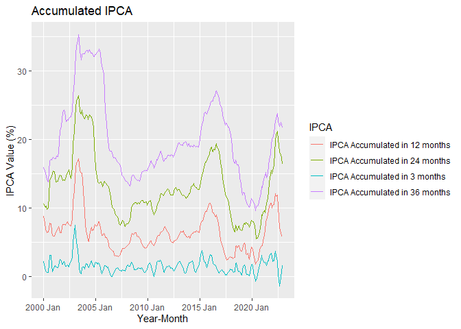<!-- -->

#### Average IPCA by different time windows


```r
ipca %>% ggplot(aes(x=data)) +
  geom_line(aes(y=((ipca_12/100 + 1) ^(1/12))*100-100, color = 'ipca_12') ) +
  geom_line(aes(y=((ipca_3/100 + 1) ^(1/3))*100-100, color='ipca_3')) + 
  geom_line(aes(y=((ipca_24/100 + 1) ^(1/24))*100-100, color='ipca_24')) +
  geom_line(aes(y=((ipca_36/100 + 1) ^(1/36))*100-100, color='ipca_36')) +
  xlab('Mes') +
  ylab('Inflacao Media no Periodo') +
  labs(color='IPCA')
```

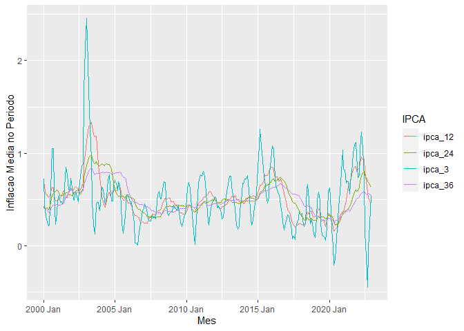<!-- -->

## Selic

API Base link: <http://api.bcb.gov.br/dados/serie/bcdata.sgs.1178/dados?formato=csv>


```r
selic_url_yearly <- 'http://api.bcb.gov.br/dados/serie/bcdata.sgs.1178/dados?formato=csv'

selic_yearly <- read.csv(selic_url_yearly, sep=';')


selic_yearly <- selic_yearly %>% 
  mutate(valor = as.numeric(str_replace(valor, ',','.')),
         data = as.Date(data, format='%d/%m/%Y')) %>% 
  dplyr::rename(
    valor_selic = valor
  )

selic_monthly_url <- 'http://api.bcb.gov.br/dados/serie/bcdata.sgs.4390/dados?formato=csv'


selic_monthly <- read.csv(selic_monthly_url, sep=';')


selic_monthly <- selic_monthly %>% mutate(
  valor = as.numeric(str_replace(valor, ',','.')),
         data = as.Date(data, format='%d/%m/%Y'))%>% 
  dplyr::rename(
    valor_selic = valor
  )
```

### Selic Overview


```r
selic_monthly %>% summary
```

```
##       data             valor_selic    
##  Min.   :1986-06-01   Min.   : 0.130  
##  1st Qu.:1995-07-24   1st Qu.: 0.840  
##  Median :2004-09-16   Median : 1.270  
##  Mean   :2004-09-15   Mean   : 6.283  
##  3rd Qu.:2013-11-08   3rd Qu.: 2.947  
##  Max.   :2023-01-01   Max.   :82.040
```

### Accumulating Selic


```r
selic_monthly['selic_36'] <- bind_rows(
  list('selic_36' = c(1:35)*NA),
  list('selic_36' = rollapply((selic_monthly$valor_selic/100 + 1), 36, prod))) * 100 -100
selic_monthly['selic_03'] <- bind_rows(
  list('selic_03' = c(1:2)*NA),
  list('selic_03' = rollapply((selic_monthly$valor_selic/100 + 1), 03, prod))) * 100 -100
selic_monthly['selic_12'] <- bind_rows(
  list('selic_12' = c(1:11)*NA),
  list('selic_12' = rollapply((selic_monthly$valor_selic/100 + 1), 12, prod))) * 100 -100
selic_monthly['selic_24'] <- bind_rows(
  list('selic_24' = c(1:23)*NA),
  list('selic_24' = rollapply((selic_monthly$valor_selic/100 + 1), 24, prod))) * 100 -100

selic_monthly %>% relocate(selic_36, .after=selic_24) -> selic_monthly

  selic_monthly <- selic_monthly %>% mutate(
    year_month= yearmonth(data)
  )


selic_monthly %>% pretty_sample_show()
```

<div style="border: 1px solid #ddd; padding: 5px; overflow-x: scroll; width:100%; "><table class=" lightable-classic lightable-striped lightable-hover" style='font-family: "Arial Narrow", "Source Sans Pro", sans-serif; width: auto !important; '>
 <thead>
  <tr>
   <th style="text-align:left;"> data </th>
   <th style="text-align:right;"> valor_selic </th>
   <th style="text-align:right;"> selic_03 </th>
   <th style="text-align:right;"> selic_12 </th>
   <th style="text-align:right;"> selic_24 </th>
   <th style="text-align:right;"> selic_36 </th>
   <th style="text-align:left;"> year_month </th>
  </tr>
 </thead>
<tbody>
  <tr>
   <td style="text-align:left;"> 1997-02-01 </td>
   <td style="text-align:right;"> 1.67 </td>
   <td style="text-align:right;"> 5.290611 </td>
   <td style="text-align:right;"> 25.510908 </td>
   <td style="text-align:right;"> 89.00178 </td>
   <td style="text-align:right;"> 1147.51073 </td>
   <td style="text-align:left;"> 1997 Feb </td>
  </tr>
  <tr>
   <td style="text-align:left;"> 1988-12-01 </td>
   <td style="text-align:right;"> 30.24 </td>
   <td style="text-align:right;"> 117.062333 </td>
   <td style="text-align:right;"> 1057.686930 </td>
   <td style="text-align:right;"> 5144.29065 </td>
   <td style="text-align:right;"> NA </td>
   <td style="text-align:left;"> 1988 Dec </td>
  </tr>
  <tr>
   <td style="text-align:left;"> 2008-07-01 </td>
   <td style="text-align:right;"> 1.07 </td>
   <td style="text-align:right;"> 2.938226 </td>
   <td style="text-align:right;"> 11.328496 </td>
   <td style="text-align:right;"> 25.78281 </td>
   <td style="text-align:right;"> 47.63843 </td>
   <td style="text-align:left;"> 2008 Jul </td>
  </tr>
  <tr>
   <td style="text-align:left;"> 1989-11-01 </td>
   <td style="text-align:right;"> 48.41 </td>
   <td style="text-align:right;"> 203.769536 </td>
   <td style="text-align:right;"> 1888.439456 </td>
   <td style="text-align:right;"> 20116.65067 </td>
   <td style="text-align:right;"> 84346.89467 </td>
   <td style="text-align:left;"> 1989 Nov </td>
  </tr>
  <tr>
   <td style="text-align:left;"> 1991-10-01 </td>
   <td style="text-align:right;"> 25.95 </td>
   <td style="text-align:right;"> 74.623818 </td>
   <td style="text-align:right;"> 439.783580 </td>
   <td style="text-align:right;"> 11097.80794 </td>
   <td style="text-align:right;"> 192555.34711 </td>
   <td style="text-align:left;"> 1991 Oct </td>
  </tr>
  <tr>
   <td style="text-align:left;"> 2010-05-01 </td>
   <td style="text-align:right;"> 0.75 </td>
   <td style="text-align:right;"> 2.195855 </td>
   <td style="text-align:right;"> 8.774076 </td>
   <td style="text-align:right;"> 22.51982 </td>
   <td style="text-align:right;"> 36.19704 </td>
   <td style="text-align:left;"> 2010 May </td>
  </tr>
  <tr>
   <td style="text-align:left;"> 2013-04-01 </td>
   <td style="text-align:right;"> 0.61 </td>
   <td style="text-align:right;"> 1.659055 </td>
   <td style="text-align:right;"> 7.495517 </td>
   <td style="text-align:right;"> 19.63733 </td>
   <td style="text-align:right;"> 32.36147 </td>
   <td style="text-align:left;"> 2013 Apr </td>
  </tr>
  <tr>
   <td style="text-align:left;"> 1992-06-01 </td>
   <td style="text-align:right;"> 24.28 </td>
   <td style="text-align:right;"> 89.429564 </td>
   <td style="text-align:right;"> 1261.435735 </td>
   <td style="text-align:right;"> 6277.64418 </td>
   <td style="text-align:right;"> 286732.57675 </td>
   <td style="text-align:left;"> 1992 Jun </td>
  </tr>
  <tr>
   <td style="text-align:left;"> 1992-07-01 </td>
   <td style="text-align:right;"> 26.21 </td>
   <td style="text-align:right;"> 92.930159 </td>
   <td style="text-align:right;"> 1428.844239 </td>
   <td style="text-align:right;"> 6973.75404 </td>
   <td style="text-align:right;"> 271782.38462 </td>
   <td style="text-align:left;"> 1992 Jul </td>
  </tr>
  <tr>
   <td style="text-align:left;"> 2004-06-01 </td>
   <td style="text-align:right;"> 1.23 </td>
   <td style="text-align:right;"> 3.684335 </td>
   <td style="text-align:right;"> 18.675878 </td>
   <td style="text-align:right;"> 45.52259 </td>
   <td style="text-align:right;"> 72.45196 </td>
   <td style="text-align:left;"> 2004 Jun </td>
  </tr>
</tbody>
</table></div>
### Visualizing Data


```r
selic_monthly %>% 
  filter(data>=as.Date("2010-01-01") & data<=as.Date('2019-12-31')) %>% 
  ggplot(aes(x=year_month)) +
  geom_line(aes(y=selic_03, col='Selic Accumulated in 3 months'))+
  geom_line(aes(y=selic_12, col='Selic Accumulated in 12 months'))+
  geom_line(aes(y=selic_24, col='Selic Accumulated in 24 months'))+
  geom_line(aes(y=selic_36, col='Selic Accumulated in 36 months')) +
  xlab('Year-Month') +
  labs(color='Selic', title = 'Accumulated Selic') +
  ylab('Selic Value (%)')
```

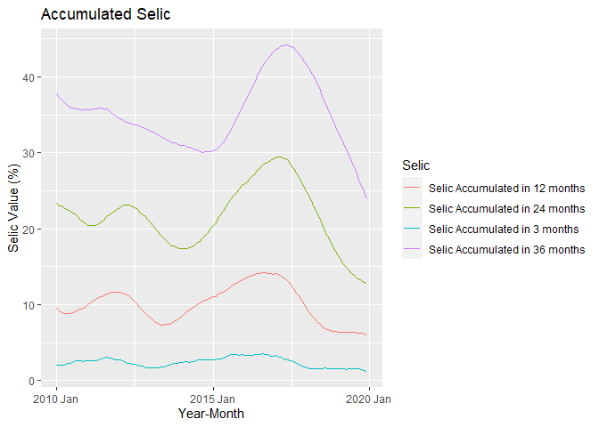<!-- -->

## PIB Data

### Quarterly current adjusted values


```r
pib_url_quarter <- 'https://servicodados.ibge.gov.br/api/v3/agregados/2072/periodos/200001|200002|200003|200004|200101|200102|200103|200104|200201|200202|200203|200204|200301|200302|200303|200304|200401|200402|200403|200404|200501|200502|200503|200504|200601|200602|200603|200604|200701|200702|200703|200704|200801|200802|200803|200804|200901|200902|200903|200904|201001|201002|201003|201004|201101|201102|201103|201104|201201|201202|201203|201204|201301|201302|201303|201304|201401|201402|201403|201404|201501|201502|201503|201504|201601|201602|201603|201604|201701|201702|201703|201704|201801|201802|201803|201804|201901|201902|201903|201904|202001|202002|202003|202004|202101|202102|202103|202104/variaveis/933?localidades=N1[all]'

quarter_pib <- get_pib_data(pib_url_quarter)

quarter_pib$year <- paste0(
  quarter_pib$year %>% str_match('\\d{4}'),
  '-',
  quarter_pib$year %>%
    str_match('(?<=\\d{4})\\d{2}') %>% 
    str_replace('04', '12') %>% 
    str_replace('03', '09') %>% 
    str_replace('02', '06') %>% 
    str_replace('01', '03')
  )

quarter_pib <- quarter_pib %>% 
  mutate(
    year= year %>% yearquarter()
  )


quarter_pib %>% write.csv2('test.csv'
                          )
```

### Acummulated data


```r
quarter_pib['pib_12_months'] <- quarter_pib$pib %>% rollmean(k=4, na.pad = T, align = 'right')
quarter_pib['pib_24_months'] <- quarter_pib$pib %>% rollmean(k=8, na.pad = T, align = 'right')
quarter_pib['pib_36_months'] <- quarter_pib$pib %>% rollmean(k=12, na.pad = T, align = 'right')
```

### Visualizing pib data


```r
quarter_pib %>%
  pivot_longer(cols=c('pib', 'pib_12_months', 'pib_24_months',  'pib_36_months')) %>% 
  ggplot() + 
  geom_line(aes(x=year, y= value, col=name))
```

```
## Warning: Removed 21 row(s) containing missing values (geom_path).
```

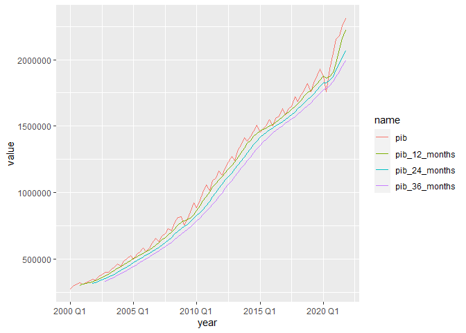<!-- -->

## Temperature data

### Reading and tidying temperature data


```r
temperature_data <- read.csv(unzip('./data/temperature.zip'))


temperature_data %>% slice_sample(n=20)
```

```
##           day year.month region state code                city amax amin
## 1  2016-03-23    2016-03     CO    MT A937    PONTES E LACERDA 33.1 23.4
## 2  2020-11-14    2020-11     CO    MT A923  PRIMAVERA DO LESTE 27.0 21.7
## 3  2020-01-13    2020-01      S    PR A855            PLANALTO 30.8 23.1
## 4  2019-10-23    2019-10     NE    PI A374            CORRENTE 32.7 21.9
## 5  2019-02-14    2019-02      N    AM A110        BOCA DO ACRE 30.3 23.6
## 6  2020-11-20    2020-11     SE    MG A515            VARGINHA 28.5 16.8
## 7  2019-01-19    2019-01      S    RS A810          SANTA ROSA 27.1 17.9
## 8  2013-05-17    2013-05     NE    MA A217    FAROL de SANTANA 31.1 27.7
## 9  2014-07-04    2014-07     CO    MT A941             CACERES 33.3 17.9
## 10 2012-10-14    2012-10     NE    MA A219             TURIACU 28.8 25.2
## 11 2015-03-15    2015-03     CO    MS A720               COXIM 31.9 21.7
## 12 2020-06-06    2020-06     SE    MG A521            PAMPULHA 26.0 15.1
## 13 2020-07-10    2020-07     NE    AL A327 PALMEIRA DOS INDIOS 27.1 20.9
## 14 2017-12-06    2017-12      N    PA A215         SALINOPOLIS 30.5 26.8
## 15 2020-08-30    2020-08     NE    RN A340               APODI 35.6 22.0
## 16 2013-10-17    2013-10      N    PA A214      RONDON DO PARA 32.7 22.3
## 17 2017-10-12    2017-10     SE    ES A614            LINHARES 32.4 27.0
## 18 2016-09-23    2016-09     NE    BA A410              ILHEUS 25.1 20.0
## 19 2016-10-08    2016-10     CO    MS A702        CAMPO GRANDE 31.2 14.1
## 20 2012-04-08    2012-04      N    PA A202           CASTANHAL 30.9 23.2
##        mean median
## 1  25.99583  24.60
## 2  23.27083  22.30
## 3  25.50000  24.25
## 4  26.70000  25.75
## 5  25.20833  24.65
## 6  21.78333  21.45
## 7  21.80417  21.90
## 8  29.00833  28.30
## 9  24.52917  22.85
## 10 26.57083  26.10
## 11 26.18333  25.50
## 12 19.76667  18.65
## 13 22.95000  21.95
## 14 28.26667  27.70
## 15 28.00417  27.05
## 16 27.10000  27.60
## 17 30.00000  30.30
## 18 22.66667  22.70
## 19 22.31667  22.10
## 20 25.43750  24.60
```

```r
temperature_data <- temperature_data %>% mutate(
  year.month = yearmonth(year.month),
  day=  as_date(day),
  region = as.factor(region),
  state = as.factor(state),
  city = as.factor(city) ) 

temperature_data <- temperature_data %>%   dplyr::rename(
    mean_temp = mean,
    median_temp  = median,
    max_temp = amax)

temperature_data %>% select(-year.month) %>%  summary
```

```
##       day             region          state             code          
##  Min.   :2010-01-01   CO:353552   MG     : 250032   Length:1987408    
##  1st Qu.:2013-03-16   N :251556   BA     : 172577   Class :character  
##  Median :2016-03-26   NE:518320   RS     : 164461   Mode  :character  
##  Mean   :2016-01-30   S :347056   SP     : 138735                     
##  3rd Qu.:2018-12-16   SE:516924   MT     : 123061                     
##  Max.   :2021-12-31               MS     : 119586                     
##                                   (Other):1018956                     
##                   city            max_temp          amin        mean_temp     
##  VALENCA            :   8133   Min.   :-4.20   Min.   :-9.6   Min.   :-5.783  
##  SAO SIMAO          :   5163   1st Qu.:26.40   1st Qu.:16.8   1st Qu.:21.250  
##  FLORIANOPOLIS      :   4383   Median :29.90   Median :20.1   Median :24.392  
##  GOIANIA            :   4383   Mean   :29.05   Mean   :19.2   Mean   :23.538  
##  GUANHAES           :   4383   3rd Qu.:32.40   3rd Qu.:22.4   3rd Qu.:26.552  
##  IBIRITE (ROLA MOCA):   4383   Max.   :45.00   Max.   :39.9   Max.   :41.800  
##  (Other)            :1956580                                                  
##   median_temp   
##  Min.   :-5.45  
##  1st Qu.:20.45  
##  Median :23.60  
##  Mean   :22.82  
##  3rd Qu.:25.80  
##  Max.   :41.80  
## 
```

### Getting weights for weighted mean temperature

-   The weights to calculate the average temperature will come from the proportional power consumption by month and region. That means that the regions where there is more power consumption will have more impact on the average temperature since we want to study the impact of the temperature on the total power consumption for the residential sector.
-   We will also have a normal average, without weighting by power consumption


```r
power_consumption_by_region_residential <- power_consumption %>%
  filter(SetorN1 == 'Residencial') %>%
  group_by(year_month, region) %>% 
  summarise(total=sum(Consumo)) %>% 
  group_by(year_month) %>% 
  mutate(percentage = total/sum(total),
         total_percent = sum(percentage))
```

```
## `summarise()` has grouped output by 'year_month'. You can override using the
## `.groups` argument.
```

```r
power_consumption_by_region_general <- power_consumption %>%
  group_by(year_month, region) %>% 
  summarise(total=sum(Consumo)) %>% 
  group_by(year_month) %>% 
  mutate(percentage = total/sum(total),
         total_percent = sum(percentage))
```

```
## `summarise()` has grouped output by 'year_month'. You can override using the
## `.groups` argument.
```

```r
power_consumption_by_region_residential %>% pretty_head_show(5)
```

<div style="border: 1px solid #ddd; padding: 5px; overflow-x: scroll; width:100%; "><table class=" lightable-classic lightable-striped lightable-hover" style='font-family: "Arial Narrow", "Source Sans Pro", sans-serif; width: auto !important; '>
 <thead>
  <tr>
   <th style="text-align:left;"> year_month </th>
   <th style="text-align:left;"> region </th>
   <th style="text-align:right;"> total </th>
   <th style="text-align:right;"> percentage </th>
   <th style="text-align:right;"> total_percent </th>
  </tr>
 </thead>
<tbody>
  <tr>
   <td style="text-align:left;"> 2013 Jan </td>
   <td style="text-align:left;"> CO </td>
   <td style="text-align:right;"> 828781 </td>
   <td style="text-align:right;"> 0.0758618 </td>
   <td style="text-align:right;"> 1 </td>
  </tr>
  <tr>
   <td style="text-align:left;"> 2013 Jan </td>
   <td style="text-align:left;"> N </td>
   <td style="text-align:right;"> 577517 </td>
   <td style="text-align:right;"> 0.0528625 </td>
   <td style="text-align:right;"> 1 </td>
  </tr>
  <tr>
   <td style="text-align:left;"> 2013 Jan </td>
   <td style="text-align:left;"> NE </td>
   <td style="text-align:right;"> 2002181 </td>
   <td style="text-align:right;"> 0.1832679 </td>
   <td style="text-align:right;"> 1 </td>
  </tr>
  <tr>
   <td style="text-align:left;"> 2013 Jan </td>
   <td style="text-align:left;"> S </td>
   <td style="text-align:right;"> 1758505 </td>
   <td style="text-align:right;"> 0.1609633 </td>
   <td style="text-align:right;"> 1 </td>
  </tr>
  <tr>
   <td style="text-align:left;"> 2013 Jan </td>
   <td style="text-align:left;"> SE </td>
   <td style="text-align:right;"> 5757901 </td>
   <td style="text-align:right;"> 0.5270445 </td>
   <td style="text-align:right;"> 1 </td>
  </tr>
</tbody>
</table></div>

```r
power_consumption_by_region_general %>% pretty_head_show(5)
```

<div style="border: 1px solid #ddd; padding: 5px; overflow-x: scroll; width:100%; "><table class=" lightable-classic lightable-striped lightable-hover" style='font-family: "Arial Narrow", "Source Sans Pro", sans-serif; width: auto !important; '>
 <thead>
  <tr>
   <th style="text-align:left;"> year_month </th>
   <th style="text-align:left;"> region </th>
   <th style="text-align:right;"> total </th>
   <th style="text-align:right;"> percentage </th>
   <th style="text-align:right;"> total_percent </th>
  </tr>
 </thead>
<tbody>
  <tr>
   <td style="text-align:left;"> 2013 Jan </td>
   <td style="text-align:left;"> CO </td>
   <td style="text-align:right;"> 2565058 </td>
   <td style="text-align:right;"> 0.0670244 </td>
   <td style="text-align:right;"> 1 </td>
  </tr>
  <tr>
   <td style="text-align:left;"> 2013 Jan </td>
   <td style="text-align:left;"> N </td>
   <td style="text-align:right;"> 2391634 </td>
   <td style="text-align:right;"> 0.0624928 </td>
   <td style="text-align:right;"> 1 </td>
  </tr>
  <tr>
   <td style="text-align:left;"> 2013 Jan </td>
   <td style="text-align:left;"> NE </td>
   <td style="text-align:right;"> 6636316 </td>
   <td style="text-align:right;"> 0.1734054 </td>
   <td style="text-align:right;"> 1 </td>
  </tr>
  <tr>
   <td style="text-align:left;"> 2013 Jan </td>
   <td style="text-align:left;"> S </td>
   <td style="text-align:right;"> 6616869 </td>
   <td style="text-align:right;"> 0.1728972 </td>
   <td style="text-align:right;"> 1 </td>
  </tr>
  <tr>
   <td style="text-align:left;"> 2013 Jan </td>
   <td style="text-align:left;"> SE </td>
   <td style="text-align:right;"> 20060658 </td>
   <td style="text-align:right;"> 0.5241802 </td>
   <td style="text-align:right;"> 1 </td>
  </tr>
</tbody>
</table></div>

#### Grouping temperature by month and region


```r
temperature_data_summary <- temperature_data %>% group_by( year.month,region) %>% 
  summarise(max_temp = max(max_temp),
            mean_temp = mean(mean_temp),
            )
```

```
## `summarise()` has grouped output by 'year.month'. You can override using the
## `.groups` argument.
```

```r
temperature_data_summary %>% pretty_head_show()
```

<div style="border: 1px solid #ddd; padding: 5px; overflow-x: scroll; width:100%; "><table class=" lightable-classic lightable-striped lightable-hover" style='font-family: "Arial Narrow", "Source Sans Pro", sans-serif; width: auto !important; '>
 <thead>
  <tr>
   <th style="text-align:left;"> year.month </th>
   <th style="text-align:left;"> region </th>
   <th style="text-align:right;"> max_temp </th>
   <th style="text-align:right;"> mean_temp </th>
  </tr>
 </thead>
<tbody>
  <tr>
   <td style="text-align:left;"> 2010 Jan </td>
   <td style="text-align:left;"> CO </td>
   <td style="text-align:right;"> 44.6 </td>
   <td style="text-align:right;"> 25.03063 </td>
  </tr>
  <tr>
   <td style="text-align:left;"> 2010 Jan </td>
   <td style="text-align:left;"> N </td>
   <td style="text-align:right;"> 36.6 </td>
   <td style="text-align:right;"> 26.25867 </td>
  </tr>
  <tr>
   <td style="text-align:left;"> 2010 Jan </td>
   <td style="text-align:left;"> NE </td>
   <td style="text-align:right;"> 39.1 </td>
   <td style="text-align:right;"> 26.35223 </td>
  </tr>
  <tr>
   <td style="text-align:left;"> 2010 Jan </td>
   <td style="text-align:left;"> S </td>
   <td style="text-align:right;"> 35.5 </td>
   <td style="text-align:right;"> 23.14719 </td>
  </tr>
  <tr>
   <td style="text-align:left;"> 2010 Jan </td>
   <td style="text-align:left;"> SE </td>
   <td style="text-align:right;"> 38.7 </td>
   <td style="text-align:right;"> 24.55886 </td>
  </tr>
  <tr>
   <td style="text-align:left;"> 2010 Feb </td>
   <td style="text-align:left;"> CO </td>
   <td style="text-align:right;"> 44.2 </td>
   <td style="text-align:right;"> 25.76942 </td>
  </tr>
  <tr>
   <td style="text-align:left;"> 2010 Feb </td>
   <td style="text-align:left;"> N </td>
   <td style="text-align:right;"> 36.4 </td>
   <td style="text-align:right;"> 26.69169 </td>
  </tr>
  <tr>
   <td style="text-align:left;"> 2010 Feb </td>
   <td style="text-align:left;"> NE </td>
   <td style="text-align:right;"> 39.6 </td>
   <td style="text-align:right;"> 27.11152 </td>
  </tr>
  <tr>
   <td style="text-align:left;"> 2010 Feb </td>
   <td style="text-align:left;"> S </td>
   <td style="text-align:right;"> 39.6 </td>
   <td style="text-align:right;"> 24.03995 </td>
  </tr>
  <tr>
   <td style="text-align:left;"> 2010 Feb </td>
   <td style="text-align:left;"> SE </td>
   <td style="text-align:right;"> 40.3 </td>
   <td style="text-align:right;"> 24.99681 </td>
  </tr>
</tbody>
</table></div>

#### Visualizing mean temperature by region


```r
temperature_data_summary %>%
  ggplot(aes(x=year.month, y=mean_temp))+
  geom_line()+
  geom_line(aes(y=max_temp, colour='max'))+
  facet_wrap(~region)
```

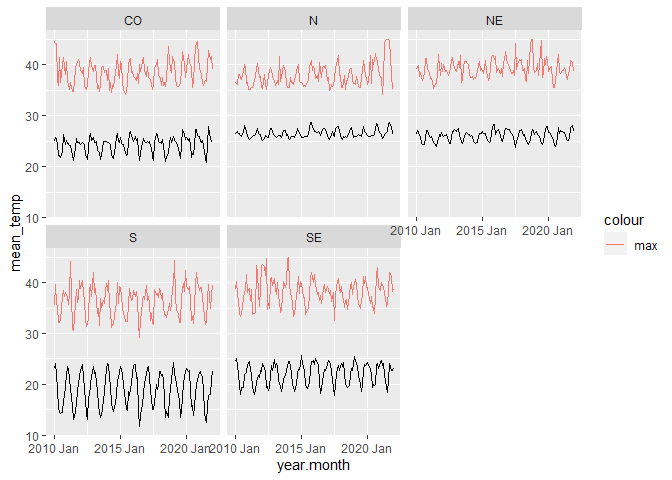<!-- -->

#### Creating a unique ID to merge both datasets


```r
temperature_data_summary <- temperature_data_summary %>% 
  mutate(unique_key = paste0(year.month %>% as.character(),  '-', region))


power_consumption_by_region_residential <- power_consumption_by_region_residential %>% 
  mutate(unique_key = paste0( year_month %>% as.character(),    '-',    region   ))

power_consumption_by_region_general <- power_consumption_by_region_general %>% 
  mutate(unique_key = paste0( year_month %>% as.character(),    '-',    region   ))
         
temperature_data_summary <- temperature_data_summary %>% ungroup() %>% select(mean_temp, max_temp,unique_key)
```

#### Merging datasets


```r
temperature_data_summary_weighted_residential <- power_consumption_by_region_residential %>%
  select(-total, -total_percent) %>% 
  left_join(temperature_data_summary, by='unique_key') %>% 
  relocate(unique_key)

temperature_data_summary_weighted_general <- power_consumption_by_region_general %>%
  select(-total, -total_percent) %>% 
  left_join(temperature_data_summary, by='unique_key') %>% 
  relocate(unique_key)

temperature_data_summary_weighted_residential %>% pretty_head_show()
```

<div style="border: 1px solid #ddd; padding: 5px; overflow-x: scroll; width:100%; "><table class=" lightable-classic lightable-striped lightable-hover" style='font-family: "Arial Narrow", "Source Sans Pro", sans-serif; width: auto !important; '>
 <thead>
  <tr>
   <th style="text-align:left;"> unique_key </th>
   <th style="text-align:left;"> year_month </th>
   <th style="text-align:left;"> region </th>
   <th style="text-align:right;"> percentage </th>
   <th style="text-align:right;"> mean_temp </th>
   <th style="text-align:right;"> max_temp </th>
  </tr>
 </thead>
<tbody>
  <tr>
   <td style="text-align:left;"> 2013 Jan-CO </td>
   <td style="text-align:left;"> 2013 Jan </td>
   <td style="text-align:left;"> CO </td>
   <td style="text-align:right;"> 0.0758618 </td>
   <td style="text-align:right;"> 24.84707 </td>
   <td style="text-align:right;"> 39.9 </td>
  </tr>
  <tr>
   <td style="text-align:left;"> 2013 Jan-N </td>
   <td style="text-align:left;"> 2013 Jan </td>
   <td style="text-align:left;"> N </td>
   <td style="text-align:right;"> 0.0528625 </td>
   <td style="text-align:right;"> 25.93202 </td>
   <td style="text-align:right;"> 35.9 </td>
  </tr>
  <tr>
   <td style="text-align:left;"> 2013 Jan-NE </td>
   <td style="text-align:left;"> 2013 Jan </td>
   <td style="text-align:left;"> NE </td>
   <td style="text-align:right;"> 0.1832679 </td>
   <td style="text-align:right;"> 26.91208 </td>
   <td style="text-align:right;"> 38.8 </td>
  </tr>
  <tr>
   <td style="text-align:left;"> 2013 Jan-S </td>
   <td style="text-align:left;"> 2013 Jan </td>
   <td style="text-align:left;"> S </td>
   <td style="text-align:right;"> 0.1609633 </td>
   <td style="text-align:right;"> 22.06332 </td>
   <td style="text-align:right;"> 38.0 </td>
  </tr>
  <tr>
   <td style="text-align:left;"> 2013 Jan-SE </td>
   <td style="text-align:left;"> 2013 Jan </td>
   <td style="text-align:left;"> SE </td>
   <td style="text-align:right;"> 0.5270445 </td>
   <td style="text-align:right;"> 23.38894 </td>
   <td style="text-align:right;"> 38.7 </td>
  </tr>
  <tr>
   <td style="text-align:left;"> 2013 Feb-CO </td>
   <td style="text-align:left;"> 2013 Feb </td>
   <td style="text-align:left;"> CO </td>
   <td style="text-align:right;"> 0.0760325 </td>
   <td style="text-align:right;"> 24.76799 </td>
   <td style="text-align:right;"> 39.8 </td>
  </tr>
  <tr>
   <td style="text-align:left;"> 2013 Feb-N </td>
   <td style="text-align:left;"> 2013 Feb </td>
   <td style="text-align:left;"> N </td>
   <td style="text-align:right;"> 0.0534789 </td>
   <td style="text-align:right;"> 25.67623 </td>
   <td style="text-align:right;"> 36.4 </td>
  </tr>
  <tr>
   <td style="text-align:left;"> 2013 Feb-NE </td>
   <td style="text-align:left;"> 2013 Feb </td>
   <td style="text-align:left;"> NE </td>
   <td style="text-align:right;"> 0.1890616 </td>
   <td style="text-align:right;"> 27.22792 </td>
   <td style="text-align:right;"> 39.7 </td>
  </tr>
  <tr>
   <td style="text-align:left;"> 2013 Feb-S </td>
   <td style="text-align:left;"> 2013 Feb </td>
   <td style="text-align:left;"> S </td>
   <td style="text-align:right;"> 0.1634164 </td>
   <td style="text-align:right;"> 22.43115 </td>
   <td style="text-align:right;"> 38.8 </td>
  </tr>
  <tr>
   <td style="text-align:left;"> 2013 Feb-SE </td>
   <td style="text-align:left;"> 2013 Feb </td>
   <td style="text-align:left;"> SE </td>
   <td style="text-align:right;"> 0.5180106 </td>
   <td style="text-align:right;"> 24.07498 </td>
   <td style="text-align:right;"> 37.7 </td>
  </tr>
</tbody>
</table></div>

```r
temperature_data_summary_weighted_general %>% pretty_head_show()
```

<div style="border: 1px solid #ddd; padding: 5px; overflow-x: scroll; width:100%; "><table class=" lightable-classic lightable-striped lightable-hover" style='font-family: "Arial Narrow", "Source Sans Pro", sans-serif; width: auto !important; '>
 <thead>
  <tr>
   <th style="text-align:left;"> unique_key </th>
   <th style="text-align:left;"> year_month </th>
   <th style="text-align:left;"> region </th>
   <th style="text-align:right;"> percentage </th>
   <th style="text-align:right;"> mean_temp </th>
   <th style="text-align:right;"> max_temp </th>
  </tr>
 </thead>
<tbody>
  <tr>
   <td style="text-align:left;"> 2013 Jan-CO </td>
   <td style="text-align:left;"> 2013 Jan </td>
   <td style="text-align:left;"> CO </td>
   <td style="text-align:right;"> 0.0670244 </td>
   <td style="text-align:right;"> 24.84707 </td>
   <td style="text-align:right;"> 39.9 </td>
  </tr>
  <tr>
   <td style="text-align:left;"> 2013 Jan-N </td>
   <td style="text-align:left;"> 2013 Jan </td>
   <td style="text-align:left;"> N </td>
   <td style="text-align:right;"> 0.0624928 </td>
   <td style="text-align:right;"> 25.93202 </td>
   <td style="text-align:right;"> 35.9 </td>
  </tr>
  <tr>
   <td style="text-align:left;"> 2013 Jan-NE </td>
   <td style="text-align:left;"> 2013 Jan </td>
   <td style="text-align:left;"> NE </td>
   <td style="text-align:right;"> 0.1734054 </td>
   <td style="text-align:right;"> 26.91208 </td>
   <td style="text-align:right;"> 38.8 </td>
  </tr>
  <tr>
   <td style="text-align:left;"> 2013 Jan-S </td>
   <td style="text-align:left;"> 2013 Jan </td>
   <td style="text-align:left;"> S </td>
   <td style="text-align:right;"> 0.1728972 </td>
   <td style="text-align:right;"> 22.06332 </td>
   <td style="text-align:right;"> 38.0 </td>
  </tr>
  <tr>
   <td style="text-align:left;"> 2013 Jan-SE </td>
   <td style="text-align:left;"> 2013 Jan </td>
   <td style="text-align:left;"> SE </td>
   <td style="text-align:right;"> 0.5241802 </td>
   <td style="text-align:right;"> 23.38894 </td>
   <td style="text-align:right;"> 38.7 </td>
  </tr>
  <tr>
   <td style="text-align:left;"> 2013 Feb-CO </td>
   <td style="text-align:left;"> 2013 Feb </td>
   <td style="text-align:left;"> CO </td>
   <td style="text-align:right;"> 0.0664422 </td>
   <td style="text-align:right;"> 24.76799 </td>
   <td style="text-align:right;"> 39.8 </td>
  </tr>
  <tr>
   <td style="text-align:left;"> 2013 Feb-N </td>
   <td style="text-align:left;"> 2013 Feb </td>
   <td style="text-align:left;"> N </td>
   <td style="text-align:right;"> 0.0597719 </td>
   <td style="text-align:right;"> 25.67623 </td>
   <td style="text-align:right;"> 36.4 </td>
  </tr>
  <tr>
   <td style="text-align:left;"> 2013 Feb-NE </td>
   <td style="text-align:left;"> 2013 Feb </td>
   <td style="text-align:left;"> NE </td>
   <td style="text-align:right;"> 0.1694018 </td>
   <td style="text-align:right;"> 27.22792 </td>
   <td style="text-align:right;"> 39.7 </td>
  </tr>
  <tr>
   <td style="text-align:left;"> 2013 Feb-S </td>
   <td style="text-align:left;"> 2013 Feb </td>
   <td style="text-align:left;"> S </td>
   <td style="text-align:right;"> 0.1834382 </td>
   <td style="text-align:right;"> 22.43115 </td>
   <td style="text-align:right;"> 38.8 </td>
  </tr>
  <tr>
   <td style="text-align:left;"> 2013 Feb-SE </td>
   <td style="text-align:left;"> 2013 Feb </td>
   <td style="text-align:left;"> SE </td>
   <td style="text-align:right;"> 0.5209458 </td>
   <td style="text-align:right;"> 24.07498 </td>
   <td style="text-align:right;"> 37.7 </td>
  </tr>
</tbody>
</table></div>

#### Calculating weighted avarages


```r
temperature_data_summary_weighted_residential <- temperature_data_summary_weighted_residential %>% 
  mutate(weighted_temp = sum(mean_temp * percentage),
        weighted_temp_max = sum(max_temp * percentage),
         equal_weight = mean(mean_temp),
         equal_weight_max = mean(max_temp)
         )

temperature_data_summary_weighted_general <- temperature_data_summary_weighted_general %>% 
  mutate(weighted_temp = sum(mean_temp * percentage),
         weighted_temp_max = sum(max_temp * percentage),
         equal_weight = mean(mean_temp),
          equal_weight_max = mean(max_temp))
```


```r
temperature_data_summary_weighted_residential %>% filter(region=='N') %>% 
  ggplot(aes(x=year_month, y=weighted_temp)) + 
  geom_line(aes(col='weighted')) +
  geom_line(aes(y=weighted_temp_max, col='max_weighted')) +
  geom_line(aes(y=equal_weight, col='equal weights')) +
  geom_line(aes(y=equal_weight_max, col='equal weights max')) +
  labs(title='Residential Temperature Weigthed')
```

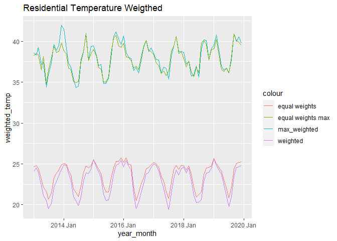<!-- -->

```r
temperature_data_summary_weighted_general %>% filter(region=='N') %>% 
  ggplot(aes(x=year_month, y=weighted_temp)) + 
  geom_line(aes(col='weighted')) +
  geom_line(aes(y=weighted_temp_max, col='max_weighted')) +
  geom_line(aes(y=equal_weight, col='equal weights')) +
  geom_line(aes(y=equal_weight_max, col='equal weights max')) +
  labs(title='General Temperature Weigthed')
```

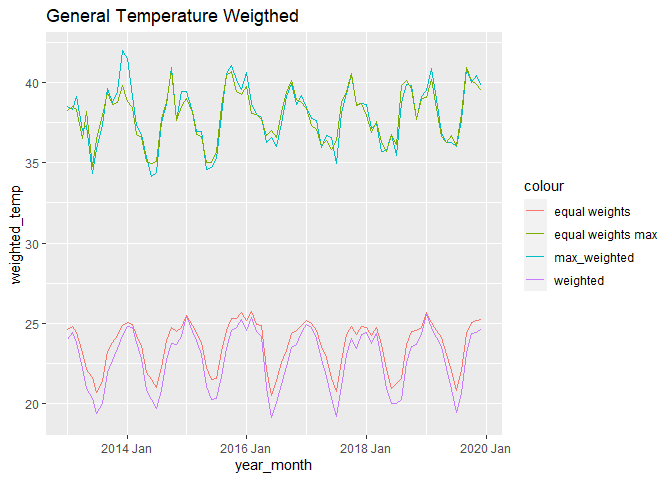<!-- -->

```r
temperature_data_summary_weighted_residential %>%
  filter(region=='N') %>% 
  ggplot(aes(x=year_month, y=weighted_temp)) +
  geom_line(aes(col='weighted_residential')) +
  geom_line(data=temperature_data_summary_weighted_general, aes(y=weighted_temp, col='weighted_general')) +
  geom_line(aes(y=equal_weight, col='equal weights')) + 
  geom_line(aes(y=weighted_temp_max, col='weighted_residential_max')) + 
  geom_line(data=temperature_data_summary_weighted_general, aes(y=weighted_temp_max, col='weighted_general_max')) +
  geom_line(aes(y=equal_weight_max, col='equal weights max')) +
  labs(title='Comparing the averages and max')
```

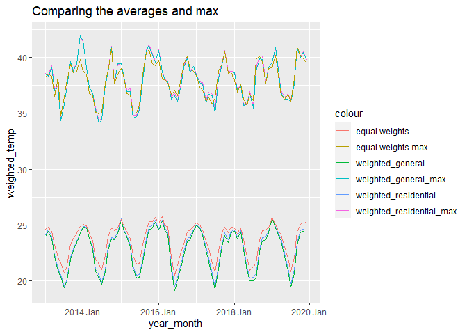<!-- -->

## Recursos Livres

### Recursos Livres totais

**Operações de crédito - concessões de crédito - recursos livres**

**Frequência**: Mensal de 2011.03 até 2022.04

**Fonte**: Banco Central do Brasil, Notas Econômico-financeiras para a Imprensa, Política Monetária e Operações de Crédito do SFN (Bacen/Notas Imprensa/Moeda)

**Unidade**: R\$ (milhões)

**Comentário**: Estatísticas das operações de crédito do Sistema Financeiro Nacional. Concessões de crédito refere-se a desembolsos referentes a empréstimos e financiamentos efetivamente creditados ao tomador do crédito. Os valores informados correspondem às concessões ocorridas no mês de referênciaEstas novas operações de crédito são contratadas com taxas de juros livremente pactuadas entre mutuários e instituições financeiras. Não inclui operações referenciadas em taxas regulamentadas, operações vinculadas a recursos do Banco Nacional de Desenvolvimento Econômico e Social (BNDES) ou quaisquer outras lastreadas em recursos compulsórios ou governamentais.Mais informações: [GLOSSÁRIO](http://ipeadata.gov.br/doc/glossariocredito.pdf); [Nota para a Imprensa de Política Monetária e Operações de Crédito](http://ipeadata.gov.br/doc/notaempr.pdf); [Nota Metodológica -- Revisão da estrutura de dados de crédito -- Fevereiro de 2015](http://ipeadata.gov.br/doc/notaempr201502.pdf) e SGS- Sistema de Gerenciamento de Séries Temporais, Banco Central.

**Atualizado em:** 27/07/2022

---

**Operações de crédito - concessões de crédito - recursos livres**

**Frequency**: Monthly from 2011.03 until 2022.04

**Source**: Banco Central do Brasil, Notas Econômico-financeiras para a Imprensa, Política Monetária e Operações de Crédito do SFN (Bacen/Notas Imprensa/Moeda)

**Unit**: R\$ (milhões)

**Comments**: Statistics of credit operations of the National Financial System. Credit grants refer to disbursements related to loans and financing effectively credited to the credit borrower. The reported values correspond to grants that occurred in the reference month. These new credit operations are contracted with interest rates freely agreed upon between borrowers and financial institutions. It does not include operations referenced in regulated rates, operations linked to resources of the National Bank for Economic and Social Development (BNDES), or any other operations backed by compulsory or government resources. For more information: [GLOSSÁRIO](http://ipeadata.gov.br/doc/glossariocredito.pdf); [Nota para a Imprensa de Política Monetária e Operações de Crédito](http://ipeadata.gov.br/doc/notaempr.pdf); [Nota Metodológica -- Revisão da estrutura de dados de crédito -- Fevereiro de 2015](http://ipeadata.gov.br/doc/notaempr201502.pdf) e SGS- Sistema de Gerenciamento de Séries Temporais, Banco Central.

**Last updated on:** 27/07/2022


```r
recursos_livres_totais <- read.csv('./data/ipea_data_concessao_credito/recursos_livres_total.csv', dec='p')


recursos_livres_totais %>% pretty_sample_show()
```

<div style="border: 1px solid #ddd; padding: 5px; overflow-x: scroll; width:100%; "><table class=" lightable-classic lightable-striped lightable-hover" style='font-family: "Arial Narrow", "Source Sans Pro", sans-serif; width: auto !important; '>
 <thead>
  <tr>
   <th style="text-align:left;"> data </th>
   <th style="text-align:right;"> credit </th>
   <th style="text-align:left;"> X </th>
  </tr>
 </thead>
<tbody>
  <tr>
   <td style="text-align:left;"> 1983.10 </td>
   <td style="text-align:right;"> NA </td>
   <td style="text-align:left;"> NA </td>
  </tr>
  <tr>
   <td style="text-align:left;"> 1995.12 </td>
   <td style="text-align:right;"> NA </td>
   <td style="text-align:left;"> NA </td>
  </tr>
  <tr>
   <td style="text-align:left;"> 2013.05 </td>
   <td style="text-align:right;"> 1427513 </td>
   <td style="text-align:left;"> NA </td>
  </tr>
  <tr>
   <td style="text-align:left;"> 1984.07 </td>
   <td style="text-align:right;"> NA </td>
   <td style="text-align:left;"> NA </td>
  </tr>
  <tr>
   <td style="text-align:left;"> 1983.09 </td>
   <td style="text-align:right;"> NA </td>
   <td style="text-align:left;"> NA </td>
  </tr>
  <tr>
   <td style="text-align:left;"> 2011.01 </td>
   <td style="text-align:right;"> 1056671 </td>
   <td style="text-align:left;"> NA </td>
  </tr>
  <tr>
   <td style="text-align:left;"> 1990.11 </td>
   <td style="text-align:right;"> NA </td>
   <td style="text-align:left;"> NA </td>
  </tr>
  <tr>
   <td style="text-align:left;"> 2009.12 </td>
   <td style="text-align:right;"> 902959 </td>
   <td style="text-align:left;"> NA </td>
  </tr>
  <tr>
   <td style="text-align:left;"> 1979.06 </td>
   <td style="text-align:right;"> NA </td>
   <td style="text-align:left;"> NA </td>
  </tr>
  <tr>
   <td style="text-align:left;"> 1989.06 </td>
   <td style="text-align:right;"> NA </td>
   <td style="text-align:left;"> NA </td>
  </tr>
</tbody>
</table></div>

```r
recursos_livres_totais <- recursos_livres_totais[,1:2] %>%
  drop_na() %>%
  dplyr::rename(
    date = data)

recursos_livres_totais <- recursos_livres_totais %>% 
  mutate( date = yearmonth(as.character(date)))

recursos_livres_totais %>% plot
```

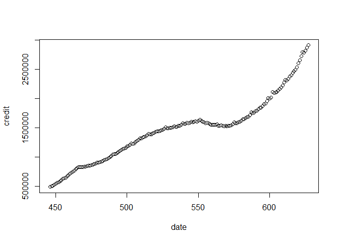<!-- -->

```r
recursos_livres_totais$credit_mean_12 <- recursos_livres_totais$credit %>% rollmean(k=12, na.pad = T, align = 'right')
recursos_livres_totais$credit_mean_24 <- recursos_livres_totais$credit %>% rollmean(k=24, na.pad = T, align = 'right')
recursos_livres_totais$credit_mean_36 <- recursos_livres_totais$credit %>% rollmean(k=36, na.pad = T, align = 'right')


recursos_livres_totais %>% 
  pivot_longer(cols = c('credit_mean_12', 'credit_mean_24', 'credit_mean_36', 'credit')) %>% 
  ggplot(aes(x=date, y=value))+
  geom_line(aes(col=name))
```

```
## Warning: Removed 69 row(s) containing missing values (geom_path).
```

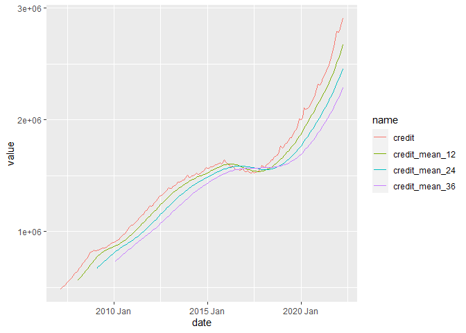<!-- -->

#### Recursos livres totais with no inflation

-   It was noted that inflation was affecting the values, because of that we factored inflation in


```r
recursos_livres_totais_current <- recursos_livres_totais %>% 
  left_join(ipca, by=c('date'='data')) %>% 
  select(date, credit, valor_ipca)


acc_inflation <- (recursos_livres_totais_current$valor/100 + 1) %>% rev() %>% lag(1) %>% na.fill(1) %>% cumprod() 


credit_rev <- recursos_livres_totais_current$credit %>% rev

adjusted_values <- acc_inflation*credit_rev

recursos_livres_totais_current$credit_current <- adjusted_values %>% rev
recursos_livres_totais_current$acc_inflation <- acc_inflation %>% rev


recursos_livres_totais_current$credit_mean_12 <- recursos_livres_totais_current$credit_current %>% rollmean(k=12, na.pad = T, align = 'right')
recursos_livres_totais_current$credit_mean_24 <- recursos_livres_totais_current$credit_current %>% rollmean(k=24, na.pad = T, align = 'right')
recursos_livres_totais_current$credit_mean_36 <- recursos_livres_totais_current$credit_current %>% rollmean(k=36, na.pad = T, align = 'right')


recursos_livres_totais_current %>% 
  pivot_longer(cols = c('credit_mean_12', 'credit_mean_24', 'credit_mean_36', 'credit_current')) %>% 
  ggplot(aes(x=date, y=value))+
  geom_line(aes(col=name))
```

```
## Warning: Removed 69 row(s) containing missing values (geom_path).
```

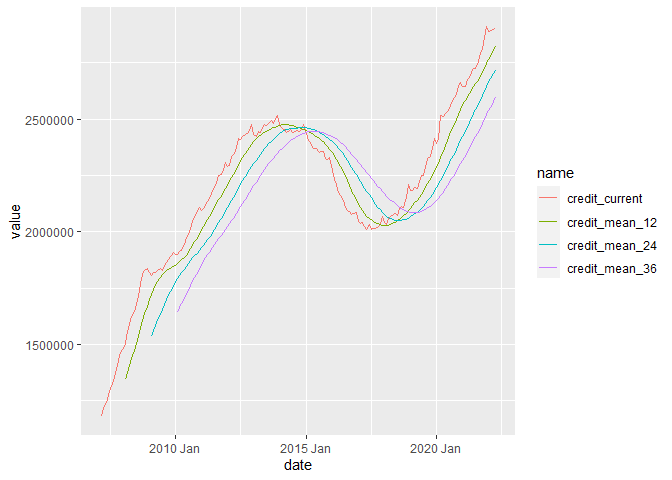<!-- -->


### Recursos Livres pessoa fisica

**Operações de crédito - concessões de crédito - recursos livres - pessoa física**

**Frequência:** Mensal de 2011.03 até 2022.04

**Fonte:** Banco Central do Brasil, Notas Econômico-financeiras para a Imprensa, Política Monetária e Operações de Crédito do SFN (Bacen/Notas Imprensa/Moeda)

**Unidade:** R\$ (milhões)

**Comentário:** Estatísticas das operações de crédito do Sistema Financeiro Nacional. Concessões de crédito refere-se a desembolsos referentes a empréstimos e financiamentos efetivamente creditados ao tomador do crédito. Os valores informados correspondem às concessões ocorridas no mês de referênciaEstas novas operações de crédito são contratadas com taxas de juros livremente pactuadas entre mutuários e instituições financeiras. Não inclui operações referenciadas em taxas regulamentadas, operações vinculadas a recursos do Banco Nacional de Desenvolvimento Econômico e Social (BNDES) ou quaisquer outras lastreadas em recursos compulsórios ou governamentais.Classificação por tipo de cliente: pessoa física (PF). Mais informações: [GLOSSÁRIO](http://ipeadata.gov.br/doc/glossariocredito.pdf); [Nota para a Imprensa de Política Monetária e Operações de Crédito](http://ipeadata.gov.br/doc/notaempr.pdf); [Nota Metodológica -- Revisão da estrutura de dados de crédito -- Fevereiro de 2015](http://ipeadata.gov.br/doc/notaempr201502.pdf) e SGS- Sistema de Gerenciamento de Séries Temporais, Banco Central.

**Atualizado em:** 27/07/2022

---

**Operações de crédito - concessões de crédito - recursos livres - pessoa física**

**Frequency:** Monthly from 2011.03 until 2022.04

**Source:** Banco Central do Brasil, Notas Econômico-financeiras para a Imprensa, Política Monetária e Operações de Crédito do SFN (Bacen/Notas Imprensa/Moeda)

**Unity:** R\$ (milhões)

**Comments:** Statistics of credit operations of the National Financial System. Credit grants refer to disbursements related to loans and financing effectively credited to the credit borrower. The reported values correspond to grants that occurred in the reference month. These new credit operations are contracted with interest rates freely agreed upon between borrowers and financial institutions. It does not include operations referenced in regulated rates, operations linked to resources of the National Bank for Economic and Social Development (BNDES), or any other operations backed by compulsory or government resources. Classification by type of customer: individual (PF). More information: [GLOSSÁRIO](http://ipeadata.gov.br/doc/glossariocredito.pdf); [Nota para a Imprensa de Política Monetária e Operações de Crédito](http://ipeadata.gov.br/doc/notaempr.pdf); [Nota Metodológica -- Revisão da estrutura de dados de crédito -- Fevereiro de 2015](http://ipeadata.gov.br/doc/notaempr201502.pdf) e SGS- Sistema de Gerenciamento de Séries Temporais, Banco Central.

**Last updated on:** 27/07/2022


```r
recursos_livres_pf <- read.csv('./data/ipea_data_concessao_credito/recursos_livres_pf.csv', dec='p')
recursos_livres_pf <- recursos_livres_pf[,1:2] %>%
  drop_na() %>%
  dplyr::rename(
 date = data)

recursos_livres_pf <- recursos_livres_pf %>% 
  mutate( date = yearmonth(as.character(date)))

recursos_livres_pf$credit_mean_12 <- recursos_livres_pf$credit %>% rollmean(k=12, na.pad = T, align = 'right')
recursos_livres_pf$credit_mean_24 <- recursos_livres_pf$credit %>% rollmean(k=24, na.pad = T, align = 'right')
recursos_livres_pf$credit_mean_36 <- recursos_livres_pf$credit %>% rollmean(k=36, na.pad = T, align = 'right')


recursos_livres_pf %>% 
  pivot_longer(cols = c('credit_mean_12', 'credit_mean_24', 'credit_mean_36', 'credit')) %>% 
  ggplot(aes(x=date, y=value))+
  geom_line(aes(col=name))
```

```
## Warning: Removed 69 row(s) containing missing values (geom_path).
```

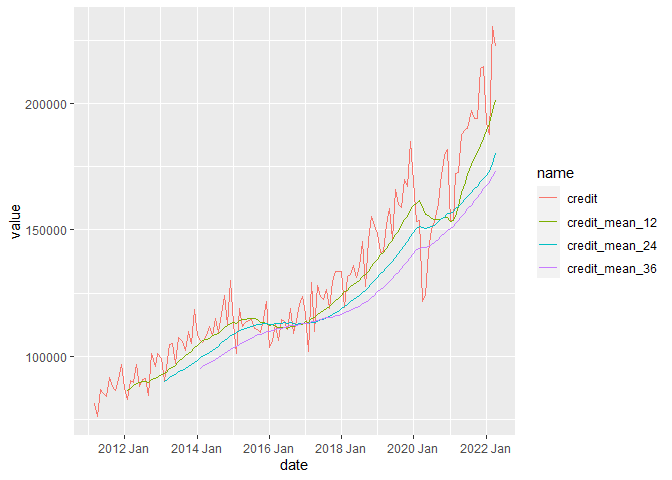<!-- -->

#### Inflation adjusted


```r
recursos_livres_pf_current <- recursos_livres_pf %>% 
  left_join(ipca, by=c('date'='data')) %>% 
  select(date, credit, valor_ipca)


acc_inflation <- (recursos_livres_pf_current$valor/100 + 1) %>% rev() %>% lag(1) %>% na.fill(1) %>% cumprod() 


credit_rev <- recursos_livres_pf_current$credit %>% rev

adjusted_values <- acc_inflation*credit_rev

recursos_livres_pf_current$credit_current <- adjusted_values %>% rev
recursos_livres_pf_current$acc_inflation <- acc_inflation %>% rev


recursos_livres_pf_current$credit_mean_12 <- recursos_livres_pf_current$credit_current %>% rollmean(k=12, na.pad = T, align = 'right')
recursos_livres_pf_current$credit_mean_24 <- recursos_livres_pf_current$credit_current %>% rollmean(k=24, na.pad = T, align = 'right')
recursos_livres_pf_current$credit_mean_36 <- recursos_livres_pf_current$credit_current %>% rollmean(k=36, na.pad = T, align = 'right')


recursos_livres_pf_current %>% 
  pivot_longer(cols = c('credit_mean_12', 'credit_mean_24', 'credit_mean_36', 'credit_current')) %>% 
  ggplot(aes(x=date, y=value))+
  geom_line(aes(col=name))
```

```
## Warning: Removed 69 row(s) containing missing values (geom_path).
```

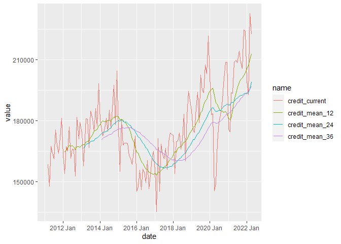<!-- -->

## Real Minimum Wage

**Salário mínimo real**

**Frequência:** Mensal de 1940.07 até 2022.07

**Fonte:** [Instituto de Pesquisa Econômica Aplicada](http://www.ipea.gov.br/)

**Unidade:** R\$ (do último mês)

**Comentário:** O Salário mínimo nominal é o menor salário definido por lei para remuneração do trabalhador brasileiro. O salário minimo real é o valor do salário mínimo nominal abatido o percentual de inflação do mês, o qual é medido através de diferentes índices de preço. Nota:

1.  Série em reais (R\$) constantes do último mês, elaborada pelo IPEA, deflacionando-se o salário mínimo nominal pelo Índice Nacional de Preços ao Consumidor (INPC) do IBGE a partir de março de 1979. Para períodos anteriores, os deflatores utilizados foram o IGPC-Mtb (jan/1948-mar/1979), o IPC-RJ/FGV (jan/1944-jan/1948) e o IPC-SP/Fipe (jul/1940-jan/1944).

2.  Em julho de 1994 o deflator sofre um ajuste em função da mudança de unidade monetária de cruzeiros reais para reais. A inflação do INPC em julho foi medida comparando os preços em reais de julho com os preços em cruzeiros reais de junho convertidos para URV (Unidade Real de Valor) no dia em que foram coletados. Já a variação do salário mínimo é medida pelo valor do salário de julho em reais pelo salário de junho em cruzeiros reais convertido pela URV do último dia de junho, e não pela taxa média de junho. Dessa forma, o valor do salário mínimo em reais de junho fica subestimado, e a variação do salário mínimo entre junho e julho é bem maior do que a inflação em reais no mesmo período. Para eliminar esta diferença, a variação do deflator em julho foi multiplicada por 1,23.

3.  O salário mínimo urbano foi instituído no Brasil por decreto-lei do presidente Getúlio Vargas, durante a ditadura do Estado Novo, e começou a vigorar em julho de 1940, com valores diferenciados entre estados e sub-regiões. Em 1943, foi incorporado à Consolidação das Leis do Trabalho (CLT) e, em 1963, foi estendido ao campo por meio do Estatuto do Trabalhador Rural. Foi nacionalmente unificado em maio de 1984, mas, desde 2000, a Lei Complementar 103 permite que os estados fixem pisos estaduais superiores ao mínimo nacional. Os dados desta série para o período em que a legislação federal definia faixas diversificadas referem-se sempre ao maior salário mínimo vigente no país. Quanto ao período anterior à unificação, ver: Mais informações: Constituição Federal (Art. 7º).

**Atualizado em:** 12/08/2022

---

**Real Minimum Wage**

**Frequency:** MOnrhly from 1940.07 until 2022.07

**Source:** [Instituto de Pesquisa Econômica Aplicada](http://www.ipea.gov.br/)

**Unit:** R\$ (From last month)

**Comments:** The nominal minimum wage is the lowest salary defined by law for the remuneration of Brazilian workers. The real minimum wage is the value of the nominal minimum wage minus the percentage of inflation for the month, which is measured through different price indexes. Note:
1. Series in constant reais (R$) from the last month, prepared by IPEA, deflating the nominal minimum wage by the National Consumer Price Index (INPC) of IBGE from March 1979. For earlier periods, the deflators used were IGPC-Mtb (Jan/1948-Mar/1979), IPC-RJ/FGV (Jan/1944-Jan/1948), and IPC-SP/Fipe (Jul/1940-Jan/1944).

2. In July 1994, the deflator underwent an adjustment due to the change of monetary unit from cruzeiros reais to reais. INPC inflation in July was measured by comparing prices in reais in July with prices in cruzeiros reais in June, converted to URV (Real Value Unit) on the day they were collected. The variation of the minimum wage, on the other hand, is measured by the value of the salary in reais in July by the salary in cruzeiros reais in June converted by the URV of the last day of June, and not by the average rate of June. This way, the value of the minimum wage in reais in June is underestimated, and the variation of the minimum wage between June and July is much higher than inflation in reais in the same period. To eliminate this difference, the variation of the deflator in July was multiplied by 1.23.

3. The urban minimum wage was established in Brazil by a decree-law of President Getúlio Vargas, during the dictatorship of the Estado Novo, and began to take effect in July 1940, with differentiated values between states and subregions. In 1943, it was incorporated into the Consolidation of Labor Laws (CLT) and, in 1963, it was extended to the countryside through the Rural Worker Statute. It was nationally unified in May 1984, but, since 2000, Complementary Law 103 allows states to set higher state floors than the national minimum. The data in this series for the period when federal legislation defined diversified ranges always refer to the highest minimum wage in the country. As for the period before unification, see: More information: Federal Constitution (Art. 7º)


**Last updated on:** 12/08/2022


```r
minimum_wage <- read.csv('./data/ipea_data_salario_minimo_real/minimum_wage.csv', dec='p')

minimum_wage %>% pretty_sample_show()
```

<div style="border: 1px solid #ddd; padding: 5px; overflow-x: scroll; width:100%; "><table class=" lightable-classic lightable-striped lightable-hover" style='font-family: "Arial Narrow", "Source Sans Pro", sans-serif; width: auto !important; '>
 <thead>
  <tr>
   <th style="text-align:left;"> data </th>
   <th style="text-align:left;"> wages </th>
   <th style="text-align:left;"> X </th>
  </tr>
 </thead>
<tbody>
  <tr>
   <td style="text-align:left;"> 2012.10 </td>
   <td style="text-align:left;"> 1126.95858472125 </td>
   <td style="text-align:left;"> NA </td>
  </tr>
  <tr>
   <td style="text-align:left;"> 2007.05 </td>
   <td style="text-align:left;"> 932.873259207271 </td>
   <td style="text-align:left;"> NA </td>
  </tr>
  <tr>
   <td style="text-align:left;"> 2014.12 </td>
   <td style="text-align:left;"> 1154.95134649867 </td>
   <td style="text-align:left;"> NA </td>
  </tr>
  <tr>
   <td style="text-align:left;"> 1951.05 </td>
   <td style="text-align:left;"> 408.753611752867 </td>
   <td style="text-align:left;"> NA </td>
  </tr>
  <tr>
   <td style="text-align:left;"> 2017.12 </td>
   <td style="text-align:left;"> 1234.81204936822 </td>
   <td style="text-align:left;"> NA </td>
  </tr>
  <tr>
   <td style="text-align:left;"> 1965.01 </td>
   <td style="text-align:left;"> 1090.78685644466 </td>
   <td style="text-align:left;"> NA </td>
  </tr>
  <tr>
   <td style="text-align:left;"> 2004.02 </td>
   <td style="text-align:left;"> 679.758096480125 </td>
   <td style="text-align:left;"> NA </td>
  </tr>
  <tr>
   <td style="text-align:left;"> 2011.07 </td>
   <td style="text-align:left;"> 1059.06194260718 </td>
   <td style="text-align:left;"> NA </td>
  </tr>
  <tr>
   <td style="text-align:left;"> 1968.05 </td>
   <td style="text-align:left;"> 1033.63805323777 </td>
   <td style="text-align:left;"> NA </td>
  </tr>
  <tr>
   <td style="text-align:left;"> 1971.09 </td>
   <td style="text-align:left;"> 940.5251423794 </td>
   <td style="text-align:left;"> NA </td>
  </tr>
</tbody>
</table></div>

```r
minimum_wage <- minimum_wage[,1:2] %>% 
  dplyr::rename(date = data) %>% 
  mutate(
    date = yearmonth(as.character(date)),
    wages = as.double(wages)
    
    )
```

### Visualization


```r
minimum_wage %>% 
  filter(date>=as.Date('2010-01-10')) %>% 
  ggplot(aes(x=date, y=wages))+
  geom_line(color='blue')+
  ylim(1020, 1300) 
```

```
## Warning in mask$eval_all_filter(dots, env_filter): Incompatible methods
## (">=.vctrs_vctr", ">=.Date") for ">="
```

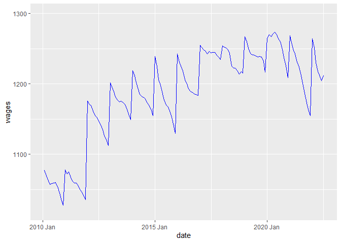<!-- -->

## Modeling Power Consumption

### General impact on power consumption

#### IPCA


```r
monthly_consumption_ipca <- monthly_consumption %>% left_join(ipca, by=c('year_month'='data'))

general_ipca_lm <- lm(total ~ . -year_month, data=monthly_consumption_ipca)

general_ipca_lm %>% test_linearfit()
```

```
## 
## Call:
## lm(formula = total ~ . - year_month, data = monthly_consumption_ipca)
## 
## Residuals:
##      Min       1Q   Median       3Q      Max 
## -2179599  -571074   -61177   693427  1990221 
## 
## Coefficients:
##             Estimate Std. Error t value Pr(>|t|)    
## (Intercept) 41290404     517107  79.849   <2e-16 ***
## valor_ipca    939985     510972   1.840   0.0696 .  
## ipca_3        200757     249679   0.804   0.4238    
## ipca_12      -179580     117325  -1.531   0.1299    
## ipca_24        59934      96870   0.619   0.5379    
## ipca_36      -138536      57189  -2.422   0.0177 *  
## ---
## Signif. codes:  0 '***' 0.001 '**' 0.01 '*' 0.05 '.' 0.1 ' ' 1
## 
## Residual standard error: 981300 on 78 degrees of freedom
## Multiple R-squared:  0.3377,	Adjusted R-squared:  0.2952 
## F-statistic: 7.953 on 5 and 78 DF,  p-value: 4.262e-06
```

```
## $model_name
## [1] "name"
## 
## $`f_statistic (<.05)`
## [1] 4.261985e-06
## 
## $rsquared
## [1] 0.3376717
## 
## $r.adjusted
## [1] 0.2952148
## 
## $normality_test_p
## [1] 0.7995897
## 
## $`brusch_pagan_p(>.05)`
## [1] 0.1601272
## 
## $logLik
## 'log Lik.' -1274.993 (df=7)
```

```r
general_ipca_lm.s <- general_ipca_lm %>% step(k=step_wise_k, trace=F)

general_ipca_stats <- general_ipca_lm.s %>% test_linearfit(model_name = 'ipca_gen')
```

```
## 
## Call:
## lm(formula = total ~ valor_ipca + ipca_36, data = monthly_consumption_ipca)
## 
## Residuals:
##      Min       1Q   Median       3Q      Max 
## -2082467  -672301    38131   682979  2074553 
## 
## Coefficients:
##             Estimate Std. Error t value Pr(>|t|)    
## (Intercept) 41265703     473096  87.225  < 2e-16 ***
## valor_ipca    912830     321126   2.843  0.00566 ** 
## ipca_36      -138349      23733  -5.829 1.09e-07 ***
## ---
## Signif. codes:  0 '***' 0.001 '**' 0.01 '*' 0.05 '.' 0.1 ' ' 1
## 
## Residual standard error: 981400 on 81 degrees of freedom
## Multiple R-squared:  0.312,	Adjusted R-squared:  0.295 
## F-statistic: 18.37 on 2 and 81 DF,  p-value: 2.644e-07
```

```r
general_ipca_stats
```

```
## $model_name
## [1] "ipca_gen"
## 
## $`f_statistic (<.05)`
## [1] 2.644231e-07
## 
## $rsquared
## [1] 0.3120013
## 
## $r.adjusted
## [1] 0.2950136
## 
## $normality_test_p
## [1] 0.8722185
## 
## $`brusch_pagan_p(>.05)`
## [1] 0.3092919
## 
## $logLik
## 'log Lik.' -1276.59 (df=4)
```

#### Selic


```r
monthly_consumption_selic <- monthly_consumption %>% left_join(selic_monthly %>% select(-data))
```

```
## Joining, by = "year_month"
```

```r
general_selic_lm <- lm(total ~. -year_month, data = monthly_consumption_selic)

general_selic_lm %>% test_linearfit()
```

```
## 
## Call:
## lm(formula = total ~ . - year_month, data = monthly_consumption_selic)
## 
## Residuals:
##      Min       1Q   Median       3Q      Max 
## -2260165  -594910   -70145   763240  1982137 
## 
## Coefficients:
##             Estimate Std. Error t value Pr(>|t|)    
## (Intercept) 40476909    1251505  32.343  < 2e-16 ***
## valor_selic -1690827    2540392  -0.666  0.50764    
## selic_03     -858073    1236250  -0.694  0.48969    
## selic_12      667477     271849   2.455  0.01630 *  
## selic_24     -416204     150348  -2.768  0.00704 ** 
## selic_36      119281      82020   1.454  0.14988    
## ---
## Signif. codes:  0 '***' 0.001 '**' 0.01 '*' 0.05 '.' 0.1 ' ' 1
## 
## Residual standard error: 1028000 on 78 degrees of freedom
## Multiple R-squared:  0.2735,	Adjusted R-squared:  0.2269 
## F-statistic: 5.872 on 5 and 78 DF,  p-value: 0.0001174
```

```
## $model_name
## [1] "name"
## 
## $`f_statistic (<.05)`
## [1] 0.0001174471
## 
## $rsquared
## [1] 0.2734881
## 
## $r.adjusted
## [1] 0.2269169
## 
## $normality_test_p
## [1] 0.8011495
## 
## $`brusch_pagan_p(>.05)`
## [1] 0.05798398
## 
## $logLik
## 'log Lik.' -1278.877 (df=7)
```

```r
general_selic_lm.s <- general_selic_lm %>% step(k=step_wise_k, trace=F)

general_selic_stats <- general_selic_lm.s %>% test_linearfit(model_name = 'selic_gen')
```

```
## 
## Call:
## lm(formula = total ~ selic_03 + selic_12 + selic_24, data = monthly_consumption_selic)
## 
## Residuals:
##      Min       1Q   Median       3Q      Max 
## -2047582  -690885    -2071   690731  2267071 
## 
## Coefficients:
##             Estimate Std. Error t value Pr(>|t|)    
## (Intercept) 42066388     631201  66.645  < 2e-16 ***
## selic_03    -1779828     644069  -2.763  0.00710 ** 
## selic_12      618221     253198   2.442  0.01683 *  
## selic_24     -233742      74358  -3.143  0.00234 ** 
## ---
## Signif. codes:  0 '***' 0.001 '**' 0.01 '*' 0.05 '.' 0.1 ' ' 1
## 
## Residual standard error: 1033000 on 80 degrees of freedom
## Multiple R-squared:  0.2477,	Adjusted R-squared:  0.2195 
## F-statistic: 8.779 on 3 and 80 DF,  p-value: 4.227e-05
```

```r
general_selic_stats
```

```
## $model_name
## [1] "selic_gen"
## 
## $`f_statistic (<.05)`
## [1] 4.227281e-05
## 
## $rsquared
## [1] 0.2476709
## 
## $r.adjusted
## [1] 0.2194586
## 
## $normality_test_p
## [1] 0.7808741
## 
## $`brusch_pagan_p(>.05)`
## [1] 0.1456943
## 
## $logLik
## 'log Lik.' -1280.344 (df=5)
```

#### PIB


```r
quartely_consumption_pib <- quartely_consumption %>% left_join(quarter_pib, by=c('year_quarter'='year'))


general_pib_lm <- lm(total ~ . -year_quarter, data=quartely_consumption_pib )

general_pib_lm %>% test_linearfit()
```

```
## 
## Call:
## lm(formula = total ~ . - year_quarter, data = quartely_consumption_pib)
## 
## Residuals:
##      Min       1Q   Median       3Q      Max 
## -3992425 -1907397   209686  2051959  3278427 
## 
## Coefficients:
##                 Estimate Std. Error t value Pr(>|t|)    
## (Intercept)    9.202e+07  7.057e+06  13.039 4.14e-12 ***
## pib           -1.801e+01  1.923e+01  -0.937    0.359    
## pib_12_months  1.131e+02  6.858e+01   1.649    0.113    
## pib_24_months -4.800e+00  1.213e+02  -0.040    0.969    
## pib_36_months -7.867e+01  7.243e+01  -1.086    0.289    
## ---
## Signif. codes:  0 '***' 0.001 '**' 0.01 '*' 0.05 '.' 0.1 ' ' 1
## 
## Residual standard error: 2637000 on 23 degrees of freedom
## Multiple R-squared:  0.3775,	Adjusted R-squared:  0.2692 
## F-statistic: 3.487 on 4 and 23 DF,  p-value: 0.02293
```

```
## $model_name
## [1] "name"
## 
## $`f_statistic (<.05)`
## [1] 0.02292974
## 
## $rsquared
## [1] 0.3774783
## 
## $r.adjusted
## [1] 0.2692137
## 
## $normality_test_p
## [1] 0.1147745
## 
## $`brusch_pagan_p(>.05)`
## [1] 0.1521235
## 
## $logLik
## 'log Lik.' -450.96 (df=6)
```

```r
general_pib_lm.s <- general_pib_lm %>% step(k=step_wise_k, trace=F)

general_pib_stats <- general_pib_lm.s %>% test_linearfit(model_name='pib_gen')
```

```
## 
## Call:
## lm(formula = total ~ pib_12_months + pib_36_months, data = quartely_consumption_pib)
## 
## Residuals:
##      Min       1Q   Median       3Q      Max 
## -4263888 -1866641   -50147  2046722  4293054 
## 
## Coefficients:
##                 Estimate Std. Error t value Pr(>|t|)    
## (Intercept)    9.295e+07  6.519e+06  14.258 1.64e-13 ***
## pib_12_months  8.551e+01  2.743e+01   3.118  0.00454 ** 
## pib_36_months -7.453e+01  2.578e+01  -2.891  0.00783 ** 
## ---
## Signif. codes:  0 '***' 0.001 '**' 0.01 '*' 0.05 '.' 0.1 ' ' 1
## 
## Residual standard error: 2578000 on 25 degrees of freedom
## Multiple R-squared:  0.3534,	Adjusted R-squared:  0.3016 
## F-statistic: 6.831 on 2 and 25 DF,  p-value: 0.004298
```

```r
general_pib_stats
```

```
## $model_name
## [1] "pib_gen"
## 
## $`f_statistic (<.05)`
## [1] 0.00429825
## 
## $rsquared
## [1] 0.3533589
## 
## $r.adjusted
## [1] 0.3016276
## 
## $normality_test_p
## [1] 0.5649484
## 
## $`brusch_pagan_p(>.05)`
## [1] 0.1543553
## 
## $logLik
## 'log Lik.' -451.4922 (df=4)
```

#### Temperature


```r
temperature_data_summary_weighted_general.f <- temperature_data_summary_weighted_general %>%
  filter(region == 'S') %>% 
  select(-region, -percentage, -unique_key)

temperature_data_summary_weighted_general.f$mean_temp_3 <- temperature_data_summary_weighted_general.f$weighted_temp %>% rollmean(k=3, na.pad = T, align = 'right')
temperature_data_summary_weighted_general.f$mean_max_temp_3 <- temperature_data_summary_weighted_general.f$weighted_temp_max %>% rollmean(k=3, na.pad = T, align = 'right')
temperature_data_summary_weighted_general.f$mean_temp_6 <- temperature_data_summary_weighted_general.f$weighted_temp %>% rollmean(k=6, na.pad = T, align = 'right')

temperature_data_summary_weighted_general.f
```

```
## # A tibble: 84 × 10
## # Groups:   year_month [84]
##    year_month mean_temp max_temp weighted_temp weighted_temp_max equal_weight
##         <mth>     <dbl>    <dbl>         <dbl>             <dbl>        <dbl>
##  1   2013 Jan      22.1     38            24.0              38.5         24.6
##  2   2013 Feb      22.4     38.8          24.4              38.3         24.8
##  3   2013 Mar      20.2     36.2          23.8              39.1         24.4
##  4   2013 Apr      18.8     33.9          22.2              37.0         23.2
##  5   2013 May      16.0     35            20.9              37.3         22.2
##  6   2013 Jun      14.6     31.5          20.4              34.3         21.6
##  7   2013 Jul      13.5     36.8          19.4              35.8         20.7
##  8   2013 Aug      13.9     35.1          20.0              37.4         21.4
##  9   2013 Sep      16.7     36.5          22.0              39.6         23.2
## 10   2013 Oct      18.6     35.9          22.7              38.8         23.8
## # … with 74 more rows, and 4 more variables: equal_weight_max <dbl>,
## #   mean_temp_3 <dbl>, mean_max_temp_3 <dbl>, mean_temp_6 <dbl>
```

```r
monthly_consumption_temperature_general <-  monthly_consumption %>% left_join(temperature_data_summary_weighted_general.f)
```

```
## Joining, by = "year_month"
```

##### Differences between weigthed and equal weight average


```r
general_temperature_lm <- lm(total ~ weighted_temp, monthly_consumption_temperature_general)

general_temperature_lm %>% test_linearfit()
```

```
## 
## Call:
## lm(formula = total ~ weighted_temp, data = monthly_consumption_temperature_general)
## 
## Residuals:
##      Min       1Q   Median       3Q      Max 
## -1783342  -656152    -9680   551947  1983718 
## 
## Coefficients:
##               Estimate Std. Error t value Pr(>|t|)    
## (Intercept)   29001209    1188397  24.404  < 2e-16 ***
## weighted_temp   436944      51973   8.407 1.09e-12 ***
## ---
## Signif. codes:  0 '***' 0.001 '**' 0.01 '*' 0.05 '.' 0.1 ' ' 1
## 
## Residual standard error: 861800 on 82 degrees of freedom
## Multiple R-squared:  0.4629,	Adjusted R-squared:  0.4564 
## F-statistic: 70.68 on 1 and 82 DF,  p-value: 1.087e-12
```

```
## $model_name
## [1] "name"
## 
## $`f_statistic (<.05)`
## [1] 1.087479e-12
## 
## $rsquared
## [1] 0.4629296
## 
## $r.adjusted
## [1] 0.45638
## 
## $normality_test_p
## [1] 0.8488955
## 
## $`brusch_pagan_p(>.05)`
## [1] 0.004047089
## 
## $logLik
## 'log Lik.' -1266.188 (df=3)
```

```r
general_temperature_equal_lm <- lm(total ~ equal_weight, monthly_consumption_temperature_general)

general_temperature_equal_lm %>% test_linearfit()
```

```
## 
## Call:
## lm(formula = total ~ equal_weight, data = monthly_consumption_temperature_general)
## 
## Residuals:
##      Min       1Q   Median       3Q      Max 
## -1755452  -696115   -11964   680727  1909193 
## 
## Coefficients:
##              Estimate Std. Error t value Pr(>|t|)    
## (Intercept)  26765323    1556814  17.192  < 2e-16 ***
## equal_weight   515521      65681   7.849 1.39e-11 ***
## ---
## Signif. codes:  0 '***' 0.001 '**' 0.01 '*' 0.05 '.' 0.1 ' ' 1
## 
## Residual standard error: 888600 on 82 degrees of freedom
## Multiple R-squared:  0.429,	Adjusted R-squared:  0.422 
## F-statistic: 61.61 on 1 and 82 DF,  p-value: 1.391e-11
```

```
## $model_name
## [1] "name"
## 
## $`f_statistic (<.05)`
## [1] 1.390575e-11
## 
## $rsquared
## [1] 0.4289915
## 
## $r.adjusted
## [1] 0.422028
## 
## $normality_test_p
## [1] 0.6865594
## 
## $`brusch_pagan_p(>.05)`
## [1] 0.006837781
## 
## $logLik
## 'log Lik.' -1268.762 (df=3)
```

##### Testing average of 3 and 6 months


```r
lm(total ~ weighted_temp + mean_temp_3 , monthly_consumption_temperature_general) %>% test_linearfit()
```

```
## 
## Call:
## lm(formula = total ~ weighted_temp + mean_temp_3, data = monthly_consumption_temperature_general)
## 
## Residuals:
##      Min       1Q   Median       3Q      Max 
## -1704743  -560494   -27609   583304  1915558 
## 
## Coefficients:
##               Estimate Std. Error t value Pr(>|t|)    
## (Intercept)   27344742    1298759  21.055  < 2e-16 ***
## weighted_temp   299274      89203   3.355  0.00122 ** 
## mean_temp_3     212101     101518   2.089  0.03990 *  
## ---
## Signif. codes:  0 '***' 0.001 '**' 0.01 '*' 0.05 '.' 0.1 ' ' 1
## 
## Residual standard error: 819800 on 79 degrees of freedom
##   (2 observations deleted due to missingness)
## Multiple R-squared:  0.525,	Adjusted R-squared:  0.5129 
## F-statistic: 43.65 on 2 and 79 DF,  p-value: 1.7e-13
```

```
## $model_name
## [1] "name"
## 
## $`f_statistic (<.05)`
## [1] 1.700465e-13
## 
## $rsquared
## [1] 0.5249676
## 
## $r.adjusted
## [1] 0.5129415
## 
## $normality_test_p
## [1] 0.9087876
## 
## $`brusch_pagan_p(>.05)`
## [1] 0.003261553
## 
## $logLik
## 'log Lik.' -1231.4 (df=4)
```

```r
lm(total ~ weighted_temp + mean_temp_6 , monthly_consumption_temperature_general) %>% test_linearfit()
```

```
## 
## Call:
## lm(formula = total ~ weighted_temp + mean_temp_6, data = monthly_consumption_temperature_general)
## 
## Residuals:
##      Min       1Q   Median       3Q      Max 
## -1789922  -602771    -1094   551369  2001904 
## 
## Coefficients:
##               Estimate Std. Error t value Pr(>|t|)    
## (Intercept)   26128888    2032904  12.853  < 2e-16 ***
## weighted_temp   437617      53272   8.215 4.27e-12 ***
## mean_temp_6     128031      87426   1.464    0.147    
## ---
## Signif. codes:  0 '***' 0.001 '**' 0.01 '*' 0.05 '.' 0.1 ' ' 1
## 
## Residual standard error: 836400 on 76 degrees of freedom
##   (5 observations deleted due to missingness)
## Multiple R-squared:  0.519,	Adjusted R-squared:  0.5064 
## F-statistic: 41.01 on 2 and 76 DF,  p-value: 8.319e-13
```

```
## $model_name
## [1] "name"
## 
## $`f_statistic (<.05)`
## [1] 8.319079e-13
## 
## $rsquared
## [1] 0.5190419
## 
## $r.adjusted
## [1] 0.5063851
## 
## $normality_test_p
## [1] 0.7647268
## 
## $`brusch_pagan_p(>.05)`
## [1] 0.006755446
## 
## $logLik
## 'log Lik.' -1187.876 (df=4)
```

##### Including current values and average togheter


```r
general_temperature_lm <- lm(total ~ weighted_temp + mean_temp_3 + mean_max_temp_3 + weighted_temp_max , monthly_consumption_temperature_general)

general_temperature_lm %>% test_linearfit()
```

```
## 
## Call:
## lm(formula = total ~ weighted_temp + mean_temp_3 + mean_max_temp_3 + 
##     weighted_temp_max, data = monthly_consumption_temperature_general)
## 
## Residuals:
##      Min       1Q   Median       3Q      Max 
## -1748543  -574231    39803   568391  1769619 
## 
## Coefficients:
##                   Estimate Std. Error t value Pr(>|t|)    
## (Intercept)       25095719    3061660   8.197 4.25e-12 ***
## weighted_temp       247725     159226   1.556    0.124    
## mean_temp_3         155368     162285   0.957    0.341    
## mean_max_temp_3     176037     169746   1.037    0.303    
## weighted_temp_max   -51910     127065  -0.409    0.684    
## ---
## Signif. codes:  0 '***' 0.001 '**' 0.01 '*' 0.05 '.' 0.1 ' ' 1
## 
## Residual standard error: 823700 on 77 degrees of freedom
##   (2 observations deleted due to missingness)
## Multiple R-squared:  0.5326,	Adjusted R-squared:  0.5083 
## F-statistic: 21.93 on 4 and 77 DF,  p-value: 4.139e-12
```

```
## $model_name
## [1] "name"
## 
## $`f_statistic (<.05)`
## [1] 4.138925e-12
## 
## $rsquared
## [1] 0.532562
## 
## $r.adjusted
## [1] 0.5082795
## 
## $normality_test_p
## [1] 0.8724429
## 
## $`brusch_pagan_p(>.05)`
## [1] 0.002318606
## 
## $logLik
## 'log Lik.' -1230.739 (df=6)
```

```r
general_temperature_lm.s <- general_temperature_lm %>% step(k=step_wise_k, trace=F)
general_temperature_lm.s
```

```
## 
## Call:
## lm(formula = total ~ weighted_temp + mean_temp_3, data = monthly_consumption_temperature_general)
## 
## Coefficients:
##   (Intercept)  weighted_temp    mean_temp_3  
##      27344742         299274         212101
```

```r
general_temperature_stats <- general_temperature_lm.s %>% test_linearfit(model_name = 'temp_gen')
```

```
## 
## Call:
## lm(formula = total ~ weighted_temp + mean_temp_3, data = monthly_consumption_temperature_general)
## 
## Residuals:
##      Min       1Q   Median       3Q      Max 
## -1704743  -560494   -27609   583304  1915558 
## 
## Coefficients:
##               Estimate Std. Error t value Pr(>|t|)    
## (Intercept)   27344742    1298759  21.055  < 2e-16 ***
## weighted_temp   299274      89203   3.355  0.00122 ** 
## mean_temp_3     212101     101518   2.089  0.03990 *  
## ---
## Signif. codes:  0 '***' 0.001 '**' 0.01 '*' 0.05 '.' 0.1 ' ' 1
## 
## Residual standard error: 819800 on 79 degrees of freedom
##   (2 observations deleted due to missingness)
## Multiple R-squared:  0.525,	Adjusted R-squared:  0.5129 
## F-statistic: 43.65 on 2 and 79 DF,  p-value: 1.7e-13
```

```r
general_temperature_stats
```

```
## $model_name
## [1] "temp_gen"
## 
## $`f_statistic (<.05)`
## [1] 1.700465e-13
## 
## $rsquared
## [1] 0.5249676
## 
## $r.adjusted
## [1] 0.5129415
## 
## $normality_test_p
## [1] 0.9087876
## 
## $`brusch_pagan_p(>.05)`
## [1] 0.003261553
## 
## $logLik
## 'log Lik.' -1231.4 (df=4)
```

#### Credit concession


```r
monthly_consumption_credit <- monthly_consumption %>% left_join(recursos_livres_totais_current, by=c('year_month' = 'date')) %>% 
  select(-valor_ipca, -acc_inflation)
```

##### Comparing current and not current credit values


```r
lm(total ~ credit, data=monthly_consumption_credit) %>% test_linearfit()
```

```
## 
## Call:
## lm(formula = total ~ credit, data = monthly_consumption_credit)
## 
## Residuals:
##      Min       1Q   Median       3Q      Max 
## -2311920  -818502   -14031   752284  2777819 
## 
## Coefficients:
##              Estimate Std. Error t value Pr(>|t|)    
## (Intercept) 3.318e+07  1.471e+06  22.566  < 2e-16 ***
## credit      3.620e+00  9.185e-01   3.942 0.000169 ***
## ---
## Signif. codes:  0 '***' 0.001 '**' 0.01 '*' 0.05 '.' 0.1 ' ' 1
## 
## Residual standard error: 1078000 on 82 degrees of freedom
## Multiple R-squared:  0.1593,	Adjusted R-squared:  0.149 
## F-statistic: 15.54 on 1 and 82 DF,  p-value: 0.0001694
```

```
## $model_name
## [1] "name"
## 
## $`f_statistic (<.05)`
## [1] 0.0001694204
## 
## $rsquared
## [1] 0.1592962
## 
## $r.adjusted
## [1] 0.1490437
## 
## $normality_test_p
## [1] 0.726625
## 
## $`brusch_pagan_p(>.05)`
## [1] 0.4715305
## 
## $logLik
## 'log Lik.' -1285.009 (df=3)
```

```r
lm(total ~ credit_current, data=monthly_consumption_credit) %>% test_linearfit()
```

```
## 
## Call:
## lm(formula = total ~ credit_current, data = monthly_consumption_credit)
## 
## Residuals:
##      Min       1Q   Median       3Q      Max 
## -2353831  -794777  -142246   717984  2646522 
## 
## Coefficients:
##                 Estimate Std. Error t value Pr(>|t|)    
## (Intercept)    3.778e+07  1.712e+06  22.070   <2e-16 ***
## credit_current 5.236e-01  7.552e-01   0.693     0.49    
## ---
## Signif. codes:  0 '***' 0.001 '**' 0.01 '*' 0.05 '.' 0.1 ' ' 1
## 
## Residual standard error: 1173000 on 82 degrees of freedom
## Multiple R-squared:  0.005829,	Adjusted R-squared:  -0.006295 
## F-statistic: 0.4808 on 1 and 82 DF,  p-value: 0.49
```

```
## $model_name
## [1] "name"
## 
## $`f_statistic (<.05)`
## [1] 0.4900248
## 
## $rsquared
## [1] 0.005829096
## 
## $r.adjusted
## [1] -0.006294939
## 
## $normality_test_p
## [1] 0.2481737
## 
## $`brusch_pagan_p(>.05)`
## [1] 0.7020441
## 
## $logLik
## 'log Lik.' -1292.051 (df=3)
```

##### Credit concession general impact


```r
general_credit_lm <- lm(total ~ . -credit -year_month, data=monthly_consumption_credit)

general_credit_lm %>% test_linearfit()
```

```
## 
## Call:
## lm(formula = total ~ . - credit - year_month, data = monthly_consumption_credit)
## 
## Residuals:
##      Min       1Q   Median       3Q      Max 
## -2052081  -714459   -64798   711866  2607632 
## 
## Coefficients:
##                  Estimate Std. Error t value Pr(>|t|)    
## (Intercept)     3.178e+07  5.048e+06   6.296  1.6e-08 ***
## credit_current  1.201e+01  4.422e+00   2.716   0.0081 ** 
## credit_mean_12 -8.343e+00  1.090e+01  -0.765   0.4465    
## credit_mean_24 -1.079e+01  1.467e+01  -0.735   0.4644    
## credit_mean_36  1.030e+01  8.727e+00   1.180   0.2416    
## ---
## Signif. codes:  0 '***' 0.001 '**' 0.01 '*' 0.05 '.' 0.1 ' ' 1
## 
## Residual standard error: 1058000 on 79 degrees of freedom
## Multiple R-squared:  0.2199,	Adjusted R-squared:  0.1804 
## F-statistic: 5.567 on 4 and 79 DF,  p-value: 0.0005327
```

```
## $model_name
## [1] "name"
## 
## $`f_statistic (<.05)`
## [1] 0.0005326681
## 
## $rsquared
## [1] 0.2198815
## 
## $r.adjusted
## [1] 0.1803818
## 
## $normality_test_p
## [1] 0.43261
## 
## $`brusch_pagan_p(>.05)`
## [1] 0.7582065
## 
## $logLik
## 'log Lik.' -1281.867 (df=6)
```

```r
general_credit_lm.s <- general_credit_lm %>% step(k=step_wise_k, trace=F)

general_credit_stats <- general_credit_lm.s %>%  test_linearfit(model_name = 'credit_gen')
```

```
## 
## Call:
## lm(formula = total ~ credit_current + credit_mean_12, data = monthly_consumption_credit)
## 
## Residuals:
##      Min       1Q   Median       3Q      Max 
## -1859524  -862802   -53168   717151  2472953 
## 
## Coefficients:
##                  Estimate Std. Error t value Pr(>|t|)    
## (Intercept)     3.929e+07  1.590e+06  24.720  < 2e-16 ***
## credit_current  7.832e+00  1.815e+00   4.315 4.48e-05 ***
## credit_mean_12 -7.954e+00  1.830e+00  -4.347 3.98e-05 ***
## ---
## Signif. codes:  0 '***' 0.001 '**' 0.01 '*' 0.05 '.' 0.1 ' ' 1
## 
## Residual standard error: 1062000 on 81 degrees of freedom
## Multiple R-squared:  0.1939,	Adjusted R-squared:  0.174 
## F-statistic:  9.74 on 2 and 81 DF,  p-value: 0.000162
```

```r
general_credit_stats
```

```
## $model_name
## [1] "credit_gen"
## 
## $`f_statistic (<.05)`
## [1] 0.0001620189
## 
## $rsquared
## [1] 0.1938627
## 
## $r.adjusted
## [1] 0.1739581
## 
## $normality_test_p
## [1] 0.2680766
## 
## $`brusch_pagan_p(>.05)`
## [1] 0.6433134
## 
## $logLik
## 'log Lik.' -1283.245 (df=4)
```

#### Minimum wage general impact


```r
monthly_consumption_wages <- monthly_consumption %>% 
  left_join(minimum_wage, by=c('year_month'='date'))

general_wage_stats <- lm(total ~ wages, monthly_consumption_wages) %>% test_linearfit(model_name = 'wage_gen')
```

```
## 
## Call:
## lm(formula = total ~ wages, data = monthly_consumption_wages)
## 
## Residuals:
##      Min       1Q   Median       3Q      Max 
## -2493317  -813779  -155147   908533  2443524 
## 
## Coefficients:
##             Estimate Std. Error t value Pr(>|t|)    
## (Intercept) 25251846    4356844   5.796 1.22e-07 ***
## wages          11340       3602   3.148  0.00229 ** 
## ---
## Signif. codes:  0 '***' 0.001 '**' 0.01 '*' 0.05 '.' 0.1 ' ' 1
## 
## Residual standard error: 1111000 on 82 degrees of freedom
## Multiple R-squared:  0.1078,	Adjusted R-squared:  0.09693 
## F-statistic: 9.909 on 1 and 82 DF,  p-value: 0.002294
```

```r
general_wage_stats
```

```
## $model_name
## [1] "wage_gen"
## 
## $`f_statistic (<.05)`
## [1] 0.002294324
## 
## $rsquared
## [1] 0.1078084
## 
## $r.adjusted
## [1] 0.09692797
## 
## $normality_test_p
## [1] 0.3050034
## 
## $`brusch_pagan_p(>.05)`
## [1] 0.288174
## 
## $logLik
## 'log Lik.' -1287.505 (df=3)
```

#### All stats Summary


```r
list(general_ipca_stats,
general_selic_stats,
general_pib_stats,
general_temperature_stats,
general_credit_stats,
general_wage_stats) %>% unioun_lists() -> summary_general_model

summary_general_model %>% pretty_head_show(10)
```

<div style="border: 1px solid #ddd; padding: 5px; overflow-x: scroll; width:100%; "><table class=" lightable-classic lightable-striped lightable-hover" style='font-family: "Arial Narrow", "Source Sans Pro", sans-serif; width: auto !important; '>
 <thead>
  <tr>
   <th style="text-align:left;"> model_name </th>
   <th style="text-align:right;"> f_statistic....05. </th>
   <th style="text-align:right;"> rsquared </th>
   <th style="text-align:right;"> r.adjusted </th>
   <th style="text-align:right;"> normality_test_p </th>
   <th style="text-align:right;"> brusch_pagan_p...05. </th>
   <th style="text-align:right;"> logLik </th>
  </tr>
 </thead>
<tbody>
  <tr>
   <td style="text-align:left;"> ipca_gen </td>
   <td style="text-align:right;"> 0.0000003 </td>
   <td style="text-align:right;"> 0.3120013 </td>
   <td style="text-align:right;"> 0.2950136 </td>
   <td style="text-align:right;"> 0.8722185 </td>
   <td style="text-align:right;"> 0.3092919 </td>
   <td style="text-align:right;"> -1276.5897 </td>
  </tr>
  <tr>
   <td style="text-align:left;"> selic_gen </td>
   <td style="text-align:right;"> 0.0000423 </td>
   <td style="text-align:right;"> 0.2476709 </td>
   <td style="text-align:right;"> 0.2194586 </td>
   <td style="text-align:right;"> 0.7808741 </td>
   <td style="text-align:right;"> 0.1456943 </td>
   <td style="text-align:right;"> -1280.3439 </td>
  </tr>
  <tr>
   <td style="text-align:left;"> pib_gen </td>
   <td style="text-align:right;"> 0.0042983 </td>
   <td style="text-align:right;"> 0.3533589 </td>
   <td style="text-align:right;"> 0.3016276 </td>
   <td style="text-align:right;"> 0.5649484 </td>
   <td style="text-align:right;"> 0.1543553 </td>
   <td style="text-align:right;"> -451.4922 </td>
  </tr>
  <tr>
   <td style="text-align:left;"> temp_gen </td>
   <td style="text-align:right;"> 0.0000000 </td>
   <td style="text-align:right;"> 0.5249676 </td>
   <td style="text-align:right;"> 0.5129415 </td>
   <td style="text-align:right;"> 0.9087876 </td>
   <td style="text-align:right;"> 0.0032616 </td>
   <td style="text-align:right;"> -1231.3997 </td>
  </tr>
  <tr>
   <td style="text-align:left;"> credit_gen </td>
   <td style="text-align:right;"> 0.0001620 </td>
   <td style="text-align:right;"> 0.1938627 </td>
   <td style="text-align:right;"> 0.1739581 </td>
   <td style="text-align:right;"> 0.2680766 </td>
   <td style="text-align:right;"> 0.6433134 </td>
   <td style="text-align:right;"> -1283.2453 </td>
  </tr>
  <tr>
   <td style="text-align:left;"> wage_gen </td>
   <td style="text-align:right;"> 0.0022943 </td>
   <td style="text-align:right;"> 0.1078084 </td>
   <td style="text-align:right;"> 0.0969280 </td>
   <td style="text-align:right;"> 0.3050034 </td>
   <td style="text-align:right;"> 0.2881740 </td>
   <td style="text-align:right;"> -1287.5052 </td>
  </tr>
</tbody>
</table></div>

### Residential Power Consumption Impact

#### Creating Residential Dataframe


```r
power_consumption_sector_residential_aggregated <- power_consumption_sector %>% filter(SetorN1=='Residencial') %>%
  group_by(year_month) %>% 
  summarise(total=sum(total)) %>% 
  ungroup(.)
```

#### IPCA Impact


```r
ipca_power_df <-
  power_consumption_sector_residential_aggregated %>% left_join(ipca, by=c('year_month' = 'data'))

residential_ipca_lm <- lm(total ~ .  -year_month, data=ipca_power_df)

residential_ipca_lm %>% test_linearfit()
```

```
## 
## Call:
## lm(formula = total ~ . - year_month, data = ipca_power_df)
## 
## Residuals:
##     Min      1Q  Median      3Q     Max 
## -851857 -510244  -46042  399510 1533548 
## 
## Coefficients:
##             Estimate Std. Error t value Pr(>|t|)    
## (Intercept) 12239931     307861  39.758  < 2e-16 ***
## valor_ipca    705440     304209   2.319  0.02302 *  
## ipca_3         53304     148647   0.359  0.72087    
## ipca_12      -188951      69850  -2.705  0.00838 ** 
## ipca_24        82470      57672   1.430  0.15671    
## ipca_36       -71421      34047  -2.098  0.03917 *  
## ---
## Signif. codes:  0 '***' 0.001 '**' 0.01 '*' 0.05 '.' 0.1 ' ' 1
## 
## Residual standard error: 584200 on 78 degrees of freedom
## Multiple R-squared:  0.2834,	Adjusted R-squared:  0.2375 
## F-statistic: 6.171 on 5 and 78 DF,  p-value: 7.202e-05
```

```
## $model_name
## [1] "name"
## 
## $`f_statistic (<.05)`
## [1] 7.202438e-05
## 
## $rsquared
## [1] 0.2834407
## 
## $r.adjusted
## [1] 0.2375074
## 
## $normality_test_p
## [1] 0.02917666
## 
## $`brusch_pagan_p(>.05)`
## [1] 0.3794272
## 
## $logLik
## 'log Lik.' -1231.43 (df=7)
```

```r
residential_ipca_lm.s <- residential_ipca_lm %>% step(k=step_wise_k, trace=F)

residential_ipca_stats <- residential_ipca_lm.s %>% test_linearfit(model_name='resi_ipca')
```

```
## 
## Call:
## lm(formula = total ~ valor_ipca + ipca_12, data = ipca_power_df)
## 
## Residuals:
##      Min       1Q   Median       3Q      Max 
## -1031374  -443694   -79597   405617  1608856 
## 
## Coefficients:
##             Estimate Std. Error t value Pr(>|t|)    
## (Intercept) 11694326     173927  67.237  < 2e-16 ***
## valor_ipca    782660     219424   3.567  0.00061 ***
## ipca_12      -155658      31853  -4.887 5.09e-06 ***
## ---
## Signif. codes:  0 '***' 0.001 '**' 0.01 '*' 0.05 '.' 0.1 ' ' 1
## 
## Residual standard error: 590700 on 81 degrees of freedom
## Multiple R-squared:  0.2392,	Adjusted R-squared:  0.2204 
## F-statistic: 12.73 on 2 and 81 DF,  p-value: 1.555e-05
```

```r
residential_ipca_stats
```

```
## $model_name
## [1] "resi_ipca"
## 
## $`f_statistic (<.05)`
## [1] 1.55457e-05
## 
## $rsquared
## [1] 0.2391933
## 
## $r.adjusted
## [1] 0.220408
## 
## $normality_test_p
## [1] 0.1904587
## 
## $`brusch_pagan_p(>.05)`
## [1] 0.1834197
## 
## $logLik
## 'log Lik.' -1233.947 (df=4)
```

#### SELIC


```r
selic_power_df <- power_consumption_sector_residential_aggregated %>% left_join(selic_monthly) %>% 
  select(-data)
```

```
## Joining, by = "year_month"
```

```r
residential_selic_lm <- lm(total ~ .  -year_month, data=selic_power_df)

residential_selic_lm %>% test_linearfit()
```

```
## 
## Call:
## lm(formula = total ~ . - year_month, data = selic_power_df)
## 
## Residuals:
##      Min       1Q   Median       3Q      Max 
## -1183670  -430434   -49830   375210  1537259 
## 
## Coefficients:
##             Estimate Std. Error t value Pr(>|t|)    
## (Intercept) 10912142     711725  15.332  < 2e-16 ***
## valor_selic  -792103    1444709  -0.548 0.585067    
## selic_03    -1060638     703050  -1.509 0.135435    
## selic_12      618467     154599   4.000 0.000143 ***
## selic_24     -323551      85502  -3.784 0.000301 ***
## selic_36      119676      46644   2.566 0.012213 *  
## ---
## Signif. codes:  0 '***' 0.001 '**' 0.01 '*' 0.05 '.' 0.1 ' ' 1
## 
## Residual standard error: 584500 on 78 degrees of freedom
## Multiple R-squared:  0.2828,	Adjusted R-squared:  0.2368 
## F-statistic: 6.152 on 5 and 78 DF,  p-value: 7.43e-05
```

```
## $model_name
## [1] "name"
## 
## $`f_statistic (<.05)`
## [1] 7.430343e-05
## 
## $rsquared
## [1] 0.2828121
## 
## $r.adjusted
## [1] 0.2368385
## 
## $normality_test_p
## [1] 0.1942471
## 
## $`brusch_pagan_p(>.05)`
## [1] 0.08866606
## 
## $logLik
## 'log Lik.' -1231.467 (df=7)
```

```r
residential_selic_lm.s <- residential_selic_lm %>% step(k=step_wise_k, trace=F)

residential_selic_stats <- residential_selic_lm.s %>% test_linearfit(model_name='resi_selic')
```

```
## 
## Call:
## lm(formula = total ~ selic_03 + selic_12 + selic_24 + selic_36, 
##     data = selic_power_df)
## 
## Residuals:
##      Min       1Q   Median       3Q      Max 
## -1171935  -443016   -58682   359055  1510354 
## 
## Coefficients:
##             Estimate Std. Error t value Pr(>|t|)    
## (Intercept) 10885369     706898  15.399  < 2e-16 ***
## selic_03    -1387021     372389  -3.725 0.000365 ***
## selic_12      642680     147500   4.357 3.92e-05 ***
## selic_24     -330334      84227  -3.922 0.000186 ***
## selic_36      122156      46218   2.643 0.009905 ** 
## ---
## Signif. codes:  0 '***' 0.001 '**' 0.01 '*' 0.05 '.' 0.1 ' ' 1
## 
## Residual standard error: 581900 on 79 degrees of freedom
## Multiple R-squared:   0.28,	Adjusted R-squared:  0.2436 
## F-statistic: 7.682 on 4 and 79 DF,  p-value: 2.786e-05
```

```r
residential_selic_stats
```

```
## $model_name
## [1] "resi_selic"
## 
## $`f_statistic (<.05)`
## [1] 2.785504e-05
## 
## $rsquared
## [1] 0.2800481
## 
## $r.adjusted
## [1] 0.2435948
## 
## $normality_test_p
## [1] 0.2838273
## 
## $`brusch_pagan_p(>.05)`
## [1] 0.0806309
## 
## $logLik
## 'log Lik.' -1231.628 (df=6)
```

#### Temperature


```r
temperature_data_summary_weighted_residential.f <- temperature_data_summary_weighted_residential %>%
  filter(region == 'S') %>% 
  select(-region, -percentage, -unique_key)

temperature_data_summary_weighted_residential.f$mean_temp_3 <- temperature_data_summary_weighted_residential.f$weighted_temp %>% rollmean(k=3, na.pad = T, align = 'right')
temperature_data_summary_weighted_residential.f$mean_max_temp_3 <- temperature_data_summary_weighted_residential.f$weighted_temp_max %>% rollmean(k=3, na.pad = T, align = 'right')
temperature_data_summary_weighted_residential.f$mean_temp_6 <- temperature_data_summary_weighted_residential.f$weighted_temp %>% rollmean(k=6, na.pad = T, align = 'right')

temperature_data_summary_weighted_residential.f
```

```
## # A tibble: 84 × 10
## # Groups:   year_month [84]
##    year_month mean_temp max_temp weighted_temp weighted_temp_max equal_weight
##         <mth>     <dbl>    <dbl>         <dbl>             <dbl>        <dbl>
##  1   2013 Jan      22.1     38            24.1              38.5         24.6
##  2   2013 Feb      22.4     38.8          24.5              38.3         24.8
##  3   2013 Mar      20.2     36.2          24.0              39.2         24.4
##  4   2013 Apr      18.8     33.9          22.3              37.1         23.2
##  5   2013 May      16.0     35            21.1              37.4         22.2
##  6   2013 Jun      14.6     31.5          20.5              34.4         21.6
##  7   2013 Jul      13.5     36.8          19.5              35.8         20.7
##  8   2013 Aug      13.9     35.1          20.2              37.4         21.4
##  9   2013 Sep      16.7     36.5          22.1              39.6         23.2
## 10   2013 Oct      18.6     35.9          22.8              38.9         23.8
## # … with 74 more rows, and 4 more variables: equal_weight_max <dbl>,
## #   mean_temp_3 <dbl>, mean_max_temp_3 <dbl>, mean_temp_6 <dbl>
```

```r
temp_power_df <- power_consumption_sector_residential_aggregated %>%
  left_join(temperature_data_summary_weighted_residential.f)
```

```
## Joining, by = "year_month"
```

```r
residential_temperature_lm <- lm(total ~ weighted_temp + mean_temp_3 +weighted_temp_max + mean_max_temp_3, data=temp_power_df)


residential_temperature_lm %>% test_linearfit()
```

```
## 
## Call:
## lm(formula = total ~ weighted_temp + mean_temp_3 + weighted_temp_max + 
##     mean_max_temp_3, data = temp_power_df)
## 
## Residuals:
##      Min       1Q   Median       3Q      Max 
## -1208383  -365616    27632   330800  1093138 
## 
## Coefficients:
##                   Estimate Std. Error t value Pr(>|t|)  
## (Intercept)        4125340    1750673   2.356   0.0210 *
## weighted_temp       123274      91208   1.352   0.1805  
## mean_temp_3         220673      93025   2.372   0.0202 *
## weighted_temp_max    46346      72088   0.643   0.5222  
## mean_max_temp_3     -69076      96329  -0.717   0.4755  
## ---
## Signif. codes:  0 '***' 0.001 '**' 0.01 '*' 0.05 '.' 0.1 ' ' 1
## 
## Residual standard error: 463000 on 77 degrees of freedom
##   (2 observations deleted due to missingness)
## Multiple R-squared:  0.5495,	Adjusted R-squared:  0.5261 
## F-statistic: 23.48 on 4 and 77 DF,  p-value: 1.028e-12
```

```
## $model_name
## [1] "name"
## 
## $`f_statistic (<.05)`
## [1] 1.027544e-12
## 
## $rsquared
## [1] 0.5495257
## 
## $r.adjusted
## [1] 0.5261245
## 
## $normality_test_p
## [1] 0.8992836
## 
## $`brusch_pagan_p(>.05)`
## [1] 0.01147932
## 
## $logLik
## 'log Lik.' -1183.507 (df=6)
```

```r
residential_temperature_lm.s <- residential_temperature_lm %>% step(k=step_wise_k, trace=F)

residential_temperature_stats <- residential_temperature_lm.s %>% test_linearfit(model_name='resi_temp')
```

```
## 
## Call:
## lm(formula = total ~ weighted_temp + mean_temp_3, data = temp_power_df)
## 
## Residuals:
##      Min       1Q   Median       3Q      Max 
## -1157585  -366237    22362   331899  1144054 
## 
## Coefficients:
##               Estimate Std. Error t value Pr(>|t|)    
## (Intercept)    3961151     753849   5.255 1.23e-06 ***
## weighted_temp   139945      51181   2.734  0.00771 ** 
## mean_temp_3     173476      58342   2.973  0.00390 ** 
## ---
## Signif. codes:  0 '***' 0.001 '**' 0.01 '*' 0.05 '.' 0.1 ' ' 1
## 
## Residual standard error: 458800 on 79 degrees of freedom
##   (2 observations deleted due to missingness)
## Multiple R-squared:  0.5463,	Adjusted R-squared:  0.5348 
## F-statistic: 47.56 on 2 and 79 DF,  p-value: 2.778e-14
```

```r
residential_temperature_stats
```

```
## $model_name
## [1] "resi_temp"
## 
## $`f_statistic (<.05)`
## [1] 2.777761e-14
## 
## $rsquared
## [1] 0.5462649
## 
## $r.adjusted
## [1] 0.5347779
## 
## $normality_test_p
## [1] 0.8991369
## 
## $`brusch_pagan_p(>.05)`
## [1] 0.01334903
## 
## $logLik
## 'log Lik.' -1183.803 (df=4)
```

#### Recursos Livres Pessoa Física


```r
credit_power_df <- power_consumption_sector_residential_aggregated %>%
  left_join(recursos_livres_pf_current, by=c('year_month' = 'date')) %>% 
  select(-valor_ipca, -acc_inflation)


residential_credit_lm <- lm(total ~ . -year_month -credit, data=credit_power_df)


residential_credit_lm %>% test_linearfit()
```

```
## 
## Call:
## lm(formula = total ~ . - year_month - credit, data = credit_power_df)
## 
## Residuals:
##     Min      1Q  Median      3Q     Max 
## -958241 -491177  -72348  368627 1435094 
## 
## Coefficients:
##                  Estimate Std. Error t value Pr(>|t|)    
## (Intercept)     1.820e+07  3.438e+06   5.294 1.47e-06 ***
## credit_current  6.200e+00  7.455e+00   0.832   0.4086    
## credit_mean_12 -2.069e+01  2.979e+01  -0.695   0.4897    
## credit_mean_24  7.227e+01  5.762e+01   1.254   0.2142    
## credit_mean_36 -9.892e+01  4.991e+01  -1.982   0.0516 .  
## ---
## Signif. codes:  0 '***' 0.001 '**' 0.01 '*' 0.05 '.' 0.1 ' ' 1
## 
## Residual standard error: 599600 on 66 degrees of freedom
##   (13 observations deleted due to missingness)
## Multiple R-squared:  0.1679,	Adjusted R-squared:  0.1175 
## F-statistic: 3.329 on 4 and 66 DF,  p-value: 0.01518
```

```
## $model_name
## [1] "name"
## 
## $`f_statistic (<.05)`
## [1] 0.01518499
## 
## $rsquared
## [1] 0.1679001
## 
## $r.adjusted
## [1] 0.1174698
## 
## $normality_test_p
## [1] 0.1207585
## 
## $`brusch_pagan_p(>.05)`
## [1] 0.7901223
## 
## $logLik
## 'log Lik.' -1042.733 (df=6)
```

```r
residential_credit_lm.s <- residential_credit_lm %>% step(k=step_wise_k, trace=F)

residential_credit_stats <- residential_credit_lm.s %>% test_linearfit(model_name = 'resi_credit')
```

```
## 
## Call:
## lm(formula = total ~ credit_mean_24 + credit_mean_36, data = credit_power_df)
## 
## Residuals:
##     Min      1Q  Median      3Q     Max 
## -996995 -503186  -39163  396187 1388737 
## 
## Coefficients:
##                  Estimate Std. Error t value Pr(>|t|)    
## (Intercept)     1.759e+07  2.203e+06   7.986 2.32e-11 ***
## credit_mean_24  4.588e+01  1.600e+01   2.867 0.005512 ** 
## credit_mean_36 -8.341e+01  2.343e+01  -3.560 0.000682 ***
## ---
## Signif. codes:  0 '***' 0.001 '**' 0.01 '*' 0.05 '.' 0.1 ' ' 1
## 
## Residual standard error: 594200 on 68 degrees of freedom
##   (13 observations deleted due to missingness)
## Multiple R-squared:  0.1579,	Adjusted R-squared:  0.1332 
## F-statistic: 6.377 on 2 and 68 DF,  p-value: 0.002895
```

```r
residential_credit_stats
```

```
## $model_name
## [1] "resi_credit"
## 
## $`f_statistic (<.05)`
## [1] 0.002894781
## 
## $rsquared
## [1] 0.1579427
## 
## $r.adjusted
## [1] 0.1331763
## 
## $normality_test_p
## [1] 0.1519284
## 
## $`brusch_pagan_p(>.05)`
## [1] 0.6791999
## 
## $logLik
## 'log Lik.' -1043.156 (df=4)
```

#### Minimum Wage


```r
wage_power_df <- power_consumption_sector_residential_aggregated %>% 
  left_join(minimum_wage, by=c('year_month'='date'))

residential_wage_lm <- lm(total ~ . -year_month, data=wage_power_df)


residential_wage_stats <- residential_wage_lm %>% test_linearfit(model_name = 'resi_wage')
```

```
## 
## Call:
## lm(formula = total ~ . - year_month, data = wage_power_df)
## 
## Residuals:
##      Min       1Q   Median       3Q      Max 
## -1150131  -467601   -52783   414950  1106099 
## 
## Coefficients:
##             Estimate Std. Error t value Pr(>|t|)    
## (Intercept) -3774827    2062580  -1.830   0.0709 .  
## wages          12340       1706   7.236 2.23e-10 ***
## ---
## Signif. codes:  0 '***' 0.001 '**' 0.01 '*' 0.05 '.' 0.1 ' ' 1
## 
## Residual standard error: 525800 on 82 degrees of freedom
## Multiple R-squared:  0.3897,	Adjusted R-squared:  0.3822 
## F-statistic: 52.35 on 1 and 82 DF,  p-value: 2.233e-10
```

```r
residential_wage_stats
```

```
## $model_name
## [1] "resi_wage"
## 
## $`f_statistic (<.05)`
## [1] 2.232704e-10
## 
## $rsquared
## [1] 0.3896674
## 
## $r.adjusted
## [1] 0.3822243
## 
## $normality_test_p
## [1] 0.06480289
## 
## $`brusch_pagan_p(>.05)`
## [1] 0.4368902
## 
## $logLik
## 'log Lik.' -1224.691 (df=3)
```

#### All stats Summary


```r
list(residential_ipca_stats,
residential_selic_stats,
residential_temperature_stats,
residential_credit_stats,
residential_wage_stats) %>% unioun_lists() -> summary_residential_model

summary_residential_model %>% pretty_head_show(10)
```

<div style="border: 1px solid #ddd; padding: 5px; overflow-x: scroll; width:100%; "><table class=" lightable-classic lightable-striped lightable-hover" style='font-family: "Arial Narrow", "Source Sans Pro", sans-serif; width: auto !important; '>
 <thead>
  <tr>
   <th style="text-align:left;"> model_name </th>
   <th style="text-align:right;"> f_statistic....05. </th>
   <th style="text-align:right;"> rsquared </th>
   <th style="text-align:right;"> r.adjusted </th>
   <th style="text-align:right;"> normality_test_p </th>
   <th style="text-align:right;"> brusch_pagan_p...05. </th>
   <th style="text-align:right;"> logLik </th>
  </tr>
 </thead>
<tbody>
  <tr>
   <td style="text-align:left;"> resi_ipca </td>
   <td style="text-align:right;"> 0.0000155 </td>
   <td style="text-align:right;"> 0.2391933 </td>
   <td style="text-align:right;"> 0.2204080 </td>
   <td style="text-align:right;"> 0.1904587 </td>
   <td style="text-align:right;"> 0.1834197 </td>
   <td style="text-align:right;"> -1233.947 </td>
  </tr>
  <tr>
   <td style="text-align:left;"> resi_selic </td>
   <td style="text-align:right;"> 0.0000279 </td>
   <td style="text-align:right;"> 0.2800481 </td>
   <td style="text-align:right;"> 0.2435948 </td>
   <td style="text-align:right;"> 0.2838273 </td>
   <td style="text-align:right;"> 0.0806309 </td>
   <td style="text-align:right;"> -1231.628 </td>
  </tr>
  <tr>
   <td style="text-align:left;"> resi_temp </td>
   <td style="text-align:right;"> 0.0000000 </td>
   <td style="text-align:right;"> 0.5462649 </td>
   <td style="text-align:right;"> 0.5347779 </td>
   <td style="text-align:right;"> 0.8991369 </td>
   <td style="text-align:right;"> 0.0133490 </td>
   <td style="text-align:right;"> -1183.803 </td>
  </tr>
  <tr>
   <td style="text-align:left;"> resi_credit </td>
   <td style="text-align:right;"> 0.0028948 </td>
   <td style="text-align:right;"> 0.1579427 </td>
   <td style="text-align:right;"> 0.1331763 </td>
   <td style="text-align:right;"> 0.1519284 </td>
   <td style="text-align:right;"> 0.6791999 </td>
   <td style="text-align:right;"> -1043.156 </td>
  </tr>
  <tr>
   <td style="text-align:left;"> resi_wage </td>
   <td style="text-align:right;"> 0.0000000 </td>
   <td style="text-align:right;"> 0.3896674 </td>
   <td style="text-align:right;"> 0.3822243 </td>
   <td style="text-align:right;"> 0.0648029 </td>
   <td style="text-align:right;"> 0.4368902 </td>
   <td style="text-align:right;"> -1224.691 </td>
  </tr>
</tbody>
</table></div>

### Residential Power Consumption Impact --- Low Income


```r
 power_consumption_sector_residential_aggregated_low <- power_consumption_sector %>% 
  filter(SetorN1=='Residencial' & SetorN2 == 'Baixa Renda') %>% 
  select(-SetorN1, -SetorN2) 


power_consumption_sector_residential_aggregated_low <- power_consumption_sector_residential_aggregated_low %>% filter(year_month >= yearmonth("2015-05"))
```

#### IPCA Impact


```r
ipca_power_df_low <-
  power_consumption_sector_residential_aggregated_low %>% left_join(ipca, by=c('year_month' = 'data'))

residential_ipca_low_lm <- lm(total ~ .  -year_month, data=ipca_power_df_low)

residential_ipca_low_lm %>% test_linearfit()
```

```
## 
## Call:
## lm(formula = total ~ . - year_month, data = ipca_power_df_low)
## 
## Residuals:
##    Min     1Q Median     3Q    Max 
## -77807 -35965  -2446  28789 100343 
## 
## Coefficients:
##             Estimate Std. Error t value Pr(>|t|)    
## (Intercept)  1160258      24624  47.119  < 2e-16 ***
## valor_ipca     13948      26920   0.518 0.606664    
## ipca_3         13592      16497   0.824 0.413908    
## ipca_12       -16715       6946  -2.407 0.019839 *  
## ipca_24        17986       5097   3.529 0.000905 ***
## ipca_36       -11387       2868  -3.971 0.000230 ***
## ---
## Signif. codes:  0 '***' 0.001 '**' 0.01 '*' 0.05 '.' 0.1 ' ' 1
## 
## Residual standard error: 44930 on 50 degrees of freedom
## Multiple R-squared:  0.2567,	Adjusted R-squared:  0.1824 
## F-statistic: 3.454 on 5 and 50 DF,  p-value: 0.00929
```

```
## $model_name
## [1] "name"
## 
## $`f_statistic (<.05)`
## [1] 0.009290333
## 
## $rsquared
## [1] 0.2567387
## 
## $r.adjusted
## [1] 0.1824126
## 
## $normality_test_p
## [1] 0.6107931
## 
## $`brusch_pagan_p(>.05)`
## [1] 0.7039937
## 
## $logLik
## 'log Lik.' -676.2083 (df=7)
```

```r
# 
# 
# lambda_power <- ipca_power_df_low$total %>% car::powerTransform()
# 
# ipca_power_df_low$total_bc <- box_cox(ipca_power_df_low$total, lambda_power$lambda)

# residential_ipca_low_lm.bc <- lm(total_bc ~ .  -year_month -total, data=ipca_power_df_low) 
# 
# residential_ipca_low_lm.bc %>% test_linearfit()


residential_ipca_low_lm.s <- residential_ipca_low_lm %>% step(k=step_wise_k, trace=F)

residential_ipca_low_lm.s %>% test_linearfit()
```

```
## 
## Call:
## lm(formula = total ~ ipca_12 + ipca_24 + ipca_36, data = ipca_power_df_low)
## 
## Residuals:
##    Min     1Q Median     3Q    Max 
## -80136 -32947  -1696  26298  91806 
## 
## Coefficients:
##             Estimate Std. Error t value Pr(>|t|)    
## (Intercept)  1159933      24355  47.627  < 2e-16 ***
## ipca_12        -9804       4433  -2.212 0.031407 *  
## ipca_24        14855       4453   3.336 0.001574 ** 
## ipca_36       -10266       2694  -3.811 0.000368 ***
## ---
## Signif. codes:  0 '***' 0.001 '**' 0.01 '*' 0.05 '.' 0.1 ' ' 1
## 
## Residual standard error: 44910 on 52 degrees of freedom
## Multiple R-squared:  0.2276,	Adjusted R-squared:  0.183 
## F-statistic: 5.107 on 3 and 52 DF,  p-value: 0.003582
```

```
## $model_name
## [1] "name"
## 
## $`f_statistic (<.05)`
## [1] 0.003581737
## 
## $rsquared
## [1] 0.2275743
## 
## $r.adjusted
## [1] 0.1830113
## 
## $normality_test_p
## [1] 0.5101459
## 
## $`brusch_pagan_p(>.05)`
## [1] 0.3276672
## 
## $logLik
## 'log Lik.' -677.2859 (df=5)
```

```r
# 
# residential_ipca_low_lm.bc.s <- residential_ipca_low_lm.bc %>% step(k=step_wise_k, trace=F)

residential_low_ipca_stats <- residential_ipca_low_lm.s %>% test_linearfit(model_name = 'low_resi_ipca')
```

```
## 
## Call:
## lm(formula = total ~ ipca_12 + ipca_24 + ipca_36, data = ipca_power_df_low)
## 
## Residuals:
##    Min     1Q Median     3Q    Max 
## -80136 -32947  -1696  26298  91806 
## 
## Coefficients:
##             Estimate Std. Error t value Pr(>|t|)    
## (Intercept)  1159933      24355  47.627  < 2e-16 ***
## ipca_12        -9804       4433  -2.212 0.031407 *  
## ipca_24        14855       4453   3.336 0.001574 ** 
## ipca_36       -10266       2694  -3.811 0.000368 ***
## ---
## Signif. codes:  0 '***' 0.001 '**' 0.01 '*' 0.05 '.' 0.1 ' ' 1
## 
## Residual standard error: 44910 on 52 degrees of freedom
## Multiple R-squared:  0.2276,	Adjusted R-squared:  0.183 
## F-statistic: 5.107 on 3 and 52 DF,  p-value: 0.003582
```

```r
residential_low_ipca_stats
```

```
## $model_name
## [1] "low_resi_ipca"
## 
## $`f_statistic (<.05)`
## [1] 0.003581737
## 
## $rsquared
## [1] 0.2275743
## 
## $r.adjusted
## [1] 0.1830113
## 
## $normality_test_p
## [1] 0.5101459
## 
## $`brusch_pagan_p(>.05)`
## [1] 0.3276672
## 
## $logLik
## 'log Lik.' -677.2859 (df=5)
```

#### SELIC


```r
selic_power_df_low <- power_consumption_sector_residential_aggregated_low %>% left_join(selic_monthly) %>% 
  select(-data)
```

```
## Joining, by = "year_month"
```

```r
residential_selic_low_lm <- lm(total ~ .  -year_month, data=selic_power_df_low)

residential_selic_low_lm %>% test_linearfit()
```

```
## 
## Call:
## lm(formula = total ~ . - year_month, data = selic_power_df_low)
## 
## Residuals:
##    Min     1Q Median     3Q    Max 
## -61307 -33372    332  25423  94743 
## 
## Coefficients:
##             Estimate Std. Error t value Pr(>|t|)    
## (Intercept)  1121606      73177  15.327  < 2e-16 ***
## valor_selic    46513     122732   0.379  0.70631    
## selic_03     -151376      60745  -2.492  0.01606 *  
## selic_12       74904      14844   5.046 6.34e-06 ***
## selic_24      -34182      10213  -3.347  0.00156 ** 
## selic_36        7911       5333   1.483  0.14428    
## ---
## Signif. codes:  0 '***' 0.001 '**' 0.01 '*' 0.05 '.' 0.1 ' ' 1
## 
## Residual standard error: 40440 on 50 degrees of freedom
## Multiple R-squared:  0.398,	Adjusted R-squared:  0.3378 
## F-statistic: 6.612 on 5 and 50 DF,  p-value: 8.544e-05
```

```
## $model_name
## [1] "name"
## 
## $`f_statistic (<.05)`
## [1] 8.54426e-05
## 
## $rsquared
## [1] 0.3980215
## 
## $r.adjusted
## [1] 0.3378237
## 
## $normality_test_p
## [1] 0.3063301
## 
## $`brusch_pagan_p(>.05)`
## [1] 0.4035918
## 
## $logLik
## 'log Lik.' -670.3051 (df=7)
```

```r
residential_selic_low_lm.s <- residential_selic_low_lm %>% step(k=step_wise_k, trace=F)

residential_low_selic_stats <- residential_selic_low_lm.s %>% test_linearfit(model_name = 'low_resi_selic')
```

```
## 
## Call:
## lm(formula = total ~ selic_03 + selic_12 + selic_24, data = selic_power_df_low)
## 
## Residuals:
##    Min     1Q Median     3Q    Max 
## -70018 -32560    546  25422  97727 
## 
## Coefficients:
##             Estimate Std. Error t value Pr(>|t|)    
## (Intercept)  1220630      28680  42.560  < 2e-16 ***
## selic_03     -144842      31146  -4.650 2.31e-05 ***
## selic_12       64099      12893   4.972 7.61e-06 ***
## selic_24      -19963       3834  -5.207 3.32e-06 ***
## ---
## Signif. codes:  0 '***' 0.001 '**' 0.01 '*' 0.05 '.' 0.1 ' ' 1
## 
## Residual standard error: 40560 on 52 degrees of freedom
## Multiple R-squared:  0.3701,	Adjusted R-squared:  0.3338 
## F-statistic: 10.18 on 3 and 52 DF,  p-value: 2.209e-05
```

```r
residential_low_selic_stats
```

```
## $model_name
## [1] "low_resi_selic"
## 
## $`f_statistic (<.05)`
## [1] 2.209067e-05
## 
## $rsquared
## [1] 0.370114
## 
## $r.adjusted
## [1] 0.3337744
## 
## $normality_test_p
## [1] 0.5395546
## 
## $`brusch_pagan_p(>.05)`
## [1] 0.7613501
## 
## $logLik
## 'log Lik.' -671.574 (df=5)
```

#### Temperature


```r
residential_power_consumption_temp_low <- power_consumption_sector_residential_aggregated_low %>%
  left_join(temperature_data_summary_weighted_residential.f)
```

```
## Joining, by = "year_month"
```

```r
residential_temp_low_lm <- lm(total ~ weighted_temp + mean_temp_3, data=residential_power_consumption_temp_low)


residential_low_temperature_stats <- residential_temp_low_lm %>% test_linearfit(model_name = 'low_resi_temp')
```

```
## 
## Call:
## lm(formula = total ~ weighted_temp + mean_temp_3, data = residential_power_consumption_temp_low)
## 
## Residuals:
##    Min     1Q Median     3Q    Max 
## -85227 -26731   -817  24876 111105 
## 
## Coefficients:
##               Estimate Std. Error t value Pr(>|t|)    
## (Intercept)     776555      92054   8.436 2.27e-11 ***
## weighted_temp     5527       5990   0.923    0.360    
## mean_temp_3       7790       6931   1.124    0.266    
## ---
## Signif. codes:  0 '***' 0.001 '**' 0.01 '*' 0.05 '.' 0.1 ' ' 1
## 
## Residual standard error: 45860 on 53 degrees of freedom
## Multiple R-squared:  0.1793,	Adjusted R-squared:  0.1483 
## F-statistic: 5.789 on 2 and 53 DF,  p-value: 0.005322
```

```r
residential_low_temperature_stats
```

```
## $model_name
## [1] "low_resi_temp"
## 
## $`f_statistic (<.05)`
## [1] 0.005322072
## 
## $rsquared
## [1] 0.1792862
## 
## $r.adjusted
## [1] 0.1483159
## 
## $normality_test_p
## [1] 0.6370177
## 
## $`brusch_pagan_p(>.05)`
## [1] 0.1067944
## 
## $logLik
## 'log Lik.' -678.9838 (df=4)
```

#### Recursos Livres Pessoa Física


```r
credit_power_df_low <- power_consumption_sector_residential_aggregated_low %>%
  left_join(recursos_livres_pf_current, by=c('year_month' = 'date')) %>% 
  select(-valor_ipca, -acc_inflation)


residential_credit_low_lm <- lm(total ~ . -year_month -credit, data=credit_power_df_low)


residential_credit_low_lm %>% test_linearfit()
```

```
## 
## Call:
## lm(formula = total ~ . - year_month - credit, data = credit_power_df_low)
## 
## Residuals:
##    Min     1Q Median     3Q    Max 
## -92523 -33124   6424  25909  96976 
## 
## Coefficients:
##                  Estimate Std. Error t value Pr(>|t|)    
## (Intercept)     6.707e+05  2.928e+05   2.290 0.026183 *  
## credit_current  2.644e+00  6.464e-01   4.091 0.000153 ***
## credit_mean_12 -3.967e+00  2.573e+00  -1.542 0.129311    
## credit_mean_24  2.163e+00  4.630e+00   0.467 0.642294    
## credit_mean_36  1.586e+00  4.008e+00   0.396 0.693983    
## ---
## Signif. codes:  0 '***' 0.001 '**' 0.01 '*' 0.05 '.' 0.1 ' ' 1
## 
## Residual standard error: 43420 on 51 degrees of freedom
## Multiple R-squared:  0.292,	Adjusted R-squared:  0.2365 
## F-statistic: 5.259 on 4 and 51 DF,  p-value: 0.001266
```

```
## $model_name
## [1] "name"
## 
## $`f_statistic (<.05)`
## [1] 0.001265877
## 
## $rsquared
## [1] 0.2920075
## 
## $r.adjusted
## [1] 0.2364787
## 
## $normality_test_p
## [1] 0.3727953
## 
## $`brusch_pagan_p(>.05)`
## [1] 0.6659027
## 
## $logLik
## 'log Lik.' -674.8471 (df=6)
```

```r
residential_credit_low_lm.s <- residential_credit_low_lm %>% step(k=step_wise_k, trace=F)

residential_low_credit_stats <- residential_credit_low_lm.s %>% test_linearfit(model_name='low_resi_credit')
```

```
## 
## Call:
## lm(formula = total ~ credit_current + credit_mean_12 + credit_mean_24, 
##     data = credit_power_df_low)
## 
## Residuals:
##    Min     1Q Median     3Q    Max 
## -90791 -31860   8100  25937  95454 
## 
## Coefficients:
##                  Estimate Std. Error t value Pr(>|t|)    
## (Intercept)    775708.002 122618.414   6.326 5.86e-08 ***
## credit_current      2.680      0.635   4.220 9.81e-05 ***
## credit_mean_12     -4.782      1.529  -3.127  0.00289 ** 
## credit_mean_24      3.907      1.414   2.764  0.00789 ** 
## ---
## Signif. codes:  0 '***' 0.001 '**' 0.01 '*' 0.05 '.' 0.1 ' ' 1
## 
## Residual standard error: 43070 on 52 degrees of freedom
## Multiple R-squared:  0.2898,	Adjusted R-squared:  0.2489 
## F-statistic: 7.074 on 3 and 52 DF,  p-value: 0.0004478
```

```r
residential_low_credit_stats
```

```
## $model_name
## [1] "low_resi_credit"
## 
## $`f_statistic (<.05)`
## [1] 0.0004478093
## 
## $rsquared
## [1] 0.2898339
## 
## $r.adjusted
## [1] 0.2488628
## 
## $normality_test_p
## [1] 0.421565
## 
## $`brusch_pagan_p(>.05)`
## [1] 0.5674748
## 
## $logLik
## 'log Lik.' -674.9329 (df=5)
```

#### Minimum Wage


```r
wage_power_df_low <- power_consumption_sector_residential_aggregated_low %>% 
  left_join(minimum_wage, by=c('year_month'='date'))

residential_wage_low_lm <- lm(total ~ . -year_month, data=wage_power_df_low)

residential_low_wage_stats <- residential_wage_low_lm %>% test_linearfit(model_name='low_resi_wage')
```

```
## 
## Call:
## lm(formula = total ~ . - year_month, data = wage_power_df_low)
## 
## Residuals:
##    Min     1Q Median     3Q    Max 
## -82415 -35997  -4063  30931 132361 
## 
## Coefficients:
##             Estimate Std. Error t value Pr(>|t|)   
## (Intercept) 729424.1   248369.8   2.937  0.00486 **
## wages          289.8      203.4   1.425  0.15993   
## ---
## Signif. codes:  0 '***' 0.001 '**' 0.01 '*' 0.05 '.' 0.1 ' ' 1
## 
## Residual standard error: 49230 on 54 degrees of freedom
## Multiple R-squared:  0.03624,	Adjusted R-squared:  0.01839 
## F-statistic:  2.03 on 1 and 54 DF,  p-value: 0.1599
```

```r
residential_low_wage_stats
```

```
## $model_name
## [1] "low_resi_wage"
## 
## $`f_statistic (<.05)`
## [1] 0.1599304
## 
## $rsquared
## [1] 0.03623814
## 
## $r.adjusted
## [1] 0.01839069
## 
## $normality_test_p
## [1] 0.1388458
## 
## $`brusch_pagan_p(>.05)`
## [1] 0.4256524
## 
## $logLik
## 'log Lik.' -683.4826 (df=3)
```

#### All stats Summary


```r
list(residential_low_ipca_stats,
residential_low_selic_stats,
residential_low_temperature_stats,
residential_low_credit_stats,
residential_low_wage_stats) %>% unioun_lists() -> summary_residential_low_model

summary_residential_low_model %>% pretty_head_show(10)
```

<div style="border: 1px solid #ddd; padding: 5px; overflow-x: scroll; width:100%; "><table class=" lightable-classic lightable-striped lightable-hover" style='font-family: "Arial Narrow", "Source Sans Pro", sans-serif; width: auto !important; '>
 <thead>
  <tr>
   <th style="text-align:left;"> model_name </th>
   <th style="text-align:right;"> f_statistic....05. </th>
   <th style="text-align:right;"> rsquared </th>
   <th style="text-align:right;"> r.adjusted </th>
   <th style="text-align:right;"> normality_test_p </th>
   <th style="text-align:right;"> brusch_pagan_p...05. </th>
   <th style="text-align:right;"> logLik </th>
  </tr>
 </thead>
<tbody>
  <tr>
   <td style="text-align:left;"> low_resi_ipca </td>
   <td style="text-align:right;"> 0.0035817 </td>
   <td style="text-align:right;"> 0.2275743 </td>
   <td style="text-align:right;"> 0.1830113 </td>
   <td style="text-align:right;"> 0.5101459 </td>
   <td style="text-align:right;"> 0.3276672 </td>
   <td style="text-align:right;"> -677.2859 </td>
  </tr>
  <tr>
   <td style="text-align:left;"> low_resi_selic </td>
   <td style="text-align:right;"> 0.0000221 </td>
   <td style="text-align:right;"> 0.3701140 </td>
   <td style="text-align:right;"> 0.3337744 </td>
   <td style="text-align:right;"> 0.5395546 </td>
   <td style="text-align:right;"> 0.7613501 </td>
   <td style="text-align:right;"> -671.5740 </td>
  </tr>
  <tr>
   <td style="text-align:left;"> low_resi_temp </td>
   <td style="text-align:right;"> 0.0053221 </td>
   <td style="text-align:right;"> 0.1792862 </td>
   <td style="text-align:right;"> 0.1483159 </td>
   <td style="text-align:right;"> 0.6370177 </td>
   <td style="text-align:right;"> 0.1067944 </td>
   <td style="text-align:right;"> -678.9838 </td>
  </tr>
  <tr>
   <td style="text-align:left;"> low_resi_credit </td>
   <td style="text-align:right;"> 0.0004478 </td>
   <td style="text-align:right;"> 0.2898339 </td>
   <td style="text-align:right;"> 0.2488628 </td>
   <td style="text-align:right;"> 0.4215650 </td>
   <td style="text-align:right;"> 0.5674748 </td>
   <td style="text-align:right;"> -674.9329 </td>
  </tr>
  <tr>
   <td style="text-align:left;"> low_resi_wage </td>
   <td style="text-align:right;"> 0.1599304 </td>
   <td style="text-align:right;"> 0.0362381 </td>
   <td style="text-align:right;"> 0.0183907 </td>
   <td style="text-align:right;"> 0.1388458 </td>
   <td style="text-align:right;"> 0.4256524 </td>
   <td style="text-align:right;"> -683.4826 </td>
  </tr>
</tbody>
</table></div>

## Agrregating all variables

### General Model

#### Selectig the datasets


```r
summary_general_model %>% 
  filter(f_statistic....05.<=50e-3 &  normality_test_p>=50e-3 & model_name != 'pib_gen') %>% 
  pretty_head_show(10)
```

<div style="border: 1px solid #ddd; padding: 5px; overflow-x: scroll; width:100%; "><table class=" lightable-classic lightable-striped lightable-hover" style='font-family: "Arial Narrow", "Source Sans Pro", sans-serif; width: auto !important; '>
 <thead>
  <tr>
   <th style="text-align:left;"> model_name </th>
   <th style="text-align:right;"> f_statistic....05. </th>
   <th style="text-align:right;"> rsquared </th>
   <th style="text-align:right;"> r.adjusted </th>
   <th style="text-align:right;"> normality_test_p </th>
   <th style="text-align:right;"> brusch_pagan_p...05. </th>
   <th style="text-align:right;"> logLik </th>
  </tr>
 </thead>
<tbody>
  <tr>
   <td style="text-align:left;"> ipca_gen </td>
   <td style="text-align:right;"> 0.0000003 </td>
   <td style="text-align:right;"> 0.3120013 </td>
   <td style="text-align:right;"> 0.2950136 </td>
   <td style="text-align:right;"> 0.8722185 </td>
   <td style="text-align:right;"> 0.3092919 </td>
   <td style="text-align:right;"> -1276.590 </td>
  </tr>
  <tr>
   <td style="text-align:left;"> selic_gen </td>
   <td style="text-align:right;"> 0.0000423 </td>
   <td style="text-align:right;"> 0.2476709 </td>
   <td style="text-align:right;"> 0.2194586 </td>
   <td style="text-align:right;"> 0.7808741 </td>
   <td style="text-align:right;"> 0.1456943 </td>
   <td style="text-align:right;"> -1280.344 </td>
  </tr>
  <tr>
   <td style="text-align:left;"> temp_gen </td>
   <td style="text-align:right;"> 0.0000000 </td>
   <td style="text-align:right;"> 0.5249676 </td>
   <td style="text-align:right;"> 0.5129415 </td>
   <td style="text-align:right;"> 0.9087876 </td>
   <td style="text-align:right;"> 0.0032616 </td>
   <td style="text-align:right;"> -1231.400 </td>
  </tr>
  <tr>
   <td style="text-align:left;"> credit_gen </td>
   <td style="text-align:right;"> 0.0001620 </td>
   <td style="text-align:right;"> 0.1938627 </td>
   <td style="text-align:right;"> 0.1739581 </td>
   <td style="text-align:right;"> 0.2680766 </td>
   <td style="text-align:right;"> 0.6433134 </td>
   <td style="text-align:right;"> -1283.245 </td>
  </tr>
  <tr>
   <td style="text-align:left;"> wage_gen </td>
   <td style="text-align:right;"> 0.0022943 </td>
   <td style="text-align:right;"> 0.1078084 </td>
   <td style="text-align:right;"> 0.0969280 </td>
   <td style="text-align:right;"> 0.3050034 </td>
   <td style="text-align:right;"> 0.2881740 </td>
   <td style="text-align:right;"> -1287.505 </td>
  </tr>
</tbody>
</table></div>

#### General Power Consumption


```r
agg_gen_variables_power <- monthly_consumption_ipca %>% 
  left_join(monthly_consumption_selic %>% select(-total), by='year_month') %>% 
  left_join(monthly_consumption_credit %>% select(-total), by='year_month') %>% 
  left_join(monthly_consumption_wages %>% select(-total), by='year_month') %>% 
  left_join(monthly_consumption_temperature_general %>% select(-total, -equal_weight, -equal_weight_max  , -mean_temp_6, -mean_temp, -max_temp), by='year_month') %>% 
  select(-credit)


general_agg_lm <- lm(total ~ .-year_month, agg_gen_variables_power)

general_agg_lm %>% test_linearfit()
```

```
## 
## Call:
## lm(formula = total ~ . - year_month, data = agg_gen_variables_power)
## 
## Residuals:
##      Min       1Q   Median       3Q      Max 
## -1063387  -316245   -73107   293479   862090 
## 
## Coefficients:
##                     Estimate Std. Error t value Pr(>|t|)    
## (Intercept)        3.804e+07  1.275e+07   2.984 0.004064 ** 
## valor_ipca        -1.926e+05  2.881e+05  -0.669 0.506293    
## ipca_3            -4.386e+05  1.764e+05  -2.486 0.015632 *  
## ipca_12            3.019e+05  1.692e+05   1.784 0.079301 .  
## ipca_24           -3.319e+05  1.939e+05  -1.712 0.091885 .  
## ipca_36           -1.028e+05  1.737e+05  -0.592 0.556098    
## valor_selic        1.644e+06  1.320e+06   1.245 0.217783    
## selic_03          -1.118e+06  9.760e+05  -1.146 0.256356    
## selic_12          -5.634e+05  3.808e+05  -1.480 0.144028    
## selic_24           1.944e+05  1.742e+05   1.116 0.268873    
## selic_36          -2.883e+05  9.732e+04  -2.963 0.004322 ** 
## credit_current    -1.733e+01  4.527e+00  -3.827 0.000304 ***
## credit_mean_12    -3.054e+01  1.592e+01  -1.919 0.059655 .  
## credit_mean_24     6.769e+01  2.336e+01   2.898 0.005190 ** 
## credit_mean_36    -2.154e+01  1.106e+01  -1.947 0.056053 .  
## wages              1.924e+03  4.192e+03   0.459 0.647963    
## weighted_temp      1.444e+05  1.108e+05   1.304 0.197077    
## weighted_temp_max  1.324e+04  8.465e+04   0.156 0.876245    
## mean_temp_3        3.087e+05  1.310e+05   2.357 0.021606 *  
## mean_max_temp_3    2.413e+05  1.274e+05   1.894 0.062954 .  
## ---
## Signif. codes:  0 '***' 0.001 '**' 0.01 '*' 0.05 '.' 0.1 ' ' 1
## 
## Residual standard error: 484800 on 62 degrees of freedom
##   (2 observations deleted due to missingness)
## Multiple R-squared:  0.8696,	Adjusted R-squared:  0.8296 
## F-statistic: 21.76 on 19 and 62 DF,  p-value: < 2.2e-16
```

```
## $model_name
## [1] "name"
## 
## $`f_statistic (<.05)`
## [1] 1.563896e-20
## 
## $rsquared
## [1] 0.8695877
## 
## $r.adjusted
## [1] 0.8296227
## 
## $normality_test_p
## [1] 0.2142242
## 
## $`brusch_pagan_p(>.05)`
## [1] 0.08347638
## 
## $logLik
## 'log Lik.' -1178.4 (df=21)
```

```r
general_agg_lm.s <- general_agg_lm %>% step(k=step_wise_k, trace=F)

general_agg_lm.s %>% test_linearfit(T)
```

```
## 
## Call:
## lm(formula = total ~ ipca_3 + ipca_12 + ipca_24 + selic_36 + 
##     credit_current + credit_mean_24 + credit_mean_36 + weighted_temp + 
##     mean_temp_3 + mean_max_temp_3, data = agg_gen_variables_power)
## 
## Residuals:
##      Min       1Q   Median       3Q      Max 
## -1178032  -347724   -12999   275690   985819 
## 
## Coefficients:
##                   Estimate Std. Error t value Pr(>|t|)    
## (Intercept)      3.746e+07  4.305e+06   8.701 8.41e-13 ***
## ipca_3          -3.868e+05  1.264e+05  -3.059 0.003129 ** 
## ipca_12          1.790e+05  7.390e+04   2.423 0.017967 *  
## ipca_24         -4.602e+05  7.390e+04  -6.227 2.96e-08 ***
## selic_36        -1.553e+05  2.911e+04  -5.335 1.09e-06 ***
## credit_current  -1.756e+01  3.154e+00  -5.568 4.32e-07 ***
## credit_mean_24   2.846e+01  5.990e+00   4.752 1.02e-05 ***
## credit_mean_36  -1.355e+01  4.228e+00  -3.205 0.002024 ** 
## weighted_temp    1.912e+05  8.485e+04   2.254 0.027292 *  
## mean_temp_3      3.017e+05  7.350e+04   4.104 0.000107 ***
## mean_max_temp_3  1.767e+05  8.062e+04   2.192 0.031644 *  
## ---
## Signif. codes:  0 '***' 0.001 '**' 0.01 '*' 0.05 '.' 0.1 ' ' 1
## 
## Residual standard error: 475600 on 71 degrees of freedom
##   (2 observations deleted due to missingness)
## Multiple R-squared:  0.8563,	Adjusted R-squared:  0.8361 
## F-statistic: 42.31 on 10 and 71 DF,  p-value: < 2.2e-16
## 
##          Variables   Tolerance        VIF
## 1           ipca_3 0.244810184   4.084797
## 2          ipca_12 0.089405625  11.184979
## 3          ipca_24 0.031790935  31.455508
## 4         selic_36 0.105891786   9.443603
## 5   credit_current 0.009669022 103.423076
## 6   credit_mean_24 0.003156895 316.766952
## 7   credit_mean_36 0.009129264 109.537851
## 8    weighted_temp 0.116105138   8.612883
## 9      mean_temp_3 0.200407076   4.989844
## 10 mean_max_temp_3 0.179379355   5.574778
```

```
## $model_name
## [1] "name"
## 
## $`f_statistic (<.05)`
## [1] 5.853014e-26
## 
## $rsquared
## [1] 0.8562908
## 
## $r.adjusted
## [1] 0.8360501
## 
## $normality_test_p
## [1] 0.6097699
## 
## $`brusch_pagan_p(>.05)`
## [1] 0.09909763
## 
## $logLik
## 'log Lik.' -1182.38 (df=12)
```

### Residential Power Consumption

#### Selecting Varibles


```r
summary_residential_model %>% 
  filter(f_statistic....05.<=50e-3 &  normality_test_p>=50e-3 & model_name != 'pib_gen') %>% 
  pretty_head_show(10)
```

<div style="border: 1px solid #ddd; padding: 5px; overflow-x: scroll; width:100%; "><table class=" lightable-classic lightable-striped lightable-hover" style='font-family: "Arial Narrow", "Source Sans Pro", sans-serif; width: auto !important; '>
 <thead>
  <tr>
   <th style="text-align:left;"> model_name </th>
   <th style="text-align:right;"> f_statistic....05. </th>
   <th style="text-align:right;"> rsquared </th>
   <th style="text-align:right;"> r.adjusted </th>
   <th style="text-align:right;"> normality_test_p </th>
   <th style="text-align:right;"> brusch_pagan_p...05. </th>
   <th style="text-align:right;"> logLik </th>
  </tr>
 </thead>
<tbody>
  <tr>
   <td style="text-align:left;"> resi_ipca </td>
   <td style="text-align:right;"> 0.0000155 </td>
   <td style="text-align:right;"> 0.2391933 </td>
   <td style="text-align:right;"> 0.2204080 </td>
   <td style="text-align:right;"> 0.1904587 </td>
   <td style="text-align:right;"> 0.1834197 </td>
   <td style="text-align:right;"> -1233.947 </td>
  </tr>
  <tr>
   <td style="text-align:left;"> resi_selic </td>
   <td style="text-align:right;"> 0.0000279 </td>
   <td style="text-align:right;"> 0.2800481 </td>
   <td style="text-align:right;"> 0.2435948 </td>
   <td style="text-align:right;"> 0.2838273 </td>
   <td style="text-align:right;"> 0.0806309 </td>
   <td style="text-align:right;"> -1231.628 </td>
  </tr>
  <tr>
   <td style="text-align:left;"> resi_temp </td>
   <td style="text-align:right;"> 0.0000000 </td>
   <td style="text-align:right;"> 0.5462649 </td>
   <td style="text-align:right;"> 0.5347779 </td>
   <td style="text-align:right;"> 0.8991369 </td>
   <td style="text-align:right;"> 0.0133490 </td>
   <td style="text-align:right;"> -1183.803 </td>
  </tr>
  <tr>
   <td style="text-align:left;"> resi_credit </td>
   <td style="text-align:right;"> 0.0028948 </td>
   <td style="text-align:right;"> 0.1579427 </td>
   <td style="text-align:right;"> 0.1331763 </td>
   <td style="text-align:right;"> 0.1519284 </td>
   <td style="text-align:right;"> 0.6791999 </td>
   <td style="text-align:right;"> -1043.156 </td>
  </tr>
  <tr>
   <td style="text-align:left;"> resi_wage </td>
   <td style="text-align:right;"> 0.0000000 </td>
   <td style="text-align:right;"> 0.3896674 </td>
   <td style="text-align:right;"> 0.3822243 </td>
   <td style="text-align:right;"> 0.0648029 </td>
   <td style="text-align:right;"> 0.4368902 </td>
   <td style="text-align:right;"> -1224.691 </td>
  </tr>
</tbody>
</table></div>

#### Residential aggregated model


```r
agg_variables_power <- selic_power_df %>% 
  left_join(ipca_power_df %>% select(-total), by='year_month') %>%
  left_join(credit_power_df%>% select(-total), by='year_month') %>%
  left_join(temp_power_df%>% select(-total), by='year_month') %>%
  left_join(wage_power_df%>% select(-total), by='year_month') %>% 
  select(-credit, -mean_temp_6, -credit_mean_36, -mean_temp, -equal_weight, -max_temp)


aggregated_lm <- lm(total ~ . -year_month, agg_variables_power) 
  
aggregated_lm %>% test_linearfit()
```

```
## 
## Call:
## lm(formula = total ~ . - year_month, data = agg_variables_power)
## 
## Residuals:
##     Min      1Q  Median      3Q     Max 
## -452454 -136502   -1234  129013  443791 
## 
## Coefficients:
##                     Estimate Std. Error t value Pr(>|t|)    
## (Intercept)       -2.535e+07  7.415e+06  -3.419  0.00112 ** 
## valor_selic        2.594e+05  9.122e+05   0.284  0.77705    
## selic_03           2.901e+05  4.645e+05   0.624  0.53462    
## selic_12           7.321e+03  1.219e+05   0.060  0.95228    
## selic_24          -1.629e+05  6.115e+04  -2.663  0.00984 ** 
## selic_36           1.847e+05  6.651e+04   2.778  0.00723 ** 
## valor_ipca         2.248e+05  1.311e+05   1.715  0.09127 .  
## ipca_3            -2.548e+05  8.373e+04  -3.043  0.00344 ** 
## ipca_12            6.575e+04  7.533e+04   0.873  0.38614    
## ipca_24           -1.250e+05  6.200e+04  -2.017  0.04804 *  
## ipca_36            3.955e+04  4.338e+04   0.912  0.36536    
## credit_current     4.830e+00  5.129e+00   0.942  0.34998    
## credit_mean_12    -2.105e+01  3.079e+01  -0.684  0.49670    
## credit_mean_24     9.695e+01  4.609e+01   2.103  0.03950 *  
## weighted_temp      1.015e+05  5.305e+04   1.912  0.06046 .  
## weighted_temp_max -4.517e+04  6.969e+04  -0.648  0.51927    
## equal_weight_max   2.942e+04  7.718e+04   0.381  0.70441    
## mean_temp_3        1.653e+05  6.247e+04   2.647  0.01029 *  
## mean_max_temp_3    4.249e+04  6.055e+04   0.702  0.48549    
## wages              1.025e+04  1.976e+03   5.186  2.5e-06 ***
## ---
## Signif. codes:  0 '***' 0.001 '**' 0.01 '*' 0.05 '.' 0.1 ' ' 1
## 
## Residual standard error: 224200 on 62 degrees of freedom
##   (2 observations deleted due to missingness)
## Multiple R-squared:  0.915,	Adjusted R-squared:  0.8889 
## F-statistic: 35.12 on 19 and 62 DF,  p-value: < 2.2e-16
```

```
## $model_name
## [1] "name"
## 
## $`f_statistic (<.05)`
## [1] 4.120821e-26
## 
## $rsquared
## [1] 0.9149839
## 
## $r.adjusted
## [1] 0.8889306
## 
## $normality_test_p
## [1] 0.9912021
## 
## $`brusch_pagan_p(>.05)`
## [1] 0.09781554
## 
## $logLik
## 'log Lik.' -1115.141 (df=21)
```

```r
aggregated_lm.s <- aggregated_lm %>% step(k=step_wise_k, trace=F)

aggregated_lm.s %>% test_linearfit(T)
```

```
## 
## Call:
## lm(formula = total ~ selic_24 + selic_36 + ipca_3 + credit_mean_24 + 
##     weighted_temp + mean_temp_3 + wages, data = agg_variables_power)
## 
## Residuals:
##     Min      1Q  Median      3Q     Max 
## -457753 -164919   -1160  131258  657291 
## 
## Coefficients:
##                  Estimate Std. Error t value Pr(>|t|)    
## (Intercept)    -2.974e+07  3.587e+06  -8.292 3.63e-12 ***
## selic_24       -1.957e+05  3.015e+04  -6.492 8.57e-09 ***
## selic_36        2.778e+05  4.423e+04   6.280 2.10e-08 ***
## ipca_3         -1.413e+05  4.536e+04  -3.116  0.00261 ** 
## credit_mean_24  1.162e+02  1.680e+01   6.918 1.40e-09 ***
## weighted_temp   1.235e+05  2.746e+04   4.497 2.50e-05 ***
## mean_temp_3     1.619e+05  3.578e+04   4.526 2.25e-05 ***
## wages           7.708e+03  1.046e+03   7.366 2.03e-10 ***
## ---
## Signif. codes:  0 '***' 0.001 '**' 0.01 '*' 0.05 '.' 0.1 ' ' 1
## 
## Residual standard error: 225000 on 74 degrees of freedom
##   (2 observations deleted due to missingness)
## Multiple R-squared:  0.8977,	Adjusted R-squared:  0.8881 
## F-statistic:  92.8 on 7 and 74 DF,  p-value: < 2.2e-16
## 
##        Variables  Tolerance       VIF
## 1       selic_24 0.02720682 36.755496
## 2       selic_36 0.01026785 97.391369
## 3         ipca_3 0.42579965  2.348522
## 4 credit_mean_24 0.03640953 27.465336
## 5  weighted_temp 0.26186336  3.818785
## 6    mean_temp_3 0.20045339  4.988691
## 7          wages 0.48777146  2.050140
```

```
## $model_name
## [1] "name"
## 
## $`f_statistic (<.05)`
## [1] 4.963254e-34
## 
## $rsquared
## [1] 0.8977299
## 
## $r.adjusted
## [1] 0.8880557
## 
## $normality_test_p
## [1] 0.3328294
## 
## $`brusch_pagan_p(>.05)`
## [1] 0.007209065
## 
## $logLik
## 'log Lik.' -1122.717 (df=9)
```

### Low Income

#### Selecting variables


```r
summary_residential_low_model %>% 
  filter(f_statistic....05.<=50e-3 &  normality_test_p>=40e-3 & model_name != 'pib_gen') %>% 
  pretty_head_show(10)
```

<div style="border: 1px solid #ddd; padding: 5px; overflow-x: scroll; width:100%; "><table class=" lightable-classic lightable-striped lightable-hover" style='font-family: "Arial Narrow", "Source Sans Pro", sans-serif; width: auto !important; '>
 <thead>
  <tr>
   <th style="text-align:left;"> model_name </th>
   <th style="text-align:right;"> f_statistic....05. </th>
   <th style="text-align:right;"> rsquared </th>
   <th style="text-align:right;"> r.adjusted </th>
   <th style="text-align:right;"> normality_test_p </th>
   <th style="text-align:right;"> brusch_pagan_p...05. </th>
   <th style="text-align:right;"> logLik </th>
  </tr>
 </thead>
<tbody>
  <tr>
   <td style="text-align:left;"> low_resi_ipca </td>
   <td style="text-align:right;"> 0.0035817 </td>
   <td style="text-align:right;"> 0.2275743 </td>
   <td style="text-align:right;"> 0.1830113 </td>
   <td style="text-align:right;"> 0.5101459 </td>
   <td style="text-align:right;"> 0.3276672 </td>
   <td style="text-align:right;"> -677.2859 </td>
  </tr>
  <tr>
   <td style="text-align:left;"> low_resi_selic </td>
   <td style="text-align:right;"> 0.0000221 </td>
   <td style="text-align:right;"> 0.3701140 </td>
   <td style="text-align:right;"> 0.3337744 </td>
   <td style="text-align:right;"> 0.5395546 </td>
   <td style="text-align:right;"> 0.7613501 </td>
   <td style="text-align:right;"> -671.5740 </td>
  </tr>
  <tr>
   <td style="text-align:left;"> low_resi_temp </td>
   <td style="text-align:right;"> 0.0053221 </td>
   <td style="text-align:right;"> 0.1792862 </td>
   <td style="text-align:right;"> 0.1483159 </td>
   <td style="text-align:right;"> 0.6370177 </td>
   <td style="text-align:right;"> 0.1067944 </td>
   <td style="text-align:right;"> -678.9838 </td>
  </tr>
  <tr>
   <td style="text-align:left;"> low_resi_credit </td>
   <td style="text-align:right;"> 0.0004478 </td>
   <td style="text-align:right;"> 0.2898339 </td>
   <td style="text-align:right;"> 0.2488628 </td>
   <td style="text-align:right;"> 0.4215650 </td>
   <td style="text-align:right;"> 0.5674748 </td>
   <td style="text-align:right;"> -674.9329 </td>
  </tr>
</tbody>
</table></div>

#### Low Income Model


```r
agg_variables_power_low <- ipca_power_df_low %>% 
  left_join(credit_power_df_low%>% select(-total, ), by='year_month') %>% 
  left_join(selic_power_df_low %>% select(-total), by='year_month') %>% 
  select(-credit_mean_36, -credit, -credit_mean_36)

agg_variables_power_low
```

```
## # A tibble: 56 × 15
##    year_month    total valor_ipca ipca_3 ipca_12 ipca_24 ipca_36 credit_current
##         <mth>    <dbl>      <dbl>  <dbl>   <dbl>   <dbl>   <dbl>          <dbl>
##  1   2015 May 1097175.       0.74   2.79    8.47    15.4    22.9        169027.
##  2   2015 Jun 1019900.       0.79   2.26    8.89    16.0    23.8        169033.
##  3   2015 Jul  987529.       0.62   2.17    9.56    16.7    24.0        168692.
##  4   2015 Aug 1020963.       0.22   1.64    9.53    16.7    23.8        163121.
##  5   2015 Sep  994384.       0.54   1.39    9.49    16.9    23.7        161250.
##  6   2015 Oct 1012957.       0.82   1.59    9.93    17.2    24.0        158629.
##  7   2015 Nov 1042710.       1.01   2.39   10.5     17.7    24.5        164410.
##  8   2015 Dec 1087534.       0.96   2.82   10.7     17.8    24.7        172603.
##  9   2016 Jan 1124305        1.27   3.27   10.7     18.6    25.2        145196.
## 10   2016 Feb 1094522        0.9    3.16   10.4     18.9    25.6        147441.
## # … with 46 more rows, and 7 more variables: credit_mean_12 <dbl>,
## #   credit_mean_24 <dbl>, valor_selic <dbl>, selic_03 <dbl>, selic_12 <dbl>,
## #   selic_24 <dbl>, selic_36 <dbl>
```

```r
aggregated_lm_low <- lm(total ~. -year_month, agg_variables_power_low) 
  
aggregated_lm_low %>% test_linearfit()
```

```
## 
## Call:
## lm(formula = total ~ . - year_month, data = agg_variables_power_low)
## 
## Residuals:
##    Min     1Q Median     3Q    Max 
## -65785 -19875  -2514  23576  53685 
## 
## Coefficients:
##                  Estimate Std. Error t value Pr(>|t|)   
## (Intercept)     4.834e+06  2.743e+06   1.762  0.08535 . 
## valor_ipca     -7.307e+03  2.031e+04  -0.360  0.72077   
## ipca_3         -9.840e+03  1.458e+04  -0.675  0.50356   
## ipca_12        -6.664e+02  1.399e+04  -0.048  0.96223   
## ipca_24         1.138e+04  1.361e+04   0.836  0.40786   
## ipca_36         4.526e+03  9.809e+03   0.461  0.64692   
## credit_current  1.888e+00  6.597e-01   2.861  0.00655 **
## credit_mean_12 -1.802e+01  6.719e+00  -2.681  0.01044 * 
## credit_mean_24  1.779e+00  1.114e+01   0.160  0.87389   
## valor_selic    -9.197e+04  1.396e+05  -0.659  0.51374   
## selic_03       -1.951e+05  8.937e+04  -2.183  0.03468 * 
## selic_12        1.812e+04  2.781e+04   0.651  0.51833   
## selic_24        1.781e+04  2.341e+04   0.761  0.45120   
## selic_36       -4.378e+04  2.877e+04  -1.522  0.13559   
## ---
## Signif. codes:  0 '***' 0.001 '**' 0.01 '*' 0.05 '.' 0.1 ' ' 1
## 
## Residual standard error: 31390 on 42 degrees of freedom
## Multiple R-squared:  0.6953,	Adjusted R-squared:  0.6009 
## F-statistic: 7.371 on 13 and 42 DF,  p-value: 3.125e-07
```

```
## $model_name
## [1] "name"
## 
## $`f_statistic (<.05)`
## [1] 3.12549e-07
## 
## $rsquared
## [1] 0.6952675
## 
## $r.adjusted
## [1] 0.6009456
## 
## $normality_test_p
## [1] 0.7766993
## 
## $`brusch_pagan_p(>.05)`
## [1] 0.9515526
## 
## $logLik
## 'log Lik.' -651.2431 (df=15)
```

```r
aggregated_lm_low.s <- aggregated_lm_low %>% step(k=step_wise_k, trace=F)

aggregated_lm_low.s %>% test_linearfit(T)
```

```
## 
## Call:
## lm(formula = total ~ ipca_3 + ipca_24 + credit_current + credit_mean_12 + 
##     selic_03 + selic_24 + selic_36, data = agg_variables_power_low)
## 
## Residuals:
##    Min     1Q Median     3Q    Max 
## -63942 -21308   -635  20700  60745 
## 
## Coefficients:
##                  Estimate Std. Error t value Pr(>|t|)    
## (Intercept)     5.641e+06  1.321e+06   4.271 9.16e-05 ***
## ipca_3         -1.656e+04  7.172e+03  -2.308 0.025341 *  
## ipca_24         1.784e+04  8.406e+03   2.122 0.039039 *  
## credit_current  1.652e+00  4.851e-01   3.406 0.001341 ** 
## credit_mean_12 -1.928e+01  5.275e+00  -3.655 0.000636 ***
## selic_03       -2.374e+05  3.450e+04  -6.882 1.12e-08 ***
## selic_24        3.624e+04  1.146e+04   3.162 0.002719 ** 
## selic_36       -5.595e+04  1.629e+04  -3.434 0.001236 ** 
## ---
## Signif. codes:  0 '***' 0.001 '**' 0.01 '*' 0.05 '.' 0.1 ' ' 1
## 
## Residual standard error: 29880 on 48 degrees of freedom
## Multiple R-squared:  0.6845,	Adjusted R-squared:  0.6385 
## F-statistic: 14.88 on 7 and 48 DF,  p-value: 3.885e-10
## 
##        Variables   Tolerance        VIF
## 1         ipca_3 0.498420566   2.006338
## 2        ipca_24 0.009889393 101.118440
## 3 credit_current 0.225459374   4.435389
## 4 credit_mean_12 0.004842560 206.502355
## 5       selic_03 0.019631269  50.939142
## 6       selic_24 0.004004677 249.708009
## 7       selic_36 0.001795299 557.010406
```

```
## $model_name
## [1] "name"
## 
## $`f_statistic (<.05)`
## [1] 3.884779e-10
## 
## $rsquared
## [1] 0.6845045
## 
## $r.adjusted
## [1] 0.6384948
## 
## $normality_test_p
## [1] 0.9725114
## 
## $`brusch_pagan_p(>.05)`
## [1] 0.6984523
## 
## $logLik
## 'log Lik.' -652.215 (df=9)
```
